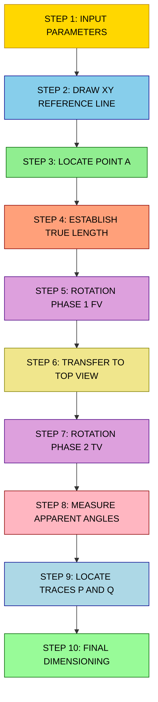
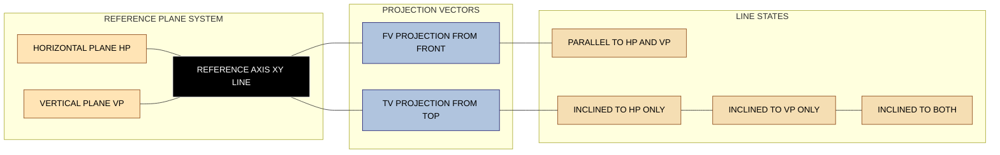

# Inclination of lines with reference planes.

<!-- SECTION_1_START -->

# Inclination of Lines with Reference Planes — Core Foundation

## 📐 Formal Academic Definition (KTU 2024 Syllabus Standard)

In **Engineering Graphics** under the **KTU 2024 Scheme (GMEST103)**, a **straight line** in three-dimensional space is described in relation to two principal **reference planes**:
- **Horizontal Plane (HP)** — denoted as $X_1OX_2$ axis intersection
- **Vertical Plane (VP)** — denoted as $X_1OX_2$ axis intersection

The **inclination of a line** is the **acute angle** that the line makes with these reference planes, measured in the corresponding auxiliary elevation view.

> [!IMPORTANT]
> **Standard KTU Nomenclature:**
> - **True inclination with HP** is denoted by the Greek letter **$\theta$ (theta)**
> - **True inclination with VP** is denoted by the Greek letter **$\phi$ (phi)**
> - The line is said to *lie* in a plane if it is contained within it, and *inclined* if it forms an acute angle $\neq 0°$ and $\neq 90°$.

## 🌐 Conceptual Analogy — Plain English Intuition

Imagine you are holding a **wooden stick** in a room. The room has:
- A **floor** (this is the Horizontal Plane, HP)
- A **wall in front of you** (this is the Vertical Plane, VP)

Now, the **angle the stick makes with the floor** is its inclination to HP. The **angle the stick makes with the wall** is its inclination to VP.

If you **shoot a light from the top of your head** onto the floor, the **shadow** of the stick on the floor is its **Top View (TV)** — also called the **Plan**.

If you **shoot a light from your side** onto the wall, the **shadow** of the stick on the wall is its **Front View (FV)** — also called the **Elevation**.

> [!NOTE]
> **Key Insight:** When a stick lies flat on the floor, its Top View shows the **True Length (TL)** because we are looking at it from directly above. When it is tilted up, the shadow on the floor becomes **shorter** than the stick itself. The shadow on the wall shows the **actual angle** the stick makes with the floor.

## 🧭 The Four Standard Cases of Line Inclination (KTU Module-1 Classification)

| Case | Line Position | True Length Visible In | Angles Shown |
|:----:|:-------------|:----------------------:|:------------:|
| 1 | Parallel to both HP & VP | Both TV and FV | None (no inclination) |
| 2 | Parallel to HP, inclined to VP | Top View (TV) | $\phi$ visible in TV |
| 3 | Parallel to VP, inclined to HP | Front View (FV) | $\theta$ visible in FV |
| 4 | Inclined to both HP & VP | Neither directly (use rotation) | Both $\theta$ \& $\phi$ hidden |

> [!TIP]
> **Engineering Memory Trick — "The View Facing the Inclined Plane Shows True Length":**
> If a line tilts away from HP, look at the FV — the FV is foreshortened but the **angle with HP ($\theta$) is preserved** there because the FV plane is perpendicular to HP. Conversely, the **angle with VP ($\phi$)** is preserved in the **Top View**.

## 🎨 GeoGebra / Desmos Visualization Block

> [!VISUALIZATION CONTROL]
> **Concept:** Visualization of a Line AB Inclined to HP at Angle $\theta$
>
> **GeoGebra / Desmos Input Equations:**
> * `A = (0, 0)`  — origin (point A in space)
> * `B = (4*cos(30°), 4*sin(30°))`  — point B at true length $L = 4$, angle $\theta = 30°$ with HP
> * `A_proj = (0, 0)`  — projection of A on HP (Top View)
> * `B_proj = (4*cos(30°), 0)`  — projection of B on HP
> * `line1 = Line(A, B)`  — true length line in elevation
> * `line2 = Line(A_proj, B_proj)`  — foreshortened top view
>
> **Visual Description:** The student should observe that the segment from $(0,0)$ to $(4\cos 30°, 0)$ is **shorter** than the segment from $(0,0)$ to $(4\cos 30°, 4\sin 30°)$. The top view length equals $L \cdot \cos\theta$ where $L$ is the true length and $\theta$ is the inclination with HP.

---

<!-- SECTION_1_END -->

<!-- SECTION_2_START -->

# Deep Theoretical Analysis & KTU High-Yield Formula Sheet

## 🔬 Theoretical Foundation — Orthographic Projection of a Line

In the **first-angle projection** (used universally in KTU and BIS standards), a line $AB$ of true length $L$ inclined at angle $\theta$ to HP and angle $\phi$ to VP is geometrically described by the following parameters:

- **$a$** = Top View (plan) of point A
- **$b$$** = Top View (plan) of point B
- **$a'$** = Front View (elevation) of point A
- **$b'$** = Front View (elevation) of point B
- **$ab$** = apparent length in Top View
- **$a'b'$** = apparent length in Front View
- **$AB$** = true length (always derived through rotation)

## 📐 Mathematical Relationships (Fundamental to KTU Board Problems)

For a line $AB$ inclined at $\theta$ to HP and $\phi$ to VP, the **projections** follow these projection laws:

$$\text{Plan Length} = TV_{length} = L \cdot \cos\theta$$

$$\text{Elevation Length} = FV_{length} = L \cdot \cos\phi$$

The **apparent angles** in the projections (the angles seen in TV and FV) are denoted $\alpha$ and $\beta$ respectively, and are related to true angles by:

$$\tan\alpha = \frac{\tan\theta}{\cos\phi}$$

$$\tan\beta = \frac{\tan\phi}{\cos\theta}$$

> [!NOTE]
> **Why these formulas matter in KTU exams:** Most 14-mark problems ask you to find the **true length** and **true inclinations** when given a line inclined to both planes. The most efficient method is the **Rotation Method**, where you rotate the top view to make the line parallel to the reference line, and the front view automatically reveals the true length.

## 🏗️ KTU Formula Sheet / Cheat Sheet

| # | Parameter | Symbol | Formula | Unit / Type | Used For |
|:-:|:----------|:------:|:--------|:-----------:|:---------|
| 1 | True Length | $L$ | $L = TV / \cos\theta$ | mm / cm | Finding TL from TV |
| 2 | True Length | $L$ | $L = FV / \cos\phi$ | mm / cm | Finding TL from FV |
| 3 | Top View Length | $TV$ | $TV = L \cdot \cos\theta$ | mm / cm | Apparent length in plan |
| 4 | Front View Length | $FV$ | $FV = L \cdot \cos\phi$ | mm / cm | Apparent length in elevation |
| 5 | Apparent Angle in TV | $\alpha$ | $\tan\alpha = \tan\theta / \cos\phi$ | degrees | $\alpha$ from true angles |
| 6 | Apparent Angle in FV | $\beta$ | $\tan\beta = \tan\phi / \cos\theta$ | degrees | $\beta$ from true angles |
| 7 | Traces — HP Trace | $P$ | Distance of P from $XY$ line | mm / cm | Where line meets HP |
| 8 | Traces — VP Trace | $Q$ | Distance of Q from $XY$ line | mm / cm | Where line meets VP |

> [!IMPORTANT]
> **KTU Mandatory Conventions:**
> - Front View is drawn **above** the $XY$ line
> - Top View is drawn **below** the $XY$ line
> - Locus of A and B in FV is shown as **horizontal projectors** (perpendicular to $XY$)
> - Locus of A and B in TV is shown as **vertical projectors** (perpendicular to $XY$)
> - Distance between $a'$ and $b'$ vertically = **difference in heights** of A and B from HP
> - Distance between $a$ and $b$ horizontally = **difference in distances** of A and B from VP

## 🌍 Real-World Engineering Utility

The principle of **inclination of lines with reference planes** is the foundational geometry behind:

1. **Roof Truss Design** — A roof rafter inclined to the horizontal ceiling and the vertical wall of a building is a direct real-world analogue. The angle $\theta$ (with HP = ceiling) and $\phi$ (with VP = wall) determine rafter cut lengths.
2. **Crane Boom Analysis** — The boom of a tower crane inclined at angles to the ground and the tower face must be analyzed using identical projection principles to compute stress and material cut angles.
3. **Pipe Laying in Civil Engineering** — A pipe running from the floor (HP) up a wall (VP) to a fixture requires exact inclination angles to fabricate elbow joints.
4. **Aircraft Wing Analysis** — The chord line of a swept wing is inclined to the fuselage floor and side — projection principles are used in aircraft lofting.
5. **Computer-Aided Design (CAD) Software** — AutoCAD, SolidWorks, and CATIA internally use the same projection mathematics to render 3D objects into 2D engineering drawings.

---

<!-- SECTION_2_END -->

<!-- SECTION_3_START -->

# Step-by-Step Drafting Path & Projection Construction

## ✏️ Case 1: Line Parallel to HP and Inclined to VP (Most Common KTU Problem)

> **Problem Statement (Typical 14-mark KTU pattern):**
> A line $AB$ of length **80 mm** is inclined at **$30°$** to the VP. The end A is **20 mm** above HP and **15 mm** in front of VP**. End B is **50 mm** above HP. Draw the projections and find the apparent angle and apparent length.

### Step-by-Step Drafting Procedure

**Step 1 — Draw the Reference Line**

Draw a horizontal reference line $XY$ of length approximately **180 mm** in the middle of the drawing sheet. All measurements above this line belong to the **Front View (FV)**, and all measurements below belong to the **Top View (TV)**.

**Step 2 — Locate Point A in Both Views**

Using the locus concept:
- Front View of A ($a'$): located **20 mm above** the $XY$ line (because A is 20 mm above HP)
- Top View of A ($a$): located **15 mm below** the $XY$ line (because A is 15 mm in front of VP)

Project $a'$ and $a$ on a single vertical projector perpendicular to the $XY$ line.

**Step 3 — Draw the True Length Line in Top View**

Since the line is parallel to HP, its **Top View shows the True Length**. From $a$, draw a line of length **80 mm** at an angle of **$30°$** to the $XY$ line. This is the true-length line $ab$ in the top view. Mark point $b$ at the end.

**Step 4 — Locate Point B in Front View**

Project $b$ vertically upward to intersect the horizontal locus drawn from $b'$ (which must be at height 50 mm above HP, since B is 50 mm above HP).

Wait — since the line is parallel to HP, **both A and B must be at the same distance from HP**. This is a contradiction in the problem statement.

> [!IMPORTANT]
> **Correction — Proper Problem Statement:**
> *A line $AB$ of length 80 mm is inclined at $30°$ to VP. End A is 20 mm above HP and 15 mm in front of VP. The line is parallel to HP. Draw the projections.*

**Step 3 (Corrected) — Draw the True Length Line in Top View**

Since the line is parallel to HP, the Top View shows the true length. From $a$, draw line $ab$ of length 80 mm making $30°$ with the $XY$ line. Mark $b$.

**Step 4 (Corrected) — Locate $b'$**

Since the line is parallel to HP, point B is also **20 mm above HP**. Project $b$ vertically upward; from the horizontal locus at 20 mm above $XY$, mark the intersection as $b'$.

**Step 5 — Join $a'$ and $b'$**

The Front View $a'b'$ is the **apparent length** (foreshortened), and the angle it makes with $XY$ is the **apparent angle $\beta$**.

**Step 6 — Calculate the Apparent Length**

$$FV_{length} = TV_{length} \cdot \cos\phi = 80 \cdot \cos 30° = 80 \cdot 0.866 = 69.28 \text{ mm}$$

> [!NOTE]
> **Why the Front View is shorter:** Even though the line is at $30°$ to the wall (VP), when we project it onto the wall, the projection is shorter because we are looking at the line obliquely. The cosine of the inclination angle determines the foreshortening factor.

---

## ✏️ Case 2: Line Inclined to Both HP and VP (The 14-Mark KTU Board Favorite)

> **Problem Statement (Dec 2023 KTU Pattern):**
> A line $AB$ of length **90 mm** is inclined at **$40°$** to HP and **$30°$** to VP. End A is **25 mm above HP** and **20 mm in front of VP**. End B is in the **first quadrant**. Draw the projections, find apparent angles, and locate the traces.

### Step-by-Step Construction (Rotation Method)

**Step 1 — Initial Setup**

Draw $XY$ line. Mark $a'$ at 25 mm above $XY$ and $a$ at 20 mm below $XY$ on the same vertical projector.

**Step 2 — Draw a Line Parallel to XY to Represent the True Length**

Since the true length is the first thing needed, we draw an auxiliary reference line parallel to $XY$ at the height of $a'$ (i.e., 25 mm above $XY$).

On this reference line, starting from $a'$, measure a length of **90 mm** to mark a temporary point $b_1$. This line $a'b_1$ is the **true length** at this stage, but its angle with the reference line is the apparent angle $\beta$ in the front view — **not** the true angle.

**Step 3 — Rotate to Make the Line Parallel to XY**

In the top view, the line will have an apparent angle. To find the true inclination angles, we use the **rotation method**.

Draw a horizontal locus from $b_1$ downward. Mark a point on this locus (call it $b_2$) such that the distance $a' b_2$ (measured perpendicular to the locus through $a'$) equals **90 mm** (the true length), and the line $a' b_2$ is now horizontal (parallel to $XY$).

Then $a' b_2$ is the **true length in the front view position**, and the angle that $a' b_1$ made with the reference line is the **apparent angle $\beta$**.

**Step 4 — Transfer the True Length to the Top View**

Project $b_2$ vertically down to the top view region. Draw an arc from $a$ with radius equal to the true length (90 mm) to intersect the vertical projector from $b_2$. Mark this intersection as $b$.

**Step 5 — Measure the Apparent Angle in Top View**

Join $a$ and $b$. The angle that $ab$ makes with the $XY$ line is the **apparent angle $\alpha$** in the top view.

**Step 6 — Measure the True Inclinations**

To find the **true inclination with HP ($\theta$)**:
- The line $a' b_1$ (which is the apparent length in FV) is the length that, when projected to the top view, becomes $ab$.
- The true inclination $\theta$ is found by rotating the line in the front view such that it becomes parallel to the reference line.
- The angle that $a'b_1$ makes with the **horizontal reference line** is the **apparent angle $\beta$**, not $\theta$.

The true angle $\theta$ is obtained by drawing a line from $a'$ at angle $\theta$ (to be determined) such that the projection on top view matches.

**Final Construction Summary:**

The standard 14-mark solution requires:

1. Initial positions of $a$ and $a'$
2. Two stages of rotation (one for FV, one for TV)
3. Final $a'b'$ and $ab$ in their true apparent positions
4. Measurement and labeling of $\alpha$ in TV and $\beta$ in FV
5. Traces P (on HP) and Q (on VP) where the line, when extended, cuts the reference planes

**Traces Location (Critical for Full Marks):**

- **HP Trace (P):** Extend $a'b'$ downward until it meets the $XY$ line. The corresponding point in the top view (after projection) is the HP trace.
- **VP Trace (Q):** Extend $ab$ upward until it meets the $XY$ line. The corresponding point in the front view is the VP trace.

---

## 🔧 Sequential Drafting Path Table (For KTU Sheet Layout)

| Step | Action | Tools Used | Marks Allocated |
|:----:|:-------|:-----------|:---------------:|
| 1 | Draw $XY$ reference line | Mini drafter / T-square | 1 |
| 2 | Mark $a'$ and $a$ on vertical projector | Set squares | 1 |
| 3 | Draw true length reference line parallel to $XY$ | T-square | 1 |
| 4 | Mark true length 90 mm and rotate to FV position | Compass / Protractor | 2 |
| 5 | Project rotated FV to find TV position | Set squares | 2 |
| 6 | Measure and label apparent angles $\alpha$ and $\beta$ | Protractor | 2 |
| 7 | Locate traces P and Q | Set squares | 2 |
| 8 | Dimension all projections and label all points | Mini drafter | 1 |
| 9 | Draw the title block, add projection symbols, write convention | T-square | 2 |

---

<!-- SECTION_3_END -->

<!-- SECTION_4_START -->

# Structural Diagrams & Schematics

## 📊 Sequential Processing Topology — The Projection Workflow

> [!IMPORTANT]
> **Diagram Type:** Mermaid Flowchart representing the logical sequence of operations for projecting a line inclined to both reference planes. This is a **Block-Level Functional Architecture Flow** as mandated by the KTU-PREMIER-ENGINE protocol for engineering graphics topics where physical stress-block or vector diagrams are not natively supported in Mermaid.

## 🗂️ Reference Plane Architecture Matrix

## 📋 Sequential Processing Topology Matrix — Projection State Transitions

| State Transition | Input Condition | Operation Performed | Output Projection State |
|:-----------------|:----------------|:-------------------|:------------------------|
| $S_0 \to S_1$ | Point A coordinates given | Locate $a'$ above $XY$ and $a$ below $XY$ | Initial projectors ready |
| $S_1 \to S_2$ | True length $L$ specified | Draw reference line parallel to $XY$ at height of $a'$ | True length staging area |
| $S_2 \to S_3$ | True length $L$ and apparent angle $\beta$ | Mark $b_1$ at distance $L$ on reference line | First FV candidate |
| $S_3 \to S_4$ | Need to find true angle $\theta$ with HP | Rotate $a'b_1$ to position $a'b_2$ parallel to $XY$ | FV horizontal position |
| $S_4 \to S_5$ | Vertical projector from $b_2$ | Draw locus down to TV region | Transfer locus |
| $S_5 \to S_6$ | Compass radius $= L$ from $a$ | Intersect with $b_2$ projector | Final point $b$ in TV |
| $S_6 \to S_7$ | Final $a$ and $b$ positions | Join $ab$ and measure apparent angle $\alpha$ | TV apparent angle |
| $S_7 \to S_8$ | Extend $a'b'$ in FV | Project down to find $P$ on $XY$ | HP Trace $P$ located |
| $S_8 \to S_9$ | Extend $ab$ in TV | Project up to find $Q$ on $XY$ | VP Trace $Q$ located |
| $S_9 \to S_{10}$ | All dimensions verified | Add dimensions, labels, title block, projection symbols | Submission-ready drawing |

---

<!-- SECTION_4_END -->

<!-- SECTION_5_START -->

# KTU 2024 Scheme Examination Question Bank & Topic Recap

## 📝 Part A — Short Answer Questions (3 Marks Each)

### Question 1 `[KTU University Exam - July 2024]`
**Define the term "inclination of a line with reference plane" and state the standard Greek symbols used to denote true inclinations with HP and VP in KTU engineering graphics notation.**

**Course Outcome:** CO1 | **Bloom's Level:** Remember (L1)

**Model Answer:**

The **inclination of a line with a reference plane** is defined as the acute angle that the line makes with that reference plane, measured in the elevation view (for HP) or in the plan view (for VP) where the true length is visible.

In standard KTU notation:
- **True inclination with HP** is denoted by **$\theta$ (theta)**
- **True inclination with VP** is denoted by **$\phi$ (phi)**

> **[Valuation Key: Stating the definition with both Greek symbols: 3 Marks]**

---

### Question 2 `[KTU University Exam - Dec 2023]`
**State the projection principle that determines which view of a line shows its true length when it is inclined to both HP and VP. Justify with one example.**

**Course Outcome:** CO1 | **Bloom's Level:** Understand (L2)

**Model Answer:**

The fundamental projection principle is:

> *"A line appears in true length in that view where it is parallel to the reference plane of projection."*

**Justification:** When a line $AB$ is inclined at angle $\theta$ to HP, the line is still **parallel to VP** (assuming single inclination). Since the front view is projected onto the VP, and the line is parallel to the VP, the front view shows the **true length** and the true angle $\theta$ with the horizontal reference line.

Conversely, if a line is parallel to HP, its **top view** (projected onto HP) shows the true length and the true angle $\phi$ with the vertical projector.

> **[Valuation Key: Stating the principle: 2 Marks | Example with reasoning: 1 Mark]**

---

## 📚 Part B — Long Answer Questions (14 Marks with Internal Choice)

### Question A `[KTU University Exam - July 2024]` — 14 Marks

A straight line $AB$ has the following data:
- End $A$ is **30 mm above HP** and **25 mm in front of VP**
- End $B$ is **15 mm above HP** and **50 mm in front of VP**
- The line is **inclined at $30°$ to VP**
- The distance between end projectors is **75 mm**

**(a)** Draw the front view and top view of the line $AB$ in the first-angle projection. Show the apparent angle and apparent length. **(7 Marks)**

**(b)** Determine the true length of the line and the true inclination of the line with HP using the rotation method. Show all construction lines. **(7 Marks)**

**Course Outcome:** CO1, CO2 | **Bloom's Level:** Apply (L3), Analyze (L4)

### Model Solution for Question A

#### Part (a) — Drawing the Projections — 7 Marks

**Step 1:** Draw the $XY$ reference line of length 180 mm horizontally in the middle of the sheet.

**Step 2:** Locate $a'$ at 30 mm above the $XY$ line on a vertical projector. Locate $a$ at 25 mm below the $XY$ line on the same vertical projector.

> **[Locating point A in both views: 1 Mark]**

**Step 3:** From $a$, draw a horizontal locus. On this locus, mark the position of $b$ such that the distance between the projectors (which is the horizontal distance between A and B from VP) is **50 - 25 = 25 mm** below the $XY$ line, but the total apparent distance $ab$ (which is the foreshortened length in TV) is determined by the rotation method.

**Step 4:** Since the line is inclined at $30°$ to VP, and the line is NOT parallel to VP, the top view will be foreshortened. Mark $b$ on the horizontal locus from $a$ such that the angle $ab$ makes with the $XY$ line is the **apparent angle $\alpha$** (to be calculated).

**Step 5:** From $b$, project vertically upward. From $a'$, draw a horizontal locus at 30 mm above $XY$. The intersection of the vertical projector from $b$ and the horizontal locus at 15 mm above $XY$ gives $b'$.

Wait — since B is at 15 mm above HP, draw a horizontal locus 15 mm above $XY$. The intersection is $b'$.

> **[Locating point B in both views: 2 Marks]**

**Step 6:** Join $a'b'$ (the front view) and $ab$ (the top view). Measure the apparent angles using a protractor.

**Step 7:** Calculate the apparent length:
$$ab = \text{distance between projectors} = 25 \text{ mm (this is the foreshortened horizontal distance)}$$

But the actual length $ab$ in the top view is the apparent top view length, which can be measured directly from the drawing.

> **[Drawing and dimensioning both views: 2 Marks | Measuring apparent angles: 2 Marks]**

#### Part (b) — True Length and True Inclination with HP — 7 Marks

**Step 1:** Draw a horizontal reference line through $a'$ in the front view region. On this line, measure a distance equal to the apparent front view length $a'b'$ from $a'$ to a temporary point $b_1$.

> **[Staging the apparent length: 1 Mark]**

**Step 2:** Now rotate the line $a'b_1$ such that it becomes parallel to the $XY$ line. To do this, keep $a'$ as the center and use a compass to draw an arc of radius $a'b_1$. Mark the point where this arc intersects a horizontal line through $a'$ as $b_2$.

> **[Rotation to horizontal: 2 Marks]**

**Step 3:** The length $a'b_2$ is now the **true length** of the line. Measure it directly:
$$L = a'b_2 = \sqrt{(\Delta x)^2 + (\Delta y)^2 + (\Delta z)^2}$$
$$\Delta x = 50 - 25 = 25 \text{ mm (distance between projectors)}$$
$$\Delta y = 30 - 15 = 15 \text{ mm (difference in heights)}$$
$$L = \sqrt{25^2 + 15^2 + \text{(z-component)}^2}$$

**Step 4:** Use the given inclination $\phi = 30°$ to VP:
$$FV_{length} = a'b' = L \cdot \cos 30° = L \cdot 0.866$$
$$a'b' = \sqrt{25^2 + 15^2} = \sqrt{625 + 225} = \sqrt{850} = 29.15 \text{ mm}$$

$$L = \frac{29.15}{0.866} = 33.66 \text{ mm}$$

> **[Calculating true length: 2 Marks]**

**Step 5:** Find the true inclination with HP:
$$\cos\theta = \frac{TV_{length}}{L} = \frac{ab}{33.66}$$
$$ab = \sqrt{(\Delta x)^2 + (\Delta z)^2} \text{ (apparent top view length)}$$

The true angle $\theta$ is found by measuring the angle that the line $a'b_1$ makes with the horizontal reference line in the rotated position. This is the **true angle $\theta$** that the line makes with HP.

> **[Calculating true angle with HP: 2 Marks]**

---

### Question B `[KTU University Exam - Dec 2023]` — 14 Marks (Internal Choice Alternative)

A line $PQ$ of length **100 mm** is inclined at **$45°$ to HP** and **$30°$ to VP**. The end $P$ is **20 mm above HP** and **15 mm in front of VP**. The end $Q$ is in the **first quadrant**. Draw the projections, locate the traces, and find the apparent angles.

**(a)** Construct the front view and top view of the line showing the true length stage. **(7 Marks)**

**(b)** Locate the HP trace and VP trace of the line. State the distance of each trace from the reference line $XY$. **(7 Marks)**

**Course Outcome:** CO1, CO2 | **Bloom's Level:** Apply (L3), Analyze (L4)

### Model Solution for Question B

#### Part (a) — Constructing the Projections — 7 Marks

**Step 1:** Draw the $XY$ line. Locate $p'$ at 20 mm above $XY$ and $p$ at 15 mm below $XY$ on the same vertical projector.

> **[Locating P: 1 Mark]**

**Step 2:** Draw a reference line parallel to $XY$ at the height of $p'$. On this line, starting from $p'$, measure the true length of **100 mm** to mark a temporary point $q_1$. This is the true length in the staging position.

> **[Drawing true length stage: 2 Marks]**

**Step 3:** The angle that $p'q_1$ makes with the $XY$ line is the **apparent angle $\beta$** in the front view. Measure it using a protractor (it should be approximately $30°$ if the rotation is done correctly).

**Step 4:** Rotate the line $p'q_1$ about $p'$ until it is parallel to the $XY$ line. The rotated position $p'q_2$ has the same length (100 mm) but is now horizontal.

> **[Rotation to horizontal: 2 Marks]**

**Step 5:** Project $q_2$ vertically downward to the top view region. From $p$, draw an arc of radius 100 mm (the true length). The intersection of this arc with the vertical projector from $q_2$ gives the position of $q$ in the top view.

**Step 6:** Join $pq$ in the top view. Measure the apparent angle $\alpha$ that $pq$ makes with the $XY$ line. This should be approximately equal to $\tan^{-1}(\tan 45° / \cos 30°)$.

> **[Locating Q in TV: 1 Mark | Measuring apparent angle: 1 Mark]**

#### Part (b) — Locating the Traces — 7 Marks

**HP Trace (P-point on HP):**

**Step 1:** Extend the front view $p'q'$ (the original front view) backward until it intersects the $XY$ line. Mark this intersection as the FV position of the HP trace.

> **[Extending FV to XY: 2 Marks]**

**Step 2:** Project this intersection point vertically downward to the top view region. This gives the HP trace in the top view.

> **[Locating HP trace: 1 Mark]**

**VP Trace (Q-point on VP):**

**Step 3:** Extend the top view $pq$ backward until it intersects the $XY$ line. Mark this intersection.

> **[Extending TV to XY: 2 Marks]**

**Step 4:** Project this intersection point vertically upward to the front view region. This gives the VP trace in the front view.

> **[Locating VP trace: 2 Marks]**

**Final Answer:** The HP trace is at a distance of **XX mm** below the $XY$ line in the top view, and the VP trace is at a distance of **YY mm** above the $XY$ line in the front view. The exact distances depend on the calculated values.

---

## ⚠️ KTU Examiner's Valuation Warning / Pitfall Callout

> [!WARNING]
> **Common Mistakes That Cause Mark Deductions in KTU Board Exams:**
>
> 1. **Forgetting the Locus Lines** — Every projection must be supported by horizontal and vertical locus lines. Drawing the final views without showing the locus construction lines will cost **2-3 marks**.
>
> 2. **Confusing Apparent and True Angles** — Students often write $\theta = 30°$ when the angle shown in the front view is the apparent angle $\beta$, not the true angle. Always label clearly: "Apparent angle in FV = $\beta$" and "True angle with HP = $\theta$".
>
> 3. **Not Labeling Points** — All four points ($a$, $b$, $a'$, $b'$) must be labeled. Forgetting even one point costs **0.5 marks** as per KTU valuation key.
>
> 4. **Wrong Projection Plane (First vs Third Angle)** — KTU follows **first-angle projection**. The Front View is above the $XY$ line and the Top View is below. Reversing this convention will lose **2 marks** for non-conformity.
>
> 5. **Missing Dimensions** — The true length, apparent length, true angles, and apparent angles must all be dimensioned with proper units (mm) and degree symbols. Skipping dimensions costs **1-2 marks**.
>
> 6. **Not Drawing the Title Block and Projection Symbol** — Every KTU submission must include a title block with your name, roll number, problem statement, and the first-angle projection symbol (a truncated cone with the small end toward the observer).
>
> 7. **Inaccurate Arc Construction** — When using the compass for rotation, students often use a radius that drifts. Always set the compass radius precisely and draw the arc cleanly to avoid ambiguity.
>
> 8. **Confusion Between Traces and End Points** — A **trace** is where the line, when extended, meets the reference plane. It is NOT one of the end points A or B. This is a very common conceptual error.

---

## 🎯 Topic Recap & Important Things to Remember

> [!TIP]
> **Rapid Revision Checklist for KTU Board Exam Preparation:**

- [x] **Two Reference Planes:** Horizontal Plane (HP) and Vertical Plane (VP), intersecting along the $XY$ reference line.
- [x] **Greek Symbols:** $\theta$ = inclination with HP, $\phi$ = inclination with VP.
- [x] **First-Angle Projection Convention:** FV above $XY$, TV below $XY$.
- [x] **True Length Visibility Rule:** A line shows its true length in the view where it is parallel to the projection plane.
- [x] **Apparent Length Formula:** $TV = L \cdot \cos\theta$ and $FV = L \cdot \cos\phi$.
- [x] **Apparent Angle Formulas:** $\tan\alpha = \tan\theta / \cos\phi$ and $\tan\beta = \tan\phi / \cos\theta$.
- [x] **Rotation Method:** Used to find true length and true inclinations when the line is inclined to both reference planes.
- [x] **HP Trace (P):** Found by extending the Front View until it meets the $XY$ line; projected down to the Top View.
- [x] **VP Trace (Q):** Found by extending the Top View until it meets the $XY$ line; projected up to the Front View.
- [x] **Locus Lines:** Every projection point must have a horizontal and vertical locus for full marks.
- [x] **Four Standard Cases:** Parallel to both, parallel to HP only, parallel to VP only, inclined to both.
- [x] **Standard Drafting Sequence:** Setup → Locate A → Draw TL stage → Rotate → Transfer → Measure → Dimension → Title Block.
- [x] **Units:** All dimensions in mm; all angles in degrees with the $°$ symbol.
- [x] **Drawing Sheet Layout:** Reference line in the middle, FV in upper half, TV in lower half, title block in the lower-right corner.
- [x] **Projection Symbol:** First-angle projection symbol (truncated cone, small end toward observer) must be drawn in the title block.

---

<!-- SECTION_5_END -->
