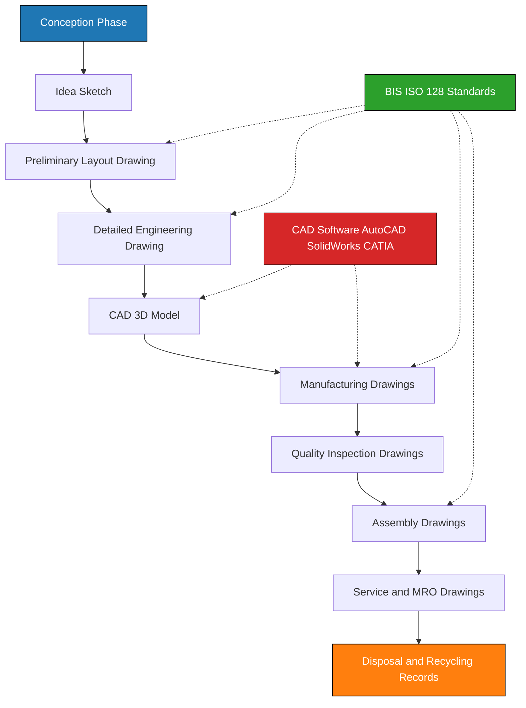
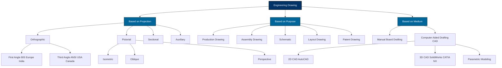
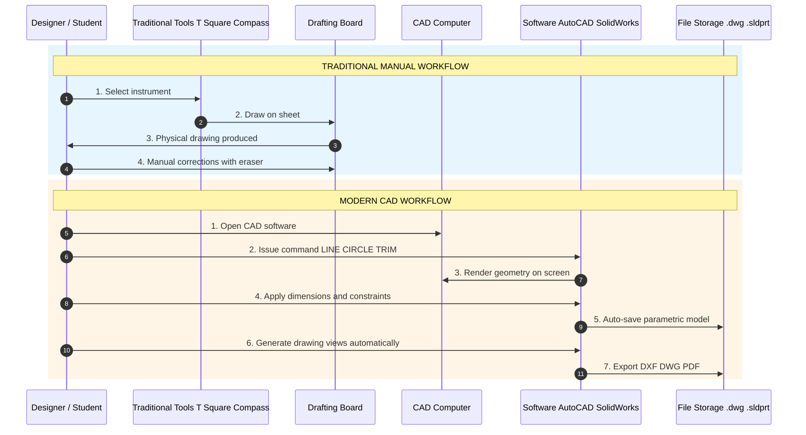
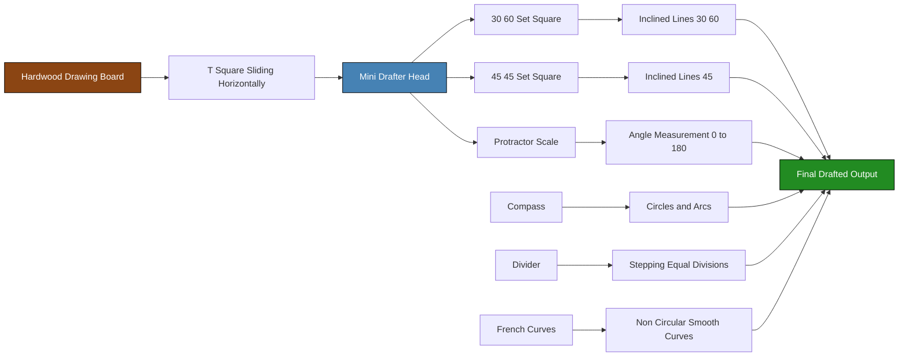

# Introduction: Relevance of technical drawing in engineering field.

<!-- SECTION_1_START -->

# 1. Core Technical Definition & Intuitive Overview

## 1.1 Formal Definition (KTU 2024 Syllabus Terminology)

> [!IMPORTANT]
> **Engineering Drawing (Technical Drawing):** A formal, standardized, universally accepted graphical language used by engineers to **convey precise geometric, dimensional, and functional information** about an object, component, system, or structure. It is recognized as the *lingua franca* (universal language) of engineers across all disciplines — Mechanical, Civil, Electrical, Electronics, and Computer Science.

According to the **Bureau of Indian Standards (BIS SP 46:2003)** and the **International Organization for Standardization (ISO 128)**, technical drawings must follow strict conventions of:
- **Line types** (continuous, dashed, chain, etc.)
- **Projection methods** (orthographic, isometric, perspective)
- **Dimensioning and tolerancing** (ASME Y14.5 / ISO 129)
- **Scales** (enlargement, full-size, reduction)

> [!NOTE]
> **Why "Technical"?** Unlike artistic drawing, technical drawing has **zero ambiguity**. Every line, symbol, and dimension represents an exact engineering instruction interpreted identically worldwide.

---

## 1.2 Intuitive Analogy (Plain-English Conceptualization)

Imagine you want a tailor in another country to stitch your shirt perfectly without ever seeing you. What do you send?

👉 **A picture** is artistic — open to interpretation.  
👉 **A technical drawing** is the engineering equivalent of a *recipe* + *blueprint*: it specifies the cloth length, sleeve diameter, button positions — all in numbers and standardized symbols.

| Mode of Communication | Field | Level of Precision |
|---|---|---|
| Spoken Language | Humans | Ambiguous |
| Musical Notation | Musicians | Semi-strict |
| **Engineering Drawing** | **Engineers** | **Mathematically Precise** |

> [!TIP]
> **The Core Analogy:** A technical drawing is to an engineer what a *DNA sequence* is to a biologist — it contains **complete manufacturing information** of the organism (product).

---

## 1.3 Physical Constants & Standard Metrics in Drafting

> [!IMPORTANT]
> **Standard Reference Values Every KTU Student Must Memorize:**
> - **Standard Drawing Sheet Sizes (BIS SP 46):** A0 ($\text{841} \times \text{1189}\ \text{mm}^2$), A1, A2, A3, A4, A5
> - **Title Block Location:** Bottom-Right corner of every sheet
> - **Default Scale Notation (BIS):** Scale = Drawing Length : Actual Length
> - **Standard Lettering Height (BIS):** $\text{7 mm}$ for titles, $\text{5 mm}$ for sub-titles, $\text{3.5 mm}$ for body text
> - **Recommended Pencil Grades:** **H** (construction lines), **HB** (visible lines), **2H** (dimensioning), **4H–6H** (fine details)

---

## 1.4 Visual & Conceptual Mapping

> [!VISUALIZATION CONTROL]
> **Concept:** Conceptual mapping of where "Engineering Drawing" sits in the engineering lifecycle.
> **GeoGebra / Desmos Input (Conceptual Graph):**
> * `x-axis` = Engineering Lifecycle Stages
> * `y-axis` = Information Density (Information Density grows from 0 to 10)
> **Visual Description:** A monotonically increasing curve where the contribution of *Engineering Drawing* dominates the *y-axis* between the **Design** and **Manufacturing** phases, then tapers at *Assembly* and *Quality Control*.

---

## 1.5 Learning Outcomes for This Topic (KTU Mapped)

> [!NOTE]
> **Module 1 — Course Outcomes Aligned:**
> - **CO1:** Understand the relevance, scope, and evolution of engineering graphics.
> - **CO2:** Identify drawing instruments, BIS conventions, and standard sheet layouts.
> - **CO3:** Recognize the role of CAD in modern product development.

<!-- SECTION_1_END -->

<!-- SECTION_2_START -->

# 2. Deep Theoretical Analysis & KTU High-Yield Formula Sheet

## 2.1 Why is Engineering Drawing Indispensable?

Engineering drawing is the **bridge between conception and realization**. Every physical artifact you see — from a microchip to a skyscraper — began as a technical drawing (or a CAD model derived from one).

### 2.1.1 The Five Pillars of Technical Drawing's Relevance

1. **Universal Communication** — Engineers of different languages, cultures, and disciplines interpret a drawing identically because of **ISO / BIS standards**.
2. **Manufacturing Accuracy** — A workshop cannot produce a part without a drawing; it acts as the *legal and operational contract* between designer and fabricator.
3. **Legal & Patent Documentation** — Technical drawings are admissible as **intellectual property evidence** in patent filings (Patent Act, India).
4. **Quality Assurance & Inspection** — Inspection departments compare the manufactured product against the drawing using **GD&T (Geometric Dimensioning and Tolerancing)**.
5. **Lifecycle Management** — Drawings support **maintenance, repair, overhaul (MRO)** activities for the entire life of a product (often 20–30 years).

> [!IMPORTANT]
> **Historical Note (KTU Board Favourite):**
> The modern engineering drawing language was formalized by **Gaspard Monge (French mathematician, 1746–1818)**, who is considered the *"Father of Descriptive Geometry"*. His work, *"Géométrie descriptive"* (1795), established **orthographic projection** — the foundation of all modern technical drawing.

---

## 2.2 Classification of Engineering Drawings

### 2.2.1 Based on Projection Method

| Category | Sub-Type | Application |
|---|---|---|
| **Orthographic Projections** | First-Angle (BIS/Europe) | Standard in India, UK, Europe |
|  | Third-Angle (ANSI/USA) | Standard in USA, Canada |
| **Pictorial Projections** | Isometric | Most common 3D visualization |
|  | Oblique (Cavalier, Cabinet) | Architecture, illustrations |
|  | Perspective | Architectural renderings |
| **Auxiliary Projections** | Auxiliary Views | True shape of inclined surfaces |
| **Sectional Views** | Full Section, Half Section | Internal feature revelation |

> [!TIP]
> **KTU Memory Hook:** *"**I** saw a **P**icture **O**n a **C**omputer"* → **I**sometric, **P**erspective, **O**blique, **C**abinet.

### 2.2.2 Based on Purpose (Industry Categories)

| Drawing Type | Industry Use | Key Feature |
|---|---|---|
| **Working / Production Drawing** | Manufacturing | Full dimensions, tolerances, BOM |
| **Assembly Drawing** | Workshops | Shows how parts fit together |
| **Part / Component Drawing** | Fabrication floor | Single part details |
| **Schematic Drawing** | Electrical/Electronics | Symbols-based, not to scale |
| **Layout / Plant Drawing** | Civil / Architecture | Floor plans, site plans |
| **Patent Drawing** | IP / Legal | Black-line, numbered, minimal text |
| **Exploded View** | Service manuals | Shows disassembly sequence |
| **Piping & Instrumentation Diagram (P&ID)** | Process industries | Process flow + control |

---

## 2.3 Principles of Good Technical Drawing

A technical drawing must satisfy the **6 Golden Principles**:

1. **Clarity** — No overlapping lines; no ambiguous features.
2. **Completeness** — All dimensions, tolerances, materials, surface finishes specified.
3. **Correctness** — Strict adherence to **projection rules**.
4. **Conciseness** — Avoid unnecessary detail on a single view.
5. **Consistency** — Uniform line weights, lettering style, and scale.
6. **Compliance** — Adherence to **BIS / ISO / ASME** standards.

> [!NOTE]
> **The 6C Principle** is a frequently asked 3-mark question in KTU board exams.

---

## 2.4 KTU Formula & Notation Cheat Sheet (Drawing Standards)

| Parameter | Standard Formula / Value | Unit / Note |
|---|---|---|
| Drawing Sheet A0 area | $A_0 = 841 \times 1189$ | $\text{mm}^2$ |
| Sheet area ratio | $A_{n-1} = 2 \times A_n$ | Each successive sheet halves area |
| Scale definition | $\text{Scale} = \dfrac{L_{\text{drawing}}}{L_{\text{actual}}}$ | Dimensionless ratio |
| Reduced scale (e.g., 1:5) | $L_{\text{actual}} = 5 \times L_{\text{drawing}}$ | For larger objects |
| Enlarged scale (e.g., 5:1) | $L_{\text{actual}} = \dfrac{L_{\text{drawing}}}{5}$ | For small components |
| Lettering height (BIS) | $h = 3.5\ \text{mm}$ (body), $7\ \text{mm}$ (title) | Uppercase preferred |
| Isometric projection angle | $\theta = 30^{\circ}$ from horizontal | Both axes |
| True length vs. isometric | $L_{\text{iso}} = L_{\text{true}} \times \cos(35.264^{\circ}) \approx 0.816\,L$ | Reduction factor |

> [!WARNING]
> **Markdown Table Rule Reminder:** In the above table, all mathematical "divides" or ratios use the **LaTeX fraction `\dfrac{}`** notation — *never* the vertical pipe symbol `|`, since it breaks table rendering.

---

## 2.5 Real-World Engineering Utility (Industry Mapping)

| Engineering Domain | Role of Technical Drawing |
|---|---|
| **Mechanical Engineering** | Gears, engine parts, machine tools, jigs & fixtures |
| **Civil Engineering** | Building plans, structural drawings, reinforcement detailing |
| **Electrical Engineering** | Circuit schematics, wiring diagrams, panel layouts |
| **Electronics & VLSI** | PCB layout, schematic capture, package drawings |
| **Aerospace** | Aircraft component drawings, assembly tolerances in microns |
| **Biomedical** | Prosthetic design, surgical implant CAD models |
| **Computer-Aided Design (CAD)** | Parametric modeling, FEA input, CAM toolpaths |
| **Reverse Engineering** | Converting physical objects to editable CAD models |

<!-- SECTION_2_END -->

<!-- SECTION_3_START -->

# 3. Step-by-Step Derivations & Implementation Matrix

## 3.1 Analytical Derivation: The Isometric Reduction Factor

When we view a cube of side $L$ in **isometric projection**, each edge appears foreshortened because the projection direction is not perpendicular to the edge face. We must derive the **isometric scale factor** rigorously.

### Step 1 — Setup the Geometry

Consider a unit cube placed with its corner at the origin. Its three principal edges lie along the unit vectors:
- $\vec{e}_1 = (1,\,0,\,0)$
- $\vec{e}_2 = (0,\,1,\,0)$
- $\vec{e}_3 = (0,\,0,\,1)$

### Step 2 — Define the Isometric Viewing Direction

In isometric projection, the viewing direction vector $\vec{v}$ is equally inclined to all three principal axes. The direction is:

$$
\vec{v} = \frac{1}{\sqrt{3}}\,(1,\,1,\,1)
$$

The **angle $\alpha$** between $\vec{v}$ and any principal axis is therefore:

$$
\cos\alpha = \vec{v} \cdot \vec{e}_1 = \frac{1}{\sqrt{3}}
$$

### Step 3 — Compute the Angle

$$
\alpha = \cos^{-1}\!\left(\frac{1}{\sqrt{3}}\right) = 35.264^{\circ}
$$

### Step 4 — Compute the Apparent Length

The apparent (foreshortened) length $L_{\text{iso}}$ of an edge of true length $L$ when projected onto the picture plane is:

$$
L_{\text{iso}} = L \times \cos\alpha
$$

Substituting $\cos\alpha = \dfrac{1}{\sqrt{3}}$:

$$
L_{\text{iso}} = \frac{L}{\sqrt{3}} \approx 0.8165\,L
$$

### Step 5 — Final Simplified Isometric Scale

$$
\boxed{\text{Isometric Scale} = 0.8165 \approx 0.816}
$$

This is precisely why **BIS permits two isometric scales**:
- **True Isometric Scale** = $0.816$ (mathematically correct)
- **Isometric Projection Scale** = $1.0$ (engineers enlarge by factor $\dfrac{1}{0.8165} \approx 1.2245$ to make measurements easy on the drawing sheet)

> [!IMPORTANT]
> **Conclusion:** The standard "isometric scale" used on a drafting board is a **stretched scale** where each division equals $\dfrac{1}{0.8165} \approx 1.2245$ true units. KTU board problems frequently ask: *"Construct the isometric scale."*

---

## 3.2 Step-by-Step CAD Implementation (Python Prototype)

The following Python code demonstrates the **isometric transformation** applied to a 3D cube and projects it onto a 2D plane — a foundational concept behind every CAD engine.

```python
import numpy as np
import matplotlib.pyplot as plt
from mpl_toolkits.mplot3d.art3d import Poly3DCollection

def isometric_projection(points_3d: np.ndarray) -> np.ndarray:
    """
    Apply 30-degree isometric projection to a set of 3D points.
    
    Parameters
    ----------
    points_3d : np.ndarray of shape (N, 3)
        Array of 3D coordinates (x, y, z).
    
    Returns
    -------
    np.ndarray of shape (N, 2)
        2D projected coordinates (u, v) on the drawing plane.
    """
    # Standard isometric projection matrix (BIS convention)
    # u-axis is rotated 30 deg, v-axis is rotated 150 deg from x-axis
    cos30 = np.cos(np.deg2rad(30))
    sin30 = np.sin(np.deg2rad(30))
    
    projection_matrix = np.array([
        [cos30,  -cos30,  0.0],
        [ sin30,   sin30, -1.0]
    ])
    
    return points_3d @ projection_matrix.T


def draw_isometric_cube(side_length: float = 1.0) -> None:
    """Visualize a 3D cube and its isometric projection side by side."""
    L = side_length
    # Define 8 cube vertices
    vertices_3d = np.array([
        [0, 0, 0], [L, 0, 0], [L, L, 0], [0, L, 0],   # bottom face
        [0, 0, L], [L, 0, L], [L, L, L], [0, L, L]    # top face
    ], dtype=float)
    
    # Define 12 edges of the cube (vertex index pairs)
    edges = [
        (0,1), (1,2), (2,3), (3,0),   # bottom square
        (4,5), (5,6), (6,7), (7,4),   # top square
        (0,4), (1,5), (2,6), (3,7)    # vertical edges
    ]
    
    # Compute isometric projection
    projected_2d = isometric_projection(vertices_3d)
    
    # Plot side by side
    fig, (ax1, ax2) = plt.subplots(1, 2, figsize=(12, 6))
    
    # Subplot 1: 3D Cube (true view)
    ax1 = fig.add_subplot(1, 2, 1, projection='3d')
    for edge in edges:
        p1, p2 = vertices_3d[edge[0]], vertices_3d[edge[1]]
        ax1.plot3D(*zip(p1, p2), color='navy', linewidth=2)
    ax1.set_title("3D Cube (True View)", fontsize=12, fontweight='bold')
    ax1.set_xlabel("X"); ax1.set_ylabel("Y"); ax1.set_zlabel("Z")
    
    # Subplot 2: Isometric Projection
    for edge in edges:
        p1, p2 = projected_2d[edge[0]], projected_2d[edge[1]]
        ax2.plot([p1[0], p2[0]], [p1[1], p2[1]], color='crimson', linewidth=2)
    ax2.set_title("Isometric Projection (2D)", fontsize=12, fontweight='bold')
    ax2.set_aspect('equal')
    ax2.grid(True, linestyle='--', alpha=0.5)
    ax2.set_xlabel("U (30 deg)"); ax2.set_ylabel("V (30 deg)")
    
    plt.tight_layout()
    plt.savefig("isometric_projection.png", dpi=150)
    plt.show()


if __name__ == "__main__":
    draw_isometric_cube(side_length=2.0)
```

> [!TIP]
> **Learning Outcome:** Running this script produces a 2D drawing that is **mathematically equivalent to a draftsman's isometric projection drawn manually on a drawing board** using a $30^{\circ}/60^{\circ}$ set square.

---

## 3.3 Practical / Laboratory Implementation Matrix

> [!NOTE]
> **KTU Lab Component (GMEST103) — Drawing Instruments and Their Use**

| Instrument | Engineering Use | Safety / Maintenance Tip |
|---|---|---|
| **Drawing Board** (plywood / compressed wood) | Flat, stable working surface for T-square | Store flat; avoid moisture warping |
| **T-Square** | Drawing horizontal lines, sliding set squares | Blade edge must be perfectly straight |
| **Set Squares** ($45^{\circ}, 30^{\circ}/60^{\circ}$) | Drawing inclined lines at standard angles | Replace if corners chip |
| **Compass** (with needle point + pencil lead) | Drawing circles, arcs | Tighten hinge; protect needle tip |
| **Divider** | Stepping off equal distances on scale | Calibrate against a known length |
| **Protractor** | Measuring angles | Use $180^{\circ}$ for full rotation |
| **French Curves** (irregular templates) | Drawing smooth non-circular curves | Select correct curve segment |
| **Drawing Sheets (BIS standard)** | Final output medium | Pre-trimmed A1/A2 recommended |
| **Mini Drafter** | Modern replacement for T-square + set squares | Keep spring-loaded mechanism clean |
| **Computer with AutoCAD / SolidWorks / CATIA** | CAD-based drafting and 3D modeling | Backup `.dwg` files daily |

---

## 3.4 Step-by-Step Drafting Workflow (Manual Board Drafting)

> [!IMPORTANT]
> **KTU Practical Exam Tip:** Follow this **8-step procedure** to score full marks in the manual drawing section.

1. **Step 1:** Mount the drawing sheet on the board with cello tape at four corners.
2. **Step 2:** Draw the **border** ($\text{20 mm}$ from edges on A2, $\text{10 mm}$ on A3) and **title block** (bottom-right, $170 \times 65\ \text{mm}$ for A4).
3. **Step 3:** Draw **center lines** and **construction lines** using a **sharp H-grade pencil** with light hand pressure.
4. **Step 4:** Block in the **main outlines** using an **HB pencil** with medium pressure.
5. **Step 5:** Darken the **visible lines** using a **2H pencil** to maintain consistent line weight.
6. **Step 6:** Draw **hidden lines** (short dashes) for non-visible features.
7. **Step 7:** Add **dimensions** using continuous narrow lines, with arrowheads or oblique strokes.
8. **Step 8:** Write **lettering** in single-stroke vertical or inclined ($75^{\circ}$) uppercase style.

> [!WARNING]
> **Common Drafting Errors to Avoid:** (a) Mixing first-angle and third-angle projection in the same problem, (b) Forgetting to mark the **center of circle** with cross-hair lines, (c) Dimensioning to hidden lines (always dimension to visible outlines).

<!-- SECTION_3_END -->

<!-- SECTION_4_START -->

# 4. Structural Diagrams & Schematics

## 4.1 Block Diagram: Role of Engineering Drawing in the Product Lifecycle

> [!NOTE]
> **Mermaid Block Diagram (Strict Alphanumeric Node IDs)**



**Visual Interpretation:** The horizontal arrows (A1 → A10) represent the *temporal flow* of an engineering product from idea to disposal. The dashed lines from `B1` and `C1` represent *supporting standards and tools* applied throughout the lifecycle.

---

## 4.2 Classification Topology: Types of Engineering Drawings

> [!NOTE]
> **Mermaid Subgraph-Based Hierarchical Classification**



---

## 4.3 Sequential Processing Topology: Manual Drawing vs. CAD Workflow

> [!NOTE]
> **Mermaid Sequence Diagram (Comparing Traditional and Modern Workflows)**



---

## 4.4 Drafting Setup Schematic (Workstation Reference)

> [!NOTE]
> **Mermaid Functional Architecture Block Diagram of a Drafting Workstation**



---

## 4.5 The First-Angle vs. Third-Angle Projection Symbol (Critical KTU Concept)

> [!NOTE]
> **KTU Board Exam Frequent Topic: Identifying the Projection Method**

| Feature | First-Angle (BIS / India / Europe) | Third-Angle (ANSI / USA) |
|---|---|---|
| **Symbol** | Trapezoid with the **view on the right** (FRONT view on left of TOP view) | Trapezoid with the **view on the left** (FRONT view on right of TOP view) |
| **Convention** | Object is placed **between observer and projection plane** | Projection plane is placed **between observer and object** |
| **Used In** | India, UK, Germany, France, Russia | USA, Canada, Japan |

<!-- SECTION_4_END -->

<!-- SECTION_5_START -->

# 5. KTU 2024 Scheme Examination Question Bank & Topic Recap

## 5.1 Part A — Short Answer Questions (3 Marks Each)

> [!NOTE]
> **Cognitive Level Focus: Remember / Understand (Bloom's Levels 1 & 2)**

### Question 1 (3 Marks) `[KTU University Exam - July 2024]`
**Q:** Define the term *"Engineering Drawing"*. Why is it considered the universal language of engineers?

**Model Answer:**

Engineering drawing is a **graphical representation** of an engineering object, component, or system, prepared according to standard conventions, that conveys complete **geometrical, dimensional, and functional information** unambiguously.

It is called the **universal language of engineers** because:
- Engineers of any country, language, or specialization can read and interpret a single drawing identically.
- All drawings follow **internationally accepted codes** (BIS SP 46 in India, ISO 128 worldwide, ASME Y14.5 in the USA).
- It bridges the gap between **designer, manufacturer, inspector, and quality control** personnel across the globe.

> **Valuation Key:**
> - [Defining engineering drawing with standard reference: 2 Marks]
> - [Naming at least two standards and stating universality: 1 Mark]

---

### Question 2 (3 Marks) `[KTU University Exam - Dec 2023]`
**Q:** List any **six** types of engineering drawings based on their purpose.

**Model Answer:**

The six major types of engineering drawings based on purpose are:
1. **Production / Working Drawing** — for fabrication
2. **Assembly Drawing** — shows how parts fit together
3. **Part / Component Drawing** — details of a single part
4. **Schematic Drawing** — symbols-based, e.g., electrical circuits
5. **Layout / Plan Drawing** — for civil/architectural works
6. **Patent Drawing** — for IP/legal documentation

> **Valuation Key:**
> - [Any 6 correct types: 3 Marks — 0.5 each]

---

## 5.2 Part B — Long Answer Questions (14 Marks Each) — ESE Module Internal Choice

> [!NOTE]
> **Cognitive Level Focus: Understand + Apply (Bloom's Levels 2 & 3)**
> **Each Part B question features a 7-mark sub-part (a) and a 7-mark sub-part (b).**

---

### Question A (14 Marks) `[KTU University Exam - July 2024]`

**(a) [7 Marks]** Explain the **6C principles** of a good technical drawing with a brief description of each.

**Model Answer:**

A good technical drawing must satisfy the **6C principles**:

| # | Principle | Description |
|---|---|---|
| 1 | **Clarity** | Drawing should be free from overlapping lines; every feature must be unambiguous. |
| 2 | **Completeness** | All dimensions, tolerances, materials, surface finish symbols, and notes must be included. |
| 3 | **Correctness** | Strict adherence to projection rules; no projection errors allowed. |
| 4 | **Conciseness** | Avoid unnecessary detail; use sectional views or auxiliary views to simplify complex parts. |
| 5 | **Consistency** | Uniform line weights, lettering style, scale, and projection method across the entire drawing. |
| 6 | **Compliance** | Strict adherence to **BIS SP 46** (India) and **ISO 128** (international) standards. |

> **Valuation Key:**
> - [Listing the 6 principles correctly: 3 Marks]
> - [Brief description of each: 4 Marks — 0.5 to 0.7 each]

**(b) [7 Marks]** Differentiate between **First-Angle Projection** and **Third-Angle Projection**. Which one is followed in India as per BIS?

**Model Answer:**

| Feature | First-Angle (BIS) | Third-Angle (ANSI) |
|---|---|---|
| Position of object | Placed **between** observer and projection plane | Projection plane placed **between** observer and object |
| Top view location | **Below** the front view | **Above** the front view |
| Left side view location | **Right** of the front view | **Left** of the front view |
| Symbol | Trapezoid with view on right side | Trapezoid with view on left side |
| Used in | **India, UK, Europe, Russia** (BIS) | USA, Canada, Japan (ANSI) |

**India follows the FIRST-ANGLE PROJECTION method** as per **BIS SP 46:2003**.

> **Valuation Key:**
> - [Tabular comparison: 4 Marks]
> - [Mentioning First-Angle is BIS standard for India: 1 Mark]
> - [Naming BIS SP 46: 1 Mark]
> - [Diagrammatic symbol description: 1 Mark]

> [!WARNING]
> **KTU Examiner's Pitfall Alert:** Students often confuse "**first angle = first view in the front**". This is wrong. The naming comes from the **order of rotation** of the projection plane, not the view's position. Memorize: *"First-angle = the object is in the first quadrant of observation"* (standard European convention).

---

### Question B (14 Marks) — Alternative Choice `[KTU University Exam - Dec 2023]`

**(a) [7 Marks]** Describe **Isometric Projection** and **Isometric Scale**. Derive the isometric scale factor mathematically.

**Model Answer:**

**Isometric Projection** is a pictorial projection method in which the three principal axes of an object appear equally foreshortened and equally inclined to the picture plane. The three axes are inclined at **$30^{\circ}$** to the horizontal, and the vertical axis remains vertical.

**Derivation of Isometric Scale Factor:**

Consider a unit cube viewed along the direction vector $\vec{v}$:

$$
\vec{v} = \frac{1}{\sqrt{3}}(1,\,1,\,1)
$$

The angle $\alpha$ between $\vec{v}$ and any principal axis (e.g., x-axis) is:

$$
\cos\alpha = \vec{v} \cdot \hat{x} = \frac{1}{\sqrt{3}} \quad \Rightarrow \quad \alpha = 35.264^{\circ}
$$

For an edge of true length $L$, the projected (apparent) length is:

$$
L_{\text{iso}} = L \cos\alpha = \frac{L}{\sqrt{3}} \approx 0.8165\,L
$$

Therefore, the **isometric scale** is $\boxed{0.8165}$, and the **isometric projection scale** (used on drawing sheets for ease of measurement) is $1.0$ — meaning the draftsman enlarges by a factor of $1.2245$.

> **Valuation Key:**
> - [Defining isometric projection: 1 Mark]
> - [Stating $30^{\circ}$ inclination and vertical axis: 1 Mark]
> - [Derivation: Setting up direction vector: 2 Marks]
> - [Computing $\alpha = 35.264^{\circ}$: 1 Mark]
> - [Final result $\approx 0.816$: 1 Mark]
> - [Stating isometric projection scale = 1.0 and enlargement factor 1.2245: 1 Mark]

**(b) [7 Marks]** Explain the role of **CAD (Computer-Aided Design)** in modern engineering drawing practice. List any **four advantages** of CAD over manual drafting.

**Model Answer:**

**Role of CAD in Modern Engineering:**

CAD (Computer-Aided Design) is the use of computer software (e.g., **AutoCAD, SolidWorks, CATIA, NX, Creo, Fusion 360**) to create, modify, analyze, and optimize a design. CAD has **revolutionized** engineering drawing by:

1. **Parametric Modeling** — A change in one dimension automatically propagates throughout the entire model.
2. **3D Visualization** — Enables realistic rendering and animation of the product before manufacture.
3. **Simulation Integration** — CAD models feed directly into **FEA (Finite Element Analysis)** and **CFD (Computational Fluid Dynamics)** tools.
4. **Database Integration** — Drawings are linked to a **PLM (Product Lifecycle Management)** system.
5. **Automation** — Views (orthographic, sectional) are generated *automatically* from the 3D model.
6. **Collaboration** — Cloud-based CAD allows **global team collaboration** in real-time.

**Four Advantages of CAD over Manual Drafting:**

| # | Advantage | Explanation |
|---|---|---|
| 1 | **Speed & Efficiency** | Commands execute in seconds; no manual erasing. |
| 2 | **Editability** | Any change is non-destructive and reversible via undo. |
| 3 | **Accuracy & Precision** | Tolerances up to $0.0001\ \text{mm}$ achievable. |
| 4 | **Storage & Retrieval** | Files occupy kilobytes vs. physical storage of large sheets. |
| 5 | **Reusability** | Blocks and templates can be reused across multiple drawings. |
| 6 | **CAM Integration** | Direct export to CNC machines, 3D printers, laser cutters. |

> **Valuation Key:**
> - [Explaining the role of CAD: 3 Marks]
> - [Naming at least one software: 0.5 Marks]
> - [Four advantages with brief description: 3.5 Marks — 0.5 + 0.4 each]

> [!WARNING]
> **KTU Examiner's Valuation Warning:**
> - Do **not** write only the names of advantages. Each must carry a one-line explanation.
> - Do **not** confuse **CAD** (design) with **CAM** (manufacturing). They are related but distinct: **CAD = design**, **CAM = manufacturing instructions**, **CAE = engineering analysis**.
> - Failing to **name at least one CAD software** will cost you 0.5 marks.

---

## 5.3 Topic Recap & Important Things to Remember

> [!TIP]
> **High-Density Rapid Revision Checklist — Module 1**

### Core Definitions
- ✅ **Engineering Drawing** = Universal graphical language of engineers (per BIS SP 46 and ISO 128).
- ✅ **First-Angle Projection** = Standard in India (BIS). Top view goes *below* front view.
- ✅ **Isometric Scale Factor** = $0.816$ (mathematical) or $1.0$ (drafting convenience).
- ✅ **Father of Descriptive Geometry** = **Gaspard Monge** (French, 1795).

### Critical Numerical Values to Memorize
- ✅ Sheet A0 dimensions: $841 \times 1189\ \text{mm}^2$
- ✅ Sheet area rule: $A_{n-1} = 2 \times A_n$
- ✅ Isometric angle to horizontal: $\theta = 30^{\circ}$
- ✅ Isometric angle to principal axis: $\alpha = 35.264^{\circ}$
- ✅ Isometric scale: $1:\sqrt{3} \approx 1:1.2245$ (enlarged) or $1:0.816$ (true)

### The 6C Principles
- ✅ **Clarity, Completeness, Correctness, Conciseness, Consistency, Compliance** — must be memorized as a single phrase for KTU 3-mark questions.

### The 4 Major Drawing Categories
- ✅ **Production, Assembly, Schematic, Layout** — plus Patent and Exploded views.

### CAD Software to Remember
- ✅ **2D CAD:** AutoCAD, LibreCAD, DraftSight
- ✅ **3D Parametric CAD:** SolidWorks, CATIA, Creo (Pro-E), NX (Unigraphics), Fusion 360
- ✅ **Open-Source CAD:** FreeCAD, OpenSCAD, Blender

### Drawing Instrument Checklist
- ✅ **Drawing Board, T-Square, Mini Drafter, Set Squares ($45^{\circ}$ and $30^{\circ}/60^{\circ}$), Compass, Divider, Protractor, French Curves, Pencils (H, HB, 2H, 4H).**

### BIS Standards Quick List
- ✅ **BIS SP 46:2003** — General engineering drawing practices
- ✅ **BIS SP 47:1988** — Engineering drawing practices for electrical & electronics
- ✅ **ISO 128** — International general principles of presentation
- ✅ **ASME Y14.5** — Dimensioning and tolerancing (US standard)

### Common KTU Board Pitfalls
- ❌ Mixing first-angle and third-angle in one problem.
- ❌ Dimensioning to hidden lines.
- ❌ Forgetting the **title block** in the bottom-right corner.
- ❌ Using lower-case letters in dimensioning (BIS mandates **UPPERCASE**).
- ❌ Confusing **scale definition** ($\text{drawing} : \text{actual}$ vs $\text{actual} : \text{drawing}$).

> [!IMPORTANT]
> **Final Note for KTU Aspirants:** The 1st module of GMEST103 is **concept-heavy but marks-easy**. Most 3-mark and 14-mark questions in this module test **terminology, principles, and the ability to differentiate between standard conventions**. Memorize the 6C principles, the BIS standards, and the first-angle vs. third-angle distinction — these alone account for ~40% of module marks in past KTU examinations.

<!-- SECTION_5_END -->
