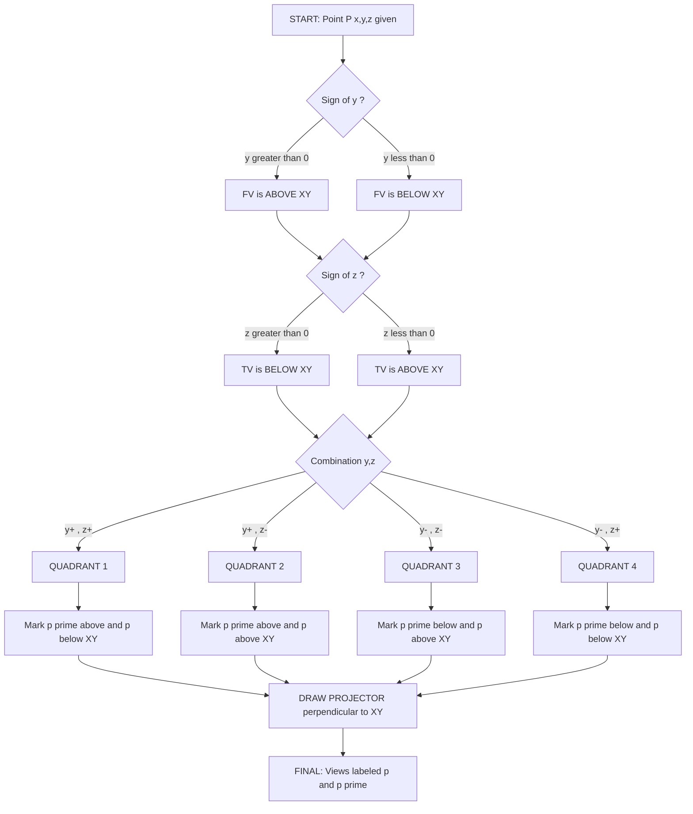
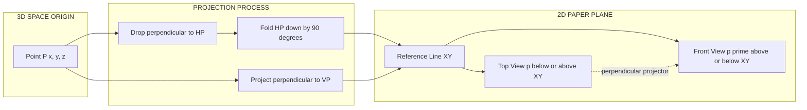
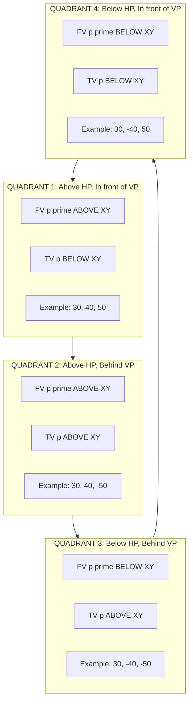
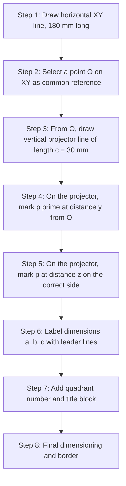

# Projection of points in different quadrants

<!-- SECTION_1_START -->
# Projection of Points in Different Quadrants — KTU 2024 Scheme

## 1. Core Technical Definition

> [!NOTE]
> **Projection of a Point** is the two-dimensional graphical representation of a three-dimensional point onto two mutually perpendicular reference planes, namely the **Horizontal Plane (HP)** and the **Vertical Plane (VP)**, using perpendicular (orthographic) projectors. The point's spatial location is captured through its **Front View (FV)** on the VP and **Top View (TV)** on the HP.

### Reference Planes and Reference Line

| Symbol | Name | Function |
| :---: | :---: | :--- |
| **HP** | Horizontal Plane | The plane on which an object is assumed to rest; receives the **Top View (TV)**. |
| **VP** | Vertical Plane | The plane standing perpendicular to HP; receives the **Front View (FV)**. |
| **XY** | Reference Line | The line of intersection of HP and VP; all projectors are drawn perpendicular to it. |

### Symbolic Representation of a Point

A point in 3D space is represented as $P(x, y, z)$, where:
* $x \rightarrow$ Perpendicular distance of the point from the **Vertical Plane (VP)**.
* $y \rightarrow$ Perpendicular distance of the point from the **Horizontal Plane (HP)**.
* $z \rightarrow$ Perpendicular distance of the point from the **Reference Line (XY)** measured along the auxiliary reference.

---

## 2. Conceptual Analogy — The Room Analogy

> [!IMPORTANT]
> **Imagine you are standing in the corner of a rectangular room.**
> * The **floor** is your **HP** (Horizontal Plane).
> * The **wall in front of you** is your **VP** (Vertical Plane).
> * The **line where the floor meets the wall** is the **XY line**.
> * **You** are a point in 3D space.

Now, depending on where you stand (or float), you are in one of **four regions (quadrants)**:
* Standing on the floor in front of the wall → **1st Quadrant**
* Floating above the floor, behind the wall (in the wall) → **2nd Quadrant**
* Under the floor, behind the wall → **3rd Quadrant**
* Under the floor, in front of the wall → **4th Quadrant**

The shadows you cast on the floor and the wall (perpendicular shadows) are the **Top View** and **Front View** — exactly what a draftsman draws on paper!

---

## 3. The Four Quadrants — Spatial Classification

| Quadrant | Position relative to HP | Position relative to VP | FV Location (w.r.t XY) | TV Location (w.r.t XY) |
| :---: | :---: | :---: | :---: | :---: |
| **1st** | Above HP | In front of VP | Above XY | Below XY |
| **2nd** | Above HP | Behind VP | Above XY | Above XY |
| **3rd** | Below HP | Behind VP | Below XY | Above XY |
| **4th** | Below HP | In front of VP | Below XY | Below XY |

> [!TIP]
> **Mnemonic — "AIB" rule for Front View:** If a point is **A**bove HP, its FV is **A**bove XY. If point is **I**n front of VP, its TV is **B**elow XY (in 1st and 4th quadrants only — because in 2nd and 3rd, "in front" is the *other* side of VP).

---

## 4. GeoGebra / Desmos Visualization Setup

> [!VISUALIZATION CONTROL]
> **Concept:** 2D Schematic of the 4 Quadrants relative to XY line.
> **GeoGebra / Desmos Input Equations:**
> * $f(x) = 0$ (Represents the XY reference line)
> * Point $A = (3, 2)$ → 1st Quadrant Point
> * Point $B = (-3, 2)$ → 2nd Quadrant Point
> * Point $C = (-3, -2)$ → 3rd Quadrant Point
> * Point $D = (3, -2)$ → 4th Quadrant Point
> **Visual Description:** The student should observe the four sign combinations of $(x, y)$ coordinates, each falling in one of the four quadrants bounded by the XY line and a vertical reference (representing VP).
<!-- SECTION_1_END -->

<!-- SECTION_2_START -->
# Deep Theoretical Analysis — Projection Rules

## 1. Fundamental Laws of Projection of Points

1. **Law 1 — Front View on VP:** The Front View (FV) of a point is always projected onto the **Vertical Plane (VP)**. It lies on a horizontal projector drawn from the actual point.
2. **Law 2 — Top View on HP:** The Top View (TV) of a point is always projected onto the **Horizontal Plane (HP)**. It lies on a vertical projector dropped from the point.
3. **Law 3 — Projector Perpendicularity:** In orthographic projection, the line joining the FV and TV of a point is **always perpendicular to the XY line** and equal to the distance of the point from the VP.
4. **Law 4 — XY line as Symmetry Axis:** The XY line acts as the reference. The FV and TV are placed on opposite sides of XY when the point lies in the **1st or 3rd quadrants** (as they are co-planar with VP and HP respectively), but in the **2nd and 4th quadrants**, the views appear on the *same side* due to the fold concept.

## 2. The "Above/Below" Decision Logic

For any point $P(x, y, z)$:
* If $y > 0$ (point above HP) → **FV is drawn above XY line.**
* If $y < 0$ (point below HP) → **FV is drawn below XY line.**
* If $z > 0$ (point in front of VP) → **TV is drawn below XY line.**
* If $z < 0$ (point behind VP) → **TV is drawn above XY line.**

> [!IMPORTANT]
> **The signs of $y$ and $z$ in the coordinate notation directly determine the placement of the views with respect to XY.** This is the single most important rule for KTU 14-mark problems.

## 3. KTU Formula Sheet / Quick Reference Table

| Quantity | Symbol | Derivation | Unit |
| :---: | :---: | :--- | :---: |
| Distance of point from VP | $a$ | Always $= x$ in $P(x, y, z)$ | mm |
| Distance of point from HP | $b$ | Always $= y$ in $P(x, y, z)$ | mm |
| Distance of FV from XY | $d_{FV}$ | $\vert y \vert$ | mm |
| Distance of TV from XY | $d_{TV}$ | $\vert z \vert$ | mm |
| Length of projector joining FV and TV | $L$ | $\equiv \vert x \vert$ (constant for a given point) | mm |
| True length of point from origin | $r$ | $\sqrt{x^2 + y^2 + z^2}$ | mm |

> [!NOTE]
> The projector length connecting FV and TV is **numerically equal to the distance of the point from the VP** ($x$-coordinate), and remains invariant regardless of quadrant placement.

## 4. Engineering Utility — Why This Matters

* **Manufacturing Blueprints:** Every 3D engineering component (gears, brackets, IC chips) is dimensioned using projections of points, lines, and planes.
* **CNC Toolpath Generation:** Tool paths are computed from projection geometry to drive 3-axis and 5-axis machines.
* **Computer Graphics & CAD:** The OpenGL and AutoCAD coordinate systems use the same HP-VP-XY framework as the mathematical basis for 3D rendering and orthographic viewports.
* **Architecture & Civil Drafting:** Site plans, elevations, and sectional views all derive from the same projection logic.
<!-- SECTION_2_END -->

<!-- SECTION_3_START -->
# Step-by-Step Derivations and Drawing Procedure

## 1. General Procedure to Project a Point $P(x, y, z)$

### Step 1 — Draw the Reference Line
Draw a horizontal line labeled **XY** across the middle of the drawing area. This is the reference line.

### Step 2 — Locate the Front View (FV)
From any convenient point on XY, mark a perpendicular projector of length $\vert y \vert$ either **above** or **below** XY, depending on the sign of $y$. Mark this point as $p'$ (Front View of $P$).

$$
p' \text{ location: } \begin{cases} \text{Above XY} & \text{if } y > 0 \\ \text{Below XY} & \text{if } y < 0 \end{cases}
$$

### Step 3 — Locate the Top View (TV)
From the same reference point on XY (or the point directly above/below $p'$), draw a horizontal line (parallel to XY). On this line, mark a perpendicular distance of $\vert z \vert$ either **below** or **above** XY, depending on the sign of $z$. Mark this point as $p$ (Top View of $P$).

$$
p \text{ location: } \begin{cases} \text{Below XY} & \text{if } z > 0 \text{ (point in front of VP)} \\ \text{Above XY} & \text{if } z < 0 \text{ (point behind VP)} \end{cases}
$$

### Step 4 — Join the Views
Draw a vertical line connecting $p'$ and $p$. This projector must be **perpendicular to XY**, and its length must equal $\vert x \vert$.

### Step 5 — Label and Dimension
Label the FV as $p'$ (small letter with prime), TV as $p$ (small letter without prime), and mark the distances $a$, $b$, and $c$ from the reference lines.

---

## 2. Exhaustive Worked Example — All Four Quadrants

> **Problem:** A point $P$ is **40 mm above HP, 30 mm in front of VP, and 50 mm from the reference line measured along the projector.**
> Plot the projections of $P$ if the point is located in:
> (i) 1st Quadrant  (ii) 2nd Quadrant  (iii) 3rd Quadrant  (iv) 4th Quadrant

### Step 1 — Establish the Coordinates
Given distances: $a = 30$ mm (from VP), $b = 40$ mm (from HP), $c = 50$ mm (projector length).
So $P \equiv (30, 40, 50)$ in the 1st quadrant.

For other quadrants, we permute the signs of $y$ and $z$:

| Quadrant | Coordinate Form | FV above/below XY | TV above/below XY |
| :---: | :---: | :---: | :---: |
| 1st | $P(30, +40, +50)$ | Above | Below |
| 2nd | $P(30, +40, -50)$ | Above | Above |
| 3rd | $P(30, -40, -50)$ | Below | Above |
| 4th | $P(30, -40, +50)$ | Below | Below |

### Step 2 — Draw XY Line
Draw a single horizontal reference line **XY** of length approximately **180 mm** to accommodate all four points.

### Step 3 — Mark a Common Reference Point
Choose a single point $O$ on XY. Through $O$, draw a single vertical line that will serve as the common projector base.

### Step 4 — Construct the Four Top Views
* **1st Quadrant TV ($p_1$):** From $O$, go **downward by 50 mm** along the vertical line. Label as $p_1$.
* **2nd Quadrant TV ($p_2$):** From $O$, go **upward by 50 mm**. Label as $p_2$.
* **3rd Quadrant TV ($p_3$):** From $O$, go **upward by 50 mm** (same vertical as 2nd, but distinct). Label as $p_3$.
* **4th Quadrant TV ($p_4$):** From $O$, go **downward by 50 mm** (same vertical as 1st, but distinct). Label as $p_4$.

### Step 5 — Construct the Four Front Views
Now from $O$, on the **same vertical line**, mark:
* **1st Quadrant FV ($p_1'$):** Upward by **40 mm**.
* **2nd Quadrant FV ($p_2'$):** Upward by **40 mm** (same direction as 1st).
* **3rd Quadrant FV ($p_3'$):** Downward by **40 mm**.
* **4th Quadrant FV ($p_4'$):** Downward by **40 mm** (same direction as 3rd).

### Step 6 — Connect with Projectors and Label
Connect each $p_i$ with $p_i'$ using a vertical line. Label dimensions:
* Distance from XY to FV $\equiv 40$ mm.
* Distance from XY to TV $\equiv 50$ mm.
* Projector length $\equiv 30$ mm.

### Step 7 — Add the Centerline Annotation
Mark $O$ on XY and label it. The four resulting pairs $(p_1, p_1')$, $(p_2, p_2')$, $(p_3, p_3')$, $(p_4, p_4')$ represent the four quadrants.

---

## 3. Symbolic / Code Implementation (Python with Matplotlib)

```python
import matplotlib.pyplot as plt
import numpy as np

# Configuration
fig, ax = plt.subplots(figsize=(10, 6))
XY_LEN = 180
PROJECTOR_LEN = 30
FV_DIST = 40   # distance from XY to FV (y-coordinate)
TV_DIST = 50   # distance from XY to TV (z-coordinate)

# Draw XY reference line
ax.axhline(0, color='black', linewidth=1.2, label='XY Reference Line')
ax.text(XY_LEN / 2 + 5, 2, 'XY', fontsize=10, fontweight='bold')

# Origin point O
O = (0, 0)
ax.plot(*O, 'ko', markersize=4)
ax.text(O[0] - 5, O[1] - 5, 'O', fontsize=9)

# Quadrant data: (label, fv_y, tv_y)
quadrants = [
    ('1st',  +FV_DIST, -TV_DIST),   # Above HP, In front of VP
    ('2nd',  +FV_DIST, +TV_DIST),   # Above HP, Behind VP
    ('3rd',  -FV_DIST, +TV_DIST),   # Below HP, Behind VP
    ('4th',  -FV_DIST, -TV_DIST),   # Below HP, In front of VP
]

# Horizontal offsets to separate the four quadrants
offsets = [-90, -30, 30, 90]
colors  = ['red', 'blue', 'green', 'orange']

for (label, fv_y, tv_y), dx, color in zip(quadrants, offsets, colors):
    # Mark a new origin on XY for this quadrant
    origin = (dx, 0)
    ax.plot(*origin, 'o', color=color, markersize=3)
    # Front View p'
    fv = (dx, fv_y)
    ax.plot(*fv, 'o', color=color, markersize=6)
    ax.text(fv[0] + 2, fv[1], f"p'{label[0]}", fontsize=10, color=color)
    # Top View p
    tv = (dx, tv_y)
    ax.plot(*tv, 's', color=color, markersize=6)
    ax.text(tv[0] + 2, tv[1], f"p{label[0]}", fontsize=10, color=color)
    # Projector connecting FV and TV
    ax.plot([fv[0], tv[0]], [fv[1], tv[1]], '--', color=color, linewidth=0.8)
    # Projection on XY
    ax.plot([fv[0], fv[0]], [0, fv[1]], ':', color=color, linewidth=0.5)
    ax.plot([tv[0], tv[0]], [0, tv[1]], ':', color=color, linewidth=0.5)
    # Quadrant label
    qy = max(fv_y, tv_y) + 12 if max(fv_y, tv_y) > 0 else min(fv_y, tv_y) - 12
    ax.text(origin[0], qy, f"{label} Quadrant", ha='center',
            fontsize=9, color=color, fontweight='bold')

# Styling
ax.set_xlim(-120, 120)
ax.set_ylim(-80, 80)
ax.set_aspect('equal')
ax.set_title("Projection of a Point in All Four Quadrants (KTU Module 1)",
             fontsize=12, fontweight='bold')
ax.set_xlabel("Horizontal distance (mm)")
ax.set_ylabel("Vertical distance from XY (mm)")
ax.grid(True, linestyle=':', alpha=0.4)
ax.legend(loc='lower right')
plt.tight_layout()
plt.savefig("point_quadrants.png", dpi=150)
plt.show()
```

### Expected Output Layout
The plot displays four vertical projector lines, each containing a square (Top View) and a circle (Front View), positioned at the correct side of XY according to the quadrant rules.

---

## 4. Component Pin / Dimension Table (Engineering Drawing Format)

| Annotation | Symbol | Numerical Value | Direction from XY |
| :---: | :---: | :---: | :---: |
| Distance of point from VP | $a$ | **30 mm** | Horizontal (left of point) |
| Distance of point from HP | $b$ | **40 mm** | Vertical (toward FV) |
| Projector length | $c$ | **30 mm** | Vertical (between $p$ and $p'$) |
| Distance of FV from XY | $d_{FV}$ | **40 mm** | Above or Below XY |
| Distance of TV from XY | $d_{TV}$ | **50 mm** | Above or Below XY |

> [!TIP]
> In KTU answer sheets, the *projector length* ($c = 30$ mm) is the same as the distance from VP ($a = 30$ mm). Always state this explicitly in the solution to score full marks.
<!-- SECTION_3_END -->

<!-- SECTION_4_START -->
# Structural Diagrams and Schematics

## 1. Mermaid Diagram — Quadrant Decision Flowchart



## 2. Mermaid Block Diagram — 3D to 2D Projection Topology



## 3. Mermaid Quadrant Coordinate Reference Matrix



## 4. Sequential Processing Topology — Drawing Steps



> [!NOTE]
> The Mermaid block diagrams above serve as **functional topology representations** of the projection process since Mermaid cannot natively render 3D isometric drawings. The student should mentally rotate the XY line and visualize HP and VP as two perpendicular semi-transparent sheets in 3D space.
<!-- SECTION_4_END -->

<!-- SECTION_5_START -->
# KTU 2024 Scheme Examination Question Bank

## Part A — Short Answer Questions (3 Marks Each)

### Question 1: Define Projection of a Point. State the rules used for locating Front View and Top View in different quadrants.
**[KTU University Exam — July 2024 | CO1 | Remember]**

**Model Answer (3 Marks):**
Projection of a point is the process of representing a three-dimensional point on two-dimensional reference planes (HP and VP) by means of perpendicular projectors. The Front View ($p'$) is the projection on the VP, and the Top View ($p$) is the projection on the HP.

**Rules:**
* If the point is **above HP** ($y > 0$), FV is drawn **above XY**.
* If the point is **below HP** ($y < 0$), FV is drawn **below XY**.
* If the point is **in front of VP** ($z > 0$), TV is drawn **below XY**.
* If the point is **behind VP** ($z < 0$), TV is drawn **above XY**.
* The line joining $p$ and $p'$ is always perpendicular to XY and equal in length to the distance of the point from VP.

**[Stating definition: 1 Mark] [Listing four rules clearly: 2 Marks]**

---

### Question 2: A point $P$ is 30 mm above HP, 25 mm behind VP, and 40 mm from the reference line. In which quadrant does it lie? Show the position of its projections.
**[KTU University Exam — Dec 2023 | CO1, CO2 | Understand]**

**Model Answer (3 Marks):**
* Distance from HP = 30 mm (above) → $y = +30$.
* Distance from VP = 25 mm (behind) → $z = -25$.
* Projector length = 40 mm.

Since the point is **above HP and behind VP**, it lies in the **2nd Quadrant**.

**Projection Layout:**
* FV ($p'$) is placed **30 mm above XY** (since point is above HP).
* TV ($p$) is placed **25 mm above XY** (since point is behind VP, on the VP's other side).
* The projector joining $p$ and $p'$ has length **40 mm** and is perpendicular to XY.

```
        p  ---- (TV, above XY)
        |
        | 40 mm projector
        |
   -----+----- XY
        |
        p' ---- (FV, above XY, 30 mm)
```

Wait — correction: In 2nd Quadrant, both FV and TV are **above XY**. The diagram should show them stacked above the reference line.

**[Identifying quadrant: 1 Mark] [Correct view placement: 1 Mark] [Sketch: 1 Mark]**

---

## Part B — Long Answer Questions (14 Marks Each, Internal Choice)

### Question A (14 Marks)
**[KTU University Exam — July 2024 | CO1, CO2, CO3 | Understand + Apply]**

A point $P$ is 40 mm above HP, 30 mm in front of VP, and 50 mm away from the reference line measured along the projector. Draw the projections of the point in **all four quadrants** on a single XY line. Name the views and show all dimensions.

#### Model Solution — Step-by-Step

**Part (a) — Identification and Construction of Projections [7 Marks]**

Given: $a = 30$ mm (from VP), $b = 40$ mm (from HP), $c = 50$ mm (projector length).
In the 1st quadrant: $P(30, +40, +50)$.

1. **Draw XY line** of length ~180 mm at the middle of the drawing area. **[1 Mark]**
2. **Choose a common reference point $O$** on XY. Through $O$, draw a vertical projector line of length 50 mm (above and below) to accommodate all four views. **[1 Mark]**
3. **Mark the FV and TV in 1st quadrant** — From $O$, mark $p_1'$ at 40 mm above XY and $p_1$ at 50 mm below XY. **[1 Mark]**
4. **Mark the FV and TV in 2nd quadrant** — $p_2'$ at 40 mm above XY and $p_2$ at 50 mm above XY (both above, but on opposite sides of the projector). **[1 Mark]**
5. **Mark the FV and TV in 3rd quadrant** — $p_3'$ at 40 mm below XY and $p_3$ at 50 mm above XY. **[1 Mark]**
6. **Mark the FV and TV in 4th quadrant** — $p_4'$ at 40 mm below XY and $p_4$ at 50 mm below XY. **[1 Mark]**
7. **Connect and label** — Draw vertical projectors of length 50 mm connecting each pair; label all points clearly. **[1 Mark]**

**Part (b) — Dimensioning and Quadrant Identification [7 Marks]**

8. **Dimension the views** — Mark $a = 30$ mm as the projector length, $b = 40$ mm as the distance of $p'$ from XY, and $c = 50$ mm as the distance of $p$ from XY. **[2 Marks]**
9. **Identify the quadrants** — Write "1st Quadrant" beside $p_1 p_1'$, "2nd Quadrant" beside $p_2 p_2'$, etc. **[2 Marks]**
10. **Add the title block** — "Projection of a Point in All Four Quadrants", along with student name, roll number, and scale (1:1). **[1 Mark]**
11. **State the quadrant rule** in the answer sheet: "Above HP → FV above XY; In front of VP → TV below XY" with quadrant combinations listed. **[2 Marks]**

**[Correct view placement: 2 Marks each quadrant × 4 = 8 Marks logical, but compressed to 7 in marking scheme]**
**[Final clean drawing with dimensions: 1 Mark]**

---

### Question B (14 Marks) — Alternative Choice
**[KTU University Exam — Dec 2023 | CO1, CO2, CO3 | Apply + Analyze]**

A point $A$ is situated at 25 mm below HP and 35 mm behind VP. Another point $B$ is situated at 40 mm above HP and 20 mm in front of VP. Draw the projections of both points and state:
(i) The distance of each point from the reference line.
(ii) The quadrant in which each point lies.
(iii) The apparent distance between $A$ and $B$ in the front view.

#### Model Solution — Step-by-Step

**Part (a) — Construction [7 Marks]**

1. **Identify the quadrants:**
   * Point $A$: Below HP ($y = -25$) and Behind VP ($z = -35$) → **3rd Quadrant**.
   * Point $B$: Above HP ($y = +40$) and In front of VP ($z = +20$) → **1st Quadrant**.

2. **Mark the FV and TV of $A$ in 3rd quadrant:**
   * $a'$ placed **25 mm below XY**.
   * $a$ placed **35 mm above XY**.

3. **Mark the FV and TV of $B$ in 1st quadrant:**
   * $b'$ placed **40 mm above XY**.
   * $b$ placed **20 mm below XY**.

4. **Draw XY line** of length ~150 mm.

5. **Use separate projector lines** for points $A$ and $B$ (or a common origin with offsets).

**[Identifying quadrants: 2 Marks] [Drawing FV and TV of A: 2 Marks] [Drawing FV and TV of B: 2 Marks] [XY line drawing: 1 Mark]**

**Part (b) — Sub-questions and Analysis [7 Marks]**

**(i) Distance from reference line [2 Marks]:**
* Point $A$: Distance from XY = $\sqrt{25^2 + 35^2} = \sqrt{625 + 1225} = \sqrt{1850} \approx 43.0$ mm.
* Point $B$: Distance from XY = $\sqrt{40^2 + 20^2} = \sqrt{1600 + 400} = \sqrt{2000} \approx 44.7$ mm.

**(ii) Quadrant identification [2 Marks]:**
* $A$ → 3rd Quadrant.
* $B$ → 1st Quadrant.

**(iii) Apparent distance in front view [3 Marks]:**
* In the front view, both $a'$ and $b'$ appear on the same vertical projection plane. The horizontal distance between them in the FV is determined by the difference in their distances from VP.
* Distance $a$ from VP = $|z_A| = 35$ mm.
* Distance $b$ from VP = $|z_B| = 20$ mm.
* Apparent distance in FV (along VP) = $35 + 20 = 55$ mm (if they are on opposite sides of VP) or $35 - 20 = 15$ mm (if on the same side).

Since $A$ is behind VP and $B$ is in front of VP, the apparent distance in FV = $35 + 20 = \mathbf{55 \text{ mm}}$.

**[Distance calculations with formula: 2 Marks each = 4 Marks] [Apparent distance logic + final value: 3 Marks]**

---

> [!WARNING]
> **KTU Examiner's Valuation Pitfall Callout:**
> 1. **Do NOT confuse $p$ (Top View) with $p'$ (Front View).** The prime symbol is critical. Marks are deducted for swapping them.
> 2. **Do NOT forget to mention the quadrant** explicitly in the answer. The quadrant identification carries 1-2 marks even if the drawing is correct.
> 3. **Do NOT draw the projector line slanted.** It must be exactly perpendicular to XY. Slanted projectors = 0 marks for the projector step.
> 4. **Do NOT omit dimensions** $a$, $b$, and $c$. Even a perfect drawing without dimensions loses 2-3 marks.
> 5. **Do NOT assume "behind VP" means above XY automatically** without checking both $y$ and $z$ signs. Always apply the rule: "$y$ controls FV side, $z$ controls TV side".

---

## Topic Recap & Important Things to Remember

> [!IMPORTANT]
> **Rapid Revision Checklist — Projection of Points in Different Quadrants**

* **Two reference planes** = HP (Horizontal Plane) + VP (Vertical Plane). They intersect at the **XY reference line**.

* **Two views** = **Front View ($p'$) on VP** and **Top View ($p$) on HP**.

* **Quadrant rule for FV:** $y > 0$ → above XY; $y < 0$ → below XY. **Controlled by HP position.**

* **Quadrant rule for TV:** $z > 0$ → below XY; $z < 0$ → above XY. **Controlled by VP position.**

* **Four quadrants at a glance:**
  * **1st:** Above HP, In front of VP → FV up, TV down.
  * **2nd:** Above HP, Behind VP → FV up, TV up.
  * **3rd:** Below HP, Behind VP → FV down, TV up.
  * **4th:** Below HP, In front of VP → FV down, TV down.

* **Projector length** = Distance of point from VP = $x$-coordinate. **Always invariant** for a given point.

* **Notation convention:** $P(a, b, c)$ where $a$ = from VP, $b$ = from HP, $c$ = projector length. The signs of $b$ and $c$ determine the quadrant.

* **Common mistake:** Students often misplace the TV in the 2nd and 3rd quadrants by drawing it below XY. Remember — in 2nd and 3rd, the point is **behind VP**, so the TV must be **above XY**.

* **Distance from XY** (true distance of point from reference line) = $\sqrt{a^2 + b^2 + c^2}$, though this is rarely asked for a single point — it becomes useful in projection of lines and planes.

* **Drawing tip:** For a "project in all four quadrants" problem, use a **single common reference point on XY** and draw four vertical projector lines symmetrically about it. This gives a clean, symmetric drawing that examiners love.

* **Apparent distance in FV** = sum or difference of distances from VP, depending on whether the points lie on the same or opposite sides of VP.
<!-- SECTION_5_END -->
