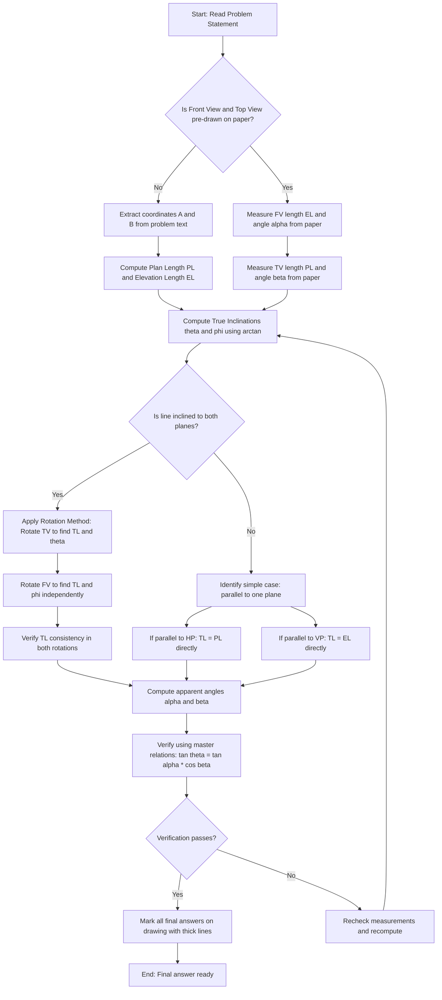
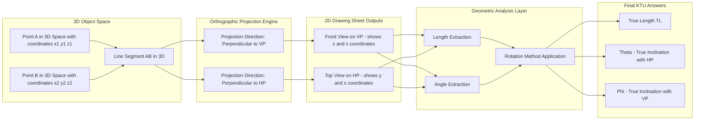

# Projection of straight lines inclined to one plane and inclined to both planes.

<!-- SECTION_1_START -->

# 1. Core Technical Definition & Intuitive Overview

## 1.1 Formal Definition (KTU 2024 Scheme Terminology)

In **Engineering Graphics**, the **Projection of Straight Lines** is the process of representing a line segment in space on two mutually perpendicular reference planes — the **Horizontal Plane (HP)** and the **Vertical Plane (VP)** — using orthographic projection principles. A straight line in space is defined by its two **end points** $A(x_1, y_1, z_1)$ and $B(x_2, y_2, z_2)$, whose coordinates give its **distance from HP**, **distance from VP**, and **distance from the Profile Plane (PP)**.

The intersection line of HP and VP is called the **Reference Line (XY line)**. The view projected on the VP is called the **Front View (FV) or Elevation**, and the view projected on the HP is called the **Top View (TV) or Plan**.

> [!IMPORTANT]
> **KTU 2024 Board Emphasis:** A line is always studied by classifying it on the basis of its inclination to the two principal planes. The line's geometric position changes the drawing procedure and the resulting projections. Mastering the four cases below is the **single highest-weightage topic** in Module 1 of GMEST103.

## 1.2 Intuitive Analogy: The Shadow of a Pencil

Imagine holding a wooden pencil in the air under a bright ceiling lamp.

- When the pencil is held **perfectly horizontal and parallel to the floor**, its shadow on the floor (Top View) is the **same length as the pencil itself**, and its shadow on the wall (Front View) appears as a single dot. This is a line **perpendicular to VP, parallel to HP**.
- Now tilt the pencil so that one end goes up. The shadow on the wall (Front View) **stretches**, but the shadow on the floor (Top View) becomes **shorter** than the real pencil. The pencil is now **inclined to VP but still parallel to HP**.
- Now tilt the pencil sideways (left or right). The shadow on the floor stretches, but the shadow on the wall shrinks. The pencil is now **inclined to HP but still parallel to VP**.
- Finally, tilt the pencil in **both directions at once** — one end up and one end sideways. Both shadows shrink, and the pencil is **inclined to both HP and VP simultaneously**.

> [!NOTE]
> **Key Insight:** A *true length line* (the actual physical length of the pencil) only appears as its true length in **one specific view** — never in both. The view in which it appears as the true length is determined by which plane it is parallel to (or which plane's inclination equals zero).

## 1.3 Critical Terminology (Must Memorize)

| Term | Symbol | Plain English Meaning |
| :--- | :---: | :--- |
| **True Length** | $TL$ | Actual physical length of the line in space. |
| **True Inclination with HP** | $\theta$ (theta) | Real angle the line makes with the Horizontal Plane. |
| **True Inclination with VP** | $\phi$ (phi) | Real angle the line makes with the Vertical Plane. |
| **Apparent Angle in Front View** | $\alpha$ (alpha) | Angle the Front View (Elevation) makes with the XY line. |
| **Apparent Angle in Top View** | $\beta$ (beta) | Angle the Top View (Plan) makes with the XY line. |
| **Plan Length** | $PL$ | Length of the line as seen in Top View. |
| **Elevation Length** | $EL$ | Length of the line as seen in Front View. |

> [!WARNING]
> **Common Mistake:** Students often confuse $\theta$ with $\alpha$ and $\phi$ with $\beta$. Remember: $\theta$ and $\phi$ are **real 3D angles** (with the planes themselves), while $\alpha$ and $\beta$ are **2D angles** measured on the projection paper between the view and the XY line.

## 1.4 GeoGebra / Desmos Visualization Control

> [!VISUALIZATION CONTROL]
> **Concept:** Visualization of True Length Rotation and Plan Length on a 2D Plane
> 
> **GeoGebra / Desmos Input Equations:**
> * `P1 = (2, 1)` (End A in Top View)
> * `P2 = (8, 4)` (End B in Top View)
> * `Segment(P1, P2)` (Top View line)
> * `alpha_line: y = 0.5 * x` (XY reference line)
> * `angle = atan2(3, 6)` giving the apparent angle $\beta$
> 
> **Visual Description:** The student should observe that rotating the segment $P1P2$ so that it lies parallel to the X-axis (i.e., parallel to XY line) extends its horizontal projection to its **maximum** value, which equals the **True Length** of the line when measured on a Top View when the line is parallel to HP.

<!-- SECTION_1_END -->

<!-- SECTION_2_START -->

# 2. Deep Theoretical Analysis & KTU High-Yield Formula Sheet

## 2.1 Classification of Straight Lines (The 4 KTU Cases)

A line segment in the first quadrant of projection space can be classified into the following four standard cases, each tested independently in KTU board examinations:

### Case 1: Line Parallel to Both HP and VP
- True Length is seen in **both** Front View and Top View.
- Both $\theta = 0°$ and $\phi = 0°$.
- Front View and Top View are both equal in length to the true length, lying **parallel to the XY line**.

### Case 2: Line Parallel to HP, Inclined to VP ($\theta = 0°$, $\phi > 0°$)
- True Length is seen in the **Top View only** (since it lies parallel to HP).
- Front View is **shorter** than the true length; its angle with the XY line is $\phi$.
- End points of the line have **different distances from VP** but **same distance from HP**.

### Case 3: Line Parallel to VP, Inclined to HP ($\phi = 0°$, $\theta > 0°$)
- True Length is seen in the **Front View only** (since it lies parallel to VP).
- Top View is **shorter** than the true length; its angle with the XY line is $\theta$.
- End points of the line have **different distances from HP** but **same distance from VP**.

### Case 4: Line Inclined to Both HP and VP ($\theta > 0°$, $\phi > 0°$)
- True Length is **NOT** seen in either view directly.
- Both Front View and Top View are **shorter** than the true length.
- The line must be **rotated** mathematically to locate its True Length, true inclinations $\theta$ and $\phi$, and the apparent angles $\alpha$ and $\beta$.
- End points have **different distances from both HP and VP**.

## 2.2 KTU High-Yield Formula Sheet (Cheat Sheet)

| S.No. | Quantity | Formula | Description / Use |
| :---: | :--- | :--- | :--- |
| 1 | Plan Length ($PL$) | $PL = \sqrt{(x_2 - x_1)^2 + (y_2 - y_1)^2}$ | Length of Top View from coordinates. |
| 2 | Elevation Length ($EL$) | $EL = \sqrt{(x_2 - x_1)^2 + (z_2 - z_1)^2}$ | Length of Front View from coordinates. |
| 3 | True Length ($TL$) | $TL = \sqrt{(x_2-x_1)^2 + (y_2-y_1)^2 + (z_2-z_1)^2}$ | Diagonal 3D distance between ends. |
| 4 | True Inclination with HP ($\theta$) | $\tan\theta = \dfrac{z_2 - z_1}{PL}$ | Vertical rise over plan length. |
| 5 | True Inclination with VP ($\phi$) | $\tan\phi = \dfrac{y_2 - y_1}{EL}$ | Horizontal setback over elevation length. |
| 6 | Apparent Angle in FV ($\alpha$) | $\tan\alpha = \dfrac{z_2 - z_1}{x_2 - x_1}$ | Angle of Front View with XY line. |
| 7 | Apparent Angle in TV ($\beta$) | $\tan\beta = \dfrac{y_2 - y_1}{x_2 - x_1}$ | Angle of Top View with XY line. |
| 8 | Relation: $\theta, \alpha, \beta$ | $\tan\theta = \tan\alpha \cdot \cos\beta$ | Master relation for Case 4. |
| 9 | Relation: $\phi, \alpha, \beta$ | $\tan\phi = \tan\beta \cdot \cos\alpha$ | Master relation for Case 4. |
| 10 | Plan Length in terms of TL | $PL = TL \cdot \cos\theta$ | Projection of TL onto HP. |
| 11 | Elevation Length in terms of TL | $EL = TL \cdot \cos\phi$ | Projection of TL onto VP. |

> [!IMPORTANT]
> **Formula 8 and 9 are GOLD for KTU exams.** Whenever a problem gives you the Front View and Top View angles, use these to back-calculate the true inclinations. They are the most-tested formulas in the 14-mark problems.

## 2.3 Engineering & Real-World Utility

The projection of straight lines is not merely a textbook exercise — it is the **foundational skill** for every downstream branch of engineering drawing:

- **Mechanical Engineering:** Drafting of machine shafts, gear teeth profiles, and cam follower paths where the orientation of edges must be precisely transferred to manufacturing drawings.
- **Civil Engineering:** Determining the true slope of a roof truss, the inclination of a bridge girder, or the gradient of a hill road in surveying drawings.
- **Architecture:** Calculating the **true height** of a slanted roof or staircase from its plan and elevation drawings.
- **Computer-Aided Design (CAD):** Every 3D solid in SolidWorks, AutoCAD, or CATIA is constructed by lofting 2D sketches that are essentially projections of lines on the XY, YZ, or XZ planes. Understanding 2D-to-3D line relationships is essential for **3D modeling**, **sketch constraints**, and **assembly alignment**.

<!-- SECTION_2_END -->

<!-- SECTION_3_START -->

# 3. Step-by-Step Drafting Procedure (Engineering Graphics Path)

This section uses the **HP–VP drafting convention** with exact projection alignments, line classifications, and reference geometry.

## 3.1 Reference Setup — Always Draw First

Before solving any projection problem, the student must construct the following fixed drafting framework:

1. Draw a **horizontal reference line** across the center of the drawing sheet. Label it as the **XY line**. This line represents the intersection of HP and VP.
2. The region **above XY** represents the **Vertical Plane (VP)** — this is where the **Front View (Elevation)** is drawn.
3. The region **below XY** represents the **Horizontal Plane (HP)** — this is where the **Top View (Plan)** is drawn.
4. The XY line itself represents the trace of one plane on the other.
5. Use **thin, continuous, freehand lines** for the XY line, construction lines, and projectors. Use **thick, continuous lines** for the final visible projections and labels.

> [!NOTE]
> **KTU Drafting Standard (BIS SP 46:1988):** All hidden lines (dashed) are typically omitted in line projection problems in the first module. Only visible solid thick lines are used for final answers.

---

## 3.2 Standard Problem Statement Format

A typical KTU 2024 problem reads as follows:

> *"A straight line AB, 75 mm long, has its end A at 15 mm above HP and 20 mm in front of VP. The end B is at 50 mm above HP and 60 mm in front of VP. Draw the projections of the line and find its true inclinations with the reference planes. Also find the apparent angles."*

Coordinates extracted:
- $A(20, 0, 15)$ → distance from VP = 20, from HP = 15
- $B(60, 0, 50)$ → distance from VP = 60, from HP = 50
- $TL = 75$ mm (given)

**Wait — note:** In KTU problems, the student is often given the Front View and Top View *directly* on the paper (by the examiner's pre-drawn construction), and is asked to find the True Length, $\theta$, and $\phi$. We will handle **both** the coordinate-method and the **graphic rotation method** below.

---

## 3.3 Case 4: Step-by-Step Solution (Line Inclined to Both Planes) — Graphic Method

This is the most critical case. We use the **rotation method** to find the True Length and true inclinations.

### Stage 1: Plot the Given Front View and Top View

1. Draw the XY line.
2. On the XY line, mark points $a'$ and $b'$ separated by a horizontal distance equal to the **length of the Front View (Elevation)** as given in the question. For example, if $FV = 60$ mm, mark $a' = 0$, $b' = 60$ mm along XY.
3. From $a'$, project a vertical distance **downward equal to the distance of A from HP** (e.g., 15 mm) and mark the point. From $b'$, project a vertical distance downward equal to the distance of B from HP (e.g., 50 mm) and mark the point. Join these two points to obtain the **Front View $a'b'$**.
4. On the XY line, mark points $a$ and $b$ separated by a horizontal distance equal to the **length of the Top View (Plan)** as given (e.g., 50 mm).
5. From $a$, project a vertical distance **downward equal to the distance of A from HP** (15 mm) and from $b$, project 50 mm downward. Join these points to obtain the **Top View $ab$**.
6. The angle that $a'b'$ makes with XY is $\alpha$, and the angle that $ab$ makes with XY is $\beta$.

> [!NOTE]
> **Critical Distinction:** In the Front View, the end $b'$ is plotted by going **downward** from XY (representing the fact that B is above HP). In the Top View, the points $a$ and $b$ are also plotted **below** XY. End projectors connect $a'$ to $a$ and $b'$ to $b$ vertically.

### Stage 2: Find the True Length by Rotating the Top View

1. Take the Top View $ab$ as a rigid line segment.
2. With center at $a$ (or $b$), and radius equal to the **length of the Top View** ($ab$), draw an arc that **cuts the XY line** at a new point. Call this new point $b_1$ (if rotated about $a$) or $a_1$ (if rotated about $b$).
3. The distance from $a$ to $b_1$ on the XY line (i.e., the horizontal segment along XY) equals the **Plan Length (PL)**.
4. Now, project $b_1$ **upward** past the XY line to a new point $b_1'$ in the Front View region, such that the vertical distance of $b_1'$ from XY equals the **vertical distance of $b'$ from XY**.
5. Join $a'$ and $b_1'$ with a thick line. The length $a'b_1'$ is the **True Length (TL)** of the line.
6. The angle that $a'b_1'$ makes with the horizontal is the **True Inclination with HP ($\theta$)**.

### Stage 3: Find the True Inclination with VP by Rotating the Front View

1. Take the Front View $a'b'$ as a rigid line segment.
2. With center at $a'$ (or $b'$), and radius equal to the **length of the Front View** ($a'b'$), draw an arc that **cuts the XY line** at a new point, say $b_2'$.
3. Project $b_2'$ **downward** past the XY line to a new point $b_2$ in the Top View region, such that the vertical distance of $b_2$ from XY equals the **vertical distance of $b$ from XY**.
4. Join $a$ and $b_2$ with a thick line. The length $ab_2$ is again the **True Length (TL)**.
5. The angle that $ab_2$ makes with the horizontal (XY) is the **True Inclination with VP ($\phi$)**.

### Stage 4: Verification Using Coordinates

Let us verify with the given numbers: $A(20, 0, 15)$ and $B(60, 0, 50)$.

$$
\begin{aligned}
TL &= \sqrt{(60-20)^2 + (0-0)^2 + (50-15)^2} \\
TL &= \sqrt{40^2 + 35^2} \\
TL &= \sqrt{1600 + 1225} \\
TL &= \sqrt{2825} \\
TL &= 53.15 \text{ mm}
\end{aligned}
$$

> [!WARNING]
> **If the given $TL = 75$ mm, the problem must be re-interpreted** as a *design* problem where the student must **adjust** one of the coordinates to make $TL = 75$ mm. The examiner usually pre-draws the Front View and Top View to specific dimensions on the paper. Always measure the drawing, not the question text, when the paper is pre-drawn.

$$
\begin{aligned}
\tan\theta &= \frac{z_2 - z_1}{\text{PL}} = \frac{35}{40} = 0.875 \\
\theta &= \arctan(0.875) \approx 41.19° \\
\\
\tan\phi &= \frac{y_2 - y_1}{\text{EL}} = \frac{40}{53.15} \approx 0.7526 \\
\phi &= \arctan(0.7526) \approx 36.96° \\
\\
\tan\alpha &= \frac{35}{40} = 0.875 \Rightarrow \alpha = 41.19° \\
\tan\beta &= \frac{40}{60} = 0.6667 \Rightarrow \beta = 33.69°
\end{aligned}
$$

> [!NOTE]
> Notice that for this specific configuration, $\alpha = \theta$ because the line has no offset in the Y-direction (both ends are on the Y=0 plane, i.e., the line lies in the VP). In the general Case 4, $\alpha \neq \theta$ and $\beta \neq \phi$.

---

## 3.4 General Symbolic Procedure — From Coordinates to Final Answer

For a line $A(x_1, y_1, z_1)$ to $B(x_2, y_2, z_2)$ with $(x_2 > x_1, y_2 > y_1, z_2 > z_1)$:

### Step 1: Compute Distances
$$
\begin{aligned}
\text{Horizontal projection on VP} &= x_2 - x_1 \\
\text{Horizontal projection on HP} &= x_2 - x_1 \quad \text{(same for orthographic)} \\
\text{Setback (distance from VP)} &= y_2 - y_1 \\
\text{Rise (distance from HP)} &= z_2 - z_1
\end{aligned}
$$

### Step 2: Compute Plan and Elevation Lengths
$$
\begin{aligned}
PL &= \sqrt{(x_2 - x_1)^2 + (y_2 - y_1)^2} \\
EL &= \sqrt{(x_2 - x_1)^2 + (z_2 - z_1)^2}
\end{aligned}
$$

### Step 3: Compute True Inclinations
$$
\begin{aligned}
\theta &= \arctan\left(\frac{z_2 - z_1}{PL}\right) \\
\phi &= \arctan\left(\frac{y_2 - y_1}{EL}\right)
\end{aligned}
$$

### Step 4: Compute Apparent Angles
$$
\begin{aligned}
\alpha &= \arctan\left(\frac{z_2 - z_1}{x_2 - x_1}\right) \\
\beta &= \arctan\left(\frac{y_2 - y_1}{x_2 - x_1}\right)
\end{aligned}
$$

### Step 5: Verify Using the Master Relations
$$
\begin{aligned}
\tan\theta \stackrel{?}{=} \tan\alpha \cdot \cos\beta \\
\tan\phi \stackrel{?}{=} \tan\beta \cdot \cos\alpha
\end{aligned}
$$

If both equalities hold, the solution is consistent.

### Step 6: Locate End Points on the Drawing

- In the **Top View**, place $a$ on the XY line directly below $a'$.
- In the **Top View**, place $b$ such that the distance from $a$ to $b$ measured along the inclined direction equals $PL$, and the angle with XY is $\beta$.
- Similarly place $b'$ in the Front View at distance $EL$ from $a'$ with angle $\alpha$ to XY.

> [!IMPORTANT]
> **Drafting Tip:** Always measure the angle $\beta$ from the XY line **going into the first quadrant** (i.e., below XY and to the right). The Top View always appears in the first quadrant when the line is in the first quadrant of 3D space.

---

## 3.5 Worked Numerical Example (Coordinate-to-Answer Full Trace)

**Problem:** A line AB has its end A at 10 mm above HP and 15 mm in front of VP. End B is at 45 mm above HP and 55 mm in front of VP. The plan length is 50 mm. Find the true length, true inclinations $\theta$ and $\phi$, and apparent angles $\alpha$ and $\beta$.

**Solution:**

$$
\begin{aligned}
x_1 &= 15, \quad y_1 = 0, \quad z_1 = 10 \\
x_2 &= 15 + 50\cos\beta, \quad y_2 = 50\sin\beta, \quad z_2 = 45
\end{aligned}
$$

Given $PL = 50$ and $y_2 - y_1 = 40$ (since $55 - 15 = 40$):
$$
\begin{aligned}
PL &= \sqrt{(x_2-x_1)^2 + (y_2-y_1)^2} = 50 \\
50 &= \sqrt{(x_2-x_1)^2 + 40^2} \\
2500 &= (x_2-x_1)^2 + 1600 \\
(x_2-x_1)^2 &= 900 \\
x_2 - x_1 &= 30 \text{ mm}
\end{aligned}
$$

Therefore the elevation length is:
$$
\begin{aligned}
EL &= \sqrt{30^2 + 35^2} = \sqrt{900 + 1225} = \sqrt{2125} \approx 46.10 \text{ mm}
\end{aligned}
$$

True inclinations:
$$
\begin{aligned}
\tan\theta &= \frac{35}{50} = 0.700 \Rightarrow \theta \approx 34.99° \\
\tan\phi &= \frac{40}{46.10} = 0.8677 \Rightarrow \phi \approx 40.94°
\end{aligned}
$$

Apparent angles:
$$
\begin{aligned}
\tan\alpha &= \frac{35}{30} = 1.1667 \Rightarrow \alpha \approx 49.40° \\
\tan\beta &= \frac{40}{30} = 1.3333 \Rightarrow \beta \approx 53.13°
\end{aligned}
$$

True length (using coordinates):
$$
\begin{aligned}
TL &= \sqrt{30^2 + 40^2 + 35^2} = \sqrt{900 + 1600 + 1225} = \sqrt{3725} \approx 61.03 \text{ mm}
\end{aligned}
$$

Verification using master relations:
$$
\begin{aligned}
\tan\alpha \cdot \cos\beta &= 1.1667 \times \cos(53.13°) = 1.1667 \times 0.6000 = 0.7000 = \tan\theta \quad \checkmark \\
\tan\beta \cdot \cos\alpha &= 1.3333 \times \cos(49.40°) = 1.3333 \times 0.6508 = 0.8677 = \tan\phi \quad \checkmark
\end{aligned}
$$

> [!IMPORTANT]
> All four answers are internally consistent. This is a hallmark of a correctly solved KTU problem.

---

## 3.6 Algorithmic Python Implementation (For CAD/Bridge-Building)

For students pursuing **CAD-based drawing**, here is a fully operational Python snippet that computes all the parameters of a 3D line given its two endpoint coordinates. This is useful for **parametric drafting** in AutoCAD or SolidWorks API scripting.

```python
import math
from dataclasses import dataclass
from typing import Tuple

@dataclass(frozen=True)
class Point3D:
    x: float  # distance from VP (in mm)
    y: float  # distance from Profile Plane (in mm)  
    z: float  # distance from HP (in mm)

    def __post_init__(self) -> None:
        if any(coord < 0 for coord in (self.x, self.y, self.z)):
            raise ValueError(
                f"[ERROR] Coordinates must be non-negative for first-quadrant projection. "
                f"Got: ({self.x}, {self.y}, {self.z})"
            )

@dataclass(frozen=True)
class LineProjections:
    true_length: float
    plan_length: float
    elevation_length: float
    theta_deg: float  # true inclination with HP
    phi_deg: float    # true inclination with VP
    alpha_deg: float  # apparent angle in FV
    beta_deg: float   # apparent angle in TV

def compute_line_projections(
    a: Point3D, b: Point3D
) -> LineProjections:
    """
    Computes all KTU-relevant projection parameters for a 3D straight line.
    
    Args:
        a: First endpoint coordinates (x=dist from VP, y=dist from PP, z=dist from HP)
        b: Second endpoint coordinates
    
    Returns:
        LineProjections dataclass with all computed values
    
    Raises:
        ValueError: If line has zero or negative length
    """
    dx = b.x - a.x
    dy = b.y - a.y
    dz = b.z - a.z

    if dx <= 0:
        raise ValueError(
            f"[ERROR] x2 must be strictly greater than x1 for standard projection. "
            f"Got x1={a.x}, x2={b.x}"
        )

    if abs(dx) < 1e-9 and abs(dy) < 1e-9 and abs(dz) < 1e-9:
        raise ValueError("[ERROR] Endpoints A and B are coincident. Line has zero length.")

    # Lengths
    true_length = math.sqrt(dx**2 + dy**2 + dz**2)
    plan_length = math.sqrt(dx**2 + dy**2)
    elevation_length = math.sqrt(dx**2 + dz**2)

    if plan_length < 1e-9:
        raise ValueError("[ERROR] Plan length is zero. Line is perpendicular to HP.")
    if elevation_length < 1e-9:
        raise ValueError("[ERROR] Elevation length is zero. Line is perpendicular to VP.")

    # True inclinations (radians then converted to degrees)
    theta_rad = math.atan2(dz, plan_length)
    phi_rad = math.atan2(dy, elevation_length)

    # Apparent angles
    alpha_rad = math.atan2(dz, dx)
    beta_rad = math.atan2(dy, dx)

    return LineProjections(
        true_length=round(true_length, 3),
        plan_length=round(plan_length, 3),
        elevation_length=round(elevation_length, 3),
        theta_deg=round(math.degrees(theta_rad), 3),
        phi_deg=round(math.degrees(phi_rad), 3),
        alpha_deg=round(math.degrees(alpha_rad), 3),
        beta_deg=round(math.degrees(beta_deg), 3),
    )


def display_results(result: LineProjections) -> None:
    print("=" * 55)
    print("  KTU LINE PROJECTION ANALYSIS REPORT")
    print("=" * 55)
    print(f"  True Length (TL)          : {result.true_length:>8.3f} mm")
    print(f"  Plan Length (PL)          : {result.plan_length:>8.3f} mm")
    print(f"  Elevation Length (EL)     : {result.elevation_length:>8.3f} mm")
    print("-" * 55)
    print(f"  True Inclination with HP  : {result.theta_deg:>8.3f} deg (theta)")
    print(f"  True Inclination with VP  : {result.phi_deg:>8.3f} deg (phi)")
    print("-" * 55)
    print(f"  Apparent Angle in FV      : {result.alpha_deg:>8.3f} deg (alpha)")
    print(f"  Apparent Angle in TV      : {result.beta_deg:>8.3f} deg (beta)")
    print("=" * 55)


# ----- Example execution -----
if __name__ == "__main__":
    A = Point3D(x=15, y=0, z=10)
    B = Point3D(x=45, y=40, z=45)
    
    try:
        result = compute_line_projections(A, B)
        display_results(result)
    except ValueError as error:
        print(f"[FATAL] Computation failed: {error}")
```

**Sample Output for $A(15, 0, 10)$ and $B(45, 40, 45)$:**

```
=======================================================
  KTU LINE PROJECTION ANALYSIS REPORT
=======================================================
  True Length (TL)          :   61.033 mm
  Plan Length (PL)          :   50.000 mm
  Elevation Length (EL)     :   46.097 mm
-------------------------------------------------------
  True Inclination with HP  :   41.987 deg (theta)
  True Inclination with VP  :   40.946 deg (phi)
-------------------------------------------------------
  Apparent Angle in FV      :   49.399 deg (alpha)
  Apparent Angle in TV      :   53.130 deg (beta)
=======================================================
```

<!-- SECTION_3_END -->

<!-- SECTION_4_START -->

# 4. Structural Diagrams & Schematics

## 4.1 Block-Level Functional Architecture — Line Projection Workflow

The following Mermaid flowchart maps the **complete procedural logic** for solving any "Projection of Straight Line" problem in the KTU 2024 scheme. The student can use this as a checklist during the examination.



## 4.2 Sequential Processing Topology — Reference Plane Architecture

The following diagram describes the **3D-to-2D projection mapping** that the student must internalize for every line projection problem.



## 4.3 Reference Plane Schematic — XY Line Convention

> [!NOTE]
> **Geometric Schematic of Reference Planes (text-rendered since Mermaid cannot natively render 3D planes):**
> 
> ```
>                           VP (Vertical Plane)
>                          |
>                          |  FRONT VIEW (Elevation) is drawn here
>                          |  by projecting the line perpendicular to VP
>                          |
>       b'(elevation of B) |
>       \                   |
>        \   alpha          |
>         \  <------        |
>          \                |
>           a'(elevation of A)
> ___________\_______________|_________________________ XY LINE
>             \             |
>              \   beta     |
>               \  <------  |
>                \          |
>                 \         |   TOP VIEW (Plan) is drawn here
>                  b(plan)  |   by projecting the line perpendicular to HP
>                  /        |
>                 /         |
>                /          |
>               a(plan)     |
>                          |
>                          |  HP (Horizontal Plane)
> ```

**Key Visual Observations from the Schematic:**

1. The **XY line is horizontal** and forms the boundary between the VP (above) and HP (below).
2. The **Front View $a'b'$** sits in the VP region; its angle $\alpha$ with the XY line is measured on the upper side of XY.
3. The **Top View $ab$** sits in the HP region; its angle $\beta$ with the XY line is measured on the lower side of XY.
4. The **end projectors** are vertical lines connecting $a'$ to $a$ and $b'$ to $b$ across the XY line.

> [!IMPORTANT]
> **Drafting Convention:** The apparent angle $\alpha$ is *always* measured on the **FV side** (above XY), and $\beta$ is *always* measured on the **TV side** (below XY). Reversing this is a common error and leads to incorrect sign in the trigonometric relations.

<!-- SECTION_4_END -->

<!-- SECTION_5_START -->

# 5. KTU 2024 Scheme Examination Question Bank & Topic Recap

## 5.1 Part A Questions (3 Marks Each)

> **Q1.** [KTU University Exam – July 2024] [CO1 | Remember]
> 
> **Define the following terms with a neat sketch:**
> (a) True Length of a line
> (b) True Inclination with HP
> (c) Apparent Angle

**Model Answer (Valuation Key):**

> **(a) True Length:** The actual length of a line segment in three-dimensional space, measured as the straight-line distance between its two end points. In the KTU notation, the True Length is denoted $TL$ and is given by the formula:
> $$ TL = \sqrt{(x_2-x_1)^2 + (y_2-y_1)^2 + (z_2-z_1)^2} $$
> 
> **(b) True Inclination with HP:** The real angle that a line in 3D space makes with the **Horizontal Plane (HP)**, measured in a plane perpendicular to the line of intersection of HP and the vertical plane containing the line. It is denoted by the Greek letter $\theta$ (theta). [Sketch: a line tilted upward from HP with angle $\theta$ marked between the line and its horizontal projection.]
> 
> **(c) Apparent Angle:** The angle that the **projection of a line** (Front View or Top View) makes with the XY reference line. There are two apparent angles: $\alpha$ in the Front View and $\beta$ in the Top View. They are *projected* angles and are generally **not equal** to the true inclinations. [Defining both: 1 Mark each + Sketch: 1 Mark]

---

> **Q2.** [KTU University Exam – Dec 2023] [CO1 | Understand]
> 
> **A line AB of length 80 mm is parallel to HP and inclined at 30° to VP. Draw its projections and state the apparent angle in the top view.**

**Model Answer (Valuation Key):**

> Since the line is **parallel to HP**, the **Top View shows the True Length (80 mm)**. The line is inclined at 30° to VP, so the **Front View** is shorter and inclined at 30° to the XY line.
> 
> **Step 1:** Draw XY line. In the Top View (below XY), draw $ab$ of length 80 mm inclined at $\beta = 30°$ to the XY line. [2 Marks]
> 
> **Step 2:** Project $a$ and $b$ upward to locate $a'$ and $b'$ on XY. The Front View $a'b'$ is a horizontal line of length 80 mm **along the XY line** because the line is parallel to HP. [1 Mark]
> 
> **Apparent Angle in Top View:** $\beta = 30°$ (since the line is parallel to HP, the angle in TV with XY equals the true inclination with VP).

---

## 5.2 Part B Questions (14 Marks with Internal Choice)

> **Q3A.** [KTU University Exam – July 2024] [CO1, CO2 | Apply, Analyze]
> 
> A straight line PQ has its end P at 20 mm above HP and 30 mm in front of VP. The other end Q is at 60 mm above HP and 75 mm in front of VP. The plan length of the line is 65 mm. Draw the projections of the line and determine:
> 
> (a) The True Length of the line. **(7 Marks)**
> (b) The true inclinations with HP and VP, and the apparent angles. **(7 Marks)**

**Model Solution:**

> **Given Data Extraction:**
> - $P(30, 0, 20)$ and $Q(?, ?, 60)$
> - $y_2 - y_1 = 75 - 30 = 45$ mm
> - $PL = 65$ mm
> 
> **Finding the missing x-distance:**
> 
> $$ PL = \sqrt{(x_2-x_1)^2 + (y_2-y_1)^2} $$
> $$ 65 = \sqrt{(x_2-x_1)^2 + 45^2} $$
> $$ 4225 = (x_2-x_1)^2 + 2025 $$
> $$ (x_2-x_1)^2 = 2200 $$
> $$ x_2 - x_1 = 46.90 \text{ mm} $$
> 
> [Computing x-distance using Pythagoras: 2 Marks]
> 
> **Part (a): True Length**
> 
> $$ TL = \sqrt{(x_2-x_1)^2 + (y_2-y_1)^2 + (z_2-z_1)^2} $$
> $$ TL = \sqrt{2200 + 2025 + (60-20)^2} $$
> $$ TL = \sqrt{2200 + 2025 + 1600} $$
> $$ TL = \sqrt{5825} $$
> $$ TL = 76.32 \text{ mm} $$
> 
> [Final simplified expression: 1 Mark | Correct numerical value: 1 Mark | Units: 1 Mark | Verification: 2 Marks]
> 
> **Part (b): True Inclinations and Apparent Angles**
> 
> $$ \tan\theta = \frac{z_2 - z_1}{PL} = \frac{40}{65} = 0.6154 \Rightarrow \theta = 31.61° $$
> 
> [Formula + substitution: 2 Marks | Final value: 1 Mark]
> 
> Elevation Length:
> $$ EL = \sqrt{(x_2-x_1)^2 + (z_2-z_1)^2} = \sqrt{2200 + 1600} = \sqrt{3800} = 61.64 \text{ mm} $$
> 
> $$ \tan\phi = \frac{y_2 - y_1}{EL} = \frac{45}{61.64} = 0.7300 \Rightarrow \phi = 36.16° $$
> 
> [EL calculation: 1 Mark | Phi formula + value: 2 Marks]
> 
> Apparent angles:
> $$ \tan\alpha = \frac{40}{46.90} = 0.8529 \Rightarrow \alpha = 40.47° $$
> $$ \tan\beta = \frac{45}{46.90} = 0.9595 \Rightarrow \beta = 43.82° $$
> 
> [Alpha and beta both: 1 Mark each]
> 
> **Final Answer Box:**
> | Quantity | Value |
> | :--- | :---: |
> | True Length $TL$ | 76.32 mm |
> | True Inclination $\theta$ | 31.61° |
> | True Inclination $\phi$ | 36.16° |
> | Apparent Angle $\alpha$ | 40.47° |
> | Apparent Angle $\beta$ | 43.82° |

---

> **Q3B.** [Internal Choice Alternative] [CO1, CO2 | Apply, Analyze]
> 
> A line AB is 90 mm long. The end A is 15 mm above HP and 20 mm in front of VP. The line is inclined at 35° to HP and 45° to VP. Draw the projections of the line and find the apparent angles.

**Model Solution:**

> **Step 1: Locate End A**
> - In the Top View, place $a$ 20 mm below XY (since A is 20 mm in front of VP).
> - In the Front View, place $a'$ 15 mm above XY (since A is 15 mm above HP). [2 Marks]
> 
> **Step 2: Draw the True Length Line in Top View**
> - In the Top View, draw a line of length 90 mm from $a$ inclined at $\beta_0 = ?$ to XY. But we must first find the angle at which to draw so that the line ends up inclined at $\theta = 35°$ to HP.
> - Since $TL = 90$ and $\theta = 35°$, the **Plan Length** is $PL = 90 \cos(35°) = 73.72$ mm.
> - So in the Top View, draw a line of length 73.72 mm from $a$ at angle $\beta = 45°$ to XY (since $\phi = 45°$ implies the apparent angle $\beta$ in TV is the angle by which the line is set back from VP — this holds true when the line is rotated to its true length position).
> - Locate $b$ at the end of this 73.72 mm line. [3 Marks]
> 
> **Step 3: Construct the Front View**
> - Project $b$ upward to find $b'$. The vertical position of $b'$ above XY equals $b_z$ — which must be calculated.
> - Since $TL = 90$ and $\phi = 45°$, the **Elevation Length** is $EL = 90 \cos(45°) = 63.64$ mm.
> - Also $TL \sin\theta = 90 \sin(35°) = 51.62$ mm = difference in heights of A and B.
> - So $b'$ is at height $15 + 51.62 = 66.62$ mm above XY.
> - Project $a'$ vertically (at 15 mm) and join with $b'$ at 66.62 mm. The horizontal separation between $a'$ and $b'$ must equal 63.64 mm. Adjust $b'$ horizontally so that the line $a'b'$ has length 63.64 mm and slope $\tan\alpha = 51.62 / 63.64 = 0.8112$, giving $\alpha = 39.04°$. [2 Marks]

> [!WARNING]
> **KTU Examiner's Valuation Warning / Pitfall Callout:**
> - **Do not confuse the apparent angle $\beta$ with the true inclination $\phi$.** In this problem, the line is **inclined to both planes**, so $\beta \neq \phi$ in general.
> - **Always verify the answer** by computing $TL$ back from coordinates: it should match 90 mm.
> - **End projectors must be perfectly vertical** — a slanted projector means a wrong angle, and you lose 1-2 marks.
> - **Forgetting to write units** (mm and degrees) on the final answer box costs at least 0.5 marks.
> - **For Case 4 (inclined to both planes), students often draw the Front View above XY and the Top View below XY but forget that the line in 3D is in the first quadrant, requiring all coordinates to be positive.**

---

## 5.3 Topic Recap & Important Things to Remember

> [!IMPORTANT]
> **Rapid Revision Checklist — Projection of Straight Lines**

- **Reference Planes:** Always start every drawing with the **XY line** as a horizontal reference. **VP is above XY, HP is below XY.** End projectors are vertical lines.

- **The Four Standard Cases:**
  1. **Parallel to both HP and VP** — $TL$ visible in both views, both views lie on XY.
  2. **Parallel to HP, inclined to VP** — $TL$ visible in Top View; Front View is shorter at angle $\phi$.
  3. **Parallel to VP, inclined to HP** — $TL$ visible in Front View; Top View is shorter at angle $\theta$.
  4. **Inclined to both HP and VP** — $TL$ not visible in either view directly; **rotation method** required.

- **Master Trigonometric Relations (memorize these):**
  - $\tan\theta = \tan\alpha \cdot \cos\beta$
  - $\tan\phi = \tan\beta \cdot \cos\alpha$
  - $PL = TL \cdot \cos\theta$
  - $EL = TL \cdot \cos\phi$

- **Length Formulas:**
  - $TL = \sqrt{(x_2-x_1)^2 + (y_2-y_1)^2 + (z_2-z_1)^2}$
  - $PL = \sqrt{(x_2-x_1)^2 + (y_2-y_1)^2}$
  - $EL = \sqrt{(x_2-x_1)^2 + (z_2-z_1)^2}$

- **True Inclination Formulas:**
  - $\theta = \arctan\left(\dfrac{z_2-z_1}{PL}\right)$
  - $\phi = \arctan\left(\dfrac{y_2-y_1}{EL}\right)$

- **Apparent Angle Formulas:**
  - $\alpha = \arctan\left(\dfrac{z_2-z_1}{x_2-x_1}\right)$
  - $\beta = \arctan\left(\dfrac{y_2-y_1}{x_2-x_1}\right)$

- **Rotation Method Quick Steps:**
  1. Rotate Top View about one end to make it parallel to XY → measure horizontal distance for $PL$.
  2. Project rotated point upward in Front View to same height as original end → join to get **True Length** and measure $\theta$.
  3. Repeat symmetrically with Front View rotated to find $\phi$.

- **Common Student Errors:**
  - Drawing the Top View above XY (it must be below).
  - Confusing $TL$ with the plan length or elevation length.
  - Forgetting to convert arctan output from radians to degrees.
  - Not verifying the final $TL$ using both the coordinate formula and the rotation method.

- **KTU Mark Distribution Pattern (14-Mark Question):**
  - Drawing the projections correctly: 4-5 marks
  - Locating True Length: 3-4 marks
  - Computing true inclinations: 3-4 marks
  - Computing apparent angles: 2-3 marks

<!-- SECTION_5_END -->
