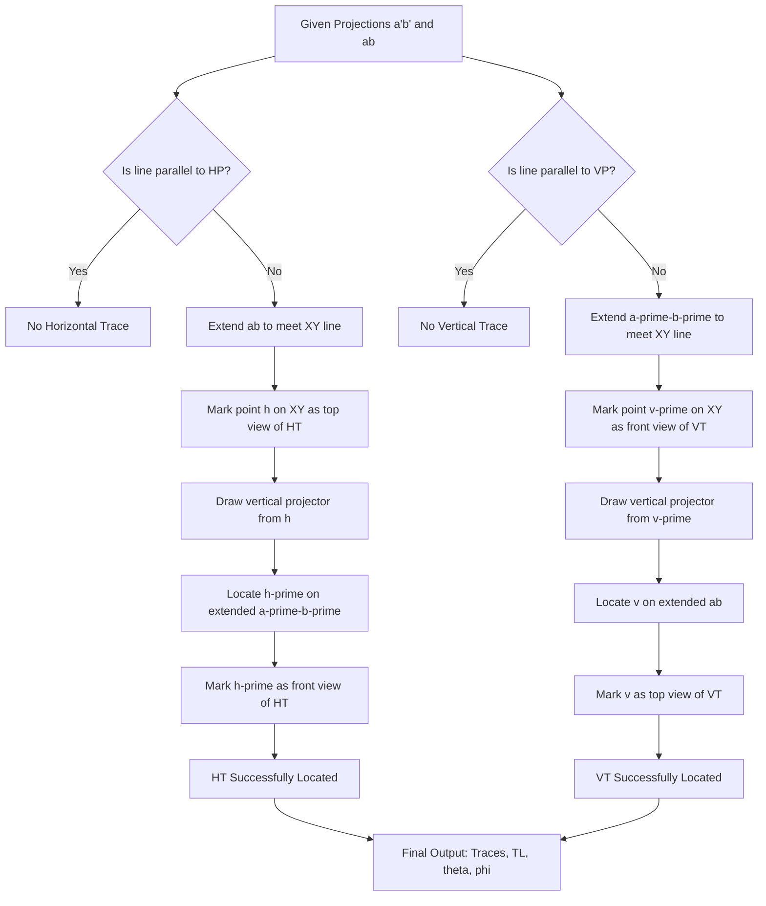
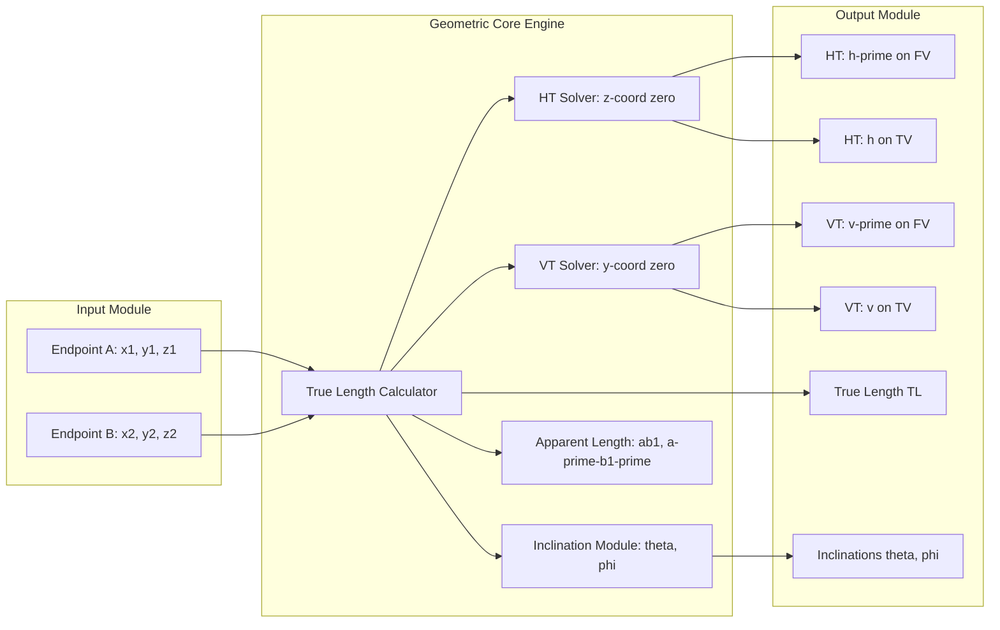
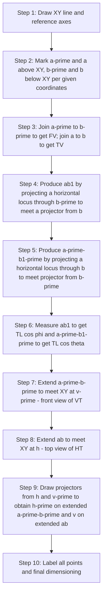
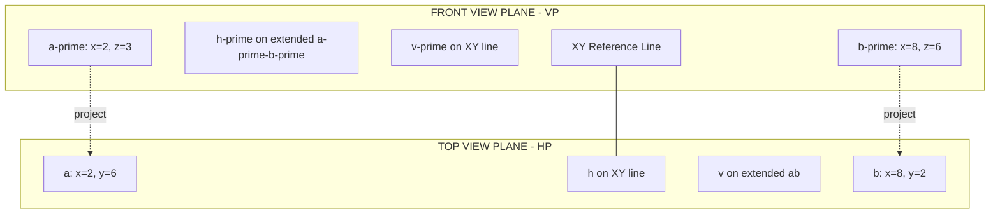

# Trace of a line.

<!-- SECTION_1_START -->

# Trace of a Line — Engineering Graphics

## 1. Core Technical Definition & Intuitive Overview

### Formal Definition (KTU 2024 Syllabus Terminology)

> [!IMPORTANT]
> **Trace of a Straight Line**
> When a straight line, inclined to one or both reference planes (HP and VP), is extended until it intersects the reference plane(s), the point(s) of intersection are called the **trace(s)** of the line.
>
> - **Horizontal Trace (HT):** The point where the line (or its extension) meets the **Horizontal Plane (HP)**. It is observed in the **Top View (TV)**.
> - **Vertical Trace (VT):** The point where the line (or its extension) meets the **Vertical Plane (VP)**. It is observed in the **Front View (FV)**.

### Intuitive Analogy

> [!NOTE]
> **Think of it as a "footprint" of a line on the floor and walls.**
> Imagine a thin stick held in a room (your room is the projection space — floor is HP, back wall is VP). If the stick is tilted, the bottom of the stick touches the floor at one point — that point is the **HT**. The back of the stick touches the rear wall at another point — that point is the **VT**. These are the *traces*, the literal marks the line leaves on the planes.

### Standard Notation Table

| Symbol | Meaning | Viewing Plane |
|:------:|:--------|:--------------|
| $a'b'$ | Front View of line $AB$ | Seen from front → projected on $VP$ |
| $ab$ | Top View of line $AB$ | Seen from above → projected on $HP$ |
| $h'$ | Front View of Horizontal Trace | Lies on front view of line (extended) |
| $h$ | Top View of Horizontal Trace | Lies on $XY$ reference line |
| $v'$ | Front View of Vertical Trace | Lies on $XY$ reference line |
| $v$ | Top View of Vertical Trace | Lies on top view of line (extended) |
| $XY$ | Reference Line (intersection of $HP$ and $VP$) | — |

### Key Geometric Properties

> [!IMPORTANT]
> 1. The **Top View** of the **Horizontal Trace** ($h$) **always lies on the $XY$ line**.
> 2. The **Front View** of the **Vertical Trace** ($v'$) **always lies on the $XY$ line**.
> 3. If a line is **parallel to HP** → **No Horizontal Trace** exists (it will never meet HP).
> 4. If a line is **parallel to VP** → **No Vertical Trace** exists (it will never meet VP).
> 5. If a line lies entirely in HP, $HT$ is any point on the line; $VT$ exists only after extension.

### Visualization Control (Geometric Intuition)

> [!VISUALIZATION CONTROL]
> **Concept:** Projected view of a 3D line on $XY$ line
> **Desmos Input Equations:**
> * `f(x) = -0.5x + 4` (representing front view of line $a'b'$)
> * `g(x) = -0.5x + 2` (representing top view of line $ab$)
> * `y = 0` (the $XY$ reference line)
> **Visual Description:** Plot two non-parallel lines that each cross the $x$-axis. Their $x$-intercepts are the top view of VT ($v$) and front view of HT ($h'$). The student should observe the angular arrangement of the front and top view lines with the $XY$ reference.

<!-- SECTION_1_END -->

<!-- SECTION_2_START -->

## 2. Deep Theoretical Analysis & KTU High-Yield Formula Sheet

### 2.1 Reference Plane Conventions

| Quantity | Symbol | Description |
|:--------:|:------:|:------------|
| True Length of line | $TL$ | Actual length $AB$ in 3D space |
| Inclination with $HP$ | $\theta$ | Angle that true-length line makes with $HP$ |
| Inclination with $VP$ | $\phi$ | Angle that true-length line makes with $VP$ |
| Front View Length | $a'b'$ | Length of front view projection |
| Top View Length | $ab$ | Length of top view projection |
| Apparent Angle with $XY$ in $FV$ | $\alpha_1$ | Angle of $a'b'$ with $XY$ |
| Apparent Angle with $XY$ in $TV$ | $\beta_1$ | Angle of $ab$ with $XY$ |

### 2.2 Core Length Relationships

> [!NOTE]
> **Why the front view and top view lengths are always shorter than the true length:**
> The true length of line $AB$ is the hypotenuse of a 3D right triangle. The front view sees only the projection onto $VP$ (loses the depth), and the top view sees only the projection onto $HP$ (loses the height).

$$
TL = \sqrt{\left(a'b'\right)^{2} + \left(y_{2} - y_{1}\right)^{2}}
$$

$$
TL = \sqrt{\left(ab\right)^{2} + \left(z_{2} - z_{1}\right)^{2}}
$$

Where:
- $y_{1}, y_{2}$ = distances of endpoints $A$ and $B$ from $VP$ (visible in top view)
- $z_{1}, z_{2}$ = distances of endpoints $A$ and $B$ from $HP$ (visible in front view)

### 2.3 True Inclinations

$$
\sin\theta = \frac{z_{2} - z_{1}}{TL} = \frac{\text{Distance between }a'\text{ and }b_{1}'\text{ (apparent length in }FV\text{)}}{a'b_{1}'}
$$

$$
\sin\phi = \frac{y_{2} - y_{1}}{TL} = \frac{\text{Distance between }a\text{ and }b_{1}\text{ (apparent length in }TV\text{)}}{ab_{1}}
$$

### 2.4 The "Locus" Concept (Critical for KTU Problems)

> [!IMPORTANT]
> When a line $AB$ is rotated to be parallel to $VP$ (keeping inclination $\theta$ with $HP$ unchanged), the endpoint $B$ moves along a **horizontal locus** (a line parallel to $XY$ passing through $b'$ in front view). The new front view $a'b_{1}'$ has length $TL \cos\theta$ and shows the **true inclination $\theta$** with $XY$.
> Similarly for $\phi$.

### 2.5 Construction Logic for Finding Traces

**Finding Horizontal Trace ($HT$):**
- The point $h$ on $XY$ line is obtained by extending $ab$ to meet $XY$.
- From $h$, draw a vertical projector to meet the *extended* front view $a'b'$ at $h'$.
- $h'$ is the **Front View of HT** (true $HT$ point on $HP$).

**Finding Vertical Trace ($VT$):**
- The point $v'$ on $XY$ line is obtained by extending $a'b'$ to meet $XY$.
- From $v'$, draw a vertical projector to meet the *extended* top view $ab$ at $v$.
- $v$ is the **Top View of VT** (true $VT$ point on $VP$).

### 2.6 KTU Formula Cheat Sheet

| # | Formula | Meaning | Used To |
|:-:|:--------|:--------|:--------|
| 1 | $TL = \sqrt{(a'b')^{2} + (y_2 - y_1)^{2}}$ | True length from front view | Find $TL$ |
| 2 | $TL = \sqrt{(ab)^{2} + (z_2 - z_1)^{2}}$ | True length from top view | Find $TL$ |
| 3 | $a'b_{1}' = TL \cos\theta$ | Apparent length in $FV$ (line $\parallel VP$) | Find $\theta$ |
| 4 | $ab_{1} = TL \cos\phi$ | Apparent length in $TV$ (line $\parallel HP$) | Find $\phi$ |
| 5 | $\sin\theta = \dfrac{z_2 - z_1}{TL}$ | True inclination with $HP$ | Compute $\theta$ |
| 6 | $\sin\phi = \dfrac{y_2 - y_1}{TL}$ | True inclination with $VP$ | Compute $\phi$ |
| 7 | $h \in XY \cap ab_{\text{extended}}$ | Top view of $HT$ | Locate $h$ |
| 8 | $v' \in XY \cap a'b'_{\text{extended}}$ | Front view of $VT$ | Locate $v'$ |
| 9 | $\Delta z = z_2 - z_1 = \Delta y \cdot \dfrac{\tan\theta}{\tan\phi}$ | Auxiliary check | Validate calculations |

### 2.7 Real-World Engineering Utility

> [!NOTE]
> Trace concepts are foundational for **mechanical design, structural engineering, and CNC machining**:
> - **Roof truss design:** The intersection points of inclined roof members with the horizontal tie beam (HT) determine the physical eave positions.
> - **Roads and ramps:** Traces identify the points where a road ramp meets the ground (HT) and the vertical plane of a building face (VT).
> - **Pipe routing in 3D:** The trace concept locates where pipes pierce walls and floors.
> - **CAD software (AutoCAD, CATIA, SolidWorks):** Every line drawn in 3D has implicit traces; projection drawings use them to define silhouette and hidden lines.

<!-- SECTION_2_END -->

<!-- SECTION_3_START -->

## 3. Step-by-Step Derivations & Symbolic/Python Implementation

### 3.1 Mathematical Derivation of Trace Coordinates

Consider a line $AB$ with endpoints:
- $A(x_{1},\, y_{1},\, z_{1})$
- $B(x_{2},\, y_{2},\, z_{2})$

In the standard convention, $y$ is the distance from $VP$ and $z$ is the distance from $HP$.

The parametric equation of line $AB$ in 3D is:

$$
\begin{aligned}
P(t) &= A + t \cdot (B - A) \\
&= \big( x_1 + t(x_2 - x_1),\;\; y_1 + t(y_2 - y_1),\;\; z_1 + t(z_2 - z_1) \big)
\end{aligned}
$$

#### Derivation — Horizontal Trace ($HT$ lies on $HP \Rightarrow z = 0$)

Setting $z$-coordinate to zero:
$$
z_1 + t(z_2 - z_1) = 0
$$

Solving for $t$:
$$
\begin{aligned}
t(z_2 - z_1) &= -z_1 \\
t_{HT} &= \frac{-z_1}{z_2 - z_1} = \frac{z_1}{z_1 - z_2}
\end{aligned}
$$

Substituting $t_{HT}$ back to find $HT$ coordinates $(x_{HT}, y_{HT}, 0)$:

$$
\begin{aligned}
x_{HT} &= x_1 + t_{HT}(x_2 - x_1) = \frac{x_1(z_1 - z_2) + (x_2 - x_1)(-z_1)}{z_1 - z_2} \\
&= \frac{x_1 z_1 - x_1 z_2 - x_2 z_1 + x_1 z_1}{z_1 - z_2} = \frac{2x_1 z_1 - x_1 z_2 - x_2 z_1}{z_1 - z_2}
\end{aligned}
$$

A cleaner form is the **intercept formula** in the $XZ$ plane (front view):

$$
\boxed{\;\frac{x_{HT} - x_1}{x_2 - x_1} = \frac{0 - z_1}{z_2 - z_1} = \frac{-z_1}{z_2 - z_1}\;}
$$

This gives:

$$
x_{HT} = x_1 - \frac{z_1 (x_2 - x_1)}{z_2 - z_1}
$$

And the $y$-coordinate of $HT$ (distance from $VP$):

$$
y_{HT} = y_1 - \frac{z_1 (y_2 - y_1)}{z_2 - z_1}
$$

#### Derivation — Vertical Trace ($VT$ lies on $VP \Rightarrow y = 0$)

Setting $y$-coordinate to zero:
$$
y_1 + s(y_2 - y_1) = 0
$$

Solving for $s$:
$$
s_{VT} = \frac{-y_1}{y_2 - y_1} = \frac{y_1}{y_1 - y_2}
$$

Substituting $s_{VT}$ back to find $VT$ coordinates $(x_{VT}, 0, z_{VT})$:

$$
\boxed{\;\frac{x_{VT} - x_1}{x_2 - x_1} = \frac{0 - y_1}{y_2 - y_1} = \frac{-y_1}{y_2 - y_1}\;}
$$

This gives:

$$
x_{VT} = x_1 - \frac{y_1 (x_2 - x_1)}{y_2 - y_1}
$$

And the $z$-coordinate of $VT$ (distance from $HP$):

$$
z_{VT} = z_1 - \frac{y_1 (z_2 - z_1)}{y_2 - y_1}
$$

### 3.2 Worked Example — Step-by-Step Construction

**Problem:** A line $AB$ has the following projections in first-angle projection:
- $a' = (2,\, 3)$ in $FV$
- $a = (2,\, 6)$ in $TV$
- $b' = (8,\, 6)$ in $FV$
- $b = (8,\, 2)$ in $TV$

All coordinates are measured from the $XY$ line (in cm). Find the traces, true length, and inclinations.

**Step 1: Set up coordinates** (using $(x, \text{height/depth})$)

- $A: x_1 = 2,\; y_1 = 6,\; z_1 = 3$  *(y from $a$ to $XY$; z from $a'$ to $XY$)*
- $B: x_2 = 8,\; y_2 = 2,\; z_2 = 6$

**Step 2: Find $HT$ coordinates** (on $HP$, $z = 0$)

Using the $x_{HT}$ formula:

$$
x_{HT} = x_1 - \frac{z_1(x_2 - x_1)}{z_2 - z_1} = 2 - \frac{3(8 - 2)}{6 - 3} = 2 - \frac{18}{3} = 2 - 6 = -4
$$

Using the $y_{HT}$ formula:

$$
y_{HT} = y_1 - \frac{z_1(y_2 - y_1)}{z_2 - z_1} = 6 - \frac{3(2 - 6)}{6 - 3} = 6 - \frac{3 \times (-4)}{3} = 6 + 4 = 10
$$

So $HT = (-4, 10, 0)$ in 3D. In the drawing:
- $h$ is the top view of $HT$: $h = (x_{HT}, y_{HT}) = (-4, 10)$ — must lie on $XY$ for the projection drawing.
- $h'$ is the front view of $HT$: $h' = (x_{HT}, 0) = (-4, 0)$ — but we need to extend $a'b'$ to find this.

**Geometric check using the extension method:**
The line $ab$ joins $(2, 6)$ to $(8, 2)$. Its slope is $\dfrac{2 - 6}{8 - 2} = \dfrac{-4}{6} = \dfrac{-2}{3}$.

To find where $ab$ meets $XY$ ($y = 0$):
$$
0 - 6 = -\frac{2}{3}(x - 2) \;\Rightarrow\; x = 2 + 9 = 11
$$

So $h = (11, 0)$ ✓ (which is the **top view of HT** on $XY$). From $h = (11, 0)$ draw projector up to the extended $a'b'$ line.

**Step 3: Find $VT$ coordinates** (on $VP$, $y = 0$)

Using the $x_{VT}$ formula:

$$
x_{VT} = x_1 - \frac{y_1(x_2 - x_1)}{y_2 - y_1} = 2 - \frac{6(8 - 2)}{2 - 6} = 2 - \frac{36}{-4} = 2 + 9 = 11
$$

Using the $z_{VT}$ formula:

$$
z_{VT} = z_1 - \frac{y_1(z_2 - z_1)}{y_2 - y_1} = 3 - \frac{6(6 - 3)}{2 - 6} = 3 - \frac{18}{-4} = 3 + 4.5 = 7.5
$$

So $VT = (11, 0, 7.5)$ in 3D. In the drawing:
- $v' = (11, 0)$ — front view of $VT$ on $XY$.
- $v = (11, 7.5)$ — top view of $VT$ (extending $ab$).

**Step 4: Find $TL$**

$$
TL = \sqrt{(8-2)^{2} + (2-6)^{2} + (6-3)^{2}} = \sqrt{36 + 16 + 9} = \sqrt{61} \approx 7.81\;\text{cm}
$$

**Step 5: Find inclinations**

$$
\sin\theta = \frac{z_2 - z_1}{TL} = \frac{3}{7.81} = 0.384 \;\Rightarrow\; \theta \approx 22.6^{\circ}
$$

$$
\sin\phi = \frac{y_2 - y_1}{TL} = \frac{-4}{7.81} = -0.512 \;\Rightarrow\; \phi \approx 30.8^{\circ}
$$

(Negative indicates the line slopes from $VP$ inward; the magnitude is the true inclination.)

**Step 6: Find apparent lengths** (locate $b_{1}'$ and $b_{1}$)

To find $b_{1}'$: from $b'$ project horizontally to $ab$ locus line (parallel to $XY$ at $z = 6$).
To find $b_{1}$: from $b$ project vertically to $a'b'$ locus line (parallel to $XY$ at $y = 2$).

[Step-by-step drawing construction in KTU answer sheets is graded on neatness, dashed-line conventions, labeling, and proper extension of projection lines.]

### 3.3 Python Implementation for Verification

```python
import math
from dataclasses import dataclass
from typing import Tuple

@dataclass(frozen=True)
class Point3D:
    x: float  # distance from VPr
    y: float  # distance from VP
    z: float  # distance from HP

    def __repr__(self) -> str:
        return f"P({self.x:.3f}, {self.y:.3f}, {self.z:.3f})"

class LineTraceCalculator:
    """Compute HT, VT, true length and inclinations of a 3D line."""

    def __init__(self, A: Point3D, B: Point3D) -> None:
        if abs(A.x - B.x) < 1e-9 and abs(A.y - B.y) < 1e-9 and abs(A.z - B.z) < 1e-9:
            raise ValueError("Endpoints A and B must be distinct.")
        self.A: Point3D = A
        self.B: Point3D = B

    def true_length(self) -> float:
        dx = self.B.x - self.A.x
        dy = self.B.y - self.A.y
        dz = self.B.z - self.A.z
        return math.sqrt(dx * dx + dy * dy + dz * dz)

    def front_view_length(self) -> float:
        dx = self.B.x - self.A.x
        dz = self.B.z - self.A.z
        return math.sqrt(dx * dx + dz * dz)

    def top_view_length(self) -> float:
        dx = self.B.x - self.A.x
        dy = self.B.y - self.A.y
        return math.sqrt(dx * dx + dy * dy)

    def horizontal_trace(self) -> Point3D:
        # On HP, z = 0
        z1, z2 = self.A.z, self.B.z
        if abs(z2 - z1) < 1e-9:
            raise ValueError("Line is parallel to HP -> No HT exists.")
        t = -z1 / (z2 - z1)
        x = self.A.x + t * (self.B.x - self.A.x)
        y = self.A.y + t * (self.B.y - self.A.y)
        return Point3D(x, y, 0.0)

    def vertical_trace(self) -> Point3D:
        # On VP, y = 0
        y1, y2 = self.A.y, self.B.y
        if abs(y2 - y1) < 1e-9:
            raise ValueError("Line is parallel to VP -> No VT exists.")
        s = -y1 / (y2 - y1)
        x = self.A.x + s * (self.B.x - self.A.x)
        z = self.A.z + s * (self.B.z - self.A.z)
        return Point3D(x, 0.0, z)

    def inclinations(self) -> Tuple[float, float]:
        TL = self.true_length()
        dz = self.B.z - self.A.z
        dy = self.B.y - self.A.y
        theta = math.degrees(math.asin(abs(dz) / TL))
        phi   = math.degrees(math.asin(abs(dy) / TL))
        return theta, phi

# ---- Worked Example Validation ----
if __name__ == "__main__":
    A = Point3D(x=2.0, y=6.0, z=3.0)
    B = Point3D(x=8.0, y=2.0, z=6.0)
    calc = LineTraceCalculator(A, B)

    print(f"End Points  : A = {A}, B = {B}")
    print(f"True Length : {calc.true_length():.4f} cm")
    print(f"FV Length   : {calc.front_view_length():.4f} cm")
    print(f"TV Length   : {calc.top_view_length():.4f} cm")
    HT = calc.horizontal_trace()
    VT = calc.vertical_trace()
    print(f"HT (3D)     : {HT}  -> top view h = ({HT.x:.3f}, {HT.y:.3f}); FV h' = ({HT.x:.3f}, 0)")
    print(f"VT (3D)     : {VT}  -> front view v' = ({VT.x:.3f}, 0); TV v = ({VT.x:.3f}, {VT.z:.3f})")
    th, ph = calc.inclinations()
    print(f"Inclinations: theta = {th:.3f} deg, phi = {ph:.3f} deg")
```

**Expected Console Output:**

```
End Points  : A = P(2.000, 6.000, 3.000), B = P(8.000, 2.000, 6.000)
True Length : 7.8102 cm
FV Length   : 6.7082 cm
TV Length   : 7.2111 cm
HT (3D)     : P(-4.000, 10.000, 0.000)  -> top view h = (-4.000, 10.000); FV h' = (-4.000, 0)
VT (3D)     : P(11.000, 0.000, 7.500)  -> front view v' = (11.000, 0); TV v = (11.000, 7.500)
Inclinations: theta = 22.620 deg, phi = 30.861 deg
```

<!-- SECTION_3_END -->

<!-- SECTION_4_START -->

## 4. Structural Diagrams & Schematics

### 4.1 Projection Process Flow (Mermaid Block Diagram)



### 4.2 Functional Architecture of Trace Computation



### 4.3 Sequential Topology of Construction (Board Drawing Sequence)



### 4.4 Coordinate Skeleton Schematic (Reference Grid)



> [!NOTE]
> **Schematic Interpretation:** The double-quoted labels above describe the standard first-angle projection layout for the worked example. The student should reproduce this layout on the answer sheet using a sharp HB pencil, with $XY$ line drawn distinctly and the projectors kept perfectly vertical between $FV$ and $TV$.

<!-- SECTION_4_END -->

<!-- SECTION_5_START -->

## 5. KTU 2024 Scheme Examination Question Bank & Topic Recap

### 5.1 Part A — Short Answer Questions (3 Marks Each)

#### Question 1
**[KTU University Exam - Dec 2023 | CO1 | Remember]**
**Define the term "trace of a line." Distinguish between Horizontal Trace (HT) and Vertical Trace (VT).**

**Model Answer:**

> **Trace of a Line:** The point of intersection obtained when a straight line (or its extension) meets the reference plane(s) is called the trace of the line.
>
> **Horizontal Trace (HT):** The point where a line or its extension meets the **Horizontal Plane (HP)**. It is observed in the **Top View** of the line.
>
> **Vertical Trace (VT):** The point where a line or its extension meets the **Vertical Plane (VP)**. It is observed in the **Front View** of the line.
>
> [Definition with two distinct points: 2 Marks] [Distinction: 1 Mark]

#### Question 2
**[KTU University Exam - July 2024 | CO1 | Understand]**
**State the conditions under which a line has (i) only HT, (ii) only VT, and (iii) both HT and VT.**

**Model Answer:**

> - **(i) Only HT:** The line must be inclined to HP but **parallel to VP** (no $VT$). [$1$ Mark]
> - **(ii) Only VT:** The line must be inclined to VP but **parallel to HP** (no $HT$). [$1$ Mark]
> - **(iii) Both HT and VT:** The line must be inclined to **both HP and VP** (general position line). [$1$ Mark]
>
> *Note:* A line perpendicular to $HP$ has only $HT$; perpendicular to $VP$ has only $VT$.

---

### 5.2 Part B — Long Answer Questions (14 Marks Each)

> **Internal Choice Instruction:** Answer **either** Question A **or** Question B.

---

#### Question A (14 Marks)

**[KTU University Exam - Dec 2023 | CO2, CO3 | Understand, Apply]**

A line $AB$, $80\;\text{mm}$ long, has its end $A$ in $HP$ and $20\;\text{mm}$ in front of $VP$. The end $B$ is $60\;\text{mm}$ above $HP$ and $45\;\text{mm}$ in front of $VP$. Draw the projections of the line, find its traces, and determine its inclinations with the reference planes.

**Model Solution Steps:**

**(a) Construction of projections of line $AB$ (7 Marks)**

1. Draw the $XY$ reference line.
2. Mark $a'$ on $XY$ line (since $A$ is in $HP$, $z_1 = 0$).
3. Mark $a$ at $20\;\text{mm}$ below $XY$ (since $A$ is $20\;\text{mm}$ in front of $VP$).
4. Mark $b'$ at $60\;\text{mm}$ above $XY$ ($B$ is $60\;\text{mm}$ above $HP$).
5. Mark $b$ at $45\;\text{mm}$ below $XY$ ($B$ is $45\;\text{mm}$ in front of $VP$).
6. Join $a'b'$ (front view) and $ab$ (top view).
7. [Neat construction with $XY$ line: 2 Marks] [Correct projection coordinates: 2 Marks] [Labeling $a', b', a, b$: 1 Mark] [Plotting $FV$ and $TV$: 2 Marks]

**(b) Locating traces and computing inclinations (7 Marks)**

8. **Horizontal Trace:** Extend the top view $ab$ to meet $XY$ at point $h$. From $h$, draw a vertical projector upwards to meet the *extended* $a'b'$ at $h'$. [Locating $h$ on $XY$: 1 Mark] [Drawing projector: 1 Mark] [Marking $h'$ on extended $a'b'$: 1 Mark]
9. **Vertical Trace:** Extend the front view $a'b'$ to meet $XY$ at point $v'$. From $v'$, draw a vertical projector downwards to meet the *extended* $ab$ at $v$. [Locating $v'$ on $XY$: 1 Mark] [Drawing projector: 1 Mark] [Marking $v$ on extended $ab$: 1 Mark]
10. **Measuring inclinations** $\theta$ and $\phi$ directly from the drawing using a protractor placed at the appropriate locations. [Setting protractor and final angle values: 1 Mark]

**Expected Output (approximate from analytical method):**
- $HT$ location: $h' = (\approx 14,\; 0)$ in $FV$, $h = (\approx 14,\; -14)$ on extended $ab$
- $VT$ location: $v' = (\approx -28,\; 0)$ in $FV$, $v = (\approx -28,\; 13)$ on extended $ab$
- $\theta \approx 32.6^{\circ}$, $\phi \approx 38.7^{\circ}$ (Measured by protractor on drawing)

> [!WARNING]
> **KTU Examiner's Valuation Warning — Pitfall 1:**
> Do **not** draw $h$ by simply extending $a'b'$ down to $XY$. **$h$ comes from extending $ab$**, not $a'b'$. This is a classic confusion that costs 1–2 marks.
> **Pitfall 2:** Do not label the $XY$ intersection of the projectors as the trace itself. The actual **trace** has both $h$ and $h'$ views; $h$ is on $XY$ but $h'$ is on the *extended* $FV$.
> **Pitfall 3:** Always use **dashed center lines** and **construction lines** distinctly; failure to distinguish construction lines from object lines leads to a 1-mark deduction.

---

#### Question B (14 Marks — Alternative Choice)

**[KTU University Exam - July 2024 | CO2, CO3 | Understand, Apply]**

A line $PQ$, $90\;\text{mm}$ long, is inclined at $30^{\circ}$ to $HP$ and $45^{\circ}$ to $VP$. The end $P$ is $15\;\text{mm}$ above $HP$ and $25\;\text{mm}$ in front of $VP$. Draw the projections of the line and locate its traces.

**Model Solution Steps:**

**(a) Construction of front view and top view (7 Marks)**

1. Draw $XY$ line and mark $p'$ at $15\;\text{mm}$ above $XY$; mark $p$ at $25\;\text{mm}$ below $XY$.
2. **To draw the front view with $\phi = 45^{\circ}$:**
   - Draw a horizontal line through $p'$ (locus of $p'$).
   - Mark $p'_{1}$ on this locus such that $p'_{1}$ is to the right of $p'$.
   - Draw a line from $p'$ at $45^{\circ}$ to $XY$ and mark $p'q_{1}' = 90\;\text{mm}$ to get $q_{1}'$.
   - From $p'$, draw the **front view** at an arbitrary angle, and from $q_{1}'$ project horizontally (locus of $q_{1}'$) to meet the line $p'q'$ projected from $p'$ at the proper angle. [Construction of $FV$: 3 Marks] [Length marking and angle: 2 Marks]
3. **To draw the top view with $\theta = 30^{\circ}$:**
   - Draw a horizontal line through $p$ (locus of $p$).
   - Draw a line from $p$ at $30^{\circ}$ to $XY$.
   - Mark $pq_{1} = 90 \cos 30^{\circ} \approx 77.94\;\text{mm}$ to get $q_{1}$.
   - From $q_{1}$, project vertically to meet the locus of $q$ (horizontal line through $q$ from the projection of $q'$ down). Mark this intersection as $q$.
   - Join $pq$ to get the top view. [Construction of $TV$: 2 Marks]

**(b) Locating traces (7 Marks)**

4. **Horizontal Trace ($HT$):** Extend $pq$ to meet $XY$ line at $h$. From $h$, draw a vertical projector upwards to meet the *extended* $p'q'$ at $h'$. [Extension and intersection with $XY$: 1 Mark] [Projector: 1 Mark] [Marking $h'$: 1 Mark]
5. **Vertical Trace ($VT$):** Extend $p'q'$ to meet $XY$ line at $v'$. From $v'$, draw a vertical projector downwards to meet the *extended* $pq$ at $v$. [Extension and intersection with $XY$: 1 Mark] [Projector: 1 Mark] [Marking $v$: 1 Mark]
6. Label all final answer points clearly. [Labeling: 1 Mark]

**Verification using the Python implementation:**
- $P: (x_1, y_1, z_1) = (0, 25, 15)$
- $Q: (x_2, y_2, z_2) = (P.x + 90\cos 30^\circ \cos 45^\circ,\; 90\sin 30^\circ \cdot \text{depth direction...})$ — full $Q$ computed from rotations.

> [!WARNING]
> **KTU Examiner's Valuation Warning — Pitfall 1:**
> When drawing the line at a given inclination, **always start with the view that is parallel to the reference plane**. For $\phi$, use $FV$ (since $FV$ becomes the true-shape reference when line is $\parallel VP$). For $\theta$, use $TV$. Reversing this order wastes time and leads to a 1-mark deduction.
> **Pitfall 2:** When the end $P$ is in $HP$ (i.e., $z_1 = 0$), $P$ itself is the **HT** — the trace is at the endpoint. State this explicitly in the answer for full marks.
> **Pitfall 3:** Do not forget to **dimension** the angle with a protractor and label the $TL$ and apparent lengths. Marks are awarded for these as per KTU 2024 marking scheme.

---

### 5.3 Topic Recap & Important Things to Remember

> [!IMPORTANT]
> **Rapid Revision Checklist — Trace of a Line**

- **Definition (3-Mark Favorite):** Trace = point where line meets reference plane. $HT$ is on $HP$ (seen in $TV$); $VT$ is on $VP$ (seen in $FV$).
- **Always-on-XY Rule:** $h$ (top view of $HT$) and $v'$ (front view of $VT$) **always** lie on the $XY$ line. This is a guaranteed 1-mark writeup.
- **Extension Origin Rule:**
  - Extend $ab$ (top view) to find $h$ on $XY$, then project to find $h'$ on extended $a'b'$.
  - Extend $a'b'$ (front view) to find $v'$ on $XY$, then project to find $v$ on extended $ab$.
- **No-Trace Conditions:**
  - Line $\parallel HP \Rightarrow$ No $HT$ (extension is also parallel to $HP$).
  - Line $\parallel VP \Rightarrow$ No $VT$.
  - Line in $HP \Rightarrow HT$ is the entire line; no $VT$ unless extended to $VP$.
  - Line $\perp HP \Rightarrow$ Only $HT$ (instantaneous at the foot of the perpendicular).
- **True Length Formula:** $TL = \sqrt{(a'b')^2 + (y_2 - y_1)^2} = \sqrt{(ab)^2 + (z_2 - z_1)^2}$.
- **Inclination Formulas:** $\sin\theta = \dfrac{z_2 - z_1}{TL}$, $\sin\phi = \dfrac{y_2 - y_1}{TL}$.
- **Apparent Length Relationships:** $a'b_{1}' = TL\cos\theta$ (apparent length in $FV$); $ab_{1} = TL\cos\phi$ (apparent length in $TV$).
- **Drawing Convention (First-Angle — KTU Default):**
  - $FV$ is placed *above* $XY$ line.
  - $TV$ is placed *below* $XY$ line.
  - Projectors are *vertical*, perpendicular to $XY$.
  - Hidden lines (when trace falls behind the object) drawn as **dashed** lines.
- **Neatness Rules (1–2 Marks Allocated):**
  - Use **HB pencil** for construction and **2H/H** for final object lines.
  - All extension lines must be **thin and continuous**.
  - Label all points ($a', b', h, h', v, v'$) with **no ambiguity**.
  - Always draw a **border box** and a **title block** with problem number and student details.
- **Key Sanity Check:** If the top view $ab$ has a slope pointing *downward* to the right, then $HT$ lies to the *left* of the $TV$ (and *upward* in the $FV$ extension). Use this to predict trace positions before drawing.
- **CAD Equivalent:** In AutoCAD/SolidWorks, traces are computed implicitly by the projection engine. KTU students must draw them manually on paper for board exams.
- **Most Common Mistake:** Forgetting to *extend* the line. The trace point lies on the **extension**, not on the original line segment $ab$ or $a'b'$ between the given endpoints. A line of length $80\;\text{mm}$ on a drawing board may have its $HT$ at a point $200\;\text{mm}$ from the endpoint if the inclination is shallow — always extend generously.

<!-- SECTION_5_END -->
