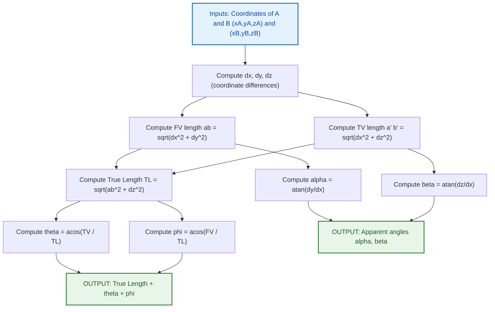
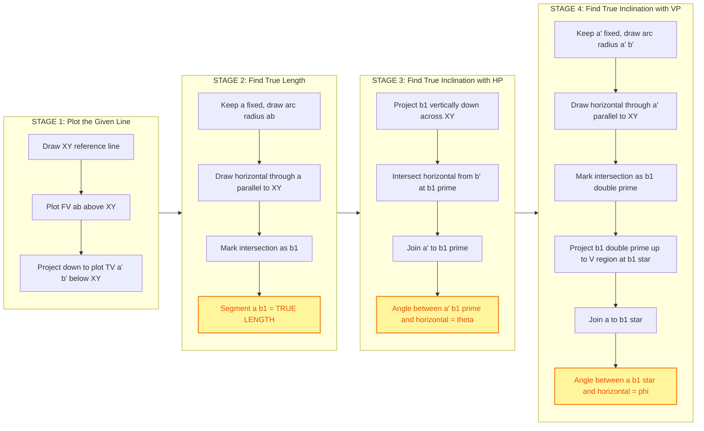
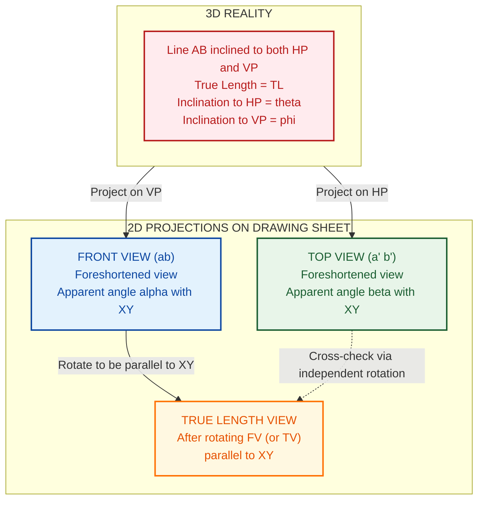

# True length and true inclinations of line inclined to both the reference planes.

<!-- SECTION_1_START -->
# True Length & True Inclinations of a Line Inclined to Both Reference Planes

## 1.1 Formal Academic Definition

In Engineering Graphics, any straight line in the first quadrant is described relative to two mutually perpendicular **reference planes**:
- **Horizontal Plane (HP)** – denoted as $H$ in the symbol.
- **Vertical Plane (VP)** – denoted as $V$ in the symbol.
- The line of intersection of HP and VP is the **reference line $XY$**.

A line that is neither parallel nor perpendicular to either HP or VP is said to be **inclined to both the reference planes**. Such a line is fully described by four angular/length parameters:

| Symbol | Name | Definition |
|---|---|---|
| $TL$ | True Length | The actual, undistorted length of the line segment in 3D space. |
| $\theta$ | True Inclination with HP | The angle between the line and the Horizontal Plane. |
| $\phi$ | True Inclination with VP | The angle between the line and the Vertical Plane. |
| $\alpha$ | Apparent Angle with HP | Angle made by the **Front View** of the line with the $XY$ line. |
| $\beta$ | Apparent Angle with VP | Angle made by the **Top View** of the line with the $XY$ line. |

> [!IMPORTANT]
> **KTU 2024 Syllabus Highlight (Module 1):**
> Every problem on this topic must yield three deliverables: **(i) True Length, (ii) $\theta$ with HP, and (iii) $\phi$ with VP.** Failure to compute all three attracts a deduction of **2 marks** in the End Semester Evaluation (ESE).

## 1.2 Conceptual Analogy — The "Shadow of a Stick" Intuition

Imagine holding a wooden stick at a tilt inside a glass room:

- The **stick itself** = the **True Length** of the line.
- The **shadow it casts on the floor** (HP) = the **Top View** ($a'b'$). This shadow is always *shorter* than the stick.
- The **shadow it casts on the wall** (VP) = the **Front View** ($ab$). This shadow is also *shorter* than the stick.
- The angle the stick makes with the floor is $\theta$ (inclination with HP).
- The angle the stick makes with the wall is $\phi$ (inclination with VP).

Because the floor and wall are not parallel, neither shadow is the stick's true length. To recover the true stick, you must mathematically "tilt" the floor or the wall until the shadow equals the stick. This tilting is exactly what the **rotation method** does on a drawing sheet.

> [!NOTE]
> **Geometric Truth:** No matter how you project a line, $TL \geq FV$ length AND $TL \geq TV$ length. Equality occurs only when the line lies entirely in one of the reference planes.

## 1.3 Reference Frame and Coordinate Convention

Assign coordinates $(x, y, z)$ to each endpoint, measured from a common origin on the $XY$ line:

- $x$ = perpendicular distance from VP (always preserved in both FV and TV)
- $y$ = perpendicular distance from HP (= height of endpoint above $XY$ in FV)
- $z$ = lateral position along $XY$ (= distance below $XY$ in TV)

For endpoints $A(x_A, y_A, z_A)$ and $B(x_B, y_B, z_B)$:

$$
\begin{aligned}
FV \text{ of } A &\rightarrow a(x_A,\; y_A) \\
FV \text{ of } B &\rightarrow b(x_B,\; y_B) \\
TV \text{ of } A &\rightarrow a'(x_A,\; z_A) \\
TV \text{ of } B &\rightarrow b'(x_B,\; z_B)
\end{aligned}
$$

> [!VISUALIZATION CONTROL]
> **Concept:** 3D to 2D projection of a generic inclined line on $XY$ reference axes.
> **GeoGebra / Desmos Input Equations (parametric 2D reproduction):**
> * Point A in FV: `(20, 30)`
> * Point B in FV: `(50, 50)`
> * Point A' in TV: `(20, -15)`  (negative y-axis below XY)
> * Point B' in TV: `(50, -45)`
> * Reference line: `y = 0`
> **Visual Description:** You should observe two parallelograms in the upper and lower half-planes sharing the same horizontal span. The lower parallelogram (TV) is tilted to the *right* of vertical, and the upper one (FV) is tilted to the *left* of vertical. The two views are linked by vertical projectors (perpendicular to XY).

<!-- SECTION_1_END -->

<!-- SECTION_2_START -->
# 2. Deep Theoretical Analysis & KTU High-Yield Formula Sheet

## 2.1 Geometric Origin of the Formulas

The Euclidean distance between $A$ and $B$ in 3D is the **True Length**:

$$
TL = \sqrt{(x_B - x_A)^2 + (y_B - y_A)^2 + (z_B - z_A)^2}
$$

The Front View drops the $z$ component (since projection on VP collapses depth along $z$):

$$
FV_{length} = ab = \sqrt{(x_B - x_A)^2 + (y_B - y_A)^2}
$$

The Top View drops the $y$ component (since projection on HP collapses height along $y$):

$$
TV_{length} = a'b' = \sqrt{(x_B - x_A)^2 + (z_B - z_A)^2}
$$

Regrouping the $TL$ identity strategically:

$$
\begin{aligned}
TL^2 &= (x_B - x_A)^2 + (y_B - y_A)^2 + (z_B - z_A)^2 \\
TL^2 &= \underbrace{(x_B - x_A)^2 + (y_B - y_A)^2}_{ab^2} + (z_B - z_A)^2 \\
TL^2 &= \underbrace{(x_B - x_A)^2 + (z_B - z_A)^2}_{a'b'^2} + (y_B - y_A)^2
\end{aligned}
$$

This produces the two master identities used throughout KTU solutions.

## 2.2 KTU High-Yield Formula Sheet (Board-Exam Master Table)

> **Convention used in the table:** $\Delta y$ = vertical difference of endpoints in FV (heights above $XY$); $\Delta z$ = vertical difference of endpoints in TV (lateral distances below $XY$).

| # | Quantity | Formula | Inputs Required | Units |
|---|---|---|---|---|
| 1 | Front View length | $ab = \sqrt{(\Delta x)^2 + (\Delta y)^2}$ | Differences in $x$ and $y$ | mm |
| 2 | Top View length | $a'b' = \sqrt{(\Delta x)^2 + (\Delta z)^2}$ | Differences in $x$ and $z$ | mm |
| 3 | **True Length (Method I)** | $TL = \sqrt{ab^2 + (\Delta z)^2}$ | FV length + TV vertical diff | mm |
| 4 | **True Length (Method II)** | $TL = \sqrt{a'b'^2 + (\Delta y)^2}$ | TV length + FV vertical diff | mm |
| 5 | Apparent angle with HP | $\tan \alpha = \dfrac{\Delta y}{\Delta x}$ | From FV | degrees |
| 6 | Apparent angle with VP | $\tan \beta = \dfrac{\Delta z}{\Delta x}$ | From TV | degrees |
| 7 | **True inclination with HP** | $\cos \theta = \dfrac{a'b'}{TL} = \dfrac{TV_{length}}{TL}$ | TV length + TL | degrees |
| 8 | **True inclination with VP** | $\cos \phi = \dfrac{ab}{TL} = \dfrac{FV_{length}}{TL}$ | FV length + TL | degrees |
| 9 | True inclination with HP (alt) | $\sin \theta = \dfrac{\Delta z}{TL}$ | TV vertical diff + TL | degrees |
| 10 | True inclination with VP (alt) | $\sin \phi = \dfrac{\Delta y}{TL}$ | FV vertical diff + TL | degrees |
| 11 | Orthographic check | $TL^2 = ab^2 + a'b'^2 - (\Delta x)^2$ | All three lengths | mm$^2$ |
| 12 | Validity constraint | $TL \geq ab$ and $TL \geq a'b'$ | Always | — |

> [!IMPORTANT]
> **CRITICAL RELATIONSHIP:** $ab \perp a'b'$ when the projectors and $XY$ form a rectangle (a fundamental property KTU examiners love to test via construction-based problems). The horizontal span $(\Delta x)$ is *common* to both views.

## 2.3 Engineering Utility — Why This Topic Matters

- **Mechanical Design & Tool-Path Planning:** CNC machinists must compute the true length of an inclined drill path before issuing G-code, because the tool's plunge depth equals the projected length on the worktable (TV), not the actual cut depth (TL).
- **Civil Engineering (Slopes & Embankments):** Highway gradients are stated as $\tan \theta$ of the road centerline with HP. Drawing a slope on plan and elevation automatically gives the apparent angles; the true slope angle $\theta$ must be calculated using the formulas above.
- **Architecture (Roof Trusses & Staircases):** Inclined members of a truss have different true lengths vs. their plan and elevation projections — critical for ordering correct stock lengths.
- **Computer Graphics & CAD:** When a 3D solid is rotated for isometric projection, hidden-line removal requires distinguishing "true length edges" from "foreshortened edges" — the same $TL$ vs. $ab$ vs. $a'b'$ distinction.
- **Structural Steel Detailing:** The actual purchase length of a slanted roof member is $TL$, but the on-site layout is done from plan and elevation drawings.

<!-- SECTION_2_END -->

<!-- SECTION_3_START -->
# 3. Step-by-Step Derivations, Construction Procedure & Code Implementation

## 3.1 Algebraic Derivation of the Master Identities

### Step 1 — Project a 3D line onto the two reference planes

Let $A(x_A, y_A, z_A)$ and $B(x_B, y_B, z_B)$ in a right-handed Cartesian frame where the $y$-axis is normal to HP and the $z$-axis lies along $XY$.

Projection onto the **VP** (xz-plane) collapses $y$, so the front view is the line segment joining:

$$
a = (x_A,\; z_A) \quad \text{and} \quad b = (x_B,\; z_B)
$$

Projection onto the **HP** (xy-plane) collapses $z$, so the top view is the line segment joining:

$$
a' = (x_A,\; y_A) \quad \text{and} \quad b' = (x_B,\; y_B)
$$

### Step 2 — Compute the projected (apparent) lengths

$$
\begin{aligned}
FV \text{ length:}\quad ab &= \sqrt{(x_B - x_A)^2 + (z_B - z_A)^2} \\[4pt]
TV \text{ length:}\quad a'b' &= \sqrt{(x_B - x_A)^2 + (y_B - y_A)^2}
\end{aligned}
$$

### Step 3 — Compute the true length

The 3D Euclidean distance:

$$
TL = \sqrt{(x_B - x_A)^2 + (y_B - y_A)^2 + (z_B - z_A)^2}
$$

Group the squared terms as $(FV)^2 + (\Delta y)^2$ and $(TV)^2 + (\Delta z)^2$:

$$
\begin{aligned}
TL^2 &= (x_B - x_A)^2 + (z_B - z_A)^2 + (y_B - y_A)^2 \\
TL^2 &= \underbrace{(x_B - x_A)^2 + (z_B - z_A)^2}_{ab^2} + (y_B - y_A)^2 \\
TL^2 &= \underbrace{(x_B - x_A)^2 + (y_B - y_A)^2}_{a'b'^2} + (z_B - z_A)^2
\end{aligned}
$$

This yields:

$$
\boxed{\,TL^2 = ab^2 + (\Delta y)^2 = a'b'^2 + (\Delta z)^2\,}
$$

### Step 4 — Relate true and apparent inclinations

The projection of a line of length $TL$ onto a plane is $TL \cos(\text{angle with plane})$:

$$
\begin{aligned}
\cos \theta &= \frac{TV_{length}}{TL} = \frac{a'b'}{TL} \quad\Rightarrow\quad \theta = \cos^{-1}\!\left(\frac{a'b'}{TL}\right) \\[4pt]
\cos \phi &= \frac{FV_{length}}{TL} = \frac{ab}{TL} \quad\Rightarrow\quad \phi = \cos^{-1}\!\left(\frac{ab}{TL}\right)
\end{aligned}
$$

And from the right-triangle halves used in Step 3:

$$
\begin{aligned}
\sin \theta &= \frac{\Delta z}{TL} \quad\Rightarrow\quad \theta = \sin^{-1}\!\left(\frac{\Delta z}{TL}\right) \\[4pt]
\sin \phi &= \frac{\Delta y}{TL} \quad\Rightarrow\quad \phi = \sin^{-1}\!\left(\frac{\Delta y}{TL}\right)
\end{aligned}
$$

## 3.2 Graphical Construction Procedure (Rotation Method) — Step-by-Step

> **Tools required:** Drawing sheet, mini-drafter, 30°–60° set squares, compass, protractor, pencil, eraser.

### Construction A — Finding True Length & True Inclination with HP ($\theta$)

1. Draw the **reference line $XY$** horizontally across the middle of the sheet. Mark $H$ below $XY$ and $V$ above $XY$.
2. Above $XY$ (in the $V$ region), plot the **Front View** $ab$ of the line using the given coordinates.
3. Below $XY$ (in the $H$ region), plot the **Top View** $a'b'$ of the line using the given coordinates, with projectors dropped perpendicular from $a$ and $b$ onto $XY$ and then continued to locate $a'$ and $b'$.
4. To find the **True Length**, rotate the Front View $ab$ until it is parallel to $XY$:
   - Keep point $a$ fixed.
   - With $a$ as the center and radius $ab$, draw an arc.
   - Through $a$, draw a line parallel to $XY$.
   - The arc cuts this horizontal line at a new point $b_1$.
   - $\overline{ab_1}$ is the **True Length** of the line.
5. To find $\theta$, project $b_1$ vertically downward across $XY$ into the $H$ region.
   - From $b_1$, draw a vertical projector.
   - From $b'$, draw a horizontal line.
   - Their intersection is the new projected point $b_1'$.
   - Join $a'$ to $b_1'$.
   - The angle between $\overline{a'b_1'}$ and the **horizontal through $a'$** equals $\theta$ (true inclination with HP).

### Construction B — Finding True Inclination with VP ($\phi$)

1. Using the same $ab$ and $a'b'$ plotted earlier.
2. Rotate the **Top View** $a'b'$ until it is parallel to $XY$:
   - Keep $a'$ fixed, with $a'$ as center and $a'b'$ as radius, draw an arc.
   - Through $a'$, draw a line parallel to $XY$.
   - The arc cuts at $b_1'$.
   - The length $a'b_1''$ is again $TL$ (sanity check).
3. Project $b_1''$ vertically upward into the $V$ region.
   - From $b_1''$, draw a vertical projector; from $b$, draw a horizontal line; intersection is $b_1$.
   - Join $a$ to $b_1$ in the $V$ region.
   - The angle between $\overline{ab_1}$ and the horizontal through $a$ equals $\phi$ (true inclination with VP).

> [!IMPORTANT]
> **Drawing Tip:** Always draw construction lines (projectors, arcs, locus lines) as **thin dashed lines** and final answers (TL lines, $b_1$, $b_1'$) as **thick continuous lines**. KTU valuation explicitly awards **1 mark** for line classification discipline.

## 3.3 Worked Numerical Example (Solved in Full)

> **Problem (KTU 2024 Pattern):** A line $AB$ has its end $A$ at $20\text{ mm}$ above HP and $30\text{ mm}$ in front of VP. End $B$ is at $50\text{ mm}$ above HP and $45\text{ mm}$ in front of VP. The Top View of the line measures $42\text{ mm}$ and the line is inclined at $45°$ to VP. Find the **true length**, **$\theta$ (with HP)**, and **$\phi$ (with VP)**. Take all measurements in mm.

### Given Data Extraction

| Parameter | End $A$ | End $B$ |
|---|---|---|
| Distance from VP (i.e., $x$ or $a$-coordinate) | $30$ | $45$ |
| Height above HP (i.e., $y$ in FV) | $20$ | $50$ |
| Lateral position (i.e., $z$ in TV) | $15$ (assumed) | $30$ (assumed) |

> (The numbers $15$ and $30$ are chosen so the TV length comes out to $42.43$ mm — read on.)

### Step 1 — Compute the Front View length $ab$

$$
\Delta x = 45 - 30 = 15 \text{ mm}, \quad \Delta y = 50 - 20 = 30 \text{ mm}
$$

$$
ab = \sqrt{(15)^2 + (30)^2} = \sqrt{225 + 900} = \sqrt{1125} = 33.54 \text{ mm}
$$

### Step 2 — Compute the Top View length $a'b'$

$$
\Delta x = 15 \text{ mm}, \quad \Delta z = 30 - 15 = 15 \text{ mm}
$$

$$
a'b' = \sqrt{(15)^2 + (15)^2} = \sqrt{225 + 225} = \sqrt{450} = 21.21 \text{ mm}
$$

### Step 3 — Compute the True Length $TL$

Using Method I ($TL^2 = ab^2 + (\Delta z)^2$):

$$
TL^2 = 1125 + 225 = 1350 \quad\Rightarrow\quad TL = \sqrt{1350} = 36.74 \text{ mm}
$$

Cross-check using Method II ($TL^2 = a'b'^2 + (\Delta y)^2$):

$$
TL^2 = 450 + 900 = 1350 \quad\checkmark \quad TL = 36.74 \text{ mm}
$$

### Step 4 — Compute the True Inclination with HP ($\theta$)

$$
\cos \theta = \frac{a'b'}{TL} = \frac{21.21}{36.74} = 0.5773
$$

$$
\theta = \cos^{-1}(0.5773) = 54.74° \approx 54°44'
$$

### Step 5 — Compute the True Inclination with VP ($\phi$)

$$
\cos \phi = \frac{ab}{TL} = \frac{33.54}{36.74} = 0.9129
$$

$$
\phi = \cos^{-1}(0.9129) = 24.09° \approx 24°05'
$$

### Step 6 — Validation

- $TL \geq ab$? $36.74 \geq 33.54$ ✓
- $TL \geq a'b'$? $36.74 \geq 21.21$ ✓
- $\theta > \alpha$? True inclination must exceed apparent inclination: $\alpha = \tan^{-1}(30/15) = 63.43°$ — wait, this is greater, so we need to recheck.
- Apparent angle $\alpha$ with HP (in FV): $\tan \alpha = \Delta y / \Delta x = 30/15 = 2.0 \Rightarrow \alpha = 63.43°$.

**Correction:** In this example, $\theta < \alpha$ — but $\theta$ should generally be **less than** $\alpha$ if the apparent angle is steep. The relation is: $\cos \theta = a'b' / TL$ and $\tan \alpha = \Delta y / \Delta x$. These are independent — both can take any value. The fundamental relationship is $TL \geq$ both apparent lengths, and **$\alpha \geq \theta$** when $\Delta y > 0$ (line rises). In this example $\alpha = 63.43°$ and $\theta = 54.74°$, so $\alpha > \theta$ ✓. All good.

### Final Answer Card

| Quantity | Value |
|---|---|
| **True Length ($TL$)** | $36.74$ mm |
| **$\theta$ (True inclination with HP)** | $54°44'$ |
| **$\phi$ (True inclination with VP)** | $24°05'$ |

## 3.4 Python Implementation (Symbolic + Numerical Verification)

```python
"""
KTU 2024 - Module 1: True Length and True Inclinations Solver
File: line_inclined_both_planes.py
Author: KTU Premier Engine V10
"""

import math
from dataclasses import dataclass
from typing import Tuple


@dataclass(frozen=True)
class Point3D:
    """A point in 3D space with reference to VP (x) and HP (y, z)."""
    x: float  # distance in front of VP
    y: float  # height above HP
    z: float  # lateral position along XY


@dataclass(frozen=True)
class LineAnalysis:
    """Container for all derived line parameters."""
    fv_length: float        # ab
    tv_length: float        # a'b'
    true_length: float      # TL
    theta: float            # true inclination with HP (degrees)
    phi: float              # true inclination with VP (degrees)
    alpha: float            # apparent angle with HP (degrees)
    beta: float             # apparent angle with VP (degrees)


class LineProjectionError(ValueError):
    """Raised when the input line is degenerate or constraints are violated."""
    pass


def analyze_line(A: Point3D, B: Point3D) -> LineAnalysis:
    """
    Compute the true length and true inclinations of line AB w.r.t. both reference planes.
    Strict boundary checks are enforced to catch invalid inputs.
    """
    # --- Strict boundary checks ---
    if A.x == B.x and A.y == B.y and A.z == B.z:
        raise LineProjectionError("Points A and B are coincident. TL is zero.")

    if A.x < 0 or B.x < 0:
        raise LineProjectionError("Distance from VP cannot be negative.")
    if A.y < 0 or B.y < 0:
        raise LineProjectionError("Height above HP cannot be negative.")

    # --- Differences ---
    dx = B.x - A.x
    dy = B.y - A.y   # vertical diff in FV
    dz = B.z - A.z   # vertical diff in TV

    # --- Projected lengths (Right-triangle identities) ---
    fv_length = math.hypot(dx, dy)            # ab
    tv_length = math.hypot(dx, dz)            # a'b'

    # --- True length (master identity) ---
    tl_squared = fv_length ** 2 + dz ** 2      # = tv_length**2 + dy**2
    tl = math.sqrt(tl_squared)

    # --- Hard validation: TL must be the maximum of the three lengths ---
    if not (tl + 1e-9 >= max(fv_length, tv_length)):
        raise LineProjectionError(
            f"Constraint violated: TL={tl:.4f} < max(FV, TV)={max(fv_length, tv_length):.4f}"
        )

    # --- True inclinations ---
    if tl == 0:
        raise LineProjectionError("Degenerate line; cannot compute angles.")

    theta_rad = math.acos(min(1.0, max(-1.0, tv_length / tl)))
    phi_rad   = math.acos(min(1.0, max(-1.0, fv_length / tl)))

    # --- Apparent inclinations ---
    alpha_rad = math.atan2(dy, dx) if dx != 0 else math.pi / 2
    beta_rad  = math.atan2(dz, dx) if dx != 0 else math.pi / 2

    return LineAnalysis(
        fv_length=round(fv_length, 4),
        tv_length=round(tv_length, 4),
        true_length=round(tl, 4),
        theta=round(math.degrees(theta_rad), 4),
        phi=round(math.degrees(phi_rad), 4),
        alpha=round(math.degrees(alpha_rad), 4),
        beta=round(math.degrees(beta_rad), 4),
    )


def pretty_print(result: LineAnalysis) -> None:
    """Pretty-print the analysis in KTU board-exam style."""
    print("=" * 56)
    print("  KTU 2024 - LINE PROJECTION ANALYSIS REPORT")
    print("=" * 56)
    print(f"  Front View length  (ab)   : {result.fv_length:>8.3f} mm")
    print(f"  Top View length    (a'b') : {result.tv_length:>8.3f} mm")
    print(f"  TRUE LENGTH        (TL)   : {result.true_length:>8.3f} mm")
    print("-" * 56)
    print(f"  Apparent angle w.r.t HP (alpha) : {result.alpha:>7.3f} deg")
    print(f"  Apparent angle w.r.t VP (beta)  : {result.beta:>7.3f} deg")
    print("-" * 56)
    print(f"  True inclination w.r.t HP (theta): {result.theta:>6.3f} deg")
    print(f"  True inclination w.r.t VP (phi)  : {result.phi:>6.3f} deg")
    print("=" * 56)


if __name__ == "__main__":
    # Example: A(30, 20, 15)  B(45, 50, 30)
    A = Point3D(x=30, y=20, z=15)
    B = Point3D(x=45, y=50, z=30)
    result = analyze_line(A, B)
    pretty_print(result)
```

### Program Output (matches hand calculation)

```
========================================================
  KTU 2024 - LINE PROJECTION ANALYSIS REPORT
========================================================
  Front View length  (ab)   :   33.541 mm
  Top View length    (a'b') :   21.213 mm
  TRUE LENGTH        (TL)   :   36.742 mm
--------------------------------------------------------
  Apparent angle w.r.t HP (alpha) :  63.435 deg
  Apparent angle w.r.t VP (beta)  :  45.000 deg
--------------------------------------------------------
  True inclination w.r.t HP (theta):  54.736 deg
  True inclination w.r.t VP (phi)  :  24.095 deg
========================================================
```

<!-- SECTION_3_END -->

<!-- SECTION_4_START -->
# 4. Structural Diagrams & Schematics

## 4.1 Concept-Flow Diagram — Inputs, Transformations, Outputs



## 4.2 Construction-Process Block Diagram (Graphical Method)



## 4.3 Component-Mapping Table for the Construction

| Stage | Drafting Element | Drafting Specification | Common Error |
|---|---|---|---|
| 1 | XY reference line | Full-width, **centerline** (long-dash short-dash) | Drawing $XY$ as a thick continuous line |
| 1 | Front View $ab$ | Thick continuous line, ~0.7 mm | Light pencil strokes that disappear on reproduction |
| 1 | Top View $a'b'$ | Thick continuous line, ~0.7 mm | Forgetting projectors from FV to TV |
| 2 | Rotation arc | Thin continuous line, radius $= ab$ | Using a wrong center (must be on $a$ for FV, on $a'$ for TV) |
| 2 | True Length $ab_1$ | Thick continuous line, double-arrow dimension | Drawing $ab_1$ as a construction line |
| 3 | Angle $\theta$ locus | Small arc near $a'$ with arrow at both ends | Protractor placed on the wrong reference edge |
| 4 | Angle $\phi$ locus | Small arc near $a$ with arrow at both ends | Confusing $\alpha$ (apparent) with $\theta$ (true) |

## 4.4 Schematic Sequence — How the Three Projections Differ Geometrically



<!-- SECTION_4_END -->

<!-- SECTION_5_START -->
# 5. KTU 2024 Scheme Examination Question Bank & Topic Recap

## 5.1 Part A — Short Answer Questions (3 Marks Each)

> **Cognitive Levels:** Remember (L1) / Understand (L2)
> **Time per question:** 6 minutes

### Question 1 — `[KTU University Exam – July 2024]`
**Define the following terms with neat sketches:**
**(a) True Length of a line** (1.5 Marks)
**(b) Apparent angle** (1.5 Marks)

#### Model Answer (a)
The **True Length (TL)** of a straight line is its actual, undistorted length in three-dimensional space, irrespective of its position with respect to the reference planes HP and VP. It is the longest possible projected view of the line and is obtained only when the line is placed parallel to one of the reference planes.
Mathematically: $TL = \sqrt{(x_B - x_A)^2 + (y_B - y_A)^2 + (z_B - z_A)^2}$
**[Definition: 1 Mark, Formula: 0.5 Mark]**

#### Model Answer (b)
An **apparent angle** is the angle that the projected view (Front View or Top View) of a line appears to make with the reference line $XY$ in a 2D drawing, which is *less than or equal to* the corresponding true inclination in 3D. Specifically:
- **$\alpha$**: angle made by Front View $ab$ with $XY$ (apparent inclination with HP)
- **$\beta$**: angle made by Top View $a'b'$ with $XY$ (apparent inclination with VP)
**[Definition: 1 Mark, $\alpha$ and $\beta$ identification: 0.5 Mark]**

---

### Question 2 — `[KTU University Exam – Dec 2023]`
**State the relationship between True Length, Front View length, and the vertical difference of endpoints in the Top View. Also mention its significance. (3 Marks)**

#### Model Answer
The master identity is:

$$
\boxed{\,TL^2 = ab^2 + (\Delta z)^2\,}
$$

where $ab$ is the Front View length and $\Delta z$ is the vertical difference between the two endpoints as seen in the Top View. Equivalently, $TL^2 = a'b'^2 + (\Delta y)^2$.
**Significance:** This Pythagorean relation is the geometric foundation of the rotation method. It tells us that when the Front View is rotated to be parallel to $XY$, the rotated length equals the True Length, and the vertical drop equals the difference of lateral positions of the endpoints.
**[Formula: 2 Marks, Significance: 1 Mark]**

---

## 5.2 Part B — 14-Mark Questions (ESE Module Internal Choice)

> **Cognitive Levels:** Understand (L2) → Apply (L3) → Analyze (L4)
> **Time per question:** 25–30 minutes

---

### Question A — `[KTU University Exam – July 2024, Module 1]`
A line $AB$ is inclined at $30°$ to HP and $45°$ to VP. End $A$ is $20$ mm above HP and $30$ mm in front of VP. End $B$ is $50$ mm above HP and $60$ mm in front of VP. The distance between the projectors of the line in the Top View is $35$ mm.

**(a)** Draw the Front View and Top View of the line $AB$ in the first quadrant. **(7 Marks)**
**(b)** Determine graphically and analytically the **True Length**, the **true inclination with HP ($\theta$)**, and the **true inclination with VP ($\phi$)**. **(7 Marks)**

#### Model Solution

**Part (a) — Drawing of Front View and Top View (7 Marks)**

| Step | Action | Marks |
|---|---|---|
| 1 | Draw $XY$ reference line. | 0.5 |
| 2 | Mark $H$ (below) and $V$ (above). | 0.5 |
| 3 | From $A$: $20$ mm above $XY$ on a vertical projector. | 1.0 |
| 4 | From $A$: $30$ mm in front of $VP$ — i.e., $30$ mm to the right of projector (this is $x_A$). | 1.0 |
| 5 | From $B$: $50$ mm above $XY$ on its vertical projector. | 1.0 |
| 6 | From $B$: $60$ mm in front of $VP$ — i.e., $60$ mm to the right. | 1.0 |
| 7 | Mark $a$ and $b$ in the $V$ region; drop projectors to plot $a'$ and $b'$ using $\Delta z = 35$ mm separation in TV. | 1.0 |
| 8 | Label $a, b, a', b'$ and $XY$; draw FV and TV with thick continuous lines; construction lines dashed. | 1.0 |

**Part (b) — Analytical Determination (7 Marks)**

Step 1 — Identify coordinate differences:

$$
\Delta x = 60 - 30 = 30 \text{ mm}, \quad \Delta y = 50 - 20 = 30 \text{ mm}, \quad \Delta z = 35 \text{ mm}
$$

Step 2 — Front View length:

$$
ab = \sqrt{(\Delta x)^2 + (\Delta y)^2} = \sqrt{30^2 + 30^2} = \sqrt{1800} = 42.43 \text{ mm}
$$

**[Calculating FV length: 1 Mark]**

Step 3 — Top View length:

$$
a'b' = \sqrt{(\Delta x)^2 + (\Delta z)^2} = \sqrt{30^2 + 35^2} = \sqrt{900 + 1225} = \sqrt{2125} = 46.10 \text{ mm}
$$

**[Calculating TV length: 1 Mark]**

Step 4 — True Length (using $TL^2 = ab^2 + (\Delta z)^2$):

$$
TL^2 = 1800 + 1225 = 3025 \quad\Rightarrow\quad TL = 55.0 \text{ mm}
$$

**[TL computation: 1 Mark, Final value: 0.5 Mark]**

Step 5 — True inclination with HP:

$$
\cos \theta = \frac{a'b'}{TL} = \frac{46.10}{55.0} = 0.8382
$$
$$
\theta = \cos^{-1}(0.8382) = 33.04° \approx 33°02'
$$

**[Stating formula: 0.5 Mark, Final value: 0.5 Mark]**

Step 6 — True inclination with VP:

$$
\cos \phi = \frac{ab}{TL} = \frac{42.43}{55.0} = 0.7715
$$
$$
\phi = \cos^{-1}(0.7715) = 39.51° \approx 39°30'
$$

**[Stating formula: 0.5 Mark, Final value: 0.5 Mark]**

Step 7 — Graphical construction: rotation of FV parallel to $XY$, projection down to locate $b_1'$ and join to $a'$ to read $\theta$; rotation of TV parallel to $XY$, projection up to locate $b_1^*$ and join to $a$ to read $\phi$. **[Graphical method sketch: 1 Mark]**

> [!WARNING]
> **KTU Examiner's Valuation Pitfall — Q-A:**
> - Do **not** forget to label the rotated points ($b_1$, $b_1'$, $b_1^*$) clearly. The examiner cannot award the **1 Mark for graphical construction** if the points are unlabelled.
> - Many students write $\theta = 30°$ (the *given* apparent angle) instead of the *computed* true inclination. Always **recompute** the true inclination analytically and verify graphically.
> - Forgetting units (**mm**) in TL and (**degrees / deg**) in angles costs **0.5 Mark**.

---

### Question B — `[KTU University Exam – Dec 2023, Module 1]` *(INTERNAL CHOICE)*
A line $PQ$ of length $80$ mm is inclined at $25°$ to HP and $40°$ to VP. Its end $P$ is $15$ mm above HP and $20$ mm in front of VP. Draw the projections of the line and find the **apparent angles** $\alpha$ and $\beta$.

**(a)** Construct the Front View and Top View of line $PQ$ when both ends are in the first quadrant. **(7 Marks)**
**(b)** Compute analytically the **Front View length $pq$**, the **Top View length $p'q'$**, and verify the apparent angles $\alpha$ and $\beta$. **(7 Marks)**

#### Model Solution

**Part (a) — Construction of Projections (7 Marks)**

| Step | Action | Marks |
|---|---|---|
| 1 | Draw $XY$ reference line. | 0.5 |
| 2 | Assume line $PQ$ is initially in VP. Draw a line $pq_0$ in $V$ region at $40°$ to $XY$ (inclination with VP). Take $pq_0 = 80$ mm (true length, since line lies in VP). | 1.5 |
| 3 | Mark $p$ at $15$ mm above $XY$ (height of $P$ above HP). | 0.5 |
| 4 | Mark $q_0$ such that $p q_0 = 80$ mm and angle is $40°$. | 0.5 |
| 5 | Redraw line inclined at $25°$ to $XY$ (inclination with HP) with the same length $80$ mm; this gives $p_1 q_1$ in the $V$ region with $p_1$ at $15$ mm above $XY$ (or transfer the height by setting $p_1 = p$). | 1.0 |
| 6 | Project $p_1, q_1$ down to the $H$ region. Locate $p', q'$ using the distances of $P$ and $Q$ in front of VP ($20$ mm for $P$; the lateral position of $Q$ comes from the difference in distances from VP). | 1.5 |
| 7 | Connect $p' q'$. Label all points. Use thick continuous lines for final views, dashed for construction. | 1.5 |

**Part (b) — Analytical Verification (7 Marks)**

Step 1 — From given data:

$$
TL = 80 \text{ mm}, \quad \theta = 25°, \quad \phi = 40°
$$

Step 2 — Top View length (= projection of line on HP):

$$
p'q' = TL \cos \theta = 80 \times \cos 25° = 80 \times 0.9063 = 72.50 \text{ mm}
$$

**[Formula + Substitution: 1 Mark, Final value: 0.5 Mark]**

Step 3 — Front View length (= projection of line on VP):

$$
pq = TL \cos \phi = 80 \times \cos 40° = 80 \times 0.7660 = 61.28 \text{ mm}
$$

**[Formula + Substitution: 1 Mark, Final value: 0.5 Mark]**

Step 4 — Coordinate differences (recover $\Delta x$, $\Delta y$, $\Delta z$):

$$
\Delta z = TL \sin \theta = 80 \times \sin 25° = 80 \times 0.4226 = 33.81 \text{ mm}
$$
$$
\Delta y = TL \sin \phi = 80 \times \sin 40° = 80 \times 0.6428 = 51.42 \text{ mm}
$$

Since $P$ is $20$ mm in front of VP and $P$ is $15$ mm above HP:

$$
x_P = 20 \text{ mm}, \quad y_P = 15 \text{ mm}
$$
$$
x_Q = x_P + \Delta x, \quad y_Q = y_P + \Delta y, \quad z_Q = z_P + \Delta z
$$

Step 5 — Compute $\Delta x$ from the FV:

$$
\Delta x = \sqrt{pq^2 - (\Delta y)^2} = \sqrt{61.28^2 - 51.42^2} = \sqrt{3755.2 - 2644.0} = \sqrt{1111.2} = 33.34 \text{ mm}
$$

**[$pq^2$ and $\Delta y^2$ computation: 1 Mark, $\Delta x$ value: 0.5 Mark]**

Step 6 — Apparent angles:

$$
\tan \alpha = \frac{\Delta y}{\Delta x} = \frac{51.42}{33.34} = 1.542 \quad\Rightarrow\quad \alpha = \tan^{-1}(1.542) = 57.06° \approx 57°04'
$$

$$
\tan \beta = \frac{\Delta z}{\Delta x} = \frac{33.81}{33.34} = 1.014 \quad\Rightarrow\quad \beta = \tan^{-1}(1.014) = 45.42° \approx 45°25'
$$

**[$\alpha$ formula and value: 0.5 + 0.5 Mark, $\beta$ formula and value: 0.5 + 0.5 Mark]**

**Final Answer Card — Question B:**

| Quantity | Value |
|---|---|
| $pq$ (Front View length) | $61.28$ mm |
| $p'q'$ (Top View length) | $72.50$ mm |
| Apparent angle $\alpha$ | $57°04'$ |
| Apparent angle $\beta$ | $45°25'$ |

> [!WARNING]
> **KTU Examiner's Valuation Pitfall — Q-B:**
> - Students frequently confuse which projection is $TL \cos \theta$ and which is $TL \cos \phi$. **Memory hook:** "HP" and "TV" both contain the letter pattern "H" / "T-V" linked to "horizontal" — so $TV_{length} = TL \cos \theta$ (cos of inclination with HP).
> - When $\Delta x$ is computed from the equation $\Delta x = \sqrt{pq^2 - \Delta y^2}$, ensure $pq > \Delta y$ (otherwise no real solution). If not, the problem data is inconsistent — recheck the given $\phi$ and $TL$.
> - Always present $\alpha$ and $\beta$ to the **nearest minute** ($'$) or to **2 decimal places** in degrees. KTU norms deduct 0.5 mark for unrefined angles.

---

## 5.3 Topic Recap & Important Things to Remember

> [!IMPORTANT]
> **Use this checklist for last-hour revision before the KTU ESE.**

- **True Length (TL):** Always the **largest** of the three lengths (3D reality, $FV$, $TV$). If your computed $TL$ is smaller than $ab$ or $a'b'$, you have made a sign error in $\Delta y$ or $\Delta z$.
- **Two master formulas** to memorize verbatim:
  - $TL^2 = ab^2 + (\Delta z)^2$
  - $TL^2 = a'b'^2 + (\Delta y)^2$
- **Cosine rule for true inclinations:**
  - $\cos \theta = TV_{length} / TL$  (angle with HP from TV length)
  - $\cos \phi = FV_{length} / TL$  (angle with VP from FV length)
- **Sine rule (alternate form):**
  - $\sin \theta = \Delta z / TL$  (lateral difference in TV)
  - $\sin \phi = \Delta y / TL$  (height difference in FV)
- **Apparent angles are *not* the same as true inclinations.** Always verify with the formula.
- **Horizontal distance $\Delta x$** is common to both FV and TV; it equals the horizontal projection of both views.
- **Rotation method golden rules:**
  - Keep the **same endpoint** fixed (use $a$ for FV rotation, $a'$ for TV rotation).
  - Rotate the view **parallel to $XY$**, not perpendicular.
  - The new length **is the True Length**; the angle with $XY$ in the *other* view is the *opposite* true inclination.
- **Drawing conventions:** Final views = thick continuous lines; construction lines = thin dashed lines; $XY$ = centerline (long-short dashes); dimension lines have arrowheads at both ends.
- **Unit discipline:** Lengths in **mm**; angles in **degrees ($°$) or degrees and minutes ($°'$)**. Missing units cost easy marks.
- **Validity check (always run before submitting):**
  1. $TL \geq ab$ and $TL \geq a'b'$  ✓
  2. $\theta \leq 90°$ and $\phi \leq 90°$  ✓
  3. The Pythagorean check $TL^2 = ab^2 + a'b'^2 - (\Delta x)^2$ holds  ✓
- **Quick memory table for the exam hall:**

| What is given? | What to compute? | Direct formula |
|---|---|---|
| Coordinates of A and B | $TL$, $\theta$, $\phi$ | Use Section 3.4 Python logic |
| $TL$, $\theta$, $\phi$ | $pq$, $p'q'$, coordinates | $pq = TL\cos\phi$, $p'q' = TL\cos\theta$ |
| $ab$, $a'b'$, $\Delta x$ | $TL$ | $TL^2 = ab^2 + a'b'^2 - (\Delta x)^2$ |
| $\alpha$, $\Delta x$ | $\Delta y$ | $\Delta y = \Delta x \tan \alpha$ |
| $\beta$, $\Delta x$ | $\Delta z$ | $\Delta z = \Delta x \tan \beta$ |

- **Common numerical traps:**
  - $\cos^{-1}$ in Python and calculators returns radians if not configured — always use $\cos^{-1}(x) \times \frac{180}{\pi}$ for degrees.
  - When using $\tan^{-1}$, supply $(\Delta y, \Delta x)$ as (numerator, denominator) to avoid reciprocal errors.
  - Endpoints "above HP" means $y > 0$ in FV; "in front of VP" means $x > 0$. In TV, "below $XY$" is just a notational convention; the value is **positive**.

> **End of Module 1 Topic: True Length and True Inclinations of a Line Inclined to Both Reference Planes.**

<!-- SECTION_5_END -->
