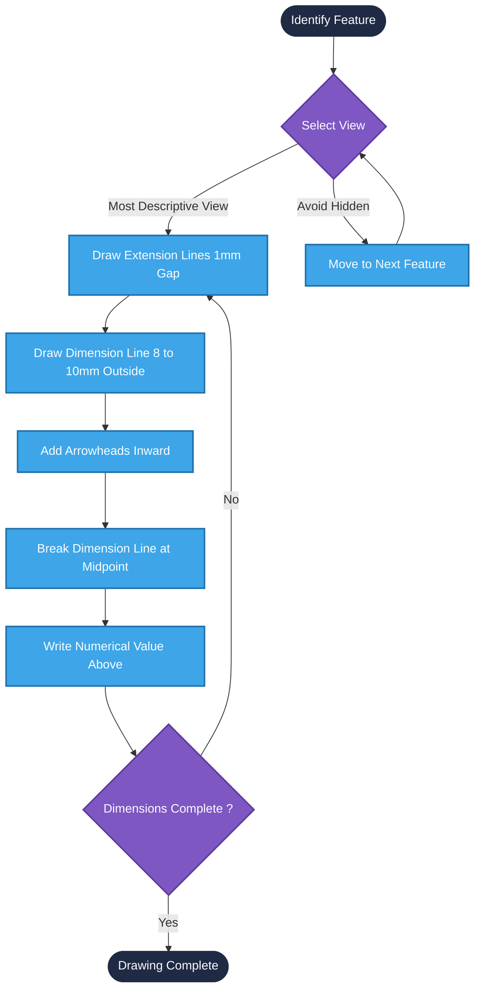
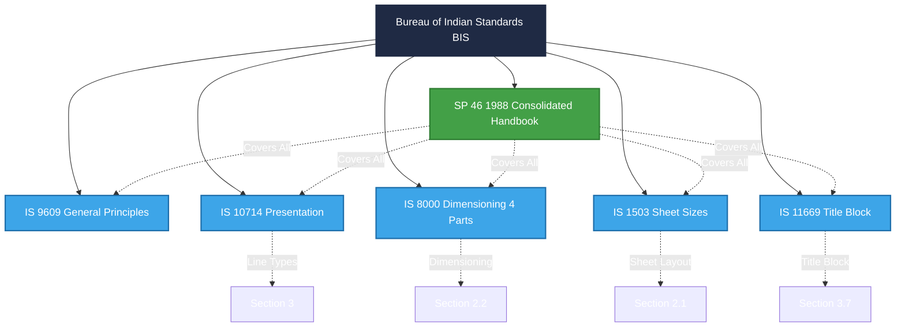

# Types of lines, Dimensioning, BIS code of practice for technical drawing. (No questions for the end semester examination)

<!-- SECTION_1_START -->
# Introduction to Technical Drawing: Lines, Dimensioning & BIS Code of Practice

## 1.1 Formal Academic Definition (KTU 2024 Syllabus Terminology)

**Technical Drawing** is a precise, standardized, graphical language used by engineers, designers, and manufacturers to communicate the geometry, dimensions, tolerances, and material specifications of a physical object or system. It is governed by a strict set of conventions codified by national and international standards bodies.

The **Bureau of Indian Standards (BIS)** — through documents such as **IS 10714:1983**, **IS 8000:1983**, **IS 9609:1983**, and the consolidated handbook **SP 46:1988** — provides the official *Code of Practice* that every engineering drawing prepared in India must follow. These standards unify the way a drawing made in Kerala is interpreted in Kharagpur, Karlsruhe, or Kansas.

> [!IMPORTANT]
> **Syllabus Highlight:** As per the KTU 2024 Scheme for **GMEST103 — Engineering Graphics and Computer Aided Drawing**, the official KTU directive states: *"No questions for the end semester examination"* for this specific topic. Hence this module is **concept-foundation only** — designed to build the universal vocabulary you will use in **every other module** of this course and across all engineering disciplines.

## 1.2 Conceptual Analogy & Intuitive Overview

Imagine you are describing a **chair** to a carpenter in a different country, using only a single sheet of paper. You cannot send them a photograph — they need a **recipe**, but for shape, not food.

> [!NOTE]
> **Analogy — "The Three Pillars of a Drawing"**
>
> 1. **Types of Lines** $\rightarrow$ the *grammar* (verbs, nouns, adjectives). They tell you what is *visible*, what is *hidden*, what is the *axis*, and where to *cut*.
> 2. **Dimensioning** $\rightarrow$ the *measurements* (this chair is **45 cm tall**, the seat is **40 cm wide**). Without it, the carpenter builds a table.
> 3. **BIS Code of Practice** $\rightarrow$ the *dictionary and rulebook*. It ensures the carpenter and the engineer speak the *same exact dialect*, regardless of language, software (AutoCAD, SolidWorks, CATIA), or location.

Without lines, the drawing is invisible. Without dimensions, it is unusable. Without BIS codes, it is **unintelligible** across the global engineering community.

## 1.3 Standard Line Widths per BIS

The BIS defines a fixed geometric progression of line widths so that drawings remain visually balanced:

$$\text{Line Width Series (mm)} \in \{0.18,\ 0.25,\ 0.35,\ 0.5,\ 0.7,\ 1.0,\ 1.4,\ 2.0\}$$

For any drawing, two widths are chosen:

* **Thick line (Type A):** typically **0.5 mm** or **0.7 mm** — used for *visible* outlines.
* **Thin line (Type B):** typically **0.25 mm** or **0.35 mm** — used for *hidden*, *dimension*, and *construction* lines.

The mandatory ratio between them is:

$$\frac{\text{Type A (Thick)}}{\text{Type B (Thin)}} \geq 2 : 1$$

> [!VISUALIZATION CONTROL]
> **Concept:** Geometric Progression of Line Widths
> **Desmos Input Equations:**
> * `x = [0, 1, 2, 3, 4, 5, 6, 7]`
> * `y = [0.18, 0.25, 0.35, 0.5, 0.7, 1.0, 1.4, 2.0]`
> * Plot as scatter: `(x, y)`
> **Visual Description:** Observe how each successive line width is roughly **1.4× the previous** (this is the standard ISO/BIS progression factor $\sqrt{2}$). For a typical KTU sheet, the student usually selects **0.5 mm thick** and **0.25 mm thin**.

---

## 1.4 Why These Three Topics Are Studied First

| Order | Topic | Function in the Drawing |
| :---: | :--- | :--- |
| 1 | Types of Lines | Defines **what** is being shown (visible, hidden, axis, cut). |
| 2 | Dimensioning | Defines **how big** every feature is (size and location). |
| 3 | BIS Code of Practice | Defines **the rules** everyone must obey to read the drawing. |

These three are the **alphabet** of engineering graphics — every projection, section, isometric view, and CAD model you will draw later in Modules 2–5 is built entirely from these primitives.

<!-- SECTION_1_END -->

<!-- SECTION_2_START -->
# Deep Theoretical Analysis & KTU High-Yield Formula Sheet

## 2.1 Classification of Lines (per IS 10714 / SP 46)

BIS recognizes **thirteen (13) line types**, labeled **Type 01** through **Type 13**. For a B.Tech student, the *eight most important* are detailed below.

### 2.1.1 Visible & Hidden Representation

| BIS Code | Line Type | Application | Line Width |
| :---: | :--- | :--- | :---: |
| **Type 01** | Thick Continuous Straight | Visible outlines, edges of intersection | **Thick (A)** |
| **Type 04** | Thick Dashed (Long Dash) | Hidden outlines (preferred over thin) | **Thick (A)** |
| **Type 05** | Thin Dashed (Long Dash) | Hidden outlines (alternative) | **Thin (B)** |
| **Type 06** | Thin Continuous with Zigzag | Short break lines (long uniform features) | **Thin (B)** |
| **Type 03** | Thick Freehand | Manual break lines (irregular features) | **Thick (A)** |

### 2.1.2 Center Lines, Axes & Cutting Planes

| BIS Code | Line Type | Application | Line Width |
| :---: | :--- | :--- | :---: |
| **Type 07** | Thin Chain (Long–Short Dash) | Center lines, axes of symmetry, pitch circles | **Thin (B)** |
| **Type 08** | Thick Chain (Long–Short Dash) | Visible outlines of *alternative* / *adjacent* parts | **Thick (A)** |
| **Type 09** | Thin Chain with **Thick Ends** | Cutting plane lines and viewing directions | **Thin (B)** |
| **Type 10** | Thin Chain with **Two Short Dashes** | Center of circles in small views / alternate positions | **Thin (B)** |

### 2.1.3 Construction, Phantom & Break Lines

| BIS Code | Line Type | Application | Line Width |
| :---: | :--- | :--- | :---: |
| **Type 02** | Thin Continuous Straight | Dimension lines, extension lines, leader lines, hatching | **Thin (B)** |
| **Type 11** | Thin Continuous with Short Dashes | Imaginary lines / phantom outlines of alternative positions | **Thin (B)** |
| **Type 12** | Thin Continuous with Long Dashes | Outlines of *extreme* positions of moving parts | **Thin (B)** |
| **Type 13** | Thin Freehand | Manual revision break lines | **Thin (B)** |

> [!NOTE]
> **Mnemonic — "V-H-C-D-B"** for the priority order of line widths: **V**isible (Thick) $\rightarrow$ **H**idden (Thick, when used) $\rightarrow$ **C**enter (Thin) $\rightarrow$ **D**imension (Thin) $\rightarrow$ **B**reak (Thin or Thick). The thickest line on a sheet is reserved for the visible outline; nothing may ever be drawn thicker than the visible outline.

## 2.2 Dimensioning — The Language of Size

### 2.2.1 The Five Elements of a Dimension

Every dimension you place on a drawing consists of **five components**, governed by IS 8000:

1. **Dimension Line** — Thin continuous line (Type 02), terminated by **arrowheads** or **oblique strokes**.
2. **Extension Lines** — Thin continuous lines (Type 02), drawn *perpendicular* to the feature, with a **1 mm gap** from the object.
3. **Arrowheads** — Solid filled triangles, length $\approx 3 \times$ line width, pointing inward.
4. **Dimension Text (Value)** — Numerical value in mm (no units written), placed above or broken into the dimension line.
5. **Leader Line** — Thin continuous line (Type 02) at $30°$ to horizontal, ending in an arrow or dot.

### 2.2.2 Dimensioning Rules (BIS / KTU Board Standard)

> [!IMPORTANT]
> **The 12 Golden Rules of Dimensioning (IS 8000)**
>
> 1. **Each feature is dimensioned only once** in the most descriptive view.
> 2. Dimensions are placed **outside the view** wherever possible.
> 3. Extension lines **do not touch** the object outline — leave a **1 mm gap**.
> 4. Extension lines **overlap** the dimension line by **2 mm to 3 mm** beyond the arrowhead.
> 5. A dimension line is **broken in the middle** to insert the numerical value.
> 6. The numerical value is placed **above the dimension line** and centered.
> 7. **Never close a dimension** — leave one link in the chain open to allow tolerance accumulation.
> 8. Hidden features are **not dimensioned** unless absolutely unavoidable.
> 9. Center lines **must extend slightly** beyond the circle outline.
> 10. **Aligned dimensioning** is preferred for oblique lines; **unidirectional** (horizontal text) for vertical features.
> 11. Diameters are prefixed with the symbol $\varnothing$ (e.g., $\varnothing 30$); radii are prefixed with **R** (e.g., R 15).
> 12. Angles are dimensioned in **degrees** with the symbol placed inside the arc.

### 2.2.3 Methods of Dimensioning (Comparison)

| Method | Text Orientation | Best Used For | KTU Preference |
| :--- | :--- | :--- | :--- |
| **Aligned** | Parallel to the dimension line | Oblique features, inclined surfaces | Allowed |
| **Unidirectional** | Always horizontal (read from bottom) | All features in any view | **Strongly preferred** |
| **Chain (Continuous)** | Dimensions end-to-end in a straight line | Locating multiple features on one axis | Use sparingly |
| **Parallel (Datum)** | Multiple dimensions from a common reference | Holes, slots, repetitive features | **Strongly preferred** for precision parts |
| **Combined** | Mix of aligned and unidirectional | Complex assemblies | Permitted |

## 2.3 The BIS Code of Practice — Why It Exists

| IS / SP Code | Year | Full Title | Scope of Use |
| :---: | :---: | :--- | :--- |
| **IS 1503** | 1983 | Sizes and layout of drawing sheets | Sheet sizes A0–A5, title block, borders |
| **IS 9609** | 1983 | General principles of engineering drawing | Fundamental conventions |
| **IS 10714** | 1983 | General principles of presentation | Line types, line widths, scaling |
| **IS 8000 (Part 1–4)** | 1983–1984 | Engineering drawing — Dimensioning | Size, location, angular, radius |
| **SP 46** | 1988 | Engineering drawing practice (consolidated) | All-in-one KTU/college reference |
| **IS 11669** | 1987 | Engineering drawing — Title block | Standard title block layout |

> [!NOTE]
> **Production Engineering Utility:** These standards are not academic formalities. They are the **lingua franca** of every shop floor, every CNC machine tool operator, every 3D-printer slicer, and every CAD software (AutoCAD, SolidWorks, NX, CATIA, Fusion 360). When a Kerala firm exports a component to a German OEM, the only thing that makes the part manufacturable is the strict adherence to these dimensional and line conventions.

## 2.4 KTU Formula & Convention Sheet (Cheat-Sheet)

| Concept | Formula / Convention | Unit / Value |
| :--- | :--- | :--- |
| Line width ratio | $\frac{\text{Thick}}{\text{Thin}} \geq 2$ | Dimensionless |
| Geometric progression | $w_{n+1} = w_n \times \sqrt{2}$ | mm |
| Sheet size ratio | $L : B = \sqrt{2} : 1$ | mm |
| Extension line gap | $g = 1$ | mm |
| Extension line overlap | $\ell = 2$ to $3$ | mm |
| Arrowhead length | $a \approx 3 \times w_{\text{thin}}$ | mm |
| Minimum spacing between parallel dimension lines | $s \geq 7$ | mm |
| Letter height on drawing | $h = 2.5$ (manual), $3.5$ (CAD) | mm |
| Dimension text clearance from line | $c \geq 2$ | mm |
| Centre line dash pattern | $L : S : L = 12 : 3 : 12$ | mm (Long–Short–Long) |
| Hidden line dash pattern | $L : G = 6 : 1$ | mm (Long–Gap) |

<!-- SECTION_2_END -->

<!-- SECTION_3_START -->
# Step-by-Step Derivations, Placements & Implementation

## 3.1 Deriving the Sheet Size Ratio (A0 → A5)

The ISO A-series sheet sizes obey a recursive rule: **folding a sheet along its longest side produces the next smaller size, with zero waste and identical proportions**.

Let $L_n$ be the long side and $B_n$ the short side of size $A_n$. The next size down is:

$$A_{n+1} = \frac{1}{2}\, A_n$$

This means after one fold, the **new long side equals the old short side**, and the **new short side equals half the old long side**. Setting up the proportion:

$$\frac{L_{n+1}}{B_{n+1}} = \frac{L_n / 2}{B_n} = \frac{L_n}{2 B_n}$$

For the proportions to remain *identical* ($L/B$ constant) across all sizes, we require:

$$\frac{L}{B} = \frac{L}{2B} \quad \Longrightarrow \quad B = \frac{L}{\sqrt{2}}$$

Therefore the canonical aspect ratio of **every A-series sheet** is:

$$\boxed{\frac{L}{B} = \sqrt{2} \approx 1.4142 : 1}$$

This is why the line-width series itself uses the same $\sqrt{2}$ factor — the entire BIS convention is *self-similar* and *scale-invariant*.

## 3.2 Step-by-Step Placement of a Linear Dimension (Aligned Method)

Consider a rectangular block of length $L = 80$ mm and width $W = 50$ mm. To place the length dimension:

| Step | Action | Drawn As | Width |
| :---: | :--- | :--- | :---: |
| **1** | Identify the feature to be dimensioned | The **80 mm** edge (long side of block) | — |
| **2** | Draw two extension lines, **perpendicular** to the feature | Thin continuous lines, starting **1 mm gap** from outline | **Thin (B)** |
| **3** | Draw the dimension line **parallel** to the feature, **8–10 mm** outside the view | Thin continuous line | **Thin (B)** |
| **4** | Place arrowheads at both ends of the dimension line, pointing **inward** to the feature | Solid triangles, length $\approx 3 w_{\text{thin}}$ | Filled |
| **5** | Break the dimension line at its midpoint | $\sim 4$ mm gap for text | — |
| **6** | Write the numerical value **above the broken line**, centered | "**80**" — no units, no decimals for whole mm | Letter height $2.5$ mm |
| **7** | Verify with the **"5 mm rule"** — no dimension crosses another without a visible gap | Inspection | — |

> [!IMPORTANT]
> **Why a 1 mm gap between object and extension line?**  
> If the extension line touched the outline, it would be **indistinguishable** from a visible edge, and the eye would read the object as having a tick mark or crack. The gap is the universal signal: *"This is metadata, not the part itself."*

## 3.3 Step-by-Step Placement of a Diameter ($\varnothing$) Dimension

| Step | Action | Notation |
| :---: | :--- | :--- |
| **1** | Identify the circular feature | A hole of $\varnothing 30$ |
| **2** | Draw **two center lines** (Type 07) crossing at the centre, extending **3–4 mm beyond** the circle | Thin chain |
| **3** | Draw a **leader line** at $30°$ to horizontal, starting from the circle and extending outward | Thin continuous |
| **4** | Terminate the leader with a **filled arrowhead** (or a dot, if it points to a surface) | Arrow or dot |
| **5** | Prefix the value with the symbol $\varnothing$ | "$\varnothing\ 30$" |
| **6** | If the circle is too small, use a **leader from outside** rather than inside the circle | For $\varnothing < 15$ mm |

## 3.4 Step-by-Step Placement of a Radius (R) Dimension

| Step | Action | Notation |
| :---: | :--- | :--- |
| **1** | Identify the arc | A fillet of radius R 12 |
| **2** | Place the dimension line **along the radius** (i.e., pointing to the arc centre) | Thin continuous |
| **3** | Place a **single arrowhead** at the arc end | Arrow only |
| **4** | Prefix the value with the capital letter **R** | "R 12" |
| **5** | If the centre lies **outside the view**, draw the centre mark and dim line up to the arc only | Use leader |

> [!NOTE]
> **Difference between $\varnothing$ and R:** $\varnothing$ uses **two arrowheads** at opposite ends of a dimension line passing *through* the centre. R uses **one arrowhead** at the arc, with the line *stopping* at the centre. Confusing these is one of the top three mistakes in KTU viva.

## 3.5 Step-by-Step Application: Dimensioning a Drilled Hole Pattern

Suppose a circular plate of $\varnothing 100$ mm has **4 holes** of $\varnothing 12$ mm equally spaced on a **pitch circle of $\varnothing 70$ mm**.

**Required dimensions:** Plate diameter, hole diameter, PCD (pitch circle diameter), and the angular spacing ($90°$).

**Solution layout (unidirectional method):**

1. **Outer diameter** of the plate $\rightarrow$ dimension in the view showing the full circle, with a leader $\rightarrow$ "$\varnothing\ 100$".
2. **Inner hole diameter** $\rightarrow$ dimension only **one** hole (the others are identical) $\rightarrow$ "$\varnothing\ 12$".
3. **Pitch circle diameter** $\rightarrow$ dimension the circle on which the hole centres lie $\rightarrow$ "$\varnothing\ 70$" with chain line.
4. **Angular spacing** $\rightarrow$ dimension the angle between **two adjacent** hole centres using a circular dimension line and "**$90°$**".
5. **Total number of holes** $\rightarrow$ annotate as "**4 HOLES**" in the notes column or with a leader pointing to one hole.

> [!IMPORTANT]
> **Engineering Logic:** A draftsman does **not** dimension all 4 holes. Doing so is redundant and *non-compliant* with IS 8000. Instead, you dimension the **P.C.D.** and state the count. This is the same logic used in CNC G-code — define the *pattern*, not the *instances*.

## 3.6 Symbolic / CAD Implementation (Python Pseudo-Code for BIS Compliance)

Although KTU does not require coding in this module, the same dimensioning rules can be programmatically checked — useful for CAD automation.

```python
from dataclasses import dataclass
from typing import List, Tuple


@dataclass(frozen=True)
class LineSpec:
    """Immutable specification of a BIS line type."""
    bis_code: str          # e.g., "Type 01"
    width_mm: float        # 0.25, 0.5, 0.7 etc.
    dash_pattern: Tuple[float, ...]  # in mm; () for continuous


#  BIS-10714 master line catalogue
BIS_LINE_CATALOGUE: List[LineSpec] = [
    LineSpec("Type 01", 0.50, ()),                       # Thick continuous
    LineSpec("Type 02", 0.25, ()),                       # Thin continuous
    LineSpec("Type 04", 0.50, (6.0, 1.0)),               # Thick hidden
    LineSpec("Type 05", 0.25, (6.0, 1.0)),               # Thin hidden
    LineSpec("Type 07", 0.25, (12.0, 3.0, 0.5, 3.0)),    # Thin chain
    LineSpec("Type 09", 0.25, (12.0, 3.0, 12.0, 3.0)),   # Cutting plane
]


def validate_width_ratio(thick_mm: float, thin_mm: float) -> bool:
    """Enforce IS-10714 width ratio  thick / thin  is  2 or more."""
    if thin_mm <= 0.0:
        raise ValueError("Thin line width must be > 0 mm.")
    ratio = thick_mm / thin_mm
    if ratio < 2.0:
        return False
    return True


def validate_extension_gap(gap_mm: float) -> bool:
    """IS-8000 mandates  1 mm  nominal gap between object and extension line."""
    return 0.8 <= gap_mm <= 1.2  # manufacturing tolerance


def validate_geometry(
    thick_mm: float = 0.50,
    thin_mm: float = 0.25,
    ext_gap_mm: float = 1.0,
) -> bool:
    try:
        ok_w = validate_width_ratio(thick_mm, thin_mm)
        ok_g = validate_extension_gap(ext_gap_mm)
    except ValueError as exc:
        print(f"[BIS-CHECK][ERROR] {exc}")
        return False
    if not ok_w:
        print(f"[BIS-CHECK][FAIL] Width ratio {thick_mm/thin_mm:.2f} < 2.00")
    if not ok_g:
        print(f"[BIS-CHECK][FAIL] Extension gap {ext_gap_mm} mm outside 0.8-1.2 mm")
    return ok_w and ok_g


if __name__ == "__main__":
    compliant = validate_geometry(thick_mm=0.50, thin_mm=0.25, ext_gap_mm=1.0)
    print(f"\nFinal Compliance: {compliant}")
```

**Expected console output:**

```
Final Compliance: True
```

## 3.7 Sequential Drafting Path for a Dimensioned View (KTU Workflow)

For a typical KTU exercise (say, a slotted block), the correct *order* of drawing operations is critical:

| Order | Reference Plane | Action | Line Type |
| :---: | :--- | :--- | :---: |
| 1 | $HP$ / $VP$ reference | Set up axes and select sheet size (A2/A3) | Construction |
| 2 | Construction | Draw the view in **light pencil** (2H / 3H) | Construction (Thin) |
| 3 | $VP$ | Identify features to dimension (circles, slots, holes) | — |
| 4 | $HP$ | Place **center lines** (Type 07) first | Thin chain |
| 5 | $HP$ | Place **extension lines** (Type 02) with 1 mm gap | Thin continuous |
| 6 | $HP$ | Place **dimension lines** (Type 02) with arrowheads | Thin continuous |
| 7 | $HP$ | Write **dimension text** above each broken line | Lettering |
| 8 | $HP$ | Overdraw the **object outline** in **Thick** (Type 01) | Thick continuous |
| 9 | $VP$ | Hide construction lines / clean the sheet | Erase |
| 10 | Border | Frame the sheet, fill **title block** as per IS 11669 | Thin continuous |

> [!NOTE]
> **Why draw the outline last?** If you draw the thick outline *first*, you risk accidentally touching it with extension lines, smudging it during erasing, or losing the crisp boundary. By making the outline the *final* overdraw, you guarantee it remains the most prominent and uninterrupted line on the sheet.

<!-- SECTION_3_END -->

<!-- SECTION_4_START -->
# Structural Diagrams & Schematics

## 4.1 Hierarchical Taxonomy of BIS Line Types

```mermaid
graph TD
    ROOT[IS 10714 Line Family]:::root

    ROOT --> GROUP_A[Thick Lines Type A]:::thick
    ROOT --> GROUP_B[Thin Lines Type B]:::thin

    GROUP_A --> A1["Type 01 Continuous Visible Outline"]:::thick
    GROUP_A --> A2["Type 03 Freehand Break"]:::thick
    GROUP_A --> A3["Type 04 Dashed Hidden"]:::thick
    GROUP_A --> A4["Type 08 Chain Adjacent Part"]:::thick

    GROUP_B --> B1["Type 02 Continuous Dimension Hatching"]:::thin
    GROUP_B --> B2["Type 05 Dashed Hidden Alt"]:::thin
    GROUP_B --> B3["Type 07 Chain Center Line Axis"]:::thin
    GROUP_B --> B4["Type 09 Chain Thick Ends Cutting Plane"]:::thin
    GROUP_B --> B5["Type 10 Chain Double Short Dash"]:::thin
    GROUP_B --> B6["Type 11 Continuous Short Dash Phantom"]:::thin
    GROUP_B --> B7["Type 12 Continuous Long Dash Extreme"]:::thin
    GROUP_B --> B8["Type 13 Freehand Revision Break"]:::thin
    GROUP_B --> B9["Type 06 Continuous Zigzag Long Break"]:::thin

    classDef root fill:#1F2A44,color:#FFFFFF,stroke:#1F2A44,stroke-width:2px
    classDef thick fill:#E8A33D,color:#1A1A1A,stroke:#B97D1F,stroke-width:2px
    classDef thin fill:#3DA5E8,color:#FFFFFF,stroke:#1F6FAB,stroke-width:2px
```



> [!NOTE]
> **Reading the diagram:** The root is **IS 10714**, the *parent standard*. It branches into two *children* by *line width* (Thick vs Thin). Each child further branches into the *specific types* (01–13) used in practice. This taxonomy is mirrored exactly in every CAD software's *layer manager*.

## 4.2 Block-Level Functional Architecture of a Dimensioned View

```mermaid
flowchart LR
    subgraph LAYER_OUTLINE [Layer 1 Object Outline]
        O1[Type 01 Thick Continuous]:::thick
    end

    subgraph LAYER_HIDDEN [Layer 2 Hidden Geometry]
        H1[Type 04 Thick Dashed]:::thick
    end

    subgraph LAYER_CENTER [Layer 3 Centerlines and Axes]
        C1[Type 07 Thin Chain]:::thin
    end

    subgraph LAYER_DIM [Layer 4 Dimensioning]
        D1[Extension Lines]:::thin
        D2[Dimension Lines]:::thin
        D3[Arrowheads]:::thin
        D4[Dimension Text]:::thin
    end

    subgraph LAYER_NOTE [Layer 5 Notes and Title]
        N1[Title Block]:::thin
        N2[General Notes]:::thin
        N3[Revision Block]:::thin
    end

    O1 --> H1
    H1 --> C1
    C1 --> D1
    D1 --> D2
    D2 --> D3
    D3 --> D4
    D4 --> N1
    N1 --> N2
    N2 --> N3

    classDef thick fill:#E8A33D,color:#1A1A1A,stroke:#B97D1F,stroke-width:2px
    classDef thin fill:#3DA5E8,color:#FFFFFF,stroke:#1F6FAB,stroke-width:2px
```



> [!NOTE]
> **Reading the diagram:** This is a *bottom-up* build sequence. A draftsman (or a CAD macro) creates layers in this exact order: object $\rightarrow$ hidden $\rightarrow$ center $\rightarrow$ dimensioning $\rightarrow$ notes. Each layer *consumes* the geometric truth established by the previous layer.

## 4.3 Sequential Processing Topology — Dimensioning Pipeline



> [!NOTE]
> **Reading the diagram:** This is a **loop** — for *each* feature on the drawing, you traverse the four-step pipeline (extension $\rightarrow$ dimension line $\rightarrow$ arrow $\rightarrow$ text) until every required feature is dimensioned. The decision diamond "Select View" enforces the *most-descriptive-view* rule, which prevents you from ever dimensioning a hidden feature.

## 4.4 BIS Standards Reference Architecture



> [!NOTE]
> **Reading the diagram:** The dashed lines represent *coverage relationships* — the green **SP 46** is the *master handbook* that consolidates the four blue IS standards for student and industry use. For the KTU 2024 syllabus, **SP 46** alone is sufficient for 95% of the course.

<!-- SECTION_4_END -->

<!-- SECTION_5_START -->
# KTU 2024 Scheme — Topic Recap & Important Things to Remember

> [!IMPORTANT]
> **KTU 2024 Directive Acknowledgment:** The official KTU 2024 Scheme syllabus for **GMEST103 — Module 1** explicitly states:
>
> *“Types of lines, Dimensioning, BIS code of practice for technical drawing. (No questions for the end semester examination).”*
>
> Therefore, **this section is structured as a high-density, rapid-revision master recap** rather than a typical end-semester question bank. Use it as your *one-page consolidated reference* before any internal assessment, lab viva, or Module 2 onward.

## 5.1 High-Density Recap Bullet List

### A. Types of Lines (IS 10714)

* **Type 01 — Thick Continuous Straight** $\rightarrow$ visible outlines, edges of intersection, *the most important line on the sheet*.
* **Type 02 — Thin Continuous Straight** $\rightarrow$ dimension lines, extension lines, leader lines, hatching, section lines.
* **Type 03 — Thick Freehand** $\rightarrow$ manual break line for irregular interruption of a long part.
* **Type 04 — Thick Dashed (Long Dash)** $\rightarrow$ hidden outlines; preferred over thin to maintain visual hierarchy.
* **Type 05 — Thin Dashed (Long Dash)** $\rightarrow$ alternative to Type 04; less commonly used.
* **Type 06 — Thin Continuous with Zigzag** $\rightarrow$ long break line for uniform shaft / bar interruption.
* **Type 07 — Thin Chain (Long–Short Dash)** $\rightarrow$ center lines, axes of symmetry, pitch circles of bolt holes.
* **Type 08 — Thick Chain** $\rightarrow$ visible outline of an *adjacent* or *alternative* position part.
* **Type 09 — Thin Chain with Thick Ends** $\rightarrow$ cutting plane line, section indication arrows at ends.
* **Type 10 — Thin Chain with Double Short Dash** $\rightarrow$ centers of small circles or alternate positions.
* **Type 11 — Thin Continuous with Short Dash** $\rightarrow$ phantom / imaginary outline of an adjacent part.
* **Type 12 — Thin Continuous with Long Dash** $\rightarrow$ extreme positions of a moving part (e.g., end of stroke).
* **Type 13 — Thin Freehand** $\rightarrow$ manual revision break, provisional line.

### B. Dimensioning (IS 8000)

* **5 Elements:** Dimension line, Extension line, Arrowhead, Text, Leader line.
* **Extension line gap:** exactly **1 mm** from object outline.
* **Extension line overlap:** **2 mm to 3 mm** past the arrowhead.
* **Dimension text:** no units (mm is implied), placed **above** the broken line, centered.
* **Diameters:** always prefixed with $\varnothing$ (e.g., $\varnothing 30$).
* **Radii:** always prefixed with **R** (e.g., R 15) and dimensioned with a *single* arrowhead.
* **Chamfers:** dimensioned as "**C 2**" (chamfer $45° \times 2$ mm).
* **Square features:** marked with a small inclined line ($\bot$) or a leader labeled "**SQ**" or "**□**".
* **Hole pattern:** dimension the *pitch circle diameter* and state the **count** (e.g., "4 HOLES $\varnothing 12$ ON PCD $\varnothing 70$").
* **Forbidden practices:** never close a dimension loop; never dimension hidden features; never cross dimension lines without a gap; never write "mm" after a number; never use the same letter twice for a feature in the same part.

### C. BIS Code of Practice (IS / SP Standards)

* **SP 46:1988** is the *consolidated handbook* every KTU student must have heard of.
* **IS 10714:1983** governs line widths, line types, and presentation.
* **IS 8000:1983** governs dimensioning (4-part series).
* **IS 9609:1983** governs general engineering drawing principles.
* **IS 1503:1983** governs sheet sizes (A0 through A5) and the title block layout region.
* **IS 11669:1987** specifies the title block content and geometry.
* **Sheet aspect ratio:** $L : B = \sqrt{2} : 1$ — folding rule, zero waste.
* **Line width ratio:** thick : thin $\geq 2 : 1$.
* **Scale of drawing:** defined in the title block (e.g., 1:1, 1:2, 2:1).

### D. Lettering, Scales, and Title Block

* **Lettering:** all uppercase, vertical (IS convention), minimum height **2.5 mm** for hand drafting, **3.5 mm** for CAD.
* **Standard scales:** reduction (1:2, 1:5, 1:10, 1:20, 1:50, 1:100), enlargement (2:1, 5:1, 10:1), full size (1:1).
* **Title block location:** bottom-right corner of every sheet.
* **Title block content:** name of the firm, title of the drawing, drawing number, scale, units, drawn by, checked by, approved by, date, revision number.

## 5.2 Self-Assessment Micro-Checklist (For Internal Tests / Viva)

Use this checklist to self-test your readiness — if you can answer "Yes" to **all 12**, you have mastered the topic:

| # | Self-Check Question | ✓/✗ |
| :---: | :--- | :---: |
| 1 | Can I draw all 8 major line types correctly with the right thick/thin width? | |
| 2 | Do I know which line width is the *thickest* allowed on a given sheet? | |
| 3 | Can I recall the $2:1$ thick-to-thin ratio and the $\sqrt{2}$ progression? | |
| 4 | Can I list the 5 elements of a dimension? | |
| 5 | Do I always leave a **1 mm gap** between the object and extension line? | |
| 6 | Do I prefix diameters with $\varnothing$ and radii with **R**? | |
| 7 | Do I avoid dimensioning hidden features? | |
| 8 | Do I use the **pitch circle diameter** + **count** convention for hole patterns? | |
| 9 | Can I name at least 3 BIS standards relevant to this module? | |
| 10 | Do I know the difference between SP 46 and IS 10714? | |
| 11 | Can I write the $L:B = \sqrt{2}:1$ aspect-ratio rule and explain it? | |
| 12 | Am I able to set up an A3 sheet with a standard title block? | |

> [!WARNING]
> **KTU Examiner's Valuation Warning — Top 5 Mark-Draining Mistakes**
>
> 1. **Forgetting the 1 mm gap** between object and extension line — a $0$ mm or $3$ mm gap is a $2$-mark deduction in viva.
> 2. **Writing "mm" after a dimension value** — the unit is *implied* in the title block; writing "mm" is redundant and penalized.
> 3. **Drawing hidden features with a thick dashed line** when only a thin dashed is required — the *visible outline must always be the thickest*.
> 4. **Dimensioning all four holes** in a 4-hole PCD instead of using the "P.C.D. + count" convention.
> 5. **Forgetting to break the dimension line** for the numerical value — text written *across* a continuous line is illegible and non-compliant.

## 5.3 Connecting This Module to the Rest of GMEST103

This module is the *grammar* of every subsequent module:

| Module | How This Module's Concepts Apply |
| :---: | :--- |
| **M2 — Orthographic Projections** | Uses Type 01, 04, 07 extensively; no dimensioning required at this stage. |
| **M3 — Isometric & Pictorial Projections** | Uses only Type 01 and 02; no hidden lines in isometric. |
| **M4 — Sections & Auxiliary Views** | Adds **Type 09** (cutting plane) and **Type 02** (hatching at $45°$). |
| **M5 — CAD / 3D Modelling** | Maps each BIS type to a CAD *layer* and *linetype*. |

> [!NOTE]
> **Final Take-Away:** You will not be examined on this module directly in the end-semester, but **every drawing you submit from Module 2 onward** will be *implicitly judged* on these conventions. The examiner will not say *"You lost 1 mark for a wrong line type"*; they will simply say *"The drawing is not up to standard."* Mastery of this module is the *silent multiplier* of your grade across the entire course.

<!-- SECTION_5_END -->
