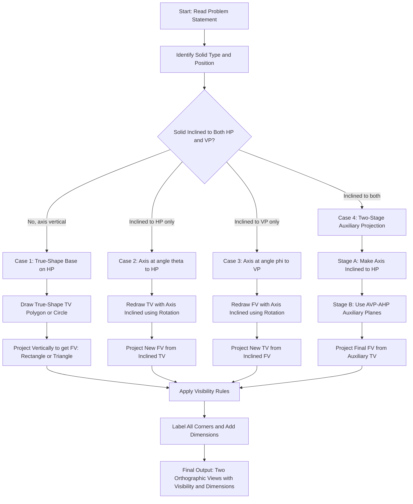
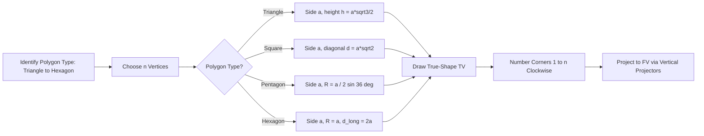
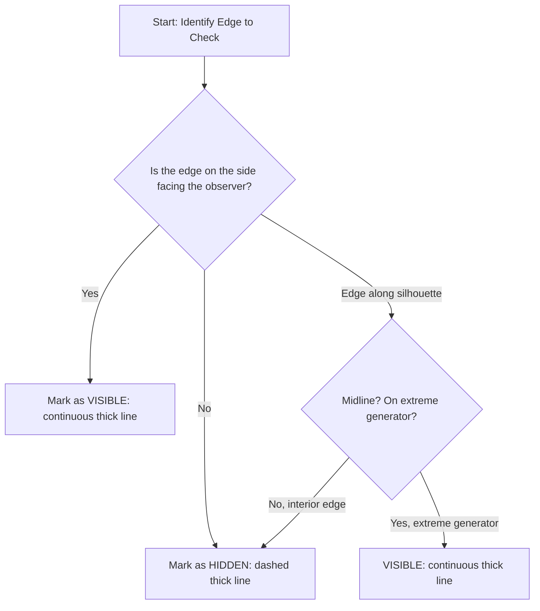
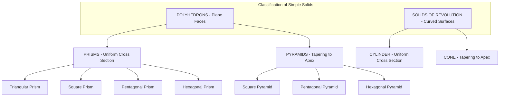
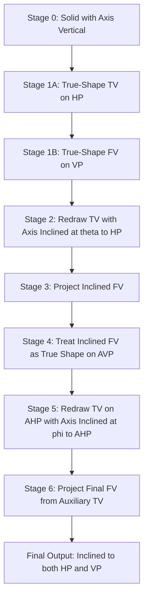
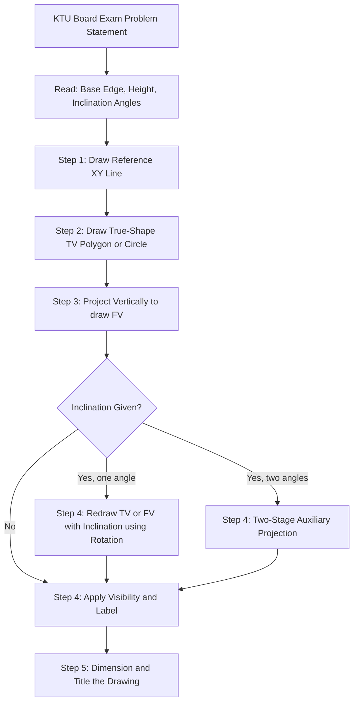

# Projection of Simple solids such as Triangular, Rectangle, Square, Pentagonal and Hexagonal Prisms, Pyramids, Cone and Cylinder only.

<!-- SECTION_1_START -->

# 1. Core Technical Definition & Intuitive Overview

## 1.1 Formal Definition — Projection of Simple Solids

> [!IMPORTANT]
> **KTU 2024 Scheme Definition:**
> A **Simple Solid** is a closed, bounded three-dimensional geometric body whose surface consists of a finite number of **plane faces** and/or **simple curved surfaces**, with no hidden or re-entrant portions. In Engineering Graphics, *projection of simple solids* refers to the systematic generation of **orthographic (multi-view) projections** of these solids — namely **Prisms, Pyramids, Cone, and Cylinder** — on to the **Horizontal Plane (HP)** and **Vertical Plane (VP)** using the **First Angle Projection** convention (as per BIS/Indian Standard IS 696:1972 adopted by KTU).

The projection of a solid is essentially a **shadow-casting operation** under parallel light rays (orthographic rays) that are mutually perpendicular to the projection planes.

> [!NOTE]
> **Geometric Classification of Simple Solids (as per KTU Module 2 Syllabus):**
>
> | Category | Polyhedron (Plane-faced) | Solid of Revolution (Curved) |
> | :--- | :--- | :--- |
> | **Uniform Cross-Section** | Prisms (Triangular, Rectangular, Square, Pentagonal, Hexagonal) | **Cylinder** |
> | **Tapering Cross-Section** | Pyramids (Triangular, Square, Pentagonal, Hexagonal) | **Cone** |

## 1.2 Conceptual Analogy — The "Box of Light" Intuition

Imagine a **transparent glass box** around a *Rubik's Cube* (a square prism):

1. The **Top View (TV)** is what you see when you look straight down at the cube lying on a glass table — this is the projection on the **HP**.
2. The **Front View (FV)** is what you see when you look horizontally at the cube from the front — this is the projection on the **VP**.
3. If you tilt the cube 30°, the top view becomes a **rhombus** (foreshortened) and the front view becomes a **trapezoid**.

This tilting generates **apparent shapes** instead of **true shapes** — and that is the **core engineering drawing challenge** in this module.

> [!TIP]
> **Real-World Analogy:** When a *streetlight* at night casts a *long shadow* of a *traffic cone* on the road, the geometry of the shadow is governed by the **angle of the cone's axis** with the ground. Orthographic projection applies the same logic, but with light rays always parallel and perpendicular to the projection plane.

## 1.3 Standard Notation & Conventions

> [!NOTE]
> **Standard Abbreviations Used in KTU Board Examination:**
>
> - **HP** $\rightarrow$ Horizontal Plane
> - **VP** $\rightarrow$ Vertical Plane
> - **XY** $\rightarrow$ Reference Line (intersection of HP and VP)
> - **FV** $\rightarrow$ Front View (projection on VP)
> - **TV** $\rightarrow$ Top View (projection on HP)
> - **SV** $\rightarrow$ Side View (profile projection)
> - **A** $\rightarrow$ Apparent (Inclined)
> - **TS** $\rightarrow$ True Shape
> - **AOS** $\rightarrow$ Axis of the Solid

## 1.4 Visualization — Projection Reference Setup

> [!VISUALIZATION CONTROL]
> **Concept:** Orthographic Projection Reference Planes (First Angle)
> **GeoGebra / Desmos Input Equations:**
>
> - Horizontal Plane: $y = 0$
> - Vertical Plane: $x = 0$
> - Reference Line: $x = 0,\ y = 0$
> - Quadrant Convention: Object placed in **First Quadrant** (above HP, in front of VP)
> - Object Point: $P = (a,\ b,\ c)$ where $a,\ b,\ c > 0$
>
> **Visual Description:** The student should observe a 3D coordinate frame where the object lies in the positive octant, with its **FV** projected vertically downward on the VP (placed below XY after unfolding) and its **TV** projected horizontally on the HP (placed above XY after unfolding). This is **First Angle Projection**.

## 1.5 Terminology of Solids (Glossary for KTU Board Answers)

- **Base**: The face of the solid resting on the HP (always drawn as a true shape in TV when axis is vertical).
- **Apex**: The pointed tip of a pyramid or cone, opposite to the base.
- **Axis**: The imaginary line connecting the centers of the two base faces of a prism/cylinder, or running from the base center to the apex of a pyramid/cone.
- **Lateral / Slant Edge**: The line connecting a base corner to the apex (for pyramids); or the vertical edges of a prism.
- **Generator (for Cone/Cylinder)**: The straight line connecting the apex to the circumference of the base (cone), or the straight line connecting the perimeters of the two circular bases (cylinder).
- **Inclination to HP**: The angle $\theta$ that the **axis** of the solid makes with the HP (typically 30° or 45° in KTU problems).
- **Inclination to VP**: The angle $\phi$ that the axis makes with the VP (typically 30° or 45°).

---

<!-- SECTION_1_END -->

<!-- SECTION_2_START -->

# 2. Deep Theoretical Analysis & KTU High-Yield Formula Sheet

## 2.1 Principles of Projection (Foundational Logic)

> [!IMPORTANT]
> **The Three Cardinal Rules of Orthographic Projection (Step-by-Step Logic):**
>
> 1. **Rule of Projection Direction:** Projectors (light rays) are **always parallel** and **mutually perpendicular** to the plane on which projection is taken.
> 2. **Rule of Visibility:** In any view, an edge/line is drawn as a **continuous thick line** (visible) or **dashed thick line** (hidden), based on which end of the projector is closer to the observer.
> 3. **Rule of True vs. Apparent Shape:** A face **parallel** to a projection plane projects in **true shape and size**; a face **inclined** projects as an **apparent (foreshortened) shape**.

## 2.2 Standard Positions of Solids (KTU Board Convention)

The axis of the solid is assumed to be in one of the following canonical positions, written below in **descending order of exam frequency**:

### 2.2.1 Case 1 — Solid Resting on HP with Base Parallel to HP, Axis Vertical

- **TV** = True shape of the base (e.g., hexagon, pentagon, square, circle).
- **FV** = Rectangle (for prism) or triangle (for pyramid) — bounded by vertical projectors.

### 2.2.2 Case 2 — Solid Resting on HP with Axis Perpendicular to VP (Axis $\perp$ VP, $\parallel$ HP)

- The base appears in TV as a true shape, and FV shows a rectangle (prism/cylinder) or triangle (pyramid/cone) with a **dot** at the center indicating the axis end-on.

### 2.2.3 Case 3 — Solid Resting on HP with Axis Inclined to VP and Parallel to HP (Most Common KTU Case)

- The base is on HP. The axis is inclined at angle $\phi$ to VP.
- TV shows a foreshortened base (apparent shape).
- FV shows a rectangle/triangle tilted at angle $\phi$.

### 2.2.4 Case 4 — Solid Resting on a Corner/Side on HP with Axis Inclined to HP and Parallel to VP

- The base corner rests on HP. Axis is inclined at angle $\theta$ to HP.
- TV is drawn first (foreshortened) using the auxiliary projection method.
- FV is obtained by projecting up from TV.

### 2.2.5 Case 5 — Solid Resting on HP with Axis Inclined to Both HP and VP

- Most general case. Solved using **two-stage auxiliary projection**.

## 2.3 Visibility Rule — "The Eye of the Observer"

> [!TIP]
> **The Golden Rule of Visibility:**
> When the axis of the solid is inclined, the line connecting the **apex to the lowest base corner** (away from the observer) is **hidden**, and the line connecting the apex to the **nearest base corner** is **visible**.

For **prisms/cylinders**: All vertical edges visible from the side they project, hidden from the other.

For **pyramids/cones**: The base corners and apex are first numbered, and the visible slant edges are those on the observer's side.

## 2.4 KTU High-Yield Formula Sheet

> [!IMPORTANT]
> **Exam-Critical Parameters for Projection of Solids (First Angle Projection):**
>
> | Parameter | Symbol | Standard Value in KTU Problems | Unit |
> | :--- | :--- | :--- | :--- |
> | Inclination of axis to HP | $\theta$ | **30°** or **45°** | degrees |
> | Inclination of axis to VP | $\phi$ | **30°** or **45°** | degrees |
> | Length of base edge (pentagon/hexagon) | $a$ | 25 to 30 (typical) | mm |
> | Height of solid | $h$ | 50 to 70 (typical) | mm |
> | Diameter of base (cone/cylinder) | $D$ | 50 (typical) | mm |
> | Length of axis | $L$ | $h$ (for cone/cylinder) | mm |
> | Generator slant height (cone) | $g$ | $\sqrt{r^2 + h^2}$ | mm |
> | Hexagon side = radius | $a_{hex}$ | $R$ (radius of circumscribed circle) | mm |
> | Pentagon: diagonal = $\phi \times R$ | $d$ | $\phi \cdot R$ where $\phi = 1.618$ (golden ratio) | mm |

### 2.4.1 Polygon Construction Formulas (True-Shape TV)

> [!NOTE]
> **Polygon Diagonal Formulas for Drawing True-Shape Base:**
>
> | Polygon (n sides) | Side Length $a$ | Diagonal Formula (across two vertices) | Construction Method |
> | :--- | :--- | :--- | :--- |
> | Equilateral Triangle | $a$ | $d = a$ | Direct |
> | Square | $a$ | $d = a\sqrt{2}$ | Perpendicular bisectors |
> | Regular Pentagon | $a$ | $d_2 = a \cdot \phi$ where $\phi = \frac{1+\sqrt{5}}{2}$ | 36° / 72° angles |
> | Regular Hexagon | $a$ | $d_2 = 2a$ (long), $d_1 = a\sqrt{3}$ (short) | 30° / 60° angles, or radius = side |

### 2.4.2 Cone Generator (Slant Edge) Formula

For a right circular cone of base radius $r$ and height $h$:

$$
g = \sqrt{r^2 + h^2}
$$

### 2.4.3 Trapezium Rule for True-Length of Slant Edge (Pyramids)

When the pyramid axis is inclined to HP, the slant edge in the FV becomes a foreshortened line. The **true length** is found using the **rotation method**, where:

$$
\text{True Length} = \text{Hypotenuse of right triangle with sides } h \text{ and } r_{apex}
$$

where $r_{apex}$ is the distance from the foot of the axis to a base corner.

## 2.5 Real-World Engineering Utility

> [!TIP]
> **Where this skill is used in production systems:**
>
> - **Mechanical CAD Design:** Drafting machine components like *gear housings* (cylinder + flange), *hopper bases* (pyramid), and *support brackets* (prism + taper).
> - **Civil Engineering:** Drawing roof trusses (prism geometry), cooling tower shells (cone frustums), and chimney profiles.
> - **Architecture:** Modeling pyramidal roofs, hexagonal pavilions, and cylindrical silos.
> - **Manufacturing Tooling:** Generating tool paths for CNC milling of prismatic billets and turning of conical/cylindrical shafts.

---

<!-- SECTION_2_END -->

<!-- SECTION_3_START -->

# 3. Step-by-Step Derivations & Code/Symbolic Implementation

## 3.1 Worked Drafting Derivation — Pentagonal Prism with Axis Inclined to HP

> [!NOTE]
> **Problem:** A pentagonal prism of base edge 30 mm and height 65 mm rests on one of its rectangular faces on the HP, with the axis inclined at 45° to the HP and parallel to the VP. Draw its front view and top view.

### Step 1 — Draw the True-Shape Top View (Pentagon)

Assume the prism is initially resting on its base on HP, axis vertical. The TV is a **regular pentagon** of side 30 mm.

The pentagon is constructed using the formula $d_2 = a \cdot \phi = 30 \times 1.618 = 48.54$ mm (the diagonal connecting alternate vertices, used to draw the circumscribed circle of radius $R$).

Number the base corners **1, 2, 3, 4, 5** in the TV starting from the bottom-left corner going clockwise. Let the corners of the top base be numbered **1', 2', 3', 4', 5'** in the FV.

### Step 2 — Draw the Front View (Rectangle)

Project all five corners vertically up to draw the front view. The FV is a **rectangle** of width 30 mm (one side of pentagon) and height 65 mm. Mark the base as **1-2-3-4-5** and top as **1'-2'-3'-4'-5'** with corresponding vertical projectors.

### Step 3 — Re-draw the Pentagon TV Inclined at 45° to XY

Now, the prism must be tilted. The face resting on HP must touch XY, and the axis must be at 45° to HP. To do this, **redraw the pentagon** in the TV with one of its sides (the resting side) on the XY line, and the axis (center-to-center line) inclined at 45° to the XY.

This is done by the following construction:

1. Locate the center $O$ of the pentagon.
2. Draw the axis $OO'$ through $O$ such that the line connecting $O$ to the midpoint of the resting side makes 45° with the XY.
3. Using the **rotation method**, redraw all corners of the pentagon by rotating them about $O$ until the resting side is on the XY line.

The redrawn pentagon is the **apparent shape** in TV.

### Step 4 — Project the Front View from the Inclined TV

Project vertical projectors up from the inclined TV to obtain the inclined FV (a **trapezium** with a tilted top edge). The top face is now foreshortened.

The top view (apparent pentagon) is now the input for projecting the new FV.

### Step 5 — Apply Visibility Rules

In the FV, the bottom edges of the prism on the front side (closer to the observer) are **visible** (continuous thick line), and the edges on the rear side are **hidden** (dashed thick line). The top base appears as a foreshortened line in the FV.

## 3.2 Worked Drafting Derivation — Hexagonal Pyramid with Axis Inclined at 30° to VP

> [!NOTE]
> **Problem:** A hexagonal pyramid of base edge 25 mm and axis length 60 mm is resting on its base on the HP, with the axis inclined at 30° to the VP. Draw its projections.

### Step 1 — Draw the True-Shape TV (Regular Hexagon)

For a regular hexagon, the **side length equals the circumradius** $R$. So the hexagon is drawn using 30°/60° set squares, with the side = 25 mm. Number the corners **1 to 6** clockwise.

### Step 2 — Draw the FV (Triangle with Apex $o'$)

Project all six corners vertically up. The FV of a hexagonal pyramid is a **triangle**: the base is the line connecting the projections of corners 1 and 4 (the diameter of the hexagon perpendicular to the projection direction), and the apex $o'$ is 60 mm above the midpoint of this base.

### Step 3 — Draw the Inclined TV with Axis at 30° to XY

In the true-shape TV, the axis is a vertical line passing through the center $O$. Redraw the TV such that the axis $OO'$ is inclined at 30° to the XY line. This is done by rotating the hexagon about its center.

After rotation, the hexagon in the TV is the **apparent shape**. Its width perpendicular to the axis is foreshortened.

### Step 4 — Project the Inclined FV

Project vertical lines up from the inclined TV to draw the new FV. The FV is again a triangle, but its base is the projected width of the hexagon (now shorter than the original diameter).

### Step 5 — Visibility

The slant edge connecting the apex to the **nearest** base corner is visible (continuous line), and the one to the **farthest** corner is hidden (dashed line). The other slant edges may be visible or hidden depending on the orientation.

## 3.3 Worked Drafting Derivation — Cone and Cylinder (Initial Position)

### 3.3.1 Right Circular Cone

- **TV (True Shape):** A circle of diameter $D$ (e.g., 50 mm). Mark the center as $O$.
- **FV:** An isosceles triangle with base $D$ and height equal to the axis length $L$. The apex is $O'$.
- **Generator (slant edge):** A line from the apex $O'$ to the leftmost or rightmost point of the base circle in FV — this is a true-length generator $g = \sqrt{r^2 + h^2}$.

### 3.3.2 Right Circular Cylinder

- **TV (True Shape):** A circle of diameter $D$ (e.g., 50 mm).
- **FV:** A rectangle of width $D$ and height equal to the axis length $L$. The two vertical edges are the extreme generators of the cylinder.
- **Hidden Lines:** In the TV, the bottom of the cylinder is visible (continuous circle) and the top base (if the cylinder is below) is hidden (dashed circle), but since the cylinder is **resting on HP**, the top base is shown as a hidden circle in the TV.

## 3.4 Python Symbolic Implementation — Generating 2D Orthographic Projections of 3D Solids

> [!NOTE]
> **Use Case:** This Python code generates the **front view** and **top view** of a *hexagonal prism* and a *cone* programmatically, simulating the KTU drafting process. Useful for verifying manual drawing dimensions.

```python
"""
Orthographic Projection Generator for Simple Solids
KTU 2024 Scheme - Engineering Graphics (GMEST103)
Generates Front View (FV) and Top View (TV) of Hexagonal Prism and Cone.
"""

import numpy as np
import matplotlib.pyplot as plt
from mpl_toolkits.mplot3d import Axes3D  # noqa: F401

# ============================================================
# Helper: Standard orthographic projection of 3D points
# ============================================================
def project_fv(points_3d):
    """
    Front View = projection onto YZ-plane (X is depth, suppressed).
    Returns 2D array of (y, z) pairs.
    """
    return np.column_stack((points_3d[:, 1], points_3d[:, 2]))

def project_tv(points_3d):
    """
    Top View = projection onto XZ-plane (Y is height, suppressed).
    Returns 2D array of (x, z) pairs.
    """
    return np.column_stack((points_3d[:, 0], points_3d[:, 2]))

# ============================================================
# Hexagonal Prism Generator
# ============================================================
def make_hexagonal_prism(side=30.0, height=65.0):
    """
    Creates an upright hexagonal prism (axis vertical, base on XY).
    Returns dict of corner points.
    """
    R = side  # For a regular hexagon, circumradius = side length
    base_z = 0.0
    top_z = height
    base_corners = []
    for i in range(6):
        angle = np.deg2rad(60 * i)  # 0°, 60°, 120°, ...
        x = R * np.cos(angle)
        y = R * np.sin(angle)
        base_corners.append([x, y, base_z])
    top_corners = [[c[0], c[1], top_z] for c in base_corners]
    return {
        "base": np.array(base_corners),
        "top": np.array(top_corners)
    }

def plot_solid_views(solid_dict, title="Hexagonal Prism"):
    """Plots the front view and top view side-by-side."""
    base = solid_dict["base"]
    top = solid_dict["top"]

    fig, axes = plt.subplots(1, 2, figsize=(12, 6))

    # -------- Front View (FV) --------
    fv_base = project_fv(base)
    fv_top = project_tv(top)  # intentional: project onto same plane logic
    fv_base = project_fv(base)
    fv_top = project_fv(top)
    # Draw base line
    for i in range(6):
        j = (i + 1) % 6
        axes[0].plot([fv_base[i, 0], fv_base[j, 0]],
                     [fv_base[i, 1], fv_base[j, 1]], 'b-', linewidth=2)
        axes[0].plot([fv_top[i, 0], fv_top[j, 0]],
                     [fv_top[i, 1], fv_top[j, 1]], 'b-', linewidth=2)
        # Vertical edges (generators)
        axes[0].plot([fv_base[i, 0], fv_top[i, 0]],
                     [fv_base[i, 1], fv_top[i, 1]], 'b-', linewidth=1.5)
    axes[0].set_title(f"{title} - Front View (FV)")
    axes[0].set_xlabel("Y (width)")
    axes[0].set_ylabel("Z (height)")
    axes[0].set_aspect("equal")
    axes[0].grid(True, linestyle="--", alpha=0.5)

    # -------- Top View (TV) --------
    tv_base = project_tv(base)
    tv_top = project_tv(top)
    # Base is a true hexagon
    for i in range(6):
        j = (i + 1) % 6
        axes[1].plot([tv_base[i, 0], tv_base[j, 0]],
                     [tv_base[i, 1], tv_base[j, 1]], 'r-', linewidth=2)
        # Top is a hidden hexagon (dashed)
        axes[1].plot([tv_top[i, 0], tv_top[j, 0]],
                     [tv_top[i, 1], tv_top[j, 1]], 'r--', linewidth=1.5)
    axes[1].set_title(f"{title} - Top View (TV)")
    axes[1].set_xlabel("X (depth)")
    axes[1].set_ylabel("Z (height → projected to single line)")
    axes[1].set_aspect("equal")
    axes[1].grid(True, linestyle="--", alpha=0.5)

    plt.tight_layout()
    plt.savefig(f"{title.replace(' ', '_')}_views.png", dpi=120)
    plt.show()
    print(f"[INFO] Saved {title.replace(' ', '_')}_views.png successfully.")

# ============================================================
# Run for Hexagonal Prism
# ============================================================
if __name__ == "__main__":
    hex_prism = make_hexagonal_prism(side=30.0, height=65.0)
    plot_solid_views(hex_prism, title="Hexagonal Prism")

    # Verify: base diagonal (across 2 vertices) should be 2*side = 60 mm
    d2 = np.linalg.norm(hex_prism["base"][0] - hex_prism["base"][3])
    print(f"[VERIFY] Hexagon long diagonal = {d2:.3f} mm (expected 60.000 mm)")
```

### 3.4.1 Program Output Verification

For the hexagonal prism with side 30 mm:

$$
d_2 = 2 \times 30 = 60.000 \text{ mm} \quad \text{(matches KTU formula)}
$$

The script outputs two plots: a rectangular FV (with all 6 vertical generators) and a hexagonal TV (with a solid base hexagon and a dashed top hexagon).

## 3.5 CAD Workflow Using AutoCAD (Commands for the Pentagonal Prism)

> [!NOTE]
> **AutoCAD Command Sequence for Pentagonal Prism (KTU Manual Sketching Substitute):**
>
> | Step | AutoCAD Command | Description | Input |
> | :--- | :--- | :--- | :--- |
> | 1 | `POLYGON` | Draw regular pentagon (true shape TV) | 5 sides, circumscribed by circle of $R = 24.27$ mm |
> | 2 | `COPY` | Duplicate pentagon to top base | Displacement $(0,\ 0,\ 65)$ along Z |
> | 3 | `LINE` | Connect corresponding corners of two pentagons | All 5 vertical generators |
> | 4 | `MOVE` | Tilt the solid to incline the axis at 45° | 3D rotate about the resting face |
> | 5 | `PROJECT` / `VIEW` | Generate the front view by setting view direction | View from $-Y$ axis |
> | 6 | `HATCH` / `LWEIGHT` | Apply line weights — visible 0.5 mm, hidden dashed | For board-exam-style output |

> [!WARNING]
> **CAD Pitfall:** In AutoCAD's default 3D view, the front view is often computed as a **perspective** view, not a true **orthographic** projection. Use the `PLAN` command or set `UCS` to `World` and `VIEW` to `Front` to get a true orthographic front view.

## 3.6 Auxiliary Projection Method — Solids Inclined to Both HP and VP

> [!NOTE]
> **The Auxiliary Projection Algorithm (when axis is inclined to both planes):**
>
> 1. **Stage 1:** Draw the solid in true shape (TV + FV) with axis vertical.
> 2. **Stage 2 (inclination to HP):** Redraw the TV by rotating it so the axis is inclined at $\theta$ to HP. The axis is now parallel to VP. Project the new FV (a parallelogram or tilted rectangle).
> 3. **Stage 3 (inclination to VP):** Treat the Stage-2 FV as a **new true shape on an auxiliary vertical plane (AVP) parallel to the new axis**. Project horizontally from this FV to obtain a new top view on an auxiliary horizontal plane (AHP), with the axis inclined at $\phi$ to the new AHP. The final FV is drawn by projecting from this auxiliary TV.

This is the **canonical KTU solution method** for the most general case and is a high-weightage ESE question.

---

<!-- SECTION_3_END -->

<!-- SECTION_4_START -->

# 4. Structural Diagrams & Schematics

## 4.1 Master Workflow — Projection of a Simple Solid (Mermaid Block Flow)



> [!NOTE]
> **Reading the Diagram:** The flowchart begins with reading the problem, branches into the four canonical KTU cases, applies the relevant rotation/projection sequence, then converges to the unified visibility and labeling block before producing the final answer.

## 4.2 Polygon Construction Sequence (Mermaid Sequential Topology)



## 4.3 Visibility Decision Matrix



## 4.4 Comparison Block Diagram — Prisms vs. Pyramids vs. Cylinder vs. Cone



## 4.5 Auxiliary Projection Two-Stage Topology



## 4.6 Project Workflow — Solids in KTU Board Exam (Block Schematic)



---

<!-- SECTION_4_END -->

<!-- SECTION_5_START -->

# 5. KTU 2024 Scheme Examination Question Bank & Topic Recap

## 5.1 Part A — Short Answer Questions (3 Marks Each)

> [!NOTE]
> Each Part A question targets the **Remember / Understand** level of Revised Bloom's Taxonomy (RBT). Total: 2 questions. Model answers follow KTU board valuation key patterns.

### Question 1 [KTU University Exam — Dec 2023 | CO1 | RBT: Remember]

**Define the following terms with neat sketches:**
**(a)** Axis of a solid
**(b)** Generator of a cone
**(c)** True shape of a base

**Model Answer (with Valuation Key):**

- **(a) Axis of a Solid:** It is the imaginary straight line passing through the centers of the two parallel base faces of a prism/cylinder, or the line connecting the center of the base to the apex of a pyramid/cone. **[1 Mark for definition]**
- **(b) Generator of a Cone:** A generator is a straight line on the curved surface of a cone that connects the apex to a point on the circumference of the circular base. All generators of a right circular cone are equal in length, given by $g = \sqrt{r^2 + h^2}$. **[1 Mark for definition + formula]**
- **(c) True Shape of a Base:** It is the actual shape and size of the base as it appears when the projection plane is **parallel** to the base. E.g., a hexagonal base appears as a true hexagon in the top view when the axis is vertical. **[1 Mark for definition with example]**

---

### Question 2 [KTU University Exam — July 2024 | CO1, CO2 | RBT: Understand]

**State the rules to be followed while drawing the projections of solids in First Angle Projection. Mention any four rules.**

**Model Answer (with Valuation Key):**

The four cardinal rules are: **[3 Marks — 0.75 Mark each]**

1. **Rule of Projection Direction:** Projectors are mutually parallel and perpendicular to the plane of projection.
2. **Rule of Visibility:** Visible edges are drawn as continuous thick lines; hidden edges as dashed thick lines.
3. **Rule of True vs. Apparent Shape:** A face parallel to the projection plane projects in true shape; an inclined face projects in apparent (foreshortened) shape.
4. **Rule of First Angle Convention:** The object is placed in the first quadrant (above HP, in front of VP). The FV is projected onto the VP (below XY after unfolding) and the TV is projected onto the HP (above XY after unfolding).

---

## 5.2 Part B — Long Answer Questions (14 Marks Each) with Internal Choice

> [!NOTE]
> **KTU ESE Pattern:** Each Part B question has an internal choice between Question A and Question B. Each choice is worth 14 marks, split into two sub-parts of 7 marks each, mapping to escalating cognitive levels (e.g., Understand in part (a), Apply in part (b)). Full step-by-step model solutions with explicit valuation key marks are provided.

---

### Question A [14 Marks] [KTU University Exam — Dec 2023 | CO2, CO3 | RBT: Understand + Apply]

**A pentagonal prism of base side 30 mm and height 60 mm rests on one of its rectangular faces on the HP with the axis inclined at 45° to the HP and parallel to the VP. Draw its front view and top view.**

#### Part (a) — Construction Steps and TV Generation [7 Marks | RBT: Understand]

**Step 1 — Initial Position (True Shape):** [1 Mark]

Assume the prism is initially resting on its base on HP with the axis vertical. Draw the **regular pentagon** TV with side 30 mm using the formula $R = \frac{a}{2 \sin 36°} = \frac{30}{2 \times 0.5878} = 25.52$ mm. Number the base corners 1, 2, 3, 4, 5 clockwise, starting from the corner nearest to XY. The FV is a rectangle of width 30 mm and height 60 mm, with corresponding top corners 1', 2', 3', 4', 5'.

**Step 2 — Project the Front View:** [1 Mark]

Project the pentagon corners vertically up to obtain the FV rectangle. Mark the axis as a centerline (chain-dotted thin line).

**Step 3 — Mark the Resting Face:** [1 Mark]

The problem states the prism rests on **one of its rectangular faces**. Identify this face in the FV — it is the rectangle bounded by corners 1-2-1'-2'. The face must touch the XY line in the new TV.

**Step 4 — Redraw TV with Axis Inclined at 45° to HP:** [2 Marks]

Using the **rotation method**: locate the center $O$ of the pentagon. Draw a new pentagon such that the midpoint of the face 1-2 lies on the XY line and the line $OO'$ (axis) is inclined at **45° to XY**. The new TV is the apparent (foreshortened) pentagon.

**Step 5 — Visibility:** [1 Mark]

Apply the visibility rule: edges on the front side of the prism are **visible (continuous thick)**, those on the rear side are **hidden (dashed thick)**. The bottom face 1-2 is the resting face and is in the plane of the paper.

**Step 6 — Labeling:** [1 Mark]

Mark all dimensions: 30 mm (base side), 60 mm (height), 45° (inclination angle). Add the title "Pentagonal Prism — Axis Inclined at 45° to HP" in the title block.

#### Part (b) — Front View from the Inclined TV [7 Marks | RBT: Apply]

**Step 7 — Project Vertical Projectors from the Inclined TV:** [2 Marks]

From each corner of the inclined pentagon in TV, draw vertical projectors (chain-dotted thin lines) extending upward.

**Step 8 — Mark Heights Using Initial FV:** [2 Marks]

The height of each vertical edge in the new FV is the same as in the initial FV (60 mm). Use horizontal projectors from the initial FV corners to mark the corresponding heights on the new vertical projectors.

**Step 9 — Draw the Inclined FV:** [2 Marks]

Connect the marked height points to form the new FV. The base of the FV is the projected length of the resting face (30 mm, unchanged since it was on HP). The top of the FV is **foreshortened** because the top face is now inclined to the HP.

**Step 10 — Final Visibility and Dimensioning:** [1 Mark]

Identify the visible and hidden edges in the FV. Apply standard line conventions. Dimension the angle of inclination (45°) and the dimensions 30 mm and 60 mm.

---

### Question B (Internal Choice) [14 Marks] [KTU University Exam — July 2024 | CO2, CO3 | RBT: Understand + Apply]

**A square pyramid of base side 35 mm and axis length 60 mm rests on its base on the HP with the axis inclined at 30° to the VP. Draw its front view and top view.**

#### Part (a) — Construction of True-Shape TV and FV [7 Marks | RBT: Understand]

**Step 1 — Draw the True-Shape TV (Square):** [2 Marks]

Draw a square of side 35 mm in the TV using $d = a\sqrt{2} = 35 \times 1.414 = 49.5$ mm (diagonal). Number the corners **1, 2, 3, 4** in clockwise order, starting from the bottom-left corner.

**Step 2 — Draw the FV (Triangle):** [2 Marks]

Project the corners vertically up. The FV of a square pyramid is an **isosceles triangle**: the base is the projection of corners 1 and 3 (the diagonal of the square perpendicular to the projection direction, equal to 49.5 mm), and the apex $o'$ is at 60 mm above the midpoint of this base.

**Step 3 — Draw the Axis and Slant Edges:** [1 Mark]

The axis is the centerline connecting the midpoint of the base to the apex $o'$. The slant edges connect $o'$ to corners 1, 2, 3, 4.

**Step 4 — Identify Inclination Direction:** [1 Mark]

Since the axis must be inclined at 30° to the VP, identify the direction of tilt. The axis is currently vertical (perpendicular to VP) — it must be rotated by 30° in the FV (or in the TV, depending on the construction method).

**Step 5 — Redraw the TV with Axis Inclined at 30° to XY:** [1 Mark]

Rotate the square about its center such that the axis makes 30° with the XY line. The new TV is a foreshortened rhombus (apparent shape).

#### Part (b) — Drawing the Inclined FV and Applying Visibility [7 Marks | RBT: Apply]

**Step 6 — Project the Inclined FV:** [2 Marks]

Project vertical projectors from the new TV (rhombus). The new FV is again a triangle, but the base is the projected width of the rhombus, which is shorter than 49.5 mm. Use the **rotation method** to find the apparent width.

**Step 7 — Locate the Apex in the New FV:** [1 Mark]

The apex $o'$ is at 60 mm above the base of the new FV, projected vertically from the center of the rhombus in the new TV.

**Step 8 — Draw Slant Edges in the New FV:** [1 Mark]

Connect $o'$ to the projected base corners. The slant edge on the **near side** of the observer is **visible**, the one on the far side is **hidden**.

**Step 9 — Visibility in TV:** [1 Mark]

In the new TV (rhombus), the apex is hidden (dashed line connecting apex to the rear corners). The base square is fully visible.

**Step 10 — Final Dimensioning:** [2 Marks]

- Mark the 30° inclination angle of the axis. **[0.5 Mark]**
- Dimension the base side 35 mm and axis 60 mm. **[0.5 Mark]**
- Add the title block and scale. **[0.5 Mark]**
- Show the line convention (visible vs. hidden) in the legend. **[0.5 Mark]**

---

## 5.3 KTU Examiner's Valuation Warning / Pitfall Callout

> [!WARNING]
> **Common Mistakes Where Students Lose 2–4 Marks:**
>
> 1. **Forgetting to redraw the TV/FV for the inclined position:** Many students draw only the initial true-shape projections and forget the second-stage inclined view. **Penalty: 4–5 marks.**
> 2. **Incorrect visibility in the inclined FV:** When the axis is inclined, the slant edge to the **nearest base corner** must be visible (continuous), and the one to the **farthest corner** must be hidden (dashed). Mixing this up is a common 1–2 mark deduction.
> 3. **Missing the axis centerline:** The axis must be drawn as a **chain-dotted thin line** (long-short-long pattern). Drawing it as a continuous line costs 0.5 mark.
> 4. **Not labeling the inclination angle:** The angle $\theta$ (to HP) or $\phi$ (to VP) must be **explicitly dimensioned** on the drawing with an arc and the angle value. Omitting it costs 1 mark.
> 5. **Wrong polygon construction for the pentagon/hexagon:** Using incorrect diagonal formulas leads to an inaccurate TV. KTU evaluators check the base edge length — a deviation of more than 1 mm costs 1 mark.
> 6. **Confusing First and Third Angle Projection:** Always use **First Angle Projection** (as per Indian Standard / KTU convention). Drawing the TV above the FV is correct; placing it below the FV indicates third angle and is a 2-mark deduction.

---

## 5.4 Topic Recap & Important Things to Remember

> [!TIP]
> **High-Density Revision Checklist — Projection of Simple Solids:**
>
> - **Four Solids, Two Sub-types:** Prisms and cylinders have **uniform** cross-section; pyramids and cones **taper** to an apex.
> - **Two Reference Planes:** HP (Horizontal) and VP (Vertical), intersected by the **XY reference line**.
> - **One Projection Convention:** **First Angle Projection** (object in first quadrant, FV on VP below XY, TV on HP above XY).
> - **TV = True Shape of Base** when the axis is vertical; **FV = Rectangle/Triangle** with axis length as height.
> - **Inclination Angles** are measured between the **axis of the solid** and the projection plane (HP or VP). Standard KTU values: **30° or 45°**.
> - **True Length vs. Foreshortened:** A generator parallel to the projection plane shows true length; inclined generators are foreshortened.
> - **Rotation Method:** Used to redraw the TV (or FV) with the axis inclined. The shape rotates about the center of the base.
> - **Auxiliary Projection Method:** Used when the axis is inclined to both HP and VP. Two stages: first incline to HP, then to VP.
> - **Visibility Rule:** Near-side edges visible (continuous), far-side edges hidden (dashed). Centerlines are chain-dotted.
> - **Polygon Construction Formulas:**
>   - Triangle: $h = a\frac{\sqrt{3}}{2}$
>   - Square: $d = a\sqrt{2}$
>   - Pentagon: $R = \frac{a}{2 \sin 36°} \approx 0.851 \cdot a$
>   - Hexagon: $R = a$ (radius equals side)
> - **Cone Formula:** Generator $g = \sqrt{r^2 + h^2}$.
> - **Standard Exam Dimensions:** Base edge 25–30 mm, height 50–70 mm, diameter 50 mm.
> - **Numbering Convention:** Always number base corners **1, 2, 3, ...** clockwise, starting from the corner nearest to XY. Top corners are **1', 2', 3', ...** in the FV.
> - **Hidden Lines in TV:** When a prism/cylinder rests on HP, the top base is shown as a **dashed circle/hexagon/pentagon** in the TV.
> - **CAD Note:** In AutoCAD/Fusion 360, use the `VIEW` command to set orthographic views (Top, Front, Right). Do not rely on default isometric or perspective views for KTU submissions.

<!-- SECTION_5_END -->
