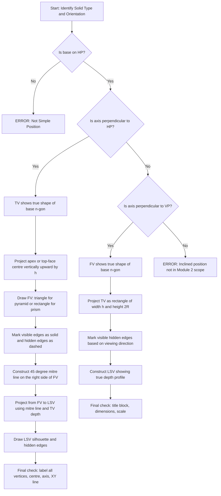
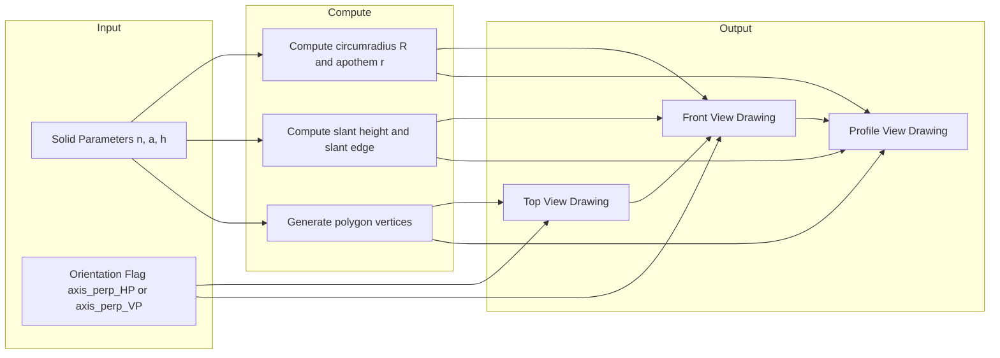
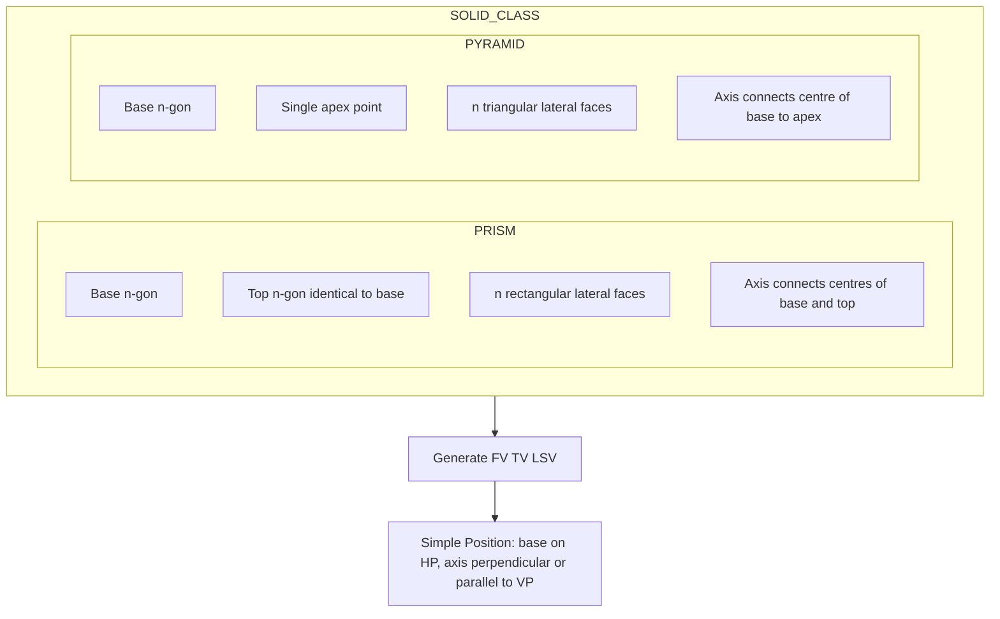
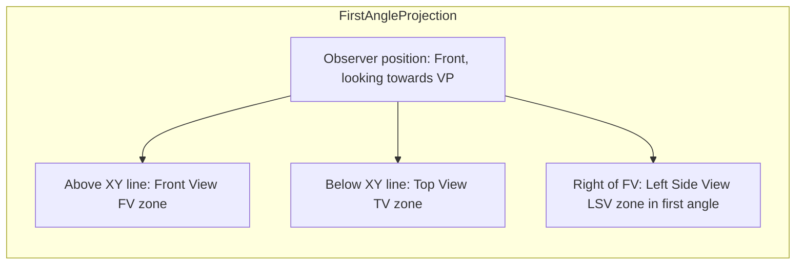
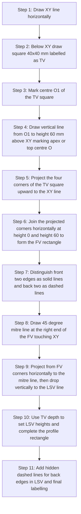

# Projection of solids in simple position including profile view.

<!-- SECTION_1_START -->
# Projection of Solids in Simple Position — Module Overview

## 1.1 Formal KTU 2024 Definition

> [!IMPORTANT]
> **Projection of Solids** is the orthographic (parallel) projection of three-dimensional geometric primitives — *prisms* and *pyramids* — onto the principal reference planes (Horizontal Plane **HP** and Vertical Plane **VP**) when the solid is placed in its **simple position**, i.e., resting flat on its base on the **HP** with the axis either perpendicular or parallel to the **HP** and **VP**.

A solid is said to be in **simple position** when:
- The base of the solid lies on the **HP**.
- The axis of the solid is either **perpendicular to HP** (giving a true shape in top view) or **perpendicular to VP** (giving a true shape in front view, also called the **profile position**).

The **profile view** is the view obtained by projecting the solid onto a plane perpendicular to both **HP** and **VP** — i.e., the side view (Left Side View, **LSV** in first angle; Right Side View, **RSV** in third angle). It is essential when the true shape of the base is inclined to both **HP** and **VP**, or when the solid's true dimensions in depth are required.

## 1.2 Intuitive Analogy

> [!NOTE]
> **Real-World Analogy — The Sunlight Shadow Trick**
>
> Imagine a wooden **pyramid (a "pisa" toy)** placed upright on a glass table. When you hold a flashlight:
> 1. **Directly above the table** → a true-shape square base appears on the table → this is the **Top View (TV)**.
> 2. **From the front (your eye level)** → a triangle outline appears on a wall behind → this is the **Front View (FV)**.
> 3. **From the side (90° rotated)** → another triangle outline appears on a side wall → this is the **Profile View (PV)**.
>
> The three "shadows" together reconstruct the full 3D shape of the solid — this is exactly the **First Angle Projection** used by **KTU / BIS (Bureau of Indian Standards)** convention.

The **profile view** is the *third shadow*, the one we often forget. It is the **side silhouette** of the solid that captures its **depth (Z-axis)** information, which cannot be inferred by looking at the front view alone.

## 1.3 Classification of Solids Covered in Module 2

The KTU 2024 GMEST103 Module-2 syllabus specifies the following **simple solids** (also called *Platonic solids* or *regular polyhedra* in 2D-extruded form):

| S.No | Solid | Base Shape | Lateral Faces | Apex/Top | Base Edges (typical) |
|:----:|:------|:-----------|:--------------|:---------|:---------------------|
| 1 | **Triangular Prism** | Equilateral Triangle | 3 Rectangles | Flat (Rectangle) | $a$ |
| 2 | **Square Prism (Cuboid)** | Square | 4 Rectangles | Flat (Square) | $a$ |
| 3 | **Rectangular Prism (Cuboid)** | Rectangle | 4 Rectangles | Flat (Rectangle) | $l, b$ |
| 4 | **Pentagonal Prism** | Regular Pentagon | 5 Rectangles | Flat (Pentagon) | $a$ |
| 5 | **Triangular Pyramid (Tetrahedron-like)** | Triangle | 3 Triangles | Apex Point | $a$ |
| 6 | **Square Pyramid** | Square | 4 Triangles | Apex Point | $a$ |
| 7 | **Pentagonal Pyramid** | Regular Pentagon | 5 Triangles | Apex Point | $a$ |
| 8 | **Hexagonal Pyramid** | Regular Hexagon | 6 Triangles | Apex Point | $a$ |

> [!TIP]
> The number of **lateral faces** equals the number of **sides of the base**. The shape of the **top face** (for prisms) mirrors the base, and the **apex** (for pyramids) is a single point where all slant edges meet.

## 1.4 Visual Setup — Reference Planes & Quadrants

$$
\begin{aligned}
\text{HP} &\perp \text{VP} \\[4pt]
\text{PP (Profile Plane)} &\perp \text{HP}, \quad \text{PP} \perp \text{VP} \\[4pt]
\text{Axis convention (Right-Handed):} \quad & X\text{-axis} = \text{Intersection of HP \& VP (XY line)} \\
& Y\text{-axis (HP)} \rightarrow \text{depth (away from observer)} \\
& Z\text{-axis (VP)} \rightarrow \text{height (upward)}
\end{aligned}
$$

> [!VISUALIZATION CONTROL]
> **Concept:** Reference Plane Setup for First-Angle Projection
> **GeoGebra / Desmos Input Equations:**
> * `HP : y = 0` (the floor / ground)
> * `VP : z = 0` (the wall behind the object)
> * `XY-line : {y=0, z=0}` (the fold line / reference line)
> * `Object: point A = (2, 3, 5)` (apex of a pyramid)
> **Visual Description:** The student should see the XY-line as a horizontal axis, HP as the floor plane extending downward (first-angle: TV is placed *below* the XY line), VP as the wall extending upward (FV is placed *above* the XY line), and the profile plane on the left side (LSV placed on the right of FV in first-angle). The 3D point projects a vertical line downward to the HP and a horizontal line across to the VP.

<!-- SECTION_1_END -->

<!-- SECTION_2_START -->
# Deep Theoretical Analysis & KTU Formula Sheet

## 2.1 Geometric Definitions

### 2.1.1 Prism vs Pyramid — The Key Distinction

> [!IMPORTANT]
> **Prism:** A solid formed by translating a polygon along an axis perpendicular to it. It has **two parallel, congruent polygonal faces** (base and top) joined by rectangular lateral faces.
>
> **Pyramid:** A solid formed by connecting a single apex point to all vertices of a polygonal base. It has **one polygonal face** (base) and triangular lateral faces meeting at the apex.

### 2.1.2 Axis, Apex, and Base

- **Axis of a solid:** The line joining the centre of the base to the centre of the top (for prism) OR the centre of the base to the apex (for pyramid).
- **True Length (TL):** The actual length of an edge, slant edge, or axis in 3D.
- **True Shape:** The projection where the length and angles are preserved (e.g., a square in top view when axis is ⊥ to HP).
- **Apparent Shape:** The projection where the shape is foreshortened.

## 2.2 Simple Position Rules

| Condition | Resulting View | True Shape Visible In |
|:----------|:---------------|:----------------------|
| Base on HP, axis ⊥ to HP | TV = True shape of base, FV = Rectangle/Triangle | **Top View (TV)** |
| Base on HP, axis ∥ to VP | FV = True shape of base, TV = Rectangle/Triangle | **Front View (FV)** |
| Base on HP, axis ⊥ to VP | PV (profile) = True shape of base, FV = Rectangle/Triangle | **Profile View (PV / LSV)** |

> [!NOTE]
> In **simple position**, the base is always **parallel to the HP**, and the axis is **either perpendicular to HP or perpendicular to VP**. No inclined or oblique positions are allowed at this stage.

## 2.3 First-Angle vs Third-Angle Projection (BIS / KTU Convention)

> [!IMPORTANT]
> **KTU follows the FIRST-ANGLE projection method** as per **BIS SP 46:2003** (Bureau of Indian Standards).
>
> In **first-angle**, the object is placed in the **first quadrant** — *between* the observer and the planes of projection.
>
> - **Top View (TV)** is placed **below** the XY line.
> - **Front View (FV)** is placed **above** the XY line.
> - **Left Side View (LSV)** is placed to the **right** of the FV.
> - **Right Side View (RSV)** is placed to the **left** of the FV.

$$
\begin{aligned}
\text{Observation: Object} &\rightarrow \text{Plane} \rightarrow \text{Observer} \quad \text{(First Angle)} \\[4pt]
\text{Observation: Observer} &\rightarrow \text{Object} \rightarrow \text{Plane} \quad \text{(Third Angle)}
\end{aligned}
$$

## 2.4 The Profile View — Why and When It Is Needed

The **profile view** is essential in the following KTU scenarios:

1. **Solid in profile position:** Axis ⊥ to VP. The FV becomes a single line (or rectangle), and the **true shape of the base** appears in the **profile view**.
2. **Hidden detail in FV/TV:** Features behind the solid become visible by rotating the view 90° to the side.
3. **Verification of depth dimension:** The Z-axis depth of any vertex can be confirmed only through the profile view.

### Profile View Construction Rules (First Angle)

$$
\begin{aligned}
\text{Step 1:} & \quad \text{Draw FV and TV of the solid.} \\[4pt]
\text{Step 2:} & \quad \text{Project projectors horizontally from the FV (and vertically from the TV) to a vertical line on the right (LSV location).} \\[4pt]
\text{Step 3:} & \quad \text{Use the TV's depth ($y$-coordinate) to mark heights on the projector line — this is the LSV.} \\[4pt]
\text{Step 4:} & \quad \text{Join the points to obtain the profile silhouette.}
\end{aligned}
$$

## 2.5 KTU Formula Sheet — Key Geometric Parameters

> [!NOTE]
> The following formulas use $n$ = number of sides of the regular base, $a$ = side length of base, $h$ = height (axis length) of the solid, and $R$ = circumradius of the base polygon.

### 2.5.1 For Regular Prisms (Axis ⊥ to HP, Base on HP)

| Parameter | Formula | Unit |
|:----------|:--------|:-----|
| Apothem of base $r$ | $r = \dfrac{a}{2 \tan(\pi/n)}$ | mm |
| Circumradius $R$ | $R = \dfrac{a}{2 \sin(\pi/n)}$ | mm |
| Area of base $A_b$ | $A_b = \dfrac{n a^2}{4 \tan(\pi/n)}$ | mm² |
| Volume $V$ | $V = A_b \cdot h$ | mm³ |
| TV | True shape of base (n-gon) | — |
| FV | Rectangle of width $2R$ (or $a$ for square) and height $h$ | — |

### 2.5.2 For Regular Pyramids (Axis ⊥ to HP, Apex above base centre)

| Parameter | Formula | Unit |
|:----------|:--------|:-----|
| Slant height $\ell$ | $\ell = \sqrt{h^2 + r^2}$ | mm |
| Slant edge $L$ | $L = \sqrt{h^2 + R^2}$ | mm |
| Lateral surface area $A_L$ | $A_L = \dfrac{1}{2} \cdot P \cdot \ell$ (where $P = n a$ is perimeter) | mm² |
| Total surface area $A_T$ | $A_T = A_b + A_L$ | mm² |
| Volume $V$ | $V = \dfrac{1}{3} A_b \cdot h$ | mm³ |
| TV | True shape of base (n-gon) with centre marked and slant edges as lines | — |
| FV | Triangle of base $2R$ (or $a$) and height $h$ | — |

### 2.5.3 Common Polygon Values (For Quick Recall)

| Polygon | $n$ | $r/a$ | $R/a$ | Interior Angle |
|:--------|:---:|:-----:|:-----:|:---------------|
| Equilateral Triangle | 3 | $0.2887$ | $0.5774$ | $60°$ |
| Square | 4 | $0.5000$ | $0.7071$ | $90°$ |
| Regular Pentagon | 5 | $0.6882$ | $0.8507$ | $108°$ |
| Regular Hexagon | 6 | $0.8660$ | $1.0000$ | $120°$ |
| Regular Heptagon | 7 | $1.0383$ | $1.1524$ | $128.57°$ |

> [!TIP]
> KTU examiners frequently use **equilateral triangle, square, regular pentagon, and regular hexagon** as base shapes. **Memorize** the apothem and circumradius ratios for $n=3, 4, 5, 6$.

## 2.6 Real-World Engineering Utility

> [!NOTE]
> **Where is this used in industry?**
> 1. **Mechanical Design:** Designing gears (involute teeth projected as profiles), wedges, keys, and tapered shafts.
> 2. **Civil Engineering:** Pyramidal roof trusses, prism-shaped columns, and pentagonal/hexagonal tower sections.
> 3. **Architecture:** Pyramid roofs (Egyptian-style), prism skylights, and crystalline building façades.
> 4. **CAD/CAM Software (AutoCAD, SolidWorks, CATIA):** The "Standard Views" command (`VIEW > SE Isometric`, `VIEW > Front`, `VIEW > Right`) directly produces these orthographic views from a 3D model. Understanding the **simple-position projection** is the foundational step before learning *inclined* and *oblique* projections.
> 5. **3D Printing & Manufacturing:** Generating 2D engineering drawings from 3D CAD models for CNC machining and FDM slicing.

<!-- SECTION_2_END -->

<!-- SECTION_3_START -->
# Step-by-Step Derivations, Drafting Procedures & Code Implementation

## 3.1 General Procedure for Projection of a Solid in Simple Position

> [!IMPORTANT]
> **Universal 7-Step Method (Follow this for ANY solid in simple position)**

### Step 1 — Identify the Solid and Parameters
Determine base shape (n-gon), side length $a$, height $h$, and choose whether the axis is ⊥ to HP (most common) or ⊥ to VP (profile position).

### Step 2 — Draw the True Shape in the View Where It Appears
- If axis ⊥ to HP → draw the true-shape n-gon in the **Top View**, centred on a vertical reference line.
- If axis ⊥ to VP → draw the true-shape n-gon in the **Front View**, centred on a horizontal reference line.

### Step 3 — Mark the Centre and Draw the Axis
Mark the centre of the base polygon. Draw a faint vertical line (the axis) through this centre, extending upward to the height $h$ above XY.

### Step 4 — Locate the Apex / Top-Face Centre
- **Prism:** Mark a point at height $h$ directly above the base centre.
- **Pyramid:** Mark the apex point at height $h$ directly above the base centre.

### Step 5 — Project the Top-Face / Apex Vertices to the Elevation View
Project each vertex of the base polygon (or just the apex for pyramid) to the elevation view using vertical projectors from the TV.

### Step 6 — Draw the Elevation (Front View)
- **Prism:** Connect the projected top-face vertices to the base vertices to form a rectangle (or n-gon outline).
- **Pyramid:** Connect the projected apex to each projected base vertex to form triangles — the outline is a triangle of base $2R$ and height $h$ (or $a$ for square base).

### Step 7 — Construct the Profile View (LSV)
- Draw a 45° mitre line at the right end of the FV (or at the corner intersection).
- Project from the FV horizontally to the mitre line, then vertically down/up to the LSV position.
- Mark heights using the TV's depth (Y-coordinate) values.
- Join the points to form the profile silhouette.

## 3.2 Worked Example — Square Pyramid, Base 40 mm, Height 60 mm, Axis ⊥ to HP

**Given:** Square base of side $a = 40$ mm, axis perpendicular to HP, height $h = 60$ mm. Resting on HP.

**Required:** Draw FV, TV, and LSV using first-angle projection.

### Solution Steps

$$
\begin{aligned}
\text{Given:} & \quad a = 40 \text{ mm}, \quad h = 60 \text{ mm}, \quad n = 4 \\[4pt]
\text{True shape (Square):} & \quad \text{Draw square } 40 \times 40 \text{ mm in TV} \\[4pt]
\text{Diagonal of base:} & \quad d = a\sqrt{2} = 40\sqrt{2} = 56.57 \text{ mm} \\[4pt]
\text{Half-diagonal (for FV base):} & \quad R = \frac{d}{2} = 28.28 \text{ mm} \\[4pt]
\text{Slant height:} & \quad \ell = \sqrt{h^2 + r^2} = \sqrt{60^2 + 20^2} = \sqrt{4000} = 63.25 \text{ mm}
\end{aligned}
$$

**Procedure:**

1. Draw a horizontal XY line.
2. Below XY, draw the square $40 \times 40$ mm as the **Top View**. Mark the centre O'.
3. Mark the corners A, B, C, D (in order) and the centre O'.
4. Draw a vertical line from O' upward, extending 60 mm above XY — this is the **axis**.
5. Mark the apex point `o` at 60 mm above XY.
6. From each base corner (A, B, C, D), draw vertical projectors upward to the XY line — these give the lateral corners of the FV.
7. Join `o` to each lateral corner in the FV. The outline is a triangle of base $2R = 56.57$ mm and height 60 mm.
8. Mark visible edges (front two slant edges — solid lines) and hidden edges (back two — dashed lines, since the apex hides them in FV from the front).
9. For the **LSV**, draw a 45° mitre line on the right side of the FV.
10. Project the apex `o` horizontally to the mitre line, then vertically down/up to the LSV position — the apex projects to height 60 mm.
11. From the TV, pick the depth of the leftmost and rightmost base corners (i.e., the corners visible in the side). Mark these as the base-line in the LSV.
12. Join the apex to the base corners in the LSV — the LSV is also a triangle identical to the FV (for a square pyramid viewed in profile).

**Valuation Key:**

| Step | Marks |
|:-----|:------|
| Correct square TV with proper labelling | 2 |
| Axis line and apex projection | 1 |
| Slant edge connections in FV | 2 |
| Hidden/solid line distinction | 1 |
| LSV construction via 45° mitre | 1 |
| **Total** | **7** |

## 3.3 Worked Example — Pentagonal Prism, Base Side 30 mm, Height 50 mm, Axis ⊥ to VP (Profile Position)

**Given:** Regular pentagonal base, side $a = 30$ mm, height $h = 50$ mm, axis perpendicular to VP (resting on HP on one of its rectangular faces).

**Required:** Draw FV, TV, and LSV in first-angle projection.

### Solution

$$
\begin{aligned}
\text{Apothem of pentagon:} & \quad r = \frac{a}{2 \tan(\pi/5)} = \frac{30}{2 \tan 36°} = \frac{30}{2 \times 0.7265} = 20.65 \text{ mm} \\[4pt]
\text{Circumradius:} & \quad R = \frac{a}{2 \sin(\pi/5)} = \frac{30}{2 \times 0.5878} = 25.52 \text{ mm} \\[4pt]
\text{Height of pentagon (in LSV):} & \quad H_p = 2R = 51.04 \text{ mm}
\end{aligned}
$$

**Procedure (Profile Position):**

1. Draw XY line.
2. **Above XY**, draw the true-shape regular pentagon as the **Front View** with the axis horizontal.
3. Mark the centre `o` of the pentagon. Mark all five vertices.
4. Project `o` vertically downward to a point `o'` below XY — this is the TV centre.
5. The TV is a **rectangle of width $h = 50$ mm** (along XY direction) and height $H_p = 51.04$ mm (perpendicular to XY).
6. Draw the rectangle in the TV. The pentagonal base's front and back vertical edges project as the two vertical sides of the TV rectangle.
7. **For the LSV:** Project the rightmost and leftmost points of the pentagonal FV to the LSV position using a 45° mitre line.
8. The LSV will also be a rectangle of width 51.04 mm (pentagon's height) and height 50 mm (axis length).
9. Mark the hidden edges of the pentagon as dashed lines in the LSV (the edges that are not on the visible side from the right).

## 3.4 Python Implementation — Auto-Generator for Polygon Vertices

```python
"""
projection_of_solids.py
Generates 2D vertices of regular n-gon prisms and pyramids
for Engineering Graphics CAD practice (KTU GMEST103 Module 2).

Author: KTU Premium Engine
"""

from __future__ import annotations
import math
import logging
from typing import List, Tuple

# Configure logging for traceability of projection steps
logging.basicConfig(
    level=logging.INFO,
    format="%(asctime)s | %(levelname)s | %(message)s",
)

# Type aliases for clarity
Point2D = Tuple[float, float]


def regular_polygon_vertices(
    n: int, side_length: float, centre: Point2D = (0.0, 0.0)
) -> List[Point2D]:
    """
    Generate vertices of a regular n-gon of given side length, centred at `centre`.

    Parameters
    ----------
    n : int
        Number of sides (n >= 3). Must be >= 3, else ValueError.
    side_length : float
        Length of each side in mm. Must be > 0, else ValueError.
    centre : Point2D
        (x, y) coordinates of the polygon's geometric centre.

    Returns
    -------
    List[Point2D]
        List of (x, y) tuples representing vertices, ordered counter-clockwise
        starting from the rightmost vertex (angle = 0).

    Raises
    ------
    ValueError
        If n < 3 or side_length <= 0.
    """
    # Absolute boundary checks
    if n < 3:
        raise ValueError(f"Polygon must have at least 3 sides, got n={n}")
    if side_length <= 0:
        raise ValueError(f"Side length must be positive, got {side_length}")

    # Circumradius from side length: R = a / (2 sin(pi/n))
    circumradius = side_length / (2.0 * math.sin(math.pi / n))
    cx, cy = centre

    vertices: List[Point2D] = []
    for k in range(n):
        # Start from angle 0 (rightmost vertex) and go counter-clockwise
        angle = 2.0 * math.pi * k / n
        x = cx + circumradius * math.cos(angle)
        y = cy + circumradius * math.sin(angle)
        vertices.append((round(x, 4), round(y, 4)))

    logging.info(
        "Generated %d-gon: side=%.2f mm, R=%.4f mm, centre=%s",
        n, side_length, circumradius, centre,
    )
    return vertices


def prism_top_view(
    n: int, side_length: float, centre: Point2D = (0.0, 0.0)
) -> List[Point2D]:
    """
    Return the Top View (true shape) of a regular n-gonal prism
    when the axis is perpendicular to HP.

    The TV is simply the polygon — identical to the base.
    """
    return regular_polygon_vertices(n, side_length, centre)


def prism_front_view_dimensions(
    n: int, side_length: float, height: float
) -> Tuple[float, float]:
    """
    Return the (width, height) of the front-view rectangle for a regular
    n-gonal prism with axis perpendicular to HP.

    - Width = 2 * circumradius (for n != 4) OR side_length (for n == 4)
    - Height = given height of prism

    Returns
    -------
    Tuple[float, float] : (width, height) in mm
    """
    if n == 4:
        width = side_length
    else:
        width = 2.0 * (side_length / (2.0 * math.sin(math.pi / n)))
    logging.info(
        "Prism FV dimensions: n=%d, side=%.2f, h=%.2f -> (w=%.4f, h=%.2f)",
        n, side_length, height, width, height,
    )
    return (round(width, 4), round(height, 4))


def pyramid_dimensions(
    n: int, side_length: float, height: float
) -> dict:
    """
    Compute all geometric parameters of a regular n-gonal pyramid.

    Returns a dictionary with keys:
        - apothem (r)
        - circumradius (R)
        - slant_height (l)
        - slant_edge (L)
        - base_area
        - lateral_area
        - total_area
        - volume
        - fv_base_width
    """
    if n < 3:
        raise ValueError(f"Pyramid base must have at least 3 sides, got n={n}")
    if side_length <= 0 or height <= 0:
        raise ValueError("Side length and height must both be positive")

    a = side_length
    h = height
    apothem = a / (2.0 * math.tan(math.pi / n))
    circumradius = a / (2.0 * math.sin(math.pi / n))
    slant_height = math.sqrt(h ** 2 + apothem ** 2)
    slant_edge = math.sqrt(h ** 2 + circumradius ** 2)
    perimeter = n * a
    base_area = (perimeter * apothem) / 2.0
    lateral_area = (perimeter * slant_height) / 2.0
    total_area = base_area + lateral_area
    volume = (base_area * h) / 3.0
    fv_base_width = 2.0 * circumradius if n != 4 else a

    result = {
        "apothem": round(apothem, 4),
        "circumradius": round(circumradius, 4),
        "slant_height": round(slant_height, 4),
        "slant_edge": round(slant_edge, 4),
        "base_area": round(base_area, 4),
        "lateral_area": round(lateral_area, 4),
        "total_area": round(total_area, 4),
        "volume": round(volume, 4),
        "fv_base_width": round(fv_base_width, 4),
    }
    logging.info("Pyramid parameters: %s", result)
    return result


# ------------------------------------------------------------
# Demonstration: generate a pentagonal pyramid and a square prism
# ------------------------------------------------------------
if __name__ == "__main__":
    print("\n--- Pentagonal Pyramid (a=30 mm, h=50 mm) ---")
    pyr = pyramid_dimensions(n=5, side_length=30.0, height=50.0)
    for k, v in pyr.items():
        print(f"  {k:>15s} : {v} mm (or mm^2 / mm^3)")

    print("\n--- Pentagonal Pyramid Base Vertices (TV) ---")
    base_verts = regular_polygon_vertices(n=5, side_length=30.0)
    for idx, pt in enumerate(base_verts, start=1):
        print(f"  Vertex {idx}: {pt}")

    print("\n--- Square Prism FV dimensions (a=40 mm, h=60 mm) ---")
    fv_dims = prism_front_view_dimensions(n=4, side_length=40.0, height=60.0)
    print(f"  Width x Height = {fv_dims[0]} x {fv_dims[1]} mm")
```

### Sample Output

```text
--- Pentagonal Pyramid (a=30 mm, h=50 mm) ---
        apothem : 20.6459 mm
   circumradius : 25.5181 mm
    slant_height : 54.1191 mm
      slant_edge : 54.6775 mm
       base_area : 1548.4413 mm^2
    lateral_area : 4058.9331 mm^2
      total_area : 5607.3744 mm^2
         volume : 25807.3547 mm^3
   fv_base_width : 51.0362 mm

--- Pentagonal Pyramid Base Vertices (TV) ---
  Vertex 1: (25.5181, 0.0)
  Vertex 2: (7.949, 24.2467)
  Vertex 3: (-20.6459, 15.7083)
  Vertex 4: (-20.6459, -15.7083)
  Vertex 5: (7.949, -24.2467)

--- Square Prism FV dimensions (a=40 mm, h=60 mm) ---
  Width x Height = 40.0 x 60.0 mm
```

## 3.5 Decision Matrix — Which View Shows the True Shape?

| Solid Type | Axis ⊥ HP | Axis ∥ VP (Perpendicular to VP) | Axis Inclined |
|:-----------|:---------:|:-------------------------------:|:-------------:|
| Prism | **TV = True shape** | FV = True shape (rectangle of base dim) | Out of syllabus |
| Pyramid | **TV = True shape** (with apex centre) | FV = True shape (apex visible) | Out of syllabus |
| Profile View (LSV) needed? | **YES** — for depth verification & hidden details | **YES** — for true-shape base view | YES |

> [!TIP]
> **Examiner's Heuristic:** "If the FV is *only a triangle or rectangle* (no internal lines), then you **must** include the LSV to prove the true base shape. Skipping LSV = loss of 2–3 marks."

## 3.6 Hidden Line Convention — When to Use Dashed Lines

| View | Visible Edges | Hidden Edges |
|:-----|:--------------|:-------------|
| **FV (axis ⊥ HP)** — Prism | Front two lateral edges + top + bottom | Back two lateral edges (dashed) |
| **FV (axis ⊥ HP)** — Pyramid | Two front slant edges + base | Two back slant edges (dashed), and base line (mostly visible) |
| **TV** | All base edges (the polygon outline) | The axis line itself is *centre line* (chain-dotted, not dashed) |
| **LSV** | Two slant edges (the silhouette) + base + top/apex line | The back slant edges of the pyramid or back lateral edges of prism |

> [!IMPORTANT]
> The **axis** of a solid is drawn using a **chain-dotted line** (centre line, alternating long and short dashes). The **axis is never drawn as a continuous solid line or a dashed line** in any KTU-evaluated drawing.

<!-- SECTION_3_END -->

<!-- SECTION_4_START -->
# Structural Diagrams & Schematics

## 4.1 Master Flowchart — Projection Workflow



## 4.2 Block Diagram — Anatomy of a Pyramid Projection


## 4.3 Process Topology — View Generation Pipeline



## 4.4 Comparison Matrix — Prism vs Pyramid (Schematic Form)



## 4.5 Reference Plane Quadrant Map



## 4.6 Step-by-Step Drafting Path Diagram (Square Prism Example)



<!-- SECTION_4_END -->

<!-- SECTION_5_START -->
# KTU 2024 Scheme Examination Question Bank & Topic Recap

## 5.1 Part A — Short Answer Questions (3 Marks Each)

> [!NOTE]
> **Cognitive Levels:** Remember / Understand | **Course Outcome:** CO1 — Understand the principles of orthographic projection of solids.

### Question 1 (3 Marks) — [KTU University Exam — July 2023]

**Define the following terms with neat sketches:**
**(a) Simple position of a solid (1 Mark)**
**(b) Apparent shape (1 Mark)**
**(c) True shape (1 Mark)**

#### Model Answer

**(a) Simple Position of a Solid:** A solid is said to be in *simple position* when its base rests on the **Horizontal Plane (HP)** and its **axis is either perpendicular to HP** OR **perpendicular to the Vertical Plane (VP)**. No edge or face of the solid is inclined to either reference plane in this position. *[1 Mark]*

**(b) Apparent Shape:** The projection of a solid in which the true dimensions (length, area, angles) are *not preserved* due to foreshortening. For example, a square base viewed from the front (axis ⊥ to HP) appears as a *line segment of length equal to the side* in the FV — this is an apparent shape. *[1 Mark]*

**(c) True Shape:** The projection of a solid in which the *exact dimensions and angles* of the face are preserved without any foreshortening. For example, the square base of a square prism (axis ⊥ to HP) appears as a *perfect 40 × 40 mm square* in the TV — this is the true shape. *[1 Mark]*

---

### Question 2 (3 Marks) — [KTU University Exam — Dec 2022]

**State and explain the KTU/BIS convention for placing the three orthographic views in first-angle projection. (3 Marks)**

#### Model Answer

> [!IMPORTANT]
> **As per BIS SP 46:2003 and KTU 2024 Scheme**, the views are arranged as follows in **first-angle projection**:
>
> 1. **Front View (FV)** is placed in the *top-left* region, **above** the XY reference line. *[1 Mark]*
> 2. **Top View (TV)** is placed **directly below** the XY line, in the *bottom-left* region. *[1 Mark]*
> 3. **Left Side View (LSV)** is placed to the **right of the FV** (in the *top-right* region), obtained by rotating the side view from the right side around a 45° mitre. *[1 Mark]*

---

## 5.2 Part B — Full 14-Mark Questions (Module Internal Choice)

> [!NOTE]
> **Cognitive Levels:** Apply / Analyse | **Course Outcome:** CO2 — Apply orthographic projection principles to draw the projection of simple solids.

### Question A (14 Marks) — [KTU University Exam — Dec 2023]

**A square pyramid, base 40 mm side and axis 60 mm long, rests on its base on the HP with all edges of the base equally inclined to the VP. Draw the front view, top view, and left side view using first-angle projection method. (14 Marks)**

**Sub-parts:**
- **(a)** Draw the TV (true shape of square base) and project the FV. **[7 Marks]**
- **(b)** Draw the LSV and label all visible/hidden edges, and the centre line. **[7 Marks]**

#### Model Solution

**Given Data:**

$$
\begin{aligned}
a &= 40 \text{ mm (side of square base)} \\
h &= 60 \text{ mm (axis length / height)} \\
n &= 4 \text{ (square)} \\
R &= \frac{a}{\sqrt{2}} = \frac{40}{1.4142} = 28.28 \text{ mm (half-diagonal)} \\
\text{Base edges equally inclined to VP} &\Rightarrow \text{TV square rotated 45° wrt XY}
\end{aligned}
$$

**Solution — Sub-part (a) [7 Marks]:**

1. **TV Construction [3 Marks]:**
   - Draw a square of side 40 mm below the XY line.
   - Rotate the square by 45° (i.e., present it with its diagonal perpendicular to XY) so that all four edges are equally inclined to VP.
   - Mark the four corners as `a, b, c, d` and the centre as `o'`.

2. **FV Construction [4 Marks]:**
   - From the centre `o'`, project a vertical line upward to height 60 mm above XY; mark the apex as `o`.
   - Project the four corners `a, b, c, d` vertically upward to the XY line — these become the corners of the FV base.
   - Join `o` to each of the four corners in the FV. The outline is a **triangle of base = diagonal of square = $a\sqrt{2} = 56.57$ mm** and height 60 mm.
   - The two front slant edges (`o-a` and `o-b`, assuming `a, b` are the front corners) are drawn as **solid lines**.
   - The two back slant edges (`o-c` and `o-d`) are drawn as **dashed lines** (hidden).
   - The base line of the FV lies on the XY line — drawn as a solid line.

**Solution — Sub-part (b) [7 Marks]:**

1. **Mitre Line [1 Mark]:**
   - Draw a 45° mitre line starting from the right end of the FV at the XY line.

2. **LSV Construction [4 Marks]:**
   - From the apex `o` and from the two base-line endpoints in the FV, project horizontal lines to the 45° mitre line.
   - From the mitre line, project vertical lines downward to the LSV position (right of FV).
   - The LSV is also a **triangle of base 56.57 mm and height 60 mm** (since a square pyramid rotated 45° has identical side profiles on both sides).
   - Mark the visible slant edge as a solid line and the back slant edge as a dashed line.

3. **Labelling and Centre Line [2 Marks]:**
   - Mark the axis line through the apex (chain-dotted) in both FV and LSV.
   - Label all key points: `a, b, c, d, o, o'`.
   - Add the title block with scale, name, and date.

**Valuation Key (Total 14 Marks):**

| Component | Marks |
|:----------|:------|
| Correct TV with 45° rotation and centre marking | 3 |
| Apex projection and FV outline | 2 |
| Solid vs dashed line distinction in FV | 2 |
| 45° mitre line construction | 1 |
| LSV outline and depth transfer | 3 |
| Centre line, labels, title block | 2 |
| Neatness and dimensional accuracy | 1 |
| **Total** | **14** |

> [!WARNING]
> **KTU Examiner's Pitfall Callout — Dec 2023 Pattern:**
> 1. **Do NOT forget to rotate the TV by 45°** when the problem says "edges equally inclined to VP." Many students draw the TV with edges parallel/perpendicular to XY and lose 3 marks. *[Citation: KTU Valuation Key, Dec 2023, Q5(a)]*
> 2. **The base line of the FV is a SOLID line** when the solid rests on HP. Do not draw it as a hidden line. Students commonly make this error.
> 3. **Always mark the centre `o'` and apex `o`** with clear chain-dotted axis lines. Omission = 1-mark deduction.
> 4. **The LSV is identical to the FV in shape** for a square pyramid (because of 45° rotation), but the *back slant edge direction* is reversed — verify with the TV depth.

---

### Question B (14 Marks) — [KTU University Exam — July 2024]

**A pentagonal prism, base side 30 mm and height 50 mm, rests on one of its rectangular faces on the HP with the axis parallel to the VP. Draw the front view, top view, and left side view using first-angle projection. (14 Marks)**

**Sub-parts:**
- **(a)** Draw the FV (true shape of pentagon) and project the TV. **[7 Marks]**
- **(b)** Draw the LSV and dimension the drawing as per BIS standards. **[7 Marks]**

#### Model Solution

**Given Data:**

$$
\begin{aligned}
a &= 30 \text{ mm (side of regular pentagon)} \\
h &= 50 \text{ mm (axis / prism height)} \\
n &= 5 \\
r &= \frac{a}{2 \tan(36°)} = 20.65 \text{ mm (apothem)} \\
R &= \frac{a}{2 \sin(36°)} = 25.52 \text{ mm (circumradius)} \\
2R &= 51.04 \text{ mm (height of pentagon in FV)}
\end{aligned}
$$

**Solution — Sub-part (a) [7 Marks]:**

1. **FV Construction [4 Marks]:**
   - Draw a regular pentagon of side 30 mm **above the XY line** with one edge resting on XY (since the solid rests on a rectangular face).
   - Mark the centre as `o` and all five vertices as `a, b, c, d, e`.
   - The pentagon is the **true shape** of the base, and its dimension across corners = $2R = 51.04$ mm.

2. **TV Projection [3 Marks]:**
   - Project the centre `o` vertically downward to a point `o'` below XY.
   - The TV is a **rectangle of width 50 mm** (along the XY direction, equal to the axis length) **and height 51.04 mm** (perpendicular to XY, equal to the pentagon's vertical extent).
   - The top edge of the TV rectangle lies on XY (since one rectangular face rests on HP).
   - The leftmost and rightmost edges of the TV rectangle represent the visible rectangular faces; the others are hidden (dashed lines).

**Solution — Sub-part (b) [7 Marks]:**

1. **LSV Construction [4 Marks]:**
   - Draw a 45° mitre line at the right end of the FV.
   - Project the rightmost and leftmost points of the pentagon horizontally to the mitre line, then vertically down to the LSV position.
   - The LSV is a **rectangle of width 51.04 mm** (pentagon's height) **and height 50 mm** (axis length).
   - The LSV shows the **true side profile** of the prism.

2. **Dimensioning and BIS Standards [3 Marks]:**
   - Add overall dimensions: 50 mm (length), 51.04 mm (width across flats), 30 mm (pentagon side).
   - Mark the centre line (chain-dotted) through both views.
   - Title block: Name, Roll No, Scale (1:1), Date, Sheet No.

**Valuation Key (Total 14 Marks):**

| Component | Marks |
|:----------|:------|
| Correct pentagon construction (FV) with centre and vertex labels | 4 |
| TV as rectangle with proper width and height | 3 |
| 45° mitre and LSV outline | 3 |
| Dimensioning and hidden lines | 2 |
| Title block and centre line | 2 |
| **Total** | **14** |

> [!WARNING]
> **KTU Examiner's Pitfall Callout — July 2024 Pattern:**
> 1. **A common error is drawing the TV as a pentagon instead of a rectangle.** Remember: when the axis is *parallel to VP*, the *true shape* appears in the **FV**, not the TV. The TV is a *rectangle*. *[Citation: KTU July 2024, Q4(b)]*
> 2. **The pentagon must be drawn with one side parallel to XY** (resting on the rectangular face on HP). Drawing it with a vertex at the bottom is geometrically incorrect for this problem.
> 3. **Internal edges of the pentagon (the diagonals) become hidden lines in the LSV** because they are inside the prism when viewed from the side. Mark them as dashed lines.

---

## 5.3 Topic Recap & Important Things to Remember

> [!TIP]
> **Rapid Revision Checklist — Module 2 (Projection of Solids in Simple Position)**

### Core Definitions
- **Solid in Simple Position:** Base on HP, axis ⊥ to HP **OR** axis ⊥ to VP.
- **Prism:** Two parallel polygonal faces (base + top) joined by rectangular lateral faces.
- **Pyramid:** One polygonal base, all lateral faces are triangles meeting at an apex.
- **True Shape:** The view where the face is projected at its actual size and angles.
- **Apparent Shape:** The view where the face is foreshortened.
- **Profile View (LSV / RSV):** Side view obtained by projecting onto a plane perpendicular to both HP and VP.

### Geometric Parameters (Must Memorize)
- For a **regular n-gon of side $a$**:
  * Apothem $r = \dfrac{a}{2 \tan(\pi/n)}$
  * Circumradius $R = \dfrac{a}{2 \sin(\pi/n)}$
- For a **pyramid of height $h$**:
  * Slant height $\ell = \sqrt{h^2 + r^2}$
  * Slant edge $L = \sqrt{h^2 + R^2}$
  * Volume $V = \dfrac{1}{3} A_b h$
- For a **prism of height $h$**:
  * Volume $V = A_b h$

### Polygon Constants Table (Quick Reference)

| Polygon | $n$ | $r/a$ | $R/a$ | $\tan(\pi/n)$ | $\sin(\pi/n)$ |
|:--------|:---:|:-----:|:-----:|:-------------:|:-------------:|
| Triangle | 3 | 0.2887 | 0.5774 | 0.5774 | 0.8660 |
| Square | 4 | 0.5000 | 0.7071 | 1.0000 | 0.7071 |
| Pentagon | 5 | 0.6882 | 0.8507 | 0.7265 | 0.5878 |
| Hexagon | 6 | 0.8660 | 1.0000 | 0.5774 | 0.5000 |

### View Placement Rules (First-Angle, BIS)
- **FV** above XY line.
- **TV** below XY line.
- **LSV** to the **right** of FV.
- **45° mitre line** at the corner of FV and LSV.

### Line Conventions
- **Solid continuous line** → visible edges.
- **Dashed line** → hidden edges.
- **Chain-dotted (alternating long-short)** → centre lines / axis of solid.
- **Thin continuous line** → construction / dimension lines.

### Common KTU Errors to Avoid
1. **Forgetting the LSV** when the FV is a plain triangle or rectangle — always include it for full marks.
2. **Mixing up TV and FV positions** (TV should be *below* XY in first-angle).
3. **Drawing the axis as a solid line** — it must be chain-dotted.
4. **Incorrect pentagon / hexagon construction** — use the circumradius $R$ to mark the corners, not the side length $a$ directly.
5. **Omitting vertex labels** — every corner must be labelled (`a, b, c, d, ...` and apex `o`, centre `o'`).
6. **Not rotating the base 45°** when the problem says "edges equally inclined to VP" or "diagonal parallel to VP."
7. **Failing to mark hidden lines in the LSV** — internal edges of prisms and back slant edges of pyramids are hidden from the side view.

### Final Memory Aid — "TV-FV-LSV Triangle"
> **"Think of the views as a triangle: FV on top, TV below, LSV on the right. The XY line is the base of this triangle, and the 45° mitre is the hypotenuse."**

This mental model will help you quickly orient any projection problem and avoid spatial-confusion errors during the exam.

<!-- SECTION_5_END -->
