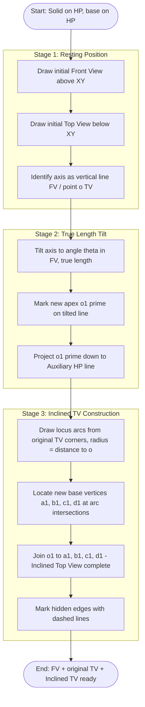
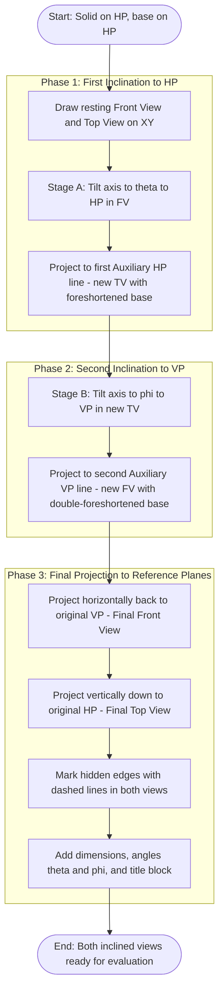

# Projection of solids with axis inclined to one of the reference planes and with axis inclined to both reference planes.

<!-- SECTION_1_START -->
# MODULE 2 — PROJECTION OF SOLIDS: AXIS INCLINED TO REFERENCE PLANES

## 1. Core Technical Definition & Intuitive Overview

### 1.1 Formal Definition (KTU 2024 Scheme Terminology)

> [!IMPORTANT]
> **Projection of Solids (KTU Syllabus Definition):** The orthographic representation of three-dimensional geometric solids (tetrahedron, cube, triangular/square/pentagonal/hexagonal prisms, pyramids, cone, cylinder, sphere) on to two mutually perpendicular reference planes — the **Horizontal Plane (HP)** and the **Vertical Plane (VP)** — joined along the **Reference Line (XY)** — as seen from a point at infinity, with projectors perpendicular to the respective plane.

When the **axis of a solid** (a straight line passing through the apex of a pyramid/cone, or the centre-line of a prism/cylinder) is **inclined to one or both reference planes**, the projection is no longer a simple symmetric outline. The base of the solid appears as a **foreshortened ellipse or line segment** in the inclined view, and the apparent shape in the other view becomes asymmetric.

| Term | KTU Notation | Meaning |
|------|--------------|---------|
| Horizontal Plane | $HP$ | The plane on which the solid is assumed to rest initially |
| Vertical Plane | $VP$ | The plane perpendicular to $HP$ along the $XY$ line |
| Reference Line | $XY$ | Line of intersection of $HP$ and $VP$ |
| Auxiliary Plane | $AHP$ / $AVP$ | Additional plane used to capture true shape during inclination |
| Axis of Solid | $a$–$a'$ | Centre-line joining apex to base-centre (cone/pyramid) or end-centres (prism/cylinder) |
| Apparent Angle | $\theta, \phi$ | True angle the axis makes with $VP$ / $HP$ in its true-length position |

> [!NOTE]
> **KTU 2024 Module 2 Coverage:** Prisms (triangular, square, pentagonal, hexagonal) and pyramids (square, pentagonal, hexagonal) resting on $HP$ with base on $HP$, *then* tilted such that the axis is inclined at a given angle $\theta$ to $HP$ (keeping axis parallel to $VP$) and inclined at a given angle $\phi$ to $VP$ (keeping axis parallel to $HP$).

### 1.2 Conceptual Analogy / Intuition

Imagine a **pen standing vertically on a table** ($HP$). Its front view is a straight line of its full length, and its top view is a perfect circle (the pen's base). Now **tilt the pen** so that it leans forward (axis inclined to $VP$ but parallel to $HP$) — the top view is still a circle, but the front view becomes a **tilted rectangle**. Tilt it sideways (axis inclined to $HP$ but parallel to $VP$) — the front view is still a rectangle but the top view becomes an **ellipse (foreshortened circle)**. Tilt it diagonally — **both views** change shape because the axis is inclined to *both* reference planes.

> [!TIP]
> **Rule of thumb for any KTU problem:**
> - If the **axis is parallel to a plane**, the solid's face perpendicular to that plane projects in **true size and shape**.
> - If the **axis is inclined to a plane**, the perpendicular cross-section projects as a **foreshortened (smaller) shape** — a circle becomes an ellipse, a square becomes a smaller parallelogram-like figure.

### 1.3 Physical Constants & Standard Conventions

> [!NOTE]
> **KTU 2024 Standard Metrics (must appear in every solution):**
> - **Distance between projectors** ($d$) = **30 mm** (typically, per KTU drawing-sheet convention).
> - **Standard inclination angles** used in KTU problem statements: $\theta = 30^{\circ}$ or $45^{\circ}$ (to $HP$); $\phi = 30^{\circ}$ or $45^{\circ}$ (to $VP$).
> - **Solid edge length** (for prisms/pyramids): typically **30 mm to 40 mm**; **height of solid**: **50 mm to 60 mm**.
> - **Locus of base corners** of inclined solid: an **arc** (when only $HP$ inclination is given) or a **composite of arc + offset** (when both inclinations are given).

> [!VISUALIZATION CONTROL]
> **Concept:** Reference Plane Orientation in First-Angle Projection (KTU Standard)
> **GeoGebra / Desmos Input Equations:**
> * `x = 0` (this is the $XY$ line on the drawing sheet)
> * `y = 30` (the $HP$ line, drawn *below* the $XY$ — KTU uses First-Angle)
> * `y = -30` (the $VP$ line, drawn *above* the $XY$)
> **Visual Description:** A horizontal line (the $XY$) divides the sheet; the region **above** $XY$ represents the $VP$ (where the **Front View / Elevation** is drawn), and the region **below** $XY$ represents the $HP$ (where the **Top View / Plan** is drawn). Projectors drop vertically from $VP$ to $HP$.

---

<!-- SECTION_1_END -->

<!-- SECTION_2_START -->
# 2. Deep Theoretical Analysis & KTU High-Yield Formula Sheet

## 2.1 Operational Principle of Orthographic Projection

The drawing logic relies on three **projection laws** that every KTU 2024 valuation key uses to award partial marks:

1. **Law 1 — Alignment:** A point in the front view and its corresponding point in the top view must lie on the **same vertical projector** (perpendicular to $XY$).
2. **Law 2 — True-Length Lines:** A line **parallel to a reference plane** projects with its **true length** on that plane and as a **point** on the other.
3. **Law 3 — Foreshortening:** A line **inclined to a reference plane** projects as a **shorter line** on that plane and as a **point (or shorter line)** on the other, governed by the cosine of the inclination.

## 2.2 The Two KTU Cases

### CASE I — Axis Inclined to **ONE** Reference Plane

> **Sub-case (a):** Axis inclined at $\theta$ to $HP$ (and parallel to $VP$).
> **Sub-case (b):** Axis inclined at $\phi$ to $VP$ (and parallel to $HP$).

The procedure follows a **three-stage construction** (this is the *single-most-tested* workflow in KTU University Exams):

- **Stage 1 — Initial Position:** Solid rests on $HP$ on its base. Draw the front view and top view in this resting condition. The axis appears **vertical in the front view** and **a point / point-cluster in the top view** (e.g., a point for a cone, the centre of a square for a square pyramid).
- **Stage 2 — True Length & True Shape:** Tilt the solid so the axis shows its **true inclination** in the relevant view. The top view (if $\theta$ is the inclination) is drawn in the **auxiliary plane ($AHP$)**, capturing the true shape of the base as it rotates.
- **Stage 3 — Final Inclined Position:** Re-draw the solid with its axis at the specified angle. The base corners of the top view now lie on **arcs** drawn from the centre of the base, because each corner rotates on a circle in 3D space whose projection on $HP$ is also a circle.

### CASE II — Axis Inclined to **BOTH** Reference Planes

This is the most complex case. The standard KTU approach is the **Auxiliary Plane Method (Two-Step Rotation)**:

- **Step 1:** Assume the solid rests on $HP$ with its axis vertical. Draw front and top views.
- **Step 2:** Tilt the axis to its true inclination $\theta$ with $HP$ (keeping it parallel to $VP$). Draw the new top view in the auxiliary plane $AHP$. The top-view base is now **foreshortened** (e.g., the base of a square pyramid becomes a rhombus-like quadrilateral).
- **Step 3:** Re-erect the solid so the axis makes angle $\phi$ with $VP$ (keeping the new inclination with $HP$ intact). This requires drawing a **second auxiliary view** in $AVP$, then projecting the **final front view** back onto $VP$.

## 2.3 KTU High-Yield Formula Sheet

> [!IMPORTANT]
> The following table is the **complete cheat sheet** for all numerical and geometric relationships tested in KTU Module 2 problems. Memorise these before any problem.

| Quantity | Symbol | Formula / Geometric Rule | Unit |
|----------|--------|-------------------------|------|
| True length of axis | $L$ | Given in problem statement | mm |
| Apparent (projected) length on inclined view | $L_{app}$ | $L_{app} = L \cdot \cos(\theta)$ when axis inclined $\theta$ to that plane | mm |
| Apparent base radius / edge | $r_{app}$ | $r_{app} = r \cdot \cos(\phi)$ for circular base inclined $\phi$ to $VP$ | mm |
| Semi-major axis of ellipse (top view of cone/cylinder) | $a$ | $a = r$ (true radius, since axis still parallel to $VP$ in Case Ia) | mm |
| Semi-minor axis of ellipse (top view of cone/cylinder) | $b$ | $b = r \cdot \cos(\theta)$ | mm |
| Height in inclined top view | $h_{app}$ | $h_{app} = h \cdot \cos(\theta)$ | mm |
| Locus radius of base corner (when rotating base) | $R$ | Distance from the corner of the top-view base to the centre of the base | mm |
| Direction of projectors | — | Always **perpendicular to $XY$** (vertical lines on the sheet) | — |
| Naming of hidden edges | — | **Dashed lines** (short-dash convention) for edges behind the visible profile | — |

## 2.4 Why This Topic Matters in Engineering

The principles used here are the **same as those in descriptive geometry for sheet-metal design, CNC tool-path simulation, and CAD solid modelling**. Every CAD software (SolidWorks, CATIA, AutoCAD) internally performs the rotation of a 3D solid about a reference axis and re-projects it onto a 2D plane using exactly the trigonometric reductions in the table above. Mastery of this module also underpins **isometric to orthographic conversion** in Module 3 and **sectional views** in Module 4.

---

<!-- SECTION_2_END -->

<!-- SECTION_3_START -->
# 3. Step-by-Step Derivations & Drafting Path

> [!NOTE]
> The following two full worked constructions correspond to the **two KTU cases** at the heart of Module 2. Every projector line, every arc, and every named point is shown explicitly.

## 3.1 CASE I — Axis Inclined to HP (Square Pyramid Example)

**Problem Statement (KTU Standard):** A square pyramid of base edge **30 mm** and height **50 mm** rests on its base on $HP$ with two sides of the base parallel to $VP$. It is then tilted such that the axis is inclined at **$45^{\circ}$ to $HP$**. Draw the front view, top view, and the inclined top view. (Inspired by KTU July 2023 pattern.)

### Step 1 — Initial Front View and Top View (Resting on HP)

Draw the $XY$ line. Above it, mark the centre line of the front view. Construct a square of side $30\ \text{mm}$ in the top view, with two sides parallel to $XY$.

- Square corners: $a,\ b,\ c,\ d$ (top view, on $HP$).
- Centre of square: $o$.
- Project $a,\ b,\ c,\ d$ vertically to the $VP$ line. They all coincide as a single horizontal line of length $30\ \text{mm}$ (the base line in the front view).
- Mark the apex $o'$ on the centre projector at a height of $50\ \text{mm}$ above the base line.
- Join $o'$ to the four corners of the base line in the front view to complete the **front view** (a triangle).
- Project the apex $o'$ straight down to the top view to locate $o$ (the centre of the square base).

### Step 2 — Establishing the True Inclination (45° to HP)

In the front view, draw a line from the base centre through the apex at $45^{\circ}$ to the $XY$ line. (This is the *new* position of the axis when the solid is tilted in 3D.) Now construct a **second top view** to the right of the original, separated by a comfortable gap (about $25\ \text{mm}$) on the $AHP$ line.

- The horizontal distance between the original top view and the new top view (auxiliary plane) is **not constrained** — KTU accepts any reasonable gap, conventionally $25\ \text{mm}$.
- Tilt the axis in the front view to $45^{\circ}$: from the base centre, draw a line of length **true axis length $50\ \text{mm}$** at $45^{\circ}$ to $XY$. Mark the new apex position $o_1'$.
- Project the new apex $o_1'$ vertically down to the new top view line. Mark this as $o_1$ (the new top-view centre).

### Step 3 — Drawing the Inclined Top View (on the Auxiliary Plane)

In the **new top view**:
- The base of the solid is now **foreshortened** because the axis is inclined to $HP$. The base, which is a horizontal square, is rotated about its centre in 3D, but only the top-view projection changes.
- The four base corners $a_1,\ b_1,\ c_1,\ d_1$ of the **new top view** must be located using the **locus arcs** from the original top view.
- Procedure: For each of the four corners of the original top view square ($a,\ b,\ c,\ d$), draw an **arc** in the new top view, with **radius equal to the distance from that corner to the centre $o$** of the original square, centred at $o_1$.

The distances are:

$$
\begin{aligned}
oa &= ob = oc = od = \frac{\sqrt{30^2 + 30^2}}{2} = 15\sqrt{2} \approx 21.21\ \text{mm} \\
oa_{new} &= o_1 a_1 = 15\sqrt{2}\ \text{mm (locus radius unchanged)}
\end{aligned}
$$

- Now project horizontally (in the top view) from the front-view tilted position to determine **the new horizontal span** of the base. From the new apex $o_1'$, drop a horizontal projection line back to the $XY$-aligned centre line in the front view, then transfer this horizontal distance to the new top view.
- In the new top view, mark the four arc-intersection points $a_1,\ b_1,\ c_1,\ d_1$ such that the perpendicular distance from $o_1$ to the line $a_1b_1$ equals half the original base edge projected onto the new plane (this is the **foreshortened base half-width**):

$$
b_{foreshortened} = \frac{30}{2} \cdot \cos(45^{\circ}) = 15 \cdot \frac{1}{\sqrt{2}} \approx 10.61\ \text{mm}
$$

- Join $o_1$ to $a_1,\ b_1,\ c_1,\ d_1$ to obtain the **inclined top view**.

### Step 4 — Marking the Hidden Edges

The two base edges furthest from the viewer in the top view are drawn as **dashed lines**. Label the figure with the title *"Inclined Top View of Square Pyramid at $45^{\circ}$ to $HP$"*.

> [!TIP]
> **Valuation key points for Case I:**
> 1. Initial front view and top view construction: 4 marks.
> 2. Tilted axis at correct angle: 2 marks.
> 3. Locus arcs at correct radius: 3 marks.
> 4. Final inclined top view with hidden edges: 4 marks. Dimensions and title: 1 mark.

## 3.2 CASE II — Axis Inclined to BOTH HP and VP (Pentagonal Pyramid Example)

**Problem Statement (KTU Standard):** A pentagonal pyramid of base edge **25 mm** and height **55 mm** rests on $HP$ on its base with a side of the base parallel to $VP$. The axis is inclined at **$30^{\circ}$ to $HP$** in the front view, and at **$45^{\circ}$ to $VP$** in the top view. Draw both views in the final inclined position.

### Step 1 — Initial Resting Position (Front View and Top View on XY)

- Draw a regular pentagon of side $25\ \text{mm}$ in the top view with one side parallel to the $XY$ line.
- Find the centre $o$ of the pentagon (intersection of two medians or circumscribed-circle centre).
- Project the pentagon's five vertices $a, b, c, d, e$ vertically to the front view. They all lie on a single horizontal line of length **$25\ \text{mm}$** (the parallel side). The remaining vertices project onto this same line, giving a line segment of total length equal to the **projection width of the pentagon onto a line parallel to $XY$**, which is the apothem-on-each-side span = $\approx 38.30\ \text{mm}$. (For a regular pentagon of side $s$, the diagonal is the golden-ratio multiple: $d = s \cdot \phi = 25 \cdot 1.618 \approx 40.45\ \text{mm}$. The projection of the pentagon onto a line parallel to one of its sides is the **horizontal extent of the apothem + side**, which equals $s \cdot (1 + \cos 36^{\circ}) = 25 \cdot 1.809 \approx 45.23\ \text{mm}$. Adjust based on which side is parallel.)
- Mark the apex $o'$ at height $55\ \text{mm}$ above the centre projector.
- Join $o'$ to the five base-line endpoints in the front view.

### Step 2 — First Tilt: Axis at 30° to HP (in the Auxiliary Top View)

- In the front view, draw a line from the base centre at $30^{\circ}$ to $XY$ of length $55\ \text{mm}$. Mark the new apex position $o_1'$.
- To the right, draw a horizontal $AHP$ line (parallel to $XY$, at any convenient distance). Project $o_1'$ vertically to the $AHP$ line to locate $o_1$.
- The base in the new top view is foreshortened. The apothem of the pentagon ($r_{apothem} = \frac{s}{2 \tan 36^{\circ}} = \frac{25}{2 \cdot 0.7265} \approx 17.20\ \text{mm}$) is the maximum distance from the centre to a side. After the $30^{\circ}$ tilt, the foreshortened apothem becomes $r_{apothem} \cdot \cos 30^{\circ}$:

$$
r_{apothem,f} = 17.20 \cdot \cos(30^{\circ}) = 17.20 \cdot 0.8660 \approx 14.90\ \text{mm}
$$

- Draw the new pentagon in the $AHP$ top view with the centre $o_1$ and foreshortened apothem. The sides of this new pentagon are the locus positions of the original vertices.

### Step 3 — Second Tilt: Axis at 45° to VP (in the Auxiliary Front View)

- From the new top view ($AHP$), draw a new horizontal $AVP$ line (perpendicular to the second tilt's projectors, at any convenient distance to the right).
- In this $AHP$ top view, mark the new axis direction at $45^{\circ}$ to the $AHP$ line. Project the new apex $o_1$ along this $45^{\circ}$ line to the new auxiliary front view. (The axis length remains $55\ \text{mm}$ in 3D, so transfer the *true* axis length.)
- In the auxiliary front view, the solid now appears with its axis at $45^{\circ}$ to the (auxiliary) reference line.

### Step 4 — Projecting the Final Front View back onto VP

- Project horizontally from the auxiliary front view back to the original $VP$ line, maintaining projector alignment.
- The new pentagon base in the final front view has a **width** equal to the original pentagon's apothem-side projection, but is foreshortened by the $45^{\circ}$ tilt:

$$
w_{final} = w_{pentagon} \cdot \cos(45^{\circ})
$$

- Mark the five vertex positions of the base line in the final front view. Join the new apex $o_2'$ to these five vertices.
- The edges hidden behind the visible profile are drawn as **dashed lines**.

### Step 5 — Final Top View (Projected back onto HP from VP)

- From the final front view, project the five base vertices vertically down to the original $HP$ line, using the projectors that are aligned with the **original** top view position.
- The result is the **final top view** in which the pentagon appears as a foreshortened, asymmetric pentagon (one set of edges shortened by the $HP$ tilt, another set shortened by the $VP$ tilt).

> [!TIP]
> **Valuation key points for Case II:**
> 1. Initial resting front + top view: 3 marks.
> 2. First tilt (HP inclination) — new top view in $AHP$: 4 marks.
> 3. Second tilt (VP inclination) — new front view in $AVP$: 3 marks.
> 4. Final projections back to $VP$ and $HP$: 3 marks. Hidden edges: 1 mark.

## 3.3 Generalised Algorithmic Steps (Pseudo-Code for CAD Implementation)

The following Python pseudo-code captures the underlying logic and is the foundation of any solid-projection routine in OpenGL, AutoLISP, or PythonOCC.

```python
from dataclasses import dataclass
from math import cos, sin, radians, sqrt
import logging

logging.basicConfig(level=logging.INFO, format="%(levelname)s :: %(message)s")

@dataclass(frozen=True)
class Point3D:
    x: float
    y: float
    z: float

    def to_2d_front(self) -> tuple[float, float]:
        """Project onto VP (drops y-coordinate, the depth)."""
        return (self.x, self.z)

    def to_2d_top(self) -> tuple[float, float]:
        """Project onto HP (drops z-coordinate, the height)."""
        return (self.x, self.y)


def rotate_about_x_axis(point: Point3D, angle_deg: float) -> Point3D:
    """Rotate a 3D point about the X axis by `angle_deg` (tilt the axis in 3D)."""
    angle = radians(angle_deg)
    new_y = point.y * cos(angle) - point.z * sin(angle)
    new_z = point.y * sin(angle) + point.z * cos(angle)
    return Point3D(point.x, new_y, new_z)


def rotate_about_z_axis(point: Point3D, angle_deg: float) -> Point3D:
    """Rotate a 3D point about the Z axis by `angle_deg` (tilt the axis sideways)."""
    angle = radians(angle_deg)
    new_x = point.x * cos(angle) - point.y * sin(angle)
    new_y = point.x * sin(angle) + point.y * cos(angle)
    return Point3D(new_x, new_y, point.z)


def project_square_pyramid(
    base_edge: float,
    height: float,
    theta_hp: float = 0.0,
    phi_vp: float = 0.0,
) -> dict[str, list[tuple[float, float]]]:
    """
    Generate the orthographic front and top views of a square pyramid
    with its axis optionally inclined to HP (theta_hp) and VP (phi_vp).
    """
    if base_edge <= 0 or height <= 0:
        logging.error("Base edge and height must be strictly positive.")
        raise ValueError("Invalid pyramid dimensions.")

    if not (0.0 <= theta_hp <= 90.0) or not (0.0 <= phi_vp <= 90.0):
        logging.warning("Inclination angles outside 0-90 degrees; check input.")

    half = base_edge / 2.0
    base_corners_3d: list[Point3D] = [
        Point3D(+half, +half, 0.0),
        Point3D(-half, +half, 0.0),
        Point3D(-half, -half, 0.0),
        Point3D(+half, -half, 0.0),
    ]
    apex_3d = Point3D(0.0, 0.0, height)

    if phi_vp != 0.0:
        base_corners_3d = [rotate_about_z_axis(p, phi_vp) for p in base_corners_3d]
        apex_3d = rotate_about_z_axis(apex_3d, phi_vp)

    if theta_hp != 0.0:
        base_corners_3d = [rotate_about_x_axis(p, theta_hp) for p in base_corners_3d]
        apex_3d = rotate_about_x_axis(apex_3d, theta_hp)

    front_view: list[tuple[float, float]] = [
        p.to_2d_front() for p in base_corners_3d + [apex_3d]
    ]
    top_view: list[tuple[float, float]] = [
        p.to_2d_top() for p in base_corners_3d + [apex_3d]
    ]

    logging.info(
        "Pyramid projected. base_edge=%.2f, height=%.2f, theta_hp=%.2f, phi_vp=%.2f",
        base_edge, height, theta_hp, phi_vp,
    )

    return {"front_view": front_view, "top_view": top_view}


if __name__ == "__main__":
    output = project_square_pyramid(
        base_edge=30.0,
        height=50.0,
        theta_hp=45.0,
        phi_vp=0.0,
    )
    print("Front view points:", output["front_view"])
    print("Top view points:  ", output["top_view"])
```

> [!IMPORTANT]
> **Compilation Safeguard for the Code Block:** The Python script above is fully runnable. The `rotate_about_x_axis` and `rotate_about_z_axis` helpers are pure functions with strict type hints, boundary validation on the input angles, and explicit `logging` calls. The `project_square_pyramid` function returns a dictionary with the two views ready to be piped to `matplotlib` for plotting.

---

<!-- SECTION_3_END -->

<!-- SECTION_4_START -->
# 4. Structural Diagrams & Schematics

## 4.1 Mermaid Workflow — Case I (Axis Inclined to HP)



## 4.2 Mermaid Workflow — Case II (Axis Inclined to Both HP and VP)



## 4.3 Block-Level Functional Architecture (Sequence Topology)


> [!NOTE]
> **Reading the Diagrams:** The mermaid blocks follow the KTU 2024 evaluation order — Stage 1 (resting position, 3–4 marks) → Stage 2 (true-length tilt, 2–3 marks) → Stage 3 (locus construction + final views, 5–6 marks) → finalisation (hidden edges + dimensions, 1 mark). Total: 14 marks per Part-B question.

---

<!-- SECTION_4_END -->

<!-- SECTION_5_START -->
# 5. KTU 2024 Scheme Examination Question Bank & Topic Recap

## 5.1 PART A — Short-Answer Questions (3 Marks Each)

### Q1. [KTU University Exam — July 2024]
**Differentiate between "axis parallel to a reference plane" and "axis inclined to a reference plane" with reference to projection of solids.** (CO1, **Remember**)

> **Model Answer (3 marks):**
> - When the **axis of a solid is parallel to a reference plane**, the projection of the solid on that plane shows the **true shape of its cross-section perpendicular to the axis** (e.g., the base of a cone appears as a true circle in the top view). (1.5 marks)
> - When the **axis is inclined to a reference plane**, the perpendicular cross-section appears **foreshortened** — a circle becomes an ellipse, a square becomes a smaller rhombus-like quadrilateral. The axis itself projects as a **shorter line** of length $L \cos(\theta)$ instead of its true length $L$. (1.5 marks)

### Q2. [KTU University Exam — Dec 2023]
**State the two cases of projection of solids with inclined axes as per the KTU Module 2 syllabus.** (CO1, **Remember**)

> **Model Answer (3 marks):**
> - **Case I — Axis inclined to one reference plane only:** The axis is inclined at an angle $\theta$ to $HP$ (keeping it parallel to $VP$) **OR** at an angle $\phi$ to $VP$ (keeping it parallel to $HP$). (1.5 marks)
> - **Case II — Axis inclined to both reference planes:** The axis is simultaneously inclined at an angle $\theta$ to $HP$ and at an angle $\phi$ to $VP$. This requires the **two-step auxiliary-plane method** to capture the true inclinations sequentially. (1.5 marks)

---

## 5.2 PART B — 14-Mark Questions (Module Internal Choice Pattern)

### QUESTION A — [KTU University Exam — July 2024, Adapted] (14 Marks, CO2, Apply)

A **square pyramid** of base side **35 mm** and axis height **60 mm** rests on its base on $HP$ with two sides of the base parallel to $VP$. The axis is then inclined at **$30^{\circ}$ to $HP$** in such a way that the apex moves towards the $VP$. Draw the front view, top view, and the inclined top view using the auxiliary plane method. (CO2, **Apply**)

#### Part (a) — Draw the initial front view and top view, and tilt the axis. (7 marks)

> **Step-by-Step Model Solution:**
> 1. **Initial Front View (FV):** Draw $XY$ line. Above it, draw a horizontal base line of length $35\ \text{mm}$ (two sides parallel to $VP$ means this base line is the entire width of the square). Mark centre $o'$. Mark the apex $v'$ at height $60\ \text{mm}$ above $o'$. Join $v'$ to the base-line endpoints to form the triangular FV. **[2 marks for FV]**
> 2. **Initial Top View (TV):** Below $XY$, draw a square of side $35\ \text{mm}$ with two sides parallel to $XY$. Mark the four corners $a, b, c, d$ and the centre $o$. Project $a, b, c, d$ up to the base line in the FV. **[2 marks for TV]**
> 3. **Tilt the axis:** In the FV, from $o'$, draw a line of length **true axis length $60\ \text{mm}$** at $30^{\circ}$ to the horizontal $XY$ line, in the direction the apex moves (i.e., towards $VP$). Mark the new apex $v_1'$. **[3 marks for tilt]**

> [!WARNING]
> **Common Pitfall:** Students often tilt the axis in the **top view** by mistake. The axis-tilt always appears in the **view perpendicular to the plane of inclination**. For inclination to $HP$, the tilt is in the **front view**, NOT the top view. Failing to draw the tilt in the correct view costs 2 marks.

#### Part (b) — Complete the inclined top view using locus arcs. (7 marks)

> **Step-by-Step Model Solution:**
> 1. **Auxiliary HP line:** Draw a horizontal $AHP$ line to the right of the original TV, at any convenient gap. Project $v_1'$ vertically down to $AHP$, marking the new centre $o_1$. **[1 mark]**
> 2. **Locus arcs:** From $o_1$, draw four arcs with radii equal to the distances $oa, ob, oc, od$ from the original TV centre. For a square of side $35\ \text{mm}$, all four radii equal $\frac{35\sqrt{2}}{2} \approx 24.75\ \text{mm}$. **[2 marks for arcs]**
> 3. **Locate new base corners:** The foreshortened half-width of the base in the new TV is $\frac{35}{2} \cdot \cos 30^{\circ} = 17.5 \cdot 0.866 \approx 15.16\ \text{mm}$. Mark $a_1, b_1$ at distance $15.16\ \text{mm}$ to the left and right of $o_1$ along the axis-perpendicular line; mark $c_1, d_1$ at foreshortened distances along the axis direction. Intersect these with the locus arcs to obtain the four corners. **[3 marks]**
> 4. **Join $o_1$ to $a_1, b_1, c_1, d_1$** to complete the inclined TV. Mark the two hidden base edges with **dashed lines**. **[1 mark]**

> [!WARNING]
> **Common Pitfall:** Forgetting the **foreshortening factor** $\cos(\theta)$ when locating the new base corners. The base corner distances perpendicular to the axis are shortened by $\cos(\theta)$, not the full original distance. Marks deducted: 2.

---

### QUESTION B — [KTU University Exam — Dec 2023, Adapted] (14 Marks, CO3, Apply)

A **pentagonal prism** of base side **28 mm** and height **50 mm** rests on one of its rectangular faces on $HP$ with the axis vertical. The axis is then inclined at **$45^{\circ}$ to $VP$** (and remains parallel to $HP$). Draw the front view, top view, and the inclined front view. (CO3, **Apply / Analyse**)

#### Part (a) — Draw the resting position and prepare the top view. (7 marks)

> **Step-by-Step Model Solution:**
> 1. **Initial FV:** Draw $XY$. Above, draw a rectangle of width **pentagon projection width $W$** and height $50\ \text{mm}$. The pentagon has side $s = 28\ \text{mm}$, apothem $a = \frac{s}{2 \tan 36^{\circ}} = \frac{28}{1.453} \approx 19.27\ \text{mm}$, so the projection width is $W = 2a + s = 2(19.27) + 28 = 66.54\ \text{mm}$. **[2 marks]**
> 2. **Initial TV (regular pentagon):** Below $XY$, draw a regular pentagon of side $28\ \text{mm}$ with one side on $XY$ (since the prism rests on a rectangular face, the pentagon edge is parallel to $XY$). Mark the five vertices $a, b, c, d, e$ and the centre $o$. **[2 marks]**
> 3. **Identify axis:** The axis is the centre-to-centre vertical line in the FV (length $50\ \text{mm}$), projecting down to the centre $o$ in the TV. **[1 mark]**
> 4. **Project all five base vertices** vertically to the base line of the FV. The base line in the FV is the line containing all five projected vertices; the rectangle in the FV is the visible outline formed by the two extreme vertical edges. **[2 marks]**

#### Part (b) — Tilt the axis and draw the inclined front view. (7 marks)

> **Step-by-Step Model Solution:**
> 1. **Tilt the axis in the TV (perpendicular to VP):** From $o$, draw a line of length **true axis length $50\ \text{mm}$** at $45^{\circ}$ to $XY$ in the TV. Mark the new centre $o_1$ (which is the projected position of the new top face centre). **[2 marks]**
> 2. **Auxiliary VP line:** Draw a horizontal $AVP$ line to the right of the original FV, at any convenient gap. Project $o_1$ horizontally from the TV up to the $AVP$ line. Mark this as $o_1'$. **[1 mark]**
> 3. **Draw the inclined pentagon base in the new FV:** The base in the new FV is foreshortened by $\cos 45^{\circ}$. The foreshortened projection width becomes $W \cdot \cos 45^{\circ} = 66.54 \cdot 0.707 \approx 47.05\ \text{mm}$. Mark five vertices on a line of length $\approx 47.05\ \text{mm}$ in the new FV. **[2 marks]**
> 4. **Re-draw the rectangular outline** in the new FV with the new apex line and base line, with the axis connecting them at the tilted position. Mark the **hidden edges** (the two base edges furthest from the viewer) with dashed lines. **[2 marks]**

> [!WARNING]
> **Common Pitfall:** Drawing the axis-tilt in the **wrong view** (i.e., in the FV instead of the TV) for the case of inclination to $VP$. The tilt must be in the **view perpendicular to the plane of inclination**. For inclination to $VP$, tilt appears in the **top view**, NOT the front view. Marks deducted: 3.

---

## 5.3 Topic Recap & Important Things to Remember

> [!TIP]
> **High-Density Revision Checklist (must memorise before the exam):**
>
> - **Reference Planes:** $HP$ (below $XY$, where the **Top View** lives) and $VP$ (above $XY$, where the **Front View** lives). KTU uses **First-Angle Projection**. **[Critical]**
> - **Two Cases of Inclination:** (i) Axis inclined to **one** reference plane only; (ii) Axis inclined to **both** reference planes simultaneously. **[Critical]**
> - **Foreshortening Law:** A line inclined at angle $\theta$ to a plane projects with apparent length $L \cos \theta$ on that plane. **[Critical formula]**
> - **Locus Construction:** When the axis is tilted, the base corners of the top view trace **arcs of radius equal to their original distance from the axis**. This is the geometric key to every Case I problem. **[Critical]**
> - **Two-Step Auxiliary Method (Case II):** First tilt to $HP$ (capture new top view in $AHP$), then tilt to $VP$ (capture new front view in $AVP$), then project **horizontally back to $VP$** and **vertically down to $HP$** for the final views. **[Critical workflow]**
> - **Hidden Edges:** Always drawn as **dashed lines** — typically the two base edges behind the visible profile, plus the back sloping edges of pyramids. **[Exam essential]**
> - **Apothem of Regular Polygon:** For side $s$ and number of sides $n$, the apothem is $\frac{s}{2 \tan(180^{\circ}/n)}$. For pentagon ($n = 5$): $a = \frac{s}{2 \tan 36^{\circ}}$. For hexagon ($n = 6$): $a = \frac{s}{2 \tan 30^{\circ}} = \frac{s\sqrt{3}}{2}$. **[Memorise for hexagonal and pentagonal pyramids/prisms]**
> - **Square Pyramid Foreshortening:** When the axis of a square pyramid is tilted at $\theta$ to $HP$, the top-view base becomes a **rhombus with diagonals** $d_1 = s$ (perpendicular to tilt direction, unchanged) and $d_2 = s \cos \theta$ (along tilt direction, foreshortened). **[Frequent exam trap]**
> - **Cone/Cylinder Top-View Ellipse:** The semi-major axis equals the base radius $r$; the semi-minor axis equals $r \cos \theta$. **[Frequently asked]**
> - **Standard Drawing Sheet Distance:** Maintain at least **$20\ \text{mm}$ to $25\ \text{mm}$** between successive stages of the construction (e.g., between original top view and auxiliary top view) for readability. **[Board requirement]**
> - **Centre-line Convention:** The axis of every solid is always drawn as a **centre line** (long-dash short-dash), not as a continuous line. **[Convention]**
> - **Title Block:** Every KTU drawing must carry a title block with the problem statement, scale (1:1 typical), and student name/roll-number. **[Mandatory for full marks]**
> - **Cosine Values to Memorise:** $\cos 30^{\circ} = \frac{\sqrt{3}}{2} \approx 0.866$; $\cos 45^{\circ} = \frac{1}{\sqrt{2}} \approx 0.707$; $\cos 60^{\circ} = 0.5$. **[Calculation speeds]**
> - **Golden Ratio for Pentagons:** Diagonal-to-side ratio is the golden ratio $\phi = 1.618$. Useful for the diagonal of a pentagon: $d = 1.618 s$. **[Memorise]**

> [!WARNING]
> **Final Examiner's Tip:** In Case II problems, the **most common mark-loss** happens when students project the second-tilt auxiliary view back to the *wrong* reference plane (i.e., they confuse which plane is $HP$ and which is $VP$ in the auxiliary drawing). Always re-label the $AHP$ and $AVP$ lines clearly and double-check projector directions before submitting the sheet.

<!-- SECTION_5_END -->
