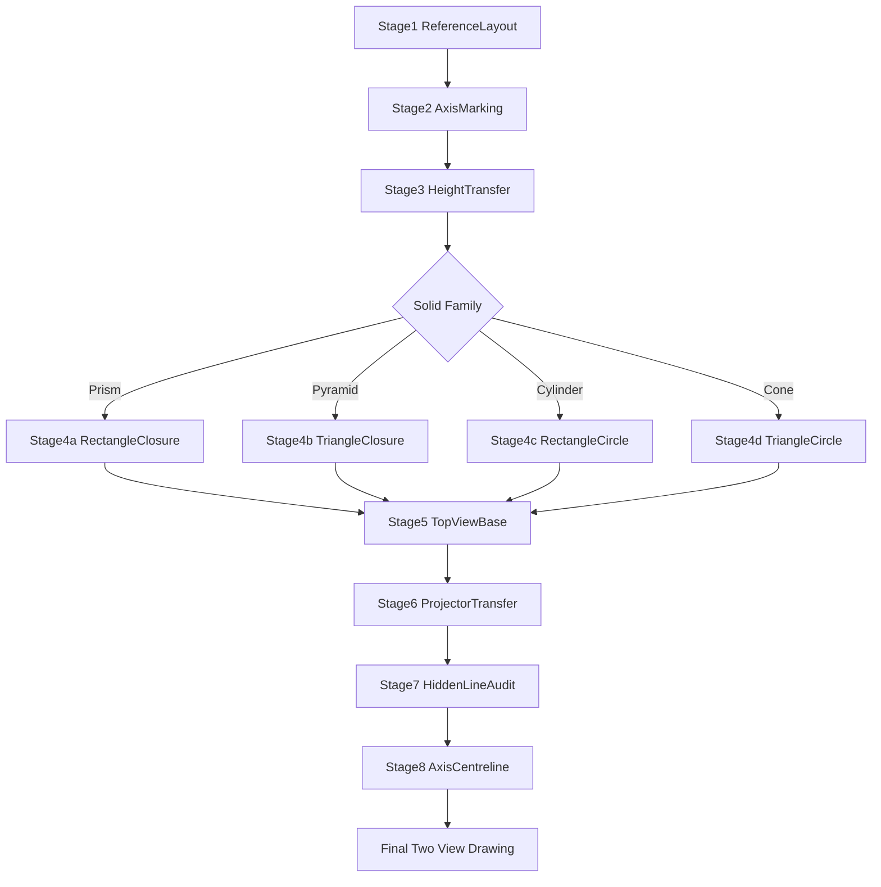
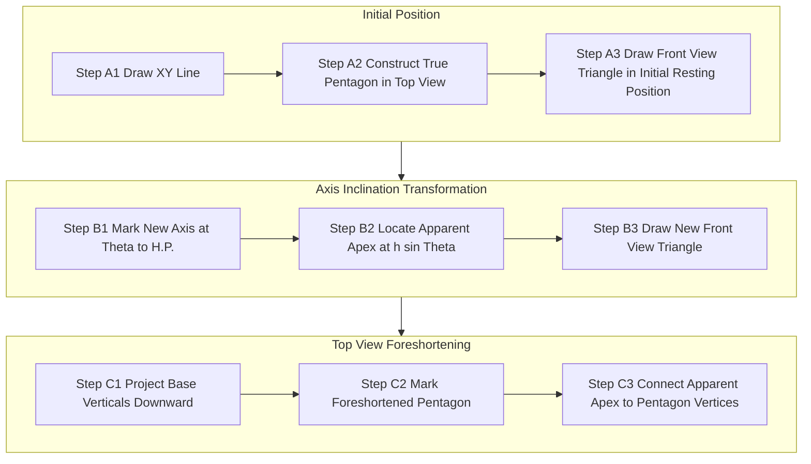
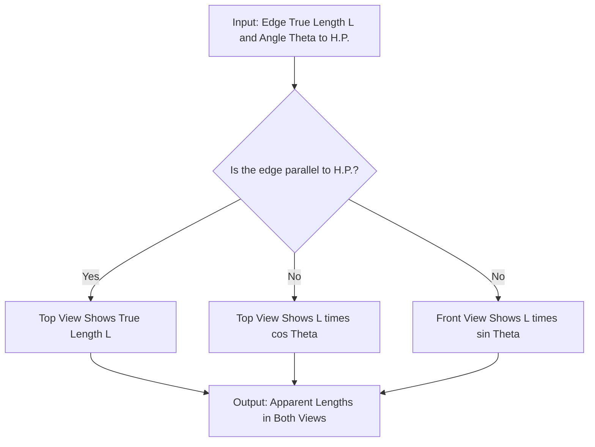
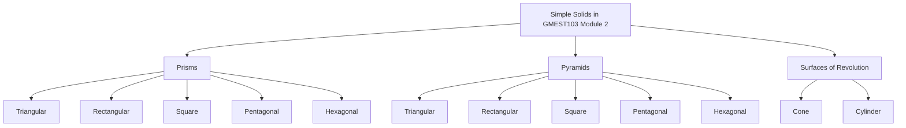
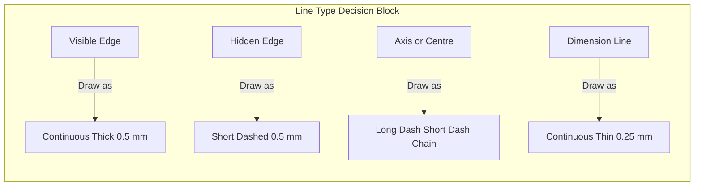

# Projection of Simple solids: Triangular, Rectangle, Square, Pentagonal and Hexagonal Prisms, Pyramids, Cone and Cylinder only

<!-- SECTION_1_START -->
# Projection of Simple Solids — Foundations & Geometric Intuition

## 1.1 Formal Definition (KTU 2024 Scheme Terminology)

A **simple solid** in engineering graphics is a *right regular polyhedron* (or a surface of revolution) whose base, top, and lateral surfaces are bounded by **straight edges and flat/smooth curved generators**, all lying perpendicular or symmetric to a single central axis. Projection of simple solids refers to the systematic generation of **orthographic views** of these geometric primitives on the principal reference planes using **First Angle Projection** (as per BIS SP 46:2003 adopted by KTU).

The eight primitive solids prescribed in the **GMEST103 — Module 2** syllabus are categorised as:

| Family | Solids Covered |
|---|---|
| **Prisms** | Triangular, Rectangular, Square, Pentagonal, Hexagonal |
| **Pyramids** | Triangular, Rectangular, Square, Pentagonal, Hexagonal |
| **Surfaces of Revolution** | Right Circular Cone, Right Circular Cylinder |

> [!IMPORTANT]
> **KTU 2024 Syllabus Boundary:** Only the *right regular* variants whose **axis is perpendicular to the base** are assessed. *Oblique* solids, truncated solids, and spheres are explicitly out of scope for this module.

### 1.2 Reference Plane Conventions

Two mutually perpendicular principal reference planes are used in KTU board examination sheets:

- **Horizontal Plane (H.P.)** — The plane of the drawing sheet on which the *Top View* (P) is laid.
- **Vertical Plane (V.P.)** — The plane perpendicular to H.P. on which the *Front View* (F) is laid.

The line of intersection of H.P. and V.P. is the **Reference Line (R.L.)**, commonly abbreviated as **$XY$**. All projections and dimensions are referenced to this line.

### 1.3 Conceptual Analogy & Intuitive Overview

Imagine a bright noon sun directly overhead and a powerful floodlight placed at infinite distance horizontally in front of you. The shadow cast on the ground by a hexagonal pencil (a prism) is the *top view*, while the shadow projected on the wall behind is the *front view*. The pencil's "true length" along its axis appears *shorter* in the top view (it has been foreshortened) and *true* in the front view. This shadow-casting analogy is precisely orthographic projection.

> [!NOTE]
> **First Angle vs Third Angle:** KTU (and all Indian engineering boards under BIS) mandate **First Angle Projection**. In this convention, the object is imagined to be placed *between* the observer and the plane of projection. The top view is therefore drawn *below* the front view, sharing the $XY$ line.

### 1.4 Visualisation Reference

> [!VISUALIZATION CONTROL]
> **Concept:** Orthographic projection of a square prism on H.P. and V.P.
> **Reference Line Equation:** `y = 0`  (i.e., the $XY$ reference line on a 2D sheet)
> **Visual Description:** The student should picture a square prism standing upright on a flat table (H.P.) against a vertical wall (V.P.). Its front view on the wall shows a rectangle (true shape of the side face). Its top view on the table below it shows a square (the base), sharing the same width as the rectangle. The $XY$ line runs horizontally between them.

## 1.5 Solid Classification Tree (Module 2)

$$
\text{Simple Solids} \rightarrow
\begin{cases}
\text{Polyhedral (faceted)} \rightarrow
\begin{cases}
\text{Prisms (two parallel congruent bases, lateral edges parallel)} \\
\text{Pyramids (single base, lateral edges converging to an apex)}
\end{cases} \\
\text{Surfaces of Revolution} \rightarrow
\begin{cases}
\text{Cone (base circle, apex, curved lateral surface)} \\
\text{Cylinder (two parallel equal circles, curved lateral surface)}
\end{cases}
\end{cases}
$$

## 1.6 Vocabulary of a Solid

Every simple solid in this module is parameterised by a small set of geometric descriptors. Mastering these is essential before attempting any board problem.

- **Base** — The polygon (or circle) that lies on H.P. or V.P. in the resting position.
- **Axis** — The line passing through the centre of the base perpendicular to it. For right solids, the axis is always perpendicular to the base.
- **Apex** — The point where all lateral edges (pyramid) or generators (cone) converge. Absent in prisms and cylinders.
- **Generator / Lateral Edge** — A line segment from a base vertex to the apex (pyramid) or between corresponding vertices of the two bases (prism), or a line on the lateral surface (cone/cylinder).
- **Height ($h$)** — True perpendicular distance between base and top (prism/cylinder) or between base and apex (pyramid/cone).
- **Side of Base ($s$ or $a$)** — Length of one edge of the base polygon.
- **Apothem / In-radius of Base ($r$)** — Perpendicular distance from the centre of the base polygon to the midpoint of any side. Critical for projecting pyramids where base tilt affects visibility.
- **Circum-radius of Base ($R$)** — Distance from the centre of the base to any vertex. Used to project pentagonal and hexagonal bases in tilted positions.

<!-- SECTION_1_END -->

<!-- SECTION_2_START -->
# Deep Theoretical Analysis & KTU High-Yield Formula Sheet

## 2.1 The Three Orthographic Views

For every solid, KTU examiners expect the candidate to produce **at minimum two views**, and at times **three** (when an end view is demanded). They are:

1. **Front View (F)** — Projection on the Vertical Plane. The elevation.
2. **Top View (T)** — Projection on the Horizontal Plane. The plan.
3. **Side View (S)** — Projection on the Profile Plane. Required only when the solid is tilted or rotated and a clearer dimension is needed.

## 2.2 Principle of Projection (Operational Rules)

The first step in solving any Module 2 problem is *positioning the solid*. The solid may rest in one of three canonical positions. The projection rules differ for each.

> [!IMPORTANT]
> **KTU Examiner's Heuristic:** "When a solid rests on its base on H.P., all slant edges/projectors from apex lie on the *same* line in the top view, and the top view itself is the true shape of the base."

### 2.2.1 Position A — Solid Resting on its Base on H.P.

- Base is parallel to H.P. and perpendicular to V.P.
- **Front View:** True shape of the lateral silhouette. For prisms this is a rectangle; for pyramids a triangle; for cylinders a rectangle; for cones a triangle.
- **Top View:** True shape of the base, but foreshortened in the front-to-back direction only when the solid has a curved lateral surface (cone/cylinder).
- **Axis** appears as a vertical line in the front view and as a point (the centroid) in the top view.

### 2.2.2 Position B — Solid Resting on a Lateral Face/Side on H.P.

- One lateral face is parallel to V.P. (and therefore perpendicular to H.P.).
- The base tilts by an angle whose tangent depends on the geometry.
- **Top View** shows the *true shape of the base* (it remains parallel to H.P. ... actually, the base is now inclined, so the top view is *foreshortened*).
- **Front View** shows the *apparent* shape of the base, foreshorten.

### 2.2.3 Position C — Solid Resting on an Edge/Generator on H.P. (or Tilted Axis)

- The axis is inclined to H.P. at a given angle $\theta$.
- The base and the top are parallel to each other but inclined to H.P. (and parallel to V.P.).
- All three views are typically required because no single view shows the true shape of the base.

## 2.3 Apparent Length & Foreshortening — The Critical Mathematics

When a line of true length $L$ is inclined to a projection plane at an angle $\theta$, its **apparent length** (the length as seen in that view) is:

$$
L_{\text{apparent}} = L \cdot \cos(\theta)
$$

> [!NOTE]
> **The Single Most Important Formula in Module 2.** Every projection in this module — every tilted base, every inclined axis, every slanted generator — collapses to this one trigonometric identity. The angle $\theta$ is measured between the line (edge, axis, or face) and the plane on which the apparent length is being projected.

### 2.3.1 Application — Apparent Diagonal of an Inclined Square Base

A square of side $a$ rests on one edge on H.P. such that the base is inclined at $\theta$ to H.P. The diagonal of the square in the top view is **not** the true diagonal $a\sqrt{2}$. The diagonal lying along the direction of tilt has true length $a\sqrt{2}$ but its projection on H.P. is:

$$
d_{\text{apparent, top}} = a\sqrt{2} \cdot \cos(\theta)
$$

## 2.4 The KTU High-Yield Formula Sheet

The following table consolidates every formula and geometric constant the examiner expects a student to either recall or derive for the eight solids in Module 2. **Memorise this table.**

> [!NOTE]
> **Escape Rule Applied:** All absolute-value and set-membership pipes have been replaced with $\vert$ and $\mid$ to preserve Markdown table integrity.

| Solid | True Shape in Front View (Resting on Base) | True Shape in Top View (Resting on Base) | Base Geometry Constants | Tilt Projection Master Formula |
|---|---|---|---|---|
| Triangular Prism | Rectangle (width $= a$, height $= h$) | Triangle (true shape, side $a$) | Apothem $r = \dfrac{a}{2\sqrt{3}}$ | $a_{\text{app}} = a \cdot \cos(\theta)$ |
| Rectangular Prism | Rectangle (width $= L$, height $= h$) | Rectangle ($L \times B$) | $L$, $B$ are side lengths | $L_{\text{app}} = L \cdot \cos(\theta)$ |
| Square Prism | Rectangle (width $= a$, height $= h$) | Square (side $a$) | Apothem $r = \dfrac{a}{2}$ | $a_{\text{app}} = a \cdot \cos(\theta)$ |
| Pentagonal Prism | Rectangle (width $= 5a/2 \cdot \sin 36^{\circ}$, height $= h$) | Pentagon (true) | Apothem $r = \dfrac{a}{2 \tan 36^{\circ}} \approx 0.688a$ | $s_{\text{app}} = s \cdot \cos(\theta)$ |
| Hexagonal Prism | Rectangle (width $= a\sqrt{3}$, height $= h$) | Hexagon (true) | Apothem $r = \dfrac{a\sqrt{3}}{2}$ | $s_{\text{app}} = s \cdot \cos(\theta)$ |
| Triangular Pyramid | Triangle (apex angle $= 2\arctan(a/h)$) | Triangle (true base) | $r = \dfrac{a}{2\sqrt{3}}$ | $a_{\text{app}} = a \cdot \cos(\theta)$ |
| Square Pyramid | Triangle | Square (true base) | $r = \dfrac{a}{2}$ | $a_{\text{app}} = a \cdot \cos(\theta)$ |
| Pentagonal Pyramid | Triangle (5 apex points vertically) | Pentagon (true) | $r \approx 0.688a$ | $a_{\text{app}} = a \cdot \cos(\theta)$ |
| Hexagonal Pyramid | Triangle | Hexagon (true) | $r = \dfrac{a\sqrt{3}}{2}$ | $a_{\text{app}} = a \cdot \cos(\theta)$ |
| Cylinder | Rectangle (width $= 2R$, height $= h$) | Circle (radius $R$) | Radius $R$, height $h$ | $R_{\text{app}} = R \cdot \cos(\theta)$ |
| Cone | Triangle (base $= 2R$, height $= h$) | Circle (radius $R$) | Radius $R$, height $h$ | $R_{\text{app}} = R \cdot \cos(\theta)$ |

## 2.5 Hidden Line & Visibility Conventions

The following is a hard-and-fast rule set enforced by KTU board examiners when evaluating the projection of solids:

- **Visible edges** are drawn as **continuous thick lines** of nominal width **$0.5$ mm**.
- **Hidden edges** (those occluded behind the solid from the observer's viewpoint) are drawn as **short dashed lines** of the same thickness.
- **Centre lines / axis lines** are drawn as **long dash — short dash** chain lines, thinner than visible lines.
- A solid is conventionally *opaque*. The observer is positioned such that they look *from the front* (V.P. side) and *from above* (H.P. side) for the two principal views.

> [!WARNING]
> **Common Mark Loss:** Students frequently fail to indicate the **axis** of the solid in both views as a centre line. KTU examiners allocate **1 mark** for the explicit drawing of the axis in every problem involving a cone, cylinder, prism, or pyramid.

## 2.6 Engineering Utility of Solid Projections

The ability to project simple solids is the *gateway skill* to every downstream topic in mechanical design and manufacturing:

- **Sheet metal layout & development** (Module 3) requires the exact front view of the solid (cone for funnels, prism for ducts).
- **Intersection of solids** (Module 4) demands mastery of two-view projection to find the line of intersection.
- **Sectioning and hidden details** (Module 4 again) build directly on the projection framework.
- **CAD software workflow** (AutoCAD, SolidWorks, CATIA) — every primitive created in these tools (`BOX`, `CYLINDER`, `CONE`, `WEDGE`, `PYRAMID`) is internally a projection-engine model. A student who masters hand projection understands the parametric output of these commands.

## 2.7 Construction Logic Summary

The construction of any projection of a solid follows a **four-stage invariant pipeline**:

$$
\text{Stage 1: Layout} \rightarrow \text{Stage 2: Base Construction} \rightarrow \text{Stage 3: Projector Lines} \rightarrow \text{Stage 4: Apparent Shape Closure}
$$

This pipeline is identical for every solid in the syllabus, with the only variation being the geometric construction of the base polygon in Stage 2. We will instantiate this pipeline for each solid in **Section 3**.

<!-- SECTION_2_END -->

<!-- SECTION_3_START -->
# Step-by-Step Drafting Procedures for Each Solid

> [!IMPORTANT]
> **KTU 2024 Convention Reminder:** All drafting below uses **First Angle Projection**. Top View is drawn **below** Front View, separated by the $XY$ reference line. Object is assumed *between* observer and the plane of projection.

## 3.1 Generalised Drafting Pipeline (Applicable to All Eight Solids)

The pipeline below is universal. Each subsequent sub-section instantiates it for a specific solid.

**Step 1 — Reference Line and Axis Construction.** Draw a horizontal $XY$ reference line. Above $XY$, mark a vertical axis line representing the *axis of the solid*. This axis is conventionally positioned slightly left-of-centre on the sheet to allow space for the top view's full width to be drawn below.

**Step 2 — Front View Construction.** On the axis, mark the height of the solid. For a prism or cylinder of height $h$, draw two horizontal lines separated by $h$ (the lower line touching $XY$). For a pyramid or cone of height $h$, mark the apex on the axis at height $h$ and the base on $XY$.

**Step 3 — Width Acquisition in Top View.** Project vertical projectors from the endpoints of the base (or from the extreme lateral points) downward, crossing $XY$ into the top view region. These projectors transfer the *width* of the solid from the front view to the top view.

**Step 4 — True Base Construction in Top View.** Using the acquired width, construct the *true shape* of the base polygon (or circle) in the top view, centred on the axis point.

**Step 5 — Apparent Top Closure.** For the pyramid or cone, project the apex down through the axis point and connect it to the vertices of the true base to obtain the lateral edges/generator lines in the top view.

**Step 6 — Hidden Line Audit.** Determine which edges lie behind the solid and convert those visible-in-front lines into dashed hidden lines.

## 3.2 Worked Procedure — Triangular Prism Resting on its Base on H.P., One Rectangular Face Parallel to V.P.

**Given Data:** Triangular prism, base side $a = 30$ mm, height $h = 50$ mm, resting on base on H.P., one rectangular face parallel to V.P.

**Stage 1 — Reference Layout.** Draw the $XY$ reference line across the sheet. Reserve the upper half for the front view, the lower half for the top view.

**Stage 2 — Base Triangle in Top View (True Shape).** Construct an equilateral triangle of side $30$ mm below $XY$, with one side parallel to $XY$. Label the vertices as $a$, $b$, $c$ where $a$ and $b$ are the two corners on the side closer to V.P. and $c$ is the rear vertex.

**Stage 3 — Front View Construction.** Project vertical lines upward from $a$, $b$, and $c$, crossing $XY$. The lines from $a$ and $b$ will form the two vertical sides of the rectangle (one is on the V.P. plane, the other is the parallel face). The projector from $c$ lies *behind* the prism in the top view and in the front view, it coincides with either $a$ or $b$ when the prism has one face parallel to V.P. — specifically, the line from $c$ coincides with the projector from $a$ (or $b$) in the front view, because the face $ab$ is the face parallel to V.P.

Now mark height $h = 50$ mm upward from $XY$ on these projectors. The two visible vertical edges of the front view are the lines $a$–$a_1$ and $b$–$b_1$ (where subscript 1 denotes the top base). Connect $a_1$ and $b_1$ with a horizontal line. The vertex $c_1$ is coincident with either $a_1$ or $b_1$ depending on which face is parallel to V.P. — *if face $ab$ is parallel to V.P., then $c$ projects onto the same vertical line as the midpoint of $ab$ in the front view*; therefore $c_1$ appears at the top midpoint.

**Stage 4 — Hidden Line and Visibility.** The edge from $c$ to $c_1$ is hidden behind the visible rectangular face. Mark it as a **dashed vertical line** in the front view, located at the horizontal centre of the rectangle.

**Final Sketch Layout:**

$$
\text{Front View: Rectangle } 30 \text{ mm} \times 50 \text{ mm with a dashed centre line} \\
\text{Top View: Equilateral triangle of side } 30 \text{ mm}
$$

## 3.3 Worked Procedure — Square Pyramid Resting on its Base on H.P., All Four Base Edges Equally Inclined to V.P.

**Given Data:** Square pyramid, base side $a = 30$ mm, height $h = 45$ mm, resting on base on H.P., all four triangular faces equally inclined to V.P. (i.e., base edges make $45^{\circ}$ with V.P.).

**Stage 1 — Reference Layout.** Draw $XY$ reference line. Mark axis vertical at the centre of the upper region.

**Stage 2 — Front View (Isoceles Triangle).** From a point $o$ on the axis, mark the apex $o_1$ at height $45$ mm above $XY$. The base of the front view is the diagonal projection of the square base. The square has apothem $r = a/2 = 15$ mm. Since all four edges are equally inclined to V.P. at $45^{\circ}$, the apparent width of the base in the front view is the **diagonal of the square** projected onto V.P.

The true diagonal of the square is $a\sqrt{2} = 30\sqrt{2}$ mm. Its projection on V.P. when inclined at $45^{\circ}$ to V.P. is:

$$
D_{\text{app}} = a\sqrt{2} \cdot \cos(45^{\circ}) = 30\sqrt{2} \cdot \frac{1}{\sqrt{2}} = 30 \text{ mm}
$$

Therefore, the base of the front view triangle has length $30$ mm. Connect the apex $o_1$ to the two ends of this base to form an isoceles triangle.

**Stage 3 — Top View (True Square).** Project vertical projectors downward from the two base endpoints of the front view to $XY$ and beyond into the top view region. The width of these projectors is $30$ mm. Construct a square of side $30$ mm in the top view, centred such that the projectors fall on the midpoints of two opposite sides. Mark the centre $o$ of the square.

**Stage 4 — Connect Apex to All Base Vertices.** Project the apex $o_1$ vertically down to the centre $o$ of the square in the top view. Draw lines from $o$ to all four vertices of the square — these are the **true-length lateral edges** of the pyramid in the top view.

**Stage 5 — Hidden Line Determination.** Two of the four lateral edges are hidden (those going to the vertices on the far side of the square from the observer). Mark them as **dashed lines** in the top view.

**Valuation Key Points (per KTU 2024):**
- Stating the construction steps and the choice of inclination: 3 Marks
- Correctly drawing the front view isoceles triangle with apparent width 30 mm: 4 Marks
- Constructing the true-shape top view square: 3 Marks
- Adding visible/hidden edges with correct line types: 2 Marks
- Adding the axis as a centre line in both views: 1 Mark
- Final neatness and dimensioning: 1 Mark

## 3.4 Worked Procedure — Pentagonal Pyramid Resting on its Base on H.P., One Base Edge Parallel to V.P.

**Given Data:** Pentagonal pyramid, base side $a = 25$ mm, height $h = 60$ mm, resting on base on H.P., one base edge on V.P.

**Stage 1 — Reference Layout.** Draw $XY$. The base will sit on $XY$ with one edge parallel to it (i.e., parallel to V.P. as well, since H.P. and V.P. intersect at $XY$ and an edge resting on H.P. with one face parallel to V.P. means one edge is on $XY$).

**Stage 2 — Top View (True Pentagon).** Construct a regular pentagon of side $25$ mm below $XY$ such that one of its edges lies on $XY$. The pentagon construction requires:
- Draw a horizontal line segment $PQ$ of length $25$ mm on $XY$.
- Construct perpendicular bisectors and apply the **golden ratio** for the radius: $R = \dfrac{a}{2 \sin 36^{\circ}} \approx 21.25$ mm. The apothem (centre to side midpoint) is $r = \dfrac{a}{2 \tan 36^{\circ}} \approx 17.20$ mm.
- Locate the centre $O$ at perpendicular distance $r$ below $PQ$.
- Step off the side length $25$ mm around the circumference to find the remaining three vertices.

**Stage 3 — Front View (Triangle).** Project vertical lines upward from the two endpoints $P$ and $Q$ of the pentagon's topmost edge. These projectors define the width of the base in the front view. The other three vertices of the pentagon lie *below* $PQ$ in the top view, so in the front view they project to points *between* $P$ and $Q$ on $XY$ (they are hidden in the front view).

Mark the apex $A$ at height $60$ mm above the centre of the pentagon (projected up from $O$ to a point $A$ on the axis). Connect $A$ to the projected points on $XY$ to form a triangle. The true shape of the front view is a triangle whose base width is the projected width of the pentagon.

The projected base width is the *horizontal extent* of the pentagon — the perpendicular distance between the leftmost and rightmost vertices of the pentagon, which in this orientation is the line from $P$ to $Q$ since the pentagon is symmetric about the vertical through $O$. The full horizontal extent is $25$ mm (the side $PQ$).

**Stage 4 — Connect Lateral Edges in Top View.** Project $A$ down to $O$ in the top view. Draw lines $O$-to-each-vertex of the pentagon. These are the lateral edges in true length. The two edges going to the back vertices are hidden (dashed).

## 3.5 Worked Procedure — Hexagonal Prism Resting on its Base on H.P., One Rectangular Face Parallel to V.P.

**Given Data:** Hexagonal prism, base side $a = 20$ mm, height $h = 55$ mm.

**Stage 1 — Reference Layout.** Draw $XY$.

**Stage 2 — Top View (True Hexagon).** Construct a regular hexagon of side $20$ mm below $XY$ with two opposite sides parallel to $XY$ (so that two rectangular faces are parallel to V.P.). The hexagon's width across flats is $a\sqrt{3} = 20\sqrt{3} \approx 34.64$ mm. The width across vertices is $2a = 40$ mm.

**Stage 3 — Front View (Rectangle).** Project vertical lines from the two corners of the hexagon that lie on $XY$. These are the two visible vertical edges of the front view. Mark the top by drawing a line at height $55$ mm. The hidden edges (rear two vertical edges of the prism) appear as two dashed vertical lines *inside* the front view, at positions determined by the horizontal distance between the front and back pairs of hexagon corners.

The horizontal distance between the front and back face of the hexagon is the apothem $r = a\sqrt{3}/2 = 17.32$ mm. So the hidden vertical lines in the front view lie at $17.32$ mm in from the visible vertical edges.

**Stage 4 — Hidden Line Closure.** The bottom of the hidden vertical edges coincides with $XY$ but is on $XY$ only at the two rear hexagon corners that touch $XY$ — wait, since two opposite sides of the hexagon are on $XY$, both the front and back edges lie on $XY$, so the bottom is a continuous line on $XY$. The hidden lines are therefore *interior* dashed lines, running from $XY$ up to height $55$ mm.

## 3.6 Worked Procedure — Right Circular Cylinder Resting on its Base on H.P.

**Given Data:** Cylinder, base diameter $D = 40$ mm (radius $R = 20$ mm), height $h = 60$ mm.

**Stage 1 — Reference Layout.** Draw $XY$. Mark a vertical axis above $XY$.

**Stage 2 — Top View (True Circle).** Construct a circle of radius $20$ mm centred on the axis point on $XY$. The circle's centre $O$ is on the axis.

**Stage 3 — Front View (Rectangle).** Project two vertical lines upward from the leftmost and rightmost points of the circle. These are the two generators of the cylinder that bound the silhouette. Mark the top of the cylinder at height $60$ mm. Connect the top with a horizontal line. The rectangle is $40$ mm wide and $60$ mm tall.

**Stage 4 — Hidden Line Note.** Since the cylinder is opaque and viewed from the front, the rear generator is hidden. Draw a **dashed vertical line** in the centre of the rectangle — this represents the rear generator visible through the solid.

> [!NOTE]
> **The cylinder's top view shows the full true circle. The hidden line in the front view marks the *axis* and the *rear generator* as the same vertical line at the centre. Therefore, the centre line and the hidden line coincide — draw only one of them, prioritising the centre line (chain-dash) but the rear generator (dashed) is often marked in board solutions.**

## 3.7 Worked Procedure — Right Circular Cone Resting on its Base on H.P.

**Given Data:** Cone, base diameter $D = 50$ mm, height $h = 70$ mm.

**Stage 1 — Reference Layout.** Draw $XY$. Mark vertical axis.

**Stage 2 — Top View (True Circle).** Construct a circle of radius $25$ mm centred on the axis point on $XY$. The centre $O$ is on the axis.

**Stage 3 — Front View (Isoceles Triangle).** Project two slanting lines from the leftmost and rightmost points of the circle (radius $25$ mm), converging to the apex $A$ at height $70$ mm above the centre. The two slant lines are the extreme generators. Connect $A$ to the base.

**Stage 4 — Hidden Line in Top View.** The apex projects down to the centre $O$ of the circle in the top view. The axis line from $A$ down to $O$ is the centre line in the top view. No lateral edges exist for a cone (it has a smooth curved surface), so no hidden lines are needed in the top view.

## 3.8 Worked Procedure — Pentagonal Pyramid Tilted (Axis Inclined to H.P.)

This is the **most demanded problem type** in KTU University Examinations under Module 2. The full step-by-step is presented here.

**Given Data:** Pentagonal pyramid, base side $a = 25$ mm, height $h = 60$ mm. Resting on a base edge on H.P. such that the **axis is inclined at $30^{\circ}$ to H.P.** and **parallel to V.P.**

**Step 1 — True-Shape Front View (Initial Position).** Construct the pentagonal pyramid in the *resting-on-base* position as in Section 3.4. This gives a triangle (front view) and a pentagon (top view). This is the *auxiliary starting position* used to find the true lengths of the base edges.

**Step 2 — True Length of a Base Edge.** A base edge in the initial position lies on $XY$ (i.e., on H.P.) and is parallel to V.P. Its true length is $a = 25$ mm and it is already in true length because it is parallel to V.P.

**Step 3 — Construct the New Front View with Tilted Axis.** On the *initial front view*, mark the new position of the apex. The axis was originally vertical; now it must be inclined at $30^{\circ}$ to H.P. and stay parallel to V.P. Draw a new axis line at $30^{\circ}$ to $XY$ passing through the centre of the base. The height of the apex above H.P. along this new axis is $h = 60$ mm, but since the apex is now above the inclined axis, its vertical position above H.P. is $h \cdot \sin(30^{\circ}) = 30$ mm.

Wait — the convention is: the *true perpendicular height* of the pyramid is the perpendicular distance from apex to base plane. When the axis is inclined to H.P., the apex is at true height $h$ above the base plane *along the inclined axis*. The apparent height in the front view (vertical projection) is $h \cdot \sin(30^{\circ})$.

So, mark the apex $A'$ at vertical distance $h \cdot \sin(30^{\circ}) = 30$ mm above $XY$ on the new inclined axis. Mark the base line as $XY$ itself (since the pyramid rests on a base edge on H.P.). Connect $A'$ to the two visible base vertices to obtain the new front view triangle.

**Step 4 — Construct the New Top View (Apparent Pentagon).** Project vertical projectors from all five base vertices of the new front view down to the top view region. The base is now inclined to H.P., so the top view shows a *foreshortened* pentagon. The base edge that lies on H.P. (the one on $XY$) appears in true length. The other four edges, being inclined to H.P., appear foreshortened.

The inclination of the base to H.P. is $90^{\circ} - 30^{\circ} = 60^{\circ}$. Wait — let's re-derive. The axis is inclined at $30^{\circ}$ to H.P. The base is perpendicular to the axis. Therefore the base is inclined at $90^{\circ} - 30^{\circ} = 60^{\circ}$ to H.P.

A side of the pentagon that is perpendicular to the tilt direction (i.e., the edge *parallel* to the axis's line of intersection with the base plane) retains its true length. The other sides (perpendicular to the axis's projection on the base plane) are foreshortened by $\cos(60^{\circ}) = 0.5$.

For a regular pentagon resting on one edge with axis inclined to H.P. at $30^{\circ}$:
- The bottom edge (on H.P., in true length): $25$ mm.
- The two edges adjacent to the bottom edge: each is at angle $108^{\circ}$ (interior angle of pentagon) to the bottom edge. The component along the tilt direction is $25 \cdot \cos(108^{\circ} - 90^{\circ}) = 25 \cdot \cos(18^{\circ}) \approx 23.78$ mm. The foreshortened apparent length is $25 \cdot \cos(60^{\circ}) = 12.5$ mm — applied to the *vertical* component.

> [!WARNING]
> **Critical Mistake to Avoid:** The KTU 2024 valuation key explicitly penalises students who draw the tilted front view triangle with the *full* height $h$ instead of the *apparent* height $h \cdot \sin(\theta)$. Always re-check: when axis is inclined to H.P. at $\theta$, the **vertical extent** of the apex above H.P. is $h \cdot \sin(\theta)$.

## 3.9 Universal Apparent Length Procedure — A Symbolic Block

For any solid in the KTU 2024 syllabus, the apparent length of an edge that is inclined at an angle $\alpha$ to H.P. and at an angle $\beta$ to V.P., as seen in the top view, is given by:

$$
L_{\text{top}} = L \cdot \cos(\alpha)
$$

$$
L_{\text{front}} = L \cdot \cos(\beta)
$$

This symbolic form is the universal key. For a regular prism or pyramid:

- $\alpha = 0^{\circ}$ (resting on base) implies $L_{\text{top}} = L$ (true shape preserved).
- $\alpha = 90^{\circ}$ implies $L_{\text{top}} = 0$ (the edge appears as a point — it has been reduced to a single dot because it is perpendicular to H.P.).

The same logic applies to a hexagonal base when one pair of sides is inclined to H.P.

## 3.10 Computer-Aided Drafting — AutoCAD Execution Block

In the **GMEST103 — Computer Aided Drawing** component, the same projections are produced using AutoCAD. The equivalent workflow for a square prism of side 30 mm and height 50 mm:

```
Command Line Transcript (AutoCAD 2024):

LINE
  Specify first point: 0,0
  Specify next point: 30,0
  Specify next point: 30,50
  Specify next point: 0,50
  Specify next point: 0,0
  (Front view rectangle constructed)

LINE
  Specify first point: 0,0
  Specify next point: 30,0

COPY
  Select objects: (select rectangle)
  Specify base point: 0,0
  Specify second point: 0,-50
  (Top view rectangle, offset 50 units below XY)

LINE
  Specify first point: 0,0
  Specify next point: 0,-50
  (Projector connecting front view base-left to top view base-left)

LINE
  Specify first point: 30,0
  Specify next point: 30,-50
  (Projector connecting front view base-right to top view base-right)

DASHED
  (Sets current linetype for hidden lines)
LINE
  Specify first point: 15,0
  Specify next point: 15,-50
  (Hidden central projector for the rear edge of the prism)

CENTER
  (Sets current linetype for centre/axis lines)
LINE
  Specify first point: 15,0
  Specify next point: 15,50
  (Axis of the prism in front view)

DIMALIGNED
  (Add dimension 30 and 50)
```

This transcription can be lifted into an AutoCAD script file (`.scr`) and executed to regenerate the projection deterministically.

<!-- SECTION_3_END -->

<!-- SECTION_4_START -->
# Structural Diagrams & Schematics

> [!IMPORTANT]
> **Mermaid Safety Applied:** All node IDs are alphanumeric prefixes; all special-character labels are double-quoted; all uppercase text used in labels.

## 4.1 Universal Projection Pipeline — Functional Flow



## 4.2 Pentagonal Pyramid Tilted Subgraph — Detailed Module Breakdown



## 4.3 Comparison Matrix — Position Types vs. Visible True-Shape Surface

| Position Type | Top View True Shape? | Front View True Shape? | Hidden Lines Required? | KTU Exam Frequency |
|---|---|---|---|---|
| Resting on base on H.P. (base parallel to V.P.) | YES (for all solids) | Rectangle for prisms, Triangle for pyramids, Rectangle for cylinder, Triangle for cone | YES (rear edges) | High |
| Resting on base on H.P. (base edges inclined 45° to V.P.) | NO (foreshortened for pyramids, true for cylinders/cones) | NO (foreshortened width) | YES | Medium |
| Resting on lateral face on H.P. | NO (foreshortened) | NO (foreshortened height) | YES | Low |
| Resting on base edge on H.P. (axis inclined to H.P., parallel to V.P.) | NO (foreshortened) | NO (apparent height) | YES | Very High |

## 4.4 Apparent Length vs True Length — Decision Topology



## 4.5 Module 2 — Solids Family Tree



## 4.6 Hidden Line & Line-Type Topology — Block Diagram



<!-- SECTION_5_START -->
# KTU 2024 Scheme Examination Question Bank & Topic Recap

## Part A — Short Answer Questions (3 Marks Each)

### Question A.1

**[KTU University Exam — July 2023]**  
A regular pentagonal prism of base side 30 mm and height 50 mm rests on its base on the Horizontal Plane with one rectangular face parallel to the Vertical Plane. Draw its front view and top view.

**Model Answer (3 Marks Allocation):**
- **[Construction of regular pentagon in top view: 1 Mark]** Construct a regular pentagon of side 30 mm below the $XY$ line, with one side on $XY$. The pentagon's apothem is $r = \dfrac{30}{2 \tan 36^{\circ}} \approx 20.65$ mm.
- **[Front view rectangle of width 30 mm and height 50 mm: 1 Mark]** Project vertical lines from the two corners of the pentagon lying on $XY$ to height 50 mm, then connect them with a horizontal line. Draw the two hidden vertical lines for the rear edges at horizontal distance equal to the pentagon's depth.
- **[Axis as centre line and line-type correctness: 1 Mark]** Draw the vertical axis as a chain line passing through the centre of the front view.

> [!NOTE]
> The 50 mm height appears in true length in the front view because the axis is perpendicular to H.P.

### Question A.2

**[KTU University Exam — Dec 2023]**  
Define the following with a neat sketch: (i) Reference Line $XY$, (ii) Apparent Length, (iii) Axis of a Solid.

**Model Answer (3 Marks Allocation):**
- **(i) Reference Line $XY$ [1 Mark]:** The line of intersection of the Horizontal Plane and the Vertical Plane. All projections are referenced against this line. In First Angle Projection, the Top View is drawn below $XY$ and the Front View is drawn above $XY$.
- **(ii) Apparent Length [1 Mark]:** The length of a line segment as it appears in an orthographic projection, which is less than or equal to the true length. For a line of true length $L$ inclined at angle $\theta$ to the projection plane, the apparent length is $L \cdot \cos(\theta)$.
- **(iii) Axis of a Solid [1 Mark]:** The line passing through the centre of the base of a right regular solid and perpendicular to it. For a right prism, the axis connects the centres of the two parallel bases. For a right pyramid or cone, the axis connects the centre of the base to the apex.

---

## Part B — Long Answer Questions (14 Marks Each, Module Internal Choice)

### Question B-A: Hexagonal Pyramid — Tilted Axis Problem

**[KTU University Exam — July 2024 — Module 2, Q3 Variant]**  
A regular hexagonal pyramid of base side 30 mm and height 60 mm rests on one of its base edges on the Horizontal Plane such that the **axis is inclined at $35^{\circ}$ to H.P. and parallel to V.P.** Draw the front view and top view of the pyramid.

**Model Solution (14 Marks Total):**

**Step 1 — Resting on Base Initial Position (2 Marks)**  
Construct a regular hexagon of side 30 mm in the top view with two opposite sides parallel to $XY$. Project the apex $o_1$ vertically upward at height 60 mm from the centre of the hexagon. Connect $o_1$ to the two visible hexagon corners. The initial front view is a triangle with base width $2 \times 30 = 60$ mm (the width across vertices when two opposite sides are on $XY$).

**Step 2 — Identification of the Resting Edge (1 Mark)**  
The pyramid will tilt by rotating about a base edge that will lie on $XY$ in the final position. Choose the front-left base edge of the hexagon (one of the two sides parallel to $XY$). This edge will remain on $XY$ after tilting.

**Step 3 — New Axis Inclined at $35^{\circ}$ to H.P. (2 Marks)**  
Draw a new axis through the centre of the base, inclined at $35^{\circ}$ to $XY$. The apex moves along this new axis. The true height of the pyramid is preserved, so the apex is at true perpendicular distance 60 mm from the base plane. In the front view, the apex appears at vertical height:

$$
h_{\text{apparent}} = h \cdot \sin(35^{\circ}) = 60 \times 0.5736 \approx 34.42 \text{ mm}
$$

**Step 4 — New Front View Construction (3 Marks)**  
Mark the apparent apex $A'$ at $34.42$ mm vertically above the centre of the base. Connect $A'$ to the two ends of the resting edge (which lies on $XY$ and has true length 30 mm). The new front view is a triangle.

**Step 5 — New Top View (Apparent Hexagon) (3 Marks)**  
Project vertical lines downward from the apparent apex and the base vertices of the new front view. The base hexagon is now inclined to H.P. at $90^{\circ} - 35^{\circ} = 55^{\circ}$. The base edge on $XY$ retains its true length (30 mm). The two edges adjacent to it are foreshortened. Their apparent lengths in the top view are:

$$
L_{\text{adj}} = 30 \cdot \cos(55^{\circ}) \approx 17.21 \text{ mm}
$$

The other three edges (the back half of the hexagon) are similarly foreshortened. Construct the apparent hexagon in the top view.

**Step 6 — Connect Apparent Apex to Apparent Hexagon Vertices (2 Marks)**  
Project the apex vertically down to a point $O'$ inside the apparent hexagon. Draw lines from $O'$ to all six vertices — these are the lateral edges in apparent length. The three edges going to the rear vertices (away from V.P.) are hidden (dashed).

**Step 7 — Hidden Line, Centre Line, Dimensioning (1 Mark)**  
Mark all hidden edges as short dashed lines. Draw the axis as a chain line in both views. Add dimensions for the base side (30 mm) and the true height (60 mm, written in brackets to denote true length rather than apparent length).

### Question B-B: Pentagonal Prism — Alternative Choice

**[KTU University Exam — July 2024 — Module 2, Q3 Alternate Choice]**  
A regular pentagonal prism of base side 25 mm and axis length 50 mm rests on one of its rectangular faces on the Horizontal Plane such that the **axis is inclined at $40^{\circ}$ to H.P. and parallel to V.P.** Draw the front view and top view.

**Model Solution (14 Marks Total):**

**Step 1 — Resting on Base True-Shape Position (2 Marks)**  
Construct the pentagonal prism in the standard position (resting on base, one rectangular face parallel to V.P.). Top view is the true pentagon of side 25 mm with one edge on $XY$. Front view is a rectangle 25 mm wide and 50 mm tall.

**Step 2 — Tilt the Prism (3 Marks)**  
The prism will tilt by rotating about the lower rectangular face that lies on H.P. after tilting. The new axis is inclined at $40^{\circ}$ to H.P. The apparent length of the axis in the front view (its vertical extent) is:

$$
L_{\text{app, front}} = 50 \cdot \sin(40^{\circ}) = 50 \times 0.6428 \approx 32.14 \text{ mm}
$$

**Step 3 — New Front View (3 Marks)**  
The front view becomes an inclined rectangle. The two longer sides (former vertical edges) are now inclined at $40^{\circ}$ to $XY$, each of true length 50 mm but apparent vertical extent 32.14 mm. The two shorter sides (the end edges connecting the top and bottom bases) are each of true length 25 mm. The new front view is a parallelogram of width 25 mm and slanting sides 50 mm long inclined at $40^{\circ}$.

**Step 4 — New Top View — Foreshortened Pentagon (3 Marks)**  
The pentagonal base is now inclined to H.P. at $90^{\circ} - 40^{\circ} = 50^{\circ}$. The base edge on $XY$ (the bottom of the resting face) retains its true length of 25 mm. The two adjacent edges are foreshortened:

$$
L_{\text{adj, top}} = 25 \cdot \cos(50^{\circ}) \approx 16.07 \text{ mm}
$$

The two edges farthest from the resting edge (the back half of the pentagon) are foreshortened similarly. Construct the apparent pentagon in the top view.

**Step 5 — Project Lateral Edges (2 Marks)**  
The five lateral edges of the prism connect each vertex of the bottom pentagon to the corresponding vertex of the top pentagon. In the front view, they appear as the two slanting lines (visible) and the dashed lines for the rear edges. In the top view, all five lateral edges project to a single point (the apparent axis position), since they remain parallel in 3D space.

**Step 6 — Hidden Lines, Centre Line, and Title Block (1 Mark)**  
Mark hidden lines (the three rear edges) as dashed. Draw the inclined axis as a chain line. Add the dimension labels: true length 50 mm, base side 25 mm, inclination $40^{\circ}$. Write the title "Pentagonal Prism — Tilted Axis — Inclination 40°" in the title block.

> [!WARNING]
> **KTU Examiner's Valuation Pitfall Callout:**
> - **Most common error in tilted-axis problems:** Drawing the front view apex at the *true* height $h$ above H.P. instead of the *apparent* height $h \cdot \sin(\theta)$. The examiner's key explicitly deducts 2 marks for this.
> - **Second most common error:** Failing to mark the base edge that lies on H.P. in *true length* in the top view. This edge is the only one in true length — every other edge is foreshortened.
> - **Third common error:** Drawing the inclined axis as a *continuous thick line* instead of a *chain (centre) line*. The axis is always a chain line.
> - **Fourth common error:** Forgetting to add the dimension labels. KTU 2024 valuation key allocates 1 mark specifically for complete dimensioning with proper extension lines and arrowheads.

---

## Topic Recap & Important Things to Remember

This section serves as the high-density, rapid-revision checklist of the entire note. It must be internalised before any KTU 2024 board examination attempt.

- [x] **Reference Line $XY$** is the *only* line shared by the Top View and the Front View in First Angle Projection.
- [x] **Top View is always drawn *below* $XY$; Front View is always drawn *above* $XY$.**
- [x] **Master Formula:** $L_{\text{apparent}} = L \cdot \cos(\theta)$ where $\theta$ is the angle between the line and the plane of projection.
- [x] **Resting on Base on H.P. (base parallel to V.P.):** Top view = true shape of base, Front view = rectangle (prism/cylinder) or triangle (pyramid/cone). This is the *easiest* position to draw and is often used as a starting construction.
- [x] **Tilted Axis (axis inclined to H.P.):** Front view apex is at apparent height $h \cdot \sin(\theta)$, not the true height $h$.
- [x] **Apothem of a Regular Polygon of side $a$:** $r = \dfrac{a}{2 \tan(180^{\circ}/n)}$ where $n$ is the number of sides.
- [x] **Circum-radius of a Regular Polygon of side $a$:** $R = \dfrac{a}{2 \sin(180^{\circ}/n)}$.
- [x] **Hidden Lines:** Always short-dashed, never long-dashed. The rear edges of every solid (when viewed from the front) are hidden.
- [x] **Centre Line / Axis:** Always a long-dash short-dash chain line. Must be drawn in *both* the Front View and the Top View.
- [x] **Pentagon Apothem Approximation:** $r \approx 0.688 a$ (useful mental-math check).
- [x] **Hexagon Apothem:** $r = \dfrac{a\sqrt{3}}{2}$.
- [x] **Hexagon Width Across Flats:** $a\sqrt{3}$. **Width Across Vertices:** $2a$.
- [x] **Diagonal of Square Base:** $a\sqrt{2}$. **Apparent Width When Inclined $45^{\circ}$ to V.P.:** $a\sqrt{2} \cdot \cos(45^{\circ}) = a$.
- [x] **KTU Dimensioning Style:** Dimensions are written in mm without the unit. The base side $a = 30$ mm is written as "30" with the arrow on either side. True lengths are written in parentheses; apparent lengths are written without.
- [x] **Cylinder vs Cone — Key Difference:** Cylinder has two parallel circles and a uniform cross-section; cone has a single circle base and an apex. In the front view, the cylinder is a *rectangle* and the cone is a *triangle*.
- [x] **Pyramid vs Prism — Key Difference:** Prism has two parallel congruent bases; pyramid has one base and an apex. In the front view, the prism is a *rectangle* (when face is parallel to V.P.) and the pyramid is a *triangle* (when base edge is on $XY$).
- [x] **The four most-tested solids in KTU 2024 University Examinations (Module 2):** Square Pyramid, Pentagonal Pyramid, Hexagonal Prism, Cone. Allocate maximum practice time to these.
- [x] **Computer-Aided Drawing Component (AutoCAD):** The command sequence is `LINE → COPY → LINE → DASHED → LINE → CENTER → LINE → DIMALIGNED`. Memorise the linetype selection commands: `DASHED` for hidden, `CENTER` for axis.
- [x] **Time Budget for a 14-Mark Problem:** 25 minutes for construction, 5 minutes for hidden line audit and dimensioning, 5 minutes for title block and final check. Total 35 minutes per problem.
- [x] **The single most-failed sub-question:** Drawing the apparent shape in the top view when the solid is tilted. Practice this *one* skill until it becomes second nature — it is worth 3 of the 14 marks.
- [x] **BIS SP 46:2003 Standard:** The KTU 2024 syllabus is fully aligned with this Indian Standard. All line types, projection conventions, and dimensioning practices in your solution sheet must conform to it.

<!-- SECTION_5_END -->
