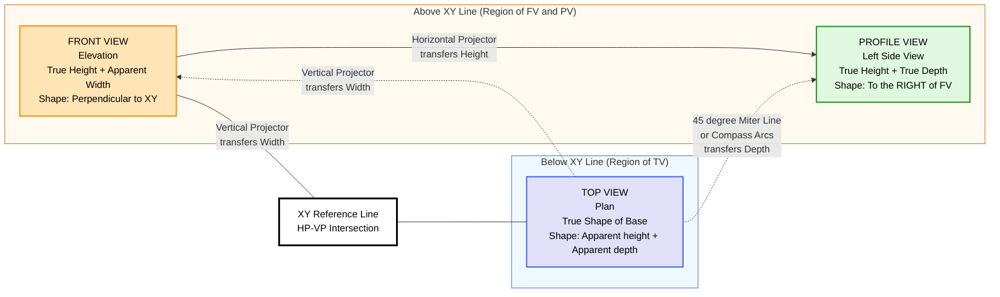
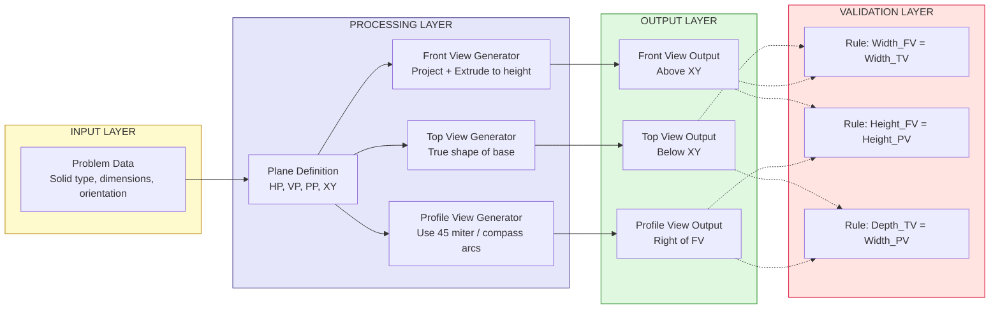

# Projection of solids in simple position including profile view

<!-- SECTION_1_START -->
# Module 2 — Projection of Simple Solids (Simple Position + Profile View)

## 1.1 Core Technical Definition

**Projection of Solids in Simple Position** is the orthographic (multi-view) representation of three-dimensional geometric solids placed on the **Horizontal Plane (HP)** with their **base resting on HP** and **axis vertical (perpendicular to HP)**. In this standard placement, the **true shape of the base** is visible in the **Top View (TV)** and the **true height** of the solid is visible in the **Front View (FV)**. The addition of a **Profile View (PV)** — also called the *Side View* or *End View* — captures the third dimension, providing the true depth of the solid along with the height.

> [!IMPORTANT]
> **KTU 2024 Scheme Note:** KTU follows the **First Angle Projection** system as per Bureau of Indian Standards (BIS). In this system, the object is imagined to be placed in the **first quadrant**, between the observer and the plane of projection. The **Left Side Profile View** is conventionally drawn on the **right-hand side of the Front View** after the Profile Plane (PP) is rotated open.

> [!NOTE]
> **Engineering Relevance:** In any mechanical design, manufacturing, or architectural drawing, profile views are indispensable for representing features such as shafts, ribs, webs, and tapered surfaces that would otherwise be hidden or ambiguous in only the front and top views.

## 1.2 Classification of Simple Solids

Simple solids are classified into **two principal categories** based on the nature of their bounding surfaces.

### A. Polyhedral Solids (Solids bounded by flat polygonal faces)

| Sub-Class | Examples | Characteristic Feature |
|---|---|---|
| **Prisms** | Triangular, Square, Rectangular, Pentagonal, Hexagonal | Two parallel polygonal bases joined by rectangular lateral faces; axis is a straight line joining centers of two bases. |
| **Pyramids** | Triangular, Square, Pentagonal, Hexagonal | One polygonal base and a single apex; lateral faces are triangular. |

### B. Solids of Revolution (Solids generated by rotating a plane figure about an axis)

| Solid | Generating Curve | Bounding Surfaces |
|---|---|---|
| **Cylinder** | Rectangle rotated about one of its sides | Two circular bases + one curved lateral surface |
| **Cone** | Right triangle rotated about one of its perpendicular sides | One circular base + one curved lateral surface ending in apex |
| **Sphere** | Semicircle rotated about its diameter | One continuous curved surface |

## 1.3 Intuitive Overview (Conceptual Analogy)

> [!TIP]
> **Real-world Analogy — The Cardboard Box on a Table:** Imagine a hexagonal pencil box placed on a table.  
> - **Top View** = what you see if you hover directly above it (you see the hexagonal outline — *true shape of the base*).  
> - **Front View** = what you see standing in front of it (you see a rectangle, because the height and visible width dominate — *true height*).  
> - **Profile View** = what you see if you walk to the right or left end of the table and look sideways (you see the *thickness* of the box and the *true height* together).  
>   
> The three views together fully describe the box without ambiguity — this is the essence of orthographic projection.

## 1.4 Standard Reference Conventions in KTU

> [!IMPORTANT]
> **Key Planes and Reference Line:**
> - **HP** = Horizontal Plane (looking down gives the Plan / Top View).
> - **VP** = Vertical Plane (looking from front gives the Elevation / Front View).
> - **PP** = Profile Plane (looking from the side gives the Side / Profile View).
> - **XY line** = Reference line of intersection between HP and VP. All distances **above HP** are plotted **above XY** in FV; distances **below HP** are plotted **below XY** in TV. The distance of the solid in front of VP is plotted to the **left of XY** in FV and above XY in TV (this distance becomes the horizontal dimension of the PV).

## 1.5 Why "Simple Position"?

> [!NOTE]
> A solid is said to be in **simple position** when **all** the following conditions are satisfied:  
> 1. The solid **rests on its base** on HP.  
> 2. The base is **parallel to HP**.  
> 3. The axis of the solid is **perpendicular to HP** (i.e., vertical).  
> 4. At least one **edge of the base** (for polyhedra) is **parallel or perpendicular to VP**.  
>   
> This placement ensures that one of the views is the *true shape* of the base, simplifying the drawing procedure.

## 1.6 Visualization Control

> [!VISUALIZATION CONTROL]
> **Concept:** Orthographic view layout in First Angle Projection.
> **GeoGebra / Desmos Input Equations:**
> * Rectangle FV: $x \in [2,\ 8],\ y \in [2,\ 7]$ (Front View)
> * Rectangle TV: $x \in [2,\ 8],\ y \in [-2,\ -7]$ (Top View, mirrored below FV)
> * Rectangle PV: $x \in [10,\ 14],\ y \in [2,\ 7]$ (Profile View, right of FV)
> * XY line: $y = 0$ (Reference line)
> **Visual Description:** The student should observe that the **width** of FV equals the **width** of TV, the **height** of FV equals the **height** of PV, and the **depth** of TV equals the **width** of PV — all linked by **45° projectors** (which in this 2D setup are horizontal/vertical alignment lines).

<!-- SECTION_1_END -->

<!-- SECTION_2_START -->
# 2. Deep Theoretical Analysis & KTU High-Yield Formula Sheet

## 2.1 Essential Terminology

| Term | Definition | Symbol in Drawings |
|---|---|---|
| **Apex** | The topmost single point of a pyramid or cone | Labeled as **O** or **a′** in FV, **o** in TV |
| **Base** | The flat polygonal or circular face on which the solid rests | Drawn as polygon (TV) or line segment (FV) |
| **Axis** | The imaginary line passing through the centers of the two bases (prism/cylinder) or joining the apex to the base center (pyramid/cone) | Drawn as centreline (chain dotted) |
| **Generator** | A line on the lateral surface connecting apex to a base edge endpoint (pyramid) or a top-to-bottom line on the lateral surface (prism) | Drawn as a visible edge in appropriate view |
| **Lateral Face / Surface** | The triangular (pyramid) or rectangular (prism) flat surface, or curved surface (cone/cylinder) bounding the solid | Boundary lines only |
| **Vertex** | A corner point of the solid | Labeled with letters (a, b, c, …) in TV; primed (a′, b′, c′) in FV |
| **Corner Point** | Intersection of three or more edges | Shown as a dot in both views |
| **Height of Solid** | Perpendicular distance between base and top face (or apex) | Dimension labeled **H** |

## 2.2 Convention for Labeling Views (First Angle Projection)

> [!IMPORTANT]
> **Standard Labeling Convention in KTU:**
> - **Top View (TV):** Points and corners are labeled in **lowercase** letters → $a, b, c, d, \ldots$
> - **Front View (FV):** The same points are labeled with a **prime symbol (′)** → $a', b', c', d', \ldots$
> - **Profile View (PV):** The same points are labeled with a **double-prime symbol (″)** → $a'', b'', c'', d'', \ldots$
> - The **same point** in 3D space is represented in all three views using these three related labels, connected by projection lines.

## 2.3 Golden Rules for Projection in Simple Position

1. **Rule of True Shape:** The view *perpendicular to a face* shows its true shape and size. Since the base is on HP, the **Top View** always shows the **true shape of the base** for any solid in simple position.

2. **Rule of True Length:** A line *parallel to a projection plane* projects in true length. Since the axis is perpendicular to HP (and hence parallel to VP), the **Front View** shows the **true height** of the solid.

3. **Rule of Equal Heights:** The height of the **Front View = Height of the Profile View** for any solid (transfer via horizontal projector from FV to PV).

4. **Rule of Equal Widths (Top ↔ Front):** The width of the **Top View = Width of the Front View** (transfer via vertical projector between FV and TV).

5. **Rule of Equal Depths (Top ↔ Profile):** The depth of the **Top View = Width of the Profile View** (transfer via 45° miter line or compass arcs).

## 2.4 KTU High-Yield Formula Sheet & Relationship Table

| Quantity | Visible in Which View(s) | Value Source |
|---|---|---|
| **True Shape of Base (TS)** | Top View only | Direct draw at true size |
| **True Height (TH)** | Front View **and** Profile View | Given in problem data |
| **True Width of Base** | Top View **and** Front View | Direct draw at true size |
| **Apparent Shape of Base** | Front View (a horizontal line or projected polygon) | Projection of TS onto VP |
| **True Depth of Base** | Top View **and** Profile View (as width of PV) | True base dimension |
| **Apex position** | Both TV and FV (and thus PV) | At base centre + height above XY |
| **Radius (R) of Cylinder/Cone Base** | TV: as radius of circle; FV: as half-width of rectangle/triangle | Direct draw |

### Compact Symbolic Summary

$$
\begin{aligned}
\text{Width}_{TV} &= \text{Width}_{FV} \\
\text{Height}_{FV} &= \text{Height}_{PV} \\
\text{Depth}_{TV} &= \text{Width}_{PV} \\
\text{Base area} &= \tfrac{1}{2} \cdot p \cdot a \quad \text{(for hexagonal/regular polygon base, $p$ = perimeter, $a$ = apothem)}
\end{aligned}
$$

> [!TIP]
> **Regular Polygon Construction Cheat Sheet (used repeatedly in KTU):**
> - **Triangle:** $a = \tfrac{s}{2}\sqrt{3}$ where $s$ = side. Total width $= 2a$ across parallel sides.
> - **Square:** Width across flats $= s$. Across corners $= s\sqrt{2}$.
> - **Pentagon:** $a = \tfrac{s}{2}(1+\sqrt{5}) \approx 0.6882 \cdot s$. Across flats $= 2a \approx 1.376 \cdot s$. Across corners $= 2R$ where $R = \tfrac{s}{2\sin 36°} \approx 0.8506 \cdot s$.
> - **Hexagon:** $a = \tfrac{s\sqrt{3}}{2}$. Across flats (short axis) $= 2a = s\sqrt{3}$. Across corners (long axis) $= 2s$.

## 2.5 Engineering Utility of Profile View

> [!NOTE]
> **Real-World Applications:**
> - **CNC Machining Drawings:** A profile view unambiguously specifies the depth of slots, ribs, and bosses.
> - **Tool Design:** Cutting tools (drills, reamers) are fully described by FV and PV alone.
> - **Architectural Drawings:** Wall thicknesses, window reveals, and beam profiles require PV.
> - **Piping & Structural Drawings:** Pipe runs in isometric are converted to orthographic FV + PV for fabrication.
> - **3D-to-2D Conversion:** The profile view is the third leg of the "Engineering Triangle of Truth" required to reconstruct the 3D model from 2D drawings.

## 2.6 Visibility Convention in Profile View

> [!IMPORTANT]
> **The "Visible from the Right" Rule:** In First Angle Projection with **Left Side Profile View** placed on the right of FV, the surface of the solid that is visible to the observer standing on the **left** is what is drawn. The visible edges are drawn as **continuous thick lines**, and hidden edges (those on the far side) are drawn as **dashed lines**. For solids in simple position (without cuts or holes), most edges are typically visible in the profile view because the solid is symmetric about its axis.

<!-- SECTION_2_END -->

<!-- SECTION_3_START -->
# 3. Step-by-Step Constructions & Solved Examples

> [!NOTE]
> **Notation used throughout:** All dimensions are in **millimetres (mm)**. The first letter in each corner label is the **base corner label in TV**; the second letter (primed) is the **same point in FV**; double-primed letter is the same point in **PV**.

---

## 3.1 Example 1: Hexagonal Prism in Simple Position

**Problem Statement:** *A hexagonal prism has a base of side **30 mm** and a height of **50 mm**. It rests on its base on the HP with **two sides of the base parallel to VP**. Draw the **Front View, Top View, and Left Side Profile View** using First Angle Projection.*

### Given Data Extraction
$$
s = 30\ \text{mm}, \quad H = 50\ \text{mm}, \quad \text{Base} = \text{Regular Hexagon}
$$

### 3.1.1 Step-by-Step Construction

**Step 1 — Compute the critical hexagon dimensions (true shape constants):**
$$
\begin{aligned}
\text{Apothem }(a) &= \frac{s\sqrt{3}}{2} = \frac{30 \times \sqrt{3}}{2} = 15\sqrt{3} \approx 25.98\ \text{mm} \\
\text{Short axis (across flats)} &= 2a = s\sqrt{3} = 30\sqrt{3} \approx 51.96\ \text{mm} \\
\text{Long axis (across corners)} &= 2s = 60\ \text{mm} \\
\text{Circumradius }(R) &= s = 30\ \text{mm}
\end{aligned}
$$

**Step 2 — Draw the XY reference line** horizontally across the centre of the drawing area. The TV will be plotted **below XY**, and the FV + PV will be plotted **above XY**.

**Step 3 — Construct the Top View (true shape of hexagon):**
- Draw a horizontal centreline of length **60 mm** (long axis) and a vertical centreline of length **51.96 mm** (short axis), intersecting at the centroid.
- Mark the six corners using the standard hexagon construction:
  - $a$ and $d$ on the long axis at **30 mm** left and right of centre.
  - $b$ and $f$ on a line at **30° above horizontal** from the centre, distance **30 mm** from centre.
  - $c$ and $e$ on a line at **30° below horizontal** from the centre, distance **30 mm** from centre.
  - Since two sides are parallel to VP, these are sides $bc$ and $ef$, both vertical in TV.
- Connect the corners in order: $a \to b \to c \to d \to e \to f \to a$.
- The hexagon is the **true shape** of the base.

**Step 4 — Construct the Front View:**
- Project all six corners of the hexagon **vertically upward** from TV to cross the XY line.
- Mark the projected positions $a', b', c', d', e', f'$ on XY.
- Draw a horizontal line **50 mm above XY** representing the top face of the prism.
- Project the corner positions **vertically upward** again from XY to the 50 mm level, marking $a_1', b_1', c_1', d_1', e_1', f_1'$.
- The Front View is a **rectangle** of width **51.96 mm** (the short axis of the hexagon, which is the visible width) and height **50 mm**.
- The rectangle's vertical edges pass through the projections of $a'$ and $d'$ (the frontmost and rearmost corner projections when looking at the hexagon with two sides parallel to VP, the visible width is the short axis).
- $b', c', e', f'$ projections fall **inside** the rectangle as intermediate generators (these are the inner vertical lines representing the edges $b$–$b_1$, $c$–$c_1$, $e$–$e_1$, $f$–$f_1$).

**Step 5 — Construct the Left Side Profile View (PV):**
- Determine the depth of the solid: the **long axis of the hexagon = 60 mm** (across corners $a$ and $d$, which are the front and back corners).
- The width of PV = 60 mm (this depth comes from the TV).
- The height of PV = 50 mm (transfer from FV via horizontal projector).
- Draw a vertical projector at a convenient distance (say **100 mm**) to the right of FV.
- The PV is therefore a **rectangle of width 60 mm and height 50 mm**.
- Draw horizontal projectors from $a'$ (top of FV, the leftmost edge) and $d'$ (top of FV, the rightmost edge) to the PV at 50 mm height.
- The leftmost vertical edge of the PV corresponds to corner $a$ (front of hexagon).
- The rightmost vertical edge of the PV corresponds to corner $d$ (back of hexagon).
- The other four corners ($b, c, e, f$) project **inside** the PV rectangle as interior vertical lines.

### 3.1.2 Final Layout

| View | Shape | Width | Height | Position |
|---|---|---|---|---|
| **TV** (Hexagon) | Regular hexagon | 60 mm (long axis) | 51.96 mm (short axis) | Below XY |
| **FV** (Rectangle) | Rectangle | 51.96 mm | 50 mm | Above XY, left of PV |
| **PV** (Rectangle) | Rectangle | 60 mm | 50 mm | Above XY, right of FV |

### 3.1.3 Validation Check

$$
\text{Width}_{FV} = \text{Width}_{TV} \;\; \checkmark \; (51.96\ \text{mm} = 51.96\ \text{mm})
$$

$$
\text{Height}_{FV} = \text{Height}_{PV} \;\; \checkmark \; (50\ \text{mm} = 50\ \text{mm})
$$

$$
\text{Depth}_{TV} = \text{Width}_{PV} \;\; \checkmark \; (60\ \text{mm} = 60\ \text{mm})
$$

---

## 3.2 Example 2: Square Pyramid in Simple Position

**Problem Statement:** *A square pyramid has a base of side **40 mm** and a altitude of **60 mm**. It rests on its base on HP with **all sides of base equally inclined to VP (i.e., the base is rotated so its diagonals are parallel and perpendicular to VP)**. Draw the **FV, TV, and PV**.*

### 3.2.1 Step-by-Step Construction

**Step 1 — Identify orientation:**
With diagonals parallel to VP, the **TV shows a square with one diagonal vertical** (so two corners $a$ and $c$ are nearest to and farthest from the observer, and the other two $b$ and $d$ are on the left and right).

**Step 2 — Top View construction:**
- Draw a square of side 40 mm rotated 45°, so its diagonals are horizontal and vertical in TV.
- Diagonals: $2 \cdot 40 \cdot \tfrac{\sqrt{2}}{2} = 40\sqrt{2} \approx 56.57\ \text{mm}$.
- Corners: $a$ (bottom), $c$ (top), $b$ (left), $d$ (right).
- Mark the centre $o$ of the square.

**Step 3 — Front View construction:**
- Project $a, c$ vertically upward to XY.
- The visible width of FV = distance $a$–$c$ = diagonal = $40\sqrt{2}$ mm.
- The apex $o'$ is on the vertical centreline, **60 mm above XY**.
- Connect $a'$ and $c'$ to $o'$ with two **slant edges** (the visible edges of the pyramid).
- The intermediate edges $b'$ and $d'$ project as **horizontal lines** from the square's midpoints at the base level, but the actual edges $b$–$apex$ and $d$–$apex$ appear as **slanted lines inside the triangle** (since $b$ and $d$ are at the same height as $a$ and $c$ but at a depth that makes them project inside the triangle in FV).
- The slope of the slant edge in FV: a line from $(a'_x, 0)$ to $(o'_x, 60)$ for the visible face $a$–$b$–$o$ and from $(a'_x, 0)$ to $(o'_x, 60)$ for face $a$–$d$–$o$ (these are coincident projections).

**Step 4 — Profile View construction:**
- Width of PV = distance $b$–$d$ in TV = 40 mm (the side of the square).
- Height of PV = 60 mm (transfer from FV).
- The PV is a **triangle** with base 40 mm and height 60 mm.
- The apex $o''$ is on the vertical centreline of PV.
- Connect the base corners to the apex with slant edges.
- The back edge $c$ projects to a single point (because $c$ is on the vertical centreline of TV in this orientation) and lies on the centreline of PV at the base level.

### 3.2.2 Slant Edge Length Calculation (Engineering Insight)

$$
\begin{aligned}
L_{\text{slant, edge}} &= \sqrt{\left(\tfrac{d}{2}\right)^2 + H^2} \\
&= \sqrt{\left(\tfrac{40\sqrt{2}}{2}\right)^2 + 60^2} \\
&= \sqrt{800 + 3600} \\
&= \sqrt{4400} \approx 66.33\ \text{mm}
\end{aligned}
$$

> [!TIP]
> **Why slant length matters:** The slant edge length is critical for sheet-metal layout, weld sizing, and surface area calculations:
> $$
> \text{Lateral Surface Area} = \tfrac{1}{2} \cdot P \cdot L_{\text{slant}}
> $$
> where $P$ is the perimeter of the base. For the square pyramid: $\text{LSA} = \tfrac{1}{2} \cdot (4 \times 40) \cdot 66.33 \approx 5306\ \text{mm}^2$.

---

## 3.3 Example 3: Cylinder in Simple Position

**Problem Statement:** *A cylinder of **diameter 50 mm** and **height 65 mm** rests on its base on HP. Draw the **FV, TV, and PV**.*

### 3.3.1 Step-by-Step Construction

**Step 1 — TV:** Draw a **circle of diameter 50 mm** centred on the vertical centreline. This is the true shape of the base. Mark the extreme left and right points ($a$ and $b$) and the extreme top and bottom points ($c$ and $d$).

**Step 2 — FV:** Draw a **rectangle of width 50 mm and height 65 mm**. Mark $a', b'$ at the base and $a_1', b_1'$ at the top. The vertical centreline is the axis.

**Step 3 — PV:** Draw a **rectangle of width 50 mm and height 65 mm** (same dimensions as FV, since the cylinder's cross-section is circular and thus looks the same from any direction). Place it to the right of FV, ensuring the heights align.

### 3.3.2 Generators Identification

For a cylinder, every line from a point on the top circle to the corresponding point on the bottom circle is a **generator**. In the FV, the **leftmost and rightmost vertical lines** of the rectangle are the two extreme generators. The PV also shows the same two generators (the leftmost and rightmost vertical lines). All other generators are interior to the rectangle and are not drawn as individual lines.

---

## 3.4 Example 4: Cone in Simple Position

**Problem Statement:** *A cone of **base diameter 40 mm** and **height 55 mm** rests on its base on HP. Draw the **FV, TV, and PV**.*

### 3.4.1 Step-by-Step Construction

**Step 1 — TV:** Draw a **circle of diameter 40 mm**. Mark the centre $o$.

**Step 2 — FV:** Draw an **isosceles triangle** with base 40 mm (on XY line) and height 55 mm (apex $o'$ at 55 mm above XY, on the vertical centreline). The slant edges are the extreme generators of the cone.

**Step 3 — PV:** The PV is also an **isosceles triangle of base 40 mm and height 55 mm** (since the cone's silhouette is identical from any horizontal direction). Place it to the right of FV with heights aligned.

### 3.4.2 Generators Count

A cone has **infinitely many generators** (it is a solid of revolution). Only the **two extreme generators** (forming the silhouette in the side view) are drawn as visible lines. The third "central" generator is the axis.

### 3.4.3 Slant Height Calculation

$$
L_{\text{slant}} = \sqrt{R^2 + H^2} = \sqrt{20^2 + 55^2} = \sqrt{400 + 3025} = \sqrt{3425} \approx 58.52\ \text{mm}
$$

> [!NOTE]
> **Use in production:** The slant height is used to compute the **lateral surface area** of the cone:
> $$
> \text{LSA} = \pi R L_{\text{slant}} = \pi \times 20 \times 58.52 \approx 3676\ \text{mm}^2
> $$

---

## 3.5 Master Construction Algorithm (Universal for any Solid in Simple Position)

```
STEP 1: Read the problem and identify the solid type, base dimensions, height, and orientation.
STEP 2: Compute auxiliary dimensions (apothem, diagonal, slant length) for the base.
STEP 3: Draw the XY reference line in the centre of the drawing sheet.
STEP 4: Draw the TOP VIEW (TV) — true shape of base — below XY.
STEP 5: Project all base corners vertically upward from TV to XY.
STEP 6: From the XY projections, draw vertical lines UPWARD to the height of the solid
        to mark the top corners / apex.
STEP 7: Connect the appropriate top corners to form the FRONT VIEW (FV).
STEP 8: Determine the depth of the solid (perpendicular to VP direction) from TV.
STEP 9: From the right edge of FV, project a horizontal line to the right at a sufficient
        distance to accommodate the PV width (= depth of TV).
STEP 10: At the right end, draw vertical lines (height = solid height) to form PV.
STEP 11: Use a 45-degree miter line OR compass arcs to transfer the depth
         from TV to PV width.
STEP 12: Connect the corners in PV to form the silhouette.
STEP 13: Add centre lines, dimensions, and labels.
STEP 14: Darken visible edges with thick lines; hidden edges with dashed lines.
```

<!-- SECTION_3_END -->

<!-- SECTION_4_START -->
# 4. Structural Diagrams & Schematics

## 4.1 First Angle Projection Layout (KTU Standard)

The following Mermaid diagram shows the standard **orthographic view layout** for First Angle Projection as mandated in KTU examinations.



## 4.2 Sequential Processing Topology — Drawing Procedure for a Hexagonal Prism

```mermaid
flowchart TD
    A["START<br/>Problem Data: s=30mm, H=50mm<br/>Orientation: Two sides parallel to VP"] --> B["Compute Hexagon Constants<br/>Short axis = s*sqrt3 = 51.96mm<br/>Long axis = 2s = 60mm"]
    B --> C["Draw XY Reference Line<br/>Across Sheet Centre"]
    C --> D["Step 1: Construct TV<br/>Regular Hexagon<br/>Below XY, long axis horizontal<br/>Two vertical sides parallel to XY"]
    D --> E["Step 2: Project TV Corners<br/>a, b, c, d, e, f<br/>Vertically UP to XY"]
    E --> F["Step 3: Construct FV<br/>Rectangle 51.96mm wide<br/>50mm tall<br/>Above XY"]
    F --> G["Step 4: Mark PV Position<br/>Draw 45 degree Miter Line<br/>from a in TV upward right"]
    G --> H["Step 5: Construct PV<br/>Rectangle 60mm wide<br/>50mm tall<br/>Right of FV, above XY"]
    H --> I["Step 6: Draw Generators<br/>Add inner vertical lines in FV and PV<br/>for the four non-extreme edges"]
    I --> J["Step 7: Add Centre Lines<br/>Through prism axes in FV and PV"]
    J --> K["Step 8: Dimensioning<br/>Add 30, 50, 51.96, 60 mm labels"]
    K --> L["Step 9: Title Block<br/>Name, Roll No, Date, Scale"]
    L --> M["END - Drawing Complete"]

    style A fill:#90EE90,stroke:#006400,stroke-width:2px
    style M fill:#FFB6C1,stroke:#8B0000,stroke-width:2px
    style D fill:#E0E0F8,stroke:#4169E1,stroke-width:2px
    style F fill:#FFE4B5,stroke:#FF8C00,stroke-width:2px
    style H fill:#E0F8E0,stroke:#228B22,stroke-width:2px
```



## 4.3 Block-Level Functional Architecture of the Projection System



## 4.4 ASCII Layout Reference — Final Sheet Layout

Below is a representative text-based sketch of the final drawing sheet layout (for visualisation only; actual drawings use instruments).

```
                              +--------------------------------+
                              |       LEFT SIDE PROFILE       |
                              |             VIEW               |
                              |                                |
                              |         +--------+             |
                              |         |        |             |
                              |         |  PV    |             |
                              |         |  60 x  |             |
                              |         |   50   |             |
                              |         |        |             |
                              |         +--------+             |
                              |                                |
+----------------+   +--------+----+                           |
|                |   |             |                           |
|     FRONT      |   |     FV      |                           |
|     VIEW       |   |  51.96 x 50 |                           |
|                |   |             |                           |
|  (Rectangle)   |   |             |                           |
|                |   |             |                           |
+----------------+   +-------------+                           |
                                                                  (continued PV)
X===============================================================X  <- XY LINE
                                |
        +-------------------+   |
        |                   |   |
        |    TOP VIEW       |   |
        |  (Regular Hexagon)|   |
        |   60 x 51.96     |   |
        |                   |   |
        +-------------------+
```

## 4.5 Comparative Visual Schema — Different Solids in Simple Position

| Solid | Top View (TV) | Front View (FV) | Profile View (PV) |
|---|---|---|---|
| **Square Prism** | Square (true shape) | Rectangle | Rectangle |
| **Hexagonal Prism** | Regular Hexagon (true shape) | Rectangle | Rectangle |
| **Triangular Prism** | Triangle (true shape) | Rectangle | Rectangle |
| **Square Pyramid** | Square with centre (true shape) | Isosceles Triangle | Isosceles Triangle |
| **Hexagonal Pyramid** | Hexagon with centre lines (true shape) | Triangle | Triangle |
| **Triangular Pyramid (Tetrahedron)** | Triangle with centre (true shape) | Triangle (slant) | Triangle (slant) |
| **Cylinder** | Circle (true shape) | Rectangle | Rectangle |
| **Cone** | Circle with centre (true shape) | Isosceles Triangle | Isosceles Triangle |
| **Sphere** | Circle | Circle | Circle (all three views identical) |

> [!IMPORTANT]
> **Key Observation:** The FV and PV of any solid of revolution (Cylinder, Cone, Sphere) in simple position are **identical in shape and size**. This is a direct consequence of rotational symmetry about the vertical axis.

<!-- SECTION_4_END -->

<!-- SECTION_5_START -->
# 5. KTU 2024 Scheme Examination Question Bank & Topic Recap

## 5.1 Part A — Short Answer Questions (3 Marks Each)

### Question A1 [KTU University Exam — July 2024] | CO1, Remember/Understand

**"Define the term 'simple position' of a solid with respect to its placement on the Horizontal Plane. List any four simple solids commonly encountered in engineering drawing."**

**Model Answer (3 Marks):**

> A solid is said to be in **simple position** when it is placed on the **Horizontal Plane (HP)** such that **(1)** its base rests on HP, **(2)** its base is parallel to HP, **(3)** its axis is perpendicular to HP, and **(4)** at least one edge of the base is parallel or perpendicular to the Vertical Plane (VP). In this position, the **top view shows the true shape of the base** and the **front view shows the true height** of the solid. **[2 Marks for definition with all four conditions]**
>
> Four simple solids are: **(i)** Triangular Prism, **(ii)** Square Pyramid, **(iii)** Hexagonal Prism, **(iv)** Cylinder. **[1 Mark for listing four solids with correct names]**

---

### Question A2 [KTU University Exam — Dec 2023] | CO1, Understand

**"What is a profile view? Why is it drawn to the right of the front view in First Angle Projection, and how is its width determined?"**

**Model Answer (3 Marks):**

> A **profile view** (also called side view or end view) is the orthographic projection of an object as seen from a direction **perpendicular to both the front and top viewing directions**, i.e., from the side of the object. It reveals the **depth** of the object which is not visible in the front or top view. **[1 Mark]**
>
> In **First Angle Projection**, the object is placed in the first quadrant between the observer and the plane of projection. The **Left Side Profile Plane** is rotated to the right after projection, so the resulting profile view appears **to the right of the front view** on the drawing sheet. **[1 Mark]**
>
> The **width of the profile view** equals the **depth of the solid as seen in the top view**. This depth is transferred from the top view using a **45° miter line** or **compass arcs**. The **height of the profile view** equals the **height of the front view**. **[1 Mark]**

---

## 5.2 Part B — Long Answer Questions (14 Marks Each, Internal Choice)

### Question B1 [KTU University Exam — Model Paper 2024] | CO2, Apply

> **"A square prism of base side 40 mm and height 60 mm rests on its base on the Horizontal Plane with two sides of the base parallel to the Vertical Plane. Draw the Front View, Top View, and Left Side Profile View using First Angle Projection. Add dimensions."**

#### Sub-part (a): Draw the Front View and Top View (7 Marks)

**Step-by-Step Model Solution:**

**Step 1 — Compute dimensions:**
$$
s = 40\ \text{mm},\quad H = 60\ \text{mm}
$$
Since two sides are parallel to VP, the visible width of the square in FV = 40 mm. The depth of the square (perpendicular to VP) = 40 mm.

**Step 2 — Draw the TV (true shape of square):**
- Draw a square of side 40 mm **below the XY line**.
- Label the four corners in the TV as $a$ (front-left), $b$ (front-right), $c$ (back-right), $d$ (back-left). The front side $ab$ is parallel to XY (and hence to VP), and the back side $cd$ is also parallel to XY.
- Draw both diagonals as **centre lines** (chain dotted) meeting at centre $o$. **[1 Mark]**

**Step 3 — Project corners from TV to XY:**
- Project $a, b, c, d$ vertically upward to the XY line as $a', b', c', d'$.
- Note that $a'$ and $b'$ coincide (lie at the same point on XY at the front), and similarly $c'$ and $d'$ coincide at the back. **[1 Mark]**

**Step 4 — Draw the FV (rectangle):**
- Draw a horizontal line **60 mm above XY** representing the top face of the prism.
- Project $a', b', c', d'$ vertically upward to this 60 mm level, giving $a_1', b_1', c_1', d_1'$.
- Draw a **rectangle of width 40 mm and height 60 mm** above XY.
- $a_1'$ and $b_1'$ form the left vertical edge; $c_1'$ and $d_1'$ form the right vertical edge.
- Add the vertical centreline through $o'$ representing the axis. **[3 Marks]**

**Step 5 — Add centre lines in both views:**
- Draw the horizontal centreline through $o$ in TV and $o'$ in FV (these are coincident with XY for the base, but distinct above XY for the FV). **[1 Mark]**

**Step 6 — Dimensioning (partial credit 1 Mark applied in part b):**
- Add the dimensions $40$ mm (side of base) and $60$ mm (height) in the FV.

#### Sub-part (b): Draw the Profile View and complete dimensioning (7 Marks)

**Step 7 — Determine PV dimensions:**
- **Height of PV = 60 mm** (same as FV). Transfer using a horizontal projector from the top of the FV to the right.
- **Width of PV = 40 mm** (same as TV, since the depth of a square base = side = 40 mm).

**Step 8 — Construct the PV using the 45° miter line:**
- Locate the right edge of the FV on the drawing sheet. Project a 45° line upward-right from the bottom-right corner of FV.
- From the rightmost point of TV ($c$ or $d$ in TV), project a vertical line upward to meet the 45° miter line. This point defines the back vertical edge of the PV.
- The depth from the miter intersection horizontally to the right determines the back edge of the PV.
- Similarly, project from the leftmost point of TV to define the front edge of PV.
- Draw a **rectangle of 40 mm width and 60 mm height** to the right of FV. **[3 Marks]**

**Step 9 — Add generators and centre line in PV:**
- The two vertical edges of the PV rectangle are the visible generators (corresponding to the side edges $bc$ and $ad$ of the prism, which are perpendicular to VP in this orientation).
- Draw the vertical centreline through the PV. **[1 Mark]**

**Step 10 — Dimensioning:**
- Add **$40$ mm** dimension for the PV width (depth).
- Add **$60$ mm** dimension for the PV height.
- Add **$40$ mm** dimension for the base side in TV. **[2 Marks]**

**Step 11 — Title block and neatness:**
- Add the title block, scale (1:1), and ensure all visible lines are thick and continuous, with centre lines as chain dotted. **[1 Mark]**

#### Incremental Valuation Key for B1

| Step | Component | Marks |
|---|---|---|
| Title, XY line, projection setup | [Drawing setup] | **1 Mark** |
| TV — true shape square with correct dimensions | [True shape TV] | **2 Marks** |
| TV corner labels and centre lines | [Labels in TV] | **1 Mark** |
| FV rectangle of correct size with axis centre line | [FV rectangle + axis] | **3 Marks** |
| Projectors between TV and FV | [Alignment] | **1 Mark** |
| PV location via 45° miter line | [Miter construction] | **1 Mark** |
| PV rectangle of correct size | [PV rectangle] | **2 Marks** |
| Generators/centre line in PV | [PV detailing] | **1 Mark** |
| Dimensions in all three views | [Dimensioning] | **1 Mark** |
| Title block, neatness, line quality | [Presentation] | **1 Mark** |
| **TOTAL** | | **14 Marks** |

---

### Question B2 [KTU University Exam — July 2023] | CO2, Apply

> **"A hexagonal pyramid of base side 30 mm and altitude 55 mm rests on its base on the Horizontal Plane with one side of the base parallel to the Vertical Plane. Draw the Front View, Top View, and Left Side Profile View using First Angle Projection. Add dimensions."**

#### Sub-part (a): Draw the Top View and Front View (7 Marks)

**Step-by-Step Model Solution:**

**Step 1 — Compute hexagon constants:**
$$
s = 30\ \text{mm},\quad H = 55\ \text{mm}
$$
$$
\text{Apothem } (a) = \tfrac{s\sqrt{3}}{2} = 15\sqrt{3} \approx 25.98\ \text{mm}
$$
$$
\text{Short axis} = s\sqrt{3} \approx 51.96\ \text{mm},\quad \text{Long axis} = 2s = 60\ \text{mm}
$$

**Step 2 — Draw the TV (true shape hexagon):**
- Construct a regular hexagon of side 30 mm **below XY**, with one side parallel to XY (i.e., parallel to VP).
- The side $ab$ is on the front (closest to XY) and is parallel to VP.
- The opposite side $de$ is at the back.
- The visible width of the hexagon across flats = 51.96 mm.
- The depth of the hexagon from front side to back side = $2 \times \text{apothem} = s\sqrt{3} \approx 51.96\ \text{mm}$.
- Label the six corners in order: $a$ (front-left), $b$ (front-right), $c$ (right), $d$ (back-right), $e$ (back-left), $f$ (left).
- Mark the centre $o$ of the hexagon. **[2 Marks]**

**Step 3 — Project corners vertically to XY:**
- Project $a, b, c, d, e, f$ vertically upward to XY as $a', b', c', d', e', f'$. **[1 Mark]**

**Step 4 — Draw the FV (triangle):**
- Mark the apex $o'$ on the vertical centreline of the hexagon projection, **55 mm above XY**.
- The visible width of the FV = 51.96 mm (across flats $bc$ and $ef$, or equivalently $ab$ to $de$).
- The base of the triangle is the line on XY from $a'$ to $b'$ (front side projection), but in actual width we need the projection of the leftmost and rightmost visible edges, which are $a$ and $c$ (or $f$ and $c$, depending on viewing). Since $ab$ is parallel to XY, $a'$ and $b'$ lie on XY at the actual positions of the front edge.
- The **front face of the pyramid** is the triangle $a$–$b$–$apex$ (face $ab$ at base, $apex$ at top). The visible **front edge** in FV is the projection of $ab$, which is a horizontal line on XY.
- The two **extreme slant edges** of the FV are the projections of edges $c$–$apex$ (visible on right) and $f$–$apex$ (visible on left). Connect $c'$ (on XY) to $o'$ (55 mm above) on the right, and $f'$ to $o'$ on the left.
- Draw a **triangle of base 51.96 mm and height 55 mm** above XY. **[2 Marks]**

**Step 5 — Add intermediate generators in FV:**
- The edges $d$–$apex$ and $e$–$apex$ project inside the triangle as the lines connecting $d'$ and $e'$ (on XY) to $o'$. Draw these as visible slant lines inside the triangle.
- Add the vertical centreline through $o'$ representing the axis of the pyramid. **[1 Mark]**

**Step 6 — Partial dimensioning:**
- Mark $55$ mm (height) on the right of the FV.
- Mark $51.96$ mm (base width across flats) on the bottom of the FV. **[1 Mark]**

#### Sub-part (b): Draw the Profile View and complete dimensioning (7 Marks)

**Step 7 — Determine PV dimensions:**
- **Width of PV = depth of hexagon in the direction perpendicular to VP** = distance from front side $ab$ to back side $de$ = $2 \times$ apothem = $s\sqrt{3} \approx 51.96\ \text{mm}$.
- **Height of PV = 55 mm** (transfer from FV).

**Step 8 — Construct the PV:**
- Use the 45° miter line from the right edge of FV to transfer the depth.
- The PV is a **triangle of base 51.96 mm and height 55 mm**.
- The apex $o''$ of the triangle is at 55 mm above XY on the vertical centreline of PV.
- The base of the triangle is the line representing the projection of the back-side of the pyramid.
- Connect the base corners to $o''$ with slant edges. **[3 Marks]**

**Step 9 — Add intermediate generators and centre line in PV:**
- Add the vertical centreline (axis) in PV.
- The intermediate generators (corresponding to $a, b, d, e$ corners) project inside the PV triangle. **[1 Mark]**

**Step 10 — Compute and mark the slant edge length:**
$$
L_{\text{slant}} = \sqrt{\left(\tfrac{\text{base width}}{2}\right)^2 + H^2} = \sqrt{25.98^2 + 55^2} = \sqrt{675 + 3025} = \sqrt{3700} \approx 60.83\ \text{mm}
$$
Mark this dimension on the FV slant edge. **[1 Mark]**

**Step 11 — Final dimensioning and presentation:**
- Add $30$ mm dimension for hexagon side in TV.
- Add $51.96$ mm dimension for PV base width.
- Title block, scale, and line quality. **[2 Marks]**

#### Incremental Valuation Key for B2

| Step | Component | Marks |
|---|---|---|
| Drawing setup, XY line, layout | [Setup] | **1 Mark** |
| TV — true shape hexagon with all 6 corners and centre | [Hexagon TV] | **2 Marks** |
| TV centre lines, corner labels | [TV labels] | **1 Mark** |
| FV — correct triangle dimensions (51.96 × 55) | [FV triangle] | **2 Marks** |
| FV slant edges, intermediate generators, axis | [FV edges + axis] | **1 Mark** |
| 45° miter line construction | [Miter] | **1 Mark** |
| PV — correct triangle dimensions (51.96 × 55) | [PV triangle] | **2 Marks** |
| PV slant edges and centre line | [PV edges] | **1 Mark** |
| Slant length calculation & dimensioning | [Slant length] | **1 Mark** |
| Dimensions for base side, height, depth | [All dimensions] | **1 Mark** |
| Title block, neatness, line quality | [Presentation] | **1 Mark** |
| **TOTAL** | | **14 Marks** |

---

## 5.3 KTU Examiner's Valuation Warning

> [!WARNING]
> **Common Pitfalls Where Students Lose Marks in This Topic:**
> 
> 1. **Forgetting the XY line:** The XY line is the **most important reference** in KTU orthographic projection. Omitting it or drawing it faintly leads to **loss of 1 mark** plus incorrect alignment in subsequent views. **Always draw XY as a thick continuous line.**
> 
> 2. **Wrong width in PV:** The width of the profile view comes from the **depth of the solid in TV (perpendicular to VP direction)**, not the width of the FV. Students often copy the width of the FV into the PV — this is a **fatal error worth 2–3 marks loss**.
> 
> 3. **No 45° miter line:** Without the miter line, the depth cannot be transferred accurately. Use either a 45° line drawn with a set-square or use compass arcs. Lack of a visible construction method leads to **loss of 1 mark**.
> 
> 4. **Missing axis / centre line:** All prisms, pyramids, cylinders, and cones have an axis that must be drawn as a **chain-dotted (centre) line** through both FV and PV. Omission = **0.5 mark loss** per view.
> 
> 5. **Hidden lines omitted:** When a solid has hidden features (not the case in simple position, but the examiner expects to see **dashed lines** for any feature that should be hidden), students often skip them. In the simple-position case, however, the visible edges are usually sufficient.
> 
> 6. **Dimensioning without arrows or units:** Dimensions must have **arrowheads** at both ends, a clear numerical value, and a unit (typically "mm" in the title block, not on every dimension). Wrong dimensioning style = **1 mark deduction**.
> 
> 7. **Confusion between First and Third Angle:** KTU follows **First Angle Projection only**. Drawing the PV to the **left** of FV (Third Angle style) will result in **zero credit** for the PV.
> 
> 8. **Apparent shape vs True Shape:** Students sometimes draw the TV as an apparent shape (rectangle) instead of the true shape (polygon/circle). Remember: in simple position, the **TV is the true shape**.
> 
> 9. **Title Block Missing Information:** Roll Number, Name, Date, Scale, and Title of the drawing must all be present. Omission = **0.5–1 mark loss**.

---

## 5.4 Topic Recap & Important Things to Remember

> [!TIP]
> **Rapid Revision Checklist — Module 2: Projection of Simple Solids in Simple Position**

### A. Definitional Anchors
- **Simple Position:** Base on HP + axis vertical + edges of base parallel/perpendicular to VP.
- **Profile View (PV):** The third orthographic view showing the **true depth** and **true height** of the solid.
- **First Angle Projection (KTU standard):** Object in first quadrant; PV is drawn to the **right of FV**.

### B. Geometric Constants to Memorize

| Polygon | Apothem $(a)$ | Across Flats | Across Corners |
|---|---|---|---|
| Triangle (equilateral) | $\frac{s}{2\sqrt{3}}$ | $\frac{s}{\sqrt{3}}$ | $s$ |
| Square | $\frac{s}{2}$ | $s$ | $s\sqrt{2}$ |
| Pentagon | $0.688\,s$ | $1.376\,s$ | $1.701\,s$ |
| Hexagon | $\frac{s\sqrt{3}}{2}$ | $s\sqrt{3}$ | $2s$ |

### C. The Five Golden Rules of Projection
1. **Width Rule:** $\text{Width}_{FV} = \text{Width}_{TV}$
2. **Height Rule:** $\text{Height}_{FV} = \text{Height}_{PV}$
3. **Depth Rule:** $\text{Depth}_{TV} = \text{Width}_{PV}$
4. **True Shape Rule:** TV shows true shape of base.
5. **True Height Rule:** FV and PV show true height.

### D. View Identification (Mental Image)
- **Prism:** FV = Rectangle, TV = Polygon, PV = Rectangle.
- **Pyramid:** FV = Triangle, TV = Polygon (with centre), PV = Triangle.
- **Cylinder:** FV = Rectangle, TV = Circle, PV = Rectangle.
- **Cone:** FV = Triangle, TV = Circle (with centre), PV = Triangle.
- **Sphere:** All three views = Circle (same diameter).

### E. Key Formulas for Engineering Calculations
$$
\begin{aligned}
\text{LSA of Prism} &= \text{Perimeter} \times \text{Height} \\
\text{LSA of Pyramid} &= \tfrac{1}{2} \times \text{Perimeter} \times \text{Slant Height} \\
\text{LSA of Cylinder} &= 2\pi R H \\
\text{LSA of Cone} &= \pi R L,\quad L = \sqrt{R^2 + H^2} \\
\text{Volume of Prism} &= \text{Base Area} \times H \\
\text{Volume of Pyramid} &= \tfrac{1}{3} \times \text{Base Area} \times H \\
\text{Volume of Cylinder} &= \pi R^2 H \\
\text{Volume of Cone} &= \tfrac{1}{3} \pi R^2 H
\end{aligned}
$$

### F. Procedure Mnemonic — **"Y-X-P-T-D"**
- **Y** → Draw XY line.
- **X** → Mark centre and axes.
- **P** → Plot the True Shape (Polygon/circle) in TV.
- **T** → Transfer dimensions to FV via vertical projectors.
- **D** → Draw PV using 45° miter or compass arcs.

### G. Examiner's Favourite Questions (High Probability)
- Square prism / Hexagonal prism with sides parallel to VP.
- Square pyramid / Pentagonal pyramid rotated 45° (diagonals parallel to VP).
- Cylinder and Cone in simple position.
- Combined question: "draw all three views and calculate the volume / lateral surface area."

### H. Most-Marked Topics for KTU 2024 Scheme
- Profile view construction via 45° miter line (high weightage).
- Computation of slant edge length.
- Identification of true shape in the appropriate view.
- Distinguishing visible vs hidden edges.
- Dimensioning standards as per BIS SP 46.

<!-- SECTION_5_END -->
