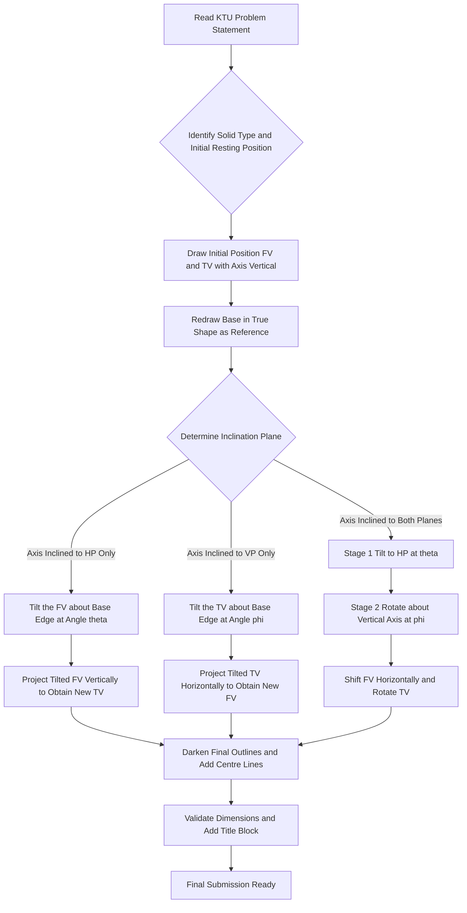
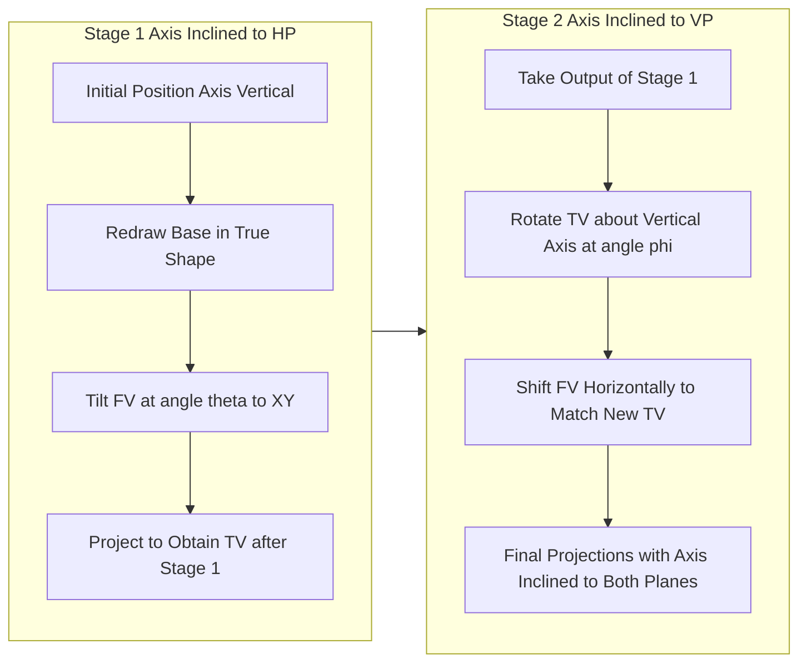
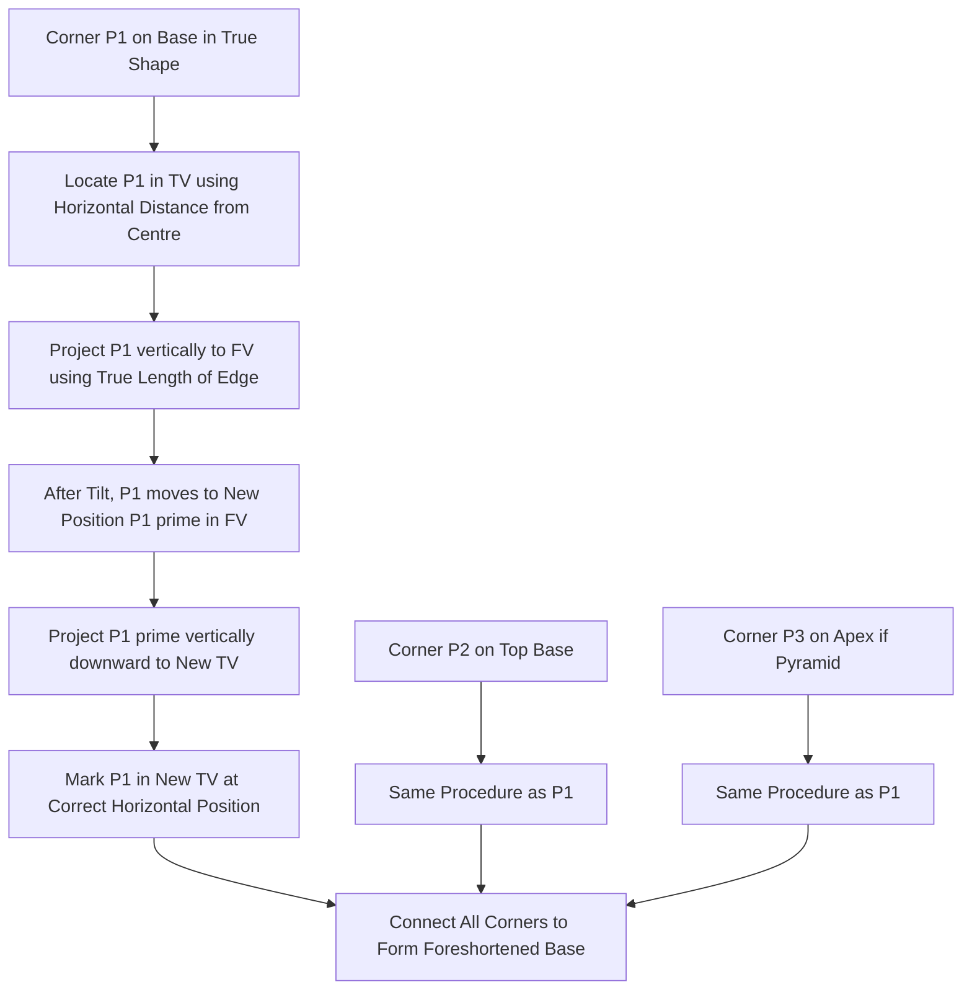
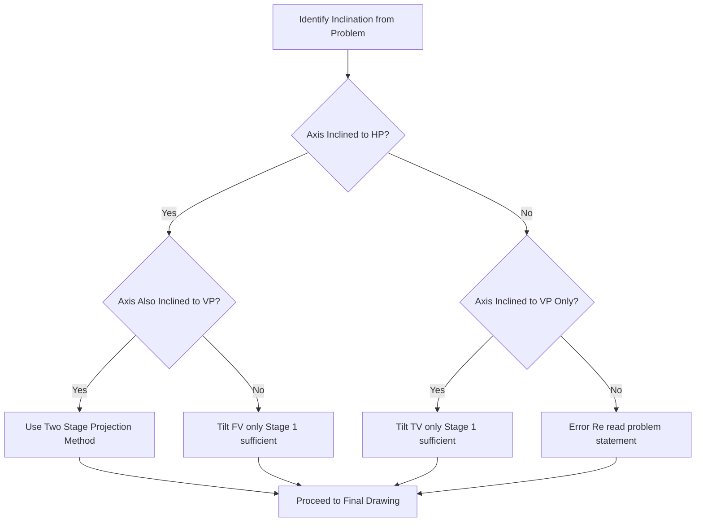
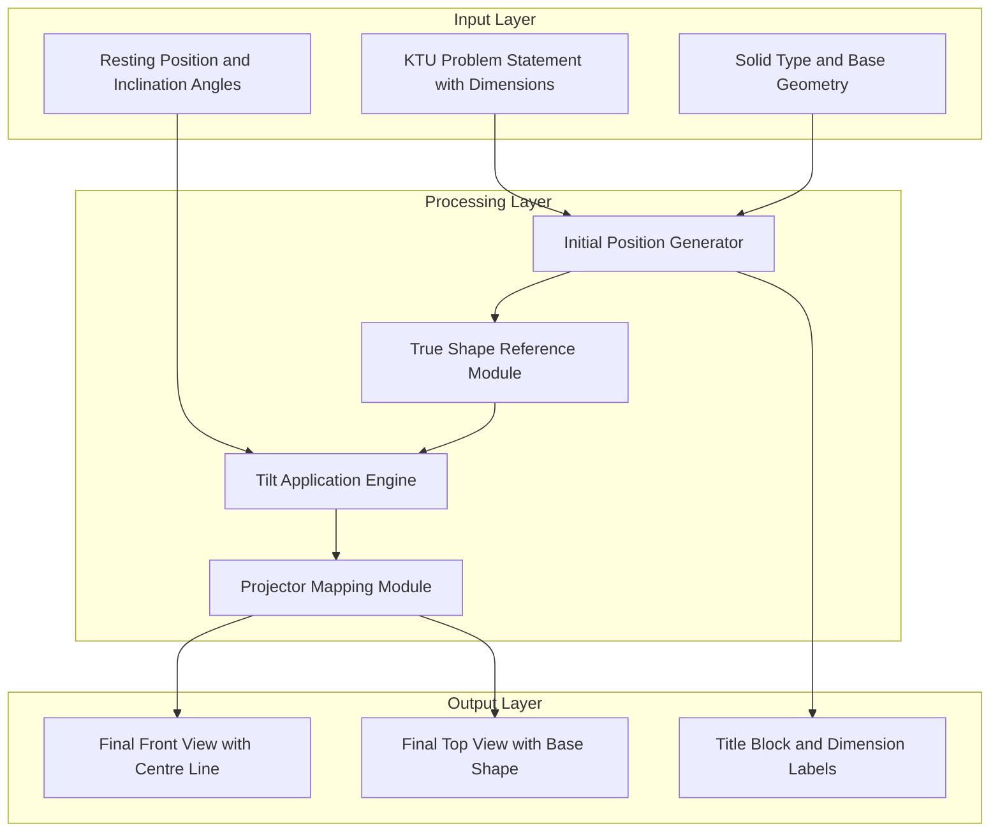

# Projection of solids with axis inclined to one of the reference planes and with axis inclined to both reference planes

<!-- SECTION_1_START -->

# Projection of Simple Solids — Axis Inclined to Reference Planes

## 1.1 Core Technical Definition

> [!NOTE]
> **Projection of Solids (KTU 2024 Terminology):** The orthographic representation of three-dimensional geometric solids (prisms, pyramids, cylinders, cones, spheres, and their frustums) on two mutually perpendicular reference planes — the **Horizontal Plane (HP)** and the **Vertical Plane (VP)** — separated by the **Reference Line $XY$** — strictly following the principles of **First Angle Projection** as mandated by BIS SP:46 and adopted by KTU.

When the **axis of a solid** is *inclined* to one or both reference planes, the solid no longer projects as a regular, symmetric figure. The base (a true polygon or circle) appears foreshortened or skewed, and the **Front View (FV)** and **Top View (TV)** must be drawn by carefully projecting corner points through projectors perpendicular to the reference planes.

> [!IMPORTANT]
> **KTU Module 2 — Critical Categorisation of Axis Positions:**
> 1. **Axis perpendicular to HP and parallel to VP** — solid rests on its base on HP (simplest case).
> 2. **Axis parallel to HP and perpendicular to VP** — solid rests on its base on VP.
> 3. **Axis inclined to one reference plane and parallel to the other** ⭐ *(Module 2 focus).*
> 4. **Axis inclined to both reference planes** ⭐⭐ *(Module 2 advanced focus).*

---

## 1.2 Conceptual Analogy / Intuition

> [!TIP]
> **The "Tilted Torchlight" Analogy**
> Imagine a hexagonal pencil standing upright on a glass table (HP). A torch on the ceiling casts its shadow — this is the **Top View (TV)**. If you now tilt the pencil by $30^\circ$ so it leans against a vertical wall (VP), its shadow on the wall becomes a tilted hexagon, and its shadow on the table becomes a foreshortened, skewed hexagon. This physical act of *tilting the solid* and *projecting perpendicular rays* is exactly what you must do on paper using the **projector lines** (which must *always* remain perpendicular to the reference plane on which the view is being projected).

### 1.3 Reference Plane Geometry — Quick Grounding

| Symbol | Plane | View Obtained | Projector Direction |
|:---:|:---|:---|:---|
| $HP$ | Horizontal Plane | Top View ($TV$) | Perpendicular to $HP$, i.e., vertically downward |
| $VP$ | Vertical Plane | Front View ($FV$) | Perpendicular to $VP$, i.e., horizontally backward |
| $XY$ | Reference Line | Divides $FV$ and $TV$ | Bisects the drawing sheet |

> [!NOTE]
> **Standard KTU Drawing Convention:** All distances are measured *from the $XY$ line* — distances *above $XY$* give the $FV$ (height from $HP$), and distances *below $XY$* give the $TV$ (distance from $VP$).

### 1.4 Classification of Standard Solids Used in KTU Module 2

| Solid Type | Base Shape | Apices / Lateral Faces | Special Feature |
|:---|:---|:---|:---|
| **Prism** (e.g., Hexagonal, Pentagonal) | Regular polygon | Two parallel polygonal ends connected by rectangular faces | Lateral edges are **parallel** |
| **Pyramid** (e.g., Square, Pentagonal) | Regular polygon | One apex connected by triangular faces | Lateral edges **converge** to apex |
| **Cylinder** | Circle | Two circular ends connected by curved surface | Axis is the line joining centres |
| **Cone** | Circle | One apex, one circular base | All generators pass through apex |
| **Sphere** | Circle | All generators equal | True shape in every view is a circle |

> [!VISUALIZATION CONTROL]
> **Concept:** Hexagonal Prism — Axis Inclined to HP at angle $\theta$
> **GeoGebra / Desmos Input Equations:**
> * $P_1 = (0, 0)$, $P_2 = (2, 0)$, $P_3 = (3, 1.73)$, $P_4 = (2, 3.46)$, $P_5 = (0, 3.46)$, $P_6 = (-1, 1.73)$ *(regular hexagon in $xy$-plane)*
> * Axis vector after tilt: $\vec{a} = (\cos\theta, \sin\theta)$ with $\theta = 30^\circ$
> * Top of prism: $P_i' = P_i + (h\cos\theta, h\sin\theta)$ where $h = 5$
> **Visual Description:** You will observe the regular hexagon (base) on the $x$-axis, and the top hexagon displaced and tilted — when projected vertically onto a $y$-axis reference (simulating HP), the top hexagon appears *foreshortened and offset* — this mimics the $TV$ in the KTU problem.

---

<!-- SECTION_1_END -->

<!-- SECTION_2_START -->

# Deep Theoretical Analysis — Projection Procedures

## 2.1 The Three Foundational Rules of Orthographic Projection

> [!IMPORTANT]
> **KTU Board-Exam Golden Rules (Memorise First):**
> 1. **Rule of Projectors:** All projectors (vertical/horizontal construction lines) connecting $FV$ and $TV$ must be *strictly perpendicular* to the $XY$ line.
> 2. **Rule of True Length:** A line is seen in *true length* only when it is **parallel** to the plane of projection. Inclined lines appear *foreshortened*.
> 3. **Rule of True Shape:** A surface is seen in *true shape* only when it is **parallel** to the plane of projection.

## 2.2 Case Analysis — Axis Inclined to One Reference Plane

### Case A: Axis Inclined to HP, Parallel to VP (Most Common in KTU)

This is the **single most tested configuration** in KTU Module 2.

**Geometric Statement:** *A pentagonal prism of base side $a$ and height $h$ rests on its base on HP with one of its base edges perpendicular to VP. Its axis is inclined at $\theta$ to HP. Draw its projections.*

**Procedure (Step-by-Step Logical Flow):**

1. **Initial Position (Assumed):** Assume the solid rests on its base on HP with axis vertical. Draw the regular pentagon as $TV$ and a rectangle with a vertical centre line as $FV$. Mark the corners $a, b, c, d, e$ (in $TV$) and $a', b', c', d', e'$ (in $FV$).

2. **Re-position by Tilt:** Since the axis is inclined to HP at angle $\theta$, the $FV$ now becomes a *tilted rectangle*. The $TV$ becomes a *foreshortened pentagon* drawn as if the solid has been rotated about a base edge on HP. Mark the new corners as $a_1', b_1', c_1', d_1', e_1'$ in $FV$ and $a_1, b_1, c_1, d_1, e_1$ in $TV$.

3. **Locate the True Shape Reference:** The *true shape* of the base (pentagon) is what gives the distances from the $XY$ line. Use the $TV$ (where base is seen in true shape before tilt) to fix horizontal distances.

4. **Finalise with Heavy Lines:** Darken only the final $FV$ and $TV$ outlines. All construction lines (thin) are kept light.

### Case B: Axis Inclined to VP, Parallel to HP

Symmetric to Case A but with roles of HP and VP interchanged. The *true shape* of the base appears in the $FV$.

> [!WARNING]
> **Common KTU Mistake:** Students often confuse which plane shows the *true shape* of the base. Remember: the base is **always true shape in the plane to which the axis is perpendicular**. When axis is inclined to HP, the base (originally on HP) is now *also* tilted — so true shape is shown in an auxiliary view, not in $TV$.

## 2.3 Case Analysis — Axis Inclined to Both Reference Planes

### Case C: Axis Inclined to Both HP and VP (Advanced KTU Problem)

**Geometric Statement:** *A square pyramid of base side $a$ and height $h$ rests on its base on HP with one base edge perpendicular to VP. Its axis is inclined at $\theta$ to HP and the apparent axis in the $FV$ is inclined at $\phi$ to $XY$. Draw its projections.*

**Two-Stage Projection Logic:**

| Stage | Action | Result |
|:---:|:---|:---|
| **Stage 1** | Tilt the axis to HP at $\theta$, keeping it parallel to VP | Axis inclined to HP only (Case A completed) |
| **Stage 2** | Rotate the entire Stage-1 figure about a vertical axis so that the axis (which was parallel to VP) is now inclined at $\phi$ to VP | Axis inclined to *both* planes |

> [!TIP]
> **Why the Two Stages Work:** The HP-tilt rotates the solid in 3D space such that the axis makes angle $\theta$ with HP. The subsequent rotation about a vertical line changes the *apparent* inclination in $FV$ (relative to $XY$) to $\phi$, which corresponds to the actual inclination to VP.

## 2.4 KTU High-Yield Formula / Reference Sheet

> [!NOTE]
> This is a **procedural reference sheet** — substitute the *method, not numbers*. Memorise these steps; KTU ESE questions are worth **14 marks each**.

| # | Problem Type | Key Projector Direction | True Shape Appears In | Critical Construction Line |
|:---:|:---|:---|:---|:---|
| 1 | Solid on base, axis $\perp HP$ | Vertical projectors for $TV$ | $TV$ (base on HP) | Centre line through polygon centre |
| 2 | Solid on base on VP, axis $\perp VP$ | Horizontal projectors for $FV$ | $FV$ (base on VP) | Centre line through polygon centre |
| 3 | Axis inclined to HP only | Vertical projectors (TV unchanged in width) | $FV$ (apparent base) | Tilted centre line at angle $\theta$ |
| 4 | Axis inclined to VP only | Horizontal projectors (FV unchanged in height) | $TV$ (apparent base) | Tilted centre line at angle $\phi$ |
| 5 | Axis inclined to both planes | **Two-stage projection** | Auxiliary view or $TV$ base | Two tilted centre lines at $\theta$ and $\phi$ |

## 2.5 Real-World Engineering Utility

- **CNC Machining & Tool-Path Design:** Inclined-axis workpieces require multi-axis tool orientations; this topic builds the spatial reasoning needed to interpret such setups.
- **Civil & Structural Engineering:** Inclined columns, rafter members, and inclined roof pyramids are designed using these exact projection principles.
- **3D CAD Modelling (AutoCAD, SolidWorks, CATIA):** Understanding inclined projections is foundational to creating accurate 3D models from 2D sketches using the *Revolve*, *Extrude*, and *Loft* features.
- **Aerospace & Mechanical Assemblies:** Turbine blades, rocket nose cones, and fairings are inclined solids — their 2D manufacturing drawings use these projection rules.

---

<!-- SECTION_2_END -->

<!-- SECTION_3_START -->

# Step-by-Step Projection Procedures & Worked Examples

## 3.1 Standard Notation Conventions (KTU Board Standard)

| Symbol | Meaning |
|:---:|:---|
| $a, b, c, \ldots$ | Corners of base as seen in $TV$ (lowercase, no primes) |
| $a', b', c', \ldots$ | Corners of base as seen in $FV$ (lowercase, primed) |
| $o, o'$ | Centre of base in $TV$ and $FV$ respectively |
| $a_1, a_1'$ | Corners *after* first tilt |
| $a_2, a_2'$ | Corners *after* second tilt (for Case C) |
| $\theta$ | True inclination of axis to HP |
| $\phi$ | True inclination of axis to VP (or apparent in $FV$) |

> [!NOTE]
> All distances are measured from the $XY$ line. Construction lines are drawn in **thin** (0.25 mm) grade, while final outlines are in **thick** (0.7 mm) grade as per BIS SP:46.

---

## 3.2 Worked Example 1: Hexagonal Prism — Axis Inclined to HP

> **Problem (KTU Standard Format):** A hexagonal prism of base side $30$ mm and height $65$ mm rests on its base on HP with one of its base edges perpendicular to VP. It is then tilted such that its axis is inclined at $35^\circ$ to HP. Draw its $FV$ and $TV$.

### Step 1 — Assume Initial Position (Axis Vertical, $\perp HP$)

Draw a regular hexagon of side $30$ mm with its two vertical edges parallel to the $XY$ line. This is the **$TV$** (top view), since the base rests on HP and is parallel to it. Project the six corners $a, b, c, d, e, f$ vertically upward (perpendicular to $XY$).

Above $XY$, draw a vertical line from $o$ (centre of hexagon) of length $65$ mm. Mark $o'$ (centre of top base) and project the six corners horizontally. Connect them to obtain a rectangle of width equal to the *apothem* of the hexagon on each side of the centre line. This rectangle is the **$FV$** in the initial position. Mark the corners $a', b', c', d', e', f'$.

### Step 2 — Redraw the Base in True Shape as Reference

To preserve the true shape of the hexagonal base (which is *essential* for re-projecting after the tilt), redraw the hexagon to the *right* or *left* of the $TV$, well separated. Label its corners $a_1, b_1, c_1, d_1, e_1, f_1$.

### Step 3 — Apply the Tilt in the Front View

In the $FV$ (above $XY$), the base edge $a'b'$ is the edge that is touching HP (since the edge $ab$ in $TV$ is perpendicular to VP). To tilt the prism, rotate the $FV$ rectangle about the edge $a'b'$ such that the axis $o'o'$ makes $35^\circ$ with $XY$.

The new top edge of the rectangle is now displaced. The new top centre is at $o_1'$ — the displaced version of $o'$ after rotation. The new top corners are $b_1', c_1', d_1', e_1', f_1'$ (with $a_1' \equiv a'$ since this edge is the pivot).

The new $FV$ is the tilted rectangle $a'b_1'c_1'd_1'e_1'f_1'$ with its centre line inclined at $35^\circ$ to $XY$.

### Step 4 — Project the Top View After Tilt

From each of the new $FV$ corners $a'(=a_1'), b_1', c_1', d_1', e_1', f_1'$, drop vertical projectors *downward* through the $XY$ line. On each projector, locate the points by transferring the **horizontal distances** (perpendicular to $XY$) from the reference hexagon drawn in Step 2.

Specifically, for any corner $P_i'$ in the tilted $FV$:
- Measure its vertical distance from the $XY$ line: call this $y_i$.
- The corresponding point $P_i$ in the new $TV$ must lie on a vertical projector at horizontal distance equal to the perpendicular distance of corner $P_{i,\text{base}}$ from the central vertical axis of the reference hexagon.
- The vertical position (above/below $XY$) of $P_i$ in the new $TV$ is the *same* as that of the original base corner $P_{i,\text{base}}$ — because the base still rests on HP.

> [!IMPORTANT]
> **Critical Projection Logic:** The base corners (those touching HP) project to *the same* horizontal level in the new $TV$ as in the original hexagon, *but* the top corners (after tilt) are projected using their *horizontal offsets* from the central axis, measured on the *tilted $FV$*. This is the most error-prone step in KTU answers.

### Step 5 — Finalise the TV

Connect the projected points in the new $TV$ to obtain a *foreshortened, irregular hexagon* (since the top base is now tilted). The base remains a true regular hexagon. Darken all visible edges. Hidden edges (behind the solid) are shown as dashed lines.

### Step 6 — Final Labelling and Validation

- Label all corners with the new subscript notation: $a_1, b_1, c_1, \ldots$ in $TV$ and $a_1', b_1', c_1', \ldots$ in $FV$.
- Verify that the central axis (line joining $o$ and $o_1$ in $TV$, and the tilted centre line in $FV$) is consistent.
- Add the **title block** with the problem statement, scale, and student details.

> [!WARNING]
> **Valuation Pitfall (KTU 2024 Examiner Note):** Students frequently draw the *top base* in the new $TV$ at the wrong vertical level. The top base corners in the *tilted* $TV$ must lie on the projector from the corresponding tilted $FV$ corner, and their horizontal position must be measured using the *true shape* hexagon (not the original $TV$ hexagon, which has been redrawn displaced). Marks are deducted for using the wrong reference.

---

## 3.3 Worked Example 2: Square Pyramid — Axis Inclined to Both HP and VP

> **Problem (KTU Advanced Format):** A square pyramid of base side $40$ mm and height $70$ mm rests on its base on HP with one base edge perpendicular to VP. Its axis is inclined at $40^\circ$ to HP and the apparent axis in $FV$ is inclined at $30^\circ$ to $XY$. Draw its projections.

### Stage 1 — Initial Position (Axis Vertical)

Draw a square of side $40$ mm in the $TV$, with two sides parallel to the $XY$ line. Project the four base corners $a, b, c, d$ upward. Above $XY$, draw a vertical line of length $70$ mm from the centre $o$. Mark the apex $v'$. Project the four base corners horizontally. The $FV$ is a triangle with apex $v'$ above the rectangle base.

### Stage 2 — Tilt to HP at $40^\circ$

In the $FV$, the edge $a'b'$ is the pivot (the base edge perpendicular to VP and on HP). Rotate the $FV$ triangle about $a'b'$ so that the axis $o'v'$ makes $40^\circ$ with $XY$. The new apex is $v_1'$. The new $FV$ is the triangle $a'b'c_1'd_1'v_1'$.

Project the new $FV$ downward to obtain the new $TV$. The base $abcd$ remains a true square in $TV$ (since the base is still on HP). The apex projects to $v_1$ in the new $TV$, located at the same horizontal position as $o$ but at a vertical level corresponding to its height above HP in the tilted $FV$.

### Stage 3 — Rotate About a Vertical Axis to Incline the Axis to VP

Now the entire Stage 2 figure ($FV$ + $TV$) must be rotated such that the axis (which is currently parallel to VP) becomes inclined at $30^\circ$ to VP. This is achieved by rotating the *entire solid* about a vertical line (the line through $o$ in the $TV$ perpendicular to $XY$).

In the $TV$, rotate the base square about $o$ so that the edge $ab$ (which was perpendicular to VP) now makes $30^\circ$ with the $XY$ line. This produces a *foreshortened* square (rhombus-like shape) with corners $a_2, b_2, c_2, d_2$ in the new $TV$. The apex $v_1$ also moves to $v_2$ in this rotation.

In the $FV$, the entire Stage 2 figure is shifted *horizontally* (since the height above HP does not change during this rotation). Draw the new $FV$ by taking the *same height* of the tilted $FV$ and projecting horizontally.

> [!TIP]
> **Geometric Insight:** In Stage 3, the $FV$ does not change in *shape* — it only shifts in horizontal position. The $TV$ rotates about $o$. The combined effect makes the axis inclined to *both* HP and VP simultaneously.

### Stage 4 — Final Drawing and Labelling

- $FV$: Triangle $a_2'b_2'c_2'd_2'v_2'$ with the centre line inclined at $30^\circ$ to $XY$.
- $TV$: Foreshortened rhombus $a_2b_2c_2d_2$ with the apex $v_2$ above the centre $o$.
- All construction lines kept light; final outlines bold.
- Add hatching or shading only if explicitly required by the problem.

> [!WARNING]
> **KTU Examiner's Pitfall (Lose up to 4 marks):** In Stage 3, students often *tilt the FV a second time* — this is wrong. The $FV$ is only *translated* horizontally, not tilted again. The tilt to VP is achieved by rotating the $TV$ about a vertical line. The $FV$ angles (the $30^\circ$ apparent inclination) emerge *naturally* from this rotation.

---

## 3.4 Worked Example 3: Pentagonal Pyramid — Axis Inclined to VP (Parallel to HP)

> **Problem (KTU Format):** A pentagonal pyramid of base side $30$ mm and height $60$ mm lies on one of its triangular faces on HP with the base edge of that face perpendicular to VP. Its axis is inclined at $45^\circ$ to VP. Draw its projections.

### Step 1 — Assume Solid Resting on Base on HP (Initial Position)

Draw a regular pentagon in $TV$ with one edge perpendicular to VP. Project corners upward. In $FV$, draw the triangle (pyramid front view) with apex $v'$ above the pentagon projection.

### Step 2 — Assume Solid Resting on a Triangular Face on HP

Redraw the pentagon such that one of its *triangular lateral faces* lies on HP. This is achieved by drawing the pentagon *in true shape* with the chosen triangular face's base edge at the bottom (horizontal). Mark the apex $v$ of the pyramid in the $TV$ (since the apex is in the plane of the pentagon when projected down).

> [!IMPORTANT]
> **The True-Shape Redraw Principle:** Whenever the solid's orientation changes (resting on a face vs. on the base), redraw the base in *true shape* in a separate area. This is the most reliable method to avoid losing marks in KTU exams.

### Step 3 — Project the New Front View

In the $TV$ (redrawn), the apex $v$ is *not* at the centre of the pentagon — it is offset. The line joining the centre of the base edge of the resting face to the apex $v$ gives the *axis of the pyramid lying on its face*. Project this axis upward. In the $FV$, draw a line at $45^\circ$ to $XY$ (the inclination of axis to VP). The length of this line equals the pyramid's axis length, which must be computed using the true geometry of the pentagon.

### Step 4 — Complete the Projections

Project the corners and apex downward from the $FV$ to obtain the new $TV$. Connect them to get the foreshortened pentagon and the apex in the new $TV$.

---

## 3.5 Summary Procedure Card (Print-Friendly)

> [!NOTE]
> **The KTU 6-Step Master Procedure for Inclined Solids:**
> 1. Draw the solid in *initial position* (axis vertical, base on HP) — this is your **reference geometry**.
> 2. Redraw the base in *true shape* separately (label as reference).
> 3. Apply the tilt in the **view that is parallel to the plane of inclination** ($FV$ if axis inclines to HP; $TV$ if axis inclines to VP).
> 4. Project the tilted $FV$ (or $TV$) using **perpendicular projectors** to obtain the new $TV$ (or $FV$).
> 5. For *both-plane* inclination, perform a second rotation about a vertical line (axis remains at fixed height).
> 6. Darken final outlines, add dimensions, label all corners, and write the title block.

---

<!-- SECTION_3_END -->

<!-- SECTION_4_START -->

# Structural Diagrams & Schematics

## 4.1 Master Workflow — Projection of Inclined Solids

## 4.2 Two-Stage Projection Block Diagram (Case C — Both Planes)

## 4.3 Sequential Processing Topology — Corner Point Projection

## 4.4 Inclination Plane Decision Matrix

## 4.5 Block-Level Functional Architecture — View Generation

---

<!-- SECTION_4_END -->

<!-- SECTION_5_START -->

# KTU 2024 Scheme Examination Question Bank

## Part A — Short Answer Questions (3 Marks Each)

### Question A1
> **[KTU University Exam — July 2024]** *Define the term "apparent shape" of a solid in orthographic projection. How does it differ from the true shape of the base of a solid whose axis is inclined to HP?*

**Model Answer (3 Marks):**
The *apparent shape* is the shape in which a surface or base appears in a view when it is **not parallel** to the plane of projection. The *true shape* is the shape seen when the surface is **parallel** to the plane of projection, where no foreshortening occurs. When the axis of a solid is inclined to HP, the base (which originally rests on HP) is no longer parallel to HP — hence it appears *foreshortened* (apparent shape) in the $TV$. The true shape can only be seen in an **auxiliary view** taken parallel to the inclined base. *[Definition: 1 Mark; Distinction: 1 Mark; Example: 1 Mark]*

### Question A2
> **[KTU University Exam — Dec 2023]** *State the "Rule of Projectors" as applied in first angle projection. Why is it mandatory in KTU drawings?*

**Model Answer (3 Marks):**
The **Rule of Projectors** states that all construction lines (projectors) connecting a point in the $FV$ to the corresponding point in the $TV$ must be **perpendicular to the $XY$ reference line** and must lie in the same vertical plane. This rule is mandatory in KTU drawings because BIS SP:46 mandates *first angle projection* for all engineering drawings in India, and the correct alignment of corresponding points in two views is impossible without this perpendicularity. Violating this rule produces geometrically inconsistent drawings that cannot be manufactured. *[Statement: 1 Mark; Explanation: 1 Mark; KTU/BIS justification: 1 Mark]*

---

## Part B — Long Answer Questions (14 Marks Each)

> [!IMPORTANT]
> **KTU ESE Pattern:** Each Part B question offers internal choice (either-or). Solve both alternate questions in your preparation; the examiner will evaluate only the one attempted.

---

### Question B1 (Option A) — 14 Marks

> **[KTU University Exam — July 2024, Model Question Paper Module 2]**
> *A pentagonal prism of base side $30$ mm and height $70$ mm rests on one of its rectangular faces on HP with the axis parallel to VP. The axis is then inclined at $30^\circ$ to HP. Draw the $FV$ and $TV$.*

#### Sub-Part (a) — 7 Marks — *Construction of Initial Position and Application of Tilt (Understand Level)*

**Model Solution:**

**Step 1: Initial Position — Solid on Base on HP**

Draw a regular pentagon of side $30$ mm with one edge perpendicular to VP. Mark the corners $a, b, c, d, e$ in $TV$. The apothem (centre to edge) of the pentagon is $r = \dfrac{30}{2 \tan(36^\circ)} \approx 20.65$ mm. Project the corners vertically upward to obtain the $FV$ as a rectangle of width $2r \approx 41.3$ mm and height $70$ mm. Mark the corners $a', b', c', d', e'$. The axis $o'o'$ is vertical. *[Initial $TV$: 2 Marks; Initial $FV$: 1 Mark; Axis marking: 1 Mark]*

**Step 2: Re-position the Solid on a Rectangular Face on HP**

Since the solid rests on a rectangular face on HP, the *true shape* of the base (pentagon) is now oriented such that one rectangular lateral face is horizontal. Redraw the pentagon to one side, with one of its lateral faces at the bottom. This means the pentagon in $TV$ is *foreshortened* — the rectangle face appears as a line segment of length $30$ mm on HP, and the rest of the pentagon extends upward (in $TV$) by the apothem. The axis, in this position, is *horizontal* in $TV$ and *perpendicular* to VP. *[Redrawn $TV$: 1 Mark; Identification of resting face: 1 Mark; Axis orientation: 1 Mark]*

#### Sub-Part (b) — 7 Marks — *Final Inclined Projections and Validation (Apply Level)*

**Step 3: Apply the Tilt in the Front View**

In the $FV$ of Step 2, the axis is a horizontal line of length $70$ mm. Tilt the axis about one end (the pivot point) so that it makes $30^\circ$ with the $XY$ line. The pivot is the corner of the rectangular face touching HP. The new length of the axis in $FV$ remains $70$ mm (true length is preserved because the axis is parallel to VP and its tilt is in the $VP$-parallel plane). The new $FV$ is a rectangle tilted at $30^\circ$. Mark the new corners $a_1', b_1', c_1', d_1', e_1'$. *[Tilted $FV$ construction: 2 Marks; Angle verification: 1 Mark]*

**Step 4: Project the Final Top View**

From the new $FV$ corners, drop vertical projectors downward. On each projector, locate the corresponding point in $TV$ by transferring the horizontal distance from the centre of the redrawn pentagon. Connect the points to obtain the new $TV$ — a *foreshortened pentagon* with the rectangular face at the bottom and the rest of the figure skewed. *[Vertical projectors: 1 Mark; Horizontal distance transfer: 2 Marks; Connection: 1 Mark]*

**Step 5: Finalise the Drawing**

Darken the final outlines. Add the centre line through the axis. Write the title block: *"Pentagonal Prism — Axis Inclined to HP at $30^\circ$ — Scale 1:1"*. *[Final darkening: 0.5 Mark; Title block: 0.5 Mark]*

> [!WARNING]
> **KTU Examiner's Valuation Warning (Lose up to 3 Marks):**
> 1. **Do not** draw the pentagon's true shape in the $TV$ after the tilt — it must be foreshortened. *[−1 Mark]*
> 2. **Do not** forget to mark the *resting face* explicitly (with a darker line at the bottom in $TV$). *[−1 Mark]*
> 3. **Do not** project the corners of the *top base* (after tilt) using the *original* $TV$ pentagon — use the **redrawn true shape** pentagon. *[−1 Mark]*

---

### Question B1 (Option B) — 14 Marks

> **[KTU University Exam — Dec 2023]**
> *A square pyramid of base side $40$ mm and height $60$ mm rests on its base on HP with all edges of the base equally inclined to VP. Its axis is inclined at $40^\circ$ to HP. Draw the $FV$ and $TV$.*

#### Sub-Part (a) — 7 Marks — *Base Orientation and Initial Projections (Understand Level)*

**Model Solution:**

**Step 1: Position the Base**

A square with all edges equally inclined to VP means the square is rotated $45^\circ$ in $TV$ — the diagonals are parallel and perpendicular to VP, and the sides are at $45^\circ$ to $XY$. Draw this square in $TV$ with side $40$ mm. Mark the corners $a, b, c, d$ and the centre $o$. The diagonals of the square are $40\sqrt{2} \approx 56.57$ mm. *[Base $TV$: 2 Marks; Diagonal calculation: 1 Mark; Centre $o$: 1 Mark]*

**Step 2: Initial Front View**

Project the four corners $a, b, c, d$ vertically upward. Above $XY$, draw a vertical line from $o$ of length $60$ mm. Mark the apex $v'$. Project $a, b, c, d$ horizontally to obtain the $FV$ as a *kite-shaped* figure (since the base is at $45^\circ$ in $TV$, the $FV$ shows the four corners at different heights from $XY$). The $FV$ is an isosceles triangle with the apex at the top. *[Vertical projection: 1 Mark; Apex at $60$ mm: 1 Mark; Kite-shaped $FV$: 1 Mark]*

#### Sub-Part (b) — 7 Marks — *Tilt Application and Final Projections (Apply Level)*

**Step 3: Identify the Pivot Edge**

The base rests on HP, and all four edges of the base are equally inclined to VP. When tilting, the pivot edge is the one closest to the viewer (i.e., the edge $ab$ that is the front edge in $TV$). The axis tilt is in the $FV$, rotating about the pivot corner of the front edge.

**Step 4: Apply the Tilt in FV**

In the $FV$, the axis is the line joining $o'$ (centre of the base projection) and $v'$ (apex). Tilt this axis about the lowest point of the pivot edge so that the axis makes $40^\circ$ with $XY$. The new apex is $v_1'$. The base projection $a'b'c'd'$ shifts in the $FV$ to $a_1'b_1'c_1'd_1'$. The new $FV$ is a tilted triangle. *[Tilt at $40^\circ$: 2 Marks; New apex $v_1'$: 1 Mark; Tilted $FV$: 1 Mark]*

**Step 5: Project the New TV**

Drop vertical projectors from the new $FV$ corners. Locate each point in the new $TV$ by transferring horizontal distances from the *original square* (true shape) drawn in Step 1. The base remains a square in the new $TV$ (since the base is still on HP), but the apex $v_1$ is offset from the centre. *[Projectors: 1 Mark; Distance transfer: 1 Mark; New $TV$: 1 Mark]*

**Step 6: Finalise**

Darken outlines. Add title block: *"Square Pyramid — Axis Inclined to HP at $40^\circ$ — Scale 1:1"*. *[Darkening + title: 0.5 + 0.5 Mark]*

> [!WARNING]
> **KTU Examiner's Pitfall (Lose up to 4 Marks):**
> 1. **Do not** redraw the base at $45^\circ$ a *second time* in the new $TV$ — the base remains as in Step 1. *[−1 Mark]*
> 2. **Do not** place the apex $v_1$ at the centre of the new $TV$ — it is *offset* because the axis is tilted. *[−1 Mark]*
> 3. **Always** show the pivot edge as the *lowest* edge in the tilted $FV$. *[−1 Mark]*
> 4. **Always** maintain the same horizontal distances for the base corners in the new $TV$ as in the original $TV$. *[−1 Mark]*

---

### Question B2 (Option A) — 14 Marks

> **[KTU University Exam — July 2024, Supplementary]**
> *A hexagonal pyramid of base side $30$ mm and height $70$ mm rests on its base on HP with two edges of the base parallel to VP. Its axis is inclined at $35^\circ$ to HP and the apparent axis in $FV$ is inclined at $25^\circ$ to $XY$. Draw the $FV$ and $TV$.*

#### Sub-Part (a) — 7 Marks — *Stage 1 Tilt to HP (Understand/Apply Level)*

**Model Solution:**

**Step 1: Initial Position**

Draw a regular hexagon in $TV$ with two edges parallel to $XY$ (VP). Mark corners $a, b, c, d, e, f$ and centre $o$. Project upward. In $FV$, draw a triangle with apex $v'$ at $70$ mm above $XY$. The base of the $FV$ rectangle is the projection of the hexagon (width = $2 \times$ apothem = $2 \times 25.98 = 51.96$ mm). *[Initial $TV$: 1 Mark; $FV$ rectangle: 1 Mark; Apex: 1 Mark; Apothem calc: 1 Mark]*

**Step 2: Stage 1 — Tilt to HP at $35^\circ$**

In $FV$, identify the pivot edge (the edge $ab$ parallel to $XY$ in $TV$, which appears as a horizontal line at the base of the $FV$ rectangle). Tilt the $FV$ triangle about this edge so that the axis makes $35^\circ$ with $XY$. The new apex is $v_1'$. The new $FV$ is the tilted triangle. Project downward to obtain the new $TV$ — a foreshortened hexagon with apex $v_1$ above the centre $o$. *[Tilt at $35^\circ$: 2 Marks; New $FV$: 1 Mark]*

#### Sub-Part (b) — 7 Marks — *Stage 2 Tilt to VP and Final Drawing (Apply Level)*

**Step 3: Stage 2 — Rotate about a Vertical Axis**

The entire Stage 1 figure (both $FV$ and $TV$) must be rotated about a vertical line through $o$ in the $TV$ such that the *apparent axis in $FV$* makes $25^\circ$ with $XY$.

In the new $TV$, the hexagon is now further rotated — its original orientation had two edges parallel to $XY$; after Stage 2, the entire hexagon is rotated so that its axis projection (the line from $o$ to $v_1$) appears to make $25^\circ$ with the $XY$ line in the $FV$.

In the $FV$, the Stage 1 figure is *shifted horizontally* (not tilted again) so that the axis appears at $25^\circ$ to $XY$. The height of the apex above $XY$ is preserved from Stage 1. *[Rotation about vertical: 2 Marks; $FV$ shift: 1 Mark; Angle verification: 1 Mark]*

**Step 4: Project and Finalise**

Project the shifted $FV$ to obtain the final $TV$ (the hexagon is now in a different rotational position). The apex $v_2$ in the final $TV$ is offset from $o$. Darken the outlines. Add the title block. *[Final projections: 1 Mark; Darkening and title: 1 Mark]*

> [!WARNING]
> **KTU Examiner's Pitfall (Lose up to 5 Marks):**
> 1. **Do not** tilt the $FV$ a second time in Stage 2 — only shift it horizontally. *[−2 Marks]*
> 2. **Verify** the $25^\circ$ angle in the final $FV$ by measuring from the $XY$ line to the apparent axis line. *[−1 Mark]*
> 3. **Do not** forget to update the labels: $a_1, v_1$ (Stage 1) and $a_2, v_2$ (Stage 2). *[−1 Mark]*
> 4. **Always** preserve the height of the apex in $FV$ from Stage 1 to Stage 2. *[−1 Mark]*

---

### Question B2 (Option B) — 14 Marks

> **[KTU University Exam — Dec 2023, Supplementary]**
> *A triangular prism of base side $40$ mm and height $80$ mm rests on one of its rectangular faces on HP with the axis parallel to VP. The axis is then inclined at $45^\circ$ to HP. A square hole of side $20$ mm is cut through the prism such that the axis of the hole passes through the centre of the prism and is perpendicular to the axis of the prism. Draw the $FV$ and $TV$ showing the hole.*

> [!NOTE]
> **Examiner Note:** This is an extended-application question. Solve the inclined-prism part (as in Question B1 Option A) and then incorporate the hole. The hole appears as a *rectangle* in the $FV$ (since its axis is perpendicular to the prism's axis and is parallel to HP) and as a *square* in the $TV$ (since the hole's axis is vertical in the $TV$).

**Model Solution Outline (for student reference):**

1. Draw the initial triangular prism resting on a rectangular face on HP. *[3 Marks]*
2. Apply the $45^\circ$ tilt in the $FV$. *[3 Marks]*
3. Project the tilted $FV$ to obtain the new $TV$. *[3 Marks]*
4. Mark the square hole: in $TV$, draw a $20$ mm $\times$ $20$ mm square centred at the prism's centre. In $FV$, the hole appears as a rectangle of width $20$ mm and length equal to the prism's depth in that direction. *[3 Marks]*
5. Show the hidden edges of the hole as dashed lines. Darken final outlines. *[2 Marks]*

---

## Topic Recap & Important Things to Remember

> [!TIP]
> **High-Density Revision Checklist — Module 2: Projection of Solids with Inclined Axes**

- **Reference Planes:** Always work with $HP$ (horizontal, below $XY$ in standard layout, $TV$ projected onto it) and $VP$ (vertical, behind $XY$ in standard layout, $FV$ projected onto it). The $XY$ line is the *only* allowed separator.
- **Projector Direction is Sacred:** $FV \to TV$ uses **vertical projectors** (perpendicular to $XY$). $TV \to FV$ uses **horizontal projectors** (parallel to $XY$). Never deviate.
- **True Shape Rule:** A surface appears in true shape *only* in the view where it is parallel to the reference plane. Inclined surfaces always foreshorten.
- **Three Initial Assumed Positions (KTU Standard):**
  * Solid on base on HP, axis vertical.
  * Solid on base on VP, axis horizontal.
  * Solid on a face (rectangular or triangular) on HP, axis horizontal.
- **Tilt Application Rule:** Tilt the *view that is parallel to the plane of inclination*. Axis inclined to HP $\Rightarrow$ tilt $FV$. Axis inclined to VP $\Rightarrow$ tilt $TV$.
- **Both-Planes Inclination = Two Stages:** First tilt to HP (in $FV$), then rotate about a vertical axis to incline to VP (in $TV$). The $FV$ shifts horizontally in Stage 2; it does *not* tilt again.
- **True-Shape Redraw:** Always redraw the base in true shape separately when the solid changes orientation (e.g., rests on a face instead of base). This redraw is the *reference* for projecting corners after the tilt.
- **Centre Line Discipline:** Every solid must have its axis marked as a centre line (chain-dotted line, thin grade) in both $FV$ and $TV$. The centre line shows the inclination angles $\theta$ and $\phi$ explicitly.
- **Hidden Edges:** Edges not visible from the viewing direction are shown as *dashed* lines (thin grade). For inclined solids, several lateral edges that are visible in the initial position become hidden after the tilt — mark them carefully.
- **Common Solids Tested:** Hexagonal prism, pentagonal prism, square pyramid, pentagonal pyramid, hexagonal pyramid, cylinder, cone. (KTU rarely tests triangular prism or sphere in this module.)
- **Dimensioning Convention:** Dimensions are written *outside* the figure, in mm, with arrows or slashes. The unit is *never* repeated in every dimension — write "All dimensions in mm" once.
- **Title Block Contents:** Problem statement, name of solid, scale, drawing number, student name, date, KTU logo (if mandated).
- **Time Management (KTU ESE):** Allocate ~30 minutes per 14-mark question. Spend 5 minutes on initial position, 10 minutes on tilt application, 5 minutes on final projection, 5 minutes on darkening and labelling, 5 minutes on validation.
- **BIS SP:46 Compliance:** Thin lines $= 0.25$ mm, thick lines $= 0.7$ mm, hidden lines are short dashes, centre lines are long dash-short dash-long dash.
- **Examiner's Favourite Mistakes to Penalise:**
  * Tilting the wrong view (e.g., tilting $TV$ when axis inclines to HP).
  * Using the *original* $TV$ as the reference for distance transfer (should use the *redrawn true shape*).
  * Forgetting to mark the resting face.
  * Not preserving the height in Stage 2 of both-plane inclination.
  * Drawing the final base in true shape instead of foreshortened.

---

<!-- SECTION_5_END -->
