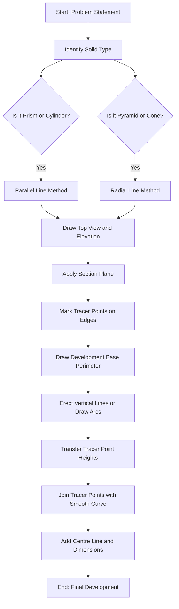
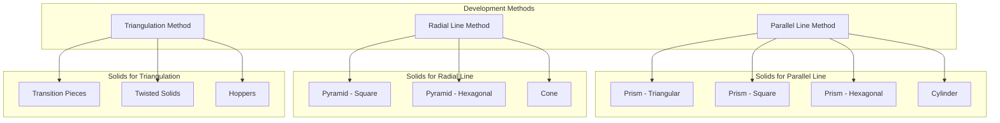
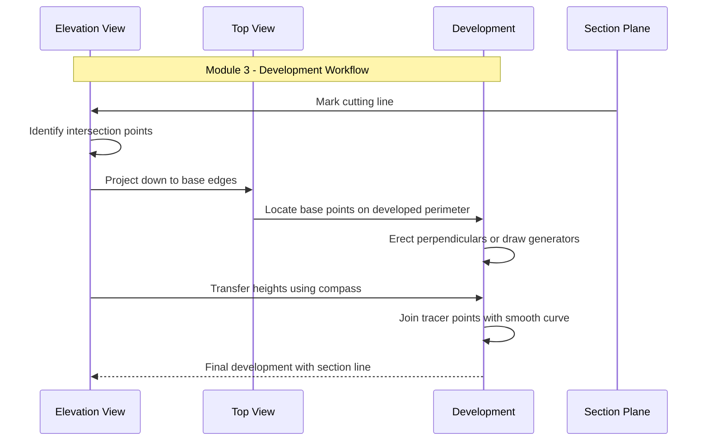
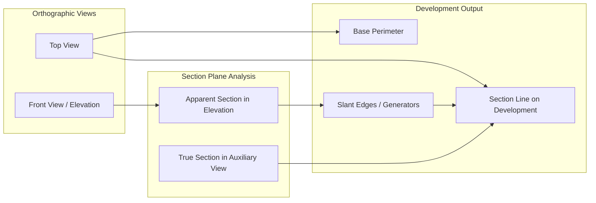

# Development of Surfaces: Development of surfaces of the solids and solids cut by different section planes (Exclude problems with through holes)

<!-- SECTION_1_START -->
# Development of Surfaces – KTU 2024 Scheme | Module 3

## 1. Core Technical Definition & Intuitive Overview

> [!NOTE]
> **Formal KTU Definition (EST103 – Module 3):**
> *Development of surfaces* is the process of unrolling/unfolding the lateral surface of a solid (prism, pyramid, cylinder, or cone) onto a single plane without stretching, tearing, or overlapping the material, so that its true shape and size can be measured directly. When a solid is cut by a section plane, the *development* includes the curve of intersection (tracing point method) to represent the cut surface in its unrolled form.

**Conceptual Analogy / Intuition**

Imagine peeling an orange — the peel (the surface) can be laid flat on a table. That flattened piece of peel is the *development* of the orange's curved skin. The length of the peel, when straightened, is the same as the arc length of the original sphere. Similarly:

- A **cylinder** unrolls into a **rectangle** (length = circumference, height = height of cylinder).
- A **cone** unrolls into a **sector of a circle** (radius = slant height, arc length = base circumference).
- A **prism/pyramid** unrolls into a series of connected **trapezoids/triangles**.

> [!IMPORTANT]
> **KTU Syllabus Highlight (2024 Scheme):**
> Development is restricted to solids cut by **single section planes**. Problems involving **through holes** are explicitly **excluded** from Module 3.

> [!TIP]
> **Engineering Utility of Development:**
> Sheet metal fabrication, HVAC ducting, pressure vessel manufacturing, packaging industry (tube/carton design), and ship hull plating all depend on accurate surface development.

> [!VISUALIZATION CONTROL]
> **Concept:** Cylinder unrolled into a rectangle and cone unrolled into a sector.
> **GeoGebra / Desmos Input Equations:**
> * Rectangle: `A = (0,0), B = (6.28, 0), C = (6.28, 4), D = (0, 4)` (circumference = 2π, height = 4)
> * Sector: `Circle: (x^2 + y^2 = 5^2); Angle = 2*pi*r / slant = 2π·1/5 ≈ 72°`
> **Visual Description:** The student should observe that the lateral surface area of the cylinder equals `L × B` (length × circumference), and for the cone equals `π × r × s` (sector area), where `s` is the slant height.

---

## 2. Symbols, Terms & Standard Reference Notation

| Symbol | Meaning | Standard Unit |
|---|---|---|
| $D$ | Diameter of base (cylinder/cone) | mm |
| $r$ | Radius of base | mm |
| $h$ | Height of solid | mm |
| $l$ or $s$ | Slant height (cone/pyramid) | mm |
| $n$ | Number of sides (prism/pyramid) | — |
| $a$ | Side of base (regular polygon) | mm |
| $R_l$ | Radius of development sector (cone) | mm = $l$ |
| $\theta$ | Sector angle (cone) | degrees = $(r/l) \times 360°$ |
| $\phi$ | True length of an edge/generator | mm |
| $T$ | Point on true section (apparent) | — |
| $T'$ | Point on development (true) | — |

> [!WARNING]
> In KTU board valuation, students often confuse the **apparent length** (seen in elevation) with the **true length** (actual 3D length). Always use the rotation method to find true length of generators in pyramids/cones.

<!-- SECTION_1_END -->

<!-- SECTION_2_START -->
# Deep Theoretical Analysis & KTU High-Yield Formula Sheet

## 2.1 Methods of Development

Three standard methods are recognised by KTU examiners:

### A. Parallel Line Development
- Used for: **Prisms and Cylinders**
- Principle: All lateral edges are parallel, so when unrolled they remain parallel and equally spaced.
- Construction: Draw a horizontal line equal to the developed perimeter. Erect perpendiculars (heights) at each division. Connect the points to form the development.

### B. Radial Line Development
- Used for: **Pyramids and Cones**
- Principle: All lateral edges meet at the apex, so when unrolled they radiate from a single point (apex).
- Construction: Draw arcs of radius equal to the slant height. Mark off arc lengths equal to the perimeter divisions on the base.

### C. Triangulation Method
- Used for: **Transition pieces, twisted/prismatic solids, complex shapes**
- Principle: The surface is divided into a series of triangles, each developed individually.

## 2.2 Solids Cut by Section Planes – Theory of Tracer Points

When a solid is cut by an inclined section plane (inclined to both HP and VP, or just HP), the cut produces a **trapezoidal, elliptical, parabolic, or circular** section.

**Key Steps (KTU Board Pattern):**

1. **Rest position:** Draw the solid resting on its base on HP with axis vertical.
2. **Section plane application:** Mark the cutting plane in elevation (or top view) as required.
3. **Tracer points:** Mark the points where the section plane intersects the base edges (apparent points on elevation).
4. **Project the section line** to the top view (when section plane is inclined to HP) using vertical projectors.
5. **True section projection:** Use the auxiliary plane method (or assume the section plane is perpendicular to the axis) to find the **true shape** of the section.
6. **Trace points on development:** For each point on the true section, locate its position on the unrolled development using arc lengths.

## 2.3 True Length of Generators (Pyramid/Cone)

For a square pyramid cut by an inclined plane:
- The generators meeting the section plane have different apparent lengths in elevation.
- **True length** = $\sqrt{\text{base radius (or half base)}^2 + \text{height}^2}$

## 2.4 KTU Formula Sheet / Cheat Sheet

| Solid | Development Shape | Key Formulas |
|---|---|---|
| **Cylinder** (h, D) | Rectangle | Length $= \pi D$, Height $= h$ |
| **Cone** (h, D, s) | Sector | Radius $= s = \sqrt{h^2 + r^2}$, Sector angle $\theta = (r/s) \times 360°$ |
| **Triangular Prism** (side $a$, $h$) | 3 Rectangles | Length per side $= a$, Height $= h$ |
| **Square Prism** | 4 Rectangles | Length per side $= a$, Height $= h$ |
| **Hexagonal Prism** | 6 Rectangles | Length per side $= a$, Height $= h$ |
| **Square Pyramid** (base $a$, h, slant $l$) | 4 Isosceles Triangles | Triangle base $= a$, sides $= l$ |
| **Hexagonal Pyramid** | 6 Isosceles Triangles | Triangle base $= a$, sides $= l$ |
| **Lateral Surface Area** (Cylinder) | — | $A = \pi D h$ |
| **Lateral Surface Area** (Cone) | — | $A = \pi r s$ |
| **Sector Arc Length** (Cone dev.) | — | $L = 2 \pi r$ (must equal arc of sector) |
| **True Length** of generator | — | $TL = \sqrt{r^2 + h^2}$ (where $r$ = horizontal distance from axis) |

> [!IMPORTANT]
> **Engineering Real-World Utility:**
> - **Cylinder** development: storage tanks, silos, smokestacks, pipelines.
> - **Cone** development: hoppers, funnels, nose cones of rockets, lamp shades.
> - **Pyramid** development: roof structures, decorative metalwork, packaging.
> - **Cut solids**: machine parts, transition pieces between different cross-sections.

<!-- SECTION_2_END -->

<!-- SECTION_3_START -->
# Step-by-Step Derivations & Worked Examples

## 3.1 Development of a Hexagonal Prism Cut by an Inclined Section Plane (Standard KTU 14-Mark Problem)

**Given:** A hexagonal prism of base side $a = 30$ mm, height $h = 60$ mm, resting on HP on one of its base edges. It is cut by a section plane inclined at $45°$ to HP, passing through the top of the left edge.

**Required:** Draw the development of the lateral surface showing the section line.

### Step 1 – Draw the Top View (Hexagon)

The hexagon is drawn first with side $30$ mm. The corners are labelled 1, 2, 3, 4, 5, 6, going around the perimeter.

### Step 2 – Draw the Front View (Elevation)

Project the hexagon upwards. The axis is vertical. Draw a vertical line of length $60$ mm (the height). Mark the visible edges (1-4) on the front view as vertical lines.

### Step 3 – Apply the Section Plane

Draw the section line as a straight line inclined at $45°$ to HP. The line should cut across the prism from the top corner of edge 1 to a point on the base. Mark these as points $A'$ (on top edge) and $B'$ (on base edge 4, or wherever the section line terminates).

### Step 4 – Identify Tracer Points

The section plane intersects each lateral edge. Let the section line in elevation cut edges 1, 2, 3, 4, 5, 6 at points $a', b', c', d', e', f'$ respectively.

- Edge 1: $a'$ (top of edge)
- Edge 4: $a$ or $a'$ (on base)
- Edges 2, 3, 5, 6: at intermediate heights (read directly from elevation)

### Step 5 – Draw the Development

Draw a horizontal base line of length equal to the **developed perimeter** of the hexagon:
$$P_{\text{developed}} = 6 \times a = 6 \times 30 = 180 \text{ mm}$$

Mark points 1, 2, 3, 4, 5, 6 along this line, each spaced $30$ mm apart.

At each base point, erect a perpendicular (vertical) line of length equal to the **true height** of the prism ($60$ mm). Mark the top points as $1', 2', 3', 4', 5', 6'$.

### Step 6 – Transfer Tracer Points to the Development

Using a horizontal scale (or compass), on each vertical line, mark the height of the corresponding tracer point from the elevation:
- On line 1: mark point at height $60$ mm (top of edge 1) — call it $A$
- On line 4: mark point at height $0$ mm (base level) — call it $B$
- On lines 2, 3, 5, 6: mark points at heights read from the elevation in the same way.

### Step 7 – Join the Tracer Points

Connect all the tracer points $A, B, C, D, E, F$ on the development with a **smooth freehand curve**. This curve represents the cut edge of the prism in its unrolled form.

### Step 8 – Add Centre Lines and Dimension

Add the centre line at the middle of the development and dimension the perimeter ($180$ mm) and height ($60$ mm).

> [!TIP]
> **Drawing Convention (KTU):** Use a **chain line (dash-dot)** for the centre line, **continuous thick line** for the visible edges, and **continuous thin line** for construction lines.

---

## 3.2 Development of a Square Pyramid Cut by a Section Plane Inclined to HP

**Given:** Square pyramid, base side $a = 40$ mm, height $h = 60$ mm, resting on HP with base parallel to HP. Cut by a section plane inclined at $30°$ to HP, with the lower base edge of the section at one corner of the base.

### Step 1 – Top View (Square ABCD)

Draw square $ABCD$ of side $40$ mm. Mark the centre $O$. Project the apex from the centre.

### Step 2 – Front View (Elevation)

Draw the axis as a vertical line. Mark the base line and project the apex. The visible corners are $A$ and $C$ (or $B$ and $D$ depending on orientation).

### Step 3 – Slant Height and True Length

The slant height of any face:
$$l = \sqrt{h^2 + \left(\frac{a}{2}\right)^2} = \sqrt{60^2 + 20^2} = \sqrt{3600 + 400} = \sqrt{4000} = 63.25 \text{ mm}$$

### Step 4 – Section Plane Application

Apply the cutting plane at $30°$ to HP in the elevation. Mark the points $a', b', c', d'$ where it intersects the four visible edges $OA, OB, OC, OD$ (apparent lengths in elevation).

### Step 5 – Find True Length of Generators

In the front view, the edges appear foreshortened. To find the true length, use the rotation method:
- Rotate the top view around the axis until each edge is parallel to the XY line.
- The corresponding projected length in the front view gives the true length.

For a square pyramid with apex on the axis:
$$TL_{OA} = l = 63.25 \text{ mm} \text{ (for all four edges)}$$

### Step 6 – Draw the Development

Draw a horizontal base line. Mark a point $O$ (apex) on a vertical reference. With radius equal to the slant height ($l = 63.25$ mm), draw an arc.

On the base, mark points 1, 2, 3, 4 spaced at $a = 40$ mm (the developed base perimeter is $4a = 160$ mm).

The true length of the base edge of each triangular face in development = $a = 40$ mm.

Draw the development as 4 isosceles triangles with apex $O$ and base $40$ mm each, sides $l = 63.25$ mm.

### Step 7 – Transfer Tracer Points

For each edge in the elevation, the tracer point's height is measured from the base. Transfer this height to the corresponding slant edge in the development by **marking along the slant edge using compass or scale**.

> [!WARNING]
> **Common Mistake:** Measuring the height vertically instead of along the slant. The correct method is to measure along the slant edge of the development, since that represents the true length of the generator.

### Step 8 – Join with Smooth Curve

Connect the four tracer points on the development with a smooth curve — this is the cut line of the pyramid in its unrolled form.

---

## 3.3 Development of a Cone Cut by a Section Plane (Inclined to HP)

**Given:** Cone, base diameter $D = 60$ mm, height $h = 70$ mm, cut by a section plane inclined at $40°$ to HP.

### Step 1 – Draw Elevation and Top View

Draw the cone resting on HP. In the top view, divide the base circle into 8 or 12 equal parts. Number them 1, 2, 3, …, 8.

### Step 2 – Draw Generators

In the elevation, draw lines from the apex to the base divisions. The visible generators are at positions 1, 3, 5, 7 (or as appropriate).

### Step 3 – Find Slant Height

$$l = \sqrt{h^2 + r^2} = \sqrt{70^2 + 30^2} = \sqrt{4900 + 900} = \sqrt{5800} = 76.16 \text{ mm}$$

### Step 4 – Find Sector Angle

$$\theta = \frac{r}{l} \times 360° = \frac{30}{76.16} \times 360° = 141.8° \approx 142°$$

### Step 5 – Draw the Development

With centre $O$ (apex) and radius $l = 76.16$ mm, draw an arc.
With the same radius, step off arcs equal to the chord length between consecutive base points on the original circle. The chord length for an 8-division circle:
$$c = 2r \sin(180°/8) = 2 \times 30 \times \sin(22.5°) = 60 \times 0.3827 = 22.96 \text{ mm}$$

Mark 8 points on the arc at spacing $c = 22.96$ mm. The total arc length should equal the base circumference $\pi D = \pi \times 60 = 188.5$ mm.

### Step 6 – Apply Section Plane and Mark Tracer Points

The section plane in the elevation cuts the visible generators at points $a', b', c', d'$. In the top view, locate the corresponding points by projecting horizontally.

### Step 7 – Transfer Tracer Points to Development

For each tracer point, mark the position along the corresponding generator on the development. The position is found by:
1. Measure the vertical height of the tracer point in the elevation.
2. The slant distance from the apex along the generator in the development is proportional to the slant length.

For a cone, the relationship between vertical height $y$ in elevation and slant distance $s_d$ from apex in development:
$$s_d = l \times \frac{(h - y)}{h}$$

Wait — let me reconsider. If $y$ is measured from the base, then the slant distance from the apex is:
$$s_d = l \times \frac{y}{h}$$

### Step 8 – Join Tracer Points with Smooth Curve

Connect the tracer points $a, b, c, d$ on the development with a smooth freehand curve to get the cut line.

---

## 3.4 Quick Reference: KTU 3-Mark Theory Solutions

**Q: What is the development of a surface?**
**A:** Development of a surface is the process of unrolling the lateral surface of a solid onto a plane without stretching or tearing, so that its true shape and size can be obtained. It is widely used in sheet metal work.

**Q: Name the methods of development.**
**A:** (1) Parallel line development (for prisms, cylinders), (2) Radial line development (for pyramids, cones), (3) Triangulation method (for transition pieces and complex solids).

**Q: Define a section plane.**
**A:** A section plane is an imaginary plane that cuts a solid to expose its internal features. The line of intersection of this plane with the solid's surface is called the section line.

**Q: What is the true length of a line?**
**A:** True length is the actual length of a line segment in 3D space, regardless of its orientation. It is equal to its length when the line is parallel to the projection plane.

**Q: How is the section line obtained on a development?**
**A:** The section line is obtained by: (1) marking tracer points where the section plane intersects the edges/generators, (2) projecting these points onto the development, (3) joining them with a smooth curve.

**Q: What is a tracer point?**
**A:** A tracer point is a point on a lateral edge of a solid where the section plane intersects that edge. It is used to locate the section line on the development.

<!-- SECTION_3_END -->

<!-- SECTION_4_START -->
# Structural Diagrams & Schematics

## 4.1 Flowchart: Process of Development of a Cut Solid

## 4.2 Block Diagram: Classification of Development Methods

## 4.3 Sequence Diagram: Tracer Point Transfer Workflow

## 4.4 Architecture: Relationship between Views and Development

<!-- SECTION_4_END -->

<!-- SECTION_5_START -->
# KTU 2024 Scheme Examination Question Bank & Topic Recap

## 5.1 Part A Questions (3 Marks Each)

### Question 1
**[KTU University Exam – July 2024]**
Define development of surfaces. Name the methods used for the development of (a) a prism and (b) a cone.

**Model Answer (Valuation Key: 3 Marks):**

> **Definition (1.5 Marks):**
> Development of a surface is the process of unrolling the lateral surface of a solid onto a plane without stretching or tearing, so that its true shape and size can be visualised and measured. It is essential in sheet metal work and fabrication.

> **Methods (1.5 Marks):**
> (a) Prism — **Parallel line development method** is used.
> (b) Cone — **Radial line development method** is used.

> **Cognitive Level:** CO1, Remember
> **Marks Distribution:** [Definition: 1.5 Marks] [Methods with justification: 1.5 Marks]

---

### Question 2
**[KTU University Exam – Dec 2023]**
What is a tracer point? Why is it necessary in the development of cut solids?

**Model Answer (Valuation Key: 3 Marks):**

> **Definition (1.5 Marks):**
> A tracer point is a point on a lateral edge of a solid where the section plane intersects that edge. It marks the boundary of the cut surface on the development.

> **Necessity (1.5 Marks):**
> Tracer points are necessary to:
> 1. Locate the exact position of the section line on the development.
> 2. Enable accurate transfer of apparent heights from the elevation to the development.
> 3. Ensure the cut shape is reproduced correctly in the unrolled form, which is critical for fabrication.

> **Cognitive Level:** CO1, Understand
> **Marks Distribution:** [Definition: 1.5 Marks] [Three-point justification: 1.5 Marks]

---

## 5.2 Part B Questions (14 Marks Each — Module Internal Choice)

### Question A (14 Marks)

**[KTU University Exam – July 2024, Model Question Paper]**

A square pyramid of base side $40$ mm and height $60$ mm rests on its base on HP such that one of its base edges is parallel to the VP. It is cut by a section plane inclined at $30°$ to HP, passing through a point on the axis at a height of $20$ mm from the base and through one corner of the base. Draw the development of the lateral surface of the truncated pyramid.

#### Part (a) — 7 Marks: Draw the Elevation and Top View with Section Plane

**Step-by-Step Solution (Valuation Key: 7 Marks):**

1. **Top View (1 Mark):** Draw a square $ABCD$ of side $40$ mm with side $AB$ parallel to $VP$. Mark the centre $O$. Join $OA, OB, OC, OD$ as generators.

2. **Front View / Elevation (1.5 Marks):** Draw the axis vertically through $O'$. Project the corners $A$ and $C$ to the front view (these are the visible corners). The apex $V'$ is at height $60$ mm on the axis.

3. **Section Plane Application (2 Marks):** Draw a line inclined at $30°$ to HP in the elevation. The line should pass through $O'$ at $20$ mm height and through corner $B$ (or $D$) on the base.
   - If passing through $B$ at the base and $O'$ at $20$ mm: $\tan(30°) = (60-20)/x$, so $x = 40/\tan(30°) = 69.28$ mm from the axis on the base side.

4. **Mark Tracer Points (2 Marks):** Identify the points where the section line intersects the four slant edges $V'A', V'B', V'C', V'D'$ in the elevation. Label them as $a', b', c', d'$.
   - For each edge, measure the height of the intersection from the base.

5. **Projection to Top View (0.5 Marks):** Project the tracer points $a', b', c', d'$ vertically down to the corresponding generators in the top view. Mark them as $a, b, c, d$.

**Valuation Distribution:**
- [Drawing top view: 1 Mark]
- [Drawing elevation: 1.5 Marks]
- [Applying section plane correctly: 2 Marks]
- [Identifying tracer points: 2 Marks]
- [Projection accuracy: 0.5 Marks]

#### Part (b) — 7 Marks: Draw the Development

**Step-by-Step Solution (Valuation Key: 7 Marks):**

1. **Calculate Slant Height (1 Mark):**
$$l = \sqrt{h^2 + \left(\frac{a}{2}\right)^2} = \sqrt{60^2 + 20^2} = \sqrt{4000} = 63.25 \text{ mm}$$

2. **Draw the Development (3 Marks):**
   - Draw a horizontal line of length $160$ mm (the developed base perimeter $= 4a$).
   - Mark base points 1, 2, 3, 4 at intervals of $40$ mm.
   - With apex $O$ at the top, draw slant edges of length $l = 63.25$ mm from each base point to the apex. The four slant edges form a kite shape (since it's a square pyramid).
   - Actually, for a square pyramid, the development consists of **4 isosceles triangles** sharing a common apex. Each triangle has base $a = 40$ mm and slant sides $l = 63.25$ mm.

3. **Transfer Tracer Points (2 Marks):**
   - For each tracer point on the elevation edge, mark the corresponding height on the slant edge of the development.
   - **Method:** Measure the vertical distance of the tracer point from the base in the elevation. Along the corresponding slant edge in the development, mark a point at the same proportional distance from the base to the apex.
   - For example, if $a'$ is at height $h_a$ in elevation, then on the slant edge of the development, mark at distance $(h_a/h) \times l$ from the base.

4. **Join Tracer Points (1 Mark):**
   - Connect the four tracer points with a smooth freehand curve to represent the cut edge of the pyramid.

**Valuation Distribution:**
- [Slant height calculation: 1 Mark]
- [Drawing four triangular faces with correct dimensions: 3 Marks]
- [Transfer of tracer points to development: 2 Marks]
- [Smooth curve for section line: 1 Mark]

---

### Question B (14 Marks) — Alternative Choice

**[KTU University Exam – Dec 2023]**

A hexagonal prism of base side $30$ mm and height $50$ mm rests on its base on HP with one base side parallel to VP. It is cut by a section plane inclined at $45°$ to HP and perpendicular to VP, passing through the midpoint of the axis. Draw the development of the lateral surface of the truncated prism.

#### Part (a) — 7 Marks: Draw the Elevation and Top View

**Step-by-Step Solution (Valuation Key: 7 Marks):**

1. **Top View (1 Mark):** Draw a regular hexagon with side $30$ mm, with one side parallel to $VP$. Number the corners 1, 2, 3, 4, 5, 6.

2. **Front View (1.5 Marks):** Project the hexagon to the front view. The visible edges are 1, 4 (or 3, 6 depending on orientation). The height is $50$ mm.

3. **Section Plane (2 Marks):** Draw a line at $45°$ to HP in the elevation, passing through the midpoint of the axis ($25$ mm height). Extend this line until it cuts the two extreme base corners.

4. **Tracer Points (1.5 Marks):** The section plane intersects the six lateral edges at points $a', b', c', d', e', f'$. Mark these in the elevation.

5. **Projection (1 Mark):** Project the tracer points down to the top view to find their positions on the base perimeter.

**Valuation Distribution:**
- [Hexagonal top view: 1 Mark]
- [Elevation with axis and height: 1.5 Marks]
- [Section plane at 45° passing through midpoint: 2 Marks]
- [Tracer points on all six edges: 1.5 Marks]
- [Vertical projection to top view: 1 Mark]

#### Part (b) — 7 Marks: Draw the Development

**Step-by-Step Solution (Valuation Key: 7 Marks):**

1. **Developed Perimeter (1 Mark):**
$$P = 6a = 6 \times 30 = 180 \text{ mm}$$

2. **Draw Development Base (1 Mark):** Draw a horizontal line of length $180$ mm, mark points 1, 2, 3, 4, 5, 6 at intervals of $30$ mm.

3. **Erect Vertical Lines (1 Mark):** At each base point, erect a perpendicular of length $50$ mm (the true height of the prism). Mark the top points.

4. **Mark Tracer Points (2 Marks):** For each tracer point on the elevation, transfer its height to the corresponding vertical line on the development. Use a compass or scale to measure the vertical distance from the base in the elevation, then mark this height on the vertical line in the development.

5. **Join Tracer Points (1 Mark):** Connect all tracer points with a smooth freehand curve.

6. **Add Centre Line and Dimensions (1 Mark):** Add the chain (dash-dot) centre line at the midpoint of the development. Dimension the perimeter ($180$ mm) and height ($50$ mm).

**Valuation Distribution:**
- [Calculating and drawing base perimeter: 1 Mark]
- [Erecting vertical lines of correct height: 1 Mark]
- [Marking tracer points: 2 Marks]
- [Smooth curve joining tracer points: 1 Mark]
- [Centre line and dimensions: 1 Mark]

---

> [!WARNING]
> **KTU Examiner's Valuation Warning / Pitfall Callout:**
> 1. **Failing to state units (mm):** KTU board deducts 0.5 marks if dimensions are not in mm.
> 2. **Drawing construction lines as thick lines:** All construction lines should be thin; only final outlines must be thick.
> 3. **Confusing apparent length with true length:** For pyramids/cones, measure along the slant edge of the development, not vertically.
> 4. **Not labelling tracer points:** Each tracer point must be clearly labelled (e.g., $a', b', c'$).
> 5. **Skipping the centre line:** A vertical chain line at the midpoint of the development is **mandatory** in KTU answer sheets.
> 6. **Using broken/dashed line for the cut edge:** The section line on the development should be a **continuous thick line** (since it is a visible edge of the cut solid).
> 7. **Incorrect sector angle for cone:** Double-check that sector arc length = base circumference. Common error: using diameter instead of radius for the angle calculation.
> 8. **Forgetting to divide the base circle of cone into 8 or 12 parts:** This is essential for accurate tracer point placement.

---

## 5.3 Topic Recap & Important Things to Remember

> [!IMPORTANT]
> **Rapid Revision Checklist — Module 3: Development of Surfaces**

### Core Definitions
- **Development:** Unrolling the lateral surface of a solid onto a plane without stretching/tearing.
- **Tracer Point:** Point of intersection between section plane and a lateral edge.
- **Section Line:** The curve formed by joining tracer points on the development.
- **True Length (TL):** Actual 3D length of a generator/edge.
- **Apparent Length:** Length as seen in elevation (foreshortened).

### Methods of Development
- **Parallel Line Method** → Prisms, Cylinders
- **Radial Line Method** → Pyramids, Cones
- **Triangulation Method** → Transition pieces, twisted solids

### Critical Formulas
- Cylinder development: Rectangle of length $\pi D$ and height $h$
- Cone development: Sector of radius $l$ and angle $\theta = (r/l) \times 360°$
- Slant height: $l = \sqrt{h^2 + r^2}$
- Lateral surface area of cylinder: $A = \pi D h$
- Lateral surface area of cone: $A = \pi r l$

### Drawing Standards (KTU)
- Visible edges: **Continuous thick line**
- Hidden edges: **Dashed line**
- Centre line: **Chain line (dash-dot)**
- Construction lines: **Continuous thin line**
- Section line on development: **Continuous thick line**

### Step Sequence (Memorise for KTU)
1. Draw top view and elevation.
2. Apply section plane.
3. Mark tracer points on all lateral edges.
4. Draw development base (perimeter line).
5. Erect perpendiculars (prism/cylinder) or draw slant edges (pyramid/cone).
6. Transfer tracer point heights to development.
7. Join tracer points with smooth curve.
8. Add centre line, dimensions, and labels.

### Common Solids in KTU Module 3
- Triangular, Square, Pentagonal, Hexagonal Prisms
- Square, Hexagonal Pyramids
- Cylinder
- Cone

### Typical KTU Question Patterns
- 3-Mark: Theory / definition / method name
- 14-Mark: Draw the development of a cut solid (with full construction)
- Choice given between (i) Prism/Cylinder, (ii) Pyramid/Cone

### Last-Minute Tips
- **Always** show the section plane clearly in elevation.
- **Always** label all tracer points ($a', b', c'$, etc.).
- **Always** include the centre line in the development.
- **Always** use proper line types as per BIS conventions.
- For cones, the sector angle $\theta$ should be checked: arc length must equal $\pi D$.

> [!TIP]
> **Practice Tip:** Solve at least 2 problems from each category (prism, pyramid, cylinder, cone) with section planes inclined to HP. KTU tends to repeat similar problems with different dimensions.

<!-- SECTION_5_END -->
