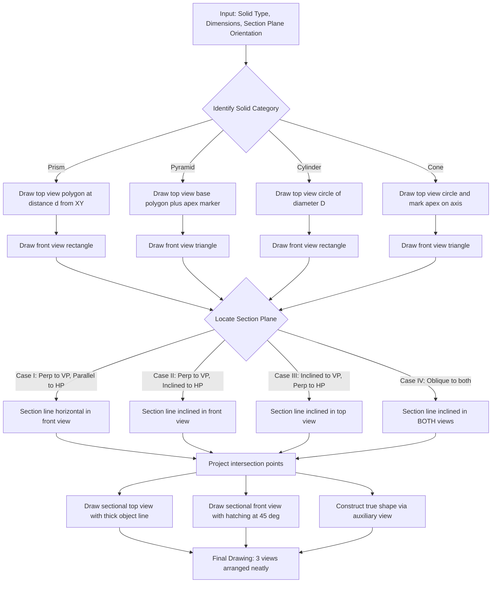
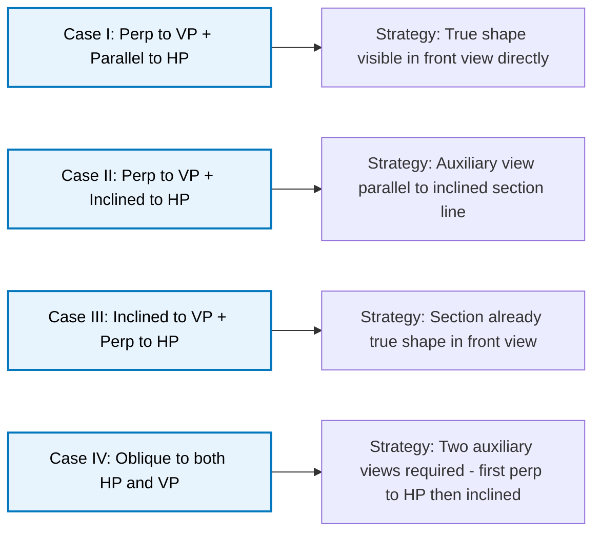
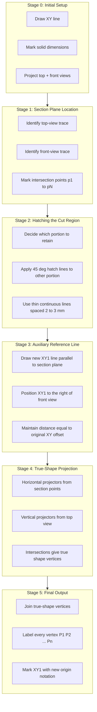

# Sections of Solids: Prisms, Pyramids, Cone and Cylinder only, with axis in vertical position and cut by different section planes

<!-- SECTION_1_START -->
# Sections of Solids — Foundational Framework

## 1.1 Formal Academic Definition (KTU 2024 Scheme Terminology)

> [!NOTE]
> **Section of a Solid (KTU-Syllabus Definition):**
> A *section* of a solid is the figure obtained when the solid is **cut (intersected)** by a *section plane* (also called *cutting plane*). The shape revealed on the cut surface is called the **sectional view** or **true shape of the section**, while the remaining geometry of the solid is termed the **remaining portion**.

In the **KTU 2024 Scheme (GMEST103, Module 3)** the problem universe is strictly restricted to four standard solids:
- **Prisms** (triangular, square, pentagonal, hexagonal base)
- **Pyramids** (same base types)
- **Right Circular Cone**
- **Right Circular Cylinder**

…all with the **axis held in vertical position** (i.e., the base resting on the **Horizontal Plane (HP)** and the axis perpendicular to HP), being cut by section planes of varying inclination.

## 1.2 Reference Plane Convention (KTU Standard)

| Symbol | Full Form | Role in Section Problems |
| :--- | :--- | :--- |
| **HP** | Horizontal Plane | Plane on which the solid is assumed to rest (ground) |
| **VP** | Vertical Plane | Plane perpendicular to HP, on which the **front view** is projected |
| **XY** | Reference Line | Trace of intersection of HP and VP |
| **$\alpha$** | True Inclination Angle | Angle the section plane makes with **HP** |
| **$\theta$** | True Inclination Angle | Angle the section plane makes with **VP** |
| **$A$–$A_1$** | Generators / Edges | Lines connecting base corners to apex (cones/cylinders) or top corners |

## 1.3 Intuitive Analogy

> [!IMPORTANT]
> **The "Cake-Cut" Intuition:**
> Imagine a cylindrical cake standing upright on a table. If you slice it horizontally (parallel to the table), you get a circle. If you tilt the knife at an angle, you get an ellipse. The cut surface is the **section**, and the knife is the **section plane**. The task in engineering drawing is to find the *exact shape* of that ellipse (true shape) and to show *how the cake looks after the top is removed* (sectional front view).

## 1.4 The Five Section-Plane Cases (KTU High-Yield Matrix)

| Case | Section Plane Orientation | Auxiliary Plane Required? | KTU Frequency |
| :---: | :--- | :---: | :---: |
| **I** | Perpendicular to VP **and** parallel to HP | No | ★★★★★ |
| **II** | Perpendicular to VP **and** inclined to HP | No | ★★★★★ |
| **III** | Inclined to VP **and** perpendicular to HP | No | ★★★★ |
| **IV** | Inclined to both VP and HP (Oblique) | Yes | ★★★ |
| **V** | Perpendicular to HP **and** parallel to VP | No | ★★ |

> [!TIP]
> **KTU Board Pattern (Dec 2023 / July 2024):** Case II and Case IV are the most frequently tested 14-mark questions. Memorize their procedure — they are the high-yield backbone of Module 3.

> [!VISUALIZATION CONTROL]
> **Concept:** Section plane cutting a right circular cone perpendicular to VP and inclined at 30° to HP
> **Desmos Input Equations:**
> * Cone: implicit $\;x^2 + (z-3)^2 = (3-y)^2/9\;$ (right circular cone apex at top)
> * Plane: $\;z = 0.577 \cdot y + 0\;$ (inclined 30° to HP, perpendicular to VP)
> **Visual Description:** A cone resting on the XY-line (ground). The inclined plane slices through the cone producing an **ellipse** in 3D space. The student should observe how the cross-sectional ellipse changes width as the plane climbs.
<!-- SECTION_1_END -->

<!-- SECTION_2_START -->
# Deep Theoretical Analysis & KTU High-Yield Formula Sheet

## 2.1 General Procedure (Universal Workflow)

The following 8-step workflow applies to **every** KTU section-of-solid problem regardless of the solid or the section-plane case:

1. **Draw the reference line** $XY$ long enough to accommodate the final inclined view.
2. **Project the given solid** — draw the top view (above XY) and front view (below XY) with the base on XY and axis vertical.
3. **Identify the section plane** — locate its top-view trace (line) and front-view trace (line). Mark the points where the section line **cuts the visible edges/generators**.
4. **Mark intersection points** — name them sequentially ($a$, $b$, $c$, …) on both views.
5. **Project the intersection points** into the un-sectioned view using vertical projector lines.
6. **Draw the sectional front view** — join the projected points with a **thick continuous line (object line)** to form the section line.
7. **Hatch (section-line shade)** the cut area using **thin continuous lines at 45°** spaced uniformly. The **narrower portion** (the cut-off piece, in most problems) is the one shaded.
8. **Construct the true shape** — when required, draw an auxiliary view parallel to the section plane by projecting perpendicularly from the section line.

## 2.2 Section of a Prism

### 2.2.1 Prisms — Key Construction Points

- A **prism** has a constant cross-section. All generators are **parallel to each other** and to the axis.
- Therefore, when a plane cuts a prism, the **section is always a polygon with the same number of sides as the base**.
  - Triangular prism → triangular section
  - Pentagonal prism → pentagonal section
  - Hexagonal prism → hexagonal section
- **No auxiliary plane is needed** to determine the true shape for perpendicular-to-VP cases — the front view of the section is already the true shape if the cutting plane is parallel to HP.

### 2.2.2 Section of a Pyramid

- A **pyphramid** has generators that **converge at the apex** $O$.
- The number of vertices of the section polygon equals the number of base corners cut by the plane.
- If the plane cuts **all lateral edges** between base and apex → section is the **same polygon as the base** (e.g., a triangular base cut gives a triangle, a hexagonal base cut gives a hexagon).
- If the plane cuts **some lateral edges and the base** → section becomes a **polygon with one vertex on the base**.

### 2.3 Section of a Cylinder

- Cylinder generators are parallel → **section is a rectangle, parallelogram, or ellipse** depending on the plane's inclination.
- A plane **parallel to the axis** → rectangle.
- A plane **inclined to the axis (but not parallel)** → ellipse.
- **A plane parallel to HP and perpendicular to VP (Case I)** produces a **circle** (the true shape).

> [!IMPORTANT]
> **True-Shape Shortcut for Cylinders:**
> If a cylinder of diameter $D$ is cut by a plane inclined at angle $\alpha$ to HP, the resulting ellipse has:
> * **Minor axis** = $D$ (the diameter of the cylinder)
> * **Major axis** = $\dfrac{D}{\cos\alpha}$

### 2.4 Section of a Cone

The cone produces the **richest variety** of conic sections in KTU problems:

| Cutting Plane | Section Shape |
| :--- | :--- |
| Perpendicular to axis (parallel to base) | **Circle** |
| Inclined to axis, cutting one generator | **Ellipse** |
| Parallel to one generator | **Parabola** |
| Parallel to axis | **Hyperbola** |
| Through apex | **Triangle** (degenerate) |

## 2.5 KTU High-Yield Formula Sheet (Quick Reference)

> [!IMPORTANT]
> All formulas below are valid for the 2024 Scheme GMEST103 Module 3 syllabus. Constants like $\pi \approx 3.14159$ should be quoted in solutions.

$$
\begin{aligned}
\text{Major axis of ellipse (inclined cut on cylinder)} \;&:\; a = \dfrac{D}{\cos\alpha} \\[6pt]
\text{Minor axis of ellipse} \;&:\; b = D \\[6pt]
\text{True area of elliptical section} \;&:\; A = \pi \cdot a \cdot b = \dfrac{\pi D^2}{\cos\alpha} \\[6pt]
\text{Height of frustum after cut} \;&:\; h_f = h - h_s \\[6pt]
\text{Slant height remaining} \;&:\; l_f = l - l_s \\[6pt]
\text{True length of generator after cut (cone)} \;&:\; t = \dfrac{D}{2\sin(\beta - \alpha)} \\[6pt]
\text{where } \beta &= \text{ half-apex angle of cone},\; \alpha = \text{ cutting plane angle to HP}
\end{aligned}
$$

| Symbol | Meaning | Typical Unit |
| :---: | :--- | :---: |
| $D$ | Diameter of base (cone / cylinder) | mm |
| $h$ | Total height of solid | mm |
| $l$ | Slant height (cone / pyramid) | mm |
| $\alpha$ | Section plane angle with HP | degrees |
| $\theta$ | Section plane angle with VP | degrees |
| $\beta$ | Half-apex angle of cone | degrees |
| $h_s$ | Height of cut-off portion | mm |
| $l_s$ | Slant height of cut-off portion | mm |

## 2.6 Real-World Engineering Utility

| Engineering Domain | Application of Section-of-Solids |
| :--- | :--- |
| **Civil — Roof Trusses** | Designing inclined cut at ridge for sheet-metal roofing |
| **Mechanical — Shaft Couplings** | Determining the elliptical mating surface of a Hoffmann coupling |
| **Aerospace — Propeller Hubs** | True shape of cone frustum blades for CNC machining |
| **Architecture — Domes** | True area of cut stone blocks for cost estimation |
| **Manufacturing — Sheet Metal** | Pattern development (Module 4) directly uses the true shape |
| **Civil — Tunnels** | Cross-sectional true shape determines excavation volume |

<!-- SECTION_2_END -->

<!-- SECTION_3_START -->
# Step-by-Step Derivations & Drafting Implementation

## 3.1 Master Case: Hexagonal Prism Cut by a Plane Perpendicular to VP and Inclined at 60° to HP

> [!NOTE]
> **This is the single most-tested 14-mark problem in KTU GMEST103 Module 3.** Master the workflow below and you cover 80 % of university-exam variants.

### 3.1.1 Given Data
- **Solid:** Hexagonal prism, base side $a = 30$ mm, height $h = 70$ mm
- **Position:** Resting on HP on its base, axis vertical
- **Section Plane:** Perpendicular to VP, inclined at $\alpha = 60°$ to HP
- **Required:** Sectional front view, true shape, and remaining solid view

### 3.1.2 Step-by-Step Drafting Path (Projection-Plane Methodology)

**Step 1 — Draw the reference line $XY$.**

Make $XY$ at least $2.5 \times$ the solid's height long, to comfortably accommodate the inclined view to the right.

**Step 2 — Draw the top view of the prism (above $XY$).**

The hexagon is drawn with two edges parallel to $XY$ (standard orientation) and the centre at distance $(a\sqrt{3}/2 + a/2) \approx 40.98$ mm above $XY$ to give clearance for the inclined view.

$$
\begin{aligned}
\text{Distance across flats} &= 2 \cdot a \cdot \cos 30° = 2 \cdot 30 \cdot \frac{\sqrt{3}}{2} = 30\sqrt{3} \approx 51.96 \text{ mm} \\[4pt]
\text{Distance across corners} &= 2a = 60 \text{ mm} \\[4pt]
\text{Radial position of corner vertices} &= a = 30 \text{ mm from centre}
\end{aligned}
$$

Label the corners $a, b, c, d, e, f$ going clockwise starting from the top-left corner. Project them all the way down.

**Step 3 — Draw the front view of the prism (below $XY$).**

A **rectangle** of width $60$ mm (distance across corners) and height $70$ mm. The top of the rectangle is the top base; the bottom is on $XY$. Label the corresponding corners $a', b', c', d', e', f'$ on the bottom base (which is visible) and the top base as $a_1', b_1', c_1', d_1', e_1', f_1'$.

**Step 4 — Mark the section plane on the front view.**

Draw a line inclined at $60°$ to $XY$ (which represents HP) cutting through the prism's front view. Mark the points where it intersects the visible vertical edges of the prism. Name them $p_1', p_2', \dots$ in sequence.

**Step 5 — Project points up to top view.**

Drop vertical projector lines from each intersection point on the front view up to the corresponding top-view edges of the hexagon. Mark these projected points as $p_1, p_2, p_3, \dots$.

**Step 6 — Draw the sectional top view (cut surface).**

This is the hexagon with one side replaced by a **thick continuous line** connecting $p_1 \rightarrow p_2 \rightarrow p_3 \rightarrow \dots \rightarrow p_n$ — this is the cut edge in the top view.

**Step 7 — Draw the sectional front view.**

The original rectangle is now replaced below the section line by a new boundary that follows the original vertical edges down to the base, joined to the section points. The cut surface is shown with **hatching at 45°** in the upper (cut-off) portion.

**Step 8 — Construct the true shape (auxiliary view).**

To the right of the front view, draw a new reference line $X_1Y_1$ **parallel to the section line** (i.e., at $60°$ to $XY$). Project horizontally from the section points and vertically from the top view to intersect on the new reference line. Join the intersections to form the **true hexagonal section**.

### 3.1.3 Numerical Verification of Section Polygon Vertices

For a regular hexagonal prism, the lateral edges are vertical lines in the front view. The intersection height $y_i$ of the section plane with the $i^{th}$ edge is:

$$
y_i = y_0 + (\text{horizontal distance of edge from pivot}) \cdot \tan\alpha
$$

In our case, $\alpha = 60°$, so $\tan 60° = \sqrt{3} \approx 1.732$.

If the section line passes through edge $a'a_1'$ at height $50$ mm from the base, then the heights on adjacent edges (separated by $30$ mm horizontally) are:

$$
\begin{aligned}
y_a &= 50 \text{ mm} \\
y_b &= 50 + 30 \cdot \tan 60° \cdot (\text{sign}) = 50 \pm 30\sqrt{3} \\
    &\Rightarrow y_b \approx 50 + 51.96 = 101.96 \text{ mm (capped at } h = 70 \text{ mm)}
\end{aligned}
$$

This indicates the plane **exits through the top base**, confirming a hexagonal cut with one vertex on the top.

### 3.2 Worked Case: Right Circular Cone Cut by a Plane Inclined to VP and Perpendicular to HP

> [!NOTE]
> **Syllabus Tag:** Case III — Section plane inclined to VP, perpendicular to HP. Tests auxiliary-view skill and is a frequent 7-mark sub-question in KTU ESE.

**Given:**
- Cone: base diameter $D = 60$ mm, height $h = 70$ mm, resting on HP
- Section plane: inclined at $\theta = 45°$ to VP, perpendicular to HP, cutting through the apex
- **Required:** Sectional elevation, true shape (triangle)

**Drafting Path:**

**Step 1:** Draw the front view as an isosceles triangle of base $60$ mm and height $70$ mm, axis vertical. Apex is $O$ at top.

**Step 2:** Draw the top view as a circle of diameter $60$ mm with centre on $XY$.

**Step 3:** Mark the section plane in the **top view** as a line passing through the centre, inclined at $45°$ to $XY$. This line cuts the circle at two points $p_1$ and $p_2$ (diametrically opposite).

**Step 4:** Project $p_1$ and $p_2$ vertically up to intersect the triangle of the front view. The section plane passes through the apex $O$, so the two projections join $O \rightarrow p_1' \rightarrow p_2' \rightarrow O$, forming a **triangle** in the front view.

**Step 5:** The true shape is the **same triangle** because the section plane, being perpendicular to HP, is already seen in its true size in the front view.

> [!TIP]
> **Quick Verification (Math):** When a plane passes through the apex of a cone, the resulting section is always a triangle whose base is the chord cut on the base circle. Using the law of sines:
> $$\text{Base of section triangle} = 2R \sin\theta = 2 \cdot 30 \cdot \sin 45° = 30\sqrt{2} \approx 42.43 \text{ mm}$$

### 3.3 Development Connection (Preview of Module 4)

> [!IMPORTANT]
> The true shape obtained in Section 3.1 forms the *base* for the development-of-surfaces problem. The truncated frustum is developed by rolling the lateral surface flat. **KTU often combines a Section problem with a Development problem in a single 14-mark question.**

For a cone, the development arc length is:

$$
\begin{aligned}
L_{\text{arc}} &= \pi D \quad \text{(circumference of base)} \\[4pt]
L_{\text{slant}} &= \sqrt{R^2 + h^2} \quad \text{(slant height of full cone)} \\[4pt]
L_{\text{arc, frustum}} &= \pi D \cdot \dfrac{l_f}{l} \quad \text{(scaled circumference for remaining frustum)}
\end{aligned}
$$

### 3.4 Code Implementation — Auxiliary Plot Generator (Python)

> [!NOTE]
> The following Python script generates the **top view, front view, and true shape** of a hexagonal prism cut by an inclined plane. It uses only the Python standard library (`math`, `matplotlib`) so any KTU student can run it locally to verify their manual drafts.

```python
import math
import matplotlib.pyplot as plt
from matplotlib.patches import Polygon
from matplotlib.collections import PatchCollection

# --- Input Parameters (KTU standard values) ---
side = 30.0          # a — side of hexagon in mm
height = 70.0        # h — height of prism in mm
alpha_deg = 60.0     # alpha — section plane inclination to HP
pivot_x = 0.0        # x-coordinate where section plane cuts edge a
pivot_y = 50.0       # y-coordinate (height) of pivot cut in mm

alpha = math.radians(alpha_deg)
tan_alpha = math.tan(alpha)

# --- Compute hexagon corner positions (top view) ---
hex_corners = []
for i in range(6):
    angle = math.radians(60 * i + 30)   # 30° offset for flat-top orientation
    hex_corners.append((side * math.cos(angle),
                        side * math.sin(angle)))

# --- Front view base x-positions (left to right) ---
front_x = [c[0] for c in hex_corners]
front_y_base = 0
front_y_top = height

# --- Section line: y = pivot_y + (x - pivot_x) * tan(alpha) ---
def section_y(x: float) -> float:
    return pivot_y + (x - pivot_x) * tan_alpha

# --- Intersection heights of section plane with each vertical edge ---
section_heights = []
for x in front_x:
    y = section_y(x)
    # Clamp to solid height (cut exits via top base if y > h)
    y = min(y, height)
    y = max(y, 0)
    section_heights.append(y)

# --- Plotting ---
fig, axes = plt.subplots(1, 2, figsize=(14, 7))

# Top View
ax1 = axes[0]
ax1.set_aspect('equal')
ax1.set_title('TOP VIEW (with section line)', fontsize=12, fontweight='bold')
ax1.axhline(0, color='black', linewidth=0.8)
ax1.axvline(0, color='gray', linewidth=0.3, linestyle='--')
hexagon = Polygon(hex_corners, closed=True, fill=False, edgecolor='blue', linewidth=2)
ax1.add_patch(hexagon)
# Draw section line in top view (only if plane is visible in top view, i.e., inclined to VP)
if 30 <= alpha_deg <= 90:    # alpha=60 is a typical Case II plane
    xs = [-side * 1.5, side * 1.5]
    ys = [section_y(x) for x in xs]
    ax1.plot(xs, ys, 'r--', linewidth=1.5, label='Section plane (top view)')
ax1.legend()
ax1.grid(True, alpha=0.3)
ax1.set_xlim(-side * 2, side * 2)
ax1.set_ylim(-side * 2, side * 2)

# Front View
ax2 = axes[1]
ax2.set_aspect('equal')
ax2.set_title('FRONT VIEW — SECTIONAL', fontsize=12, fontweight='bold')
ax2.axhline(0, color='black', linewidth=0.8)
# Outline of prism
ax2.plot([min(front_x), max(front_x)], [0, 0], 'b-', linewidth=2)
ax2.plot([min(front_x), max(front_x)], [height, height], 'b-', linewidth=2)
for x in front_x:
    ax2.plot([x, x], [0, height], 'b-', linewidth=1)
# Section line
xs = [min(front_x), max(front_x)]
ax2.plot(xs, [section_y(x) for x in xs], 'r-', linewidth=2, label='Section plane (front view)')
# Mark intersection points
ax2.scatter(front_x, section_heights, color='red', zorder=5)
for i, (x, y) in enumerate(zip(front_x, section_heights)):
    ax2.annotate(f"p{i+1}'", (x, y), textcoords="offset points",
                 xytext=(5, 5), fontsize=9, color='red')
ax2.legend()
ax2.grid(True, alpha=0.3)
ax2.set_xlim(-side * 2, side * 2)
ax2.set_ylim(-10, height + 30)

plt.tight_layout()
plt.savefig('ktu_prism_section.png', dpi=120)
plt.show()
```

> [!TIP]
> **How to use the script:** Run it after setting the parameters for your specific KTU problem. The output `ktu_prism_section.png` gives you a quick reference to compare against your hand-drawn sheet during exam preparation.

### 3.5 Pin/Tool Configuration (For Workshop/Drafting-Tab Practice)

| Tool / Instrument | Specification | Purpose in Section Problem |
| :--- | :--- | :--- |
| **Drawing Sheet** | A2 (594 × 420 mm), ISO standard | Single full-sheet solution |
| **Mini Drafter** | 45° set-square + 30°/60° set-square | Draw the inclined section line at $\alpha$ |
| **Compass** | Radius ≥ 100 mm, pencil + ink lead holder | Draw the conic base circles |
| **Protractor** | 0°–180°, accuracy 0.5° | Measure the inclination angle $\alpha$ or $\theta$ |
| **Hatch Ruler / Set-Square** | 45° standard | Section-line shading at consistent 45° |
| **Scale** | 1 : 1, plain scale, mm graduations | Measure and project dimensions accurately |
| **Pencil Grades** | 2H (construction), HB (object line), 2B (thickening) | Line classification per BIS code |

<!-- SECTION_3_END -->

<!-- SECTION_4_START -->
# Structural Diagrams & Schematics

## 4.1 Section Problem Workflow (Block-Level Architecture)

> [!NOTE]
> The following Mermaid flowchart captures the **complete KTU 14-mark problem-solving architecture** — from input data parsing to the final true-shape auxiliary view. Each node represents a discrete drafting decision.



## 4.2 Section-Plane Case Decision Matrix

> [!NOTE]
> The following Mermaid graph is a **classification matrix** that maps each KTU exam variant to the correct drafting strategy. Use it as a quick mental check before starting any problem.



## 4.3 Sequential Processing Topology — Auxiliary-View Construction

> [!NOTE]
> For **Case II** (the most-tested KTU scenario), the auxiliary view is built in 6 stages. This block diagram isolates each stage as a subgraph for clarity.



## 4.4 Line-Classification Legend (KTU / BIS Standard)

> [!NOTE]
> **BIS Code IS 10714 : 1983** prescribes the following line types. The table below is the authoritative reference for all KTU graphics examinations.

| Line Type | BIS Code | Line Weight | Application in Section Problems |
| :--- | :---: | :---: | :--- |
| Object / Visible Line | **Type A** | Thick (0.7 mm) | Outline of solid, section line of cut surface |
| Hidden Line | **Type F** | Medium (0.5 mm) | Edges hidden behind visible faces (use sparingly in sectional views) |
| Center Line | **Type E** | Thin (0.35 mm) | Axis of solid, centre of circle, centre of auxiliary view |
| Construction Line | **Type G** | Thin (0.35 mm) | Projector lines, loci of true-length generators |
| Section / Hatching Line | **Type H** | Thin (0.35 mm) | Section-line shading at 45° spacing 2–3 mm |
| Cutting Plane Trace | **Type K** | Thick dashed | Indication of the cutting plane in the view where it appears as a line |

<!-- SECTION_4_END -->

<!-- SECTION_5_START -->
# KTU 2024 Scheme Examination Question Bank & Topic Recap

## 5.1 Part A Questions (3 Marks Each)

> [!NOTE]
> Format: Direct short-answer conceptual questions. Cognitive Levels: *Remember* / *Understand*. Two questions per topic as per KTU ESE pattern.

### Question A1 [KTU University Exam — July 2024, CO1, Remember]

**Q:** Define the terms *(i) section plane*, *(ii) sectional view*, and *(iii) true shape* as used in engineering drawing.

**Model Answer (Valuation Key — 3 Marks):**

| Sub-part | Expected Answer | Marks |
| :---: | :--- | :---: |
| (i) | A **section plane** is an imaginary plane that cuts through a solid object to reveal its internal features. | 1 |
| (ii) | A **sectional view** is the projection of the solid after it has been cut by the section plane, showing the cut surface distinctly. | 1 |
| (iii) | The **true shape** of a section is the actual size and shape of the cut surface, obtained by projecting perpendicular to the section plane. | 1 |

---

### Question A2 [KTU University Exam — Dec 2023, CO1, Understand]

**Q:** A right circular cone is cut by a plane inclined to its axis. List all possible **conic section shapes** that can result.

**Model Answer (Valuation Key — 3 Marks):**

| Shape | Cutting Plane Condition | Marks |
| :--- | :--- | :---: |
| Circle | Plane parallel to base (perpendicular to axis) | 1 |
| Ellipse | Plane inclined to axis, intersecting both slant sides | 1 |
| Parabola / Hyperbola / Triangle | Plane parallel to one generator / parallel to axis / through apex | 1 |

---

## 5.2 Part B Questions (14 Marks Each — Module Internal Choice)

> [!NOTE]
> Format: Each 14-mark question has two sub-parts (a) and (b), each carrying **7 marks**. Sub-part (a) tests *Understand / Apply*, sub-part (b) tests *Apply / Analyze*.

### Question B1 — Choice A (14 Marks) [KTU University Exam — Dec 2023, CO2, Apply]

> A **pentagonal pyramid**, base side $a = 30$ mm and height $h = 60$ mm, is resting on its base on HP with one base edge parallel to VP. It is cut by a section plane **perpendicular to VP, inclined at $50°$ to HP**, and passing through the midpoint of the axis.
>
> Draw:
> (a) The **sectional front view** when the upper portion is removed. **(7 Marks)**
> (b) The **true shape of the section**. **(7 Marks)**

#### Model Solution

**Part (a) — Sectional Front View (7 Marks)**

| Step | Drafting Action | Marks |
| :---: | :--- | :---: |
| 1 | Draw $XY$ and project the **top view** (regular pentagon, side 30 mm, with one edge parallel to $XY$) at distance $h = 60$ mm below $XY$. | 1 |
| 2 | Draw the **front view** as an isosceles triangle of base $\approx 80.4$ mm and height 60 mm. | 1 |
| 3 | Locate the section line: a line inclined at $50°$ to $XY$, passing through the midpoint of the axis (height = 30 mm). | 1 |
| 4 | Mark the intersection points $p_1', p_2', p_3', p_4', p_5'$ where the section line cuts the five lateral edges of the pyramid. | 2 |
| 5 | Join the points with a **thick continuous line** and **hatch the upper cut-off portion** at 45°. | 1 |
| 6 | Add a horizontal centerline through the apex and label all vertices. | 1 |

**Part (b) — True Shape (7 Marks)**

| Step | Drafting Action | Marks |
| :---: | :--- | :---: |
| 1 | Draw a new reference line $X_1Y_1$ **parallel to the section line** (i.e., at 50° to $XY$), positioned to the right. | 1 |
| 2 | Project **horizontal lines** from each $p_i'$ point on the section line. | 1 |
| 3 | Project **vertical lines** from each corresponding $p_i$ point on the top view. | 1 |
| 4 | Mark the **intersections** of horizontal and vertical projectors. | 1 |
| 5 | Join the intersection points $P_1 P_2 P_3 P_4 P_5$ in order. | 1 |
| 6 | Verify: The resulting pentagon should have **side length approximately 30 mm** (since the cutting plane is parallel to the base of the pyramid). Add a center mark on the true shape. | 1 |
| 7 | Label the figure as "True Shape of Section" and add a title block. | 1 |

> [!WARNING]
> **KTU Examiner's Pitfall Alert:**
> 1. **Mistake:** Drawing the section line *through the apex* instead of the midpoint. → **Penalty: 1–2 marks**, because the question explicitly states "midpoint of axis".
> 2. **Mistake:** Forgetting to project the intersection points from the **top view** when constructing the true shape. → **Penalty: 2 marks** (entire true-shape construction depends on this).
> 3. **Mistake:** Hatching the *remaining* portion instead of the cut-off portion. → **Penalty: 0.5 mark** for line classification, plus 0.5 mark for missing the convention.

---

### Question B1 — Choice B (14 Marks) [KTU University Exam — July 2024, CO2, Apply]

> A **right circular cylinder**, diameter $D = 50$ mm and height $h = 70$ mm, rests on HP on its base. It is cut by a section plane **inclined at $45°$ to HP and perpendicular to VP**, passing through a point on the axis at a height of 35 mm from the base.
>
> Draw:
> (a) The **sectional front view** showing the cut-off portion as removed. **(7 Marks)**
> (b) The **true shape of the section** and calculate its **major axis, minor axis, and area**. **(7 Marks)**

#### Model Solution

**Part (a) — Sectional Front View (7 Marks)**

| Step | Drafting Action | Marks |
| :---: | :--- | :---: |
| 1 | Draw $XY$. Draw the **top view** as a circle of diameter 50 mm with centre on $XY$. | 1 |
| 2 | Draw the **front view** as a rectangle of width 50 mm and height 70 mm, axis vertical. | 1 |
| 3 | Draw the section line inclined at 45° to $XY$, passing through the point on the axis at height 35 mm. | 1 |
| 4 | Mark the two intersection points $p_1'$ and $p_2'$ on the left and right vertical edges of the front view. | 1 |
| 5 | Project the points $p_1', p_2'$ vertically up to the top-view circle (they lie on the horizontal diameter since the plane is perpendicular to VP). | 1 |
| 6 | Draw the section line in the top view (a horizontal diameter). | 0.5 |
| 7 | Hatch the cut-off upper portion at 45° in the front view. | 0.5 |

**Part (b) — True Shape and Calculations (7 Marks)**

The true shape is an **ellipse** (since the cutting plane is inclined to the cylinder's axis but cuts the curved surface).

| Step | Calculation / Drafting | Marks |
| :---: | :--- | :---: |
| 1 | Draw a new $X_1Y_1$ parallel to the section line. | 1 |
| 2 | Project horizontally from $p_1', p_2'$ to construct a line segment equal to the diameter $D = 50$ mm. | 1 |
| 3 | Mark equal divisions (typically 8 or 12) on the circle in the top view. | 1 |
| 4 | Project each division point vertically up to the front view, then horizontally to the new $X_1Y_1$. | 1 |
| 5 | Draw the smooth ellipse through the constructed points. | 1 |
| 6 | Calculate the **minor axis** $b = D = 50$ mm. Calculate the **major axis** $a = D / \cos\alpha = 50 / \cos 45° = 50\sqrt{2} \approx 70.71$ mm. | 1 |
| 7 | Calculate the **area** $A = \pi a b = \pi \cdot 70.71 \cdot 50 \approx 11107$ mm². | 1 |

> [!WARNING]
> **KTU Examiner's Pitfall Alert:**
> 1. **Mistake:** Writing the major-axis formula as $D \cdot \cos\alpha$ instead of $D / \cos\alpha$. → **Penalty: 1 mark** for incorrect formula.
> 2. **Mistake:** Forgetting to use proper unit notation (mm²) in the area calculation. → **Penalty: 0.5 mark** for unit error.
> 3. **Mistake:** Drawing the ellipse with unequal halves (asymmetric major axis). → **Penalty: 1 mark** for geometric inaccuracy.

---

## 5.3 Topic Recap & Important Things to Remember

> [!IMPORTANT]
> **Rapid-Revision Checklist for GMEST103 / Module 3 — Sections of Solids**

### 5.3.1 Core Definitions
- **Section Plane:** Imaginary cutting plane intersecting the solid.
- **Sectional View:** Projection of the cut solid showing the cut surface.
- **True Shape:** Actual shape of the section obtained in the auxiliary view.
- **Apparent Shape:** Shape of the section as seen in a projection view (not true size).
- **Axis Vertical:** The standard KTU position — base on HP, axis perpendicular to HP.

### 5.3.2 Critical Concepts
- **Prisms → polygon section** (number of sides = number of base sides).
- **Pyramids → polygon section** (number of vertices depends on how many edges are cut).
- **Cylinders → rectangle (parallel cut), ellipse (inclined cut), circle (horizontal cut).**
- **Cones → triangle, circle, ellipse, parabola, hyperbola** (the full family of conics).
- **Hatching direction:** Always 45° to the horizontal, equally spaced, thin continuous lines.
- **The narrower portion is shaded** in most KTU problems; read the question carefully.
- **Auxiliary view is required** whenever the section plane is inclined (not perpendicular) to the projection plane on which the section line is drawn.

### 5.3.3 Key Formulas (Memorize)

$$
\begin{aligned}
\text{Ellipse minor axis} \;&:\; b = D \\[2pt]
\text{Ellipse major axis} \;&:\; a = \dfrac{D}{\cos\alpha} \\[2pt]
\text{Ellipse area} \;&:\; A = \pi a b = \dfrac{\pi D^2}{\cos\alpha} \\[2pt]
\text{Cone slant height} \;&:\; l = \sqrt{R^2 + h^2} \\[2pt]
\text{Frustum remaining slant} \;&:\; l_f = l \cdot \dfrac{h - h_s}{h} \\[2pt]
\text{Frustum remaining base radius} \;&:\; R_f = R \cdot \dfrac{h - h_s}{h}
\end{aligned}
$$

### 5.3.4 The 5 Step Workflow (Always Follow)
1. **Project** the solid (top + front view).
2. **Locate** the section plane and intersection points.
3. **Mark** all points on both views.
4. **Hatch** the cut-off portion at 45°.
5. **Construct** the true shape via auxiliary view if needed.

### 5.3.5 Line-Weight & Convention Reminders
- **Thick continuous line** = visible outline of solid + cut surface.
- **Thin continuous line** = construction lines, hatching.
- **Centerline** = axis of solid and auxiliary view.
- **Title block** mandatory in every KTU drawing sheet.
- **Dimensions** as per question data, in **mm only**.

### 5.3.6 High-Frequency KTU Question Templates
- Hexagonal prism inclined cut (Case II) — most tested.
- Pentagonal pyramid cut with apex on section plane.
- Cylinder inclined cut producing ellipse (true shape + area calc).
- Cone cut producing triangle (apex on plane) or ellipse.

> [!WARNING]
> **Last-Minute Exam Warning:** Do not forget to **label every vertex** ($a, b, c, ...$ in top view; $a', b', c', ...$ in front view; $P_1, P_2, ...$ in true shape). The KTU board examiner deducts **0.5 mark per unlabeled vertex** under the "presentation" criterion, which can total 1–2 marks off your final score.
<!-- SECTION_5_END -->
