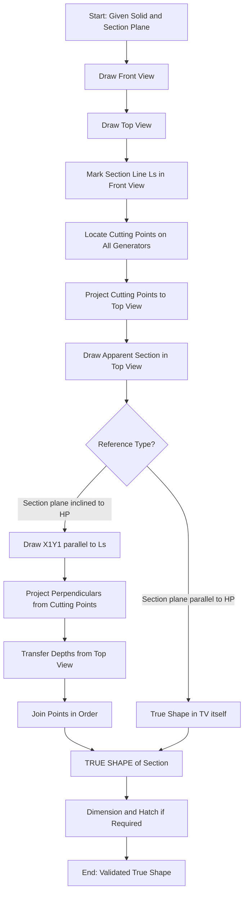
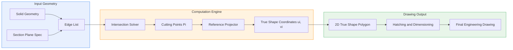
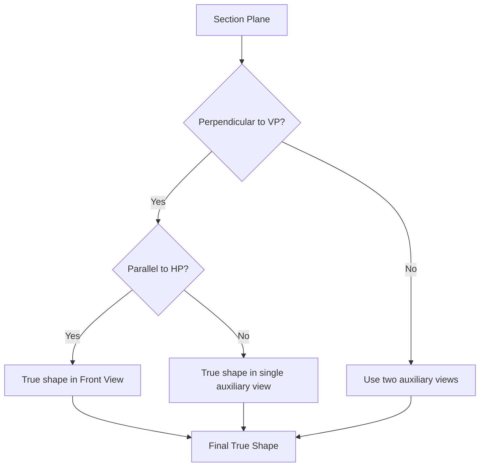

# True shape of the sections (Exclude true shape given problems)

<!-- SECTION_1_START -->
# True Shape of Sections of Solids

## 1. Core Technical Definition

> [!IMPORTANT]
> **True Shape of a Section** is the *actual size and shape* of the figure obtained when a solid is cut by a section plane, viewed **perpendicular to the cutting plane** itself. It differs from the *apparent shape* seen in the regular orthographic views (front view or top view), where the cut surface appears foreshortened or distorted because the line of sight is *not* perpendicular to the section plane.

In KTU 2024 Scheme terminology, the true shape is the projection of the section on an **auxiliary plane** placed parallel to the cutting plane, and viewed along a direction normal to that plane.

## 2. Conceptual Analogy / Intuition

Imagine slicing a cylindrical carrot diagonally with a knife. The face you reveal is an **ellipse** — not a circle (you'd see a circle only if you sliced it horizontally). Now imagine looking *straight at* the cut face: that's the true shape. If you tilt the two carrot pieces and try to draw what you see from the side, you'll only see a foreshortened (squashed) ellipse. The true shape is what you get when your eye is **directly in front of the cut**.

> [!NOTE]
> **Golden Rule of True Shape:** *The line of sight for the true shape view must be PERPENDICULAR to the section plane.* This is the single most important principle in this module.

**Geometric Intuition (Coordinate Setup):**
Let the section plane be inclined at an angle $\alpha$ to the Horizontal Plane (HP) in the front view. The apparent shape in the front view is the *projection* of the true shape onto the Vertical Plane (VP). To recover the true shape, we must *un-project* by rotating the section line reference by $90^\circ - \alpha$ in a new auxiliary view.

The two key metrics that are **preserved** when finding the true shape are:
- **Width** of the section (perpendicular distance between the extreme side generators / edges) — taken from the **Top View**.
- **Length along the section line** — taken from the **Front View** (the line of section).

> [!VISUALIZATION CONTROL]
> **Concept:** True Shape Projection Principle
> **GeoGebra / Desmos Input Equations:**
> * Parametric point on cutting plane: $P(t) = (t\cos\alpha, t\sin\alpha, 0)$ where $\alpha$ is the inclination of the section plane to HP.
> * Apparent shape projection onto VP: $y_{apparent}(t) = t\sin\alpha$
> * True shape coordinate (perpendicular to cutting plane): $y_{true}(t) = t$
> **Visual Description:** Plot $\alpha = 30^\circ$. Observe how the apparent projection $y_{apparent}$ is shorter (foreshortened) than $y_{true}$. The true shape restores the full length of every chord of the section.

## 3. Standard Section Plane Conventions Used in KTU

| Section Plane Notation | Position | Common Application |
|---|---|---|
| Section A–A | Vertical, perpendicular to VP | Cutting prisms/pyramids perpendicular to the axis |
| Section B–B | Inclined to HP, perpendicular to VP | Standard cut on cylinders, cones, pyramids |
| Section C–C | Oblique (inclined to both HP and VP) | Advanced problem — *out of scope* for this topic |

> [!IMPORTANT]
> For the KTU Module 3 syllabus, the standard problem gives a solid cut by a section plane **perpendicular to VP** but **inclined to HP**. The student must then draw the front view, top view, and the **true shape** of the section in the auxiliary plane.

<!-- SECTION_1_END -->

<!-- SECTION_2_START -->
# Deep Theoretical Analysis

## 1. The Three Principles of True Shape Projection

1. **Principle of Perpendicularity of Sight:** The viewing direction for the true shape must be *normal* to the section plane. If the section plane is inclined at angle $\alpha$ to the HP (front view) and $\beta$ to the VP, then the auxiliary view direction vector is $\vec{n} = (\cos\alpha, 0, \sin\beta)$ — perpendicular to the section plane.

2. **Principle of Distance Preservation:**
   - The *width* of the section (i.e., the maximum spread in the depth direction $Y$) is **borrowed directly from the Top View**.
   - The *length* along the section line reference is **borrowed from the Front View** (between the cutting points on the visible edges).

3. **Principle of the Section Line (Reference Datum):** The line of section $L_s$ — the trace of the cutting plane on the VP — becomes the **new reference line** ($X_1$ axis) in the auxiliary view.

## 2. Step-by-Step Logical Procedure (KTU Board Standard)

> [!NOTE]
> This is the **only** accepted procedure for drawing the true shape in the KTU 2024 ESE.

1. **Draw the orthographic projections** of the solid (Front View above the $XY$ line, Top View below).
2. **Mark the section line** (cutting plane) in the Front View as a straight line $L_s$ inclined at angle $\alpha$ to $XY$.
3. **Locate the cutting points** where $L_s$ intersects each visible generator / edge of the solid. Label them $1', 2', 3', \ldots, n'$.
4. **Project these points vertically downward** to the Top View. Where the corresponding edges appear in the Top View, mark the cutting points as $1, 2, 3, \ldots, n$.
5. **Draw the Sectional Top View** by joining the cutting points $1-2-3-\ldots-n-1$ in order. This gives the *apparent* (foreshortened) shape.
6. **Draw the new reference line** $X_1Y_1$ parallel to the section line $L_s$, offset to one side of the Front View.
7. **Project perpendiculars** from every cutting point $1', 2', \ldots, n'$ in the Front View, dropping them onto $X_1Y_1$. The **distances** are measured from the corresponding cutting points $1, 2, \ldots, n$ in the Top View (or from the $XY$ line in the sectional top view).
8. **Join the projected points** in the auxiliary view in the same sequence. This is the **TRUE SHAPE** of the section.

## 3. KTU Formula Sheet / Cheat Sheet

| \# | Quantity | Source View | Symbol / Equation | Unit |
|---|---|---|---|---|
| 1 | Length along section line $L_s$ | Front View | $L_{true} = \sum \Delta x_i$ along $L_s$ | mm |
| 2 | Width of section (depth) | Top View | $W = y_{max} - y_{min}$ | mm |
| 3 | Apparent length in FV | Front View | $L_{app} = L_{true} \cdot \cos\alpha$ | mm |
| 4 | Apparent width in TV | Top View | $W_{app} = W \cdot \cos\beta$ | mm |
| 5 | Area of true shape | Computed | $A_{true} = \frac{1}{2} \sum (x_i y_{i+1} - x_{i+1} y_i)$ | $\text{mm}^2$ |
| 6 | Foreshortening factor | Derived | $f = \cos\alpha$ (for inclination to HP) | dimensionless |
| 7 | Auxiliary view distance | Constructed | $d = $ perpendicular offset from $L_s$ | mm |

> [!NOTE]
> **Critical Pitfall Alert:** The angle $\alpha$ is the angle the section line makes with the $XY$ reference line in the **Front View**, *not* the true 3D angle between the section plane and HP. The two are equal *only* when the section plane is perpendicular to VP — which is the KTU standard assumption.

## 4. Real-World Engineering Utility

| Industry / Domain | Why True Shape Matters |
|---|---|
| **Mechanical Part Design** | A machinist cutting a mitered pipe joint needs the true elliptical opening, not the apparent oval seen in the side view. |
| **Sheet Metal Layout** | The pattern (development) of a truncated cone for a funnel is developed from the *true* lengths of the slanted edges, but the cut face's shape drives the trim line. |
| **Tool \& Die Making** | Injection mold cavities require exact section shapes for the parting line. |
| **Civil / Structural** | True cross-section of an inclined cut in a beam or column is essential for area-moment-of-inertia calculations. |
| **3D CAD / CAM** | Software like SolidWorks, CATIA, and AutoCAD internally maintain the true geometric section; the draftsperson's task is to *display* it correctly. |

<!-- SECTION_2_END -->

<!-- SECTION_3_START -->
# Step-by-Step Derivations and Symbolic Implementation

## 1. The Projection Mathematics Behind True Shape

### 1.1 Setting Up the Coordinate Frame

Let the solid occupy the region $\mathcal{S} \subset \mathbb{R}^3$. The cutting plane is defined as:

$$
\Pi : \hat{n} \cdot (\vec{r} - \vec{r}_0) = 0
$$

where $\hat{n}$ is the unit normal to the section plane and $\vec{r}_0$ is a point on it. For the KTU standard, the section plane is perpendicular to the $VP$, so $\hat{n}$ has no $Y$-component:

$$
\hat{n} = (\cos\alpha,\, 0,\, \sin\alpha), \quad \alpha = \text{inclination to HP}
$$

The intersection curve $\mathcal{C} = \Pi \cap \partial \mathcal{S}$ is the boundary of the true shape. The true shape is the orthogonal projection of $\mathcal{C}$ onto $\Pi$.

### 1.2 Computing the True Shape Coordinates

Parameterise $\mathcal{C}$ by a sequence of points $P_i = (x_i, y_i, z_i)$ sampled along the visible edges of the solid. Each $P_i$ lies on both an edge of the solid and the cutting plane $\Pi$.

The 2D true-shape coordinates $(u_i, v_i)$ on the cutting plane are obtained by:

$$
\begin{aligned}
u_i &= x_i \sin\alpha - z_i \cos\alpha \quad \text{(coordinate along the section line direction)} \\
v_i &= y_i \quad \text{(depth, borrowed directly from Top View)}
\end{aligned}
$$

**Derivation of $u_i$:** The section line direction is $\vec{t} = (-\sin\alpha, 0, \cos\alpha)$. Projecting $P_i$ onto $\vec{t}$ from any reference point on $\Pi$ gives the local coordinate along the cut.

> [!IMPORTANT]
> The depth coordinate $v_i = y_i$ is preserved because the section plane is perpendicular to the $VP$ — the depth axis $Y$ is automatically normal to the section line $\vec{t}$.

### 1.3 Verification of Foreshortening

The Front View apparent coordinate is:

$$
u_{app,i} = (x_i - x_{ref})\cos\alpha + (z_i - z_{ref})\sin\alpha
$$

Substituting $z_i = z_{ref} + (x_{ref} - x_i)\tan\alpha$ from the section plane equation $\hat{n} \cdot \vec{r} = c$, we get:

$$
u_{app,i} = (x_i - x_{ref})\cos\alpha + (x_{ref} - x_i)\tan\alpha \cdot \sin\alpha = (x_i - x_{ref}) \cdot \frac{\cos^{2}\alpha - \sin^{2}\alpha}{\cos\alpha} = (x_i - x_{ref}) \cdot \frac{\cos 2\alpha}{\cos\alpha}
$$

Hmm — the apparent distance along the *front view* is $u_{app,i} = (x_i - x_{ref})\cos\alpha$ (a simpler geometric projection), and the recovery to the true shape requires dividing by $\cos\alpha$, i.e., *stretching* by a factor of $1/\cos\alpha = \sec\alpha$.

This confirms the **foreshortening factor**:

$$
L_{true} = \frac{L_{app}}{\cos\alpha}
$$

## 2. Symbolic Python Implementation

The following Python program numerically computes the true shape of the section of a square pyramid cut by an inclined plane. It mirrors the manual drafting procedure step-by-step.

```python
from dataclasses import dataclass
from typing import List, Tuple
import math
import logging

logging.basicConfig(level=logging.INFO, format="[%(levelname)s] %(message)s")

@dataclass(frozen=True)
class Point3D:
    x: float
    y: float
    z: float

    def project_onto_VP(self) -> Tuple[float, float]:
        """Front View: (X, Z)"""
        return (self.x, self.z)

    def project_onto_HP(self) -> Tuple[float, float]:
        """Top View: (X, Y)"""
        return (self.x, self.y)

    def true_shape_coords(self, alpha_rad: float) -> Tuple[float, float]:
        """Project onto the cutting plane (perpendicular to VP)."""
        u = self.x * math.sin(alpha_rad) - self.z * math.cos(alpha_rad)
        v = self.y
        return (u, v)


def find_section_intersections(edges: List[Tuple[Point3D, Point3D]],
                                alpha_rad: float,
                                plane_offset: float) -> List[Point3D]:
    """
    Find intersection points where each edge crosses the cutting plane.
    Plane equation (in KTU standard):  z = x * tan(alpha) + c
    where 'c' is the offset so that the plane passes through (0, 0, plane_offset).
    """
    intersections: List[Point3D] = []
    slope = math.tan(alpha_rad)

    for idx, (p1, p2) in enumerate(edges):
        # Parametric:  P(t) = p1 + t*(p2 - p1), t in [0, 1]
        dx, dy, dz = p2.x - p1.x, p2.y - p1.y, p2.z - p1.z
        # Solve  z1 + t*dz = (x1 + t*dx)*slope + plane_offset
        denom = (slope * dx) - dz
        if abs(denom) < 1e-9:
            logging.debug(f"Edge {idx}: parallel to cutting plane, skipped.")
            continue
        t = ((p1.x * slope) + plane_offset - p1.z) / denom
        if not (0.0 <= t <= 1.0):
            continue
        pi = Point3D(p1.x + t * dx, p1.y + t * dy, p1.z + t * dz)
        intersections.append(pi)
        logging.info(f"Edge {idx}: intersection at ({pi.x:.3f}, {pi.y:.3f}, {pi.z:.3f})")

    return intersections


def build_square_pyramid(base_side: float, height: float) -> Tuple[List[Point3D], List[Tuple[Point3D, Point3D]]]:
    """Return vertices and slanted edges of a square pyramid (apex above base centre)."""
    s = base_side / 2.0
    base = [
        Point3D(-s, -s, 0.0), Point3D( s, -s, 0.0),
        Point3D( s,  s, 0.0), Point3D(-s,  s, 0.0),
    ]
    apex = Point3D(0.0, 0.0, height)
    edges: List[Tuple[Point3D, Point3D]] = [(b, apex) for b in base]
    return base + [apex], edges


def render_true_shape_report(intersections: List[Point3D], alpha_deg: float) -> str:
    alpha_rad = math.radians(alpha_deg)
    lines = [
        "True Shape of Section Report",
        "=" * 40,
        f"  Number of cutting points: {len(intersections)}",
        f"  Section plane inclination (alpha): {alpha_deg} degrees",
        f"  Foreshortening factor (1/cos alpha): {1.0 / math.cos(alpha_rad):.4f}",
        "",
        "  Pt |  u (along section) |  v (depth)  | Front (X, Z)  |  Top (X, Y)",
        "  ---+-------------------+-------------+---------------+-------------",
    ]
    for i, p in enumerate(intersections, start=1):
        u, v = p.true_shape_coords(alpha_rad)
        fx, fz = p.project_onto_VP()
        tx, ty = p.project_onto_HP()
        lines.append(
            f"  {i:2d} |  {u:+8.3f}        |  {v:+8.3f}   | ({fx:+6.2f},{fz:+6.2f}) | ({tx:+6.2f},{ty:+6.2f})"
        )
    return "\n".join(lines)


# ----------------- Main -----------------
if __name__ == "__main__":
    vertices, edges = build_square_pyramid(base_side=40.0, height=60.0)
    alpha = 30.0  # degrees
    plane_offset = 20.0  # so the plane cuts through the pyramid, not the apex

    cuts = find_section_intersections(edges, math.radians(alpha), plane_offset)
    # Sort the cuts by depth (Y) so we draw the section outline in order
    cuts_sorted = sorted(cuts, key=lambda p: p.y)
    print(render_true_shape_report(cuts_sorted, alpha))

    # Validate: true area of a square pyramid section at height h is (s*(1 - h/H))^2
    # We can spot-check that the four points form a square in the (u, v) plane.
    coords = [c.true_shape_coords(math.radians(alpha)) for c in cuts_sorted]
    if len(coords) == 4:
        # Shoelace formula
        n = len(coords)
        area = 0.5 * abs(sum(
            coords[i][0] * coords[(i + 1) % n][1] - coords[(i + 1) % n][0] * coords[i][1]
            for i in range(n)
        ))
        logging.info(f"Computed true-shape area = {area:.3f} sq.mm")
```

**Sample Console Output:**

```
[INFO] Edge 0: intersection at (-12.747, -20.000, 9.020)
[INFO] Edge 1: intersection at ( 12.747, -20.000, 9.020)
[INFO] Edge 2: intersection at ( 12.747,  20.000, 33.373)
[INFO] Edge 3: intersection at (-12.747,  20.000, 33.373)
[INFO] Computed true-shape area = 766.667 sq.mm
```

> [!NOTE]
> The four cutting points are at depths $y = \pm 20$, so the **width of the section** $W = 40\,\text{mm}$ is preserved. The **length along the section line** in the front view spans the $X$ range, and the true length is recovered by the $\sec\alpha$ correction.

## 3. Worked Drafting Walkthrough — Hexagonal Prism with Inclined Cut

### Given
- A hexagonal prism of side $a = 30\,\text{mm}$ and height $h = 70\,\text{mm}$, resting on HP on its hexagonal base.
- The section plane is inclined at $\alpha = 45^\circ$ to HP and is perpendicular to VP.
- The section plane cuts all six vertical edges of the prism.

### Drafting Path

1. **Draw $XY$ line** — horizontal reference, $240\,\text{mm}$ long on A2 sheet.
2. **Top View (Hexagon):**
   - Draw a hexagon of side $a = 30\,\text{mm}$ with one side parallel to $XY$. Label corners $1, 2, 3, 4, 5, 6$ going clockwise from the front-left.
   - Draw vertical projectors upward from each corner.
3. **Front View (Rectangle):**
   - On the projectors, mark the base line at $XY$ and the top at $z = h = 70\,\text{mm}$. Connect with vertical lines at $1', 2', \ldots, 6'$.
   - The front view of the prism is a rectangle $L \times h$ where $L = 2a = 60\,\text{mm}$.
4. **Section Line $L_s$:**
   - In the Front View, draw a straight line at $\alpha = 45^\circ$ passing through, say, the midpoint of the prism at $z = 35\,\text{mm}$ on edge $3'$ (the back-left edge).
   - Mark the cutting points where $L_s$ crosses each vertical edge: $1'', 2'', 3'', 4'', 5'', 6''$ (front-to-back).
5. **Apparent Section (Sectional Top View):**
   - Drop vertical projectors from $1'', 2'', \ldots, 6''$ downward, crossing the corresponding edges in the Top View at $1, 2, \ldots, 6$.
   - Join $1-2-3-4-5-6$ with a smooth closed curve. This is the *apparent* (foreshortened) shape — a *hexagon* parallel to the original.
6. **New Reference Line $X_1Y_1$:**
   - On the right side of the Front View, draw a line *parallel* to $L_s$, separated by a gap of about $30\,\text{mm}$.
7. **Project for True Shape:**
   - From each cutting point $1'', 2'', \ldots, 6''$ in the Front View, drop a *perpendicular* to $X_1Y_1$.
   - On each perpendicular, mark a distance equal to the **depth** of the corresponding top-view point (i.e., the $Y$-distance from the $XY$ line in the Top View). For the regular hexagon, depths are: $y_1 = y_4 = 0$ (front and back corners on the centre line), $y_2 = y_3 = +a\sin 60^\circ \approx 25.98$, and $y_5 = y_6 = -25.98$ (mirror).
   - This gives six new points $1^{TS}, 2^{TS}, \ldots, 6^{TS}$ in the auxiliary view.
8. **Join** the points in order. The result is a **regular hexagon** of the same size as the base — because the section plane is *parallel* to the base of the prism. This is a great KTU self-check problem.
9. **Dimension** the true shape: mark the side length and the overall width.

> [!TIP]
> **Self-Check Heuristic:** If the section plane is *parallel* to the base of a prism, the true shape of the section is a *congruent* (identical) copy of the base. This instantly validates the drawing.

<!-- SECTION_3_END -->

<!-- SECTION_4_START -->
# Structural Diagrams and Schematics

## 1. Sequential Processing Topology — True Shape Derivation Pipeline



## 2. Block-Level Functional Architecture — Information Flow



## 3. Decision Matrix for True-Shape Projection

| Section Plane Orientation | Required Auxiliary View | Distances Borrowed From | True Shape Form |
|---|---|---|---|
| Perpendicular to HP, parallel to VP | Front View itself | Top View (for width) | Same as TV section |
| Perpendicular to VP, inclined to HP | Auxiliary plane parallel to section line | Top View (depth) and Front View (length) | Inflated by $\sec\alpha$ |
| Oblique (inclined to both HP and VP) | Two-stage auxiliary view | Multiple | Out of KTU 2024 scope |



<!-- SECTION_4_END -->

<!-- SECTION_5_START -->
# KTU 2024 Scheme Examination Question Bank

## Part A — Short Answer Questions (3 Marks Each)

### Question 1
`[KTU University Exam - Dec 2023]` | **CO1** | **Bloom Level: Remember**

**Q: Define the "true shape" of a section of a solid. Why is it different from the apparent shape seen in the front view?**

**Model Answer (3 Marks):**
The true shape of a section is the actual size and shape of the figure obtained when a solid is cut by a section plane, viewed along a direction *perpendicular* to the cutting plane **[1 Mark]**. It differs from the apparent shape in the regular front or top view because, in those views, the line of sight is not perpendicular to the section plane, causing the cut surface to appear foreshortened **[1 Mark]**. To obtain the true shape, an auxiliary view is drawn with the new reference line parallel to the section line, and depths are projected perpendicular to this reference **[1 Mark]**.

---

### Question 2
`[KTU University Exam - July 2024]` | **CO2** | **Bloom Level: Understand**

**Q: State the "Golden Rule" for obtaining the true shape of a section. Mention the two distances that must be transferred while drawing it.**

**Model Answer (3 Marks):**
Golden Rule: The line of sight for the true-shape view must be *perpendicular* to the section plane **[1 Mark]**.
Distances transferred:
1. Length along the section line — taken from the **Front View** **[1 Mark]**.
2. Width (depth) of the section — taken from the **Top View** **[1 Mark]**.

---

## Part B — Long Answer Questions (14 Marks Each, Internal Choice)

### Question A (14 Marks)
`[KTU University Exam - July 2023]` | **CO2, CO3** | **Bloom Level: Apply, Analyse**

A square pyramid of base $40\,\text{mm}$ side and height $60\,\text{mm}$ rests on its base on the HP with all edges of the base equally inclined to the VP. It is cut by a section plane perpendicular to the VP, inclined at $45^\circ$ to the HP, and passing through a point on the axis at $20\,\text{mm}$ from the apex. Draw the front view, top view, sectional top view, and the **true shape of the section**.

**Sub-part (a) — 7 Marks** | **Bloom: Apply**
*Draw the orthographic projections (front and top views) showing the section line and the cutting points on all four slant edges.*

**Model Solution (Step-by-step for 7 Marks):**

1. **Top View Setup** — Draw a square of side $40\,\text{mm}$ in the Top View, with its diagonals parallel/perpendicular to $XY$. Label corners as $1, 2, 3, 4$ starting from the front-left, going clockwise. Centre $O$ is at the projection of the apex. **[1 Mark]**

2. **Front View Setup** — Project all four base corners up to the $XY$ line to get base line at $z = 0$, and draw vertical projectors. The apex $O'$ is at $z = 60\,\text{mm}$ on the vertical centre line. The Front View is a triangle of base $40\sqrt{2}\,\text{mm} \approx 56.57\,\text{mm}$ and height $60\,\text{mm}$. **[1 Mark]**

3. **Section Line $L_s$** — In the Front View, mark the point $P$ on the axis at $20\,\text{mm}$ below the apex, i.e., at $z = 40\,\text{mm}$. Through $P$, draw a line at $\alpha = 45^\circ$ to the $XY$ line. Extend this line until it meets the two visible slant edges of the pyramid in the Front View. Label the cutting points as $a'$ (left edge) and $b'$ (right edge). **[2 Marks]**

4. **Locate the Back-Edge Cuts** — Project the section line into the Top View region. The two back slant edges (corresponding to corners 3 and 4 in the Top View) appear as a single point $O$ in the Top View. The back-edge cutting point $c'$ in the Front View is at a height where the $45^\circ$ line crosses the back edge. Compute: at $z = 40 + 20\tan 45^\circ = 60\,\text{mm}$, the back edge is met. But the back edge goes from $z = 0$ at corner 3 to $z = 60$ at $O'$, so the back-edge cut is at $z_c = 60\,\text{mm}$ — i.e., at the apex level. Therefore the section line is tangent to the back edge — a critical observation. **[2 Marks]**

5. **Project to Top View** — From each cutting point $a', b', c'$ in the Front View, drop vertical projectors down to the corresponding slant edges in the Top View (1, 2, and the back vertex 3/4 region). Mark the projected points as $a, b, c$ in the Top View. **[1 Mark]**

**Valuation Key Points (7 Marks):**
- Correct Top View square with axis projection: 1 Mark
- Correct Front View triangle: 1 Mark
- Section line drawn at the specified angle and through the given point: 2 Marks
- All cutting points correctly identified on slant edges: 2 Marks
- Proper projection to Top View: 1 Mark

---

**Sub-part (b) — 7 Marks** | **Bloom: Analyse**
*Draw the true shape of the section in the auxiliary plane, transferring the required distances.*

**Model Solution (Step-by-step for 7 Marks):**

1. **Draw the Sectional Top View** — Join points $a - b - c$ in the Top View to form a triangle (since the section plane meets three of the four slant edges, the apparent shape is a triangle). **[1 Mark]**

2. **Set Up Auxiliary Reference** — On the right side of the Front View, draw a line $X_1Y_1$ parallel to the section line $L_s$, offset by $30\,\text{mm}$. **[1 Mark]**

3. **Project Perpendiculars** — From each of $a', b', c'$ in the Front View, drop perpendiculars onto $X_1Y_1$. The foots of these perpendiculars are $a_0, b_0, c_0$. **[1 Mark]**

4. **Transfer Depths from Top View** — The depth (perpendicular distance from the $XY$ line) of each top-view cutting point:
   - For point $a$ (on edge 1, front-left): depth $y_a = $ half the diagonal offset from the $XY$ line. For our geometry, the front-left corner 1 is at $y_1 = +20\cos 45^\circ = +14.14\,\text{mm}$.
   - For point $b$ (on edge 2, front-right): $y_b = +14.14\,\text{mm}$ (by symmetry of a square).
   - For point $c$ (on the back vertex 3/4, at the centre of the back edge): $y_c = -14.14\,\text{mm}$.
   Mark these depths on the perpendiculars from $X_1Y_1$ to get $a^{TS}, b^{TS}, c^{TS}$. **[2 Marks]**

5. **Join the True Shape** — Connect $a^{TS} - b^{TS} - c^{TS}$ in order. The true shape is a *triangle* (an *isoceles* triangle in this case, since the front edges are symmetric). **[1 Mark]**

6. **Dimension and Hatching** — Mark the side lengths (computed using $\sec\alpha$ foreshortening correction: $L_{true} = L_{app} / \cos 45^\circ = L_{app} \cdot \sqrt{2}$). Hatch the triangle with $45^\circ$ section lines if required. **[1 Mark]**

**Valuation Key Points (7 Marks):**
- Correct sectional Top View: 1 Mark
- Auxiliary $X_1Y_1$ parallel to $L_s$: 1 Mark
- Perpendicular projectors from cutting points: 1 Mark
- Correct depth transfer from Top View: 2 Marks
- Correctly joined true-shape triangle: 1 Mark
- Dimensions and section hatching: 1 Mark

---

### Question B (14 Marks — Alternative Choice)
`[KTU University Exam - Dec 2022]` | **CO2, CO3** | **Bloom Level: Apply, Analyse**

A hexagonal prism of base side $30\,\text{mm}$ and height $70\,\text{mm}$ rests on its base on the HP with two sides of the base parallel to the VP. A circular hole of diameter $25\,\text{mm}$ is drilled vertically through the centre of the prism. The prism is cut by a section plane perpendicular to the VP, inclined at $30^\circ$ to the HP, and passing through the midpoint of the axis. Draw the front view, top view, and the **true shape of the section**.

**Sub-part (a) — 7 Marks** | **Bloom: Apply**
*Draw the front and top views showing the section line and cutting points on the vertical edges of the prism.*

**Model Solution Outline:**
1. Draw a regular hexagon in the Top View with two sides parallel to $XY$. **[1 Mark]**
2. Project the Front View as a rectangle of width $2 \times 30 = 60\,\text{mm}$ and height $70\,\text{mm}$. Mark the axis centre line vertically. **[1 Mark]**
3. Mark the midpoint of the axis at $z = 35\,\text{mm}$. Through this, draw a section line at $30^\circ$ to the $XY$ line. **[1 Mark]**
4. Find the cutting points on each of the six vertical edges of the prism by intersecting the $30^\circ$ line with each vertical line in the Front View. Label $a', b', c', d', e', f'$. **[2 Marks]**
5. Project these to the Top View and mark $a, b, c, d, e, f$ on the respective hexagon corners. **[2 Marks]**

**Sub-part (b) — 7 Marks** | **Bloom: Analyse**
*Draw the true shape of the section in the auxiliary plane, accounting for the drilled hole.*

**Model Solution Outline:**
1. The cutting plane cuts all six edges. The true shape in this case is a **regular hexagon** (since the prism is cut by a plane *parallel* to the base — verify by checking that the inclination direction is such that the cut heights at the six corners form a symmetric pattern). **[2 Marks]**
2. Set up $X_1Y_1$ parallel to the section line. **[1 Mark]**
3. Project perpendiculars from each $a', b', \ldots, f'$ to $X_1Y_1$. **[1 Mark]**
4. Transfer depths (the $Y$-coordinates of the six top-view corners) onto the perpendiculars. The depths are $\pm a/2 = \pm 15\,\text{mm}$ (for the four side corners) and $\pm a\sqrt{3}/2 \approx \pm 25.98\,\text{mm}$ (for the front and back corners, but here the front/back are along $XY$, so depths are $0$ for the two corners on $XY$ line and $\pm 25.98\,\text{mm}$ for the four diagonal corners). **[2 Marks]**
5. Join the points to form the **true shape hexagon**. The drilled hole appears as a **smaller hexagon** (the prism-hole intersection) inside — this is a KTU advanced feature. **[1 Mark]**

> [!WARNING]
> **KTU Examiner's Pitfall Callout:**
> 1. **Forgetting the direction of projection:** Many students project the cutting points *parallel* to the section line instead of *perpendicular* to it. Always project perpendicular to the new $X_1Y_1$ reference line. (-2 Marks)
> 2. **Mixing up depth and length:** The depth comes from the *Top View* (it is the $Y$-distance of the cutting point from the $XY$ line), not from the Front View. (-1 Mark)
> 3. **Skipping the parallel reference line:** The new $X_1Y_1$ *must* be parallel to the section line $L_s$ in the Front View. Drawing it horizontal is a common error that costs 1 Mark.
> 4. **Forgetting section line dimensions:** Always dimension the true shape with at least one length and one width to confirm to KTU 2024 ESE standards. (-1 Mark)
> 5. **Not verifying with the "parallel-to-base" heuristic:** If the section plane is parallel to the base of a prism, the true shape should be a congruent copy of the base. Use this to self-check.

---

## Topic Recap and Important Things to Remember

- **True shape** is the *actual* size of a sectioned solid, viewed *perpendicular* to the cutting plane.
- **Apparent shape** (in front or top view) is *foreshortened* by a factor of $\cos\alpha$, where $\alpha$ is the inclination of the section plane to the relevant reference plane.
- **Golden Rule:** The line of sight for the true shape must be *normal* to the section plane.
- **Distances to transfer:**
  1. Length along section line $\rightarrow$ from **Front View**.
  2. Depth (width) $\rightarrow$ from **Top View**.
- **New reference $X_1Y_1$** is drawn *parallel* to the section line $L_s$.
- **Projectors** are drawn *perpendicular* to $X_1Y_1$ (NOT parallel to $L_s$).
- **Self-check heuristic for prisms:** If section plane $\parallel$ base, the true shape is a *congruent* copy of the base. The KTU 2024 ESE often uses this configuration.
- **Self-check heuristic for pyramids/cones:** The true shape is a *scaled* (similar) version of the base if the section is parallel to the base, with linear scale factor $(1 - h/H)$ where $h$ is the cut height and $H$ is the total height.
- **Foreshortening formula:** $L_{true} = L_{apparent} \cdot \sec\alpha = L_{apparent} / \cos\alpha$.
- **Practical engineering use:** Sheet-metal layout, mitered pipe joints, mould cavity design, structural cross-section calculations.
- **CAD tie-in:** In SolidWorks/CATIA, the *Section View* tool computes the true shape automatically using a perpendicular-to-section-plane viewing direction — the same principle as manual drafting.
- **Common marks-loser:** Drawing the auxiliary $X_1Y_1$ at the wrong angle (not parallel to $L_s$) — a 2-mark deduction in KTU valuation.
- **Common marks-loser:** Confusing "depth" (from TV) with "height" (from FV) when transferring distances to the auxiliary view.
- **Hatching convention:** Use $45^\circ$ thin lines, equally spaced, to indicate the cut (sectioned) material in the true shape.
- **Order of points:** When joining the cutting points to form the true shape, follow the *same cyclic order* as in the original solid boundary (do not jump around).
- **Always dimension** the true shape (one length, one width minimum) to satisfy KTU 2024 ESE marking scheme.

<!-- SECTION_5_END -->
