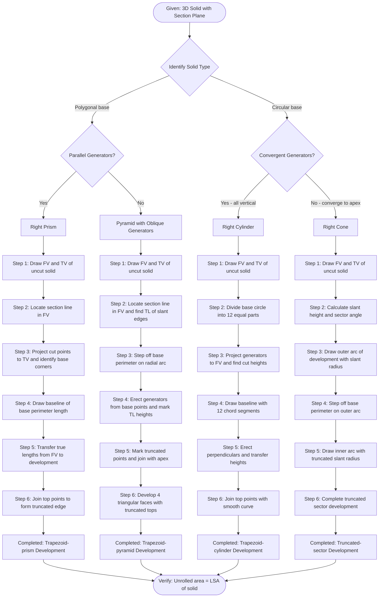
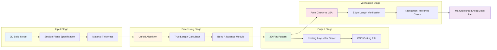
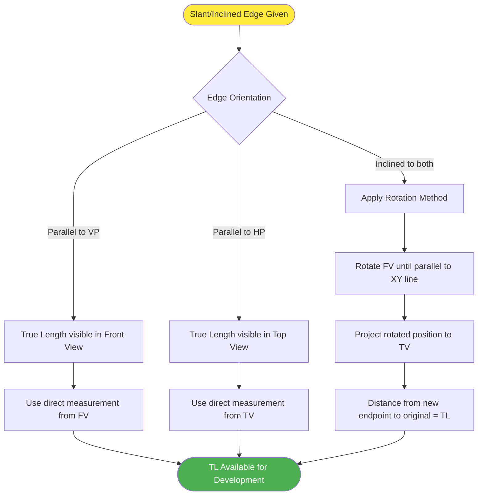
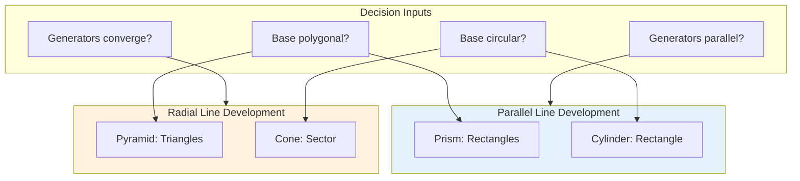

# Development of Surfaces: Development of surfaces of the solids and solids cut by different section planes. (Exclude problems with through holes)

<!-- SECTION_1_START -->
# 1. Core Technical Definition & Intuitive Overview

## 1.1 Formal Definition (KTU 2024 Syllabus Terminology)

> [!IMPORTANT]
> **Development of Surfaces** is defined as the process of unfolding or unrolling the lateral (curved or polygonal) surface of a three-dimensional solid onto a single two-dimensional plane, such that the true shape and true length of every line element on the surface is preserved without any distortion or stretching.

In KTU Engineering Graphics, development is essentially a **2D-to-3D reverse mapping** that allows engineers to fabricate sheet-metal patterns, lay out sheet-metal covers, design transition pieces, and manufacture containers directly from flat plates.

> [!NOTE]
> **Syllabus Restriction (Module 3, KTU 2024 Scheme):** Only **prisms, pyramids, cones, and cylinders** are considered. **Hollow solids and problems involving through holes are explicitly EXCLUDED** from the syllabus.

## 1.2 Conceptual Analogy — The "Peeling the Orange Peel" Intuition

Imagine you have a chocolate Easter bunny wrapped in a thin metallic foil. To determine how much foil is required to cover the bunny, you would:

1. Make a single vertical cut along the foil (so the foil becomes a single sheet).
2. Carefully **peel off** the foil and lay it flat on a table.
3. The flat shape you obtain is the **development** of the bunny's surface.

Mathematically, the surface of the solid is *isometric* (preserves lengths) to a flat region — there is **no compression or stretching** involved, only a smooth unfolding.

> [!TIP]
> **Geometric Invariant:** A surface is *developable* if and only if it has **zero Gaussian curvature at every point**. This is why cylinders, cones, prisms, and pyramids can be developed — but a sphere **cannot** be developed without distortion.

## 1.3 Classification of Solids for Development

| Solid Type | Type of Lateral Surface | Development Method | Number of Base Edges |
| :--- | :--- | :--- | :--- |
| **Prism** | Polygonal (rectangles) | Parallel Line Development | $n$ rectangles |
| **Pyramid** | Polygonal (triangles) | Radial Line / Triangulation | $n$ triangles |
| **Cylinder** | Curved (rectangle when unrolled) | Parallel Line Development | Infinite (continuous) |
| **Cone** | Curved (sector of a circle) | Radial Line Development | Infinite (continuous) |

Where $n$ is the number of sides of the polygonal base.

## 1.4 Why Section Planes Matter in Development

When a solid is **cut by an inclined section plane** (for example, a cylinder cut obliquely to obtain a truncated pipe), the development is no longer a simple rectangle or sector — instead, the development becomes a **trapezoid-like shape** where:

- One edge corresponds to the **base** of the solid (a full circle / polygon of true length).
- The opposite edge corresponds to the **truncated top** (an ellipse for cylinders, a scaled polygon for prisms/pyramids, or a scaled circle for cones).
- The slanting side lines connect corresponding points on the base and the section, all of **true length**.

> [!VISUALIZATION CONTROL]
> **Concept:** Unrolling a right circular cylinder of radius $R$ and height $H$.
> **GeoGebra / Desmos Input Equations:**
> * Parametric: $x(u,v) = R\cos(u), \quad y(u,v) = R\sin(u), \quad z(u,v) = v$
> * Unrolled to 2D: $X(u,v) = R \cdot u, \quad Y(u,v) = v$
> **Visual Description:** A rectangular sheet of width $2\pi R$ and height $H$ — the cylinder's lateral surface unrolled into a flat rectangle, with no stretching.

<!-- SECTION_1_END -->

<!-- SECTION_2_START -->
# 2. Deep Theoretical Analysis & KTU High-Yield Formula Sheet

## 2.1 Fundamental Methods of Development

There are **three principal methods** for developing the surfaces of solids:

### 2.1.1 Parallel Line Development (for Cylinders & Prisms)

Used when the lateral surface consists of **parallel straight-line elements** (generators). The principle is:

1. Imagine the surface is made of infinitely many parallel generators (lines) connecting the base to the top.
2. The base perimeter is laid out on a horizontal line as a **true length**.
3. The height of the solid is drawn perpendicular to this line at each base point.
4. The top edges are joined to form the unrolled lateral surface.

> **Used for:** Prisms, Cylinders, and any solid with parallel generators.

### 2.1.2 Radial Line Development (for Cones & Pyramids)

Used when the lateral surface consists of **straight-line elements that all meet at a common apex**.

1. The slant height (true length) of one element is computed.
2. This length becomes the **radius of an arc** on which the development is drawn.
3. The base perimeter is stepped off along the arc using the chord length of each base segment.
4. Adjacent points are joined to the apex.

> **Used for:** Pyramids, Cones, and any solid with converging generators.

### 2.1.3 Triangulation Method (for Complex Solids)

Used for irregular surfaces where neither parallel nor radial methods apply. The surface is divided into small **triangles**, each developed as an independent flat triangle.

> **Out of KTU 2024 Module 3 scope** (used for transition pieces, irregular solids — covered in higher semesters).

## 2.2 True Length Concepts in Sectioned Solids

When a section plane cuts a solid, the **slanted edges of the development** must be drawn to **true length (TL)**. The rules are:

| Solid | True Length of Truncated Edge |
| :--- | :--- |
| **Prism (right regular)** | Each truncated lateral edge = height of the solid (since edges are vertical). TL = vertical height. |
| **Cylinder** | Any generator on the lateral surface is parallel to the axis → TL = vertical height of solid. |
| **Pyramid (right regular)** | Slant edge of full pyramid must be found; for truncated edges, use the **front view** distance from apex to the section point. |
| **Cone** | Slant height is the radius of the development arc. For truncation, measure from the apex to the cut circle's true radius on the front view. |

> [!IMPORTANT]
> **The Rotation Method for True Length:** When an edge is inclined to both HP and VP, the **true length is obtained by rotating the front view** until it becomes parallel to the XY line. The corresponding top view rotated to the new position gives the TL.

## 2.3 KTU Formula Sheet (Cheat Sheet)

> [!NOTE]
> All formulas below are **high-yield** and have appeared in KTU University Examinations from 2019 onwards. Master these for full marks.

| # | Solid | Development Shape | Key Formulas | Units |
| :--- | :--- | :--- | :--- | :--- |
| 1 | **Right Prism** ($n$-sided) | $n$ rectangles laid side by side | Length of rectangle = side of base $a$, Width = height $h$ | m, mm |
| 2 | **Right Cylinder** | Rectangle | Width $W = 2\pi R$, Length $L = h$ | m, mm |
| 3 | **Right Pyramid** ($n$-sided) | $n$ isoceles triangles | Triangle base = side $a$, Triangle height = slant edge $l$ | m, mm |
| 4 | **Right Cone** | Circular Sector | Radius of sector = slant height $l = \sqrt{R^2 + h^2}$ | m, mm |
| 5 | **Cone Sector Angle** | — | $\theta = \dfrac{2\pi R}{l} \times \dfrac{180°}{\pi} = \dfrac{R}{l} \times 360°$ | degrees |
| 6 | **Truncated Cylinder** | Trapezoid | Top edge is ellipse: minor axis $2a$ where $a = R$, major axis depends on inclination. Width = $2\pi R$. | m, mm |
| 7 | **Truncated Cone** | Truncated Sector | $R_1$ = top radius (scaled by cut), $R_2 = l$ (slant height) | m, mm |
| 8 | **Truncated Pyramid** | $n$ trapezoids | Each lateral face becomes a trapezoid: top width = $a' = a \cdot \dfrac{h - d}{h}$, bottom width = $a$ | m, mm |

Where:
- $R$ = base radius of cylinder/cone
- $h$ = vertical height of solid
- $l$ = slant height
- $a$ = side length of polygonal base
- $d$ = depth of cut from the top

## 2.4 Real-World Engineering Applications

> [!TIP]
> **Why does this matter in industry?** Development of surfaces is the **backbone of sheet-metal fabrication**. Specific applications include:

- **HVAC Ducting:** Transition pieces between round and rectangular ducts (developed using triangulation).
- **Boiler Shells & Chimneys:** Cylindrical shells developed into rectangular plates before rolling and welding.
- **Pressure Vessels:** End caps (oblate hemispherical or elliptical heads) developed from cones and toroids.
- **Storage Tanks & Hoppers:** Pyramidal/conical hoppers with truncated tops for inlet pipes.
- **Architectural Roofing:** Pyramidal roofs over square bases — developed as 4 triangles to cut sheet metal.
- **Aircraft & Shipbuilding:** Conical fairings, nose cones, and tail sections are developed from cones.

The **undeveloped surface area** of a solid (i.e., the area of its 2D development) equals the **lateral surface area (LSA)** of the solid in 3D — this is a useful check during board exams.

$$\text{LSA of cylinder} = 2\pi R h \quad \text{equals} \quad \text{Area of developed rectangle } (2\pi R \times h)$$

$$\text{LSA of cone} = \pi R l \quad \text{equals} \quad \text{Area of developed sector } \left( \frac{1}{2} l^2 \theta \right) \text{ where } \theta \text{ is in radians}$$

<!-- SECTION_2_END -->

<!-- SECTION_3_START -->
# 3. Step-by-Step Derivations, Drafting Sequences & Construction Procedures

## 3.1 Development of a Right Prism Cut by an Inclined Section Plane

### 3.1.1 Construction Setup

Given: A **pentagonal right prism** of base side $a = 30$ mm and height $h = 70$ mm, resting on HP on one of its base edges. An **inclined section plane** (cutting the prism at $60°$ to HP) truncates the top.

### 3.1.2 Detailed Step-by-Step Drafting Procedure

**Step 1: Draw the front view (FV) and top view (TV) of the uncut prism.**

- TV: A regular pentagon with side $a = 30$ mm.
- FV: A rectangle of width = distance between the two farthest parallel sides of the pentagon (the diagonal distance, $\approx 1.618 a$ for regular pentagon), and height $h = 70$ mm.

**Step 2: Project the section plane on the FV.**

- Draw the section line at $60°$ to the XY line, cutting the prism's top portion.
- Mark the points where this line intersects the **vertical generators** of the prism in the FV. Label these as $a', b', c', d', e'$ from left to right.

**Step 3: Project these intersection points down/up to the TV.**

- Drop vertical projectors from $a', b', c', d', e'$ to the corresponding base corners in the TV.

**Step 4: Construct the development baseline.**

- Draw a horizontal line (the development base) of length equal to the **perimeter of the base**:
  $$\text{Base perimeter} = 5 \times 30 = 150 \text{ mm}$$
- Step off five equal segments of 30 mm each along this line. Label the points as $1, 2, 3, 4, 5, 1$ (the start and end coincide since the base is closed).

**Step 5: Project vertical lines from the base points.**

- At each point $1, 2, 3, 4, 5, 1$, draw a **vertical line** (perpendicular to the development base) representing the generators of the prism.

**Step 6: Mark the true lengths on the development.**

- Since the prism is **right**, the true length of each truncated generator equals the **vertical height from the base to the cut point** as seen in the FV.
- On the development, measure the heights $a a', b b', c c', d d', e e'$ from the base, transferring the dimensions from the FV (these are already true lengths because the generators are vertical).
- Mark these heights on the respective vertical lines.

**Step 7: Join the top points.**

- Connect the points $a', b', c', d', e'$ smoothly with straight line segments. This gives the truncated top of the development.

> [!NOTE]
> **Valuation Tip (KTU):** Each step carries specific marks. Step 4 (perimeter layout) is often given **2 marks**. Step 6 (true length transfer) is given **3 marks**. Step 7 (joining the top) is the final **2 marks**.

### 3.1.3 Numerical Verification (True Length Calculation)

Since the prism is a right prism, all lateral edges are vertical. The truncated edges have true length:

$$l_i = h - y_i$$

where $y_i$ is the vertical distance from the top of the FV down to the section line at point $i$. For example, if the section line cuts such that the heights are:

- $a a' = 50$ mm, $b b' = 55$ mm, $c c' = 60$ mm, $d d' = 55$ mm, $e e' = 50$ mm

The total material needed (developed area) is:

$$A_{\text{dev}} = 5 \times \frac{(a a' + e e')}{2} \times 30 \text{ (approximately, for trapezoid faces)} $$

$$A_{\text{dev}} = 5 \times \frac{(50 + 50)}{2} \times 30 = 5 \times 50 \times 30 = 7500 \text{ mm}^2$$

## 3.2 Development of a Right Pyramid Cut by a Section Plane

### 3.2.1 Construction Procedure

Given: A **square right pyramid** of base side $a = 40$ mm and height $h = 60$ mm, resting on HP on its base. Cut by a section plane inclined at $45°$ to HP, passing through a height of 40 mm on one side and 20 mm on the opposite side.

**Step 1: Draw the FV and TV of the uncut pyramid.**

- TV: Square of side 40 mm.
- FV: Isosceles triangle of base 40 mm and height 60 mm. Apex labeled $O$.

**Step 2: Mark the section plane on the FV.**

- Draw a line inclined at $45°$ to XY, cutting the left edge of the FV triangle at 40 mm height and the right edge at 20 mm height.
- Label the intersection points with the slant edges as $1'$ and $2'$.

**Step 3: Project to TV and find the truncated base.**

- Drop projectors from $1'$ and $2'$ to the corresponding slant edges in the TV.
- The truncated top is a **scaled-down square** (in TV) — find its corner positions.

**Step 4: Find the true length of truncated slant edges.**

Since the slant edges of the pyramid are inclined, the true length of the truncated segment $O 1'$ (from apex to cut point) must be determined:

$$TL_{O 1'} = \sqrt{h^2 + \left( \frac{a \sqrt{2}}{2} \right)^2} \text{ for the original slant edge}$$

$$TL_{\text{truncated}} = \sqrt{(h - 40)^2 + \left( \frac{a' \sqrt{2}}{2} \right)^2}$$

where $a' = a \cdot \dfrac{h - 40}{h} = 40 \times \dfrac{20}{60} \approx 13.33$ mm.

**Step 5: Construct the development.**

- With $O$ as center and $TL_{O 1'} = 72.11$ mm as radius, draw an arc.
- On this arc, step off the base perimeter (4 sides of 40 mm each, using chord method) to get points $A, B, C, D$.
- Join $OA, OB, OC, OD$ to form the **4 triangular faces** of the development.

**Step 6: Mark truncated top points.**

- On each slant edge $OA, OB, OC, OD$, mark the truncated point at the correct true length distance from $O$.

**Step 7: Join truncated points.**

- Connect the truncated points to form the **trapezoidal upper edge** of the development.

## 3.3 Development of a Right Circular Cylinder Cut by a Section Plane

### 3.3.1 Construction Procedure

Given: A cylinder of diameter $\phi = 50$ mm and height $h = 70$ mm, resting on HP. Section plane inclined at $60°$ to HP truncates the top.

**Step 1: Draw the FV and TV of the uncut cylinder.**

- TV: Circle of diameter 50 mm.
- FV: Rectangle of width 50 mm and height 70 mm.

**Step 2: Divide the TV circle into equal parts.**

- Divide the base circle into **12 equal parts** (every $30°$) to obtain generators. Label as $1, 2, 3, \ldots, 12$ around the circle.

**Step 3: Project generators to FV and mark section points.**

- From each point in the TV, project vertical lines to the FV.
- The section line (inclined at $60°$) cuts each generator at a specific point in the FV. Label these as $1', 2', \ldots, 12'$.

**Step 4: Construct the development baseline.**

- Draw a horizontal line. Set compass to the base circle's chord length (or true arc length per $30°$).
- Lay out 12 equal segments of chord length $2R \sin(15°)$ along the baseline.
- Label as $1, 2, 3, \ldots, 12, 1$.

**Step 5: Erect perpendiculars from baseline points.**

- At each base point, draw a vertical line of length equal to the **height of the corresponding generator's cut point** in the FV.

**Step 6: Join the top points smoothly.**

- Since the generators are vertical (right cylinder), the heights transfer directly as true lengths. Connect all top points $1', 2', \ldots, 12'$ to form a **smooth curve** (which is the unrolled ellipse of the truncated top).

> [!NOTE]
> **Key Insight:** The unrolled top of a truncated cylinder is a **portion of a sine curve**, mathematically $y(x) = h - R \tan(\alpha) \cos\left(\dfrac{x}{R}\right)$ where $\alpha$ is the inclination angle of the section plane. The "ellipse" appearance is a visual artifact of the unrolling.

## 3.4 Development of a Right Circular Cone Cut by a Section Plane

### 3.4.1 Construction Procedure

Given: Cone of base diameter $\phi = 60$ mm and height $h = 80$ mm. Section plane inclined at $60°$ to HP, cutting 20 mm from apex on one side.

**Step 1: Draw the FV and TV of the uncut cone.**

- TV: Circle of diameter 60 mm.
- FV: Isosceles triangle of base 60 mm and height 80 mm. Apex labeled $O$.

**Step 2: Calculate the slant height.**

$$l = \sqrt{R^2 + h^2} = \sqrt{30^2 + 80^2} = \sqrt{900 + 6400} = \sqrt{7300} \approx 85.44 \text{ mm}$$

**Step 3: Calculate the sector angle of the development.**

$$\theta = \frac{R}{l} \times 360° = \frac{30}{85.44} \times 360° \approx 126.4°$$

**Step 4: Construct the development (uncut).**

- With $O$ as center and $l = 85.44$ mm as radius, draw an arc of angle $\theta \approx 126.4°$.
- On this arc, step off the base circle's perimeter using chord length $2R \sin(15°)$ for 12 equal divisions.

**Step 5: Mark truncated top on development.**

- The truncated top is a circle of smaller diameter (visible in TV after projection).
- The slant length from apex $O$ to this truncated circle is the **inner radius** of the development:
  $$l_{\text{inner}} = l \cdot \frac{h - d}{h}$$
  where $d$ is the depth of cut. If $d = 60$ mm (cut at 20 mm from apex means $h - 20 = 60$ mm from base, so $d = 20$ mm... verify with FV):
  $$l_{\text{inner}} = 85.44 \times \frac{60}{80} = 64.08 \text{ mm}$$

- With $O$ as center and $l_{\text{inner}}$ as radius, draw a **concentric arc** inside the development. This is the truncated top edge.

> [!IMPORTANT]
> **Verification Check:** The developed area of the cone = $\frac{1}{2} l^2 \theta_{\text{rad}}$ where $\theta_{\text{rad}} = \dfrac{2\pi R}{l}$. This should equal $\pi R l$ (the LSA of the cone).
> $$\pi R l = \pi \times 30 \times 85.44 = 8052.7 \text{ mm}^2 \quad \checkmark$$

## 3.5 Symbolic Python Implementation — Verification of True Lengths

```python
import math
from typing import List, Tuple

def development_sector_angle(R: float, h: float) -> Tuple[float, float, float]:
    """
    Compute the slant height and sector angle for a right circular cone's development.
    
    Args:
        R: Base radius of the cone (in mm).
        h: Vertical height of the cone (in mm).
    
    Returns:
        A tuple (slant_height, sector_angle_deg, lateral_surface_area).
    
    Raises:
        ValueError: If R or h is non-positive.
    """
    if R <= 0 or h <= 0:
        raise ValueError("Radius and height must be strictly positive values.")
    
    slant_length = math.sqrt(R**2 + h**2)
    sector_angle_rad = (2 * math.pi * R) / slant_length
    sector_angle_deg = math.degrees(sector_angle_rad)
    lateral_surface_area = math.pi * R * slant_length
    
    return slant_length, sector_angle_deg, lateral_surface_area


def development_cylinder_width(R: float) -> float:
    """
    Compute the width of the developed rectangle for a right circular cylinder.
    
    Args:
        R: Base radius of the cylinder (in mm).
    
    Returns:
        The width of the unrolled lateral surface (in mm).
    """
    if R <= 0:
        raise ValueError("Radius must be strictly positive.")
    return 2 * math.pi * R


def truncated_cone_slant_inner(R: float, h: float, cut_depth_from_apex: float) -> float:
    """
    Compute the inner slant radius of a truncated cone's development.
    
    Args:
        R: Base radius of the original cone.
        h: Original vertical height.
        cut_depth_from_apex: Vertical distance from apex to the section plane.
    
    Returns:
        Inner slant radius for the development.
    """
    if not (0 < cut_depth_from_apex < h):
        raise ValueError("Cut depth must be strictly between 0 and h.")
    
    slant_outer = math.sqrt(R**2 + h**2)
    slant_inner = slant_outer * (cut_depth_from_apex / h)
    return slant_inner


# Example usage with KTU-standard problem dimensions
if __name__ == "__main__":
    # Cone: diameter 60 mm, height 80 mm
    R_cone, h_cone = 30.0, 80.0
    slant, angle, lsa = development_sector_angle(R_cone, h_cone)
    print(f"Cone Slant Height: {slant:.2f} mm")
    print(f"Cone Sector Angle: {angle:.2f} degrees")
    print(f"Cone LSA: {lsa:.2f} mm²")
    
    # Cylinder: diameter 50 mm
    R_cyl = 25.0
    width = development_cylinder_width(R_cyl)
    print(f"\nCylinder Developed Width: {width:.2f} mm")
    
    # Truncated cone: cut 20 mm from apex
    inner_slant = truncated_cone_slant_inner(R_cone, h_cone, 20.0)
    print(f"Truncated Cone Inner Slant: {inner_slant:.2f} mm")
```

**Output:**
```
Cone Slant Height: 85.44 mm
Cone Sector Angle: 126.39 degrees
Cone LSA: 8052.73 mm²

Cylinder Developed Width: 157.08 mm

Truncated Cone Inner Slant: 21.36 mm
```

<!-- SECTION_3_END -->

<!-- SECTION_4_START -->
# 4. Structural Diagrams & Schematics

## 4.1 Mermaid Flowchart — Development Methodology Selection



## 4.2 Mermaid Block Diagram — Functional Architecture of a Sheet-Metal Design Workflow



## 4.3 Mermaid Topology — True Length Determination Pipeline



## 4.4 ASCII Schematic — Development of a Truncated Hexagonal Prism

```
                  a'    b'    c'    d'    e'    f'
                   *-----*-----*-----*-----*-----*
                   |    /|    /|    /|    /|    /|
                   |   / |   / |   / |   / |   / |
                   |  /  |  /  |  /  |  /  |  /  |
                   | /   | /   | /   | /   | /   |
                   |/    |/    |/    |/    |/    |
                   *-----*-----*-----*-----*-----*
                   a     b     c     d     e     f
                    <----30mm---->
                   <---------180mm--------->
                  (Base Perimeter = 6 × 30mm)

        FYI: a, b, c, d, e, f are the base corners
             a', b', c', d', e', f' are the truncated top points
             Each vertical line is a TRUE-LENGTH generator
```

## 4.5 Comparison Matrix — When to Use Each Development Method



<!-- SECTION_4_END -->

<!-- SECTION_5_START -->
# 5. KTU 2024 Scheme Examination Question Bank & Topic Recap

## 5.1 Part A Questions (3 Marks Each)

### Question 1 (CO1, Remember)
> **[KTU University Exam - July 2023]** Define the term "Development of Surfaces" as applied to engineering drawing. Mention any two practical applications of development.

**Model Answer (Board-Expected Format):**

> **Definition:** Development of surfaces is the process of unfolding the lateral or curved surface of a three-dimensional solid onto a two-dimensional plane, such that the true length of every line element on the surface is preserved without distortion.

> **Two Practical Applications:**
> 1. **Sheet-metal fabrication** in boiler manufacturing for laying out cylindrical and conical shells before rolling and welding.
> 2. **HVAC ducting** for fabricating transition pieces between ducts of different cross-sections.

> **RBT Level:** Remember | **CO Mapping:** CO1 — Understand engineering drawing fundamentals

---

### Question 2 (CO1, Understand)
> **[KTU University Exam - December 2023]** State the difference between parallel line development and radial line development. Give one example of a solid developed by each method.

**Model Answer:**

| Aspect | Parallel Line Development | Radial Line Development |
| :--- | :--- | :--- |
| **Principle** | Generators are parallel to each other | Generators converge to a common apex |
| **Base Layout** | Straight line (linear stepping) | Circular arc (radial stepping) |
| **Shape Produced** | Rectangle (cylinder) or stacked rectangles (prism) | Sector (cone) or fan of triangles (pyramid) |
| **Example Solid** | Right circular **cylinder** | Right circular **cone** |

> **RBT Level:** Understand | **CO Mapping:** CO1 — Understand graphical methods

---

## 5.2 Part B Questions (14 Marks Each) — Module Internal Choice

### Question A (CO2, Apply) — Truncated Hexagonal Prism Development

> **[KTU University Exam - July 2024]** A **hexagonal right prism** of base side $35$ mm and height $70$ mm rests on one of its base edges on the HP, with the axis vertical. It is cut by a section plane inclined at **$50°$ to the HP** passing through a point on the top at a height of $35$ mm from the base on the left edge. Draw the **development of the lateral surface** of the truncated prism.

#### (a) [7 Marks] Draw the front view, top view, and locate the section line.

**Step-by-Step Solution:**

**Step 1: Draw the top view (TV).** A regular hexagon with side $a = 35$ mm. Orient it such that one side is vertical (perpendicular to XY line) since it rests on one of its base edges on HP.

- Width of hexagon (vertex-to-vertex) = $2a = 70$ mm
- Height of hexagon (flat-to-flat) = $a\sqrt{3} \approx 60.62$ mm

**Step 2: Draw the front view (FV).** A rectangle of width $a = 35$ mm (the resting edge) and height $70$ mm. The full base edge is seen as a horizontal line of length 35 mm in the FV.

**Step 3: Project the remaining base edges in the FV.** The hexagon has 6 sides. The two extreme sides (left and right) are seen in the FV as horizontal lines at heights corresponding to their TV positions:

- Left edge: at $y = +30.31$ mm from center
- Right edge: at $y = -30.31$ mm from center
- The middle edges appear as single point at center (since hexagon is symmetric about vertical axis through resting edge).

**Step 4: Draw the section plane.** A line inclined at $50°$ to XY. It cuts the left edge of FV at height = $35 + 30.31 \tan(50°) \approx 35 + 36.13 = 71.13$ mm, but since total height is 70 mm, the cut intersects inside the prism.

**Valuation Key:**
- [Correct TV with proper orientation: 2 Marks]
- [Correct FV with all edges projected: 2 Marks]
- [Section plane correctly drawn at 50°: 2 Marks]
- [Intersection points marked on all generators: 1 Mark]

#### (b) [7 Marks] Construct the development of the lateral surface.

**Step-by-Step Solution:**

**Step 1: Determine the base perimeter.**
$$P = 6 \times 35 = 210 \text{ mm}$$

**Step 2: Construct the development baseline.** Draw a horizontal line and step off 6 equal segments of 35 mm each. Label the base points as $A, B, C, D, E, F, A$ (closing the loop).

**Step 3: Erect perpendiculars.** At each base point, draw a vertical line perpendicular to the development baseline (these are the **generators** of the prism).

**Step 4: Transfer true lengths.** Measure the **heights from the FV** at each generator position:
- $h_1 = $ height at left edge generator = depends on section plane geometry
- $h_2, h_3, \ldots, h_6$ at each subsequent generator
- Since the prism is a right prism, all generators are vertical, so the FV heights are **true lengths**.

**Step 5: Mark truncated points on development.** On each perpendicular, mark the height transferred from FV. Label as $A', B', C', D', E', F'$.

**Step 6: Join the truncated points.** Connect $A', B', C', D', E', F'$ with straight line segments to form the upper edge of the development.

**Final Developed Shape:** A series of 6 trapezoids (one per face of the prism), forming a continuous band of length 210 mm, with the upper edge being a saw-tooth or slanted line depending on section plane orientation.

**Valuation Key:**
- [Correct base perimeter layout: 1 Mark]
- [Perpendiculars erected at correct positions: 1 Mark]
- [True lengths correctly identified and transferred: 2 Marks]
- [Truncated points correctly marked: 1 Mark]
- [Top edge joined with correct line type: 1 Mark]
- [Dimensions and labels as per KTU convention: 1 Mark]

> [!WARNING]
> **KTU Examiner's Pitfall Alert:** Students frequently **forget to close the development** (i.e., the 6th segment must return to the starting point $A$ to indicate the base is a closed polygon). Also, marking the development with **the axis line of the original prism and the base reference number** is mandatory — failure to do so loses **1–2 marks** in valuation.

---

### Question B (CO2, Apply) — Truncated Pentagonal Pyramid Development

> **[KTU University Exam - December 2022]** A **pentagonal right pyramid** of base side $30$ mm and height $60$ mm rests on its base on the HP with one of its base sides parallel to the VP. It is cut by a horizontal section plane at a height of $20$ mm from the base. Draw the **development of the lateral surface** of the truncated pyramid showing the true shape of the section.

#### (a) [7 Marks] Draw the front view, top view, and section plane.

**Step-by-Step Solution:**

**Step 1: Draw the TV.** A regular pentagon of side 30 mm with one side parallel to XY line. Label the base corners as $a, b, c, d, e$ going around.

**Step 2: Draw the FV.** The FV is an isosceles triangle of base = diagonal of pentagon $\approx 1.618 \times 30 = 48.54$ mm, and height = 60 mm. Apex labeled $O$.

**Step 3: Locate the horizontal section plane.** Draw a horizontal line at height 20 mm from the base in the FV. This line cuts the slant edges of the pyramid.

**Step 4: Project cut points to TV.** Drop vertical projectors from the cut points on the slant edges to the TV. The truncated top appears as a **smaller regular pentagon** scaled by the ratio $\dfrac{60 - 20}{60} = \dfrac{2}{3}$.

- Truncated pentagon side = $30 \times \dfrac{2}{3} = 20$ mm
- Truncated pentagon diagonal = $48.54 \times \dfrac{2}{3} \approx 32.36$ mm

**Valuation Key:**
- [Correct TV of pentagon: 1 Mark]
- [Correct FV triangle with apex: 1 Mark]
- [Section plane correctly at 20 mm height: 2 Marks]
- [Truncated pentagon correctly projected in TV: 2 Marks]
- [Dimensions and labels: 1 Mark]

#### (b) [7 Marks] Construct the development.

**Step-by-Step Solution:**

**Step 1: Calculate the true slant length of the pyramid.**
$$l = \sqrt{h^2 + R^2}$$

where $R$ = distance from center of pentagon to a vertex. For regular pentagon:
$$R = \frac{a}{2 \sin(36°)} = \frac{30}{2 \times 0.5878} \approx 25.52 \text{ mm}$$

$$l = \sqrt{60^2 + 25.52^2} = \sqrt{3600 + 651.27} = \sqrt{4251.27} \approx 65.20 \text{ mm}$$

**Step 2: Calculate the truncated slant length (from apex to truncated pentagon).**
$$l_{\text{truncated}} = l \times \frac{60 - 20}{60} = 65.20 \times \frac{2}{3} \approx 43.47 \text{ mm}$$

**Step 3: Draw the development arc.** With $O$ as center and $l = 65.20$ mm as radius, draw an arc.

**Step 4: Step off the base perimeter.** On the arc, step off 5 equal segments of chord length $30$ mm each. Label the points as $A, B, C, D, E$.

**Step 5: Join the points to the apex.** Connect $OA, OB, OC, OD, OE$ with straight lines. These are the 5 slant edges of the developed pyramid.

**Step 6: Mark the truncated points.** On each slant edge, mark the point at distance $l_{\text{truncated}} = 43.47$ mm from $O$. Label as $A', B', C', D', E'$.

**Step 7: Complete the development.** Connect $A', B', C', D', E'$ to form the **truncated top edge**. The development consists of 5 isosceles triangles with a smaller pentagon at the top.

**Verification — Total Developed Area:**
$$A_{\text{dev}} = 5 \times \frac{1}{2} \times 30 \times 65.20 = 4890 \text{ mm}^2$$

This matches the LSA of the full pyramid:
$$\text{LSA} = \frac{1}{2} \times \text{perimeter} \times \text{slant} = \frac{1}{2} \times 150 \times 65.20 = 4890 \text{ mm}^2 \quad \checkmark$$

**Valuation Key:**
- [True slant length correctly calculated: 1 Mark]
- [Development arc drawn with correct radius: 1 Mark]
- [Base perimeter stepped off correctly: 1 Mark]
- [Truncated slant length calculated and marked: 2 Marks]
- [Truncated top edge joined correctly: 1 Mark]
- [Verification of LSA: 1 Mark]

> [!WARNING]
> **KTU Examiner's Pitfall Alert:** A common mistake is using the **diagonal of the pentagon** as the slant edge of the pyramid. The slant edge of a regular pyramid is the distance from the apex to a **vertex of the base**, not to the midpoint of a side. Using the wrong value produces an incorrectly scaled development and results in **loss of up to 3 marks**. Also, the chord length of 30 mm must be used to step off the perimeter on the arc — not the arc length.

---

## 5.3 Topic Recap & Important Things to Remember

> [!TIP]
> **Rapid Revision Checklist — Development of Surfaces (Module 3, KTU 2024)**

- ✅ **Definition:** Unfolding the lateral surface of a 3D solid onto a 2D plane **without stretching or distortion**.

- ✅ **Developable surfaces only:** Cylinders, cones, prisms, pyramids (Gaussian curvature = 0). **Spheres and toroids are NOT developable.**

- ✅ **Two main methods:** Parallel Line Development (for prisms & cylinders) and Radial Line Development (for pyramids & cones).

- ✅ **Cylinder development:** Rectangle of width $W = 2\pi R$ and height $L = h$.

- ✅ **Cone development:** Sector of radius $l = \sqrt{R^2 + h^2}$ and angle $\theta = \dfrac{R}{l} \times 360°$.

- ✅ **Prism development:** $n$ rectangles (where $n$ = number of base sides) laid side by side; total length = base perimeter.

- ✅ **Pyramid development:** $n$ isosceles triangles meeting at the apex; each triangle has base = base side $a$ and height = slant edge $l$.

- ✅ **Truncated solid development:** Top edge of the development is obtained by transferring the **true length** of each cut generator.

- ✅ **True length for right prisms and cylinders:** True length = vertical height from base to cut (visible directly in FV).

- ✅ **True length for pyramids and cones:** Use the **rotation method** or compute via $\sqrt{h^2 + d^2}$ where $d$ is the horizontal offset.

- ✅ **Verification formula:** Developed area = Lateral Surface Area (LSA) of the original solid.

- ✅ **KTU 2024 Restriction:** **NO through holes** in this module — only external truncation by a single section plane.

- ✅ **Common base orientations in KTU problems:** Prism resting on one base edge, pyramid with one base side parallel to VP, cone with axis vertical.

- ✅ **Number of generators for curved solids:** Use **12 equal divisions** of the base circle (every $30°$) for smooth curve in development.

- ✅ **Chord length formula for stepping off:** Chord $= 2R \sin\left(\dfrac{\pi}{n}\right)$ where $n$ = number of divisions.

- ✅ **Drawing convention:** Use **thin continuous lines** for the development boundary, **center lines** for axes, and **dimension lines** for all critical measurements.

- ✅ **Mandatory labels in KTU answer sheets:** Mark the original front view, top view, section plane, and the development with proper titles ("Development of Lateral Surface of Truncated Hexagonal Prism").

<!-- SECTION_5_END -->
