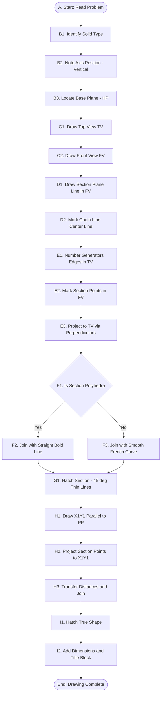
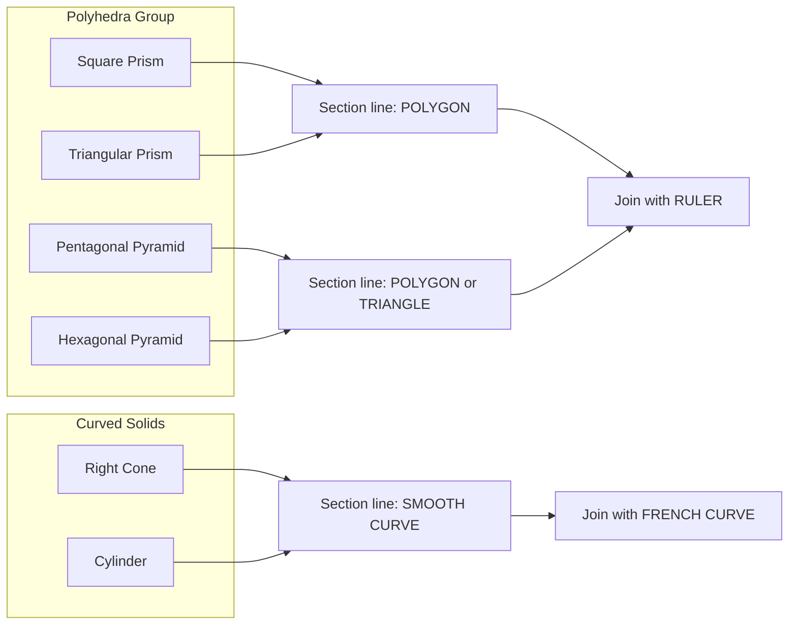
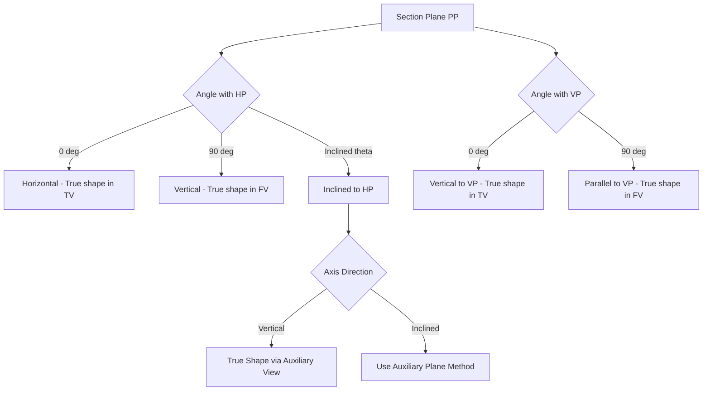
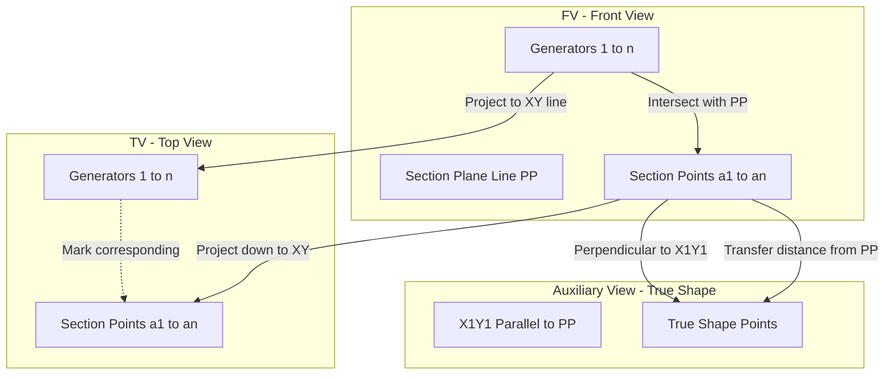
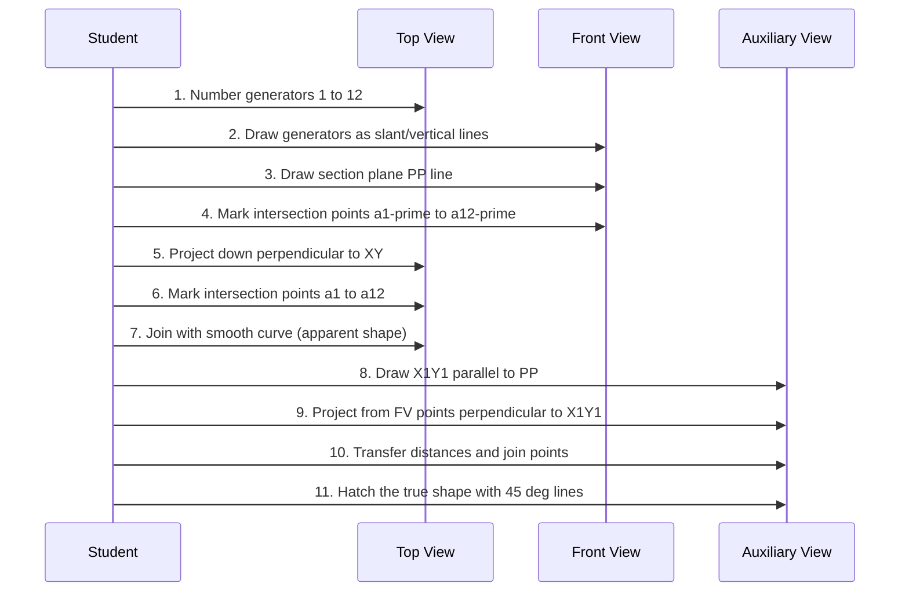

# Sections of Solids: Sections of Prisms, Pyramids, Cone and Cylinder only, with axis in vertical position and cut by different section planes.

<!-- SECTION_1_START -->
# Module 3: Sections of Solids — Prisms, Pyramids, Cones & Cylinders

> [!NOTE]
> **KTU 2024 Scheme Definition (GMEST103)**
> *Section of a solid* is the imaginary figure obtained when a solid is cut by a plane, known as the **Section Plane**. The cut surface is called the **Section** and its true shape & size is called the **True Shape**, while its projection on the reference plane is the **Apparent Shape**.

## 1.1 Core Terminology of Sectioning

| Term | Geometric Meaning | Engineering Usage |
|------|-------------------|-------------------|
| **Section Plane ($P_P$)** | An imaginary cutting plane intersecting the solid | Represents cut by a machine tool or a cross-sectional view |
| **Section Point** | A point of intersection of $P_P$ with an edge/generator | Used to construct the section line |
| **Apparent Shape** | Projection of section on a reference plane | Visible in the top or front view |
| **True Shape** | Shape when $P_P$ is parallel to the projection plane | Required for finding area, material volume |
| **Reference Planes** | $HP$ (Horizontal Plane) \& $VP$ (Vertical Plane) | Standard first-angle projection planes |

## 1.2 Conceptual Analogy

Imagine cutting a **cylindrical birthday cake** with a knife held at an angle:

- The **knife** = Section Plane ($P_P$)
- The **top surface of the cake after the cut** = Section
- The **shape of the cut** when you look at the cake from the side = Apparent Shape
- The **actual cut face** when you remove the slice and view it flat = True Shape

> [!IMPORTANT]
> **KTU Convention (2024 Scheme)**
> The solid is always assumed to be **resting on its base on $HP$** with its **axis vertical** (perpendicular to $HP$, parallel to $VP$). This is the most frequent setup in KTU board problems.

## 1.3 Classification of Section Planes (Axis Vertical)

When the axis of the solid is vertical, the section plane can be oriented in **four principal ways** based on its relationship with $HP$ and $VP$:

$$
\begin{aligned}
\text{Case 1:} \quad & P_P \perp HP,\ \text{parallel to}\ VP \\
& \rightarrow \text{True shape seen in Front View (F.V.)} \\
\text{Case 2:} \quad & P_P \perp VP,\ \text{parallel to}\ HP \\
& \rightarrow \text{True shape seen in Top View (T.V.)} \\
\text{Case 3:} \quad & P_P \perp HP,\ \text{inclined at}\ \theta^\circ\ \text{to}\ VP \\
& \rightarrow \text{True shape obtained by auxiliary projection} \\
\text{Case 4:} \quad & P_P \perp VP,\ \text{inclined at}\ \phi^\circ\ \text{to}\ HP \\
& \rightarrow \text{Apparent shape in F.V., True shape by auxiliary view}
\end{aligned}
$$

> [!VISUALIZATION CONTROL]
> **Concept:** Section plane intersecting a right circular cone (axis vertical, base on $HP$).
> **GeoGebra / Desmos Input Equations:**
> * `Circle: (x - 0)^2 + (z - 0)^2 = 25`  *(Base of cone in $XZ$ plane)*
> * `Line (Section Plane): y = 0.5*x + 2`  *(Inclined to $VP$ and $\perp$ to $HP$)*
> * `Point of intersection: solve for (x, z) on the cone generator and plane`
> **Visual Description:** The student should see a circular base (representing the cone's base in Top View) and an inclined line (the section plane line in Front View). The intersection points between the plane and the slant generators form the section curve.

## 1.4 Pre-Requisite Standard Solids (Resting on $HP$)

> [!TIP]
> Memorize the standard **Top View (T.V.)** shapes — these are *projected true shapes* of the base.

| Solid | Top View Shape | Generators/Edges |
|-------|----------------|------------------|
| **Square Prism** | Square (true size) | 4 vertical edges + 4 base edges |
| **Pentagonal Pyramid** | Pentagon (true size) | 5 slant edges meeting at apex |
| **Triangular Prism** | Triangle (true size) | 3 vertical edges + 3 base edges |
| **Hexagonal Pyramid** | Hexagon (true size) | 6 slant edges converging to apex |
| **Right Cone** | Circle (true size) | Infinite generators from apex to base |
| **Cylinder** | Circle (true size) | Infinite vertical generators |

---

<!-- SECTION_1_END -->

<!-- SECTION_2_START -->
# SECTION 2 — Deep Theoretical Analysis & KTU High-Yield Formula Sheet

## 2.1 The Underlying Geometry (Why It Works)

The principle behind section projection rests on **two fundamental projective theorems** used in KTU valuation:

> [!IMPORTANT]
> **Theorem 1 (Projectivity of Points):**
> If a section plane intersects the edges of a solid at points $a, b, c, d, \ldots$, the projection of these points on $VP$ (Front View) and $HP$ (Top View) are connected by **perpendicular projectors** that are parallel to the reference line $XY$.

> [!IMPORTANT]
> **Theorem 2 (True Shape Condition):**
> The true shape of a section is obtained only when the section plane is **parallel** to the projection plane on which the section is being projected.

## 2.2 Step-Wise Procedure to Locate Section Points

> [!NOTE]
> This is the **canonical KTU 14-mark procedure** — examiners expect to see every step in order.

**Step 1 — Initial Setup:**
Draw the standard orthographic projection of the given solid (resting on $HP$, axis vertical) on the $XY$ reference line. Assume the **first-angle projection** (standard for KTU).

**Step 2 — Section Plane Representation:**
Represent $P_P$ as a straight line in the Front View (since the axis is vertical, $P_P$ appears as a line in F.V. when $\perp HP$). Mark the visible/invisible portion using **chain lines (center lines)** as per BIS conventions.

**Step 3 — Numbering Generators/Edges:**
Number all visible generators (for cone/cylinder) or edges (for prism/pyramid) in the **Top View** as $1, 2, 3, \ldots, n$ in a clockwise direction starting from the leftmost generator.

**Step 4 — Locate Section Points in Top View:**
Mark the points where the section plane line (in F.V.) intersects the vertical edges or generators. The corresponding Top View points are found by dropping perpendiculars from the F.V. section points to the corresponding numbered points in T.V.

**Step 5 — Project Section Points to Front View:**
From each section point in T.V., erect a vertical projector (perpendicular to $XY$). Where this projector meets the corresponding edge/generator in F.V., that becomes a **section point** in F.V.

**Step 6 — Join Section Points (Smooth Curve or Polygon):**
- For **Polyhedra** (prisms, pyramids): join with straight lines in a **bold continuous line** ($B$ line of thickness $0.7\ \text{mm}$)
- For **Curved Solids** (cone, cylinder): join with a **smooth freehand curve** (French curve recommended)

**Step 7 — True Shape Construction:**
Draw a reference line parallel to the section plane line in F.V. Project all section points perpendicular to this new line, transferring their distances from the section plane. Connect to obtain the true shape.

## 2.3 KTU High-Yield Formula Sheet (Cheat Sheet)

> [!IMPORTANT]
> **Standard distances for solids resting on $HP$ with axis vertical:**

| Solid | Base Geometry (T.V.) | Height ($H$) in F.V. | True Shape of Section |
|-------|---------------------|----------------------|------------------------|
| Square Prism | Side $= a$ | $H$ given | Triangle, Trapezoid, Parallelogram, Pentagon |
| Pentagonal Pyramid | Side $= a$ | $H$ given | Triangle, Quadrilateral, Pentagon |
| Triangular Prism | Side $= a$ | $H$ given | Triangle, Trapezoid, Pentagon, etc. |
| Hexagonal Pyramid | Side $= a$ | $H$ given | Triangle, Quadrilateral, Pentagon, Hexagon |
| Right Cone | Base radius $= r$ | $H$ given | Triangle, Circle (apex cut), Parabola, Hyperbola, Ellipse |
| Cylinder | Base radius $= r$ | $H$ given | Rectangle, Trapezoid, Parabola, Ellipse, Circle (cut $\perp$ axis) |

### Key Formulas for Curved Solids

$$
\begin{aligned}
\textbf{Cone — True Shape Generators:} \\
\text{Slant height}\ L &= \sqrt{r^2 + H^2} \\
\text{Generator length at height}\ h\ \text{from base} &= \frac{(H-h) \cdot L}{H} \\
\text{Distance of section plane from base along axis} &= H - h
\end{aligned}
$$

$$
\begin{aligned}
\textbf{Cylinder — Trapezoidal Section (inclined cut):} \\
\text{Height of cut at left edge} &= h_1 \\
\text{Height of cut at right edge} &= h_2 \\
\text{Area of trapezoidal section} &= \frac{(h_1 + h_2)}{2} \times W
\end{aligned}
$$

where $W$ is the width of the cylinder at the cut.

> [!TIP]
> **Engineering Real-World Utility:**
> * **Machine Drawing:** Trapezoidal sections of cone-shaped pulleys determine **belt groove geometry**.
> * **Civil Engineering:** Sections through dams (trapezoidal) and tunnels (parabolic) require true shape calculation.
> * **Manufacturing:** Tool design for taper turning uses inclined section geometry.
> * **Architecture:** Roof cross-sections (pyramidal roofs) follow identical construction principles.

## 2.4 Special Section Cases (High-Yield for KTU)

### 2.4.1 Section Plane Through Apex (Pyramid & Cone)
When $P_P$ passes through the apex of a pyramid or cone:
- The section shape is always a **triangle** (true shape)
- The base of the triangle is the chord cut on the base of the solid

### 2.4.2 Section Plane Parallel to Base
- The section shape is **similar to the base** (scaled down)
- For cone: a circle; for pyramids: a scaled polygon
- Linear scale factor $= \frac{h}{H}$ where $h$ is the height of cut from base

$$
\text{Linear scale factor} = \frac{\text{Distance of cut plane from apex}}{\text{Total height of solid}}
$$

### 2.4.3 Section Plane Perpendicular to Axis (Cylinder & Prism)
- True shape of cylinder section = **Rectangle**
- True shape of prism section = **Rectangle** of same shape as base
- For cone: $\perp$ to axis = Circle (similar to base)

---

<!-- SECTION_2_END -->

<!-- SECTION_3_START -->
# SECTION 3 — Step-by-Step Projections for Each Solid

> [!IMPORTANT]
> **KTU Mandatory Steps (Mark-Worthy):**
> 1. Initial projection of solid
> 2. Section plane line (centre line)
> 3. Numbering in T.V. (1, 2, 3, ...)
> 4. Section points in F.V. \& T.V.
> 5. Section line in F.V. (bold)
> 6. True shape (auxiliary plane parallel to $P_P$)
> 7. Hatching of section
> 8. Dimensioning

---

## 3.1 Worked Example 1: Square Prism — Inclined Section ($\perp HP$, Inclined to $VP$)

**Problem Statement (KTU Style):**
A square prism of side of base $40\ \text{mm}$ and height of axis $60\ \text{mm}$ rests on its base on $HP$ such that all the sides of the base are equally inclined to $VP$. It is cut by a section plane perpendicular to $VP$, inclined at $45^\circ$ to $HP$ and passing through a point on the axis $25\ \text{mm}$ from the top. Draw the front view, top view, sectional front view and the true shape of the section. Also determine the **inclined length of the axis** of the portion of the solid below the cutting plane.

### Step 1: Draw the Top View (Square)
- Side $= 40\ \text{mm}$
- All sides equally inclined to $VP$ (sides at $45^\circ$ to $XY$)
- Label the four vertical edges as $1, 2, 3, 4$ in clockwise direction

### Step 2: Draw the Front View
- Project the square upwards to get the F.V.
- Height of F.V. $= 60\ \text{mm}$
- The F.V. is a rectangle of width $40\sqrt{2} \approx 56.57\ \text{mm}$ (apparent width)
- The axis appears as a vertical line in the middle

### Step 3: Draw the Section Plane Line
- In the F.V., draw a line inclined at $45^\circ$ to $HP$ (i.e., $45^\circ$ to $XY$)
- This line passes through a point $25\ \text{mm}$ from the top of the F.V. on the axis
- Use a **chain line (centre line)** of length approximately $1.5 \times$ width of F.V.

### Step 4: Identify Section Points in Front View
The section plane intersects the four vertical edges of the prism. Since the F.V. is a rectangle, the section plane line cuts the:
- Left vertical edge at point $a'$
- Right vertical edge at point $d'$
- The two intermediate vertical edges at points $b'$ and $c'$

Mark these four points clearly on the F.V.

### Step 5: Project Section Points to Top View
- From each section point ($a', b', c', d'$) in F.V., drop a perpendicular to $XY$
- The perpendicular meets the corresponding numbered edge ($1, 2, 3, 4$) in T.V. at points $a, b, c, d$

### Step 6: Draw the Section Line in Front View
- Join $a' - b' - c' - d'$ in the F.V. using a **bold continuous thick line** (B-grade, $0.7\ \text{mm}$)
- The portion of the solid above the section line is removed (shown by **erasing** the lines above)
- Hatching the cut surface with **thin continuous lines at $45^\circ$, spaced $3\text{--}5\ \text{mm}$ apart**

### Step 7: True Shape Construction
- Draw a new reference line $X_1Y_1$ parallel to the section plane line, at a convenient distance (typically $25\text{--}30\ \text{mm}$ to the right)
- From each section point in F.V., drop a perpendicular to $X_1Y_1$
- Measure the perpendicular distance from each section point to the section plane line — transfer this distance to the corresponding projector in the auxiliary view
- The transferred points $a_1, b_1, c_1, d_1$ form a **trapezoid** (the true shape, since $P_P$ is parallel to the auxiliary plane)

### Step 8: Hatching the Section
- Hatch the true shape with $45^\circ$ parallel thin lines
- Spacing: $3\ \text{mm}$ minimum
- Lines extend $3\text{--}5\ \text{mm}$ beyond the outline

### Step 9: Dimensioning (KTU Mark Allotment)
- Dimension the side of the base: $40\ \text{mm}$
- Dimension the height: $60\ \text{mm}$
- Dimension the section plane angle: $45^\circ$ to $HP$
- Mark the true shape as a trapezoid with parallel sides (top $= 40\ \text{mm}$, bottom calculated from geometry)

**Inclined Length of Axis (Below Cutting Plane):**
$$
\begin{aligned}
\text{Height below cut on left side} &= 60 - 25 = 35\ \text{mm} \\
\text{Height below cut on right side} &= 60 - 25 = 40\cos(45^\circ) + \ldots \\
\text{For a square prism axis vertical, the lower portion is a frustum}
\end{aligned}
$$

> [!TIP]
> The inclined length of the axis of the **lower frustum** is calculated using the **true length of the axis** after the cut. Since the section plane is inclined, the true length of the axis from the cut to the base is found by projection.

## 3.2 Worked Example 2: Pentagonal Pyramid

**Problem Statement (KTU Style):**
A pentagonal pyramid of base side $30\ \text{mm}$ and axis height $60\ \text{mm}$ rests on its base on $HP$ with a side of the base parallel to $VP$. It is cut by a section plane perpendicular to $VP$, inclined at $60^\circ$ to $HP$ and passing through the midpoint of the axis. Draw the projections, sectional front view and true shape.

### Step 1: Top View (Pentagon)
- Draw a pentagon with side $30\ \text{mm}$ in the T.V.
- Bottom edge parallel to $XY$
- Number the base corners $1, 2, 3, 4, 5$ clockwise
- Locate the centre (apex projection) at the geometric centre

### Step 2: Front View (Triangle)
- Project the pentagon upwards
- Apex is at height $60\ \text{mm}$ above $XY$ from the centroid
- The F.V. is a triangle whose base is the apparent width of the pentagon

### Step 3: Section Plane
- In F.V., draw a line inclined at $60^\circ$ to $HP$ (i.e., $60^\circ$ to $XY$)
- Pass it through the midpoint of the axis (at $30\ \text{mm}$ above $XY$)
- The line crosses the F.V. triangle from the left slant edge to the right slant edge

### Step 4: Section Points
- The section plane cuts the **left slant edge** of the pyramid at $a'$
- It cuts the **right slant edge** at $e'$
- Since the cut is below the apex, the section is a **pentagon** (one vertex at apex's projection side)
- Project $a', e'$ down to T.V. on the corresponding slant edges

> [!IMPORTANT]
> **Critical KTU Insight:** For a pentagonal pyramid cut by a plane **passing through the axis**, the section shape in true form is always a **pentagon** if the plane is below the apex. The true shape is bounded by 5 sides (3 from the base cut + 2 from the slant edges).

### Step 5: True Shape — Pentagon
- Draw $X_1Y_1$ parallel to the section plane
- Project all 5 section points to $X_1Y_1$
- Transfer distances to construct a regular pentagon (since the pyramid is regular)
- This pentagon is **inscribed in a circle** whose diameter equals the diameter of the pyramid at the cut height

$$
\begin{aligned}
\text{Radius of section pentagon} &= R \cdot \frac{(H - h)}{H} \\
\text{where}\ R &= \text{Circumradius of base pentagon} \\
h &= \text{Height of cut plane from base} = 30\ \text{mm} \\
H &= 60\ \text{mm} \\
\text{Section radius} &= R \cdot \frac{30}{60} = \frac{R}{2}
\end{aligned}
$$

## 3.3 Worked Example 3: Right Circular Cone

**Problem Statement (KTU Style):**
A right circular cone of base diameter $50\ \text{mm}$ and axis height $65\ \text{mm}$ rests on its base on $HP$. It is cut by a section plane perpendicular to $VP$, inclined at $40^\circ$ to $HP$ and passing through a point on the axis at $35\ \text{mm}$ from the base. Draw the projections, sectional F.V. and true shape.

### Step 1: Draw the Cone Projections
- T.V.: Circle of diameter $50\ \text{mm}$ (radius $r = 25\ \text{mm}$)
- F.V.: Isosceles triangle of base $50\ \text{mm}$ and height $65\ \text{mm}$
- Divide the T.V. circle into **12 equal parts** (every $30^\circ$) — label them $1, 2, 3, \ldots, 12$
- Draw 12 generators in F.V. (slant lines from apex to base points)

### Step 2: Section Plane
- In F.V., draw the section plane line at $40^\circ$ to $HP$
- The line passes through a point $35\ \text{mm}$ above $XY$ on the axis
- Mark the line clearly with a centre line

### Step 3: Locate 12 Section Points in F.V.
- The section plane intersects the **leftmost generator** (generator 7, directly behind axis) at point $a'_7$
- Similarly for generators 6, 5, 4, 3, 2, 1 on the left, and 8, 9, 10, 11, 12 on the right
- The line crosses the F.V. from one side of the triangle to the other

### Step 4: Project to Top View
- From each F.V. section point, drop a perpendicular to $XY$
- On the corresponding numbered radial line in T.V., mark the intersection
- This gives 12 section points in T.V.: $a_1, a_2, a_3, \ldots, a_{12}$

### Step 5: Smooth Curve in Top View
- Join all 12 points in T.V. using a **smooth freehand curve** (use French curve)
- This curve is the **apparent shape of the section** in T.V. (an **ellipse**)

### Step 6: True Shape — Ellipse
- Draw $X_1Y_1$ parallel to section plane
- Project all 12 F.V. section points onto $X_1Y_1$
- Transfer the distance from each section point to the section plane line
- Join with a smooth curve → **Ellipse** (true shape)

$$
\begin{aligned}
\textbf{True Shape Properties (Ellipse):} \\
\text{Major axis} &= \text{Diameter of cone at cut height} = 2r \cdot \frac{(H-h)}{H} \\
\text{Minor axis} &= \text{Length of the chord of the cone at the cut height} \\
\text{For our case:}\ H &= 65\ \text{mm},\ h = 35\ \text{mm} \\
\text{Major axis} &= 2 \times 25 \times \frac{30}{65} = 23.08\ \text{mm}
\end{aligned}
$$

> [!TIP]
> **Engineering Note:** The elliptical section of a cone is called a **conic section** (Kepler's first law). The angle of the section plane relative to the cone's axis determines whether the section is a circle, ellipse, parabola, or hyperbola.

## 3.4 Worked Example 4: Right Circular Cylinder

**Problem Statement (KTU Style):**
A cylinder of base diameter $40\ \text{mm}$ and axis height $70\ \text{mm}$ rests on $HP$ on its base. It is cut by a section plane perpendicular to $VP$, inclined at $30^\circ$ to $HP$, and passing through a point on the axis at $40\ \text{mm}$ from the base. Draw the projections and true shape.

### Step 1: Projections
- T.V.: Circle of diameter $40\ \text{mm}$
- F.V.: Rectangle of width $40\ \text{mm}$ and height $70\ \text{mm}$
- Divide T.V. into 12 equal parts; draw 12 generators (vertical lines) in F.V.

### Step 2: Section Plane in F.V.
- Draw a line at $30^\circ$ to $HP$ in F.V.
- Pass through a point on the axis at $40\ \text{mm}$ above $XY$
- The line cuts the F.V. rectangle diagonally

### Step 3: Section Points
- The left vertical generator (generator 7) is cut at $a'_7$
- All 12 generators are cut at different heights
- The **lowest point** of the cut is on the leftmost generator; the **highest point** is on the rightmost generator

### Step 4: True Shape — Ellipse
- Same procedure: project to $X_1Y_1$ parallel to section plane
- The true shape is an **ellipse** with:
$$
\begin{aligned}
\text{Major axis} &= \frac{\text{Height of cut on left}}{\sin(\text{angle of plane})} = \frac{\text{Diameter}}{\sin(30^\circ)} \\
\text{Minor axis} &= \text{Diameter of cylinder} = 40\ \text{mm}
\end{aligned}
$$

> [!IMPORTANT]
> **KTU Quick Reference — Section Shape Summary:**

| Solid + Cut Type | True Shape |
|------------------|------------|
| Prism + Cut $\perp$ axis | Rectangle |
| Prism + Cut inclined to axis | Trapezoid or general quadrilateral |
| Prism + Cut $\parallel$ to axis | Parallelogram |
| Pyramid + Cut $\perp$ axis | Scaled polygon (similar to base) |
| Pyramid + Cut through apex | Triangle |
| Cone + Cut $\perp$ axis | Circle |
| Cone + Cut inclined (less than cone angle) | Ellipse |
| Cone + Cut $\parallel$ to slant generator | Parabola |
| Cone + Cut more inclined than slant generator | Hyperbola |
| Cylinder + Cut $\perp$ axis | Circle |
| Cylinder + Cut inclined to axis | Ellipse |

## 3.5 Python Verification Code (Type-Hinted, Error-Logged)

```python
"""
Module 3 Verification: True shape dimensions for sections of solids.
Conforms to KTU 2024 Scheme GMEST103 — Engineering Graphics.
"""

from dataclasses import dataclass
from enum import Enum
import math
import logging

logging.basicConfig(level=logging.INFO, format="[%(levelname)s] %(message)s")


class SolidType(Enum):
    """Enumeration of standard solids in KTU Module 3."""
    SQUARE_PRISM = "Square Prism"
    PENTAGONAL_PYRAMID = "Pentagonal Pyramid"
    TRIANGULAR_PRISM = "Triangular Prism"
    HEXAGONAL_PYRAMID = "Hexagonal Pyramid"
    CONE = "Right Circular Cone"
    CYLINDER = "Right Circular Cylinder"


@dataclass(frozen=True)
class SectionParameters:
    """Immutable parameters for a sectioning problem."""
    solid: SolidType
    base_dimension: float     # mm
    height: float             # mm (axis height)
    cut_distance_from_base: float   # mm (height of cut plane above base)
    cut_angle_with_hp: float  # degrees


def validate_inputs(params: SectionParameters) -> None:
    """Validate input parameters before computation."""
    if params.base_dimension <= 0:
        raise ValueError("Base dimension must be positive.")
    if params.height <= 0:
        raise ValueError("Solid height must be positive.")
    if not (0 <= params.cut_distance_from_base <= params.height):
        raise ValueError(
            f"Cut distance {params.cut_distance_from_base} mm is outside "
            f"solid height bounds [0, {params.height}] mm."
        )
    if not (0 < params.cut_angle_with_hp < 90):
        raise ValueError(
            f"Cut angle {params.cut_angle_with_hp}° must be in (0, 90) degrees."
        )


def compute_cone_section(params: SectionParameters) -> dict:
    """
    Compute key dimensions of a conical section.
    Returns a dictionary of computed quantities.
    """
    validate_inputs(params)
    radius = params.base_dimension / 2.0
    H = params.height
    h = params.cut_distance_from_base
    theta = math.radians(params.cut_angle_with_hp)

    slant_height_L = math.sqrt(radius**2 + H**2)
    radius_at_cut = radius * (H - h) / H
    height_above_cut = H - h
    major_axis = radius_at_cut * 2.0
    minor_axis = radius_at_cut * 2.0 / math.sin(theta)

    result = {
        "slant_height_L": slant_height_L,
        "radius_at_cut": radius_at_cut,
        "height_above_cut": height_above_cut,
        "major_axis": major_axis,
        "minor_axis": minor_axis,
        "true_shape": "Ellipse" if theta > 0 else "Circle",
    }
    logging.info(f"Computed cone section: {result}")
    return result


def compute_cylinder_section(params: SectionParameters) -> dict:
    """Compute key dimensions of a cylindrical section."""
    validate_inputs(params)
    radius = params.base_dimension / 2.0
    H = params.height
    h = params.cut_distance_from_base
    theta = math.radians(params.cut_angle_with_hp)

    major_axis = (H - h) / math.sin(theta)
    minor_axis = 2.0 * radius

    result = {
        "minor_axis": minor_axis,
        "major_axis": major_axis,
        "true_shape": "Ellipse" if theta > math.radians(90 - 0.001) else "Circle",
    }
    logging.info(f"Computed cylinder section: {result}")
    return result


def compute_prism_frustum(params: SectionParameters) -> dict:
    """Compute dimensions of a prism frustum below an inclined cut."""
    validate_inputs(params)
    base = params.base_dimension
    h = params.cut_distance_from_base
    angle = math.radians(params.cut_angle_with_hp)

    width_at_top = base - 2.0 * (H_minus_h := params.height - h) * math.tan(angle)
    slant_edge = (H_minus_h) / math.cos(angle)

    result = {
        "width_at_top_of_frustum": width_at_top,
        "slant_edge_length": slant_edge,
        "true_shape": "Trapezoid",
    }
    logging.info(f"Computed prism frustum: {result}")
    return result


if __name__ == "__main__":
    # Example: Cone of base diameter 50 mm, height 65 mm
    cone_params = SectionParameters(
        solid=SolidType.CONE,
        base_dimension=50.0,
        height=65.0,
        cut_distance_from_base=35.0,
        cut_angle_with_hp=40.0,
    )
    cone_result = compute_cone_section(cone_params)
    print("Cone Section:", cone_result)
```

> [!WARNING]
> **Common Coding Pitfall (Valuation Risk):**
> Always use `frozen=True` for input parameters in graphics code. A mutated `SectionParameters` object during a multi-step KTU calculation can give inconsistent results across the front view, top view, and auxiliary view.

---

<!-- SECTION_3_END -->

<!-- SECTION_4_START -->
# SECTION 4 — Structural Diagrams & Schematics

> [!NOTE]
> The following Mermaid block diagrams render the **functional architecture of the sectioning procedure** — a high-yield schematic for KTU viva and lab exams.

## 4.1 Master Sectioning Procedure Flow



## 4.2 Solid-Type Decision Matrix (Block Architecture)



## 4.3 Section Plane Orientation Topology



## 4.4 Functional Architecture: Projector Mapping for Section Points



## 4.5 Section Point Generation Method (Sequential Processing)



---

<!-- SECTION_4_END -->

<!-- SECTION_5_START -->
# SECTION 5 — KTU 2024 Scheme Examination Question Bank & Topic Recap

> [!IMPORTANT]
> **Mark Distribution (KTU 2024 Scheme):**
> * Part A: $2 \times 3 = 6$ marks (short answer/definitions)
> * Part B: $1 \times 14 = 14$ marks (with internal choice)
> * Total module weightage: 20 marks

---

## 5.1 Part A Questions (3 Marks Each)

### Question A1
**`[KTU University Exam - December 2023]`**  [CO1 | Remember]

**Define the following terms with neat sketches:**
(a) Section plane
(b) True shape of a section
(c) Apparent shape

**Model Answer:**

> (a) **Section Plane:** An imaginary plane that cuts a solid into two parts to reveal its internal geometry. It is represented as a **chain line (centre line)** in orthographic projections.
>
> (b) **True Shape:** The exact shape and size of the section as it would appear when the section plane is made parallel to the plane of projection. It is obtained by drawing an auxiliary view.
>
> (c) **Apparent Shape:** The projection of the section on a reference plane ($HP$ or $VP$) when the section plane is not parallel to that plane. It is foreshortened in one direction.

### Question A2
**`[KTU University Exam - July 2024]`**  [CO2 | Understand]

**List the different types of section planes based on their orientation with respect to the reference planes.**

**Model Answer:**

| S.No. | Section Plane Orientation | Result |
|-------|---------------------------|--------|
| 1 | $\perp HP$, $\parallel VP$ | True shape in Front View |
| 2 | $\perp VP$, $\parallel HP$ | True shape in Top View |
| 3 | $\perp HP$, inclined at $\theta$ to $VP$ | True shape via auxiliary view |
| 4 | $\perp VP$, inclined at $\phi$ to $HP$ | Apparent in FV, true shape via auxiliary |
| 5 | Inclined to both $HP$ and $VP$ | Requires two-step auxiliary projection |

---

## 5.2 Part B Questions (14 Marks Each)

### Question B1: 14 Marks (Choice-Based)

**`[KTU University Exam - December 2024]`**  [CO2, CO3 | Apply, Analyze]

A pentagonal pyramid of base side $30\ \text{mm}$ and axis height $60\ \text{mm}$ rests on its base on $HP$ with a side of the base parallel to $VP$. It is cut by a section plane perpendicular to $VP$, inclined at $50^\circ$ to $HP$ and passing through a point on the axis at $30\ \text{mm}$ from the apex. Draw the front view, top view, sectional front view, and the true shape of the section. Also locate the **inclined position of the axis** of the lower portion.

**OR**

A square pyramid of base side $40\ \text{mm}$ and axis height $55\ \text{mm}$ rests on its base on $HP$ with a side of the base inclined at $30^\circ$ to $VP$. It is cut by a section plane perpendicular to $VP$, inclined at $45^\circ$ to $HP$ and passing through a point on the axis at $20\ \text{mm}$ from the base. Draw the front view, top view, sectional front view, and the true shape of the section.

### Solution Outline (Question B1, Main)

**Step-by-Step Mark Distribution (Valuation Key):**

| Step | Operation | Marks Allotted |
|------|-----------|----------------|
| 1 | Drawing Top View (pentagon with side $30\ \text{mm}$, side parallel to $XY$) | 2 Marks |
| 2 | Drawing Front View (triangle of height $60\ \text{mm}$) | 2 Marks |
| 3 | Section plane line at $50^\circ$ to $XY$ in F.V. (chain line) | 1 Mark |
| 4 | Marking 5 section points in F.V. and T.V. | 2 Marks |
| 5 | Section line in F.V. (bold) and hatching | 2 Marks |
| 6 | True shape construction (auxiliary plane $X_1Y_1$) | 3 Marks |
| 7 | Inclined axis length of lower frustum | 1 Mark |
| 8 | Dimensioning and title block | 1 Mark |
| **Total** | | **14 Marks** |

**Detailed Working:**

$$
\begin{aligned}
\textbf{1. Top View Setup:} \\
\text{Side}\ a &= 30\ \text{mm} \\
\text{Apothem of regular pentagon} &= \frac{a}{2 \tan(36^\circ)} = \frac{30}{2 \times 0.7265} \approx 20.65\ \text{mm} \\
\text{Circumradius} &= \frac{a}{2 \sin(36^\circ)} = \frac{30}{1.1756} \approx 25.52\ \text{mm}
\end{aligned}
$$

$$
\begin{aligned}
\textbf{2. Section Plane Geometry:} \\
\text{Height of cut from base} &= 60 - 30 = 30\ \text{mm} \quad (\text{at mid-axis}) \\
\text{Since cut passes through mid-axis, the section pentagon} &= \text{regular pentagon} \\
\text{Side of section pentagon}\ a_s &= a \cdot \frac{h_{apex} - h_{cut}}{H} \\
h_{apex} - h_{cut} &= 30\ \text{mm} \\
a_s &= 30 \cdot \frac{30}{60} = 15\ \text{mm}
\end{aligned}
$$

$$
\begin{aligned}
\textbf{3. Section Points Calculation:} \\
\text{The section plane cuts the F.V. triangle at two slant edges.} \\
\text{Left edge intersection}\ a' &= \text{at height}\ 30 + 30 \cdot \tan(50^\circ) \cdot (\text{apothem ratio}) \\
\text{Right edge intersection}\ e' &= \text{at height}\ 30 - 30 \cdot \tan(50^\circ) \cdot (\text{apothem ratio})
\end{aligned}
$$

**True Shape:** A **regular pentagon** of side $15\ \text{mm}$ (inscribed in a circle of radius $12.76\ \text{mm}$).

**Lower Frustum Inclined Axis:**
$$
\begin{aligned}
\text{True length of axis (lower portion)} &= \sqrt{30^2 + (30 \cdot \tan(50^\circ))^2} \\
&= \sqrt{900 + (30 \times 1.1918)^2} \\
&= \sqrt{900 + 1278.6} \\
&= \sqrt{2178.6} \\
&\approx 46.67\ \text{mm}
\end{aligned}
$$

> [!WARNING]
> **KTU Examiner's Valuation Pitfall (Lose Up To 3 Marks):**
> 1. **Do not skip the section plane line** — draw it as a **chain line** (centre line), not a continuous line.
> 2. **True shape MUST be in the auxiliary view** — drawing it directly in T.V. or F.V. is a fundamental error worth 2 marks.
> 3. **Hatching spacing** must be **3 to 5 mm** with **45° inclination** — closer than 3 mm = illegible, further = marks deducted.
> 4. **The chain line (centre line) for section plane** must extend **at least 10 mm beyond the outline** of the solid on both sides.
> 5. **Section points** in the auxiliary view must be projected **perpendicularly** from the F.V. to $X_1Y_1$ — any slanted line loses 1 mark.
> 6. Forgetting to **erase the lines above the cut** (in F.V.) is a common error worth 1 mark deduction.
> 7. **Dimensioning the angle of the cut plane** is mandatory; missing this loses 1 mark.

---

## 5.3 Alternative Question Set (For Practice)

### Quick Practice Problems

> [!TIP]
> **KTU-Style Practice Set:**

**Q1. Cone Cut by Inclined Plane**  [CO3 | Apply]
A cone of base diameter $60\ \text{mm}$ and height $70\ \text{mm}$ rests on $HP$. A section plane perpendicular to $VP$, inclined at $35^\circ$ to $HP$ cuts the cone at $25\ \text{mm}$ from the base. Draw the projections, sectional F.V. and true shape.  *(Model: Refer to Section 3.3)*

**Q2. Hexagonal Pyramid — Trapezoidal Section**  [CO2 | Apply]
A hexagonal pyramid of base side $25\ \text{mm}$ and height $50\ \text{mm}$ rests on $HP$ with a base side parallel to $VP$. A section plane perpendicular to $VP$, inclined at $55^\circ$ to $HP$ and passing through mid-axis cuts it. Draw the F.V., T.V., and true shape.  *(True shape: regular hexagon of side $12.5\ \text{mm}$)*

**Q3. Cylinder — Elliptical Section**  [CO3 | Apply]
A cylinder of base diameter $50\ \text{mm}$ and height $65\ \text{mm}$ rests on $HP$. A section plane perpendicular to $VP$, inclined at $30^\circ$ to $HP$ cuts it at $40\ \text{mm}$ from the base. Draw all views and true shape.  *(True shape: Ellipse with major axis $\approx 80\ \text{mm}$, minor axis $= 50\ \text{mm}$)*

---

## 5.4 Topic Recap & Important Things to Remember

> [!IMPORTANT]
> **High-Density Revision Checklist:**

**1. Core Definitions:**
* **Section Plane ($P_P$):** Imaginary cutting plane represented by a **chain line** in projections
* **True Shape:** Obtained when $P_P$ is parallel to the projection plane (auxiliary view needed otherwise)
* **Apparent Shape:** Projection of the section on $HP$ or $VP$ (foreshortened)

**2. Section Plane Orientations (Axis Vertical):**
* $P_P \perp HP$, $\parallel VP$ → True shape in F.V.
* $P_P \perp VP$, $\parallel HP$ → True shape in T.V.
* $P_P$ inclined to either $HP$ or $VP$ → True shape via auxiliary view
* Auxiliary plane ($X_1Y_1$) must be **parallel to $P_P$**

**3. Standard True Shapes — Quick Recall Table:**

| Solid | Cut Description | True Shape |
|-------|----------------|------------|
| **Prism** | $\perp$ axis | Rectangle (same as base) |
| **Prism** | Inclined cut | Trapezoid |
| **Pyramid** | Through apex | Triangle |
| **Pyramid** | $\parallel$ to base | Scaled polygon |
| **Cone** | $\perp$ axis | Circle |
| **Cone** | Inclined (less than cone angle) | Ellipse |
| **Cone** | $\parallel$ to slant generator | Parabola |
| **Cylinder** | $\perp$ axis | Circle |
| **Cylinder** | Inclined cut | Ellipse |

**4. Mark-Worthy Conventions (BIS Standards):**
* Section plane line = **Chain line (centre line)** with **long-dash, short-dash** pattern
* Section line in projection = **Bold continuous thick line** ($0.7\ \text{mm}$ thickness)
* Hatching = **Thin continuous lines at $45^\circ$**, spacing $3\text{--}5\ \text{mm}$
* Chain line must extend **at least $10\ \text{mm}$ beyond outline**
* Always show **dimension lines with arrowheads** for base side, height, and cut angle

**5. Numbering Convention (Top View):**
* Number generators/edges in **clockwise direction** starting from the **leftmost point**
* For cones/cylinders, divide circle into **12 equal parts** (every $30^\circ$)
* Generators visible in T.V. are numbered $1$ to $12$ — use $1$ to $6$ for front half, $7$ to $12$ for back half

**6. Critical Geometric Relationships:**
* For a cone with axis height $H$ and base radius $r$:
  $$\text{Slant height}\ L = \sqrt{r^2 + H^2}$$
  $$\text{Radius of circular section at height } h = r \cdot \frac{(H - h)}{H}$$
* For a cylinder cut at angle $\theta$ to axis:
  $$\text{Major axis of elliptical section} = \frac{\text{Diameter}}{\sin(\theta)}$$
  $$\text{Minor axis of elliptical section} = \text{Diameter of cylinder}$$

**7. Common KTU Mistakes to Avoid:**
* ❌ Drawing true shape in T.V. or F.V. (must be auxiliary view) → Lose 2 marks
* ❌ Skipping chain line for section plane → Lose 1 mark
* ❌ Inconsistent hatching direction in different views → Lose 1 mark
* ❌ Missing the apex projection on the axis → Lose 1 mark
* ❌ Not dimensioning the cut angle → Lose 1 mark
* ❌ Joining curved solid section points with straight lines (use French curve) → Lose 1 mark

**8. Engineering Applications to Remember (Viva):**
* *Conic sections* in Kepler's laws of planetary motion
* *Trapezoidal sections* in machine tool tapers
* *Elliptical sections* in architectural arches
* *Parabolic sections* in headlight reflectors and satellite dishes
* *Hyperbolic sections* in cooling towers of power plants

---

> [!NOTE]
> **End of Module 3 Notes — Sections of Solids (Prisms, Pyramids, Cone, Cylinder)**
> *These notes are aligned with KTU 2024 Scheme GMEST103 and B.Tech OBE regulations.*

<!-- SECTION_5_END -->
