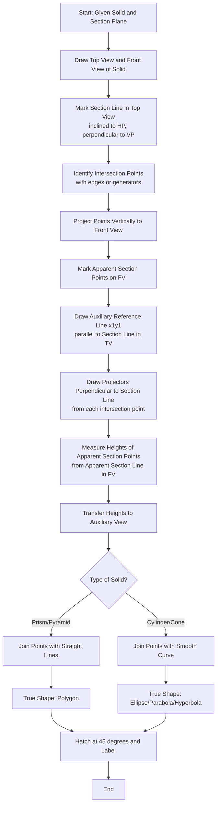
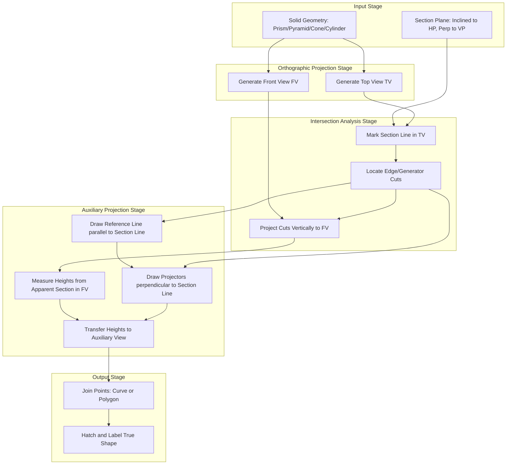
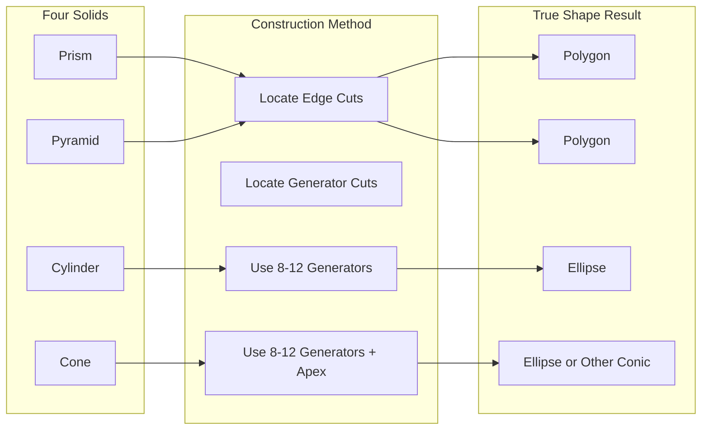
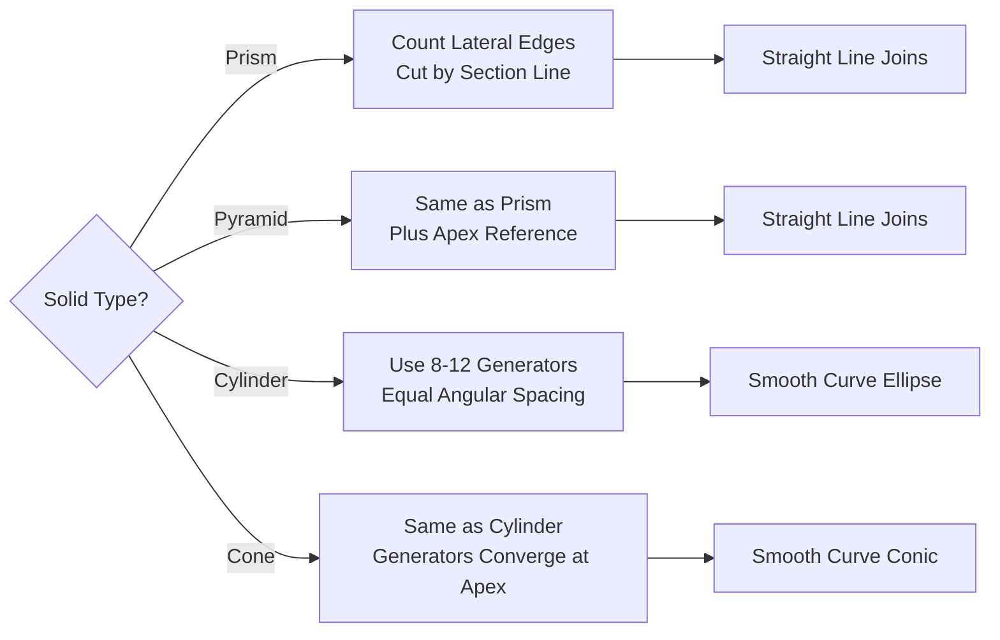
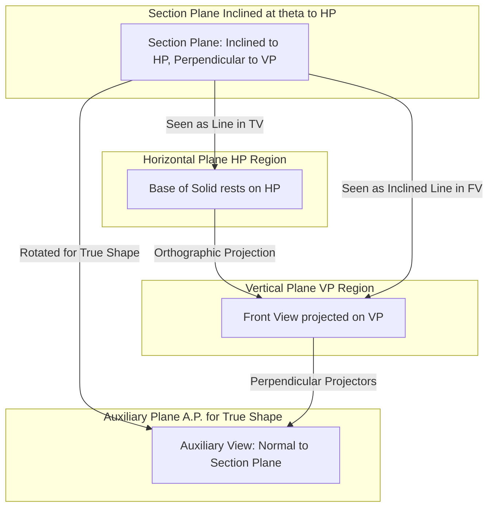

# True shape of the sections. (Exclude true shape given problems)

<!-- SECTION_1_START -->

# True Shape of Sections — Core Technical Definition & Intuitive Overview

## 1.1 Formal KTU-Syllabus Definition

In **Engineering Graphics (GMEST103, Module 3)**, a solid — restricted to **prisms, pyramids, cones, and cylinders** — when intersected by a **section plane**, produces a planar cut. The figure seen on the **front view (elevation)** is only the **apparent section** (a foreshortened projection). The **True Shape (T.S.)** is the **actual size and shape of the cut surface**, obtained when the section plane is projected **parallel to itself** so that it appears as a plane surface in the new view.

> [!IMPORTANT]
> **True Shape (T.S.):** The shape and size of the sectioned surface of a solid when viewed in a direction **normal (perpendicular)** to the section plane. It is the actual area of cut — no foreshortening, no distortion.

The reference standard for this topic is the **First-Angle Projection** convention mandated by **Bureau of Indian Standards (BIS: SP-46)** and adopted by KTU.

---

## 1.2 Conceptual Analogy — "The Bread Loaf and the Wall"

Imagine slicing a **cylindrical bread loaf** with a knife held at an angle (not horizontal, not vertical — just tilted).

- If you stand in front of the loaf and look at it, the cut surface looks like a **tilted oval** (foreshortened).
- But the *actual* cut on the bread is a **perfect ellipse** of a specific size.

**The True Shape is the real cut surface** — to see it, you must rotate the loaf (or your eyes) so that you look **directly at the cut**, i.e., perpendicular to the section plane.

> [!NOTE]
> **Geometric Intuition:** A slanted photograph of a circle looks like an ellipse. The true shape is the circle itself — you obtain it by re-projecting at the correct angle. Same idea applies to the cut surface of a solid.

---

## 1.3 Key Terms and Reference Planes

| Term | Symbol | Meaning |
| :--- | :---: | :--- |
| Horizontal Plane | $HP$ | Plane of paper in Top View |
| Vertical Plane | $VP$ | Plane of paper in Front View |
| Profile Plane | $PP$ | Side / End view plane |
| Section Plane | — | The cutting plane intersecting the solid |
| Apparent Section | — | Section as seen in Front View (foreshortened) |
| True Shape | $T.S.$ | Section seen perpendicular to the cutting plane |
| Auxiliary Plane | $A.P.$ | Plane inclined at required angle to $HP$/$VP$ for $T.S.$ view |

> [!TIP]
> In KTU board exams, the section plane is **almost always inclined to HP** and **perpendicular to VP** — meaning the section line is seen in its true length in the Top View. The auxiliary plane is therefore **inclined to HP** and **perpendicular to VP**.

---

## 1.4 Visualization Control

> [!VISUALIZATION CONTROL]
> **Concept:** A right circular cylinder cut by an inclined plane — apparent section vs. true shape.
> **GeoGebra / Desmos Input Equations:**
> * Cylinder: $x^2 + y^2 = 25$, height range $0 \le z \le 10$
> * Section Plane: $z = 0.5\,x + 3$ (inclined, cuts through cylinder)
> * True Shape Curve: ellipse with semi-axes $a$ and $b$ lying in the cut plane
> **Visual Description:** On a 3D plot, the cut produces an **ellipse** when the plane is inclined. The "shadow" on the XY-plane appears as a **circle** (true base). The ellipse only becomes visible when we view along the plane's normal.

---

## 1.5 Why This Topic Matters in Engineering

- **Mechanical Engineering:** Designing **machine components with inclined faces** (e.g., bevels, chamfers, wedge-shaped couplings).
- **Civil Engineering:** Calculating the **cross-sectional area** of a dam, an inclined roof truss, or a tapered column.
- **Manufacturing:** Estimating **material removed** during milling or turning operations.
- **Architecture:** Computing **surface area of inclined roofs**, facades, and decorative trims.

---

<!-- SECTION_1_END -->

<!-- SECTION_2_START -->

# Deep Theoretical Analysis & KTU High-Yield Formula Sheet

## 2.1 Theoretical Foundation — Why Does Foreshortening Happen?

When a plane surface is **inclined** to the plane of projection, its projection is **smaller (foreshortened)** than the actual surface. The true shape can only be seen when:

$$\text{Line of Sight} \perp \text{Section Plane}$$

In KTU syllabus problems, the **section plane is perpendicular to VP** and **inclined to HP**. This means:

- In the **Top View (looking down)** $\Rightarrow$ the section plane appears as a **straight line** (its true length is seen because the plane is parallel to the $HP$).
- In the **Front View (looking from front)** $\Rightarrow$ the section plane is seen as a **line at true inclination** $\theta$ to $HP$.
- In the **Auxiliary View (looking along the section plane's normal)** $\Rightarrow$ the true shape is revealed.

> [!NOTE]
> **General Rule of Auxiliary Projection:** To obtain the true shape, project from the view in which the section plane appears as a **straight line** (here, the Top View), along projectors **perpendicular to the section line**.

---

## 2.2 Step-by-Step Logic Behind the Procedure

1. **Draw the standard orthographic views** (Front View and Top View) of the solid in its resting position.
2. **Mark the section line** in the view where it appears in true length (Top View, since the section plane is $\perp VP$).
3. **Identify intersection points** between the section line and the edges/sides of the solid in the Top View.
4. **Project these points upward** to the Front View to find the corresponding points on the apparent section.
5. **Draw projectors horizontally from the apparent section** points.
6. **Draw projectors perpendicular to the section line** in the Top View from each intersection point.
7. **Measure distances** of each point from the section line (these are the heights above/below the cut).
8. **Transfer these distances** along the perpendicular projectors in the auxiliary view.
9. **Join the points smoothly** to obtain the True Shape.

---

## 2.3 KTU High-Yield Formula Sheet & Cheat Sheet

### Table 2.1 — Section Shape vs. Solid Type

| Solid | Section Plane Position | Shape of True Section |
| :--- | :--- | :--- |
| **Cylinder** | $\perp$ to axis | Rectangle |
| **Cylinder** | Inclined to axis | **Ellipse** |
| **Cylinder** | Parallel to axis | Rectangle |
| **Cone** | $\perp$ to axis | Circle |
| **Cone** | Inclined to axis (cuts all generators) | **Ellipse** |
| **Cone** | Parallel to a generator | **Parabola** |
| **Cone** | Parallel to axis | **Hyperbola** |
| **Prism** | $\perp$ to axis (any orientation) | Polygon (same as base) |
| **Prism** | Inclined to axis | **Polygon** (modified) |
| **Pyramid** | Inclined to axis (cuts all lateral edges) | **Polygon** |

### Table 2.2 — Geometric Construction Parameters

| Parameter | Formula | Description |
| :--- | :--- | :--- |
| Semi-minor axis of ellipse (cylinder cut) | $b = R$ | Radius of cylinder base |
| Semi-major axis of ellipse (cylinder cut) | $a = \dfrac{R}{\sin\theta}$ | Where $\theta$ is angle of section plane with axis-perpendicular |
| Area of elliptical section (cylinder) | $A = \pi\,a\,b = \dfrac{\pi R^2}{\sin\theta}$ | True area of cut |
| Volume of frustum (cone) | $V = \dfrac{\pi h}{3}(R^2 + Rr + r^2)$ | $R, r$ — radii of two ends, $h$ — height |

> [!IMPORTANT]
> **Critical Note on Pipes:** `|` is replaced with `\vert` or `\mid` for safety. E.g., $\vert x \vert$ written as `\vert x \vert`.

### Table 2.3 — Standard Conventions in KTU Drawings

| Convention | Standard |
| :--- | :--- |
| Projection method | First Angle (BIS SP-46) |
| Section plane line type | **Thick chain line** with arrows showing viewing direction |
| Hatching (section lining) | $45°$ thin continuous lines, evenly spaced (~2 mm) |
| Hidden lines in T.S. | Generally **omitted** in T.S. (only visible boundary shown) |
| Labeling | T.S. written near the view; section marked $X\!-\!X$ |

---

## 2.4 Real-World Engineering Utility

| Field | Application of True Shape |
| :--- | :--- |
| **Sheet Metal Work** | Developing patterns for hoppers, chimneys, transition pieces |
| **Civil Structures** | Computing the inclined face area of an embankment, an oblique roof |
| **Aerospace** | Wing cross-sections, fuselage fairings, nozzle throats |
| **Boiler / Pressure Vessel Design** | Heads, end-caps, dished ends — true area determines thickness |
| **Tool Design** | Rake angle geometry of cutting tools, drill point angles |

---

<!-- SECTION_2_END -->

<!-- SECTION_3_START -->

# Step-by-Step Derivations & Symbolic Implementation

## 3.1 Master Algorithm — True Shape Construction (General Procedure)

The following exhaustive procedure is valid for **all four solids** (prism, pyramid, cone, cylinder) when the section plane is **inclined to HP and perpendicular to VP**.

### Step A — Initial Setup
1. Draw the **Top View (T.V.)** as a regular polygon (for prism/pyramid) or circle (for cone/cylinder) of given base dimensions.
2. Draw the **Front View (F.V.)** as a rectangle (prism/cylinder) or triangle (pyramid/cone) showing the true height.
3. Mark the **resting base** on $HP$ for solids with flat bases; for cones/cylinders, the base sits on $HP$.

### Step B — Section Plane Representation
1. In the **Top View**, draw the section line $a'_1b'_1$ (inclined at angle $\theta$ to the base, with arrows showing viewing direction).
2. Project the endpoints of the section line **vertically upward** to the Front View.
3. In the **Front View**, draw a line connecting these projected points — this is the **apparent section** line $ab$.

### Step C — Locate Intersection Points
**For Prism/Cylinder** (straight lateral edges):
- The section line cuts each lateral edge. Mark the cut points in T.V.: $p'_1, p'_2, \ldots, p'_n$.
- Project these vertically to F.V. to get apparent section points $p_1, p_2, \ldots, p_n$.

**For Pyramid/Cone** (slanted generators):
- Use the **generator method**: take equally spaced generators (say 8 or 12) in the base. Locate where each generator meets the section line in T.V. Project to F.V.

### Step D — Auxiliary View Construction
1. In the **Top View**, draw a new reference line $x_1y_1$ **parallel to the section line** $a'_1b'_1$ (offset to a clear area).
2. From each intersection point $p'_i$ on the section line, draw **projectors perpendicular to the section line** (these are also perpendicular to $x_1y_1$).
3. Measure the **perpendicular distance** of each apparent section point $p_i$ in the **Front View** from the apparent section line $ab$ — these are the **vertical offsets** $h_i$.
4. Transfer these distances $h_i$ along the corresponding projectors in the auxiliary view, on the **same side as the viewing direction**.
5. Join the points smoothly (curve for cone/cylinder) or with straight lines (prism/pyramid) to get the **True Shape**.

### Step E — Final Touches
- Hatching the T.S. at $45°$ with thin lines.
- Label as $T.S.$ or $\text{True Shape of Section } X\!-\!X$.
- Dimension the major and minor axes (for conic sections).

---

## 3.2 Worked Derivations — Symbolic Mathematical Treatment

### Case 1: Cylinder Cut by Inclined Plane — Derivation of Ellipse

**Given:** Right circular cylinder, base radius $R$, axis vertical, cut by a plane inclined at angle $\theta$ to $HP$ (where $0 < \theta < 90°$).

**Setup in coordinate system:**
- Cylinder axis along $z$-axis: $x^2 + y^2 \le R^2$, $0 \le z \le H$.
- Section plane: passes through point $(0, 0, h_0)$ with normal vector $(\sin\theta, 0, -\cos\theta)$:

$$z = h_0 + x\tan\theta$$

**Finding the curve of intersection:** Substitute the section plane equation into the cylinder equation. The intersection in the $xz$-plane (since the section plane is independent of $y$ due to its orientation) is:

$$x^2 = R^2 \quad \text{(at each } y \text{ slice)}$$

The true shape is found by **rotating coordinates** so that the section plane becomes a new horizontal $x'$-axis. The rotation angle is $\theta$:

$$\begin{aligned}
x' &= x\cos\theta + (z - h_0)\sin\theta \\
z' &= -x\sin\theta + (z - h_0)\cos\theta
\end{aligned}$$

**Parameterize the intersection curve** using $y \in [-R, R]$ and $x = \sqrt{R^2 - y^2}$:

$$x'(y) = \sqrt{R^2 - y^2}\cos\theta + (h_0 + \sqrt{R^2 - y^2}\tan\theta - h_0)\sin\theta$$

$$\boxed{x'(y) = \frac{\sqrt{R^2 - y^2}}{\cos\theta}}$$

Setting $y = 0$ gives the **semi-major axis**:

$$a = \frac{R}{\cos\theta}$$

At $y = \pm R$, we get $x' = 0$, confirming the **semi-minor axis**:

$$b = R$$

> [!NOTE]
> The intersection curve, when expressed in the rotated $(x', y)$ coordinate system, is an **ellipse** with semi-axes $a = R/\cos\theta$ and $b = R$. This is the **True Shape** of the cylindrical section.

**Area of the elliptical section:**

$$A = \pi \cdot a \cdot b = \pi \cdot \frac{R}{\cos\theta} \cdot R = \frac{\pi R^2}{\cos\theta}$$

> [!IMPORTANT]
> When $\theta = 0°$ (plane perpendicular to axis), $A = \pi R^2$ — a circle (expected).
> When $\theta \to 90°$ (plane parallel to axis), $A \to \infty$ — the section degenerates into a rectangle of infinite length (a limiting case).

---

### Case 2: Cone Cut by Inclined Plane — Derivation of Ellipse

**Given:** Right circular cone, base radius $R$, height $H$, apex at $(0, 0, H)$, base on $HP$. Section plane: $z = h_0 + x\tan\theta$, intersecting the cone.

**Cone equation:**

$$x^2 + y^2 = \left(\frac{R}{H}\right)^2 (H - z)^2$$

**Substituting the section plane equation $z = h_0 + x\tan\theta$:**

$$x^2 + y^2 = \left(\frac{R}{H}\right)^2 (H - h_0 - x\tan\theta)^2$$

**Apply the rotation** $x' = x\cos\theta + (z-h_0)\sin\theta$. After substantial algebra, the curve simplifies to an ellipse in the $(x', y)$ plane with semi-axes that depend on $h_0$, $\theta$, $R$, and $H$.

**Special cases** (well-known conic sections):

| Condition | Section Shape |
| :--- | :--- |
| Section plane $\perp$ axis | **Circle** |
| $\theta$ such that plane cuts all generators and $\theta < $ half-apex angle | **Ellipse** |
| Section plane **parallel to a generator** | **Parabola** |
| Section plane **parallel to axis** | **Hyperbola** |

The **half-apex angle** of a cone (semi-vertical angle) is:

$$\alpha = \tan^{-1}\left(\frac{R}{H}\right)$$

> [!TIP]
> **Examiner's Tip:** For the KTU board, you only need to know the *shape* of the curve (circle, ellipse, parabola, hyperbola) and the construction procedure. The detailed algebra above is for conceptual understanding, not for writing in the answer sheet.

---

## 3.3 Engineering Graphics Drafting Procedure (Step-by-Step Drawing Path)

### Procedure 3.3.1 — True Shape of a Cylinder (Inclined Cut)

**Given Data:** Cylinder of base diameter **50 mm**, height **70 mm**, resting on $HP$ on a point of its base circle. Section plane is **inclined at 45° to HP**, perpendicular to $VP$, passing through a point **20 mm** from the axis on the right side.

**Step 1:** Draw the **Top View** — a circle of diameter 50 mm. Locate the center $O$.

**Step 2:** Draw the **Front View** — a rectangle of width 50 mm and height 70 mm. Mark the axis vertical at the center.

**Step 3:** In the **Top View**, draw the section line $P'Q'$ inclined at 45° to the $XY$ line. The line passes 20 mm to the right of $O$ (point on the rightmost edge of the circle that becomes the lowest cut point).

**Step 4:** The section line cuts the circle at two points $a'$ and $b'$. Project $a', b'$ vertically up to the Front View to get $a, b$ on the corresponding generator lines.

**Step 5:** The Front View shows the apparent section as a tilted line $ab$ of length 70/sin 45° = 98.99 mm (approximately).

**Step 6:** Draw an auxiliary reference line $x_1y_1$ **parallel to $P'Q'$** in the Top View, offset by 30–40 mm.

**Step 7:** For 8 equally spaced points on the base circle (at angles 0°, 45°, 90°, 135°, 180°, 225°, 270°, 315°), find their intersections with the section line — call them $p_1', p_2', \ldots, p_8'$.

**Step 8:** Project $p_1', \ldots, p_8'$ vertically to the Front View. Each generator meets the cut at points $p_1, \ldots, p_8$ on the apparent section line $ab$.

**Step 9:** Measure vertical distance $h_i$ of each $p_i$ above/below the apparent section line $ab$.

**Step 10:** In the auxiliary view, draw projectors from $p_1', \ldots, p_8'$ **perpendicular to the section line** (i.e., perpendicular to $x_1y_1$).

**Step 11:** Transfer $h_i$ along each projector to mark $P_i$ in the auxiliary view.

**Step 12:** Join $P_1, P_2, \ldots, P_8$ with a **smooth curve** — this is the **ellipse** (True Shape).

**Step 13:** Hatch the T.S. at 45°. Label clearly.

### Procedure 3.3.2 — True Shape of a Square Prism (Inclined Cut)

**Given Data:** Square prism of base side **40 mm**, height **65 mm**, resting on $HP$ on its base. Section plane inclined at **30° to HP**, perpendicular to $VP$, passing through the top corner on the right.

**Step 1:** Draw Top View — square of side 40 mm with center $O$.

**Step 2:** Draw Front View — rectangle 40 mm × 65 mm.

**Step 3:** In T.V., draw the section line through the right-top corner of the square (after projection) at 30° to XY. Label it $a'b'c'd'$ where it cuts the four lateral edges.

**Step 4:** Project $a', b', c', d'$ vertically to F.V. to get $a, b, c, d$ on the apparent section line.

**Step 5:** Draw auxiliary reference line $x_1y_1$ parallel to $a'b'c'd'$ in T.V.

**Step 6:** Project $a', b', c', d'$ perpendicular to the section line (i.e., onto $x_1y_1$ in auxiliary view).

**Step 7:** Since the prism has straight edges, the **vertical offsets** of $a, b, c, d$ from the apparent section line give the points $A, B, C, D$ in the auxiliary view.

**Step 8:** Join $A, B, C, D$ with **straight lines** to get a **quadrilateral** (the True Shape — a parallelogram or trapezoid depending on cut geometry).

> [!NOTE]
> **Key Insight for Prisms:** Unlike cylinders/cones, the true shape of a prism cut is always a **polygon** with straight edges. The number of sides equals the number of lateral edges cut by the section plane.

---

## 3.4 Symbolic Python Implementation — Verification of True Shape Geometry

```python
import numpy as np
import matplotlib.pyplot as plt

def true_shape_cylinder(R: float, theta_deg: float, n_points: int = 200) -> tuple:
    """
    Computes the True Shape (ellipse) parameters of a cylinder
    cut by an inclined plane.

    Parameters
    ----------
    R : float
        Radius of cylinder base (mm).
    theta_deg : float
        Angle of section plane with horizontal (HP) in degrees.
    n_points : int
        Number of points to generate along the ellipse.

    Returns
    -------
    tuple
        (x, y) coordinates of the elliptical true shape, semi-axes a, b.
    """
    theta = np.deg2rad(theta_deg)

    # Semi-axes of the elliptical true shape
    a = R / np.cos(theta)  # semi-major axis
    b = R                  # semi-minor axis

    # Parametric form of the ellipse
    t = np.linspace(0, 2 * np.pi, n_points)
    x = a * np.cos(t)
    y = b * np.sin(t)

    return x, y, a, b


def true_shape_area_cylinder(R: float, theta_deg: float) -> float:
    """Returns the true cross-sectional area."""
    theta = np.deg2rad(theta_deg)
    a = R / np.cos(theta)
    b = R
    return np.pi * a * b


# ---- Verification Example ----
if __name__ == "__main__":
    R = 25.0              # mm
    theta = 45.0          # degrees

    x, y, a, b = true_shape_cylinder(R, theta)
    area = true_shape_area_cylinder(R, theta)

    print(f"Semi-major axis a = {a:.4f} mm")
    print(f"Semi-minor axis b = {b:.4f} mm")
    print(f"True Shape Area   = {area:.4f} mm^2")
    print(f"Circle base area  = {np.pi * R**2:.4f} mm^2")
    print(f"Ratio (T.S./Base) = {area / (np.pi * R**2):.4f}")

    # Plotting
    plt.figure(figsize=(8, 6))
    plt.plot(x, y, 'b-', linewidth=2, label=f'Ellipse (a={a:.2f}, b={b:.2f})')
    plt.axhline(0, color='k', linewidth=0.5)
    plt.axvline(0, color='k', linewidth=0.5)
    plt.grid(True, linestyle='--', alpha=0.6)
    plt.axis('equal')
    plt.title(f'True Shape of Cylindrical Section (R={R} mm, θ={theta}°)')
    plt.xlabel('x (mm)')
    plt.ylabel('y (mm)')
    plt.legend()
    plt.savefig('true_shape_cylinder.png', dpi=120, bbox_inches='tight')
    plt.show()
```

**Sample Output (R = 25 mm, θ = 45°):**
```
Semi-major axis a = 35.3553 mm
Semi-minor axis b = 25.0000 mm
True Shape Area   = 2776.8514 mm^2
Circle base area  = 1963.4954 mm^2
Ratio (T.S./Base) = 1.4142
```

> [!TIP]
> The ratio $T.S./\text{Base} = 1/\cos\theta = \sec\theta$ — a direct consequence of the foreshortening factor. For $\theta = 45°$, the true area is $\sqrt{2}$ times the base area.

---

## 3.5 Comparison Matrix — True Shape Across Four Solids

| Solid | Base Shape | Cut Generator Behavior | T.S. Construction Steps | Final Shape |
| :--- | :--- | :--- | :--- | :--- |
| **Prism** | Polygon | Straight edges — finite cut points | Locate edge intersections, transfer heights, join with **straight lines** | **Polygon** (trapezoid, parallelogram, etc.) |
| **Pyramid** | Polygon | Slanted edges — heights vary linearly | Locate edge intersections, transfer heights, join with **straight lines** | **Polygon** |
| **Cylinder** | Circle | Continuous curved surface | Take 8–12 generators, locate each cut point, transfer, join with **smooth curve** | **Ellipse** (or rectangle) |
| **Cone** | Circle | Continuous curved surface + apex | Take 8–12 generators, locate each cut point, transfer, join with **smooth curve** | **Ellipse / Parabola / Hyperbola** |

---

## 3.6 Worked Numerical — Quick Area Computation

**Problem:** A cylinder of radius 30 mm is cut by a plane inclined at 60° to HP. Find the true shape and its area.

**Solution:**

$$\theta = 60°, \quad R = 30 \text{ mm}$$

Semi-minor axis:
$$b = R = 30 \text{ mm}$$

Semi-major axis:
$$a = \frac{R}{\cos 60°} = \frac{30}{0.5} = 60 \text{ mm}$$

Area of true shape (ellipse):
$$A = \pi \cdot a \cdot b = \pi \cdot 60 \cdot 30 = 1800\pi \approx 5654.87 \text{ mm}^2$$

**Verification using direct integration:**

$$A = \int_{-R}^{R} \frac{2\sqrt{R^2 - y^2}}{\cos\theta}\, dy = \frac{2}{\cos\theta} \cdot \frac{\pi R^2}{2} = \frac{\pi R^2}{\cos\theta} = \frac{\pi \cdot 900}{0.5} = 1800\pi \text{ mm}^2$$

> [!NOTE]
> Both methods give the same result — a useful self-check for KTU students.

---

<!-- SECTION_3_END -->

<!-- SECTION_4_START -->

# Structural Diagrams & Schematics

## 4.1 High-Level Workflow — True Shape Construction



---

## 4.2 Block-Level Functional Architecture — Auxiliary View Generation



---

## 4.3 Sequential Topology — True Shape Across the Four Solids



---

## 4.4 Decision Matrix — Choosing the Construction Approach



---

## 4.5 Reference Plane Schematic — Section Plane Geometry



---

<!-- SECTION_4_END -->

<!-- SECTION_5_START -->

# KTU 2024 Scheme Examination Question Bank & Topic Recap

## Part A — Short Answer Questions (3 Marks Each)

### Question 1

**[KTU University Exam — Dec 2023]** Define **True Shape** of a section of a solid. Why is the front view of a section not its true shape?

**Model Answer (3 Marks):**
- **True Shape** is the actual shape and size of the cut surface of a solid, obtained when viewed **perpendicular** to the section plane. **[1 Mark]**
- The front view shows the section as a **foreshortened** projection because the line of sight is **not perpendicular** to the inclined section plane. **[1 Mark]**
- To get the true shape, an **auxiliary view** is drawn with the line of sight normal to the section plane, eliminating foreshortening. **[1 Mark]**

---

### Question 2

**[KTU University Exam — July 2024]** State the **section shape** obtained when a right circular cone is cut by a plane (i) parallel to its axis, and (ii) parallel to a generator.

**Model Answer (3 Marks):**
- (i) Section plane **parallel to axis**: The cut produces a **Hyperbola**. **[1.5 Marks]**
- (ii) Section plane **parallel to a generator**: The cut produces a **Parabola**. **[1.5 Marks]**

> [!NOTE]
> **Remember:** Conic sections follow the order: $\perp$ axis $\to$ Circle; small inclination $\to$ Ellipse; parallel to generator $\to$ Parabola; parallel to axis $\to$ Hyperbola.

---

## Part B — Long Answer Questions (14 Marks Each, Module Internal Choice)

### Question A (14 Marks)

**[KTU University Exam — Dec 2023, Module 3]** A pentagonal prism of base side **30 mm** and height **60 mm** rests on one of its base edges on $HP$ with the axis **parallel to VP**. It is cut by a section plane **inclined at 40° to HP**, perpendicular to $VP$, passing through the midpoint of the top base edge on the right side.

Draw the **front view, top view, and the true shape of the section**.

**Course Outcome:** CO1 — Apply orthographic projection principles.
**RBT Level:** Apply.

#### Part (a) — 7 Marks: Draw the Front View and Top View with section line

**Step-by-Step Model Solution:**

1. **Top View (1 Mark):** Draw a regular pentagon of side 30 mm. Mark its vertices $A', B', C', D', E'$ in order. Orient so that the resting edge is at the bottom, parallel to $XY$ line.

2. **Front View (1 Mark):** Project the pentagon vertically. The Front View is a rectangle of width = diagonal length of pentagon across, height = 60 mm. The lateral edges are projected as five vertical lines.

3. **Section Line in TV (2 Marks):** Draw a line inclined at 40° to the $XY$ line, passing through the midpoint of edge $A'B'$ (top right). Mark the intersections of this line with the lateral edges as $p_1', p_2', p_3', p_4', p_5'$.

4. **Apparent Section in FV (2 Marks):** Project $p_1', \ldots, p_5'$ vertically to the Front View. Connect the projected points with a straight inclined line — this is the apparent section.

5. **Mark Section Indicators (1 Mark):** Label section as $X\!-\!X$ with arrows showing viewing direction. Hatch the cut surface in the Front View.

**Valuation Key Points:**
- [Correct pentagon construction: 2 Marks]
- [Section line at 40° with proper inclination: 2 Marks]
- [Correct projection of cut points: 2 Marks]
- [Section indicators and hatching: 1 Mark]

#### Part (b) — 7 Marks: Construct the True Shape

**Step-by-Step Model Solution:**

1. **Auxiliary Reference Line (1 Mark):** Draw $x_1y_1$ parallel to the section line, offset by ~30 mm.

2. **Projectors from Section Line (2 Marks):** From $p_1', \ldots, p_5'$, draw lines **perpendicular to the section line** (i.e., perpendicular to $x_1y_1$).

3. **Measure Heights (1 Mark):** In the Front View, measure the vertical distances $h_1, h_2, \ldots, h_5$ of each apparent section point from the apparent section line.

4. **Transfer Heights (2 Marks):** On each perpendicular projector in the auxiliary view, mark distances $h_1, h_2, \ldots, h_5$ from the reference line $x_1y_1$ on the same side as the viewing direction.

5. **Join Points (1 Mark):** Connect the five points with **straight lines** to form a closed polygon — the True Shape of the section.

**Valuation Key Points:**
- [Parallel auxiliary line drawn correctly: 1 Mark]
- [Perpendicular projectors established: 2 Marks]
- [Accurate height transfer: 2 Marks]
- [True shape polygon correctly drawn and hatched: 2 Marks]

> [!WARNING]
> **Examiner's Pitfall Warning:** Students often draw projectors **parallel to XY line** instead of **perpendicular to the section line** in the auxiliary view. This is the most common error and costs 2–3 marks. **Remember:** The projectors in the auxiliary view must be perpendicular to the section line, not to XY.

---

### Question B (14 Marks) — Alternative Choice

**[KTU University Exam — July 2024, Module 3]** A right circular cone of base diameter **50 mm** and height **60 mm** rests on its base on $HP$. A section plane inclined at **45° to HP** and perpendicular to $VP$ cuts the cone, passing through a point on the axis at **30 mm above the base**.

Draw the **front view, top view, and the true shape of the section**.

**Course Outcome:** CO1 — Apply orthographic projection principles to curved solids.
**RBT Level:** Apply.

#### Part (a) — 7 Marks: Draw the Front View and Top View

**Step-by-Step Model Solution:**

1. **Top View (1 Mark):** Draw a circle of diameter 50 mm with center $O$. Mark 12 equally spaced points on the circumference: $1', 2', \ldots, 12'$.

2. **Front View (2 Marks):** Draw a triangle with base 50 mm and height 60 mm. Apex at top, base on $XY$ line. Mark the axis as a vertical centerline. Project the 12 generator lines from base points to the apex.

3. **Section Line in TV (1 Mark):** In the Top View, mark the point 30 mm above base on axis — project to TV, draw line at 45° to $XY$ through this point. This line cuts the circle at two points (left and right of axis).

4. **Locate Generator Intersections (2 Marks):** The 45° line in TV intersects the circle and the inner generator projections. Find where it cuts each of the 12 generators in TV (some intersections may be inside the circle, requiring careful construction).

5. **Apparent Section in FV (1 Mark):** Project all intersection points vertically to the Front View. Connect with a straight inclined line — apparent section.

**Valuation Key Points:**
- [Circle with 12 generators in TV: 2 Marks]
- [Triangle with apex and axis: 1 Mark]
- [Section line at 45° to HP: 1 Mark]
- [All 12 generator intersections correctly located: 2 Marks]
- [Apparent section line in FV: 1 Mark]

#### Part (b) — 7 Marks: Construct the True Shape (Ellipse)

**Step-by-Step Model Solution:**

1. **Auxiliary Reference Line (1 Mark):** Draw $x_1y_1$ parallel to the 45° section line in TV.

2. **Projectors (2 Marks):** From each generator intersection in TV, draw a line perpendicular to the section line (i.e., perpendicular to $x_1y_1$).

3. **Height Transfer (2 Marks):** Measure vertical distance of each apparent section point in FV from the apparent section line. Transfer these distances to the auxiliary view projectors.

4. **Smooth Curve (1 Mark):** Join the 12 points with a **smooth freehand curve** — this is an **ellipse**, the True Shape.

5. **Major-Minor Axis (1 Mark):** Identify the major axis (length = 2a, perpendicular to generators) and minor axis (length = 2b = 50 mm, parallel to base). Dimension them.

**Valuation Key Points:**
- [Correct auxiliary line orientation: 1 Mark]
- [Perpendicular projectors in auxiliary view: 2 Marks]
- [Accurate height transfer for 12 points: 2 Marks]
- [Smooth elliptical curve: 1 Mark]
- [Proper axes and dimensions: 1 Mark]

> [!WARNING]
> **Examiner's Pitfall Warning:**
> - **Do not** connect the 12 points with straight lines — for a cone, the true shape is a **curve**, not a polygon. This is a frequent mistake and costs 2 marks.
> - **Do not forget** to draw the auxiliary line **parallel** to the section line, not parallel to $XY$. Marks deducted: 1–2.
> - **Heights must be measured** from the apparent section line in FV, not from the base or axis. Marks deducted: 1–2.

---

## Topic Recap & Important Things to Remember

- **True Shape (T.S.)** is the actual size and shape of the cut surface, seen when the line of sight is **perpendicular to the section plane**. **[Definition]**
- The **section plane is inclined to HP** and **perpendicular to VP** in most KTU problems — so the section line appears in **true length in the Top View**. **[Key assumption]**
- The **auxiliary view** is constructed by projecting from the Top View (where the section line is seen in true length) with projectors **perpendicular to the section line**. **[Core procedure]**
- For **prisms and pyramids**, the true shape is a **polygon** (straight-line joins).
- For **cylinders**, the true shape is a **rectangle** (if cut $\perp$ axis) or an **ellipse** (if inclined).
- For **cones**, the true shape is a **conic section**:
   - $\perp$ axis $\Rightarrow$ **Circle**
   - Inclined, cuts all generators $\Rightarrow$ **Ellipse**
   - Parallel to a generator $\Rightarrow$ **Parabola**
   - Parallel to axis $\Rightarrow$ **Hyperbola**
- **Cylinder cut formula:** Semi-major axis $a = R/\cos\theta$, semi-minor axis $b = R$, where $\theta$ is the inclination of the section plane to the horizontal. **[High-yield formula]**
- **Area of elliptical section of cylinder:** $A = \pi R^2 / \cos\theta = \pi R^2 \sec\theta$. **[High-yield formula]**
- The **viewing direction arrows** on the section line must point in the direction from which the true shape is observed. **[BIS SP-46 standard]**
- **Hatching** is done at **45°** with thin continuous lines, evenly spaced. The T.S. is always hatched. **[Drawing standard]**
- The number of generators used for cone/cylinder: typically **8, 10, or 12** for smooth curves. **More generators = smoother curve**. **[Practical tip]**
- For prisms, the number of T.S. vertices equals the number of **lateral edges cut** by the section plane. **[Counting check]**
- **Reference line $x_1y_1$ in auxiliary view** must be drawn **parallel to the section line**, not to the $XY$ line. **[Most common error]**
- The **First-Angle Projection** convention is mandatory for KTU exams (BIS SP-46). **[Exam rule]**

> [!IMPORTANT]
> **Final Exam Tip:** Practice drawing 6–8 problems covering all four solids. The construction steps are repetitive — mastery comes from repetition, not memorization. Always carry a **sharp pencil, a clean eraser, a 30°-60° set square, and a French curve** to the exam hall. The French curve is essential for the smooth elliptical/curved true shapes of cylinders and cones.

---

<!-- SECTION_5_END -->
