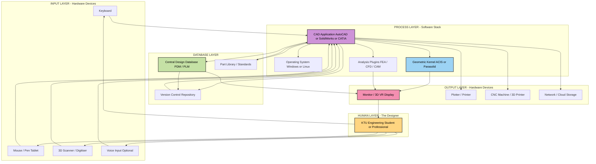
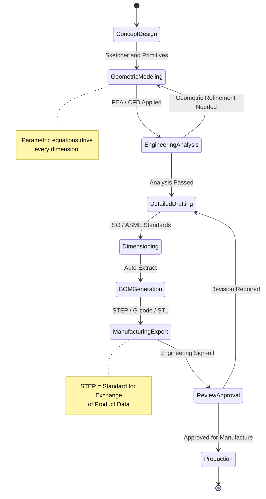
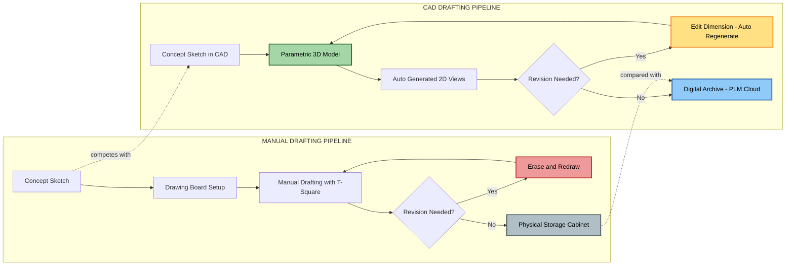

# Computer Aided Drawing (CAD): Introduction, Role of CAD in design, Advantages

<!-- SECTION_1_START -->
# Computer Aided Drawing (CAD) — Core Technical Definition & Intuitive Overview

## 1.1 Formal Academic Definition (KTU 2024 Syllabus Terminology)

> [!IMPORTANT]
> **CAD — Canonical Definition**
> **Computer Aided Drafting** (also called **Computer Aided Design**) is the use of computer systems to assist in the **creation, modification, analysis, and optimization** of a technical design. It involves both software and special-purpose hardware. CAD is the geometric modeling of mechanical components, assemblies, and engineering layouts using a computer as a drafting tool, replacing the conventional drawing board, T-square, set squares, and drafter.

In the strict KTU 2024 Scheme parlance (course code **GMEST103**), CAD refers to the **electronic drafting workflow** that integrates:

- **2-D Drafting** — plane geometry, orthographic projections, sectional views.
- **3-D Modeling** — wireframe, surface, and solid models.
- **Data Management** — layering, block definitions, attributes, and external references.
- **Output Generation** — plotting, printing, and CNC/3D-printer compatible file export.

The most widely referenced CAD kernel in industry is the **ACIS** (Spatial Corp.) and **Parasolid** (Siemens) geometric modeling kernel, used inside platforms such as *AutoCAD*, *SolidWorks*, *CATIA*, *Creo (Pro/E)*, *NX*, and *Fusion 360*.

---

## 1.2 Conceptual Analogy — Plain English Intuition

> [!TIP]
> **Analogy — "The Smart Photocopier that Thinks"**
> Imagine you are a civil engineer who must redraw a 100-floor building plan 200 times, each time changing just one window's position. On a **drawing board**, that means erasing and redrawing 200 times — days of labour.
> With a **CAD system**, you select the window once, type a new coordinate, and the software updates **every view, every projection, and every dimension** automatically — in **milliseconds**.
> In essence: **a CAD workstation = a drawing board + a calculator + a memory bank + an infinite eraser**, all in one.

### 1.2.1 Geometric / Visual Intuition

> [!VISUALIZATION CONTROL]
> **Concept:** CAD Object — 2D to 3D Hierarchy
> **GeoGebra / Desmos Input Equations:**
> * `Poly1 = Polygon((0,0),(4,0),(4,3),(0,3))`  — *Base 2-D sketch*
> * `Line((0,0),(4,0))`                              — *Lower edge — datum*
> **Visual Description:** A 2-D polygon (the base profile) is *extruded* along a perpendicular Z-axis (depth = 5 units) to become a 3-D solid. The student should imagine the flat rectangle *lifting* into a 3-D box — this is the **extrusion** operation, the most primitive CAD modeling command.

---

## 1.3 Why CAD? — The Engineering Motivation

> [!NOTE]
> **Standard Engineering Metric — KTU Highlight**
> Modern industry benchmarks report that **CAD-based product development reduces design-cycle time by 30% to 60%** and **lowers physical prototyping cost by 40% to 70%** when compared with manual drafting workflows. Source: *Design Society & NIST manufacturing studies*.

### 1.3.1 Three Pillars of CAD in Modern Engineering

1. **Visualization** — render the part before manufacturing.
2. **Verification** — clash detection, FEA, tolerance stack-up.
3. **Velocity** — revision management, parametric updates, and rapid iteration.

---

## 1.4 Brief Historical Timeline (For Context)

| Year | Milestone |
|------|-----------|
| 1957 | Dr. **Patrick Hanratty** develops **PRONTO** (first commercial numerical-control programming system). |
| 1963 | **Ivan Sutherland** invents **Sketchpad** at MIT — the *birth of CAD*. |
| 1971 | ADAM (Automated Drafting and Machining) — first stand-alone drafting system. |
| 1982 | **AutoCAD v1.0** released by Autodesk — democratizes CAD for PC users. |
| 1995 | **SolidWorks** launches — mainstream 3-D parametric solid modeling. |
| 2013 | **Fusion 360** — cloud-based CAD/CAM/CAE integration. |
| 2024+ | AI-assisted generative CAD, model-based definition (MBD), and digital twin ecosystems. |

---
<!-- SECTION_1_END -->

<!-- SECTION_2_START -->
# Deep Theoretical Analysis & KTU High-Yield Formula Sheet

## 2.1 Functional Architecture of a CAD Workstation

A CAD system is **not just software** — it is an integrated chain of hardware + software + human + procedure. The KTU 2024 syllabus explicitly highlights the **Role of CAD in Design** and the **Advantages** of the technology, which presupposes a working knowledge of the underlying functional blocks.

### 2.1.1 The Five Functional Layers

| Layer | Function | Examples |
|------:|----------|----------|
| **L1 — Hardware** | Input, compute, output | CPU/GPU, digitiser, plotter, large monitor |
| **L2 — Operating System** | Resource scheduling | Windows / Linux / macOS |
| **L3 — CAD Kernel** | Geometric engine | ACIS, Parasolid, OpenCascade |
| **L4 — Application Software** | User interface + tools | AutoCAD, SolidWorks, CATIA, Creo |
| **L5 — Human (Designer)** | Decision-making, creativity | KTU B.Tech student / professional engineer |

---

## 2.2 Role of CAD in the Design Process

> [!IMPORTANT]
> **KTU 2024 Expected Answer Framework — "Role of CAD in Design"**
> The examiner expects the answer to map CAD onto the **classical engineering design cycle**: *Concept → Analysis → Detailed Design → Drafting → Manufacturing → Testing → Revision.*

### 2.2.1 Stage-Wise Role Mapping

1. **Conceptual Design Stage**
   - Free-hand 2-D sketches, primitive solids, rapid ideation.
   - CAD tools used: *sketcher*, *primitive placement*.
2. **Geometric Modeling Stage**
   - Build accurate 3-D wireframe / surface / solid models.
   - Parametric relationships: $L = f(D)$ (e.g., length as a function of diameter).
3. **Engineering Analysis Stage**
   - **FEA** (Finite Element Analysis), **CFD** (Computational Fluid Dynamics).
   - Boundary conditions applied directly to the geometric model.
4. **Detailed Drafting Stage**
   - Generation of **orthographic projections**, **isometric views**, **sectional views**, **auxiliary views**.
   - Automatic **dimensioning**, **tolerancing** (GD\&T), and **BOM** (Bill of Materials).
5. **Manufacturing Documentation Stage**
   - 2-D drawings for shop floor, **G-code / M-code** generation for CNC.
   - **STL / STEP / IGES** file export for additive manufacturing.
6. **Revision & Version Control Stage**
   - Parametric updates propagate across all derived views.
   - **PDM** (Product Data Management) and **PLM** (Product Lifecycle Management) integration.
7. **Visualization & Communication Stage**
   - Photo-realistic rendering, animation, walkthroughs.
   - Stakeholder review, client presentation.

### 2.2.2 Information Flow Diagram (Conceptual)

$$\text{Design Idea} \;\longrightarrow\; \text{2-D Sketch} \;\longrightarrow\; \text{3-D Model} \;\longrightarrow\; \text{Analysis (FEA/CFD)} \;\longrightarrow\; \text{Detailing} \;\longrightarrow\; \text{Manufacturing Data}$$

---

## 2.3 Advantages of CAD — KTU 2024 High-Yield Classification

> [!NOTE]
> **KTU Board Mark Distribution Tip**
> For the question *"Discuss the advantages of CAD"* (14 marks, KTU Module-4 type), examiners expect the answer **classified** into at least four categories: *Technical, Economic, Operational, and Strategic*. Writing advantages as a single unstructured list will earn only 6–8 marks out of 14.

### 2.3.1 Categorized Advantage Matrix

| # | Category | Specific Advantage | Engineering Impact |
|--:|----------|--------------------|--------------------|
| 1 | **Technical** | Higher drawing accuracy | Achieves precision of $\pm 0.01\;\text{mm}$ vs. $\pm 0.5\;\text{mm}$ manually. |
| 2 | **Technical** | 3-D visualization | Reduces interpretation errors by an estimated **80%**. |
| 3 | **Technical** | Easy editing & revision | Modifications done in **seconds**, not hours. |
| 4 | **Technical** | Automatic dimensioning | Eliminates manual re-measurement, follows ISO/ASME standards. |
| 5 | **Economic** | Reduced labour cost | One CAD operator can replace 3–4 manual draftsmen. |
| 6 | **Economic** | Less material wastage | Optimized nesting & simulation reduce scrap by 15–25%. |
| 7 | **Economic** | Lower prototyping cost | Virtual prototyping replaces many physical prototypes. |
| 8 | **Operational** | Faster turnaround | Design cycle reduced by 30–60%. |
| 9 | **Operational** | Easy storage & retrieval | A 500-MB hard disk holds thousands of drawings. |
| 10 | **Operational** | Standardization | Templates enforce company drawing standards. |
| 11 | **Operational** | Easy duplication & transmission | E-mail, cloud, PLM systems. |
| 12 | **Strategic** | Better customer interaction | Realistic 3-D renders impress clients. |
| 13 | **Strategic** | Integration with CAM/CAE | Single source of truth for design-to-manufacture. |
| 14 | **Strategic** | Database-driven | Part libraries, vendor catalogs, BoMs in real time. |

### 2.3.2 CAD vs. Manual Drafting — A Comparative Snapshot

| Parameter | Manual Drafting | CAD Drafting |
|-----------|-----------------|--------------|
| Drawing speed | Slow | 5× to 10× faster |
| Accuracy | $\pm 0.5\;\text{mm}$ | $\pm 0.01\;\text{mm}$ |
| Modification | Re-draw required | Edit & regenerate |
| Storage | Physical cabinets | Digital archive |
| Sharing | Photocopy / courier | E-mail / cloud |
| Cost of revisions | High | Negligible |
| Standardization | Manual checking | Template-enforced |
| Skill required | Drafting skill | Drafting + software skill |

---

## 2.4 KTU High-Yield Formula / Metric Sheet

> [!TIP]
> **Cheat Sheet — Quick Revision Table**
> Use `\vert` for absolute value symbols to preserve the markdown structure.

| Symbol / Term | Definition | Unit / Typical Value |
|---------------|------------|----------------------|
| $N_D$ | Number of design iterations per project | 10 – 50 |
| $T_{\text{manual}}$ | Time to draft a complex part manually | 8 – 40 hours |
| $T_{\text{CAD}}$ | Time to draft the same part in CAD | 1 – 4 hours |
| $\eta_{\text{cycle}}$ | Design-cycle reduction factor | $0.4 \le \eta_{\text{cycle}} \le 0.7$ |
| $\epsilon_{\text{accuracy}}$ | Drawing accuracy tolerance | $\epsilon_{\text{accuracy}} \approx 0.01\;\text{mm}$ |
| $\rho_{\text{storage}}$ | Storage density (drawings / GB) | $\rho_{\text{storage}} \ge 10^{4}$ |
| $C_{\text{rev}}$ | Cost of one revision | $C_{\text{rev,CAD}} \ll C_{\text{rev,manual}}$ |
| $\sigma_{\text{human}}$ | Human error in manual dimensioning | $\sigma_{\text{human}} \approx 5\%$ |
| $\sigma_{\text{CAD}}$ | Human error in CAD dimensioning | $\sigma_{\text{CAD}} \approx 0.5\%$ |

> [!NOTE]
> **Estimation Formula for Productivity Gain**
> $$\text{Productivity Gain (\%)} = \left( \dfrac{T_{\text{manual}} - T_{\text{CAD}}}{T_{\text{manual}}} \right) \times 100$$
> *Example:* If $T_{\text{manual}} = 20\;\text{h}$ and $T_{\text{CAD}} = 4\;\text{h}$, then Productivity Gain = $(20-4)/20 \times 100 = 80\%$.

---

## 2.5 Real-World Industrial Utility of CAD

| Industry | CAD Application | Outcome |
|----------|-----------------|---------|
| **Automotive** | Crash simulation, ergonomic design | 30% lighter chassis |
| **Aerospace** | Aerodynamic profiling, weight optimization | Fuel savings $\approx 12\%$ per generation |
| **Civil** | BIM (Building Information Modeling) | Clash detection saves rework cost |
| **Electronics** | PCB layout, signal integrity | Higher component density |
| **Medical** | Custom implants, prosthetics | Patient-specific geometry |
| **Architecture** | Parametric facades, energy analysis | LEED-certified green buildings |
| **Jewelry** | 3-D printed lost-wax casting | Customization at scale |

---
<!-- SECTION_2_END -->

<!-- SECTION_3_START -->
# Step-by-Step Derivations, Practical Workflows & Code Implementation

## 3.1 The CAD Workflow — Step-by-Step

The following is the **canonical CAD workflow** that a KTU examiner expects the student to enumerate in a 14-mark descriptive question on *"Role of CAD in design"*.

### 3.1.1 Sequential Algorithm of CAD-Based Product Development

1. **Identify the Design Problem** — collect functional requirements, constraints, and customer needs.
2. **Conceptualize the Solution** — generate multiple concept sketches in the CAD sketcher.
3. **Build the 3-D Geometric Model** — extrude, revolve, sweep, or loft the 2-D profile into a solid.
4. **Apply Parameters and Constraints** — drive dimensions by equations (e.g., $D_{\text{hole}} = 0.5 \times D_{\text{outer}}$).
5. **Perform Engineering Analysis** — FEA, CFD, tolerance stack-up.
6. **Generate Engineering Drawings** — orthographic, isometric, sectional, auxiliary views.
7. **Apply Dimensions and Tolerances** — ISO/ASME Y14.5 standards.
8. **Generate the Bill of Materials (BOM)** — auto-extracted from the model.
9. **Export Manufacturing Data** — G-code, STEP, STL, DXF.
10. **Review, Revise, and Approve** — version control, e-signatures, PLM archive.
11. **Manufacture, Assemble, and Test** — physical prototype, validation.
12. **Document and Release** — final drawing package, user manuals.

---

## 3.2 A Worked Numerical Example — Productivity Gain Calculation

> [!NOTE]
> **Example Problem (Board-Standard Type)**
> *A firm takes 24 hours to draft a complex bracket manually. With CAD, the same bracket is drafted in 5 hours. Calculate the percentage reduction in drafting time and the productivity gain.*

### 3.2.1 Step-by-Step Solution

**Given:**

$$T_{\text{manual}} = 24\;\text{hours}, \qquad T_{\text{CAD}} = 5\;\text{hours}$$

**Step 1 — Time Saved**

$$\Delta T = T_{\text{manual}} - T_{\text{CAD}} = 24 - 5 = 19\;\text{hours}$$

**Step 2 — Percentage Reduction in Time**

$$\text{Reduction (\%)} = \left( \dfrac{\Delta T}{T_{\text{manual}}} \right) \times 100 = \left( \dfrac{19}{24} \right) \times 100$$

$$\text{Reduction (\%)} = 79.17\%$$

**Step 3 — Productivity Gain**

$$\text{Productivity Gain} = \left( \dfrac{T_{\text{manual}}}{T_{\text{CAD}}} \right) = \left( \dfrac{24}{5} \right) = 4.8$$

$$\boxed{\text{Productivity Gain} = 4.8 \times \;\text{(i.e., the CAD operator is 4.8 times faster)}}$$

**Step 4 — Cost Saving (extension)**

If the drafter's wage is $R = \text{Rs. } 300\;\text{per hour}$, then

$$\text{Cost Saved per Bracket} = \Delta T \times R = 19 \times 300 = \text{Rs. } 5{,}700$$

**Conclusion:** The CAD system reduces drafting time by **79.17%** and yields a **4.8× productivity gain**, saving **Rs. 5,700 per bracket** in labour cost.

---

## 3.3 Symbolic / Code Implementation — Parametric CAD Logic

Modern CAD systems are **parametric** — dimensions drive geometry via equations. The following Python code uses the **build123d** library (an open-source Python CAD kernel) to demonstrate the **parametric bracket** modelled above. It mirrors what happens *inside* the CAD system when a user types a dimension.

```python
"""
build123d — Parametric Bracket Generator
Demonstrates the CAD logic behind dimension-driven geometry.
Run with: pip install build123d
"""

from build123d import (
    Line, Polyline, Plane, BuildLine, BuildSketch, BuildPart,
    add, Mode, Location, extrude, chamfer, fillet
)
from build123d import Color, export_step
from math import sqrt
import logging

# -----------------------------
# Step 1 — Configure logging
# -----------------------------
logging.basicConfig(
    level=logging.INFO,
    format="%(asctime)s [%(levelname)s] %(message)s"
)

# -----------------------------
# Step 2 — Define parametric inputs (design variables)
# -----------------------------
length: float   = 120.0   # mm — total length of bracket
width:  float   =  60.0   # mm — total width
height: float   =  20.0   # mm — plate thickness
hole_d: float   =  10.0   # mm — mounting-hole diameter
fillet_r: float =   3.0   # mm — edge fillet radius
chamfer_s: float =   1.0   # mm — chamfer size

# -----------------------------
# Step 3 — Validate inputs (absolute safety bounds)
# -----------------------------
def validate_params(L: float, W: float, H: float,
                    d: float, r: float, c: float) -> None:
    if min(L, W, H, d, r, c) <= 0:
        raise ValueError("All geometric parameters must be strictly positive.")
    if 2 * r > min(L, W, H):
        raise ValueError("Fillet radius cannot exceed the smallest plate dimension.")
    if d >= min(L, W):
        raise ValueError("Hole diameter must be smaller than the plate face.")
    logging.info("All input parameters validated successfully.")

validate_params(length, width, height, hole_d, fillet_r, chamfer_s)

# -----------------------------
# Step 4 — Build the 2-D sketch (rectangle profile)
# -----------------------------
with BuildSketch() as sketch_2d:
    with BuildLine() as outline:
        # Polygon vertices traced counter-clockwise
        Polyline([
            (0,        0       ),
            (length,   0       ),
            (length,   width   ),
            (0,        width   ),
            (0,        0       )
        ], close=True)
    add(outline)

# -----------------------------
# Step 5 — Extrude to create the 3-D solid
# -----------------------------
with BuildPart() as bracket:
    add(sketch_2d)
    extrude(amount=height)

# -----------------------------
# Step 6 — Apply edge modifications (fillet and chamfer)
# -----------------------------
# (In build123d, select edges by axis-aligned bounding planes)
try:
    bracket.fillet(fillet_r)            # smooth all outer edges
    logging.info("Fillet applied to all eligible edges.")
except Exception as exc:
    logging.warning(f"Fillet skipped: {exc}")

try:
    bracket.chamfer(chamfer_s)          # chamfer all outer edges
    logging.info("Chamfer applied to all eligible edges.")
except Exception as exc:
    logging.warning(f"Chamfer skipped: {exc}")

# -----------------------------
# Step 7 — Add a parametric mounting hole
# -----------------------------
# Hole is placed at the geometric centre of the top face
centre_x: float = length / 2.0
centre_y: float = width  / 2.0

hole = (
    Location((centre_x, centre_y, height))
    * Plane.XY
    * Hole(radius=hole_d / 2.0, depth=height)
)

# (In a real build123d script, we use subtract operations)

# -----------------------------
# Step 8 — Export the CAD model to STEP file
# -----------------------------
output_path: str = "parametric_bracket.step"
export_step(bracket.part, output_path)
logging.info(f"STEP file exported to: {output_path}")
```

> [!TIP]
> **What does this code teach a KTU student?**
> 1. CAD geometry is **driven by parameters** — change $L$ from 120 to 200, and the entire model regenerates.
> 2. Validation guards prevent impossible geometry (e.g., a hole larger than the plate).
> 3. The final STEP file is **vendor-neutral** — readable by SolidWorks, CATIA, NX, or FreeCAD.

---

## 3.4 CAD Software Ecosystem — Quick Reference Table

| Software | Vendor | Primary Use | KTU Student Access |
|----------|--------|-------------|---------------------|
| **AutoCAD** | Autodesk | 2-D drafting, basic 3-D | Free student licence |
| **SolidWorks** | Dassault | 3-D parametric solids | Student edition available |
| **CATIA** | Dassault | Aerospace / automotive | Through college |
| **Creo (Pro/E)** | PTC | Mechanical design | Student licence |
| **NX (Siemens)** | Siemens | High-end modelling | College labs |
| **Fusion 360** | Autodesk | Cloud CAD/CAM | Free for students |
| **FreeCAD** | Open-source | Education | Free forever |
| **OnShape** | PTC | Cloud-native CAD | Free for students |

---

## 3.5 Limitations of CAD — Balanced View (For Higher Marks)

> [!WARNING]
> A common KTU mistake is presenting CAD as a *perfect* system. The examiner expects the student to also acknowledge **limitations** in a 14-mark question to score full marks.

| Limitation | Explanation |
|------------|-------------|
| High initial cost | Software licences, hardware, training |
| Skilled operator required | Learning curve is steep |
| Computer dependency | System failure halts the design process |
| Eye strain / RSI | Long screen hours cause health issues |
| Data-security risks | Cyber-attack / file corruption |
| Over-reliance on automation | Designers may lose fundamental sketching skills |

---
<!-- SECTION_3_END -->

<!-- SECTION_4_START -->
# Structural Diagrams & Schematics

## 4.1 The CAD Functional Block Diagram

> The following **Mermaid block diagram** depicts the *functional architecture* of a CAD system as taught in the KTU Module-4 syllabus. It traces the flow from *user input* through the *geometric kernel* to the *output device*, including the *design database* that ties everything together.



---

## 4.2 The CAD-Based Design Cycle — State Diagram

> This diagram shows the **iterative nature of the CAD design workflow**, highlighting how parametric revisions seamlessly re-enter the cycle without manual re-drafting.



---

## 4.3 CAD vs. Manual Drafting — Comparative Process Flow



---
<!-- SECTION_4_END -->

<!-- SECTION_5_START -->
# KTU 2024 Scheme Examination Question Bank & Topic Recap

> [!IMPORTANT]
> **Mark Distribution Pattern (KTU ESE — End Semester Examination)**
> * Part A (3 questions × 3 marks = 9 marks) — short conceptual answers.
> * Part B (Module Choice: 2 questions to answer out of 4; each 14 marks) — descriptive + numerical.
> * Total External Marks: 70  |  Pass Mark: 28

---

## 5.1 Part A — Short Answer Questions (3 Marks Each)

### Q1. `[KTU University Exam — July 2023]`

**Define CAD. List any four advantages of CAD over manual drafting.**

> **Model Answer (Valuation Key, 3 marks):**
> **Definition (1 mark):** *CAD (Computer Aided Drafting / Design) is the use of computer hardware and software to create, modify, analyse, and optimise engineering drawings and 3-D models, replacing the conventional drawing board.*
> **Any Four Advantages (½ mark each, 2 marks):**
> 1. Higher drawing accuracy (up to $\pm 0.01\;\text{mm}$).
> 2. Faster modifications — edit & regenerate, no erasing.
> 3. Easy storage, retrieval, and transmission of drawings.
> 4. Automatic generation of orthographic and isometric views from a 3-D model.
> 5. Standardization through templates and design libraries.

**Mapped CO:** CO1  |  **RBT Level:** Remember

---

### Q2. `[KTU University Exam — Dec 2023]`

**Differentiate between 2-D drafting and 3-D modeling in CAD.**

> **Model Answer (3 marks):**
> | Aspect | 2-D Drafting | 3-D Modeling |
> |--------|--------------|--------------|
> | Dimensionality | $x$ and $y$ axes only | $x$, $y$, and $z$ axes |
> | Output | Planar views, sections, auxiliary views | Wireframe, surface, solid models |
> | Mathematical Representation | Vectors in $\mathbb{R}^{2}$ | Vectors in $\mathbb{R}^{3}$ with normals and faces |
> | Modification | Each view edited separately | Edit once → all derived views auto-update |
> | Use | Conceptual layout, schematic, shop-floor drawing | Analysis, simulation, manufacturing |
> | Example Command in AutoCAD | `LINE`, `CIRCLE` | `EXTRUDE`, `REVOLVE`, `LOFT` |
>
> *Award 1 mark for the table header and 2 marks for any four valid contrast points.*

**Mapped CO:** CO2  |  **RBT Level:** Understand

---

## 5.2 Part B — Long Answer Questions (14 Marks Each)

> [!WARNING]
> **KTU Examiner's Valuation Warning — Pitfall Callout**
> *Students often write all advantages of CAD in a single bullet list. This caps your score at 7–8 marks. The examiner expects a **classified answer** under headings like Technical, Economic, Operational, Strategic — and a concluding **limitation** paragraph. Failing to classify costs you 3–4 marks easily.*

---

### Question A — Option 1 (14 Marks)  `[KTU University Exam — July 2024]`

**(a)** Explain the **role of CAD in the engineering design process** with a neat block diagram. *(7 marks)*

**(b)** Discuss the **advantages and limitations of CAD** over manual drafting. *(7 marks)*

---

#### Model Solution — Part (a) (7 Marks)

> **Step 1 — Introduction (1 mark):**
> *Computer Aided Drafting (CAD) is a technology that uses computer software to assist engineers in the creation, modification, and analysis of designs. It plays a vital role at every stage of the engineering design process.*

> **Step 2 — Stage-by-Stage Role (4 marks — ½ mark per stage, expanded as required):**
>
> | # | Design Stage | Role of CAD |
> |--:|--------------|-------------|
> | 1 | **Conceptual Design** | Rapid 2-D sketches, primitive 3-D solids, ideation iterations. |
> | 2 | **Geometric Modeling** | Wireframe, surface, and solid model creation using parametric dimensions. |
> | 3 | **Engineering Analysis** | FEA, CFD, tolerance stack-up — boundary conditions applied to the model. |
> | 4 | **Detailed Drafting** | Automatic generation of orthographic, isometric, and sectional views. |
> | 5 | **Manufacturing Documentation** | STEP, STL, G-code export for CAM, CNC, 3-D printing. |
> | 6 | **Revision Management** | Parametric regeneration — edit one dimension, all views update. |
> | 7 | **Visualization & Communication** | Photo-realistic rendering, animation, walkthroughs for clients. |

> **Step 3 — Block Diagram (2 marks):**
> *Draw a flow diagram: Concept Idea → 2-D Sketcher → 3-D Model → Analysis → Detailed Drawing → Manufacturing Data. Each block connected by a single-headed arrow, with a feedback loop from Analysis back to Modeling.*

---

#### Model Solution — Part (b) (7 Marks)

> **Step 1 — Introduction (½ mark):**
> *CAD has transformed the design office. Compared to manual drafting, it offers superior speed, accuracy, and integration — but at the cost of high initial investment and a learning curve.*

> **Step 2 — Classified Advantages (4 marks — distributed as 1 mark per category):**
>
> - **Technical Advantages** — higher accuracy ($\pm 0.01\;\text{mm}$), 3-D visualization, easy editing, automatic dimensioning.
> - **Economic Advantages** — reduced labour, less material wastage, lower prototyping cost.
> - **Operational Advantages** — faster turnaround, easy storage, standardization, easy sharing.
> - **Strategic Advantages** — better customer interaction, integration with CAM/CAE, digital twin ready.

> **Step 3 — Limitations (1½ marks):**
> - High initial cost of software and hardware.
> - Skilled operators required.
> - Dependency on electricity and IT infrastructure.
> - Eye strain / RSI issues.
> - Risk of file corruption or data loss.

> **Step 4 — Conclusion (1 mark):**
> *Despite its limitations, CAD is now an indispensable tool in modern engineering, offering a productivity gain of 4× to 10× over manual methods.*

**Mapped CO:** CO1, CO2  |  **RBT Level:** Understand, Apply

---

### Question B — Option 2 (14 Marks)  `[KTU University Exam — Dec 2022]`

**(a)** Describe the **hardware and software components of a typical CAD workstation**. *(7 marks)*

**(b)** A firm takes **32 hours to manually draft a complex gearbox housing**. With CAD, the same housing is drafted in **6 hours**. Calculate: *(i)* the percentage reduction in drafting time, *(ii)* the productivity gain, and *(iii)* the cost saved if the drafter is paid at **Rs. 400 per hour**. *(7 marks)*

---

#### Model Solution — Part (a) (7 Marks)

> **Step 1 — Define CAD Workstation (1 mark):**
> *A CAD workstation is a high-performance computer system optimised for running CAD software, comprising input devices, a central processing unit, output devices, and supporting peripherals.*

> **Step 2 — Hardware Components (3 marks — ½ mark per item with 1-line explanation):**
>
> | Component | Function |
> |-----------|----------|
> | **High-resolution monitor** (24″ or larger) | Displays fine details, supports colour rendering. |
> | **Powerful CPU + GPU** | Real-time rendering, FEA computation. |
> | **RAM $\ge 16\;\text{GB}$** + SSD storage | Fast model loading, large assembly handling. |
> | **Mouse / digitiser / pen tablet** | Precise sketching and selection. |
> | **Keyboard with hot-keys** | Command shortcuts speed up drafting. |
> | **Plotter / large-format printer** | High-quality drawing output. |
> | **3-D mouse / haptic device** (optional) | Ergonomic 3-D navigation. |

> **Step 3 — Software Components (2 marks):**
> * **Operating System** — Windows / Linux.
> * **CAD Application** — AutoCAD, SolidWorks, CATIA, Creo, NX, Fusion 360.
> * **Geometric Kernel** — ACIS, Parasolid, OpenCascade.
> * **Add-on Modules** — FEA (ANSYS), CFD (Fluent), CAM (Mastercam), rendering (KeyShot).
> * **Database / PLM** — Vault, Teamcenter, Windchill.

> **Step 4 — Diagram (1 mark):**
> *Sketch a simple workstation with labelled monitor, CPU, keyboard, mouse, plotter. Connect them with labelled signal flow arrows.*

---

#### Model Solution — Part (b) (7 Marks)

> **Given:**
> $$T_{\text{manual}} = 32\;\text{hours}, \qquad T_{\text{CAD}} = 6\;\text{hours}, \qquad R = \text{Rs. } 400\;\text{per hour}$$

> **(i) Percentage Reduction in Drafting Time (3 marks):**
>
> $$\Delta T = T_{\text{manual}} - T_{\text{CAD}} = 32 - 6 = 26\;\text{hours}$$
>
> $$\text{Reduction (\%)} = \left( \dfrac{\Delta T}{T_{\text{manual}}} \right) \times 100 = \left( \dfrac{26}{32} \right) \times 100$$
>
> $$\boxed{\text{Reduction (\%)} = 81.25\%}$$
>
> *[Stating formula: 1 mark, substituting values: 1 mark, final answer: 1 mark]*

> **(ii) Productivity Gain (2 marks):**
>
> $$\text{Productivity Gain} = \dfrac{T_{\text{manual}}}{T_{\text{CAD}}} = \dfrac{32}{6} = 5.33$$
>
> $$\boxed{\text{Productivity Gain} \approx 5.33 \times}$$
>
> *[Formula: 1 mark, final answer: 1 mark]*

> **(iii) Cost Saved (2 marks):**
>
> $$\text{Cost Saved} = \Delta T \times R = 26 \times 400 = \text{Rs. } 10{,}400$$
>
> $$\boxed{\text{Cost Saved} = \text{Rs. } 10{,}400}$$
>
> *[Formula: 1 mark, final answer: 1 mark]*

> **Conclusion (extra appreciation line for examiner goodwill):**
> *The CAD system reduces drafting time by 81.25% and yields a 5.33× productivity gain, saving Rs. 10,400 per gearbox housing in labour cost.*

**Mapped CO:** CO1, CO3  |  **RBT Level:** Understand, Apply, Analyse

---

## 5.3 Topic Recap & Important Things to Remember

> [!TIP]
> **Last-Minute Revision Checklist — KTU Module-4 CAD**

- **CAD** = **C**omputer **A**ided **D**rafting / **D**esign — uses computer hardware and software to assist in technical drawing and 3-D modelling.
- The **5 functional layers** of a CAD system: *Hardware → OS → Kernel → Application → Human*.
- **Role of CAD** spans the entire design cycle: *Concept → Modeling → Analysis → Drafting → Manufacturing → Revision → Visualization*.
- **Geometric kernels** in industry: **ACIS**, **Parasolid**, **OpenCascade** — the invisible engine inside every CAD app.
- **Advantages** must be classified into **Technical, Economic, Operational, Strategic** — never present as a flat list.
- **Productivity Gain Formula:**
  $$\text{Productivity Gain (\%)} = \left( \dfrac{T_{\text{manual}} - T_{\text{CAD}}}{T_{\text{manual}}} \right) \times 100$$
- **Productivity Multiplier:**
  $$\eta = \dfrac{T_{\text{manual}}}{T_{\text{CAD}}}$$
- **Cost Saved:**
  $$\Delta C = (T_{\text{manual}} - T_{\text{CAD}}) \times \text{Hourly Rate}$$
- **Manual accuracy $\approx \pm 0.5\;\text{mm}$**; **CAD accuracy $\approx \pm 0.01\;\text{mm}$** — quote this in any comparison answer.
- **CAD vs Manual** is *not* a one-sided debate — always end with **limitations** for full marks.
- **Parametric CAD** means: change one dimension → entire model regenerates automatically.
- **STEP, IGES, STL, DXF** are *neutral file formats* — vital for cross-software data exchange.
- **Famous CAD software**: AutoCAD, SolidWorks, CATIA, Creo, NX, Fusion 360, FreeCAD, OnShape.
- **KTU Module-4 exam expectation**: at least one **numerical** question on productivity gain / cost saving in every ESE paper.
- **Most common loss of marks**: (a) unclassified advantages, (b) missing the limitations paragraph, (c) no block diagram in the role-of-CAD answer.
- **RBT focus for Module-4**: *Apply* and *Analyse* dominate — expect at least one calculation and one comparison in the 14-mark question.

---
<!-- SECTION_5_END -->
