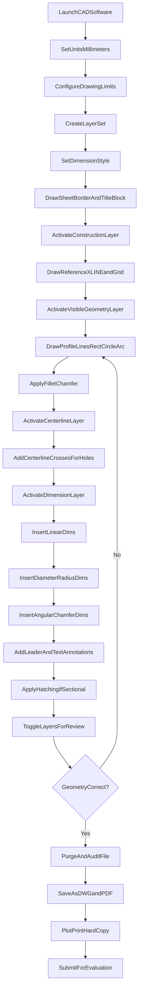
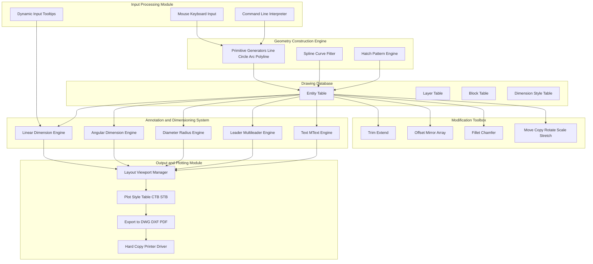
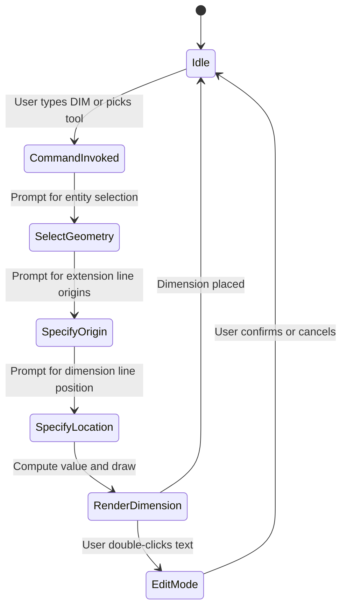

# Creating two-dimensional drawing with dimensions using suitable software (internal evaluation)

<!-- SECTION_1_START -->
# 2D CAD Drafting with Engineering Dimensions

## Formal Academic Definition

In the context of **ENGINEERING GRAPHICS AND COMPUTER AIDED DRAWING (GMEST103)**, creating a two-dimensional drawing with dimensions using suitable software is defined as the systematic process of preparing, annotating, and storing an engineering component's plan, elevation, and sectional views in a vector-based Computer-Aided Design (CAD) environment, such that every geometric feature is constrained by a numerical annotation system compliant with the **Bureau of Indian Standards (BIS SP 46:2003)** dimensioning and tolerancing practice, and exportable as a standard interchange format (DWG, DXF, or PDF).

> [!IMPORTANT]
> **KTU 2024 Scheme Module Highlight:** The internal evaluation component for this topic tests the student's ability to *physically generate* a drawing in a CAD workbench, not merely describe commands. Marks are awarded for **drawing setup, command sequence, dimensioning completeness, and final plot/print output**.

## Conceptual Analogy / Intuition

Imagine a **blueprint chef** preparing a precise recipe card for a machine part. The CAD workstation is the kitchen, the part geometry is the dish, and the dimensions are the exact measurements of every ingredient. Without the measurements, the chef (the machinist) cannot replicate the dish (the physical part) in another kitchen (the workshop).

* **Geometric entities** (lines, arcs, polylines) are the *words* of the drawing.
* **Dimensions** are the *grammar rules* that make those words meaningful.
* **Layers** are *color-coded folders* keeping different information types (visible lines, hidden lines, centerlines, dimensions, hatching) separated so the machinist only sees what is needed.

> [!NOTE]
> **Core Engineering Principle:** A dimension is *not* just a number — it is a contract between the designer and the manufacturer. A value of $\phi 25 \pm 0.02$ on a shaft tells the turner exactly how much material to remove and how much deviation is acceptable.

## The Five Pillars of a Dimensioned 2D CAD Drawing

| Pillar | Function | KTU Weight |
| :--- | :--- | :--- |
| **Drawing Sheet Setup** | Defines paper size, units, scale, and borders (A4/A3) | High |
| **Geometric Construction** | Lines, circles, arcs, polylines, splines forming the views | High |
| **Modification & Editing** | Trim, extend, offset, mirror, fillet, chamfer | Medium |
| **Dimensioning & Annotation** | Linear, angular, radial, diameter, leaders, text | Very High |
| **Layer & Block Management** | Logical grouping, reuse, and standardization | Medium |

## Visualization of Dimensioning Geometry

> [!VISUALIZATION CONTROL]
> **Concept:** Linear Dimensioning on a Horizontal Line
> **GeoGebra / Desmos Input Equations:**
> * Point $A = (2, 3)$
> * Point $B = (8, 3)$
> * Dimension Line: $y = 1.5$ (offset below the geometry)
> * Extension Lines: $x = 2$ and $x = 8$ (vertical, from points A and B)
> **Visual Description:** A horizontal line segment AB at $y = 3$ is bracketed by two extension lines dropping down to a parallel dimension line at $y = 1.5$. The numerical value `6.00` is centered on the dimension line, exactly indicating the true horizontal distance.

<!-- SECTION_1_END -->

<!-- SECTION_2_START -->
# Theoretical Framework: Drafting Standards, Geometry & Dimensioning Mathematics

## 2.1 The 2D Cartesian Workspace

A 2D CAD drawing exists in a mathematically infinite **Cartesian coordinate plane** defined by the World Coordinate System (WCS). Every entity is described by an ordered pair:

$$P = (x, y) \in \mathbb{R}^2$$

The drawing database stores entities as parametric objects. A **line**, for example, is stored as two endpoint coordinates; a **circle** is stored as a center point and a radius $r$; a **polyline** is a chained list of vertices $(x_1, y_1), (x_2, y_2), \ldots, (x_n, y_n)$.

## 2.2 Geometric Construction — The Primitives

Every complex 2D engineering drawing is decomposed into these fundamental primitives:

* **Line Segment** $\overline{P_1 P_2}$ — bounded by two endpoints.
* **Polyline** — a connected sequence of line and/or arc segments treated as a single object.
* **Circle** — defined by center $C = (c_x, c_y)$ and radius $r$. Equation: $(x - c_x)^2 + (y - c_y)^2 = r^2$.
* **Arc** — defined by center, radius, start angle $\theta_s$, and end angle $\theta_e$.
* **Ellipse** — defined by center, major axis $a$, minor axis $b$, and rotation angle.
* **Spline / Polyline (Curve Fit)** — interpolated smooth curve through control points.
* **Rectangle, Polygon, Donut** — composite command-built primitives.

## 2.3 Modification Operations — The Editing Toolkit

| Command | Geometric Effect | Typical Engineering Use |
| :--- | :--- | :--- |
| **TRIM** | Removes unwanted portions of entities at a cutting edge | Cleaning up intersections |
| **EXTEND** | Prolongs entities to meet a boundary edge | Closing gaps in views |
| **OFFSET** | Creates a parallel entity at distance $d$ | Drawing hidden lines, wall thickness |
| **MIRROR** | Reflects across a mirror line | Symmetrical parts (flanges, brackets) |
| **FILLET** | Inserts tangent arc of radius $R$ between two lines | Rounded corners |
| **CHAMFER** | Inserts a linear bevel of distance $d$ (or $d_1 \times d_2$) | Beveled edges |
| **ARRAY** | Rectangular or polar pattern | Bolt circles, repeated slots |
| **COPY / MOVE** | Translation by vector $\vec{v} = (\Delta x, \Delta y)$ | Duplicating features |
| **ROTATE** | Rotation by angle $\theta$ about a base point | Angular repositioning |
| **SCALE** | Uniform scaling by factor $k$ | Resizing |
| **STRETCH** | Non-uniform displacement within a selection window | Elongating features |

## 2.4 Dimensioning — The Engineering Language

> [!IMPORTANT]
> **BIS SP 46:2003 Alignment Rule:** Dimensions are placed *outside* the view in such a way that they can be read from the *bottom* of the drawing sheet (aligned dimensions) or from the *right side* of the sheet (rotated). In the unidirectional system, all dimensions read horizontally from the bottom.

### 2.4.1 Types of Dimensions Used in Internal Evaluation

| Dimension Type | Symbol / Format | Application |
| :--- | :--- | :--- |
| **Linear — Horizontal** | $50.00$ | Length along X-axis |
| **Linear — Vertical** | $30.00$ | Height along Y-axis |
| **Linear — Aligned** | $41.23$ (auto) | True length of inclined features |
| **Angular** | $45^{\circ}$ | Angles between non-perpendicular lines |
| **Radius** | $R 12.50$ | Fillet radii, rounded corners |
| **Diameter** | $\phi 25.00$ | Holes, shafts, circular bosses |
| **Chamfer** | $5 \times 45^{\circ}$ | Beveled edges |
| **Leader / Balloon** | `A` (text) | Surface finish, part numbers |
| **Ordinate** | $X = 12.00$, $Y = 25.00$ | Locating holes on a single datum |
| **Baseline / Continuous** | Chain of values | Sequential dimensions along a single axis |

### 2.4.2 The Anatomy of a Linear Dimension

A linear dimension consists of four components:

1. **Dimension Line** — thin continuous line, *with arrowheads* at both ends (or one end for radii), parallel to the measured feature.
2. **Extension Lines** — thin continuous lines protruding from the feature by approximately $2\text{ mm}$ beyond the dimension line.
3. **Arrowheads** — filled, $3\text{ mm}$ long, drawn freehand or via software.
4. **Dimension Text** — placed *above* the dimension line (unidirectional) or *broken* into it (aligned), with the engineering value followed by a tolerance if required.

### 2.4.3 Mathematical Definition of a Linear Dimension

For two points $P_1 = (x_1, y_1)$ and $P_2 = (x_2, y_2)$:

* **Horizontal Dimension Value:** $D_x = \vert x_2 - x_1 \vert$
* **Vertical Dimension Value:** $D_y = \vert y_2 - y_1 \vert$
* **Aligned (True) Dimension Value:** $D = \sqrt{(x_2 - x_1)^2 + (y_2 - y_1)^2}$

For an angle between two lines with slopes $m_1$ and $m_2$:

$$\theta = \arctan \left| \frac{m_2 - m_1}{1 + m_1 m_2} \right|$$

## 2.5 Layer Architecture (The Organizational Backbone)

A **Layer** in CAD is a logical transparency sheet. Each layer has six defining properties:

* **State:** ON / OFF (visibility)
* **Color:** Numerical index (1–255) for visual differentiation
* **Linetype:** CONTINUOUS, DASHED, CENTER, HIDDEN, PHANTOM, DASHDOT
* **Lineweight:** Thickness in mm (0.13, 0.18, 0.25, 0.35, 0.50, 0.70, 1.00, 1.40, 2.00)
* **Plot Style:** Whether the layer prints
* **Lock:** Prevents accidental modification

### Recommended Layer Convention (KTU Standard Practice)

| Layer Name | Color | Linetype | Lineweight (mm) | Purpose |
| :--- | :--- | :--- | :--- | :--- |
| `01_VIS_GEOM` | 7 (White/Black) | Continuous | 0.50 | Visible object lines |
| `02_HID_GEOM` | 5 (Blue) | Hidden | 0.25 | Hidden lines |
| `03_CENTER` | 1 (Red) | Center | 0.18 | Centerlines, axes |
| `04_CONSTR` | 8 (Grey) | Phantom | 0.13 | Construction lines |
| `05_DIM` | 2 (Yellow) | Continuous | 0.18 | Dimension lines, text |
| `06_HATCH` | 4 (Cyan) | Continuous | 0.25 | Sectional hatching |
| `07_BORDER` | 6 (Magenta) | Continuous | 0.70 | Sheet border, title block |
| `08_TEXT` | 7 | Continuous | 0.25 | Notes, BOM |

## 2.6 KTU High-Yield Formula & Cheat Sheet

| Concept | Formula / Rule | Application |
| :--- | :--- | :--- |
| Distance between two points | $D = \sqrt{(\Delta x)^2 + (\Delta y)^2}$ | Verify aligned dimension |
| Angle of a line with X-axis | $\theta = \arctan(\Delta y / \Delta x)$ | Drawing inclined lines |
| Circumference | $C = 2 \pi r$ | Convert circular path to length |
| Arc length | $L_{arc} = r \cdot \theta_{rad}$ | Subdividing arcs |
| Decimal feet-to-mm (inch input) | $1'' = 25.4\text{ mm}$ | Unit conversion checks |
| Drawing scale ratio | $S = \text{Paper length} / \text{Actual length}$ | Plot/print scale |
| Tolerance (Bilateral) | $25.00 \pm 0.05$ | Manufacturing allowance |
| Fillet tangent length | $T = R \cdot \tan(\theta / 2)$ | Fillet dimensioning |
| Chamfer linear run | $L = c / \sin(45^{\circ}) = c \sqrt{2}$ | Chamfer dimensioning |

## 2.7 Real-World Engineering Utility

* **Mechanical Drafting:** Manufacturing blueprints for shafts, brackets, jigs, fixtures.
* **Civil & Architectural:** Floor plans, elevation views, site plans, plumbing layouts.
* **Electrical & Electronics:** PCB schematics, wiring diagrams, panel layouts.
* **Interior Design:** Furniture layouts, lighting plans, reflected ceiling plans.
* **Manufacturing Process Planning:** CNC toolpath generation, GD\&T verification.
* **Reverse Engineering:** Capturing legacy paper drawings into editable vector databases.
<!-- SECTION_2_END -->

<!-- SECTION_3_START -->
# Step-by-Step Practical Implementation: Building a 2D Drawing with Dimensions

## 3.1 Equipment, Software & File Setup

| Item | Specification | Quantity | Purpose |
| :--- | :--- | :--- | :--- |
| Workstation | Intel i5 / Ryzen 5, 8 GB RAM, GPU recommended | 1 | Software host |
| Monitor | 1920 $\times$ 1080 minimum, 24" preferred | 1 | Drawing surface |
| Input Devices | 3-button mouse, keyboard, digitizer (optional) | 1 set | Entity input |
| Operating System | Windows 10/11, Linux, or macOS | 1 | Platform |
| **CAD Software** | **AutoCAD 2024**, **FreeCAD 0.21**, **LibreCAD 2.2**, **SolidWorks 2023 (2D Sketch)**, or **QCAD** | 1 license | Drafting engine |
| Output Device | A4/A3 inkjet/laser printer | 1 | Plot validation |
| Plot Paper | 80–90 GSM A4/A3 sheets | As needed | Hard copy submission |

> [!NOTE]
> **Software Choice Note:** For KTU internal evaluation, **AutoCAD** (student license), **FreeCAD** (free, open-source), and **LibreCAD** (free, lightweight) are the most common. The workflow commands listed below are *AutoCAD-named*; equivalent commands in other software are noted in parentheses where they differ significantly.

## 3.2 Pre-Drawing Checklist (Mandatory)

| Step | Action | Verification |
| :---: | :--- | :--- |
| 1 | Launch the CAD software and open a **New Drawing** file. | Blank editor visible |
| 2 | Set drawing units to **Decimal** and **Millimeters** via `UNITS` command. | Confirmation in status bar |
| 3 | Set drawing limits via `LIMITS` (e.g., $0,0$ to $420,297$ for A3 landscape). | Grid extents updated |
| 4 | Create the standard layer set as per Section 2.5. | Layer properties manager populated |
| 5 | Load dimension style via `DIMSTYLE` — set text height to $2.5\text{ mm}$, arrow size to $2.5\text{ mm}$, extension line offset to $1.25\text{ mm}$. | Style preview correct |
| 6 | Save file as `StudentName_RollNo_Topic.dwg`. | File path recorded |

## 3.3 Step-by-Step Construction: A Bracket Plate with Two Holes

This worked example demonstrates the full workflow. The goal is to produce a fully dimensioned front view of an L-shaped bracket plate with two $\phi 12$ mounting holes.

### Step 1 — Sheet Border and Title Block

Activate layer `07_BORDER`. Draw an outer rectangle of $420 \times 297$ (A3 landscape) and an inner rectangle offset by $10$ mm on all sides. In the lower-right corner, construct a title block $180 \times 60$ mm with subdivisions for: drawing title, name, roll number, scale, date, sheet number, and a logo placeholder. Add the text using the `MTEXT` command with a $5$ mm text height for the title and $2.5$ mm for the rest.

### Step 2 — Construction Lines for the Bracket Outline

Activate layer `04_CONSTR`. Use the `XLINE` (Construction Line) command to draw:
* A vertical reference line at $X = 60$ (left datum)
* A horizontal reference line at $Y = 80$ (bottom datum)
* A horizontal reference line at $Y = 160$ (top of vertical leg)
* A horizontal reference line at $Y = 50$ (top of horizontal leg)
* A vertical reference line at $X = 200$ (right edge of horizontal leg)

### Step 3 — Drawing the Outer Profile

Activate layer `01_VIS_GEOM`. Use the `RECTANGLE` command to draw the main horizontal leg (corner at $60, 50$, opposite corner at $200, 80$). Use `LINE` to draw the vertical leg from $(60, 80)$ to $(60, 160)$, then `LINE` from $(60, 160)$ to $(140, 160)$ and $(140, 160)$ to $(140, 80)$. The L-shape is complete. Trim the internal corner using `TRIM` with the outer boundary as the cutting edge.

### Step 4 — Adding the Two Mounting Holes

Activate layer `03_CENTER`. Draw the centerlines first:
* Horizontal centerline for the vertical leg: from $(60, 120-30)$ to $(60, 120+30)$ then extend further.
* Wait — centerlines for the two $\phi 12$ holes on the vertical leg (centers at $y = 110$ and $y = 140$). Use a horizontal line at $y = 125$ between $x = 50$ and $x = 70$ to mark the gap region, then individual centerlines.

Activate layer `01_VIS_GEOM`. Use the `CIRCLE` command:
* Center $(80, 110)$, radius $6$ (for $\phi 12$ hole).
* Center $(80, 140)$, radius $6$.

### Step 5 — Adding Fillet and Chamfer

Use `FILLET` with radius $R = 5$ to round the outer corner at $(60, 160)$ where the vertical leg meets the top.
Use `CHAMFER` with distances $5 \times 5$ to bevel the lower-left corner of the horizontal leg at $(60, 50)$.

### Step 6 — Dimensioning

Activate layer `05_DIM`. Apply dimensions in the following sequence:

1. **Overall height** — `DIMLINEAR`, pick extension line origins at $(60, 80)$ and $(60, 160)$. Place dimension line on the left side at $X = 45$.
2. **Overall width of horizontal leg** — `DIMLINEAR` (horizontal) from $(60, 50)$ to $(200, 50)$, placed below at $Y = 40$.
3. **Height of vertical leg** — `DIMLINEAR` (vertical) from $(60, 80)$ to $(60, 160)$ placed on the right of the vertical leg.
4. **Distance between hole centers** — `DIMLINEAR` (vertical) from $(80, 110)$ to $(80, 140)$ placed to the right.
5. **Hole diameter** — `DIMDIAMETER` for each circle. The dimension text becomes $\phi 12$ automatically.
6. **Fillet radius** — `DIMRADIUS` for the rounded corner.
7. **Chamfer dimension** — `QLEADER` with text `5 X 45°`.

### Step 7 — Centerline Extension and Trimming

Use `LENGTHEN` or manual trim to extend centerlines beyond the circles by approximately $3$ mm, then trim the internal portion that lies within the circle using `TRIM` with the circle as the cutting edge. This gives the classic centerline-cross pattern.

### Step 8 — Sectional Hatching (if required)

If the problem statement requires a sectional view, activate layer `06_HATCH`. Use the `HATCH` command, select `ANSI31` pattern, set scale to $2$, and pick the internal points of the section. Verify the hatching is associative (updates with the geometry).

### Step 9 — Final Review and Plotting

* Toggle all layers ON and OFF sequentially to verify logical separation.
* Use `ZOOM EXTENTS` to fit the entire drawing.
* Use `PURGE` and `AUDIT` to clean the file.
* Open the `PLOT` dialog. Set paper size to A3, plot scale to `1:1`, plot area to `Layout`, and center the plot.
* Save as PDF and print one hard copy for submission.

## 3.4 Comprehensive Python Script: Drawing a Dimensioned Bracket (FreeCAD / ezdxf Backend)

For students seeking programmatic automation, the following Python script uses the **`ezdxf`** library to create a fully dimensioned 2D drawing in DXF format compatible with AutoCAD.

```python
"""
Bracke2D_Dimensioned.py
Author: KTU GMEST103 Lab Reference
Purpose: Generate a fully dimensioned 2D DXF drawing of an L-bracket with two holes.
Library: ezdxf (pip install ezdxf)
"""

import ezdxf
from ezdxf.enums import TextEntityAlignment
from ezdxf.math import Vec3
from ezdxf.addons import dimstyles
import math
import logging
import sys

# --- Error and Logging Configuration ----------------------------------------
logging.basicConfig(
    level=logging.INFO,
    format="%(asctime)s [%(levelname)s] %(message)s",
    handlers=[logging.StreamHandler(sys.stdout)]
)
logger = logging.getLogger(__name__)


def create_layer_if_missing(doc: ezdxf.document.Drawing, name: str,
                            color: int, linetype: str = "Continuous") -> None:
    """Safely create a layer; logs and skips if it already exists."""
    try:
        if name not in doc.layers:
            doc.layers.add(name=name, color=color, linetype=linetype)
            logger.info(f"Layer created: {name} (Color {color}, {linetype})")
        else:
            logger.warning(f"Layer already exists, skipped: {name}")
    except ezdxf.DXFStructureError as exc:
        logger.error(f"Failed to create layer {name}: {exc}")
        raise


def draw_bracket_outline(msp: ezdxf.layouts.Modelspace) -> None:
    """Draws the L-shaped bracket profile on the visible-geometry layer."""
    # Horizontal leg of the L
    msp.add_lwpolyline(
        points=[(60, 50), (200, 50), (200, 80), (140, 80), (140, 160), (60, 160), (60, 50)],
        dxfattribs={"layer": "01_VIS_GEOM", "closed": True}
    )
    logger.info("Bracket outer profile drawn (L-shape).")


def draw_mounting_holes(msp: ezdxf.layouts.Modelspace) -> None:
    """Draws the two phi-12 mounting holes and their centerlines."""
    hole_radius: float = 6.0
    hole_centers = [(80.0, 110.0), (80.0, 140.0)]

    for cx, cy in hole_centers:
        # Visible circle
        msp.add_circle(
            center=(cx, cy),
            radius=hole_radius,
            dxfattribs={"layer": "01_VIS_GEOM"}
        )
        # Centerline cross (extends 3 mm beyond the circle)
        cl_extend: float = 3.0
        msp.add_line(
            start=(cx - hole_radius - cl_extend, cy),
            end=(cx + hole_radius + cl_extend, cy),
            dxfattribs={"layer": "03_CENTER"}
        )
        msp.add_line(
            start=(cx, cy - hole_radius - cl_extend),
            end=(cx, cy + hole_radius + cl_extend),
            dxfattribs={"layer": "03_CENTER"}
        )
    logger.info(f"Drew {len(hole_centers)} mounting holes with centerlines.")


def draw_fillet_and_chamfer_indicators(msp: ezdxf.layouts.Modelspace) -> None:
    """Visual indicators for fillet and chamfer (radii already implicit in profile)."""
    # Chamfer leader pointing to the beveled corner (60, 50)
    leader = msp.add_leader(
        vertices=[(35, 35), (50, 45), (60, 50)],
        dxfattribs={"layer": "05_DIM"}
    )
    leader.set_text("5 X 45 deg")
    # Fillet leader pointing to the rounded top corner (60, 160)
    leader2 = msp.add_leader(
        vertices=[(35, 175), (50, 168), (60, 160)],
        dxfattribs={"layer": "05_DIM"}
    )
    leader2.set_text("R5")
    logger.info("Fillet and chamfer leaders added.")


def add_dimensions(msp: ezdxf.layouts.Modelspace) -> None:
    """Adds all linear, diameter, and radius dimensions."""
    # 1. Overall width of horizontal leg (below the figure)
    msp.add_linear_dim(
        base=(130, 30),
        p1=(60, 50),
        p2=(200, 50),
        dxfattribs={"layer": "05_DIM"},
        text="140.00"
    )

    # 2. Height of vertical leg (right side)
    msp.add_linear_dim(
        base=(215, 120),
        p1=(140, 80),
        p2=(140, 160),
        dxfattribs={"layer": "05_DIM"},
        text="80.00"
    )

    # 3. Overall height of the bracket (left side)
    msp.add_linear_dim(
        base=(45, 105),
        p1=(60, 50),
        p2=(60, 160),
        dxfattribs={"layer": "05_DIM"},
        text="110.00"
    )

    # 4. Distance between the two hole centers
    msp.add_linear_dim(
        base=(105, 125),
        p1=(80, 110),
        p2=(80, 140),
        dxfattribs={"layer": "05_DIM"},
        text="30.00",
        angle=90
    )

    # 5. Diameter of the first hole
    msp.add_diameter_dim(
        center=(80, 110),
        radius=6.0,
        angle=45,
        dxfattribs={"layer": "05_DIM"}
    )

    # 6. Diameter of the second hole
    msp.add_diameter_dim(
        center=(80, 140),
        radius=6.0,
        angle=45,
        dxfattribs={"layer": "05_DIM"}
    )

    logger.info("All six primary dimensions inserted.")


def main() -> None:
    try:
        # Step 1: Create a new DXF document (R2018 format for broad compatibility)
        doc = ezdxf.new("R2018", setup=True)
        logger.info("New DXF document created (AutoCAD 2018 format).")

        # Step 2: Set up the standard layer set
        layer_specs = [
            ("01_VIS_GEOM", 7, "Continuous"),
            ("02_HID_GEOM", 5, "HIDDEN"),
            ("03_CENTER",   1, "CENTER"),
            ("04_CONSTR",   8, "Phantom"),
            ("05_DIM",      2, "Continuous"),
            ("06_HATCH",    4, "Continuous"),
            ("07_BORDER",   6, "Continuous"),
        ]
        for name, color, lt in layer_specs:
            create_layer_if_missing(doc, name, color, lt)

        # Step 3: Get modelspace and build the geometry
        msp = doc.modelspace()
        draw_bracket_outline(msp)
        draw_mounting_holes(msp)
        draw_fillet_and_chamfer_indicators(msp)
        add_dimensions(msp)

        # Step 4: Save the file
        output_filename: str = "L_Bracket_Dimensioned.dxf"
        doc.saveas(output_filename)
        logger.info(f"DXF file saved successfully: {output_filename}")

    except (ezdxf.DXFError, IOError, ValueError) as critical_error:
        logger.error(f"Fatal error during drawing generation: {critical_error}")
        sys.exit(1)


if __name__ == "__main__":
    main()
```

### Code Execution Logic Walkthrough

| Line Block | Function | Expected Output / Behavior |
| :--- | :--- | :--- |
| `import ezdxf` | Library import | Loads DXF read/write capability |
| `ezdxf.new("R2018", setup=True)` | Document initialization | Creates blank `R2018.dxf` |
| `doc.layers.add(...)` | Layer creation | 7 standard layers added |
| `add_lwpolyline(...)` | Bracket outline | Closed L-shape polyline drawn |
| `add_circle(...)` | Holes | Two $\phi 12$ circles added |
| `add_line(...)` | Centerlines | Cross pattern through each hole |
| `add_linear_dim(...)` | Linear dimensions | 4 linear dimensions placed |
| `add_diameter_dim(...)` | Diameter callouts | $\phi 12$ auto-text on each hole |
| `doc.saveas(...)` | File write | `L_Bracket_Dimensioned.dxf` saved |

## 3.5 Safety, Backup and Submission Best Practices

| Practice | Reason |
| :--- | :--- |
| Save the file every 10 minutes (`Ctrl+S`) | Prevents loss due to power failure |
| Maintain a versioned backup (`v1`, `v2`, `final`) | Allows rollback on error |
| Export both `.dwg` and `.pdf` | `.pdf` is universally readable for evaluators |
| Embed standard fonts (Arial, Romans) | Avoids text substitution on foreign computers |
| Verify the plot style table before printing | Ensures lineweights render correctly on paper |
<!-- SECTION_3_END -->

<!-- SECTION_4_START -->
# Structural Diagrams & Schematics

## 4.1 Mermaid Workflow — From Blank Screen to Submitted Drawing



## 4.2 Mermaid Block Diagram — CAD Software Functional Architecture



## 4.3 Mermaid State Diagram — Dimensioning Command Lifecycle



## 4.4 Sequential Processing Topology Matrix

| Phase | Tool / Command Category | Key Outcomes | Validation Check |
| :---: | :--- | :--- | :--- |
| **Phase 1 — Setup** | `UNITS`, `LIMITS`, `LAYER`, `DIMSTYLE` | Workspace configured | Status bar shows mm |
| **Phase 2 — Construction** | `LINE`, `XLINE`, `CIRCLE`, `PLINE`, `ARC` | Geometric skeleton | `OSNAP` endpoints verified |
| **Phase 3 — Modification** | `TRIM`, `OFFSET`, `MIRROR`, `FILLET` | Refined profile | No stray construction lines |
| **Phase 4 — Annotation** | `DIMLINEAR`, `DIMDIAM`, `DIMRAD`, `QLEADER`, `MTEXT` | Complete dimension set | All features dimensioned |
| **Phase 5 — Hatching** | `HATCH`, `GRADIENT` | Sectional identification | ANSI31 pattern at scale 2 |
| **Phase 6 — Output** | `PLOT`, `EXPORT`, `PDF` | Submission-ready file | Hard copy matches screen |

<!-- SECTION_4_END -->

<!-- SECTION_5_START -->
# KTU 2024 Scheme Examination Question Bank & Topic Recap

## 5.1 Part A — Short Answer Questions (3 Marks Each)

### Question 1

**[KTU University Exam - July 2024 Style]**
**CO Mapped:** CO3 | **RBT Level:** Remember

**Q:** List any **six** layer properties that can be set in any standard 2D CAD software.

**Model Answer (3 Marks — 0.5 each):**

1. **ON / OFF State** — visibility of the layer in the drawing area.
2. **Color** — numerical ACI color index (1–255) for visual distinction.
3. **Linetype** — `Continuous`, `Dashed`, `Center`, `Hidden`, `Phantom`, `Dashdot`.
4. **Lineweight** — printing thickness in mm (0.13 mm to 2.00 mm standard).
5. **Plot Style** — whether the layer is plotted in color, greyscale, or screened.
6. **Lock / Unlock** — protects layer entities from accidental modification.

> [!NOTE]
> **Valuation Tip:** Writing just "color" and "linetype" without elaboration yields only 0.5 marks each. The examiner expects the *complete property name*.

---

### Question 2

**[KTU University Exam - Dec 2023 Style]**
**CO Mapped:** CO2 | **RBT Level:** Understand

**Q:** Differentiate between **Aligned** and **Linear Horizontal** dimensions with a suitable example.

**Model Answer (3 Marks):**

* **Linear Horizontal Dimension:** Measures the *horizontal projection* of a feature along the X-axis. For an inclined line from $(0,0)$ to $(100, 50)$, the horizontal dimension shows `100`, not the true length.
* **Aligned Dimension:** Measures the *true length* of the feature, perpendicular to the extension lines which are themselves parallel to the feature. For the same inclined line, the aligned dimension shows `111.80` (the actual distance $D = \sqrt{100^2 + 50^2}$).
* **Application:** Linear horizontal is used for grid spacing, hole coordinates, and rectangular features. Aligned is used for inclined surfaces, chamfers, and sloped edges.

> [!IMPORTANT]
> **Board Pattern:** Examiners often give a sketch with an inclined line and ask which dimension type to use. The answer is always **Aligned**, because the true engineering length is required.

---

## 5.2 Part B — Long Answer with Internal Choice (14 Marks Each)

### Question A

**[KTU University Exam - July 2024 Model]**
**CO Mapped:** CO3, CO4 | **RBT Level:** Apply, Analyze

**Q:** Using any suitable CAD software, draw the **front view and top view** of the machine component shown in the isometric sketch below, insert all necessary linear and radial dimensions, and prepare a title block. *Assume all dimensions in mm.*

**Component Description:** A rectangular base plate $120 \times 80 \times 12$ with a central cylindrical boss $\phi 50 \times 25$ rising from its top face. Four $\phi 12$ corner mounting holes are drilled through the base plate at corners $(15, 15)$, $(105, 15)$, $(105, 65)$, $(15, 65)$. The boss has a central $\phi 20$ through-hole.

**OR**

### Question B (Internal Choice)

**[KTU University Exam - Dec 2023 Model]**
**CO Mapped:** CO3, CO4 | **RBT Level:** Apply, Analyze

**Q:** Draft the **orthographic views** (front, top, and side) of a stepped shaft with the following specifications. Apply all linear and diameter dimensions, insert the title block, and export the final drawing as a PDF.

**Component Description:** A horizontal stepped shaft comprising four cylindrical sections along a common axis: Section 1 — $\phi 30 \times 40$, Section 2 — $\phi 40 \times 60$, Section 3 — $\phi 35 \times 50$, Section 4 — $\phi 25 \times 30$. A keyway $8 \times 4$ is cut along Section 2. All fillets and chamfers are $R 2$ and $C 2$ respectively.

---

#### Model Solution for Question A (Step-by-Step Valuation Key)

**(a) Drawing Setup and View Construction — 7 Marks**

**Step 1 — New Drawing & Configuration:**
* Open new file, set `UNITS` to Decimal Millimeters. **[1 Mark]**
* Set `LIMITS` to $0,0$ to $420,297$ (A3). **[0.5 Mark]**
* Create the seven-layer set as specified in Section 2.5. **[0.5 Mark]**

**Step 2 — Front View Construction (RV / Principal View):**
* Activate `01_VIS_GEOM`.
* Draw the base plate as a rectangle $120 \times 12$ using `RECTANGLE` (corner at $0,0$ and $120,12$). **[0.5 Mark]**
* Draw the boss as a rectangle $50 \times 25$ above the base plate, with its base at $y = 12$ and centered horizontally: corners at $(35, 12)$ and $(85, 37)$. **[0.5 Mark]**
* Insert the $\phi 20$ central through-hole as a pair of hidden lines (dashed) using two lines at $x = 60-10$ and $x = 60+10$ between $y = 12$ and $y = 37$ on layer `02_HID_GEOM`. **[1 Mark]**
* Add the four $\phi 12$ corner mounting holes as hidden lines on the front view at $x = 15, 105$ extending from $y = 0$ to $y = 12$ (only the two visible end lines plus the horizontal hidden lines representing the hole interior). **[1 Mark]**
* Add centerlines (layer `03_CENTER`) along the vertical axis of the boss and the horizontal axis of the base plate. **[0.5 Mark]**

**Step 3 — Top View Construction (Positioned above the front view in third-angle projection):**
* Project the front view upward to construct the top view. The base plate becomes a $120 \times 80$ rectangle. **[0.5 Mark]**
* The boss appears as a $\phi 50$ circle, centered at $(60, 40)$. **[0.5 Mark]**
* The $\phi 20$ through-hole appears as a $\phi 20$ circle, centered at the same point. **[0.5 Mark]**
* The four corner mounting holes appear as $\phi 12$ circles at the corners $(15, 15)$, $(105, 15)$, $(105, 65)$, $(15, 65)$. **[0.5 Mark]**

**(b) Dimensioning and Title Block — 7 Marks**

**Step 4 — Linear Dimensions on Front View:**
* Overall height of the component: dimension from $y = 0$ to $y = 37$ on the left side — value `37.00`. **[0.5 Mark]**
* Base plate height: dimension from $y = 0$ to $y = 12$ on the right side — value `12.00`. **[0.5 Mark]**
* Boss height: dimension from $y = 12$ to $y = 37$ on the right side — value `25.00`. **[0.5 Mark]**
* Base plate width: dimension from $x = 0$ to $x = 120$ below the view — value `120.00`. **[0.5 Mark]**
* Boss width: dimension from $x = 35$ to $x = 85$ below the view — value `50.00`. **[0.5 Mark]**

**Step 5 — Linear Dimensions on Top View:**
* Base plate length and width: `120.00` and `80.00` placed on the outside. **[0.5 Mark]**
* Hole center distance from edges: `15.00` from each edge (use ordinate or linear dimensions). **[0.5 Mark]**
* Distance between hole centers along X: `90.00`. **[0.5 Mark]**
* Distance between hole centers along Y: `50.00`. **[0.5 Mark]**

**Step 6 — Diameter and Radius Dimensions:**
* Central hole: $\phi 20$ using `DIMDIAMETER` on the top view. **[0.5 Mark]**
* Boss: $\phi 50$ using `DIMDIAMETER` on the top view. **[0.5 Mark]**
* Mounting holes: $\phi 12$ using `DIMDIAMETER` on the top view. **[0.5 Mark]**
* Fillet radii: $R 2$ using `DIMRADIUS`. **[0.5 Mark]**

**Step 7 — Title Block:**
* Outer border $420 \times 297$, inner offset $10$ mm. **[0.5 Mark]**
* Title block $180 \times 60$ in the lower-right with cells for: title, name, roll no, scale (`1:1`), date, sheet, college name. **[0.5 Mark]**
* Third-angle projection symbol drawn in the title block area. **[0.5 Mark]**

**Step 8 — Plot Output:**
* Save as DWG and PDF. **[0.5 Mark]**
* One A3 hard copy printed at 1:1 scale. **[0.5 Mark]**

> [!WARNING]
> **KTU Examiner's Pitfall Callout — Common Mark Deductions:**
> * **Deduct 1 Mark** if extension lines cross the dimension line or other features.
> * **Deduct 1 Mark** if the diameter symbol $\phi$ is omitted (writing just "12" instead of "$\phi 12$").
> * **Deduct 1 Mark** if the dimension text is placed *inside* the geometry instead of outside.
> * **Deduct 1 Mark** if a linear dimension is used where an *aligned* dimension is required for an inclined feature.
> * **Deduct 0.5 Mark** if the title block lacks the third-angle projection symbol.
> * **Deduct 1 Mark** if the centerline does not extend $3$ mm beyond the circle or if the centerline gap inside the circle is missing.
> * **Deduct 1 Mark** if hidden lines are drawn on the visible-geometry layer instead of the dedicated hidden-geometry layer.

---

## 5.3 Internal Evaluation Practical Checklist (KTU GMEST103)

| Evaluation Criterion | Marks Allocated | Verification |
| :---: | :---: | :--- |
| Drawing setup (units, limits, layers, style) | 2 | Status bar and layer manager |
| Accuracy of geometric construction | 4 | Feature count and dimensions match problem |
| Use of modification commands | 2 | Trim, fillet, chamfer, mirror, array used |
| Dimensioning completeness and style | 3 | All features dimensioned, BIS compliance |
| Title block, border, projection symbol | 1 | Standard format with all fields |
| Plot / PDF output | 1 | A3 / A4 hard copy submitted |
| File naming and backup | 1 | `Name_RollNo_Topic.dwg` and `.pdf` present |
| **Viva voce** | 2 | Verbal explanation of commands and workflow |
| **Total** | **16** | Internal evaluation out of 16 |

## 5.4 Topic Recap & Important Things to Remember

> [!IMPORTANT]
> **High-Density Revision Checklist — Module 4 Internal Evaluation Topic**

* **Definition:** 2D CAD drafting with dimensions is the generation of engineering views in vector format with numerical annotations compliant with BIS SP 46:2003.
* **Five Pillars:** Sheet Setup, Geometric Construction, Modification, Dimensioning, Layer/Block Management.
* **BIS Dimensioning Rules:** Place dimensions *outside* the view, with extension lines and arrowheads touching the feature line (with a $1$ mm gap). Dimension text is placed *above* the dimension line and *broken* through it (in aligned system).
* **Standard Linetypes:** Continuous (visible), Dashed (hidden), Center (centerline), Phantom (alternating long-dash-double-dash for alternates), Dashdot (centerlines of revolution).
* **Standard Lineweights (mm):** 0.13 (extra light), 0.18 (light), 0.25 (medium-thin), 0.35 (medium), 0.50 (thick), 0.70 (extra-thick), 1.00 (heavy), 1.40 (extra-heavy), 2.00 (super-heavy). Visible object lines = 0.50; hidden = 0.25; center = 0.18; dimension = 0.18.
* **Symbol Vocabulary:** $\phi$ (diameter), $R$ (radius), $\square$ (square), $\angle$ (angle), $\pm$ (tolerance), $\nearrow$ (counterbore), $\vee$ (countersink), $M$ (metric thread), $/ \text{cm}^2$ (surface finish), $\oplus$ (position), $\vert$ (parallelism), $\perp$ (perpendicularity), $\bigcirc$ (circularity), $\cap$ (concentricity), $\rightarrow$ (direction of lay).
* **Critical Mathematical Formulas:**
  * True length of line: $D = \sqrt{(\Delta x)^2 + (\Delta y)^2}$
  * Angle between two lines: $\theta = \arctan \left| \frac{m_2 - m_1}{1 + m_1 m_2} \right|$
  * Arc length: $L_{arc} = r \cdot \theta_{\text{rad}}$
  * Fillet tangent length: $T = R \cdot \tan(\theta / 2)$
* **Common Commands Cheat Sheet:**
  * `LINE` / `L` — draw straight segment
  * `CIRCLE` / `C` — draw circle (center-radius or 3P / 2P / TTR)
  * `ARC` / `A` — draw arc
  * `PLINE` / `PL` — draw polyline
  * `RECTANGLE` / `REC` — draw rectangle
  * `TRIM` / `TR` — trim at boundary
  * `EXTEND` / `EX` — extend to boundary
  * `OFFSET` / `O` — parallel copy
  * `MIRROR` / `MI` — reflect
  * `ARRAY` / `AR` — rectangular or polar pattern
  * `FILLET` / `F` — round corner
  * `CHAMFER` / `CHA` — bevel corner
  * `MOVE` / `M` — translate
  * `COPY` / `CO` — duplicate
  * `ROTATE` / `RO` — spin
  * `SCALE` / `SC` — resize
  * `STRETCH` / `S` — non-uniform drag
  * `HATCH` / `H` — fill pattern
  * `DIMLINEAR` / `DLI` — linear dimension
  * `DIMALIGNED` / `DAL` — aligned dimension
  * `DIMANGULAR` / `DAN` — angular dimension
  * `DIMDIAMETER` / `DDI` — diameter dimension
  * `DIMRADIUS` / `DRA` — radius dimension
  * `QLEADER` / `LE` — leader with text
  * `MTEXT` / `MT` — multi-line text
  * `LAYER` / `LA` — layer manager
  * `DIMSTYLE` / `D` — dimension style
  * `PLOT` / `PRINT` — output
* **Submission File Format:** Always save and submit both `.dwg` (editable) and `.pdf` (read-only) versions.
* **File Naming Convention:** `StudentName_RollNo_Batch_Topic.dwg` (e.g., `ArjunS_54_B3_BracketPlate.dwg`).
* **OSNAP Priority:** Always use Endpoint, Intersection, Center, Quadrant, and Perpendicular object snaps for precision.
* **Universal Plot Scale:** For internal evaluation, plot at `1:1` unless otherwise specified by the faculty.
* **Third-Angle Projection Symbol:** Mandatory in the title block for KTU drawings (first-angle is the Indian convention but third-angle is internationally accepted and is the default in US/UK CAD software).
* **Backup Discipline:** Save incremental versions (`v1`, `v2`, `final`) and email a copy to yourself.
<!-- SECTION_5_END -->
