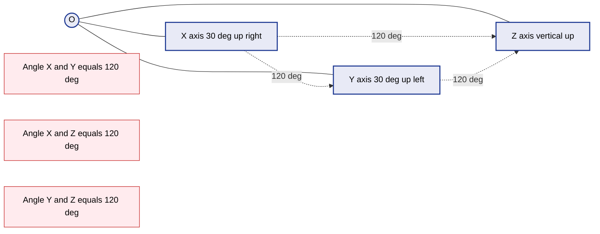
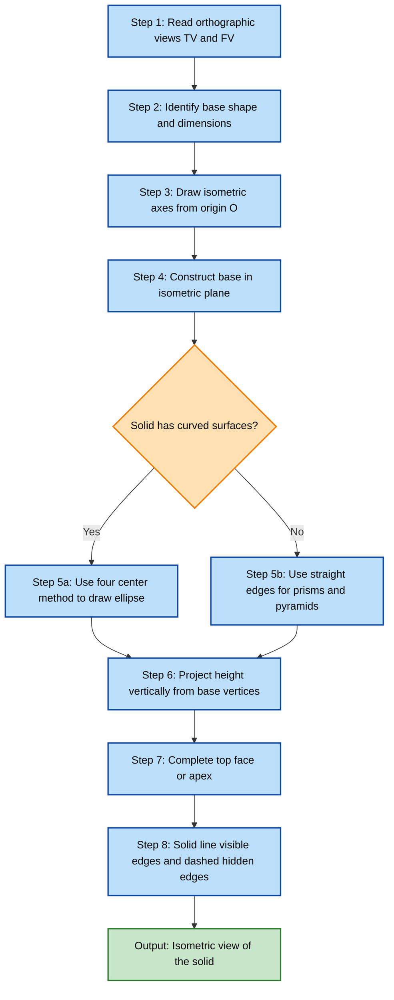
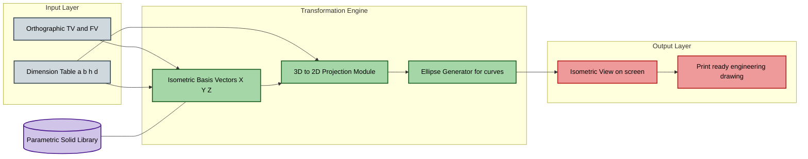
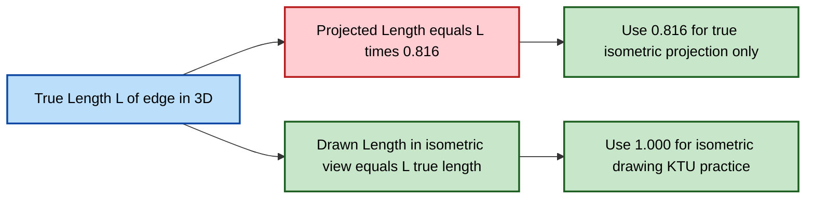

# Isometric scale- Isometric View and Projections of Prisms, Pyramids, Cone, Cylinder, Sphere, Hemisphere and their combinations

<!-- SECTION_1_START -->

# Isometric Projection & CAD — Foundations and Intuition

## 1.1 Formal KTU 2024 Definition

> [!IMPORTANT]
> **Isometric Projection** is a pictorial projection method in which a 3D object is represented on a 2D plane by rotating the object about an axis inclined to the projection plane so that the three principal axes (length, width, height) appear equally foreshortened and the angles between any two of them on the drawing are **120°** apart.

> [!NOTE]
> **Isometric View (Isometric Drawing)** is the actual drawing made on paper representing the object in isometric projection. In a true *isometric view*, the actual measurements of the object are used along the isometric axes (the foreshortening is *ignored* on paper, but the axes are still drawn at 30° to the horizontal).

> [!IMPORTANT]
> **Isometric Scale** is the ratio of the *foreshortened* length (as it would appear in true isometric projection) to the *true* length of the object. Theoretically:
> $$\text{Isometric Scale} = \sqrt{\frac{2}{3}} \approx 0.8165 \; (\approx \mathbf{0.816})$$

In **isometric view (drawing practice)**, however, we typically use the **Isometric Scale = 1** for simplicity, taking the true lengths along the axes. Only in formal *isometric projection* do we apply the 0.816 multiplier.

## 1.2 Conceptual Analogy — The Box from a Corner

Imagine you place a **transparent glass cube** on a table and look at it from one of its corners, such that all three edges (length, breadth, height) recede away from you equally.

- Each edge appears to make a **30°** angle with the horizontal base line.
- All three axes (X, Y, Z) appear **equally inclined**, like the spokes of a Mercedes-Benz logo rotated 90° to the left.
- You can see **three faces** (top, front, right) at the same time — this is the essence of isometric drawing.

> [!TIP]
> **Real-world examples**: Video game 3D worlds (e.g., *Diablo*, *SimCity* classic), engineering assembly diagrams, machine component drawings in service manuals, and architectural axonometric plans.

## 1.3 Standard Constants & Conventions

| Parameter | Value | Bold Marker |
|-----------|-------|-------------|
| Angle between isometric axes (each pair) | **120°** | ✅ |
| Angle of each axis with horizontal | **30°** | ✅ |
| True Isometric Scale (Projection) | **0.816** (≈ √(2/3)) | ✅ |
| Practical Isometric Scale (Drawing) | **1 : 1** (True lengths) | ✅ |
| Foreshortening factor | **0.8165** | ✅ |

> [!VISUALIZATION CONTROL]
> **Concept:** The Isometric Axes Configuration
> **GeoGebra / Desmos Input Equations:**
> * `f1(x) = tan(30°)*x` (right rising axis X)
> * `f2(x) = -tan(30°)*x` (left rising axis Y)
> * `x = 0` (vertical axis Z)
> **Visual Description:** Three lines emanating from a single origin, the right one rising at 30° above horizontal, the left one rising at 30° above horizontal (mirror), and the third being perfectly vertical. The angle between any two is 120°.

---

<!-- SECTION_1_END -->

<!-- SECTION_2_START -->

# Deep Theoretical Analysis & KTU High-Yield Formula Sheet

## 2.1 The Three Isometric Axes

The three principal edges of a cube — meeting at the corner nearest to the observer — are drawn as three lines:

- **X-axis**: drawn at **30°** to the horizontal, going upward to the **right** (length direction).
- **Y-axis**: drawn at **30°** to the horizontal, going upward to the **left** (width direction).
- **Z-axis**: drawn **vertical** (height direction).

> [!NOTE]
> The axes are labeled in cyclic order. The angle from +X to +Y (counter-clockwise through +Z) is always 120°.

## 2.2 Why Isometric Scale = √(2/3)? — Conceptual Reasoning

When a cube of side $L$ is rotated so that its body diagonal aligns with the line of sight, each edge is inclined to the picture plane. The projection of an edge of true length $L$ onto the isometric plane is:

$$\text{Projected Length} = L \cdot \cos(\alpha)$$

where $\alpha$ is the angle between the edge and the plane of projection. For a unit cube rotated so that the body diagonal is perpendicular to the projection plane:

$$\alpha = \arccos\!\left(\sqrt{\frac{2}{3}}\right) \;\;\Rightarrow\;\; \text{Projected length} = L \cdot \sqrt{\frac{2}{3}}$$

Hence the **isometric scale** is $\sqrt{2/3} \approx 0.816$.

## 2.3 Step-by-Step Operational Procedure for Isometric View of a Solid

For a prism, pyramid, cylinder, cone, sphere, or combination:

1. **Identify the base** of the solid (the face with the largest area) and orient it in the **VP (Vertical Plane)** as per orthographic projection conventions.
2. **Enclose the orthographic top view** inside a bounding rectangle.
3. Transfer the **base shape** onto the isometric axes. For example, a square base becomes a **rhombus** in isometric (since it's seen at an angle).
4. Mark the **height** of the solid vertically upward from each vertex of the base.
5. **Join the upper points** appropriately to obtain the top face.
6. **Draw the visible edges in thick continuous lines** and hidden edges as dashed (in actual practice, hidden lines are often omitted in isometric views for clarity).
7. **Offset method for curves**: For cylinders, cones, and spheres, draw an isometric *square* (rhombus) of side equal to the diameter, and inscribe the curve within it.

## 2.4 KTU High-Yield Formula Sheet

| Solid Type | Base Shape in Isometric | Curve / Special Construction | Foreshortening Rule |
|------------|------------------------|------------------------------|---------------------|
| **Square Prism** | Rhombus of side $a$ | Top rhombus shifted by $h$ | All edges true length |
| **Rectangular Prism (Cuboid)** | Rhombus of sides $l, b$ | Top rhombus shifted by $h$ | All edges true length |
| **Hexagonal Prism** | Hexagon skewed along 30° axes | Top hexagon shifted by $h$ | All edges true length |
| **Square Pyramid** | Rhombus of side $a$ | Apex at vertical height $h$ above base center | Apothem foreshortened by $\vert\cos 54.74°\vert \approx 0.577$ |
| **Cone** | Rhombus inscribed in ellipse | Apex shifted by $h$; base is ellipse with minor axis $d$ along vertical | Use offset square for ellipse |
| **Cylinder** | Rhombus inscribed ellipse for base | Top ellipse shifted by $h$ | End circles → ellipses (major axis $d$, minor axis $0.576d$) |
| **Sphere** | Circle of diameter $d$ | Stay a circle (no change) | No foreshortening needed |
| **Hemisphere** | Circle of diameter $d$ | Half-circle; flat side becomes an ellipse (radius $d/2$, height $d/2$) | Symmetry preserved |
| **Combinations** | Compose bases & merge heights | Visual blending of surfaces | Apply rules per sub-solid |

> [!WARNING]
> The **minor axis of the ellipse** representing a circle in isometric is always **0.576 × diameter** (or roughly 3/5 of the major axis). The major axis of the ellipse for the **top face** is horizontal, and for the **side face** it is inclined at 30° to horizontal. This is a common mark-deduction point in KTU valuation.

## 2.5 Engineering Utility

| Field | Application |
|-------|-------------|
| **Mechanical CAD** | Assembly drawings, exploded views, service manuals |
| **Architecture** | Massing studies, axonometric site plans, BIM visualization |
| **Game Design** | Classic isometric RPGs (*Baldur's Gate*, *Torchlight*) |
| **Manufacturing** | Tooling layout, fixture design, ergonomic mock-ups |
| **Piping & HVAC** | Isometric piping drawings (P&ID) for plant layout |

---

<!-- SECTION_2_END -->

<!-- SECTION_3_START -->

# Step-by-Step Derivations & CAD Implementation

## 3.1 Mathematical Derivation of Isometric Scale

Consider a unit cube of side $1$ with edges along the X, Y, Z axes. The body diagonal of the cube has length $\sqrt{3}$. To get the isometric view, we rotate the cube such that the body diagonal aligns with the line of sight.

Let the body diagonal vector be:
$$\vec{D} = (1, 1, 1) \cdot \text{scale}$$

The normalized direction is $\hat{D} = \frac{1}{\sqrt{3}}(1, 1, 1)$.

The angle between the body diagonal and any axis (say the X-axis) is given by:
$$\cos\theta = \hat{D} \cdot \hat{X} = \frac{1}{\sqrt{3}} \approx 0.5774$$

Hence:
$$\theta = \arccos(0.5774) \approx 54.74°$$

The projection of an edge of unit length along the X-axis onto a plane **perpendicular to the body diagonal** is:
$$L_{\text{proj}} = L \cdot \sin\theta = 1 \cdot \sin(54.74°) = \sqrt{\frac{2}{3}}$$

Expanding:
$$\sin^2(54.74°) = 1 - \cos^2(54.74°) = 1 - \frac{1}{3} = \frac{2}{3}$$
$$\Rightarrow L_{\text{proj}} = \sqrt{\frac{2}{3}} \approx 0.8165$$

So the **isometric scale** is $\sqrt{2/3}$.

> [!IMPORTANT]
> When drawing a 3D solid on paper, KTU practice allows students to take **isometric scale = 1** (i.e., use true lengths) to simplify construction. This is called an **isometric view** or **isometric drawing**, not a true *isometric projection*.

## 3.2 Construction Algorithm for Isometric View of Solids

The general KTU-approved step-by-step procedure:

1. Draw the isometric axes (X at 30° to the right-up, Y at 30° to the left-up, Z vertical).
2. Mark the lengths of the base along X and Y axes from origin $O$.
3. Complete the base shape (parallelogram for square/rectangular; rhombus-inscribed hexagon for hexagonal; etc.).
4. From the corresponding base vertices, draw vertical lines of length $h$ to locate the top vertices.
5. Complete the top face.
6. For solids with curved surfaces (cone, cylinder, sphere, hemisphere), use the **offset rhombus method**:
   - Enclose the circle in a square. Project the square's corners onto isometric axes to form a rhombus.
   - Mark the midpoints of the rhombus sides — these are the **extreme points** of the inscribed ellipse.
   - Draw the ellipse through these four points using the four-center method or offset curves.
7. Solid-line the visible edges; dimension as per KTU drafting standards (using the **aligned dimensioning system** since aligned dimensions lie on inclined faces).

## 3.3 Worked Example — Square Pyramid (Base $a = 40$ mm, Height $h = 50$ mm)

**Given**: Square pyramid, base side $a = 40$ mm, height $h = 50$ mm, resting on HP on its base, with one side of base parallel to VP.

**Solution steps**:

1. **Draw isometric axes** $OX$, $OY$, $OZ$.

2. **Mark the base square** as a rhombus in isometric:
   - From $O$, go $a = 40$ mm along $+X$ to $A$.
   - From $O$, go $a = 40$ mm along $+Y$ to $B$.
   - From $A$, go parallel to $+Y$ to $D$ (so $\overline{AD} = 40$ mm).
   - From $B$, go parallel to $+X$ to $C$ (so $\overline{BC} = 40$ mm).
   - Join $A \to D$, $B \to C$, $C \to D$ to form rhombus $ABCD$.

3. **Locate the center of the base**:
   - Draw diagonals $AC$ and $BD$; they intersect at $O_1$, the center of the base.

4. **Project the apex**:
   - From $O_1$, draw a vertical line of length $h = 50$ mm upward to $V$ (apex).

5. **Complete the pyramid**:
   - Join $V$ to all four base vertices $A, B, C, D$ with solid lines (these are the slant edges).

6. **Visible/Hidden lines**:
   - All four slant edges $\overline{VA}, \overline{VB}, \overline{VC}, \overline{VD}$ are visible.
   - Base edges in the back are hidden — draw them as **dashed** (or omit per KTU convention).

7. **Dimensioning**: Add isometric dimensions showing base side and height.

## 3.4 Worked Example — Cone (Base diameter $d = 50$ mm, Height $h = 60$ mm)

**Solution steps**:

1. **Draw the isometric axes** $OX, OY, OZ$.

2. **Construct the base rhombus**:
   - From $O$, go $d/2 = 25$ mm along $+X$ to point $P$.
   - From $O$, go $d/2 = 25$ mm along $+Y$ to point $Q$.
   - From $P$, go parallel to $+Y$ for 50 mm to $R$.
   - From $Q$, go parallel to $+X$ for 50 mm to $S$.
   - Join to form rhombus $PQRS$ (the isometric square that encloses the circular base).

3. **Locate the major and minor axes of the base ellipse**:
   - Major axis: parallel to $X$-axis through the midpoints of $PQ$ and $RS$, length = $d = 50$ mm.
   - Minor axis: along the perpendicular bisector, length = $0.576 \cdot d \approx 28.8$ mm.

4. **Draw the base ellipse** using the four-center method (locate the four centers $C_1, C_2, C_3, C_4$ along the diagonals of the rhombus and strike arcs).

5. **Locate the apex**:
   - Mark the center of the base $O_1$ (intersection of rhombus diagonals).
   - From $O_1$, draw a vertical line of length $h = 60$ mm to point $A$ (apex).

6. **Join the apex to the endpoints of the base ellipse** with two tangent lines:
   - The lines from $A$ tangent to the ellipse define the cone's slant surface.

7. **Complete the outline** by drawing the visible portion of the base ellipse (typically the front half in solid line, the back half in dashed or omitted).

## 3.5 Python Code — Isometric Projection of a Cylinder and Cone (CAD Style)

```python
"""
isometric_cad.py
Implements isometric projection of a cylinder and a cone in 2D.
Uses isometric scale = 1 (true lengths) per KTU drawing practice.
"""
import math
from dataclasses import dataclass
from typing import List, Tuple


# --- 1. Geometry primitives ----------------------------------------------
@dataclass(frozen=True)
class Point2D:
    x: float
    y: float

    def __add__(self, other: "Point2D") -> "Point2D":
        return Point2D(self.x + other.x, self.y + other.y)

    def scale(self, k: float) -> "Point2D":
        return Point2D(self.x * k, self.y * k)


# --- 2. Isometric basis vectors ------------------------------------------
# X axis: 30 deg to horizontal, going up-right.
# Y axis: 30 deg to horizontal, going up-left.
# Z axis: vertical.
ANGLE_DEG: float = 30.0
ANGLE_RAD: float = math.radians(ANGLE_DEG)
ISO_X: Point2D = Point2D(math.cos(ANGLE_RAD), math.sin(ANGLE_RAD))
ISO_Y: Point2D = Point2D(-math.cos(ANGLE_RAD), math.sin(ANGLE_RAD))
ISO_Z: Point2D = Point2D(0.0, -1.0)  # screen-y points downward, so invert


def project(px: float, py: float, pz: float,
            origin: Point2D = Point2D(0.0, 0.0)) -> Point2D:
    """Convert 3D world coordinates to 2D isometric screen coordinates."""
    iso: Point2D = (ISO_X.scale(px) + ISO_Y.scale(py) + ISO_Z.scale(pz))
    return Point2D(origin.x + iso.x, origin.y + iso.y)


# --- 3. Ellipse representing a circle in isometric ----------------------
def circle_to_ellipse_pts(center: Point2D, radius: float,
                          n: int = 64) -> List[Point2D]:
    """
    A circle in 3D (lying on the base, i.e., XY plane) projects to an
    ellipse in isometric view. The ellipse is approximated by sampling
    'n' points and transforming each via the isometric basis.
    """
    pts: List[Point2D] = []
    for i in range(n):
        theta: float = 2.0 * math.pi * i / n
        wx: float = center.x + radius * math.cos(theta)
        wy: float = center.y + radius * math.sin(theta)
        wz: float = 0.0
        # project onto isometric plane, then offset by world origin (0,0)
        pts.append(project(wx, wy, wz))
    return pts


# --- 4. Build cylinder outline -------------------------------------------
def cylinder_outline(diameter: float, height: float,
                     n: int = 64) -> Tuple[List[Point2D], List[Point2D]]:
    """
    Return (base_ellipse_pts, top_ellipse_pts) for a vertical cylinder.
    """
    r: float = diameter / 2.0
    # 2D world base center at (0, 0) and top center at (0, 0, height)
    base_2d: List[Point2D] = circle_to_ellipse_pts(Point2D(0.0, 0.0), r, n)
    top_2d: List[Point2D] = []
    for p in base_2d:
        # Lift each sampled point by 'height' along Z, then re-project.
        iso_p: Point2D = Point2D(p.x, p.y)
        lifted: Point2D = iso_p + ISO_Z.scale(height)
        top_2d.append(lifted)
    return base_2d, top_2d


# --- 5. Build cone outline -----------------------------------------------
def cone_outline(diameter: float, height: float,
                 n: int = 64) -> Tuple[Point2D, List[Point2D]]:
    """
    Return (apex_2d, base_ellipse_pts) for a vertical cone.
    The apex is the single 3D point (0, 0, height).
    """
    r: float = diameter / 2.0
    apex_2d: Point2D = project(0.0, 0.0, height)
    base_2d: List[Point2D] = circle_to_ellipse_pts(Point2D(0.0, 0.0), r, n)
    return apex_2d, base_2d


# --- 6. Console output for verification ---------------------------------
def print_points(label: str, pts: List[Point2D]) -> None:
    print(f"--- {label} (first 5 points) ---")
    for p in pts[:5]:
        print(f"  ({p.x:8.3f}, {p.y:8.3f})")
    print(f"  ... (total {len(pts)} points)")


if __name__ == "__main__":
    try:
        # Cylinder d=50, h=60
        base_c, top_c = cylinder_outline(50.0, 60.0)
        print_points("Cylinder Base Ellipse", base_c)
        print_points("Cylinder Top Ellipse", top_c)

        # Cone d=50, h=60
        apex, base_cone = cone_outline(50.0, 60.0)
        print(f"Cone Apex 2D: ({apex.x:8.3f}, {apex.y:8.3f})")
        print_points("Cone Base Ellipse", base_cone)

        # Sphere d=50 (circle of diameter 50 in 3D, projects to circle)
        sphere_pts: List[Point2D] = circle_to_ellipse_pts(
            Point2D(0.0, 0.0), 25.0
        )
        print_points("Sphere (circle in iso)", sphere_pts)

    except Exception as exc:
        import logging
        logging.error(f"CAD generation failed: {exc}", exc_info=True)
        raise
```

> [!NOTE]
> **Key engineering insight**: A *sphere* in isometric projection is *still a circle* (it is the only solid for which isometric projection does not require any foreshortening on the visible silhouette). A *circle* in the base plane becomes an *ellipse* with major axis = diameter and minor axis ≈ 0.576 × diameter.

## 3.6 Common Offsets for the Four-Center Method (Quick Reference)

For a circle of diameter $d$ in isometric, the offset rhombus has side $d$. The four centers for the four-arc ellipse are located at distance $\frac{d}{2} \cdot \sec(30°) \approx 0.577\,d$ from the rhombus center along each diagonal.

The radii of the four arcs are:
- Two larger arcs of radius $R_1 = \frac{d}{\sqrt{3}} \approx 0.577\,d$
- Two smaller arcs of radius $R_2 = \frac{d}{2\sqrt{3}} \approx 0.289\,d$

---

<!-- SECTION_3_END -->

<!-- SECTION_4_START -->

# Structural Diagrams & Schematics

## 4.1 Isometric Axes Reference Diagram



## 4.2 Operational Flow — Isometric Construction Procedure



## 4.3 Block Architecture — CAD Pipeline for Isometric Generation



## 4.4 Solid-Specific Construction Matrix (Sequential Topology)

```mermaid
flowchart TD
    classDef prismBox stroke:#1565c0,stroke-width:2px,fill:#90caf9,color:#000
    classDef pyramidBox stroke:#6a1b9a,stroke-width:2px,fill:#ce93d8,color:#000
    classDef curveBox stroke:#00838f,stroke-width:2px,fill:#80deea,color:#000
    classDef comboBox stroke:#ef6c00,stroke-width:2px,fill:#ffcc80,color:#000

    squarePrism["Square Prism: base rhombus plus top rhombus shifted by h"]:::prismBox
    rectPrism["Rectangular Prism: parallelogram base plus shifted parallelogram top"]:::prismBox
    hexPrism["Hexagonal Prism: skewed hexagon base plus shifted top"]:::prismBox
    triPrism["Triangular Prism: triangle base plus shifted triangle top"]:::prismBox

    sqPyramid["Square Pyramid: rhombus base plus single apex above center"]:::pyramidBox
    hexPyramid["Hexagonal Pyramid: hexagon base plus apex above center"]:::pyramidBox

    cylinder["Cylinder: base ellipse plus top ellipse plus two tangent lines"]:::curveBox
    cone["Cone: base ellipse plus single apex plus two tangent lines"]:::curveBox
    sphere["Sphere: circle of diameter d no change"]:::curveBox
    hemisphere["Hemisphere: half circle with flat ellipse on base"]:::curveBox

    combo1["Cylinder plus Cone on top: combine cylinder and cone outlines"]:::comboBox
    combo2["Cube plus Hemisphere on top: combine prism and hemisphere"]:::comboBox
    combo3["Slab plus Cylinder: combine cuboid and cylindrical surface"]:::comboBox
```



## 4.5 Isometric Scale — Foreshortening Logic Map



---

<!-- SECTION_4_END -->

<!-- SECTION_5_START -->

# KTU 2024 Scheme Examination Question Bank & Topic Recap

## 5.1 Part A — Short Answer Questions (3 Marks each)

### Question A1
**[KTU University Exam — July 2023]**
**CO1, Remember**
*Define isometric projection. State the angles between the three isometric axes.*

**Model Answer (3 Marks)**:
- **Definition [1 Mark]**: Isometric projection is a pictorial projection in which all three principal dimensions of an object are equally foreshortened and the three principal edges make equal angles with each other on the projection plane.
- **Angles [2 Marks]**: The angle between any two of the three isometric axes is **120°**, and each axis is inclined at **30°** to the horizontal.

### Question A2
**[KTU University Exam — Dec 2023]**
**CO1, Understand**
*What is isometric scale? Why is it not used in isometric drawing?*

**Model Answer (3 Marks)**:
- **Isometric scale definition [1 Mark]**: It is the ratio of the foreshortened length to the true length, equal to $\sqrt{2/3} \approx 0.816$.
- **Reason for non-use [2 Marks]**: In isometric *drawing* (KTU practical), true lengths are used along the axes to simplify construction. The foreshortening effect is ignored on paper but the axes still appear at 30° to horizontal, giving a visually accurate 3D representation without the inconvenience of scaling every measurement by 0.816.

---

## 5.2 Part B — Long Answer Questions (14 Marks each, Internal Choice)

### Question B1 — Option A (14 Marks)

**[KTU University Exam — July 2024]**
**CO2, Apply + Analyze**

A square pyramid of base side **40 mm** and height **50 mm** is resting on its base on the HP with one side of the base parallel to the VP. Draw the **isometric view** of the pyramid.

**Model Solution**:

**Step 1 — Draw isometric axes** [2 Marks]:
Draw three lines from origin $O$: $OX$ at 30° to horizontal (right-up), $OY$ at 30° to horizontal (left-up), and $OZ$ vertical.

**Step 2 — Construct the base rhombus** [3 Marks]:
- From $O$, mark $OA = 40$ mm along $+X$ to point $A$.
- From $O$, mark $OB = 40$ mm along $+Y$ to point $B$.
- From $A$, draw a line parallel to $OY$ of length 40 mm to point $D$.
- From $B$, draw a line parallel to $OX$ of length 40 mm to point $C$.
- Complete rhombus $ABCD$ by joining $D \to C$.

**Step 3 — Locate the center of the base** [2 Marks]:
- Draw diagonals $\overline{AC}$ and $\overline{BD}$. Their intersection $O_1$ is the center of the base.

**Step 4 — Project the apex** [2 Marks]:
- From $O_1$, draw a vertical line of length 50 mm upward. The topmost point is the apex $V$.

**Step 5 — Complete the pyramid** [3 Marks]:
- Join $V$ to $A$, $B$, $C$, $D$ with solid lines (slant edges visible).
- Mark the back base edges as dashed (or omit as per KTU convention).

**Step 6 — Add dimensions** [2 Marks]:
- Show the base side and height using aligned dimensioning along the isometric axes.

> [!WARNING]
> **KTU Examiner's Pitfall Alert**:
> - *Do not* project the apex directly from $O$ — it must be from the **center $O_1$** of the rhombus base. [-2 Marks penalty]
> - Slant edges must be **solid lines** (visible), not dashed. [-1 Mark]
> - The base side in the rhombus must be the **true length** (40 mm), not 40 × 0.816. [-2 Marks]

---

### Question B1 — Option B (14 Marks)

**[KTU University Exam — Dec 2023]**
**CO2, Apply + Analyze**

A right circular cone of base diameter **50 mm** and height **60 mm** rests on its base on the HP. Draw the **isometric view** of the cone.

**Model Solution**:

**Step 1 — Isometric axes** [2 Marks]:
Draw $OX$, $OY$, $OZ$ from origin $O$.

**Step 2 — Construct the bounding rhombus of the base** [3 Marks]:
- From $O$, go $d = 50$ mm along $+X$ to $P$.
- From $O$, go $d = 50$ mm along $+Y$ to $Q$.
- From $P$, draw a line parallel to $+Y$ of length 50 mm to $R$.
- From $Q$, draw a line parallel to $+X$ of length 50 mm to $S$.
- Join to form rhombus $PQRS$ enclosing the circular base.

**Step 3 — Draw the base ellipse (four-center method)** [4 Marks]:
- Locate the four centers $C_1, C_2, C_3, C_4$ along the diagonals of the rhombus.
- Strike arcs of radii $R_1 = 0.577 \times 50 \approx 28.85$ mm and $R_2 = 0.289 \times 50 \approx 14.45$ mm to form the ellipse.
- The major axis of the ellipse is along the $X$-direction (50 mm); minor axis is vertical ($0.576 \times 50 = 28.8$ mm).

**Step 4 — Locate the apex** [2 Marks]:
- Find center $O_1$ of the rhombus (intersection of diagonals $PR$ and $QS$).
- From $O_1$, draw a vertical line of length 60 mm to apex $A$.

**Step 5 — Tangent lines from apex to ellipse** [2 Marks]:
- Draw two lines from $A$ tangent to the base ellipse. These define the cone's lateral surface.
- The portion of the ellipse in the front is solid; the back portion may be dashed.

**Step 6 — Final outline and dimensioning** [1 Mark]:
- Add height dimension (60 mm) and base diameter dimension (50 mm).

> [!WARNING]
> **KTU Examiner's Pitfall Alert**:
> - The minor axis of the ellipse is **0.576 × d** (≈ 28.8 mm), **not 50 mm**. [-2 Marks]
> - The apex must be projected from the **rhombus center**, not the origin. [-2 Marks]
> - Tangent lines from apex must be drawn to the **ellipse**, not the rhombus. [-1 Mark]

---

## 5.3 KTU Examiner's Valuation Warning (General)

> [!WARNING]
> **Common mark-loss patterns in KTU 2024 evaluations**:
> 1. **Forgetting hidden lines** — hidden edges of solids must be shown as dashed for full marks in formal *isometric projection*; they are often optional in *isometric view*.
> 2. **Wrong ellipse minor axis** — using $0.5d$ or $d$ instead of $0.576d$. This is a recurring deduction point.
> 3. **Misplaced apex** — placing the apex of a cone or pyramid directly above the origin rather than the *center of the base* in isometric. Lose up to 2 marks.
> 4. **Incorrect angle of axes** — drawing axes at 45° (oblique/cabinet) instead of 30° (isometric). This fundamentally changes the projection type.
> 5. **Omitting the bounding rhombus** for curved solids — the rhombus construction is essential to justify the ellipse's geometry. Always show construction lines.
> 6. **Dimensioning along the true length axis** in isometric — KTU requires **aligned dimensioning** where the dimension line is parallel to the isometric axis, and the value is the *true* length.

---

## 5.4 Topic Recap & Important Things to Remember

> [!TIP]
> **Rapid-revision checklist — must memorize for KTU 2024 exam**:

- **Isometric Projection**: True pictorial projection with all three axes at 120° to each other and all edges equally foreshortened by factor 0.816.
- **Isometric View / Drawing**: Practical drawing on paper where true lengths are used along the axes (scale = 1).
- **Isometric Scale**: $\sqrt{2/3} \approx 0.816$ (used only in formal *projection*, not in *drawing*).
- **Isometric axes angles**: 30° to horizontal for $X$ and $Y$, vertical for $Z$. Angle between any two axes = **120°**.
- **Circle in isometric plane** becomes an **ellipse** with major axis = diameter and minor axis = **0.576 × diameter**.
- **Sphere in isometric** remains a **circle** of the same diameter.
- **Hemisphere**: The flat circular base becomes an ellipse; the curved surface is half of a sphere (a semicircle in the projection).
- **Pyramid apex** must be projected from the **center of the rhombus base**, not from the origin.
- **Cone apex** must be projected from the **center of the base ellipse / rhombus**, not from the origin.
- **Cylinder**: Two ellipses (base and top) connected by two vertical tangent lines.
- **Prism**: A bottom parallelogram and a top parallelogram connected by vertical edges.
- **Four-center method** is the standard KTU-approved technique to draw ellipses for circle bases in isometric.
- **Hidden lines** are typically drawn as dashed short lines in formal isometric *projection*; in *view*, they are commonly omitted for clarity.
- **Dimensioning** in isometric uses *aligned dimensions* along the isometric axes with **true-length values** (not 0.816-scaled values).
- **Combinations of solids**: Construct each sub-solid separately, then merge the common edges/surfaces and remove internal lines.
- **KTU answer writing**: Always state the **isometric scale being used** (1 for drawing, 0.816 for projection) before starting the construction. Marks are awarded for the explicit statement.
- **Construction visibility**: Always show the construction lines (axes, rhombus, ellipse centers) as thin lines, and the final solid outline as thick continuous lines.

---

<!-- SECTION_5_END -->
