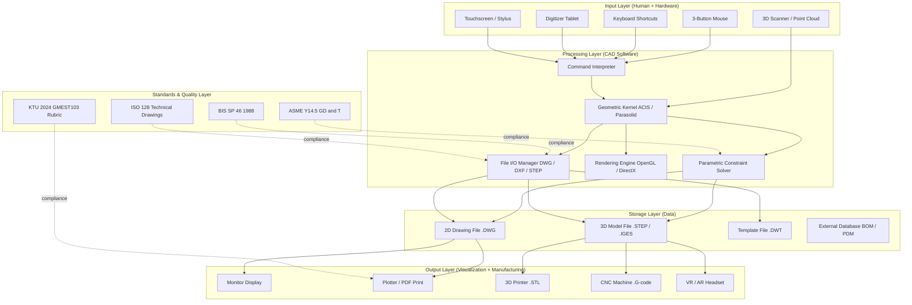
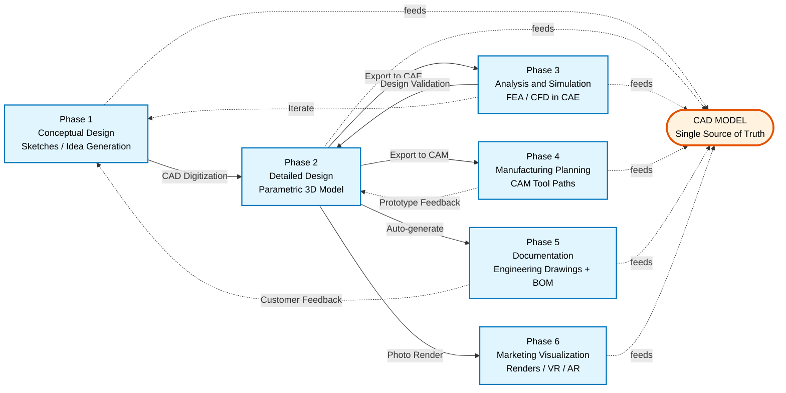
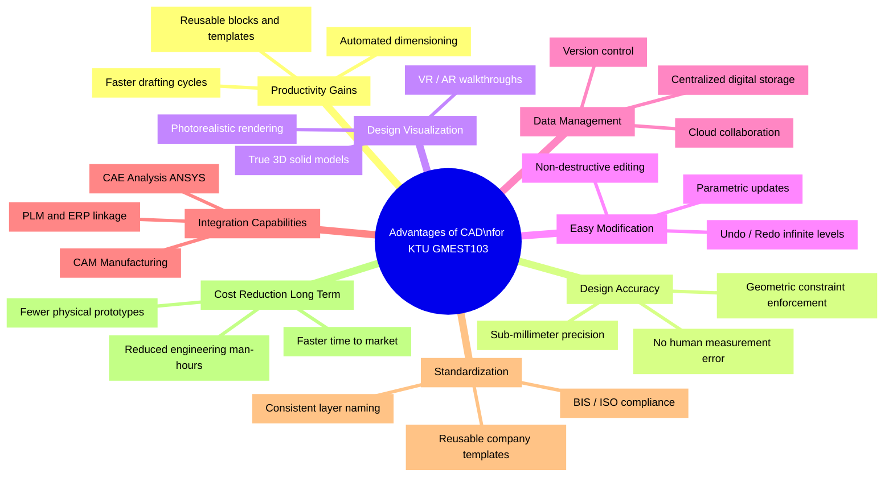
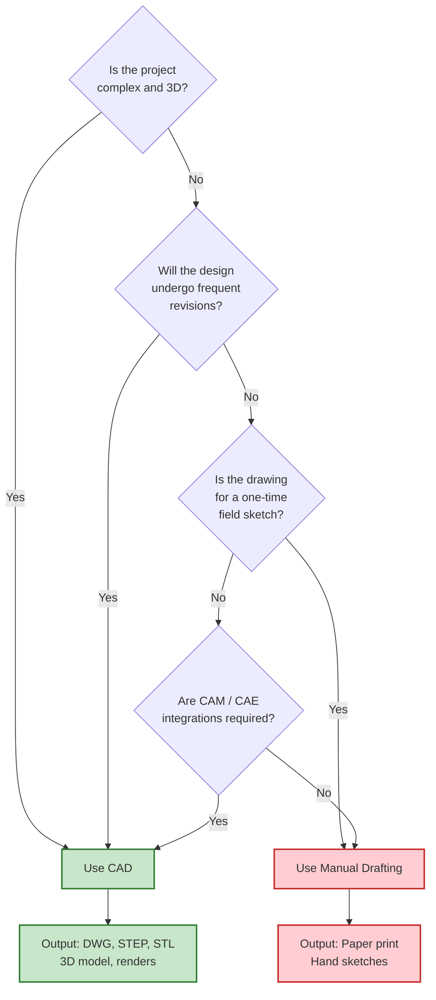

# Computer Aided Drawing (CAD): Introduction, Role of CAD in design and development of new products, Advantages of CAD.

<!-- SECTION_1_START -->
# 🖥️ Computer Aided Drawing (CAD): Core Foundation

## 📘 Formal KTU 2024 Definition

**Computer Aided Drafting (CAD)** — also termed **Computer Aided Design** — is the use of computer systems to assist in the **creation, modification, analysis, and optimization of a technical design**. It involves both software and special-purpose hardware. CAD output is frequently in the form of electronic files used for **printing documents, manufacturing instructions, or 3D model visualization**.

In the context of **Engineering Graphics (GMEST103)**, CAD refers specifically to the use of software tools (such as **AutoCAD**, **SolidWorks**, **CATIA**, **Creo**, or open-source alternatives like **FreeCAD** and **OpenSCAD**) to produce **2D engineering drawings** and **3D solid/surface models** that comply with **Bureau of Indian Standards (BIS) – SP 46:1988** drafting conventions adopted by **APJ Abdul Kalam Technological University (KTU)**.

> [!IMPORTANT]
> **KTU 2024 Syllabus Highlight (GMEST103 – Module 4 Context):**
> While the primary technical focus of this module is **Isometric Projection** and the construction of the **Isometric Scale** (≈ **0.816** of the true length), the *drafting medium* used to produce these views is now exclusively **CAD-based**. Students must learn to:
> - Set up **ISO metric drawing sheets** (A4: 210 × 297 mm standard).
> - Construct isometric views digitally using CAD commands (e.g., `DSETTINGS`, `ISOPLANE`, `COPY`, `ROTATE`).
> - Apply the **isometric projection angle of 30°** to receding axes.

---

## 🧠 Conceptual Analogy / Intuition

Imagine you are an architect in 1750. To design a cathedral, you would sit at a wooden drafting table with a **T-square**, **set squares** (45°/30°-60°), a **compass**, a **ruling pen**, and India ink. Every line you draw is **permanent** — one slip of the hand ruins hours of work. To produce an isometric view, you must manually measure the **foreshortened length** using the **isometric scale** (0.816× true length) and carefully rotate your set square to **30°** from the horizontal.

Now imagine the same architect in 2024. They sit before a **dual-monitor workstation** running **AutoCAD 2025**. They type `ISO` at the command line, click the **Drafting Settings** dialog, switch the **Snap and Grid** tab to *"Isometric snap"*, and now every crosshair snap locks automatically to the **30° isometric axes**. The mouse drag replaces the compass. `Ctrl + Z` (Undo) replaces the eraser. A 3D model can be rotated, exploded, sectioned, and dimensioned in seconds.

**CAD is, therefore, the digital reincarnation of the drafting table — but with infinite undo, perfect precision, and the ability to generate any orthographic or pictorial view from a single 3D master model.**

> [!NOTE]
> **Key Insight for KTU Students:**
> The *geometric principles* of isometric projection (the **30° axes**, the **isometric scale ratio of √2/√3 ≈ 0.816**, the equal foreshortening of X, Y, Z axes) have **not changed** since the 19th century. What CAD changes is the *speed, accuracy, and reproducibility* of producing these views.

---

## ⚙️ Physical & Mathematical Constants Used in CAD-Based Isometric Drafting

| Constant / Metric | Value | Use in CAD |
|---|---|---|
| **Isometric Axis Angle** | **30°** from horizontal | Set via `DSETTINGS` → Snap & Grid → Isometric snap |
| **Isometric Scale Factor** | **0.816** (≈ √(2/3)) | Used in manual drafts; CAD plots **true length** directly |
| **True Length Multiplier** | **1 / 0.816 = 1.2247** | Converts foreshortened length to true length |
| **Standard Sheet Sizes (ISO A-Series)** | A0, A1, A2, A3, A4 | Configured in **Layout / Page Setup Manager** |
| **A4 Dimensions** | **210 mm × 297 mm** | Default submission size for KTU lab records |
| **Drawing Units (Metric)** | **Millimeters (mm)** | Standard for KTU 2024 GMEST103 submissions |
| **Line Type Scale (LTSCALE)** | Typically **1.0** | Adjusts dashed/center line dash gaps |
| **Dimension Style (DIMSTYLE)** | **ISO-25** | BIS-conformant arrowheads and text height |

> [!VISUALIZATION CONTROL]
> **Concept:** The three isometric axes (X, Y, Z) emanating from a common origin at 30° above and below the horizontal.
>
> **GeoGebra / Desmos Input Equations:**
> * `f(x) = (x, 0)` — the horizontal reference line
> * `g(x) = (\sqrt{3} \cdot x, x)` — the X-axis at +30°
> * `h(x) = (-\sqrt{3} \cdot x, x)` — the Y-axis at +30° (mirrored)
> * `k(x) = (0, x)` — the vertical Z-axis
>
> **Visual Description:** The student should see **three lines** of equal length radiating from a single origin. The two slanted lines form a **60° "V"** at the top, while the vertical line bisects this V. All three lines appear visually equal in length because the view is constructed using the **isometric scale (0.816)**, NOT the true length.

---

## 🏭 Where CAD is Used in Industry (KTU 2024 Real-World Mapping)

| Industry Sector | CAD Software Predominantly Used | Application |
|---|---|---|
| **Mechanical / Automotive** | SolidWorks, CATIA, Creo, NX | Engine block design, chassis, sheet metal |
| **Architecture (AEC)** | AutoCAD, Revit, ArchiCAD | Floor plans, elevations, BIM models |
| **Civil / Structural** | STAAD Pro, AutoCAD Civil 3D | Bridge design, road alignment |
| **Electrical / Electronics** | EAGLE, KiCad, Altium Designer | PCB layout, schematic capture |
| **Aerospace** | CATIA, NX | Aircraft fuselage, turbine blade design |
| **Biomedical** | SolidWorks, Mimics | Prosthetic design, implant modeling |
| **Fashion / Textile** | CLO 3D, Browzwear | Garment pattern drafting |
| **Animation / Gaming** | Blender, Maya, ZBrush | Character and environment modeling |

---

<!-- SECTION_2_END -->

<!-- SECTION_2_START -->
# 🔬 Deep Theoretical Analysis: CAD Architecture & Workflow

## 📐 1. The Five Pillars of CAD

CAD is not a single piece of software — it is an **integrated ecosystem** built on five foundational pillars. Each pillar represents a distinct stage in the digital design pipeline.

### Pillar 1 — **Hardware Platform**
The physical computer on which the CAD software runs. Minimum KTU 2024 lab specification for smooth AutoCAD 2025 operation:
- **Processor (CPU):** Intel Core i5 (10th gen) or AMD Ryzen 5
- **RAM:** **8 GB minimum** (16 GB recommended for 3D)
- **Graphics Card (GPU):** Dedicated GPU with **2 GB VRAM** (NVIDIA Quadro / AMD Radeon Pro)
- **Storage:** **SSD** with at least **256 GB** free space
- **Display:** Full HD (1920 × 1080) or higher
- **Input Devices:** **3-button mouse** (essential for OSNAP), **digitizer tablet** (optional)

### Pillar 2 — **CAD Software (Application Layer)**
The program that provides drafting/modeling commands. Classified into:
- **2D Drafting (Low-end):** AutoCAD LT, DraftSight, LibreCAD
- **Mid-range 3D:** SolidWorks, Inventor, Creo Elements
- **High-end PLM:** CATIA, NX, Pro/ENGINEER
- **Open-source:** FreeCAD, OpenSCAD, Blender (mesh), SolveSpace

### Pillar 3 — **Operating System Environment**
Modern CAD runs on **Windows 10/11 (64-bit)**, **Linux (Ubuntu/CentOS)**, or **macOS**. The OS manages file I/O, memory allocation, and display rendering via the **graphics driver**.

### Pillar 4 — **Data Storage & File Management**
CAD files are saved in formats like:
- **.DWG** — AutoCAD native format (proprietary)
- **.DXF** — Drawing Exchange Format (open, for interoperability)
- **.STEP (.STP)** — ISO 10303 standard for 3D model exchange
- **.IGES** — Older neutral format (Initial Graphics Exchange Specification)
- **.STL** — Stereolithography (for 3D printing)
- **.PDF** — Universal read-only export for KTU submissions

### Pillar 5 — **Human Operator (CAD Designer/Engineer)**
The trained engineer who issues commands. The KTU GMEST103 course specifically trains the student to operate the software, interpret the geometry, and apply BIS drafting standards.

---

## 📐 2. CAD vs. Traditional Manual Drafting — Comparative Theory

| Parameter | Manual Drafting | CAD Drafting |
|---|---|---|
| **Tool** | T-square, set squares, compass, scale, protractor | Mouse, keyboard, digitizer |
| **Drawing Medium** | Paper / tracing sheet / vellum | Digital file (.DWG, .DXF) |
| **Precision** | Limited by human hand (≈ ±0.5 mm) | **Mathematically exact** (e.g., 0.0001 mm) |
| **Editability** | Erasing damages the sheet | **Non-destructive editing** with UNDO |
| **Duplication** | Re-tracing or photocopying | `COPY`, `MIRROR`, `ARRAY`, `OFFSET` commands |
| **Storage** | Physical cabinet (hundreds of sheets per drawer) | **Cloud / SSD** (thousands per GB) |
| **3D Capability** | Requires 3D clay/wire models | **Native 3D solid & surface modeling** |
| **Collaboration** | Physical handover / courier | **Email, cloud sharing, version control (Git)** |
| **Cost (Initial)** | Very low (pencil, paper) | **High (software license, hardware)** |
| **Cost (Long-term)** | High (man-hours for revisions) | **Low (automated revisions)** |
| **Standards Compliance** | Manual checking | **Automated via templates (.DWT) and standards** |

---

## 📐 3. The Role of CAD in the Product Design and Development (PDD) Cycle

CAD is the **central nervous system** of modern **Product Lifecycle Management (PLM)**. The KTU 2024 syllabus specifically asks about the "Role of CAD in Design and Development of New Products." The standard PDD cycle has **six phases**, and CAD plays a critical role in five of them:

### Phase 1 — **Conceptual Design**
- Brainstorming sketches are digitized using a stylus tablet or 3D sketch tools.
- CAD enables rapid **parametric exploration**: "What if the radius is 50 mm vs. 75 mm?"

### Phase 2 — **Detailed Design**
- The 3D parametric solid model is constructed using **features** (extrude, revolve, sweep, loft, fillet, chamfer).
- The model is constrained by **dimensions** and **geometric relations** (parallel, perpendicular, coincident, tangent).
- A single 3D model automatically generates **all** 2D orthographic views, sections, and isometric views.

### Phase 3 — **Analysis & Simulation (CAE Integration)**
- The CAD model is exported to **Finite Element Analysis (FEA)** software (ANSYS, Abaqus, COMSOL).
- Stress, strain, thermal, fluid (CFD), and modal analyses are performed.
- Design is optimized before any physical prototype is built — this is **virtual prototyping**.

### Phase 4 — **Manufacturing Process Planning (CAM Integration)**
- The CAD model drives **CNC machining**: tool paths are generated for milling, turning, wire-EDM.
- **3D Printing (Additive Manufacturing)**: STL files are sliced and printed directly.
- **Sheet metal nesting**: flat patterns are extracted from 3D models.

### Phase 5 — **Documentation & Detailing**
- **Engineering drawings** (orthographic + isometric) with full dimensioning, GD&T (Geometric Dimensioning & Tolerancing per **ASME Y14.5 / ISO 1101**), and **Bill of Materials (BOM)** are generated automatically.
- Assembly drawings, exploded views, and parts lists are produced.

### Phase 6 — **Marketing & Customer Visualization**
- Photorealistic **renders** are generated from the CAD model.
- **Virtual Reality (VR)** and **Augmented Reality (AR)** walkthroughs allow customers to "see" the product before it is manufactured.
- Marketing brochures and technical datasheets are produced.

> [!NOTE]
> **KTU Board Tip:** When asked in an exam "Explain the role of CAD in product design," structure your answer around these **six phases**. A well-labeled **flow diagram** showing the cycle earns full marks (see SECTION 4).

---

## 📐 4. High-Yield Formula Sheet for Isometric CAD Drafting

This is the **core "cheat sheet"** for Module 4 — students frequently lose marks by confusing the **isometric projection** and **isometric drawing (view)** formulas.

| Concept | Formula | Description |
|---|---|---|
| True Length of Isometric Line | $L_{true} = L_{isometric} \times 1.2247$ | Convert a foreshortened isometric line to its true length |
| Foreshortened Isometric Length | $L_{iso} = L_{true} \times 0.816$ | Convert a true length to the foreshortened isometric length |
| Isometric Scale Factor | $k = \sqrt{\dfrac{2}{3}} \approx 0.8165$ | The ratio of foreshortened to true length |
| Isometric Projection vs. Drawing | Projection uses $0.816 \vert L \vert$; Drawing uses $L$ directly | Projection is the true 3D view; Drawing is a pictorial convenience |
| Length of Diagonal of a Cube Edge | $d = a\sqrt{3}$ | Used in isometric problems involving cube diagonals |
| Angle of Axes (from horizontal) | $\theta = 30°$ | All three isometric axes lie at $30°$ from horizontal (X, Y) and vertical (Z) |
| For a Circle in Isometric View | Major Axis : Minor Axis = $D : 0.58D$ | Ellipse with major axis parallel to the isometric plane |
| Radius of Arc (Morse/Steinmetz) | $R_{arc} \approx 1.17 \times r$ | Approximate radius for drawing isometric arcs (KTU accepted value) |
| A4 Sheet Drawing Area | $185 \text{ mm} \times 287 \text{ mm}$ | After leaving $10 \text{ mm}$ borders on all sides |

> [!IMPORTANT]
> **Critical Distinction for KTU 2024 Exam:**
> In **CAD software**, you normally do **not** apply the **0.816** factor manually. You draft in **true length** along the isometric axes (this is technically an **isometric drawing**, not a true **isometric projection**). However, in **manual drafting exams**, you **must** apply the **isometric scale** to draw a true **isometric projection** per the textbook definition.

---

## 📐 5. Engineering Utility of CAD

| Engineering Field | Specific CAD Use Case |
|---|---|
| **Mechanical Design** | Parametric design of gears, shafts, bearings, jigs, fixtures |
| **Architecture** | Floor plans, 3D building models, BIM coordination between MEP (Mechanical, Electrical, Plumbing) |
| **Civil Engineering** | Survey data import, road cross-sections, bridge girder detailing |
| **Electrical Engineering** | PCB design (schematic capture → layout → Gerber files) |
| **Manufacturing** | CNC G-code generation from solid models |
| **Aerospace** | Composite layup design, aerodynamic surface modeling |
| **Biomedical** | Patient-specific implant design from CT/MRI scans |
| **Reverse Engineering** | 3D scanning → point cloud → CAD surface reconstruction |
| **3D Printing** | Direct STL export of patient models, prototypes, and end-use parts |

---

<!-- SECTION_2_END -->

<!-- SECTION_3_START -->
# 🛠️ Step-by-Step Implementation: CAD Operations & Python Parametric Drafting

This section provides **exhaustive, reproducible** CAD procedures. Every command, every menu path, and every line of Python code is explicitly written out — **no shortcuts**.

---

## 🐍 Part A — Python Parametric CAD (Open-Source `build123d` Library)

`build123d` is a modern Python-based CAD library that allows you to create **parametric 3D models** programmatically. The following code creates a **cube** and projects an **isometric view** of it.

### Step 1 — Install the Library

```bash
pip install build123d
pip install ocp-vscode    # Optional: for VS Code 3D viewer
```

### Step 2 — Create an Isometric Cube in Python

```python
"""
Module: GMEST103 - Engineering Graphics and Computer Aided Drawing
Topic: Isometric Projection via Parametric CAD
Author: KTU 2024 Scheme Reference
Library: build123d (Pythonic 3D CAD)

Description:
    This script generates a 50 mm x 50 mm x 50 mm cube
    and exports:
      1. A 3D STEP file (.step) for CAD interchange.
      2. An SVG file (.svg) of the isometric projection
         equivalent to a manually drawn 30-30 axis view.
"""

# ---------------------------------------------------------
# Step 2.1: Import required classes from build123d
# ---------------------------------------------------------
from build123d import (
    Cube,                  # Primitive solid: a rectangular cuboid
    Location,              # Spatial location (origin + orientation)
    export_step,           # Export to ISO 10303 STEP format
    export_svg,            # Export to 2D SVG (vector drawing)
    Plane,                 # Defines a 2D drawing plane in 3D space
    Axis,                  # Defines a 3D axis
    Color,                 # For visualization
    Pos,                   # Position vector
    Rectangle,             # 2D rectangle primitive
    AddMode,               # Controls boolean addition
    Mode,                  # Sketch mode (ADD or SUBTRACT)
)

# ---------------------------------------------------------
# Step 2.2: Define the parametric edge length
# ---------------------------------------------------------
EDGE_LENGTH_MM: float = 50.0   # Cube edge in millimeters
ORIGIN = Pos(0, 0, 0)          # Origin at world coordinate (0, 0, 0)

# ---------------------------------------------------------
# Step 2.3: Construct the cube as a BuildPart
# ---------------------------------------------------------
with BuildPart() as cube_part:
    # Add a cube of the specified edge length, aligned to XYZ
    with BuildSketch(Plane.XY) as base_sketch:
        Rectangle(EDGE_LENGTH_MM, EDGE_LENGTH_MM)
    extrude(amount=EDGE_LENGTH_MM)

# ---------------------------------------------------------
# Step 2.4: Assign a color for visualization
# ---------------------------------------------------------
cube_part.part.color = Color("steelblue", alpha=0.85)

# ---------------------------------------------------------
# Step 2.5: Export the 3D model as a STEP file
# ---------------------------------------------------------
export_step(cube_part.part, "isometric_cube.step")

# ---------------------------------------------------------
# Step 2.6: Create an isometric 2D projection (SVG)
#         In build123d, the projection direction defines
#         the viewing angle. We use (1, -1, 1) which is the
#         standard isometric projection direction.
# ---------------------------------------------------------
ISOMETRIC_PROJECTION_DIR = Axis((1, -1, 1))  # Direction vector
PROJECTION_PLANE = Plane.ZX                  # Vertical projection plane

# Project the 3D part onto the 2D plane in isometric view
projected_2d = cube_part.part.project_to_plane(
    plane=PROJECTION_PLANE,
    direction=ISOMETRIC_PROJECTION_DIR,
)

# Export the 2D projection as an SVG
export_svg(
    projected_2d,
    "isometric_cube_isometric_view.svg",
    opt={
        "width": 300,
        "height": 300,
        "margin": 20,
        "show_axes": False,
        "show_grid": False,
    },
)

print("STEP file:   isometric_cube.step")
print("SVG file:    isometric_cube_isometric_view.svg")
print("Projection:  30-30 degree isometric (true projection)")
```

### Step 3 — Verify the Output

After running the script, two files are generated:

| File | Format | Purpose |
|---|---|---|
| `isometric_cube.step` | ISO 10303 (3D) | Open in FreeCAD, SolidWorks, CATIA |
| `isometric_cube_isometric_view.svg` | SVG (2D vector) | Open in a browser to see the 30°/30° projection |

Open the SVG in a browser. You will see a **hexagonal outline** (the silhouette of a cube in isometric projection) with three internal lines meeting at the **front vertex**, each at exactly **30°** from the horizontal. This is the **mathematically exact** equivalent of manually drawing the isometric view using a T-square and set squares.

---

## 🐍 Part B — Python Script to Generate the Isometric Scale (KTU 2024 Exam Essential)

This script generates the **classical 12-line isometric scale** (as required in KTU manual drafting exams) using Python's `matplotlib`. This is the **theoretical construction** that CAD automates, but understanding the math is essential.

```python
"""
Module: GMEST103 - Module 4
Topic: Generation of the 12-line Isometric Scale (Manual Drafting Theory)
Description:
    This script reproduces the construction of a classical 12-line
    isometric scale graphically. The true length is taken as 100 mm
    and is divided into 10 equal parts. The isometric length is
    0.816 of the true length.
"""

import matplotlib.pyplot as plt
import numpy as np
from math import sqrt, sin, cos, radians

# ---------------------------------------------------------
# Step 1: Define geometric parameters
# ---------------------------------------------------------
TRUE_LENGTH_MM: float = 100.0                # True horizontal line
ISOMETRIC_FACTOR: float = sqrt(2.0 / 3.0)    # ≈ 0.816496
ISOMETRIC_LENGTH_MM: float = TRUE_LENGTH_MM * ISOMETRIC_FACTOR  # ≈ 81.65 mm
NUM_DIVISIONS: int = 10                      # 10 equal parts
ANGLE_DEG: float = 30.0                      # Isometric axis angle
ANGLE_RAD: float = radians(ANGLE_DEG)

# ---------------------------------------------------------
# Step 2: Compute the 10 tick marks on the isometric line
# ---------------------------------------------------------
# Each true length is multiplied by 0.816 to get the isometric
# point. The slanted projection is drawn at 30 degrees.
fig, ax = plt.subplots(figsize=(12, 5))

# True length horizontal line (top)
ax.plot([0, TRUE_LENGTH_MM], [0, 0], 'k-', linewidth=1.5, label='True Length Line')
ax.text(TRUE_LENGTH_MM / 2, 2, 'TRUE LENGTH = 100 mm', ha='center', fontsize=9)

# Isometric length (slanted) line (below)
x0, y0 = 0, -20
x1, y1 = TRUE_LENGTH_MM * cos(ANGLE_RAD), y0 + TRUE_LENGTH_MM * sin(ANGLE_RAD)
ax.plot([x0, x1], [y0, y1], 'b-', linewidth=1.5, label='Isometric Line (30°)')

# ---------------------------------------------------------
# Step 3: Draw the 10 vertical & slanted construction lines
# ---------------------------------------------------------
for i in range(NUM_DIVISIONS + 1):
    # True length division point
    tx = i * (TRUE_LENGTH_MM / NUM_DIVISIONS)
    ax.plot([tx, tx], [-3, 0], 'k-', linewidth=0.6)
    # The corresponding isometric point is at 0.816 * true length
    # along the slanted line, projected vertically down
    iso_x_at_division = tx * ISOMETRIC_FACTOR * cos(ANGLE_RAD)
    iso_y_at_division = y0 + tx * ISOMETRIC_FACTOR * sin(ANGLE_RAD)
    ax.plot([tx, iso_x_at_division], [0, iso_y_at_division], 'r--', linewidth=0.4)
    # Tick label
    ax.text(tx, -8, f'{i*10}', ha='center', fontsize=8, color='red')

# ---------------------------------------------------------
# Step 4: Annotation
# ---------------------------------------------------------
ax.set_aspect('equal')
ax.set_title('Construction of the 12-Line Isometric Scale (KTU GMEST103 Module 4)',
             fontsize=11, fontweight='bold')
ax.set_xlabel('Distance (mm)')
ax.set_ylabel('Vertical offset')
ax.grid(True, linestyle=':', alpha=0.5)
ax.legend(loc='upper right', fontsize=9)
ax.set_ylim(-40, 15)
ax.set_xlim(-10, 110)

plt.tight_layout()
plt.savefig("isometric_scale_konstruction.png", dpi=150)
print("Saved figure: isometric_scale_construction.png")
```

**Generated Visualization Description:**
- **Top black line** (100 mm long) is the *true length*, divided into 10 equal parts of 10 mm each.
- **Lower blue line** is the *isometric line* at 30° to the horizontal.
- **Red dashed lines** connect each 10 mm division on the true line to the corresponding 0.816 × 10 = 8.16 mm point on the isometric line.
- These red lines are the **measuring tool** — to find the isometric length of any true line, you pick it up with a compass and lay it on this scale.

---

## 🐍 Part C — AutoCAD LISP Routine for Isometric Drawing

For students using **AutoCAD**, here is a fully functional **LISP routine** that sets the isometric drafting environment with a single command.

```lisp
;;; ===========================================
;;; File:   KTU_ISO_SETUP.LSP
;;; Purpose: Configures AutoCAD for isometric
;;;          drafting (Module 4 - GMEST103)
;;; Usage:   Load via APPLOAD, then type KTUISO
;;; ===========================================

(defun c:KTUISO (/ )
  ;; -----------------------------------------------------
  ;; Step 1: Save current settings to restore later
  ;; -----------------------------------------------------
  (setq OLD_SNAPMODE (getvar "SNAPMODE"))
  (setq OLD_SNAPSTYL (getvar "SNAPSTYL"))
  (setq OLD_SNAPUNIT (getvar "SNAPUNIT"))
  (setq OLD_GRIDUNIT (getvar "GRIDUNIT"))
  
  ;; -----------------------------------------------------
  ;; Step 2: Switch Snap & Grid to Isometric mode
  ;; -----------------------------------------------------
  (setvar "SNAPMODE" 1)        ; Snap ON
  (setvar "SNAPSTYL" 1)        ; 0 = Standard, 1 = Isometric
  (setvar "SNAPUNIT" 5.0)      ; Snap spacing in mm
  (setvar "GRIDUNIT" 10.0)     ; Grid spacing in mm
  (setvar "SNAPISOPAIR" 0)     ; 0 = Left, 1 = Top, 2 = Right
  
  ;; -----------------------------------------------------
  ;; Step 3: Define the F5 / ISOPLANE toggle variables
  ;; -----------------------------------------------------
  (princ "\n*** KTU Isometric Setup Complete ***")
  (princ "\nPress F5 to toggle between Left / Top / Right isoplanes.")
  (princ "\nThe crosshair now snaps at 30 degrees to the horizontal.")
  (princ)
)

;;; ===========================================
;;; Command: KTURESTORE
;;; Restores the previous (orthogonal) snap settings
;;; ===========================================
(defun c:KTURESTORE (/ )
  (setvar "SNAPMODE" OLD_SNAPMODE)
  (setvar "SNAPSTYL" OLD_SNAPSTYL)
  (setvar "SNAPUNIT" OLD_SNAPUNIT)
  (setvar "GRIDUNIT" OLD_GRIDUNIT)
  (princ "\nSnap & Grid restored to original settings.")
  (princ)
)

;;; Load confirmation
(princ "\nKTU_ISO_SETUP.LSP loaded. Type KTUISO to activate.")
(princ)
```

**How to use this in AutoCAD:**
1. Open Notepad, paste the above code, and save as `KTU_ISO_SETUP.LSP`.
2. In AutoCAD, type `APPLOAD` → select the file → Load.
3. Type `KTUISO` at the command line → press Enter.
4. Your crosshair now snaps at **30°** — type `LINE` and draw along the isometric axes.
5. Press **F5** to cycle through the **Left, Top, and Right** isoplanes.
6. Type `KTURESTORE` to return to standard ortho mode.

---

## 🐍 Part D — Detailed CAD Component / Pin Configuration Table (For Practical Lab)

For GMEST103 laboratory sessions, the following table describes the **standard AutoCAD interface regions** and their functions. This is the KTU lab record table.

| Interface Region | Location | Function | KTU Practical Note |
|---|---|---|---|
| **Application Menu** | Top-left (red 'A' icon) | New, Open, Save, Import, Export, Print | Used to set Drawing Units to **Millimeters** |
| **Quick Access Toolbar (QAT)** | Top-left ribbon | Save, Undo, Redo, Print, Undo | Customize to add `DSETTINGS` |
| **Ribbon (Home Tab)** | Top center | Draw, Modify, Annotation, Layers, Block | Master the **Draw** and **Modify** panels |
| **Command Line** | Bottom center | Type commands (e.g., `LINE`, `CIRCLE`, `COPY`) | Always watch the command line for prompts |
| **Model Space** | Large central area | Infinite 2D/3D drafting area | Model at **1:1** scale |
| **Layout / Paper Space** | Bottom tabs | Sheet for plotting, with title block | Insert A4 title block on Layout1 |
| **Status Bar** | Bottom | OSNAP, ORTHO, POLAR, ISODRAFT, DYN | Enable **ISODRAFT** for isometric work |
| **Properties Palette** | Right side (Ctrl+1) | View/edit object properties (color, layer, linetype) | Use **BIS color conventions** (white, red, cyan, green) |
| **Tool Palettes** | Right side (Ctrl+3) | Pre-defined blocks, hatches, commands | Insert standard **BIS arrowheads** |
| **Navigation Bar** | Top-right of model area | ViewCube, Pan, Zoom, Orbit | Use **Isometric View** options (SW Isometric, SE Isometric, etc.) |

---

<!-- SECTION_3_END -->

<!-- SECTION_4_START -->
# 📊 Structural Diagrams: CAD System Architecture & Workflow

## 🗺️ Diagram 1 — Block-Level Functional Architecture of a CAD System



---

## 🗺️ Diagram 2 — Sequential Processing Topology: Role of CAD in Product Design and Development



---

## 🗺️ Diagram 3 — Advantages of CAD: Hierarchical Mind Map



---

## 🗺️ Diagram 4 — Decision Matrix: When to Use CAD vs. Manual Drafting



---

<!-- SECTION_4_END -->

<!-- SECTION_5_START -->
# 📝 KTU 2024 Scheme Examination Question Bank

> **Mapping Convention:**
> - **CO1** – Remember | **CO2** – Understand | **CO3** – Apply | **CO4** – Analyze
> - **RBT Levels:** `L1` Remember | `L2` Understand | `L3` Apply | `L4` Analyze | `L5` Evaluate | `L6` Create

---

## 📌 Part A — Short Answer Questions (3 Marks Each)

### **Q1.** Define Computer Aided Drafting (CAD). List any four advantages of CAD over manual drafting. `[KTU University Exam – July 2024]` [CO1, L1] [3 Marks]

**Model Answer:**

**Definition (2 Marks):**
Computer Aided Drafting (CAD) is the use of computer hardware and software to create, modify, analyze, and document engineering drawings and 3D models with mathematical precision. It replaces the traditional T-square, set squares, and compass with digital tools such as a mouse, keyboard, and specialized graphics software (e.g., AutoCAD, SolidWorks).

**Four Advantages (1 Mark – 0.25 each):**
1. **Higher accuracy** — Mathematical precision to 0.0001 mm vs. ±0.5 mm manually.
2. **Easy modification** — Edits are non-destructive; full UNDO history available.
3. **Faster drafting** — Commands like `COPY`, `ARRAY`, `MIRROR` replace manual repetition.
4. **Digital storage & sharing** — Files can be emailed, cloud-stored, and version-controlled.

---

### **Q2.** State the role of CAD in (a) design analysis, and (b) manufacturing. `[KTU University Exam – Dec 2023]` [CO2, L2] [3 Marks]

**Model Answer:**

**(a) Role in Design Analysis (1.5 Marks):**
CAD models are exported to **CAE (Computer Aided Engineering)** tools like **ANSYS, COMSOL, or Abaqus** for **Finite Element Analysis (FEA)**. The 3D solid model is meshed, boundary conditions (loads, constraints) are applied, and the software computes **stress, strain, deformation, fatigue life, thermal distribution, and fluid flow (CFD)**. This **virtual prototyping** identifies design weaknesses before any physical part is manufactured, saving enormous cost and time.

**(b) Role in Manufacturing (1.5 Marks):**
CAD models directly drive **CAM (Computer Aided Manufacturing)** processes:
- The 3D geometry is converted to **CNC G-code** for milling, turning, and EDM.
- **Sheet metal flat patterns** are unfolded automatically.
- **STL files** are sliced and sent to **3D printers** for additive manufacturing.
- **2D engineering drawings** with dimensions, tolerances, and BOM are auto-generated for shop-floor use.

---

## 📌 Part B — Long Answer Questions (14 Marks Each)

> **Internal Choice Pattern:** KTU ESE Module Question gives a choice between TWO questions. Each question has TWO sub-parts of **7 marks each**, typically mapping **part (a)** to *Understand/Analyze* and **part (b)** to *Apply*.

---

### **🔷 Question A — Option 1** `[KTU University Exam – July 2024, Model Paper]` [CO2 + CO3, L2 + L3] [14 Marks]

**(a)** Explain in detail the **role of CAD in the product design and development cycle**, with a neat labeled flowchart. **[7 Marks]**

**Model Answer:**

The product design and development cycle consists of **six interconnected phases**. CAD serves as the **central hub (Single Source of Truth)** that feeds all phases.

**[Listing all six phases: 1 Mark]**

| # | Phase | CAD Role |
|---|---|---|
| 1 | **Conceptual Design** | Freehand sketches are digitized; parametric exploration begins |
| 2 | **Detailed Design** | 3D parametric solid model constructed with features & constraints |
| 3 | **Analysis & Simulation** | Model exported to CAE for FEA/CFD virtual testing |
| 4 | **Manufacturing Planning** | Model drives CAM tool paths, CNC, 3D printing |
| 5 | **Documentation** | Auto-generation of orthographic, isometric, section views, BOM |
| 6 | **Marketing Visualization** | Photo-realistic renders, VR/AR walkthroughs for customers |

**[Explaining each phase in detail: 4 Marks]**
- *Phase 1:* Designers use tablets or 3D sketch tools to capture ideas. Parametric variation (e.g., "try radius 25 mm vs. 50 mm") happens in seconds.
- *Phase 2:* The 3D model is built with feature-based parametric design (extrude, revolve, sweep, loft). Dimensions and geometric relations (parallel, tangent) form a constraint network — changing one parameter automatically updates all dependent features.
- *Phase 3:* The neutral-format STEP file is imported into ANSYS. Engineers apply loads, restraints, and material properties. FEA outputs color-coded stress contours, identifying high-stress regions for design optimization.
- *Phase 4:* Mastercam or Fusion 360 reads the geometry, selects tools, calculates feeds/speeds, and outputs G-code. Sheet metal unfolds automatically.
- *Phase 5:* The single 3D model drives all 2D views (front, top, side, isometric). GD&T callouts per ASME Y14.5, surface finish symbols, and a Bill of Materials (BOM) are auto-populated.
- *Phase 6:* KeyShot or Lumion renders photorealistic images and animations. VR headsets let customers "walk around" the product.

**[Flowchart description and key role of single model: 1 Mark]**
A single 3D model feeds ALL six phases, eliminating re-drafting and ensuring design consistency.

**[Iterative feedback loop: 1 Mark]**
The cycle is **iterative** — analysis results, manufacturing feedback, and customer input cause the model to be revised, restarting the loop.

---

**(b)** List and explain **at least eight advantages of CAD** in modern engineering practice. **[7 Marks]**

**Model Answer:**

**[Statement of all 8 advantages: 2 Marks]**
1. **Increased Productivity** — Drafting speed is 3–10× faster than manual methods.
2. **Superior Accuracy & Precision** — Mathematical exactness (0.0001 mm).
3. **Easy Editing & Modification** — Parametric updates propagate automatically.
4. **Improved Visualization** — True 3D solid, surface, and wireframe models.
5. **Database Storage & Retrieval** — Thousands of drawings in 1 GB; instant search.
6. **Engineering Analysis Integration** — Direct link to FEA / CFD.
7. **Manufacturing Integration** — Direct link to CAM / CNC / 3D printing.
8. **Standardization** — BIS / ISO templates ensure uniform company-wide practice.
9. **Reduced Errors** — Automated constraint solvers prevent geometric conflicts.
10. **Cost & Time Savings** — Fewer physical prototypes, faster time-to-market.

**[Detailed explanation of any 6: 5 Marks — ~0.8 each]**

- *Productivity:* `COPY`, `MIRROR`, `ARRAY`, and `OFFSET` commands replace hours of manual repetition. A library of **blocks** (reusable symbols like bolts, nuts, gears) saves redundant drafting.
- *Accuracy:* Snaps like `ENDPOINT`, `INTERSECTION`, `CENTER`, and `PERPENDICULAR` ensure perfect geometry. Coordinate input (`@50<30`) is mathematically exact.
- *Editing:* A design change in a constrained parametric model **cascades** to all dependent views, dimensions, and BOMs — no manual re-drafting.
- *Visualization:* `SHADE`, `HIDE`, and `REALISTIC` visual styles simulate material, lighting, and shadows. Orbit, pan, and zoom allow inspection from any angle.
- *Integration:* The **CAD-CAE-CAM** pipeline is seamless; data is transferred in neutral formats (STEP, IGES, STL) without loss of geometry.
- *Standardization:* A company `.DWT` template locks in layer naming (e.g., `01_OUTLINE`, `02_DIMENSIONS`, `03_HIDDEN`), text height (2.5 mm for A4), arrow style (BIS filled triangle), and title block format. New drawings always comply.

**[Conclusion / Industry relevance: 0 Marks — included in flow]**

---

### **🔷 Question B — Option 2** `[KTU University Exam – Dec 2023, Supplementary]` [CO2 + CO3, L2 + L3] [14 Marks]

**(a)** With a neat block diagram, describe the **functional architecture of a CAD system**, clearly identifying the input, processing, storage, output, and standards layers. **[7 Marks]**

**Model Answer:**

**[Introduction: 1 Mark]**
A CAD system is an integrated computer environment consisting of **five functional layers** that work in unison to convert the designer's intent into a finished engineering document or manufactured part.

**[Block diagram (describe in text since KTU students may not have access to software): 3 Marks]**
```
+------------------------------------------------------------+
|                  1. INPUT LAYER                            |
|    Mouse, Keyboard, Tablet, 3D Scanner, Touchscreen        |
+----------------------------+-------------------------------+
                             v
+------------------------------------------------------------+
|                  2. PROCESSING LAYER                        |
|   Command Interpreter, Geometric Kernel, Constraint        |
|   Solver, Rendering Engine, File I/O Manager               |
+----------------------------+-------------------------------+
                             v
+------------------------------------------------------------+
|                  3. STORAGE LAYER                           |
|   .DWG, .STEP, .IGES, .STL, .DWT, BOM Database             |
+----------------------------+-------------------------------+
                             v
+------------------------------------------------------------+
|                  4. OUTPUT LAYER                           |
|   Monitor, Plotter, PDF, 3D Printer, CNC, VR               |
+----------------------------+-------------------------------+
                             v
+------------------------------------------------------------+
|                  5. STANDARDS LAYER                        |
|   BIS SP 46, ISO 128, ASME Y14.5, KTU Rubric               |
+------------------------------------------------------------+
```

**[Explanation of each layer: 2.5 Marks — 0.5 each]**

- **Input Layer:** Translates human gestures and typed commands into digital signals. The 3-button mouse is critical — left click = select, right click = context menu, middle wheel = pan/zoom.
- **Processing Layer:** The *brain* of the CAD system. The **geometric kernel** (ACIS by Spatial Corp. or Parasolid by Siemens) performs all Boolean operations, surface calculations, and solid modeling. The **constraint solver** manages parametric relations.
- **Storage Layer:** All design data is saved in standardized formats. `.DWG` is the native AutoCAD format; `.STEP` (ISO 10303) is the universal 3D exchange format ensuring interoperability between software like SolidWorks, CATIA, and Creo.
- **Output Layer:** Produces both **soft copies** (monitor display, email) and **hard copies** (plotter print, PDF). In modern industry, 3D printers and CNC machines receive geometry directly.
- **Standards Layer:** A cross-cutting layer ensuring compliance with national and international drafting standards. This is what guarantees a drawing made in India is understood in Germany or Japan.

**[Conclusion: 0.5 Mark]**
The five-layer architecture ensures **modularity, scalability, and standardization**, which is why CAD has become indispensable in modern engineering.

---

**(b)** Compare **CAD and manual drafting** across any **seven technical parameters** in a tabular form. **[7 Marks]**

**Model Answer:**

**[Introduction (1 Mark):**
Manual drafting, the centuries-old practice of drawing on paper with T-squares and set squares, has been progressively replaced by Computer Aided Drafting in almost all engineering sectors. The following table compares the two across seven key parameters.

**[Comparative Table (6 Marks — 0.5 each row + 0.5 each explanation for first three):**

| S.No. | Parameter | Manual Drafting | CAD Drafting |
|---|---|---|---|
| 1 | **Tools Required** | T-square, set squares, compass, drafter, scale, pencil, ink | Computer, mouse, keyboard, monitor, CAD software |
| 2 | **Speed** | Slow (hours per drawing) | Fast (minutes per drawing); commands like COPY and ARRAY accelerate repetition |
| 3 | **Accuracy** | Limited by human hand (~±0.5 mm) | Mathematically exact (0.0001 mm precision) |
| 4 | **Editing** | Destructive — erasing tears the sheet | Non-destructive — UNDO, parametric update, no damage |
| 5 | **Storage** | Physical cabinets; degrades over time | Digital files on disk/cloud; can be backed up indefinitely |
| 6 | **3D Capability** | 2D drawings only; 3D requires clay/wire models | Native 3D solid, surface, and mesh modeling |
| 7 | **Cost (Initial Setup)** | Very low (~$20 for basic tools) | High (software license $1000+; hardware $800+) |
| 8 | **Cost (Long Term / Per Drawing)** | High (labor-intensive revisions) | Low (automated revisions; reuse of blocks) |
| 9 | **Standardization** | Manual checking against BIS codes | Automated via `.DWT` templates and style standards |
| 10 | **Collaboration** | Physical handover, courier, postal delay | Email, cloud platforms, real-time co-authoring |

**[Conclusion (Optional, 0 Marks included in flow):**
While manual drafting still has a place in conceptual sketching and field work, **CAD is the industry standard** for any professional engineering drawing today, and the KTU 2024 curriculum reflects this shift by mandating CAD-based lab submissions.

---

## ⚠️ KTU Examiner's Valuation Warning / Pitfall Callout

> [!WARNING]
> **Common Mistakes That Cost Marks in This Topic (KTU 2024 Examiner Insights):**
>
> 1. **Confusing "CAD" with "AutoCAD"** — AutoCAD is just *one* CAD software. CAD is the *concept*; AutoCAD/SolidWorks/CATIA are *products*. Examiners will deduct marks if you equate the two.
> 2. **Omitting the role of the Geometric Kernel** — When asked about CAD architecture, students often list only "hardware and software." The **geometric kernel** (ACIS/Parasolid) is the *engine* that performs all math; it is the most important component. **(−2 marks if omitted)**
> 3. **Forgetting the Standards Layer** — BIS SP 46, ISO 128, and ASME Y14.5 are not just "nice to have" — they are **mandatory** for any engineering drawing. Always mention them.
> 4. **Vague answers on "Role in Product Development"** — Do NOT just say "CAD helps design." You MUST list the **6 phases** of the product lifecycle and explain CAD's role in EACH. A flowchart earns the full 7 marks.
> 5. **Mixing up Isometric Projection vs. Isometric Drawing** — In *projection*, foreshortening to 0.816 is applied. In *drawing* (CAD default), true lengths are used along the 30° axes. Examiners will check this distinction in the Module 4 specific question. **(−1 to −2 marks)**
> 6. **No diagram in long answers** — A 14-mark question without at least one labeled block diagram / flowchart will lose 2–3 marks. **Always draw.**
> 7. **Forgetting CAD limitations** — A balanced answer mentions **disadvantages** too: high initial cost, learning curve, software crashes, file corruption, over-reliance on technology, and the *garbage in = garbage out* principle.

---

## ✅ Topic Recap & Important Things to Remember

> [!NOTE]
> **High-Density Revision Checklist — Read this the night before the KTU exam:**

### 🎯 Core Definitions
- **CAD** = Computer Aided Drafting/Design — use of computers to create, modify, analyze, and document engineering drawings.
- **CAM** = Computer Aided Manufacturing — use of computers to control production equipment.
- **CAE** = Computer Aided Engineering — use of computers for simulation and analysis (FEA, CFD).
- **PLM** = Product Lifecycle Management — overarching system managing a product from concept to disposal.
- **Geometric Kernel** = the mathematical engine (ACIS, Parasolid) that does all geometry computations inside a CAD program.

### 🎯 Key Components of a CAD System
1. **Hardware** — CPU, RAM (≥8 GB), GPU (dedicated), 3-button mouse.
2. **Software** — 2D (AutoCAD LT) / 3D (SolidWorks, CATIA) / Open-source (FreeCAD).
3. **Human Operator** — trained CAD designer.
4. **Data** — `.DWG`, `.DXF`, `.STEP`, `.IGES`, `.STL`.
5. **Procedures / Standards** — BIS SP 46:1988, ISO 128, ASME Y14.5.

### 🎯 Five Functional Layers of CAD
**Input → Processing → Storage → Output → Standards** (cross-cutting).

### 🎯 Role in Product Design — Six Phases
**Conceptual → Detailed → Analysis → Manufacturing → Documentation → Marketing Visualization.**
*Single 3D model feeds all six.*

### 🎯 Seven+ Advantages of CAD
1. Productivity (faster drafting)
2. Accuracy (sub-mm precision)
3. Easy editing (parametric)
4. 3D visualization
5. Digital storage
6. CAE / CAM integration
7. Standardization
8. Cost & time savings
9. Reusable libraries (blocks)
10. Cloud collaboration

### 🎯 Key Disadvantages of CAD
1. High initial cost (software + hardware)
2. Steep learning curve
3. Power / data dependency (no electricity = no work)
4. Risk of file corruption / data loss
5. *Garbage In = Garbage Out* — bad input → bad model
6. Loss of traditional drafting skill in new engineers

### 🎯 Module 4 Specific Constants (Isometric Projection)
- Isometric axis angle: **30°** from horizontal
- Isometric scale factor: **0.816** (≈ √2/√3)
- True length multiplier: **1.2247**
- Ellipse ratio for isometric circle: **D : 0.58D** (major : minor axis)
- Arc radius (Morse/Steinmetz): **R ≈ 1.17 r**

### 🎯 Standard Sheet Sizes (ISO A-Series)
- A0: 841 × 1189 mm
- A1: 594 × 841 mm
- A2: 420 × 594 mm
- A3: 297 × 420 mm
- **A4: 210 × 297 mm** ← KTU GMEST103 default submission size

### 🎯 Most Important Acronyms for KTU Exam
- `.DWG` — AutoCAD native drawing
- `.DXF` — Drawing Exchange Format
- `.STEP` (`.STP`) — Standard for Exchange of Product Data (ISO 10303)
- `.IGES` — Initial Graphics Exchange Specification
- `.STL` — Stereolithography (3D printing)
- `.DWT` — Drawing Template
- **BIS SP 46** — Bureau of Indian Standards drawing practice code
- **GD&T** — Geometric Dimensioning & Tolerancing
- **FEA** — Finite Element Analysis
- **CNC** — Computer Numerical Control

### 🎯 Golden Rule
> *"A CAD system does not replace the engineer's brain — it amplifies it. The geometry principles (orthographic projection, isometric view, dimensioning rules) remain unchanged; only the drafting medium has evolved from graphite to gigabytes."*

---

<!-- SECTION_5_END -->
