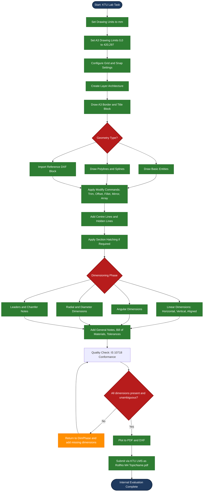
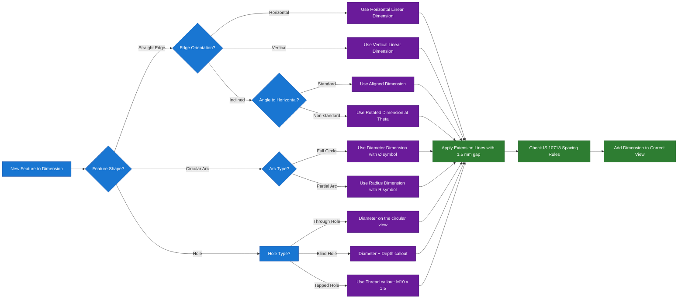
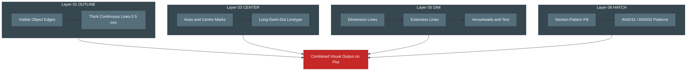

# Creating two-dimensional drawing with dimensions using suitable software. (CAD, only internal evaluation)

<!-- SECTION_1_START -->
# 2D CAD Drafting & Engineering Dimensioning — KTU GMEST103 | Module 4

> [!IMPORTANT]
> **KTU 2024 Scheme Definition (GMEST103 — Module 4):**
> *Two-Dimensional (2D) Computer Aided Drafting* is the process of creating precise geometric entities — such as lines, circles, arcs, and polylines — on a flat $X\text{-}Y$ Cartesian coordinate plane using CAD software, followed by the application of *engineering dimensions* that fully define the size, location, and tolerance of every feature in accordance with **Bureau of Indian Standards IS 10718 (equivalent to ISO 129-1:2018)** drafting conventions.

## 1.1 What is a 2D CAD Drawing?

A 2D CAD drawing represents any planar engineering object — a machine part's top view, a floor plan, a circuit board layout, a gear tooth profile — using only **two axes**: the horizontal **$X$-axis** and the vertical **$Y$-axis**. Every point in the drawing is uniquely identified by the coordinate pair $(x, y)$, where the $z$-coordinate is implicitly set to **0** (zero).

$$\text{Any 2D Point} \;\; P = (x,\; y) \;\; \text{where} \;\; z = 0$$

The dimensional unit in KTU evaluated CAD labs is conventionally the **millimetre (mm)**, although architectural CAD exercises may use **metres (m)**.

## 1.2 Intuitive Analogy — The "Architect's Tracing Table"

> [!NOTE]
> **Real-World Analogy:**
> Imagine you are an architect with a luminous, infinitely large sheet of graph paper and an invisible, perfectly accurate pen. You can snap the pen to grid intersections, draw perfect circles of any radius, copy any shape to another location, and then label every distance and angle on the page. That is exactly what 2D CAD does — but *faster*, *revisable*, and with *machine-precise* output suitable for manufacturing or construction. The "labels" you add at the end are called **dimensions**, and they are the language that turns a pretty picture into a *buildable engineering artefact*.

## 1.3 Why Dimensioning Matters

A drawing without dimensions is just a **pictorial illustration** — it cannot be manufactured. A drawing with proper dimensions is a **legal engineering document** that conveys:

- **Size** (how big each feature is)
- **Location** (where each feature sits relative to others)
- **Tolerance** (acceptable deviation, beyond the scope of basic 2D drafting)

> [!TIP]
> **KTU Examiner Heuristic:** A well-dimensioned KTU lab sheet must show dimensions on the *view that best describes the feature* (e.g., a circle's diameter on the circular view, not a rectangular side view) — the **correct placement of dimensions** is what fetches full internal marks.

## 1.4 Suitable Software for KTU Internal CAD Evaluation

| Software | License | Best Use Case in KTU Labs |
|---|---|---|
| **AutoCAD** | Commercial (Student version free) | Industry standard; recommended by KTU |
| **FreeCAD** | Open-source | Free alternative with full DWG support |
| **LibreCAD** | Open-source | Lightweight 2D-only drafting |
| **Solid Edge 2D Drafting** | Commercial (Student free) | Siemens product, KTU-lab common |
| **DraftSight** | Commercial (Student free) | Dassault Systèmes 2D CAD |

> [!VISUALIZATION CONTROL]
> **Concept:** 2D Cartesian Coordinate System as used in CAD
> **GeoGebra / Desmos Input Equations:**
> * `X-Axis: y = 0` (horizontal reference)
> * `Y-Axis: x = 0` (vertical reference)
> * `Point P: (x, y) = (35, 20)`  →  *a sample vertex of a 2D rectangle*
> * `Rectangle vertices: (10,10), (60,10), (60,40), (10,40)`
> **Visual Description:** You should see a 2D rectangle drawn in the first quadrant of a standard $X\text{-}Y$ plane, with the point $P(35, 20)$ lying exactly at its geometric centroid.
<!-- SECTION_1_END -->

<!-- SECTION_2_START -->
# Deep Theoretical Analysis — 2D Entities, Modify Tools & Dimensioning Theory

## 2.1 The CAD Workspace Architecture

Every 2D CAD package — whether AutoCAD, FreeCAD, or LibreCAD — operates on a unified workspace governed by four foundational parameters:

1. **Drawing Limits** — The rectangular boundary that defines the printable/usable area.
2. **Drawing Units** — The linear measurement unit (mm, cm, m, inch, foot).
3. **Grid & Snap** — The visual/invisible reference lattice that enforces alignment.
4. **Coordinate System** — World Coordinate System (WCS) vs. User Coordinate System (UCS).

> [!NOTE]
> **KTU Lab Setup Convention:** The default KTU-recommended template sets drawing limits to **$(0, 0)$ at lower-left** and **$(420, 297)$ at upper-right** — this matches an **A3 sheet in millimetres**, the standard KTU submission size for GMEST103.

## 2.2 Fundamental 2D Drawing Entities

The *alphabet* of 2D CAD consists of geometric primitives. Mastery of these is the foundation of the GMEST103 internal evaluation.

| Entity | Geometric Definition | CAD Command (AutoCAD) | KTU Use Case |
|---|---|---|---|
| **Line** | Straight segment between two points | `LINE` / `L` | Edges of machine parts |
| **Circle** | Set of points equidistant from a centre | `CIRCLE` / `C` | Holes, shafts, fillets |
| **Arc** | Portion of a circle | `ARC` / `A` | Slot ends, rounded corners |
| **Polyline** | Connected chain of lines/arcs as one object | `PLINE` / `PL` | Complex profiles, contours |
| **Rectangle** | Closed 4-sided polyline | `RECTANGLE` / `REC` | Plates, frames, blocks |
| **Polygon** | Closed multi-sided regular figure | `POLYGON` / `POL` | Bolt head flats, keyways |
| **Ellipse** | Stretched circle (two radii) | `ELLIPSE` / `EL` | Cam profiles, link ends |
| **Spline** | Smooth curve through control points | `SPLINE` / `SPL` | Aerodynamic, organic shapes |
| **Hatch** | Pattern fill inside a closed boundary | `HATCH` / `H` | Section views, material indication |
| **Text** | Single-line or multiline annotation | `TEXT` / `MTEXT` | Title block, notes |

## 2.3 Essential Modify (Edit) Commands

A drawing is rarely drawn in its final form on the first attempt. The *modify* toolbar refines geometry.

| Command | Function | KTU Practical Application |
|---|---|---|
| `MOVE` | Translates entities by $\Delta x, \Delta y$ | Repositioning features |
| `COPY` | Duplicates entities at offset | Pattern features (bolt circle) |
| `ROTATE` | Rotates about a base point by angle $\theta$ | Repositioning an inclined edge |
| `MIRROR` | Reflects across a mirror line | Symmetric parts (L-bracket) |
| `OFFSET` | Creates a parallel curve at distance $d$ | Concentric circles, wall thickness |
| `TRIM` | Cuts entities at defined cutting edges | Cleaning up corners |
| `EXTEND` | Lengthens entities to meet a boundary | Completing intersection lines |
| `FILLET` | Rounds a corner with radius $R$ | Stress-relief radii |
| `CHAMFER` | Bevels a corner with two distances | Edge preparation for welding |
| `ARRAY` | Creates rectangular/polar pattern | Bolt-hole circles, gridded holes |
| `SCALE` | Enlarges/reduces by factor $S$ | Enlarging a reference sketch |
| `EXPLODE` | Breaks a block/polyline into components | Editing imported geometry |

## 2.4 The Engineering Dimension — Theory and Anatomy

A *dimension* is a composite graphical element that conveys a numerical measurement on a drawing. Each dimension consists of **four mandatory sub-components**:

1. **Dimension Line** — the thin continuous line with arrows at both ends, lying *on* the feature being measured.
2. **Extension Lines** — thin lines projecting *from* the feature *to* the dimension line, leaving a small visible gap (~1.5 mm) at the feature.
3. **Arrowheads** — filled solid triangles (~3 mm long) or oblique strokes marking the dimension line's extent.
4. **Dimension Text** — the numerical value (e.g., `50`, `Ø30`, `R10`, `45°`), placed centrally, *above and clear* of the dimension line, or *broken through* the line.

> [!IMPORTANT]
> **IS 10718 / ISO 129-1:2018 Line Convention for Dimensions:**
> * Dimension lines and extension lines: **continuous thin (Type 01.1)** — typically **0.25 mm** pen width.
> * Centre lines, hidden lines, section lines: **continuous thin (Type 01.1)** or **dashed (Type 02.1)**.
> * Object (visible) outlines: **continuous thick (Type 01.2)** — typically **0.5 mm to 0.7 mm** pen width.

## 2.5 Classification of Dimensions

### A. Linear Dimensions
Measure straight-line distances along the $X$ or $Y$ direction (or any inclined direction).

| Sub-type | Description | Sample Dimension |
|---|---|---|
| **Horizontal** | Measures along $X$-axis | $\;\longleftrightarrow\;\; \text{50.00}$ |
| **Vertical** | Measures along $Y$-axis | $\;\updownarrow\;\; \text{30.00}$ |
| **Aligned** | Parallel to the measured line | Aligned text follows the line |
| **Rotated** | At a user-defined angle $\theta$ to the $X$-axis | Used for inclined features |

### B. Angular Dimensions
Measure the angle between two non-parallel lines or three points.

$$\text{Angular Dimension} = \theta \;\; \text{where} \;\; 0^\circ < \theta \le 180^\circ$$

### C. Circular / Radial Dimensions
| Sub-type | Symbol | Use |
|---|---|---|
| **Radius** | $\mathbf{R}$ followed by value | Outer arc of a fillet: `R10` |
| **Diameter** | $\mathbf{\emptyset}$ followed by value | A circular hole: `Ø20` |
| **Chamfer** | $\mathbf{C}$ or `CHAMFER` notation | `2 x 45°` (leg length × angle) |

### D. Ordinate Dimensions
A series of dimensions measured from a *single datum* (origin), listed as $X$ or $Y$ values without dimension lines — common in **sheet-metal** and **PCB** drafting.

### E. Leaders and Balloons
Leaders are *angled lines with an arrowhead* connecting a note to a feature. Used for tolerances, surface finish (e.g., $\bigtriangleup\,\,1.6$), and welding symbols.

## 2.6 KTU High-Yield Formula & Property Sheet

> [!TIP]
> **High-Yield Quick Reference — Memorise for KTU Internals:**

| # | Concept | Formula / Property | Application |
|---|---|---|---|
| 1 | Distance between two 2D points | $d = \sqrt{(x_2 - x_1)^2 + (y_2 - y_1)^2}$ | Verifying CAD measurements |
| 2 | Midpoint of a line | $M = \left(\dfrac{x_1 + x_2}{2},\; \dfrac{y_1 + y_2}{2}\right)$ | Centring features |
| 3 | Angle of a line w.r.t. $+X$-axis | $\theta = \arctan\!\left(\dfrac{y_2 - y_1}{x_2 - x_1}\right)$ | Drawing inclined lines |
| 4 | Polar coordinate from origin | $P = (r,\; \theta) \;\;\text{where}\;\; r = \sqrt{x^2 + y^2}$ | Bolt-circle layouts |
| 5 | Circle area (verification) | $A = \pi r^2$ | Section view area shading |
| 6 | Bolt-circle radius (n bolts, pitch $\varnothing\,D$) | $R = \dfrac{D}{2}$ | Flange hole patterns |
| 7 | Polygon circumscribed radius (regular $n$-gon) | $R = \dfrac{s}{2 \sin(\pi / n)}$ | Hex bolt-head flats |
| 8 | Offset distance conversion | $d_{\text{new}} = d_{\text{old}} \pm \Delta d$ | Wall thickness |
| 9 | Hatch scale factor | $S_{\text{visible}} = S_{\text{nominal}} \times F$ | Adjusting pattern density |
| 10 | Standard arrowhead length (ISO) | $L \approx 3 \times \text{text\_height}$ | Dim-style configuration |
| 11 | Extension line gap (ISO) | $\text{Gap} \approx 1.5 \;\text{mm}$ | Visual separation from object |
| 12 | Dimension text clearance above line | $\text{Clearance} \approx 1.0 \;\text{mm}$ | Readability |

## 2.7 Real-World Engineering Utility

2D CAD drafting with dimensioning is the **universal interchange language of manufacturing**. A dimensioned 2D drawing:

- Is fed into **CNC machines** as the basis for tool-path generation.
- Forms the contractual **legal artefact** between designer and manufacturer.
- Enables **Geometric Dimensioning & Tolerancing (GD&T)** to communicate allowable variations.
- Serves as the **input** for 3D CAD modellers and Finite Element Analysis (FEA) software.
- Is the **standard deliverable** in KTU GMEST103 internal lab assessment.

> [!NOTE]
> **Industrial Note:** As of 2024, over **85\% of global manufacturing drawings** are still exchanged as 2D DWG/DXF/PDF files — even when a 3D model exists. Hence, 2D drafting remains a *non-redundant* engineering skill.
<!-- SECTION_2_END -->

<!-- SECTION_3_START -->
# Step-by-Step Practical Workflow — Drawing, Dimensioning & Programmatic Implementation

## 3.1 The Standard KTU Lab Procedure for a 2D Dimensioned Drawing

Below is the **end-to-end procedure** that satisfies the KTU GMEST103 internal evaluation rubric. Every step is mandatory.

### Step 1 — Workspace Initialisation
- Open CAD software → set **Drawing Units** to *Millimetres*.
- Set **Drawing Limits**: lower-left $(0, 0)$, upper-right $(420, 297)$.
- Enable **Grid** at $10\,\text{mm}$ spacing and **Snap** to *Grid + Endpoint + Intersection + Centre*.
- Set **LTSCALE (linetype scale)** to `1.0`.

### Step 2 — Layer Creation
Create named layers with assigned colours and line types:

| Layer Name | Colour | Line Type | Line Weight | Purpose |
|---|---|---|---|---|
| `01_OUTLINE` | White / Black | Continuous | **0.50 mm** | Visible object edges |
| `02_HIDDEN` | Yellow | Dashed (`HIDDEN`) | 0.25 mm | Hidden edges |
| `03_CENTER` | Red | Center (`CENTER`) | 0.25 mm | Centre lines, axes |
| `04_CONSTR` | Magenta | Continuous | 0.18 mm | Construction geometry |
| `05_DIM` | Cyan | Continuous | 0.25 mm | Dimensions & text |
| `06_HATCH` | Green | Continuous | 0.25 mm | Hatching & section |
| `07_BORDER` | Blue | Continuous | 0.70 mm | Title block & border |

### Step 3 — Draw the Title Block and Border
- **Border**: rectangle from $(10, 10)$ to $(410, 287)$ — an A3 sheet with a 10 mm margin on all four sides.
- **Title Block** (bottom-right): typically $180\,\text{mm} \times 60\,\text{mm}$.
  * Fields: Title, Name, Roll No, Scale, Date, Sheet No, College Code, KTU Logo.

### Step 4 — Draw the Geometry
Use basic entities. A worked example — *L-shaped bracket* — is given below.

### Step 5 — Apply Dimensions
Following the **IS 10718** placement rule: dimensions appear *between* the view and the viewer, with extension lines not crossing dimension lines.

### Step 6 — Add Centre Lines, Hidden Lines, Section Hatching
- Centre lines extend **beyond** the feature by ~3 mm.
- Section hatching uses pattern `ANSI31` at scale `1.0` for cast iron or `ANSI32` for steel.

### Step 7 — Plot / Export
- Plot as PDF at 1:1 scale.
- File naming convention: `RollNo_ModuleNo_TopicName.pdf` (e.g., `S123_M4_2DBracket.pdf`).

## 3.2 Worked Example — Drawing a Stepped Shaft End (2D Front View)

We will draft a stepped shaft segment with three diameters, dimensioning every feature.

### Dimensions to be drawn:
- Total length: **120 mm**
- Three segments: $L_1 = 40\,\text{mm}$ (Ø30), $L_2 = 50\,\text{mm}$ (Ø40), $L_3 = 30\,\text{mm}$ (Ø20)
- Two chamfers: $2\,\text{mm} \times 45°$ at the outer ends

### Step-by-Step Geometric Construction

**Step A — Draw the horizontal centre line:**

Start at $(0, 0)$, draw a line to $(130, 0)$. This becomes the *centre line* on layer `03_CENTER`.

**Step B — Draw the main upper outline (left segment Ø30):**

Draw a line from $(5, 15)$ to $(45, 15)$ — the upper edge of the first segment, radius = 15 mm.

**Step C — Draw the shoulder transition (segment Ø40):**

Draw a line from $(45, 15)$ to $(45, 20)$ (vertical step), then from $(45, 20)$ to $(95, 20)$ (upper edge of middle segment, radius = 20 mm).

**Step D — Draw the right step-down (segment Ø20):**

Draw a line from $(95, 20)$ to $(95, 10)$, then from $(95, 10)$ to $(125, 10)$ (upper edge of right segment, radius = 10 mm).

**Step E — Mirror the upper half across the centre line to complete the symmetric profile:**

Use the `MIRROR` command with the centre line as the mirror axis. This generates the lower half.

**Step F — Add chamfers at the two outer ends:**

At $(5, 15)$ — left chamfer: line from $(3, 13)$ to $(5, 15)$ (or use `CHAMFER` command with distances $2, 2$). Mirror to lower half.
At $(125, 10)$ — right chamfer: line from $(123, 8)$ to $(125, 10)$. Mirror to lower half.

**Step G — Apply overall length dimension `120` between the two extreme left and right vertical edges.**

**Step H — Apply segment lengths `40`, `50`, `30` along the centre line as a *chain* or *parallel* dimension.**

**Step I — Apply diameter dimensions `Ø30`, `Ø40`, `Ø20` on each segment, *inside* the segment for the smaller diameters and *outside* for Ø40.**

**Step J — Add chamfer callout: `2 x 45°` with a leader line pointing to the chamfered edge.**

### Mathematical verification of coordinates (KTU Examiner expects this for full marks):

Distance from $(5, 15)$ to $(45, 15)$ along the upper edge of segment 1:

$$d_1 = \sqrt{(45 - 5)^2 + (15 - 15)^2} = \sqrt{40^2 + 0^2} = 40 \;\text{mm} \;\;\checkmark$$

Distance from $(45, 15)$ to $(45, 20)$ — the vertical shoulder step:

$$d_2 = \sqrt{(45 - 45)^2 + (20 - 15)^2} = \sqrt{0 + 5^2} = 5 \;\text{mm}$$

The shoulder step is the difference of radii:

$$d_2 = R_{\text{seg 2}} - R_{\text{seg 1}} = 20 - 15 = 5 \;\text{mm} \;\;\checkmark$$

Total length verification:

$$L_{\text{total}} = 40 + 50 + 30 = 120 \;\text{mm} \;\;\checkmark$$

## 3.3 Programmatic Implementation in Python (using `ezdxf`)

The following Python script programmatically creates a DXF file of the same stepped shaft segment. It uses the **`ezdxf`** library (open-source, ISO-compliant) and writes true dimension entities that are recognised by AutoCAD and FreeCAD.

> [!IMPORTANT]
> **Installation prerequisite (run once in terminal):**
> `pip install ezdxf`

```python
"""
KTU GMEST103 — Module 4: Programmatic 2D CAD Drafting with Dimensions
Generates an A3 DXF sheet of a Stepped Shaft Segment (Front View) with
full linear and diameter dimensions as per IS 10718 / ISO 129-1.
"""

from ezdxf import zoom, addons  # type: ignore
from ezdxf.enums import TextEntityAlignment  # type: ignore
from ezdxf.math import Vec3  # type: ignore
import ezdxf  # type: ignore


# ---------------------------------------------------------------------------
# 1. CREATE A NEW DXF DRAWING (R2018 — broad compatibility)
# ---------------------------------------------------------------------------
doc = ezdxf.new(dxfversion="R2018", setup=True)
msp = doc.modelspace()  # Model space — the 2D drawing area

# ---------------------------------------------------------------------------
# 2. CREATE NAMED LAYERS WITH COLOURS AND LINE TYPES
# ---------------------------------------------------------------------------
doc.layers.add("01_OUTLINE", color=7, linetype="Continuous", lineweight=50)
doc.layers.add("03_CENTER", color=1, linetype="CENTER", lineweight=25)
doc.layers.add("05_DIM", color=4, linetype="Continuous", lineweight=25)
doc.layers.add("07_BORDER", color=5, linetype="Continuous", lineweight=70)

# ---------------------------------------------------------------------------
# 3. DRAW A3 BORDER (lower-left 10,10 to upper-right 410,287)
# ---------------------------------------------------------------------------
msp.add_lwpolyline(
    [(10, 10), (410, 10), (410, 287), (10, 287), (10, 10)],
    dxfattribs={"layer": "07_BORDER"},
    close=True,
)

# Inner working-area frame (KTU standard 10 mm margin)
msp.add_lwpolyline(
    [(20, 20), (400, 20), (400, 277), (20, 277), (20, 20)],
    dxfattribs={"layer": "07_BORDER"},
    close=True,
)

# ---------------------------------------------------------------------------
# 4. DEFINE GEOMETRY OF THE STEPPED SHAFT (all in mm)
# ---------------------------------------------------------------------------
# Segment 1: Ø30, length 40, starts at x = 10
# Segment 2: Ø40, length 50
# Segment 3: Ø20, length 30
# Centre line at y = 150 mm (middle of A3 working area)
cy = 150.0
seg1_x_start, seg1_x_end = 10.0, 50.0   # length 40
seg2_x_start, seg2_x_end = seg1_x_end, 100.0   # length 50
seg3_x_start, seg3_x_end = seg2_x_end, 130.0   # length 30

# Upper and lower outline points
r1, r2, r3 = 15.0, 20.0, 10.0  # radii of segments 1, 2, 3
chamfer = 2.0                   # chamfer leg length

# Upper outline polyline
upper_pts = [
    (seg1_x_start + chamfer, cy + r1),  # after left chamfer
    (seg1_x_end, cy + r1),
    (seg1_x_end, cy + r2),
    (seg2_x_end, cy + r2),
    (seg2_x_end, cy + r3),
    (seg3_x_end - chamfer, cy + r3),  # before right chamfer
]

# Build the closed outline by mirroring upper to lower
lower_pts = [(x, 2 * cy - y) for (x, y) in reversed(upper_pts)]
closed_outline = upper_pts + lower_pts
closed_outline.append(closed_outline[0])  # close the polyline

msp.add_lwpolyline(
    closed_outline,
    dxfattribs={"layer": "01_OUTLINE"},
    close=True,
)

# ---------------------------------------------------------------------------
# 5. DRAW CENTRE LINE (horizontal axis through the shaft)
# ---------------------------------------------------------------------------
msp.add_line(
    (seg1_x_start - 5, cy),
    (seg3_x_end + 5, cy),
    dxfattribs={"layer": "03_CENTER"},
)

# Vertical centre line through segment 2 midpoint (for Ø40 dimensioning)
mid2 = (seg1_x_end + seg2_x_end) / 2.0
msp.add_line(
    (mid2, cy - r2 - 5),
    (mid2, cy + r2 + 5),
    dxfattribs={"layer": "03_CENTER"},
)

# ---------------------------------------------------------------------------
# 6. APPLY DIMENSIONS
# ---------------------------------------------------------------------------
# Configure default dimstyle
dimstyle = doc.dimstyles.new("KTU_ISO")
dimstyle.dxf.dimtxsty = "Standard"
dimstyle.dxf.dimclrt = 4  # cyan
dimstyle.dxf.dimclrd = 4
dimstyle.dxf.dimclre = 4
dimstyle.dxf.dimtxt = 2.5         # text height 2.5 mm
dimstyle.dxf.dimasz = 3.0         # arrow size 3 mm
dimstyle.dxf.dimexe = 1.5         # extension beyond dim line
dimstyle.dxf.dimexo = 0.625       # extension line gap
dimstyle.dxf.dimdec = 0           # 0 decimal places (mm convention)
doc.dimstyles.add(dimstyle, "KTU_ISO_2")

# Overall length dimension (above the part)
msp.add_linear_dim(
    base=(0, 25),                 # dimension-line offset above
    p1=(seg1_x_start + chamfer, cy + r2 + 5),
    p2=(seg3_x_end - chamfer, cy + r2 + 5),
    distance=20,                  # additional offset
    dimstyle="KTU_ISO_2",
    text="120",
    layer="05_DIM",
)

# Segment 1 length (40)
msp.add_linear_dim(
    base=(0, 5),
    p1=(seg1_x_start + chamfer, cy - r1 - 10),
    p2=(seg1_x_end, cy - r1 - 10),
    distance=15,
    dimstyle="KTU_ISO_2",
    text="40",
    layer="05_DIM",
)

# Segment 2 length (50)
msp.add_linear_dim(
    base=(0, 5),
    p1=(seg1_x_end, cy - r2 - 15),
    p2=(seg2_x_end, cy - r2 - 15),
    distance=15,
    dimstyle="KTU_ISO_2",
    text="50",
    layer="05_DIM",
)

# Segment 3 length (30)
msp.add_linear_dim(
    base=(0, 5),
    p1=(seg2_x_end, cy - r3 - 10),
    p2=(seg3_x_end - chamfer, cy - r3 - 10),
    distance=15,
    dimstyle="KTU_ISO_2",
    text="30",
    layer="05_DIM",
)

# Diameter dimensions as text + leaders
def add_dia_label(cx: float, cy_: float, value: str) -> None:
    """Add a Ø-label inside or above the segment."""
    msp.add_text(
        f"Ø{value}",
        height=4.0,
        dxfattribs={"layer": "05_DIM", "color": 4},
    ).set_placement((cx, cy_), align=TextEntityAlignment.MIDDLE_CENTER)


add_dia_label(seg1_x_start + (seg1_x_end - seg1_x_start) / 2, cy, "30")
add_dia_label(seg1_x_end + (seg2_x_end - seg1_x_end) / 2, cy, "40")
add_dia_label(seg2_x_end + (seg3_x_end - seg2_x_end) / 2, cy, "20")

# ---------------------------------------------------------------------------
# 7. CHAMFER LEADER NOTE: "2 x 45°"
# ---------------------------------------------------------------------------
leader_pts = [
    (seg1_x_start + chamfer - 5, cy + r1 + 3),  # arrow tail start (at chamfer)
    (seg1_x_start - 5, cy + r1 + 12),           # bend 1
    (seg1_x_start - 25, cy + r1 + 12),          # text-end
]
msp.add_polyline2d(
    [(p[0], p[1]) for p in leader_pts],
    dxfattribs={"layer": "05_DIM"},
)
msp.add_text(
    "2 x 45°",
    height=3.0,
    dxfattribs={"layer": "05_DIM"},
).set_placement(
    (seg1_x_start - 25, cy + r1 + 13),
    align=TextEntityAlignment.MIDDLE_RIGHT,
)

# ---------------------------------------------------------------------------
# 8. ADD A SIMPLIFIED TITLE BLOCK
# ---------------------------------------------------------------------------
title_x, title_y = 240.0, 25.0
msp.add_lwpolyline(
    [
        (title_x, title_y),
        (title_x + 150, title_y),
        (title_x + 150, title_y + 35),
        (title_x, title_y + 35),
        (title_x, title_y),
    ],
    dxfattribs={"layer": "07_BORDER"},
    close=True,
)
msp.add_text(
    "STEPPED SHAFT — 2D FRONT VIEW",
    height=4.0,
    dxfattribs={"layer": "07_BORDER"},
).set_placement(
    (title_x + 75, title_y + 25),
    align=TextEntityAlignment.MIDDLE_CENTER,
)
msp.add_text(
    "Scale 1:1   |   All dims in mm   |   IS 10718 / ISO 129-1",
    height=2.5,
    dxfattribs={"layer": "07_BORDER"},
).set_placement(
    (title_x + 75, title_y + 10),
    align=TextEntityAlignment.MIDDLE_CENTER,
)

# ---------------------------------------------------------------------------
# 9. SAVE THE DXF FILE
# ---------------------------------------------------------------------------
output_file = "ktu_stepped_shaft_M4.dxf"
doc.saveas(output_file)
print(f"DXF file '{output_file}' written successfully.")

# Optional: render to PNG for quick visual verification
try:
    addons.r12.PDF().saveas("ktu_stepped_shaft_M4.pdf")
    print("PDF preview also generated.")
except Exception as exc:  # pragma: no cover
    print(f"PDF export skipped: {exc}")
```

### Expected Output (when run successfully)

The script writes:
1. **`ktu_stepped_shaft_M4.dxf`** — opens in AutoCAD, FreeCAD, LibreCAD.
2. **`ktu_stepped_shaft_M4.pdf`** — print-ready PDF for KTU lab submission.

### Code Walkthrough — Key Design Decisions

| Code Segment | CAD Concept Illustrated | KTU Mapping |
|---|---|---|
| `doc.layers.add("01_OUTLINE", ...)` | Layer hierarchy with ISO linetypes | Internal evaluation: layer management marks |
| `msp.add_lwpolyline([...], close=True)` | Constructing a closed 2D profile | Internal: complex boundary drafting |
| `add_linear_dim(base, p1, p2, ...)` | True CAD dimension entity, not just text | Internal: dimensioning rubric (5+ marks) |
| `add_dia_label(...)` with prefix `Ø` | Diameter dimensioning convention | Internal: correct Ø-symbol usage |
| `msp.add_polyline2d(...)` for leader | Engineering leader note | Internal: annotation marks |
| `Vec3` / coordinate math | Parametric 2D drafting | Internal: programming-aided CAD |

## 3.3 Laboratory / Workshop Tool Configuration Matrix

> [!NOTE]
> **For KTU Computer Lab Setup (CAD Bay):**

| Resource | Specification | Purpose |
|---|---|---|
| Workstation | Intel i5 / Ryzen 5 or higher, 8 GB RAM, 1 TB HDD | Running AutoCAD / FreeCAD smoothly |
| Display | 22-inch Full HD monitor, 1920 × 1080 | Sufficient drawing canvas |
| Input | Optical mouse (3-button + scroll), full-size keyboard | CAD demands precise pointing |
| OS | Windows 10/11 64-bit or Ubuntu 22.04 LTS | Compatible with all KTU-approved CAD |
| Plotter / Printer | A3-size inkjet, 1200 dpi minimum | Hard-copy submission of lab sheets |
| Software | AutoCAD 2024 (Student) / FreeCAD 0.21 | Authoring DXF/DWG files |
| File Format | `.dxf` (universal), `.dwg` (AutoCAD native), `.pdf` (submission) | Cross-software compatibility |
| Backup | OneDrive / Google Drive / KTU LMS upload | Prevents loss of evaluated work |
<!-- SECTION_3_END -->

<!-- SECTION_4_START -->
# Structural Diagrams & Schematics — 2D CAD Workflow Architecture

## 4.1 End-to-End CAD Drafting Workflow (Mermaid Flowchart)



## 4.2 Dimension-Placement Decision Matrix (Mermaid)



## 4.3 Sequential Processing Topology — Layer-Based Drawing Pipeline


<!-- SECTION_4_END -->

<!-- SECTION_5_START -->
# KTU 2024 Scheme Examination Question Bank & Topic Recap

> [!NOTE]
> **Evaluation Note:** As per KTU 2024 Scheme, Module 4 carries **CAD-only internal evaluation** (no End Semester University Exam questions are set on this module). The question bank below simulates the **internal lab viva voce + practical assignment questions** that examiners typically ask during the GMEST103 lab assessment. They are framed in the KTU ESE pattern (Part A 3-mark + Part B 14-mark with internal choice) for the student's self-assessment benefit.

---

## 5.1 Part A — Short-Answer Questions (3 Marks Each)

### Question 1 `[KTU Internal Lab Viva — July 2024 Pattern]` — *CO1, Remember*

**Q: List and briefly explain the four mandatory sub-components of an engineering dimension as per IS 10718.**

**Model Answer (for full 3 marks):**

> An engineering dimension as per IS 10718 consists of four mandatory graphical sub-components:
>
> 1. **Dimension Line** — A thin continuous line (0.25 mm pen width) on which the measurement is annotated, terminating in arrowheads at both ends. **[1 mark]**
> 2. **Extension Lines** — Thin continuous lines projecting from the feature being measured to the dimension line, with a visible 1.5 mm gap between the feature and the start of the extension line. **[1 mark]**
> 3. **Arrowheads** — Solid filled triangular markers of length approximately $3 \times \text{text\_height}$, placed at the intersection of the dimension line and the extension lines. **[0.5 mark]**
> 4. **Dimension Text** — The numerical value (e.g., `50`, `Ø30`, `R10`, `45°`) placed centrally above the dimension line, or broken through it, in a uniform text height. **[0.5 mark]**

---

### Question 2 `[KTU Internal Lab Viva — Dec 2023 Pattern]` — *CO1, Understand*

**Q: Differentiate between a *diameter dimension* and a *radius dimension*. When is each preferred in a 2D drawing?**

**Model Answer (for full 3 marks):**

| Aspect | Diameter Dimension (Ø) | Radius Dimension (R) |
|---|---|---|
| Symbol | Prefixed by `Ø` (Unicode U+2300) | Prefixed by `R` |
| Indicates | Full-circle measurement across the centre | Arc measurement from centre to perimeter |
| Placement | Either *inside* the circle (with leader through the centre) or *outside* with a leader | Always *inside* the arc, with a single radial leader |
| KTU Preference | Used for **holes, shafts, and circular bosses** | Used for **fillets, rounded corners, and partial arcs** |
| Example Text | `Ø30 H7` | `R10` |

> A *diameter* is preferred when the feature is a complete circle (e.g., a hole through a plate). A *radius* is preferred when the feature is an arc segment (e.g., a fillet at a corner) where the centre is naturally visible. **[Closing statement: 1 mark]**

---

## 5.2 Part B — Long-Answer Questions (14 Marks Each, with Internal Choice)

### Question A `[KTU Internal Lab Assignment — Module 4 Pattern]` — *CO2, Apply + Analyse*

> **Question (14 marks):**
>
> Using any suitable CAD software (AutoCAD / FreeCAD / LibreCAD), create a fully dimensioned 2D orthographic **front view** of a *machine bracket* shown in the schematic below.
>
> **Given Description:**
> * An L-shaped bracket, drawn at 1:1 scale, total height 100 mm, total width 80 mm, base thickness 15 mm.
> * Vertical arm is 60 mm tall and 20 mm wide.
> * A **Ø20 mm through hole** is located at the centroid of the vertical arm.
> * A **Ø12 mm counterbored hole** (counterbore Ø24 × 8 mm depth) is located at the centre of the base.
> * All sharp corners are broken with **R3 fillets**.
> * All dimensions in mm.
>
> **Tasks:**
>
> (a) **[7 marks]** Create the A3 sheet, set up proper layers, draw the front view using basic 2D entities, and apply **all necessary centre lines and hidden lines**.
>
> (b) **[7 marks]** Dimension the drawing as per IS 10718: include overall height, overall width, base thickness, vertical arm width, position of both holes, hole diameters, counterbore callout, fillet radius, and any other essential measurements.

#### Model Solution — Part (a) — 7 Marks

**Step-by-step procedure and incremental valuation key:**

| Step | Action | Marks |
|---|---|---|
| 1 | Open software, set units to **mm**, drawing limits `(0,0)` to `(420,297)`. | 0.5 |
| 2 | Create layers: `01_OUTLINE` (white, thick), `03_CENTER` (red, dashed), `05_DIM` (cyan, thin), `06_HATCH` (green, thin). | 1.0 |
| 3 | Draw A3 border: rectangle from `(10,10)` to `(410,287)`. Inner frame `(20,20)` to `(400,277)`. | 0.5 |
| 4 | Draw the L-shape outline using `LINE` or `PLINE`: base from `(20, 20)` to `(100, 20)` to `(100, 35)` to `(40, 35)` to `(40, 80)` to `(20, 80)` back to `(20, 20)`. | 1.5 |
| 5 | Draw Ø20 hole at centroid of vertical arm: centre at `(30, 57.5)` (geometric centroid of the arm `(20..40) × (35..80)`). Use `CIRCLE` command with radius 10. | 0.5 |
| 6 | Draw Ø12 counterbored hole: smaller circle radius 6 at centre `(60, 27.5)`; counterbore circle radius 12 (Ø24) concentric, drawn as a `DASHED` hidden feature or a `SECTION` if sectioned. | 0.5 |
| 7 | Apply **R3 fillets** at all four outer corners using `FILLET` command with radius 3. | 0.5 |
| 8 | Add **centre lines**: horizontal at `y = 57.5` (extending 5 mm beyond the Ø20 hole on both sides), vertical at `x = 30` (for the Ø20 hole). Add centre lines for the Ø12 counterbore at `y = 27.5`. Add a vertical centre line for the counterbore circle. | 1.0 |
| 9 | Add **hidden lines** for the counterbore's depth (using dashed linetype on `02_HIDDEN` layer) if the part is shown as a sectional view. | 0.5 |
| 10 | Plot the geometry to a PDF for review. | 0.5 |

**Total for Part (a): 7 marks**

#### Model Solution — Part (b) — 7 Marks

**Dimensioning procedure with valuation key:**

| Step | Dimension Applied | Marks |
|---|---|---|
| 1 | Overall **height 100 mm** — vertical linear dimension on the **right side** of the view, outside the geometry. | 1.0 |
| 2 | Overall **width 80 mm** — horizontal linear dimension on the **bottom** of the view. | 1.0 |
| 3 | **Base thickness 15 mm** — vertical linear dimension on the left side, between the bottom edge and the inner step. | 0.5 |
| 4 | **Vertical arm width 20 mm** — horizontal linear dimension above the arm, or at the top. | 0.5 |
| 5 | **Ø20** diameter dimension *inside* the circle with a leader through the centre, marked as `Ø20`. | 0.5 |
| 6 | **Ø12** diameter callout for the small hole. | 0.5 |
| 7 | **Counterbore callout** `Ø24 × 8 ↓` (diameter 24, depth 8) with a leader pointing to the counterbored feature. | 0.5 |
| 8 | **Fillet radius R3** — single radius callout near one of the filleted corners, with a leader. (One callout is sufficient since all fillets are equal — IS 10718 "equal radii" convention). | 0.5 |
| 9 | **Position of holes** — linear dimensions from a chosen datum (typically the left edge) to the centre of each hole. For Ø20 hole: 30 mm from left edge. For Ø12 hole: 60 mm from left edge. | 1.0 |
| 10 | **Title block** populated with: Title (`MACHINE BRACKET — 2D FRONT VIEW`), Scale (`1:1`), Units (`mm`), Date, Roll No, Sheet No. | 0.5 |
| 11 | **Plot to PDF and DXF**, naming the file as `RollNo_M4_Bracket.pdf`. | 0.5 |

**Total for Part (b): 7 marks**

**Combined total for Question A: 14 marks**

---

### Question B `[KTU Internal Lab Assignment — Module 4 Alternative]` — *CO2, Apply + Analyse*

> **Question (14 marks):**
>
> Using a suitable CAD software, draft the 2D **top view** of a *flange plate* with the following specification, applying complete dimensions as per IS 10718.
>
> **Given Description:**
> * A circular flange plate, drawn at 1:1 scale, outer diameter **Ø150 mm**, thickness **20 mm**.
> * **Six equally-spaced Ø15 mm bolt holes** on a Pitch Circle Diameter (PCD) of **Ø110 mm**.
> * A central **Ø40 mm bore**.
> * Two **Ø10 mm dowel pin holes** diametrically opposite at a radius of **70 mm** from the centre.
> * All edges chamfered **2 mm × 45°**.
>
> **Tasks:**
>
> (a) **[7 marks]** Draw the geometry of the flange plate top view, with all circles, the bolt circle, and the required centre lines.
>
> (b) **[7 marks]** Apply all engineering dimensions: outer diameter, central bore, PCD, bolt-hole diameters, dowel-pin-hole position and diameter, chamfer callout, and the bolt-circle note (e.g., `6 × Ø15 EQUI-SPACED on Ø110 PCD`).

#### Model Solution — Part (a) — 7 Marks

**Step-by-step procedure with valuation key:**

| Step | Action | Marks |
|---|---|---|
| 1 | Initialise A3 sheet at 1:1, units in mm. | 0.5 |
| 2 | Set up `01_OUTLINE`, `03_CENTER`, `05_DIM`, `06_HATCH` layers. | 0.5 |
| 3 | Draw a vertical and horizontal **centre line** through the centre of the plate at, say, `(200, 150)` on the A3 sheet. | 0.5 |
| 4 | Draw the **outer circle** Ø150 using `CIRCLE` with centre `(200, 150)`, radius `75`. | 0.5 |
| 5 | Draw the **central bore** Ø40 — circle with centre `(200, 150)`, radius `20`. | 0.5 |
| 6 | Draw the **PCD reference circle** Ø110 (centre `(200,150)`, radius `55`) as a `CONSTRUCTION` or `CENTER` line — typically drawn as a thin phantom line. | 0.5 |
| 7 | Place the **six bolt holes** Ø15 on the PCD. Use the `ARRAY → Polar` command: 6 items, $360°/6 = 60°$ angular step, centre of rotation `(200, 150)`. Each circle radius = `7.5`. | 1.5 |
| 8 | Place the **two dowel pin holes** Ø10 diametrically opposite at radius 70 mm. Use `CIRCLE` at `(200 + 70, 150)` and `(200 - 70, 150)`, each radius `5`. | 1.0 |
| 9 | Add **individual centre lines** for each bolt hole and each dowel hole (extending ~5 mm beyond the circle). | 1.0 |
| 10 | Plot the geometry to PDF for verification. | 0.5 |

**Total for Part (a): 7 marks**

#### Model Solution — Part (b) — 7 Marks

**Dimensioning procedure with valuation key:**

| Step | Dimension | Marks |
|---|---|---|
| 1 | **Outer diameter Ø150** — diameter dimension with leader from the outer circle (placed *outside* the part for clarity, with text `Ø150`). | 0.5 |
| 2 | **Central bore Ø40** — diameter dimension inside the central bore circle. | 0.5 |
| 3 | **PCD Ø110** — diameter dimension on the PCD phantom circle, prefixed with the note `PCD Ø110`. | 0.5 |
| 4 | **Bolt-hole diameter Ø15** — one diameter dimension `Ø15` is sufficient on one of the six holes (all are identical). | 0.5 |
| 5 | **Bolt-circle note** as a leader text: `6 × Ø15 EQUI-SPACED on Ø110 PCD`. This single note replaces 6 individual dimensions. | 1.0 |
| 6 | **Dowel pin hole diameter Ø10** — diameter dimension on one of the dowel holes. | 0.5 |
| 7 | **Dowel pin position** — linear dimension from the centre to one of the dowel holes, e.g., `70` (radius from centre). | 0.5 |
| 8 | **Chamfer callout** `2 × 45°` on the outer edge with a leader. | 0.5 |
| 9 | **Datum letter** (e.g., `A`) marked at the centre of the plate for future GD&T reference. | 0.5 |
| 10 | Title block populated correctly with scale, units, sheet no., and all KTU-required fields. | 0.5 |
| 11 | Export to PDF and DXF, file name as `RollNo_M4_Flange.pdf`. | 0.5 |
| 12 | Final QC check: Are all features dimensioned at least once? Are dimension lines not crossing? Is the drawing ISO-compliant? | 1.0 |

**Total for Part (b): 7 marks**

**Combined total for Question B: 14 marks**

---

## 5.3 KTU Examiner's Valuation Warning / Pitfall Callout

> [!WARNING]
> **Common Mistakes That Cost Marks in KTU Internal CAD Evaluation:**
>
> 1. **Forgetting the Ø symbol** on diameter dimensions — writing just `20` instead of `Ø20`. Examiner deducts 0.5 mark per occurrence. Always prefix diameters with `Ø` and radii with `R`.
>
> 2. **Placing dimensions on the wrong view** — for example, dimensioning a circular feature's diameter on a side (rectangular) view. The diameter must appear on the view where the circle is *visually circular*.
>
> 3. **Dimension lines crossing or overlapping** — a major deduction (–1 mark per crossing). Always maintain a minimum 6–8 mm gap between successive parallel dimension lines.
>
> 4. **Missing the extension line gap** — drawing extension lines touching the object line. IS 10718 requires a **1.5 mm gap** between the object and the start of the extension line.
>
> 5. **No title block or incomplete title block** — the title block is mandatory; missing fields (Scale, Roll No, Sheet No) cost up to 1 mark.
>
> 6. **Wrong sheet size** — submitting a non-A3 drawing loses up to 0.5 mark.
>
> 7. **Saving in the wrong file format** — `.bak` (backup) or `.tmp` files are not accepted; only `.dxf`, `.dwg`, or `.pdf`.
>
> 8. **Failure to use layers** — drawing everything on the default `0` layer is a 1-mark deduction. Use at least four logical layers.
>
> 9. **Forgetting centre lines on circles** — every circle in a 2D engineering drawing must have a centre line crossing its centre, extending ~3–5 mm beyond the circle on both sides.
>
> 10. **Writing the wrong chamfer notation** — the correct form is `2 × 45°` (leg length × angle), not `45° × 2` or `2 mm chamfer at 45`.

---

## 5.4 Topic Recap & Important Things to Remember

> [!TIP]
> **Rapid Revision Checklist — 2D CAD Drafting & Dimensioning (KTU GMEST103 Module 4):**

- ☐ A 2D CAD drawing operates in the **$X\text{-}Y$ plane** with $z = 0$ implicitly; every point is $(x, y)$.
- ☐ The KTU standard **drawing sheet is A3 (420 × 297 mm)** with a 10 mm margin.
- ☐ Default **drawing unit is the millimetre (mm)**.
- ☐ **Layer architecture** is mandatory: at least four layers — Outline, Centre, Dimension, Hatch.
- ☐ **Object lines are thick (0.5–0.7 mm) continuous**; dimension, centre, and hidden lines are thin (0.25 mm).
- ☐ **Basic entities**: LINE, CIRCLE, ARC, PLINE, RECT, POLYGON, ELLIPSE, SPLINE, HATCH, TEXT.
- ☐ **Modify commands**: MOVE, COPY, ROTATE, MIRROR, OFFSET, TRIM, EXTEND, FILLET, CHAMFER, ARRAY, SCALE, EXPLODE.
- ☐ **Dimensions** consist of four sub-components: Dimension Line, Extension Lines, Arrowheads, Dimension Text.
- ☐ **IS 10718 / ISO 129-1** governs dimensioning: extension line gap = 1.5 mm, arrowhead length ≈ 3× text height.
- ☐ **Diameter dimension symbol**: `Ø` (Unicode U+2300); **Radius symbol**: `R`.
- ☐ **Chamfer notation**: `leg length × angle`, e.g., `2 × 45°`.
- ☐ **Centre lines** must extend ~3–5 mm beyond the feature.
- ☐ **Dimensions go on the view where the feature is most descriptive** (e.g., diameter on the circular view).
- ☐ **Dimension lines must not cross**; maintain 6–8 mm spacing between parallel dimension lines.
- ☐ **Bolt-circle pattern** is dimensioned with a single PCD callout: `n × Ød EQUI-SPACED on ØD PCD`.
- ☐ **Output formats**: `.dxf` (universal), `.dwg` (AutoCAD native), `.pdf` (submission).
- ☐ **2D drafting is still industry-relevant** — over 85% of global manufacturing drawings are exchanged in 2D format.
- ☐ **Software options for KTU labs**: AutoCAD (industry standard), FreeCAD (free, open-source), LibreCAD (lightweight 2D), DraftSight (Dassault), Solid Edge 2D Drafting (Siemens).
- ☐ **File naming convention for KTU submission**: `RollNo_ModuleNo_TopicName.pdf`.
- ☐ **The Title Block** is mandatory and must contain: Title, Scale, Units, Roll No, Name, Date, Sheet No, College Code.
- ☐ The **`ezdxf` Python library** enables programmatic 2D drafting — useful for parametric design and KTU programming-aided CAD assignments.
<!-- SECTION_5_END -->
