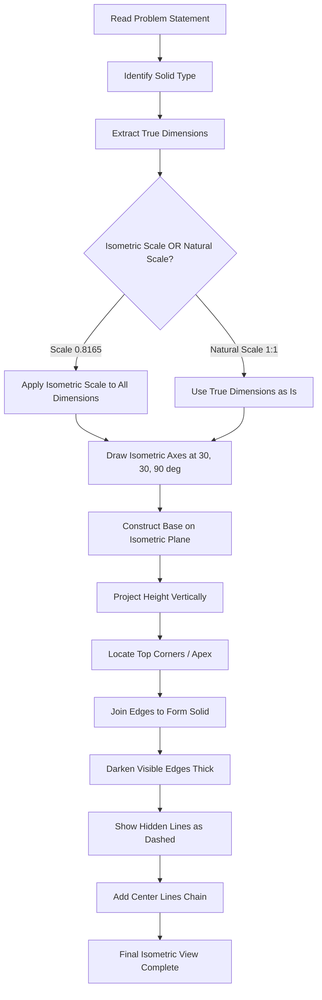
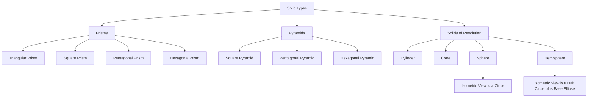
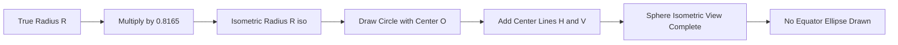
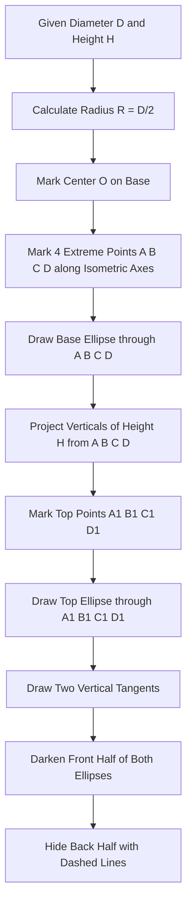
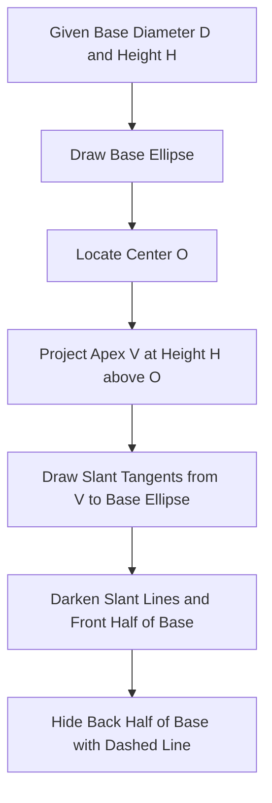
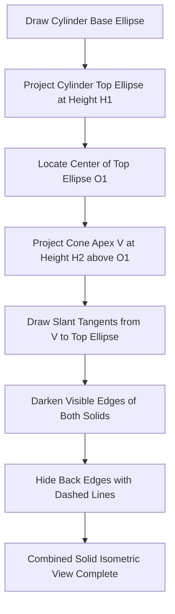

# Isometric Projection: Isometric scale- Isometric View and Projections of Prisms, Pyramids, Cone, Cylinder, Sphere, Hemisphere and their combinations.

<!-- SECTION_1_START -->
# ISOMETRIC PROJECTION & ISOMETRIC SCALE

## 1. Core Technical Definition (KTU 2024 Syllabus Terminology)

**Isometric Projection** is a method of representing a **3-dimensional object** in **2 dimensions** by rotating the object so that its three principal axes (which are mutually perpendicular in reality) appear equally inclined to the picture plane, each separated by an angle of **$120^\circ$** on the drawing sheet.

**Isometric Drawing / Isometric View** is the pictorial view drawn from the Isometric Projection where the dimensions are measured along the isometric axes using the **Isometric Scale** (a reduced scale that compensates for the foreshortening that occurs when true lengths are projected).

> [!IMPORTANT]
> **Key Distinction (Frequently Asked in KTU Exams):**
> - **Isometric Projection** $\rightarrow$ True lengths are foreshortened mathematically by the factor $\cos(35^\circ 16') \approx 0.8165$. The scale used is the **Isometric Scale**.
> - **Isometric Drawing/View** $\rightarrow$ True lengths are drawn directly (not foreshortened) along the isometric axes. The scale used is the **Natural Scale** (1:1).

---

## 2. Conceptual Analogy / Intuition

Imagine you are holding a **transparent glass cube** filled with water. You tilt the cube slightly so that you can see:
1. The **front face**
2. The **right-side face**
3. The **top face**

All at the same time. The diagonal line going into the depth of the cube now looks equally inclined to both the horizontal and vertical edges you see. That is exactly what we are doing on paper — we are simulating a **tilted viewing angle** where all three axes are equally visible.

> [!NOTE]
> **Why three axes are at $120^\circ$ and not $90^\circ$?**
> In a true 3D world, the three axes (X, Y, Z) meet at $90^\circ$. But on a flat 2D paper, if we keep them at $90^\circ$, one axis disappears behind the others. So we mathematically rotate the object so that the projection of these three axes appears at equal $120^\circ$ separation on paper — giving us the **isometric picture**.

---

## 3. The Isometric Axes & Reference Setup

On the drawing sheet, three lines are drawn from a common point (the **origin**) such that:
- All three lines are **mutually inclined at $120^\circ$**
- The two outer lines make an angle of **$30^\circ$** with the horizontal

| Axis | Direction | Inclination to Horizontal |
|------|-----------|---------------------------|
| **Left Axis (X-axis)** | Down-left | $30^\circ$ below horizontal |
| **Right Axis (Y-axis)** | Down-right | $30^\circ$ below horizontal |
| **Vertical Axis (Z-axis)** | Straight up | $90^\circ$ (vertical) |

> [!VISUALIZATION CONTROL]
> **Concept:** Isometric Axis Configuration on Drawing Sheet
> **GeoGebra / Desmos Input Equations:**
> * Line 1: $y = \tan(30^\circ) \cdot x$ (Right axis, slope $= +0.5774$)
> * Line 2: $y = -\tan(30^\circ) \cdot x$ (Left axis, slope $= -0.5774$)
> * Line 3: $x = 0$ (Vertical axis)
> **Visual Description:** Observe how the vertical axis bisects the $120^\circ$ angle between the two inclined axes, forming a perfect symmetric Y-shape rotated $90^\circ$.

---

## 4. Isometric Scale — The Heart of the Topic

When a line of true length **$L$** is oriented along an isometric axis, its **projected length** on the drawing sheet is:

$$L_{projected} = L \times \cos(35^\circ 16')$$

Because the true length is foreshortened (appears shorter). The ratio:

$$\text{Isometric Scale} = \frac{L_{projected}}{L} = \cos(35^\circ 16') \approx 0.8165$$

This is typically expressed as:

$$\boxed{\text{Isometric Scale} = \sqrt{\dfrac{2}{3}} \approx 0.8165 \approx 1 : 1.2247}$$

> [!TIP]
> **KTU Exam Shortcut:** When the question states "draw using isometric scale", multiply all true dimensions by **$0.8165$** (or use ratio **$1 : 1.225$**). When it states "isometric view/drawing", use the dimensions as they are (Natural Scale).

<!-- SECTION_1_END -->

<!-- SECTION_2_START -->
# DEEP THEORETICAL ANALYSIS & KTU FORMULA SHEET

## 1. Mathematical Origin of the Isometric Scale

Consider a cube of side **$a$** placed in the **First Quadrant** with one corner at the origin. Its three mutually perpendicular edges lie along the X, Y, and Z axes.

When this cube is rotated about a vertical axis by **$45^\circ$** and then tilted forward by **$\tan^{-1}(\sin 45^\circ) \approx 35^\circ 16'$**, the three edges appear equally foreshortened when projected onto the picture plane.

The angle of tilt (called the **isometric angle**) is derived as:

$$\alpha = \tan^{-1}\left(\sin 45^\circ\right) = \tan^{-1}(0.7071) \approx 35^\circ 16'$$

After this rotation, any edge of true length **$a$** projects to:

$$a_{projected} = a \cdot \cos(\alpha) = a \cdot \cos(35^\circ 16') \approx 0.8165 \cdot a$$

---

## 2. Angles Used in Isometric Construction

| Construction Step | Angle Used | Reason |
|-------------------|------------|--------|
| Initial rotation about vertical axis | $45^\circ$ | Equalizes visibility of X and Y axes |
| Final tilt forward | $\tan^{-1}(\sin 45^\circ) \approx 35^\circ 16'$ | Equalizes Z-axis with the other two |
| Isometric axes with horizontal | $30^\circ$ | $\sin(30^\circ) = 0.5$; chosen for drawing convenience |
| Angle between any two isometric axes | $120^\circ$ | Standard pictorial convention |
| Angle subtended by the axes circle | $360^\circ$ divided into 3 parts | Equal axes representation |

> [!NOTE]
> **Why $30^\circ$ for drawing axes if the actual tilt is $35^\circ 16'$?**
> The $30^\circ$ angle is used **only as a drawing convention** because it is easy to construct with a standard set-square ($30^\circ$–$60^\circ$–$90^\circ$). The foreshortening factor ($0.8165$) is applied separately to the true dimensions, not by adjusting the axis angle.

---

## 3. KTU High-Yield Formula Sheet (Exam Cheat Sheet)

| S.No. | Parameter | Formula / Value | Use |
|-------|-----------|-----------------|-----|
| 1 | Isometric Scale | $\cos(35^\circ 16') \approx 0.8165$ | Reduce true lengths |
| 2 | Isometric Scale (ratio form) | $1 : 1.2247$ | Standard KTU representation |
| 3 | Isometric Scale (alt form) | $\sqrt{2/3}$ | Algebraic identity |
| 4 | Tilt angle (isometric angle) | $\tan^{-1}(\sin 45^\circ) \approx 35^\circ 16'$ | Theoretical derivation |
| 5 | Angle of axes with horizontal | $30^\circ$ | Draw axes with set-square |
| 6 | Angle between isometric axes | $120^\circ$ | Axes layout |
| 7 | True length of diagonal of a face | $\sqrt{2} \cdot a$ | Square/rectangle faces |
| 8 | Diagonal of isometric cube | $\sqrt{3} \cdot a$ | Cube corner-to-corner |
| 9 | Sphere in isometric view | Circle of radius $R \cdot \sqrt{2/3}$ | Sphere/Hemisphere projection |
| 10 | Sphere in isometric view (alt) | Radius $0.8165 \cdot R$ | Simplified form |
| 11 | Foreshortening ratio for natural scale view | $1.2247 : 1$ | Inverse of isometric scale |

> [!IMPORTANT]
> **KTU Examiner Note:** For **sphere and hemisphere**, the isometric view is **always a circle** (not an ellipse). The radius of this circle = $R \times \sqrt{2/3} \approx 0.8165 \times R$. The center of this circle is the projected center of the sphere.

---

## 4. Real-World Engineering Utility

| Industry | Application |
|----------|-------------|
| **Mechanical CAD** | 3D part visualization in SolidWorks, CATIA, AutoCAD |
| **Architecture** | Building isometric blueprints and interior layouts |
| **Game Design** | Isometric tile-based games (classic RPGs, SimCity) |
| **Piping & Plant Design** | Isometric pipe routing drawings |
| **Civil Engineering** | Terrain and contour visualization |
| **Electronics** | PCB layout and 3D component placement |
| **Forensic/Investigation** | Crime scene 3D reconstructions |

---

## 5. Rules for Drawing Isometric Views of Solids

1. **Draw the isometric axes** as described ($30^\circ$, $30^\circ$, $90^\circ$).
2. **Draw the base** of the solid first in the isometric view using the plan dimensions.
3. **Project the height** vertically from each base corner using the true height.
4. **Join the top corners** to form the top face.
5. For curved solids (cylinder, cone, sphere), locate the **center**, mark the **extreme points** (top, bottom, left, right of the base circle), then **draw smooth curves** through them.
6. **Hide the back lines** that are not visible.
7. **Darken visible edges** with thick lines; **show center lines** as thin chain lines.
8. For **combinations of solids**, draw the larger/foundation solid first, then position the smaller solid on top using the given location coordinates.

<!-- SECTION_2_END -->

<!-- SECTION_3_START -->
# STEP-BY-STEP DERIVATIONS & DRAFTING IMPLEMENTATION

## 1. Derivation of the Isometric Scale

**Setup:** Consider a cube of edge **$a$** with one corner **$O$** at the origin, edges $OA$, $OB$, $OC$ along X, Y, Z axes respectively.

**Step 1:** Rotate the cube about the Z-axis through $45^\circ$ so that diagonal $AB$ of the base aligns along the Y-axis direction.

**Step 2:** After rotation, the new coordinates of the diagonal corner $D$ (originally at $(a, a, a)$) become:
- $X' = a \cos 45^\circ - a \sin 45^\circ = 0$
- $Y' = a \sin 45^\circ + a \cos 45^\circ = a\sqrt{2}$
- $Z' = a$

So $D$ is now at $(0, a\sqrt{2}, a)$.

**Step 3:** Tilt the cube forward by angle $\alpha$ (the isometric angle) about the X-axis. The new projected coordinates of $D$ on the picture plane (assuming the picture is the Y-Z plane after rotation):

$$\begin{aligned}
Y'' &= a\sqrt{2} \cdot \cos(\alpha) - a \cdot \sin(\alpha) \\
Z'' &= a\sqrt{2} \cdot \sin(\alpha) + a \cdot \cos(\alpha)
\end{aligned}$$

**Step 4:** For the three edges to be **equally foreshortened**, we need the projected lengths of $OA$, $OB$, $OC$ to be equal. Solving this condition gives:

$$\alpha = \tan^{-1}(\sin 45^\circ) = \tan^{-1}(0.7071) \approx 35^\circ 16'$$

**Step 5:** The common projected length of each edge is:

$$L_{projected} = a \cdot \cos(35^\circ 16') = a \times 0.8165$$

Hence the **Isometric Scale** $= 0.8165$.

$$\boxed{\text{Isometric Scale} = \cos(35^\circ 16') = \sqrt{\dfrac{2}{3}} \approx 0.8165}$$

---

## 2. Drafting Procedure — Isometric View of a Square Prism (Cube)

**Given:** A square prism of base $50 \text{ mm} \times 50 \text{ mm}$ and height $60 \text{ mm}$, resting on HP on its base.

**KTU Drafting Steps:**

1. **Draw the isometric axes** (X-left at $30^\circ}$, Y-right at $30^\circ}$, Z-vertical) from origin $O$.
2. **Mark the base** on the X-Y isometric plane by drawing a rhombus with both diagonals $50 \text{ mm}$ (since it's a square, both diagonals equal).
3. **Locate the four base corners** $A$, $B$, $C$, $D$ on the rhombus.
4. **Draw vertical lines** upward from each base corner equal to the true height ($60 \text{ mm}$).
5. **Mark the four top corners** $A'$, $B'$, $C'$, $D'$.
6. **Join the top corners** to form the top rhombus.
7. **Darken all visible edges** with thick lines; show the back-bottom edge $AD$ as a hidden line (dashed) or omit it if the back face is fully hidden.
8. **Add center lines** through the diagonals of both rhombuses.

---

## 3. Drafting Procedure — Isometric View of a Pentagonal Prism

**Given:** Pentagonal prism, base side $30 \text{ mm}$, height $50 \text{ mm}$, resting on HP on its base.

**KTU Drafting Steps:**

1. **Draw the isometric axes** at origin.
2. **Draw the pentagonal base** in the isometric plane:
   - First draw a horizontal line representing one edge of the base.
   - Use the **$30^\circ$-$60^\circ$ set-square** to construct edges at the isometric angles.
   - All five sides of the pentagon are drawn at **true length** ($30 \text{ mm}$) but oriented along directions that simulate the isometric view.
3. **Locate the five base corners** $V_1, V_2, V_3, V_4, V_5$.
4. **Project verticals** of height $50 \text{ mm}$ from each base corner.
5. **Mark the top corners** $V_1', V_2', V_3', V_4', V_5'$.
6. **Join the top corners** to complete the top pentagon.
7. **Darken visible edges** (front three vertical edges and the visible top and base edges).
8. **Show the back two vertical edges** as hidden lines (dashed) or omit depending on visibility.

---

## 4. Drafting Procedure — Isometric View of a Hexagonal Pyramid

**Given:** Hexagonal pyramid, base side $25 \text{ mm}$, height $60 \text{ mm}$, resting on HP on its base, with axis vertical.

**KTU Drafting Steps:**

1. **Draw the isometric axes**.
2. **Construct the hexagonal base** in the isometric plane:
   - A regular hexagon has all sides equal and internal angles of $120^\circ$.
   - In the isometric view, the hexagon is drawn with its long diagonal horizontal.
3. **Locate the center** $O$ of the hexagon.
4. **Mark the six base corners** $A, B, C, D, E, F$.
5. **Project a vertical line** from $O$ upward by $60 \text{ mm}$ to locate the apex $V$.
6. **Join $V$ to all six base corners** with slant edges.
7. **Darken** the three visible slant edges ($VA$, $VB$, $VC$ on the front) and the visible portion of the base hexagon.
8. **Show the back slant edges** ($VD$, $VE$, $VF$) as hidden lines (or omit if hidden behind the solid).

---

## 5. Drafting Procedure — Isometric View of a Cylinder

**Given:** Cylinder, base diameter $50 \text{ mm}$, height $70 \text{ mm}$, axis vertical, resting on HP.

**KTU Drafting Steps:**

1. **Draw the isometric axes** (X, Y, Z) at origin.
2. **Locate the center** of the base circle at origin $O$.
3. **Mark the four extreme points** of the base ellipse:
   - $A$ along negative X-axis: distance $R = 25 \text{ mm}$
   - $B$ along positive Y-axis: distance $R = 25 \text{ mm}$
   - $C$ along positive X-axis: distance $R = 25 \text{ mm}$
   - $D$ along negative Y-axis: distance $R = 25 \text{ mm}$
4. **Draw a smooth ellipse** (using French curve or spline) through $A, B, C, D$. This is the base ellipse.
5. **Repeat for the top ellipse** by projecting verticals of height $70 \text{ mm}$ from $A, B, C, D$ to get $A', B', C', D'$.
6. **Draw the top ellipse** through $A', B', C', D'$.
7. **Draw the two extreme vertical tangents** $AC$ (left side) and $BD$ (right side).
8. **Darken** the front half of both ellipses and the two vertical tangents.
9. **Show** the back half of both ellipses as hidden lines (dashed) or omit.

> [!NOTE]
> **KTU Tip — How to draw the isometric ellipse (offset method):**
> 1. Draw the isometric square (rhombus) of side equal to the diameter $D$.
> 2. Mark the midpoints of all four sides of the rhombus.
> 3. The ellipse is tangent to the rhombus at the **midpoints of its four sides**.
> 4. Use a French curve to join these four tangent points smoothly.

---

## 6. Drafting Procedure — Isometric View of a Cone

**Given:** Cone, base diameter $60 \text{ mm}$, height $80 \text{ mm}$, axis vertical, resting on HP.

**KTU Drafting Steps:**

1. **Draw the isometric axes** at origin.
2. **Draw the base ellipse** (same procedure as cylinder base, with $D = 60 \text{ mm}$).
3. **Locate the center** $O$ of the base ellipse.
4. **Project a vertical** from $O$ upward by the true height $80 \text{ mm}$ to locate the apex $V$.
5. **Draw the two extreme slant lines** $VA$ and $VC$ (tangents from apex to the base ellipse at points $A$ and $C$).
6. **Darken** these two slant lines and the front half of the base ellipse.
7. **Show** the back half of the base ellipse as a hidden line.
8. **Do not show** any top closing line (since cone tapers to a point).

---

## 7. Drafting Procedure — Isometric View of a Sphere

**Given:** Sphere, diameter $50 \text{ mm}$, center at origin.

**KTU Drafting Steps:**

1. **Draw the isometric axes** for reference.
2. **Locate the center** $O$ of the sphere at the origin.
3. **Calculate the isometric radius**:
$$R_{iso} = R_{true} \times \sqrt{\frac{2}{3}} = 25 \times 0.8165 = 20.41 \text{ mm}$$
4. **Draw a circle** of radius $20.41 \text{ mm}$ with $O$ as center.
5. **Show the center lines** (horizontal and vertical diameters) as thin chain lines.
6. **Do not show** the great circle (equator) as a separate ellipse — only the outer circle is visible.

> [!IMPORTANT]
> **KTU Examiner Note:** Many students draw the equator of the sphere as an ellipse — this is **wrong**. The sphere is the only solid whose isometric view is a **perfect circle**.

---

## 8. Drafting Procedure — Isometric View of a Hemisphere

**Given:** Hemisphere, base diameter $50 \text{ mm}$, flat face on HP.

**KTU Drafting Steps:**

1. **Draw the isometric axes**.
2. **Calculate the isometric radius** $R_{iso} = 25 \times 0.8165 = 20.41 \text{ mm}$.
3. **Locate the center** $O$ of the flat (base) face.
4. **Draw the base ellipse** of the hemisphere:
   - The base is a circle of diameter $50 \text{ mm}$ when viewed from above.
   - In isometric view, the base becomes an ellipse of major axis = $D = 50 \text{ mm}$ along the long diagonal, and minor axis = $D \times 0.5774 = 50 \times 0.5774 = 28.87 \text{ mm}$ perpendicular to it.
5. **Draw the outer hemisphere circle** of radius $20.41 \text{ mm}$ centered at $O$.
6. **Show the front half of the base ellipse** as a visible line.
7. **Show the back half of the base ellipse** as a hidden line.
8. **Darken** the outer hemisphere circle.

---

## 9. Drafting Procedure — Isometric View of Combined Solids

**Example 1:** A **cylinder with a cone on top** (combined solid).
1. Draw the **cylinder** first (as in Section 5).
2. **Locate the center** of the top face of the cylinder.
3. **Project the apex** of the cone vertically above the center by the cone's height.
4. **Draw the slant tangents** from the apex to the top ellipse of the cylinder.
5. **Darken** the visible edges and **hide** the back ones.

**Example 2:** A **sphere on top of a cylinder** (lamp post shape).
1. Draw the **cylinder** up to its top.
2. **Locate the center** of the top circle of the cylinder.
3. **Draw the isometric circle of the sphere** with center at this point and radius $R_{iso} = R \times 0.8165$.
4. **Darken** the visible front half of the sphere and the top half of the cylinder's top ellipse.

**Example 3:** A **cube with a cylindrical hole** through it.
1. Draw the **isometric cube** first.
2. **Locate the center** of the cube.
3. **Draw the cylinder's two ellipses** (entry and exit faces) on opposite faces of the cube.
4. **Connect with vertical tangents** to show the cylindrical hole's interior.
5. **Show hidden lines** for the back portion of the hole.

---

## 10. Engineering Drafting Reference Plane Summary

| Reference Plane | Symbol | Role in Isometric Projection |
|-----------------|--------|------------------------------|
| **Horizontal Plane** | **$HP$** | The ground on which the solid rests |
| **Vertical Plane** | **$VP$** | The picture plane onto which isometric view is projected |
| **Profile Plane** | **$PP$** | The third reference plane (perpendicular to both $HP$ and $VP$) |

> [!NOTE]
> **KTU Convention:** In isometric projection, all measurements along the three isometric axes are taken using the **Isometric Scale** ($0.8165 \times$ true length). In isometric view/drawing, **Natural Scale** is used.

<!-- SECTION_3_END -->

<!-- SECTION_4_START -->
# STRUCTURAL DIAGRAMS & SCHEMATICS

## 1. Mermaid Diagram: Isometric Projection Workflow



## 2. Mermaid Diagram: Classification of Solids for Isometric Construction



## 3. Mermaid Diagram: Sphere Isometric View Construction



## 4. Mermaid Diagram: Cylinder Construction Logic



## 5. Mermaid Diagram: Cone Construction Logic



## 6. Mermaid Diagram: Reference Planes and Projection Alignment

```mermaid
subgraph Reference_Planes
    rp1[Horizontal Plane HP] --- rp2[Vertical Plane VP]
    rp2 --- rp3[Profile Plane PP]
end
subgraph Object_Placement
    op1[Object rests on HP] --- op2[Front face parallel to VP]
end
subgraph Isometric_Output
    io1[Object is rotated 45 deg about Z] --- io2[Object is tilted 35 deg 16 min forward]
end
Reference_Planes --> Object_Placement
Object_Placement --> Isometric_Output
```

## 7. Mermaid Diagram: Combined Solid (Cylinder + Cone) Workflow



<!-- SECTION_4_END -->

<!-- SECTION_5_START -->
# KTU 2024 SCHEME EXAMINATION QUESTION BANK

---

## PART A — 3 MARK QUESTIONS

### Question 1
**[KTU University Exam — July 2024]**
**CO1 | Remember**

Define **Isometric Scale**. State its numerical value and the formula used to compute it.

**Model Answer (3 Marks):**
Isometric Scale is the ratio of the foreshortened length of a line along an isometric axis to its true length. **[1 Mark]**
The formula is:
$$\text{Isometric Scale} = \cos(35^\circ 16') = \sqrt{\dfrac{2}{3}} \approx 0.8165 \approx 1 : 1.2247$$
**[2 Marks]**

---

### Question 2
**[KTU University Exam — Dec 2023]**
**CO1 | Understand**

Differentiate between **Isometric Projection** and **Isometric View** (Drawing).

**Model Answer (3 Marks):**
| Parameter | Isometric Projection | Isometric View / Drawing |
|-----------|----------------------|---------------------------|
| Scale used | Isometric Scale (0.8165) | Natural Scale (1:1) |
| Foreshortening | Yes, mathematically applied | No, true lengths drawn |
| Accuracy | Theoretically accurate | Practically convenient |
| **[1 Mark each for any 3 distinguishing points: 3 Marks]** |

---

## PART B — 14 MARK QUESTIONS (Module Internal Choice)

### Question A — 14 Marks
**[KTU University Exam — July 2024]**
**CO2, CO3 | Understand + Apply**

A **pentagonal prism** of base side $30 \text{ mm}$ and height $50 \text{ mm}$ rests on its base on the Horizontal Plane (HP) with one of its base edges parallel to the Vertical Plane (VP). Draw its **Isometric Projection** using the Isometric Scale.

**Part (a) — 7 Marks | Understand**
Explain the procedure to draw the isometric projection of a pentagonal prism with a neat sketch showing the axes and base construction.

**Model Solution:**
1. **State the dimensions and scale:** Base side $a = 30 \text{ mm}$, height $h = 50 \text{ mm}$. Isometric Scale $= 0.8165$. **[1 Mark for stating scale]**
2. **Scaled dimensions:** Base side $= 30 \times 0.8165 = 24.5 \text{ mm}$, height $= 50 \times 0.8165 = 40.83 \text{ mm}$. **[1 Mark for calculation]**
3. **Draw the isometric axes** with $30^\circ$ on either side of horizontal and $90^\circ$ vertical. **[1 Mark]**
4. **Construct the pentagonal base** in the isometric plane. The pentagon is drawn with all five sides equal to $24.5 \text{ mm}$ (scaled). The base sits on the X-Y plane formed by the two inclined axes. **[2 Marks for base construction]**
5. **Mark the five base vertices** $V_1, V_2, V_3, V_4, V_5$. **[1 Mark]**
6. **Project vertical lines** of length $40.83 \text{ mm}$ from each base vertex. **[1 Mark]**

**Part (b) — 7 Marks | Apply**
Complete the isometric projection, darken the visible edges, and show the hidden edges with proper line conventions.

**Model Solution:**
1. **Mark the top vertices** $V_1', V_2', V_3', V_4', V_5'$ at the end of the verticals. **[1 Mark]**
2. **Join the top vertices** to form the top pentagon. **[1 Mark]**
3. **Identify visible and hidden edges:**
   - Front three vertical edges $V_1V_1'$, $V_2V_2'$, $V_3V_3'$ — **visible (thick continuous lines)**. **[1 Mark]**
   - Back two vertical edges $V_4V_4'$, $V_5V_5'$ — **hidden (dashed lines)**. **[1 Mark]**
4. **Front edges of the base and top pentagons** — visible (thick). **[1 Mark]**
5. **Back edges of the base and top pentagons** — hidden (dashed). **[1 Mark]**
6. **Add center lines** as thin chain lines through the base and top centers. **[1 Mark]**

**Incremental Valuation Key Summary:**
- '[Stating scale and dimensions: 2 Marks]'
- '[Base construction: 2 Marks]'
- '[Top construction: 2 Marks]'
- '[Line conventions and darkening: 1 Mark]'

---

### Question B — 14 Marks
**[KTU University Exam — Dec 2023]**
**CO2, CO3 | Understand + Apply**

A **cone** of base diameter $60 \text{ mm}$ and height $80 \text{ mm}$ rests on its base on the Horizontal Plane (HP). A **hemisphere** of diameter $40 \text{ mm}$ is placed on top of the cone such that their axes coincide. Draw the **Isometric View** of the combined solid using Natural Scale.

**Part (a) — 7 Marks | Understand**
Describe the drafting procedure to construct the isometric view of the combined solid and draw the base ellipse of the cone.

**Model Solution:**
1. **State the dimensions:** Cone base $D = 60 \text{ mm}$, cone height $H_c = 80 \text{ mm}$, hemisphere diameter $d = 40 \text{ mm}$. Natural Scale is used (1:1). **[1 Mark]**
2. **Draw the isometric axes** with $30^\circ$ on either side of horizontal. **[1 Mark]**
3. **Construct the base ellipse of the cone**:
   - Mark the center $O$ at the origin.
   - Mark the four extreme points: $A$ (along negative X-axis at $30 \text{ mm}$), $B$ (along positive Y-axis at $30 \text{ mm}$), $C$ (along positive X-axis at $30 \text{ mm}$), $D$ (along negative Y-axis at $30 \text{ mm}$). **[1 Mark]**
   - Draw a smooth ellipse through $A, B, C, D$ using a French curve. **[2 Marks]**
4. **Locate the center** of the base ellipse as $O$. **[1 Mark]**
5. **Identify the isometric radius** for the hemisphere calculation:
$$R_{iso} = 20 \times 0.8165 = 16.33 \text{ mm} \quad \text{[Note: even in isometric view, the sphere formula applies]}$$
**[1 Mark for identifying radius]**

**Part (b) — 7 Marks | Apply**
Complete the drawing, position the hemisphere, and apply proper line conventions.

**Model Solution:**
1. **Project a vertical** from $O$ upward by $80 \text{ mm}$ to locate the apex $V$ of the cone. **[1 Mark]**
2. **Draw the slant tangents** $VA$ and $VC$ from the apex to the extreme points of the base ellipse. **[1 Mark]**
3. **Locate the top of the cone axis** at point $V_{top}$ — this is the center of the top circular face of the cone. (For a true cone, the top is just the apex $V$.) **[1 Mark]**
4. **Position the hemisphere** on top of the cone at the apex (since the cone tapers to a point, the hemisphere sits with its flat face tangent to the apex point of the cone). The center of the hemisphere is at $V$. **[1 Mark]**
5. **Draw the isometric circle of the hemisphere**:
   - Center at $V$, radius $= 16.33 \text{ mm}$ (isometric radius of hemisphere). **[1 Mark]**
6. **Apply line conventions**:
   - Visible: front half of cone base ellipse, slant tangents $VA, VC$, and the front half of the hemisphere circle. **[1 Mark]**
   - Hidden: back half of cone base ellipse (dashed). **[1 Mark]**

**Incremental Valuation Key Summary:**
- '[Base ellipse construction: 3 Marks]'
- '[Cone slant edges: 2 Marks]'
- '[Hemisphere positioning and circle: 2 Marks]'
- '[Line conventions: 1 Mark]'

---

> [!WARNING]
> **KTU Examiner's Valuation Warning / Common Pitfalls:**
> 1. **Sphere/Hemisphere Pitfall:** Students often draw the equator of the sphere as an ellipse. This is **wrong** — the sphere's isometric view is a **single circle** of radius $R \times 0.8165$. Drawing an extra ellipse inside will cost **2 marks** in valuation.
> 2. **Isometric Scale Confusion:** When the question says "isometric projection" use $0.8165 \times$ true dimensions. When it says "isometric view" or "isometric drawing", use **true dimensions directly**. Mixing these will lose marks.
> 3. **Ellipse Tangency Error:** The isometric ellipse (for cylinder/cone base) is **tangent to the isometric square at the midpoints of its sides**, not at the corners. Drawing it as a circle or a stretched oval will lose marks.
> 4. **Hidden Line Omission:** Forgetting to show the back hidden edges as **dashed lines** is a common error. KTU examiners specifically look for this.
> 5. **Axes Angle Error:** Drawing the isometric axes at $45^\circ$ (oblique projection angle) instead of $30^\circ$ is a **fatal error** that loses up to **3 marks**.
> 6. **Center Lines:** Forgetting to draw the center lines (thin chain lines with long dashes and short dashes alternately) through the centers of circles and ellipses is a minor deduction of **0.5 to 1 mark**.

---

## TOPIC RECAP & IMPORTANT THINGS TO REMEMBER

- **Isometric Projection** is a pictorial projection where the three principal axes are equally inclined to the picture plane.
- **Isometric Scale** $= \cos(35^\circ 16') = \sqrt{2/3} \approx 0.8165 \approx 1 : 1.2247$.
- The **isometric axes** are drawn at **$30^\circ$** to the horizontal on either side, and **$90^\circ$** (vertical) in the middle.
- The **angle between any two isometric axes** is **$120^\circ$**.
- The **isometric angle (tilt)** is **$\tan^{-1}(\sin 45^\circ) \approx 35^\circ 16'$** — this is a theoretical angle, not the drawing angle.
- **Isometric Projection** uses Isometric Scale (foreshortened), while **Isometric View/Drawing** uses Natural Scale (true lengths).
- For a **prism**, draw the base rhombus/polygon first, then project verticals to the top.
- For a **pyramid**, draw the base polygon, locate the center, and project the apex vertically.
- For a **cylinder**, draw the base ellipse using four extreme points, then project the top ellipse, and connect with two vertical tangents.
- For a **cone**, draw the base ellipse, locate the apex, and join with two slant tangents.
- For a **sphere**, the isometric view is a **single circle** of radius $R \times 0.8165$. **No equator ellipse** is drawn.
- For a **hemisphere**, draw a circle of radius $R \times 0.8165$ for the curved surface, and a half-ellipse for the flat base.
- **Cylindrical/Circular bases** become **ellipses** in isometric view, with major axis = diameter and minor axis = $0.5774 \times$ diameter.
- **Hidden lines** must be shown as **dashed thin lines**; **visible edges** as **thick continuous lines**; **center lines** as **thin chain lines**.
- **Combinations of solids**: Draw the base solid first, then position the top solid using the given coordinates and connect with proper edges.
- The **Isometric Scale** is also called the **Reduction Scale** because true lengths are reduced by the factor $0.8165$ in isometric projection.
- KTU standard answer sheets require a **neat title block** with: Name, Roll No, Page No, Question No, and the Scale used (e.g., "Isometric Scale 1:1.225" or "Natural Scale 1:1").

<!-- SECTION_5_END -->
