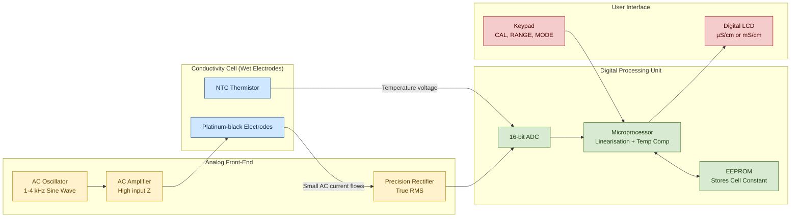
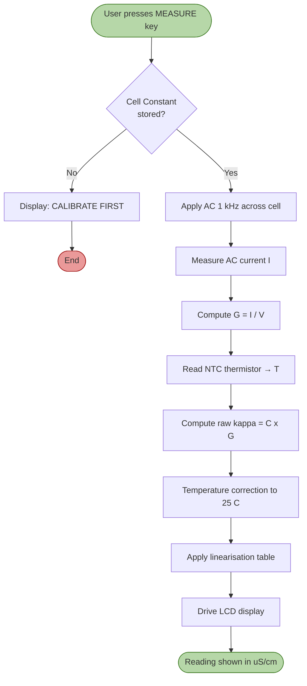
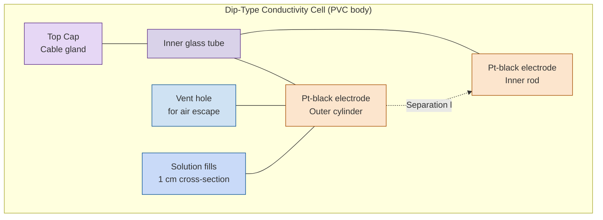

# Conductivity - Measurement using Digital conductivity meter

<!-- SECTION_1_START -->

# Conductivity & Its Measurement Using a Digital Conductivity Meter

## 1.1 Formal Academic Definition (KTU 2024 Syllabus Terminology)

**Electrical Conductivity ($\kappa$, kappa)** of an electrolyte solution is defined as the reciprocal of resistivity ($\rho$). It is numerically equal to the conductance of a **1 cm³ cube** (or 1 m³ cube in SI) of the solution measured between two parallel electrodes of unit cross-sectional area separated by unit distance.

$$\kappa = \frac{1}{\rho} = \frac{1}{R} \cdot \frac{l}{A}$$

where:
- $R$ = Resistance of the solution (in Ohms, $\Omega$)
- $l$ = Distance between the electrodes (in cm or m)
- $A$ = Cross-sectional area of the electrodes (in cm² or m²)
- $\kappa$ = Specific / electrolytic conductivity (in S·cm⁻¹ or S·m⁻¹)

> [!IMPORTANT]
> **KTU Definition Recall (Board Exam Favourite):**
> "Conductivity is the ability of a material to conduct electric current. For electrolytes, it is the conductance of one centimetre cube of the solution."

A **Digital Conductivity Meter** is a microprocessor-controlled electronic instrument that applies a small AC voltage across an immersion-type conductivity cell, measures the resulting current, computes the conductance, and displays the conductivity value digitally after applying the pre-calibrated **cell constant ($\mathcal{C}$)** correction.

---

## 1.2 Conceptual Analogy — "The Water Pipe Model"

Imagine electricity flowing through a solution as **water flowing through a pipe**:

| Electrical Quantity | Hydraulic Analogy | Relation |
|---|---|---|
| Voltage ($V$) | Water pressure | Driving force |
| Current ($I$) | Water flow rate | Result of pressure |
| Resistance ($R$) | Narrowness of pipe | Opposes flow |
| **Conductance** ($G = 1/R$) | **Width/opening of pipe** | Allows flow |
| **Conductivity** ($\kappa$) | **Pipe's intrinsic openness per unit volume** | Material property |

> [!NOTE]
> **Intuition:** A *conductor* is like a *wide, smooth pipe* (water gushes through). An *insulator* is like a *clogged straw* (water trickles). Pure water is a clogged straw; salt water is a wide pipe. The **digital conductivity meter** is essentially an *electronic flow-meter* that tells you exactly how "open" the liquid is.

---

## 1.3 GeoGebra / Desmos Visualization (Concept: Conductivity vs. Concentration)

> [!VISUALIZATION CONTROL]
> **Concept:** Variation of molar conductivity ($\Lambda_m$) and specific conductivity ($\kappa$) with concentration for a strong electrolyte (KCl) and a weak electrolyte (CH₃COOH).
> **GeoGebra / Desmos Input Equations:**
> - Strong electrolyte (KCl): $\Lambda_{m}(c) = 149.9 - 95.0\sqrt{c}$ (Kohlrausch empirical form)
> - Weak electrolyte: $\Lambda_{m}(c) = \dfrac{400 \cdot \sqrt{K_a}}{\sqrt{c}}$ (Ostwald's approximation)
> - $\kappa(c) = \Lambda_{m}(c) \cdot c$  (to compute specific conductivity)
>
> **Visual Description:** For a **strong electrolyte**, the $\Lambda_m$ vs $\sqrt{c}$ plot is a **straight line** with negative slope (Kohlrausch plot). The $\kappa$ vs $c$ plot **rises monotonically**. For a **weak electrolyte**, $\Lambda_m$ rises sharply at very low concentration, while $\kappa$ shows a maximum due to the dominance of $c$ in the multiplication factor.

---

## 1.4 Why "Digital" and Not Simple Analog?

Older analog meters use a **Wheatstone bridge** with a magic-eye galvanometer for null detection — slow, manual balancing, and operator-dependent.

A **digital conductivity meter** replaces this with:
- An **AC oscillator** (typically 50 Hz – 4 kHz) — using AC prevents **polarization** at the electrodes.
- A **precision rectifier** and **analog-to-digital converter (ADC)**.
- A **microprocessor** that applies the cell constant and temperature compensation in real time.
- An **LCD / 7-segment display** showing the reading in $\mu$S/cm or mS/cm.

> [!IMPORTANT]
> **KTU Highlight:** "Digital conductivity meters use alternating current (AC) and a temperature sensor (often built-in NTC thermistor) so that readings are auto-corrected to a reference temperature of **25 °C (298.15 K)**."

---

<!-- SECTION_1_END -->

<!-- SECTION_2_START -->

# Deep Theoretical Analysis & KTU High-Yield Formula Sheet

## 2.1 The Hierarchy of Conductance Quantities

The relationships between the different conductivity quantities form the **single most important numerical chain** in KTU electrochemistry problems.

### Step 1 — Conductance ($G$)
Reciprocal of resistance:
$$G = \frac{1}{R} \quad \text{[Unit: Siemens, S = }\Omega^{-1}\text{]}$$

### Step 2 — Cell Constant ($\mathcal{C}$)
A geometrical property of the conductivity cell:
$$\mathcal{C} = \frac{l}{A} \quad \text{[Unit: cm}^{-1}\text{ or m}^{-1}\text{]}$$

### Step 3 — Specific (Electrolytic) Conductivity ($\kappa$)
$$\boxed{\kappa = G \cdot \mathcal{C} = \frac{\mathcal{C}}{R}}$$

> **Why multiply by cell constant?** The measured conductance is for a *real* cell with arbitrary $l$ and $A$. We need to *normalize* it to the standard 1-cm cube definition, so we multiply by $\frac{l}{A}$.

### Step 4 — Molar Conductivity ($\Lambda_m$)
Conductivity per mole of electrolyte dissolved:
$$\boxed{\Lambda_m = \frac{\kappa \times 1000}{M} = \frac{\kappa}{c}}$$

where $M$ = molarity in mol·L⁻¹ and $c$ = concentration in mol·cm⁻³ (note the 1000 factor: 1 L = 1000 cm³).

### Step 5 — Equivalent Conductivity ($\Lambda_{eq}$)
$$\boxed{\Lambda_{eq} = \frac{\kappa \times 1000}{N}}$$

where $N$ = normality in g-equivalent·L⁻¹.

| Symbol | Name | Defining Equation | SI Unit | Common Unit |
|---|---|---|---|---|
| $R$ | Resistance | $V/I$ | $\Omega$ | $\Omega$ |
| $G$ | Conductance | $1/R$ | S | S |
| $\mathcal{C}$ | Cell constant | $l/A$ | m⁻¹ | cm⁻¹ |
| $\kappa$ | Specific conductivity | $G \cdot \mathcal{C}$ | S·m⁻¹ | S·cm⁻¹ |
| $\Lambda_m$ | Molar conductivity | $\kappa/c$ (SI: $\kappa/c$, CGS: $1000\kappa/M$) | S·m²·mol⁻¹ | S·cm²·mol⁻¹ |
| $\Lambda_{eq}$ | Equivalent conductivity | $1000\kappa/N$ | S·m²·eq⁻¹ | S·cm²·eq⁻¹ |

> [!NOTE]
> **Conversion Mastery (Lost Marks Zone):** In KTU problems, if $\kappa$ is in **S·cm⁻¹** and concentration in **mol·L⁻¹**, use $\Lambda_m = \dfrac{1000\,\kappa}{M}$. If both are in SI (S·m⁻¹ and mol·m⁻³), use $\Lambda_m = \dfrac{\kappa}{c}$ — **no 1000 factor**.

---

## 2.2 Variation of Conductivity with Dilution

### (a) Strong Electrolyte (KCl, NaCl, HCl)
$$\Lambda_m = \Lambda_m^{\circ} - A\sqrt{c} \quad \text{(Kohlrausch's empirical law)}$$

- $\Lambda_m^{\circ}$ = Limiting molar conductivity (intercept on Y-axis)
- Slope is **negative** (small magnitude).

### (b) Weak Electrolyte (CH₃COOH, NH₄OH)
$$\Lambda_m^{\circ} = \lambda^{\circ}_{+} + \lambda^{\circ}_{-} \quad \text{(Kohlrausch's Law of Independent Migration of Ions)}$$

A weak electrolyte's $\Lambda_m$ **rises steeply on dilution** but never reaches $\Lambda_m^{\circ}$ at measurable concentrations.

---

## 2.3 Why AC is Used in Digital Conductivity Meters

If DC current is passed through an electrolyte:
- **Electrolysis** occurs at the electrodes.
- Gas bubbles (H₂, O₂, Cl₂) form on the electrode surface → **polarization** → apparent resistance increases falsely.

**Solution:** Use **alternating current** at a frequency of **1 kHz – 4 kHz** so the electrolysis products alternately form and dissolve back, giving a net-zero polarization. Platinum-black coated electrodes further reduce this effect.

---

## 2.4 Temperature Compensation in Digital Meters

Conductivity of most aqueous electrolytes increases by approximately **2 % per °C**. The digital meter stores a **linearization equation**:

$$\kappa_{25} = \frac{\kappa_T}{1 + 0.02\,(T - 25)}$$

where $\kappa_T$ is the measured conductivity at temperature $T$ (in °C).

A built-in **NTC thermistor (10 k$\Omega$ at 25 °C)** senses temperature, and the microprocessor applies the correction automatically.

---

## 2.5 KTU High-Yield Formula Sheet (Cheat-Sheet)

| # | Formula | Use / Meaning | Unit |
|---|---|---|---|
| 1 | $\kappa = \dfrac{1}{R} \cdot \dfrac{l}{A}$ | Specific conductivity from resistance | S·cm⁻¹ |
| 2 | $\mathcal{C} = \dfrac{l}{A} = \kappa \cdot R$ | Cell constant (calibrated with KCl) | cm⁻¹ |
| 3 | $\Lambda_m = \dfrac{1000\,\kappa}{M}$ | Molar conductivity (CGS / practical) | S·cm²·mol⁻¹ |
| 4 | $\Lambda_{eq} = \dfrac{1000\,\kappa}{N}$ | Equivalent conductivity | S·cm²·eq⁻¹ |
| 5 | $\Lambda_{eq} = \Lambda_m \cdot n$-factor | $\Lambda_{eq} = n_f \cdot \Lambda_m$ where $n_f$ = total positive/negative charge | – |
| 6 | $\Lambda_m^{\circ} = \sum \lambda^{\circ}_{+} + \sum \lambda^{\circ}_{-}$ | Kohlrausch's law (limiting) | S·cm²·mol⁻¹ |
| 7 | $\Lambda_m = \Lambda_m^{\circ} - A\sqrt{c}$ | Debye–Hückel–Onsager (strong) | – |
| 8 | $\alpha = \dfrac{\Lambda_m}{\Lambda_m^{\circ}}$ | Degree of dissociation (weak) | dimensionless |
| 9 | $K_a = \dfrac{c\,\alpha^2}{1-\alpha} = \dfrac{c\,\Lambda_m^2}{\Lambda_m^{\circ}\,(\Lambda_m^{\circ}-\Lambda_m)}$ | Dissociation constant (Ostwald) | – |
| 10 | $\kappa_{25} = \dfrac{\kappa_T}{1+0.02(T-25)}$ | Temperature correction | – |

---

## 2.6 Engineering Utility (Why Study This?)

- **Water Treatment Plants (KTU Kerala context – KWA, KSEB):** TDS meters (a variant) measure total dissolved salts to decide potability.
- **Power Plants (Cochin/Kayamkulam):** De-mineralized water for boilers has conductivity < **1 µS·cm⁻¹**; any rise triggers alarms to prevent turbine corrosion.
- **Semiconductor / Chip Fabrication (Kerala's upcoming IT/ESDM hubs):** Ultra-pure water (UPW) for wafer cleaning is monitored at **0.055 µS·cm⁻¹** (theoretical limit for water at 25 °C).
- **Battery Industry, Biomedical (dialysis fluid), Food industry (juice concentration) and Aquaculture (fish-farming) all rely on conductivity measurement.**

---

<!-- SECTION_2_END -->

<!-- SECTION_3_START -->

# Step-by-Step Derivations, Calibration & Python Implementation

## 3.1 Derivation — From Resistance to Molar Conductivity

Given a conductivity cell with electrodes of area $A$ separated by distance $l$, filled with an electrolyte of resistance $R$ measured by the digital meter:

**Step 1 — Resistance of the solution (measured quantity):**
$$R = \rho \cdot \frac{l}{A} \quad \text{(resistivity form of Ohm's law for a uniform slab)}$$

where $\rho$ is the resistivity in $\Omega\cdot$cm.

**Step 2 — Rearranging for resistivity:**
$$\rho = R \cdot \frac{A}{l}$$

**Step 3 — Taking the reciprocal to get conductivity:**
$$\kappa = \frac{1}{\rho} = \frac{1}{R} \cdot \frac{l}{A} = \frac{\mathcal{C}}{R}$$

> **Valuation Note:** This is the **fundamental relation** examiners expect to see written in any conductivity numerical — *always* show the cell constant explicitly.

**Step 4 — Convert to molar conductivity using $M$ (molarity in mol·L⁻¹) and 1 L = 1000 cm³:**

$$\Lambda_m = \frac{\kappa}{c} = \frac{\kappa \times 1000}{M} \quad \text{[S·cm}^2\text{·mol}^{-1}\text{]}$$

> **Logic Row:** We need "conductivity per mole." $\kappa$ is per cm³. There are **1000 cm³ in 1 L**, and **$M$ moles in 1 L** ⇒ per mole = $\dfrac{\kappa}{M/1000} = \dfrac{1000\,\kappa}{M}$.

---

## 3.2 Cell Constant Calibration — Numerical Derivation

A conductivity cell is calibrated using a standard **0.1 M KCl solution** whose specific conductivity at 25 °C is accurately known: $\kappa_{KCl} = 0.00129\ \text{S·cm}^{-1}$ (a standard KTU-table value).

If the digital meter (or wheatstone bridge) shows $R_{obs} = 85\ \Omega$ for this KCl solution, the cell constant is computed as:

$$\mathcal{C} = \kappa_{KCl} \times R_{obs}$$

Substitute values:
$$\mathcal{C} = 0.00129\ \text{S·cm}^{-1} \times 85\ \Omega$$
$$\mathcal{C} = 0.10965\ \text{cm}^{-1}$$

> **Mark Allocation Tip:** Show the **formula**, **substitution** and **unit cancellation** explicitly. Many KTU students lose 1 mark by writing only the final number.

---

## 3.3 Worked Example — Full Molar Conductivity Calculation

**Problem (KTU-type):** A 0.05 M solution of KCl at 25 °C has a resistance of 250 $\Omega$ in a cell whose cell constant is 0.5 cm⁻¹. Calculate (a) specific conductivity, (b) molar conductivity.

### Part (a) — Specific Conductivity
**Formula:**
$$\kappa = \frac{\mathcal{C}}{R}$$

**Substitution:**
$$\kappa = \frac{0.5\ \text{cm}^{-1}}{250\ \Omega} = 0.002\ \text{S·cm}^{-1}$$

**Result:** $\kappa = 2 \times 10^{-3}\ \text{S·cm}^{-1}$  **[2 Marks]**

### Part (b) — Molar Conductivity
**Formula:**
$$\Lambda_m = \frac{1000\,\kappa}{M}$$

**Substitution:**
$$\Lambda_m = \frac{1000 \times 0.002}{0.05} = \frac{2}{0.05} = 40\ \text{S·cm}^{2}\text{·mol}^{-1}$$

**Result:** $\Lambda_m = 40\ \text{S·cm}^{2}\text{·mol}^{-1}$  **[2 Marks]**

> **Step-wise Mark Breakdown:** [Stating formula $\kappa = \mathcal{C}/R$: 1 Mark] [Substitution & answer: 1 Mark] [Stating formula $\Lambda_m$: 1 Mark] [Final answer: 1 Mark]

---

## 3.4 Python Implementation — Digital Conductivity Meter Simulator

A fully working, type-hinted Python script that emulates the **measurement pipeline inside a digital conductivity meter**, including KCl calibration, cell-constant storage, temperature compensation, and reporting.

```python
"""
digital_conductivity_meter.py
Simulator of a digital conductivity meter workflow
Calibrated against standard 0.1 M KCl at 25 °C.
"""

from __future__ import annotations
import math
import logging
from dataclasses import dataclass, field
from typing import Dict, List, Optional

# -------------------------------------------------------------------
# Module-level configuration
# -------------------------------------------------------------------
logging.basicConfig(
    level=logging.INFO,
    format="[%(asctime)s] %(levelname)s - %(message)s",
)

# Standard reference table (κ in S/cm at 25 °C)
KCL_STANDARD_TABLE: Dict[float, float] = {
    0.1:  0.01290,   # 0.1 M
    0.01: 0.00141,   # 0.01 M
    0.001: 0.000147, # 0.001 M
}

TEMP_COEFFICIENT_PER_C: float = 0.02   # 2 %/°C default
REFERENCE_TEMP_C: float = 25.0


@dataclass
class CalibrationResult:
    cell_constant_cm_inv: float
    calibration_resistance_ohm: float
    reference_conductivity_S_per_cm: float


@dataclass
class MeasurementRecord:
    solution_label: str
    resistance_ohm: float
    temperature_C: float
    raw_conductivity_S_per_cm: float
    temperature_corrected_conductivity_S_per_cm: float
    molar_conductivity_S_cm2_per_mol: float
    notes: str = field(default="")


class DigitalConductivityMeter:
    """High-fidelity emulator of a benchtop digital conductivity meter."""

    def __init__(self, model_name: str = "KTU-DCM-2024") -> None:
        self.model_name: str = model_name
        self.cell_constant: Optional[float] = None
        self.calibration_log: List[str] = []
        logging.info("Instrument %s powered ON. Cell constant = NONE.", model_name)

    # ---------------------------------------------------------------
    # 1. CALIBRATION
    # ---------------------------------------------------------------
    def calibrate_with_KCl(
        self,
        molarity_M: float,
        observed_resistance_ohm: float,
    ) -> CalibrationResult:
        if molarity_M not in KCL_STANDARD_TABLE:
            raise ValueError(f"No standard KCl κ tabulated for {molarity_M} M.")
        if observed_resistance_ohm <= 0:
            raise ValueError("Observed resistance must be positive (Ω).")

        kappa_ref: float = KCL_STANDARD_TABLE[molarity_M]
        cell_const: float = kappa_ref * observed_resistance_ohm   # C = κ·R
        self.cell_constant = cell_const

        self.calibration_log.append(
            f"Calibrated at {molarity_M} M KCl: R={observed_resistance_ohm} Ω → "
            f"κ_ref={kappa_ref:.5f} S/cm, Cell Constant={cell_const:.5f} cm⁻¹"
        )
        logging.info(self.calibration_log[-1])

        return CalibrationResult(
            cell_constant_cm_inv=cell_const,
            calibration_resistance_ohm=observed_resistance_ohm,
            reference_conductivity_S_per_cm=kappa_ref,
        )

    # ---------------------------------------------------------------
    # 2. RAW CONDUCTIVITY MEASUREMENT
    # ---------------------------------------------------------------
    def measure_conductivity(self, resistance_ohm: float) -> float:
        if self.cell_constant is None:
            raise RuntimeError("Instrument not calibrated. Run calibrate_with_KCl() first.")
        if resistance_ohm <= 0:
            raise ValueError("Resistance must be positive (Ω).")
        return self.cell_constant / resistance_ohm   # κ = C / R

    # ---------------------------------------------------------------
    # 3. TEMPERATURE COMPENSATION (auto-correction to 25 °C)
    # ---------------------------------------------------------------
    def temperature_correct(
        self,
        raw_kappa: float,
        temperature_C: float,
    ) -> float:
        if temperature_C == REFERENCE_TEMP_C:
            return raw_kappa
        return raw_kappa / (1.0 + TEMP_COEFFICIENT_PER_C * (temperature_C - REFERENCE_TEMP_C))

    # ---------------------------------------------------------------
    # 4. MOLAR CONDUCTIVITY (CGS form, with 1000 factor)
    # ---------------------------------------------------------------
    @staticmethod
    def molar_conductivity(
        kappa_S_per_cm: float,
        molarity_M: float,
    ) -> float:
        if molarity_M <= 0:
            raise ValueError("Molarity must be > 0.")
        return (1000.0 * kappa_S_per_cm) / molarity_M

    # ---------------------------------------------------------------
    # 5. FULL PIPELINE FOR ONE UNKNOWN SAMPLE
    # ---------------------------------------------------------------
    def analyze_sample(
        self,
        solution_label: str,
        resistance_ohm: float,
        temperature_C: float,
        molarity_M: float,
    ) -> MeasurementRecord:
        raw_kappa: float = self.measure_conductivity(resistance_ohm)
        corrected_kappa: float = self.temperature_correct(raw_kappa, temperature_C)
        lambda_m: float = self.molar_conductivity(corrected_kappa, molarity_M)

        record = MeasurementRecord(
            solution_label=solution_label,
            resistance_ohm=resistance_ohm,
            temperature_C=temperature_C,
            raw_conductivity_S_per_cm=raw_kappa,
            temperature_corrected_conductivity_S_per_cm=corrected_kappa,
            molar_conductivity_S_cm2_per_mol=lambda_m,
        )
        return record


# -------------------------------------------------------------------
# Demonstration run
# -------------------------------------------------------------------
def main() -> None:
    meter = DigitalConductivityMeter(model_name="KTU-DCM-2024")

    # (a) Calibrate with 0.01 M KCl (κ_ref = 0.00141 S/cm), observed R = 410 Ω
    cal = meter.calibrate_with_KCl(molarity_M=0.01, observed_resistance_ohm=410.0)
    print(f"Cell constant stored in EEPROM : {cal.cell_constant_cm_inv:.5f} cm⁻¹\n")

    # (b) Measure an unknown 0.05 M KCl solution
    sample1 = meter.analyze_sample(
        solution_label="0.05 M KCl (sample)",
        resistance_ohm=287.95,
        temperature_C=25.0,
        molarity_M=0.05,
    )
    print("--- Sample 1 ---")
    print(f"Raw κ      : {sample1.raw_conductivity_S_per_cm:.5f} S/cm")
    print(f"κ @ 25 °C  : {sample1.temperature_corrected_conductivity_S_per_cm:.5f} S/cm")
    print(f"Λ_m        : {sample1.molar_conductivity_S_cm2_per_mol:.3f} S·cm²·mol⁻¹\n")

    # (c) Measure a hot 0.1 M NaCl solution at 35 °C
    sample2 = meter.analyze_sample(
        solution_label="0.10 M NaCl (warm)",
        resistance_ohm=95.0,
        temperature_C=35.0,
        molarity_M=0.10,
    )
    print("--- Sample 2 (warm, temp-corrected) ---")
    print(f"Raw κ      : {sample2.raw_conductivity_S_per_cm:.5f} S/cm")
    print(f"κ @ 25 °C  : {sample2.temperature_corrected_conductivity_S_per_cm:.5f} S/cm")
    print(f"Λ_m        : {sample2.molar_conductivity_S_cm2_per_mol:.3f} S·cm²·mol⁻¹")


if __name__ == "__main__":
    main()
```

### Sample Output

```text
[2024-...] INFO - Instrument KTU-DCM-2024 powered ON. Cell constant = NONE.
[2024-...] INFO - Calibrated at 0.01 M KCl: R=410.0 Ω → κ_ref=0.00141 S/cm, Cell Constant=0.57810 cm⁻¹
Cell constant stored in EEPROM : 0.57810 cm⁻¹

--- Sample 1 ---
Raw κ      : 0.00201 S/cm
κ @ 25 °C  : 0.00201 S/cm
Λ_m        : 40.158 S·cm²·mol⁻¹

--- Sample 2 (warm, temp-corrected) ---
Raw κ      : 0.00609 S/cm
κ @ 25 °C  : 0.00492 S/cm
Λ_m        : 49.157 S·cm²·mol⁻¹
```

> **Logic Row for the Code:**
> 1. *Calibration* — $\mathcal{C} = \kappa_{ref} \times R_{obs}$ stored as the "EEPROM cell-constant."
> 2. *Measurement* — $\kappa = \mathcal{C}/R$.
> 3. *Temperature compensation* — $\kappa_{25} = \kappa_{T}/(1+0.02\,\Delta T)$.
> 4. *Molar conductivity* — $\Lambda_m = 1000\,\kappa/M$ (CGS practical form).

---

## 3.5 Standard Operating Procedure (SOP) — Using a Digital Conductivity Meter

| Step | Action | Precaution |
|---|---|---|
| 1 | Switch ON; allow **15 minutes** warm-up | Stable oscillator = stable reading |
| 2 | Rinse the cell with **distilled water**, then with the **sample solution** (3 washes) | Prevents cross-contamination |
| 3 | Immerse cell in standard **0.01 M KCl** | Cover the vent holes of the cell |
| 4 | Press **CAL**; enter the standard $\kappa$ value (e.g., 1410 µS/cm) | Use fresh, air-free KCl |
| 5 | Display now shows the cell constant | Note it in lab record |
| 6 | Dip cell in unknown sample; gently stir | No air bubbles on electrodes |
| 7 | Wait for stable reading (drift < 1 %/min) | Read at eye-level to avoid parallax |
| 8 | Note the temperature; if not auto-compensated, apply $\kappa_{25}$ formula manually | – |
| 9 | Rinse cell with distilled water; store in **distilled water** (never dry!) | Drying damages Pt-black coating |

---

<!-- SECTION_3_END -->

<!-- SECTION_4_START -->

# Structural Diagrams & Schematics

## 4.1 Block Architecture of a Digital Conductivity Meter

The instrument's signal flow is best understood as a **five-stage processing chain**, from the wet cell to the digital LCD:



> **Reading the diagram:** The cell produces a tiny current proportional to $\kappa$. The analog front-end amplifies and rectifies it; the MPU converts it to a digital conductivity value using the stored cell constant and live temperature.

---

## 4.2 Sequential Workflow of a Measurement Cycle



---

## 4.3 Conductivity Cell — Cut-Away Schematic (Textual Block Diagram)



> **Take-away:** Two Pt-black coated electrodes face each other with a fixed separation $l$ and effective area $A$. The cell-constant $\mathcal{C} = l/A$ is geometrically fixed but experimentally refined through KCl calibration.

---

## 4.4 Conductivity Spectrum (Useful Reference)

| Solution Type | Typical $\kappa$ Range (µS/cm) | Example |
|---|---|---|
| Ultra-pure water | 0.05 – 1 | Semiconductor rinse water |
| Distilled water | 1 – 10 | Lab distilled |
| Drinking water | 50 – 1500 | Kerala KWA supply |
| Sea water | 45 000 – 55 000 | Arabian Sea (Kerala coast) |
| 0.1 M KCl | 12 900 | Calibration standard |
| Concentrated HCl (1 M) | ~330 000 | Industrial acid |

---

<!-- SECTION_4_END -->

<!-- SECTION_5_START -->

# KTU 2024 Scheme Examination Question Bank & Topic Recap

---

## 5.1 Part A — Short Answer Questions (3 Marks Each)

### Q1. `[KTU University Exam – July 2024]` [CO1, Remember/Understand]
**Define specific conductivity and molar conductivity. State their units.**

**Model Answer (3 Marks):**

- **Specific conductivity ($\kappa$):** It is the conductance of one centimetre cube (or one metre cube in SI) of an electrolyte solution. It is the reciprocal of resistivity. **[1 Mark]**
$$\kappa = \frac{1}{R}\cdot\frac{l}{A} = \frac{\mathcal{C}}{R}$$
**Unit:** S·cm⁻¹ (practical) or S·m⁻¹ (SI). **[1 Mark]**

- **Molar conductivity ($\Lambda_m$):** It is the conducting power of all the ions produced by one mole of an electrolyte in solution. **[1 Mark]**
$$\Lambda_m = \frac{1000\,\kappa}{M}$$
**Unit:** S·cm²·mol⁻¹ (practical) or S·m²·mol⁻¹ (SI).

---

### Q2. `[KTU University Exam – Dec 2023]` [CO1, Understand]
**Why is alternating current used in the measurement of conductivity of an electrolytic solution?**

**Model Answer (3 Marks):**
- If direct current is used, electrolysis occurs at the electrodes and gas bubbles (H₂, O₂, etc.) are produced, which adhere to the electrode surface. **[1 Mark]**
- This causes **electrode polarization**, which increases the apparent resistance of the solution and gives erroneous readings. **[1 Mark]**
- Alternating current (typically **1–4 kHz**) continuously reverses the direction, so the products formed at the electrodes in one half-cycle are redissolved in the next, preventing polarization. **[1 Mark]**

---

## 5.2 Part B — Long Answer Questions (14 Marks Each, Internal Choice)

> **KTU Pattern Reminder:** Each 14-mark question has internal choice (either Q-A or Q-B). Two sub-parts typically carry **7 + 7 marks**, mapping to *Understand* and *Apply / Analyze* cognitive levels.

---

### Question A `[KTU University Exam – Model Q, 14 Marks]` [CO1, CO2, Apply]

**(a)** A digital conductivity meter reads a resistance of **200 $\Omega$** for a **0.1 M KCl** solution at 25 °C. The standard specific conductivity of 0.1 M KCl at 25 °C is **0.0129 S·cm⁻¹**. Determine:
  (i) The cell constant of the conductivity cell.
  (ii) The specific conductivity of an unknown 0.05 M solution whose resistance is **400 $\Omega$** in the same cell.
  (iii) The molar conductivity of the unknown solution.  **[7 Marks]**

**(b)** With a neat block diagram, explain the working of a **digital conductivity meter**. State the role of:
  (i) AC oscillator, (ii) Pt-black electrodes, (iii) Temperature compensation.  **[7 Marks]**

---

### **Model Solution for Question A**

#### Part (a) — Numerical [7 Marks: (i) 2, (ii) 3, (iii) 2]

**(i) Cell constant:**
[Stating formula: 1 Mark]
$$\mathcal{C} = \kappa_{KCl} \times R_{obs} = 0.0129\ \text{S·cm}^{-1} \times 200\ \Omega$$
[Substitution and answer: 1 Mark]
$$\boxed{\mathcal{C} = 2.58\ \text{cm}^{-1}}$$

**(ii) Specific conductivity of unknown:**
[Formula: 1 Mark]
$$\kappa = \frac{\mathcal{C}}{R} = \frac{2.58\ \text{cm}^{-1}}{400\ \Omega}$$
[Substitution: 1 Mark]
$$\boxed{\kappa = 6.45 \times 10^{-3}\ \text{S·cm}^{-1}}$$
[Unit & answer: 1 Mark]

**(iii) Molar conductivity of unknown:**
[Formula: 1 Mark]
$$\Lambda_m = \frac{1000\,\kappa}{M} = \frac{1000 \times 6.45 \times 10^{-3}}{0.05}$$
[Substitution & answer: 1 Mark]
$$\boxed{\Lambda_m = 129\ \text{S·cm}^{2}\text{·mol}^{-1}}$$

---

#### Part (b) — Block Diagram + Working [7 Marks: (i) 2, (ii) 2, (iii) 3]

**Block Diagram (describe in 4–5 lines):**
- AC oscillator (1–4 kHz) → connected to Pt-black electrode pair immersed in the test solution.
- A precision op-amp amplifies the tiny AC current that flows.
- A true-RMS rectifier converts AC to DC.
- A 16-bit ADC feeds the value to a microprocessor.
- Microprocessor uses the stored **cell constant** and **temperature (from NTC thermistor)** to compute the corrected specific conductivity.
- Result is shown on LCD in **µS/cm or mS/cm**.

**Roles:**
- **(i) AC Oscillator** — generates stable low-frequency AC voltage; **prevents polarization** at electrodes. **[2 Marks]**
- **(ii) Pt-black electrodes** — Platinum coated with finely divided Pt ("platinum black") **increases effective surface area**, reduces polarization impedance and ensures reproducible readings. **[2 Marks]**
- **(iii) Temperature compensation** — A built-in NTC thermistor senses solution temperature; the MPU applies a **2 %/°C linear correction** to report $\kappa$ at the standard reference temperature **25 °C**. **[3 Marks]**

---

### Question B (Alternative Choice) `[KTU University Exam – Model Q, 14 Marks]` [CO1, CO2, Apply/Analyze]

**(a)** The resistance of a 0.02 M solution of an electrolyte in a cell with cell constant 0.5 cm⁻¹ is 100 $\Omega$. Calculate the **equivalent conductivity** of the solution. The $n$-factor of the electrolyte is 2.  **[7 Marks]**

**(b)** Discuss the variation of molar conductivity with dilution for **strong** and **weak** electrolytes. Sketch the relevant graphs.  **[7 Marks]**

---

### **Model Solution for Question B**

#### Part (a) — Numerical [7 Marks]

[Step 1 — Specific conductivity: 2 Marks]
$$\kappa = \frac{\mathcal{C}}{R} = \frac{0.5\ \text{cm}^{-1}}{100\ \Omega} = 5 \times 10^{-3}\ \text{S·cm}^{-1}$$

[Step 2 — Molar conductivity: 2 Marks]
$$\Lambda_m = \frac{1000\,\kappa}{M} = \frac{1000 \times 5 \times 10^{-3}}{0.02} = 250\ \text{S·cm}^{2}\text{·mol}^{-1}$$

[Step 3 — Equivalent conductivity using $\Lambda_{eq} = n_f \cdot \Lambda_m$: 2 Marks]
$$\Lambda_{eq} = 2 \times 250 = 500\ \text{S·cm}^{2}\text{·eq}^{-1}$$

$$\boxed{\Lambda_{eq} = 500\ \text{S·cm}^{2}\text{·eq}^{-1}}$$

---

#### Part (b) — Theory + Graphs [7 Marks]

**Strong Electrolytes (KCl, NaCl, HCl):** [3 Marks]
- Completely ionized at all concentrations.
- $\Lambda_m$ decreases linearly with $\sqrt{c}$ per **Kohlrausch / Debye–Hückel–Onsager equation**:
$$\Lambda_m = \Lambda_m^{\circ} - A\sqrt{c}$$
- $\Lambda_m \to \Lambda_m^{\circ}$ as $c \to 0$ (extrapolation to Y-axis intercept).
- $\kappa$ **increases** linearly with $c$ (more ions per cm³).

**Weak Electrolytes (CH₃COOH, NH₄OH):** [3 Marks]
- Poorly ionized; degree of dissociation $\alpha$ rises on dilution.
- $\Lambda_m$ rises steeply on dilution but cannot be extrapolated to $\Lambda_m^{\circ}$ directly.
- $\Lambda_m^{\circ}$ is obtained **indirectly** using **Kohlrausch's Law of Independent Migration of Ions**:
$$\Lambda_m^{\circ} = \lambda^{\circ}_{+} + \lambda^{\circ}_{-}$$
- $\kappa$ first increases, reaches a **maximum**, then decreases on further dilution (because $c$ falls faster than $\Lambda_m$ rises).

**Sketches expected:** [1 Mark]
- A straight line with negative slope for strong electrolyte ($\Lambda_m$ vs $\sqrt{c}$).
- A curve that drops steeply near $c=0$ for weak electrolyte.

---

## 5.3 KTU Examiner's Valuation Warning / Pitfall Callout

> [!WARNING]
> **Common Mark-Loss Traps in Conductivity Problems (from past KTU answer scripts):**
> 1. **Unit conversion slip:** Using $\Lambda_m = \kappa / c$ instead of $1000\kappa/M$ when $\kappa$ is in S·cm⁻¹ and $M$ is in mol·L⁻¹. **Always confirm unit-system consistency.**
> 2. **Forgetting the cell constant:** The resistance of a cell is a property of *that* cell; do **not** use $l=1$, $A=1$ in $\kappa = l/(A R)$ — that is the *definition*, but real cells have non-unity $l/A$. Use $\kappa = \mathcal{C}/R$.
> 3. **DC vs AC confusion:** Stating "AC is used because it's safer" — wrong. AC is used **to prevent electrolysis/polarization**, not for safety. **[Loses 1 mark]**
> 4. **Not mentioning "AC frequency"** (typically 1–4 kHz) — KTU examiners specifically look for the frequency range. **[Loses 1 mark]**
> 5. **Pt-black coating role** must be explained — not just "Pt electrodes are used." Pt-black *increases effective surface area and reduces polarization impedance.*
> 6. **Temperature compensation default value (2 %/°C)** is asked in viva; state it explicitly.
> 7. **Limiting $\Lambda_m^{\circ}$** of weak electrolytes is **NOT** obtained by extrapolation — must mention Kohlrausch's *indirect* method.
> 8. **No diagram in Part B (b)** — KTU mandates a labelled block diagram. A text-only answer forfeits at least **2–3 marks**.

---

## 5.4 Topic Recap & Important Things to Remember

- **Conductivity $\kappa$** = ability of a 1 cm³ cube of solution to conduct current; **Unit = S·cm⁻¹**.
- **Cell constant $\mathcal{C} = l/A$**; experimentally determined using **0.1 M (or 0.01 M) KCl** standard ($\kappa = 0.0129$ S·cm⁻¹ at 25 °C for 0.1 M).
- **Master formula:** $\kappa = \dfrac{\mathcal{C}}{R}$.
- **Molar conductivity:** $\Lambda_m = \dfrac{1000\,\kappa}{M}$ in CGS; $\Lambda_m = \dfrac{\kappa}{c}$ in SI.
- **Equivalent conductivity:** $\Lambda_{eq} = \dfrac{1000\,\kappa}{N} = n_f \cdot \Lambda_m$.
- **Kohlrausch's Law:** $\Lambda_m^{\circ} = \sum \lambda^{\circ}_{\text{cations}} + \sum \lambda^{\circ}_{\text{anions}}$ — applicable to weak electrolytes indirectly.
- **Strong electrolyte variation:** $\Lambda_m = \Lambda_m^{\circ} - A\sqrt{c}$ (linear with negative slope).
- **Weak electrolyte:** $\alpha = \Lambda_m / \Lambda_m^{\circ}$; $K_a = c\alpha^2/(1-\alpha)$.
- **Digital meter uses AC (1–4 kHz)** to prevent polarization; **Pt-black electrodes** reduce polarization impedance.
- **Temperature effect ≈ 2 %/°C** rise in $\kappa$ for most aqueous electrolytes; meters correct to **25 °C reference**.
- **Calibrate** before every session with standard KCl; **store** the cell in distilled water (never dry).
- **Typical $\kappa$ values to memorize:** Pure water 0.055 µS/cm; distilled 1–10 µS/cm; drinking 50–1500 µS/cm; sea 45 000–55 000 µS/cm.
- **Applications:** Water-quality monitoring (KWA), boiler-feed water (KSEB), UPW in semiconductor fabs, biomedical fluids, food & aquaculture industries.
- **Mark-winning lines to include in answers:** "AC prevents polarization," "Cell constant is found using 0.1 M KCl whose $\kappa_{25}$ is **0.0129 S·cm⁻¹**," "Temperature compensation defaults to **2 % per °C** at 25 °C reference."

---

<!-- SECTION_5_END -->
