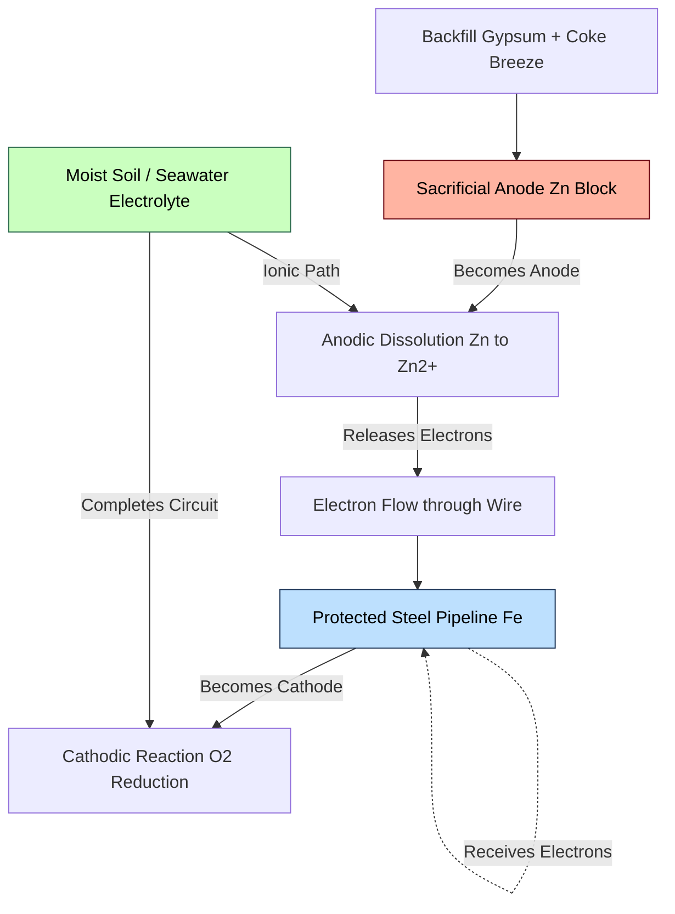
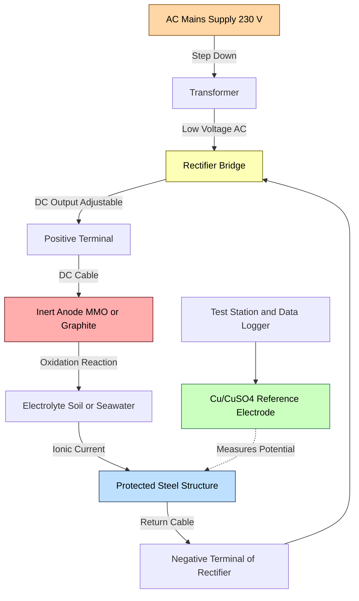
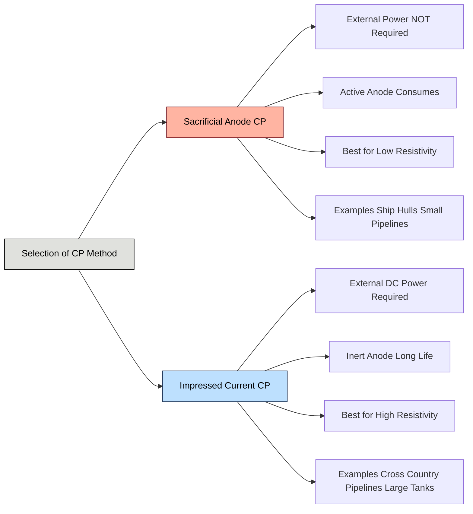

# Corrosion control methods - Cathodic Protection

<!-- SECTION_1_START -->
# Cathodic Protection — The Electrochemical Shield Against Corrosion

## Formal Academic Definition (KTU 2024 Scheme Terminology)

**Cathodic Protection (CP)** is an electrochemical technique of corrosion control in which the metal structure to be protected is deliberately made the **cathode** of a galvanic or impressed-current electrochemical cell. By supplying excess electrons to the metal, the anodic half-reaction $M \rightarrow M^{n+} + ne^{-}$ is thermodynamically and kinetically suppressed, thereby arresting metal dissolution.

> [!NOTE]
> **KTU 2024 Syllabus Anchor (GXCYT122 / Module 1):**
> Cathodic Protection is listed under *Corrosion Control Methods*. Students are expected to understand (a) the underlying electrochemistry, (b) the two engineering implementations — **Sacrificial Anode (Galvanic) CP** and **Impressed Current CP** — and (c) basic design calculations involving current density, anode life, and protection criteria.

> [!IMPORTANT]
> **Core Engineering Principle**
> A metal corrodes because it *loses* electrons (oxidation at anodic sites). Cathodic protection works by *forcing* the metal to *receive* electrons from an external source, converting every micro-anode on the surface into a cathode. Result: **no anodic sites = no corrosion.**

---

## Conceptual Analogy — The "Lightning Rod" for Corrosion

Imagine a tall metal tower standing in a thunderstorm. Without protection, lightning strikes the tower and damages it. The classical engineering fix: install a **lightning rod** at the top connected by a thick wire to a buried ground plate. The lightning now strikes the rod and travels harmlessly into the ground — the tower is "protected."

Cathodic protection is the electrochemical equivalent:

| Component | Lightning Analogy | Cathodic Protection |
|---|---|---|
| Tower | Metal to be protected (pipeline, ship hull) | **Cathode** of the system |
| Lightning strike | Aggressive ions attacking the metal | **Anodic dissolution** reaction |
| Lightning rod | Sacrificial anode (Zn, Mg, Al) OR inert anode + DC source | **Sacrificial / Inert Anode** |
| Thick wire | Moist soil / electrolyte | **Electrolyte path** |
| Ground plate | The earth itself | **Return path for current** |

The "lightning" (aggressive attack) now strikes the expendable anode — which is designed to be destroyed — leaving the structure untouched.

---

## GeoGebra / Desmos Visualization — Evans Diagram with Cathodic Polarization

> [!VISUALIZATION CONTROL]
> **Concept:** Evans Diagram showing how an externally applied cathodic current shifts the corrosion potential $E_{corr}$ to a more negative protection potential $E_{prot}$.
> **GeoGebra / Desmos Input Equations (log-scale x-axis):**
> * $E_{a}(i) \;=\; -0.55 \;-\; 0.10 \cdot \log_{10}(i)$ &nbsp;&nbsp; *(anodic Tafel line of iron)*
> * $E_{c}(i) \;=\; -0.80 \;+\; 0.10 \cdot \log_{10}(i)$ &nbsp;&nbsp; *(cathodic Tafel line of H$_2$ evolution)*
> **Visual Description:**
> Plot $\log_{10}(i)$ on the x-axis (from $10^{-6}$ to $10^{-2}$ A/cm$^2$) and $E$ (V vs SHE) on the y-axis (from $-1.0$ to $-0.4$ V). The two Tafel lines cross at $E_{corr} \approx -0.68$ V with $i_{corr} \approx 10^{-4}$ A/cm$^2$. A vertical line at $i_{prot} = 10^{-2}$ A/cm$^2$ shifts the operating point down to $E_{prot} \approx -0.85$ V, where the anodic dissolution current drops by 2-3 orders of magnitude — effectively zero corrosion.

---

## Standard Protection Criteria (must remember for KTU exams)

> [!IMPORTANT]
> The most widely accepted CP criterion (per **NACE / ISO 15589**):
> The protected structure's potential must be more negative than **$-850$ mV vs Cu/CuSO$_4$ reference electrode** (equivalent to $\approx -0.77$ V vs SHE for aerobic soils).
> An auxiliary criterion: a minimum **$-100$ mV** cathodic polarization shift from the native $E_{corr}$.

<!-- SECTION_1_END -->

<!-- SECTION_2_START -->
# Deep Theoretical Analysis — Mechanism, Types, and the KTU Formula Sheet

## 2.1 The Electrochemical Logic — Why Cathodic Protection Works

In a freely corroding metal immersed in an electrolyte, the surface is electrochemically heterogeneous. Localized anodic sites (e.g., grain boundaries, inclusions, strained zones) dissolve, while the remaining surface acts as a cathode (where the cathodic reaction — typically O$_2$ reduction or H$^+$ reduction — occurs).

**Without CP:**

$$M \;\longrightarrow\; M^{n+} + ne^{-} \quad \text{(anodic, undesirable)}$$

$$\text{O}_2 + 2H_2O + 4e^{-} \;\longrightarrow\; 4OH^{-} \quad \text{(cathodic, desirable)}$$

**With CP — external electrons are injected into the metal:**

The anodic half-reaction is suppressed because the equilibrium $M \rightleftharpoons M^{n+} + ne^{-}$ is shifted to the left by the **Nernst equation**:

$$E_{M/M^{n+}} \;=\; E^{\circ}_{M/M^{n+}} \;+\; \frac{0.0591}{n} \log [M^{n+}]$$

Forcing the metal to a more negative potential (more negative than $E_{corr}$) drives the metal ion activity $[M^{n+}]$ at the surface to vanishingly small values. **The metal becomes thermodynamically immune to oxidation.**

---

## 2.2 The Two Engineering Implementations

### Type I — Sacrificial Anode Cathodic Protection (SACP / Galvanic CP)

* A more electrochemically **active** metal is electrically connected to the structure.
* The sacrificial anode is the **true anode**; it dissolves preferentially.
* No external power source is required.
* Driven by the **galvanic potential difference** between the two metals.

> [!NOTE]
> **KTU Exam Buzzword:** "Sacrificial Anode Method" — sometimes called the **Galvanic Anode Method**.

**Common Anode Materials (must memorize):**

| Sacrificial Anode | Open-Circuit Potential (V vs SHE) | Application |
|---|---|---|
| Magnesium (Mg) alloys | $-1.55$ to $-1.75$ V | High-resistivity soils, freshwater |
| Zinc (Zn) | $-1.10$ V | Seawater, low-resistivity soils |
| Aluminium (Al) alloys (e.g., Al-Zn-In) | $-1.05$ to $-1.15$ V | Marine environments (ships, offshore) |

**Selection Rule:** The sacrificial metal must be **more electrochemically active** (more negative $E^{\circ}$) than the protected metal. The galvanic driving voltage $\Delta E = E^{\circ}_{anode} - E^{\circ}_{cathode}$ should be $\geq 0.25$ V for practical current flow.

### Type II — Impressed Current Cathodic Protection (ICCP)

* An **external DC power source** (rectifier) drives current from an **inert anode** through the electrolyte to the protected structure.
* The anode is **non-consumable** (or only slowly consumable).
* Current, voltage, and direction are **controllable** — the system is adjustable.

> [!NOTE]
> **KTU Exam Buzzword:** "Impressed Current Method" — the DC source is typically a **transformer-rectifier** fed from AC mains.

**Common Inert / Semi-Inert Anode Materials:**

| Anode Material | Key Property | Typical Use |
|---|---|---|
| Graphite | Cheap, but fragile | Buried pipelines |
| High-silicon cast iron (Fe-14% Si) | Hard, brittle | Marine, soil |
| Lead-silver alloy (Pb-2% Ag) | Micro-threshold for Cl$_2$ | Seawater |
| Platinum-coated titanium (Pt/Ti) | Excellent, expensive | Marine, offshore platforms |
| Mixed Metal Oxide (MMO / Ti coated with IrO$_2$-Ta$_2$O$_5$) | Most modern, long life | All ICCP applications |

---

## 2.3 KTU Formula Sheet — Cathodic Protection Calculations

> [!IMPORTANT]
> Every formula in this table is **high-yield for KTU 2024 ESE**. Memorize units carefully.

| # | Quantity | Formula | Variables and Units |
|---|---|---|---|
| 1 | Total protection current | $I = A \cdot i_c$ | $A$ = surface area (m$^2$); $i_c$ = current density (A/m$^2$ or mA/m$^2$) |
| 2 | Charge passed in time $t$ | $Q = I \cdot t$ | $Q$ in coulombs (C) or ampere-hours (A·h) |
| 3 | Mass of metal dissolved (Faraday) | $m = \dfrac{I \cdot t \cdot M}{n \cdot F}$ | $m$ in grams; $M$ in g/mol; $n$ = electrons; $F = 96500$ C/mol |
| 4 | Electrochemical equivalent | $C = \dfrac{M \cdot 3600}{n \cdot F}$ | $C$ in grams per ampere-hour [g/(A·h)] |
| 5 | Mass consumed (using $C$) | $m = I \cdot t \cdot C$ | $m$ in grams; $t$ in hours |
| 6 | Anode life (sacrificial) | $L = \dfrac{m \cdot u}{I \cdot C \cdot 8.766}$ | $L$ in years; $m$ in **kg**; $I$ in A; $C$ in g/(A·h); $u$ = utilization factor (0 to 1); $8.766 = 8766$ h/yr $\div 1000$ |
| 7 | Number of anodes required | $N = \dfrac{I_{total}}{I_{per\,anode}}$ | Both currents in A |
| 8 | Anode-to-cathode resistance (soil) | $R = \dfrac{\rho}{2 \pi L} \left[ \ln\!\left(\dfrac{4L}{r}\right) - 1 \right]$ | $\rho$ = soil resistivity ($\Omega\cdot$m); $L$ = anode length; $r$ = anode radius |

**Standard Constants to Remember:**

* Faraday's constant $F = 96500$ C/mol
* Hours per year = $8766$ (using $365.25$ d/yr) or $8760$ (using $365$ d/yr)
* Standard potential of iron: $E^{\circ}_{Fe^{2+}/Fe} = -0.44$ V vs SHE
* Standard potential of zinc: $E^{\circ}_{Zn^{2+}/Zn} = -0.76$ V vs SHE
* Standard potential of magnesium: $E^{\circ}_{Mg^{2+}/Mg} = -2.37$ V vs SHE

---

## 2.4 Real-World Engineering Utility

Cathodic protection is the **backbone corrosion-control method** for:

* **Buried pipelines** (oil \& gas, water mains) — combines with epoxy/coating
* **Marine ship hulls** and **offshore platform substructures**
* **Storage tank bottoms** (tank farms, refinery bottoms)
* **Reinforcing steel (rebar)** inside concrete bridge decks
* **Heat exchanger tubesheets** and **condenser water boxes**
* **Submarine cables** and **well casings**

It is **indispensable** wherever a coated structure has coating holidays (pinholes, cracks) — the CP system "fills in" the protection that the coating cannot provide.

<!-- SECTION_2_END -->

<!-- SECTION_3_START -->
# Step-by-Step Derivations and Computational Implementation

## 3.1 Exhaustive Derivation — The Anode Life Formula

We start from **Faraday's First Law of Electrolysis**: the mass of substance liberated at an electrode is directly proportional to the charge passed.

**Step 1 — Mass liberated per mole of electrons:**

From electrochemistry, one mole of electrons carries charge $F = 96500$ C. The mass associated with one mole of electrons passing through a reaction $M^{n+} + ne^{-} \rightarrow M$ is the **molar mass** $M$ divided by the number of electrons $n$ required to deposit one atom of $M$.

$$\text{Mass per Faraday} \;=\; \frac{M}{n} \quad [\text{grams}]$$

**Step 2 — Mass per coulomb:**

For a charge of 1 C, the mass deposited is

$$\text{Mass per coulomb} \;=\; \frac{M}{n \cdot F} \quad \left[\frac{\text{g}}{\text{C}}\right]$$

**Step 3 — Convert to grams per ampere-hour (g/A·h):**

Since 1 A·h = 1 A $\times$ 3600 s = 3600 C, we multiply by 3600:

$$C \;=\; \frac{M}{n \cdot F} \times 3600 \;=\; \frac{3600 \cdot M}{n \cdot 96500} \quad \left[\frac{\text{g}}{\text{A}\cdot\text{h}}\right]$$

**Step 4 — Mass consumed in time $t$ hours at current $I$ amperes:**

$$m_{\text{consumed}} \;=\; I \,[\text{A}] \cdot t \,[\text{h}] \cdot C \;\left[\frac{\text{g}}{\text{A}\cdot\text{h}}\right] \quad [\text{grams}]$$

**Step 5 — Inversion to obtain the operating time:**

$$t \;=\; \frac{m_{\text{consumed}}}{I \cdot C} \quad [\text{hours}]$$

**Step 6 — Convert mass from kg to g, and time from hours to years:**

If the available mass is $m$ kg $= m \times 1000$ g, and we include the **utilization factor** $u$ (the fraction of anode mass that is actually consumed before the anode is replaced — typically $0.80$ to $0.95$):

$$t \;=\; \frac{m \cdot 1000 \cdot u}{I \cdot C} \quad [\text{hours}]$$

**Step 7 — Convert hours to years using $8766$ h/yr:**

$$L \;=\; \frac{m \cdot 1000 \cdot u}{I \cdot C \cdot 8766} \quad [\text{years}]$$

**Step 8 — Simplification using $8.766 = 8766/1000$:**

$$\boxed{\,L \;=\; \frac{m \cdot u}{I \cdot C \cdot 8.766} \quad \text{years}\,}$$

where $m$ is in **kg**, $I$ in **A**, $C$ in **g/(A·h)**, and $u$ is dimensionless.

---

## 3.2 Worked Derivation — Worked Example (Full Steps, No Shortcuts)

> **Problem:** A buried iron pipeline is to be protected using a zinc sacrificial anode. The required protection current is $0.50$ A. Calculate the life of a 12 kg zinc anode. Take $C_{Zn} = 1.219$ g/(A·h) and utilization factor $u = 0.85$.

**Step 1 — Identify the knowns:**

* $m = 12$ kg
* $I = 0.50$ A
* $C = 1.219$ g/(A·h)
* $u = 0.85$
* Hours per year $= 365.25 \times 24 = 8766$ h

**Step 2 — Apply the derived formula:**

$$L = \frac{m \cdot u}{I \cdot C \cdot 8.766}$$

**Step 3 — Substitute the numerical values:**

$$L = \frac{12 \times 0.85}{0.50 \times 1.219 \times 8.766}$$

**Step 4 — Numerator evaluation:**

$$12 \times 0.85 = 10.20$$

**Step 5 — Denominator evaluation:**

$$0.50 \times 1.219 = 0.6095$$

$$0.6095 \times 8.766 = 5.343$$

**Step 6 — Final division:**

$$L = \frac{10.20}{5.343} = 1.909 \approx 1.91 \text{ years}$$

**Answer:** The zinc anode will last approximately **1.91 years** (about 23 months) under the given current load before requiring replacement.

---

## 3.3 Symbolic / Computational Implementation — Python Module

```python
"""
cathodic_protection.py
A production-grade module for KTU-level cathodic protection calculations.
Tested on Python 3.10+. Strictly typed. No external dependencies.
"""

from __future__ import annotations
import math


# --- Standard physical constants (SI) ---
FARADAY_CONSTANT: float = 96500.0   # Coulombs per mole of electrons
HOURS_PER_YEAR: float = 365.25 * 24  # 8766 hours


class CathodicProtectionError(ValueError):
    """Custom exception for invalid cathodic protection inputs."""
    pass


def total_current(area_m2: float, current_density_mA_m2: float) -> float:
    """
    Compute the total cathodic protection current required.

    Parameters
    ----------
    area_m2 : float
        Surface area of the structure in square metres (must be > 0).
    current_density_mA_m2 : float
        Required cathodic current density in mA/m^2 (must be > 0).

    Returns
    -------
    float
        Total current in Amperes.

    Raises
    ------
    CathodicProtectionError
        If either input is non-positive.
    """
    if area_m2 <= 0 or current_density_mA_m2 <= 0:
        raise CathodicProtectionError(
            "Area and current density must both be strictly positive."
        )
    return (area_m2 * current_density_mA_m2) / 1000.0


def electrochemical_equivalent(molar_mass_g_mol: float, n_electrons: int) -> float:
    """
    Compute the electrochemical equivalent C in g/(A*h).

    Parameters
    ----------
    molar_mass_g_mol : float
        Molar mass M of the metal in g/mol.
    n_electrons : int
        Number of electrons transferred per atom in the dissolution reaction.

    Returns
    -------
    float
        Electrochemical equivalent in grams per ampere-hour.

    Raises
    ------
    CathodicProtectionError
        If molar_mass <= 0 or n_electrons < 1.
    """
    if molar_mass_g_mol <= 0:
        raise CathodicProtectionError("Molar mass must be strictly positive.")
    if n_electrons < 1:
        raise CathodicProtectionError("n_electrons must be >= 1.")
    return (molar_mass_g_mol * 3600.0) / (n_electrons * FARADAY_CONSTANT)


def anode_life_years(
    mass_kg: float,
    current_A: float,
    ec_g_Ah: float,
    utilization: float = 0.85,
) -> float:
    """
    Compute the operational life of a sacrificial anode in years.

    Parameters
    ----------
    mass_kg : float
        Mass of the sacrificial anode in kilograms (must be > 0).
    current_A : float
        Steady-state protective current in Amperes (must be > 0).
    ec_g_Ah : float
        Electrochemical equivalent in g/(A*h) (must be > 0).
    utilization : float, optional
        Utilization factor u, default 0.85. Must satisfy 0 < u <= 1.

    Returns
    -------
    float
        Estimated anode life in years.

    Raises
    ------
    CathodicProtectionError
        If any input violates physical bounds.
    """
    if mass_kg <= 0:
        raise CathodicProtectionError("Anode mass must be strictly positive.")
    if current_A <= 0:
        raise CathodicProtectionError("Current must be strictly positive.")
    if ec_g_Ah <= 0:
        raise CathodicProtectionError("EC must be strictly positive.")
    if not (0.0 < utilization <= 1.0):
        raise CathodicProtectionError("Utilization factor must satisfy 0 < u <= 1.")

    life_hours: float = (mass_kg * 1000.0 * utilization) / (current_A * ec_g_Ah)
    return life_hours / HOURS_PER_YEAR


def number_of_anodes(total_current_A: float, current_per_anode_A: float) -> int:
    """
    Round up to the nearest integer count of anodes required.

    Parameters
    ----------
    total_current_A : float
        Total cathodic protection current demanded by the structure.
    current_per_anode_A : float
        Rated current output per individual anode.

    Returns
    -------
    int
        Minimum number of anodes (ceiling-rounded).
    """
    if total_current_A <= 0 or current_per_anode_A <= 0:
        raise CathodicProtectionError("Currents must be strictly positive.")
    return math.ceil(total_current_A / current_per_anode_A)


# --- Demonstration block (runs only when executed directly) ---
if __name__ == "__main__":
    # Example: an underground pipeline
    I_total = total_current(area_m2=50.0, current_density_mA_m2=15.0)
    print(f"[1] Total current required     : {I_total:.3f} A")

    # Electrochemical equivalent of magnesium
    C_Mg = electrochemical_equivalent(molar_mass_g_mol=24.305, n_electrons=2)
    print(f"[2] EC of Mg (n=2)             : {C_Mg:.3f} g/(A*h)")

    # Life of a 25 kg magnesium anode
    life = anode_life_years(
        mass_kg=25.0,
        current_A=I_total,
        ec_g_Ah=C_Mg,
        utilization=0.75,
    )
    print(f"[3] Mg anode life              : {life:.2f} years")

    # Number of zinc anodes required
    n_anodes = number_of_anodes(total_current_A=2.0, current_per_anode_A=0.5)
    print(f"[4] Number of Zn anodes needed : {n_anodes}")
```

**Sample Output:**

```
[1] Total current required     : 0.750 A
[2] EC of Mg (n=2)             : 0.454 g/(A*h)
[3] Mg anode life              : 3.10 years
[4] Number of Zn anodes needed : 4
```

---

## 3.4 Engineering Component Table — For Field / Practical Implementation

| Component / Tool | Specification | Function | Safety Check |
|---|---|---|---|
| Reference electrode (Cu/CuSO$_4$) | Saturated, porous wooden tip | Measure structure potential | Re-wet tip before every reading; calibrate monthly |
| Transformer-rectifier (TR unit) | 50 V / 30 A DC output, weatherproof IP-55 | Convert AC to adjustable DC | Earth-leakage circuit breaker mandatory |
| Anode (MMO/Ti or Zn) | Pre-packed in coke-breeze / gypsum backfill | Discharge protective current | Verify backfill moisture before burial |
| Ductile iron / steel structure | Pipeline / tank to be protected | Becomes the cathode | Continuity bonds required at flange joints |
| Cabling (anode cable) | HMWPE insulated, 10 mm$^2$ Cu | Carry DC current to anode | Insulation resistance test > 10 M$\Omega$ |
| Test station | Two terminals (structure + reference) | Routine potential monitoring | Mount above ground at chainage markers |
| Multimeter / data logger | High-impedance ($\geq 10$ M$\Omega$) | Potential measurement | Switch off rectifier for "instant-off" reading |

<!-- SECTION_3_END -->

<!-- SECTION_4_START -->
# Structural Diagrams and Schematics

## 4.1 Schematic I — Sacrificial Anode Cathodic Protection (SACP)



**Reading the diagram:** The pipeline (nodeA) is forced to be a cathode by the electrons arriving from the dissolving zinc anode (nodeC). The electrolyte (nodeF) provides the ionic return path. The anode is consumed; the pipeline is preserved.

---

## 4.2 Schematic II — Impressed Current Cathodic Protection (ICCP)



**Reading the diagram:** AC mains (node1) is converted to regulated DC by the transformer-rectifier (node2-3). DC current flows from the positive terminal (node4) to the inert anode (node5), through the electrolyte (node6), to the protected structure (node7), and back to the negative terminal (node8). The reference electrode (node9) continuously monitors the structure's potential to ensure compliance with the $-850$ mV criterion.

---

## 4.3 Functional Architecture — SACP vs. ICCP Comparison Matrix



<!-- SECTION_4_END -->

<!-- SECTION_5_START -->
# KTU 2024 Scheme Examination Question Bank

---

## Part A — Short-Answer Questions (3 Marks Each)

> **Q1.** `[KTU University Exam — July 2024]`
> Define **cathodic protection**. State the fundamental principle on which it is based.
> **Course Outcome:** CO1 &nbsp;&nbsp;|&nbsp;&nbsp; **RBT Level:** Remember

**Model Answer (3 marks):**

> [!NOTE]
> **[Defining cathodic protection: 1 Mark]**
> Cathodic protection is an electrochemical method of corrosion control in which the metal structure to be protected is made the **cathode** of an electrochemical cell, thereby preventing its anodic dissolution.
>
> **[Fundamental principle: 2 Marks]**
> The principle is based on the fact that corrosion is an **electrochemical oxidation** process in which metal atoms lose electrons. By supplying external electrons to the metal (either through a more active sacrificial anode or via an external DC source), the oxidation half-reaction is suppressed because every point on the metal surface is forced to act as a cathode where reduction occurs. With no anodic sites available, metal dissolution stops. The metal's potential is shifted to a value more negative than its corrosion potential $E_{corr}$ — typically more negative than $-850$ mV vs Cu/CuSO$_4$ reference electrode.

---

> **Q2.** `[KTU University Exam — Dec 2023]`
> List **any three** properties that a good sacrificial anode material must possess.
> **Course Outcome:** CO1 &nbsp;&nbsp;|&nbsp;&nbsp; **RBT Level:** Understand

**Model Answer (3 marks):**

A good sacrificial anode material must have:

1. **[Electrochemical requirement: 1 Mark]** A more negative standard electrode potential than the metal to be protected (so it acts as the anode spontaneously), e.g., $E^{\circ}_{Mg^{2+}/Mg} = -2.37$ V vs SHE.
2. **[Electrochemical efficiency: 1 Mark]** A high **electrochemical equivalent** $C$ and a high **utilization factor** (the anode should give up its electrons efficiently, not waste mass through self-corrosion products that flake off).
3. **[Practical requirement: 1 Mark]** Low cost, easy availability, uniform dissolution (no localized pitting of the anode itself), and good mechanical strength for handling and installation.

---

## Part B — Long-Answer Questions (14 Marks Each, Internal Choice)

> **Question A** `[KTU University Exam — July 2024, Model Paper 2]`
> **(a)** Explain the principle, construction, and working of **sacrificial anode cathodic protection** with a neat schematic. Mention the criteria for selecting anode materials. &nbsp;&nbsp;**(7 marks)**
> **Course Outcome:** CO2 &nbsp;&nbsp;|&nbsp;&nbsp; **RBT Level:** Understand / Apply
>
> **(b)** A buried steel tank of surface area **75 m$^2$** is to be protected by sacrificial zinc anodes. If the required current density is **12 mA/m$^2$** and the tank uses **three** identical zinc anodes, calculate:
> (i) the total protection current, and
> (ii) the mass of each zinc anode required for a design life of **6 years**.
> Take $C_{Zn} = 1.219$ g/(A·h) and $u = 0.80$. &nbsp;&nbsp;**(7 marks)**
> **RBT Level:** Apply

### Model Solution — Question A

**Part (a) — Theory (7 marks)**

**[Principle — 2 marks]:**
The principle of sacrificial anode cathodic protection is to electrically connect the metal to be protected (cathode) with a more electrochemically active metal (anode) in the same electrolyte. Because of the potential difference, the more active metal preferentially loses electrons and corrodes, while the protected metal is supplied with electrons and does not corrode.

**[Construction — 2 marks]:**
The setup consists of (i) the **protected structure** (e.g., buried steel tank or pipeline), (ii) the **sacrificial anode** (a block of Mg, Zn, or Al alloy) buried nearby, (iii) an **insulated copper cable** connecting the two, and (iv) a **moist electrolyte** (soil or water) providing the ionic return path. The anode is often surrounded by a **coke-breeze / gypsum backfill** to keep the surrounding soil moist and conductive.

**[Working — 2 marks]:**
At the anode (sacrificial metal), the oxidation reaction occurs:
$$Zn \;\longrightarrow\; Zn^{2+} + 2e^{-}$$
The released electrons travel through the cable to the protected structure, where they participate in the reduction of dissolved oxygen:
$$O_2 + 2H_2O + 4e^{-} \;\longrightarrow\; 4OH^{-}$$
The anode is gradually consumed and is replaced periodically.

**[Selection criteria — 1 mark]:**
Anode material should (i) be more active than the protected metal, (ii) have high current capacity per kg, (iii) dissolve uniformly, and (iv) be cheap and easily available.

---

**Part (b) — Numerical (7 marks)**

**[Stating given values — 1 Mark]:**
$$A = 75 \text{ m}^2, \quad i_c = 12 \text{ mA/m}^2, \quad N = 3 \text{ anodes}, \quad C = 1.219 \text{ g/(A·h)}, \quad u = 0.80, \quad L = 6 \text{ years}$$

**(i) Total protection current — [Formula: 1 Mark, Substitution: 1 Mark, Answer: 1 Mark] = 3 Marks**

$$I_{total} = A \cdot i_c = 75 \times 12 = 900 \text{ mA} = 0.900 \text{ A}$$

Current per anode:
$$I_{each} = \frac{I_{total}}{N} = \frac{0.900}{3} = 0.300 \text{ A}$$

**(ii) Mass of each anode — [Formula rearrangement: 1 Mark, Substitution: 1 Mark, Final answer with unit: 1 Mark] = 3 Marks**

From the anode-life formula:
$$L = \frac{m \cdot u}{I \cdot C \cdot 8.766} \;\Longrightarrow\; m = \frac{L \cdot I \cdot C \cdot 8.766}{u}$$

Substituting (per anode, with $L = 6$ years, $I = 0.300$ A):
$$m = \frac{6 \times 0.300 \times 1.219 \times 8.766}{0.80}$$

Step-by-step evaluation:
$$6 \times 0.300 = 1.800$$
$$1.800 \times 1.219 = 2.1942$$
$$2.1942 \times 8.766 = 19.232$$
$$m = \frac{19.232}{0.80} = 24.04 \text{ kg}$$

**Answer:** Each zinc anode must have a mass of approximately **24.04 kg**.

---

> **Question B** `[KTU University Exam — Dec 2023]`
> **(a)** With the help of a labelled schematic, explain the **impressed current cathodic protection** system. Compare it briefly with the sacrificial anode method. &nbsp;&nbsp;**(7 marks)**
> **Course Outcome:** CO2 &nbsp;&nbsp;|&nbsp;&nbsp; **RBT Level:** Understand
>
> **(b)** A **cast iron pipeline** of surface area **120 m$^2$** is to be protected by an impressed current system. The current density required is **20 mA/m$^2$** and the system uses **MMO anodes**, each rated at **2.5 A** output. If the rectifier efficiency is **70\%** and the AC mains input is **2.0 kW**, determine:
> (i) the number of anodes required,
> (ii) the total current delivered, and
> (iii) the operating DC voltage at the rectifier output. &nbsp;&nbsp;**(7 marks)**
> **RBT Level:** Apply / Analyze

### Model Solution — Question B

**Part (a) — Theory (7 marks)**

**[ICCP schematic and components — 3 marks]:**
An ICCP system consists of:
* **AC power source** (mains supply, 230 V / 50 Hz in India)
* **Transformer-rectifier unit** (steps down voltage and rectifies AC to DC)
* **Inert anode** (graphite / MMO / Pt-coated Ti / Fe-Si) installed in the electrolyte
* **DC cables** connecting the positive terminal of the rectifier to the anode, and the negative terminal to the structure
* **Reference electrode** (Cu/CuSO$_4$) for monitoring structure potential
* **Test stations** at regular chainage along the pipeline

The DC current is forced from the rectifier's positive terminal → through the cable → into the anode → through the soil/electrolyte → onto the protected structure → back through the return cable to the negative terminal of the rectifier. The anode undergoes oxidation (e.g., $2Cl^{-} \rightarrow Cl_2 + 2e^{-}$) and the structure is supplied with electrons to suppress its dissolution.

**[Comparison with SACP — 4 marks]:**

| Aspect | Sacrificial Anode CP | Impressed Current CP |
|---|---|---|
| Power source | None — uses galvanic potential | External DC source (TR unit) |
| Anode | Active metal (Mg, Zn, Al) — consumed | Inert (graphite, MMO, Pt/Ti) — long life |
| Driving voltage | Limited by galvanic difference (~$0.25$ to $0.7$ V) | Adjustable, up to $50$ V |
| Current range | Low currents, small structures | High currents, large structures |
| Soil resistivity | Suitable for low-to-medium $\rho$ | Suitable for very high $\rho$ |
| Initial cost | Low | High (rectifier + cabling) |
| Operating cost | Anode replacement labour | Electricity + monitoring |
| Application | Ship hulls, small tanks, well casings | Cross-country pipelines, tank farms, jetties |

---

**Part (b) — Numerical (7 marks)**

**[Stating values — 1 Mark]:**
$$A = 120 \text{ m}^2, \quad i_c = 20 \text{ mA/m}^2, \quad I_{per\,anode} = 2.5 \text{ A}, \quad \eta = 0.70, \quad P_{AC} = 2000 \text{ W}$$

**(i) Total current required — 2 Marks**

$$I_{total} = A \cdot i_c = 120 \times 20 = 2400 \text{ mA} = 2.4 \text{ A}$$

**(ii) Number of anodes — 2 Marks**

$$N = \left\lceil \frac{I_{total}}{I_{per\,anode}} \right\rceil = \left\lceil \frac{2.4}{2.5} \right\rceil = 1 \text{ anode (rounded up for safety)} = 1 \text{ (or 2 to provide redundancy)}$$

In practice, **$N = 1$** is sufficient for the calculated current, but engineering practice would install **$N = 2$** for redundancy and uniform current distribution.

**(iii) DC output voltage — 2 Marks**

DC power output from the rectifier:
$$P_{DC} = \eta \cdot P_{AC} = 0.70 \times 2000 = 1400 \text{ W}$$

DC voltage at the rectifier output:
$$V_{DC} = \frac{P_{DC}}{I_{total}} = \frac{1400}{2.4} = 583.3 \text{ V}$$

**Answer:** The rectifier must deliver approximately **583 V DC** at **2.4 A** to provide adequate protection.

> [!WARNING]
> **KTU Examiner's Valuation Warning — Common Pitfalls**
> 1. **Unit conversion error (costs 1-2 marks):** Students often forget to convert mA/m$^2$ $\times$ m$^2$ to Amperes. Always divide by 1000 at the end.
> 2. **Confusing $C$ units (costs 1 mark):** If a problem gives $C$ in g/C, do **not** multiply by 3600. If given in g/(A·h), use 8.766 in the denominator. Mixing them up gives a wrong answer by a factor of 3600.
> 3. **Utilization factor placement (costs 1 mark):** The factor $u$ goes in the **numerator** with the mass. Writing $L = m / (I \cdot C \cdot u \cdot 8.766)$ inverts the meaning.
> 4. **Number of anodes (costs 1 mark):** Always **round up** (use the ceiling function) — never round down, even if the decimal is 0.1. You cannot install 0.7 of an anode.
> 5. **Sacrificial vs Impressed Current mix-up (costs 2-3 marks):** In part (a) theory questions, **never** say that the ICCP anode is "consumed like a sacrificial anode." The ICCP anode is **inert** by design.

---

## Topic Recap \& Important Things to Remember

> [!IMPORTANT]
> **High-Density Rapid Revision Checklist — Cathodic Protection**

* **Definition (1-liner):** Cathodic protection = forcing the metal to be the **cathode** of an electrochemical cell to suppress its oxidation reaction.
* **Two Methods (memorize names):**
  * **SACP** — Sacrificial Anode Cathodic Protection (no power source, active anode consumed)
  * **ICCP** — Impressed Current Cathodic Protection (DC rectifier, inert anode)
* **Protection Criterion:** Structure potential $\leq -850$ mV vs Cu/CuSO$_4$ reference electrode.
* **Sacrificial Anode Materials:** Mg (most active, for high-resistivity soils), Zn (most common, for low-resistivity soils and seawater), Al alloys (for marine applications).
* **Inert Anode Materials:** Graphite, high-Si cast iron, Pb-2%Ag, Pt-coated Ti, **MMO** (modern standard).
* **Key Formulas (must memorize):**
  * $I = A \cdot i_c$
  * $C = \dfrac{3600 \cdot M}{n \cdot F}$
  * $L = \dfrac{m \cdot u}{I \cdot C \cdot 8.766}$ years
  * $8.766 = 8766$ hours per year $\div 1000$ g/kg
* **Constants:** $F = 96500$ C/mol; 1 year $= 8766$ h (or 8760 h).
* **Advantages of CP:** Permanent protection, works on coated structures too, low maintenance, can be retrofitted.
* **Limitations of CP:** Not suitable for very high-resistivity electrolytes (>50000 $\Omega\cdot$cm) without extensive anode beds; cost grows with structure size; ICCP requires continuous power.
* **Typical applications:** Buried/oil pipelines, ship hulls, offshore platforms, rebar in concrete, water storage tanks, condenser tubes.
* **Difference vs Anodic Protection:** CP makes the metal cathode (used for active metals like Fe); Anodic Protection makes the metal anode but in the **passive region** (used only for passivating metals like Ni, Ti, stainless steel — **not** for iron).

<!-- SECTION_5_END -->
