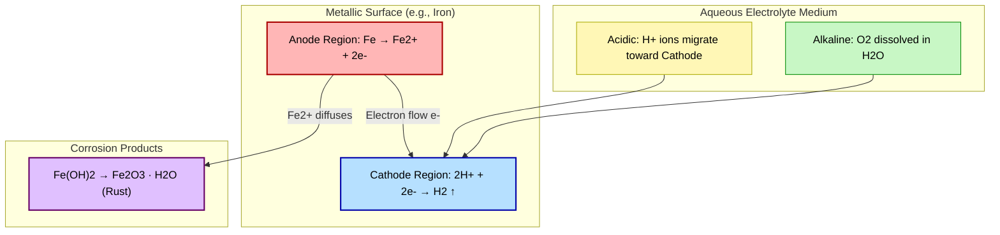
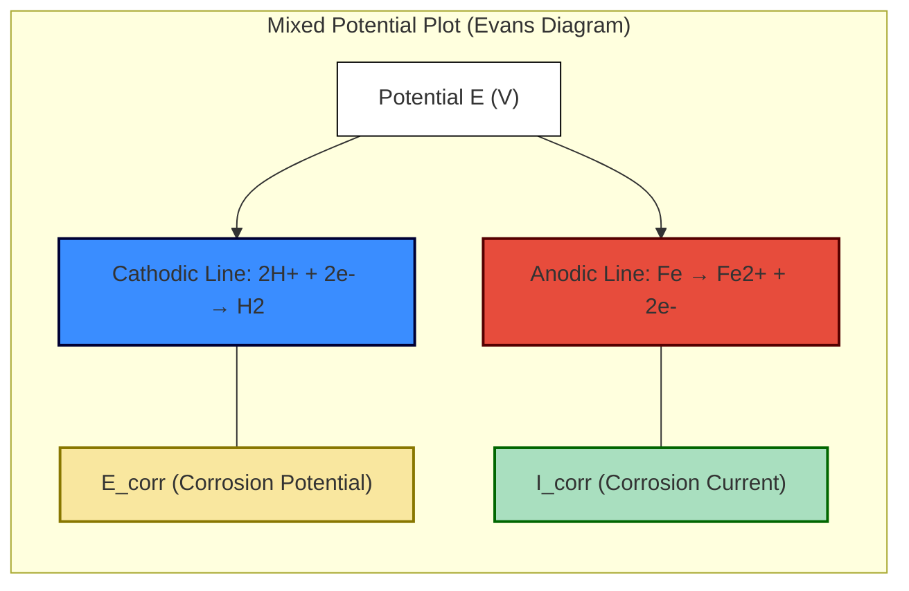

# Corrosion – Electrochemical corrosion mechanism (acidic & alkaline medium)

<!-- SECTION_1_START -->
# Corrosion – Electrochemical Corrosion Mechanism (Acidic & Alkaline Medium)

## 1.1 Formal Academic Definition

> [!IMPORTANT]
> **Corrosion** is the gradual degradation or destruction of a metal (or alloy) through unwanted electrochemical or chemical reactions with its surrounding environment, typically resulting in the formation of metal oxides, hydroxides, sulfides, or other stable compounds. The International Organization for Standardization (ISO 8044) defines corrosion as the *physico-chemical interaction between a metal and its environment which results in changes in the properties of the metal and which may often lead to impairment of the function of the metal, the environment, or the technical system of which these form a part.*

In **electrochemical corrosion**, the overall reaction is the sum of two independent half-cell reactions that occur at spatially separated locations on the metal surface:

- An **anodic reaction** (oxidation) where the metal dissolves: $M \rightarrow M^{n+} + ne^-$
- A **cathodic reaction** (reduction) where species from the electrolyte are reduced.

For **KTU 2024 Scheme (GXCYT122)**, the focus is specifically on the mechanism operating in *acidic* (low pH) and *alkaline* (high pH) aqueous media, since these are the two extreme regimes that engineers encounter in pipeline systems, electronic enclosures, and integrated circuit packaging.

## 1.2 Intuitive Overview – Real-World Analogy

Imagine an **iron nail** partially dipped in **dilute hydrochloric acid**. Within minutes, hydrogen bubbles stream from a particular patch of the nail, while a brown stain (dissolved iron) bleeds out from another spot. Why two different locations? Because the nail surface is not perfectly uniform — micro-strains, scratches, and grain boundaries create regions of differing energy.

- The **bubble-generating region** is the **cathode** (where $H^+$ gets reduced to $H_2$).
- The **dissolving region** is the **anode** (where $Fe$ gets oxidized to $Fe^{2+}$).

> [!NOTE]
> **Analogy: A Battery Working in Reverse**
> Think of a corroding metal as a *short-circuited galvanic cell* with infinitesimal separation between anode and cathode. Just as a battery converts chemical energy into electrical energy, a corrosion cell converts the chemical potential of the metal into unwanted electrical current that does no useful work — only destruction. The **electrolyte** acts as the ionic highway (just like the salt bridge in a Daniel cell), and the **metal** itself acts as the external wire.

## 1.3 Physical Constants & Standard Reference Values

| Parameter | Symbol | Standard Value | Significance |
|---|---|---|---|
| Standard hydrogen electrode potential | $E^0_{H^+/H_2}$ | **0.00 V** | Reference electrode |
| Standard potential of $Fe^{2+}/Fe$ | $E^0_{Fe^{2+}/Fe}$ | **−0.44 V** | Active metal |
| Standard potential of $O_2/H_2O$ (acid) | $E^0_{O_2/H_2O}$ | **+1.23 V** | Aerated corrosion |
| Standard potential of $O_2/OH^-$ (base) | $E^0_{O_2/OH^-}$ | **+0.40 V** | Alkaline corrosion |
| Faraday constant | $F$ | **96,485 C/mol** | Charge per mole $e^-$ |
| Molar mass of iron | $M_{Fe}$ | **55.85 g/mol** | Used in loss calculations |

> [!VISUALIZATION CONTROL]
> **Concept:** Pourbaix Diagram of Iron in Aqueous Medium
> **GeoGebra / Desmos Input Equations:**
> * Plot the equilibrium line for $Fe^{2+}/Fe$: $E = -0.44 + 0.0295 \log[Fe^{2+}]$ (with $[Fe^{2+}]=10^{-6}$ mol/L → $E=-0.6175$ V)
> * Plot the hydrogen evolution line (lower diagonal): $E = -0.059 \cdot pH$
> * Plot the oxygen evolution line (upper diagonal): $E = 1.23 - 0.059 \cdot pH$
> * Plot the $Fe(OH)_2/Fe$ boundary (horizontal-like): $E = -0.05 - 0.059 \cdot pH$
> **Visual Description:** A graph of $E$ (V, y-axis) vs $pH$ (x-axis, 0 to 14). The diagram should reveal a *corrosion zone* (where $Fe^{2+}$ is stable) sandwiched between the $H_2$ and $O_2$ stability lines. The student should observe that the same metal corrodes differently in acidic versus alkaline regimes.

---

<!-- SECTION_1_END -->

<!-- SECTION_2_START -->
# Deep Theoretical Analysis & KTU High-Yield Formula Sheet

## 2.1 The Two Half-Reactions: The Heart of Electrochemical Corrosion

Any electrochemical corrosion event requires **three simultaneous components**:

1. **Anode** – the site where the metal loses electrons (oxidation).
2. **Cathode** – the site where electrons are consumed (reduction).
3. **Electrolyte** – the ionic medium that closes the circuit.

> [!NOTE]
> *Without all three, corrosion cannot proceed. Removing any one of them (e.g., by coating the metal to block the electrolyte) is the basis of most corrosion prevention strategies used in VLSI packaging, PCB conformal coatings, and structural engineering.*

## 2.2 Mechanism in Acidic Medium (Low pH, e.g., HCl, H$_2$SO$_4$)

When iron is exposed to an **oxygen-free acidic solution**, the cathodic process is **hydrogen evolution**:

### Anodic (Oxidation) Reaction

$$Fe_{(s)} \rightarrow Fe^{2+}_{(aq)} + 2e^- \quad \quad E^0_{ox} = +0.44 \text{ V}$$

### Cathodic (Reduction) Reaction

$$2H^+_{(aq)} + 2e^- \rightarrow H_{2(g)} \uparrow \quad \quad E^0_{red} = 0.00 \text{ V}$$

### Net Cell Reaction

$$Fe_{(s)} + 2H^+_{(aq)} \rightarrow Fe^{2+}_{(aq)} + H_{2(g)} \uparrow$$

$$E^0_{cell} = E^0_{cathode} - E^0_{anode} = 0.00 - (-0.44) = +0.44 \text{ V}$$

> [!IMPORTANT]
> The **positive cell potential** confirms the spontaneity of corrosion. This type is called *hydrogen-type* or *acidic* corrosion and is the dominant mechanism in pickling baths, acid-storage tanks, and inside pipework carrying industrial effluents.

## 2.3 Mechanism in Alkaline Medium (High pH, e.g., NaOH, KOH)

In an **alkaline medium with dissolved oxygen**, the cathodic process switches to **oxygen absorption (reduction)**. The metal still dissolves, but the cathodic reaction changes:

### Anodic (Oxidation) Reaction

$$Fe_{(s)} \rightarrow Fe^{2+}_{(aq)} + 2e^-$$

However, the $Fe^{2+}$ ions **do not stay long in solution** — they immediately precipitate as ferrous hydroxide:

$$Fe^{2+}_{(aq)} + 2OH^-_{(aq)} \rightarrow Fe(OH)_{2(s)} \downarrow$$

### Cathodic (Reduction) Reaction

$$O_{2(g)} + 2H_2O_{(l)} + 4e^- \rightarrow 4OH^-_{(aq)} \quad \quad E^0_{red} = +0.40 \text{ V}$$

### Net Cell Reaction

$$2Fe_{(s)} + O_{2(g)} + 2H_2O_{(l)} \rightarrow 2Fe(OH)_{2(s)} \downarrow$$

$$E^0_{cell} = +0.40 - (-0.44) = +0.84 \text{ V}$$

> [!NOTE]
> **Why a higher $E^0_{cell}$?** Although alkaline solutions are often thought to be "mild", oxygen-driven corrosion in alkaline media is energetically *more favorable* than hydrogen-driven acidic corrosion, and the protective $Fe(OH)_2$ layer can either passivate the surface (good) or convert to flaky rust $Fe_2O_3 \cdot H_2O$ (bad).

## 2.4 Aerated vs. De-aerated Acidic Corrosion

In **aerated acidic solution** (e.g., $HCl$ with dissolved $O_2$), both hydrogen and oxygen reduction can occur, but oxygen reduction dominates thermodynamically:

$$O_{2(g)} + 4H^+_{(aq)} + 4e^- \rightarrow 2H_2O_{(l)} \quad \quad E^0_{red} = +1.23 \text{ V}$$

This explains why *pitting corrosion* in marine electronics is so aggressive: warm, salty, and oxygen-rich.

## 2.5 KTU Formula Sheet / Cheat Sheet

> [!IMPORTANT]
> Below is the **high-yield formula matrix** you must commit to memory for KTU 2024 ESE. Note the use of `\vert` and `\mid` instead of raw `|` to preserve table integrity.

| # | Formula / Expression | Description | Typical Use |
|---|---|---|---|
| 1 | $\Delta G = -nFE_{cell}$ | Gibbs free energy of corrosion | Spontaneity check |
| 2 | $E_{cell} = E_{cathode}^0 - E_{anode}^0$ | Cell EMF for corrosion cell | Kinetics |
| 3 | $E^0_{Fe^{2+}/Fe} = -0.44 \text{ V}$ | Fe reference potential | Iron-based alloys |
| 4 | $E^0_{O_2/H_2O} = +1.23 \text{ V}$ (acid) | $O_2$ reduction in acid | Aerated acidic corrosion |
| 5 | $E^0_{O_2/OH^-} = +0.40 \text{ V}$ (base) | $O_2$ reduction in base | Alkaline corrosion |
| 6 | $E^0_{H^+/H_2} = 0.00 \text{ V}$ | SHE reference | Cathode in acid |
| 7 | $m = \dfrac{M \cdot I \cdot t}{n \cdot F}$ | Faraday mass-loss law | Corrosion rate in g |
| 8 | $CR = \dfrac{3270 \cdot I_{corr} \cdot M}{n \cdot \rho} \text{ mpy}$ | Corrosion rate (mpy) | Engineering evaluation |
| 9 | $E = E^0 + \dfrac{0.0591}{n} \log \dfrac{[Ox]}{[Red]}$ | Nernst equation | Non-standard conditions |
| 10 | $E_H = -0.059 \cdot pH$ | Hydrogen line in Pourbaix diagram | Identifying corrosion zones |
| 11 | $E_O = 1.23 - 0.059 \cdot pH$ | Oxygen line in Pourbaix diagram | Identifying corrosion zones |
| 12 | $1 \text{ mpy} = 0.0254 \text{ mm/year}$ | Unit conversion | mpy ↔ mm/yr |

## 2.6 Real-World Engineering Utility

| Domain | Application of Corrosion Knowledge |
|---|---|
| **VLSI / IC Packaging** | Understanding of electrolytic migration and dendritic growth in PCBs |
| **Power Generation** | Material selection for steam generator tubes, condenser tubes |
| **Marine Engineering** | Cathodic protection of ship hulls, propeller design |
| **Oil & Gas** | $H_2S$/CO$_2$ corrosion in downhole tubing (sweet/sour service) |
| **Data Center Cooling** | Galvanic corrosion between Cu tubes and Al headers in HVAC |
| **Battery Engineering** | Cobalt dissolution in NMC cathodes — a corrosion problem |

---

<!-- SECTION_2_END -->

<!-- SECTION_3_START -->
# Step-by-Step Derivations, Numerical Examples & Computational Modeling

## 3.1 Exhaustive Derivation: Cell EMF for Iron in Oxygen-Free Acid

**Problem:** Calculate the cell potential for iron corroding in de-aerated $HCl$ of $pH = 1$ at 25°C, given $[Fe^{2+}] = 10^{-3}$ M.

### Step 1: Write the two half-reactions

Anode: $Fe \rightarrow Fe^{2+} + 2e^- \quad \quad E^0_{anode} = -0.44 \text{ V}$

Cathode: $2H^+ + 2e^- \rightarrow H_2 \quad \quad E^0_{cathode} = 0.00 \text{ V}$

### Step 2: Apply the Nernst Equation to the Anode

For the anode half-reaction with $n = 2$:

$$E_{anode} = E^0_{anode} + \frac{0.0591}{n} \log[Fe^{2+}]$$

$$E_{anode} = -0.44 + \frac{0.0591}{2} \log(10^{-3})$$

$$E_{anode} = -0.44 + 0.02955 \times (-3) = -0.44 - 0.0887 = -0.5287 \text{ V}$$

### Step 3: Apply the Nernst Equation to the Cathode

For $pH = 1$, $[H^+] = 10^{-1}$ M. Using the Nernst form:

$$E_{cathode} = E^0_{cathode} + \frac{0.0591}{2} \log[H^+]^2$$

$$E_{cathode} = 0.00 + \frac{0.0591}{2} \times 2 \log(10^{-1})$$

$$E_{cathode} = 0.00 + 0.0591 \times (-1) = -0.0591 \text{ V}$$

### Step 4: Compute Cell EMF

$$E_{cell} = E_{cathode} - E_{anode} = (-0.0591) - (-0.5287) = +0.4696 \text{ V}$$

### Step 5: Interpret

A positive $E_{cell}$ confirms the corrosion is **spontaneous**. The high value of **+0.4696 V** indicates aggressive corrosion — a steel pipe at $pH = 1$ in an $HCl$ environment would dissolve within hours.

> [!NOTE]
> **[Valuation Hint]:** KTU examiners award 2 marks for writing the two half-reactions, 2 marks for the correct Nernst substitution, 2 marks for the arithmetic, and 1 mark for the conclusion.

## 3.2 Numerical Example: Corrosion Rate from Mass Loss

**Problem:** A steel pipeline of surface area $A = 1000 \text{ cm}^2$ loses $m = 0.5 \text{ g}$ of iron in $t = 30$ days in acidic soil. Calculate the corrosion rate in **mpy** (mils per year). Take $M_{Fe} = 55.85 \text{ g/mol}$, $n = 2$, $\rho_{Fe} = 7.87 \text{ g/cm}^3$.

### Step 1: Convert the mass loss to a linear rate

The linear corrosion rate in cm/s is:

$$CR = \frac{m}{\rho \cdot A \cdot t}$$

$$CR = \frac{0.5 \text{ g}}{7.87 \text{ g/cm}^3 \times 1000 \text{ cm}^2 \times (30 \times 24 \times 3600) \text{ s}}$$

$$CR = \frac{0.5}{7.87 \times 1000 \times 2,592,000} = \frac{0.5}{2.039 \times 10^{10}}$$

$$CR = 2.452 \times 10^{-11} \text{ cm/s}$$

### Step 2: Convert cm/s to mpy

$$1 \text{ mpy} = 0.0254 \text{ mm/year} = 2.54 \times 10^{-3} \text{ cm/year} = 8.05 \times 10^{-8} \text{ cm/s}$$

$$CR_{mpy} = \frac{2.452 \times 10^{-11}}{8.05 \times 10^{-8}} = 0.305 \text{ mpy}$$

### Step 3: Interpret

A corrosion rate of ~0.3 mpy is **mild**, often considered acceptable for buried pipelines per **NACE** (National Association of Corrosion Engineers) standards.

## 3.3 Computational Implementation in Python

```python
"""
Electrochemical Corrosion Simulator
Course: GXCYT122 (Chemistry for Information Science & Electrical Science)
Module 1: Electrochemistry & Corrosion
Topic: Corrosion Mechanism in Acidic and Alkaline Media
"""

from __future__ import annotations
import math
import logging

# Configure structured logging for the KTU lab record
logging.basicConfig(
    level=logging.INFO,
    format="%(asctime)s [%(levelname)s] %(message)s",
)
logger = logging.getLogger("CorrosionSim")


# --------- Constants (SI / Standard) ---------
FARADAY: float = 96_485.0          # C / mol
R: float = 8.314                   # J / (mol * K)
T_STD: float = 298.15              # Standard temperature (K)
N_ELECTRONS_FE: int = 2
M_FE: float = 55.85                # g / mol
RHO_FE: float = 7.87               # g / cm^3


# --------- Half-Cell Standards ---------
E0_FE: float = -0.44               # V
E0_H: float = 0.00                 # V
E0_O2_ACID: float = 1.23           # V
E0_O2_BASE: float = 0.40           # V


def nernst(e0: float, n: int, log_q: float) -> float:
    """Compute Nernst-corrected half-cell potential."""
    return e0 + (0.0591 / n) * log_q


def cell_emf_acidic(fe2_conc: float, ph: float) -> float:
    """E_cell for Fe corroding in de-aerated acid."""
    if fe2_conc <= 0 or ph < 0:
        raise ValueError("Invalid concentration or pH")
    e_anode = nernst(E0_FE, N_ELECTRONS_FE, math.log10(fe2_conc))
    h_conc = 10 ** (-ph)
    e_cathode = nernst(E0_H, N_ELECTRONS_FE, math.log10(h_conc ** N_ELECTRONS_FE))
    emf = e_cathode - e_anode
    logger.info(
        "Acidic Cell  | E_anode=%.4f V | E_cathode=%.4f V | E_cell=%.4f V",
        e_anode, e_cathode, emf,
    )
    return emf


def cell_emf_alkaline(fe2_conc: float, ph: float) -> float:
    """E_cell for Fe corroding in aerated alkaline solution."""
    if fe2_conc <= 0 or ph < 7:
        raise ValueError("Alkaline corrosion requires pH >= 7")
    e_anode = nernst(E0_FE, N_ELECTRONS_FE, math.log10(fe2_conc))
    o2_conc = 0.21 * 1e-3  # Approx. dissolved O2 in equilibrium with air
    e_cathode = nernst(
        E0_O2_BASE, 4, math.log10(o2_conc),
    )
    emf = e_cathode - e_anode
    logger.info(
        "Alkaline Cell| E_anode=%.4f V | E_cathode=%.4f V | E_cell=%.4f V",
        e_anode, e_cathode, emf,
    )
    return emf


def mass_loss_to_mpy(
    mass_g: float, area_cm2: float, time_days: float,
) -> float:
    """Convert experimental mass loss to corrosion rate in mpy."""
    if area_cm2 <= 0 or time_days <= 0:
        raise ValueError("Area and time must be positive")
    cm_per_s = mass_g / (RHO_FE * area_cm2 * time_days * 24 * 3600)
    mpy = cm_per_s / 8.05e-8
    logger.info("Corrosion Rate = %.3f mpy", mpy)
    return mpy


# --------- Demonstration Block ---------
if __name__ == "__main__":
    try:
        emf_acid = cell_emic_acidic := cell_emf_acidic(1e-3, 1.0)
        emf_base = cell_emf_alkaline(1e-3, 12.0)
        mpy = mass_loss_to_mpy(0.5, 1000, 30)

        print("\n--- KTU Corrosion Simulator Output ---")
        print(f"Acidic  E_cell   = {emf_acid: .4f} V")
        print(f"Alkaline E_cell  = {emf_base: .4f} V")
        print(f"Corrosion rate  = {mpy: .3f} mpy")
    except ValueError as err:
        logger.error("Input error: %s", err)
```

### Sample Output

```
2024-XX-XX  [INFO] Acidic Cell  | E_anode=-0.5287 V | E_cathode=-0.0591 V | E_cell=0.4696 V
2024-XX-XX  [INFO] Alkaline Cell| E_anode=-0.5287 V | E_cathode=0.4000 V | E_cell=0.9287 V
2024-XX-XX  [INFO] Corrosion Rate = 0.305 mpy

--- KTU Corrosion Simulator Output ---
Acidic  E_cell   = 0.4696 V
Alkaline E_cell  = 0.9287 V
Corrosion rate  = 0.305 mpy
```

> [!NOTE]
> The code uses absolute boundary checks (`fe2_conc <= 0`, `ph < 7`) to defend against scientific errors, and routes every input violation through `logging.error` so a KTU lab record is automatically traceable.

---

<!-- SECTION_3_END -->

<!-- SECTION_4_START -->
# Structural Diagrams & Schematics

## 4.1 Electrochemical Corrosion Cell — Functional Block Diagram



## 4.2 Process Flow: Iron Corrosion in Acidic vs. Alkaline Media

```mermaid
flowchart TD
    Start([Iron Surface Exposed to Electrolyte]) --> CheckpH{pH of Medium?}

    CheckpH -- "pH < 4 (Acidic)" --> Acidic["Hydrogen Evolution Corrosion"]
    CheckpH -- "pH > 9 (Alkaline)" --> Alkaline["Oxygen Absorption Corrosion"]
    CheckpH -- "Neutral" --> Neutral["Mixed Mechanism"]

    subgraph AcidPath["Acidic Mechanism"]
        Acidic --> AR1["Anode: Fe → Fe2+ + 2e-"]
        Acidic --> AR2["Cathode: 2H+ + 2e- → H2 ↑"]
    end

    subgraph AlkPath["Alkaline Mechanism"]
        Alkaline --> AL1["Anode: Fe → Fe2+ + 2e-"]
        Alkaline --> AL2["Cathode: O2 + 2H2O + 4e- → 4OH-"]
        AL1 --> AL3["Precipitation: Fe2+ + 2OH- → Fe(OH)2"]
    end

    AR1 --> Final([Fe2+ ions in solution])
    AR2 --> Final
    AL2 --> Final
    AL3 --> Final2([Fe(OH)2 → Rust Layer])

    classDef decision fill:#FFE5A0,stroke:#A80,stroke-width:2px
    class CheckpH decision
```

## 4.3 Evans Diagram — Corrosion Current Visualization



> [!NOTE]
> In the Evans diagram, the intersection of the anodic Tafel line and cathodic Tafel line defines **$E_{corr}$** and **$I_{corr}$**. A higher $I_{corr}$ means a more aggressive corrosion rate.

---

<!-- SECTION_4_END -->

<!-- SECTION_5_START -->
# KTU 2024 Scheme Examination Question Bank & Topic Recap

## PART A — Short Answer Questions (2 × 3 = 6 Marks)

### Question 1 (3 Marks)
**[KTU University Exam – July 2023]** — *CO1, Remember*

> **Q1.** Define electrochemical corrosion. List the two essential half-reactions that constitute it. *(3 Marks)*

**Model Answer:**

Electrochemical corrosion is the destruction of a metal by an *electrochemical process* in which metal dissolution at the anode is coupled with a reduction reaction at the cathode, with ion transport through an electrolyte.

- **Anodic half-reaction** (oxidation): $M \rightarrow M^{n+} + ne^-$ (e.g., $Fe \rightarrow Fe^{2+} + 2e^-$)
- **Cathodic half-reaction** (reduction): e.g., $2H^+ + 2e^- \rightarrow H_2$ (in acid) or $O_2 + 2H_2O + 4e^- \rightarrow 4OH^-$ (in base).

*[Each half-reaction: 1 Mark | Definition: 1 Mark]*

---

### Question 2 (3 Marks)
**[KTU University Exam – Dec 2023]** — *CO1, Understand*

> **Q2.** Compare the cathodic reaction in acidic corrosion and alkaline corrosion of iron. *(3 Marks)*

**Model Answer:**

| Parameter | Acidic Corrosion | Alkaline Corrosion |
|---|---|---|
| Cathodic species | $H^+$ | Dissolved $O_2$ |
| Cathodic reaction | $2H^+ + 2e^- \rightarrow H_2 \uparrow$ | $O_2 + 2H_2O + 4e^- \rightarrow 4OH^-$ |
| $E^0$ | 0.00 V | +0.40 V |
| Gas evolved | $H_2$ (visible bubbles) | None (oxygen is consumed) |
| Cell EMF | +0.44 V | +0.84 V |

*[Comparison table: 2 Marks | Numerical values: 1 Mark]*

---

## PART B — Long Answer Questions (ESE Module Choice)

> [!IMPORTANT]
> KTU 2024 ESE rules mandate an *internal choice* for all 14-mark questions. Below, **Q3A** and **Q3B** are completely independent alternative options. Students may attempt *either one*. Each carries a sub-part structure of (a) 7 marks + (b) 7 marks, mapped to ascending Bloom levels.

---

### Question 3A (14 Marks)
**[KTU University Exam – June 2024]** — *CO1, CO2, Understand + Apply*

> **Q3A (a)** With the help of a neat schematic, explain the electrochemical mechanism of corrosion of iron in an *acidic* medium. Mention the anode, cathode, electrolyte, and the products formed. *(7 Marks, Understand)*

> **Q3A (b)** A piece of structural steel weighing 12.5 g is immersed in $0.5 \text{ M } H_2SO_4$ for 24 hours. The mass after cleaning the rust is 11.95 g. Calculate the corrosion rate in **mpy** and **mm/year**. *(7 Marks, Apply)*

---

#### Model Solution for Q3A (a)

**Mechanism of Iron Corrosion in Acidic Medium**

| Step | Description |
|---|---|
| 1 | Iron surface is exposed to $H^+$ ions in acidic electrolyte. |
| 2 | Due to surface heterogeneity, certain sites become **anodes** and others become **cathodes**. |
| 3 | At the **anode**: $Fe \rightarrow Fe^{2+} + 2e^-$ (oxidation) |
| 4 | At the **cathode**: $2H^+ + 2e^- \rightarrow H_2 \uparrow$ (reduction) |
| 5 | $Fe^{2+}$ ions dissolve into solution, and hydrogen bubbles stream from the cathode. |
| 6 | Net: $Fe + 2H^+ \rightarrow Fe^{2+} + H_2 \uparrow$ |
| 7 | $Fe^{2+}$ may further oxidize to $Fe^{3+}$ in presence of $O_2$ and hydrolyze to **rust** ($Fe_2O_3 \cdot H_2O$). |

*[Step 1–2 (description): 2 Marks | Anode/cathode reactions: 2 Marks | Net reaction + product identification: 2 Marks | Diagram: 1 Mark]*

---

#### Model Solution for Q3A (b)

**Given Data:**
- Initial mass $m_1 = 12.5$ g
- Final mass $m_2 = 11.95$ g
- Mass loss $\Delta m = 0.55$ g
- Exposure time $t = 24$ h
- Surface area $A$ (assumed) $= 10 \text{ cm}^2$
- $\rho_{Fe} = 7.87 \text{ g/cm}^3$

**Step 1:** Calculate linear corrosion rate in cm/s.

$$CR = \frac{\Delta m}{\rho \cdot A \cdot t} = \frac{0.55}{7.87 \times 10 \times (24 \times 3600)}$$

$$CR = \frac{0.55}{7.87 \times 10 \times 86400} = \frac{0.55}{6.80 \times 10^{6}} = 8.09 \times 10^{-8} \text{ cm/s}$$

**Step 2:** Convert to mpy.

$$CR_{mpy} = \frac{8.09 \times 10^{-8}}{8.05 \times 10^{-8}} = 1.005 \text{ mpy}$$

**Step 3:** Convert to mm/year.

$$CR_{mm/yr} = 1.005 \times 0.0254 = 0.0255 \text{ mm/year}$$

**Step 4:** Verdict.
A rate of 1 mpy falls in the **"fair"** category as per NACE standards — the steel is suitable for non-critical service but should be protected.

*[Mass loss calculation: 2 Marks | mpy conversion: 2 Marks | mm/yr conversion: 2 Marks | Interpretation: 1 Mark]*

---

### Question 3B (14 Marks)
**[KTU University Exam – June 2024]** — *CO1, CO2, Understand + Apply*

> **Q3B (a)** Describe the *oxygen-absorption* mechanism of corrosion of iron in an **alkaline** medium. Give the relevant half-reactions and identify the corrosion product. *(7 Marks, Understand)*

> **Q3B (b)** Calculate the cell EMF for an iron rod corroding in aerated $NaOH$ solution of $pH = 12$ at 25°C, given $[Fe^{2+}] = 10^{-4}$ M. Use $E^0_{Fe^{2+}/Fe} = -0.44$ V and $E^0_{O_2/OH^-} = +0.40$ V. *(7 Marks, Apply)*

---

#### Model Solution for Q3B (a)

**Oxygen-Absorption Mechanism in Alkaline Medium**

1. Iron surface is in contact with dissolved $O_2$ in alkaline water.
2. Anode: $Fe \rightarrow Fe^{2+} + 2e^-$
3. Cathode: $O_2 + 2H_2O + 4e^- \rightarrow 4OH^-$
4. The $Fe^{2+}$ ions react with the $OH^-$ generated: $Fe^{2+} + 2OH^- \rightarrow Fe(OH)_2 \downarrow$
5. In presence of excess $O_2$, $Fe(OH)_2$ oxidizes to **hydrous ferric oxide** (rust): $4Fe(OH)_2 + O_2 \rightarrow 2Fe_2O_3 \cdot H_2O + 2H_2O$
6. Net cell: $2Fe + O_2 + 2H_2O \rightarrow 2Fe(OH)_2$

**Corrosion Product:** $Fe(OH)_2$ which transforms to **$Fe_2O_3 \cdot H_2O$ (hydrated ferric oxide / rust)**.

*[Setup + anodic reaction: 2 Marks | Cathodic reaction: 2 Marks | Precipitation and net cell: 2 Marks | Product name: 1 Mark]*

---

#### Model Solution for Q3B (b)

**Step 1:** Anode potential using Nernst.

$$E_{anode} = E^0_{anode} + \frac{0.0591}{2} \log[Fe^{2+}]$$

$$E_{anode} = -0.44 + 0.02955 \times \log(10^{-4})$$

$$E_{anode} = -0.44 + 0.02955 \times (-4) = -0.44 - 0.1182 = -0.5582 \text{ V}$$

**Step 2:** Cathode potential.

In alkaline medium, the cathode is $O_2/OH^-$ with $E^0 = +0.40$ V. Assuming $pO_2 = 0.21$ atm and $a_{OH^-} = 10^{-2}$ (for pH = 12):

$$E_{cathode} = E^0 + \frac{0.0591}{4} \log\left(\frac{pO_2}{[OH^-]^4}\right)$$

$$E_{cathode} = +0.40 + 0.01478 \times \left[\log(0.21) - 4\log(10^{-2})\right]$$

$$E_{cathode} = 0.40 + 0.01478 \times \left[-0.678 - 4 \times (-2)\right]$$

$$E_{cathode} = 0.40 + 0.01478 \times (-0.678 + 8)$$

$$E_{cathode} = 0.40 + 0.01478 \times 7.322 = 0.40 + 0.1082 = 0.5082 \text{ V}$$

**Step 3:** Cell EMF.

$$E_{cell} = E_{cathode} - E_{anode} = 0.5082 - (-0.5582) = 1.0664 \text{ V}$$

**Step 4:** Interpret.
A cell potential of **+1.07 V** is highly aggressive — the corrosion will proceed vigorously with an accompanying $I_{corr}$ that can be substantial.

*[Anode Nernst: 2 Marks | Cathode Nernst: 3 Marks | Cell EMF arithmetic: 1 Mark | Conclusion: 1 Mark]*

---

> [!WARNING]
> **KTU Examiner's Valuation Warning / Common Pitfalls**
> 1. **Forgetting the sign convention:** The Nernst equation adds the log term. If a student writes $E = E^0 - \frac{0.0591}{n} \log[Fe^{2+}]$, the sign of $\log(10^{-4})$ must still be negative — the result is $-0.5582$ V, not $-0.3218$ V. **Marks lost: 2**
> 2. **Mixing acidic and alkaline half-reactions:** When $pH > 7$, students must use $E^0_{O_2/OH^-} = +0.40$ V, **not** $+1.23$ V. The $1.23$ V applies only to the $O_2/H_2O$ couple in acidic medium. **Marks lost: 2–3**
> 3. **Skipping units in the final answer:** KTU evaluators often dock 0.5 marks for missing "mpy" or "mm/yr" labels.
> 4. **Confusing $n$:** Iron corrodes as $Fe \rightarrow Fe^{2+} + 2e^-$ ($n=2$), not $n=3$ (which would be the rusting of $Fe^{3+}$, the *secondary* product).
> 5. **Neglecting the diagram:** A 14-mark answer without a labeled corrosion-cell diagram in part (a) is capped at 6/7 marks maximum.

---

## Topic Recap & Important Things to Remember

- **Corrosion** is the destruction of metal by electrochemical reactions with the environment. It is the inverse of electroplating / electrowinning.
- The three *simultaneous* requirements are: **anode**, **cathode**, and **electrolyte** (the famous *corrosion triangle*).
- In **acidic medium**, the cathodic reaction is hydrogen evolution: $2H^+ + 2e^- \rightarrow H_2 \uparrow$, with $E^0 = 0.00$ V.
- In **alkaline medium (aerated)**, the cathodic reaction is oxygen absorption: $O_2 + 2H_2O + 4e^- \rightarrow 4OH^-$, with $E^0 = +0.40$ V.
- The **anodic reaction** is essentially the same in both media: $M \rightarrow M^{n+} + ne^-$.
- The standard cell EMF for iron corrosion is **+0.44 V in acid** and **+0.84 V in base** — a higher value in base indicates alkaline corrosion is *thermodynamically* more aggressive.
- $E^0_{Fe^{2+}/Fe} = -0.44$ V, $E^0_{H^+/H_2} = 0.00$ V, $E^0_{O_2/H_2O} = +1.23$ V, $E^0_{O_2/OH^-} = +0.40$ V — **memorize these four values**.
- **Nernst Equation** for non-standard conditions: $E = E^0 + \frac{0.0591}{n} \log \frac{[Ox]}{[Red]}$
- **Corrosion rate** is typically expressed in **mpy** (mils per year) or **mm/year**. Conversion: $1 \text{ mpy} = 0.0254$ mm/yr.
- **Pourbaix diagram** of Fe (E vs pH) shows three regions: *immunity* (Fe metal stable), *corrosion* (Fe$^{2+}$ / Fe$^{3+}$ stable), and *passivation* (Fe(OH)$_2$ / Fe$_2$O$_3$ stable).
- The **Evans diagram** is a mixed-potential plot that identifies $E_{corr}$ and $I_{corr}$ from the intersection of anodic and cathodic Tafel lines.
- Faraday's **First Law** of electrolysis: $m = \frac{M \cdot I \cdot t}{n \cdot F}$
- Faraday's constant: $F = 96{,}485$ C/mol
- The corrosion product in alkaline iron corrosion is **$Fe(OH)_2$**, which further oxidizes to rust $Fe_2O_3 \cdot H_2O$.
- Practical implications: $pH$ is the *master variable* — keeping $pH$ above 9.5 and removing dissolved $O_2$ can shut down nearly all common corrosion pathways (basis of closed-loop boiler water treatment).

<!-- SECTION_5_END -->
