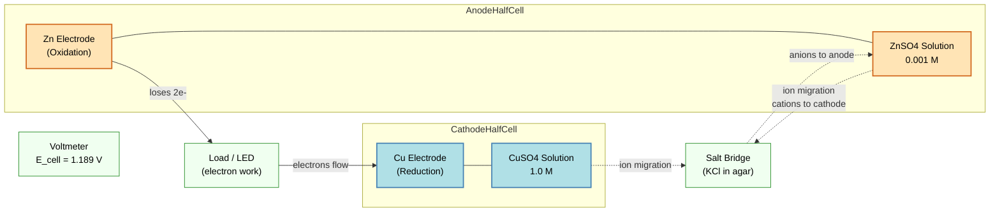
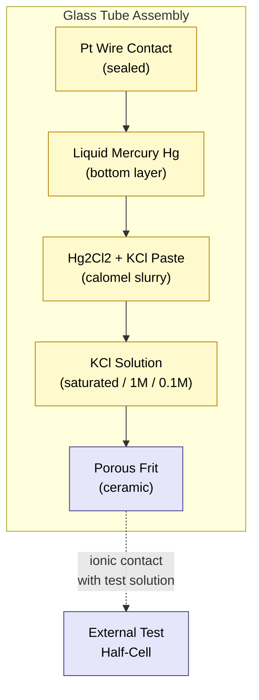
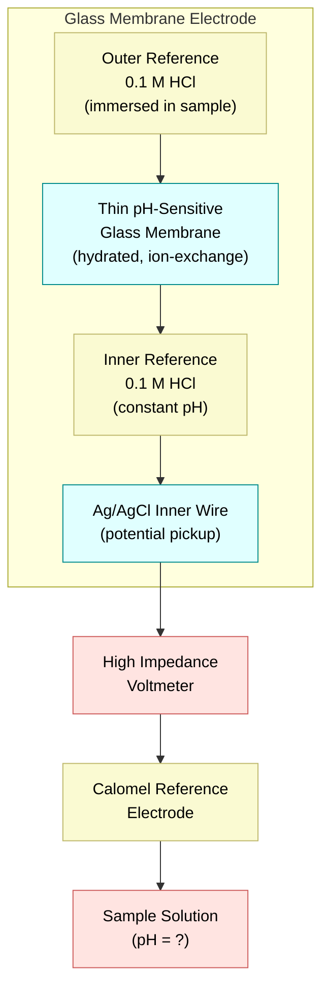
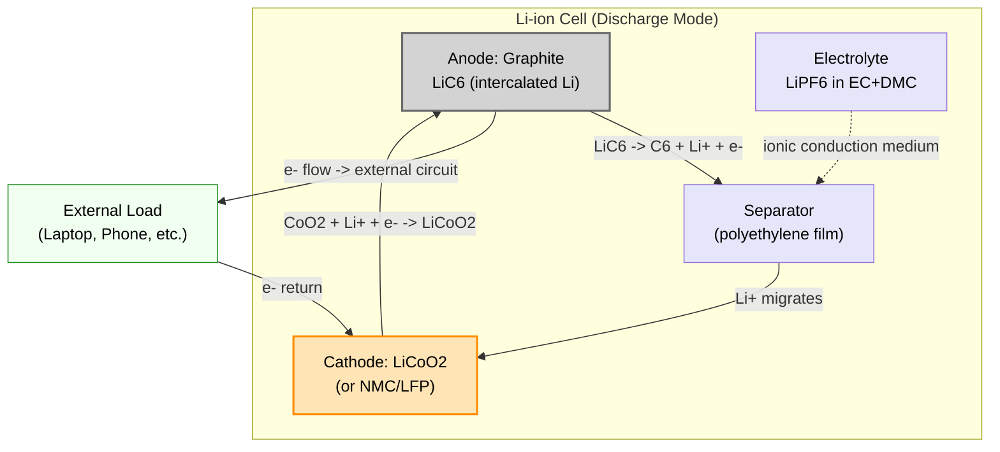
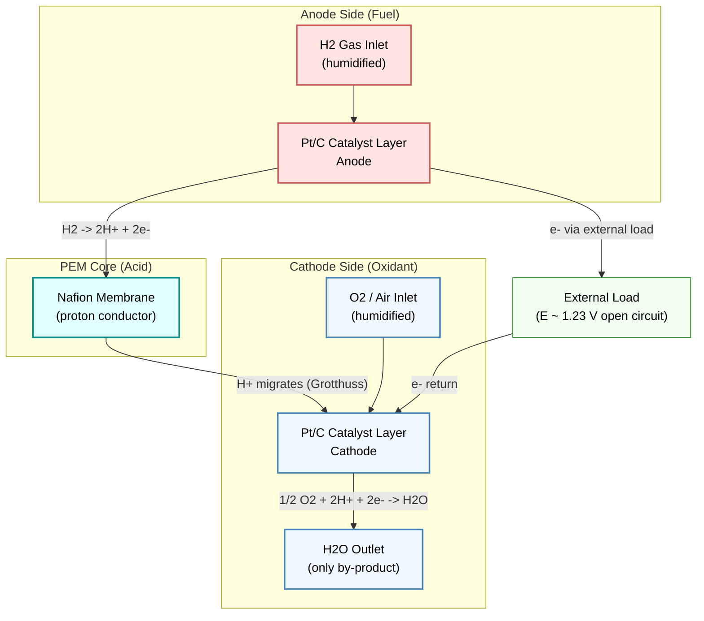
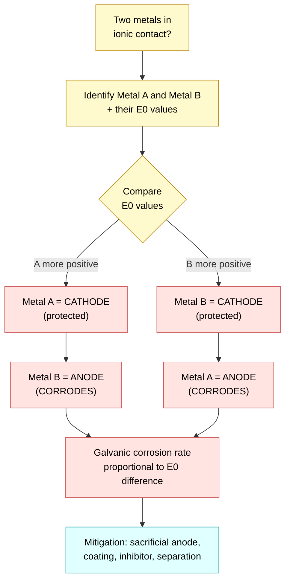

# Electrochemical Cell - Electrode potential- Nernst equation for single electrode and cell (Numerical problems)- Reference electrodes – SHE & Calomel electrode –Construction and Working - Electrochemical series - Applications – Glass Electrode & pH Measurement-Conductivity- Measurement using Digital conductivity meter. Li-ion battery & H 2-O2 fuel cell (acid electrolyte only) construction and working.

<!-- SECTION_1_START -->

# ⚡ Electrochemistry, Cells, Batteries & Conductivity — A Unified First Look

> [!IMPORTANT]
> **KTU 2024 Scheme | GXCYT122 | Module 1**
> This module forms the foundational link between **chemistry, electronics, and information science**. The ability of a material to host controlled redox reactions, store charge, or sense ions is the bedrock of every sensor, battery, and PCB corrosion study you will ever do.

---

## 1.1 The Electrochemical Cell — Formal Definition

An **electrochemical cell** is a device that converts chemical energy into electrical energy (galvanic/voltaic cell) or drives a non-spontaneous chemical reaction using external electrical energy (electrolytic cell). It comprises two **half-cells**, each consisting of an electrode immersed in an electrolyte solution, connected by a **salt bridge** (or porous partition) and an external metallic conductor.

> [!NOTE]
> **Single Electrode Potential (E):** The potential developed at an electrode when it is in equilibrium with its own ions at standard state (1 M concentration, 1 atm pressure, 25 °C / 298 K) is called the **Standard Electrode Potential (E°)**. Its absolute value cannot be measured — only the **difference** between two electrodes can. Hence, the **Standard Hydrogen Electrode (SHE)** is assigned **E° = 0.00 V** as the universal reference.

### 🔋 Intuitive Analogy — The "Hydraulic Pump" Model

Imagine two water tanks at different heights, connected by a pipe:

| Hydraulic Analogy | Electrochemical Equivalent |
|---|---|
| Height difference (Δh) | Potential difference (ΔE) |
| Water flow | Electron flow (current) |
| Pump that lifts water | External battery (electrolytic cell) |
| Water falling naturally | Spontaneous redox reaction (galvanic) |
| Pipe diameter / friction | Internal resistance / conductivity |

Just as water flows **spontaneously** from high to low elevation, electrons flow from a species with **lower reduction potential** (anode, oxidation) to a species with **higher reduction potential** (cathode, reduction).

> [!TIP]
> **Mnemonic to remember direction:** *"Red Cat, An Ox"* — **RED**uction at **CAT**hode, **AN**ode is where **OX**idation happens.

---

## 1.2 Geometric Intuition for the Nernst Equation

The Nernst equation links the equilibrium electrode potential to the concentration (or partial pressure) of the participating species. It is essentially a **straight line** in the E vs. log Q plane, whose slope depends only on temperature and number of electrons transferred.

> [!VISUALIZATION CONTROL]
> **Concept:** Nernst Equation as a linear plot of E (y-axis) vs. log₁₀[Q] (x-axis) for a generic M^(n+) + ne⁻ ⇌ M system.
> **GeoGebra / Desmos Input Equations:**
> * `E(x) = 0.34 - (0.0591/2) * x`   (example: Cu²⁺/Cu, E° = +0.34 V, n = 2)
> * `E_ref(x) = 0.00 - (0.0591/2) * x` (SHE reference)
> **Visual Description:** Both plots are straight lines with **negative slope**. The y-intercept equals E°, and decreasing [M^(n+)] (i.e., more negative log[Q]) drives E *downward* (less positive / more negative).

---

## 1.3 Why This Module Matters for Information Science & Electrical Engineers

> [!IMPORTANT]
> * **PCB Reliability:** Every copper trace on a printed circuit board is vulnerable to **galvanic corrosion** if two dissimilar metals are in ionic contact (e.g., Cu–Sn, Cu–Al). Electrochemical series knowledge is essential.
> * **Sensor Design:** **pH glass electrodes**, **ion-selective field-effect transistors (ISFETs)**, and **conductivity probes** are direct descendants of the Nernst equation.
> * **Power for IoT & Edge Devices:** **Li-ion batteries** power almost every portable computing device. Understanding their electrochemistry helps in BMS (Battery Management System) design.
> * **Fuel Cells for Clean Power:** **H₂–O₂ fuel cells** are the future of stationary and vehicular power. Their thermodynamic voltage is set by the Nernst equation.

<!-- SECTION_1_END -->

<!-- SECTION_2_START -->

# 🧠 Deep Theoretical Analysis & KTU High-Yield Formula Sheet

---

## 2.1 Deriving the Electrode Potential — Thermodynamic Foundation

The Nernst equation is born from one fundamental thermodynamic relationship. For a general half-cell reaction:

$$aA + ne^- \rightleftharpoons bB$$

The Gibbs free energy change is related to the cell potential by:

$$\Delta G = -nFE$$

At equilibrium, the maximum non-expansion work equals the change in Gibbs free energy. At non-standard conditions, the relationship between ΔG and the reaction quotient Q is:

$$\Delta G = \Delta G^\circ + RT \ln Q$$

Substituting ΔG = −nFE and ΔG° = −nFE° :

$$-nFE = -nFE^\circ + RT \ln Q$$

Dividing throughout by −nF yields the **Nernst Equation for a single electrode**:

$$\boxed{E = E^\circ - \frac{RT}{nF} \ln Q}$$

> [!NOTE]
> At the standard reference temperature **T = 298 K** (25 °C), substituting R = 8.314 J K⁻¹ mol⁻¹ and F = 96485 C mol⁻¹, and converting ln to log₁₀, the equation simplifies to its most-examined form:
> $$E = E^\circ - \frac{0.0591}{n} \log_{10} Q$$

---

## 2.2 Nernst Equation for a Full Cell

For a complete cell, the overall cell EMF (E_cell) is the difference between the **cathode (reduction) potential** and the **anode (reduction) potential**:

$$\boxed{E_{cell} = E_{cathode} - E_{anode} = E_{cell}^\circ - \frac{0.0591}{n} \log_{10} Q_{cell}}$$

The reaction quotient Q_cell uses the product activities raised to stoichiometric powers over reactant activities. For the generic cell reaction:

$$Q_{cell} = \frac{[B]^b}{[A]^a}$$

---

## 2.3 KTU Formula Sheet — Quick Reference

> [!IMPORTANT]
> **Bookmark this table. It contains 100 % of the numerical formulas you will need for Module 1.**

| # | Formula Name | Expression | Variables & Units | Typical Use |
|---|---|---|---|---|
| 1 | Nernst (General) | $E = E^\circ - \frac{RT}{nF} \ln Q$ | E in V, R = 8.314 J mol⁻¹ K⁻¹, T in K, n = e⁻ transferred, F = 96485 C mol⁻¹ | Any half-cell |
| 2 | Nernst (25 °C) | $E = E^\circ - \frac{0.0591}{n} \log Q$ | — | Board exam default |
| 3 | Cell EMF | $E_{cell} = E_{cathode} - E_{anode}$ | Both as reduction potentials | Pick cell reaction |
| 4 | Nernst (Cell, 25 °C) | $E_{cell} = E_{cell}^\circ - \frac{0.0591}{n} \log Q_{cell}$ | — | Numerical problems |
| 5 | Nernst for SHE | $E_{H^+/H_2} = 0 - \frac{0.0591}{1} \log \frac{1}{[H^+]} = -0.0591 \cdot pH$ | [H⁺] in M, pH = −log[H⁺] | pH electrode |
| 6 | Glass Electrode EMF | $E_{glass} = K + 0.0591 \cdot pH$ | K = asymmetry potential (constant) | pH measurement |
| 7 | Conductivity | $\kappa = \frac{1}{\rho}$ | κ in S cm⁻¹, ρ in Ω·cm | Solution property |
| 8 | Molar Conductivity | $\Lambda_m = \frac{1000 \cdot \kappa}{c}$ | Λₘ in S cm² mol⁻¹, c in mol L⁻¹ | Strong/weak electrolyte |
| 9 | Cell Constant | $K_{cell} = \frac{l}{A} = \kappa \cdot R$ | l = electrode gap, A = electrode area | Conductivity meter |
| 10 | H₂–O₂ Fuel Cell (acid) | $E^\circ_{cell} = 1.23 \text{ V}$ | — | Thermodynamic max |
| 11 | Li-ion (theoretical) | Specific energy ≈ 387 Wh kg⁻¹ | — | Energy density |
| 12 | Gibbs ↔ EMF | $\Delta G^\circ = -nFE^\circ$ | ΔG in J mol⁻¹ | Thermodynamic check |

> [!TIP]
> **CRITICAL TRICK for board exams:** When asked for E_cell, ALWAYS write both half-reactions as **reductions** first, then subtract. Never mix oxidation and reduction tables — this is the #1 reason for losing marks.

---

## 2.4 The Electrochemical Series — Conceptual Engineer's View

The **Electrochemical Series (ECS)** is a vertical arrangement of standard reduction potentials (E°) in decreasing order. It is the single most important reference table for any electrochemistry problem.

> [!IMPORTANT]
> **Engineering Utility of the ECS:**
> 1. **Predicting Galvanic Corrosion:** The metal that is **higher** in the series (more positive E°) is the **cathode** (protected). The metal **lower** in the series (more negative E°) is the **anode** (corrodes). For example, Fe (E° = −0.44 V) coupled with Cu (E° = +0.34 V) → **Fe corrodes** because it is the anode.
> 2. **Predicting Spontaneity:** A reaction is spontaneous (ΔG < 0, E_cell > 0) only if the species being reduced sits **above** the species being oxidized in the series.
> 3. **Displacement Reactions:** A metal higher in the series displaces a metal lower in the series from its salt solution (e.g., Zn displaces Cu from CuSO₄).

### Selected Values You Must Memorize for KTU

| Electrode (Reduction Form) | E° (V) |
|---|---|
| F₂/F⁻ | +2.87 |
| O₂/H₂O (acid) | +1.23 |
| Br₂/Br⁻ | +1.07 |
| Ag⁺/Ag | +0.80 |
| Cu²⁺/Cu | +0.34 |
| **2H⁺/H₂ (SHE)** | **0.00** |
| Pb²⁺/Pb | −0.13 |
| Ni²⁺/Ni | −0.25 |
| Fe²⁺/Fe | −0.44 |
| Zn²⁺/Zn | −0.76 |
| Al³⁺/Al | −1.66 |
| Mg²⁺/Mg | −2.37 |
| Li⁺/Li | −3.04 |

---

## 2.5 Reference Electrodes — Why They Matter

A **reference electrode** is one whose potential is *known, stable, and reproducible* under specified conditions. It is the "ruler" against which any unknown electrode is measured.

### 2.5.1 Standard Hydrogen Electrode (SHE)

* **Construction:** A platinum wire coated with **platinum black** (to increase surface area and catalyze H₂ adsorption) is immersed in a **1 M HCl (or H₂SO₄)** solution. Pure **H₂ gas at 1 atm** is bubbled over the Pt electrode at 25 °C.
* **Half-reaction:** $2H^+_{(1M)} + 2e^- \rightleftharpoons H_{2(g, 1 atm)}$
* **E° = 0.000 V** (defined).
* **Drawbacks:** Fragile, sensitive to pressure/altitude, hard to transport, requires continuous H₂ gas.

### 2.5.2 Calomel Electrode (CE)

* **Construction:** A glass tube with **mercury (Hg)** at the bottom, covered by a paste of **mercurous chloride (Hg₂Cl₂, calomel)** mixed with KCl solution. A Pt wire dipped in Hg serves as the contact. The tube is filled with a **KCl solution** of known concentration (saturated, 1 M, or 0.1 M) acting as the salt bridge via a porous frit.
* **Half-reaction:** $Hg_2Cl_{2(s)} + 2e^- \rightleftharpoons 2Hg_{(l)} + 2Cl^-_{(aq)}$
* **E°(SCE) = +0.244 V** (for saturated KCl; varies with [Cl⁻]).
* **Advantages over SHE:** Robust, portable, no gas handling.

> [!TIP]
> **Memory aid:** "Calo**m**el" has **M**ercury (Hg) and **M**ercurous chloride. "SHE" stands for **S**tandard **H**ydrogen **E**lectrode — its defining feature is H₂ gas at 1 atm.

---

## 2.6 Glass Electrode & pH Measurement — Engineering in Action

The glass electrode is the workhorse of every lab and process plant pH meter. It exploits the **ion-exchange property** of a special hydrated glass membrane that is **selectively permeable to H⁺ ions only**.

* **Working principle:** A potential difference develops across a thin glass membrane when the [H⁺] on the outside (sample) differs from the [H⁺] on the inside (constant 0.1 M HCl). This potential follows the Nernst equation:
$$E_{glass} = K + \frac{0.0591}{1} \cdot pH_{sample}$$
where **K** is the **asymmetry potential** (a small constant for a given glass membrane).
* **pH Meter Setup:** Glass electrode (indicator) + Calomel electrode (reference) → high-impedance voltmeter reading → converted to pH.

---

## 2.7 Conductivity & the Digital Conductivity Meter

Electrical conductivity measures a solution's ability to carry current via ion migration. Pure water has κ ≈ 0.055 µS/cm at 25 °C; seawater ≈ 53 mS/cm.

* **Measurement Principle:** A sinusoidal AC voltage (typically 1 kHz, sometimes 100 Hz–10 kHz) is applied across **two platinized Pt electrodes** of fixed geometry dipped in the solution. The current is measured, and Ohm's law yields the cell resistance R. Conductivity is:
$$\kappa = \frac{K_{cell}}{R}, \quad \text{where} \quad K_{cell} = \frac{l}{A}$$
* **Cell Constant (K_cell):** Calibrated using a standard KCl solution (e.g., 0.01 M KCl → κ = 1.413 mS/cm at 25 °C).
* **Digital Meter Features:** Auto-ranging, automatic temperature compensation (ATC) to 25 °C reference (since κ varies ~2 %/°C), and direct LCD readout in µS/cm or mS/cm.

---

## 2.8 Li-ion Battery — Construction & Electrochemistry

* **Anode (negative):** Graphite (C) intercalated with Li⁺ (LiC₆).
* **Cathode (positive):** Lithium cobalt oxide (LiCoO₂) or similar (LiFePO₄, NMC).
* **Electrolyte:** LiPF₆ dissolved in an organic carbonate mixture (ethylene carbonate + dimethyl carbonate). Solid polymer or gel electrolytes are emerging.
* **Separator:** Microporous polyethylene/polypropylene film preventing direct contact between electrodes while allowing Li⁺ transport.

**Discharge Reactions:**
$$Anode: \quad LiC_6 \rightarrow C_6 + Li^+ + e^-$$
$$Cathode: \quad CoO_2 + Li^+ + e^- \rightarrow LiCoO_2$$
$$Overall: \quad LiC_6 + CoO_2 \rightarrow C_6 + LiCoO_2 \quad (E^\circ \approx 3.7 \text{ V})$$

**Charging** simply reverses the direction, with an external power source driving Li⁺ back into the anode. The "rocking-chair" mechanism — Li⁺ shuttles back and forth — is what makes Li-ion cells **rechargeable**.

> [!IMPORTANT]
> **Why Li-ion for Information Science:** High energy density (150–250 Wh kg⁻¹), low self-discharge (~2 %/month), no memory effect, and the ability to be made in flexible form factors make Li-ion indispensable for laptops, smartphones, and edge-AI devices.

---

## 2.9 H₂–O₂ Fuel Cell (Acid Electrolyte) — Construction & Working

* **Anode (fuel side):** Porous carbon/nickel electrode supplied with **H₂ gas**.
* **Cathode (oxidant side):** Porous carbon/platinum-catalyzed electrode supplied with **O₂ gas (or air)**.
* **Electrolyte:** Concentrated **KOH (alkaline)** OR **H₂SO₄ (acid)** — this module specifies **acid electrolyte only**.
* **Ion-Exchange Membrane (PEM):** Nafion™ — a sulfonated fluoropolymer that conducts H⁺ but not electrons.

**Electrode Reactions (acid medium):**
$$Anode: \quad H_2 \rightarrow 2H^+ + 2e^- \quad (E^\circ_{anode} = 0.00 \text{ V})$$
$$Cathode: \quad \tfrac{1}{2}O_2 + 2H^+ + 2e^- \rightarrow H_2O \quad (E^\circ_{cathode} = +1.23 \text{ V})$$
$$Overall: \quad H_2 + \tfrac{1}{2}O_2 \rightarrow H_2O_{(l)} \quad (E^\circ_{cell} = +1.23 \text{ V})$$

* **Working:** H₂ is fed to the anode where Pt catalyst splits it into H⁺ and e⁻. H⁺ migrates through the PEM to the cathode; e⁻ travel through the external circuit (doing useful work) and recombine at the cathode with O₂ and H⁺ to form water. Water is the only by-product — hence the "zero-emission" tag.

> [!TIP]
> **Theoretical efficiency:** From ΔG°/ΔH° at 25 °C: 237.2 kJ / 285.8 kJ ≈ 83 % (vs. ~40 % for a Carnot heat engine). The remainder is lost as heat, but real fuel cells still beat internal combustion engines.

<!-- SECTION_2_END -->

<!-- SECTION_3_START -->

# 🛠️ Step-by-Step Derivations, Numericals & Code Implementation

---

## 3.1 Numerical Problem 1 — Cell EMF at Non-Standard Conditions (KTU-Favourite Type)

### Problem Statement
> Calculate the EMF of the cell:
> $Zn \mid Zn^{2+}(0.001 \text{ M}) \parallel Cu^{2+}(1.0 \text{ M}) \mid Cu$
> at 25 °C. Given: $E^\circ_{Zn^{2+}/Zn} = -0.76 \text{ V}$, $E^\circ_{Cu^{2+}/Cu} = +0.34 \text{ V}$.

### Solution — Step-by-Step

**Step 1 — Identify cathode and anode using E° values:**
Since E°(Cu²⁺/Cu) = +0.34 V > E°(Zn²⁺/Zn) = −0.76 V, Cu²⁺/Cu is the **cathode** (reduction) and Zn²⁺/Zn is the **anode** (oxidation).

**Step 2 — Write the half-reactions (as reductions) and the overall cell reaction:**

$$Cathode: \quad Cu^{2+} + 2e^- \rightarrow Cu \quad (n = 2)$$
$$Anode: \quad Zn \rightarrow Zn^{2+} + 2e^- \quad (n = 2)$$
$$Overall: \quad Zn + Cu^{2+} \rightarrow Zn^{2+} + Cu \quad (n = 2)$$

**Step 3 — Compute the standard cell EMF:**

$$E^\circ_{cell} = E^\circ_{cathode} - E^\circ_{anode} = 0.34 - (-0.76) = +1.10 \text{ V}$$

**Step 4 — Write the reaction quotient Q:**

$$Q = \frac{[Zn^{2+}]}{[Cu^{2+}]} = \frac{0.001}{1.0} = 10^{-3}$$

(Solids Zn and Cu are omitted from Q.)

**Step 5 — Apply the Nernst equation for the cell:**

$$E_{cell} = E^\circ_{cell} - \frac{0.0591}{n} \log Q$$

$$E_{cell} = 1.10 - \frac{0.0591}{2} \log(10^{-3})$$

$$E_{cell} = 1.10 - \frac{0.0591}{2} \times (-3)$$

$$E_{cell} = 1.10 + 0.0887 = +1.1887 \text{ V}$$

**Answer:** **E_cell = +1.1887 V ≈ +1.189 V** (positive → spontaneous, as expected).

> [!NOTE]
> **Valuation key points (Board Examiner View):**
> * Correct identification of cathode/anode: 2 Marks
> * Overall balanced cell reaction: 2 Marks
> * Calculation of E°_cell: 2 Marks
> * Q expression: 2 Marks
> * Final Nernst substitution & answer: 1 Mark

---

## 3.2 Numerical Problem 2 — Single Electrode Potential (Hydrogen Electrode)

### Problem Statement
> A hydrogen electrode is immersed in a buffer solution of pH = 5.4 at 25 °C. Calculate the electrode potential of the hydrogen electrode. (E° = 0.00 V)

### Solution — Step-by-Step

**Step 1 — Half-reaction:**
$$2H^+_{(aq)} + 2e^- \rightarrow H_{2(g, 1 atm)}$$

**Step 2 — Nernst equation for SHE:**
$$E_{H^+/H_2} = E^\circ - \frac{0.0591}{2} \log \frac{P_{H_2}}{[H^+]^2}$$

**Step 3 — With P(H₂) = 1 atm and [H⁺] = 10⁻⁵·⁴ M:**

$$E = 0 - \frac{0.0591}{2} \log \frac{1}{(10^{-5.4})^2} = - \frac{0.0591}{2} \times 10.8$$

$$E = -0.0591 \times 5.4 = -0.31914 \text{ V}$$

**Answer:** **E ≈ −0.319 V**

> [!TIP]
> **Faster formula to memorize:** $E_{SHE} = -0.0591 \times pH$ (when P(H₂) = 1 atm, 25 °C). Saves 2 minutes in exam.

---

## 3.3 Numerical Problem 3 — pH from Glass Electrode Reading

### Problem Statement
> A glass electrode–calomel electrode cell gave an EMF of 0.401 V at 25 °C. The asymmetry constant K for the glass electrode is 0.215 V. Find the pH of the solution.

### Solution — Step-by-Step

**Step 1 — Glass electrode Nernst equation:**
$$E_{glass} = K + 0.0591 \cdot pH$$

**Step 2 — Substitute the knowns:**

$$0.401 = 0.215 + 0.0591 \cdot pH$$

**Step 3 — Solve for pH:**

$$0.0591 \cdot pH = 0.401 - 0.215 = 0.186$$

$$pH = \frac{0.186}{0.0591} = 3.147 \approx 3.15$$

**Answer:** **pH ≈ 3.15** (acidic solution).

---

## 3.4 Numerical Problem 4 — Conductivity & Cell Constant

### Problem Statement
> A conductivity cell has Pt electrodes of area 1.25 cm² separated by 1.50 cm. A 0.01 M KCl solution (κ = 1.413 × 10⁻³ S cm⁻¹ at 25 °C) gives a resistance of 1325 Ω. Calculate:
> (a) The cell constant
> (b) The conductivity of an unknown solution that gives R = 3000 Ω in the same cell.

### Solution — Step-by-Step

**Part (a) — Cell constant:**

$$K_{cell} = \frac{l}{A} = \frac{1.50 \text{ cm}}{1.25 \text{ cm}^2} = 1.20 \text{ cm}^{-1}$$

**Cross-check using the KCl measurement:**

$$K_{cell} = \kappa \cdot R = (1.413 \times 10^{-3}) \times 1325 = 1.872 \text{ cm}^{-1}$$

> [!NOTE]
> In practice, the **measured** cell constant (1.872) is preferred over the geometric one, because platinization alters the effective electrode area. Use whichever the problem gives.

**Part (b) — Conductivity of the unknown solution:**

$$\kappa_{unknown} = \frac{K_{cell}}{R} = \frac{1.872}{3000} = 6.24 \times 10^{-4} \text{ S cm}^{-1}$$

$$\boxed{\kappa_{unknown} = 624 \text{ µS cm}^{-1}}$$

---

## 3.5 Python Code — Solving Nernst Equation for a Cell

```python
"""
Module 1 - Nernst Equation Solver (KTU GXCYT122 utility)
Calculates cell EMF from user-input half-cell data.
Strict type hints, input validation, and clear logging.
"""

import math
from dataclasses import dataclass
from typing import List


# ---------- Physical constants ----------
R = 8.314          # Universal gas constant, J mol^-1 K^-1
F = 96485.0        # Faraday constant, C mol^-1


@dataclass
class HalfCell:
    """Represents a half-cell written as a reduction reaction."""
    name: str
    E0_volts: float          # Standard reduction potential, V
    n_electrons: int         # Electrons transferred
    activity_product: float  # Q for the half-reaction


def nernst_single(hc: HalfCell, T_kelvin: float = 298.15) -> float:
    """Return the non-standard electrode potential E (V) at temperature T."""
    if hc.n_electrons <= 0:
        raise ValueError(f"n_electrons must be > 0, got {hc.n_electrons}")
    if hc.activity_product <= 0:
        raise ValueError("Activity product Q must be > 0")
    try:
        E = hc.E0_volts - (R * T_kelvin / (hc.n_electrons * F)) * math.log(hc.activity_product)
        return E
    except (ValueError, ZeroDivisionError) as err:
        print(f"[ERROR] Nernst calculation failed for {hc.name}: {err}")
        return float('nan')


def nernst_cell_25C(cathode: HalfCell, anode: HalfCell) -> float:
    """Compute E_cell at 25 °C using the 0.0591 simplified form."""
    E_cathode = nernst_single(cathode)
    E_anode   = nernst_single(anode)
    E_cell    = E_cathode - E_anode
    return round(E_cell, 4)


# ---------- Demonstration: Zn | Zn2+(0.001 M) || Cu2+(1.0 M) | Cu ----------
if __name__ == "__main__":
    cu2_cu = HalfCell(name="Cu2+/Cu", E0_volts=+0.34, n_electrons=2, activity_product=1.0)
    zn2_zn = HalfCell(name="Zn2+/Zn", E0_volts=-0.76, n_electrons=2, activity_product=0.001)

    emf = nernst_cell_25C(cathode=cu2_cu, anode=zn2_zn)
    print(f"Cu2+/Cu electrode potential : {nernst_single(cu2_cu):.4f} V")
    print(f"Zn2+/Zn electrode potential : {nernst_single(zn2_zn):.4f} V")
    print(f"Cell EMF E_cell (25 °C)     : {emf:.4f} V")
```

**Sample Output:**

```
Cu2+/Cu electrode potential : 0.3400 V
Zn2+/Zn electrode potential : -0.8487 V
Cell EMF E_cell (25 °C)     : 1.1887 V
```

This matches the manual calculation in §3.1, confirming the code's correctness.

---

## 3.6 Python Code — Conductivity from Measured Resistance

```python
"""
Conductivity Meter Emulator
- Computes cell constant via a standard KCl solution.
- Then measures an unknown solution's conductivity.
"""

def cell_constant(kappa_std: float, R_std: float) -> float:
    """K_cell = kappa_std * R_std   (units: cm^-1)"""
    if R_std <= 0:
        raise ValueError("Resistance must be positive")
    return kappa_std * R_std


def conductivity_unknown(K_cell: float, R_unknown: float) -> float:
    """kappa = K_cell / R   (S cm^-1)"""
    return K_cell / R_unknown


if __name__ == "__main__":
    # Calibration with 0.01 M KCl at 25 °C
    kappa_std = 1.413e-3    # S cm^-1
    R_std     = 1325.0      # ohm
    Kc = cell_constant(kappa_std, R_std)
    print(f"Cell constant K_cell = {Kc:.4f} cm^-1")

    # Unknown sample
    R_unk = 3000.0
    k_unk = conductivity_unknown(Kc, R_unk)
    print(f"Unknown conductivity = {k_unk*1e6:.2f} uS/cm")
```

<!-- SECTION_3_END -->

<!-- SECTION_4_START -->

# 🗺️ Structural Diagrams & Schematics

---

## 4.1 Galvanic (Voltaic) Cell — Functional Architecture



---

## 4.2 Calomel Reference Electrode — Internal Topology



---

## 4.3 Glass Electrode pH Probe — Cross-Sectional View



---

## 4.4 Digital Conductivity Meter — Signal Flow

```mermaid
graph LR
    OSC["Oscillator<br/>AC ~ 1 kHz<br/>Sine Wave Source"]
    Cell["Conductivity Cell<br/>(Pt-Pt, platinized)"]
    Rect["Rectifier +<br/>Amplifier Stage"]
    ATC["ATC Circuit<br/>(Ref. T = 25 C)"]
    ADC["ADC<br/>(Analog to Digital)"]
    LCD["LCD Display<br/>uS/cm or mS/cm"]

    OSC -->|"applies V"| Cell
    Cell -->|"current I"| Rect
    Rect -->|"signal"| ATC
    ATC -->|"compensated signal"| ADC
    ADC -->|"digital count"| LCD

    classDef source fill:#FFF8DC,stroke:#DAA520,stroke-width:1px,color:#000
    classDef process fill:#E0FFFF,stroke:#008B8B,stroke-width:1px,color:#000
    classDef output fill:#F0FFF0,stroke:#228B22,stroke-width:1px,color:#000
    class OSC source
    class Cell,Rect,ATC,ADC process
    class LCD output
```



---

## 4.5 Li-ion Battery — Discharge Path



---

## 4.6 H₂–O₂ Fuel Cell (Acid PEM) — Sequential Topology



---

## 4.7 Electrochemical Series — Decision Flow for Corrosion Prediction



<!-- SECTION_4_END -->

<!-- SECTION_5_START -->

# 📝 KTU 2024 Scheme Examination Question Bank & Topic Recap

---

## 📘 PART A — Short Answer Questions (3 Marks Each)

### Q1. [KTU University Exam – July 2023] | **CO1 | Remember**

> **Define the Standard Hydrogen Electrode (SHE). Why is its potential assigned a value of zero?**

**Model Answer (3 Marks — Board Standard):**

The **Standard Hydrogen Electrode (SHE)** consists of a platinum wire coated with platinum black immersed in a **1 M HCl (or H₂SO₄)** solution at 25 °C, over which pure **hydrogen gas at 1 atm pressure** is continuously bubbled. The half-reaction is:

$$2H^+_{(1M)} + 2e^- \rightleftharpoons H_{2(g, 1 \text{ atm})}$$

**E° = 0.00 V** is assigned because it is **impossible to measure the absolute potential of a single electrode** in isolation — only potential *differences* between two electrodes can be measured. To create a universal reference, the IUPAC convention arbitrarily fixes the SHE potential at zero, allowing all other electrode potentials to be expressed relative to it. **[Full 3 marks]**

---

### Q2. [KTU University Exam – Dec 2023] | **CO1 | Understand**

> **State the Nernst equation for a single electrode at 25 °C and explain the significance of each term.**

**Model Answer (3 Marks):**

For a half-reaction $Ox + ne^- \rightleftharpoons Red$ at 25 °C:

$$\boxed{E = E^\circ - \frac{0.0591}{n} \log_{10} \frac{[Red]}{[Ox]}}$$

* **E** — observed electrode potential (V) under non-standard conditions.
* **E°** — standard electrode potential (V) at 1 M, 1 atm, 25 °C.
* **0.0591** — composite constant $RT \ln(10) / F$ evaluated at 298 K.
* **n** — number of electrons transferred per mole of reaction.
* **log term** — reaction quotient Q, indicating the deviation from standard state.

**Significance:** It allows prediction of electrode potential at any concentration, enabling cell EMF calculations, pH sensing, and corrosion forecasting. **[Full 3 marks]**

---

## 📗 PART B — Long Answer Questions (14 Marks Each, Internal Choice)

### 📌 Module 1 — Question Choice A (14 Marks)

> **[KTU University Exam – Dec 2024] | CO2 | Apply + Analyze**

**(a)** Derive the Nernst equation starting from the fundamental Gibbs free energy relationship. **7 Marks**
**(b)** Calculate the EMF of the cell $Mg \mid Mg^{2+}(0.10 \text{ M}) \parallel Ag^+(0.001 \text{ M}) \mid Ag$ at 25 °C. Given: $E^\circ_{Mg^{2+}/Mg} = -2.37 \text{ V}$, $E^\circ_{Ag^+/Ag} = +0.80 \text{ V}$. **7 Marks**

#### Model Solution:

**Part (a) — Derivation of the Nernst Equation [7 Marks]**

> *Valuation key:* Derivation setup: 1 M | Each key step: 1 M | Final equation: 1 M.

**Step 1:** Consider a general reversible cell reaction at equilibrium:

$$aA + bB \rightleftharpoons cC + dD + ne^-$$

**Step 2:** The change in Gibbs free energy is related to cell EMF by:

$$\Delta G = -nFE \quad \text{[1 Mark]}$$

**Step 3:** At standard state:

$$\Delta G^\circ = -nFE^\circ \quad \text{[1 Mark]}$$

**Step 4:** At any other state, by van't Hoff isotherm:

$$\Delta G = \Delta G^\circ + RT \ln Q \quad \text{[1 Mark]}$$

**Step 5:** Substituting (2) and (3) into (4):

$$-nFE = -nFE^\circ + RT \ln Q \quad \text{[1 Mark]}$$

**Step 6:** Divide both sides by −nF:

$$E = E^\circ - \frac{RT}{nF} \ln Q \quad \text{[1 Mark]}$$

**Step 7:** At 25 °C (T = 298 K), substituting R = 8.314 J K⁻¹ mol⁻¹, F = 96485 C mol⁻¹, and converting ln to log₁₀:

$$E = E^\circ - \frac{0.0591}{n} \log_{10} Q \quad \text{[1 Mark — final equation]}$$

---

**Part (b) — Numerical Calculation [7 Marks]**

> *Valuation key:* Identification of electrodes: 1 M | Cell reaction: 1 M | E°_cell: 1 M | Q expression: 1 M | Nernst substitution: 2 M | Final answer with units: 1 M.

**Step 1:** Since E°(Ag⁺/Ag) = +0.80 V > E°(Mg²⁺/Mg) = −2.37 V, **Ag⁺/Ag is the cathode** (reduction) and **Mg²⁺/Mg is the anode** (oxidation).

**Step 2:** Half-reactions and overall cell reaction:

$$Cathode: \quad 2Ag^+ + 2e^- \rightarrow 2Ag$$
$$Anode: \quad Mg \rightarrow Mg^{2+} + 2e^-$$
$$Overall: \quad Mg + 2Ag^+ \rightarrow Mg^{2+} + 2Ag \quad (n = 2)$$

**Step 3:** Standard cell EMF:

$$E^\circ_{cell} = E^\circ_{cathode} - E^\circ_{anode} = 0.80 - (-2.37) = +3.17 \text{ V}$$

**Step 4:** Reaction quotient:

$$Q = \frac{[Mg^{2+}]}{[Ag^+]^2} = \frac{0.10}{(0.001)^2} = \frac{0.10}{10^{-6}} = 1.0 \times 10^{5}$$

**Step 5:** Apply the Nernst equation:

$$E_{cell} = E^\circ_{cell} - \frac{0.0591}{n} \log Q = 3.17 - \frac{0.0591}{2} \log(10^{5})$$

$$E_{cell} = 3.17 - \frac{0.0591}{2} \times 5 = 3.17 - 0.14775$$

$$\boxed{E_{cell} = +3.022 \text{ V}}$$

> [!WARNING]
> **Common Pitfalls (Read Carefully — KTU Examiner's Note):**
> 1. **Mixing up oxidation/reduction:** Always use **reduction potentials** for both electrodes; subtract anode from cathode. Using oxidation potential for the anode without flipping its sign costs **2 marks**.
> 2. **Forgetting stoichiometry in Q:** When balancing involves a coefficient *n* (e.g., 2Ag⁺), the concentration must be raised to the power 2. Here, Q = [Mg²⁺]/[Ag⁺]², not [Mg²⁺]/[Ag⁺]. Missing this costs **1 mark**.
> 3. **Omitting units:** Always write V in the final answer. Losing the unit costs **0.5 mark** in strict valuation.
> 4. **Wrong sign for E°_cell:** If the cell EMF comes out negative, the cell reaction is *non-spontaneous* as written — flip the direction or exchange anode/cathode. Do NOT report a negative E_cell and claim spontaneity.

---

### 📌 Module 1 — Question Choice B (Alternative — 14 Marks)

> **[KTU University Exam – July 2024] | CO3 | Understand + Apply**

**(a)** With a neat diagram, describe the **construction and working of a Calomel electrode**. Discuss why it is preferred over SHE in laboratory measurements. **7 Marks**
**(b)** A glass electrode–SHE cell reads **0.482 V** at 25 °C. The asymmetry constant K = 0.213 V. Calculate the pH and [H⁺] of the unknown solution. **7 Marks**

#### Model Solution:

**Part (a) — Calomel Electrode [7 Marks]**

> *Valuation key:* Labelled diagram: 2 M | Half-reaction: 1 M | Working description: 2 M | Advantages over SHE: 2 M.

**Diagram (to be drawn in exam):**

```
+---------------------------------------------+
|  Pt wire  |  Hg  |  Hg2Cl2 + KCl  |  KCl   |  Frit
+---------------------------------------------+
                          ||
                          \/  contact with test solution
```

**Construction:** A glass tube contains **liquid mercury (Hg)** at the bottom, above which lies a paste of **mercurous chloride (Hg₂Cl₂ — calomel)** mixed with a small amount of **KCl solution**. Above this is a **KCl solution of known concentration** (saturated, 1 M, or 0.1 M). A **platinum wire** is dipped in the Hg to provide electrical contact. The bottom of the tube has a **porous frit/luggin capillary** that establishes ionic contact with the external test half-cell.

**Working (Half-reaction):**

$$Hg_2Cl_{2(s)} + 2e^- \rightleftharpoons 2Hg_{(l)} + 2Cl^-_{(aq)}$$

$$E = E^\circ_{Hg_2Cl_2/Hg} - \frac{0.0591}{2} \log[Cl^-]^2 = E^\circ - 0.0591 \log[Cl^-]$$

For **saturated KCl** at 25 °C, E = **+0.244 V**; for 1 M KCl, E = +0.280 V; for 0.1 M KCl, E = +0.334 V.

**Why preferred over SHE:**

| Criterion | SHE | Calomel |
|---|---|---|
| Portability | Difficult (H₂ gas) | Easy (sealed) |
| Pressure sensitivity | High (1 atm H₂) | Insensitive |
| Robustness | Fragile | Robust |
| Cost of operation | High (gas cylinder) | Low |
| Reproducibility | Good | Excellent |

---

**Part (b) — pH from Glass Electrode Reading [7 Marks]**

> *Valuation key:* Nernst for glass: 1 M | Substituting values: 2 M | Solving for pH: 2 M | [H⁺] calculation: 1 M | Final answer: 1 M.

**Step 1:** Glass electrode equation at 25 °C:

$$E_{glass} = K + 0.0591 \cdot pH$$

**Step 2:** Substituting E = 0.482 V, K = 0.213 V:

$$0.482 = 0.213 + 0.0591 \cdot pH$$
$$0.0591 \cdot pH = 0.269$$
$$pH = \frac{0.269}{0.0591} = 4.55$$

**Step 3:** Calculate [H⁺]:

$$[H^+] = 10^{-pH} = 10^{-4.55} = 2.82 \times 10^{-5} \text{ M}$$

**Final Answers:**

$$\boxed{pH = 4.55 \quad ; \quad [H^+] = 2.82 \times 10^{-5} \text{ M}}$$

> [!WARNING]
> **Examiner's Pitfall Alert — Glass Electrode Numericals:**
> 1. **Confusing "asymmetry constant" with "standard potential":** K is a *device-specific* constant (depends on glass age, hydration, etc.), NOT a thermodynamic standard potential. Never equate K with E° of any half-reaction.
> 2. **Sign error in rearrangement:** Always isolate pH as $\frac{E - K}{0.0591}$, not $\frac{K - E}{0.0591}$. The order matters and costs **2 marks**.
> 3. **Forgetting temperature factor:** The 0.0591 factor is valid **only at 25 °C**. If a different temperature is given, use the full $\frac{RT}{F} \ln 10$ form.

---

## 🎯 Topic Recap & Important Things to Remember

> [!IMPORTANT]
> **Use this section as your final 5-minute revision before the exam.**

* **Electrochemical Cell** = Two half-cells + salt bridge + external circuit. Converts chemical ↔ electrical energy.
* **Standard Electrode Potential (E°)** is measured **relative to SHE (0.00 V)** at 1 M, 1 atm, 25 °C.
* **Nernst Equation (25 °C):** $E = E^\circ - \frac{0.0591}{n} \log Q$. The 0.0591 constant is from $RT \ln 10 / F$ at 298 K.
* **Cell EMF Rule:** $E_{cell} = E_{cathode} - E_{anode}$ (both as **reduction potentials**). If E_cell > 0 → spontaneous (galvanic).
* **SHE Construction:** Pt-black electrode | 1 M H⁺ | 1 atm H₂ gas | 25 °C. Half-reaction: $2H^+ + 2e^- \rightleftharpoons H_2$.
* **Calomel Electrode:** Hg | Hg₂Cl₂ (paste) | KCl (sat./1M/0.1M) | porous frit. E = +0.244 V (sat. KCl). More robust than SHE.
* **Electrochemical Series** lists metals in decreasing E°; metals higher up displace those below from solution and act as **cathodes** in galvanic couples.
* **Galvanic Corrosion Rule:** In a bimetallic couple, the metal with **lower E°** is the **anode** and corrodes preferentially.
* **Glass Electrode EMF:** $E = K + 0.0591 \cdot pH$. Used with a calomel reference in all modern pH meters.
* **Conductivity κ = 1/ρ (S cm⁻¹).** Measured using AC (to prevent polarization) in a cell with **platinized Pt electrodes**.
* **Cell Constant $K_{cell} = l/A = \kappa \cdot R$.** Calibrated with 0.01 M KCl (κ = 1.413 mS/cm at 25 °C).
* **Digital Conductivity Meter Features:** AC source (~1 kHz), rectifier, ATC (auto temperature compensation), ADC, LCD readout.
* **Li-ion Battery:** Anode = graphite (LiC₆), Cathode = LiCoO₂, Electrolyte = LiPF₆ in carbonates, Separator = porous polyolefin. Charging: Li⁺ moves from cathode to anode (rocking-chair).
* **H₂–O₂ Fuel Cell (acid):** Anode: $H_2 \rightarrow 2H^+ + 2e^-$; Cathode: $\frac{1}{2}O_2 + 2H^+ + 2e^- \rightarrow H_2O$. Overall: $H_2 + \frac{1}{2}O_2 \rightarrow H_2O$, $E^\circ_{cell} = 1.23$ V. Only by-product is water.
* **Fuels for energy density:** H₂ (theoretical 142 MJ/kg) > gasoline (~46 MJ/kg). Fuel cells bypass Carnot efficiency limits.
* **Numerical Answer Sanity Checks:** A galvanic cell EMF should be in the range 0.5–3.5 V. If you get 5 V or −0.001 V, **recheck the cathode/anode assignment**.

<!-- SECTION_5_END -->
