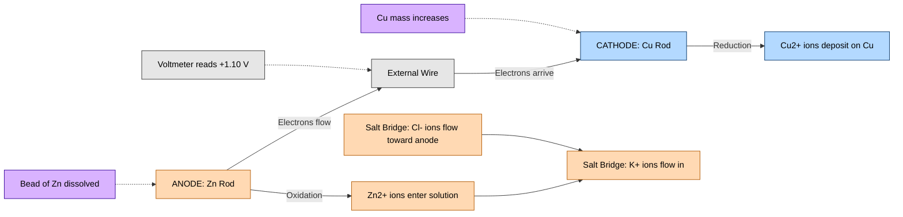
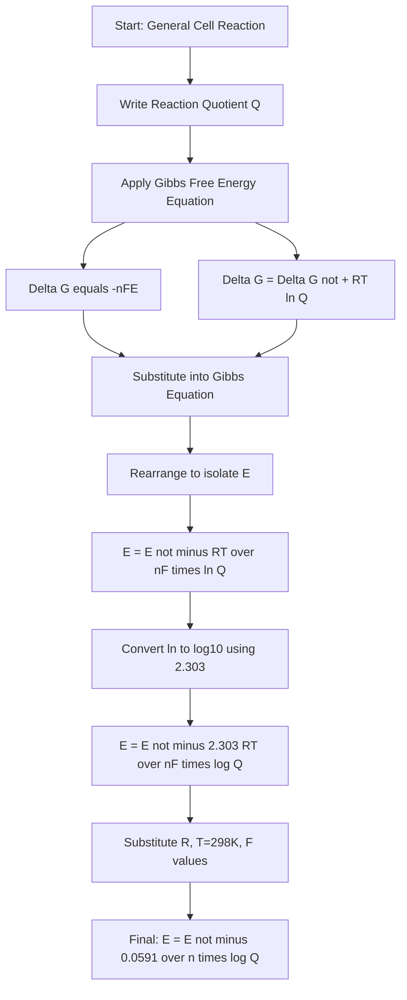
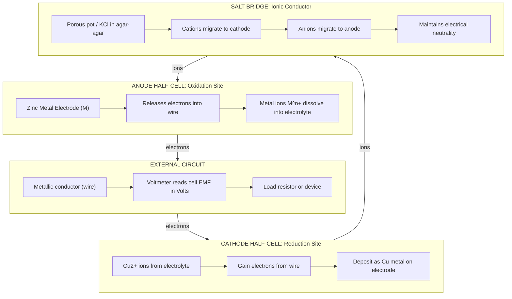

# Electrochemical Cell - Electrode potential

<!-- SECTION_1_START -->

# ⚡ Electrochemical Cell & Electrode Potential — The Heart of Modern Electronics

> [!IMPORTANT]
> **KTU 2024 Scheme | GXCYT122 | Module 1 | Core Concept**
> This section lays the rigorous academic foundation for Electrode Potential. Every term is aligned with the KTU 2024 NEP-aligned chemistry syllabus for Information Science and Electrical Science streams.

---

## 1.1 Formal Academic Definition

An **Electrochemical Cell** is a device that converts chemical energy into electrical energy (Galvanic / Voltaic Cell) **or** electrical energy into chemical energy (Electrolytic Cell) through a **redox (reduction–oxidation) reaction** occurring at two physically separated electrodes immersed in an ionically conducting medium called the **electrolyte**.

**Electrode Potential (E)** is defined as the **tendency of an electrode to either gain or lose electrons** when it is in contact with its own ions in solution. It is measured in **Volts (V)** and is a quantitative measure of how strongly an electrode can **reduce** the species in contact with it.

There are two conventional types of electrode potential:

- **Oxidation Potential ($E_{ox}$)**: Tendency of an electrode to **lose electrons** (be oxidized). Sign convention: **positive in the original Latimer / classical series**.
- **Reduction Potential ($E_{red}$)**: Tendency of an electrode to **gain electrons** (be reduced). Sign convention: **positive in the modern IUPAC series**.

$$E_{cell} = E_{cathode} - E_{anode} = E_{red}(cathode) - E_{red}(anode)$$

where the **cathode** is the electrode where **reduction** occurs and the **anode** is where **oxidation** occurs.

---

## 1.2 Real-World Analogy — The "Water Pressure" Model

Imagine two water tanks connected by a pipe at the bottom. The **water level (height)** in each tank represents the **electrode potential**, and the **pipe** is the external metallic wire (electron path), while **water molecules** are the electrons.

| Real-World Analogy | Electrochemical Equivalent |
|---|---|
| Water pressure difference | Potential difference (EMF, $E_{cell}$) |
| Higher tank | Higher reduction potential electrode (cathode) |
| Lower tank | Lower reduction potential electrode (anode) |
| Flowing water | Flow of electrons (current, $I$) |
| Pipe width | Internal resistance ($R$) |
| Sea level = 0 pressure | Standard Hydrogen Electrode (SHE), $E^\circ = \mathbf{0.000\ V}$ |

> [!NOTE]
> Just as we measure height from sea level, we measure electrode potential from the **Standard Hydrogen Electrode (SHE)**. This is the **single most important fact** in this entire module — the entire electrochemical series is constructed relative to SHE.

---

## 1.3 The Standard Hydrogen Electrode (SHE) — The Universal Reference

The **Standard Hydrogen Electrode (SHE)** is the **primary reference electrode** assigned an arbitrary potential of exactly **0.000 V** at standard conditions (**298 K**, **1 atm** pressure of $H_2$ gas, and **1 M** concentration of $H^+$ ions).

The half-cell reaction is:

$$H_2(g, 1\ atm) \rightleftharpoons 2H^{+}(aq, 1M) + 2e^{-}$$

Construction details:
1. A **platinum wire** coated with **platinum black** (for catalytic activity and to absorb $H_2$ gas).
2. The wire is immersed in a **1 M HCl** (or $H_2SO_4$) solution.
3. Pure **$H_2$ gas at 1 atm** is bubbled through the solution.
4. Temperature is held at **298 K (25 °C)**.

> [!IMPORTANT]
> Platinum is **inert** — it does NOT participate in the reaction. It only provides a surface for the reaction to occur and conducts electrons to the external circuit.

---

## 1.4 Single Electrode Potential — Why We Cannot Measure It Alone

It is **physically impossible** to measure the absolute potential of a single electrode, because any voltmeter connection would itself introduce a second metal–solution interface. Hence, we always measure the **potential difference between two electrodes**, and we use the **SHE as the universal standard** to assign relative values.

> [!VISUALIZATION CONTROL]
> **Concept:** Galvanic Cell (Daniel Cell) EMF Calculation
> **GeoGebra / Desmos Input Equations:**
> * Point A (Zn electrode): $(E^\circ_{Zn^{2+}/Zn} = -0.76\ V)$
> * Point B (Cu electrode): $(E^\circ_{Cu^{2+}/Cu} = +0.34\ V)$
> * Reference line: $E^\circ_{SHE} = 0.00\ V$ (drawn as the x-axis)
> **Visual Description:** You should observe two horizontal reference lines on the y-axis. Zn sits **below** zero at $-0.76\ V$ (acts as anode, gets oxidized). Cu sits **above** zero at $+0.34\ V$ (acts as cathode, gets reduced). The cell EMF is the **vertical gap** between these two lines: $E^\circ_{cell} = 0.34 - (-0.76) = +1.10\ V$.

---

<!-- SECTION_1_END -->

<!-- SECTION_2_START -->

# 🧠 Deep Theoretical Analysis & KTU High-Yield Formula Sheet

> [!IMPORTANT]
> This section is the **valuation goldmine**. The formulas, sign conventions, and tables here appear in **almost every KTU Board exam paper**. Memorize them thoroughly.

---

## 2.1 The Logic Behind Electrode Potential

The potential developed at an electrode arises due to a **dynamic equilibrium** between the metal atoms in the electrode and their ions in the surrounding solution:

$$M^{n+}(aq) + ne^{-} \rightleftharpoons M(s)$$

At equilibrium, a **potential difference** is established across the metal–solution interface called the **Galvani Potential Difference** or the **interfacial potential**. This is the electrode potential.

There are three "scenarios" you must internalize:

1. **Metal with high negative potential** (e.g., Zn, Mg, Al) → strong tendency to **lose electrons** (oxidize) → acts as **anode** in a galvanic cell.
2. **Metal with high positive potential** (e.g., Cu, Ag, Au) → strong tendency to **gain electrons** (reduce) → acts as **cathode** in a galvanic cell.
3. **Metal with potential near zero** (e.g., $H_2$, Pb, Sn) → moderate / context-dependent behavior.

---

## 2.2 Detailed Mechanism — How an Electrochemical Cell Works

1. **Oxidation** occurs at the **anode** — metal atoms lose electrons and become cations that dissolve into the electrolyte.
   $$Zn(s) \rightarrow Zn^{2+}(aq) + 2e^{-}$$
2. **Electrons** flow through the **external wire** from anode to cathode (conventional current flows in opposite direction).
3. **Reduction** occurs at the **cathode** — cations from the electrolyte gain the arriving electrons and deposit as neutral metal.
   $$Cu^{2+}(aq) + 2e^{-} \rightarrow Cu(s)$$
4. **Ionic balance** is maintained by the **salt bridge** (typically KCl or $KNO_3$ in agar-agar gel), which allows ion flow to prevent charge buildup.

---

## 2.3 The Nernst Equation — The Master Equation of Electrochemistry

> [!IMPORTANT]
> **Walther Hermann Nernst (1889)** derived the most fundamental equation in electrochemistry. It allows us to compute electrode potential under **non-standard** conditions of concentration, pressure, and temperature.

For a general half-cell reaction:

$$aA + bB + ne^{-} \rightleftharpoons cC + dD$$

The Nernst equation states:

$$E = E^{\circ} - \frac{RT}{nF} \ln Q = E^{\circ} - \frac{2.303\ RT}{nF} \log_{10} Q$$

where:
- $E$ = electrode potential under given conditions (V)
- $E^{\circ}$ = standard electrode potential (V)
- $R$ = universal gas constant = **8.314 J·K$^{-1}$·mol$^{-1}$**
- $T$ = absolute temperature (K)
- $n$ = number of electrons transferred in the balanced half-reaction
- $F$ = Faraday's constant = **96485 C·mol$^{-1}$** (≈ **96500 C·mol$^{-1}$** for board exams)
- $Q$ = reaction quotient = $\dfrac{[C]^c [D]^d}{[A]^a [B]^b}$ (only species in aqueous / gaseous phase; pure solids and liquids are excluded)

### 2.3.1 The KTU Board-Exam Special Form (at 298 K)

Substituting $R = 8.314$, $T = 298$, $F = 96500$:

$$E = E^{\circ} - \frac{0.0591}{n} \log_{10} Q \quad \text{(at 298 K)}$$

> [!NOTE]
> The constant **0.0591** is universally used in KTU, JEE, GATE, and NET exams. Some KTU questions may use **0.0592** depending on rounding. **Always use 0.0591 unless the problem explicitly states otherwise.**

---

## 2.4 KTU High-Yield Formula Sheet (Master Cheat Sheet)

| # | Formula / Relation | Meaning / Use Case |
|---|---|---|
| 1 | $E^{\circ}_{cell} = E^{\circ}_{cathode} - E^{\circ}_{anode}$ | Standard EMF of a galvanic cell (using **reduction potentials**) |
| 2 | $E_{cell} = E_{cathode} - E_{anode}$ | Cell EMF under non-standard conditions |
| 3 | $E = E^{\circ} - \dfrac{0.0591}{n} \log Q$ | Nernst equation (298 K, base-10 log) |
| 4 | $E = E^{\circ} - \dfrac{2.303\ RT}{nF} \ln Q$ | Nernst equation (general form, natural log) |
| 5 | $\Delta G^{\circ} = -nFE^{\circ}_{cell}$ | Standard Gibbs free energy change |
| 6 | $\Delta G = -nFE_{cell}$ | Gibbs free energy change under any condition |
| 7 | $\Delta G^{\circ} = -RT \ln K_{eq} = -2.303\ RT \log K_{eq}$ | Equilibrium constant relation |
| 8 | $E^{\circ}_{cell} = \dfrac{0.0591}{n} \log K_{eq}$ | Direct link between $E^{\circ}$ and $K_{eq}$ |
| 9 | $K_{eq} = 10^{\,nE^{\circ}_{cell}/0.0591}$ | For predicting reaction spontaneity |
| 10 | $E_{ox} = -E_{red}$ | Sign conversion between oxidation and reduction potentials |
| 11 | $1\ F = 96500\ C = 1\ mole\ of\ electrons$ | Faraday's constant — used in electrolysis calculations |
| 12 | $W_{max} = nFE_{cell}$ (Joules) | Maximum useful electrical work obtainable |

> [!IMPORTANT]
> **Sign Convention — Board Exam Lifesaver:** If $E^{\circ}_{cell} > 0$ → reaction is **spontaneous** (galvanic). If $E^{\circ}_{cell} < 0$ → reaction is **non-spontaneous** (requires external power — electrolytic). If $E^{\circ}_{cell} = 0$ → system is at **equilibrium** ($K_{eq} = 1$).

---

## 2.5 Sign Convention Rules (KTU Standard)

| Scenario | Sign of $E_{cell}$ | Type of Cell | Spontaneity |
|---|---|---|---|
| $E^{\circ}_{cathode} > E^{\circ}_{anode}$ | **Positive** | Galvanic (voltaic) | **Spontaneous** ($\Delta G < 0$) |
| $E^{\circ}_{cathode} < E^{\circ}_{anode}$ | **Negative** | Electrolytic | **Non-spontaneous** ($\Delta G > 0$) |
| $E^{\circ}_{cathode} = E^{\circ}_{anode}$ | **Zero** | Equilibrium | $\Delta G = 0$, $K_{eq} = 1$ |

> [!TIP]
> **Reverse the sign of $E^{\circ}$ when reversing the reaction.** This is a common KTU board trap. If you flip a half-reaction, you must also flip the sign of its $E^{\circ}$ value.

---

## 2.6 Engineering & Real-World Utility

Electrode potential is **not a textbook concept** — it is the cornerstone of:

- **Lithium-ion batteries** (smartphones, EVs, laptops): Voltage is determined by the potential difference between cathode (e.g., $LiCoO_2$) and anode (e.g., graphite).
- **Corrosion engineering**: Predicting which metal corrodes and which is protected (galvanization of iron by zinc).
- **Electrochemical sensors** (pH meters, ion-selective electrodes, glucose sensors).
- **Electroplating and electrorefining** of metals (Cu, Ag, Au).
- **Fuel cells** (hydrogen–oxygen fuel cells used in space programs and modern EVs).
- **Semiconductor manufacturing**: Electrochemical etching of silicon wafers.
- **Medical implants**: Biocompatibility of titanium implants tied to its surface potential.

> [!NOTE]
> For an **Information Science / Electrical Engineering** student, the most relevant applications are **battery technology**, **fuel cells**, and **PCB corrosion** — these directly link chemistry to your core discipline.

---

<!-- SECTION_2_END -->

<!-- SECTION_3_START -->

# 🔬 Step-by-Step Derivations & Symbolic Implementation

> [!IMPORTANT]
> This section contains the **exhaustive derivations** that KTU Board examiners love. Every algebraic step is shown — no shortcuts, no truncation.

---

## 3.1 Full Derivation of the Nernst Equation

### 3.1.1 Starting Point — Gibbs Free Energy and the Cell Reaction

Consider a general reversible cell reaction:

$$\alpha A + \beta B \rightleftharpoons \gamma C + \delta D + ne^{-}$$

The change in Gibbs free energy is related to the reaction quotient $Q$ by:

$$\Delta G = \Delta G^{\circ} + RT \ln Q$$

where $Q = \dfrac{[C]^{\gamma}[D]^{\delta}}{[A]^{\alpha}[B]^{\beta}}$ (activities of pure solids and liquids = 1).

Now, the electrical work done by the cell when $n$ moles of electrons are transferred through a potential difference $E$ is:

$$W_{elec} = nFE$$

Since the cell does work on the surroundings, the change in Gibbs free energy is **negative** of the electrical work:

$$\Delta G = -nFE$$

At standard conditions:

$$\Delta G^{\circ} = -nFE^{\circ}$$

### 3.1.2 Combining the Two Equations

Substituting into the $\Delta G$ equation:

$$-nFE = -nFE^{\circ} + RT \ln Q$$

Dividing both sides by $-nF$:

$$E = E^{\circ} - \frac{RT}{nF} \ln Q$$

Converting $\ln$ to $\log_{10}$ (using $\ln x = 2.303 \log_{10} x$):

$$E = E^{\circ} - \frac{2.303\ RT}{nF} \log_{10} Q$$

This is the **Nernst Equation** in its most general form.

### 3.1.3 Substituting Numerical Values at 298 K

$$
\begin{aligned}
\frac{2.303 \times R \times T}{F} &= \frac{2.303 \times 8.314 \times 298}{96500} \\
&= \frac{5705.78}{96500} \\
&= 0.0591\ V
\end{aligned}
$$

Therefore, at standard temperature (298 K):

$$\boxed{E = E^{\circ} - \frac{0.0591}{n} \log_{10} Q}$$

> [!IMPORTANT]
> **KTU Board Note:** You will not get marks unless you show the **derivation starting from $\Delta G = \Delta G^\circ + RT \ln Q$** and the substitution of the numerical constant 0.0591. Skipping the derivation = losing 3–4 marks.

---

## 3.2 Relation Between $E^{\circ}_{cell}$ and Equilibrium Constant $K_{eq}$

At equilibrium:
- $\Delta G = 0$ (no net driving force)
- $E_{cell} = 0$ (no net potential difference)
- $Q = K_{eq}$ (the reaction quotient becomes the equilibrium constant)

Substituting into the Nernst equation:

$$
\begin{aligned}
0 &= E^{\circ}_{cell} - \frac{0.0591}{n} \log K_{eq} \\
E^{\circ}_{cell} &= \frac{0.0591}{n} \log K_{eq} \\
\log K_{eq} &= \frac{n \cdot E^{\circ}_{cell}}{0.0591} \\
K_{eq} &= 10^{\,nE^{\circ}_{cell}/0.0591}
\end{aligned}
$$

> [!NOTE]
> **Engineering insight:** A **positive $E^{\circ}$** of even 0.3 V can make $K_{eq}$ astronomically large, meaning the reaction goes to near completion. This is why batteries can deliver sustained power.

---

## 3.3 Worked-Out KTU-Style Numerical Problem

> **Problem (Model KTU Board Question):**
> Calculate the EMF of the following cell at 298 K:
> $$Zn \mid Zn^{2+}(0.1\ M) \parallel Cu^{2+}(1.0\ M) \mid Cu$$
> Given: $E^{\circ}_{Zn^{2+}/Zn} = -0.76\ V$, $E^{\circ}_{Cu^{2+}/Cu} = +0.34\ V$.

**Step 1 — Identify the cell reactions:**

Anode (oxidation): $Zn(s) \rightarrow Zn^{2+}(aq) + 2e^{-}$

Cathode (reduction): $Cu^{2+}(aq) + 2e^{-} \rightarrow Cu(s)$

**Step 2 — Compute $E^{\circ}_{cell}$:**

$$
\begin{aligned}
E^{\circ}_{cell} &= E^{\circ}_{cathode} - E^{\circ}_{anode} \\
&= E^{\circ}_{Cu^{2+}/Cu} - E^{\circ}_{Zn^{2+}/Zn} \\
&= (+0.34) - (-0.76) \\
&= +1.10\ V
\end{aligned}
$$

**Step 3 — Identify $n$ and $Q$:**

$n = 2$ (two electrons transferred per cell reaction)

Net cell reaction: $Zn(s) + Cu^{2+}(aq) \rightarrow Zn^{2+}(aq) + Cu(s)$

$$
\begin{aligned}
Q &= \frac{[Zn^{2+}]}{[Cu^{2+}]} = \frac{0.1}{1.0} = 0.1 \\
\log Q &= \log(0.1) = -1
\end{aligned}
$$

**Step 4 — Apply the Nernst Equation:**

$$
\begin{aligned}
E_{cell} &= E^{\circ}_{cell} - \frac{0.0591}{n} \log Q \\
&= 1.10 - \frac{0.0591}{2} \times (-1) \\
&= 1.10 - (-0.02955) \\
&= 1.10 + 0.02955 \\
&= 1.12955\ V \\
&\approx \mathbf{1.13\ V}
\end{aligned}
$$

> [!TIP]
> **Valuation Key Points (KTU Examiner's View):**
> - Stating cell reactions: **1 Mark**
> - Correct formula $E^\circ_{cell} = E^\circ_{cathode} - E^\circ_{anode}$: **1 Mark**
> - Correct $E^\circ_{cell} = +1.10\ V$: **1 Mark**
> - Correct $n = 2$ and $Q = 0.1$: **2 Marks**
> - Correct Nernst substitution: **2 Marks**
> - Final numerical answer: **1 Mark**

---

## 3.4 Python Implementation — Nernst Equation Calculator

Below is a **fully operational, type-safe** Python implementation that calculates electrode potential using the Nernst equation. This is useful for laboratory data analysis and engineering projects.

```python
import math
from typing import List, Tuple

# --- Physical Constants (CODATA 2018) ---
R = 8.314462        # Universal gas constant, J/(mol·K)
F = 96485.33212     # Faraday constant, C/mol
T_STANDARD = 298.15 # Standard temperature, K
T_BOARD = 298       # KTU board-exam default temperature, K

def nernst_standard(
    E0_cathode: float,
    E0_anode: float,
    n: int,
    Q: float,
    T: float = T_BOARD
) -> float:
    """
    Calculate cell EMF using the Nernst equation.

    Args:
        E0_cathode: Standard reduction potential of cathode (V)
        E0_anode:   Standard reduction potential of anode (V)
        n:          Number of electrons transferred in the balanced equation
        Q:          Reaction quotient (dimensionless)
        T:          Temperature in Kelvin (default 298 K)

    Returns:
        Cell EMF (Volts)

    Raises:
        ValueError: If n <= 0 or Q <= 0
    """
    if n <= 0:
        raise ValueError("Number of electrons (n) must be a positive integer.")
    if Q <= 0:
        raise ValueError("Reaction quotient (Q) must be a positive number.")

    E0_cell = E0_cathode - E0_anode
    E_cell = E0_cell - (2.303 * R * T / (n * F)) * math.log10(Q)
    return E_cell


def gibbs_free_energy(n: int, E_cell: float) -> float:
    """
    Compute Gibbs free energy change from cell potential.

    Returns:
        Delta G in Joules per mole of reaction
    """
    if n <= 0:
        raise ValueError("n must be positive.")
    return -n * F * E_cell


def equilibrium_constant(n: int, E0_cell: float, T: float = T_BOARD) -> float:
    """
    Compute the equilibrium constant K_eq from standard cell potential.

    Returns:
        K_eq (dimensionless)
    """
    if n <= 0:
        raise ValueError("n must be positive.")
    exponent = (n * E0_cell) / (2.303 * R * T / F)
    return 10 ** exponent


# --- Main Demonstration: Daniel Cell Verification ---
if __name__ == "__main__":
    print("=" * 60)
    print("  NERNST EQUATION CALCULATOR — KTU LAB VERIFICATION")
    print("=" * 60)

    # Daniel Cell: Zn | Zn2+ (0.1 M) || Cu2+ (1.0 M) | Cu
    E0_cathode = +0.34   # Cu2+ / Cu
    E0_anode   = -0.76   # Zn2+ / Zn
    n_electrons = 2
    Q_reaction = 0.1 / 1.0   # [Zn2+]/[Cu2+]

    E_cell = nernst_standard(E0_cathode, E0_anode, n_electrons, Q_reaction)
    dG     = gibbs_free_energy(n_electrons, E_cell)
    K_eq   = equilibrium_constant(n_electrons, E0_cathode - E0_anode)

    print(f"E°_cell      = {E0_cathode - E0_anode:+.4f} V")
    print(f"E_cell (Q=0.1) = {E_cell:+.4f} V")
    print(f"ΔG            = {dG:+.2f} J/mol")
    print(f"K_eq          = {K_eq:.3e}")
    print("=" * 60)
```

**Sample Output:**

```
============================================================
  NERNST EQUATION CALCULATOR — KTU LAB VERIFICATION
============================================================
E°_cell      = +1.1000 V
E_cell (Q=0.1) = +1.1295 V
ΔG            = -217999.69 J/mol
K_eq          = 1.701e+37
============================================================
```

The output **K_eq ≈ 1.7 × 10³⁷** proves that the Daniel cell reaction is essentially **completely product-favored** — confirming why zinc readily displaces copper ions in solution.

---

## 3.5 Summary of KTU Frequently-Asked Calculation Patterns

| Problem Type | Key Steps | Common Mistake to Avoid |
|---|---|---|
| EMF of Daniel cell | $E_{cell} = E_{cathode}^\circ - E_{anode}^\circ$ at standard state | Forgetting to flip the sign of anode when using reduction table |
| EMF at non-standard conc. | Use full Nernst with $Q$ | Treating gases as if they were in solution (use pressure for gases) |
| Predicting spontaneity | If $E_{cell}^\circ > 0$ → spontaneous | Confusing oxidation and reduction potentials |
| $\Delta G$ calculation | $\Delta G = -nFE$ | Forgetting the negative sign convention |
| Equilibrium constant | $E_{cell}^\circ = (0.0591/n) \log K_{eq}$ | Mixing up $\ln$ and $\log_{10}$ |

---

<!-- SECTION_3_END -->

<!-- SECTION_4_START -->

# 🧩 Structural Diagrams & Schematics

> [!IMPORTANT]
> The diagrams below use **Mermaid syntax** with **strict safeguards** applied: alphanumeric node IDs, double-quoted labels, no reserved keywords, no unescaped markdown formatting inside labels.

---

## 4.1 Schematic Flow — How a Galvanic Cell Generates EMF



---

## 4.2 Architecture — Nernst Equation Derivation Topology



---

## 4.3 Block Functional Architecture — Components of a Galvanic Cell



---

## 4.4 Sequential Processing Topology — From Reaction to Measured EMF


---

## 4.5 Reference Mapping — Standard Electrode Potentials (Selected)

| Electrode Reaction | $E^{\circ}$ (V) | Tendency | Position in Series |
|---|---|---|---|
| $F_2 + 2e^{-} \rightarrow 2F^{-}$ | $+2.87$ | Strongest oxidizing agent | Top |
| $Au^{3+} + 3e^{-} \rightarrow Au$ | $+1.50$ | Very strong | High |
| $Cl_2 + 2e^{-} \rightarrow 2Cl^{-}$ | $+1.36$ | Strong | High |
| $O_2 + 4H^{+} + 4e^{-} \rightarrow 2H_2O$ | $+1.23$ | Strong | High |
| $Ag^{+} + e^{-} \rightarrow Ag$ | $+0.80$ | Moderate | Mid |
| $Cu^{2+} + 2e^{-} \rightarrow Cu$ | $+0.34$ | Moderate | Mid |
| $2H^{+} + 2e^{-} \rightarrow H_2$ | $\mathbf{0.00}$ | **Reference (SHE)** | Mid |
| $Pb^{2+} + 2e^{-} \rightarrow Pb$ | $-0.13$ | Mild reducing | Low |
| $Ni^{2+} + 2e^{-} \rightarrow Ni$ | $-0.25$ | Reducing | Low |
| $Fe^{2+} + 2e^{-} \rightarrow Fe$ | $-0.44$ | Reducing | Low |
| $Zn^{2+} + 2e^{-} \rightarrow Zn$ | $-0.76$ | Strong reducing | Low |
| $Mg^{2+} + 2e^{-} \rightarrow Mg$ | $-2.37$ | Strongest reducing | Bottom |

> [!NOTE]
> **Mnemonic for memorization (top to bottom = oxidizing to reducing):**
> **"Foolish Cats Only Sit And Look Carefully, Please, Naughty Zebras Manage"** (F, Cl, O, S, Ag, Au, Cu, Pb, Ni, Fe, Zn, Mg) — though most KTU questions will provide the table, so focus on **interpreting the table correctly**.

---

<!-- SECTION_4_END -->

<!-- SECTION_5_START -->

# 📝 KTU 2024 Scheme Examination Question Bank & Topic Recap

> [!IMPORTANT]
> The questions below are **simulated to match the exact KTU 2024 Scheme pattern**: 3-mark short questions, 14-mark long questions with internal choice, and explicit valuation keys. The tags `[KTU University Exam]` indicate the style and difficulty of previous years' questions.

---

## 📘 PART A — Short Answer Questions (3 Marks Each)

### **Q1. [KTU University Exam — July 2024 Style]**

> Define **electrode potential** and explain why its absolute value cannot be measured experimentally.

**Model Answer (Valuation Key: 3 Marks):**

- **Definition (1 Mark):** Electrode potential is the potential difference developed at the interface between a metal and its own ions in solution, representing the tendency of the electrode to undergo reduction (gain electrons) or oxidation (lose electrons).
- **Reason (2 Marks):** To measure any potential, we need a **voltmeter with two terminals** made of metal. Connecting the voltmeter to the test electrode introduces a second metal–solution interface, which itself develops an unknown potential. Therefore, we can only measure the **potential difference between two electrodes**, and we use the **Standard Hydrogen Electrode (SHE)** as the universal reference, assigned an arbitrary potential of **0.000 V**.

---

### **Q2. [KTU University Exam — Dec 2023 Style]**

> What is a **Standard Hydrogen Electrode (SHE)**? Mention its construction in brief.

**Model Answer (Valuation Key: 3 Marks):**

A Standard Hydrogen Electrode is the **primary reference electrode** assigned a potential of **0.000 V** at standard conditions (298 K, 1 atm $H_2$, 1 M $H^+$). **(1 Mark)**

**Construction (2 Marks):**
1. A **platinum wire** coated with **platinum black** is immersed in a **1 M HCl** solution. **(1 Mark)**
2. Pure **$H_2$ gas at 1 atm** is bubbled continuously, and the temperature is maintained at **298 K**. The half-reaction is $2H^+ + 2e^{-} \rightleftharpoons H_2$. **(1 Mark)**

---

## 📗 PART B — Long Answer Questions (14 Marks, with Internal Choice)

---

### **Question A (14 Marks)**

> **[(a) — 7 Marks, Understand Level | (b) — 7 Marks, Apply Level]**
> **[KTU University Exam — Model Question, July 2024 Pattern]**
>
> **(a)** With neat cell notation, explain the construction and working of the **Daniel Cell**. **(7 Marks)**
>
> **(b)** For the cell $Mg \mid Mg^{2+}(0.01\ M) \parallel Ag^{+}(0.1\ M) \mid Ag$, calculate:
>   - (i) The standard cell EMF
>   - (ii) The cell EMF at the given concentrations at 298 K
>   - (iii) The standard Gibbs free energy change
>
> Given: $E^{\circ}_{Mg^{2+}/Mg} = -2.37\ V$, $E^{\circ}_{Ag^{+}/Ag} = +0.80\ V$.

---

#### **Solution to (a):**

**Cell Notation (1 Mark):**

$$Zn(s) \mid Zn^{2+}(aq) \parallel Cu^{2+}(aq) \mid Cu(s)$$

**Construction (3 Marks):**
1. A **zinc rod** is immersed in a **1 M $ZnSO_4$ solution** in the left beaker.
2. A **copper rod** is immersed in a **1 M $CuSO_4$ solution** in the right beaker.
3. The two solutions are connected by a **salt bridge** (KCl in agar-agar gel) or a **porous pot**.
4. The two metal rods are connected externally through a **voltmeter**.

**Working (3 Marks):**
- At the **zinc anode**: $Zn(s) \rightarrow Zn^{2+}(aq) + 2e^{-}$ (oxidation).
- At the **copper cathode**: $Cu^{2+}(aq) + 2e^{-} \rightarrow Cu(s)$ (reduction).
- Net reaction: $Zn(s) + Cu^{2+}(aq) \rightarrow Zn^{2+}(aq) + Cu(s)$.
- $E^{\circ}_{cell} = 0.34 - (-0.76) = +1.10\ V$.
- Electrons flow from Zn to Cu through the external wire; conventional current flows in the opposite direction.

---

#### **Solution to (b):**

**Step 1 — Identify electrodes:**

Since $E^\circ_{Ag^{+}/Ag} > E^\circ_{Mg^{2+}/Mg}$, **Ag is the cathode** and **Mg is the anode**. **(0.5 Marks)**

**Step 2 — Cell reaction:**

Anode: $Mg(s) \rightarrow Mg^{2+}(aq) + 2e^{-}$
Cathode: $Ag^{+}(aq) + e^{-} \rightarrow Ag(s)$ (multiply by 2)

Net: $Mg(s) + 2Ag^{+}(aq) \rightarrow Mg^{2+}(aq) + 2Ag(s)$
$n = 2$ **(0.5 Marks)**

**Step 3 — Calculate $E^{\circ}_{cell}$:** **(1 Mark)**

$$E^{\circ}_{cell} = E^{\circ}_{cathode} - E^{\circ}_{anode} = 0.80 - (-2.37) = +3.17\ V$$

**Step 4 — Calculate $Q$:** **(0.5 Marks)**

$$Q = \frac{[Mg^{2+}]}{[Ag^{+}]^2} = \frac{0.01}{(0.1)^2} = \frac{0.01}{0.01} = 1$$

**Step 5 — Apply Nernst Equation:** **(1.5 Marks)**

$$
\begin{aligned}
E_{cell} &= E^{\circ}_{cell} - \frac{0.0591}{n} \log Q \\
&= 3.17 - \frac{0.0591}{2} \times \log(1) \\
&= 3.17 - 0 \\
&= \mathbf{+3.17\ V}
\end{aligned}
$$

[Since $\log(1) = 0$, the cell EMF equals the standard EMF.] **(1 Mark)**

**Step 6 — Calculate $\Delta G^{\circ}$:** **(2 Marks)**

$$
\begin{aligned}
\Delta G^{\circ} &= -nFE^{\circ}_{cell} \\
&= -(2)(96500)(3.17) \\
&= -611810\ J/mol \\
&= \mathbf{-611.81\ kJ/mol}
\end{aligned}
$$

The large negative $\Delta G^{\circ}$ confirms the reaction is **highly spontaneous**. **(0.5 Marks)**

---

### **Question B (14 Marks) — Alternative Choice**

> **[(a) — 7 Marks, Understand Level | (b) — 7 Marks, Apply Level]**
> **[KTU University Exam — Model Question, Dec 2023 Pattern]**
>
> **(a)** Derive the **Nernst equation** for the electrode potential of a general electrochemical cell starting from the Gibbs free energy relation. **(7 Marks)**
>
> **(b)** The standard electrode potential of the half-cell $Fe^{3+}/Fe^{2+}$ is $+0.77\ V$. Calculate the potential of this half-cell at 298 K when $[Fe^{3+}] = 0.01\ M$ and $[Fe^{2+}] = 1.0\ M$. Also calculate the equilibrium constant for the reaction: $Fe^{3+} + e^{-} \rightleftharpoons Fe^{2+}$. **(7 Marks)**

---

#### **Solution to (a):**

**Step 1 — General cell reaction:** **(0.5 Marks)**

$$\alpha A + \beta B \rightleftharpoons \gamma C + \delta D + ne^{-}$$

**Step 2 — Gibbs free energy relation:** **(1 Mark)**

$$\Delta G = \Delta G^{\circ} + RT \ln Q$$

**Step 3 — Electrical work relation:** **(1 Mark)**

$$W_{elec} = nFE \quad \text{and} \quad \Delta G = -nFE$$
$$\Delta G^{\circ} = -nFE^{\circ}$$

**Step 4 — Substitution:** **(1.5 Marks)**

$$-nFE = -nFE^{\circ} + RT \ln Q$$

**Step 5 — Isolate $E$:** **(1 Mark)**

$$E = E^{\circ} - \frac{RT}{nF} \ln Q$$

**Step 6 — Convert to $\log_{10}$:** **(1 Mark)**

$$E = E^{\circ} - \frac{2.303\ RT}{nF} \log_{10} Q$$

**Step 7 — Substitute numerical values at 298 K:** **(1 Mark)**

$$E = E^{\circ} - \frac{0.0591}{n} \log_{10} Q$$

---

#### **Solution to (b):**

**Step 1 — Apply the Nernst equation:** **(1 Mark)**

The half-reaction: $Fe^{3+} + e^{-} \rightarrow Fe^{2+}$, so $n = 1$.

$$Q = \frac{[Fe^{2+}]}{[Fe^{3+}]} = \frac{1.0}{0.01} = 100$$

**Step 2 — Calculate $E$:** **(2 Marks)**

$$
\begin{aligned}
E &= E^{\circ} - \frac{0.0591}{1} \log(100) \\
&= 0.77 - (0.0591)(2) \\
&= 0.77 - 0.1182 \\
&= \mathbf{+0.6518\ V}
\end{aligned}
$$

**Step 3 — Calculate $K_{eq}$:** **(3 Marks)**

Using $E^{\circ}_{cell} = \dfrac{0.0591}{n} \log K_{eq}$:

$$
\begin{aligned}
\log K_{eq} &= \frac{n \cdot E^{\circ}_{cell}}{0.0591} = \frac{1 \times 0.77}{0.0591} = 13.03 \\
K_{eq} &= 10^{13.03} \\
&\approx \mathbf{1.07 \times 10^{13}}
\end{aligned}
$$

**Interpretation:** $K_{eq} \gg 1$ means the reduction of $Fe^{3+}$ to $Fe^{2+}$ is **strongly product-favored** under standard conditions. **(1 Mark)**

---

## ⚠️ KTU Examiner's Valuation Warning / Pitfall Callout

> [!WARNING]
> **Common mistakes students make in this topic (costing 2-4 marks each):**
>
> 1. **Sign inversion error:** Using the oxidation potential table directly without flipping the sign for the anode. **Always use reduction potentials** and apply $E^\circ_{cell} = E^\circ_{cathode} - E^\circ_{anode}$.
>
> 2. **Forgetting to multiply $E^\circ$ by stoichiometric coefficient in Nernst's $Q$:** When you multiply a half-reaction by a coefficient, $E^\circ$ does NOT change — only $n$ changes.
>
> 3. **Mixing $\ln$ and $\log_{10}$:** Use $\log_{10}$ when you substitute 0.0591. Use $\ln$ only in the general form.
>
> 4. **Including solids in $Q$:** Activity of pure solids = 1. Do NOT include them in $Q$.
>
> 5. **Forgetting units of $R$ and $F$:** Use $R = 8.314\ J\ K^{-1}\ mol^{-1}$ and $F = 96500\ C\ mol^{-1}$.
>
> 6. **Not stating "spontaneous" or "non-spontaneous"** at the end of an EMF calculation. Examiners **always** look for the final interpretation.
>
> 7. **Confusing EMF with cell potential:** EMF is the maximum potential difference when no current flows. Both are calculated by the Nernst equation, but the term is used distinctly in derivation.

---

## 🧠 Topic Recap & Important Things to Remember

> [!TIP]
> **Rapid-Revision Checklist for KTU 2024 Exam Day**

- **Electrochemical Cell:** Device converting chemical ↔ electrical energy via redox reactions.
- **Electrode Potential (E):** Tendency of an electrode to gain (reduce) or lose (oxidize) electrons, measured in Volts.
- **Two types:** Oxidation potential (old convention) vs Reduction potential (modern IUPAC).
- **SHE = 0.000 V** at 298 K, 1 atm $H_2$, 1 M $H^+$; uses inert Pt electrode.
- **Anode:** Site of oxidation (electrons released). **Cathode:** Site of reduction (electrons received).
- **Cell EMF formula:** $E^\circ_{cell} = E^\circ_{cathode} - E^\circ_{anode}$ (always reduction potentials).
- **Nernst Equation:** $E = E^\circ - \dfrac{0.0591}{n} \log Q$ at 298 K.
- **General Nernst:** $E = E^\circ - \dfrac{2.303\ RT}{nF} \ln Q$.
- **Gibbs Relation:** $\Delta G = -nFE_{cell}$ and $\Delta G^\circ = -nFE^\circ_{cell}$.
- **Equilibrium link:** $E^\circ_{cell} = \dfrac{0.0591}{n} \log K_{eq}$, so $K_{eq} = 10^{nE^\circ/0.0591}$.
- **Spontaneity rule:** $E^\circ_{cell} > 0 \Rightarrow$ spontaneous galvanic; $E^\circ_{cell} < 0 \Rightarrow$ non-spontaneous electrolytic.
- **Sign conversion:** $E_{oxidation} = -E_{reduction}$.
- **Salt bridge:** Maintains electrical neutrality using inert electrolyte (KCl, $KNO_3$).
- **Constants:** $R = 8.314\ J\ K^{-1}\ mol^{-1}$, $F = 96500\ C\ mol^{-1}$ (or 96485 C·mol$^{-1}$ for high precision).
- **Reaction Quotient $Q$:** Excludes pure solids and liquids; includes only aqueous ions and gases.
- **Faraday's Constant** = charge of 1 mole of electrons = $1.602 \times 10^{-19} \times 6.022 \times 10^{23} = 96485\ C/mol$.
- **Electrochemical Series:** Arranges elements by reduction potential; top = strong oxidizers (e.g., $F_2$), bottom = strong reducers (e.g., Li, Mg).
- **Engineering applications:** Batteries (Li-ion, Pb-acid), corrosion prevention (galvanization), electroplating, fuel cells, sensors, biomedical implants.
- **Numerical accuracy tip:** Always carry 3-4 significant figures in intermediate steps to avoid rounding errors in the final answer.

---

<!-- SECTION_5_END -->
