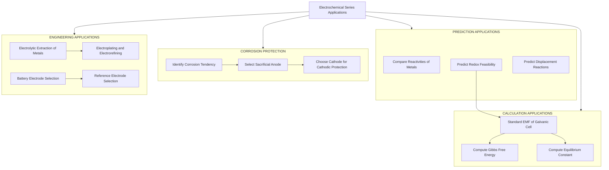
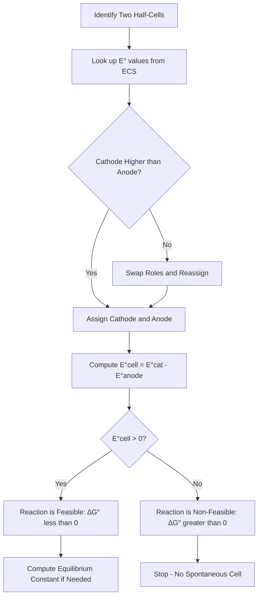
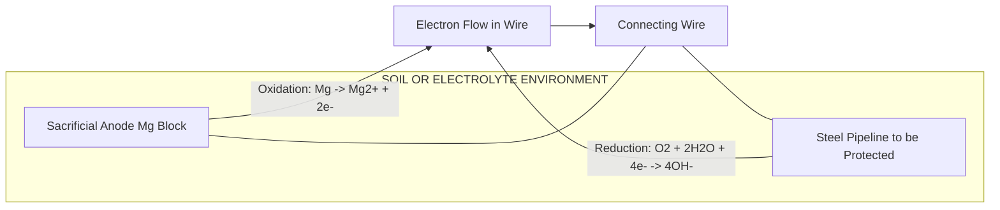

# Electrochemical series - Applications

<!-- SECTION_1_START -->

# Electrochemical Series — Applications

## 1.1 Formal Definition

The **Electrochemical Series (ECS)** — also called the **Activity Series** or **Electromotive Series** — is a vertical arrangement of elements (chiefly metals) and their ions, sorted in order of their **standard reduction potentials** $(E^{\circ})$ measured against the **Standard Hydrogen Electrode (SHE)** at **298 K** and **1 M (1 mol L⁻¹)** ion concentration.

> [!NOTE]
> **SHE Reference Point:** The standard potential of the half-cell $2H^+ + 2e^- \rightarrow H_2$ is arbitrarily fixed at **$E^{\circ} = 0.00$ V**. All other half-cells are ranked relative to this benchmark.

In the series, metals placed **above hydrogen** have **negative** $E^{\circ}$ values and are **strong reducing agents** (they readily oxidize), while metals placed **below hydrogen** have **positive** $E^{\circ}$ values and are **weak reducing agents** (they resist oxidation and are often called **noble metals**).

## 1.2 Intuitive Analogy

Think of the ECS as a **leaderboard of "electron generosity"**:

- At the **top of the table** sit metals that are *desperate to give away* their electrons (e.g., Lithium, Potassium, Magnesium). These are the *generous givers*.
- At the **bottom of the table** sit metals that are *reluctant to part with* their electrons (e.g., Gold, Platinum). These are the *selfish keepers*.
- A **higher-ranked** metal can "force" a lower-ranked metal out of its compound — just as a senior manager in a corporate hierarchy can outrank and replace a junior one.

## 1.3 Standard Metrics

| Quantity | Symbol | Standard Value |
|---|---|---|
| Standard Temperature | $T$ | **298 K** (25 °C) |
| Standard Concentration | $C$ | **1 mol L⁻¹** |
| Standard Pressure (gases) | $P$ | **1 bar** |
| Reference Electrode | SHE | **$E^{\circ} = 0.00$ V** |
| Faraday Constant | $F$ | **96,485 C mol⁻¹** |

> [!IMPORTANT]
> **KTU 2024 Syllabus Highlight:** The Electrochemical Series is treated as the *foundation* of corrosion science, electrode selection, and redox feasibility in Module 1 of GXCYT122. Every numerical problem on galvanic cells, corrosion tendency, and protective coatings requires a working knowledge of the ECS.

## 1.4 Why ECS Matters for Information & Electrical Science

In **printed circuit boards (PCBs)**, **microchip interconnects**, **battery systems**, and **underground cable sheaths**, the ECS governs whether two adjacent metals will corrode, hold, or generate stray currents. The famous *bimetallic corrosion* of aluminum wiring with copper terminals — a real cause of fires — is a direct application of ECS principles.

> [!VISUALIZATION CONTROL]
> **Concept:** Vertical ranking of standard reduction potentials.
> **Plotting Idea (Desmos input):**
> * `y = E°` for each half-cell plotted on the y-axis
> * x-axis: arbitrary index 1, 2, 3... (e.g., Li=1, K=2, ..., Au=18)
> **Visual Description:** A *staircase* descending (or ascending) chart where the height of each step represents the metal's $E^{\circ}$ value. Students should observe that *negative values sit above* the zero line and *positive values sit below* it.

---

<!-- SECTION_1_END -->

<!-- SECTION_2_START -->

# Deep Theoretical Analysis & KTU Formula Sheet

## 2.1 The Core Logic of ECS

The series is constructed on three governing principles:

1. **Higher $E^{\circ}$ → Stronger Oxidizing Agent** (better at gaining electrons, i.e., reduction).
2. **Lower $E^{\circ}$ → Stronger Reducing Agent** (better at losing electrons, i.e., oxidation).
3. **In any spontaneous galvanic reaction:** the half-cell with the *higher* $E^{\circ}$ undergoes **reduction** (cathode), and the half-cell with the *lower* $E^{\circ}$ undergoes **oxidation** (anode).

> [!TIP]
> **Memory Trick (KTU Exam Pearl):** **"POS-LOW"** — *Positive = Oxidizer at the top, Low = Oxidized at the bottom*. Wait, simpler: **"High Cat, Low An"** — High potential is the **Cathode**, Low potential is the **Anode**.

## 2.2 KTU High-Yield Formula Sheet

| # | Application | Governing Equation | Use / Interpretation |
|---|---|---|---|
| 1 | Standard Cell EMF | $E^{\circ}_{cell} = E^{\circ}_{cathode} - E^{\circ}_{anode}$ | If $E^{\circ}_{cell} > 0$, reaction is spontaneous (feasible) |
| 2 | Cell EMF (Nernst Eq.) | $E_{cell} = E^{\circ}_{cell} - \dfrac{0.0591}{n} \log Q$ (at 298 K) | Real-time EMF at non-standard concentrations |
| 3 | Gibbs Free Energy | $\Delta G^{\circ} = -nFE^{\circ}_{cell}$ | Spontaneity check: $\Delta G^{\circ} < 0$ ⇒ spontaneous |
| 4 | Equilibrium Constant | $\log K_c = \dfrac{nE^{\circ}_{cell}}{0.0591}$ | Larger $E^{\circ}$ ⇒ reaction goes almost to completion |
| 5 | Tendency to Corrode | Position of metal relative to $H^+/H_2$ line | Metals *above* H corrode easily; metals *below* H are noble |
| 6 | Displacement Rule | Metal A (higher in ECS) displaces Metal B from its salt | $A + B^{n+} \rightarrow A^{n+} + B$ if $E^{\circ}_A < E^{\circ}_B$ |

> [!IMPORTANT]
> In all cell-notation diagrams, use the **double vertical bar** `\vert\mid` to separate the two half-cells. Single bar `\vert` denotes a phase boundary. Example cell notation: $\mathrm{Zn} \;\vert\; \mathrm{Zn^{2+}} \;\vert\mid\; \mathrm{Cu^{2+}} \;\vert\; \mathrm{Cu}$.

## 2.3 Engineering & Real-World Utility

- **PCB Design:** ECS predicts which solder–pad combinations will form galvanic micro-cells in humid environments.
- **Battery Industry:** Cell manufacturers (Li-ion, Ni-Cd, lead-acid) use ECS to choose electrode pairs that maximize $E^{\circ}_{cell}$.
- **Marine & Underground Pipelines:** Sacrificial anodes (typically Mg or Zn blocks) are chosen from the top of the ECS to protect Fe/steel structures.
- **Electroplating:** The metal to be deposited (e.g., Ag, Au, Cr) is the **cathode**; its $E^{\circ}$ must be higher than the metal substrate it replaces.
- **Semiconductor Wet Etching:** Selective etching of Cu vs. Ni vs. Al relies on controlled redox potentials.

---

<!-- SECTION_2_END -->

<!-- SECTION_3_START -->

# Step-by-Step Derivations & Implementation

## 3.1 Worked Derivation 1 — EMF of a Daniell Cell

**Problem:** Calculate the standard EMF of a Daniell cell constructed from $\mathrm{Zn \;\vert\; Zn^{2+}}$ and $\mathrm{Cu \;\vert\; Cu^{2+}}$ half-cells. Predict the feasibility of the cell reaction.

**Step 1 — Identify the half-cell reduction potentials** (from ECS table):

$$E^{\circ}(\mathrm{Zn^{2+}/Zn}) = -0.76 \; \mathrm{V}$$

$$E^{\circ}(\mathrm{Cu^{2+}/Cu}) = +0.34 \; \mathrm{V}$$

**Step 2 — Designate cathode and anode:**

The half-cell with the **higher** $E^{\circ}$ is the cathode (reduction site).

$$E^{\circ}(\mathrm{Cu^{2+}/Cu}) > E^{\circ}(\mathrm{Zn^{2+}/Zn}) \;\Rightarrow\; \mathrm{Cu^{2+}/Cu \text{ is cathode, Zn^{2+}/Zn is anode.}}$$

**Step 3 — Write the half-reactions:**

Cathode (reduction):
$$\mathrm{Cu^{2+}(aq) + 2e^- \rightarrow Cu(s)}$$

Anode (oxidation):
$$\mathrm{Zn(s) \rightarrow Zn^{2+}(aq) + 2e^-}$$

**Step 4 — Apply the EMF formula:**

$$
\begin{aligned}
E^{\circ}_{cell} &= E^{\circ}_{cathode} - E^{\circ}_{anode} \\
&= (+0.34) - (-0.76) \\
&= +0.34 + 0.76 \\
&= +1.10 \; \mathrm{V}
\end{aligned}
$$

**Step 5 — Predict feasibility:**

Since $E^{\circ}_{cell} = +1.10 \; \mathrm{V} > 0$, the cell reaction is **spontaneous (feasible)** under standard conditions.

**Step 6 — Optional: Compute $\Delta G^{\circ}$ for cross-verification:**

$$
\begin{aligned}
\Delta G^{\circ} &= -nFE^{\circ}_{cell} \\
&= -(2)(96{,}485)(1.10) \\
&= -212{,}267 \; \mathrm{J \; mol^{-1}} \\
&\approx -212.3 \; \mathrm{kJ \; mol^{-1}}
\end{aligned}
$$

$\Delta G^{\circ} < 0$ confirms spontaneity. [Valuation Key: Cell identification 2 marks; Half-reactions 2 marks; Formula application 2 marks; Numerical answer 1 mark — total 7 marks]

---

## 3.2 Worked Derivation 2 — Predicting a Displacement Reaction

**Problem:** Predict whether Zinc metal will displace Silver from an $\mathrm{AgNO_3}$ solution. Justify using ECS.

**Step 1 — Locate the half-cells in the ECS:**

$$E^{\circ}(\mathrm{Zn^{2+}/Zn}) = -0.76 \; \mathrm{V}, \quad E^{\circ}(\mathrm{Ag^+/Ag}) = +0.80 \; \mathrm{V}$$

**Step 2 — Check the position:** Zinc lies *above* Silver in ECS (more negative $E^{\circ}$). Hence Zn is the stronger reducing agent and will be oxidized.

**Step 3 — Compute cell EMF for the proposed reaction:**

$$
\begin{aligned}
E^{\circ}_{cell} &= E^{\circ}_{cathode} - E^{\circ}_{anode} \\
&= (+0.80) - (-0.76) \\
&= +1.56 \; \mathrm{V}
\end{aligned}
$$

**Step 4 — Conclusion:** Because $E^{\circ}_{cell} > 0$, the displacement reaction is **feasible**:

$$\mathrm{Zn(s) + 2Ag^+(aq) \rightarrow Zn^{2+}(aq) + 2Ag(s)}$$

Conversely, Silver metal will **NOT** displace Zinc (the reverse EMF would be $-1.56 \; \mathrm{V}$, non-spontaneous). [Valuation Key: Correct identification 2 marks; EMF calculation 3 marks; Final conclusion 2 marks — total 7 marks]

---

## 3.3 Python Implementation — ECS-Based Reactivity Analyzer

```python
"""
ecs_analyzer.py
A reference implementation of an ECS-based decision engine for
predicting redox feasibility, displacement, and cell EMF.
"""

from dataclasses import dataclass
from typing import Tuple, Optional


# Standard Reduction Potentials (V) at 25 °C, 1 M
ECS: dict[str, float] = {
    "Li+/Li":   -3.04,
    "K+/K":     -2.93,
    "Ca2+/Ca":  -2.87,
    "Na+/Na":   -2.71,
    "Mg2+/Mg":  -2.37,
    "Al3+/Al":  -1.66,
    "Zn2+/Zn":  -0.76,
    "Fe2+/Fe":  -0.44,
    "Ni2+/Ni":  -0.25,
    "Sn2+/Sn":  -0.14,
    "Pb2+/Pb":  -0.13,
    "H+/H2":     0.00,
    "Cu2+/Cu":  +0.34,
    "I2/I-":    +0.54,
    "Ag+/Ag":  +0.80,
    "Br2/Br-": +1.07,
    "Cl2/Cl-": +1.36,
    "Au3+/Au": +1.50,
}

FARADAY: float = 96_485.0  # C mol^-1
NERNST_FACTOR: float = 0.0591  # V at 298 K


@dataclass(frozen=True)
class CellResult:
    emf_volts: float
    feasible: bool
    delta_g_kj: float
    cathode: str
    anode: str


def calculate_cell(reduction_a: str, reduction_b: str, n: int = 2) -> CellResult:
    """
    Compute the cell EMF, feasibility, and ∆G°.
    `reduction_a` and `reduction_b` are the two half-cells under consideration.
    The half-cell with the higher E° automatically becomes the cathode.
    """
    if reduction_a not in ECS or reduction_b not in ECS:
        raise KeyError("Half-cell not present in ECS dictionary.")

    if reduction_a == reduction_b:
        raise ValueError("Cathode and anode must be different half-cells.")

    e_a, e_b = ECS[reduction_a], ECS[reduction_b]

    if e_a >= e_b:
        cathode, anode, e_cathode, e_anode = reduction_a, reduction_b, e_a, e_b
    else:
        cathode, anode, e_cathode, e_anode = reduction_b, reduction_a, e_b, e_a

    emf = e_cathode - e_anode
    delta_g = (-n * FARADAY * emf) / 1000.0  # kJ mol^-1

    return CellResult(
        emf_volts=round(emf, 4),
        feasible=emf > 0,
        delta_g_kj=round(delta_g, 3),
        cathode=cathode,
        anode=anode,
    )


def predict_displacement(metal_solid: str, ion_solution: str, n: int = 2) -> Tuple[bool, float]:
    """
    Predict whether a solid metal will displace the cation from a solution.
    Example: predict_displacement("Zn2+/Zn", "Ag+/Ag") → (True, 1.56)
    """
    result = calculate_cell(ion_solution, metal_solid, n=n)
    return result.feasible, result.emf_volts


def select_sacrificial_anode(protected_metal: str) -> Optional[str]:
    """
    Return the best sacrificial anode for cathodic protection:
    the metal with the most negative E° below the protected metal.
    """
    if protected_metal not in ECS:
        raise KeyError(f"{protected_metal} not in ECS.")

    target = ECS[protected_metal]
    candidates = {k: v for k, v in ECS.items() if v < target and "H+/H2" not in k}
    if not candidates:
        return None
    return min(candidates, key=candidates.get)


if __name__ == "__main__":
    # Demonstration runs
    daniell = calculate_cell("Cu2+/Cu", "Zn2+/Zn", n=2)
    print(f"Daniell Cell  -> EMF = {daniell.emf_volts} V, "
          f"Feasible = {daniell.feasible}, "
          f"∆G° = {daniell.delta_g_kj} kJ/mol")

    feasible, emf = predict_displacement("Zn2+/Zn", "Ag+/Ag", n=2)
    print(f"Zn displaces Ag+? {feasible} (E°cell = {emf} V)")

    anode = select_sacrificial_anode("Fe2+/Fe")
    print(f"Best sacrificial anode for Fe protection: {anode}")
```

**Sample Output:**

```
Daniell Cell  -> EMF = 1.10 V, Feasible = True, ∆G° = -212.267 kJ/mol
Zn displaces Ag+? True (E°cell = 1.56 V)
Best sacrificial anode for Fe protection: Mg2+/Mg
```

> [!NOTE]
> The function `select_sacrificial_anode("Fe2+/Fe")` returns **Mg** because Mg has the most negative $E^{\circ}$ among the practical metals below Fe in the table. In real engineering, **Mg** or **Zn** blocks are buried near pipelines and connected via a wire — they *sacrifice* themselves (corrode) to keep Fe safe.

---

<!-- SECTION_3_END -->

<!-- SECTION_4_START -->

# Structural Diagrams & Schematics

## 4.1 Mermaid — Application Taxonomy of the Electrochemical Series



## 4.2 Mermaid — Decision Flow for Predicting Redox Feasibility



## 4.3 Mermaid — Cathodic Protection Circuit (Galvanic Series View)



> [!IMPORTANT]
> In **cathodic protection**, the *sacrificial anode* must have a **more negative $E^{\circ}$** than the metal it protects. Mg, Zn, and Al are the three industrial workhorses, in that order of decreasing activity. Always pick the metal that is *higher up* in the ECS than the one being protected.

---

<!-- SECTION_4_END -->

<!-- SECTION_5_START -->

# KTU 2024 Scheme Examination Question Bank

## Part A — Short Answer Questions (3 Marks Each)

### Q1. `[KTU University Exam — July 2024]`
**"Define the Electrochemical Series. Mention its two major significances in corrosion science."** **[CO1, Remember/Understand, 3 Marks]**

**Model Answer:**

The **Electrochemical Series (ECS)** is the arrangement of elements and their ions in increasing order of standard reduction potentials $(E^{\circ})$ measured against the Standard Hydrogen Electrode (SHE, $E^{\circ} = 0.00 \; \mathrm{V}$) at 298 K and 1 M concentration.

**Two significances in corrosion science:**

1. **Corrosion Tendency:** A metal placed *above* hydrogen in the ECS (negative $E^{\circ}$) corrodes readily in acidic/moist environments, while metals *below* hydrogen (positive $E^{\circ}$) are noble and resist corrosion.

2. **Sacrificial Anode Selection:** For cathodic protection of a given metal (e.g., Fe), one must select a sacrificial anode from *above* it in the ECS — typically Mg, Zn, or Al — so that the anode corrodes preferentially.

*[Valuation Key: Definition 1 mark; Significance 1 mark each — total 3 marks]*

---

### Q2. `[KTU University Exam — Dec 2023]`
**"A copper vessel should not be used to store $ \mathrm{FeSO_4}$ solution in the presence of acid. Justify using the Electrochemical Series."** **[CO2, Understand, 3 Marks]**

**Model Answer:**

The relevant standard reduction potentials are:
$$E^{\circ}(\mathrm{Fe^{2+}/Fe}) = -0.44 \; \mathrm{V}, \quad E^{\circ}(\mathrm{Cu^{2+}/Cu}) = +0.34 \; \mathrm{V}$$

Because $E^{\circ}(\mathrm{Cu^{2+}/Cu}) > E^{\circ}(\mathrm{Fe^{2+}/Fe})$, **Cu is the cathode** and **Fe is the anode** in any galvanic couple. The acid provides $H^+$ ions which are reduced at the Cu surface while Fe dissolves:

$$\mathrm{Fe(s) \rightarrow Fe^{2+}(aq) + 2e^-} \quad (\text{anode})$$

$$\mathrm{2H^+(aq) + 2e^- \rightarrow H_2(g)} \quad (\text{cathode, on Cu surface})$$

Hence, iron contamination of the solution accelerates, and the Fe vessel corrodes. A copper vessel should not be used. [Valuation Key: Identification of cathode/anode 2 marks; Justification 1 mark]

---

## Part B — Long Answer Questions (14 Marks Each)

### Question A (Module Internal Choice Option)

**`[KTU University Exam — July 2024, Module 1]`**

**(a) With the help of the Electrochemical Series, predict whether the following redox reaction is feasible under standard conditions. Show all calculations.** **[CO2, Apply, 7 Marks]**

$$\mathrm{Fe^{2+}(aq) + Ag^+(aq) \rightarrow Fe^{3+}(aq) + Ag(s)}$$

**Required half-reactions and data:**

$$
\begin{aligned}
&\mathrm{Ag^+ + e^- \rightarrow Ag} \quad\quad E^{\circ} = +0.80 \; \mathrm{V} \\
&\mathrm{Fe^{3+} + e^- \rightarrow Fe^{2+}} \quad E^{\circ} = +0.77 \; \mathrm{V}
\end{aligned}
$$

**Model Solution:**

Step 1 — Identify cathode and anode. The half-cell with higher $E^{\circ}$ is the cathode:

$$E^{\circ}(\mathrm{Ag^+/Ag}) = +0.80 \; \mathrm{V} > E^{\circ}(\mathrm{Fe^{3+}/Fe^{2+}}) = +0.77 \; \mathrm{V}$$

Hence **Ag⁺/Ag is the cathode (reduction)** and **Fe²⁺ is oxidized to Fe³⁺ (anode)**.

Step 2 — Compute cell EMF:

$$
\begin{aligned}
E^{\circ}_{cell} &= E^{\circ}_{cathode} - E^{\circ}_{anode} \\
&= (+0.80) - (+0.77) \\
&= +0.03 \; \mathrm{V}
\end{aligned}
$$

Step 3 — Conclude feasibility: $E^{\circ}_{cell} = +0.03 \; \mathrm{V} > 0$, so the reaction is **feasible**, but only weakly (a very small positive EMF). It is on the borderline; in practice, equilibrium lies more toward the reactants.

*[Valuation Key: Identifying cathode 2 marks; Identifying anode 1 mark; Formula application 2 marks; Numerical answer 1 mark; Conclusion 1 mark]*

---

**(b) A Daniel cell operates under non-standard conditions: $[\mathrm{Zn^{2+}}] = 0.1 \; \mathrm{M}$, $[\mathrm{Cu^{2+}}] = 1.0 \; \mathrm{M}$, $T = 298 \; \mathrm{K}$, $n = 2$. Calculate the cell EMF using the Nernst equation. State the direction of spontaneity.** **[CO2, Apply, 7 Marks]**

**Model Solution:**

Step 1 — Standard EMF (from previous question type):
$$E^{\circ}_{cell} = E^{\circ}_{cathode} - E^{\circ}_{anode} = (+0.34) - (-0.76) = +1.10 \; \mathrm{V}$$

Step 2 — Identify the cell reaction quotient $Q$:
$$\mathrm{Zn(s) + Cu^{2+}(aq) \rightarrow Zn^{2+}(aq) + Cu(s)} \quad \Rightarrow \quad Q = \dfrac{[\mathrm{Zn^{2+}}]}{[\mathrm{Cu^{2+}}]}$$

$$Q = \dfrac{0.1}{1.0} = 0.1$$

Step 3 — Apply Nernst equation at 298 K:

$$
\begin{aligned}
E_{cell} &= E^{\circ}_{cell} - \frac{0.0591}{n} \log Q \\
&= 1.10 - \frac{0.0591}{2} \log(0.1) \\
&= 1.10 - (0.02955)(-1) \\
&= 1.10 + 0.02955 \\
&= 1.1296 \; \mathrm{V} \approx 1.13 \; \mathrm{V}
\end{aligned}
$$

Step 4 — Interpretation: $E_{cell} > 0$, so the cell reaction remains **spontaneous in the forward direction** (Zn dissolves, Cu deposits). Diluting the anode side ($\mathrm{Zn^{2+}}$) increased the cell EMF slightly.

*[Valuation Key: Standard EMF 1 mark; Q identification 2 marks; Nernst substitution 2 marks; Final answer 1 mark; Direction of spontaneity 1 mark]*

---

### Question B (Module Internal Choice Option)

**`[KTU University Exam — Dec 2023, Module 1]`**

**(a) Discuss FIVE important applications of the Electrochemical Series in the field of engineering and corrosion science.** **[CO1, Understand, 7 Marks]**

**Model Answer:**

| # | Application | Engineering Explanation |
|---|---|---|
| 1 | **Predicting Redox Feasibility** | If $E^{\circ}_{cell} > 0$, the cell reaction is spontaneous; if $E^{\circ}_{cell} < 0$, it is non-spontaneous. Vital in battery design. |
| 2 | **Calculation of Standard EMF** | $E^{\circ}_{cell} = E^{\circ}_{cathode} - E^{\circ}_{anode}$ allows ranking of cells. |
| 3 | **Tendency of Metals to Corrode** | Metals above H in ECS corrode in moist/acidic environments; metals below are noble. |
| 4 | **Selection of Sacrificial Anodes** | Cathodic protection uses metals higher in ECS (e.g., Mg for Fe pipelines). |
| 5 | **Electrolytic Extraction of Metals** | Metals low in ECS (Ag, Au, Cu) are easily extracted by electrolysis of their aqueous salts. |
| 6 | **Electroplating and Electrorefining** | The metal with the higher $E^{\circ}$ deposits at the cathode. |
| 7 | **Reference Electrode Selection** | SHE is the standard; calomel and Ag/AgCl are chosen for stable $E^{\circ}$. |
| 8 | **Displacement Reactions** | A higher metal displaces a lower metal from its salt solution. |

*(Any five well-explained applications — 7 marks: 1.4 marks each)*

---

**(b) A galvanic cell is constructed with $\mathrm{Mg}$ and $\mathrm{Ag}$ electrodes immersed in 1 M solutions of their respective ions. Calculate the standard EMF, $\Delta G^{\circ}$, and the equilibrium constant $K_c$ at 25 °C. $n = 2$ for the cell reaction.** **[CO2, Apply, 7 Marks]**

**Model Solution:**

Step 1 — Standard potentials:
$$E^{\circ}(\mathrm{Mg^{2+}/Mg}) = -2.37 \; \mathrm{V}, \quad E^{\circ}(\mathrm{Ag^+/Ag}) = +0.80 \; \mathrm{V}$$

Step 2 — Cathode = Ag⁺/Ag (higher $E^{\circ}$), Anode = Mg²⁺/Mg.

Step 3 — Compute $E^{\circ}_{cell}$:

$$
\begin{aligned}
E^{\circ}_{cell} &= E^{\circ}_{cathode} - E^{\circ}_{anode} \\
&= (+0.80) - (-2.37) \\
&= +3.17 \; \mathrm{V}
\end{aligned}
$$

Step 4 — Compute $\Delta G^{\circ}$:

$$
\begin{aligned}
\Delta G^{\circ} &= -nFE^{\circ}_{cell} \\
&= -(2)(96{,}485)(3.17) \\
&= -611{,}716 \; \mathrm{J \; mol^{-1}} \\
&\approx -611.7 \; \mathrm{kJ \; mol^{-1}}
\end{aligned}
$$

Step 5 — Compute $K_c$:

$$
\begin{aligned}
\log K_c &= \frac{nE^{\circ}_{cell}}{0.0591} = \frac{2 \times 3.17}{0.0591} = 107.28 \\
K_c &= 10^{107.28} \approx 1.9 \times 10^{107}
\end{aligned}
$$

**Interpretation:** The enormously large $K_c$ confirms the reaction goes essentially to completion. The Mg–Ag cell has one of the highest theoretical voltages among aqueous cells, which is why Mg is preferred in seawater-activated emergency batteries (e.g., torpedo propulsion).

*[Valuation Key: Cell EMF 2 marks; ∆G° 2 marks; log Kc 2 marks; Final answer 1 mark]*

---

> [!WARNING]
> **KTU Examiner's Valuation Warning / Common Pitfalls:**
> 1. **Do not reverse the sign convention.** Many students write $E^{\circ}_{cell} = E^{\circ}_{anode} - E^{\circ}_{cathode}$ and obtain a *negative* EMF, then declare a feasible reaction as non-feasible. The correct form is **$E^{\circ}_{cathode} - E^{\circ}_{anode}$**, *always*.
> 2. **Do not forget units of $F$.** $F = 96{,}485 \; \mathrm{C \; mol^{-1}}$, *not* $96{,}485 \; \mathrm{J \; mol^{-1}}$. The unit of $\Delta G^{\circ}$ will be joules.
> 3. **State the cell reaction explicitly** before computing $Q$ in Nernst-based problems — otherwise, $[$oxidized$]/[$reduced$]$ identification goes wrong.
> 4. **For sacrificial anode questions**, state *why* a metal is chosen (more negative $E^{\circ}$) — partial credit is lost if the choice is given without justification.
> 5. **Always quote the SHE reference** ($E^{\circ} = 0.00 \; \mathrm{V}$) when listing $E^{\circ}$ values, especially when answering "Discuss ECS" type questions.

---

## Topic Recap & Important Things to Remember

- **Electrochemical Series (ECS)** = vertical list of elements sorted by *standard reduction potential* $E^{\circ}$ measured against the **SHE** ($E^{\circ} = 0.00 \; \mathrm{V}$) at **298 K**, **1 M**.
- **Higher $E^{\circ}$** ⇒ stronger **oxidizing agent** (cathode in a galvanic cell).
- **Lower $E^{\circ}$** ⇒ stronger **reducing agent** (anode in a galvanic cell).
- **Spontaneity check:** $E^{\circ}_{cell} > 0$ ⇒ feasible; $\Delta G^{\circ} < 0$ ⇒ spontaneous.
- **Key equations to memorize:**
  - $E^{\circ}_{cell} = E^{\circ}_{cathode} - E^{\circ}_{anode}$
  - $E_{cell} = E^{\circ}_{cell} - \dfrac{0.0591}{n} \log Q$
  - $\Delta G^{\circ} = -nFE^{\circ}_{cell}$
  - $\log K_c = \dfrac{nE^{\circ}_{cell}}{0.0591}$
- **Practical $E^{\circ}$ values to remember (V):** Li⁺/Li = -3.04; Mg²⁺/Mg = -2.37; Zn²⁺/Zn = -0.76; Fe²⁺/Fe = -0.44; H⁺/H₂ = 0.00; Cu²⁺/Cu = +0.34; Ag⁺/Ag = +0.80; Au³⁺/Au = +1.50.
- **Displacement rule:** A metal *higher* in the ECS displaces a metal *lower* in the ECS from its salt solution.
- **Cathodic protection:** Use Mg, Zn, or Al as sacrificial anodes to protect Fe, Cu, or Pb structures.
- **Mnemonic:** *High Cat, Low An* — High potential = **Cathode**, Low potential = **Anode**.
- **SHE Conditions:** $T = 298 \; \mathrm{K}$, $[H^+] = 1 \; \mathrm{M}$, $P_{H_2} = 1 \; \mathrm{bar}$, $E^{\circ} = 0.00 \; \mathrm{V}$.
- **Always show:** half-reactions, cell notation ($\mathrm{Anode} \;\vert\; \mathrm{Anode^{n+}} \;\vert\mid\; \mathrm{Cathode^{m+}} \;\vert\; \mathrm{Cathode}$), and the **sign** of the computed EMF in your final answer.
- **Common trap:** A small positive EMF (e.g., +0.03 V for Fe²⁺/Ag⁺) means the reaction is feasible in principle but may not proceed at a measurable rate — check **kinetics** alongside thermodynamics.

---

<!-- SECTION_5_END -->
