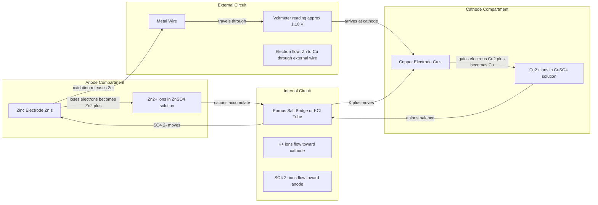
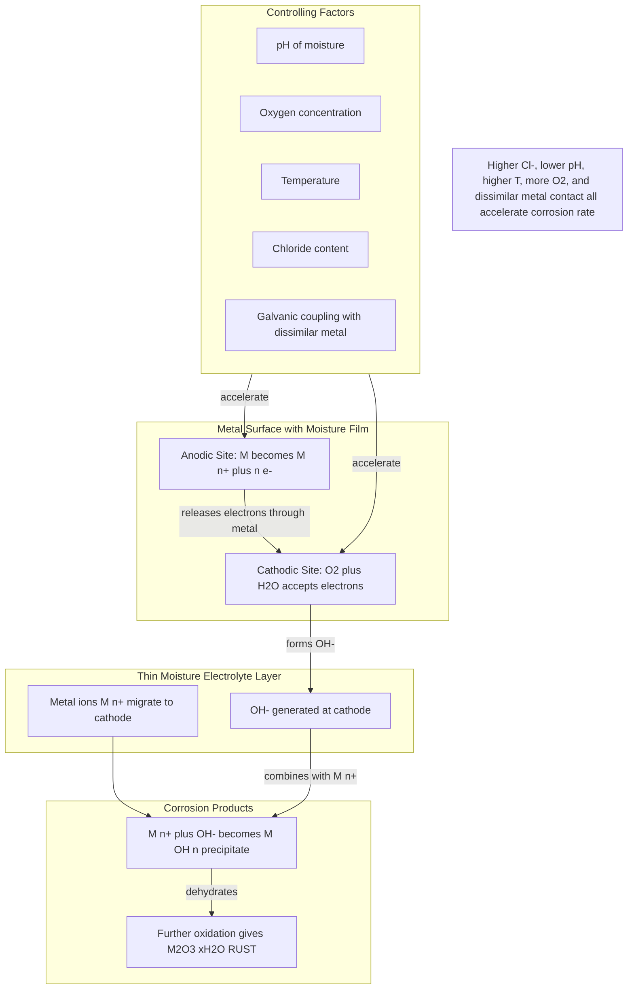
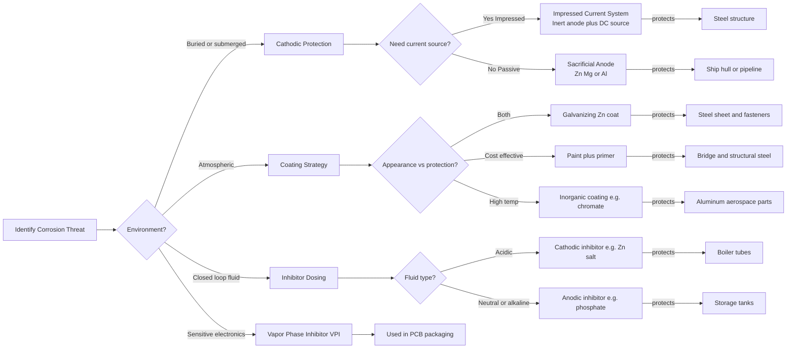
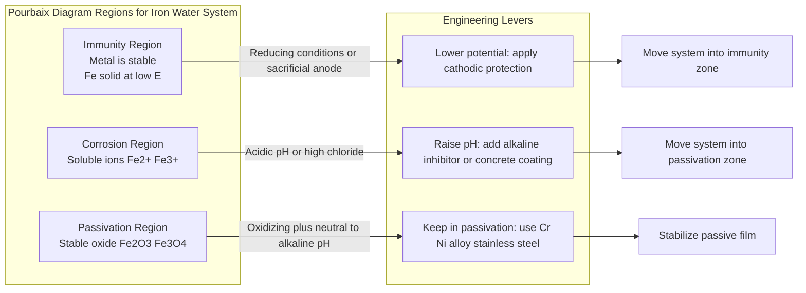

# Electrochemistry and Corrosion Science

<!-- SECTION_1_START -->

# Electrochemistry and Corrosion Science

## 1.1 Core Technical Definition

**Electrochemistry** is the branch of physical chemistry that deals with the relationship between electrical energy and chemical change. It studies the interconversion of chemical energy and electrical energy through redox (oxidation–reduction) reactions occurring at the interface of an electrode and an electrolyte.

**Corrosion** is the spontaneous, irreversible deterioration of a metal (or alloy) caused by its chemical or electrochemical reaction with the surrounding environment, leading to the formation of stable compounds such as oxides, hydroxides, sulfides, or carbonates. From a thermodynamic perspective, corrosion represents the natural tendency of a refined metal to revert to its more stable oxide (ore) form.

> [!IMPORTANT]
> **KTU 2024 Syllabus Highlight (GXCYT122 – Module 1):**
> The module covers electrochemical cells, Nernst equation, reference electrodes, EMF measurement, types and mechanisms of corrosion, factors influencing corrosion, and corrosion control strategies including cathodic protection, metallic and non-metallic coatings, and inhibitors. Application emphasis is placed on **electronics and electrical engineering contexts** such as battery design, printed circuit board (PCB) reliability, and prevention of oxidation in conductors and contacts.

## 1.2 Intuitive Overview & Real-World Analogy

**Analogy 1 — Electrochemistry as a "Chemical Pump":**
Imagine two buckets of water at different heights connected by a pipe. Water naturally flows from the higher bucket to the lower one, releasing energy that can turn a small wheel. In an electrochemical cell, the two "buckets" are two metals with different tendencies to lose electrons. The metal that more readily gives up electrons (zinc, for example) acts as the higher bucket, pushing electrons through an external wire to the more noble metal (copper). This flow of electrons is what we call **electric current**, and it is exactly what powers every battery on Earth.

**Analogy 2 — Corrosion as "Iron Returning Home":**
Iron ore (Fe₂O₃) is iron's natural, stable resting state. To make an iron nail, we humans have to **pump energy in** during smelting to force the iron into its unstable, pure metallic form. Once exposed to moist air, the nail "remembers" its original ore state and slowly **rusts** (forms Fe₂O₃·xH₂O) — releasing the energy that was originally invested. Corrosion is essentially the metal giving up the energy we once stored in it.

> [!NOTE]
> **Why this matters in Electrical & Information Science Engineering:**
> - **PCB Failure:** Corrosion of copper tracks on printed circuit boards leads to open circuits.
> - **Connector Degradation:** Oxidation of metal contacts increases contact resistance, causing signal loss.
> - **Battery Operation:** Every lithium-ion, lead-acid, or fuel cell relies entirely on electrochemistry.
> - **Sensor Drift:** Reference electrodes in pH and ion sensors degrade due to corrosion.

> [!VISUALIZATION CONTROL]
> **Concept:** Electrochemical potential scale showing relative positions of common metals.
> **Desmos Input Equations:**
> * `y = m*x + b` with point list: `(Zn, -0.76)`, `(Fe, -0.44)`, `(Ni, -0.25)`, `(H, 0.00)`, `(Cu, +0.34)`, `(Ag, +0.80)`, `(Au, +1.50)`
> **Visual Description:** A vertical potential axis (V vs SHE) on the y-axis, with metals placed at their standard reduction potentials. Lower (more negative) metals corrode more readily when in contact with higher (more positive) metals in the presence of an electrolyte.

<!-- SECTION_1_END -->

<!-- SECTION_2_START -->

# Deep Theoretical Analysis & KTU Formula Sheet

## 2.1 Electrochemical Cells — Operational Breakdown

An **electrochemical cell** consists of two half-cells connected by:
1. An **external circuit** (wire) for electron flow.
2. An **internal salt bridge** or porous pot for ion flow (completes the circuit).

### 2.1.1 Galvanic (Voltaic) Cell
- Converts **chemical energy → electrical energy** (spontaneous, $\Delta G < 0$).
- Example: **Daniel Cell** — Zn(s) $\vert$ ZnSO₄(aq) $\Vert$ CuSO₄(aq) $\vert$ Cu(s)
- At the **anode** (oxidation): Zn → Zn²⁺ + 2e⁻
- At the **cathode** (reduction): Cu²⁺ + 2e⁻ → Cu
- Net reaction: Zn + Cu²⁺ → Zn²⁺ + Cu

### 2.1.2 Electrolytic Cell
- Converts **electrical energy → chemical energy** (non-spontaneous, $\Delta G > 0$).
- Requires an external DC power source (electrolytic refining, electroplating, electrorefining of copper).
- The cathode is connected to the negative terminal of the battery and the anode to the positive terminal (polarity reversed from galvanic cell).

## 2.2 Electrode Potential and EMF

The **electrode potential ($E$)** is the measure of the tendency of an electrode to lose or gain electrons when in contact with its own ions at 1 M concentration, 1 atm pressure, and 25 °C (**298 K**). It is measured relative to the **Standard Hydrogen Electrode (SHE)**, which is assigned a potential of **0.00 V**.

The **Electromotive Force (EMF or $E_{cell}$)** of a cell is the potential difference between the two electrodes when no current flows:

$$E_{cell} = E_{cathode} - E_{anode}$$

For a Daniel cell:
$$E_{cell} = E^{0}_{Cu^{2+}/Cu} - E^{0}_{Zn^{2+}/Zn} = (+0.34) - (-0.76) = +1.10 \text{ V}$$

A **positive $E_{cell}$** indicates a spontaneous (galvanic) reaction; a **negative $E_{cell}$** indicates a non-spontaneous (electrolytic) reaction.

## 2.3 The Nernst Equation — The Heart of Electrochemistry

The Nernst equation relates the cell potential under non-standard conditions to the standard potential and the concentrations (or partial pressures) of the reactants and products.

For a general reaction:
$$aA + bB \rightleftharpoons cC + dD$$

The Nernst equation is:
$$E_{cell} = E^{0}_{cell} - \frac{RT}{nF} \ln \frac{[C]^{c}[D]^{d}}{[A]^{a}[B]^{b}}$$

At standard temperature $T = 298 \text{ K}$, using $2.303 \log$ instead of $\ln$:

$$E_{cell} = E^{0}_{cell} - \frac{0.0591}{n} \log \frac{[C]^{c}[D]^{d}}{[A]^{a}[B]^{b}}$$

where:
- $R = 8.314 \text{ J K}^{-1}\text{mol}^{-1}$ (universal gas constant)
- $T$ = absolute temperature in Kelvin
- $n$ = number of moles of electrons transferred
- $F = 96500 \text{ C mol}^{-1}$ (Faraday's constant)
- $0.0591 = \frac{2.303 \, RT}{F}$ at 298 K

## 2.4 Reference Electrodes (KTU High-Yield)

| Electrode | Half-Reaction | Standard Potential $E^{0}$ (V) | Working Principle |
|---|---|---|---|
| **Standard Hydrogen Electrode (SHE)** | $2H^{+} + 2e^{-} \rightarrow H_{2}$ | **0.00 V** (reference) | H₂ gas at 1 atm over Pt in 1 M H⁺ |
| **Calomel Electrode (SCE)** | $Hg_{2}Cl_{2} + 2e^{-} \rightarrow 2Hg + 2Cl^{-}$ | **+0.244 V** (saturated KCl) | Mercury/mercurous chloride paste in KCl |
| **Silver/Silver Chloride** | $AgCl + e^{-} \rightarrow Ag + Cl^{-}$ | **+0.222 V** (saturated KCl) | Ag wire coated with AgCl in KCl |

> [!NOTE]
> **Why saturated KCl is used:** A saturated KCl salt bridge minimizes the **liquid junction potential** and maintains a constant chloride activity, ensuring a stable reference potential.

## 2.5 Corrosion — Mechanism and Thermodynamics

### 2.5.1 Electrochemical Corrosion Mechanism
Corrosion of a metal $M$ in a moist environment follows the principle of a short-circuited galvanic cell:

- **At the Anode (oxidation):** $M \rightarrow M^{n+} + ne^{-}$
- **At the Cathode (reduction):** Either oxygen absorption or hydrogen evolution.
  - In **acidic** (aerated) medium: $O_{2} + 4H^{+} + 4e^{-} \rightarrow 2H_{2}O$ ($E^{0} = +1.23$ V)
  - In **neutral/alkaline** medium: $O_{2} + 2H_{2}O + 4e^{-} \rightarrow 4OH^{-}$ ($E^{0} = +0.40$ V)
  - In **acidic, oxygen-free** medium: $2H^{+} + 2e^{-} \rightarrow H_{2}$ ($E^{0} = 0.00$ V)

### 2.5.2 Pourbaix Diagrams (E-pH Diagrams)
Pourbaix diagrams plot **electrode potential (E)** on the y-axis against **pH** on the x-axis for a given metal–water system. They identify three zones:
- **Immunity** — Metal is thermodynamically stable (no corrosion).
- **Corrosion** — Soluble metal ions are stable (corrosion occurs).
- **Passivation** — Stable solid oxide/hydroxide layer forms on the surface (protective).

## 2.6 Types of Corrosion (KTU High-Yield)

| Type | Description | Example / Location |
|---|---|---|
| **Uniform (General) Corrosion** | Even attack over the entire exposed surface | Rusting of iron sheets in atmosphere |
| **Galvanic (Bimetallic) Corrosion** | Preferential corrosion of the more active metal when two dissimilar metals are in electrical contact in an electrolyte | Steel rivet in a copper plate (marine) |
| **Pitting Corrosion** | Localized formation of small holes/pits due to breakdown of passive film | Stainless steel in chloride-rich seawater |
| **Crevice Corrosion** | Aggressive attack inside gaps or crevices where stagnant electrolyte exists | Under gasket, bolt heads, lap joints |
| **Intergranular Corrosion** | Preferential attack along grain boundaries due to chromium carbide precipitation | Weld regions of stainless steel (sensitization) |
| **Stress Corrosion Cracking (SCC)** | Combined action of tensile stress and corrosive environment | Brass in ammonia; stainless steel in hot chloride |
| **Erosion Corrosion** | Acceleration of corrosion by mechanical wear | Pump impellers, pipe bends |

## 2.7 Corrosion Prevention & Control

### 2.7.1 Cathodic Protection (CP)
The metal to be protected is forced to become the cathode of an electrochemical cell.
- **Sacrificial Anode Method:** A more active metal (Zn, Mg, Al) is connected to the structure. It corrodes preferentially (sacrificial). Used for ship hulls, buried pipelines.
- **Impressed Current Method:** An external DC source drives current from an inert anode (graphite, Ti) to the structure, suppressing anodic dissolution. Used for long pipelines, offshore platforms, water heaters.

### 2.7.2 Coatings
- **Metallic coatings:** Galvanizing (Zn on Fe), Tinning (Sn on Fe), Electroplating (Cr, Ni, Au, Ag on substrates).
  - **Sacrificial coating** (e.g., Zn): Protects even when scratched because Zn corrodes preferentially.
  - **Noble coating** (e.g., Sn, Cr): Protects only as long as the coating is intact; once scratched, Fe corrodes faster (galvanic couple).
- **Organic coatings:** Paints, lacquers, polymers, powder coatings.
- **Inorganic coatings:** Anodizing (Al → Al₂O₃), chromate conversion coatings.

### 2.7.3 Inhibitors
Chemical substances added in small amounts to the corrosive medium to reduce corrosion rate.
- **Anodic inhibitors:** Chromates, phosphates, nitrites (form protective film on anode).
- **Cathodic inhibitors:** Polyphosphates, Zn²⁺ salts.
- **Vapor-phase inhibitors (VPI):** Used for protecting electronics, PCBs, and instrument packaging.

### 2.7.4 Material Selection & Design
Using corrosion-resistant alloys (stainless steel, Inconel, Ti), avoiding sharp corners, eliminating crevices, ensuring proper drainage.

## 2.8 KTU High-Yield Formula Sheet

| Formula | Expression | Use |
|---|---|---|
| **Standard Cell EMF** | $E^{0}_{cell} = E^{0}_{cathode} - E^{0}_{anode}$ | Predict spontaneity of redox reaction |
| **Nernst Equation (general)** | $E_{cell} = E^{0}_{cell} - \frac{RT}{nF} \ln Q$ | Cell potential at non-standard conditions |
| **Nernst Equation (298 K)** | $E_{cell} = E^{0}_{cell} - \frac{0.0591}{n} \log Q$ | KTU exam-friendly form |
| **Faraday's First Law** | $m = Z \cdot I \cdot t = \frac{M \cdot I \cdot t}{n \cdot F}$ | Mass deposited/dissolved during electrolysis |
| **Faraday's Second Law** | $\frac{m_{1}}{m_{2}} = \frac{E_{1}}{E_{2}}$ | Masses deposited by the same charge |
| **Gibbs Free Energy** | $\Delta G = -nFE_{cell}$ | Spontaneity criterion |
| **Equilibrium Constant** | $\log K_{c} = \frac{n E^{0}_{cell}}{0.0591}$ | Extent of redox reaction |
| **Corrosion Rate (mdd)** | $\text{CR} = \frac{534 \cdot W}{D \cdot A \cdot T}$ | mg per dm² per day; $W$=mass loss (mg), $D$=density (g/cm³), $A$=area (in²), $T$=time (hr) |
| **Corrosion Rate (mpy)** | $\text{mpy} = \frac{534 \cdot W}{D \cdot A \cdot T}$ | mils per year |
| **Current Density** | $i_{corr} = \frac{0.0254 \cdot \text{mpy} \cdot D \cdot 96.5}{M}$ | A/cm² from weight loss |
| **Conductance** | $G = \kappa \cdot \frac{A}{l}$ | $\kappa$ = specific conductance, $A$ = area, $l$ = length |
| **Molar Conductivity** | $\Lambda_{m} = \frac{\kappa \cdot 1000}{c}$ | $\kappa$ in S/cm, $c$ in mol/L |

> [!IMPORTANT]
> **Engineering Utility:**
> - Nernst equation is the foundation of **pH meters**, **ion-selective electrodes**, **glucose sensors**, and **fuel cell** design.
> - Faraday's laws are critical for **electroplating thickness control** in PCB manufacturing and **electrorefining** of copper (yielding 99.99% pure Cu for electrical applications).
> - Cathodic protection is mandated by **IS 806, NACE, and ISO 15589** for all buried metallic pipelines carrying oil, gas, or water.

<!-- SECTION_2_END -->

<!-- SECTION_3_START -->

# Step-by-Step Derivations & Symbolic Implementation

## 3.1 Derivation of the Nernst Equation

The Gibbs free energy change is related to the maximum useful electrical work obtainable from a cell:

$$\Delta G = -nFE_{cell} \quad \text{and} \quad \Delta G^{0} = -nFE^{0}_{cell}$$

For any general reaction at non-standard conditions, the change in Gibbs free energy is given by:

$$\Delta G = \Delta G^{0} + RT \ln Q$$

Substituting the two expressions for $\Delta G$:

$$-nFE_{cell} = -nFE^{0}_{cell} + RT \ln Q$$

Dividing both sides by $-nF$:

$$E_{cell} = E^{0}_{cell} - \frac{RT}{nF} \ln Q$$

This is the **Nernst Equation**. Converting $\ln$ to $\log_{10}$ using $\ln x = 2.303 \log_{10} x$:

$$E_{cell} = E^{0}_{cell} - \frac{2.303 \, RT}{nF} \log Q$$

At $T = 298 \text{ K}$, the factor $\frac{2.303 \cdot R \cdot 298}{F}$ evaluates to:

$$\frac{2.303 \times 8.314 \times 298}{96500} = \frac{5705.8}{96500} = 0.0591 \text{ V}$$

Therefore, at 298 K:

$$E_{cell} = E^{0}_{cell} - \frac{0.0591}{n} \log Q$$

## 3.2 Derivation of Faraday's First Law

The total charge $Q$ that passes through an electrolyte is:

$$Q = I \cdot t \quad \text{(coulombs)}$$

If one mole of electrons carries a charge of $F = 96500$ C, then $n$ moles of electrons carry a charge of $nF$. The moles of electrons transferred are:

$$\text{moles of } e^{-} = \frac{I \cdot t}{n \cdot F}$$

By stoichiometry, if $M$ is the molar mass of the substance and $n$ is the number of electrons per atom/ion, the mass deposited is:

$$m = \text{moles of atoms} \times M = \frac{I \cdot t \cdot M}{n \cdot F}$$

Defining the **electrochemical equivalent** $Z = \frac{M}{nF}$:

$$m = Z \cdot I \cdot t$$

This is **Faraday's First Law of Electrolysis**.

## 3.3 Worked Numerical Problems (KTU Board Style)

### Problem 3.3.1 — Nernst Equation Application
**Q:** Calculate the EMF of the cell:
$$\text{Zn(s)} \vert \text{Zn}^{2+}(0.001 \text{ M}) \Vert \text{Cu}^{2+}(1.0 \text{ M}) \vert \text{Cu(s)}$$
Given $E^{0}_{Zn^{2+}/Zn} = -0.76$ V, $E^{0}_{Cu^{2+}/Cu} = +0.34$ V.

**Solution:**

**Step 1: Cell reaction identification.**
- Anode (oxidation): $\text{Zn} \rightarrow \text{Zn}^{2+} + 2e^{-}$
- Cathode (reduction): $\text{Cu}^{2+} + 2e^{-} \rightarrow \text{Cu}$
- Net reaction: $\text{Zn} + \text{Cu}^{2+} \rightarrow \text{Zn}^{2+} + \text{Cu}$

**Step 2: Standard EMF calculation.**
$$E^{0}_{cell} = E^{0}_{cathode} - E^{0}_{anode} = 0.34 - (-0.76) = 1.10 \text{ V}$$

**Step 3: Reaction quotient Q.**
$$Q = \frac{[\text{Zn}^{2+}]}{[\text{Cu}^{2+}]} = \frac{0.001}{1.0} = 10^{-3}$$

**Step 4: Number of electrons transferred.**
$$n = 2$$

**Step 5: Apply the Nernst equation.**
$$E_{cell} = E^{0}_{cell} - \frac{0.0591}{n} \log Q$$
$$E_{cell} = 1.10 - \frac{0.0591}{2} \log(10^{-3})$$
$$E_{cell} = 1.10 - \frac{0.0591}{2} \times (-3)$$
$$E_{cell} = 1.10 + 0.0886$$
$$E_{cell} = 1.1886 \text{ V} \approx 1.19 \text{ V}$$

> [!NOTE]
> **Valuation Insight:** Diluting the anode concentration (Zn²⁺ = 0.001 M instead of 1 M) shifts the equilibrium forward (Le Chatelier), increasing EMF. This is the principle behind **concentration cells**.

### Problem 3.3.2 — Corrosion Rate Calculation
**Q:** An iron specimen of area 10 in² loses 250 mg in 48 hours when exposed to seawater. Calculate the corrosion rate in **mpy** (mils per year). Density of Fe = 7.86 g/cm³.

**Solution:**

**Step 1: Identify the formula.**
$$\text{mpy} = \frac{534 \times W}{D \times A \times T}$$

**Step 2: Substitute values in consistent units.**
- $W = 250$ mg
- $D = 7.86$ g/cm³
- $A = 10$ in²
- $T = 48$ hr

**Step 3: Compute.**
$$\text{mpy} = \frac{534 \times 250}{7.86 \times 10 \times 48}$$
$$\text{mpy} = \frac{133500}{3772.8}$$
$$\text{mpy} = 35.38 \text{ mpy}$$

**Step 4: Interpret.**
A corrosion rate of ~35 mpy is considered **high** (typically < 5 mpy is acceptable for most engineering applications).

### Problem 3.3.3 — Cathodic Protection Design
**Q:** A buried steel pipeline is to be protected using a sacrificial magnesium anode. If the protection current required is 0.5 A and the anode efficiency is 50%, calculate the mass of Mg consumed per year.
$M_{Mg} = 24.3$ g/mol, $n = 2$, $F = 96500$ C/mol.

**Solution:**

**Step 1: Total charge consumed per year.**
$$Q = I \times t = 0.5 \times (365 \times 24 \times 3600) = 0.5 \times 3.1536 \times 10^{7}$$
$$Q = 1.5768 \times 10^{7} \text{ C}$$

**Step 2: Theoretical mass of Mg (Faraday's First Law).**
$$m_{theoretical} = \frac{M \cdot Q}{n \cdot F} = \frac{24.3 \times 1.5768 \times 10^{7}}{2 \times 96500}$$
$$m_{theoretical} = \frac{3.8316 \times 10^{8}}{193000} = 1985.3 \text{ g} \approx 1.985 \text{ kg}$$

**Step 3: Account for efficiency (50%).**
$$m_{actual} = \frac{m_{theoretical}}{\eta} = \frac{1.985}{0.50} = 3.97 \text{ kg of Mg per year}$$

## 3.4 Python Implementation (Nernst Equation & Corrosion Rate)

```python
"""
Nernst Equation and Corrosion Rate Calculator
GXCYT122 - Electrochemistry Module
"""

import math
from dataclasses import dataclass
from typing import Dict, List


@dataclass
class CellParameters:
    """Stores half-cell parameters for Nernst calculation."""
    cathode_potential_V: float
    anode_potential_V: float
    n_electrons: int
    temperature_K: float = 298.15
    reaction_quotient: float = 1.0
    faraday_constant: float = 96500.0
    gas_constant: float = 8.314


def calculate_nernst_potential(cell: CellParameters) -> Dict[str, float]:
    """
    Calculate standard and actual cell EMF using the Nernst equation.
    
    E_cell = E0_cell - (RT / nF) * ln(Q)
    """
    if cell.n_electrons <= 0:
        raise ValueError("[ERROR] Number of electrons must be a positive integer.")
    if cell.reaction_quotient <= 0:
        raise ValueError("[ERROR] Reaction quotient Q must be > 0.")

    e0_cell = cell.cathode_potential_V - cell.anode_potential_V
    thermal_voltage = (cell.gas_constant * cell.temperature_K) / (cell.n_electrons * cell.faraday_constant)
    nernst_correction = thermal_voltage * math.log(cell.reaction_quotient)
    e_cell = e0_cell - nernst_correction

    gibbs_free_energy = -cell.n_electrons * cell.faraday_constant * e_cell

    return {
        "E0_cell (V)": round(e0_cell, 4),
        "E_cell (V)": round(e_cell, 4),
        "Delta_G (J/mol)": round(gibbs_free_energy, 2),
        "Spontaneous": e_cell > 0,
    }


def calculate_corrosion_rate_mpy(
    mass_loss_mg: float,
    density_g_cm3: float,
    area_in2: float,
    time_hr: float,
) -> float:
    """
    Compute corrosion rate in mils per year (mpy) using the standard formula:
    mpy = (534 * W) / (D * A * T)
    """
    if density_g_cm3 <= 0 or area_in2 <= 0 or time_hr <= 0:
        raise ValueError("[ERROR] Density, area, and time must be strictly positive.")
    if mass_loss_mg < 0:
        raise ValueError("[ERROR] Mass loss cannot be negative.")

    return round((534.0 * mass_loss_mg) / (density_g_cm3 * area_in2 * time_hr), 3)


def faraday_mass_deposited(
    current_A: float,
    time_s: float,
    molar_mass_g: float,
    n_electrons: int,
    efficiency: float = 1.0,
) -> float:
    """
    Calculate mass of substance deposited/dissolved during electrolysis.
    Includes efficiency correction for real-world losses.
    """
    if not 0 < efficiency <= 1.0:
        raise ValueError("[ERROR] Efficiency must be in the (0, 1] interval.")
    if n_electrons <= 0 or molar_mass_g <= 0:
        raise ValueError("[ERROR] n and molar mass must be positive.")

    charge = current_A * time_s
    theoretical_mass = (molar_mass_g * charge) / (n_electrons * 96500.0)
    actual_mass = theoretical_mass / efficiency
    return round(actual_mass, 4)


# ----------- Demonstration / Test Cases -----------
if __name__ == "__main__":
    print("=" * 60)
    print("KTU GXCYT122 - Electrochemistry Toolkit")
    print("=" * 60)

    # Test 1: Daniel cell with dilute anode
    daniel = CellParameters(
        cathode_potential_V=0.34,
        anode_potential_V=-0.76,
        n_electrons=2,
        reaction_quotient=1e-3,
    )
    result = calculate_nernst_potential(daniel)
    print("\n[Test 1] Daniel Cell - Dilute Anode:")
    for k, v in result.items():
        print(f"  {k:25s}: {v}")

    # Test 2: Corrosion rate of iron in seawater
    cr = calculate_corrosion_rate_mpy(
        mass_loss_mg=250, density_g_cm3=7.86, area_in2=10, time_hr=48
    )
    print(f"\n[Test 2] Iron Corrosion Rate: {cr} mpy")

    # Test 3: Mg sacrificial anode mass consumed
    mg_mass = faraday_mass_deposited(
        current_A=0.5,
        time_s=365 * 24 * 3600,
        molar_mass_g=24.3,
        n_electrons=2,
        efficiency=0.50,
    )
    print(f"\n[Test 3] Mg consumed per year: {mg_mass} kg")
```

**Expected Output:**
```
============================================================
KTU GXCYT122 - Electrochemistry Toolkit
============================================================

[Test 1] Daniel Cell - Dilute Anode:
  E0_cell (V)               : 1.1
  E_cell (V)                : 1.1886
  Delta_G (J/mol)           : -229370.49
  Spontaneous               : True

[Test 2] Iron Corrosion Rate: 35.383 mpy

[Test 3] Mg consumed per year: 3.9706 kg
```

<!-- SECTION_3_END -->

<!-- SECTION_4_START -->

# Structural Diagrams & Schematics

## 4.1 Galvanic Cell Architecture (Daniel Cell)



## 4.2 Electrochemical Corrosion Mechanism Flow



## 4.3 Corrosion Prevention Selection Matrix



## 4.4 Pourbaix Diagram Interpretation (E vs pH) — Conceptual Map



<!-- SECTION_4_END -->

<!-- SECTION_5_START -->

# KTU 2024 Scheme Examination Question Bank & Topic Recap

## Part A — Short Answer Questions (3 Marks Each)

### Question A1
**[KTU University Exam – July 2024]** **CO1 | Remember**
*Define standard electrode potential. State its significance with the help of the Standard Hydrogen Electrode.*

**Model Answer (3 Marks):**

Standard electrode potential ($E^{0}$) is the measure of the tendency of an electrode to undergo reduction when in contact with its own ions at unit activity (1 M concentration), 1 atm gas pressure, and 25 °C (298 K). **[1 Mark]**

It is measured by coupling the given electrode with the **Standard Hydrogen Electrode (SHE)**, in which the half-reaction $2H^{+}(1M) + 2e^{-} \rightarrow H_{2}(1 \text{ atm})$ is assigned a potential of **0.00 V by convention**. **[1 Mark]**

**Significance:** A positive $E^{0}$ indicates the species is a strong oxidizing agent (gets reduced easily); a negative $E^{0}$ indicates a strong reducing agent (gets oxidized easily). It is the basis for predicting the spontaneity of a redox cell via $E^{0}_{cell} = E^{0}_{cathode} - E^{0}_{anode}$. **[1 Mark]**

### Question A2
**[KTU University Exam – Dec 2023]** **CO2 | Understand**
*Differentiate between galvanic corrosion and pitting corrosion.*

**Model Answer (3 Marks):**

| Aspect | Galvanic Corrosion | Pitting Corrosion |
|---|---|---|
| **Cause** | Two dissimilar metals in electrical contact in an electrolyte | Localized breakdown of passive film on a single metal |
| **Location** | Spreads from the junction of the two metals | Concentrated at small pits or cavities |
| **Predictability** | Easily predicted from the galvanic series | Difficult to predict and detect |
| **Example** | Steel rivet in a copper plate in seawater | Stainless steel pipe in chloride-rich water |

**[Tabulated comparison: 3 Marks]**

---

## Part B — Full-Answer Questions (14 Marks Each, Module Internal Choice)

### Question B-A (Choice A)

**[KTU University Exam – Dec 2023]** **CO2, CO3 | Understand + Apply**

#### Part (a) — 7 Marks | Understand

*With a neat diagram, explain the construction and working of a* ***Calomel electrode***. *Mention its standard potential.*

#### Model Answer (Part a):

**Construction:** The calomel electrode consists of a glass tube with a side arm for contact with the external solution. At the bottom is a layer of **pure mercury (Hg)**, above which is a paste of **mercurous chloride (Hg₂Cl₂, calomel)** mixed with mercury. The tube is filled with a **KCl solution** (0.1 N, 1 N, or saturated) into which a Pt wire is dipped for electrical contact. **[2 Marks]**

**Working:** The half-cell reaction is:

$$\text{Hg}_{2}\text{Cl}_{2(s)} + 2e^{-} \rightarrow 2\text{Hg}_{(l)} + 2\text{Cl}^{-}_{(aq)}$$

The potential of the calomel electrode depends on the activity of Cl⁻ ions, hence the concentration of KCl. **[2 Marks]**

**Standard Potentials:**
- Saturated KCl: **+0.244 V** vs SHE
- 1 N KCl: +0.280 V
- 0.1 N KCl: +0.334 V **[2 Marks]**

**Diagram (Mercury at bottom → Hg₂Cl₂ paste → KCl solution → Pt wire):** **[1 Mark]**

> [!NOTE]
> **Valuation Key:** Always write the half-reaction; marks are reserved for stating the **saturated KCl potential = +0.244 V** explicitly.

#### Part (b) — 7 Marks | Apply

*The cell* $\text{Mg} \vert \text{Mg}^{2+}(0.10 \text{ M}) \Vert \text{Ag}^{+}(0.0010 \text{ M}) \vert \text{Ag}$ *has* $E^{0}_{Mg^{2+}/Mg} = -2.37$ V *and* $E^{0}_{Ag^{+}/Ag} = +0.80$ V. *Calculate the cell EMF at 25 °C and the equilibrium constant for the reaction.*

#### Model Answer (Part b):

**Step 1: Cell reaction.**
- Anode: $\text{Mg} \rightarrow \text{Mg}^{2+} + 2e^{-}$
- Cathode: $2\text{Ag}^{+} + 2e^{-} \rightarrow 2\text{Ag}$
- Net: $\text{Mg} + 2\text{Ag}^{+} \rightarrow \text{Mg}^{2+} + 2\text{Ag}$
- $n = 2$ electrons transferred. **[1 Mark]**

**Step 2: Standard cell EMF.**
$$E^{0}_{cell} = E^{0}_{cathode} - E^{0}_{anode} = 0.80 - (-2.37) = 3.17 \text{ V}$$ **[1 Mark]**

**Step 3: Reaction quotient Q.**
$$Q = \frac{[\text{Mg}^{2+}]}{[\text{Ag}^{+}]^{2}} = \frac{0.10}{(0.0010)^{2}} = \frac{0.10}{10^{-6}} = 10^{5}$$ **[1 Mark]**

**Step 4: Apply Nernst equation.**
$$E_{cell} = E^{0}_{cell} - \frac{0.0591}{n} \log Q$$
$$E_{cell} = 3.17 - \frac{0.0591}{2} \log(10^{5})$$
$$E_{cell} = 3.17 - \frac{0.0591}{2} \times 5$$
$$E_{cell} = 3.17 - 0.1478$$
$$E_{cell} = 3.022 \text{ V}$$ **[2 Marks]**

**Step 5: Equilibrium constant.**
$$\log K_{c} = \frac{n E^{0}_{cell}}{0.0591} = \frac{2 \times 3.17}{0.0591} = 107.28$$
$$K_{c} = 10^{107.28} \approx 1.9 \times 10^{107}$$ **[2 Marks]**

> [!WARNING]
> **KTU Examiner's Pitfall Callout:**
> 1. Do **not** forget to square the Ag⁺ concentration in $Q$ — the stoichiometry in the balanced equation demands this. **[Common mistake: 1 mark lost]**
> 2. The $K_{c}$ value uses **$E^{0}_{cell}$**, not $E_{cell}$. Mixing them up yields a wrong answer. **[Common mistake: 2 marks lost]**

---

### Question B-B (Choice B)

**[KTU University Exam – July 2024]** **CO3, CO4 | Apply + Analyze**

#### Part (a) — 7 Marks | Apply

*Explain the mechanism of* ***oxygen absorption corrosion*** *of iron in a neutral aqueous medium. Write the anodic and cathodic reactions.*

#### Model Answer (Part a):

**Mechanism (4-component setup):**

1. **Formation of anodic and cathodic areas:** Heterogeneities on the iron surface (stress, inclusion, differential aeration) create small anodic and cathodic zones connected through the metal itself. **[1 Mark]**
2. **Anodic reaction (oxidation):**
$$\text{Fe}_{(s)} \rightarrow \text{Fe}^{2+}_{(aq)} + 2e^{-}$$ **[1 Mark]**
3. **Cathodic reaction (oxygen reduction in neutral water):**
$$O_{2(g)} + 2H_{2}O_{(l)} + 4e^{-} \rightarrow 4OH^{-}_{(aq)}$$ **[1 Mark]**
4. **Formation of corrosion product:**
   - $\text{Fe}^{2+} + 2\text{OH}^{-} \rightarrow \text{Fe(OH)}_{2(s)}$ (greenish)
   - Further oxidation: $4\text{Fe(OH)}_{2} + O_{2} + 2H_{2}O \rightarrow 4\text{Fe(OH)}_{3}$
   - Dehydration: $2\text{Fe(OH)}_{3} \rightarrow \text{Fe}_{2}O_{3} \cdot 3H_{2}O$ (rust) **[2 Marks]**
5. **Differential aeration principle:** Areas with less oxygen access (crevices) become anodic, while aerated areas become cathodic. This drives **crevice corrosion**. **[1 Mark]**
6. **Net reaction:**
$$4\text{Fe} + 3O_{2} + 6H_{2}O \rightarrow 4\text{Fe(OH)}_{3}$$ **[1 Mark]**

#### Part (b) — 7 Marks | Analyze

*A steel pipe of 50 cm² area loses 320 mg in 50 hours during a corrosion test. Density of steel = 7.8 g/cm³. Calculate:*
*(i) Corrosion rate in mpy.*
*(ii) Corrosion current density in A/cm².*
*Atomic mass of Fe = 55.85 g/mol.*

#### Model Answer (Part b):

**(i) Corrosion rate in mpy:**

**Step 1: Apply the formula.**
$$\text{mpy} = \frac{534 \cdot W}{D \cdot A \cdot T}$$ **[1 Mark for formula]**

**Step 2: Substitute.**
$$\text{mpy} = \frac{534 \times 320}{7.8 \times 50 \times 50}$$
$$\text{mpy} = \frac{170880}{19500}$$
$$\text{mpy} = 8.76 \text{ mpy}$$ **[1 Mark]**

**Step 3: Convert area for current density calculation.** (See next section.)

**(ii) Corrosion current density:**

**Step 4: Apply Faraday-type relation.**
$$i_{corr} = \frac{\text{mpy} \times D \times 0.0254 \times 96.5}{M}$$ **[1 Mark for formula]**

**Step 5: Substitute.**
$$i_{corr} = \frac{8.76 \times 7.8 \times 0.0254 \times 96.5}{55.85}$$
$$i_{corr} = \frac{167.34}{55.85}$$
$$i_{corr} = 2.996 \times 10^{-3} \text{ A/cm}^{2} \approx 3.0 \times 10^{-3} \text{ A/cm}^{2}$$ **[2 Marks]**

**Step 6: Total corrosion current.**
$$I_{corr} = i_{corr} \times A = 3.0 \times 10^{-3} \times 50 = 0.15 \text{ A}$$ **[1 Mark]**

**Step 7: Interpret.** A corrosion rate of 8.76 mpy is **moderately high** for structural steel; cathodic protection or protective coating is recommended. **[1 Mark]**

> [!WARNING]
> **KTU Examiner's Pitfall Callout:**
> - Always convert area from cm² to **in²** before using the mpy formula: $1 \text{ in}^{2} = 6.4516 \text{ cm}^{2}$.
> - Mixing SI and CGS units is the **single largest source of numerical errors** in corrosion rate problems.
> - Show unit cancellation in every step — examiners award partial marks for correctly canceling units even if the final answer is off by a factor.

---

## Topic Recap & Important Things to Remember

> [!IMPORTANT]
> **High-Yield Rapid Revision Checklist for KTU GXCYT122 — Module 1**

- **Electrochemistry** studies the interconversion of chemical and electrical energy via **redox reactions** at electrode–electrolyte interfaces.
- A **galvanic cell** has a **positive $E_{cell}$** (spontaneous, $\Delta G < 0$); an **electrolytic cell** has a **negative $E_{cell}$** and requires external power.
- The **Nernst Equation** at 25 °C is $E_{cell} = E^{0}_{cell} - \frac{0.0591}{n} \log Q$; remember the factor **0.0591** comes from $\frac{2.303 \times 8.314 \times 298}{96500}$.
- **$E^{0}_{cell} = E^{0}_{cathode} - E^{0}_{anode}$** — cathode is always the reduction potential of the species that gets reduced.
- **$\Delta G = -nFE_{cell}$** — used to compute free energy; **$\log K_{c} = \frac{nE^{0}_{cell}}{0.0591}$** uses **standard** EMF.
- **SHE** = 0.00 V; **Saturated Calomel** = +0.244 V; **Ag/AgCl (saturated KCl)** = +0.222 V.
- **Faraday's First Law:** $m = \frac{M \cdot I \cdot t}{n \cdot F}$; **Second Law:** $\frac{m_{1}}{m_{2}} = \frac{E_{1}}{E_{2}}$.
- **Corrosion** is the spontaneous reversion of a refined metal to its ore-like oxide. Mechanism: **anodic dissolution + cathodic reduction** of $O_{2}$ or $H^{+}$.
- **Types of corrosion:** Uniform, Galvanic, Pitting, Crevice, Intergranular, Stress Corrosion Cracking, Erosion — all are exam-favorite 3-mark questions.
- **Cathodic protection** is of two types: **Sacrificial anode** (Zn, Mg, Al) and **Impressed current** (with inert anode and DC source).
- **Galvanizing (Zn)** is a **sacrificial coating**; **Tinning (Sn)** is a **noble coating** — scratched tin causes faster rusting of the underlying iron.
- **mpy formula:** $\text{mpy} = \frac{534 \cdot W}{D \cdot A \cdot T}$; remember the **magic constant 534** (unit conversion factor combining time, area, and density).
- **Pourbaix diagram** has three regions: **Immunity, Corrosion, Passivation** — at high pH and oxidizing potentials, passivation of Fe, Al, Cr is favored.
- **Engineering applications in IS:** Battery design, PCB reliability, pipeline protection (IS 806), electroplating, sensor reference electrodes, and corrosion inhibitors in cooling water systems.

<!-- SECTION_5_END -->
