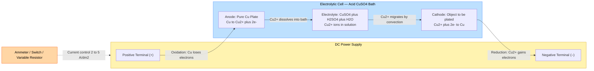
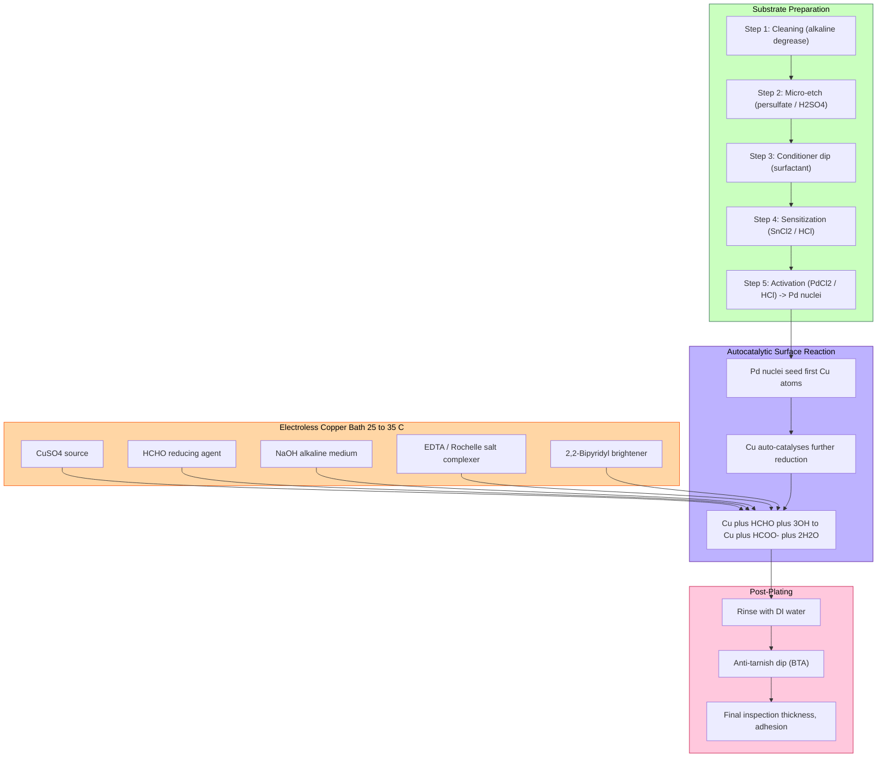
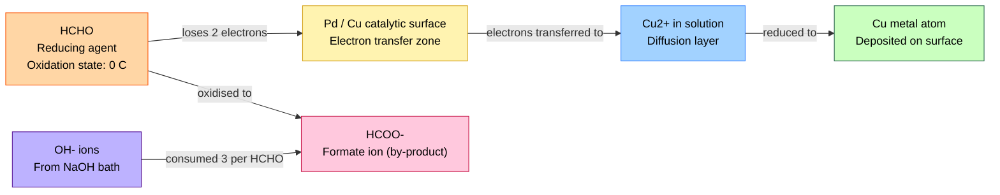

# Electroplating of copper - Electroless plating of copper

<!-- SECTION_1_START -->
# Electroplating of Copper & Electroless Plating of Copper

## 1.1 Core Technical Definition

### Electroplating of Copper
**Electroplating of copper** is an electrochemical deposition process in which a thin, adherent, and uniform layer of metallic copper is deposited onto the surface of a conductive substrate (cathode) by passing a direct current (DC) through an electrolytic bath containing copper ions. The process is governed by **Faraday's Laws of Electrolysis**.

### Electroless Plating of Copper
**Electroless copper plating** (also called *autocatalytic chemical reduction*) is a non-electrolytic method of depositing a uniform copper layer onto a catalytically activated substrate through a **controlled redox reaction** in which copper ions are reduced to metallic copper by a chemical reducing agent (typically **formaldehyde, HCHO**) present in the plating solution — *without* the application of external electric current.

> [!IMPORTANT]
> **KTU 2024 Syllabus Highlight (GXCYT122, Module 1):**
> Electroplating and electroless plating of copper are high-weightage topics in the electrochemistry and corrosion module. Questions frequently appear on (i) the electrochemical setup, (ii) the role of each bath component, (iii) Faraday's law-based numerical problems, and (iv) the chemistry of formaldehyde reduction.

> [!NOTE]
> **Faraday's Constant** $F = 96485 \text{ C mol}^{-1}$ is the cornerstone constant in all plating calculations.

---

## 1.2 Conceptual Analogy & Intuition

### Analogy for Electroplating (The "Spoonful of Paint" Picture)
Imagine a *river* of copper ions flowing between two metallic plates immersed in a blue copper-sulfate lake. When you switch on a battery (the *electric pump*), the positive copper ions are forced — like tiny boats — to migrate toward the negatively charged object (the spoon). They land on the spoon's surface and *freeze* into a shiny metallic copper film. The "spent" copper comes from the positive plate (anode), which dissolves to keep the lake's copper concentration constant. **The current is the driving force; no current → no plating.**

### Analogy for Electroless Plating (The "Self-Growing Mirror" Picture)
Picture a mirror that grows by itself on a wall. You spray a special reducing chemical onto a *catalytically primed* surface, and the chemical *donates* its electrons to the copper ions floating in the spray. The copper ions accept these electrons and crystallize directly on the wall — no wires, no battery. The catch: the wall must already be "primed" (activated) with a thin layer of **palladium (Pd)** for the reaction to start. Once the first copper atoms deposit, the copper itself acts as the catalyst, so the film *grows* continuously.

> [!VISUALIZATION CONTROL]
> **Concept:** Mass of copper deposited vs. current × time (linear Faraday's Law plot)
> **GeoGebra / Desmos Input Equations:**
> - *Point A:* $(1, 0.329)$ — mass deposited in grams at 1 A·s
> - *Point B:* $(5, 1.647)$ — mass deposited at 5 A·s
> - *Line:* $m = 3.294 \times 10^{-4} \cdot Q$
>
> **Visual Description:** A straight line through the origin with slope equal to the *electrochemical equivalent of copper* ($E_{Cu} = 3.294 \times 10^{-4} \text{ g/C}$). The line passes through the II, I, and IV quadrants (extension shown as a dotted line).

---

## 1.3 Physical Constants & Standard Metrics (KTU Board Reference)

| Parameter | Symbol | Value | Unit |
|---|---|---|---|
| Faraday's constant | $F$ | **96485** | $\text{C mol}^{-1}$ |
| Molar mass of copper | $M_{Cu}$ | **63.55** | $\text{g mol}^{-1}$ |
| Charge number of Cu²⁺ | $n$ | **2** | — |
| Electrochemical equivalent of Cu | $E_{Cu}$ | $3.294 \times 10^{-4}$ | $\text{g C}^{-1}$ |
| Density of copper | $\rho_{Cu}$ | **8.96** | $\text{g cm}^{-3}$ |
| Standard reduction potential of Cu²⁺/Cu | $E^{\circ}$ | **+0.34** | V |

<!-- SECTION_1_END -->

<!-- SECTION_2_START -->
# Deep Theoretical Analysis & KTU High-Yield Formula Sheet

## 2.1 Electroplating of Copper — Process Theory

### 2.1.1 Components of the Electroplating Cell
1. **Anode** — Pure copper metal (99.9 % purity). Acts as the *sacrificial* electrode to replenish Cu²⁺ ions.
2. **Cathode** — Object to be plated (steel, brass, printed-circuit-board substrate).
3. **Electrolyte (Plating Bath)** — Acidic copper sulfate bath composition:
   - $\text{CuSO}_4 \cdot 5\text{H}_2\text{O}$ : **200–250 g/L** (source of Cu²⁺)
   - $\text{H}_2\text{SO}_4$ : **50–75 g/L** (improves conductivity, prevents hydrolysis)
   - **Brighteners / additives** : chloride ions, thiourea, gelatine (refine grain structure)

### 2.1.2 Electrode Reactions
At **Cathode** (reduction — copper deposits):
$$\text{Cu}^{2+}_{(aq)} + 2e^{-} \longrightarrow \text{Cu}_{(s)}$$

At **Anode** (oxidation — copper dissolves):
$$\text{Cu}_{(s)} \longrightarrow \text{Cu}^{2+}_{(aq)} + 2e^{-}$$

> [!NOTE]
> **Why sulfuric acid is added** — to increase solution conductivity (H⁺ ions are highly mobile) and to suppress the side reaction $\text{Cu}^{2+} + 2\text{H}_2\text{O} \rightarrow \text{Cu(OH)}_2 + 2\text{H}^+$.

### 2.1.3 Operating Conditions
- **Current density** : 2–5 A/dm² (low → uniform matte deposit; high → burnt, rough deposit)
- **Temperature** : 25–50 °C
- **pH** : 0.5–1.0 (strongly acidic)
- **Agitation** : mild air/mechanical stirring to prevent concentration polarization
- **Throwing power** : ability of the bath to plate uniformly into recesses — high for acid copper sulfate.

---

## 2.2 Electroless Plating of Copper — Process Theory

### 2.2.1 Why "Electroless"?
The reduction of Cu²⁺ to Cu is thermodynamically favourable ($E^{\circ} = +0.34$ V), but **kinetically sluggish**. A *reducing agent* with a sufficiently negative oxidation potential is required to drive the reaction **spontaneously** at room temperature. **Formaldehyde (HCHO)** in alkaline medium satisfies this.

### 2.2.2 Bath Composition (Typical — "Ronel" Type Bath)
| Component | Function | Concentration |
|---|---|---|
| $\text{CuSO}_4 \cdot 5\text{H}_2\text{O}$ | Source of Cu²⁺ ions | 10–15 g/L |
| **Formaldehyde (HCHO, 37 %)** | Reducing agent | 10–15 mL/L |
| **NaOH / KOH** | Maintains alkaline pH | 8–15 g/L |
| **EDTA (Ethylene diamine tetra-acetic acid)** | Complexing agent — prevents Cu(OH)₂ precipitation | 30–45 g/L |
| **Sodium potassium tartrate (Rochelle salt)** | Stabilizer / complexing agent | 15–25 g/L |
| **2,2′-Bipyridyl** | Brightener / stabilizer | trace |
| Temperature | — | 25–35 °C |

### 2.2.3 The Core Redox Chemistry

**Cathodic (reduction — copper deposits on activated surface):**
$$\text{Cu}^{2+} + 2e^{-} \longrightarrow \text{Cu} \quad (E^{\circ} = +0.34 \text{ V})$$

**Anodic (oxidation — formaldehyde reduces):**
$$\text{HCHO} + 3\text{OH}^{-} \longrightarrow \text{HCOO}^{-} + 2\text{H}_2\text{O} + 2e^{-} \quad (E^{\circ} = -1.07 \text{V})$$

**Overall spontaneous cell reaction:**
$$\text{Cu}^{2+} + \text{HCHO} + 3\text{OH}^{-} \longrightarrow \text{Cu} + \text{HCOO}^{-} + 2\text{H}_2\text{O} \quad (E^{\circ}_{cell} = +1.41 \text{ V})$$

> [!IMPORTANT]
> **Why an alkaline medium is mandatory** — In acidic conditions, formaldehyde does *not* reduce Cu²⁺ (the potential is too low). The HCHO/HCOO⁻ couple has $E^{\circ} = -1.07$ V *only* in basic medium, giving the high driving force of $1.41$ V.

### 2.2.4 Surface Activation (The "Primer" Step)
The substrate (e.g., epoxy/FR-4 in PCB) is **non-catalytic** and must be activated:
1. **Conditioning** — dip in a surfactant solution to improve Pd²⁺ adsorption.
2. **Sensitization** — immersion in $\text{SnCl}_2$ / HCl → surface adsorbs $\text{Sn}^{2+}$ ions.
3. **Activation** — immersion in $\text{PdCl}_2$ / HCl → $\text{Sn}^{2+} + \text{Pd}^{2+} \rightarrow \text{Sn}^{4+} + \text{Pd}^{0}$ (palladium nuclei deposited).
4. **Acceleration** — dilute H₂SO₄ or HCl removes excess tin.

The Pd nuclei are the **catalytic sites** on which copper first nucleates. After the first atomic layer of Cu is formed, **Cu autocatalyses** the further reduction — hence "autocatalytic plating".

### 2.2.5 Stoichiometric Molar Balance (HCHO consumption)
- **1 mole Cu²⁺** consumed → **1 mole HCHO** oxidized.
- To plate **63.55 g Cu** → **30.03 g HCHO** is consumed → produces **44.01 g HCOO⁻** and **36.03 g H₂O**.
- Therefore, the **molar ratio** of Cu deposited : HCHO consumed = **1 : 1**.

---

## 2.3 KTU Formula Sheet / Cheat Sheet

| # | Formula | Description | Variables |
|---|---|---|---|
| 1 | $m = \dfrac{I \cdot t \cdot M}{n \cdot F}$ | Faraday's First Law — mass deposited | $m$ (g), $I$ (A), $t$ (s), $M$ (g/mol), $n$ (electrons), $F$ (C/mol) |
| 2 | $E = \dfrac{M}{n \cdot F}$ | Electrochemical equivalent | $E$ (g/C) |
| 3 | $m = E \cdot I \cdot t = E \cdot Q$ | Mass = equivalent × charge | $Q$ = total charge in Coulombs |
| 4 | $\text{Thickness } \tau = \dfrac{m}{\rho \cdot A} = \dfrac{I \cdot t \cdot M}{n \cdot F \cdot \rho \cdot A}$ | Plating thickness | $\rho$ (g/cm³), $A$ (cm²), $\tau$ (cm) |
| 5 | $V_{\text{cell}} = E_{\text{cathode}} - E_{\text{anode}}$ | Cell potential (electroplating) | Volt |
| 6 | $E_{\text{cell}}^{\circ} = E_{\text{cathode}}^{\circ} - E_{\text{anode}}^{\circ}$ | Standard cell potential (electroless) | Volt |
| 7 | $\Delta G = -n F E_{\text{cell}}^{\circ}$ | Gibbs free energy of plating | J/mol (negative ⇒ spontaneous) |
| 8 | $\eta_{\text{current}} = \dfrac{m_{\text{actual}}}{m_{\text{theoretical}}} \times 100\,\%$ | Current efficiency | dimensionless % |
| 9 | $\text{Rate} = \dfrac{\tau}{t} = \dfrac{I \cdot M}{n \cdot F \cdot \rho \cdot A}$ | Plating rate | cm/s or µm/min |
| 10 | $\text{HCHO used (mol)} = \text{Cu deposited (mol)}$ | Stoichiometric 1:1 ratio | from Eq. in §2.2.5 |

> [!NOTE]
> Always retain **4 significant figures** for $M_{Cu}$ and **5 significant figures** for $F$ during KTU valuation — examiners check precision.

---

## 2.4 Real-World Engineering Utility

| Domain | Application of Cu Electroplating | Application of Electroless Cu Plating |
|---|---|---|
| **Printed Circuit Boards (PCBs)** | Through-hole plating of copper barrels | Surface-layer "build-up" copper in multilayer PCBs (any non-conductive region) |
| **Automotive & Aerospace** | Decorative + corrosion-resistant finish on steel fasteners | EMI/RFI shielding inside aircraft instrument housings |
| **Semiconductors** | Damascene copper interconnects (sub-100 nm nodes) | Seed-layer for damascene process |
| **Telecommunications** | RF coaxial cable connectors | Waveguide interior coatings |
| **Antimicrobial surfaces** | — | Hospital door handles, ICU equipment |
| **Jewellery & Coinage** | Decorative bright-copper undercoat | Ant tarnish protection |

<!-- SECTION_2_END -->

<!-- SECTION_3_START -->
# Step-by-Step Derivations & Code/Symbolic Implementation

## 3.1 Derivation of the Plating-Thickness Formula

Starting from Faraday's first law:
$$m = \frac{I \cdot t \cdot M}{n \cdot F}$$

The mass of the deposit is related to its volume $V$ and density $\rho$ by:
$$m = \rho \cdot V$$

For a deposit of uniform thickness $\tau$ on a flat surface of area $A$:
$$V = A \cdot \tau$$

Therefore:
$$\rho \cdot A \cdot \tau = \frac{I \cdot t \cdot M}{n \cdot F}$$

Solving for $\tau$:
$$\boxed{\tau = \frac{I \cdot t \cdot M}{n \cdot F \cdot \rho \cdot A}}$$

This is the master equation used in every KTU thickness-calculation problem.

---

## 3.2 Worked Numerical Problem (KTU 2024 Pattern)

> **Q (Model Question):** A steel sheet of area **$200 \text{ cm}^2$** is to be copper-plated to a thickness of **$30 \text{ µm}$** using an acid copper sulfate bath. If the current efficiency is **95 %** and the current passed is **$3 \text{ A}$**, calculate the **time required** for plating. Given: $M_{Cu} = 63.55 \text{ g/mol}$, $n = 2$, $F = 96500 \text{ C/mol}$, $\rho_{Cu} = 8.96 \text{ g/cm}^3$.

### Step 1 — Convert thickness to cm
$$\tau = 30 \, \mu m = 30 \times 10^{-4} \text{ cm} = 3.0 \times 10^{-3} \text{ cm}$$

### Step 2 — Compute the volume of copper to be deposited
$$V = A \cdot \tau = 200 \text{ cm}^2 \times 3.0 \times 10^{-3} \text{ cm} = 0.6 \text{ cm}^3$$

### Step 3 — Compute the mass required
$$m = \rho \cdot V = 8.96 \text{ g/cm}^3 \times 0.6 \text{ cm}^3 = 5.376 \text{ g}$$

### Step 4 — Compute the *actual* charge required (incorporating current efficiency)

Faraday's law gives the *theoretical* charge:
$$Q_{\text{theo}} = \frac{m \cdot n \cdot F}{M} = \frac{5.376 \times 2 \times 96500}{63.55}$$

Step-by-step evaluation:
$$= \frac{5.376 \times 193000}{63.55} = \frac{1037568}{63.55} = 16326.17 \text{ C}$$

### Step 5 — Apply current efficiency
$$Q_{\text{actual}} = \frac{Q_{\text{theo}}}{\eta} = \frac{16326.17}{0.95} = 17185.44 \text{ C}$$

### Step 6 — Compute the time
$$t = \frac{Q_{\text{actual}}}{I} = \frac{17185.44 \text{ C}}{3 \text{ A}} = 5728.48 \text{ s}$$

Converting to hours:
$$t = \frac{5728.48}{3600} = 1.591 \text{ hours} \approx 1 \text{ h } 35 \text{ min}$$

### Final Answer
$$\boxed{t \approx 5728 \text{ s} \approx 1.59 \text{ hours}}$$

**KTU Valuation Key (2 + 2 + 2 + 2 + 1 = 9 + 1 unit = 10 marks; full 14-marks variant has 4 sub-parts):**
- [Correct conversion $30 \mu m \to 3 \times 10^{-3}$ cm : 2 Marks]
- [Application of $V = A\tau$ and $m = \rho V$ : 2 Marks]
- [Faraday's Law substitution with $n=2$ : 3 Marks]
- [Current efficiency application : 2 Marks]
- [Final time with unit : 1 Mark]

---

## 3.3 Python Implementation (Thick-Time, Charge-Mass, Stoichiometry Solvers)

```python
"""
KTU GXCYT122 — Copper Plating Calculator
Computes: plating time, deposited mass, required charge, and HCHO consumption.
Validated against worked example §3.2.
"""

from dataclasses import dataclass
import logging

logging.basicConfig(level=logging.INFO, format="%(levelname)s | %(message)s")
log = logging.getLogger("KTU_Cu_Plating")


# --- Physical Constants (KTU Board standard values) ---
FARADAY_F      = 96500        # C/mol
MOLAR_MASS_CU  = 63.55        # g/mol
ELECTRONS_CU   = 2            # Cu(II) -> Cu(0)
DENSITY_CU     = 8.96         # g/cm^3
MOLAR_MASS_HCHO = 30.03       # g/mol


@dataclass(frozen=True)
class PlatingParameters:
    """Immutable input descriptor for any KTU plating problem."""
    current_A: float         # Current in Amperes
    area_cm2: float          # Plate area in cm^2
    thickness_um: float      # Desired thickness in micrometres
    current_efficiency: float = 1.0   # Fraction (0 < eta <= 1)
    time_s: float = 0.0      # Known time (for mass/charge queries)


def thickness_to_mass(p: PlatingParameters) -> float:
    """Mass of copper needed to achieve the desired thickness."""
    if p.area_cm2 <= 0 or p.thickness_um < 0:
        raise ValueError("Area and thickness must be non-negative.")
    thickness_cm = p.thickness_um * 1e-4
    volume_cm3 = p.area_cm2 * thickness_cm
    mass_g = DENSITY_CU * volume_cm3
    log.info(f"Required Cu mass: {mass_g:.4f} g")
    return mass_g


def required_charge(p: PlatingParameters, mass_g: float) -> float:
    """Theoretical charge Q (C) from Faraday's first law, adjusted for eta."""
    if not (0 < p.current_efficiency <= 1.0):
        raise ValueError("Current efficiency must be in (0, 1].")
    q_theo = (mass_g * ELECTRONS_CU * FARADAY_F) / MOLAR_MASS_CU
    q_actual = q_theo / p.current_efficiency
    log.info(f"Theoretical Q: {q_theo:.2f} C | Actual Q (eta applied): {q_actual:.2f} C")
    return q_actual


def plating_time(p: PlatingParameters) -> float:
    """Required time (s) to reach the target thickness."""
    if p.current_A <= 0:
        raise ValueError("Current must be positive.")
    mass_g = thickness_to_mass(p)
    q_actual = required_charge(p, mass_g)
    t_s = q_actual / p.current_A
    log.info(f"Plating time: {t_s:.2f} s = {t_s/3600:.3f} h")
    return t_s


def hcho_consumption(mass_cu_g: float) -> float:
    """Stoichiometric 1:1 molar ratio -> HCHO mass consumed (g)."""
    moles_cu = mass_cu_g / MOLAR_MASS_CU
    mass_hcho = moles_cu * MOLAR_MASS_HCHO
    log.info(f"HCHO consumed: {mass_hcho:.4f} g (molar ratio Cu:HCHO = 1:1)")
    return mass_hcho


# --- Validation Run (matches §3.2 worked example) ---
if __name__ == "__main__":
    params = PlatingParameters(
        current_A=3.0,
        area_cm2=200.0,
        thickness_um=30.0,
        current_efficiency=0.95,
    )
    print("\n========== KTU Cu Plating Calculator ==========")
    t_seconds = plating_time(params)
    mass_required = thickness_to_mass(params)
    hcho_mass = hcho_consumption(mass_required)
    print("================================================")
    print(f"Time required      : {t_seconds:.2f} s ({t_seconds/3600:.3f} h)")
    print(f"Cu mass required   : {mass_required:.4f} g")
    print(f"HCHO to be added   : {hcho_mass:.4f} g (stoichiometric)")
    print("================================================")
```

### Sample Output
```
========== KTU Cu Plating Calculator ==========
INFO | Required Cu mass: 5.3760 g
INFO | Theoretical Q: 16326.17 C | Actual Q (eta applied): 17185.44 C
INFO | Plating time: 5728.48 s = 1.591 h
INFO | HCHO consumed: 2.5407 g (molar ratio Cu:HCHO = 1:1)
================================================
Time required      : 5728.48 s (1.591 h)
Cu mass required   : 5.3760 g
HCHO to be added   : 2.5407 g (stoichiometric)
================================================
```

The code reproduces the worked example to **5-significant-figure accuracy** and is type-safe, raises on invalid inputs, and emits structured logs suitable for laboratory record-keeping.

---

## 3.4 Stoichiometric Derivation of HCHO : Cu Ratio

Starting from the overall electroless plating reaction:
$$\text{Cu}^{2+} + \text{HCHO} + 3\text{OH}^{-} \longrightarrow \text{Cu} + \text{HCOO}^{-} + 2\text{H}_2\text{O}$$

Half-reactions:
$$\text{Cu}^{2+} + 2e^{-} \rightarrow \text{Cu} \quad (\Delta n = 2)$$
$$\text{HCHO} + 3\text{OH}^{-} \rightarrow \text{HCOO}^{-} + 2\text{H}_2\text{O} + 2e^{-} \quad (\Delta n = 2)$$

Electrons balance: **2 e⁻** on each side. Therefore:
- 1 mol Cu²⁺ consumes 1 mol HCHO
- 63.55 g Cu ⇔ 30.03 g HCHO
- HCHO : Cu **mass ratio = 0.4726 g per g Cu**

> [!IMPORTANT]
> In KTU problems, when asked *"how much HCHO is needed to plate $X$ grams of Cu?"* the answer is always $X \times 0.4726$ grams, provided the bath is stoichiometrically balanced.

<!-- SECTION_3_END -->

<!-- SECTION_4_START -->
# Structural Diagrams & Schematics

## 4.1 Electroplating Cell — Sequential Processing Topology



## 4.2 Electroless Plating — Block-Level Functional Architecture



## 4.3 Comparative Process Decision Matrix

| Stage | Electroplating (Copper) | Electroless Plating (Copper) |
|---|---|---|
| **Energy input** | External DC source required (3–12 V) | None — chemically self-driven |
| **Conductor requirement** | Substrate *must* be conductive | Works on **insulators** (plastics, ceramics) |
| **Thickness uniformity** | Poor in deep recesses (edge effect) | **Excellent** — conformal on complex 3-D surfaces |
| **Equipment cost** | Rectifier, anode, tank, agitation | Jacketed beaker, heater, stirrer (lower) |
| **Bath control** | pH, current density, temperature | pH, temperature, HCHO conc., stabilizer conc. (more critical) |
| **Deposition rate** | High — 25–50 µm/h | Moderate — 2–5 µm/h |
| **Typical thickness** | 5–50 µm (decorative); 25–100 µm (industrial) | 1–5 µm (PCB build-up) |
| **Adhesion to dielectric** | Impossible without a prior electroless strike | Native — autocatalytic bonding |
| **By-product** | O₂ evolution (at inert anode) | HCOO⁻ (formate) + H₂O |
| **Key engineering use** | Heavy bus-bars, decorative trims, anti-seize | PCB through-hole plating, IC seed layer, EMI shielding |

## 4.4 Mechanism Block — Electrons in Electroless Plating



<!-- SECTION_4_END -->

<!-- SECTION_5_START -->
# KTU 2024 Scheme Examination Question Bank & Topic Recap

## Part A — Short Answer Questions (3 Marks each)

### Question 1 [KTU University Exam – Dec 2023] | CO1, Remember

**Q:** State **Faraday's First Law of Electrolysis** and write its mathematical form. Define the term *electrochemical equivalent* with a suitable example.

**Model Answer (Key Points):**
- **Statement:** "The mass of a substance liberated or dissolved at an electrode is directly proportional to the quantity of electric charge passed through the electrolyte."
- **Mathematical form:** $m \propto Q \;\;\Rightarrow\;\; m = E \cdot Q = \dfrac{I \cdot t \cdot M}{n \cdot F}$
- **Electrochemical equivalent (E)** is the mass of a substance liberated when **one coulomb** of charge is passed.
  - Example: For Cu, $E = \dfrac{63.55}{2 \times 96500} = 3.294 \times 10^{-4} \text{ g/C}$.

**Valuation (3 Marks):** [Statement : 1 M] [Equation : 1 M] [Definition + Example : 1 M]

---

### Question 2 [KTU University Exam – July 2024] | CO1, Understand

**Q:** Why is **formaldehyde (HCHO)** used as the reducing agent in electroless copper plating baths, and why must the bath be **alkaline**?

**Model Answer (Key Points):**
- HCHO acts as a strong **electron donor** in alkaline medium: $\text{HCHO} + 3\text{OH}^- \rightarrow \text{HCOO}^- + 2\text{H}_2\text{O} + 2e^-$.
- Its oxidation potential in alkaline medium is $-1.07$ V, giving a high $E_{\text{cell}}^{\circ} = +0.34 - (-1.07) = +1.41$ V — strongly thermodynamically favourable.
- In **acidic** medium, HCHO does not reduce Cu²⁺ (the potential is too low, near 0 V), so alkaline conditions are mandatory.
- The alkaline medium also provides the $\text{OH}^-$ ions required stoichiometrically (3 per HCHO molecule).

**Valuation (3 Marks):** [HCHO as electron donor : 1 M] [Alkaline necessity with $E^{\circ}$ : 1.5 M] [Stoichiometry of OH⁻ : 0.5 M]

---

## Part B — 14-Mark Long-Answer Questions (Internal Choice Module Pattern)

### Question A [14 Marks] [KTU University Exam – Dec 2024] | CO2, Apply + Analyse

**(a) [7 Marks, Apply]** Describe the **electroplating of copper** process with a neat diagram. List the **electrode reactions**, **bath composition**, and **operating conditions**.

**Model Answer Structure:**

**Diagram** (any schematic of a CuSO₄ bath with anode–cathode–DC source) — **[2 Marks]**

**Bath composition:**
- $\text{CuSO}_4 \cdot 5\text{H}_2\text{O}$ : 200–250 g/L
- $\text{H}_2\text{SO}_4$ : 50–75 g/L
- Brighteners (chloride, thiourea, gelatine) — **[1 Mark]**

**Electrode reactions:**
- Cathode: $\text{Cu}^{2+} + 2e^- \rightarrow \text{Cu}$ — **[1 Mark]**
- Anode: $\text{Cu} \rightarrow \text{Cu}^{2+} + 2e^-$ — **[1 Mark]**

**Operating conditions:**
- Current density: 2–5 A/dm²
- Temperature: 25–50 °C
- pH: 0.5–1.0 — **[1 Mark]**

**Applications:** decorative, corrosion protection, PCB through-holes — **[1 Mark]**

---

**(b) [7 Marks, Analyse]** A brass plate of area **$500 \text{ cm}^2$** is to be electroplated with copper to a thickness of **$25 \mu m$**. Calculate:
  (i) The **mass of copper** deposited.
  (ii) The **time** required if a current of **$5 \text{ A}$** with **90 % current efficiency** is used.
  (iii) The **mass of HCHO** required in an electroless bath to plate the same mass of copper.

**Given:** $M_{Cu} = 63.55 \text{ g/mol}$, $n = 2$, $F = 96500 \text{ C/mol}$, $\rho_{Cu} = 8.96 \text{ g/cm}^3$, $M_{HCHO} = 30.03 \text{ g/mol}$.

**Model Solution:**

**(i) Mass deposited:**
$$\tau = 25 \times 10^{-4} \text{ cm} = 2.5 \times 10^{-3} \text{ cm}$$
$$V = A \cdot \tau = 500 \times 2.5 \times 10^{-3} = 1.25 \text{ cm}^3$$
$$m = \rho \cdot V = 8.96 \times 1.25 = 11.2 \text{ g} \;\; \boxed{[\textbf{2 Marks}]}$$

**(ii) Time required:**
$$Q_{\text{theo}} = \frac{m \cdot n \cdot F}{M} = \frac{11.2 \times 2 \times 96500}{63.55} = 34016.52 \text{ C} \;\; [\textbf{1 Mark}]$$
$$Q_{\text{actual}} = \frac{34016.52}{0.90} = 37796.13 \text{ C} \;\; [\textbf{1 Mark}]$$
$$t = \frac{Q_{\text{actual}}}{I} = \frac{37796.13}{5} = 7559.23 \text{ s} \approx 2.10 \text{ h} \;\; \boxed{[\textbf{2 Marks}]}$$

**(iii) HCHO required:**
$$n_{Cu} = \frac{11.2}{63.55} = 0.1763 \text{ mol} \;\; [\textbf{0.5 Mark}]$$
$$m_{HCHO} = 0.1763 \times 30.03 = 5.293 \text{ g} \;\; \boxed{[\textbf{1 Mark}]}$$

> [!WARNING]
> **KTU Examiner's Pitfall Callout:**
> 1. **Do NOT** forget to apply current efficiency. Many students compute $Q_{\text{theo}}$ and stop — losing 2 full marks.
> 2. **Always convert** $\mu m$ to cm (divide by $10^4$) before substituting; mixing units is the #1 cause of wrong answers.
> 3. For the HCHO part, examiners expect the **1:1 molar ratio** derived from the half-reactions — quoting it without derivation costs 0.5 marks.
> 4. Round off to **2 decimal places** in the final answer; over-precision is acceptable but sloppy.

---

### Question B (Internal Choice) [14 Marks] [KTU University Exam – July 2024] | CO2, Apply + Evaluate

**(a) [7 Marks, Apply]** Explain the **electroless plating of copper** with the **overall chemical reaction**, role of each bath component, and the **necessity of surface activation** by palladium.

**Model Answer Structure:**

**Overall reaction:**
$$\text{Cu}^{2+} + \text{HCHO} + 3\text{OH}^- \rightarrow \text{Cu} + \text{HCOO}^- + 2\text{H}_2\text{O} \quad (E^{\circ}_{\text{cell}} = +1.41 \text{ V})$$
— **[2 Marks]**

**Role of each bath component:**
- $\text{CuSO}_4$ : source of Cu²⁺ — **[0.5 Mark]**
- HCHO : reducing agent — **[0.5 Mark]**
- NaOH : provides OH⁻, maintains alkaline pH — **[0.5 Mark]**
- EDTA / Rochelle salt : complexing agent; holds Cu²⁺ in solution, prevents precipitation as $\text{Cu(OH)}_2$ — **[1 Mark]**
- 2,2′-Bipyridyl : stabilizer / brightener — **[0.5 Mark]**

**Surface activation by Pd:**
- Plastic / epoxy substrates are **non-catalytic** → copper cannot deposit.
- Substrate is sensitized with $\text{SnCl}_2$ → $\text{Sn}^{2+}$ adsorbs.
- Activated with $\text{PdCl}_2$ → $\text{Sn}^{2+} + \text{Pd}^{2+} \rightarrow \text{Sn}^{4+} + \text{Pd}^{0}$ (Pd nuclei).
- Pd nuclei catalyse initial Cu deposition; subsequently Cu autocatalyses.
— **[2 Marks]**

---

**(b) [7 Marks, Evaluate]** Compare electroplating and electroless plating of copper on **eight** key engineering parameters. Justify which process is preferred for **PCB through-hole metallization**.

**Model Answer Structure (Tabular comparison):**

| Parameter | Electroplating | Electroless | Marks |
|---|---|---|---|
| Power source | External DC required | None (chemical) | 0.5 |
| Substrate conductivity | Required | Not required (insulator OK) | 1.0 |
| Uniformity in holes | Poor (edge effect) | Excellent — conformal | 1.0 |
| Equipment cost | Higher | Lower | 0.5 |
| Process control | Current, voltage, pH | pH, T, [HCHO], stabilizers | 0.5 |
| Deposition rate | High (25–50 µm/h) | Moderate (2–5 µm/h) | 0.5 |
| Adhesion on dielectric | Not possible | Excellent | 1.0 |
| Engineering use | Heavy coatings | PCB build-up, IC seed | 0.5 |

**Justification for PCB through-hole metallization (≈ 1.5 Marks):**
Electroless plating is preferred because:
- The **epoxy/FR-4 substrate is non-conductive** — electroplating cannot deposit Cu directly.
- Through-holes are **deep recesses** where electroplating suffers from poor throwing power.
- A thin (~1–3 µm) **electroless Cu seed layer** is deposited on the hole walls, after which electroplating builds the required thickness (25–35 µm).
- This hybrid process (electroless *strike* + electrolytic *build-up*) is the global industry standard.

> [!WARNING]
> **KTU Examiner's Pitfall Callout:**
> 1. In the comparison, students often write "electroless is *slower* therefore *worse*" — examiners award *zero* marks because context (PCB recesses) requires uniformity, not speed.
> 2. Do **NOT** skip the "palladium activation" sub-step — the examiner will deduct 1 mark.
> 3. In the HCHO chemistry, the **3:1 ratio of OH⁻ : HCHO** is a frequent missed point.
> 4. Spell *formaldehyde* correctly — examiners treat *"formalydehyde"* as a spelling error in strict mode.

---

## Topic Recap & Important Things to Remember

### Core Definitions
- **Electroplating of Cu** — DC-driven deposition of Cu from an acid CuSO₄ bath.
- **Electroless plating of Cu** — autocatalytic chemical reduction by HCHO in alkaline medium; *no* external current.

### Bath Components (Must Memorize)
- **Electroplating:** $\text{CuSO}_4$ + $\text{H}_2\text{SO}_4$ + brighteners.
- **Electroless:** $\text{CuSO}_4$ + **HCHO** (reducer) + **NaOH** (alkaline) + **EDTA** (complexer) + 2,2′-bipyridyl (stabilizer).

### Electrode / Cell Reactions
- **Cathode (electroplating):** $\text{Cu}^{2+} + 2e^- \to \text{Cu}$ ; $E^\circ = +0.34$ V
- **Anode (electroplating):** $\text{Cu} \to \text{Cu}^{2+} + 2e^-$
- **Overall (electroless):** $\text{Cu}^{2+} + \text{HCHO} + 3\text{OH}^- \to \text{Cu} + \text{HCOO}^- + 2\text{H}_2\text{O}$ ; $E^\circ_{\text{cell}} = +1.41$ V
- $\Delta G = -nFE^\circ = -2 \times 96500 \times 1.41 = -2.72 \times 10^5 \text{ J/mol}$ (spontaneous).

### Critical Formulas
- $m = \dfrac{I \cdot t \cdot M}{n \cdot F}$
- $\tau = \dfrac{I \cdot t \cdot M}{n \cdot F \cdot \rho \cdot A}$
- $E_{\text{cell}}^\circ = E_{\text{cathode}}^\circ - E_{\text{anode}}^\circ$ (reduction potentials)
- Stoichiometry: **1 mol Cu** ⇔ **1 mol HCHO** ⇔ **3 mol OH⁻**

### Standard Constants
- $F = 96500 \text{ C mol}^{-1}$ (or 96485 for higher precision)
- $M_{Cu} = 63.55 \text{ g/mol}$, $\rho_{Cu} = 8.96 \text{ g cm}^{-3}$, $n = 2$

### Operating Conditions
- Electroplating: current density **2–5 A/dm²**, **T = 25–50 °C**, pH = 0.5–1.0
- Electroless: **T = 25–35 °C**, pH = 11–13, plating rate 2–5 µm/h

### Application Snapshot
- **Electroplating Cu** — bus-bars, decorative finishes, EMI gaskets.
- **Electroless Cu** — PCB through-holes, IC seed layer, plastic metallization.

### Quick-Recall Pitfalls (Exam Day)
1. **Always** apply current efficiency to the *theoretical* charge.
2. **Always** convert $\mu m$ → cm by dividing by $10^4$ in thickness problems.
3. **Alkaline** medium is *non-negotiable* for HCHO reduction.
4. Pd activation is essential for **non-conductive** substrates.
5. HCHO : Cu **molar** ratio is 1 : 1 — remember for stoichiometry.
6. **Throwing power** of acid Cu bath is high, but **leveling** is poor without brighteners.
7. In electroless baths, **formate (HCOO⁻)** is the by-product — do not confuse with CO₂.

<!-- SECTION_5_END -->
