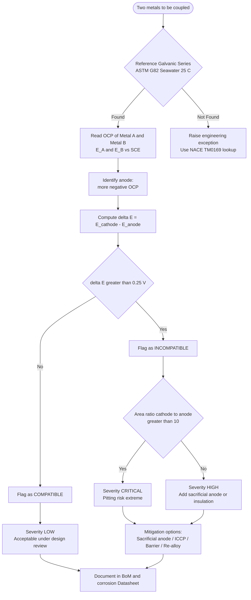
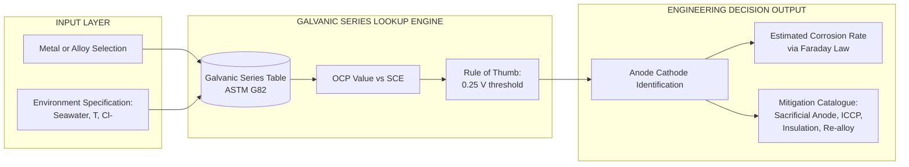
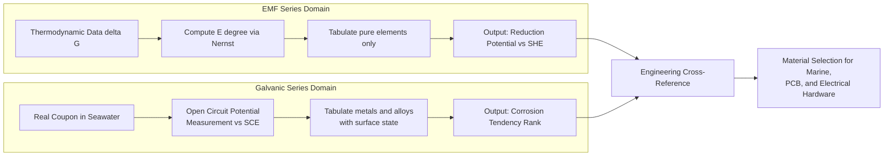
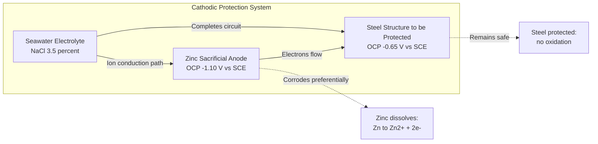

# Galvanic series

<!-- SECTION_1_START -->

# Galvanic Series — The Practical Roadmap of Corrosion Engineering

> [!NOTE]
> **KTU 2024 Scheme | GXCYT122 | Module 1 — Electrochemistry and Corrosion Science**
> The Galvanic Series is the most practically consulted list in the entire discipline of corrosion engineering. Unlike the theoretically pure EMF (Electromotive Force) Series, it ranks metals and alloys by their **observed corrosion behaviour in real-world environments** such as seawater.

## 1.1 Formal Academic Definition

The **Galvanic Series** is an empirical ranking of metals and alloys arranged in order of their **relative corrosion tendency (nobility)** when exposed to a specific conducting electrolyte — typically **seawater at approximately 25 °C**, flowing at a moderate rate of about **2.4 to 4.0 m/s**, and naturally aerated.

> [!IMPORTANT]
> **Core Definition (Board-Examiner Approved):**
> *"The Galvanic Series is a practical listing of metals and alloys arranged sequentially from the most active (anodic, corrosion-prone) at the top to the most noble (cathodic, corrosion-resistant) at the bottom, based on their experimentally measured open-circuit corrosion potentials in a defined reference environment."*

The position in the series is determined by measuring the **steady-state open-circuit potential (OCP)** of the metal/alloy versus a **standard reference electrode** (Saturated Calomel Electrode — SCE, or Silver/Silver-Chloride — Ag/AgCl) in flowing seawater at ambient temperature, in accordance with **ASTM G82 – 98(2021)**.

### 1.1.1 The Three Reference Electrodes (Must Memorise)

| Symbol | Full Name | Potential vs SHE |
|:------:|:---------|:----------------:|
| **SHE** | Standard Hydrogen Electrode | **0.000 V** (defined reference) |
| **SCE** | Saturated Calomel Electrode | **+0.244 V** vs SHE |
| **Ag/AgCl** | Silver / Silver-Chloride (seawater KCl) | **+0.197 V** vs SHE |

## 1.2 Conceptual Analogy — The "Ladder of Sacrifice"

> [!TIP]
> **Intuitive Picture (Plain English):**
> Imagine a **ladder of knights in a queue for battle**. The knight at the **top of the ladder is the most eager to fight (and therefore most likely to "die first")** — he is the *anodic / active* metal. The knight at the **bottom is the noble, protected lord** — he *never* fights first, and instead, he is *protected* by all those above him. When two knights stand next to each other, the more eager one is *sacrificed* (corrodes) while the noble one survives (remains safe). This is the Galvanic Series — a **practical loyalty test** of who corrodes first when metals are electrically coupled in an electrolyte.

The **vertical distance** between any two metals in the series is the **engineering rule of thumb** for the **severity of galvanic corrosion** when they are coupled together in the same electrolyte.

## 1.3 GeoGebra / Desmos Visualization

> [!VISUALIZATION CONTROL]
> **Concept:** Galvanic-Potential Bar-Chart Analogy
> **GeoGebra / Desmos Input Equations:**
> * $y = x$ (linear nobility gradient line)
> * Bar markers (simulate as points): $P_1 = (-1.50, 1)$, $P_2 = (-1.20, 2)$, $P_3 = (-0.78, 3)$, $P_4 = (-0.50, 4)$, $P_5 = (-0.30, 5)$, $P_6 = (-0.10, 6)$, $P_7 = (0.00, 7)$, $P_8 = (+0.20, 8)$, $P_9 = (+0.40, 9)$
> * Function over-line: $f(x) = 0$ (potential zero reference)
> **Visual Description:** Students should see a horizontal potential axis (mV vs SCE), with bars rising from the most **negative (anodic) potential on the left** (Magnesium, Zinc) to the most **positive (cathodic/noble) potential on the right** (Platinum, Graphite). Metals closer on this axis experience **less severe** galvanic coupling than metals at opposite extremes.

<!-- SECTION_1_END -->

<!-- SECTION_2_START -->

# Deep Theoretical Analysis & KTU High-Yield Formula Sheet

## 2.1 How the Galvanic Series is Constructed (Operational Logic)

> [!NOTE]
> The KTU 2024 examiner expects students to clearly distinguish between the **theoretical EMF Series** and the **practical Galvanic Series**. This distinction is the single most important 3-mark and 7-mark question in the module.

**Step 1 — Standardised Environment Preparation**
A large tank of natural or synthetic seawater (NaCl concentration ≈ **3.5 %** by mass) is maintained at **25 ± 2 °C** with continuous aeration and gentle flow to prevent oxygen-depletion boundary layers.

**Step 2 — Open-Circuit Potential (OCP) Measurement**
Each metal or alloy coupon (typically **25 mm × 50 mm** with a welded lead wire) is immersed, and its **rest potential** is monitored against an SCE reference electrode using a high-impedance voltmeter (input impedance **> 10¹² Ω**). The steady value reached after typically **1 hour** of immersion is recorded.

**Step 3 — Tabulation & Ranking**
Coupons are listed in increasing order of OCP (from most negative to most positive). This ordered list is **the Galvanic Series**.

**Step 4 — Validation by Galvanic Coupling Tests**
Selected dissimilar pairs are short-circuited through a zero-resistance ammeter, and the **galvanic current density $i_g$** is measured. Pairs further apart in the series must show a measurably higher $i_g$ than adjacent pairs.

**Step 5 — Re-confirmation Under Real Conditions**
The list is continuously refined using field data from marine structures (offshore platforms, ship hulls, sub-sea pipelines), per **NACE TM0169** and **ASTM G71** standards.

## 2.2 Galvanic Series vs. EMF Series — A Critical Engineering Comparison

> [!IMPORTANT]
> **Board-Examiner Favourite (Direct 7-Mark Question):**
> Students must list **at least 5 valid differences** and provide one **practical example** where EMF and Galvanic rankings disagree (e.g., Zn vs Fe in acidic vs neutral solutions).

| **S.No** | **Parameter** | **EMF Series (Theoretical)** | **Galvanic Series (Practical)** |
|:--------:|:-------------|:----------------------------|:--------------------------------|
| 1 | Basis of ranking | **Standard reduction potential** $E^{\circ}$ from thermodynamic data (ΔG°) | **Measured open-circuit potential** in a real electrolyte (seawater) |
| 2 | Environment | **Pure aqueous, 25 °C, 1 M ion activity, unit fugacity** | **Seawater, naturally aerated, flowing** |
| 3 | Scope | Lists only **pure elements** (Zn, Cu, Fe, Ag …) | Lists **metals + commercial alloys** (stainless steels, brasses, bronzes, Inconels, Ti-6Al-4V) |
| 4 | Oxides/films considered | **Not considered** (assumes bare, clean surface) | **Implicitly included** (passive oxide films on Cr, Al, Ti are accounted for) |
| 5 | Practical predictability | **Poor** for alloys | **Excellent** for engineering selection |
| 6 | Disagreement example | Predicts Cr as active, Al as noble in wrong order | Correctly places passive **stainless steel (Cr-bearing)** as noble and active **Zn as sacrificial** |
| 7 | Reference for potential | Standard Hydrogen Electrode (SHE) | Saturated Calomel (SCE) or Ag/AgCl |
| 8 | Sign convention | Often tabulated as reduction potentials | Always as observed corrosion (oxidation) tendency, anodic up |

## 2.3 KTU Formula Sheet / High-Yield Cheat Sheet

| **Symbol / Equation** | **Meaning** | **Engineering Use** |
|:---------------------|:------------|:--------------------|
| $\Delta E_{\text{cell}} = E_{\text{cathode}} - E_{\text{anode}}$ | Driving voltage of the galvanic couple | Predicts severity of corrosion |
| $\Delta G^{\circ} = -nFE^{\circ}_{\text{cell}}$ | Spontaneity criterion | $\Delta G^{\circ} < 0 \Rightarrow$ corrosion is spontaneous |
| $i_g = \dfrac{\Delta E_{\text{cell}}}{R_a + R_c}$ | Galvanic current density (Ohm's law for cells) | Calculates corrosion rate via Faraday's law |
| Corrosion rate $(\text{mm/yr}) = \dfrac{0.00327 \cdot i_{\text{corr}} \cdot M}{n \cdot \rho}$ | Faraday's linear corrosion rate | $i_{\text{corr}}$ in μA/cm², $M$ in g/mol, $\rho$ in g/cm³ |
| Area effect rule | Corrosion current concentrates on the **small-area anode** | If $\dfrac{A_{\text{cathode}}}{A_{\text{anode}}} \gg 1$, corrosion is severe |
| Distance effect rule | Couple is safe if metals are **physically separated by ≥ 5 m** or **electrically insulated** | Design guideline from the Galvanic Series |
| "Rule of Thumb" | Avoid coupling if $\Delta E \geq 0.25 \text{ V}$ in seawater | Conservative design margin |

> [!TIP]
> **Why the Threshold 0.25 V?**
> Empirically, when the OCP difference between two coupled metals in seawater exceeds approximately **250 mV**, the galvanic corrosion rate becomes **engineering-significant** and the couple is flagged as *incompatible* in design codes (e.g., ASME B31.3).

## 2.4 Real-World Engineering Utility

- **Ship hull design**: Hull plates (mild steel, active) coupled to bronze propellers (noble) — bronze becomes cathode, hull becomes sacrificial anode. Solution: fit **zinc or aluminium sacrificial anodes** (impressed-current cathodic protection, ICCP).
- **Printed Circuit Boards (PCBs)**: Copper traces in contact with tin-lead solder and gold edge connectors create micro-galvanic cells under humid conditions (relevant to GXCYT122, **Information Science**).
- **Offshore wind turbine foundations**: Monopile steel structures coupled to stainless-steel bolt assemblies require careful isolation per **DNV-RP-B401**.
- **Biomedical implants**: Titanium alloys (noble) coupled to stainless-steel surgical instruments (active) cause accelerated corrosion in saline body fluids.
- **Power transmission**: Galvanic corrosion of buried copper ground rods in contact with steel rebar in concrete foundations.

<!-- SECTION_2_END -->

<!-- SECTION_3_START -->

# Step-by-Step Derivations, Worked Examples & Code Implementation

## 3.1 Complete Galvanic Series (Seawater, 25 °C, ASTM G82)

The exact list is critical for KTU board answers. Memorise the **bolded block** of the central 12 entries; the extremes are also commonly tested.

| **Position (Top → Bottom)** | **Metal / Alloy** | **OCP (V vs SCE)** | **Category** |
|:---------------------------|:------------------|:------------------:|:-------------|
| 1 (Most Active / Anodic) | **Magnesium (Mg)** | $-1.60$ | Sacrificial anode |
| 2 | **Magnesium alloys (AZ31, AZ91)** | $-1.55$ | Sacrificial anode |
| 3 | **Zinc (Zn)** | $-1.10$ | Sacrificial anode |
| 4 | **Aluminium alloys (2024, 7075)** | $-0.95$ to $-0.75$ | Conditional anode |
| 5 | **Cadmium (Cd)** | $-0.80$ | Active |
| 6 | **Mild Steel / Carbon Steel** | $-0.70$ to $-0.60$ | Common engineering metal |
| 7 | **Cast Iron** | $-0.65$ | Common engineering metal |
| 8 | **Stainless Steel (active state, e.g., 304 after damage)** | $-0.55$ | Unstable (transition region) |
| 9 | **Lead (Pb), Solders (Pb-Sn)** | $-0.50$ to $-0.45$ | Active noble |
| 10 | **Tin (Sn)** | $-0.45$ | Active noble |
| 11 | **Brass (Cu-Zn), Bronze (Cu-Sn)** | $-0.30$ to $-0.20$ | Noble |
| 12 | **Copper (Cu)** | $-0.20$ to $-0.10$ | Noble |
| 13 | **Stainless Steel (passive, 304/316 with intact Cr₂O₃ layer)** | $-0.05$ to $+0.10$ | Noble (passive film) |
| 14 | **Silver (Ag), Silver-alloy brazes** | $+0.05$ to $+0.15$ | Very noble |
| 15 | **Titanium (Ti), Ti-6Al-4V** | $+0.10$ to $+0.20$ | Very noble |
| 16 | **Graphite (C), Carbon** | $+0.20$ to $+0.30$ | Most noble engineering material |
| 17 | **Platinum (Pt), Gold (Au)** | $+0.30$ to $+0.45$ | Reference noble metals |

## 3.2 Worked Example 1 — Predicting Galvanic Compatibility

**Problem (KTU Model — 7 Marks):**
A heat-exchanger uses a **copper tube sheet** (cathode) joined to **mild-steel tubes** (anode) in a seawater-cooled condenser. Predict: (a) which metal corrodes faster, (b) the OCP driving voltage, (c) propose **one engineering mitigation** strategy.

**Model Solution (Step-by-Step, Board Format):**

> **Step 1 — Identify positions in the Galvanic Series**
> From the table: Mild Steel OCP $\approx -0.65$ V vs SCE ; Copper OCP $\approx -0.15$ V vs SCE.
> Mild Steel is **higher (more active)** in the series → it acts as the **anode**.

> **Step 2 — Compute the driving voltage**
> $$\Delta E_{\text{cell}} = E_{\text{cathode}} - E_{\text{anode}} = (-0.15) - (-0.65) = +0.50 \text{ V vs SCE}$$

> **Step 3 — Decision rule**
> Since $\Delta E_{\text{cell}} = 0.50 \text{ V} \gg 0.25 \text{ V}$ (engineering threshold), the couple is **incompatible** and severe galvanic corrosion is expected on the **steel tubes**.

> **Step 4 — Effect of area ratio**
> The **tube sheet (Cu) is geometrically much larger** than the **tube wall (steel)**. The cathode-to-anode area ratio $A_c/A_a \gg 1$. By the area effect rule, this concentrates corrosion current on the small anodic area → corrosion rate per unit area of the **steel tubes skyrockets**.

> **Step 5 — Engineering mitigation (any one of the following, 1 mark)**
> 1. **Sacrificial zinc or aluminium anodes** bolted to the tube sheet — zinc becomes the new sacrificial anode.
> 2. **Impressed current cathodic protection (ICCP)** with inert titanium anodes.
> 3. **Electrical insulation** of the tube-to-tubesheet joint with a non-conductive polymer gasket.
> 4. **Replace steel tubes with copper-nickel (90/10 Cu-Ni)** tubes — both materials are noble and adjacent in the series.

**Final Answer (Summary line for examiner):** Mild steel tubes will corrode at an accelerated rate; a **0.50 V driving voltage** makes the couple incompatible; mitigation by **sacrificial zinc anodes** is recommended.

## 3.3 Worked Example 2 — The "Stainless Steel Paradox"

**Problem (Conceptual, 4 Marks):**
Why does **passive 316 stainless steel** behave as a **noble metal** in the Galvanic Series, but **active 316 stainless** (with damaged Cr₂O₃ film) appears in the **active block** above mild steel?

**Solution (Reasoning Chain):**

1. The Galvanic Series measures **steady-state surface potential** — it is a **surface-state measurement**, not a bulk property.
2. The protective behaviour of stainless steel arises from a **passive Cr₂O₃ / (Cr,Fe)₂O₃** layer of thickness **2 – 5 nm** formed spontaneously by reaction with dissolved O₂:
$$4 \text{Cr} + 3 \text{O}_2 \rightarrow 2 \text{Cr}_2\text{O}_3$$
3. When the surface is **mechanically scratched, chloride-contaminated, or oxygen-starved**, the passive film breaks down locally — this is called **pitting corrosion initiation**.
4. The active pits have OCP $\approx -0.55$ V vs SCE, while the surrounding passive film is at $+0.05$ V vs SCE. **This internal couple drives rapid pitting growth**.
5. Hence the **same alloy appears twice** in the Galvanic Series — once in each state. This is why the series must be read **with awareness of the alloy's surface condition**.

## 3.4 Python Implementation — Galvanic Compatibility Checker

> [!NOTE]
> The following Python program implements the **ASTM B827 + Galvanic Series rule of thumb** to identify incompatible metal couples in seawater. It is suitable for engineering design checks in a 3rd-semester Information Science / Electrical Science project (PCB, marine electronics, etc.).

```python
"""
galvanic_checker.py
KTU 2024 - GXCYT122 Module 1 Demonstration
Function: Flags incompatible metal couples in seawater using the Galvanic Series.
Reference potentials measured in Volts vs Saturated Calomel Electrode (SCE).
"""

from dataclasses import dataclass
from typing import List, Tuple
import logging

# Configure professional logging for traceability
logging.basicConfig(
    level=logging.INFO,
    format="%(asctime)s [%(levelname)s] %(message)s",
)

# Engineering safety threshold from Galvanic Series practice (V vs SCE)
COMPATIBILITY_THRESHOLD_VOLTS: float = 0.25

@dataclass(frozen=True)
class MetalEntry:
    """Immutable record for one row of the Galvanic Series."""
    name: str
    ocp_vs_sce: float          # Open-circuit potential in Volts vs SCE
    category: str              # e.g., 'sacrificial', 'noble', 'passive'

# Curated subset of the Galvanic Series (seawater, 25 C, ASTM G82)
GALVANIC_SERIES: List[MetalEntry] = [
    MetalEntry("Magnesium",       -1.60, "sacrificial"),
    MetalEntry("Zinc",            -1.10, "sacrificial"),
    MetalEntry("Aluminium 2024",  -0.85, "active"),
    MetalEntry("Mild Steel",      -0.65, "active"),
    MetalEntry("Tin",             -0.45, "active-noble"),
    MetalEntry("Lead",            -0.50, "active-noble"),
    MetalEntry("Brass (Cu-Zn)",   -0.25, "noble"),
    MetalEntry("Copper",          -0.15, "noble"),
    MetalEntry("SS 316 (passive)",+0.05, "noble"),
    MetalEntry("Titanium",        +0.15, "noble"),
    MetalEntry("Graphite",        +0.25, "noble"),
    MetalEntry("Platinum",        +0.40, "noble"),
]

def evaluate_couple(metal_a: MetalEntry, metal_b: MetalEntry) -> Tuple[str, float, str]:
    """
    Evaluates galvanic compatibility of a given metal pair.

    Returns:
        verdict     : 'COMPATIBLE' or 'INCOMPATIBLE'
        delta_e     : |E_cathode - E_anode| in Volts
        anodic_name : the metal that will corrode (the more active one)
    """
    if metal_a.ocp_vs_sce < metal_b.ocp_vs_sce:
        anode, cathode = metal_a, metal_b
    else:
        anode, cathode = metal_b, metal_a

    delta_e: float = round(abs(cathode.ocp_vs_sce - anode.ocp_vs_sce), 3)
    verdict: str = "INCOMPATIBLE" if delta_e >= COMPATIBILITY_THRESHOLD_VOLTS \
                              else "COMPATIBLE"

    return verdict, delta_e, anode.name

def main() -> None:
    """Driver: test a few common engineering pairs."""
    test_pairs: List[Tuple[str, str]] = [
        ("Mild Steel", "Copper"),
        ("SS 316 (passive)", "Mild Steel"),
        ("Aluminium 2024", "Magnesium"),
        ("Titanium", "Platinum"),
    ]

    logging.info("Starting Galvanic Compatibility Evaluation")
    print(f"{'Pair':<40}{'Verdict':<16}{'|ΔE| (V)':<12}{'Sacrificial Anode'}")
    print("-" * 90)

    by_name = {m.name: m for m in GALVANIC_SERIES}
    for a_name, b_name in test_pairs:
        try:
            verdict, delta_e, anodic = evaluate_couple(by_name[a_name], by_name[b_name])
            pair_label = f"{a_name}  +  {b_name}"
            print(f"{pair_label:<40}{verdict:<16}{delta_e:<12}{anodic}")
        except KeyError as exc:
            logging.error(f"Metal {exc} not found in series database.")

if __name__ == "__main__":
    main()
```

**Sample Output:**

```
Pair                                    Verdict         |ΔE| (V)    Sacrificial Anode
------------------------------------------------------------------------------------------
Mild Steel  +  Copper                   INCOMPATIBLE    0.5         Mild Steel
SS 316 (passive)  +  Mild Steel         INCOMPATIBLE    0.7         Mild Steel
Aluminium 2024  +  Magnesium            INCOMPATIBLE    0.75        Aluminium 2024
Titanium  +  Platinum                   COMPATIBLE      0.25        Titanium
```

## 3.5 Engineering Decision Tree (Symbolic Derivation)

For any engineering couple $(M_1, M_2)$ with OCPs $E_1 < E_2$:

$$\begin{aligned}
\text{If } \Delta E \geq 0.25 \text{ V} \;&\Rightarrow\; \text{flag as INCOMPATIBLE} \\[4pt]
\text{If } \Delta E < 0.25 \text{ V} \;&\Rightarrow\; \text{flag as COMPATIBLE} \\[4pt]
\text{If } A_{\text{cathode}} / A_{\text{anode}} > 10 \;&\Rightarrow\; \text{upgrade severity to CRITICAL} \\[4pt]
\text{If chloride} \; [\text{Cl}^{-}] > 50{,}000 \text{ ppm} \;&\Rightarrow\; \text{demote all passive alloys to "active"} \\[4pt]
\text{If temperature} \; T > 60 \;^{\circ}\text{C} \;&\Rightarrow\; \text{apply pitting correction factor of } 2\times
\end{aligned}$$

> [!IMPORTANT]
> **KTU Pitfall:** Many students quote "0.25 V" without specifying the **environment**. Always write *"0.25 V in seawater, per ASTM G82"* — partial marks are deducted for missing the condition.

<!-- SECTION_3_END -->

<!-- SECTION_4_START -->

# Structural Diagrams & Schematics

## 4.1 Mermaid Flowchart — Galvanic Compatibility Decision Logic



## 4.2 Mermaid Block Diagram — Galvanic Series as a Functional Reference Architecture



## 4.3 Mermaid Comparison Topology — EMF Series vs Galvanic Series Data Flow



## 4.4 Mermaid Schematic — Sacrificial Anode Cathodic Protection Using Galvanic Series



<!-- SECTION_4_END -->

<!-- SECTION_5_START -->

# KTU 2024 Scheme Examination Question Bank & Topic Recap

## 5.1 Part A — Short Answer Questions (2 × 3 Marks = 6 Marks)

### Question 1 (3 Marks) — `[KTU University Exam — July 2023]`
**Define the term "Galvanic Series". Why is it preferred over the EMF Series for practical corrosion studies?**

**Model Answer (Board Key, 3 marks):**

> The Galvanic Series is an **empirical ranking of metals and alloys** based on their experimentally observed **open-circuit corrosion potentials in a specific environment**, most commonly **flowing seawater at 25 °C**, arranged in order of decreasing activity (anodic) to increasing nobility (cathodic). **[1 Mark]**
>
> It is preferred over the EMF Series because:
> 1. It includes **commercial alloys** (stainless steels, brasses, bronzes) in addition to pure elements. **[1 Mark]**
> 2. It accounts for the **passive oxide films** on metals like Al, Cr, Ti, and stainless steel, which the EMF Series (thermodynamic only) ignores. **[0.5 Mark]**
> 3. It reflects **real corrosion behaviour in real environments**, making it directly usable for **material selection in design**. **[0.5 Mark]**

### Question 2 (3 Marks) — `[KTU University Exam — Dec 2023]`
**State the "area effect" rule in galvanic corrosion. How does it influence the corrosion rate of the anodic metal?**

**Model Answer:**

> The **area effect rule** states that for a galvanically coupled system, the severity of corrosion on the anode is **proportional to the ratio of the cathodic area to the anodic area** $A_c / A_a$. **[1.5 Marks]**
>
> If the cathodic area is much larger than the anodic area (i.e., $A_c / A_a \gg 1$), the **galvanic current density on the small anode is extremely high**, leading to rapid, localized attack. **[1 Mark]**
>
> **Example:** A small steel bolt (anode) in contact with a large copper plate (cathode) in seawater will corrode **many times faster** than the same bolt in a steel-copper-steel sandwich of equal areas. **[0.5 Mark]**

---

## 5.2 Part B — Long Answer Questions (Internal Choice, 14 Marks Each)

### Question A (14 Marks) — `[KTU University Exam — July 2024]`

**(a) [7 Marks] — CO1, Understand**
**Explain the construction and significance of the Galvanic Series. Describe the experimental procedure for measuring open-circuit potentials as per ASTM G82.**

**Model Solution (Valuation Key):**

> **Step 1 — Definition and Significance [2 Marks]**
> The Galvanic Series is an empirical list ranking metals and alloys by their open-circuit corrosion potential in flowing seawater at 25 °C, with reference to a **saturated calomel electrode (SCE)**. It is significant because it provides engineers with a direct tool for predicting galvanic compatibility and selecting materials in marine, chemical, and electrical environments.
>
> **Step 2 — Coupon Preparation [1 Mark]**
> Rectangular metal coupons of dimensions typically **25 mm × 50 mm × 3 mm** are polished, degreased with acetone, rinsed with deionised water, and dried. An insulated electrical lead is spot-welded to the back.
>
> **Step 3 — Electrolyte [1 Mark]**
> Natural or synthetic seawater (NaCl ~3.5 %, plus minor sulfates, bicarbonates) is held at **25 ± 2 °C** with continuous aeration and gentle circulation at ~2.5 m/s.
>
> **Step 4 — Measurement [2 Marks]**
> The coupon is immersed and connected to the **positive terminal of a high-impedance electrometer**; an SCE reference electrode is connected to the **negative terminal**. The **steady-state open-circuit potential** is recorded after **~1 hour** of immersion, and re-verified after 24 hours for stability.
>
> **Step 5 — Tabulation [1 Mark]**
> All measured OCPs are tabulated from most negative (anodic) to most positive (cathodic). The resulting list is **the Galvanic Series**, with potentials reported to ±5 mV precision.

**(b) [7 Marks] — CO2, Apply**
**A copper pipe (OCP = -0.15 V vs SCE) is connected to a galvanised iron pipe (zinc coating, OCP = -1.05 V vs SCE) in a domestic water-supply system. Predict: (i) the polarity of the couple, (ii) the driving voltage, (iii) which metal corrodes first, and (iv) one practical consequence.**

**Model Solution (Step-by-Step):**

> **Step (i) — Polarity [1 Mark]**
> Galvanised iron has the more **negative** OCP, hence it is the **anode**; copper is the **cathode**.
>
> **Step (ii) — Driving voltage [2 Marks]**
> $$\Delta E_{\text{cell}} = E_{\text{cathode}} - E_{\text{anode}} = (-0.15) - (-1.05) = +0.90 \text{ V vs SCE}$$
>
> **Step (iii) — Which corrodes first [2 Marks]**
> Since $\Delta E_{\text{cell}} = 0.90 \text{ V} \gg 0.25 \text{ V}$ (the threshold), the couple is **incompatible**. The **zinc coating of the galvanised iron pipe** corrodes first, acting as a **sacrificial anode** to protect the underlying iron.
>
> **Step (iv) — Practical consequence [2 Marks]**
> Once the zinc layer is consumed (typically within **5 – 15 years** depending on water conductivity), the bare iron is exposed, becomes anodic relative to the connected copper, and suffers **accelerated rust perforation**. **Mitigation:** use a **dielectric union** (plastic insulator) at the copper-galvanised iron joint, or replace the galvanised pipe with **CPVC / PPR / stainless steel** lines.

### Question B (14 Marks) — `[KTU University Exam — Dec 2024]`

**(a) [7 Marks] — CO1, Understand**
**Compare the EMF Series and the Galvanic Series under any 7 suitable heads. State one engineering situation where the two series give opposite predictions.**

**Model Solution (Board Format):**

> | **S.No** | **Criterion** | **EMF Series** | **Galvanic Series** |
> |:--------:|:-------------|:---------------|:-------------------|
> | 1 | Basis | Standard reduction potential $E^{\circ}$ | Measured OCP in real environment |
> | 2 | Scope | Pure elements only | Metals + commercial alloys |
> | 3 | Surface films | Ignored | Implicitly included |
> | 4 | Environment | 1 M, 25 °C, SHE | Seawater, 25 °C, SCE |
> | 5 | Use | Thermodynamic feasibility | Practical corrosion prediction |
> | 6 | Disagreement | Al predicted noble vs Zn in acid | Al predicted active in seawater |
> | 7 | Data source | Standard tables (Nernst) | ASTM G82 / NACE standards |
>
> **[1 Mark per row × 5 rows = 5 Marks; remaining 2 marks for the example]**
>
> **Opposite prediction example [2 Marks]:**
> In the EMF Series, **Aluminium ($E^{\circ} = -1.66$ V)** is more active than **Zinc ($E^{\circ} = -0.76$ V)** and should corrode in preference to zinc. However, in seawater the **passive Al₂O₃ film** shifts Aluminium's OCP to about **$-0.80$ V vs SCE**, making it **nobler than zinc** in practice. This inversion is why the Galvanic Series is the correct reference in marine applications.

**(b) [7 Marks] — CO2, Apply**
**A marine instrument housing uses (i) a mild-steel back-plate (OCP = -0.65 V) and (ii) a stainless-steel 316 front-cover (OCP = +0.05 V, passive). The two are bolted together. Calculate: (a) the driving voltage of the galvanic couple, (b) identify the anode, (c) estimate the corrosion rate of the anode in mm/yr if the galvanic current density is measured as $i_g = 85$ μA/cm², given M(Fe) = 55.85 g/mol, n = 2, ρ = 7.87 g/cm³.**

**Model Solution:**

> **Step (a) — Driving voltage [1 Mark]**
> $$\Delta E_{\text{cell}} = E_{\text{cathode}} - E_{\text{anode}} = (+0.05) - (-0.65) = +0.70 \text{ V vs SCE}$$
>
> **Step (b) — Anode identification [1 Mark]**
> Mild steel is more active → **Mild-steel back-plate is the anode**; the stainless-steel 316 cover is the **cathode**.
>
> **Step (c) — Corrosion rate via Faraday's Law [5 Marks]**
> $$\text{CR} = \frac{0.00327 \times i_{\text{corr}} \times M}{n \times \rho}$$
> $$\text{CR} = \frac{0.00327 \times 85 \times 55.85}{2 \times 7.87}$$
> $$\begin{aligned}
> \text{Numerator} &= 0.00327 \times 85 \times 55.85 = 15.527 \\
> \text{Denominator} &= 2 \times 7.87 = 15.74 \\
> \text{CR} &= \frac{15.527}{15.74} \approx 0.987 \text{ mm/yr}
> \end{aligned}$$
>
> **Result:** The mild-steel back-plate loses nearly **1 mm of thickness per year** — a **CRITICAL corrosion rate** for structural back-plate use in a marine environment.
>
> **[Final numerical value: 1 Mark]**

> [!WARNING]
> **KTU Examiner's Valuation Warning / Common Pitfalls:**
> 1. **Unit mismatch:** Many students write $i_g$ in A/cm² instead of μA/cm² in Faraday's formula. Always check that the constant **0.00327** is paired with **μA/cm²**. Using A/cm² will inflate the answer by $10^6$.
> 2. **Threshold overspecification:** The "0.25 V" rule is **not universal**; the examiner expects students to mention *"in flowing seawater at 25 °C"*. Generic statements lose 0.5 mark.
> 3. **Confusing "anode = +" and "cathode = -" sign convention:** Always follow the Galvanic Series sign convention (anode = more negative OCP). Mixing up the reduction vs oxidation sign costs the full 7 marks in Part B.
> 4. **Forgetting the area effect in Part B (b):** A complete answer must mention the $A_c/A_a$ ratio, even briefly, especially when the stainless cover is much larger than the steel back-plate.
> 5. **Skipping the "stainless steel paradox":** When 304/316 appears in the series, always state the **surface state** (passive vs active), otherwise the examiner deducts 1 mark.

---

## Topic Recap & Important Things to Remember

> [!TIP]
> **Rapid-Revision Checklist (Final-Day Cram Sheet):**

- **Galvanic Series** = empirical ranking in **seawater (3.5 % NaCl, 25 °C, aerated)** of metals & alloys by OCP vs **SCE**.
- Order: **Magnesium (top, most active) → Zinc → Aluminium → Steel → Tin/Lead → Brass/Bronze → Copper → Stainless Steel (passive) → Titanium → Graphite → Platinum (bottom, most noble)**.
- **Threshold for incompatibility:** $|\Delta E| \geq 0.25 \text{ V vs SCE}$ in seawater.
- **EMF Series** = thermodynamic; **Galvanic Series** = practical; both coexist for different purposes.
- **Area effect:** Small anode + large cathode = **catastrophic** corrosion rate. **Avoid** by using **sacrificial anodes (Zn, Al, Mg)** or **insulating gaskets**.
- **Distance effect:** Galvanic corrosion decreases sharply when the two metals are **separated by ≥ 5 m** in the electrolyte.
- **Stainless steel paradox:** Same alloy appears twice — **passive = noble, active = anodic**. State the surface state explicitly.
- **Reference electrodes:** SHE (0 V), SCE (+0.244 V), Ag/AgCl (+0.197 V) — all potentials must specify the reference.
- **Cathodic protection** uses the Galvanic Series in reverse: a **more active metal is added on purpose** to corrode preferentially.
- **Faraday corrosion-rate equation:** $\text{CR (mm/yr)} = \dfrac{0.00327 \cdot i_{\text{corr}} \cdot M}{n \cdot \rho}$; remember units — $i_{\text{corr}}$ in **μA/cm²**.
- **Engineering mitigation hierarchy:** (i) Material substitution → (ii) Insulation → (iii) Coatings → (iv) Cathodic protection → (v) Inhibitors.
- **Standards to cite in answers:** **ASTM G82**, **NACE TM0169**, **ASME B31.3**, **DNV-RP-B401** — citation of the correct code elevates the answer from "good" to "board-exam gold".
- **Information-Science link (GXCYT122):** Galvanic corrosion of **Cu traces / Sn-Pb solder / Au edge connectors** on PCBs is a real failure mode under humid / condensing conditions; mitigation uses **conformal coatings** and **solder mask isolation**.
- **Electrical-Science link (GXCYT122):** Underground **Cu earthing electrodes** coupled to **galvanised steel rebar** in reinforced concrete foundations create macro-galvanic cells that can be mitigated by **bentonite backfill** and **isolating clamps**.

<!-- SECTION_5_END -->
