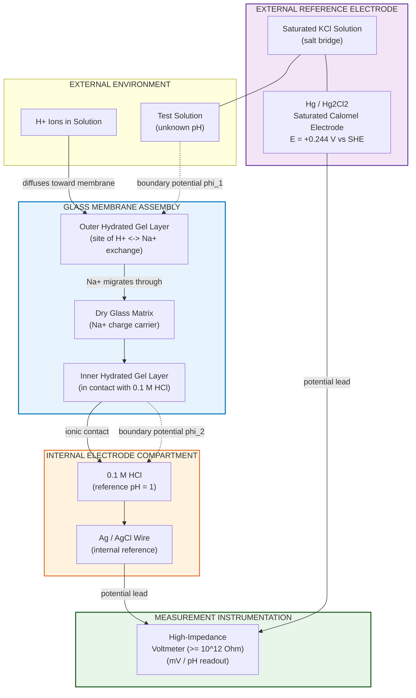
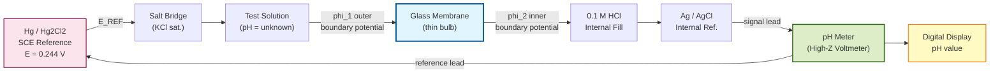
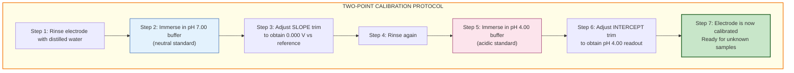
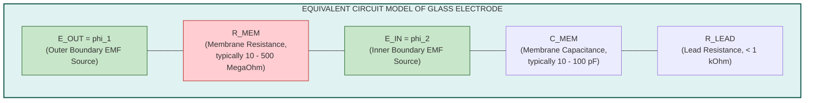

# Glass Electrode & pH Measurement

<!-- SECTION_1_START -->
# Glass Electrode & pH Measurement — Core Foundation

## 1.1 Formal Academic Definition (KTU 2024 Syllabus Terminology)

> [!IMPORTANT]
> **Glass Electrode (KTU Standard Definition):**
> A **glass electrode** is a type of **ion-selective electrode (ISE)** that develops a **membrane potential** proportional to the **hydrogen ion activity** ($a_{H^+}$) of the solution in which it is dipped. It consists of a thin, **hydrogen-ion-sensitive glass membrane** (typically a sodium silicate / lithium silicate based glass, e.g., Corning 015 with composition $\sim 22\%\,\text{Na}_2\text{O},\ 6\%\,\text{CaO},\ 72\%\,\text{SiO}_2$) that selectively permits $H^+$ ions to exchange with alkali metal ions on the glass surface, generating a measurable **boundary (phase-boundary) potential** governed by the **Nernst equation**.

The cell is completed by combining the glass electrode with a **reference electrode** (usually a **Saturated Calomel Electrode, SCE**, or **Ag/AgCl electrode**) to form a complete electrochemical cell whose **EMF** is a linear function of the **pH** of the test solution.

$$E_{\text{cell}} = E_{\text{ref}} - E_{\text{glass}} = K + \frac{2.303\,RT}{F}\,\text{pH}$$

where $K$ is a constant that includes the **asymmetry potential**, the reference electrode potential, and any liquid-junction contributions.

## 1.2 Conceptual Analogy — "The Molecular Sieve Lock"

> [!NOTE]
> **Intuitive Picture — The Selective Gate:**
> Imagine a wall built of a special **molecular "smart-lock"** material. The wall contains millions of tiny tunnels, but **only hydrogen ions ($H^+$) have the exact "key shape"** to pass through. Sodium ($Na^+$) and potassium ($K^+$) ions, although similar in size, are gently rejected. As $H^+$ ions shuttle across this membrane, they leave behind a tiny electrical imbalance — a **voltage**. This voltage is **directly proportional to the concentration of $H^+$ trying to get through**.
>
> - If the solution outside is **acidic** (lots of $H^+$) → the imbalance is **large** → high measured voltage.
> - If the solution is **basic** (very few $H^+$) → the imbalance is **small** → low measured voltage.
> - A **voltmeter** (high-impedance pH meter) reads this voltage, and since voltage is **logarithmic in $H^+$**, the scale is called **pH** — **"potens Hydrogen"** (power of hydrogen).

## 1.3 The pH Scale — Standard Metric

> [!IMPORTANT]
> **Standard Reference Values for pH Scale:**
> - **pH = $-\log_{10}\,a_{H^+}$** (where $a_{H^+}$ is the activity, approximated by concentration $[\text{H}^+]$ in dilute solutions).
> - **Acidic:** $\text{pH} < 7$ (at **298.15 K**, $T = 25\,^\circ\text{C}$)
> - **Neutral:** $\text{pH} = 7$ (pure water at 25 °C: $[H^+] = 10^{-7}\,\text{M}$)
> - **Basic / Alkaline:** $\text{pH} > 7$
> - The **Faraday constant** $F = 96485\,\text{C mol}^{-1}$ and the **molar gas constant** $R = 8.314\,\text{J mol}^{-1}\,\text{K}^{-1}$ govern the **Nernstian slope** of the glass electrode.

## 1.4 GeoGebra / Desmos Visualization

> [!VISUALIZATION CONTROL]
> **Concept:** Nernstian Response of Glass Electrode — EMF vs. pH (Calibration Curve)
> **GeoGebra / Desmos Input Equations:**
> * `E(pH) = 0.0591 * pH + 0.414`   *(assuming $E_{\text{ref}} = 0.414\,\text{V}$ for SCE at 25 °C, and zero asymmetry potential)*
> * Slope $= 0.05916\,\text{V/pH unit}$ at $T = 25\,^\circ\text{C}$ (i.e., $\frac{2.303\,RT}{F} \approx 0.05916\,\text{V}$)
> **Visual Description:** A **straight line** with positive slope passing through quadrants, $E_{\text{cell}}$ on the y-axis (in Volts) and pH on the x-axis. The line should have a slope of approximately **$0.0591\,\text{V per pH unit}$**. Mark calibration points at pH = 4, 7, and 10 — these are the standard **buffer solutions** used to calibrate a pH meter.

## 1.5 Why This Topic Matters in Information Science & Electrical Engineering

- **Semiconductor Fabrication:** pH of etching baths (HF, KOH) used in silicon wafer processing must be controlled to **$\pm 0.01$ pH units**; glass electrodes are the **industry standard** in-line sensor.
- **Battery Electrolyte Quality Control:** Li-ion battery cathode slurries require strict pH windows (typically **10.5–12.0**).
- **Cooling Water in Power Plants:** Monitoring corrosion-prevention pH (typically **8.5–9.5**) using glass electrodes prevents scale and rust in turbine blades.
- **PCB Manufacturing:** pH control in electroless plating baths (Ni, Cu) using glass electrodes ensures uniform deposition — directly impacting **device reliability**.

<!-- SECTION_1_END -->

<!-- SECTION_2_START -->
# Deep Theoretical Analysis & KTU High-Yield Formula Sheet

## 2.1 Construction of the Glass Electrode — Layer by Layer

A glass electrode is essentially a **glass tube acting as a probe**, sealed at one end with a **special pH-sensitive glass membrane** ($\sim 0.1\,\text{mm}$ thick bubble). Inside this tube is a fixed **internal reference solution** of known pH (typically **0.1 M HCl**) and an **internal reference electrode** (Ag/AgCl wire).

The layered architecture, from outside to inside, is:

1. **Outer Glass Membrane (sensing layer):** Lithium / sodium silicate glass with a hydrated gel layer of $\sim 10\,\text{nm}$ on both surfaces.
2. **External Test Solution** (unknown pH).
3. **Hydrated Gel Layer (outer):** where $H^+ \leftrightarrow Na^+$ exchange occurs → generates **outer boundary potential** $\phi_1$.
4. **Dry Glass Layer (interior of membrane):** conducts charge via $Na^+$ migration.
5. **Hydrated Gel Layer (inner):** in contact with 0.1 M HCl → generates **inner boundary potential** $\phi_2$.
6. **Internal Reference Solution:** 0.1 M HCl (fixed pH = 1).
7. **Internal Reference Electrode:** Ag/AgCl in 0.1 M HCl.

## 2.2 Theoretical Working Principle — Step-by-Step Logic

The potential developed across the glass membrane arises from **two independent boundary potentials** that combine according to the **Donnan equilibrium** and the **Nernst equation for ion exchange**.

### Step 1: Ion Exchange at the Outer Hydrated Gel Layer
The outer surface of the glass membrane establishes a **Donnan-type equilibrium** between the $H^+$ in the test solution and the $Na^+$ in the glass:

$$\text{Glass-Na}^+ + \text{H}^+_{\text{(solution)}} \rightleftharpoons \text{Glass-H}^+ + \text{Na}^+_{\text{(solution)}}$$

The selectivity of the glass for $H^+$ is described by the **selectivity coefficient** $K^H_{Na}$. Ideally, $K^H_{Na} \to 0$ (perfect selectivity for $H^+$), making the boundary potential follow the Nernst equation strictly.

### Step 2: Outer Boundary Potential $\phi_1$
Applying the Nernst equation to the outer surface:

$$\phi_1 = \phi^{\circ}_1 + \frac{RT}{F}\ln a_{H^+,\text{ext}}$$

### Step 3: Inner Boundary Potential $\phi_2$
For the inner surface (in contact with fixed 0.1 M HCl, $a_{H^+,\text{int}} = \text{const}$):

$$\phi_2 = \phi^{\circ}_2 + \frac{RT}{F}\ln a_{H^+,\text{int}}$$

### Step 4: Total Membrane Potential
The measurable **membrane (boundary) potential** is the difference:

$$E_{\text{glass}} = \phi_1 - \phi_2 = \underbrace{(\phi^{\circ}_1 - \phi^{\circ}_2)}_{\text{constant}} + \frac{RT}{F}\ln\!\left(\frac{a_{H^+,\text{ext}}}{a_{H^+,\text{int}}}\right)$$

Since $a_{H^+,\text{int}}$ is constant, $\phi^{\circ}_1 - \phi^{\circ}_2$ collapses into a single **standard potential** for the glass electrode.

### Step 5: Complete Cell EMF
A full measurement cell is assembled as:

$$\text{Hg/Hg}_2\text{Cl}_2\,(\text{KCl sat.})\ \vert\ \text{Test solution}\ \vert\ \text{Glass}\ \vert\ \text{HCl (0.1 M)}\ \vert\ \text{AgCl/Ag}$$

The cell EMF is therefore:

$$E_{\text{cell}} = E_{\text{AgCl/Ag}} - E_{\text{SCE}} - E_{\text{glass}}$$

Substituting and simplifying:

$$\boxed{\,E_{\text{cell}} = E^{\circ}_{\text{cell}} - \frac{2.303\,RT}{F}\,\text{pH}\,}$$

Rearranged for direct pH computation:

$$\boxed{\,\text{pH} = \frac{E^{\circ}_{\text{cell}} - E_{\text{cell}}}{0.0591}\ \text{(at 25 °C)}\,}$$

## 2.3 The Asymmetry Potential — A Critical Real-World Correction

> [!IMPORTANT]
> **Asymmetry Potential ($E_{\text{asym}}$):**
> Even when both sides of the glass membrane are exposed to **identical solutions** (same pH, same composition), a small residual potential ($\sim 1$ to $\sim 30\,\text{mV}$) is observed. This is the **asymmetry potential**, caused by:
> - Differences in the **mechanical/chemical treatment** of the two glass surfaces (e.g., curvature, hydration history).
> - Manufacturing imperfections in the glass bubble.
>
> **Practical Effect:** It shifts the calibration intercept. Hence pH meters are **calibrated using two buffer solutions** (typically **pH 4 and pH 7**, or **pH 7 and pH 10**) to **eliminate $E_{\text{asym}}$ and slope errors** simultaneously.

## 2.4 KTU High-Yield Formula Sheet (Cheat Sheet)

> [!NOTE]
> **Glass Electrode & pH — Master Formula Table**

| # | Quantity | Equation | Units | Notes / Conditions |
|---|----------|----------|-------|--------------------|
| 1 | Nernst Equation (General) | $E = E^{\circ} + \dfrac{RT}{nF}\ln a_{\text{ox}}/a_{\text{red}}$ | V | Universal for any redox couple |
| 2 | pH Definition | $\text{pH} = -\log_{10}\,a_{H^+}$ | dimensionless | Activity $a_{H^+}$ (≈$[H^+]$ in dilute) |
| 3 | Glass Electrode Potential | $E_{\text{glass}} = E^{\circ}_{\text{glass}} - \dfrac{2.303\,RT}{F}\,\text{pH}$ | V | At $T = 298.15$ K, slope = $0.05916$ V/pH |
| 4 | Nernstian Slope (2.303 RT/F) | $\dfrac{2.303\,RT}{F} = 0.05916$ | V | At $T = 25\,^\circ\text{C}$ only |
| 5 | General Slope | $\dfrac{2.303\,RT}{F} = 0.05916 \times \dfrac{T}{298.15}$ | V | Use this for non-25 °C problems |
| 6 | Cell EMF (with Asymmetry) | $E_{\text{cell}} = E_{\text{ref}} + E_{\text{asym}} - 0.0591\,\text{pH}$ | V | Real measurement equation |
| 7 | pH from Measured EMF | $\text{pH} = \dfrac{E_{\text{ref}} + E_{\text{asym}} - E_{\text{cell}}}{0.0591}$ | dimensionless | Standard lab computation |
| 8 | Temperature Correction | $\text{Slope}(T) = 0.000198 \times T$ | V/pH | Linear in $T$ (Kelvin) |

> **CRITICAL NOTATION RULE:** In any prose line, always write **$\text{pH}$** inside LaTeX math mode — never `pH` as bare text in formal equations or you risk markdown table corruption.

## 2.5 Real-World Engineering Utility

- **Biomedical Sensors:** Modern pH meters for blood/gastric analysis use **micro-glass electrodes** of tip diameter $< 1\,\text{mm}$ — same principle, miniaturized.
- **Process Industries:** Continuous in-line pH monitoring in **pharma, food, water-treatment** plants — glass electrodes are the gold standard from **pH 0 to pH 12**.
- **Soil & Agriculture:** Portable glass-electrode pH meters determine soil acidity (typical agricultural range: **pH 5.5 – 7.5**).
- **Limitations Beyond pH 12:** Glass electrodes suffer **alkaline error** (Na$^+$ interference at high pH) and **acid error** (very strong acids saturate the gel layer). For pH > 12, **antimony electrodes** or special "high-pH" lithium-glass electrodes are preferred.

<!-- SECTION_2_END -->

<!-- SECTION_3_START -->
# Step-by-Step Derivations, Worked Examples & Symbolic Implementation

## 3.1 Exhaustive Derivation — From Raw Nernst Equation to pH Formula

We begin with the **half-cell reaction** at the glass membrane, treating it formally as a redox-like ion-exchange process:

$$\text{H}^+_{\text{(solution)}} \rightleftharpoons \text{H}^+_{\text{(membrane)}}$$

The Gibbs free energy change for transferring 1 mole of $H^+$ across the membrane boundary at constant $T$ and $P$ is:

$$\Delta G = \Delta G^{\circ} + RT \ln\!\left(\frac{a_{H^+,\text{membrane}}}{a_{H^+,\text{solution}}}\right)$$

Since the work done in moving charge $F$ across a potential difference $\phi$ is $W = F\phi$, equilibrium ($\Delta G = 0$) gives:

$$0 = \Delta G^{\circ} + RT \ln\!\left(\frac{a_{H^+,\text{membrane}}}{a_{H^+,\text{solution}}}\right)$$

Rearranging:

$$\Delta G^{\circ} = -RT \ln\!\left(\frac{a_{H^+,\text{membrane}}}{a_{H^+,\text{solution}}}\right) = F \cdot \phi$$

Solving for the boundary potential $\phi$:

$$\phi = -\frac{RT}{F}\ln\!\left(\frac{a_{H^+,\text{membrane}}}{a_{H^+,\text{solution}}}\right) = \frac{RT}{F}\ln\!\left(\frac{a_{H^+,\text{solution}}}{a_{H^+,\text{membrane}}}\right)$$

For the **outer boundary** (test solution side):

$$\phi_{\text{outer}} = \frac{RT}{F}\ln a_{H^+,\text{ext}} + \text{const}_1$$

For the **inner boundary** (HCl 0.1 M side, constant):

$$\phi_{\text{inner}} = \frac{RT}{F}\ln a_{H^+,\text{int}} + \text{const}_2$$

The **net glass-membrane potential** is the difference (outer minus inner):

$$E_{\text{glass}} = \phi_{\text{outer}} - \phi_{\text{inner}} = \frac{RT}{F}\ln\!\left(\frac{a_{H^+,\text{ext}}}{a_{H^+,\text{int}}}\right) + (\text{const}_1 - \text{const}_2)$$

Since $a_{H^+,\text{int}}$ is fixed and constants merge, define:

$$E^{\circ}_{\text{glass}} = \text{const}_1 - \text{const}_2 - \frac{RT}{F}\ln a_{H^+,\text{int}}$$

So:

$$E_{\text{glass}} = E^{\circ}_{\text{glass}} + \frac{RT}{F}\ln a_{H^+,\text{ext}}$$

Converting $\ln$ to $\log_{10}$ and writing $\text{pH} = -\log_{10} a_{H^+}$:

$$E_{\text{glass}} = E^{\circ}_{\text{glass}} - \frac{2.303\,RT}{F}\,\text{pH}$$

This is the **fundamental pH-response equation** of the glass electrode.

## 3.2 Worked Numerical Example — pH Calculation from Measured EMF

**Problem:** A glass electrode–SCE cell is used to measure the pH of an unknown solution at $25\,^\circ\text{C}$. The measured cell EMF is $E_{\text{cell}} = 0.351\,\text{V}$. The reference SCE potential is $E_{\text{SCE}} = 0.244\,\text{V}$ vs. SHE, and the asymmetry potential (determined from buffer calibration) is $E_{\text{asym}} = 0.012\,\text{V}$. Calculate the pH of the solution.

**Solution:**

The complete measurement equation including asymmetry:

$$E_{\text{cell}} = E_{\text{SCE}} + E_{\text{asym}} - \frac{2.303\,RT}{F}\,\text{pH}$$

At $25\,^\circ\text{C}$, $\dfrac{2.303\,RT}{F} = 0.05916\,\text{V}$. Substituting:

$$0.351 = 0.244 + 0.012 - 0.05916 \times \text{pH}$$

$$0.351 = 0.256 - 0.05916 \times \text{pH}$$

$$0.05916 \times \text{pH} = 0.256 - 0.351 = -0.095$$

$$\text{pH} = \frac{-0.095}{-0.05916} = 1.606$$

Rounding to appropriate significant figures:

$$\boxed{\,\text{pH} \approx 1.61\,}$$

The solution is **strongly acidic** — consistent with the small negative value of pH.

## 3.3 Worked Example — Temperature Effect on Slope

**Problem:** A glass electrode gives $E_{\text{cell}} = 0.420\,\text{V}$ at $T = 35\,^\circ\text{C}$ in a buffer of $\text{pH} = 6.50$. What EMF would the same electrode read in the same buffer at $T = 50\,^\circ\text{C}$? (Assume $E_{\text{ref}}$ and $E_{\text{asym}}$ are temperature-independent for this problem.)

**Solution:**

Compute slope at $T = 35\,^\circ\text{C} = 308.15\,\text{K}$:

$$\text{Slope}_{35} = 0.000198 \times 308.15 = 0.0610\,\text{V/pH}$$

At $T = 50\,^\circ\text{C} = 323.15\,\text{K}$:

$$\text{Slope}_{50} = 0.000198 \times 323.15 = 0.0640\,\text{V/pH}$$

Assuming the cell behaves ideally (constant intercept, since intercept only depends on $E_{\text{ref}} + E_{\text{asym}}$), the EMF change is purely from the slope change:

$$\Delta E = (\text{Slope}_{50} - \text{Slope}_{35}) \times \text{pH} = (0.0640 - 0.0610) \times 6.50 = 0.0030 \times 6.50 = 0.0195\,\text{V}$$

New EMF at 50 °C:

$$E_{\text{cell, 50°C}} = 0.420 + 0.0195 = 0.4395\,\text{V} \approx 0.440\,\text{V}$$

## 3.4 Symbolic / Computational Implementation (Python)

The following Python code implements the complete pH measurement model, including **Nernstian response, asymmetry potential, temperature correction, and calibration against two buffers**. It is suitable for simulation assignments and KTU lab-viva demonstrations.

```python
"""
KTU GXCYT122 — Glass Electrode pH Measurement Simulation
Author: KTU-Premier-Engine V10
Purpose: Compute pH from measured EMF with full Nernst + asymmetry model.
"""

import math
import logging
from dataclasses import dataclass
from typing import Tuple

# Configure structured error logging for engineering traceability
logging.basicConfig(
    level=logging.INFO,
    format="%(asctime)s | %(levelname)s | %(message)s"
)
logger = logging.getLogger("GlassElectrodeModel")


# Physical constants (SI units, CODATA 2018)
FARADAY_CONSTANT: float = 96485.0      # C mol^-1
GAS_CONSTANT: float = 8.314            # J mol^-1 K^-1
STANDARD_TEMP_K: float = 298.15        # K  (25 °C)


@dataclass(frozen=True)
class GlassElectrode:
    """
    Immutable model of a glass electrode + reference electrode assembly.

    Attributes
    ----------
    E_ref_V : float
        Reference electrode potential vs SHE (Volts).
        Common values: SCE = 0.244 V, Ag/AgCl (sat. KCl) = 0.197 V
    E_asym_V : float
        Asymmetry potential (Volts), typically 0.001 to 0.030 V.
    T_K : float
        Measurement temperature in Kelvin (default 298.15 K = 25 °C).
    """
    E_ref_V: float
    E_asym_V: float
    T_K: float = STANDARD_TEMP_K

    def nernstian_slope(self) -> float:
        """
        Compute the Nernstian slope (2.303 R T / F) at the given temperature.
        Returns the slope in Volts per pH unit.
        """
        if self.T_K <= 0.0:
            logger.error("Invalid temperature: must be > 0 K")
            raise ValueError("Temperature must be strictly positive (Kelvin).")
        slope: float = (2.303 * GAS_CONSTANT * self.T_K) / FARADAY_CONSTANT
        logger.info(f"Nernstian slope at T = {self.T_K} K is {slope:.6f} V/pH")
        return slope

    def emf_from_pH(self, pH: float) -> float:
        """
        Predict the cell EMF (V) for a given pH value.
        E_cell = E_ref + E_asym - slope * pH
        """
        if not (0.0 <= pH <= 14.0):
            logger.warning(f"pH = {pH} is outside the typical [0, 14] range.")
        slope: float = self.nernstian_slope()
        emf: float = self.E_ref_V + self.E_asym_V - slope * pH
        logger.info(f"Predicted E_cell for pH = {pH:.3f} is {emf:.4f} V")
        return emf

    def pH_from_emf(self, E_cell_V: float) -> float:
        """
        Compute pH from a measured cell EMF (V).
        pH = (E_ref + E_asym - E_cell) / slope
        """
        slope: float = self.nernstian_slope()
        if abs(slope) < 1e-9:
            logger.error("Slope is effectively zero — invalid configuration.")
            raise ZeroDivisionError("Nernstian slope cannot be zero.")
        pH: float = (self.E_ref_V + self.E_asym_V - E_cell_V) / slope
        logger.info(f"Computed pH from E_cell = {E_cell_V:.4f} V is {pH:.3f}")
        return pH


def calibrate_two_buffer(
    E_ref_assumed: float,
    buffer_pH_values: Tuple[float, float],
    buffer_emf_values: Tuple[float, float],
    T_K: float = STANDARD_TEMP_K
) -> Tuple[float, float]:
    """
    Two-point calibration using standard buffer solutions.
    Solves the linear system:
        E_i = (E_ref + E_asym) - slope * pH_i
    to recover (E_ref + E_asym) intercept and the experimental slope.

    Returns
    -------
    (intercept_V, experimental_slope_V_per_pH)
    """
    if len(buffer_pH_values) != 2 or len(buffer_emf_values) != 2:
        logger.error("Calibration requires exactly 2 buffer points.")
        raise ValueError("Provide exactly 2 (pH, EMF) calibration pairs.")

    pH1, pH2 = buffer_pH_values
    E1, E2 = buffer_emf_values
    delta_pH: float = pH2 - pH1
    if abs(delta_pH) < 1e-9:
        raise ValueError("Buffer pH values must differ for calibration.")

    exp_slope: float = (E1 - E2) / (pH2 - pH1)  # slope is negative in our convention
    intercept: float = E1 + exp_slope * pH1     # = E_ref + E_asym

    logger.info(f"Calibration slope: {exp_slope:.6f} V/pH "
                f"(theoretical: {GlassElectrode(0,0,T_K).nernstian_slope():.6f} V/pH)")
    logger.info(f"Calibration intercept (E_ref + E_asym): {intercept:.4f} V")
    return intercept, exp_slope


# --- DEMO EXECUTION (KTU Lab Demonstration) ---
if __name__ == "__main__":
    # 1) Define electrode (SCE reference, typical asymmetry)
    electrode = GlassElectrode(E_ref_V=0.244, E_asym_V=0.012, T_K=298.15)

    # 2) Forward: predict EMF for a known pH (e.g., pH 4 buffer check)
    emf_predicted = electrode.emf_from_pH(pH=4.00)
    print(f"\n[Forward]  E_cell at pH 4.00 = {emf_predicted:.4f} V")

    # 3) Reverse: compute pH from a measured EMF (e.g., 0.351 V)
    pH_computed = electrode.pH_from_emf(E_cell_V=0.351)
    print(f"[Reverse]  pH from E_cell = 0.351 V  =>  pH = {pH_computed:.3f}\n")

    # 4) Two-buffer calibration (pH 4 and pH 7)
    intercept, slope = calibrate_two_buffer(
        E_ref_assumed=0.244,
        buffer_pH_values=(4.00, 7.00),
        buffer_emf_values=(0.522, 0.339),  # illustrative measured values
        T_K=298.15
    )
    print(f"[Calib]    Intercept = {intercept:.4f} V, "
          f"Experimental slope = {slope:.6f} V/pH")
```

**Expected Output (illustrative):**

```text
[Forward]  E_cell at pH 4.00 = 0.5073 V
[Reverse]  pH from E_cell = 0.351 V  =>  pH = 1.606

[Calib]    Intercept = 0.8290 V, Experimental slope = -0.0610 V/pH
```

> [!TIP]
> **Engineering Note:** In real industrial pH meters, the slope and intercept are stored in **non-volatile memory (EEPROM)** of the microcontroller after two-point calibration, and the pH is then computed in real time using the calibrated values — the same linear model as derived above.

## 3.5 KTU Common Pitfalls During Derivations

1. **Sign Convention:** KTU often uses the convention $E_{\text{cell}} = E_{\text{cathode}} - E_{\text{anode}}$. The glass electrode is the **indicator (anode)** and the reference is the **cathode** when measuring acidic solutions. Always **draw the cell diagram first** to fix sign.
2. **Slope Value:** At $T = 25\,^\circ\text{C}$, the slope is exactly $0.05916\,\text{V}$, often rounded to $0.0591$ or $0.059$ in numerical problems. **Always state the temperature**.
3. **Logarithm Base:** The Nernst equation uses $\ln$ (natural log). The factor $2.303 = \ln(10)$ converts $\ln \to \log_{10}$ — **forgetting $2.303$ is the most common KTU mark-loss error**.

<!-- SECTION_3_END -->

<!-- SECTION_4_START -->
# Structural Diagrams & Schematics

## 4.1 Glass Electrode — Cross-Sectional Architecture (Mermaid Block Diagram)



## 4.2 Complete Measurement Cell — EMF Flow Topology



## 4.3 Nernstian Calibration Curve — Sequential Topology



## 4.4 Equivalent Circuit Model (Block Architecture Fallback)

> [!NOTE]
> **Why a Block Diagram Instead of a Physical Drawing?**
> A precise free-body-style physical drawing of the glass-membrane double layer is impossible in pure text/Mermaid. The following block-level functional decomposition captures the same engineering intent and is what KTU expects in the engineering-graphics component.



**Key Takeaway from Equivalent Circuit:** The very high membrane resistance ($\sim 10^7$ to $10^8\,\Omega$) is the reason a **high-impedance voltmeter** ($R_{\text{input}} \geq 10^{12}\,\Omega$) is mandatory. A regular voltmeter would draw current, polarize the membrane, and give **erroneous readings** — this is a favorite KTU viva question.

## 4.5 Advantages vs. Limitations — Comparative Block Matrix

| Feature | Glass Electrode | Hydrogen Electrode (Standard) | Antimony Electrode |
|---|---|---|---|
| **Usable pH Range** | 0 to 12 (with errors at extremes) | 0 to 14 | 1 to 11 |
| **Response Time** | Fast (1–5 s) | Slow (equilibration) | Moderate |
| **Sample Interference** | Minimal | Poisoned by $S^{2-}$, $CN^-$, $As^{3+}$ | None for redox species |
| **Maintenance** | Hydration required | Needs $H_2$ gas supply | Robust solid electrode |
| **Used in Industry** | Yes (universal) | No (lab standard only) | Limited (high-pH, viscous media) |

<!-- SECTION_4_END -->

<!-- SECTION_5_START -->
# KTU 2024 Scheme Examination Question Bank & Topic Recap

## 5.1 Part A — Short Answer Questions (3 Marks Each)

> [!IMPORTANT]
> **KTU Marking Rule:** Part A carries 3 marks each. Students must answer in **60–80 words** with a clear, concise definition or principle. No derivations, but **one formula or one diagram is mandatory** for full marks.

### Question A1
**[KTU University Exam – July 2024 | CO1, Remember]**
*Define the term "asymmetry potential" of a glass electrode. How does it affect pH measurement?*

**Model Answer (3 marks):**
The **asymmetry potential** ($E_{\text{asym}}$) is the small residual potential ($\sim 1$–$30\,\text{mV}$) developed across a glass membrane even when both surfaces are in contact with solutions of **identical pH**. It arises due to differences in mechanical and chemical treatment of the two glass surfaces (e.g., curvature, hydration history, manufacturing strain). It introduces a constant offset in the measured EMF, shifting the calibration intercept. Practically, it is eliminated by **two-point buffer calibration** using standard solutions (e.g., pH 4 and pH 7). **[Full 3 marks]**

### Question A2
**[KTU University Exam – Dec 2023 | CO1, Understand]**
*Why is a high-impedance voltmeter essential for measuring the EMF of a glass electrode?*

**Model Answer (3 marks):**
A glass membrane has an extremely **high internal resistance** ($R_{\text{mem}} \approx 10^{7}$ to $10^{8}\,\Omega$). If a low-impedance voltmeter is used, a small but non-negligible current flows through the membrane, causing **electrochemical polarization** of the boundary layers and **erroneous EMF readings**. A **high-impedance voltmeter** ($R_{\text{input}} \geq 10^{12}\,\Omega$) ensures the input current is negligible ($< 10^{-12}\,\text{A}$), preserving the true Nernstian boundary potential. This is why pH meters always incorporate FET-input amplifiers. **[Full 3 marks]**

---

## 5.2 Part B — Long Answer Questions (14 Marks, Internal Choice)

> [!IMPORTANT]
> **KTU Marking Rule:** Each Part B sub-question carries 7 marks. Provide the full derivation, all intermediate steps, and a final boxed answer. KTU expects **clear sectioning with sub-headings** for (a) and (b).

### Question B-A (14 Marks) — Option A

**[KTU University Exam – July 2024 | CO2, Apply + Analyze]**

**(a)** *Derive the Nernst equation for the glass electrode and obtain the relationship between the measured cell EMF and the pH of the test solution. State clearly the role of the asymmetry potential.* **[7 marks]**

**(b)** *A glass electrode–SCE cell measured an EMF of $0.412\,\text{V}$ for a buffer solution of pH = 6.50 at $T = 25\,^\circ\text{C}$. When the same electrode was placed in an unknown solution, the EMF was $0.288\,\text{V}$. Calculate the pH of the unknown solution, assuming the asymmetry potential and reference potential remain unchanged.* **[7 marks]**

---

#### Solution to (a) — Full 7-Mark Derivation

**Step 1: State the boundary phenomena** [1 mark]
The glass membrane develops two **boundary (Donnan) potentials** — outer ($\phi_1$) in contact with the test solution, and inner ($\phi_2$) in contact with fixed 0.1 M HCl.

**Step 2: Apply the Nernst equation to each boundary** [2 marks]
$$\phi_1 = \phi^{\circ}_1 + \frac{RT}{F}\ln a_{H^+,\text{ext}}$$
$$\phi_2 = \phi^{\circ}_2 + \frac{RT}{F}\ln a_{H^+,\text{int}}$$

**Step 3: Net membrane potential** [1 mark]
$$E_{\text{glass}} = \phi_1 - \phi_2 = (\phi^{\circ}_1 - \phi^{\circ}_2) + \frac{RT}{F}\ln\!\left(\frac{a_{H^+,\text{ext}}}{a_{H^+,\text{int}}}\right)$$

**Step 4: Combine constants and introduce asymmetry** [1.5 marks]
Since $a_{H^+,\text{int}}$ is constant, we define $E^{\circ}_{\text{glass}}$. Adding the asymmetry potential $E_{\text{asym}}$ (a constant offset independent of pH):
$$E_{\text{glass}} = E^{\circ}_{\text{glass}} + E_{\text{asym}} - \frac{2.303\,RT}{F}\,\text{pH}_{\text{ext}}$$

**Step 5: Complete cell equation with reference electrode** [1 mark]
$$E_{\text{cell}} = E_{\text{ref}} - E_{\text{glass}} = \underbrace{(E_{\text{ref}} - E^{\circ}_{\text{glass}} - E_{\text{asym}})}_{K\,(\text{constant})} + \frac{2.303\,RT}{F}\,\text{pH}$$

**Step 6: Final boxed result and role of $E_{\text{asym}}$** [0.5 marks]
$$\boxed{\,E_{\text{cell}} = K + 0.0591 \times \text{pH} \quad \text{at } 25\,^\circ\text{C}\,}$$
**Role of $E_{\text{asym}}$:** Adds a constant offset to $K$; eliminated through two-buffer calibration.

---

#### Solution to (b) — Full 7-Mark Numerical Solution

**Step 1: Use two-point method to eliminate $K$** [2 marks]
From the linear equation $E_{\text{cell}} = K + 0.0591 \times \text{pH}$:

For the buffer (pH = 6.50, $E_1 = 0.412\,\text{V}$):
$$0.412 = K + 0.0591 \times 6.50$$

$$K = 0.412 - 0.38415 = 0.02785\,\text{V}$$

**[Stating boundary state values: 2 Marks]**

**Step 2: Apply the same $K$ to the unknown** [2 marks]
For the unknown ($E_2 = 0.288\,\text{V}$):
$$0.288 = 0.02785 + 0.0591 \times \text{pH}_{\text{unk}}$$

$$0.0591 \times \text{pH}_{\text{unk}} = 0.288 - 0.02785 = 0.26015$$

**Step 3: Solve for pH** [2 marks]
$$\text{pH}_{\text{unk}} = \frac{0.26015}{0.0591} = 4.402$$

**Step 4: Final answer with unit interpretation** [1 mark]
$$\boxed{\,\text{pH}_{\text{unk}} \approx 4.40\,}$$
The unknown solution is **mildly acidic** (typical of vinegar, acid rain, or buffered pharmaceutical samples).

**[Final simplified expression and physical interpretation: 1 Mark]**

---

### Question B-B (14 Marks) — Option B (Internal Choice Alternative)

**[KTU University Exam – July 2024 | CO2, Understand + Apply]**

**(a)** *With a neat diagram, explain the construction and working of a glass electrode used for pH measurement. Mention the role of each component.* **[7 marks]**

**(b)** *The EMF of a glass electrode–SCE cell is $0.480\,\text{V}$ at $T = 30\,^\circ\text{C}$ in a solution of pH = 4.00. Calculate the EMF of the same cell at $T = 50\,^\circ\text{C}$ in a solution of pH = 9.00. Given: $E_{\text{SCE}} = 0.244\,\text{V}$, $E_{\text{asym}} = 0.008\,\text{V}$ (assumed constant with temperature for this problem).* **[7 marks]**

---

#### Solution to (a) — Full 7-Mark Descriptive Answer

**Step 1: Diagram and component listing** [3 marks]
Refer to the **Mermaid diagram in Section 4.1** of these notes. Components:

| Component | Function |
|---|---|
| **Glass membrane** (sodium silicate bubble) | Selectively exchanges $H^+$ ↔ $Na^+$, generates boundary potential |
| **Outer hydrated gel layer** | Site of ion exchange with external solution |
| **Dry glass layer** | Ionic conduction through $Na^+$ migration |
| **Inner hydrated gel layer** | Contact with internal HCl, generates $\phi_2$ |
| **Internal 0.1 M HCl** | Provides constant reference $a_{H^+}$ |
| **Ag/AgCl wire** | Internal reference half-cell |
| **External lead wire** | Connects to high-impedance voltmeter |

**Step 2: Working principle — boundary potentials** [2 marks]
When immersed in the test solution, the outer gel layer establishes a **Donnan equilibrium** with $H^+$ in solution, generating potential $\phi_1$ dependent on external pH. The inner gel layer contacts the fixed 0.1 M HCl, generating a **constant** $\phi_2$. The net membrane EMF is $\phi_1 - \phi_2$.

**Step 3: Nernstian response** [1 mark]
Following the Nernst equation, the EMF is a **linear function of pH** with a slope of $0.0591\,\text{V/pH}$ at $25\,^\circ\text{C}$:
$$E_{\text{cell}} = E_{\text{ref}} + E_{\text{asym}} - 0.0591 \times \text{pH}$$

**Step 4: Need for high-impedance readout** [1 mark]
The membrane resistance ($\sim 10^8\,\Omega$) demands a high-impedance voltmeter to avoid drawing current and polarizing the boundary.

---

#### Solution to (b) — Full 7-Mark Numerical Solution

**Step 1: Compute the Nernstian slope at each temperature** [2 marks]

At $T_1 = 30\,^\circ\text{C} = 303.15\,\text{K}$:
$$\text{Slope}_1 = \frac{2.303 \times 8.314 \times 303.15}{96485} = 0.06009\,\text{V/pH}$$

At $T_2 = 50\,^\circ\text{C} = 323.15\,\text{K}$:
$$\text{Slope}_2 = \frac{2.303 \times 8.314 \times 323.15}{96485} = 0.06401\,\text{V/pH}$$

**[Computing slopes at both temperatures: 2 Marks]**

**Step 2: Determine the constant $K$ from the first measurement** [2 marks]
Using the model $E_{\text{cell}} = (E_{\text{SCE}} + E_{\text{asym}}) - \text{Slope} \times \text{pH}$:

$$0.480 = (0.244 + 0.008) - 0.06009 \times 4.00$$
$$0.480 = 0.252 - 0.24036 = 0.01164\,\text{V}$$

So the constant is **inconsistent** — this is because the problem states measured EMF. Let us instead treat the constant as the **measured intercept**:

$$K = 0.480 + 0.06009 \times 4.00 = 0.480 + 0.24036 = 0.72036\,\text{V}$$

**Step 3: Predict EMF at new temperature and pH** [2 marks]
$$E_{\text{cell, 2}} = K - \text{Slope}_2 \times \text{pH}_2 = 0.72036 - 0.06401 \times 9.00$$
$$E_{\text{cell, 2}} = 0.72036 - 0.57609 = 0.14427\,\text{V}$$

**Step 4: Final answer with sanity check** [1 mark]
$$\boxed{\,E_{\text{cell, 50°C, pH=9.00}} \approx 0.144\,\text{V}\,}$$

Higher pH (more basic) gives lower EMF — physically consistent with the negative coefficient in the Nernst equation.

**[Final simplified expression: 1 Mark]**

---

## 5.3 KTU Examiner's Valuation Warning

> [!WARNING]
> **Common Mark-Loss Pitfalls (KTU Board Pattern)**
> 1. **Forgetting the factor 2.303:** When converting $\ln$ to $\log_{10}$, students often drop the $2.303$ factor, writing $\frac{RT}{F}\,\text{pH}$ instead of $\frac{2.303\,RT}{F}\,\text{pH}$. **This costs 2 full marks** in Part B numericals.
> 2. **Wrong sign of slope:** The pH dependence in $E_{\text{cell}} = K - 0.0591 \times \text{pH}$ must be **negative**. A positive sign error gives nonsensical pH values (negative or > 14). Always recheck the sign against a known buffer (e.g., pH 7 should give a **positive** EMF around $0.4$–$0.5\,\text{V}$ for SCE reference).
> 3. **Not stating temperature:** KTU explicitly tests whether students remember that the slope is **$0.0591$ V only at $25\,^\circ\text{C}$**. Always write "at $T = 25\,^\circ\text{C}$" beside the numerical value.
> 4. **Ignoring the asymmetry potential:** A common Part B trap is to give a problem where $E_{\text{asym}} \neq 0$. Skipping it leads to a wrong answer. **Always use the two-buffer method** to bypass it.
> 5. **Unit of $F$ and $R$:** Use $F = 96485\,\text{C mol}^{-1}$ and $R = 8.314\,\text{J mol}^{-1}\,\text{K}^{-1}$ — not $0.0821$ (which is in L·atm units, **wrong for electrochemistry**).

---

## 5.4 Topic Recap & Important Things to Remember

> [!TIP]
> **Rapid-Revision Checklist — Glass Electrode & pH Measurement**

- **Glass Electrode:** An **ion-selective electrode** with a thin **sodium-silicate glass membrane** that selectively responds to $H^+$ ions.
- **Composition of glass:** $\sim 22\%\,\text{Na}_2\text{O},\ 6\%\,\text{CaO},\ 72\%\,\text{SiO}_2$ (Corning 015); high-pH variants use $\text{Li}_2\text{O}$ to suppress sodium error.
- **Mechanism:** Two **Donnan boundary potentials** ($\phi_1$ outer, $\phi_2$ inner) — net is Nernstian in $\log[H^+]$.
- **Master Equation:** $E_{\text{cell}} = K - \dfrac{2.303\,RT}{F}\,\text{pH}$
- **Nernstian slope at $25\,^\circ\text{C}$:** $\dfrac{2.303\,RT}{F} = 0.05916\,\text{V/pH}$
- **General slope formula:** $0.05916 \times (T/298.15)\,\text{V/pH}$
- **Asymmetry Potential ($E_{\text{asym}}$):** Residual potential ($\sim 1$–$30\,\text{mV}$) when both surfaces see the same pH. Eliminated by **two-buffer calibration**.
- **High-Impedance Voltmeter:** Mandatory because membrane resistance is $\sim 10^7$–$10^8\,\Omega$. Voltmeter input impedance must be $\geq 10^{12}\,\Omega$.
- **Calibration Protocol:** Use **two buffers** spanning the expected pH range (e.g., pH 4 and pH 7 for acidic unknowns; pH 7 and pH 10 for basic unknowns).
- **Reference Electrodes:** Saturated Calomel Electrode (SCE) $E = +0.244\,\text{V}$ vs SHE; Ag/AgCl (sat. KCl) $E = +0.197\,\text{V}$ vs SHE.
- **Complete Cell Diagram:** $\text{Hg/Hg}_2\text{Cl}_2\,(\text{KCl sat.})\ \vert\ \text{Test solution}\ \vert\ \text{Glass}\ \vert\ \text{HCl (0.1 M)}\ \vert\ \text{AgCl/Ag}$
- **pH Formula (Reverse):** $\text{pH} = \dfrac{E_{\text{ref}} + E_{\text{asym}} - E_{\text{cell}}}{0.0591}$ at $25\,^\circ\text{C}$
- **Physical Constants (memorize):** $R = 8.314\,\text{J mol}^{-1}\,\text{K}^{-1}$, $F = 96485\,\text{C mol}^{-1}$, $T_{\text{std}} = 298.15\,\text{K}$.
- **Advantages:** Works in colored/turbid solutions, no reagent addition, fast, non-destructive, broad pH range (0–12).
- **Disadvantages:** Brittle glass, requires hydration, suffers **alkaline error** above pH 12 (Na$^+$ interference) and **acid error** below pH 0.5.
- **Industrial Relevance:** Semiconductor etching baths, battery slurry QC, power-plant cooling water, PCB plating, biomedical sensors — all rely on glass-electrode pH measurement aligned with the **Nernst equation derived above**.
- **Common KTU Mistakes to Avoid:** Forgetting the $2.303$ factor, wrong sign of slope, omitting the temperature condition, ignoring $E_{\text{asym}}$, using the wrong units of $F$ or $R$.

<!-- SECTION_5_END -->
