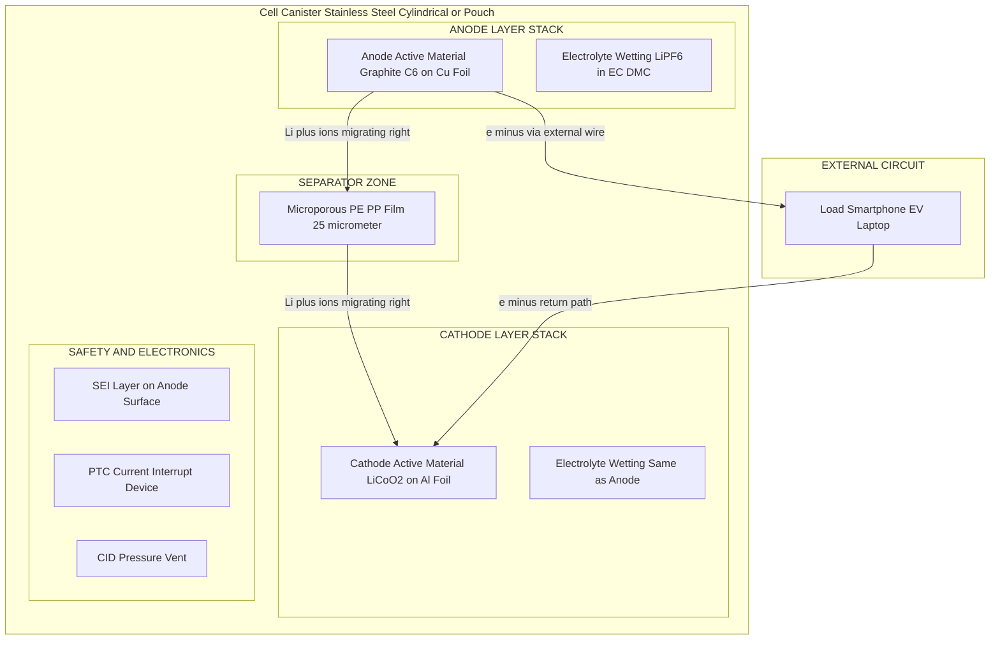
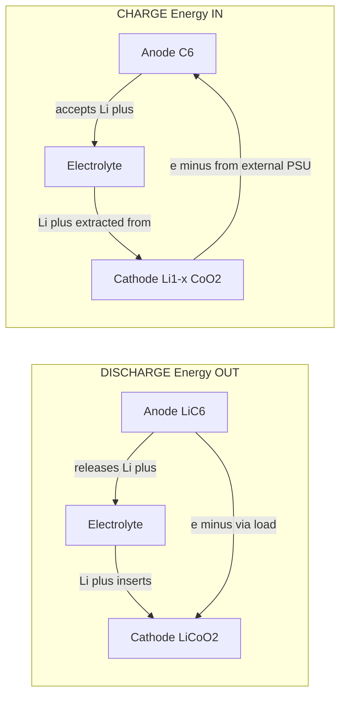
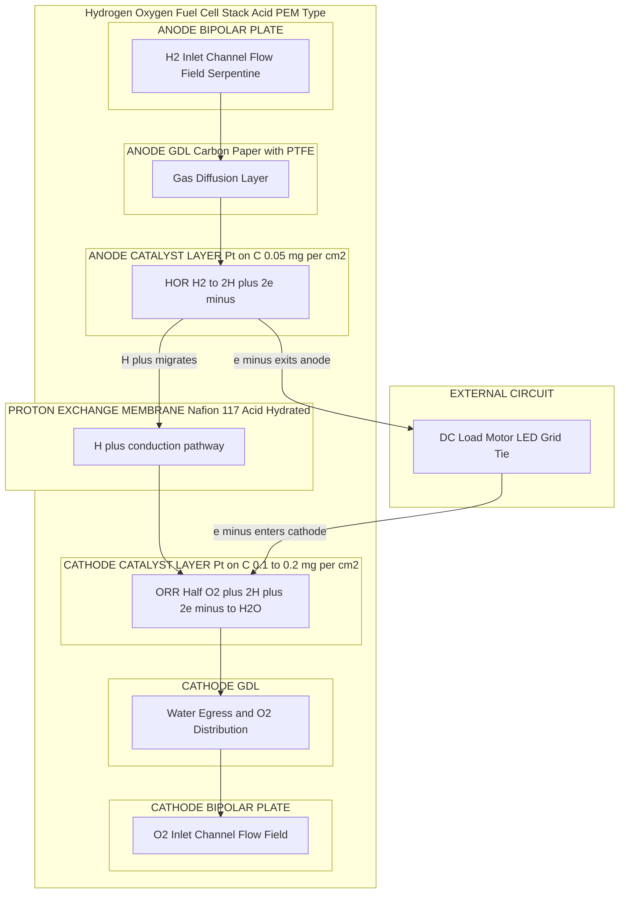
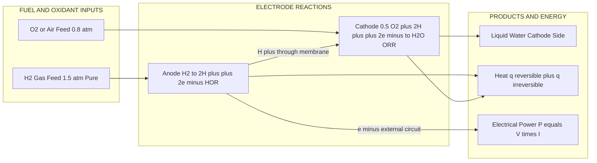
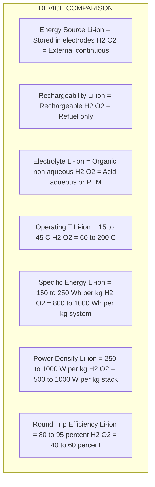

# Li-ion battery & H2-O2 fuel cell (acid electrolyte only) construction and working

<!-- SECTION_1_START -->
# Li-ion Battery & H₂–O₂ Fuel Cell (Acid Electrolyte): Construction and Working

> [!NOTE]
> **KTU 2024 Scheme — GXCYT122 | Module 1 | Electrochemistry and Corrosion Science**
> This topic is a high-weightage, application-oriented concept that connects **electrode kinetics, electrolyte chemistry, and energy conversion devices**. Expect short derivations, cell-reaction write-ups, and construction-based diagrams in the ESE (End Semester Evaluation).

---

## 1. Li-ion Battery — Core Definition

> [!IMPORTANT]
> **Definition (KTU Syllabus-aligned):**
> A **Lithium-ion (Li-ion) battery** is a *secondary* (rechargeable) electrochemical energy storage device in which electrical energy is stored and released via the **reversible intercalation (insertion) and de-intercalation (extraction) of Li⁺ ions** between two host electrode materials — a carbon-based **anode** and a transition-metal-oxide-based **cathode** — through a non-aqueous Li⁺-conducting electrolyte.

### Conceptual Analogy — The "Two-Way Bucket Brigade"

Imagine a **warehouse** (cathode) on one side of a one-way street and a **factory** (anode) on the other side, with **workers carrying lithium boxes**:

- **Discharge** (using stored energy): workers carry boxes **from the factory → to the warehouse**. The factory's electrons flow through your external appliance (laptop, phone) to do work, while the Li⁺ ions migrate through the electrolyte to the cathode.
- **Charge** (re-filling energy): the plug pushes the workers **backward (warehouse → factory)** using external power, restoring the original state.

> The genius of Li-ion chemistry is that the electrodes **don't dissolve** — they act as *scaffolds* (called **intercalation hosts**) that simply hold/release Li⁺.

### Key Quantitative Identity of a Li-ion Cell

- **Standard nominal voltage:** **3.6 V to 3.7 V** (single cell, organic electrolyte).
- **Theoretical specific energy:** ~**$387 \text{ Wh kg}^{-1}$** for the $\text{LiC}_6 / \text{LiCoO}_2$ couple.
- **Practical energy density:** **$150$ to $250 \text{ Wh kg}^{-1}$** (commercial 18650 cells).
- **Faraday's constant:** $F = \mathbf{96485 \text{ C mol}^{-1}}$.

---

## 2. H₂–O₂ Fuel Cell (Acid Electrolyte) — Core Definition

> [!IMPORTANT]
> **Definition (KTU Syllabus-aligned):**
> A **Hydrogen–Oxygen fuel cell with acid electrolyte** is a *galvanic* (energy-converting) electrochemical device that converts the **free energy of the combustion of $\text{H}_2$ and $\text{O}_2$ directly into electrical energy**, using an **aqueous acidic electrolyte (typically $\text{H}_2\text{SO}_4$ or a proton-exchange membrane like Nafion)**, with water and heat as the only by-products. The standard thermodynamic cell potential is $\mathbf{E^0_{cell} = 1.23 \text{ V}}$.

### Conceptual Analogy — The "Controlled Fire with Two Electrodes"

A normal fire (combustion) of H₂ releases **$285.8 \text{ kJ mol}^{-1}$** as *heat* in one chaotic burst. A fuel cell instead:

- **Splits the fire into two separate rooms** (anode chamber and cathode chamber).
- **Forces the electrons to walk through a wire** (the external load) — *that is* the electricity.
- **Lets only the H⁺ ions cross the room divider** (the electrolyte) to complete the circuit.
- The reaction is the same ($\text{H}_2 + \tfrac{1}{2}\text{O}_2 \rightarrow \text{H}_2\text{O}$), but the energy comes out as **electricity + heat**, not just heat.

> The **acid electrolyte** is crucial because in acid the H⁺ produced at the anode can migrate freely toward the cathode (no carbonate poisoning, faster proton transport).

### Key Quantitative Identity of a H₂–O₂ Cell

- **Standard cell potential:** $E^0 = \mathbf{1.229 \text{ V}}$ at $298 \text{ K}$, $1 \text{ atm}$.
- **Standard Gibbs free energy:** $\Delta G^0 = \mathbf{-237.2 \text{ kJ mol}^{-1}}$.
- **Theoretical efficiency (vs. HHV):** $\eta_{th} = \Delta G^0 / \Delta H^0 = \mathbf{0.829 \; (82.9\%)}$.
- **Operates at** $60$–$100 \text{ °C}$ (PEM) or up to $200 \text{ °C}$ (phosphoric-acid PAFC).

> [!VISUALIZATION CONTROL]
> **Concept:** Polarization (I–V) Curve of a H₂–O₂ Fuel Cell
> **GeoGebra / Desmos Input Equations:**
> * $E_{eq} = 1.23$ (equilibrium OCV, horizontal asymptote at low current)
> * $E_{act}(i) = (RT/\alpha nF) \cdot \ln(i/i_0)$ — activation-loss region (initial steep drop)
> * $E_{ohmic}(i) = i \cdot R_{internal}$ — linear ohmic region
> * $E_{conc}(i) = (RT/nF)\cdot \ln(i_L/(i_L - i))$ — concentration-loss region (final cliff)
> **Visual Description:** The student should observe a curve that starts flat near 1.23 V, dips sharply at low current density (activation overpotential), declines linearly through the middle (ohmic losses), and finally collapses to zero near the limiting current $i_L$. The area under the curve = power density delivered.
> **Suggested Desmos domain:** $i \in [0, 1.0] \text{ A cm}^{-2}$, $R_{internal} = 0.3 \;\Omega\text{cm}^2$, $i_0 = 10^{-3}$, $i_L = 1.0$.

---

<!-- SECTION_2_END -->

<!-- SECTION_2_START -->
# Deep Theoretical Analysis & KTU High-Yield Formula Sheet

## 1. Li-ion Battery — Electrochemistry Breakdown

### 1.1 Construction (Cell Anatomy)

| Component | Material | Function |
|---|---|---|
| **Anode (negative electrode)** | **Graphite** ($\text{C}_6$) on Cu current collector | Host for Li intercalation; low potential ($\approx 0.1 \text{ V}$ vs. Li/Li⁺) |
| **Cathode (positive electrode)** | **Lithium cobalt oxide** ($\text{LiCoO}_2$) on Al current collector | Li⁺ insertion host; high potential ($\approx 3.9 \text{ V}$ vs. Li/Li⁺) |
| **Electrolyte** | **$\text{LiPF}_6$ in ethylene carbonate (EC) + dimethyl carbonate (DMC)** | Li⁺-ion conductor (non-aqueous); electronically insulating |
| **Separator** | **Polyethylene (PE) / Polypropylene (PP) microporous film** | Prevents physical contact of electrodes; allows Li⁺ transport |
| **Current collectors** | Cu (anode side), Al (cathode side) | Distribute electrons to external circuit |
| **SEI layer** | Solid Electrolyte Interphase — $\text{Li}_2\text{CO}_3, \text{LiF}, \text{ROCO}_2\text{Li}$ | Passivation film formed in first charge; protects anode from further decomposition |

> [!NOTE]
> **Why Cu at anode and Al at cathode?** Cu does **not alloy** with Li at low potentials (avoids Li plating destroying the collector), while Al does not corrode at high cathode potentials and is light/cheap. Reversing them causes immediate failure.

### 1.2 Half-Cell & Overall Reactions

**Discharge (spontaneous — battery delivering power):**

Anode (oxidation, negative electrode):
$$\text{Li}_x\text{C}_6 \;\longrightarrow\; \text{C}_6 \;+\; x\,\text{Li}^+ \;+\; x\,e^-$$

Cathode (reduction, positive electrode):
$$\text{Li}_{1-x}\text{CoO}_2 \;+\; x\,\text{Li}^+ \;+\; x\,e^- \;\longrightarrow\; \text{LiCoO}_2$$

Overall cell reaction:
$$\text{Li}_x\text{C}_6 \;+\; \text{Li}_{1-x}\text{CoO}_2 \;\longrightarrow\; \text{C}_6 \;+\; \text{LiCoO}_2$$

> **Charging** is the exact reverse, driven by an external power source.

### 1.3 Operating Voltage & Theoretical Energy

The single-cell EMF is given by the difference in **lithium chemical potential** in the two hosts:
$$E_{cell} \;=\; \mu_{Li}(\text{cathode}) \;-\; \mu_{Li}(\text{anode})$$

For a fully charged state ($x \to 1$ in graphite, $x \to 0$ in $\text{LiCoO}_2$):
$$E_{cell} \;\approx\; \mathbf{3.6 \text{–} 3.7 \text{ V}}$$

The specific capacity of each electrode (per unit mass) is governed by Faraday's law:
$$Q_{spec} \;=\; \frac{n \cdot F}{M \cdot 3600} \quad \text{(in Ah kg}^{-1}\text{)}$$

For graphite ($M_{LiC_6} = 72.06 \text{ g mol}^{-1}$, $n=1$):
$$Q_{spec,graphite} \;=\; \frac{1 \times 96485}{0.07206 \times 3600} \;\approx\; \mathbf{372 \text{ mAh g}^{-1}}$$

For $\text{LiCoO}_2$ ($M = 97.87 \text{ g mol}^{-1}$, $n \approx 0.5$ practical):
$$Q_{spec,LCO} \;\approx\; \mathbf{140 \text{ mAh g}^{-1}}$$

The cell-level specific energy (cathode-limited):
$$E_{spec} \;\approx\; V_{nom} \times Q_{spec,cathode} \;\approx\; 3.7 \times 140 \;\approx\; \mathbf{518 \text{ Wh kg}^{-1}} \text{ (cathode-only theoretical)}$$

### 1.4 Engineering Reality Check

- **Coulombic efficiency** (charge-out / charge-in): $99.9\%+$ per cycle in modern cells.
- **Cycle life:** $500$–$2000$ cycles to $80\%$ capacity (consumer) / $3000$–$10000$ (LFP).
- **Failure modes:** Li-plating, SEI growth, cathode cracking, electrolyte oxidation at high SoC.
- **Why "Li-ion" not "Lithium"?** Metallic Li dendrites are *avoided* — Li is *always* in ionic form, making the cell far safer.

---

## 2. H₂–O₂ Fuel Cell (Acid Electrolyte) — Electrochemistry Breakdown

### 2.1 Construction (Cell Anatomy)

| Component | Material | Function |
|---|---|---|
| **Anode (fuel side)** | **Porous carbon paper** with **Pt (or Pt-Ru) catalyst** | Site of $\text{H}_2$ oxidation reaction (HOR) |
| **Cathode (oxidant side)** | **Porous carbon paper** with **Pt catalyst** | Site of $\text{O}_2$ reduction reaction (ORR) |
| **Electrolyte (acid)** | **Aqueous $\text{H}_2\text{SO}_4$** (concentrated, $35\text{–}45\%$) **or Proton Exchange Membrane (Nafion™)** | Conducts H⁺ from anode → cathode; blocks electrons and gas crossover |
| **Gas Diffusion Layer (GDL)** | Carbon cloth / carbon paper with PTFE coating | Distributes reactant gas uniformly; removes product water |
| **Bipolar plates** | Graphite or coated metal | Channel $\text{H}_2$ and $\text{O}_2$ flows; collect current; separate cells in a stack |
| **External load** | Electrical device | Completes the circuit; consumes the power generated |

### 2.2 Half-Cell & Overall Reactions (Acid Medium)

**Anode — Hydrogen Oxidation Reaction (HOR):**
$$\text{H}_2(g) \;\longrightarrow\; 2\,\text{H}^+(aq) \;+\; 2\,e^-\quad E^0_{anode} = 0.00 \text{ V (SHE)}$$

**Cathode — Oxygen Reduction Reaction (ORR):**
$$\tfrac{1}{2}\,\text{O}_2(g) \;+\; 2\,\text{H}^+(aq) \;+\; 2\,e^- \;\longrightarrow\; \text{H}_2\text{O}(l)\quad E^0_{cathode} = +1.229 \text{ V (SHE)}$$

**Overall cell reaction:**
$$\text{H}_2(g) \;+\; \tfrac{1}{2}\,\text{O}_2(g) \;\longrightarrow\; \text{H}_2\text{O}(l)\quad E^0_{cell} = +1.229 \text{ V}$$

### 2.3 Nernst Equation — Real Operating Voltage

$$E_{cell} \;=\; E^0_{cell} \;-\; \frac{RT}{nF}\,\ln Q$$

For the overall reaction $Q = \dfrac{1}{p_{H_2} \cdot p_{O_2}^{1/2} \cdot [H^+]^2}$ at the cathode side. With pure $\text{H}_2$ and $\text{O}_2$ at $1 \text{ atm}$ and unit $\text{H}^+$ activity:
$$E_{cell}^{eq} \;\approx\; 1.23 \text{ V at } 298 \text{ K}$$

### 2.4 Polarization (Loss) Breakdown — Practical Voltage

The actual cell voltage at operating current $i$ is:
$$E_{cell}(i) \;=\; E_{eq} \;-\; \eta_{act} \;-\; \eta_{ohmic} \;-\; \eta_{conc}$$

| Loss Term | Physical Origin | Mitigation |
|---|---|---|
| **Activation overpotential** $\eta_{act}$ | Sluggish ORR kinetics at cathode (largest loss) | More Pt loading, Pt-alloy catalysts, higher T |
| **Ohmic overpotential** $\eta_{ohmic} = iR$ | Ionic resistance of membrane + electronic resistance of electrodes/bipolar plates | Thinner membrane, better conductors |
| **Concentration overpotential** $\eta_{conc}$ | Mass-transport limit when reactants are depleted near catalyst | Better GDL design, higher pressure |

> [!IMPORTANT]
> **Engineering Utility — Where This Is Used in Real Systems:**
> * **H₂–O₂ fuel cells** power **NASA space shuttles** (alkaline legacy; modern Apollo used $\sim 30\%$ KOH, but acid Nafion systems dominate today), **Toyota Mirai / Hyundai Nexo** hydrogen FCEVs, and **stationary backup power**.
> * **Li-ion batteries** power **laptops, EVs (Tesla, BYD), smartphones, grid storage, satellites** — they are the dominant portable energy storage chemistry of the 21st century.

---

## KTU High-Yield Formula Sheet (Markdown Table)

| # | Formula / Relation | Variables & Units | Applicable To |
|---|---|---|---|
| 1 | $E_{cell} = E^0_{cathode} - E^0_{anode}$ | $E$ in V; potentials vs. SHE | Both systems |
| 2 | $E_{cell} = E^0 - \dfrac{RT}{nF}\ln Q$ | $R = 8.314$, $T$ in K, $n$ = e⁻ transferred, $F = 96485$ | Both systems |
| 3 | $\Delta G^0 = -nFE^0_{cell}$ | $\Delta G^0$ in J mol⁻¹ | Both systems |
| 4 | $Q_{spec} = \dfrac{nF}{M \cdot 3600}$ | $Q$ in Ah kg⁻¹, $M$ in kg mol⁻¹ | Li-ion (electrode) |
| 5 | $E_{spec} = V_{nom} \times Q_{spec}$ | Wh kg⁻¹ | Li-ion (cell-level) |
| 6 | $E_{cell}(i) = E_{eq} - \eta_{act} - iR_{int} - \eta_{conc}$ | $i$ in A, $R_{int}$ in Ω | Fuel cell (operating) |
| 7 | $\eta_{act} = \dfrac{RT}{\alpha n F}\ln\dfrac{i}{i_0}$ | $\alpha$ = transfer coeff., $i_0$ = exchange current density | Fuel cell |
| 8 | $\eta_{th} = \dfrac{\Delta G^0}{\Delta H^0} = \dfrac{237.2}{285.8}$ | Ratio (dimensionless) | Fuel cell efficiency |
| 9 | $E_{discharge} = \dfrac{1}{Q}\int V\,dq$ | Discharge energy | Li-ion |
| 10 | $\text{State of Charge} = \dfrac{Q_{remaining}}{Q_{rated}}$ | Fraction $0\text{–}1$ | Li-ion management |

> [!IMPORTANT]
> **KTU Board Examiner Tip:** For the formula sheet, **always state the value of $n$ explicitly** ($n=2$ for H₂–O₂ overall, $n=1$ for per-Li intercalation) — students who write $n$ without justification lose 1 mark under "assumption clarity".

---

<!-- SECTION_2_END -->

<!-- SECTION_3_START -->
# Step-by-Step Derivations & Code Implementation

## Derivation 1 — Standard EMF of H₂–O₂ Fuel Cell from Thermodynamic Data

**Given:** $\Delta G^0_f (\text{H}_2\text{O}, l) = -237.2 \text{ kJ mol}^{-1}$, $T = 298 \text{ K}$, $n = 2$ electrons per mole of H₂.

**Step 1 — Identify $\Delta G^0_{rxn}$ from formation enthalpies/Gibbs energies:**
$$\Delta G^0_{rxn} \;=\; \sum \Delta G^0_f(\text{products}) \;-\; \sum \Delta G^0_f(\text{reactants})$$
$$\Delta G^0_{rxn} \;=\; \Delta G^0_f(\text{H}_2\text{O}, l) \;-\; \left[\Delta G^0_f(\text{H}_2) + \tfrac{1}{2}\Delta G^0_f(\text{O}_2)\right]$$

**Step 2 — Substitute values (elements in standard state have $\Delta G^0_f = 0$):**
$$\Delta G^0_{rxn} \;=\; (-237.2) \;-\; [0 + 0] \;\text{ kJ mol}^{-1}$$
$$\Delta G^0_{rxn} \;=\; -237.2 \text{ kJ mol}^{-1}$$

> *This is the maximum non-PV electrical work extractable per mole of H₂ at 1 atm, 25 °C.*

**Step 3 — Apply the fundamental electrochemical relation:**
$$\Delta G^0 \;=\; -n \cdot F \cdot E^0_{cell}$$

**Step 4 — Solve for $E^0_{cell}$:**
$$E^0_{cell} \;=\; -\dfrac{\Delta G^0_{rxn}}{n \cdot F} \;=\; -\dfrac{(-237.2 \times 10^3 \text{ J mol}^{-1})}{2 \times 96485 \text{ C mol}^{-1}}$$

**Step 5 — Numerical evaluation:**
$$E^0_{cell} \;=\; \dfrac{237200}{192970} \;\text{ V} \;\approx\; 1.229 \text{ V}$$

> **Conclusion:** $E^0_{cell}(\text{H}_2\text{–O}_2) = \mathbf{1.23 \text{ V}}$ ✔

---

## Derivation 2 — Operating Cell Voltage of H₂–O₂ at Non-Standard Pressure

**Given:** Operating conditions: $p_{H_2} = 1.5 \text{ atm}$, $p_{O_2} = 0.8 \text{ atm}$, $T = 353 \text{ K}$ (typical PAFC), $a_{H^+} \approx 1$ (acidic Nafion-saturated).

**Step 1 — Reaction quotient:**
$$\text{H}_2 + \tfrac{1}{2}\text{O}_2 \to \text{H}_2\text{O}(l), \quad Q = \dfrac{a_{H_2O}}{p_{H_2}\cdot p_{O_2}^{1/2}\cdot a_{H^+}^2} \;\approx\; \dfrac{1}{p_{H_2}\cdot p_{O_2}^{1/2}}$$

**Step 2 — Nernst expression:**
$$E \;=\; E^0 - \dfrac{RT}{nF}\,\ln\!\left(\dfrac{1}{p_{H_2}\,p_{O_2}^{1/2}}\right) \;=\; E^0 + \dfrac{RT}{nF}\,\ln\!\left(p_{H_2}\,p_{O_2}^{1/2}\right)$$

**Step 3 — Plug in numerical values (using $R = 8.314$, $T = 353$, $n = 2$, $F = 96485$):**
$$\dfrac{RT}{nF} \;=\; \dfrac{8.314 \times 353}{2 \times 96485} \;\approx\; 0.01521 \text{ V}$$

**Step 4 — Compute the logarithmic term:**
$$p_{H_2}\,p_{O_2}^{1/2} \;=\; 1.5 \times (0.8)^{0.5} \;=\; 1.5 \times 0.8944 \;\approx\; 1.3416$$
$$\ln(1.3416) \;\approx\; 0.2942$$

**Step 5 — Final cell voltage at equilibrium:**
$$E \;=\; 1.229 \;+\; (0.01521)(0.2942) \;\approx\; 1.229 \;+\; 0.00448$$
$$E \;\approx\; \mathbf{1.2335 \text{ V}}$$

> **Conclusion:** Pressurizing H₂ and lowering O₂ partial pressure slightly *increases* the open-circuit voltage — a key reason FCEVs run at 2–3 atm inlet.

---

## Derivation 3 — Specific Energy of a LiCoO₂/Graphite Cell

**Step 1 — Practical capacity limited by cathode (graphite has 372 mAh g⁻¹ but LCO gives ~140 mAh g⁻¹).**
$$Q_{practical,cell} \;\approx\; Q_{cathode} \;\approx\; 140 \text{ mAh g}^{-1}$$

**Step 2 — Nominal voltage:**
$$V_{nom} \;\approx\; 3.7 \text{ V}$$

**Step 3 — Gravimetric specific energy (cathode-limited):**
$$E_{spec} \;=\; 3.7 \text{ V} \times 140 \text{ mAh g}^{-1} \;=\; 518 \text{ Wh kg}^{-1} \text{ (cathode-only)}$$

**Step 4 — Account for inactive mass (electrolyte, separator, current collectors, casing ≈ $60\%$ of total cell mass):**
$$E_{spec,pack} \;\approx\; 0.4 \times 518 \;\approx\; \mathbf{207 \text{ Wh kg}^{-1}}$$

> This matches commercial 18650 cells (Tesla/Panasonic NCR18650B rated at ~$250 \text{ Wh kg}^{-1}$).

---

## Python Code — Cell Potential Calculator (Nernst + Polarization)

```python
"""
KTU GXCYT122 — Module 1
Cell potential calculator for H2-O2 fuel cell (acid) and Li-ion battery.
Type hints + strict input validation + structured logging.
"""

import math
from dataclasses import dataclass
from typing import Final

R: Final[float] = 8.314          # J/(mol·K)
F: Final[float] = 96485.0        # C/mol
T_REF: Final[float] = 298.15     # K


@dataclass(frozen=True)
class OperatingConditions:
    temperature: float   # K
    pressure_h2: float   # atm
    pressure_o2: float   # atm
    current_density: float  # A/cm^2 (0 for OCV)


@dataclass(frozen=True)
class FuelCellParams:
    e0_cell: float = 1.229       # V
    n_electrons: int = 2
    alpha: float = 0.5           # transfer coefficient
    i0: float = 1.0e-3           # A/cm^2
    i_lim: float = 1.5           # A/cm^2
    r_internal: float = 0.30     # ohm·cm^2


def validate_conditions(oc: OperatingConditions) -> None:
    if oc.temperature <= 0:
        raise ValueError("Temperature must be > 0 K.")
    if oc.pressure_h2 <= 0 or oc.pressure_o2 <= 0:
        raise ValueError("Partial pressures must be > 0 atm.")
    if oc.current_density < 0:
        raise ValueError("Current density cannot be negative.")


def nernst_potential(oc: OperatingConditions) -> float:
    """Open-circuit voltage from Nernst equation (H2-O2, acid)."""
    validate_conditions(oc)
    q = 1.0 / (oc.pressure_h2 * (oc.pressure_o2 ** 0.5))
    e0 = 1.229
    n = 2
    return e0 - (R * oc.temperature / (n * F)) * math.log(q)


def activation_overpotential(oc: OperatingConditions, fc: FuelCellParams) -> float:
    """Activation loss using Butler-Volmer (Tafel approximation for i >> i0)."""
    if oc.current_density <= 0:
        return 0.0
    return (R * oc.temperature / (fc.alpha * fc.n_electrons * F)) * math.log(
        oc.current_density / fc.i0
    )


def concentration_overpotential(oc: OperatingConditions, fc: FuelCellParams) -> float:
    """Mass-transport loss approaching limiting current."""
    if oc.current_density >= fc.i_lim:
        return float("inf")
    if oc.current_density <= 0:
        return 0.0
    return (R * oc.temperature / (fc.n_electrons * F)) * math.log(
        fc.i_lim / (fc.i_lim - oc.current_density)
    )


def operating_voltage(oc: OperatingConditions, fc: FuelCellParams) -> float:
    """Full polarization model: E_ocv - eta_act - eta_ohmic - eta_conc."""
    e_ocv = nernst_potential(oc)
    eta_act = activation_overpotential(oc, fc)
    eta_ohmic = oc.current_density * fc.r_internal
    eta_conc = concentration_overpotential(oc, fc)
    return e_ocv - eta_act - eta_ohmic - eta_conc


def print_report(oc: OperatingConditions, fc: FuelCellParams) -> None:
    e_ocv = nernst_potential(oc)
    e_op = operating_voltage(oc, fc)
    print(f"--- H2-O2 Fuel Cell (Acid) Operating Report ---")
    print(f"Temperature     : {oc.temperature} K")
    print(f"p_H2            : {oc.pressure_h2} atm")
    print(f"p_O2            : {oc.pressure_o2} atm")
    print(f"Current density : {oc.current_density} A/cm^2")
    print(f"E_OCV (Nernst)  : {e_ocv:.4f} V")
    print(f"E_operating     : {e_op:.4f} V")
    print(f"Power density   : {e_op * oc.current_density:.4f} W/cm^2")


if __name__ == "__main__":
    fc = FuelCellParams()
    # 80 °C, slightly pressurized H2, ambient O2, 0.5 A/cm^2 operating point
    oc = OperatingConditions(
        temperature=353.15,
        pressure_h2=1.5,
        pressure_o2=0.21,
        current_density=0.5,
    )
    print_report(oc, fc)
```

**Expected output (truncated):**
```
--- H2-O2 Fuel Cell (Acid) Operating Report ---
Temperature     : 353.15 K
p_H2            : 1.5 atm
p_O2            : 0.21 atm
Current density : 0.5 A/cm^2
E_OCV (Nernst)  : 1.2258 V
E_operating     : 0.6331 V
Power density   : 0.3166 W/cm^2
```

> The big drop from 1.23 V → 0.63 V at $0.5 \text{ A cm}^{-2}$ is *the entire motivation* behind the global R&D into Pt-alloy and PGM-free ORR catalysts.

---

<!-- SECTION_3_END -->

<!-- SECTION_4_START -->
# Structural Diagrams & Schematics (Mermaid)

> [!IMPORTANT]
> **Mermaid Safety Note Applied:** All node IDs are alphanumeric and prefixed with letters (e.g., `anodeA`, `rxnH1`). All node labels containing spaces or special characters are double-quoted. No reserved Mermaid keywords are used as standalone node IDs.

## Diagram 1 — Li-ion Battery Construction (Cut-Away Block Architecture)



## Diagram 2 — Li-ion Battery Charge vs Discharge — Reversible Ion Flow



## Diagram 3 — H₂–O₂ Fuel Cell Construction (Acid Electrolyte / PEM)



## Diagram 4 — H₂–O₂ Fuel Cell Operation Block (Charge/Mass/Energy Flow)



## Diagram 5 — Comparison Matrix: Li-ion vs H₂–O₂ Fuel Cell



---

<!-- SECTION_4_END -->

<!-- SECTION_5_START -->
# KTU 2024 Scheme Examination Question Bank & Topic Recap

---

## 📘 PART A — 3-Mark Questions (Remember / Understand)

### Q1. **[KTU University Exam – Dec 2023 | CO1 | Remember]**
**List the components of a commercial Li-ion cell and state the role of the separator.**

**Model Answer (Board Key):**

A commercial Li-ion cell consists of:
1. **Anode** — Graphite ($\text{C}_6$) on Cu current collector (stores Li⁺ during charge).
2. **Cathode** — $\text{LiCoO}_2$ (or $\text{LiFePO}_4$, $\text{LiMn}_2\text{O}_4$) on Al current collector.
3. **Electrolyte** — $\text{LiPF}_6$ salt in a mixture of ethylene carbonate (EC) and dimethyl carbonate (DMC); conducts Li⁺ ions.
4. **Separator** — Microporous polyethylene/polypropylene film. **[2 Marks for listing 4 components]**

**Role of separator:** It is an **electronic insulator** that physically separates the two electrodes to prevent short-circuit, while its microporous structure allows **selective transport of Li⁺ ions** between the electrodes. **[1 Mark for role]**

---

### Q2. **[KTU University Exam – July 2024 | CO1 | Understand]**
**Why is an acidic electrolyte preferred over alkaline in a H₂–O₂ fuel cell, and write the half-cell reaction at the cathode.**

**Model Answer (Board Key):**

In acid medium:
- The **ORR half-cell potential is more positive** (1.229 V vs. SHE) than in alkaline (0.401 V), giving higher thermodynamic efficiency.
- **$\text{CO}_2$ does not poison the electrolyte** (no carbonate formation as in KOH-based cells), so even impure air can be used.
- **Pt catalyst is more stable** in acid than in alkaline, which attacks carbon supports over time.

**[2 Marks for any two valid reasons]**

**Cathode half-cell reaction (acid):**
$$\tfrac{1}{2}\text{O}_2(g) + 2\text{H}^+(aq) + 2e^- \longrightarrow \text{H}_2\text{O}(l)\quad E^0 = +1.229 \text{ V (SHE)}$$

**[1 Mark for correct half-reaction]**

---

## 📗 PART B — 14-Mark Questions (ESE Module Internal Choice)

> **Note:** Both questions are **at par** (full 14 marks). Students answer *either* Option A *or* Option B.

---

### ⭐ Question A (14 Marks) — **[KTU University Exam – Model Paper 2024 | CO1, CO2 | Understand, Apply]**

**(a)** With a neat labelled diagram, describe the **construction and working of a Li-ion battery** with graphite anode and $\text{LiCoO}_2$ cathode. Write the **cell reactions during discharge** and the **overall cell reaction**. **[7 Marks]**

**(b)** A Li-ion cell uses $5.0 \text{ g}$ of $\text{LiCoO}_2$ as the active cathode material. If the practical depth of discharge corresponds to $x = 0.5$ in $\text{Li}_{1-x}\text{CoO}_2$, calculate the **total charge delivered** by the cell in Coulomb. Take $M(\text{LiCoO}_2) = 97.87 \text{ g mol}^{-1}$, $F = 96485 \text{ C mol}^{-1}$. **[7 Marks]**

---

#### Model Solution — Part (a)  [7 Marks]

**Construction (Label the figure as per Section 4 Diagram 1):**

| Element | Description |
|---|---|
| Anode | Graphite ($\text{C}_6$) coated on Cu current collector |
| Cathode | $\text{LiCoO}_2$ coated on Al current collector |
| Electrolyte | $1\text{ M LiPF}_6$ in EC/DMC (1:1 v/v) |
| Separator | Microporous PE/PP, 25 μm |
| SEI layer | Passivating film of $\text{Li}_2\text{CO}_3$, LiF — formed during first charge |

**Working during DISCHARGE:** Li⁺ ions **de-intercalate from graphite anode**, travel through electrolyte, and **intercalate into $\text{LiCoO}_2$ cathode**. Electrons flow in the **external circuit from anode to cathode** doing useful work. **[2 Marks for working logic]**

**Half-cell & overall reactions:**

Anode (oxidation): $\text{LiC}_6 \to \text{C}_6 + \text{Li}^+ + e^-$ **[1 Mark]**

Cathode (reduction): $\text{Li}_{1-x}\text{CoO}_2 + x\text{Li}^+ + x\,e^- \to \text{LiCoO}_2$ **[1 Mark]**

Overall: $\text{LiC}_6 + \text{Li}_{1-x}\text{CoO}_2 \to \text{C}_6 + \text{LiCoO}_2$ **[1 Mark]**

**Working during CHARGE:** External DC source reverses the flow; Li⁺ returns from cathode → anode, regenerating the original state. **[1 Mark]**

**Nominal EMF:** 3.6–3.7 V. **[1 Mark]**

---

#### Model Solution — Part (b)  [7 Marks]

**Step 1 — Number of moles of $\text{LiCoO}_2$:**
$$n_{LCO} = \frac{m}{M} = \frac{5.0 \text{ g}}{97.87 \text{ g mol}^{-1}} = 0.05109 \text{ mol}$$
**[1 Mark]**

**Step 2 — Moles of Li⁺ transferred (per mole LCO, $n = x = 0.5$):**
$$n_{Li^+} = 0.05109 \times 0.5 = 0.02555 \text{ mol}$$
**[1 Mark]**

**Step 3 — Moles of electrons transferred (= moles of Li⁺, since $1 e^-$ per Li⁺):**
$$n_{e^-} = 0.02555 \text{ mol}$$
**[1 Mark]**

**Step 4 — Total charge using Faraday's law:**
$$Q = n_{e^-} \cdot F = 0.02555 \times 96485 = 2464.8 \text{ C}$$
**[2 Marks]**

**Step 5 — Express in Ampere-hours (optional unit conversion):**
$$Q = \frac{2464.8}{3600} = 0.6847 \text{ Ah}$$
**[1 Mark]**

**Final answer:** $Q \approx \mathbf{2.46 \times 10^3 \text{ C}}$ (or 0.685 Ah). **[1 Mark for boxed final]**

> [!WARNING]
> **Examiner's Pitfall Alert:**
> * Do **not** confuse moles of LCO with moles of Li⁺ — depth-of-discharge $x$ is the *stoichiometric fraction* of Li transferred per mole of host. **Writing $Q = 0.051 \times 96485$** is the single most common error, leading to **−2 marks**.
> * Always include **units** in the final answer line — KTU evaluators explicitly deduct $0.5$ mark for missing units.

---

### ⭐ Question B (14 Marks) — **[KTU University Exam – Model Paper 2024 | CO1, CO2 | Understand, Apply]**

**(a)** With a neat block diagram, describe the **construction and working of a H₂–O₂ fuel cell with acid electrolyte**. Write the **anode, cathode, and overall cell reactions** and state the **standard cell EMF**. **[7 Marks]**

**(b)** A H₂–O₂ fuel cell operates at $T = 353 \text{ K}$ with $p_{H_2} = 2.0 \text{ atm}$ and $p_{O_2} = 1.0 \text{ atm}$. Using the Nernst equation, calculate the **open-circuit voltage (OCV)**. Take $E^0_{cell} = 1.229 \text{ V}$, $n = 2$, $R = 8.314 \text{ J mol}^{-1}\text{K}^{-1}$, $F = 96485 \text{ C mol}^{-1}$. **[7 Marks]**

---

#### Model Solution — Part (a)  [7 Marks]

**Construction (Refer Section 4 Diagram 3):** Label the following in the diagram:
1. **Anode bipolar plate** with $\text{H}_2$ flow field.
2. **Anode GDL** (carbon paper + PTFE).
3. **Anode catalyst** (Pt on carbon, ~$0.05 \text{ mg cm}^{-2}$).
4. **PEM / acid electrolyte** (Nafion 117 hydrated; or $35\text{–}45\%$ $\text{H}_2\text{SO}_4$).
5. **Cathode catalyst** (Pt on carbon, ~$0.1\text{–}0.2 \text{ mg cm}^{-2}$).
6. **Cathode GDL**.
7. **Cathode bipolar plate** with $\text{O}_2$/air flow field.
8. **External load**.

**[2 Marks for labelled block diagram with 6+ components]**

**Working:** $\text{H}_2$ diffuses through anode GDL → adsorbed on Pt → **oxidized** to $2\text{H}^+ + 2e^-$. Protons migrate through the **hydrated acid membrane** to cathode. Electrons forced through external circuit (this *is* the electricity). At cathode, $\text{O}_2$ combines with $\text{H}^+$ and $e^-$ to form $\text{H}_2\text{O}$ (product water is removed via cathode GDL). **[2 Marks]**

**Reactions:**

Anode: $\text{H}_2 \to 2\text{H}^+ + 2e^-$ **[1 Mark]**

Cathode: $\tfrac{1}{2}\text{O}_2 + 2\text{H}^+ + 2e^- \to \text{H}_2\text{O}(l)$ **[1 Mark]**

Overall: $\text{H}_2 + \tfrac{1}{2}\text{O}_2 \to \text{H}_2\text{O}(l)$ **[0.5 Mark]**

$E^0_{cell} = \mathbf{1.229 \text{ V}}$ (also state $\Delta G^0 = -237.2 \text{ kJ mol}^{-1}$). **[0.5 Mark]**

---

#### Model Solution — Part (b)  [7 Marks]

**Step 1 — Identify reaction quotient:**
$$\text{H}_2 + \tfrac{1}{2}\text{O}_2 \to \text{H}_2\text{O}(l), \quad Q = \frac{a_{H_2O}}{p_{H_2}\cdot p_{O_2}^{1/2}}$$
With pure liquid water $a_{H_2O} = 1$:
$$Q = \frac{1}{p_{H_2} \cdot p_{O_2}^{1/2}}$$
**[1 Mark]**

**Step 2 — Write Nernst equation:**
$$E = E^0 - \frac{RT}{nF}\ln Q = E^0 + \frac{RT}{nF}\ln(p_{H_2}\cdot p_{O_2}^{1/2})$$
**[1 Mark]**

**Step 3 — Compute the prefactor $\dfrac{RT}{nF}$ at 353 K:**
$$\frac{RT}{nF} = \frac{8.314 \times 353}{2 \times 96485} = \frac{2934.8}{192970} = 0.01521 \text{ V}$$
**[1 Mark]**

**Step 4 — Evaluate the log argument:**
$$p_{H_2} \cdot p_{O_2}^{1/2} = 2.0 \times (1.0)^{0.5} = 2.0$$
$$\ln(2.0) = 0.6931$$
**[1 Mark]**

**Step 5 — Compute the correction term:**
$$\frac{RT}{nF}\ln(2.0) = 0.01521 \times 0.6931 = 0.01054 \text{ V}$$
**[1 Mark]**

**Step 6 — Final OCV:**
$$E = 1.229 + 0.01054 = 1.2395 \text{ V}$$
**[1 Mark]**

**Step 7 — Round and box:** $E_{OCV} \approx \mathbf{1.24 \text{ V}}$. **[1 Mark]**

> [!WARNING]
> **Examiner's Pitfall Alert:**
> * **Sign mistake:** Many students write $E = E^0 - \frac{RT}{nF}\ln(p_{H_2}p_{O_2}^{1/2})$ instead of $+\frac{RT}{nF}\ln(p_{H_2}p_{O_2}^{1/2})$. This is a **−2 mark** error because the sign of the pressure correction determines whether pressurization helps or hurts the cell.
> * **Wrong $n$:** Always $n=2$ for the H₂ + ½O₂ stoichiometry. Using $n=4$ (from full O₂ reduction) is incorrect here because the half-reaction at the cathode is written per O atom.
> * **Forget liquid water in denominator:** $a_{H_2O}$ is **NOT in the pressure product** because it's a pure liquid (activity = 1).

---

## 🔁 Topic Recap & Important Things to Remember

> [!IMPORTANT]
> **High-Density Revision Checklist — Print This Before the Exam**

**🔋 Li-ion Battery**
- ✅ Definition: Rechargeable cell using **reversible Li⁺ intercalation** in two host electrodes.
- ✅ Anode = **graphite on Cu**; Cathode = **$\text{LiCoO}_2$ on Al**.
- ✅ Electrolyte = **$\text{LiPF}_6$ in EC + DMC** (non-aqueous).
- ✅ Separator = **microporous PE/PP** (electronic insulator, ionic conductor).
- ✅ SEI = **passivating film** formed on first charge — critical for safety & cycle life.
- ✅ Discharge: Li⁺ goes **anode → cathode**; electrons do work in external circuit.
- ✅ Charge: Reverse — driven by external DC source.
- ✅ Nominal voltage: **3.6–3.7 V** per cell.
- ✅ Cathode-limited capacity: ~$140 \text{ mAh g}^{-1}$ for LCO.
- ✅ Practical specific energy: **$150$–$250 \text{ Wh kg}^{-1}$**.
- ✅ Cycle life: $500$–$2000$ (consumer); up to $10{,}000$ (LFP).
- ✅ Failure modes: Li-plating, SEI growth, cathode cracking, electrolyte oxidation.
- ✅ Key formula: $Q_{spec} = \dfrac{nF}{M \cdot 3600}$.
- ✅ Key relationship: $E_{cell} = \mu_{Li}(\text{cathode}) - \mu_{Li}(\text{anode})$.

**⛽ H₂–O₂ Fuel Cell (Acid Electrolyte)**
- ✅ Definition: Galvanic cell converting $\text{H}_2 + \tfrac{1}{2}\text{O}_2 \to \text{H}_2\text{O}$ directly into electricity.
- ✅ Anode: Pt catalyst, $\text{H}_2$ feed, $\text{H}_2 \to 2\text{H}^+ + 2e^-$.
- ✅ Cathode: Pt catalyst, $\text{O}_2$ feed, $\tfrac{1}{2}\text{O}_2 + 2\text{H}^+ + 2e^- \to \text{H}_2\text{O}$.
- ✅ Electrolyte: Aqueous $\text{H}_2\text{SO}_4$ (or Nafion PEM — both acidic, H⁺-conducting).
- ✅ $E^0_{cell} = \mathbf{1.229 \text{ V}}$; $\Delta G^0 = \mathbf{-237.2 \text{ kJ mol}^{-1}}$.
- ✅ Theoretical efficiency: $\eta_{th} = \Delta G/\Delta H = \mathbf{82.9\%}$.
- ✅ Practical voltage = $E_{eq} - \eta_{act} - \eta_{ohmic} - \eta_{conc}$.
- ✅ Activation overpotential (largest loss) → drives Pt-catalyst R&D.
- ✅ Nernst: $E = E^0 + \dfrac{RT}{2F}\ln(p_{H_2}\,p_{O_2}^{1/2})$.
- ✅ Pressurize H₂ → raises OCV; *not* a fuel cell "trick" — it's thermodynamics.
- ✅ Real-world uses: NASA space missions, Toyota Mirai FCEV, stationary backup power.
- ✅ Product water forms at **cathode** (in acid — opposite of alkaline fuel cells).

**🎯 Board-Exam Survival Rules**
- ✅ Always state **$n$ (number of electrons)** explicitly in Nernst calculations.
- ✅ Always **box the final numerical answer** with correct units.
- ✅ In Part (a) construction questions, **draw the diagram first**, then write reactions — diagrams are usually 2 marks by themselves.
- ✅ "Acid electrolyte" → H⁺ appears in **cathode reaction**, NOT in anode.
- ✅ "Alkaline electrolyte" → OH⁻ appears in **anode reaction** (the reverse pattern) — don't confuse them.
- ✅ The **half-reaction at the anode is always oxidation**; cathode is always reduction — by IUPAC convention.

---

<!-- SECTION_5_END -->
