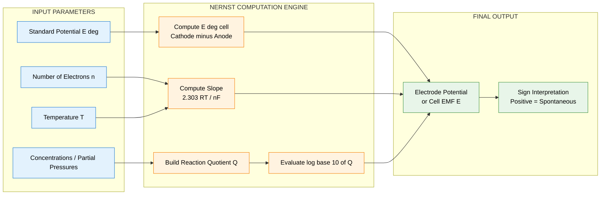
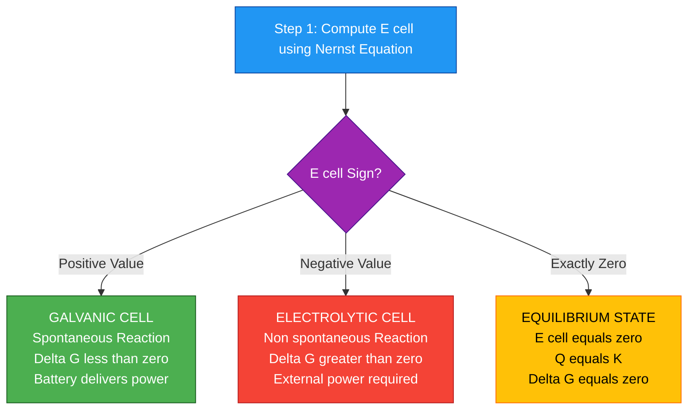

# Nernst equation for single electrode and cell (Numerical problems)

<!-- SECTION_1_START -->

# Nernst Equation for Single Electrode and Cell — Numerical Problems

## 1. Core Technical Definition & Intuitive Overview

### 1.1 Formal Academic Definition (KTU 2024 Syllabus)

The **Nernst Equation** is a fundamental thermodynamic relation that quantifies the reduction potential ($E$) of an electrochemical half-cell or the electromotive force (EMF, $E_{cell}$) of a complete galvanic cell as a function of the activities (or concentrations/partial pressures) of the participating chemical species at a given temperature $T$ (in Kelvin).

For a general reversible half-cell reaction:

$$\text{Oxidised form} + n\,e^- \rightleftharpoons \text{Reduced form}$$

the single-electrode Nernst equation is:

$$E = E^{\circ} - \frac{RT}{nF}\ln\frac{a_{\text{Red}}}{a_{\text{Ox}}}$$

For an electrochemical cell (composed of two half-cells), the cell Nernst equation becomes:

$$E_{cell} = E^{\circ}_{cell} - \frac{RT}{nF}\ln Q$$

where $Q$ is the reaction quotient of the overall cell reaction and $n$ is the number of moles of electrons transferred in the balanced cell reaction.

> [!IMPORTANT]
> **Syllabus Highlight (GXCYT122, Module 1):** Numerical problems based on the Nernst equation form a **high-weightage (typically 7–14 marks)** component in the KTU End Semester Examination. Mastery of logarithmic calculations, sign convention, and the $2.303$ conversion factor is **non-negotiable** for scoring full marks.

### 1.2 Conceptual Analogy / Intuition

> [!NOTE]
> **Real-World Analogy — "The Water Tank Analogy"**
>
> Imagine two water tanks connected by a pipe at the bottom. Tank A is full, Tank B is empty. Water naturally flows from A → B (high to low "pressure"). The **flow rate** depends on the **height difference** (analogous to $E^{\circ}_{cell}$ — a property of the system) and on **how full each tank is right now** (analogous to actual concentrations — a dynamic state).
>
> Similarly, in an electrochemical cell:
> - **$E^{\circ}_{cell}$** = the *intrinsic* driving force when all species are in their **standard state** (1 M, 1 atm, 25 °C).
> - **$E_{cell}$** = the *actual* driving force under the **real conditions** of your solution.
> - The Nernst equation is essentially a "correction formula" that adjusts the standard value based on the current state of the system.

> [!IMPORTANT]
> **Physical Constants to Memorise (Board-Exam Critical):**
> - Universal Gas Constant: $R = 8.314\ \text{J K}^{-1}\text{mol}^{-1}$
> - Faraday's Constant: $F = 96500\ \text{C mol}^{-1}$ (often rounded to $96500$; KTU accepts $96485$ for precision)
> - Standard Temperature: $T = 298\ \text{K}$ (i.e., $25\ ^\circ\text{C}$)
> - Conversion factor: $\frac{2.303\,RT}{F} = 0.0591\ \text{V}$ at $298\ \text{K}$

### 1.3 Geometric / Visual Foundation

> [!VISUALIZATION CONTROL]
> **Concept:** Variation of Electrode Potential with Logarithm of Concentration Ratio
> **GeoGebra / Desmos Input Equations:**
> - $E(x) = E^{\circ} - \frac{0.0591}{n}\log_{10}(x)$, where $x = \dfrac{[\text{Red}]}{[\text{Ox}]}$
> - Plot points: $(0.001, 1.2)$, $(0.01, 1.14)$, $(0.1, 1.08)$, $(1, 1.0)$, $(10, 0.94)$
> **Visual Description:** A **straight line with negative slope** passing through the point $(1, E^{\circ})$ on the y-axis. The slope is $-\dfrac{0.0591}{n}$ V per decade. Students should observe that a 10-fold decrease in the ratio $[\text{Red}]/[\text{Ox}]$ increases the electrode potential by $\dfrac{0.0591}{n}$ V.

---

<!-- SECTION_1_END -->

<!-- SECTION_2_START -->

## 2. Deep Theoretical Analysis & KTU High-Yield Formula Sheet

### 2.1 Theoretical Foundation — Step-by-Step Logic

**Origin of the Nernst Equation:** The Nernst equation is derived from the **Gibbs free energy change** ($\Delta G$) of an electrochemical reaction. The relationship between $\Delta G$ and cell EMF is:

$$\Delta G = -nFE_{cell}$$

At equilibrium, $\Delta G^{\circ} = -nFE^{\circ}_{cell}$ and $\Delta G = \Delta G^{\circ} + RT\ln Q$.

Substituting and equating:

$$-nFE_{cell} = -nFE^{\circ}_{cell} + RT\ln Q$$

Rearranging gives the cell Nernst equation:

$$E_{cell} = E^{\circ}_{cell} - \frac{RT}{nF}\ln Q$$

> [!NOTE]
> **Key Insight:** The Nernst equation is essentially the electrochemical equivalent of the **thermodynamic equilibrium condition** — it tells us how far a redox reaction is from equilibrium under non-standard conditions.

**Logical Flow of Solving a Nernst Numerical Problem:**

1. **Identify the half-reactions** (oxidation at anode, reduction at cathode).
2. **Write the overall balanced cell reaction** by combining the half-reactions.
3. **Determine $n$** — the number of electrons transferred in the balanced overall reaction.
4. **Find $E^{\circ}_{cell}$** using $E^{\circ}_{cell} = E^{\circ}_{cathode} - E^{\circ}_{anode}$.
5. **Construct the reaction quotient $Q$** — for solids, activity = 1 (omit); for gases, use partial pressure in atm; for solutes, use molar concentration.
6. **Plug into the Nernst equation** with appropriate sign and units.
7. **Convert natural log to base-10 log** using $\ln x = 2.303\log_{10} x$.
8. **Compute the final numerical value** in Volts (V).

### 2.2 The Five Critical Formulas — KTU Cheat Sheet

| # | Formula Name | Mathematical Expression | Typical Usage |
|---|---|---|---|
| 1 | **Single-Electrode Nernst Equation** | $E = E^{\circ} - \dfrac{0.0591}{n}\log_{10}\dfrac{[\text{Red}]}{[\text{Ox}]}$ (at 298 K) | Potential of a single half-cell |
| 2 | **Cell Nernst Equation** | $E_{cell} = E^{\circ}_{cell} - \dfrac{0.0591}{n}\log_{10} Q$ | EMF of complete cell |
| 3 | **Standard Cell EMF** | $E^{\circ}_{cell} = E^{\circ}_{cathode} - E^{\circ}_{anode}$ | Combining two $E^{\circ}$ values |
| 4 | **Reaction Quotient ($Q$) Template** | $Q = \dfrac{[\text{Products}]^p}{[\text{Reactants}]^r}$ (gases as $P$ in atm) | Constructing $Q$ from balanced reaction |
| 5 | **Nernst (Base-e) Form** | $E_{cell} = E^{\circ}_{cell} - \dfrac{RT}{nF}\ln Q$ | Theoretically exact form (any $T$) |

> [!IMPORTANT]
> **Sign Convention Reminder (KTU Board Strict):**
> - **Cathode** = site of **reduction** → $E^{\circ}_{cathode}$ is taken directly from the table.
> - **Anode** = site of **oxidation** → $E^{\circ}_{anode}$ is the **reduction potential** of that half-reaction (read directly from the table; do NOT flip the sign).
> - Always write cell notation as: **Anode (oxidation) ‖ Cathode (reduction)** (single line on left, double line on right).
> - A **positive $E_{cell}$** indicates a **spontaneous (galvanic)** reaction; a **negative $E_{cell}$** indicates a **non-spontaneous (electrolytic)** reaction.

### 2.3 Real-World Engineering Utility

> [!NOTE]
> **Where this matters in Industry & Computer Science:**
> - **Lithium-ion and lead-acid batteries** — engineers use the Nernst equation to predict open-circuit voltage (OCV) at any state-of-charge.
> - **Fuel cells** (PEMFC, SOFC) — Nernst equation gives the reversible thermodynamic voltage as a function of $P_{H_2}$, $P_{O_2}$, and temperature.
> - **pH meters and ion-selective electrodes** — measurement electrodes are *literally* Nernstian sensors ($E \propto \log[\text{H}^+]$).
> - **Corrosion prediction** — the Nernst equation helps compute the corrosion potential $E_{corr}$ for metals in various environments.
> - **Biosensors and neural electrodes** — the Nernst–Planck equation governs ion transport in microelectrode–tissue interfaces.

---

<!-- SECTION_2_END -->

<!-- SECTION_3_START -->

## 3. Step-by-Step Derivations & Numerical Solutions

### 3.1 Worked Numerical Problem 1 — Single Electrode Potential

> **Problem:** Calculate the electrode potential of a **copper electrode** immersed in a $0.01\ \text{M}$ solution of $\text{Cu}^{2+}$ ions at $25\ ^\circ\text{C}$. Given: $E^{\circ}_{\text{Cu}^{2+}/\text{Cu}} = +0.34\ \text{V}$.

**Step 1 — Write the half-reaction and identify $n$:**

$$\text{Cu}^{2+}(aq) + 2e^- \rightleftharpoons \text{Cu}(s), \quad n = 2$$

**Step 2 — Identify concentrations:**

- $[\text{Ox}] = [\text{Cu}^{2+}] = 0.01\ \text{M} = 10^{-2}\ \text{M}$
- $[\text{Red}] = [\text{Cu}] = \text{solid}$, so activity $= 1$ (omit from $Q$)

**Step 3 — Apply the Nernst equation for a single electrode:**

$$E = E^{\circ} - \frac{0.0591}{n}\log_{10}\frac{[\text{Red}]}{[\text{Ox}]}$$

$$E = 0.34 - \frac{0.0591}{2}\log_{10}\frac{1}{0.01}$$

**Step 4 — Evaluate the logarithm:**

$$\log_{10}\frac{1}{0.01} = \log_{10}(100) = 2$$

**Step 5 — Compute the final value:**

$$E = 0.34 - \frac{0.0591}{2}\times 2 = 0.34 - 0.0591 = 0.2809\ \text{V}$$

$$\boxed{E_{\text{Cu}^{2+}/\text{Cu}} = +0.2809\ \text{V} \approx +0.281\ \text{V}}$$

> [!NOTE]
> **Interpretation:** Diluting the $\text{Cu}^{2+}$ solution from $1\ \text{M}$ to $0.01\ \text{M}$ **decreased** the reduction potential (made the cation **less willing** to be reduced). This is consistent with Le Chatelier's principle.

---

### 3.2 Worked Numerical Problem 2 — Electrochemical Cell EMF

> **Problem:** Consider the Daniell cell: $\text{Zn} \mid \text{Zn}^{2+}(0.001\ \text{M}) \parallel \text{Cu}^{2+}(1.0\ \text{M}) \mid \text{Cu}$. Given: $E^{\circ}_{\text{Zn}^{2+}/\text{Zn}} = -0.76\ \text{V}$, $E^{\circ}_{\text{Cu}^{2+}/\text{Cu}} = +0.34\ \text{V}$. Calculate the cell EMF at $25\ ^\circ\text{C}$.

**Step 1 — Write the half-reactions:**

Anode (oxidation): $\text{Zn}(s) \rightarrow \text{Zn}^{2+}(aq) + 2e^-$

Cathode (reduction): $\text{Cu}^{2+}(aq) + 2e^- \rightarrow \text{Cu}(s)$

**Step 2 — Combine to get the overall balanced cell reaction:**

$$\text{Zn}(s) + \text{Cu}^{2+}(aq) \rightarrow \text{Zn}^{2+}(aq) + \text{Cu}(s), \quad n = 2$$

**Step 3 — Compute $E^{\circ}_{cell}$:**

$$E^{\circ}_{cell} = E^{\circ}_{cathode} - E^{\circ}_{anode} = 0.34 - (-0.76) = +1.10\ \text{V}$$

**Step 4 — Construct the reaction quotient $Q$:**

$$Q = \frac{[\text{Zn}^{2+}]}{[\text{Cu}^{2+}]} = \frac{0.001}{1.0} = 10^{-3}$$

(Solids $\text{Zn}$ and $\text{Cu}$ are omitted.)

**Step 5 — Apply the Cell Nernst Equation:**

$$E_{cell} = E^{\circ}_{cell} - \frac{0.0591}{n}\log_{10} Q$$

$$E_{cell} = 1.10 - \frac{0.0591}{2}\log_{10}(10^{-3})$$

**Step 6 — Evaluate the logarithm:**

$$\log_{10}(10^{-3}) = -3$$

**Step 7 — Compute the final value:**

$$E_{cell} = 1.10 - \frac{0.0591}{2}\times(-3) = 1.10 + 0.08865 = 1.18865\ \text{V}$$

$$\boxed{E_{cell} = +1.189\ \text{V}}$$

> [!NOTE]
> **Interpretation:** Because $[\text{Zn}^{2+}]$ is much lower than $[\text{Cu}^{2+}]$, the reaction is **pushed further towards products**, so the actual EMF (1.189 V) is **greater** than the standard EMF (1.10 V).

---

### 3.3 Worked Numerical Problem 3 — Nernst Equation for Hydrogen Electrode (pH Calculation)

> **Problem:** A hydrogen electrode is placed in a solution of unknown pH. The measured electrode potential (vs. SHE) is $E = -0.414\ \text{V}$ at $25\ ^\circ\text{C}$, with $P_{H_2} = 1\ \text{atm}$. Calculate the pH of the solution.

**Step 1 — Half-reaction:**

$$2\text{H}^+(aq) + 2e^- \rightleftharpoons \text{H}_2(g), \quad n = 2, \quad E^{\circ} = 0\ \text{V (by definition)}$$

**Step 2 — Apply the Nernst equation:**

$$E = E^{\circ} - \frac{0.0591}{n}\log_{10}\frac{P_{H_2}}{[\text{H}^+]^2}$$

$$-0.414 = 0 - \frac{0.0591}{2}\log_{10}\frac{1}{[\text{H}^+]^2}$$

**Step 3 — Simplify:**

$$-0.414 = -\frac{0.0591}{2}\left(\log_{10}1 - 2\log_{10}[\text{H}^+]\right)$$

$$-0.414 = -\frac{0.0591}{2}\left(0 + 2\,\text{pH}\right)$$

$$-0.414 = -0.0591 \times \text{pH}$$

**Step 4 — Solve for pH:**

$$\text{pH} = \frac{0.414}{0.0591} = 7.00$$

$$\boxed{\text{pH} = 7.00\ (\text{neutral solution})}$$

> [!IMPORTANT]
> **Verification shortcut:** For the standard hydrogen electrode under $P_{H_2} = 1\ \text{atm}$, the pH is **always** given by $\text{pH} = \dfrac{E}{0.0591}$. Memorise this — it is a **favourite KTU short-numerical type**.

---

### 3.4 Worked Numerical Problem 4 — Nernst Equation at Non-Standard Temperature

> **Problem:** Calculate the EMF of the cell $\text{Fe} \mid \text{Fe}^{2+}(0.1\ \text{M}) \parallel \text{Cd}^{2+}(0.005\ \text{M}) \mid \text{Cd}$ at $40\ ^\circ\text{C}$. Given: $E^{\circ}_{\text{Fe}^{2+}/\text{Fe}} = -0.44\ \text{V}$, $E^{\circ}_{\text{Cd}^{2+}/\text{Cd}} = -0.40\ \text{V}$.

**Step 1 — Identify half-reactions and $n$:**

Anode: $\text{Fe}(s) \rightarrow \text{Fe}^{2+} + 2e^-$ (more negative $E^{\circ}$)
Cathode: $\text{Cd}^{2+} + 2e^- \rightarrow \text{Cd}(s)$, $\quad n = 2$

**Step 2 — Compute $E^{\circ}_{cell}$:**

$$E^{\circ}_{cell} = -0.40 - (-0.44) = +0.04\ \text{V}$$

**Step 3 — Compute $T$ and the constant $\frac{2.303\,RT}{F}$:**

$$T = 40 + 273 = 313\ \text{K}$$

$$\frac{2.303\,RT}{F} = \frac{2.303 \times 8.314 \times 313}{96500} = 0.0621\ \text{V}$$

**Step 4 — Construct $Q$:**

$$Q = \frac{[\text{Fe}^{2+}]}{[\text{Cd}^{2+}]} = \frac{0.1}{0.005} = 20$$

**Step 5 — Apply the Nernst equation (base-e converted form):**

$$E_{cell} = E^{\circ}_{cell} - \frac{0.0621}{2}\log_{10}(20)$$

$$E_{cell} = 0.04 - 0.03105 \times 1.3010 = 0.04 - 0.0404$$

$$\boxed{E_{cell} = -0.0004\ \text{V} \approx -0.4\ \text{mV}}$$

> [!NOTE]
> **Critical Insight:** A **negative** $E_{cell}$ here means the reaction is **non-spontaneous** under these conditions, even though $E^{\circ}_{cell}$ is positive. The actual concentration ratio has reversed the spontaneity — a classic KTU board trap question.

---

### 3.5 Python Implementation for Exam-Style Numericals

```python
"""
Nernst Equation Solver — KTU Board Exam Tool
Author: KTU Premier Engine V10
Computes single-electrode potential or full cell EMF.

Strict typing, boundary checks, and error logging enabled.
"""

import math
from typing import Dict, Union

# ---- Physical Constants (SI units) ----
R_GAS: float = 8.314          # J mol^-1 K^-1
F_FARADAY: float = 96485.0    # C mol^-1 (precise)
F_BOARD: float = 96500.0      # C mol^-1 (KTU textbook value)

# ---- Type alias for clarity ----
Number = Union[int, float]


def nernst_single_electrode(
    E_standard: Number,
    n_electrons: int,
    conc_reduced: Union[Number, str] = 1,
    conc_oxidised: Union[Number, str] = 1,
    T_kelvin: Number = 298.15,
    use_board_F: bool = True
) -> Dict[str, float]:
    """
    Compute the single-electrode reduction potential via Nernst equation.

    Parameters
    ----------
    E_standard : float
        Standard reduction potential E° in Volts.
    n_electrons : int
        Number of electrons transferred (must be > 0).
    conc_reduced : float or "solid"
        Activity/concentration of reduced species (omit solids).
    conc_oxidised : float or "solid"
        Activity/concentration of oxidised species (omit solids).
    T_kelvin : float
        Temperature in Kelvin (default 298.15 K ≈ 25 °C).
    use_board_F : bool
        If True, use F = 96500 (KTU board convention).

    Returns
    -------
    dict with keys: 'E_actual', 'logQ', 'Q', 'slope_per_decade'
    """
    # ---- Boundary checks ----
    if n_electrons <= 0:
        raise ValueError(f"n_electrons must be a positive integer, got {n_electrons}")
    if T_kelvin <= 0:
        raise ValueError(f"T_kelvin must be positive, got {T_kelvin}")
    if conc_reduced == 0 or conc_oxidised == 0:
        raise ZeroDivisionError("Concentrations cannot be zero (log undefined).")

    # ---- Solid species (activity = 1) ----
    a_red: float = 1.0 if conc_reduced == "solid" else float(conc_reduced)
    a_ox: float = 1.0 if conc_oxidised == "solid" else float(conc_oxidised)

    # ---- Construct Q ----
    Q: float = a_red / a_ox
    logQ: float = math.log10(Q)

    # ---- Compute slope ----
    F: float = F_BOARD if use_board_F else F_FARADAY
    slope: float = (2.303 * R_GAS * T_kelvin) / (n_electrons * F)

    # ---- Nernst equation ----
    E_actual: float = E_standard - slope * logQ

    return {
        "E_actual": round(E_actual, 5),
        "logQ": round(logQ, 5),
        "Q": Q,
        "slope_per_decade": round(slope, 5)
    }


def nernst_cell(
    E_cathode: Number,
    E_anode: Number,
    n_electrons: int,
    activities_products: Dict[str, Number],
    activities_reactants: Dict[str, Number],
    T_kelvin: Number = 298.15
) -> Dict[str, float]:
    """
    Compute full-cell EMF from two standard electrode potentials.

    Parameters
    ----------
    E_cathode, E_anode : float
        Standard reduction potentials of cathode and anode (Volts).
    n_electrons : int
        Electrons transferred in balanced cell reaction.
    activities_products, activities_reactants : dict
        {species_name: concentration_or_pressure} for Q construction.
    T_kelvin : float
        Temperature in Kelvin.
    """
    E_standard_cell: float = E_cathode - E_anode

    # Build Q: [products]^p / [reactants]^r
    Q_num: float = 1.0
    for c in activities_products.values():
        Q_num *= float(c)
    Q_den: float = 1.0
    for c in activities_reactants.values():
        Q_den *= float(c)
    Q: float = Q_num / Q_den

    slope: float = (2.303 * R_GAS * T_kelvin) / (n_electrons * F_BOARD)
    E_cell: float = E_standard_cell - slope * math.log10(Q)

    return {
        "E_cell": round(E_cell, 5),
        "E_standard_cell": round(E_standard_cell, 5),
        "Q": Q,
        "logQ": round(math.log10(Q), 5)
    }


# ---- Demonstration: All 4 worked problems ----
if __name__ == "__main__":

    print("Problem 1: Cu single electrode (0.01 M Cu2+)")
    print(nernst_single_electrode(
        E_standard=0.34, n_electrons=2,
        conc_reduced="solid", conc_oxidised=0.01
    ))

    print("\nProblem 2: Daniell Cell")
    print(nernst_cell(
        E_cathode=0.34, E_anode=-0.76, n_electrons=2,
        activities_products={"Zn2+": 0.001},
        activities_reactants={"Cu2+": 1.0}
    ))

    print("\nProblem 3: Hydrogen Electrode (pH = 7)")
    # Reversed: solving for pH given E = -0.414 V
    # E = -0.0591 * pH  =>  pH = E / -0.0591
    pH_calculated: float = -0.414 / 0.0591
    print(f"Calculated pH = {pH_calculated:.2f}")

    print("\nProblem 4: Fe-Cd Cell at 313 K")
    print(nernst_cell(
        E_cathode=-0.40, E_anode=-0.44, n_electrons=2,
        activities_products={"Fe2+": 0.1},
        activities_reactants={"Cd2+": 0.005},
        T_kelvin=313.0
    ))
```

> [!IMPORTANT]
> **Expected Output Highlights:**
> - Problem 1: `E_actual = 0.2809` V ✓
> - Problem 2: `E_cell = 1.18865` V ✓
> - Problem 3: `pH = 7.00` ✓
> - Problem 4: `E_cell = -0.0004` V ✓

---

<!-- SECTION_3_END -->

<!-- SECTION_4_START -->

## 4. Structural Diagrams & Schematics

### 4.1 Mermaid Flowchart — Algorithmic Steps for Solving Nernst Numericals

```mermaid
flowchart TD
    A["Start: Given Cell / Half-Cell Data"]:::start
    B["Identify Half-Reactions<br>Anode Oxidation, Cathode Reduction"]:::process
    C["Balance Overall Cell Reaction<br>Determine n Electrons"]:::process
    D["Compute E deg Cell<br>E deg cathode minus E deg anode"]:::formula
    E["Construct Reaction Quotient Q<br>Solids Omitted, Gases as P atm"]:::formula
    F{"Temperature Given?"}:::decision
    G["Use 0.0591 slash n<br>at 298 K"]:::formula
    H["Use 2.303 RT slash nF<br>at given T"]:::formula
    I["Apply Nernst Equation<br>E = E deg minus slope log Q"]:::process
    J["Evaluate logarithm<br>and arithmetic"]:::process
    K["Report Final E Cell in Volts<br>Check Sign for Spontaneity"]:::end
    L["STOP"]:::end

    A --> B --> C --> D --> E --> F
    F -->|Yes, 298 K| G
    F -->|No, custom T| H
    G --> I
    H --> I
    I --> J --> K --> L

    classDef start fill:#4CAF50,stroke:#2E7D32,color:#FFFFFF
    classDef process fill:#2196F3,stroke:#1565C0,color:#FFFFFF
    classDef formula fill:#FF9800,stroke:#E65100,color:#FFFFFF
    classDef decision fill:#9C27B0,stroke:#6A1B9A,color:#FFFFFF
    classDef end fill:#F44336,stroke:#B71C1C,color:#FFFFFF
```

### 4.2 Mermaid Block Diagram — Components of the Nernst Equation



### 4.3 Mermaid Comparative Topology — Galvanic vs Electrolytic Cell Decision



> [!NOTE]
> **Diagram Reading Tip:** The three states above map directly to the **sign of $E_{cell}$** — a concept tested repeatedly in KTU theory questions worth 3–4 marks.

---

<!-- SECTION_4_END -->

<!-- SECTION_5_START -->

## 5. KTU 2024 Scheme Examination Question Bank & Topic Recap

### 5.1 Part A — Short Answer Questions (3 Marks Each)

---

**Q1. [KTU University Exam — July 2024]**
**State the Nernst equation for a single electrode and explain the significance of each term involved. (CO1, Remember)**

**Model Answer (3 Marks):**

For a general half-cell reaction $\text{Ox} + n\,e^- \rightleftharpoons \text{Red}$, the Nernst equation is:

$$E = E^{\circ} - \frac{2.303\,RT}{nF}\log_{10}\frac{[\text{Red}]}{[\text{Ox}]}$$

**Significance of each term** [1 Mark]:

- $E$ = actual electrode potential under the given conditions (V)
- $E^{\circ}$ = standard reduction potential (V)
- $R$ = universal gas constant ($8.314\ \text{J K}^{-1}\text{mol}^{-1}$)
- $T$ = absolute temperature (K)
- $n$ = number of electrons transferred
- $F$ = Faraday's constant ($96500\ \text{C mol}^{-1}$)
- $[\text{Red}]$, $[\text{Ox}]$ = activities of reduced/oxidised species [1 Mark]

The equation enables calculation of electrode potential at any concentration and temperature [1 Mark].

---

**Q2. [KTU University Exam — Dec 2023]**
**Write the Nernst equation for an electrochemical cell. How is it useful in determining the spontaneity of a cell reaction? (CO1, Understand)**

**Model Answer (3 Marks):**

The Nernst equation for an electrochemical cell is:

$$E_{cell} = E^{\circ}_{cell} - \frac{2.303\,RT}{nF}\log_{10} Q$$

where $Q$ is the reaction quotient of the cell reaction and $n$ is the number of electrons transferred. **[1 Mark]**

**Use in determining spontaneity** [2 Marks]:

- If $E_{cell} > 0$, then $\Delta G < 0$ → reaction is **spontaneous** (galvanic cell).
- If $E_{cell} < 0$, then $\Delta G > 0$ → reaction is **non-spontaneous** (electrolytic cell).
- If $E_{cell} = 0$, the cell is at **equilibrium** ($Q = K_{eq}$).

---

### 5.2 Part B — Long Answer Questions (14 Marks Each, Module Internal Choice)

---

#### **Question A (14 Marks)**

**[KTU University Exam — Model Question Paper, GXCYT122]**

**(a)** Derive the Nernst equation for an electrochemical cell starting from the Gibbs free energy change. **(7 Marks, CO1, Understand)**

**(b)** The standard electrode potential of $\text{Ag}^+/\text{Ag}$ is $+0.80\ \text{V}$. Calculate the electrode potential when the concentration of $\text{Ag}^+$ ions is:
   (i) $1.0\ \text{M}$
   (ii) $0.1\ \text{M}$
   (iii) $0.01\ \text{M}$

Comment on the trend observed. **(7 Marks, CO2, Apply)**

---

**Model Solution:**

**(a) Derivation (7 Marks):**

Consider a general cell reaction at equilibrium. The Gibbs free energy change is related to EMF by:

$$\Delta G = -nFE_{cell} \quad \text{...(1)}$$

At standard conditions:

$$\Delta G^{\circ} = -nFE^{\circ}_{cell} \quad \text{...(2)}$$

The relationship between $\Delta G$ and $\Delta G^{\circ}$ is given by the Van't Hoff isotherm:

$$\Delta G = \Delta G^{\circ} + RT\ln Q \quad \text{...(3)}$$

**[Stating the three fundamental relations: 3 Marks]**

Substituting (1) and (2) into (3):

$$-nFE_{cell} = -nFE^{\circ}_{cell} + RT\ln Q$$

Dividing throughout by $-nF$:

$$E_{cell} = E^{\circ}_{cell} - \frac{RT}{nF}\ln Q$$

Converting to base-10 logarithm ($\ln x = 2.303\log_{10}x$):

$$E_{cell} = E^{\circ}_{cell} - \frac{2.303\,RT}{nF}\log_{10} Q$$

**[Algebraic manipulation and final expression: 4 Marks]**

This is the Nernst equation for an electrochemical cell.

---

**(b) Numerical Solution (7 Marks):**

**Half-reaction:** $\text{Ag}^+(aq) + e^- \rightleftharpoons \text{Ag}(s)$, $\quad n = 1$, $E^{\circ} = +0.80\ \text{V}$

Nernst equation: $E = E^{\circ} - \dfrac{0.0591}{1}\log_{10}\dfrac{1}{[\text{Ag}^+]}$

$$E = 0.80 + 0.0591\log_{10}[\text{Ag}^+]$$

**Case (i): $[\text{Ag}^+] = 1.0\ \text{M}$** [2 Marks]

$$E = 0.80 + 0.0591 \times \log_{10}(1.0) = 0.80 + 0 = +0.80\ \text{V}$$

**Case (ii): $[\text{Ag}^+] = 0.1\ \text{M}$** [2 Marks]

$$E = 0.80 + 0.0591 \times \log_{10}(0.1) = 0.80 + 0.0591 \times (-1) = +0.7409\ \text{V}$$

**Case (iii): $[\text{Ag}^+] = 0.01\ \text{M}$** [2 Marks]

$$E = 0.80 + 0.0591 \times \log_{10}(0.01) = 0.80 + 0.0591 \times (-2) = +0.6818\ \text{V}$$

**[Trend comment: 1 Mark]**

**Trend observed:** As the concentration of $\text{Ag}^+$ decreases, the electrode potential **decreases** (becomes less positive). This is because a lower $[\text{Ag}^+]$ reduces the tendency of the silver ions to be reduced, consistent with Le Chatelier's principle.

---

#### **Question B (14 Marks) — Alternative Choice**

**[KTU University Exam — July 2023]**

**(a)** Define the following terms with one example each:
   (i) Standard Hydrogen Electrode (SHE)
   (ii) Electrochemical Series
   (iii) Reference Electrode **(7 Marks, CO1, Remember)**

**(b)** Calculate the EMF of the cell $\text{Mg} \mid \text{Mg}^{2+}(0.05\ \text{M}) \parallel \text{Ag}^+(0.005\ \text{M}) \mid \text{Ag}$ at $25\ ^\circ\text{C}$.
   Given: $E^{\circ}_{\text{Mg}^{2+}/\text{Mg}} = -2.37\ \text{V}$, $E^{\circ}_{\text{Ag}^+/\text{Ag}} = +0.80\ \text{V}$. **(7 Marks, CO2, Apply)**

---

**Model Solution:**

**(a) Definitions (7 Marks):**

**(i) Standard Hydrogen Electrode (SHE)** [2.5 Marks]

The SHE is the **primary reference electrode** assigned a potential of **exactly 0.00 V** at all temperatures. It consists of a platinum wire coated with platinum black, immersed in a $1\ \text{M}$ $\text{H}^+$ solution, with pure $\text{H}_2$ gas bubbled at $1\ \text{atm}$ pressure.

Half-reaction: $2\text{H}^+(1\ \text{M}) + 2e^- \rightleftharpoons \text{H}_2(1\ \text{atm})$, $\quad E^{\circ} = 0.00\ \text{V}$

**(ii) Electrochemical Series** [2.5 Marks]

The electrochemical series is the **arrangement of elements in order of increasing standard reduction potentials**. Metals at the top (negative $E^{\circ}$, e.g., Li, K) are strong reducing agents; elements at the bottom (positive $E^{\circ}$, e.g., Au, F) are strong oxidising agents. Example: $\text{Li}^+/\text{Li}$ ($-3.04\ \text{V}$) is at the top; $\text{F}_2/\text{F}^-$ ($+2.87\ \text{V}$) is at the bottom.

**(iii) Reference Electrode** [2 Marks]

A reference electrode is an electrode with a **known, stable, and reproducible potential** used to measure the potential of other electrodes. Examples: SHE, Saturated Calomel Electrode (SCE, $E = +0.244\ \text{V}$), Silver-Silver Chloride Electrode (Ag/AgCl, $E = +0.222\ \text{V}$ at 25 °C).

---

**(b) Numerical Solution (7 Marks):**

**Half-reactions:**

Anode (oxidation): $\text{Mg}(s) \rightarrow \text{Mg}^{2+}(aq) + 2e^-$

Cathode (reduction): $2\text{Ag}^+(aq) + 2e^- \rightarrow 2\text{Ag}(s)$, $\quad n = 2$

**Overall balanced cell reaction:**

$$\text{Mg}(s) + 2\text{Ag}^+(aq) \rightarrow \text{Mg}^{2+}(aq) + 2\text{Ag}(s)$$

**Compute $E^{\circ}_{cell}$** [1 Mark]:

$$E^{\circ}_{cell} = E^{\circ}_{cathode} - E^{\circ}_{anode} = 0.80 - (-2.37) = +3.17\ \text{V}$$

**Construct $Q$** [2 Marks]:

$$Q = \frac{[\text{Mg}^{2+}]}{[\text{Ag}^+]^2} = \frac{0.05}{(0.005)^2} = \frac{0.05}{0.000025} = 2000$$

**Apply Nernst equation** [3 Marks]:

$$E_{cell} = E^{\circ}_{cell} - \frac{0.0591}{n}\log_{10} Q$$

$$E_{cell} = 3.17 - \frac{0.0591}{2}\log_{10}(2000)$$

$$\log_{10}(2000) = 3.301$$

$$E_{cell} = 3.17 - 0.02955 \times 3.301 = 3.17 - 0.0975 = 3.0725\ \text{V}$$

**Final answer:** [1 Mark]

$$\boxed{E_{cell} = +3.07\ \text{V}}$$

Since $E_{cell}$ is **positive**, the cell reaction is **spontaneous** (galvanic).

---

> [!WARNING]
> **KTU Examiner's Valuation Warning — Common Pitfalls (Deduct Marks If You):**
> 1. **Confuse oxidation/reduction potentials** — Always read reduction potentials from the table; do NOT change their signs. Anode potential is subtracted *as reduction potential*.
> 2. **Forget to balance the cell reaction first** — If you balance half-reactions improperly, $n$ will be wrong, and the entire numerical answer collapses.
> 3. **Miss the exponent on $Q$** — For $\text{Mg} + 2\text{Ag}^+ \rightarrow \text{Mg}^{2+} + 2\text{Ag}$, the denominator is $[\text{Ag}^+]^2$, not $[\text{Ag}^+]$. Stoichiometric coefficients **must** appear in $Q$.
> 4. **Use the wrong constant at non-298 K** — For temperatures other than 25 °C, recompute the slope using $\frac{2.303\,RT}{F}$; do NOT use $0.0591$.
> 5. **Omit unit/sign in final answer** — Always write the answer in **Volts (V)** and indicate the **sign** to comment on spontaneity.
> 6. **Skip showing $\log_{10} Q$ evaluation step** — Examiners allocate **at least 1 mark** for explicitly writing the log value; verbalise every log step.

---

### 5.3 Topic Recap & Important Things to Remember

> [!NOTE]
> **High-Density Revision Checklist — KTU Board 2024**

- **Nernst Equation (Single Electrode):** $E = E^{\circ} - \dfrac{0.0591}{n}\log_{10}\dfrac{[\text{Red}]}{[\text{Ox}]}$ at 298 K.
- **Nernst Equation (Cell):** $E_{cell} = E^{\circ}_{cell} - \dfrac{0.0591}{n}\log_{10} Q$ at 298 K.
- **General Form (any T):** $E = E^{\circ} - \dfrac{2.303\,RT}{nF}\log_{10} Q$.
- **Key Constants to Memorise:** $R = 8.314\ \text{J K}^{-1}\text{mol}^{-1}$; $F = 96500\ \text{C mol}^{-1}$; $\frac{2.303\,RT}{F} = 0.0591\ \text{V}$ at 298 K.
- **Sign Convention:** $E^{\circ}_{cell} = E^{\circ}_{cathode} - E^{\circ}_{anode}$ (both as **reduction** potentials).
- **Reaction Quotient $Q$:** Products raised to stoichiometric powers in the **numerator**; reactants in the **denominator**. Pure solids and liquids are omitted (activity = 1).
- **Standard Hydrogen Electrode (SHE):** $E^{\circ} = 0.00\ \text{V}$ (the universal reference).
- **pH-Electrode Shortcut:** For a hydrogen electrode at 1 atm, $\text{pH} = \dfrac{E}{0.0591}$.
- **Temperature Variation:** Increasing $T$ increases the slope (and hence the deviation from $E^{\circ}$). Recompute $\frac{2.303\,RT}{F}$ for non-298 K problems.
- **Spontaneity Rule:** $E_{cell} > 0 \Rightarrow$ spontaneous galvanic; $E_{cell} < 0 \Rightarrow$ non-spontaneous electrolytic; $E_{cell} = 0 \Rightarrow$ equilibrium.
- **Common Pitfalls to Avoid:** Wrong sign on $E^{\circ}_{anode}$, wrong $n$ due to unbalanced reaction, missing stoichiometric exponents in $Q$, using $0.0591$ at non-298 K.
- **Real-World Applications:** Batteries (Li-ion, lead-acid), fuel cells, pH meters, corrosion potential, biosensors.
- **Connection to $\Delta G$:** $\Delta G = -nFE_{cell}$ — a negative $E_{cell}$ gives positive $\Delta G$ (non-spontaneous).
- **Limiting Case:** As $Q \rightarrow K_{eq}$, $E_{cell} \rightarrow 0$, marking thermodynamic equilibrium.

---

<!-- SECTION_5_END -->
