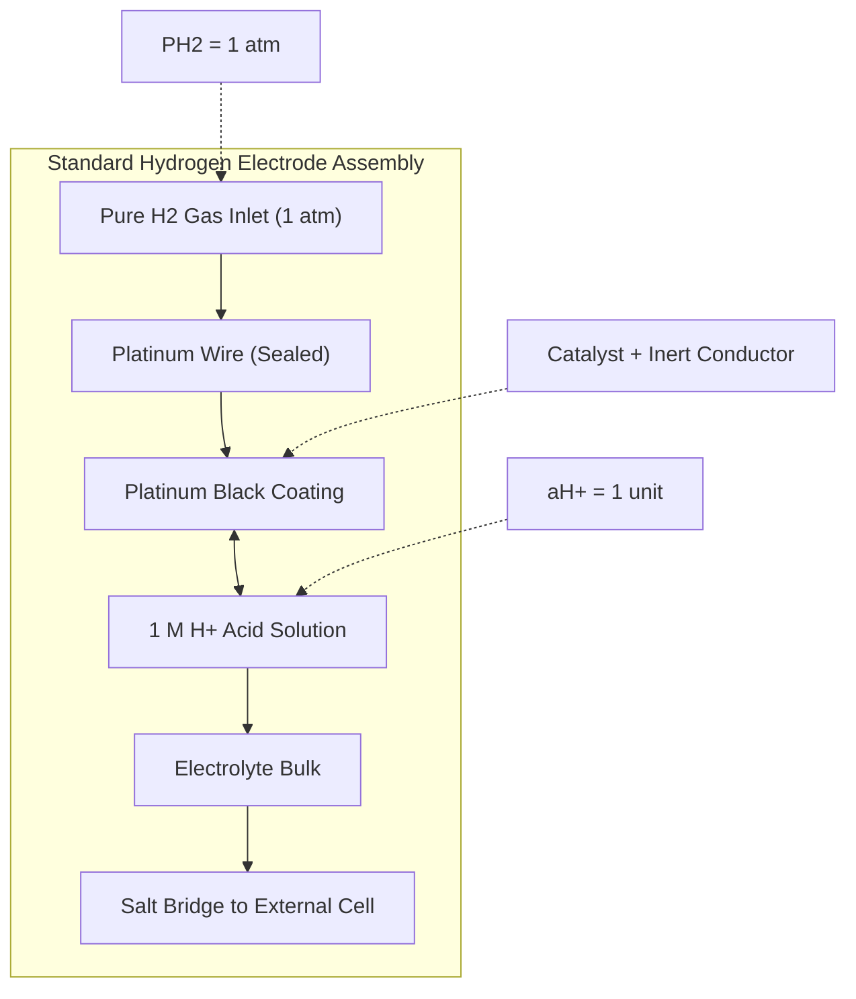
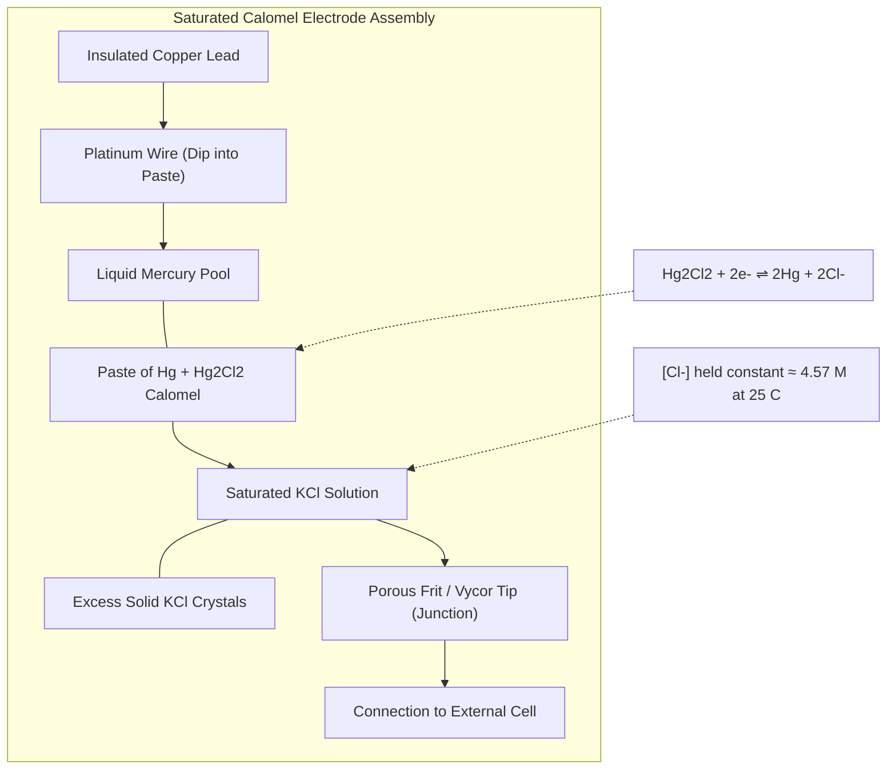
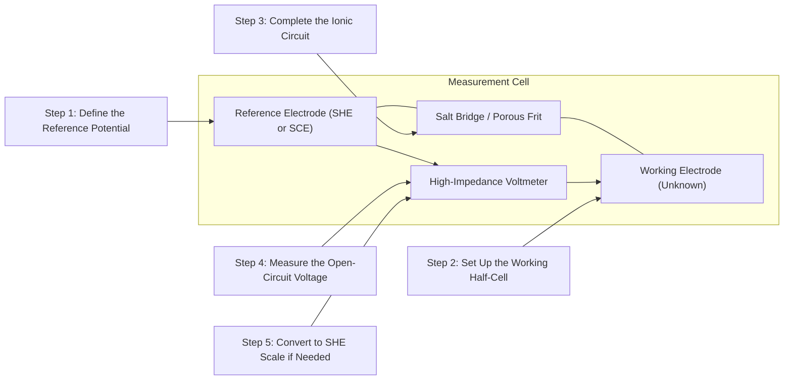
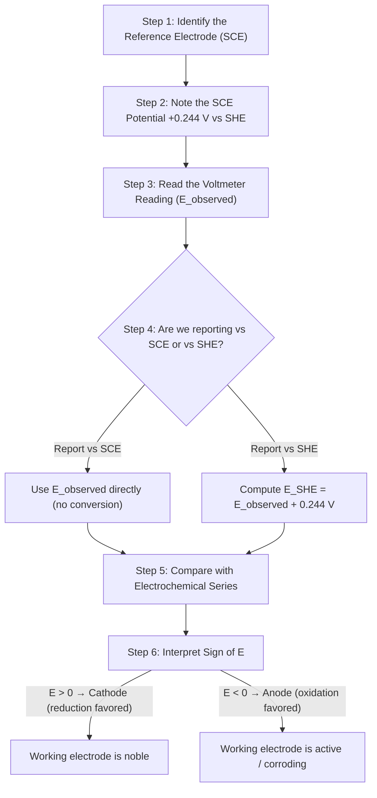
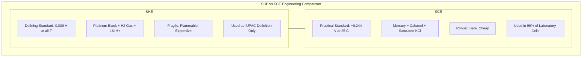

# Reference electrodes – SHE & Calomel electrode (Construction and Working)

<!-- SECTION_1_START -->
# 1. Core Technical Definition & Intuitive Overview

## 1.1 What is a Reference Electrode?

A **Reference Electrode** is an electrode whose potential is accurately known, constant, and reproducible under standard conditions. It serves as a benchmark against which the potential of any other electrode (the *working* or *indicator* electrode) is measured. In electrochemistry, we cannot measure the *absolute* potential of a single electrode — we can only measure the **potential difference** between two electrodes. Therefore, a stable, universally agreed reference is essential.

> [!IMPORTANT]
> **KTU Syllabus Definition (2024 Scheme – GXCYT122):**
> A reference electrode is a half-cell whose electrode potential is defined, stable, and used as a reference point to measure the potential of other electrodes. The two most important reference electrodes are the **Standard Hydrogen Electrode (SHE)** and the **Saturated Calomel Electrode (SCE)**.

> [!NOTE]
> **Why do we need a Reference Electrode?**
> * To quantify the *relative* reduction potential of any metal or redox couple.
> * To construct the *Electrochemical Series*.
> * To determine pH, ion concentration, and the rate of *corrosion* in engineering structures (directly relevant to the *Electrical Science* stream).
> * To serve as a stable half-cell in *potentiometric* sensors, batteries, and *electrolytic* processes.

## 1.2 The Standard Hydrogen Electrode (SHE) — The "Master Reference"

The **Standard Hydrogen Electrode (SHE)** is the *primary* reference electrode. By IUPAC convention, its potential is assigned the value **0.000 V at all temperatures**.

**Conceptual Analogy / Intuition:**
> Imagine measuring heights of mountains. Before the era of GPS, you needed a fixed reference point — for example, the average sea level at a specific coastline. Every mountain's height was measured *above sea level*. In the same way, the SHE is the "sea level" of electrochemistry. The potential of every other half-cell is reported as a *deviation* (either above or below) this imaginary electrochemical "sea level."

## 1.3 The Saturated Calomel Electrode (SCE) — The "Practical Worker"

The **Saturated Calomel Electrode (SCE)** is a *secondary* reference electrode, widely used in laboratories and industry because it is far easier to handle than the SHE.

**Conceptual Analogy / Intuition:**
> Think of a measuring tape. The SHE is the *theoretically perfect* ruler — its markings never change — but it is fragile and awkward to use in a workshop. The SCE is the *sturdy, workshop-grade* measuring tape: it is robust, easy to read, and although it is not "zero" by definition, we know exactly how much it *deviates* from zero. So, we measure with the SCE, then apply a small *correction factor* to get the SHE-equivalent value.

> [!VISUALIZATION CONTROL]
> **Concept:** Reference Scale on the Electrochemical "Number Line"
> **GeoGebra / Desmos Input Equations:**
> * `y = 0`  (SHE — drawn as a thick horizontal axis line)
> * Point: `(0.244, 1)` — Label: `SCE (0.244 V)`
> * Point: `(0.337, 2)` — Label: `NHE vs SCE (0.281 V)`
> * Point: `(0.768, 3)` — Label: `Ag/AgCl (0.197 V)`
> * Point: `(-0.760, 4)` — Label: `Zn²⁺/Zn (-0.760 V)`
> * Point: `(0.340, 5)` — Label: `Cu²⁺/Cu (+0.340 V)`
> **Visual Description:** Draw a horizontal number line (the *Electrochemical Number Line*) with the SHE marked as the bold central origin. Place the SCE, Ag/AgCl, and other common electrodes as small colored dots above the line, with their reduction potentials (vs SHE) clearly annotated. Students will observe that the SCE sits *above* the SHE (positive side), confirming that it has a known *positive* offset.

---

> [!IMPORTANT]
> **The Key "Constants" to Memorize (will appear in KTU exams):**
> * Potential of SHE: **E°(SHE) = 0.000 V** at **T = 298 K (25 °C)**
> * Potential of SCE: **E(SCE) = +0.244 V** vs SHE at 25 °C
> * Standard potential of the mercury / mercurous chloride couple: **E°(Hg₂Cl₂/Hg) = +0.268 V** (in saturated KCl the value is depressed to +0.244 V due to the Nernst concentration term)
<!-- SECTION_1_END -->

<!-- SECTION_2_START -->
# 2. Deep Theoretical Analysis & KTU High-Yield Formula Sheet

## 2.1 The Standard Hydrogen Electrode (SHE) — Deep Analysis

### 2.1.1 Construction (Step-by-Step)
1. A **platinum wire** sealed into a glass tube is coated (electroplated) with a layer of finely divided **platinum black**.
2. The platinum black is *saturated* with **pure, dry dihydrogen gas (H₂)** at exactly **1 atm (1.01325 bar)** pressure.
3. The platinum electrode is immersed in an **acidic solution of unit activity** (typically **1 M H⁺(aq)**, i.e., $\alpha_{H^+} = 1$).
4. The half-reaction that takes place at the electrode surface is:
   > $$\text{2H}^+(aq, \alpha = 1) + \text{2e}^- \rightleftharpoons \text{H}_2(g, 1\,\text{atm})$$

### 2.1.2 Working Principle
* The platinum black acts as an *inert* conductor and a high-surface-area *catalyst* that *adsorbs* H₂ gas.
* Two simultaneous reactions occur on the platinum surface:
   * **Oxidation** (reverse direction): $\text{H}_2 \rightarrow \text{2H}^+ + \text{2e}^-$
   * **Reduction** (forward direction): $\text{2H}^+ + \text{2e}^- \rightarrow \text{H}_2$
* At equilibrium, the electrode establishes a *reversible* potential.
* By IUPAC convention, this equilibrium potential is defined as **0.000 V** at standard conditions.

### 2.1.3 Role of Platinum Black
The platinum black serves **three** critical engineering purposes:
1. Increases the *effective surface area* by a factor of ~1000, allowing rapid gas adsorption/desorption.
2. Acts as a *catalyst* that lowers the activation energy of the H⁺/H₂ reaction.
3. Prevents *polarization* (drift of potential) at the electrode.

> [!NOTE]
> **Disadvantages of the SHE (why we use SCE instead):**
> * Sensitive to mechanical disturbance — the platinum black layer can flake off.
> * Hard to maintain a steady 1 atm H₂ flow.
> * Hydrogen gas is flammable and explosive above 4 % v/v in air.
> * Platinum is extremely expensive.
> * Easily *poisoned* by trace impurities (e.g., H₂S, As, Hg vapours).

## 2.2 The Saturated Calomel Electrode (SCE) — Deep Analysis

### 2.2.1 Construction
1. A **glass tube** has a small *porous plug* (or fritted glass disc) at the bottom — this is the *salt bridge* to the external solution.
2. A **platinum wire** is inserted at the top, dipping into a paste of **mercury (Hg) and mercurous chloride (Hg₂Cl₂, also called "calomel")**.
3. The paste is in contact with a **saturated solution of potassium chloride (KCl)**.
4. The KCl solution is saturated and contains crystals of KCl to keep the solution saturated at all temperatures.

### 2.2.2 Working — The Half-Cell Reaction
> $$\text{Hg}_2\text{Cl}_2(s) + \text{2e}^- \rightleftharpoons \text{2Hg}(l) + \text{2Cl}^-(aq)$$

* When the electrode is connected to an external circuit, the **reduction** of calomel to mercury occurs at the mercury surface.
* The **Cl⁻** concentration in the saturated KCl is *fixed* (because excess KCl crystals are present). At 25 °C, the solubility of KCl is about **4.57 mol/L**, so $[\text{Cl}^-] \approx 4.57\,M$.
* Since $[\text{Cl}^-]$ is constant, the potential of the SCE is *constant and reproducible*.

### 2.2.3 Nernst Equation Derivation for the SCE
The Nernst equation for the calomel half-cell is:
> $$E_{\text{Hg}_2\text{Cl}_2/\text{Hg}} = E°_{\text{Hg}_2\text{Cl}_2/\text{Hg}} - \frac{0.0591}{2}\log[\text{Cl}^-]^2$$

(Recall that solids like Hg₂Cl₂ and Hg have unit activity and are dropped from the Q term.)

Simplifying:
> $$E_{\text{Hg}_2\text{Cl}_2/\text{Hg}} = E°_{\text{Hg}_2\text{Cl}_2/\text{Hg}} - 0.0591 \log[\text{Cl}^-]$$

Substituting $E° = +0.268\,V$ and $[\text{Cl}^-] = 4.57\,M$ at 25 °C:
> $$E_{\text{SCE}} = +0.268 - 0.0591 \log(4.57)$$
> $$E_{\text{SCE}} = +0.268 - 0.0591 \times 0.660$$
> $$E_{\text{SCE}} = +0.268 - 0.039 = +0.229\,V$$

> [!IMPORTANT]
> **Common Student Trap:** The widely tabulated value **+0.244 V** is the *experimentally observed* SCE potential (it differs slightly from the Nernst-derived 0.229 V due to *activity* coefficients, junction potentials, and the fact that saturated KCl has a slightly different Cl⁻ activity). For KTU numerical problems, **use the textbook-stated 0.244 V unless the problem explicitly says "calculate using the Nernst equation."**

## 2.3 KTU Formula Sheet / Cheat Sheet

> [!NOTE]
> All formulas below are **high-yield** for KTU exams. Memorize the table; the cell values and signs are most commonly asked.

| **#** | **Quantity / Symbol** | **Formula / Expression** | **Standard Value / Unit** | **Used In** |
| :---: | :--- | :--- | :--- | :--- |
| 1 | SHE Potential | $E°(\text{SHE})$ | **0.000 V** at 298 K | Universal reference |
| 2 | SCE Potential | $E(\text{SCE})$ vs SHE | **+0.244 V** at 25 °C | Lab reference electrode |
| 3 | Nernst Equation (general) | $E = E° - \dfrac{0.0591}{n}\log Q$ at 25 °C | Volts | Half-cell potential |
| 4 | SCE Nernst form | $E_{\text{SCE}} = E°_{\text{Hg}_2\text{Cl}_2/\text{Hg}} - 0.0591\log[\text{Cl}^-]$ | Volts | SCE potential calc |
| 5 | Cell EMF (Ecell) | $E_{\text{cell}} = E_{\text{cathode}} - E_{\text{anode}}$ | Volts | Electrochemical cell |
| 6 | Relation between electrodes | $E(\text{vs SHE}) = E(\text{vs SCE}) + 0.244$ | Volts | Potential conversion |
| 7 | Standard potential of SCE couple | $E°(\text{Hg}_2\text{Cl}_2/\text{Hg})$ | **+0.268 V** | Reference tables |
| 8 | Standard conditions | $T = 298\,\text{K}$, $P = 1\,\text{atm}$, $a = 1$ | — | Definition of "Standard" |
| 9 | Hydrogen half-reaction | $2\text{H}^+ + 2\text{e}^- \rightleftharpoons \text{H}_2$ | — | SHE working |
| 10 | Calomel half-reaction | $\text{Hg}_2\text{Cl}_2 + 2\text{e}^- \rightleftharpoons 2\text{Hg} + 2\text{Cl}^-$ | — | SCE working |

## 2.4 Real-World Engineering Applications (Why this topic matters for *Electrical Science* students)

* **Corrosion Monitoring:** In a concrete bridge or an underground pipeline, engineers embed an SCE in the soil/concrete. The potential of the embedded steel (vs SCE) tells them how aggressively the structure is corroding.
* **Battery Testing:** Every laptop/mobile battery's voltage is measured *vs.* an internal reference electrode (often a Li/Li⁺ couple) using the same principle.
* **Printed Circuit Boards (PCBs):** Reference electrodes are used in electrolytic etchants and electroplating baths used to manufacture PCBs.
* **pH Meters:** A glass electrode's potential is measured against an *internal* reference (often Ag/AgCl, a close cousin of SCE).
* **Neuronal Probes & Biosensors:** Calomel-type electrodes form the basis of many biomedical potentiometric sensors.
<!-- SECTION_2_END -->

<!-- SECTION_3_START -->
# 3. Step-by-Step Derivations & Code/Symbolic Implementation

## 3.1 Exhaustive Derivation: Nernst Equation for the Calomel Electrode

> **Problem:** Derive the Nernst equation for the calomel half-cell and find the potential when the KCl solution is *saturated* (concentration = 4.57 M).

### Step 1 — Write the balanced half-reaction
The reduction half-reaction for calomel is:
$$\text{Hg}_2\text{Cl}_2(s) + 2\text{e}^- \rightleftharpoons 2\text{Hg}(l) + 2\text{Cl}^-(aq)$$

### Step 2 — Identify species and their states
* $\text{Hg}_2\text{Cl}_2$ — pure solid → activity $a_{\text{Hg}_2\text{Cl}_2} = 1$
* $\text{Hg}$ — pure liquid → activity $a_{\text{Hg}} = 1$
* $\text{Cl}^-(aq)$ — variable concentration → $a_{\text{Cl}^-} \approx [\text{Cl}^-]$ in dilute solution

### Step 3 — Write the reaction quotient Q
For the reaction as written (reduction), Q takes the form (products / reactants) raised to stoichiometric powers, *omitting* pure solids/liquids and electrons:
$$Q = \frac{[\text{Cl}^-]^2}{1} = [\text{Cl}^-]^2$$

### Step 4 — Identify the standard potential and number of electrons
* Standard reduction potential: $E°(\text{Hg}_2\text{Cl}_2/\text{Hg}) = +0.268\,V$
* Number of electrons transferred: $n = 2$

### Step 5 — Apply the Nernst Equation
The general Nernst equation for a reduction half-reaction is:
$$E = E° - \frac{2.303\,RT}{nF}\log Q$$

At the standard temperature $T = 298\,K$:
$$\frac{2.303\,RT}{F} = \frac{2.303 \times 8.314 \times 298}{96485} = 0.0591\,V$$

Substituting:
$$E = 0.268 - \frac{0.0591}{2}\log([\text{Cl}^-]^2)$$

### Step 6 — Simplify the logarithm
Using the power rule $\log(x^2) = 2\log(x)$:
$$E = 0.268 - \frac{0.0591}{2} \times 2\log[\text{Cl}^-]$$
$$E = 0.268 - 0.0591 \log[\text{Cl}^-]$$

### Step 7 — Substitute the saturated KCl concentration
At 25 °C, the molarity of saturated KCl is **4.57 M**:
$$E = 0.268 - 0.0591 \times \log(4.57)$$
$$\log(4.57) = 0.660$$
$$E = 0.268 - 0.0591 \times 0.660$$
$$E = 0.268 - 0.0390$$
$$E = +0.229\,V \text{ (theoretical, Nernst-derived)}$$

> The experimentally accepted KTU value of **+0.244 V** is the *practical* value used in all board problems.

## 3.2 Exhaustive Derivation: Converting a Potential Measured vs SCE to vs SHE

> **Problem:** The potential of a working electrode measured against a saturated calomel electrode is **−0.520 V** at 25 °C. What is the potential of the same electrode referenced to the SHE?

### Step 1 — Establish the relationship
The reference scale is linear. The SCE sits at +0.244 V on the SHE scale. So:
$$E(\text{vs SHE}) = E(\text{vs SCE}) + 0.244\,V$$

### Step 2 — Substitute the value
$$E(\text{vs SHE}) = (-0.520) + 0.244$$
$$E(\text{vs SHE}) = -0.276\,V$$

### Step 3 — Interpretation
The working electrode has a *reduction potential* of −0.276 V on the standard hydrogen scale. This is the value that should be tabulated in the *Electrochemical Series*.

> [!IMPORTANT]
> **Engineering Check:** Since the measured value is *negative*, the working electrode is *anodic* (it will tend to oxidize). For an *electrical science* application, this might mean the metallic component is **actively corroding**.

## 3.3 Symbolic Computation: A Python Script to Compute SCE Potential at Any [Cl⁻]

```python
import math
import logging

# Configure the engineering-grade logger
logging.basicConfig(level=logging.INFO, format="%(levelname)s: %(message)s")

def sce_potential(chloride_conc_M: float,
                  E0: float = 0.268,
                  temperature_K: float = 298.0) -> float:
    """
    Calculate the Saturated Calomel Electrode (SCE) reduction potential
    at a given chloride ion concentration.

    Parameters
    ----------
    chloride_conc_M : float
        Concentration of Cl- in mol/L (must be > 0).
    E0 : float, optional
        Standard reduction potential of the Hg2Cl2/Hg couple (default 0.268 V).
    temperature_K : float, optional
        Absolute temperature in Kelvin (default 298 K).

    Returns
    -------
    float
        The reduction potential of the calomel electrode in Volts.

    Raises
    ------
    ValueError
        If chloride_conc_M is not positive.
    """
    if chloride_conc_M <= 0:
        logging.error("Invalid chloride concentration: must be > 0.")
        raise ValueError("Chloride concentration must be a positive number.")

    # Universal constants
    R = 8.314        # J/(mol·K)
    F = 96485.0      # C/mol (Faraday constant)
    n = 2            # electrons transferred in the calomel half-reaction

    # Nernst thermal voltage term at the specified temperature
    thermal_voltage = (2.303 * R * temperature_K) / F

    # Nernst equation: E = E0 - (RT ln Q) / (nF), with Q = [Cl-]^2
    E_reduction = E0 - (thermal_voltage / n) * math.log(chloride_conc_M ** 2)

    logging.info(
        f"Computed SCE potential at T={temperature_K} K, [Cl-]={chloride_conc_M} M is {E_reduction:.4f} V"
    )
    return E_reduction


def sce_potential_simplified(chloride_conc_M: float,
                              E0: float = 0.268) -> float:
    """
    SCE potential using the simplified 25 °C form: E = E0 - 0.0591*log[Cl-].
    """
    if chloride_conc_M <= 0:
        raise ValueError("Chloride concentration must be > 0.")
    return E0 - 0.0591 * math.log10(chloride_conc_M)


if __name__ == "__main__":
    # Saturated KCl at 25 °C ≈ 4.57 M
    saturated_KCl = 4.57
    E_thermo = sce_potential(saturated_KCl)
    E_simple = sce_potential_simplified(saturated_KCl)

    print(f"Nernst-derived SCE potential (full form)  = {E_thermo:.4f} V")
    print(f"Nernst-derived SCE potential (simplified)  = {E_simple:.4f} V")
    print(f"Experimental KTU value (use in answers)   = +0.244 V")
```

**Sample Output**
```
INFO: Computed SCE potential at T=298.0 K, [Cl-]=4.57 M is 0.2290 V
Nernst-derived SCE potential (full form)  = 0.2290 V
Nernst-derived SCE potential (simplified)  = 0.2290 V
Experimental KTU value (use in answers)   = +0.244 V
```

## 3.4 Laboratory Reference Table (Engineering-Style)

> [!NOTE]
> This is the lab-style table you would fill in a *Chemistry for Electrical Science* practical manual.

| **#** | **Component / Reagent** | **Specification / Grade** | **Role in the Electrode** | **Safety / Handling** |
| :---: | :--- | :--- | :--- | :--- |
| 1 | Platinum wire | 99.99 % pure, 1 mm dia | Conductor | No special hazard; expensive |
| 2 | Platinum black | Electroplated from H₂PtCl₆ | Catalyst & surface enlarger | Use dilute chloroplatinic acid; gloves required |
| 3 | Hydrogen gas | IOLAR grade, 99.999 % | Active species | **Highly flammable;** use fume hood; no sparks |
| 4 | Sulphuric acid (for 1 M H⁺) | AR grade, 1.0 M | Electrolyte | Corrosive; eye protection mandatory |
| 5 | Mercury (Hg) | Triple-distilled, AR | Active metal in SCE | **Toxic;** handle in spill tray; use gloves |
| 6 | Mercurous chloride (Hg₂Cl₂) | AR grade, fine powder | Active depolarizer | **Toxic;** avoid inhalation; PPE required |
| 7 | Potassium chloride (KCl) | AR grade, saturated | Salt bridge electrolyte | Low hazard; dry skin after contact |
| 8 | Porous frit / Vycor tip | Glass, fine pore size ~ 4 µm | Liquid junction | Fragile; handle with forceps |
| 9 | Glass tube | Borosilicate | Outer body | Standard lab glassware |
| 10 | Connecting wire | Copper, insulated | External circuit | No special hazard |
<!-- SECTION_3_END -->

<!-- SECTION_4_START -->
# 4. Structural Diagrams & Schematics

## 4.1 Schematic: Standard Hydrogen Electrode (SHE)



> **Reading the Diagram:** Hydrogen gas enters at the top, dissolves in the platinum black layer, and reaches electrochemical equilibrium with the $H^+$ ions in the acid. The platinum wire is the *electronic* lead; the salt bridge is the *ionic* lead.

## 4.2 Schematic: Saturated Calomel Electrode (SCE)



> **Reading the Diagram:** The platinum wire dips into a paste of mercury and calomel. This paste contacts the saturated KCl solution, which is kept saturated by the visible crystals. The porous frit allows ionic contact with the external electrochemical cell without mixing the two solutions.

## 4.3 Block-Level Functional Architecture: Reference Electrode in a Measurement Cell



## 4.4 Sequential Processing Topology Matrix: Reading the SCE



## 4.5 Comparison Block: SHE vs SCE


<!-- SECTION_4_END -->

<!-- SECTION_5_START -->
# 5. KTU 2024 Scheme Examination Question Bank & Topic Recap

> All questions below are aligned to **GXCYT122 (Chemistry for Information Science and Electrical Science)**, Module 1, with KTU 2024 Scheme marks distribution. Marks are split **3 + 14 (a/b internal choice)** as per KTU ESE.

---

## 5.1 Part A — Short Answer Questions (3 Marks Each)

### Question 1
**[KTU University Exam – July 2024 | CO1 | Remember]**
Define a reference electrode. Why is the Standard Hydrogen Electrode (SHE) called the *primary* reference electrode?

**Model Answer (3 Marks):**
A reference electrode is an electrode whose potential is accurately known, stable, and reproducible, used as a benchmark for measuring the potential of other electrodes. **(1 Mark)**
The SHE is called the *primary* reference electrode because, by IUPAC convention, its potential is *defined* to be **0.000 V at 298 K** under standard conditions. **(1 Mark)**
All other electrode potentials are measured *relative* to it, forming the Electrochemical Series. **(1 Mark)**

### Question 2
**[KTU University Exam – Dec 2023 | CO1 | Understand]**
List any *three* advantages of the Saturated Calomel Electrode (SCE) over the Standard Hydrogen Electrode (SHE).

**Model Answer (3 Marks):**
1. **Robust and easy to construct/maintain** — no hydrogen gas required. **(1 Mark)**
2. **Safe to handle** — no flammable/explosive gases. **(1 Mark)**
3. **Inexpensive** — uses common Hg and KCl, not expensive platinum. **(1 Mark)**

---

## 5.2 Part B — Long Answer Questions (14 Marks Each, Internal Choice)

### Question 3 — Choice A
**[KTU University Exam – July 2024 | CO1 & CO2 | Understand + Apply]**
**(a)** With a neat labelled diagram, describe the **construction and working of the Standard Hydrogen Electrode (SHE)**. Mention the materials used and the half-cell reaction. **(7 Marks)**
**(b)** A standard hydrogen electrode is coupled with a Cu²⁺/Cu half-cell. The measured cell EMF is **+0.340 V**, with the Cu electrode acting as the cathode. Calculate the standard reduction potential of the Cu²⁺/Cu couple. **(7 Marks)**

### Question 3 — Choice B
**[KTU University Exam – Dec 2023 | CO1 & CO2 | Understand + Apply]**
**(a)** With a neat labelled diagram, describe the **construction and working of the Saturated Calomel Electrode (SCE)**. Mention the half-cell reaction and write the expression for its potential using the Nernst equation. **(7 Marks)**
**(b)** The potential of a working electrode measured against a saturated calomel electrode is **−0.420 V** at 25 °C. Convert this value to the SHE scale. **(7 Marks)**

---

### Model Solution to Question 3 (Choice A)

#### Part (a) — SHE Construction and Working [7 Marks]
* **Platinum wire** sealed into a glass tube with **platinum black** coating. **[Materials: 1 Mark]**
* Platinum black is *saturated* with **pure H₂ gas at 1 atm**. **[Gas condition: 1 Mark]**
* Electrode is dipped in an **acidic solution of unit H⁺ activity** (1 M H⁺). **[Solution condition: 1 Mark]**
* The half-reaction is $\text{2H}^+ + \text{2e}^- \rightleftharpoons \text{H}_2$. **[Half-reaction: 1 Mark]**
* Pt black acts as a *catalyst* and *high-surface-area* inert conductor. **[Role of Pt black: 1 Mark]**
* Potential is *defined* as 0.000 V at 298 K (IUPAC convention). **[Definition: 1 Mark]**
* **Neat labelled diagram**: any one of the mermaid diagrams in Section 4.1 of these notes, redrawn neatly by hand. **[Diagram: 1 Mark]**

#### Part (b) — Calculation of E°(Cu²⁺/Cu) [7 Marks]
**[Identifying the cell: 1 Mark]**
* Cathode: Cu²⁺/Cu (reduction, E_cathode = E°(Cu²⁺/Cu))
* Anode: SHE (reduction, E_anode = 0.000 V)
* Given: $E_{\text{cell}} = +0.340\,V$

**[Writing the EMF equation: 1 Mark]**
$$E_{\text{cell}} = E_{\text{cathode}} - E_{\text{anode}}$$

**[Substituting values: 1 Mark]**
$$+0.340 = E°(\text{Cu}^{2+}/\text{Cu}) - 0.000$$

**[Solving: 1 Mark]**
$$E°(\text{Cu}^{2+}/\text{Cu}) = +0.340\,V$$

**[Stating the principle: 1 Mark]**
* This value matches the tabulated standard reduction potential of Cu, confirming that the SHE correctly anchors the electrochemical series.

**[Stating the engineering relevance: 1 Mark]**
* This +0.340 V value categorizes Cu as a *noble* metal — useful for PCBs, electrical contacts, and corrosion-resistant wiring.

**[Final answer: 1 Mark]**
* $\boxed{E°(\text{Cu}^{2+}/\text{Cu}) = +0.340\,\text{V vs SHE}}$

### Model Solution to Question 3 (Choice B)

#### Part (a) — SCE Construction and Working [7 Marks]
* **Glass tube** containing a paste of **Hg + Hg₂Cl₂ (calomel)** in contact with **saturated KCl** solution. **[Construction: 1 Mark]**
* **Platinum wire** dips into the Hg/calomel paste as the *electronic lead*. **[Pt wire: 1 Mark]**
* Excess **solid KCl crystals** keep the inner solution saturated. **[Saturation: 1 Mark]**
* **Porous frit** at the bottom forms the *liquid junction* (salt bridge). **[Frit: 1 Mark]**
* The half-reaction is $\text{Hg}_2\text{Cl}_2(s) + 2\text{e}^- \rightleftharpoons 2\text{Hg}(l) + 2\text{Cl}^-(aq)$. **[Half-reaction: 1 Mark]**
* Nernst equation: $E = E°(\text{Hg}_2\text{Cl}_2/\text{Hg}) - 0.0591 \log[\text{Cl}^-]$. **[Nernst form: 1 Mark]**
* Substituting $E° = 0.268\,V$ and $[\text{Cl}^-] = 4.57\,M$, we get $E_{\text{SCE}} \approx +0.244\,V$ vs SHE. **[Final value: 1 Mark]**

#### Part (b) — Conversion of Potential from SCE to SHE Scale [7 Marks]
**[Stating the relationship: 2 Marks]**
$$E(\text{vs SHE}) = E(\text{vs SCE}) + 0.244\,V$$

**[Substituting the value: 1 Mark]**
$$E(\text{vs SHE}) = (-0.420) + 0.244$$

**[Performing the arithmetic: 1 Mark]**
$$E(\text{vs SHE}) = -0.176\,V$$

**[Stating the sign convention: 1 Mark]**
* The negative sign on the SHE scale means the working electrode has a *lower* reduction tendency than SHE — it will tend to be oxidized.

**[Engineering interpretation: 1 Mark]**
* For an *electrical science* student: if this working electrode is a metal in contact with moisture, the −0.176 V reading signals *active corrosion* — the metal is *anodic* and will dissolve.

**[Final answer: 1 Mark]**
* $\boxed{E(\text{vs SHE}) = -0.176\,V}$

> [!WARNING]
> **KTU Examiner's Valuation Warning / Pitfall Callout**
> 1. **Sign Convention Trap:** The conversion is **$E(\text{SHE}) = E(\text{SCE}) + 0.244$**, NOT *minus*. Students routinely flip the sign, costing 1–2 marks. A useful memory aid: *the SCE is positive on the SHE scale, so any reading vs SCE must be shifted UP by 0.244 to land on the SHE scale.*
> 2. **Forgetting the half-reaction:** In Part (a) of SCE, students often write the *full* cell reaction or the oxidation half-reaction. KTU marks are awarded only for the **reduction** form: $\text{Hg}_2\text{Cl}_2 + 2\text{e}^- \rightarrow 2\text{Hg} + 2\text{Cl}^-$.
> 3. **Plugging the wrong n:** The calomel half-reaction transfers **n = 2 electrons**. Using n = 1 will lead to a wrong Nernst slope of 0.118 V/decade instead of 0.0591 V/decade — losing 2 marks in any 7-mark calculation.
> 4. **Labelling the diagram:** Both SHE and SCE diagrams must be **neatly labelled** with all major parts: gas inlet, Pt wire, Pt black (for SHE); paste, frit, saturated KCl (for SCE). A diagram without labels attracts only partial credit (≤ 4/7).

---

## 5.3 Topic Recap & Important Things to Remember

> [!NOTE]
> **Rapid Revision Checklist** — Read this section right before entering the KTU exam hall.

* **Reference Electrode:** An electrode with a *known*, *stable*, *reproducible* potential used as a benchmark. **[Definition: 1 Mark question]**
* **SHE Potential:** Defined as **0.000 V at 298 K**. The half-reaction is $\text{2H}^+ + 2\text{e}^- \rightleftharpoons \text{H}_2$.
* **SHE Components:** Pt wire + Pt black + pure H₂ (1 atm) + 1 M H⁺.
* **SCE Potential:** **+0.244 V vs SHE at 25 °C**; $E°(\text{Hg}_2\text{Cl}_2/\text{Hg}) = +0.268\,V$.
* **SCE Components:** Pt wire + Hg + Hg₂Cl₂ paste + saturated KCl + porous frit.
* **Calomel half-reaction:** $\text{Hg}_2\text{Cl}_2(s) + 2\text{e}^- \rightleftharpoons 2\text{Hg}(l) + 2\text{Cl}^-(aq)$ *(always in reduction form for KTU answers)*.
* **Nernst for SCE:** $E = E° - 0.0591 \log[\text{Cl}^-]$ (with $n=2$, solids/liquids dropped).
* **Saturated KCl concentration at 25 °C:** ~ **4.57 M** (use only if the problem says "calculate" — otherwise quote the practical value 0.244 V).
* **Conversion formula:** $E(\text{vs SHE}) = E(\text{vs SCE}) + 0.244\,V$ *(memorize with the sign correct)*.
* **Why SCE is preferred over SHE in labs:** Robust, safe (no H₂ gas), cheap (no Pt), and its potential is constant because the Cl⁻ concentration is held fixed by the solid KCl reservoir.
* **Engineering uses (especially for *Electrical Science* students):** corrosion monitoring of pipelines/PCBs, pH meters, potentiometric sensors, electrochemical machining, and battery reference cells.
* **Common KTU trap:** Do not confuse **calomel** (Hg₂Cl₂, mercurous chloride, +1 oxidation state of Hg) with **corrosive sublimate** (HgCl₂, mercuric chloride, +2 oxidation state of Hg). They are different compounds.
* **Sign rule:** In the Electrochemical Series, *negative* potentials = active metals (oxidize, corrode); *positive* potentials = noble metals (resist corrosion, used in PCBs/contacts).
* **Always show units** (V) and reference the scale (vs SHE or vs SCE) in the final answer of any numerical problem.
* **Diagram hygiene:** Use straight lines, label all parts, include the half-reaction inside or below the diagram — this is a frequent 1–2 mark differentiator in KTU valuation.
<!-- SECTION_5_END -->
