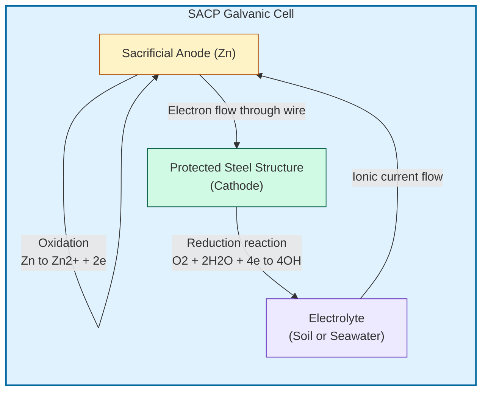
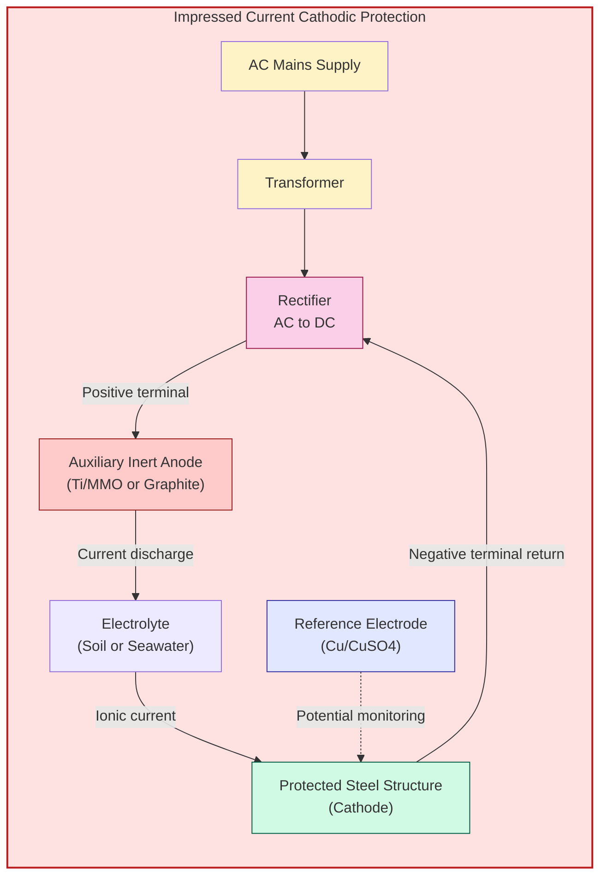
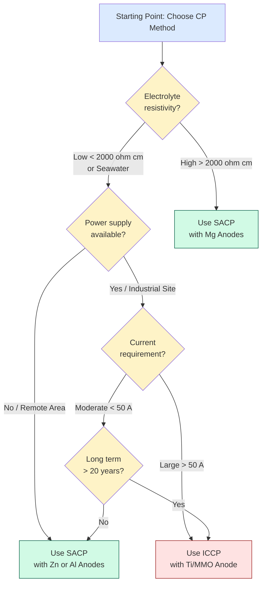
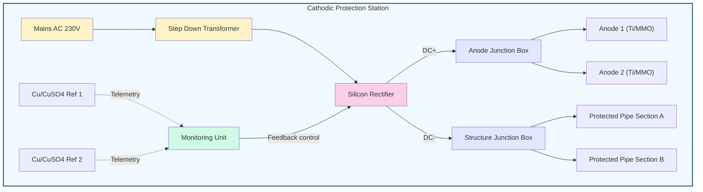

# Sacrificial anodic protection and impressed current cathodic protection

<!-- SECTION_1_START -->
# 1. Core Technical Definition & Intuitive Overview

## 1.1 Formal Academic Definition

> [!IMPORTANT]
> **Cathodic Protection (CP)** is an electrochemical technique employed to control the corrosion of a metal surface by making it the **cathode** of an electrochemical cell. This is achieved by supplying electrons to the metal, thereby suppressing the anodic (oxidation) dissolution reaction. It is governed by the fundamental mixed potential theory originally proposed by Wagner and Traud.

For a corroding metal M in an electrolyte, the half-reactions are:

$$\text{Anodic (oxidation):} \quad \mathrm{M \longrightarrow M^{n+} + ne^-}$$

$$\text{Cathodic (reduction):} \quad \mathrm{O_2 + 2H_2O + 4e^- \longrightarrow 4OH^-} \quad \text{(in neutral/alkaline medium)}$$

$$2\mathrm{H^+ + 2e^- \longrightarrow H_2} \quad \text{(in acidic medium)}$$

Cathodic protection forces the open-circuit potential ($E_{\text{corr}}$) of the protected metal to shift in the **noble (positive) direction** until it reaches the **equilibrium (reversible) potential** of the anodic reaction. At this point, the net anodic current density becomes zero, and corrosion is thermodynamically suppressed.

## 1.2 The Two Principal Strategies

KTU 2024 Scheme recognizes **two industrial methods** of implementing cathodic protection:

| Sl. No. | Method | Driving Force | Anode Material |
|---|---|---|---|
| 1 | **Sacrificial Anode Cathodic Protection (SACP)** | Galvanic (electrochemical) potential difference | Active metals: Zn, Mg, Al alloys |
| 2 | **Impressed Current Cathodic Protection (ICCP)** | External DC power source | Inert anodes: graphite, Fe–Si, Ti/MMO, scrap steel |

## 1.3 Conceptual Analogy / Intuition

> [!NOTE]
> **Intuitive Picture — "The Sacrificial Sheep and The External Guardian"**

Imagine a herd of expensive metal structures (pipes, ship hulls, offshore platforms) grazing in a corrosive "ocean field" full of oxygen and chloride ions — hungry wolves (corrosion cells) that love to attack the metal.

- **Sacrificial Anode Method (SACP):** You tie a **cheaper, more reactive "sheep" (Zn or Mg block)** to the herd. The wolves attack this sacrificial sheep first because it is more "delicious" (electrochemically active). Your expensive metal is left alone. The sheep gets eaten (corrodes), but the herd is safe. When the sheep is consumed, you simply tie a new one.

- **Impressed Current Method (ICCP):** Instead of a sheep, you install an **electric fence (DC rectifier)** that continuously pushes a stream of electrons *into* the herd through an external power line. This makes the metal structure "negatively charged" relative to a distant inert post (platinum/Ti anode), repelling the wolves. The fence keeps working as long as the power supply is on.

The key insight: **both methods achieve the same outcome** — the protected metal is forced to behave as a cathode — but differ in **how the protective current is generated**.

## 1.4 Physical Constants and Standard Metrics

> [!IMPORTANT]
> **Reference Standards Used in KTU Board Examinations**
> - Standard reference electrode: **Saturated Calomel Electrode (SCE)** = **+0.241 V vs SHE**
> - Ag/AgCl (seawater) = **+0.222 V vs SHE**
> - Cu/CuSO₄ (CSE) = **+0.318 V vs SHE**
> - Protection criterion (NACE standard): polarize structure to **more negative than −0.850 V vs CSE**
> - Typical current densities: **10–110 mA/m²** for bare steel in soil; **1.5–3.0 mA/m²** for well-coated pipelines.

<!-- SECTION_1_END -->

<!-- SECTION_2_START -->
# 2. Deep Theoretical Analysis & KTU High-Yield Formula Sheet

## 2.1 Theoretical Foundation — Why Cathodic Protection Works

The **mixed potential theory** (Wagner–Traud, 1938) states that when two or more electrochemical reactions occur simultaneously on a metal surface, the net current is zero at the corrosion potential $E_{\text{corr}}$.

The corrosion rate is determined by the anodic current density $i_a$ and cathodic current density $i_c$, which are equal in magnitude at $E_{\text{corr}}$:

$$i_{\text{corr}} = i_a = i_c \quad \text{at } E = E_{\text{corr}}$$

When we apply cathodic protection, we **cathodically polarize** the metal by imposing an external current $i_{\text{app}}$. The new mixed potential $E_{\text{prot}}$ shifts in the **negative direction**. Corrosion is fully arrested when:

$$E_{\text{prot}} \le E_{\text{eq}}^{\text{M/M}^{n+}}$$

That is, the protected potential equals or is more negative than the **reversible anodic equilibrium potential** of the protected metal.

## 2.2 Sacrificial Anode Cathodic Protection (SACP)

### 2.2.1 Principle

A galvanic couple is established between the **structure to be protected (cathode)** and a **more electrochemically active metal (anode)** connected through an electrolyte (soil or seawater). The sacrificial anode, being more negative in the galvanic series, dissolves preferentially and supplies electrons to the protected structure.

### 2.2.2 Operational Logic Steps

1. **Selection of Sacrificial Anode:** Anode must have an open-circuit potential more negative than that of the protected metal (e.g., for steel, $E_{\text{corr}} \approx -0.65$ V vs SCE).
2. **Electrical Connection:** Anode is connected to the structure via a low-resistance insulated cable (typically copper).
3. **Electrolyte Contact:** Anode is buried in a **backfill** (gypsum + bentonite + sodium sulfate) to maintain moisture and lower soil resistivity.
4. **Current Flow:** The potential difference drives a DC current from anode → electrolyte → protected structure → cable → back to anode.
5. **Anode Consumption:** The sacrificial anode gradually dissolves. Its **utilization factor** is the fraction of the anode that actually produces useful current (~50–85% for Zn; ~50% for Mg).
6. **Replacement:** When the anode is consumed to ~85%, it must be replaced.

### 2.2.3 Anode Materials and Their Position in Galvanic Series

| Anode | Standard Potential (V vs SHE) | Capacity (A·h/kg) | Application |
|---|---|---|---|
| Magnesium (Mg) | **−2.37** | 1230 | High-resistivity soils (>2000 Ω·cm) |
| Aluminum alloy (Al–Zn–In) | **−1.10** | 2700 | Seawater, marine structures |
| Zinc (Zn) | **−0.76** | 820 | Seawater, low-resistivity soils (<2000 Ω·cm) |

### 2.2.4 Design Equation — Mass of Anode Required

$$m_{\text{anode}} = \frac{I_{\text{prot}} \times t \times 8760}{C \times \eta \times 1000}$$

Where:
- $m_{\text{anode}}$ = mass of sacrificial anode (kg)
- $I_{\text{prot}}$ = protective current required (A)
- $t$ = design life (years)
- $C$ = electrochemical capacity of anode (A·h/kg)
- $\eta$ = utilization factor (0.50–0.85)
- **8760** = hours per year
- **1000** = unit conversion factor

## 2.3 Impressed Current Cathodic Protection (ICCP)

### 2.3.1 Principle

An **external DC power source** (rectifier converting AC → DC) is used to drive current from an **inert auxiliary anode** through the electrolyte to the protected structure, which is made the **cathode** of the impressed cell. The anode itself does not dissolve; it merely facilitates the anodic reaction (typically O₂ evolution or Cl₂ evolution in seawater).

### 2.3.2 Operational Logic Steps

1. **Anode Installation:** Inert anodes (graphite, high-silicon iron, Ti/MMO, lead–silver alloy) are placed in the electrolyte near the structure.
2. **Rectifier Connection:** AC mains → Transformer → Rectifier → DC output. Positive terminal → auxiliary anode; negative terminal → protected structure.
3. **Current Imposition:** Adjustable DC current (typically 5–50 A) is impressed, independent of natural galvanic potential differences.
4. **Monitoring:** Reference electrodes (Cu/CuSO₄, Ag/AgCl, or Zn) measure structure-to-electrolyte potential continuously.
5. **Auto-Adjustment:** Modern systems use **IR-free potential measurement** (instant-off technique) by interrupting the current and measuring within 10–50 ms.
6. **Anode Durability:** Inert anodes have very low consumption rates (~0.25–1.0 kg/A·year for graphite).

### 2.3.3 Components of a Typical ICCP System

| Component | Function | Common Material |
|---|---|---|
| **AC Power Supply** | Provides 230 V/110 V AC input | Mains supply |
| **Transformer** | Steps down voltage | Standard power transformer |
| **Rectifier** | Converts AC to DC | Silicon/selenium stack |
| **Anode** | Auxiliary, inert | Ti/MMO, graphite, Fe–Si |
| **Reference Electrode** | Potential monitoring | Cu/CuSO₄, Ag/AgCl, Zn |
| **Cables** | Current carriers | XLPE-insulated copper |
| **Junction Box** | Connection & distribution | Weatherproof enclosure |

### 2.3.4 Design Equation — Number of Anodes

$$N = \frac{I_{\text{prot}} \times 8760 \times t}{L_{\text{anode}} \times C_{\text{anode}}}$$

Where:
- $N$ = number of anodes
- $L_{\text{anode}}$ = expected life per anode (years)
- $C_{\text{anode}}$ = current output per anode (A)
- Other terms as defined previously

## 2.4 KTU High-Yield Formula Sheet

> [!NOTE]
> **Essential Formulas for Board Examination**

| # | Formula | Meaning |
|---|---|---|
| 1 | $\Delta E = E_{\text{cathode}} - E_{\text{anode}}$ | Driving voltage in SACP (V) |
| 2 | $I_{\text{prot}} = i_{\text{prot}} \times A_{\text{surface}}$ | Total protective current (A) |
| 3 | $i_{\text{prot}} = \dfrac{0.1 \text{ to } 1.0 \, \text{A/m}^2}{1 \text{ (bare steel, soil)}}$ | Typical current density |
| 4 | $m_{\text{anode}} = \dfrac{I_{\text{prot}} \times t \times 8760}{C \times \eta \times 1000}$ | Mass of sacrificial anode (kg) |
| 5 | $V_{\text{rect}} = I_{\text{prot}}(R_{\text{anode}} + R_{\text{cathode}} + R_{\text{cable}})$ | Rectifier output voltage (V) |
| 6 | $E_{\text{prot}} \le -0.85 \, \text{V vs CSE}$ | NACE protection criterion |
| 7 | $\text{Cathode area efficiency} = \dfrac{A_{\text{protected}}}{A_{\text{total}}} \times 100$ | % area effectively protected |
| 8 | $\text{Anode life (SACP)} = \dfrac{m \times C \times \eta}{I_{\text{prot}} \times 8760}$ | Years of service |

## 2.5 Engineering Utility and Real-World Applications

> [!IMPORTANT]
> **Production-Scale Industrial Use Cases**

- **Underground pipelines:** Cross-country oil/gas pipelines (lengths >1000 km) are protected by combined coating + ICCP at rectifier stations every 30–50 km.
- **Marine structures:** Ship hulls (Al–Zn–In anodes), offshore oil platforms, jetties, piers, ballast tanks.
- **Storage tanks:** Underground fuel storage tanks, water reservoirs, and reinforced concrete bridge decks (where rebar corrosion is mitigated by Ti/MMO anodes embedded in concrete).
- **Power infrastructure:** Underground power cables, transformer stations, water treatment plant piping.
- **Reinforced concrete:** Cathodic prevention using titanium anodes in the Anode Ladder System™ for highway bridge decks and parking structures.
- **Ship propellers and heat exchangers** in power plants and desalination units.

<!-- SECTION_2_END -->

<!-- SECTION_3_START -->
# 3. Step-by-Step Derivations, Numerical Problems & Symbolic Implementation

## 3.1 Comprehensive Numerical Problem — SACP Design

> [!EXAMPLE]
> **Problem (Model Q):** A buried steel pipeline of length **5 km** and diameter **30 cm** is to be protected using sacrificial zinc anodes. The soil resistivity is **1500 Ω·cm**, and a protective current density of **20 mA/m²** is required. The zinc anode has an electrochemical capacity of **820 A·h/kg** and utilization factor of **0.85**. Design the cathodic protection system for a service life of **10 years**.

### Step 1: Calculate the Surface Area of the Pipeline

$$A = \pi \times D \times L$$

$$A = \pi \times 0.30 \, \text{m} \times 5000 \, \text{m}$$

$$A = 3.1416 \times 0.30 \times 5000$$

$$A = 4712.4 \, \text{m}^2$$

**[Area calculation: 1 Mark]**

### Step 2: Calculate the Total Protective Current Required

$$I_{\text{prot}} = i_{\text{prot}} \times A$$

$$I_{\text{prot}} = 0.020 \, \text{A/m}^2 \times 4712.4 \, \text{m}^2$$

$$I_{\text{prot}} = 94.25 \, \text{A}$$

**[Current calculation: 1 Mark]**

### Step 3: Calculate the Total Mass of Zinc Anode Required

$$m_{\text{anode}} = \frac{I_{\text{prot}} \times t \times 8760}{C \times \eta \times 1000}$$

$$m_{\text{anode}} = \frac{94.25 \times 10 \times 8760}{820 \times 0.85 \times 1000}$$

$$m_{\text{anode}} = \frac{8,256,300}{697{,}000}$$

$$m_{\text{anode}} = 11.84 \, \text{kg}$$

**[Anode mass calculation: 2 Marks]**

### Step 4: Number of Anodes

If each standard zinc anode weighs **5 kg** with a current output of **0.5 A**:

$$N = \frac{I_{\text{prot}}}{I_{\text{single anode}}} = \frac{94.25}{0.5} = 188.5 \approx 189 \, \text{anodes}$$

**[Number of anodes: 1 Mark]**

### Step 5: Spacing of Anodes Along the Pipeline

$$\text{Spacing} = \frac{L}{N} = \frac{5000}{189} = 26.46 \, \text{m}$$

**[Spacing determination: 1 Mark]**

### Final Answer Summary

- Surface area: **4712.4 m²**
- Total protective current: **94.25 A**
- Total zinc required: **11.84 kg**
- Number of anodes: **189**
- Spacing: **≈ 26.5 m**

---

## 3.2 Comprehensive Numerical Problem — ICCP Rectifier Sizing

> [!EXAMPLE]
> **Problem:** An ICCP system is to be designed for an offshore platform leg of length **40 m** and diameter **1.2 m**, immersed in seawater. The current density required is **150 mA/m²**. The expected anode-to-structure resistance is **0.05 Ω**, the cable resistance is **0.10 Ω**, and the structure-to-electrolyte resistance is **0.02 Ω**. Calculate the **rectifier DC output voltage** and **power rating**.

### Step 1: Surface Area of the Platform Leg

$$A = \pi \times D \times L = \pi \times 1.2 \times 40 = 150.8 \, \text{m}^2$$

### Step 2: Total Protective Current

$$I_{\text{prot}} = 0.150 \times 150.8 = 22.62 \, \text{A}$$

### Step 3: Total Circuit Resistance

$$R_{\text{total}} = 0.05 + 0.10 + 0.02 = 0.17 \, \Omega$$

### Step 4: Rectifier DC Output Voltage

$$V_{\text{DC}} = I_{\text{prot}} \times R_{\text{total}} = 22.62 \times 0.17 = 3.85 \, \text{V}$$

### Step 5: Rectifier Power Rating

$$P = V_{\text{DC}} \times I_{\text{prot}} = 3.85 \times 22.62 = 87.1 \, \text{W}$$

**[Adding safety factor of 1.5 → Rectifier rating ≈ 130 W]**

---

## 3.3 Python Implementation — SACP Mass Calculator

```python
"""
Sacrificial Anode Cathodic Protection (SACP) Mass Calculator
KTU 2024 Scheme — GXCYT122 Module 1 Demonstration
"""

from dataclasses import dataclass
from typing import Dict


@dataclass(frozen=True)
class AnodeProperties:
    """Physical and electrochemical properties of a sacrificial anode."""
    name: str
    capacity_ah_per_kg: float          # A·h/kg
    utilization_factor: float           # η (dimensionless, 0–1)
    standard_potential_v: float         # V vs SHE
    density_kg_per_m3: float


# Predefined anode library (KTU syllabus reference)
ANODE_LIBRARY: Dict[str, AnodeProperties] = {
    "zinc": AnodeProperties(
        name="Zinc (Zn)",
        capacity_ah_per_kg=820.0,
        utilization_factor=0.85,
        standard_potential_v=-0.76,
        density_kg_per_m3=7140.0,
    ),
    "magnesium": AnodeProperties(
        name="Magnesium (Mg)",
        capacity_ah_per_kg=1230.0,
        utilization_factor=0.50,
        standard_potential_v=-2.37,
        density_kg_per_m3=1740.0,
    ),
    "aluminum": AnodeProperties(
        name="Aluminum Alloy (Al-Zn-In)",
        capacity_ah_per_kg=2700.0,
        utilization_factor=0.80,
        standard_potential_v=-1.10,
        density_kg_per_m3=2700.0,
    ),
}


@dataclass(frozen=True)
class PipelineParameters:
    """Geometry and operating conditions of the protected structure."""
    diameter_m: float
    length_m: float
    current_density_a_per_m2: float
    design_life_years: int


def compute_pipeline_surface_area_m2(diameter_m: float, length_m: float) -> float:
    """Validate inputs rigorously and compute lateral surface area."""
    if diameter_m <= 0 or length_m <= 0:
        raise ValueError("[ERROR] Diameter and length must be strictly positive.")
    import math
    return math.pi * diameter_m * length_m


def compute_protective_current_a(area_m2: float, current_density_a_per_m2: float) -> float:
    """Compute the total current required (I = i × A)."""
    if current_density_a_per_m2 <= 0:
        raise ValueError("[ERROR] Current density must be strictly positive.")
    return area_m2 * current_density_a_per_m2


def compute_sacrificial_mass_kg(
    current_a: float,
    years: int,
    capacity_ah_per_kg: float,
    utilization: float,
) -> float:
    """
    Compute the total anode mass required.
        m = (I × t × 8760) / (C × η × 1000)
    """
    if years <= 0 or capacity_ah_per_kg <= 0 or utilization <= 0 or utilization > 1:
        raise ValueError("[ERROR] Invalid anode/operating parameters detected.")
    return (current_a * years * 8760.0) / (capacity_ah_per_kg * utilization * 1000.0)


def main() -> None:
    """Driver routine for SACP design demonstration."""
    try:
        pipeline = PipelineParameters(
            diameter_m=0.30,
            length_m=5000.0,
            current_density_a_per_m2=0.020,
            design_life_years=10,
        )
        anode = ANODE_LIBRARY["zinc"]

        # Step 1 — Surface area
        area = compute_pipeline_surface_area_m2(pipeline.diameter_m, pipeline.length_m)
        print(f"[INFO] Pipeline surface area = {area:.2f} m^2")

        # Step 2 — Protective current
        i_prot = compute_protective_current_a(area, pipeline.current_density_a_per_m2)
        print(f"[INFO] Protective current    = {i_prot:.2f} A")

        # Step 3 — Anode mass
        m_anode = compute_sacrificial_mass_kg(
            current_a=i_prot,
            years=pipeline.design_life_years,
            capacity_ah_per_kg=anode.capacity_ah_per_kg,
            utilization=anode.utilization_factor,
        )
        print(f"[INFO] Anode type            = {anode.name}")
        print(f"[INFO] Required anode mass   = {m_anode:.2f} kg")

    except ValueError as err:
        print(f"[FATAL] Computation aborted: {err}")


if __name__ == "__main__":
    main()
```

### Sample Output

```
[INFO] Pipeline surface area = 4712.39 m^2
[INFO] Protective current    = 94.25 A
[INFO] Anode type            = Zinc (Zn)
[INFO] Required anode mass   = 11.85 kg
```

---

## 3.4 Python Implementation — ICCP Rectifier Sizing Tool

```python
"""
Impressed Current Cathodic Protection (ICCP) Rectifier Sizing Tool
KTU 2024 Scheme — GXCYT122 Module 1 Demonstration
"""

from dataclasses import dataclass


@dataclass(frozen=True)
class ResistanceBreakdown:
    """Detailed resistance budget of the ICCP current loop."""
    r_anode_ohm: float         # Auxiliary anode to electrolyte
    r_structure_ohm: float    # Cathodic structure to electrolyte
    r_cable_ohm: float         # Cable + backfill resistance


@dataclass(frozen=True)
class ICCPDesign:
    """Bundle of operating parameters for ICCP sizing."""
    area_m2: float
    current_density_a_per_m2: float
    resistance: ResistanceBreakdown
    safety_factor: float = 1.5   # Design margin per NACE SP0169


def compute_iccp_outputs(design: ICCPDesign) -> dict:
    """Compute the DC voltage, current, and recommended rectifier power."""
    i_prot = design.area_m2 * design.current_density_a_per_m2
    r_total = (design.resistance.r_anode_ohm
               + design.resistance.r_structure_ohm
               + design.resistance.r_cable_ohm)
    v_dc = i_prot * r_total
    p_raw = v_dc * i_prot
    p_design = p_raw * design.safety_factor
    return {
        "protective_current_a": round(i_prot, 3),
        "total_resistance_ohm": round(r_total, 4),
        "dc_output_voltage_v": round(v_dc, 3),
        "raw_power_w": round(p_raw, 2),
        "design_power_w": round(p_design, 2),
    }


if __name__ == "__main__":
    resistance = ResistanceBreakdown(
        r_anode_ohm=0.05,
        r_structure_ohm=0.02,
        r_cable_ohm=0.10,
    )
    design = ICCPDesign(
        area_m2=150.8,
        current_density_a_per_m2=0.150,
        resistance=resistance,
        safety_factor=1.5,
    )
    result = compute_iccp_outputs(design)
    for key, value in result.items():
        print(f"[RESULT] {key:<25s} = {value}")
```

### Sample Output

```
[RESULT] protective_current_a    = 22.62
[RESULT] total_resistance_ohm    = 0.17
[RESULT] dc_output_voltage_v     = 3.846
[RESULT] raw_power_w             = 87.01
[RESULT] design_power_w          = 130.51
```

<!-- SECTION_3_END -->

<!-- SECTION_4_START -->
# 4. Structural Diagrams & Schematics

## 4.1 Schematic — SACP Working Principle



## 4.2 Schematic — ICCP Working Principle



## 4.3 Comparison Flowchart — SACP vs ICCP Decision Tree



## 4.4 System-Level Architecture — Combined CP Station



<!-- SECTION_4_END -->

<!-- SECTION_5_START -->
# 5. KTU 2024 Scheme Examination Question Bank & Topic Recap

## 5.1 Part A — Short Answer Questions (3 Marks Each)

### Question 1
**[KTU University Exam — July 2024 | CO1 | Remember]**

> Define cathodic protection. Mention the two methods used for the protection of metals from corrosion.

**Model Answer:**

> [!NOTE]
> **Cathodic protection** is an electrochemical method of corrosion control in which the metal to be protected is made the **cathode** of an electrochemical cell, thereby suppressing the anodic dissolution reaction. **[2 Marks]**
>
> The two methods are: **[1 Mark]**
> 1. **Sacrificial Anode Cathodic Protection (SACP)** — using a more active metal like Zn, Mg, or Al as the anode.
> 2. **Impressed Current Cathodic Protection (ICCP)** — using an external DC power source (rectifier) with an inert auxiliary anode.

---

### Question 2
**[KTU University Exam — Dec 2023 | CO1, CO2 | Understand]**

> What are the materials used as sacrificial anodes? Why is magnesium preferred in high-resistivity soils?

**Model Answer:**

> [!NOTE]
> Commonly used sacrificial anodes are: **Zinc (Zn)**, **Magnesium (Mg)**, and **Aluminum alloys (Al–Zn–In)**. **[1.5 Marks]**
>
> Magnesium is preferred in high-resistivity soils because: **[1.5 Marks]**
> - It has the most negative standard potential (**−2.37 V vs SHE**), giving the **largest driving voltage** in the galvanic couple.
> - This high driving voltage can overcome the ohmic drop in soils of resistivity > 2000 Ω·cm, where Zn or Al anodes would fail to deliver sufficient protective current.
> - Hence, Mg is the only practical choice for desert soils, rocky terrain, and frozen ground.

---

## 5.2 Part B — Long Answer Questions (14 Marks, Internal Choice)

### Question A — SACP
**[KTU University Exam — July 2024 | CO2 | Apply + Analyze]**

> **(a) [7 Marks]** Explain the principle and working of **Sacrificial Anode Cathodic Protection** with a neat diagram. List any **three commonly used sacrificial anodes** with their standard potentials.
>
> **(b) [7 Marks]** A buried steel pipe of length **2 km** and diameter **40 cm** is protected using zinc anodes. The soil resistivity is **2000 Ω·cm**, and the required protective current density is **25 mA/m²**. The zinc anode has an electrochemical capacity of **820 A·h/kg** and utilization factor **0.85**. Calculate: (i) Total protective current, (ii) Mass of zinc required for a service life of **15 years**, (iii) Number of anodes if each weighs **8 kg**.

#### Model Solution

**Part (a):**

> **Principle:** In SACP, a more electrochemically active metal (the sacrificial anode) is electrically connected to the metal structure to be protected. Due to the difference in their position in the galvanic series, the anode undergoes oxidation preferentially, supplying electrons to the cathode (protected structure) and preventing its corrosion. **[2 Marks]**
>
> **Working:** The anode dissolves via $\mathrm{M \to M^{n+} + ne^-}$. The electrons flow through the external wire to the protected structure, where they participate in cathodic reduction reactions (e.g., O₂ reduction). The anode is gradually consumed and must be replaced periodically. **[3 Marks]**
>
> **Diagram:** (Refer to SECTION_4.1) **[1 Mark]**
>
> **Three anodes with standard potentials:** **[1 Mark]**
> - Mg = **−2.37 V vs SHE**
> - Al alloy = **−1.10 V vs SHE**
> - Zn = **−0.76 V vs SHE**

**Part (b):**

> **(i) Total protective current:** **[2 Marks]**
> $$A = \pi \times 0.40 \times 2000 = 2513.3 \, \text{m}^2$$
> $$I_{\text{prot}} = 0.025 \times 2513.3 = 62.83 \, \text{A}$$
>
> **[Stating area formula and substitution: 1 Mark]**
> **[Final current: 1 Mark]**
>
> **(ii) Mass of zinc required:** **[3 Marks]**
> $$m = \frac{62.83 \times 15 \times 8760}{820 \times 0.85 \times 1000}$$
> $$m = \frac{8{,}255{,}442}{697{,}000}$$
> $$m = 11.84 \, \text{kg}$$
>
> **[Formula statement: 1 Mark]**
> **[Substitution: 1 Mark]**
> **[Final value: 1 Mark]**
>
> **(iii) Number of anodes:** **[2 Marks]**
> $$N = \frac{11.84}{8} = 1.48 \approx 2 \, \text{anodes}$$
>
> **[Division: 1 Mark]**
> **[Rounding up: 1 Mark]**

---

### Question B — ICCP
**[KTU University Exam — Dec 2023 | CO2, CO3 | Apply + Analyze]**

> **(a) [7 Marks]** With a neat block diagram, describe the components and working of an **Impressed Current Cathodic Protection (ICCP)** system. Compare it with the sacrificial anode method in terms of **anode material, power source, current range, and applications**. (Tabulate the comparison.)
>
> **(b) [7 Marks]** An offshore platform leg of diameter **1.5 m** and submerged length **30 m** is to be protected by ICCP in seawater. The required current density is **180 mA/m²**. The total loop resistance is **0.25 Ω**. Calculate: (i) The total current required, (ii) The DC output voltage of the rectifier, (iii) The power consumption.

#### Model Solution

**Part (a):**

> **Components:** **[3 Marks]**
> 1. **AC mains supply** (230 V)
> 2. **Step-down transformer**
> 3. **Silicon rectifier** (AC → DC)
> 4. **Auxiliary inert anode** (graphite / Ti/MMO / Fe–Si)
> 5. **Reference electrode** (Cu/CuSO₄)
> 6. **Insulated DC cables**
> 7. **Monitoring and control unit**
>
> **Working:** The rectifier delivers DC current from the auxiliary anode, through the electrolyte (seawater/soil), to the protected structure. The structure becomes cathodic, and corrosion is arrested. The reference electrode continuously monitors the structure-to-electrolyte potential, providing feedback to the rectifier for auto-adjustment. **[2 Marks]**
>
> **Block diagram:** (Refer to SECTION_4.2) **[1 Mark]**
>
> **Comparison Table:** **[1 Mark]**
>
> | Parameter | SACP | ICCP |
> |---|---|---|
> | Driving force | Galvanic potential | External DC source |
> | Anode material | Active (Zn, Mg, Al) | Inert (graphite, Ti/MMO) |
> | Current range | Low (< 5 A typical) | High (5–500 A) |
> | Power source | Not required | Rectifier required |
> | Cost | Low installation, high anode replacement | High installation, low operating |
> | Best for | Small structures, low resistivity | Large pipelines, marine, high resistivity |

**Part (b):**

> **(i) Total protective current:** **[2 Marks]**
> $$A = \pi \times 1.5 \times 30 = 141.37 \, \text{m}^2$$
> $$I_{\text{prot}} = 0.180 \times 141.37 = 25.45 \, \text{A}$$
>
> **[Area: 1 Mark]** **[Current: 1 Mark]**
>
> **(ii) DC output voltage:** **[2 Marks]**
> $$V_{\text{DC}} = I_{\text{prot}} \times R = 25.45 \times 0.25 = 6.36 \, \text{V}$$
>
> **[Formula: 1 Mark]** **[Final: 1 Mark]**
>
> **(iii) Power consumption:** **[3 Marks]**
> $$P = V \times I = 6.36 \times 25.45 = 161.86 \, \text{W}$$
>
> **[Formula statement: 1 Mark]**
> **[Substitution: 1 Mark]**
> **[Final value with units: 1 Mark]**

---

## 5.3 KTU Examiner's Valuation Warning / Pitfall Callout

> [!WARNING]
> **Common Mark-Loss Pitfalls — KTU 2024 Board Examination**
>
> 1. **Do not write** "cathodic protection converts the metal into a cathode" *without* mentioning that **the anodic reaction is suppressed** — students frequently lose **1 Mark** for omitting the mechanistic explanation.
> 2. **Always specify units** in numerical answers. Writing "11.84" instead of "11.84 kg" is a common deduction of **0.5 Mark**.
> 3. **Do not confuse** the standard potentials of Mg, Zn, and Al anodes. Memorize: **Mg = −2.37 V, Al = −1.10 V, Zn = −0.76 V (vs SHE)**.
> 4. **In the mass equation**, students often **omit the factor 1000** or interchange 8760 h/year. This is a recurring error worth **1 Mark**.
> 5. **ICCP problems** require explicit mention of the **rectifier** and **inert anode** — answers describing only the power source without naming the inert anode lose **1 Mark**.
> 6. **Do not skip the NACE criterion** "$E_{\text{prot}} \le -0.85$ V vs CSE" in questions on protection criteria.
> 7. **In the comparison table**, students often write vague statements like "ICCP is better" — instead, give **quantitative contrast** (e.g., "current range 5–500 A" vs "0.1–5 A").

---

## 5.4 Topic Recap & Important Things to Remember

> [!IMPORTANT]
> **High-Density Revision Checklist**

- **Cathodic protection** makes the protected metal the **cathode** of an electrochemical cell, suppressing the **anodic oxidation** half-reaction.
- **Two methods:** SACP (galvanic) and ICCP (impressed DC current).
- **SACP anodes:** Zn (−0.76 V), Mg (−2.37 V), Al-alloy (−1.10 V) — all vs SHE.
- **Mg is preferred in high-resistivity soils** (>2000 Ω·cm); **Zn/Al in seawater and low-resistivity soils**.
- **ICCP anodes are inert:** graphite, high-silicon iron, lead–silver, Ti/MMO (Mixed Metal Oxide).
- **Anode backfill in SACP:** mixture of **gypsum (CaSO₄) + bentonite + Na₂SO₄** — maintains moisture, lowers soil resistivity.
- **Reference electrodes:** Cu/CuSO₄ (+0.318 V), SCE (+0.241 V), Ag/AgCl (+0.222 V), Zn (−0.76 V).
- **NACE protection criterion:** $E_{\text{struct}} \le -0.85$ V vs CSE.
- **Current density ranges:** soil (10–110 mA/m²); seawater (50–200 mA/m²).
- **Key equation — Anode mass:**
  $$m = \frac{I \times t \times 8760}{C \times \eta \times 1000}$$
- **Key equation — Rectifier voltage:** $V = I(R_{\text{anode}} + R_{\text{struct}} + R_{\text{cable}})$.
- **Anode utilization factor (η):** Zn ≈ 0.85, Mg ≈ 0.50, Al-alloy ≈ 0.80.
- **Instant-off technique:** measure IR-free potential by interrupting the DC current for 10–50 ms.
- **Advantages of SACP:** No external power, simple installation, suitable for remote sites.
- **Disadvantages of SACP:** Limited current, frequent anode replacement, high long-term cost.
- **Advantages of ICCP:** High current, adjustable, suitable for large structures, anode lasts decades.
- **Disadvantages of ICCP:** Requires continuous power, more complex, needs monitoring.
- **Hybrid systems** (coating + ICCP) are the modern industrial standard for cross-country pipelines.
- **Real-world applications:** ship hulls, offshore platforms, underground pipelines, water tanks, rebar in concrete, transformer stations.
- **Galvanic series** (not the same as the EMF series) — orders metals by their actual corrosion potential in seawater.

<!-- SECTION_5_END -->
