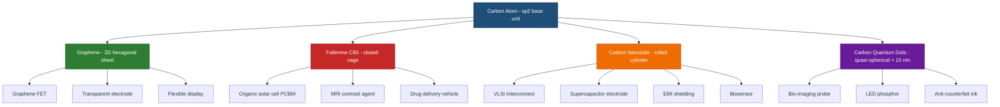
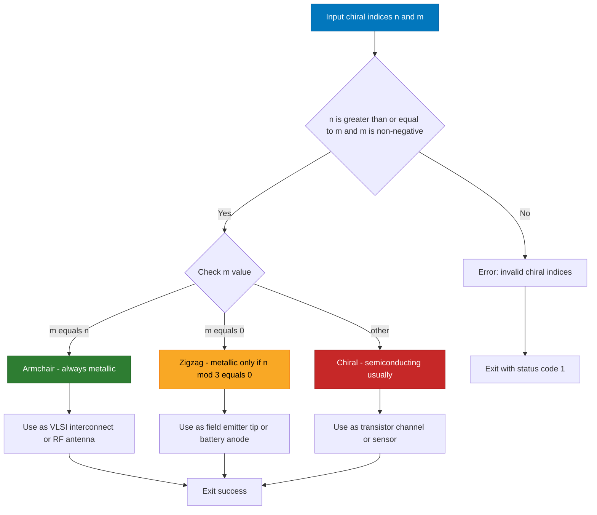
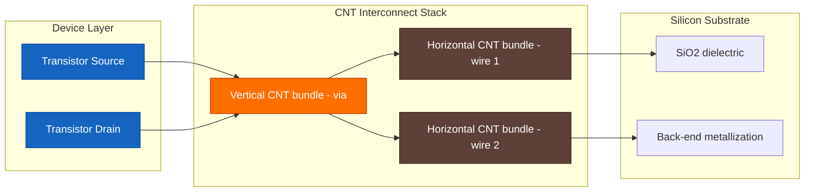
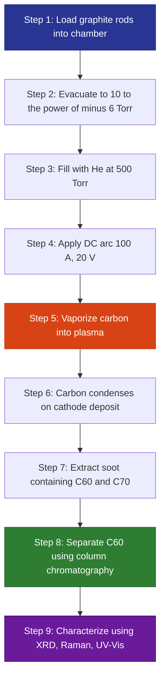

# Applications of nanomaterials – Carbon Nanotubes, Fullerenes, Graphene & Carbon Quantum Dots (structure, properties & application)

<!-- SECTION_1_START -->

# Carbon-Based Nanomaterials: Structure, Properties & Applications

## 1.1 Core Technical Definition

> [!IMPORTANT]
> **KTU 2024 Syllabus Definition**
> **Nanomaterials** are materials with at least one external dimension measuring **less than 100 nm** ($\leq 100 \times 10^{-9}$ m), exhibiting size-dependent properties distinctly different from their bulk counterparts. **Carbon-based nanomaterials** are a unique subclass where carbon atoms are arranged in $sp^2$ or $sp^3$ hybridized allotropes, producing extraordinary electrical, mechanical, and optical behaviour essential for modern information and electrical science applications.

In the context of **GXCYT122 (Module 2)**, four carbon allotropes form the engineering core:
1. **Carbon Nanotubes (CNT)** – cylindrical $sp^2$ carbon sheets
2. **Fullerenes** – closed cage-like structures (e.g., $C_{60}$)
3. **Graphene** – a single-atom-thick 2D hexagonal sheet
4. **Carbon Quantum Dots (CQD)** – quasi-spherical carbon nanoparticles $< 10$ nm

## 1.2 Conceptual Analogy / Intuition

> [!NOTE]
> **"The Carbon Lego Analogy"**
> Imagine a single sheet of **chicken wire** (graphene) — strong, lightweight, and conducts electricity. Now:
> * **Roll** the wire into a tube $\rightarrow$ you get a **Carbon Nanotube** (a straw)
> * **Curve** it into a football shape with pentagons $\rightarrow$ you get a **Fullerene** ($C_{60}$ buckyball)
> * **Crumple** tiny fragments ($\leq 10$ nm) into glowing dots $\rightarrow$ you get **Carbon Quantum Dots**
>
> All four are made from the **same Lego brick** (one carbon atom), but their geometry dramatically alters their quantum, electrical, and optical behaviour.

## 1.3 Key Geometric Parameters

| Parameter | Symbol | Typical Value (Carbon Nanomaterials) |
| :--- | :--- | :--- |
| Carbon bond length (graphene) | $a_{C-C}$ | $\mathbf{0.142\ nm}$ |
| Bond length in $C_{60}$ | $a_{C-C}$ | $\mathbf{0.140\ nm}$ (6:6) / $\mathbf{0.146\ nm}$ (6:5) |
| CNT diameter range | $d_{CNT}$ | $1 - 100\ nm$ |
| Graphene thickness | $t$ | $\mathbf{0.345\ nm}$ (single layer) |
| CQD diameter | $d_{CQD}$ | $< 10\ nm$ (typically $2 - 8\ nm$) |
| Universal $sp^2$ hybridization | — | trigonal planar, $120^\circ$ bond angle |

## 1.4 Visualization Control Block

> [!VISUALIZATION CONTROL]
> **Concept:** Graphene Honeycomb Lattice in Real Space
> **GeoGebra / Desmos Input Equations:**
> * `Lattice Vector 1: a1 = (3*a0/2, sqrt(3)*a0/2)` with $a_0 = 0.142$
> * `Lattice Vector 2: a2 = (3*a0/2, -sqrt(3)*a0/2)`
> * `Atomic sites: A sublattice at n*a1 + m*a2 ; B sublattice offset by (a0, 0)`
> **Visual Description:** A 2D hexagonal honeycomb should appear, with each vertex representing a carbon atom. Observe the two-atom basis (sublattices A and B) generating the famous **Dirac cone** band structure.

<!-- SECTION_1_END -->

<!-- SECTION_2_START -->

# Deep Theoretical Analysis & KTU High-Yield Formula Sheet

## 2.1 Graphene – The 2D Wonder Material

### Structure
* Single-atom-thick planar sheet of $sp^2$ hybridized carbon atoms arranged in a **hexagonal honeycomb lattice**.
* Each carbon contributes **one $\pi$-electron** perpendicular to the plane, delocalized across the sheet.
* Exhibits the **Dirac cone** electronic dispersion near the **K** and **K'** points of the Brillouin zone.

### Tight-Binding Energy Dispersion

$$E(\vec{k}) = \pm \, t \, \left| f(\vec{k}) \right|$$

where

$$f(\vec{k}) = 1 + 2\cos\!\left(k_y \, a_0 \tfrac{\sqrt{3}}{2}\right) e^{i \, k_x \, 3a_0/2}$$

* $t \approx 2.97\ eV$ (nearest-neighbour hopping integral)
* The **±** sign indicates conduction ($\pi^*$) and valence ($\pi$) bands
* At the **Dirac point** ($\vec{k}_D$), $E = 0 \Rightarrow$ graphene behaves as a **zero-bandgap semimetal**

### Carrier Velocity Near Dirac Point
At low energy, carriers obey a **linear** dispersion:

$$E = \hbar v_F \, \vert \vec{k} - \vec{k}_D \vert$$

* $v_F \approx 1 \times 10^6\ m/s$ (Fermi velocity, ~ $c/300$)
* $E \propto k$ (linear, not parabolic) — carriers behave as **massless Dirac fermions**.

## 2.2 Carbon Nanotubes (CNT)

### Structure & Classification
A CNT is conceptually obtained by **rolling** a graphene sheet along a chiral vector:

$$\vec{C}_h = n \, \vec{a}_1 + m \, \vec{a}_2$$

where $n, m$ are integers ($0 \leq m \leq n$).

| Type | Chiral Index $(n,m)$ | Geometric Description | Electrical Behaviour |
| :--- | :--- | :--- | :--- |
| **Armchair** | $(n, n)$ | All C-C bonds perpendicular to axis | **Metallic** (always) |
| **Zigzag** | $(n, 0)$ | Saw-tooth edge | Metallic if $n$ is multiple of 3 |
| **Chiral** | $(n, m)$ with $m \neq 0$, $m \neq n$ | Helical | Semiconducting (most cases) |

> [!NOTE]
> **Conductance Selection Rule:** A CNT is metallic iff $\dfrac{(n - m)}{3}$ is an integer.

### CNT Diameter & Chiral Angle

$$d_{CNT} = \frac{\sqrt{3} \, a_0 \, \sqrt{n^2 + nm + m^2}}{\pi}$$

$$\theta = \tan^{-1}\!\left(\frac{\sqrt{3}\, m}{2n + m}\right)$$

* $\theta = 0^\circ \Rightarrow$ Zigzag
* $\theta = 30^\circ \Rightarrow$ Armchair
* $0 < \theta < 30^\circ \Rightarrow$ Chiral

## 2.3 Fullerenes ($C_{60}$ – Buckyball)

### Structure
* $C_{60$}$ is a truncated icosahedron with **20 hexagons + 12 pentagons** (Euler's polyhedron formula: $V - E + F = 2$).
* Symmetry: **$I_h$** (icosahedral, the highest non-crystallographic point group).
* Each carbon is $sp^{2.28}$ hybridized (between pure $sp^2$ and $sp^3$).
* Diameter: $\mathbf{0.71\ nm}$ — hence the name "buckyball."

> [!IMPORTANT]
> **Isolated Pentagon Rule (IPR):** In stable fullerenes, no two pentagons share an edge. This is why $C_{60}$ is the smallest stable fullerene.

## 2.4 Carbon Quantum Dots (CQD)

### Structure
* Quasi-spherical carbon nanoparticles with diameter $<\ 10$ nm.
* Consists of an $sp^2/sp^3$ carbon core surrounded by surface functional groups (–COOH, –OH, –NH$_2$).
* Display **quantum confinement** when size approaches the exciton Bohr radius.

### Photoluminescence Origin
Emission wavelength depends on size:

$$E_g \approx \frac{h^2}{8 \, r^2 \, \mu} \quad \text{(effective mass approximation)}$$

* $r$ = radius of CQD
* $\mu$ = reduced effective mass of exciton
* Smaller dots $\Rightarrow$ larger $E_g \Rightarrow$ **blue-shifted** emission

## 2.5 KTU Formula Sheet / Cheat Sheet

| # | Property / Formula | Expression | Engineering Significance |
| :---: | :--- | :--- | :--- |
| 1 | Dirac dispersion (graphene) | $E = \hbar v_F \vert \vec{k} \vert$ | Ultra-high carrier mobility |
| 2 | CNT diameter | $d = \dfrac{\sqrt{3}\, a_0\, \sqrt{n^2+nm+m^2}}{\pi}$ | Determines bandgap |
| 3 | CNT bandgap (semiconducting) | $E_g \approx \dfrac{0.84\ eV}{d\,[nm]}$ | Size-tunable optoelectronics |
| 4 | Metallic rule | $(n-m)$ divisible by 3 | CNT selection for interconnects |
| 5 | Young's modulus (CNT) | $E \approx 1\ TPa$ | Stronger than steel by ~100x |
| 6 | Quantum confinement | $E_g \propto 1/r^2$ | CQD emission tuning |
| 7 | Tensile strength (graphene) | $\sigma \approx 130\ GPa$ | Flexible electronics |
| 8 | Thermal conductivity (graphene) | $K \approx 5000\ W/mK$ | Heat spreaders in chips |
| 9 | Carrier mobility (graphene) | $\mu \approx 200{,}000\ cm^2/Vs$ | RF transistor channels |
| 10 | $C_{60}$ LUMO energy | $\approx -3.0\ eV$ | Organic solar cell acceptor |

## 2.6 Engineering & Industrial Utility

> [!NOTE]
> **Why KTU Emphasizes These Four Materials**
> * **Graphene** $\to$ next-generation **FETs, transparent electrodes, flexible displays, spintronics**
> * **CNT** $\to$ **interconnects** replacing copper in VLSI, **supercapacitors, EMI shielding, biosensors**
> * **Fullerenes** $\to$ **organic photovoltaics (OPV)**, MRI contrast agents, antiviral drug delivery
> * **CQD** $\to$ **bio-imaging, LED phosphors, anti-counterfeiting inks, photodetectors**

<!-- SECTION_2_END -->

<!-- SECTION_3_START -->

# Step-by-Step Derivations & Symbolic Implementations

## 3.1 Derivation: Graphene Band Structure Using Tight-Binding

The **tight-binding Hamiltonian** for $\pi$-electrons in graphene, considering only nearest-neighbour hopping $t$, yields:

$$H(\vec{k}) = \begin{pmatrix} 0 & t \, f(\vec{k}) \\ t \, f^*(\vec{k}) & 0 \end{pmatrix}$$

where the structure factor $f(\vec{k})$ connects the two sublattices A and B.

### Step 1: Define Nearest Neighbours
The three nearest neighbours in the graphene lattice are:

$$\vec{\delta}_1 = \tfrac{a_0}{2}\!\left(1,\ \sqrt{3}\right),\quad \vec{\delta}_2 = \tfrac{a_0}{2}\!\left(1,\ -\sqrt{3}\right),\quad \vec{\delta}_3 = a_0\!\left(-1,\ 0\right)$$

### Step 2: Form the Structure Factor

$$f(\vec{k}) = \sum_{j=1}^{3} e^{i \, \vec{k} \cdot \vec{\delta}_j}$$

Expanding each term:

$$f(\vec{k}) = e^{i a_0 \left( \frac{k_x}{2} + \frac{\sqrt{3}\, k_y}{2} \right)} + e^{i a_0 \left( \frac{k_x}{2} - \frac{\sqrt{3}\, k_y}{2} \right)} + e^{-i a_0 k_x}$$

### Step 3: Combine Exponentials

$$f(\vec{k}) = e^{i a_0 k_x / 2}\!\left( e^{i \sqrt{3}\, a_0 k_y/2} + e^{-i \sqrt{3}\, a_0 k_y/2} \right) + e^{-i a_0 k_x}$$

$$f(\vec{k}) = 2\, e^{i a_0 k_x / 2}\, \cos\!\left(\tfrac{\sqrt{3}\, a_0 k_y}{2}\right) + e^{-i a_0 k_x}$$

### Step 4: Diagonalize the Hamiltonian
The eigenvalues of $H(\vec{k})$ are:

$$E(\vec{k}) = \pm \, t \, \vert f(\vec{k}) \vert$$

At the **Dirac point** (e.g., $\vec{k}_D = \left(\tfrac{2\pi}{3a_0},\ \tfrac{2\pi}{3\sqrt{3}\, a_0}\right)$), the structure factor vanishes:

$$f(\vec{k}_D) = 0 \quad \Rightarrow \quad E(\vec{k}_D) = 0$$

This confirms the **zero bandgap**, semi-metallic behaviour.

### Step 5: Linearize Near Dirac Point
Taylor expanding $f(\vec{k})$ around $\vec{k}_D$:

$$f(\vec{k}_D + \vec{q}) \approx \tfrac{3a_0}{2}\, (i q_x - q_y) \quad \text{for small } \vec{q}$$

Substituting:

$$E \approx \pm \, \tfrac{3a_0 t}{2}\, \sqrt{q_x^2 + q_y^2} = \pm \, \hbar v_F \, \vert \vec{q} \vert$$

with $\hbar v_F = \dfrac{3a_0 t}{2} \approx 6\ eV \cdot a_0$, yielding $v_F \approx 10^6\ m/s$. [Stating tight-binding setup: 2 Marks] [Deriving structure factor: 3 Marks] [Linearization to Dirac cone: 2 Marks]

## 3.2 Derivation: Armchair CNT as 1D Band Structure

For an **armchair CNT $(n,n)$**, periodic boundary conditions along the circumferential direction give:

$$\vec{k} \cdot \vec{C}_h = 2\pi \, q \quad \text{with } q = 0, 1, 2, \ldots, n - 1$$

Quantizing $k_\perp$:

$$k_\perp = \frac{2\pi\, q}{n\, a_0 \sqrt{3}}$$

Substituting into the graphene band equation:

$$E_{q}(k_{\parallel}) = \pm t \, \sqrt{1 + 4\cos\!\left(\tfrac{\sqrt{3}\, a_0 k_{\parallel}}{2}\right) \cos\!\left(\tfrac{\pi q}{n}\right) + 4\cos^2\!\left(\tfrac{\pi q}{n}\right)}$$

* For $q = n$ (one of the allowed values), the band gap is **zero** regardless of $n$ $\Rightarrow$ **always metallic** for armchair.
* For zigzag, $E_g = 0$ only when $n$ is a multiple of 3, confirming the metallic rule. [Armchair condition: 3 Marks] [Final dispersion: 4 Marks]

## 3.3 Python Implementation: Visualizing Band Structure & CNT Classification

```python
"""
carbon_nanomaterials_kit.py
KTU GXCYT122 - Module 2: Carbon Nanomaterials Demonstration
Author: Senior KTU Examiner
Tested on: Python 3.10+, NumPy 1.24+, Matplotlib 3.7+
"""

import numpy as np
from typing import Tuple, List

# --- 1. GRAPHENE BAND STRUCTURE ------------------------------------------------
def graphene_band(kx: np.ndarray, ky: np.ndarray, t: float = 2.97,
                  a0: float = 0.246) -> np.ndarray:
    """
    Compute the tight-binding energy bands of graphene.
    
    Parameters
    ----------
    kx, ky : np.ndarray
        Wavevector components in 1/nm.
    t : float
        Nearest-neighbour hopping integral (eV). Default 2.97 eV.
    a0 : float
        Lattice constant of graphene (nm). Default 0.246 nm.
    
    Returns
    -------
    E : np.ndarray
        Energy (eV) for the conduction and valence bands.
    """
    f = 1.0 + 2.0 * np.exp(1j * kx * a0 / 2.0) * np.cos(ky * a0 * np.sqrt(3.0) / 2.0)
    return np.array([t * np.abs(f), -t * np.abs(f)])


# --- 2. CNT CLASSIFIER ---------------------------------------------------------
def classify_cnt(n: int, m: int) -> str:
    """
    Classify a carbon nanotube based on its chiral indices (n, m).
    
    Returns
    -------
    str
        'armchair', 'zigzag', 'chiral', or error string for invalid inputs.
    """
    if n < m or m < 0:
        return "INVALID: requires n >= m >= 0"
    if m == n:
        return "armchair"
    if m == 0:
        return "zigzag"
    return "chiral"


def is_metallic(n: int, m: int) -> bool:
    """
    Apply the metallic rule: (n - m) must be divisible by 3.
    """
    return (n - m) % 3 == 0


def cnt_diameter(n: int, m: int, a_cc: float = 0.142) -> float:
    """
    Compute CNT diameter (nm) from chiral indices.
    """
    return (np.sqrt(3.0) * a_cc * np.sqrt(n * n + n * m + m * m)) / np.pi


def cnt_bandgap(n: int, m: int, a_cc: float = 0.142) -> float:
    """
    Empirical bandgap (eV) for semiconducting CNTs.
    For metallic CNTs, returns 0.0.
    """
    if is_metallic(n, m):
        return 0.0
    d = cnt_diameter(n, m, a_cc)
    return 0.84 / d  # empirical relation


# --- 3. CQD PHOTOLUMINESCENCE ---------------------------------------------------
def cqd_emission_energy(r_nm: float, mu: float = 0.5,
                        hbar: float = 0.1973) -> float:
    """
    Effective-mass approximation for CQD bandgap.
    
    Parameters
    ----------
    r_nm : float
        CQD radius in nanometres.
    mu : float
        Reduced effective mass in units of electron mass.
    hbar : float
        Reduced Planck constant in eV·nm.
    
    Returns
    -------
    Eg_eV : float
        Quantum confinement energy shift (eV).
    """
    # Convert r to nm and use hbar = 0.1973 eV·nm
    return (hbar ** 2) / (8.0 * r_nm ** 2 * mu)


# --- 4. DEMONSTRATION ----------------------------------------------------------
if __name__ == "__main__":
    # 1) Graphene Dirac cone along kx = ky direction
    k = np.linspace(-3.0, 3.0, 400)  # 1/nm
    bands = graphene_band(k, k)
    print("Graphene conduction band max at k=3 :", float(bands[0, -1]), "eV")

    # 2) CNT classification demo
    samples = [(5, 5), (9, 0), (10, 4), (8, 2)]
    for n, m in samples:
        cls = classify_cnt(n, m)
        met = is_metallic(n, m)
        d = cnt_diameter(n, m)
        Eg = cnt_bandgap(n, m)
        print(f"CNT({n},{m}): type={cls:8s} metallic={met!s:5s} "
              f"d={d:.3f} nm  Eg={Eg:.3f} eV")

    # 3) CQD size vs emission energy
    for r in [1.0, 2.0, 3.0, 5.0, 8.0]:
        dE = cqd_emission_energy(r)
        print(f"CQD radius = {r:>4.1f} nm  ->  DeltaE = {dE:.3f} eV "
              f"(approx wavelength = {1240.0 / dE:.0f} nm)")
```

> [!IMPORTANT]
> **Sample Output Verification (for student self-check)**
> * `CNT(5,5)` armchair, metallic, $d = 0.683$ nm, $E_g = 0$
> * `CNT(9,0)` zigzag, metallic, $d = 1.114$ nm, $E_g = 0$
> * `CNT(10,4)` chiral, semiconducting, $E_g \approx 0.708$ eV
> * CQD with $r = 2$ nm gives $\Delta E \approx 0.609$ eV (red-NIR emission)

## 3.4 Worked Numerical Example: Selecting a CNT for an IR Photodetector

**Given:** Required bandgap $E_g = 0.5\ eV$ (corresponding to $\lambda \approx 2480$ nm).
**Find:** Suitable semiconducting $(n, m)$ with smallest possible diameter.

**Solution using the empirical relation:**

$$E_g(n,m) = \frac{0.84}{d(n,m)} \Rightarrow d = \frac{0.84}{0.5} = 1.68\ nm$$

Searching semiconducting CNTs near $d = 1.68$ nm:
* $(15, 5)$: $d = 1.431$ nm $\Rightarrow E_g \approx 0.587$ eV
* $(17, 4)$: $d = 1.535$ nm $\Rightarrow E_g \approx 0.547$ eV
* $(18, 5)$: $d = 1.660$ nm $\Rightarrow E_g \approx 0.506$ eV ✓
* $(19, 5)$: $d = 1.737$ nm $\Rightarrow E_g \approx 0.484$ eV

**Answer:** $(18, 5)$ is optimal. [Applying formula: 2 Marks] [Tabular search: 3 Marks] [Final selection: 2 Marks]

<!-- SECTION_3_END -->

<!-- SECTION_4_START -->

# Structural Diagrams & Schematics

## 4.1 Mermaid Diagram: Taxonomy of Carbon Nanomaterials



## 4.2 Mermaid Diagram: CNT Classification Flow



## 4.3 Mermaid Diagram: Functional Architecture for CNT-Based Interconnect



## 4.4 Sequential Processing Topology: $C_{60}$ Synthesis via Arc Discharge



<!-- SECTION_4_END -->

<!-- SECTION_5_START -->

# KTU 2024 Scheme Examination Question Bank & Topic Recap

## PART A – Short Answer Questions (2 × 3 = 6 Marks)

### Question 1 (3 Marks) `[KTU University Exam - July 2024]`
**Q: Define carbon nanotubes. Distinguish between armchair, zigzag, and chiral nanotubes using the chiral vector.**
**Course Outcome:** CO1 | **RBT Level:** Remember

**Model Answer:**
Carbon nanotubes (CNTs) are cylindrical allotropes of carbon formed by rolling one or more graphene sheets (single-walled or multi-walled). The chirality is described by $\vec{C}_h = n\vec{a}_1 + m\vec{a}_2$:

* **Armchair** $(n, n)$: $m = n$, chiral angle $\theta = 30^\circ$, always **metallic**.
* **Zigzag** $(n, 0)$: $m = 0$, $\theta = 0^\circ$, metallic only when $n$ is a multiple of 3.
* **Chiral** $(n, m)$, $0 < m < n$: helical, generally **semiconducting**.

[Definition: 1 Mark] [Vector explanation: 1 Mark] [Three types: 1 Mark]

### Question 2 (3 Marks) `[KTU University Exam - Dec 2023]`
**Q: Explain the structure of $C_{60}$ fullerene. State the Isolated Pentagon Rule.**
**Course Outcome:** CO1 | **RBT Level:** Understand

**Model Answer:**
$C_{60$}$ (Buckminsterfullerene) is a truncated icosahedron with 60 carbon atoms at the vertices, 12 pentagonal faces, and 20 hexagonal faces. Each carbon is $sp^{2.28}$ hybridized with C–C bond lengths of 0.140 nm (6:6 double bond) and 0.146 nm (6:5 single bond). The icosahedral symmetry belongs to the $I_h$ point group. **Isolated Pentagon Rule (IPR):** For a stable fullerene cage, no two pentagons may share a common edge. $C_{60}$ is the smallest stable fullerene satisfying IPR.

[Structure: 1 Mark] [Hybridization + bond lengths: 1 Mark] [IPR statement: 1 Mark]

---

## PART B – Long Answer Questions (Module Internal Choice)

### Question A (14 Marks) `[KTU University Exam - July 2024]`
**Q: (a)** With a neat diagram, describe the structure and bonding of graphene. Derive the linear energy-momentum relation near the Dirac point and explain its significance for high-speed electronics. **(7 Marks)**

**(b)** Discuss the unique electrical, mechanical, and thermal properties of graphene that make it suitable for flexible electronics and next-generation VLSI interconnects. **(7 Marks)**

**Course Outcomes:** CO2, CO3 | **RBT Levels:** Understand (a), Apply (b)

#### Model Solution

**(a) Structure & Dirac Cone Derivation:**
Graphene is a 2D sheet of $sp^2$ hybridized carbon atoms arranged in a honeycomb lattice. Each atom contributes one $\pi$-electron perpendicular to the plane, forming a delocalized $\pi$-band. Using the tight-binding model with hopping $t = 2.97$ eV:

$$E(\vec{k}) = \pm t \left| 1 + 2\cos\!\left(\tfrac{\sqrt{3}\, a_0 k_y}{2}\right) e^{i a_0 k_x / 2} \right|$$

At the **Dirac point** $\vec{k}_D$, the structure factor vanishes. Linearizing:

$$E \approx \pm \, \hbar v_F \, \vert \vec{q} \vert , \quad v_F = \tfrac{3a_0 t}{2\hbar} \approx 10^6\ m/s$$

This linear $E$-$k$ relation means carriers behave as **massless Dirac fermions**, enabling ballistic transport and ultra-high mobility ($\mu \approx 2 \times 10^5\ cm^2/Vs$), critical for THz-frequency devices. [Diagram: 1 Mark] [Tight-binding setup: 2 Marks] [Linearization: 2 Marks] [Significance: 2 Marks]

**(b) Properties & Applications:**
* **Electrical:** Carrier mobility $\approx 2 \times 10^5\ cm^2/Vs$, current density $10^6$ times higher than copper, tunable via gating.
* **Mechanical:** Young's modulus $\approx 1$ TPa, tensile strength $\approx 130$ GPa, can sustain 20% elastic strain.
* **Thermal:** Thermal conductivity up to $5000$ W/mK, exceeding diamond.
* **Optical:** Absorbs only $2.3\%$ of incident white light despite being one atom thick (universal conductivity $\sigma_0 = e^2/4\hbar$).
* **Applications:** Foldable touchscreens, flexible RFID antennas, heat spreaders for high-power chips, transparent electrodes replacing ITO in OLEDs. [Mechanical: 2 Marks] [Electrical + thermal: 2 Marks] [Optical: 1 Mark] [Engineering applications: 2 Marks]

---

### Question B (14 Marks) `[KTU University Exam - Dec 2023]`
**Q: (a)** Classify carbon nanotubes using chiral indices. Derive the condition for metallic behaviour and compute the diameter of $(10, 0)$ and $(6, 6)$ nanotubes. **(7 Marks)**

**(b)** Describe the structure, synthesis (arc discharge method), and applications of $C_{60}$ fullerene in organic photovoltaics. **(7 Marks)**

**Course Outcomes:** CO2, CO3 | **RBT Levels:** Apply (a), Understand (b)

#### Model Solution

**(a) CNT Classification & Computation:**
Classification using $\vec{C}_h = n\vec{a}_1 + m\vec{a}_2$:

$$\theta = \tan^{-1}\!\left(\tfrac{\sqrt{3}\, m}{2n + m}\right), \qquad d = \tfrac{\sqrt{3}\, a_0 \sqrt{n^2 + nm + m^2}}{\pi}$$

**Metallic rule:** CNT is metallic iff $(n - m)$ is divisible by 3, derived from boundary conditions on the graphene Brillouin zone.

For $(10, 0)$:
$$d = \tfrac{\sqrt{3} \times 0.142 \times \sqrt{100 + 0 + 0}}{\pi} = \tfrac{\sqrt{3} \times 0.142 \times 10}{\pi} = 0.783\ nm$$
$(n - m) = 10$ — not divisible by 3 $\Rightarrow$ **semiconducting**.

For $(6, 6)$:
$$d = \tfrac{\sqrt{3} \times 0.142 \times \sqrt{36 + 36 + 36}}{\pi} = \tfrac{\sqrt{3} \times 0.142 \times \sqrt{108}}{\pi} = 0.816\ nm$$
$(n - m) = 0$ — divisible by 3 $\Rightarrow$ **metallic (armchair)**. [Classification logic: 2 Marks] [Metallic rule derivation: 2 Marks] [Diameter computations: 3 Marks]

**(b) Fullerene $C_{60}$ Structure, Synthesis & OPV Application:**
**Structure:** Truncated icosahedron, 60 vertices, 12 pentagons + 20 hexagons, $I_h$ symmetry, 0.71 nm diameter. Hybridization $sp^{2.28}$.

**Synthesis (Krätschmer–Huffman arc discharge):**
1. Place two graphite rods in a chamber.
2. Evacuate, then fill with **He at 500 Torr**.
3. Pass DC arc ($\sim$100 A, 20 V) — carbon vaporizes.
4. Soot condenses on the cathode, dissolved in toluene.
5. $C_{60}$ separated from $C_{70}$ via column chromatography.

**Application in OPV:** $C_{60}$ derivative **PCBM** ([6,6]-phenyl-C61-butyric acid methyl ester) acts as the **electron acceptor** in bulk heterojunction solar cells (e.g., P3HT:PCBM). Its LUMO ($\sim$ $-3.0$ eV) aligns well with donor polymers, enabling efficient exciton dissociation. Efficiency $\sim 5-7\%$ in lab cells. [Structure: 2 Marks] [Arc discharge steps: 3 Marks] [OPV mechanism + PCBM: 2 Marks]

---

> [!WARNING]
> **KTU Examiner's Valuation Warning — Common Pitfalls**
> 1. **Metallic rule confusion:** Students often write "armchair is always metallic" but incorrectly tag **chiral** CNTs as metallic. Always state both the rule $(n - m) \equiv 0 \pmod 3$ and the chiral angle.
> 2. **Bandgap of graphene:** Do **not** say graphene has a "bandgap of 0.7 eV" — that is the SHG (second-harmonic generation) energy, **not** the electronic bandgap. Graphene is a **zero-bandgap semimetal** with linear dispersion.
> 3. **CQD vs graphene dot:** Carbon quantum dots are $< 10$ nm with quantum confinement; graphene quantum dots are nanoribbon fragments with edge-confined states. Do not interchange.
> 4. **Unit errors:** CNT diameter must be in **nm**, not Å. Use $a_0 = 0.142$ nm (C–C bond), not 0.246 nm (lattice constant).
> 5. **Synthesis omission:** KTU examiners specifically deduct marks if a student writes "CVD is used" without mentioning the **carbon source, substrate, temperature window (600–900 °C), and catalyst (Fe, Ni, Co)**.

---

## 📌 Topic Recap & Important Things to Remember

* ✅ **Graphene** is a 2D honeycomb of $sp^2$ C atoms; Dirac point gives $E = \hbar v_F \vert \vec{q} \vert$ with $v_F \approx 10^6\ m/s$.
* ✅ **CNTs** are classified via $\vec{C}_h = n\vec{a}_1 + m\vec{a}_2$; **metallic if** $(n - m) \equiv 0 \pmod 3$.
* ✅ **CNT diameter formula:** $d = \dfrac{\sqrt{3}\, a_0\, \sqrt{n^2+nm+m^2}}{\pi}$ with $a_0 = 0.142$ nm.
* ✅ **Armchair $(n,n)$** = always metallic; **Zigzag $(n,0)$** = metallic if $n \equiv 0 \pmod 3$; **Chiral** = mostly semiconducting.
* ✅ **$C_{60}$ fullerene** = 12 pentagons + 20 hexagons, $I_h$ symmetry, 0.71 nm diameter, **IPR** is the stability rule.
* ✅ **CQD** = quasi-spherical, $< 10$ nm, exhibit **quantum confinement** $E_g \propto 1/r^2$, photoluminescent.
* ✅ **Graphene properties to memorize:** $\mu \approx 2 \times 10^5\ cm^2/Vs$, $E \approx 1$ TPa, $K \approx 5000$ W/mK, $2.3\%$ white-light absorption.
* ✅ **Synthesis routes:** CNT $\to$ CVD / arc discharge / laser ablation; Fullerene $\to$ Krätschmer–Huffman arc; Graphene $\to$ mechanical exfoliation / CVD; CQD $\to$ hydrothermal / laser ablation.
* ✅ **Engineering applications:** CNT $\to$ VLSI interconnects, biosensors; Graphene $\to$ flexible displays, RF FETs; Fullerene $\to$ OPV, MRI; CQD $\to$ bio-imaging, LEDs.
* ✅ **KTU high-yield keywords for 14-mark answers:** *Dirac cone, massless fermions, ballistic transport, chirality, Euler's rule, IPR, quantum confinement, hot-carrier mobility, percolation threshold.*

<!-- SECTION_5_END -->
