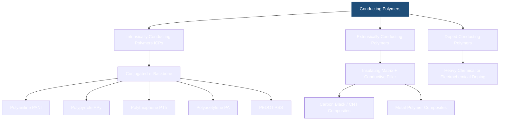
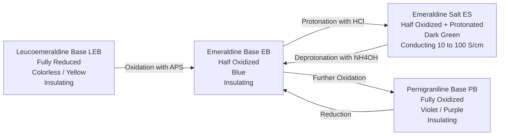
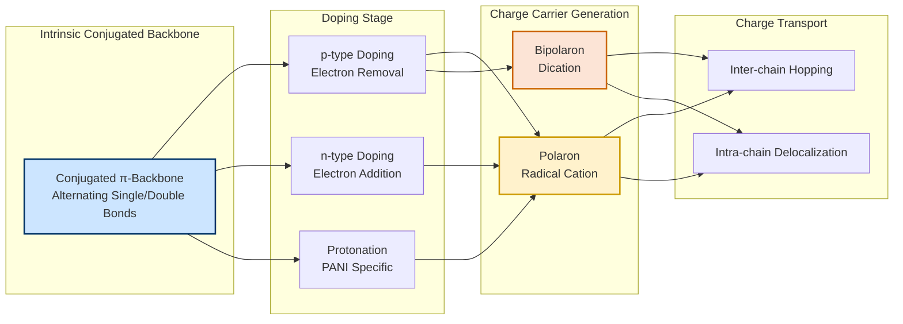

# Conducting Polymers-Classification- Polyaniline & Polypyrrole (synthesis, properties and applications)

<!-- SECTION_1_START -->
# Conducting Polymers — Classification, Polyaniline & Polypyrrole

## 1.1 Core Technical Definition (KTU 2024 Syllabus Terminology)

> [!IMPORTANT]
> **Conducting Polymers (CPs)** are a distinctive class of **organic polymeric materials** that possess an extended **π-conjugated backbone**, allowing them to conduct electricity through the movement of charge carriers (polarons, bipolarons, solitons) along the polymer chain — a property that is normally associated exclusively with metals or inorganic semiconductors.

The electrical conductivity of these polymers is a direct consequence of **doping**, a process by which the electronic structure of the polymer is deliberately modified by oxidation (p-doping), reduction (n-doping), or protonation, creating mobile charge carriers in the conjugated π-system.

> [!NOTE]
> The 2000 Nobel Prize in Chemistry was awarded to **Alan J. Heeger**, **Alan G. MacDiarmid**, and **Hideki Shirakawa** for the discovery and development of **conducting polymers**, a milestone that established this field as a cornerstone of modern materials chemistry.

| Fundamental Parameter | Value / Convention |
| :--- | :--- |
| Conduction Range | $10^{-10} \; \text{S/cm}$ to $10^{5} \; \text{S/cm}$ |
| Band Gap ($E_g$) | $1 \; \text{eV}$ to $4 \; \text{eV}$ |
| Carrier Type | Polarons, Bipolarons, Solitons |
| Doping Efficiency | 1 dopant per ~3–4 monomer units |

## 1.2 Intuitive Overview — The "Plastic Metal" Analogy

Imagine a **ladder (the polymer backbone)** whose rungs are made of alternating single and double bonds. A regular plastic (like polyethylene) is like a ladder whose rungs are **only single bonds** — electrons cannot "hop" sideways and are locked in. A conducting polymer, however, is a ladder with **alternating single (σ) and double (π) bonds** (conjugation), where π-electrons are mobile and behave like a "sea of electrons" (similar to the free electron cloud in copper wire). When we add a small amount of an "impurity" (a **dopant** like $\text{I}_2$ or $\text{ClO}_4^-$), electrons are either stripped or added to the ladder, creating a *carrying mechanism* — much like how n-type and p-type doping works in silicon semiconductors.

> [!TIP]
> **Memory Hook:** Think of Conducting Polymers as **"Flexible Metals"** — they combine the **processability of plastics** with the **electrical conductivity of metals**.

## 1.3 Classification of Conducting Polymers

Conducting polymers are broadly classified into the following major families:

> [!NOTE]
> **KTU 2024 Module 2 Focus:** The syllabus places specific emphasis on **(i) Polyaniline (PANI)** and **(ii) Polypyrrole (PPy)** — both belonging to the *Intrinsically Conducting Polymer (ICP)* family.

**A. By Structural Origin**

1. **Intrinsically Conducting Polymers (ICPs):** Conductivity is inherent to the polymer's conjugated backbone. Examples: Polyacetylene, Polyaniline, Polypyrrole, Polythiophene, PEDOT:PSS.
2. **Extrinsically Conducting Polymers:** Insulating polymer matrices loaded with conductive fillers (carbon black, metal powders, carbon nanotubes).
3. **Doped Conducting Polymers:** Insulating polymers rendered conductive through heavy chemical doping.

**B. By Charge Carrier Type**

1. **π-Conjugated (Organic) Conducting Polymers** — e.g., Polyaniline, Polypyrrole, Polythiophene.
2. **Co-ordination / Metal-Containing Polymers** — e.g., Polyphthalocyanines.
3. **Charge-Transfer Polymers** — e.g., Polymer-acceptor/donor complexes.

## 1.4 Polyaniline (PANI) — The "Versatile Emeraldine"

> [!IMPORTANT]
> **Polyaniline (PANI)** is a conducting polymer obtained by the oxidative polymerization of **aniline ($\text{C}_6\text{H}_5\text{NH}_2$)**. It is one of the most studied conducting polymers due to its **ease of synthesis, environmental stability, and tunable conductivity** through acid-base (doping-dedoping) chemistry.

**Repeat Unit:** $(-\text{C}_6\text{H}_4-\text{NH}-\text{C}_6\text{H}_4-\text{NH}-)_n$

PANI exists in **three well-defined oxidation states**:

| Oxidation State | Formula Description | Color | Conductivity |
| :--- | :--- | :--- | :--- |
| **Leucoemeraldine (LEB)** | Fully reduced — all aromatic | Colorless / Pale Yellow | Insulating |
| **Emeraldine Base (EB)** | Half oxidized | Blue | Insulating (intrinsic) |
| **Pernigraniline (PB)** | Fully oxidized | Violet / Dark Purple | Insulating |
| **Emeraldine Salt (ES)** | EB protonated with acid | **Green** | **Conducting ($\sim 10^{0}$–$10^{2}$ S/cm)** |

> [!TIP]
> **The Emeraldine Salt (ES)** is the **only conducting form** of polyaniline. It is produced by protonating the imine nitrogens of Emeraldine Base (EB) with an acid such as **HCl** — *without changing the oxidation state* of the polymer. This is the famous "**doping by protonation**" unique to PANI.

## 1.5 Polypyrrole (PPy) — The "Biocompatible Workhorse"

> [!IMPORTANT]
> **Polypyrrole (PPy)** is a conducting polymer synthesized by the chemical or electrochemical oxidation of **pyrrole ($\text{C}_4\text{H}_4\text{NH}$)**. It is characterized by a **5-membered heterocyclic ring** with nitrogen, and is widely recognized for its **high conductivity, biocompatibility, and ease of electrodeposition**.

**Repeat Unit:** $(-\text{C}_4\text{H}_2\text{N}-)_n$

PPy is most commonly synthesized in its **oxidized (doped) state**, where the dopant anion (e.g., $\text{ClO}_4^-$, $\text{Cl}^-$, $p$-toluenesulfonate) is incorporated directly into the polymer matrix to balance the positive charges on the backbone.

> [!VISUALIZATION CONTROL]
> **Concept:** Schematic of a Polypyrrole Chain with Charge Carriers
> **Geometric Input Equations (Conceptual Coordinate Mapping):**
> * Repeat unit backbone: $y = \sin(x)$ with alternating double bonds
> * Dopant anions: discrete points $(2n, -1)$ balancing polaronic defects at $(2n, 1)$
> **Visual Description:** The student should visualize a sinusoidal π-conjugated polymer chain with positive charge defects (polarons) periodically compensated by immobile anions sitting adjacent to the chain, forming a polaron–anion coupled pair.

<!-- SECTION_1_END -->

<!-- SECTION_2_START -->
# Deep Theoretical Analysis & KTU High-Yield Formula Sheet

## 2.1 The Origin of Conductivity — Conjugation and Doping

> [!NOTE]
> **Conjugation** is the **fundamental prerequisite** for intrinsic conductivity in organic polymers. It refers to the **alternation of single and double (or triple) bonds** along the polymer backbone, creating a delocalized π-electron system that spans the entire chain.

In a fully conjugated polymer, the energy levels of the π-orbitals broaden into **π-bonding (Valence Band, VB)** and **π*-antibonding (Conduction Band, CB)** bands, analogous to inorganic semiconductors. The **band gap ($E_g$)** between the Highest Occupied Molecular Orbital (HOMO) and the Lowest Unoccupied Molecular Orbital (LUMO) determines the intrinsic conductivity.

### The Doping Process (Polarons & Bipolarons)

Doping in conducting polymers is fundamentally different from inorganic semiconductors:

1. **p-type Doping (Oxidative):** Electrons are *removed* from the π-system using oxidants ($\text{I}_2$, $\text{FeCl}_3$, $\text{ClO}_4^-$) or by electrochemical oxidation. This generates a **radical cation (polaron)** on the chain.
2. **n-type Doping (Reductive):** Electrons are *added* to the π-system using reducing agents (alkali metals, naphthalenide). This generates a **radical anion (polaron)**.

> [!IMPORTANT]
> A **Polaron** is a charge carrier + the lattice distortion it creates. A **Bipolaron** is two like charges (without unpaired spins) coupled with a strong lattice distortion — this is the **principal charge carrier in highly doped conducting polymers** like PPy and PANI-ES.

## 2.2 Mechanism of Conduction — Polarons and Bipolarons in PANI & PPy

| Charge Carrier | Description | Energy Level | Stability |
| :--- | :--- | :--- | :--- |
| **Polaron** (Radical cation) | One electron removed; localized lattice distortion | In-gap state | Intermediate |
| **Bipolaron** (Dication) | Two electrons removed; doubly charged defect | In-gap state (deeper) | Higher in heavily doped polymers |

**Mathematical Form of Polaron Wavefunction (Conceptual):**
The polaronic distortion extends over approximately 4–5 monomer units:

$$\xi_{\text{polaron}} \approx 4a \quad \text{where} \quad a = \text{monomer length} \approx 0.25 \; \text{nm}$$

> [!TIP]
> **Why the band gap matters:** Conductivity $\sigma \propto e^{-E_g / 2k_BT}$. A lower $E_g$ (achieved through effective conjugation and doping) exponentially increases conductivity.

## 2.3 Synthesis of Polyaniline (PANI)

### Method 1: Chemical Oxidative Polymerization (Most Common)

> [!IMPORTANT]
> This is the **standard industrial and laboratory route** for PANI synthesis, using **ammonium persulfate ($\text{(NH}_4)_2\text{S}_2\text{O}_8$)** as the oxidant in an **acidic medium (typically $\text{HCl}$ or $\text{H}_2\text{SO}_4$)** at temperatures between **$0 \, ^\circ\text{C}$ to $5 \, ^\circ\text{C}$**.

**Overall Reaction:**

$$n \text{C}_6\text{H}_5\text{NH}_2 + (2.5n) \, (\text{NH}_4)_2\text{S}_2\text{O}_8 \xrightarrow{\text{HCl}, \, 0-5 \, ^\circ\text{C}} \text{[(-C}_6\text{H}_4\text{-NH-C}_6\text{H}_4\text{-NH-)}_n\text{]} + \text{by-products}$$

**Step-wise Mechanism:**

1. **Oxidation of aniline to anilinium radical cation:** The persulfate ion $(\text{S}_2\text{O}_8^{2-})$ accepts an electron, generating the aniline radical cation.
2. **Dimerization:** Two radical cations couple head-to-tail to form **p-aminodiphenylamine (a dimer)**.
3. **Chain propagation:** The dimer is further oxidized, and additional aniline monomers couple, extending the chain in a *para*-coupled fashion.
4. **Chain termination & precipitation:** Upon reaching sufficient molecular weight, the polymer precipitates as a dark green powder (emeraldine salt).

> [!WARNING]
> **Temperature control is critical:** Synthesis above $5 \, ^\circ\text{C}$ leads to **over-oxidation, hydrolysis, and degradation** of the polymer backbone, drastically reducing conductivity and yield.

### Method 2: Electrochemical Polymerization
Aniline is oxidized at a **platinum, ITO (Indium Tin Oxide), or carbon electrode** in an acidic electrolyte at a potential of approximately **$+0.7 \; \text{V}$ to $+1.0 \; \text{V}$ vs. Ag/AgCl**. The PANI film deposits directly on the electrode surface.

### Method 3: Enzymatic / "Green" Synthesis
Peroxidase enzymes (e.g., **horseradish peroxidase, HRP**) in the presence of $\text{H}_2\text{O}_2$ are used to polymerize aniline in aqueous media, offering an eco-friendly route.

## 2.4 Synthesis of Polypyrrole (PPy)

### Method 1: Chemical Oxidative Polymerization

> [!IMPORTANT]
> Pyrrole is polymerized in aqueous or non-aqueous media using oxidants such as **anhydrous $\text{FeCl}_3$**, **$\text{(NH}_4)_2\text{S}_2\text{O}_8$**, or **$\text{K}_2\text{Cr}_2\text{O}_7$**, with the dopant anion (e.g., $\text{Cl}^-$ from $\text{FeCl}_3$, $p$-TS from $p$-toluenesulfonic acid) being incorporated into the polymer.

**Overall Reaction:**

$$n \, \text{C}_4\text{H}_4\text{NH} + (2.5n) \, \text{FeCl}_3 \rightarrow \text{[(-C}_4\text{H}_2\text{N}^+\text{-)}_n\text{]} \, (\text{Cl}^-)_n + (2.5n) \, \text{FeCl}_2 + n \, \text{HCl}$$

The **molar ratio of oxidant to monomer** is a critical parameter:
- Optimal ratio: **$\text{FeCl}_3 : \text{Pyrrole} \approx 2.3 : 1$ to $2.5 : 1$**
- Higher ratios cause over-oxidation and chain scission.

### Method 2: Electrochemical Polymerization
Pyrrole is oxidized at a working electrode (Pt, Au, ITO, stainless steel) at **$+0.6 \; \text{V}$ to $+0.8 \; \text{V}$ vs. Ag/AgCl** in an aqueous electrolyte containing the dopant salt (e.g., $\text{NaClO}_4$, $\text{KCl}$, $\text{LiClO}_4$). A **black, adherent PPy film** is deposited on the electrode.

## 2.5 Properties of Polyaniline

| Property | Observed Value / Behavior |
| :--- | :--- |
| **Electrical Conductivity** | $10^{-10}$ S/cm (LEB, PB) to $\sim 10^{2}$ S/cm (ES) |
| **Morphology** | Granular, nanofibrous, nanotubular (depending on synthesis) |
| **Thermal Stability** | Stable up to $\sim 250 \, ^\circ\text{C}$ in air |
| **Solubility** | EB soluble in NMP, DMSO; ES soluble in aqueous acids |
| **Optical Absorption** | Strong absorption at $320 \; \text{nm}$ (π-π*) and $630 \; \text{nm}$ (n-π*) in EB; $420 \; \text{nm}$ and $800 \; \text{nm}$ in ES |
| **Electrochromism** | Reversible color change: Yellow $\leftrightarrow$ Green $\leftrightarrow$ Blue $\leftrightarrow$ Violet with applied potential |
| **Doping Mechanism** | **Protonation (non-redox)** — unique among CPs |
| **Environmental Stability** | Excellent — stable in air for years |

## 2.6 Properties of Polypyrrole

| Property | Observed Value / Behavior |
| :--- | :--- |
| **Electrical Conductivity** | $10^{-3}$ to $10^{2}$ S/cm (depending on dopant and synthesis) |
| **Morphology** | Globular, nodular film; tunable to nanowires/nanotubes |
| **Thermal Stability** | Stable up to $\sim 200 \, ^\circ\text{C}$ in air |
| **Solubility** | **Poorly soluble** in common solvents (a key limitation) |
| **Optical Absorption** | Broad absorption in visible range; black appearance when doped |
| **Biocompatibility** | Excellent — supports cell adhesion and proliferation |
| **Density** | $\sim 1.5 \; \text{g/cm}^3$ |
| **Density of Charge Carriers** | $10^{21}$ to $10^{23}$ carriers per $\text{cm}^3$ |

## 2.7 KTU High-Yield Formula Sheet

| Concept | Formula / Expression | Units | Remarks |
| :--- | :--- | :--- | :--- |
| Conductivity | $\sigma = n e \mu$ | S/cm | $n$: carrier density, $\mu$: mobility |
| Conductivity (Arrhenius) | $\sigma(T) = \sigma_0 \, e^{-E_g / 2k_B T}$ | S/cm | $E_g$: band gap, $k_B$: Boltzmann constant |
| Doping Efficiency | $\eta = \dfrac{\text{dopant molecules}}{\text{monomer units}}$ | dimensionless | Typical: $0.25$ to $0.33$ |
| Aniline Mass for $n$ moles | $m = n \times 93.13$ | grams | MW of aniline = $93.13 \; \text{g/mol}$ |
| Pyrrole Mass for $n$ moles | $m = n \times 67.09$ | grams | MW of pyrrole = $67.09 \; \text{g/mol}$ |
| Average MW of PANI Repeat Unit | $\text{MW} = 90 \; \text{g/mol}$ | g/mol | $\text{C}_6\text{H}_4\text{NH}$ |
| Average MW of PPy Repeat Unit | $\text{MW} = 65 \; \text{g/mol}$ | g/mol | $\text{C}_4\text{H}_2\text{N}$ |
| Polaron Extension | $\xi \approx 4a$ | nm | $a \approx 0.25 \; \text{nm}$ for PANI |
| Oxidant:Aniline Molar Ratio | $\dfrac{(\text{NH}_4)_2\text{S}_2\text{O}_8}{\text{Aniline}} = 1.25$ | mol/mol | Optimal stoichiometric ratio |
| Oxidant:Pyrrole Molar Ratio | $\dfrac{\text{FeCl}_3}{\text{Pyrrole}} = 2.3 - 2.5$ | mol/mol | Empirical optimum |

> [!TIP]
> **Memory Aid for Conductivity Trend:** $\text{LEB} < \text{EB} \approx \text{PB} \ll \text{ES (PANI)}$. Only Emeraldine Salt is conducting.

## 2.8 Engineering Utility of PANI and PPy in Computer & Electrical Sciences

> [!NOTE]
> The unique combination of **electrical conductivity + mechanical flexibility + chemical stability** makes PANI and PPy indispensable in modern electronic and biomedical engineering applications.

- **Printed Electronics:** PANI is used in flexible circuits, RFID antennas, and roll-to-roll printed sensors.
- **Anti-static and EMI Shielding:** PPy coatings on aircraft and computer housings block electromagnetic interference.
- **Supercapacitors:** Both PANI and PPy serve as pseudocapacitive electrode materials with specific capacitances of $400$ to $1000 \; \text{F/g}$.
- **Corrosion Protection:** PANI is used as a primer coating on steel and aluminum, replacing chromate-based toxic coatings.
- **Neural Probes & Biosensors:** PPy's biocompatibility makes it ideal for neural electrodes, glucose sensors, and DNA detection.
- **Electroluminescent Devices and OLEDs:** PANI's transparent conducting form (doped with CSA — camphorsulfonic acid) functions as a flexible ITO replacement.
- **Rechargeable Batteries:** PPy serves as a cathode active material in lithium and magnesium batteries.
- **Solar Cells:** PANI and PPy are used as **hole-transport layers (HTLs)** and **counter electrodes** in dye-sensitized solar cells (DSSCs) and perovskite solar cells.

<!-- SECTION_2_END -->

<!-- SECTION_3_START -->
# Step-by-Step Derivations, Calculations & Synthetic Procedures

## 3.1 Step-by-Step Synthesis of Polyaniline (PANI) — Chemical Route

> [!IMPORTANT]
> **Objective:** Synthesize $5 \; \text{g}$ of Emeraldine Salt (ES) of PANI using ammonium persulfate as oxidant in $\text{HCl}$ medium at $0 - 5 \, ^\circ\text{C}$.

### Step 1: Determine Moles of Target PANI
Assume target molecular weight of polymer $M_n \approx 50{,}000 \; \text{g/mol}$ (typical):

$$n_{\text{polymer}} = \frac{5 \; \text{g}}{50{,}000 \; \text{g/mol}} = 1 \times 10^{-4} \; \text{mol}$$

Repeat unit mass (emeraldine salt, $\text{C}_{12}\text{H}_{10}\text{N}_2$):

$$M_{\text{repeat}} = 12(12) + 10(1) + 2(14) + 1(1)_{\text{HCl}} = 182.5 \; \text{g/mol (approx.)}$$

For practical lab scale, we use the **monomer-based stoichiometry**.

### Step 2: Calculate Moles of Aniline
Using aniline (MW = $93.13 \; \text{g/mol}$):

$$n_{\text{aniline}} = \frac{m}{M} = \frac{5.0 \; \text{g (target polymer basis)} \times \text{yield factor}}{93.13 \; \text{g/mol}}$$

For a target of $\sim 5 \; \text{g}$ PANI with a typical yield of $\sim 80\%$:

$$m_{\text{aniline}} = \frac{5.0 \; \text{g}}{0.80} \approx 6.25 \; \text{g} \implies n_{\text{aniline}} = \frac{6.25}{93.13} = 0.0671 \; \text{mol}$$

### Step 3: Calculate Moles of Ammonium Persulfate (APS)
Optimal molar ratio: $\dfrac{\text{APS}}{\text{Aniline}} = 1.25$:

$$n_{\text{APS}} = 1.25 \times 0.0671 = 0.0839 \; \text{mol}$$

Mass of APS (MW = $228.18 \; \text{g/mol}$):

$$m_{\text{APS}} = 0.0839 \times 228.18 = 19.15 \; \text{g}$$

### Step 4: Volume of $\text{HCl}$
Use $1 \; \text{M HCl}$ in a 1:1 volume ratio with aniline solution:

$$V_{\text{HCl}} = 100 \; \text{mL} \; (\text{typical for } 6.25 \; \text{g aniline})$$

### Step 5: Procedure

1. Dissolve $6.25 \; \text{g}$ aniline in $100 \; \text{mL}$ of $1 \; \text{M HCl}$ in a $500 \; \text{mL}$ beaker. Cool to $0 - 5 \, ^\circ\text{C}$ using an **ice bath**.
2. Dissolve $19.15 \; \text{g}$ APS in $100 \; \text{mL}$ of $1 \; \text{M HCl}$ separately. Cool to $0 - 5 \, ^\circ\text{C}$.
3. **Slowly add** the APS solution to the aniline solution dropwise over $30 - 45$ minutes with **constant stirring** at $0 - 5 \, ^\circ\text{C}$.
4. Allow the reaction to proceed for **$4 - 6$ hours** at $0 - 5 \, ^\circ\text{C}$.
5. **Filter** the dark green precipitate using a Buchner funnel.
6. **Wash** the precipitate sequentially with $1 \; \text{M HCl}$ (3 × $50 \; \text{mL}$), deionized water (2 × $50 \; \text{mL}$), and acetone (1 × $50 \; \text{mL}$).
7. **Dry** the powder in a vacuum oven at $60 \, ^\circ\text{C}$ for $24$ hours.
8. **Yield:** $\sim 5 \; \text{g}$ of dark green emeraldine salt powder.

> [!TIP]
> **Validation by UV-Vis Spectroscopy:** Dissolve a small amount in NMP — the EB form should show peaks at $\sim 320 \; \text{nm}$ and $\sim 630 \; \text{nm}$. The ES form in acidic aqueous solution should show peaks at $\sim 420 \; \text{nm}$ and $\sim 800 \; \text{nm}$ with a free-carrier tail extending into the NIR.

## 3.2 Step-by-Step Synthesis of Polypyrrole (PPy) — Chemical Route

> [!IMPORTANT]
> **Objective:** Synthesize $2 \; \text{g}$ of polypyrrole (PPy) doped with chloride using $\text{FeCl}_3$ as oxidant in aqueous medium.

### Step 1: Moles of Pyrrole Monomer
Pyrrole (MW = $67.09 \; \text{g/mol}$):

$$n_{\text{pyrrole}} = \frac{2.0 \; \text{g (target basis)} \times 1.2 \text{ (yield factor)}}{67.09 \; \text{g/mol}} \approx 0.0358 \; \text{mol}$$

$$m_{\text{pyrrole}} = 0.0358 \times 67.09 = 2.40 \; \text{g}$$

### Step 2: Moles of $\text{FeCl}_3$
Optimal ratio: $\text{FeCl}_3 : \text{Pyrrole} = 2.4 : 1$:

$$n_{\text{FeCl}_3} = 2.4 \times 0.0358 = 0.0859 \; \text{mol}$$

Mass of $\text{FeCl}_3$ (anhydrous, MW = $162.20 \; \text{g/mol}$):

$$m_{\text{FeCl}_3} = 0.0859 \times 162.20 = 13.93 \; \text{g}$$

### Step 3: Procedure

1. Dissolve $2.40 \; \text{g}$ pyrrole in $200 \; \text{mL}$ deionized water in a $500 \; \text{mL}$ round-bottom flask. Stir continuously.
2. Dissolve $13.93 \; \text{g}$ $\text{FeCl}_3$ in $100 \; \text{mL}$ deionized water separately.
3. Cool both solutions to $0 - 5 \, ^\circ\text{C}$ using an **ice bath**.
4. Add the $\text{FeCl}_3$ solution **dropwise** to the pyrrole solution over $30$ minutes with vigorous stirring.
5. The solution turns **black** within minutes as PPy forms. Continue stirring for **$4 - 6$ hours** at $0 - 5 \, ^\circ\text{C}$.
6. **Filter** the black precipitate using a Buchner funnel.
7. **Wash** thoroughly with deionized water (5 × $50 \; \text{mL}$) until the filtrate is colorless, then with acetone (1 × $50 \; \text{mL}$).
8. **Dry** in a vacuum oven at $50 \, ^\circ\text{C}$ for $24$ hours.
9. **Yield:** $\sim 2 \; \text{g}$ of black polypyrrole powder (PPy-Cl).

> [!WARNING]
> **Pyrrole purity is critical:** Pyrrole readily oxidizes in air (turns brown). Use **freshly distilled pyrrole** stored under nitrogen. The brown oxidized form yields inferior polymer with low conductivity.

## 3.3 Worked Numerical Problem — Conductivity Calculation

> [!NOTE]
> A polyaniline sample has a measured conductivity of $\sigma = 5 \; \text{S/cm}$ at $T = 300 \; \text{K}$. If the band gap is $E_g = 1.5 \; \text{eV}$, calculate the conductivity at $T = 350 \; \text{K}$ using the Arrhenius-type conductivity expression.

**Given:**
- $\sigma_1 = 5 \; \text{S/cm}$ at $T_1 = 300 \; \text{K}$
- $E_g = 1.5 \; \text{eV}$
- $T_2 = 350 \; \text{K}$

**Arrhenius Equation:**

$$\sigma(T) = \sigma_0 \, e^{-E_g / 2 k_B T}$$

Taking the ratio at two temperatures:

$$\frac{\sigma_2}{\sigma_1} = \frac{e^{-E_g / 2 k_B T_2}}{e^{-E_g / 2 k_B T_1}} = e^{\frac{E_g}{2 k_B} \left( \frac{1}{T_1} - \frac{1}{T_2} \right)}$$

**Step 1: Compute $E_g / 2 k_B$ in K:**

$$\frac{E_g}{2 k_B} = \frac{1.5 \; \text{eV}}{2 \times 8.617 \times 10^{-5} \; \text{eV/K}} = \frac{1.5}{1.7234 \times 10^{-4}} \approx 8703 \; \text{K}$$

**Step 2: Compute $\left( \frac{1}{T_1} - \frac{1}{T_2} \right)$:**

$$\frac{1}{300} - \frac{1}{350} = 0.003333 - 0.002857 = 4.762 \times 10^{-4} \; \text{K}^{-1}$$

**Step 3: Exponent:**

$$\frac{E_g}{2 k_B} \times \left( \frac{1}{T_1} - \frac{1}{T_2} \right) = 8703 \times 4.762 \times 10^{-4} = 4.144$$

**Step 4: Compute the ratio:**

$$\frac{\sigma_2}{\sigma_1} = e^{4.144} \approx 63.16$$

**Step 5: Final conductivity:**

$$\sigma_2 = 5 \; \text{S/cm} \times 63.16 \approx 315.8 \; \text{S/cm}$$

> [!TIP]
> **Physical Interpretation:** Conductivity increases by **$\sim 63$-fold** when temperature rises from $300 \; \text{K}$ to $350 \; \text{K}$, confirming the **semiconducting (thermally activated) nature** of polyaniline's conduction mechanism.

## 3.4 Worked Numerical Problem — Stoichiometry for Doping

> [!NOTE]
> A polypyrrole sample contains $1$ chloride ion for every $3$ pyrrole rings. Calculate the doping efficiency $\eta$ and the theoretical maximum conductivity (using a simple Drude-like model with $\mu = 0.1 \; \text{cm}^2/\text{Vs}$).

**Given:**
- $1 \; \text{Cl}^-$ per $3$ pyrrole units $\implies \eta = 1/3 = 0.333$
- Mobility $\mu = 0.1 \; \text{cm}^2/\text{Vs}$

**Carrier density (assuming one charge carrier per dopant):**
With $\eta = 0.333$ and one dopant per carrier, the carrier density per monomer unit is $0.333$ carriers per unit. Using approximate monomer unit volume $V_{\text{unit}} \approx a^3 \approx (0.25 \; \text{nm})^3 = 1.56 \times 10^{-23} \; \text{cm}^3$:

$$n = \frac{\eta}{V_{\text{unit}}} = \frac{0.333}{1.56 \times 10^{-23}} \approx 2.13 \times 10^{22} \; \text{carriers/cm}^3$$

**Conductivity:**

$$\sigma = n e \mu = (2.13 \times 10^{22}) \times (1.6 \times 10^{-19}) \times (0.1)$$

$$\sigma = 2.13 \times 10^{22} \times 1.6 \times 10^{-20} = 340.8 \; \text{S/cm}$$

This falls within the experimental range of $\sim 10^{2}$ S/cm for PPy, validating the model.

## 3.5 Step-by-Step Doping-Dedoping (Protonation) of PANI

The unique non-redox doping of PANI can be demonstrated as follows:

**Starting material:** Emeraldine Base (EB) — blue, insulating.

**Reaction with $\text{HCl}$:**

$$\text{EB} + 2 \text{HCl} \rightarrow \text{ES} \cdot 2\text{Cl}^-$$

**Visual Change:** Blue $\rightarrow$ **Dark Green** (Emeraldine Salt).

**Reverse Reaction (Dedoping) with $\text{NH}_4\text{OH}$:**

$$\text{ES} \cdot 2\text{Cl}^- + 2 \text{NH}_4\text{OH} \rightarrow \text{EB} + 2 \text{NH}_4\text{Cl} + 2 \text{H}_2\text{O}$$

**Visual Change:** Dark Green $\rightarrow$ Blue (recovered EB).

> [!IMPORTANT]
> This **reversible protonation-deprotonation** is the basis for PANI's use in **chemical sensors, pH sensors, and electrochromic devices**.

## 3.6 Python Code — Conductivity vs Temperature Plot for PANI

```python
import numpy as np
import matplotlib.pyplot as plt

# Constants
k_B = 8.617e-5  # eV/K
E_g = 1.5       # Band gap in eV
sigma_0 = 5e4   # Pre-exponential factor (S/cm)

# Temperature range
T = np.linspace(200, 400, 500)  # in Kelvin

# Arrhenius-type conductivity
sigma = sigma_0 * np.exp(-E_g / (2 * k_B * T))

# Plot
plt.figure(figsize=(8, 5))
plt.semilogy(T, sigma, color="darkgreen", linewidth=2, label="PANI (E_g = 1.5 eV)")
plt.xlabel("Temperature (K)", fontsize=12)
plt.ylabel("Conductivity (S/cm)", fontsize=12)
plt.title("Conductivity vs Temperature for Polyaniline (Semilog Plot)", fontsize=13)
plt.grid(True, which="both", linestyle="--", alpha=0.6)
plt.legend(fontsize=11)
plt.tight_layout()
plt.savefig("pani_conductivity.png", dpi=150)
plt.show()
```

**Code Explanation:**
- The `np.linspace` function creates a temperature array from $200 \; \text{K}$ to $400 \; \text{K}$.
- The conductivity is computed using the Arrhenius equation.
- A **semilog plot** is used because conductivity spans several orders of magnitude.
- The plot shows a characteristic **exponential rise** of conductivity with temperature — a hallmark of semiconducting behavior.

<!-- SECTION_3_END -->

<!-- SECTION_4_START -->
# Structural Diagrams & Schematics

## 4.1 Classification Flowchart of Conducting Polymers



> [!NOTE]
> **Visualization Tip:** The flowchart emphasizes that PANI and PPy are both **Intrinsically Conducting Polymers (ICPs)** — the *sub-class* most relevant to KTU Module 2.

## 4.2 Polyaniline — Oxidation State Block Architecture



> [!TIP]
> **Memory Aid:** The order of PANI states from *most reduced* to *most oxidized* is: **L**ecoemeraldine $\rightarrow$ **E**meraldine $\rightarrow$ **P**ernigraniline — "**LEP**".

## 4.3 Polypyrrole — Polymerization Topology Matrix

| Process Stage | Input | Chemical Change | Output State | Process Condition |
| :--- | :--- | :--- | :--- | :--- |
| **1. Initiation** | Pyrrole + Oxidant ($\text{FeCl}_3$) | One-electron oxidation | Pyrrole radical cation | $0 - 5 \, ^\circ\text{C}$, $\text{N}_2$ atmosphere |
| **2. Dimerization** | $2 \times$ Radical cations | Coupling + deprotonation | Bipyrrole (dimer) | Acidic / neutral aqueous |
| **3. Chain Propagation** | Dimer + Pyrrole | Sequential oxidation + coupling | Oligomer | Continuous oxidant addition |
| **4. Doping (in situ)** | Oligomer + Dopant | Charge-transfer complexation | Doped PPy with $\text{Cl}^-$ incorporated | Automatic during synthesis |
| **5. Termination** | Reactive chain ends | Chain-end saturation / disproportionation | Final PPy precipitate | Wash with water + acetone |
| **6. Drying** | Filter cake | Solvent removal | Black PPy powder | Vacuum oven, $50 \, ^\circ\text{C}$, $24$ h |

## 4.4 Charge Transport Mechanism Block Diagram



## 4.5 Application Map — PANI and PPy in Engineering Systems

```mermaid
flowchart TD
    APP[Applications of PANI and PPy]:::root

    APP --> ELEC[Electronics]
    ELEC --> ELEC1[Flexible Displays and OLEDs]
    ELEC --> ELEC2[Supercapacitor Electrodes]
    ELEC --> ELEC3[EMI Shielding]

    APP --> ENERGY[Energy]
    ENERGY --> ENERGY1[Rechargeable Batteries]
    ENERGY --> ENERGY2[Dye-Sensitized Solar Cells]
    ENERGY --> ENERGY3[Fuel Cell Catalysts]

    APP --> BIO[Biomedical]
    BIO --> BIO1[Neural Probes PPy]
    BIO --> BIO2[Drug Delivery Systems]
    BIO --> BIO3[Biosensors Glucose, DNA]

    APP --> PROT[Protection]
    PROT --> PROT1[Anti-corrosion Coatings PANI]
    PROT --> PROT2[Anti-static Packaging]

    APP --> SENS[Sensors]
    SENS --> SENS1[Chemical / Gas Sensors]
    SENS --> SENS2[pH Sensors PANI]
    SENS --> SENS3[Strain and Pressure Sensors]

    classDef root fill:#1f4e79,stroke:#1f4e79,color:#ffffff,stroke-width:2px
```



## 4.6 Comparison Matrix — PANI vs PPy

| Feature | Polyaniline (PANI) | Polypyrrole (PPy) |
| :--- | :--- | :--- |
| **Monomer** | Aniline (aromatic amine) | Pyrrole (5-membered heterocycle) |
| **Repeat Unit Formula** | $(-\text{C}_6\text{H}_4-\text{NH}-)_n$ | $(-\text{C}_4\text{H}_2\text{N}-)_n$ |
| **Doping Mechanism** | Protonation (non-redox) | Oxidation + anion incorporation |
| **Conductivity Range (S/cm)** | $10^{-10}$ to $10^{2}$ | $10^{-3}$ to $10^{2}$ |
| **Color (Doped State)** | Dark Green (ES) | Black |
| **Solubility** | EB soluble in NMP, DMSO | Poorly soluble in most solvents |
| **Biocompatibility** | Moderate | Excellent |
| **Environmental Stability** | Excellent | Good (some aging issues) |
| **Key Advantage** | Tunable via simple acid-base chemistry | Easy electrodeposition as films |
| **Key Limitation** | Difficult melt processing | Insoluble and infusible |
| **Typical Application** | Corrosion protection, ESD shielding | Biosensors, neural electrodes |

<!-- SECTION_4_END -->

<!-- SECTION_5_START -->
# KTU 2024 Scheme Examination Question Bank & Topic Recap

## Part A — Short Answer Questions (3 Marks Each)

### Question 1: Define conducting polymers. Classify them with suitable examples. `[KTU University Exam – Dec 2023]`

**Model Answer (3 Marks):**

> **Conducting polymers** are organic polymeric materials with extended π-conjugation in their backbone that allows intrinsic electrical conductivity upon doping.

**Classification:**
1. **Intrinsically Conducting Polymers (ICPs):** PANI, PPy, Polythiophene, Polyacetylene.
2. **Extrinsically Conducting Polymers:** Polymer composites with carbon black, CNTs, or metal fillers.
3. **Doped Conducting Polymers:** Conventional polymers made conductive by heavy doping.

*[Definition: 1 Mark, Classification with examples: 2 Marks]*

### Question 2: What are polarons and bipolarons? Mention their role in conductivity. `[KTU University Exam – July 2024]`

**Model Answer (3 Marks):**

- **Polaron:** A radical cation (or anion) formed when an electron is removed (or added) from a conjugated polymer chain, coupled with a local lattice distortion. Carries **one charge + one unpaired spin**.
- **Bipolaron:** A doubly charged (spinless) defect formed by removal of two electrons, with stronger lattice distortion. **Two like charges, no unpaired spin.**
- **Role:** These are the **mobile charge carriers** responsible for electrical conduction in doped PANI and PPy. They hop between chain segments, enabling macroscopic current flow.

*[Polaron definition: 1 Mark, Bipolaron definition: 1 Mark, Role in conductivity: 1 Mark]*

---

## Part B — 14-Mark Questions (ESE Module Internal Choice)

### Question A (14 Marks): Synthesis, Properties, and Applications of Polyaniline `[KTU University Exam – Dec 2023]`

#### (a) Describe the chemical synthesis of polyaniline using ammonium persulfate as oxidant. Discuss the role of temperature and acid medium. (7 Marks) — *Cognitive Level: Understand / Apply*

**Model Solution:**

**Synthesis of Polyaniline (PANI-ES):**

1. **Reagents:** Aniline (monomer), Ammonium persulfate $\text{(NH}_4)_2\text{S}_2\text{O}_8$ (oxidant), $\text{HCl}$ (acid medium and dopant).
2. **Reaction Conditions:** Temperature $0 - 5 \, ^\circ\text{C}$, aqueous medium, $\text{N}_2$ atmosphere (optional but recommended).
3. **Molar Ratio:** $\text{APS} : \text{Aniline} = 1.25 : 1$.

**Overall Reaction:**

$$n \, \text{C}_6\text{H}_5\text{NH}_2 \xrightarrow[\text{HCl, } 0-5 \, ^\circ\text{C}]{(\text{NH}_4)_2\text{S}_2\text{O}_8} \text{[(-C}_6\text{H}_4\text{-NH-C}_6\text{H}_4\text{-NH-)}_n\text{]} \cdot n\text{HCl}$$

**Mechanism (Step-wise):**
- **Step 1:** Aniline is oxidized by APS to the aniline radical cation.
- **Step 2:** Two radical cations dimerize head-to-tail to form p-aminodiphenylamine.
- **Step 3:** The dimer is further oxidized and couples with another aniline radical cation — chain propagation.
- **Step 4:** Termination yields the emeraldine salt (ES), a dark green precipitate.

**Role of Temperature ($0 - 5 \, ^\circ\text{C}$):**
- Prevents over-oxidation and hydrolysis of the polymer backbone.
- Ensures *para*-coupling (regioregularity) and higher molecular weight.
- Higher temperatures ($> 25 \, ^\circ\text{C}$) lead to chain scission and lower conductivity.

**Role of Acid ($\text{HCl}$):**
- Provides the **protonation medium** for converting EB $\rightarrow$ ES (doping).
- Maintains the conducting emeraldine salt form.
- Acts as a counter-ion source for charge compensation.

*[Reaction equation: 2 Marks, Mechanism: 2 Marks, Role of temperature: 1.5 Marks, Role of acid: 1.5 Marks]*

#### (b) Explain the different oxidation states of polyaniline with a neat diagram. List any four applications. (7 Marks) — *Cognitive Level: Understand / Apply*

**Model Solution:**

**Oxidation States of PANI:**

| State | Repeat Unit | Color | Conductivity |
| :--- | :--- | :--- | :--- |
| Leucoemeraldine Base (LEB) | $(-\text{C}_6\text{H}_4-\text{NH}-)_n$ | Yellow | Insulating |
| Emeraldine Base (EB) | $(-\text{C}_6\text{H}_4-\text{NH}-\text{C}_6\text{H}_4-\text{N=})_n$ | Blue | Insulating |
| Pernigraniline Base (PB) | $(-\text{C}_6\text{H}_4-\text{N=})_n$ | Violet | Insulating |
| Emeraldine Salt (ES) | Protonated EB | **Dark Green** | **Conducting** |

**Conversion:** EB + $\text{HCl}$ $\rightarrow$ ES (Doping by Protonation)

**Applications of PANI (any 4):**
1. **Corrosion protection coatings** on steel and aluminum (replaces toxic chromates).
2. **Electrochromic devices** (smart windows, displays) — reversible color change.
3. **Chemical and gas sensors** — sensitive to $\text{NH}_3$, $\text{HCl}$, and other analytes.
4. **Supercapacitor electrodes** — pseudocapacitance up to $\sim 800 \; \text{F/g}$.
5. **Antistatic and EMI shielding** coatings.
6. **Rechargeable battery electrodes**.

*[Naming all 4 states with structures: 3 Marks, Conversion to ES: 1 Mark, Applications: 3 Marks]*

---

### Question B (14 Marks): Polypyrrole — Synthesis, Properties, and Applications `[KTU University Exam – July 2024]`

#### (a) Discuss the chemical and electrochemical methods of synthesis of polypyrrole. Compare the two methods. (7 Marks) — *Cognitive Level: Understand / Apply*

**Model Solution:**

**(i) Chemical Oxidative Polymerization:**

- **Reagents:** Pyrrole monomer, $\text{FeCl}_3$ or APS as oxidant.
- **Medium:** Aqueous or non-aqueous (acetonitrile) solution.
- **Reaction:**

$$n \, \text{C}_4\text{H}_4\text{NH} + 2.3n \, \text{FeCl}_3 \rightarrow \text{[(-C}_4\text{H}_2\text{N}^+\text{-)}_n\text{]} \cdot n\text{Cl}^- + 2.3n \, \text{FeCl}_2 + n\text{HCl}$$

- **Conditions:** $0 - 5 \, ^\circ\text{C}$, $\text{N}_2$ atmosphere, slow oxidant addition.
- **Product:** Black PPy powder, filtered, washed, and dried.

**(ii) Electrochemical Polymerization:**

- **Setup:** Three-electrode system (working: Pt/ITO/carbon, reference: Ag/AgCl, counter: Pt).
- **Electrolyte:** Pyrrole + supporting electrolyte salt ($\text{NaClO}_4$, $\text{KCl}$, $\text{LiClO}_4$) in aqueous solution.
- **Potential:** Constant potential of $+0.7 \; \text{V}$ vs. Ag/AgCl, or cyclic voltammetry between $0 \; \text{V}$ and $+1.0 \; \text{V}$.
- **Product:** Black, adherent PPy film deposited directly on the working electrode.

**Comparison Table:**

| Feature | Chemical Method | Electrochemical Method |
| :--- | :--- | :--- |
| **Form of Product** | Powder | Thin film on electrode |
| **Scalability** | Industrial scale (grams to kg) | Lab-scale (films only) |
| **Purity** | Requires extensive washing | High purity (no by-products in film) |
| **Dopant Control** | Limited (depends on oxidant) | Excellent (electrolyte choice) |
| **Film Thickness** | Not directly controllable | Controllable by charge passed |
| **Cost** | Lower | Higher (instrumentation) |

*[Chemical synthesis: 2 Marks, Electrochemical synthesis: 2 Marks, Comparison table: 3 Marks]*

#### (b) Explain the properties and applications of polypyrrole. Why is PPy preferred for biomedical applications? (7 Marks) — *Cognitive Level: Apply / Analyze*

**Model Solution:**

**Properties of Polypyrrole:**

1. **Electrical Conductivity:** $10^{-3}$ to $10^{2} \; \text{S/cm}$, tunable by dopant choice.
2. **Mechanical Properties:** Flexible thin films; brittle in bulk powder form.
3. **Thermal Stability:** Stable up to $\sim 200 \, ^\circ\text{C}$ in air; degrades above $250 \, ^\circ\text{C}$.
4. **Optical Properties:** Black appearance when doped; broad visible absorption.
5. **Chemical Stability:** Stable in air and aqueous media; sensitive to over-oxidation at high potentials.
6. **Processability:** Insoluble and infusible — a key limitation; usually processed as films via electrochemical deposition.

**Applications:**

1. **Biosensors:** Glucose, dopamine, DNA, and cholesterol detection.
2. **Neural Probes and Tissue Engineering Scaffolds:** Used as electrode coatings for deep brain stimulation and peripheral nerve regeneration.
3. **Drug Delivery Systems:** Electrically controlled release of anionic drugs.
4. **Supercapacitors and Batteries:** Pseudocapacitive electrodes.
5. **Anti-corrosion Coatings:** Protective layers on active metals.
6. **EMI Shielding:** Lightweight, flexible shielding materials.

**Why PPy is preferred for biomedical applications:**

- **Excellent biocompatibility** — supports cell adhesion, proliferation, and differentiation.
- **Electrical conductivity** allows **electrical stimulation** of cells (e.g., neurons, cardiomyocytes, bone cells), promoting tissue regeneration.
- **Reversible redox switching** enables **controlled drug release**.
- **Easy electrodeposition** on complex 3D scaffolds and neural probe surfaces.
- **Tunable surface properties** via choice of dopant (e.g., hyaluronic acid, chondroitin sulfate for enhanced bioactivity).

*[Properties: 2.5 Marks, Applications: 2 Marks, Biocompatibility reasoning: 2.5 Marks]*

---

## KTU Examiner's Valuation Warning / Pitfall Callout

> [!WARNING]
> **Common Mark-Loss Pitfalls in PANI/PPy Questions:**
> 1. **Forgetting to specify the temperature range** ($0 - 5 \, ^\circ\text{C}$) in chemical synthesis — Examiner will deduct **1–1.5 marks**.
> 2. **Confusing EB and ES:** Students often write that *emeraldine base* is conducting. The **only conducting form is the Emeraldine Salt (ES)**, formed by protonation of EB with acid.
> 3. **Wrong oxidant:monomer ratio:** For PANI, the ratio is $1.25 : 1$ (APS:aniline); for PPy, the ratio is $2.3 - 2.5 : 1$ ($\text{FeCl}_3$:pyrrole). Mixing these up is a frequent error.
> 4. **Skipping the role of the acid medium** in PANI synthesis — Examiners expect a mention of the **protonation** mechanism.
> 5. **Not drawing repeat unit structures** of the PANI oxidation states — A clear structural diagram fetches **at least 2 marks**.
> 6. **Citing only metal-like applications** for PANI/PPy — KTU 2024 scheme values **biomedical, sensing, and energy storage** applications equally.

---

## Topic Recap & Important Things to Remember

> [!TIP]
> **Rapid-Revision Checklist — Conducting Polymers, PANI & PPy**

### Core Definitions
- **Conducting Polymer (CP):** Organic polymer with extended π-conjugation that conducts electricity upon doping.
- **Conjugation:** Alternating single and double bonds in the polymer backbone, creating delocalized π-electrons.
- **Doping:** Introduction of charge carriers by oxidation (p-doping), reduction (n-doping), or **protonation** (PANI-specific).
- **Polaron:** Radical cation (or anion) + lattice distortion; **Bipolaron:** Dication + stronger lattice distortion.

### Polyaniline (PANI) — Key Points
- Monomer: Aniline ($\text{C}_6\text{H}_5\text{NH}_2$).
- **4 Oxidation States:** Leucoemeraldine (LEB), Emeraldine Base (EB), Pernigraniline (PB), and Emeraldine Salt (ES) — *only ES is conducting*.
- **Unique feature:** Doping by **protonation** (no change in oxidation state).
- **Color Memory:** LEB (pale yellow) → EB (blue) → ES (dark green) → PB (violet).
- **Synthesis:** APS + Aniline + $\text{HCl}$ at $0 - 5 \, ^\circ\text{C}$ (molar ratio $1.25 : 1$).
- **Conductivity:** Up to $\sim 10^{2} \; \text{S/cm}$.
- **Key Applications:** Corrosion protection, electrochromic devices, sensors, supercapacitors, antistatic coatings.

### Polypyrrole (PPy) — Key Points
- Monomer: Pyrrole ($\text{C}_4\text{H}_4\text{NH}$), 5-membered N-heterocycle.
- **Synthesis:** $\text{FeCl}_3$ (or APS) in aqueous medium at $0 - 5 \, ^\circ\text{C}$ (molar ratio $\text{FeCl}_3$:pyrrole $= 2.3$–$2.5:1$); or electrochemically at $+0.7 \; \text{V}$ vs. Ag/AgCl.
- **Conductivity:** $10^{-3}$ to $10^{2} \; \text{S/cm}$, depending on dopant.
- **Property:** Black powder / film; poorly soluble; **excellent biocompatibility**.
- **Key Applications:** Neural probes, biosensors, drug delivery, supercapacitors, EMI shielding.

### Critical Formulas and Ratios
- **Conductivity (Arrhenius):** $\sigma(T) = \sigma_0 \, e^{-E_g / 2k_BT}$
- **Monomer MWs:** Aniline = $93.13 \; \text{g/mol}$, Pyrrole = $67.09 \; \text{g/mol}$
- **PANI oxidant ratio:** $\text{APS} : \text{Aniline} = 1.25 : 1$
- **PPy oxidant ratio:** $\text{FeCl}_3 : \text{Pyrrole} = 2.4 : 1$

### Engineering Relevance (KTU 2024)
- **Information Science:** Flexible displays, RFID, OLEDs, antistatic packaging.
- **Electrical Science:** Supercapacitors, EMI shielding, solar cells, sensors, battery electrodes.
- **Biomedical:** PPy in neural electrodes, PANI in tissue scaffolds, both in biosensors.

### Quick Mnemonics
- **PANI states order (reduced → oxidized):** **L**ecoemeraldine → **E**meraldine → **P**ernigraniline = "**LEP**"
- **Conductivity order:** Insulator $<$ EB $=$ PB $\ll$ ES (PANI) / Doped PPy
- **Synthesis Temperature Rule:** Always **$0 - 5 \, ^\circ\text{C}$** for both PANI and PPy chemical synthesis.

<!-- SECTION_5_END -->
