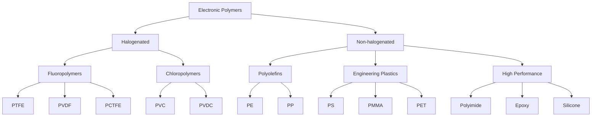
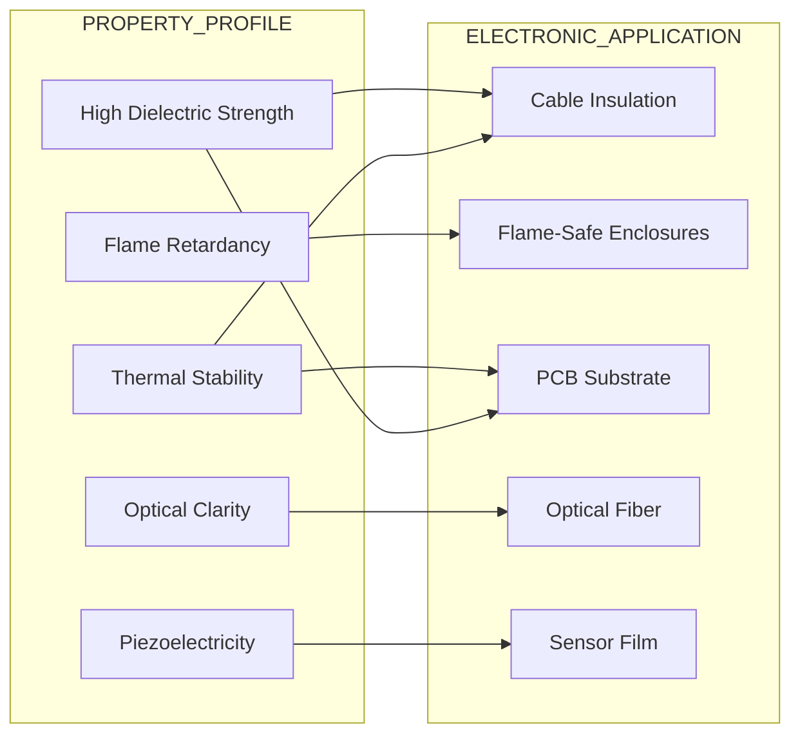
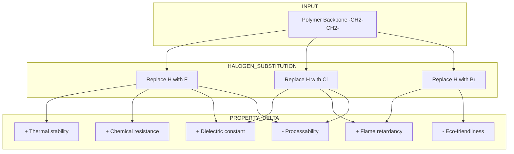
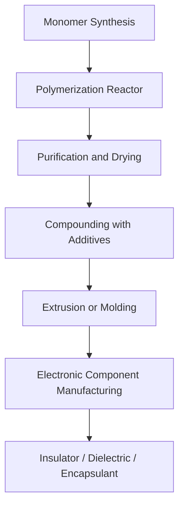

# Halogenated & Non-halogenated polymers (Examples only)

<!-- SECTION_1_START -->
# Halogenated & Non-halogenated Polymers (Examples)

## 1. Core Technical Definition

> [!IMPORTANT]
> **Polymer:** A polymer is a high molecular weight macromolecule composed of a large number of repeating structural units called *monomers*, joined together by covalent chemical bonds through a process called *polymerization*.

> [!NOTE]
> **Halogenated Polymer:** A halogenated polymer is a macromolecular substance whose repeating backbone (or pendant groups) contains one or more halogen atoms — **Fluorine (F), Chlorine (Cl), Bromine (Br), or Iodine (I)** — covalently bonded to the carbon skeleton. The presence of C–X bonds (where X = halogen) imparts enhanced thermal stability, chemical resistance, flame retardancy, and dielectric properties.

> [!NOTE]
> **Non-halogenated Polymer:** A non-halogenated polymer is a macromolecular substance whose repeating structural units are composed entirely of **carbon, hydrogen, oxygen, nitrogen, and/or silicon** atoms, with **no halogen atoms** in its chemical structure. These polymers generally offer superior processability, lower density, and environmentally benign disposal characteristics.

## 2. Conceptual Analogy / Intuition

Imagine a long **beaded necklace** where each bead represents a monomer unit. In a halogenated polymer, certain beads are replaced by **"halogen-tagged" beads** — like silver (F), green (Cl), or red (Br) charms that fundamentally alter the necklace's flexibility, strength, and resistance. In a non-halogenated polymer, the necklace contains only **plain beads of C, H, O, and N**, making it lighter and easier to recycle, but often less flame-resistant.

> [!TIP]
> **Intuitive Rule of Thumb:** Halogenated polymers = "Specialty grade" materials for harsh environments (high heat, flame, chemicals). Non-halogenated polymers = "Workhorse" materials for general-purpose use and eco-friendly applications.

## 3. Classification Snapshot

| Category | Halogen Present? | Typical Property Profile | Eco-Disposal Concern |
|----------|------------------|--------------------------|----------------------|
| Halogenated | Yes (F, Cl, Br, I) | High flame retardancy, chemical inertness, high dielectric strength | Yes — toxic combustion products |
| Non-halogenated | No | Processable, recyclable, moderate thermal stability | Minimal — generally eco-friendly |

> [!VISUALIZATION CONTROL]
> **Concept:** Periodic-Table Halogen Family Tree mapped to Polymer Function
> **GeoGebra / Desmos Input Equations:**
> * `F(atomic_number) = 9`
> * `Cl(atomic_number) = 17`
> * `Br(atomic_number) = 35`
> * `I(atomic_number) = 53`
> **Visual Description:** A vertical column showing Group 17 halogens with arrows mapping each halogen to a representative polymer family (F → PTFE, Cl → PVC, Br → Flame-retardant additives, I → Specialty optics).
<!-- SECTION_1_END -->

<!-- SECTION_2_START -->
# Deep Theoretical Analysis & KTU High-Yield Formula Sheet

## 1. Why Halogens Matter in Polymer Backbones

The introduction of halogen atoms (especially F and Cl) into a polymer chain produces three critical electronic effects:

1. **High C–X Bond Dissociation Energy:** The C–F bond (~485 kJ/mol) is one of the strongest single bonds in organic chemistry, conferring exceptional thermal and oxidative stability.
2. **Shielding Effect:** Halogen atoms (especially F) create an electron-dense "shield" around the carbon backbone, repelling chemical reagents and solvents.
3. **Electron-Withdrawing Inductive Effect (–I):** Halogens withdraw electron density, raising the polymer's **dielectric strength** and reducing electrical conductivity — ideal for insulating materials in electronics.

## 2. Halogenated Polymers — Key Examples (Engineering-Grade)

### A. Polytetrafluoroethylene (PTFE) — Trade name: **Teflon®**
- **Monomer:** Tetrafluoroethylene (TFE), $CF_2{=}CF_2$
- **Repeat Unit:** $-(CF_2-CF_2)_n-$
- **Properties:** Operating temperature range $-260^{\circ}C$ to $+260^{\circ}C$, dielectric constant $\approx 2.1$, extremely low coefficient of friction, chemically inert to almost all reagents.
- **Electronic Application:** Insulation in coaxial cables, PCB substrates, high-frequency circuit insulation.

### B. Polyvinyl Chloride (PVC)
- **Monomer:** Vinyl chloride, $CH_2{=}CHCl$
- **Repeat Unit:** $-(CH_2-CHCl)_n-$
- **Properties:** Flame retardant (self-extinguishing due to Cl content), high mechanical strength, low cost.
- **Electronic Application:** Wire and cable jacketing, conduit pipes, electronic enclosures.

### C. Polyvinylidene Fluoride (PVDF)
- **Monomer:** Vinylidene fluoride, $CH_2{=}CF_2$
- **Repeat Unit:** $-(CH_2-CF_2)_n-$
- **Properties:** Piezoelectric, excellent chemical resistance, high dielectric constant (~8–10).
- **Electronic Application:** Capacitor dielectrics, sensor films, lithium-ion battery separators.

### D. Polychlorotrifluoroethylene (PCTFE)
- **Monomer:** Chlorotrifluoroethylene, $CF_2{=}CFCl$
- **Repeat Unit:** $-(CF_2-CFCl)_n-$
- **Properties:** Outstanding moisture barrier, optical transparency, cryogenic stability.
- **Electronic Application:** Hermetic seals, cryogenic insulation in space electronics.

### E. Polyvinylidene Chloride (PVDC)
- **Monomer:** Vinylidene chloride, $CH_2{=}CCl_2$
- **Repeat Unit:** $-(CH_2-CCl_2)_n-$
- **Properties:** Superior oxygen and moisture barrier.
- **Electronic Application:** Protective encapsulating films for sensitive components.

## 3. Non-halogenated Polymers — Key Examples (Engineering-Grade)

### A. Polyethylene (PE)
- **Monomer:** Ethylene, $CH_2{=}CH_2$
- **Repeat Unit:** $-(CH_2-CH_2)_n-$
- **Variants:** LDPE (branched), HDPE (linear), UHMWPE (ultra-high molecular weight).
- **Electronic Application:** Cable insulation, capacitor films.

### B. Polypropylene (PP)
- **Monomer:** Propylene, $CH_2{=}CH-CH_3$
- **Repeat Unit:** $-(CH_2-CH(CH_3))_n-$
- **Properties:** High melting point ($165^{\circ}C$), excellent dielectric strength (~30 kV/mm), low density.
- **Electronic Application:** Capacitor dielectrics, transformer insulation, BOPP (biaxially oriented PP) films.

### C. Polystyrene (PS)
- **Monomer:** Styrene, $CH_2{=}CH-C_6H_5$
- **Repeat Unit:** $-(CH_2-CH(C_6H_5))_n-$
- **Electronic Application:** RF capacitor dielectric, optical housings, transparent packaging.

### D. Polymethyl Methacrylate (PMMA) — Trade name: **Plexiglas® / Acrylic**
- **Monomer:** Methyl methacrylate, $CH_2{=}C(CH_3)COOCH_3$
- **Electronic Application:** Optical fibers, LED light guides, display screen protection.

### E. Polyethylene Terephthalate (PET)
- **Monomer:** Ethylene glycol + Terephthalic acid (condensation)
- **Electronic Application:** Flexible printed circuit substrates, capacitor films (Mylar®).

### F. Polyimide (PI) — Trade name: **Kapton®**
- **Properties:** Exceptional thermal stability (up to $400^{\circ}C$), excellent dielectric strength.
- **Electronic Application:** Flexible PCB substrates, wafer carrier tapes, high-density interconnect layers.

### G. Epoxy Resins
- **Properties:** Outstanding adhesion, low shrinkage, excellent electrical insulation.
- **Electronic Application:** Chip encapsulation, PCB laminates, semiconductor packaging.

### H. Silicone Polymers (Polysiloxanes)
- **Repeat Unit:** $-(Si(R_2)-O)_n-$
- **Electronic Application:** High-temperature cable insulation, potting compounds for harsh environments.

## 4. KTU High-Yield Formula & Property Cheat Sheet

| Polymer | Type | Repeat Unit (Condensed) | Dielectric Constant (k) | Dielectric Strength (kV/mm) | Max Service Temp (°C) | Primary Electronic Use |
|---------|------|--------------------------|--------------------------|------------------------------|------------------------|------------------------|
| PTFE | Halogenated (F) | $-(CF_2-CF_2)_n-$ | 2.1 | 60 | 260 | High-frequency cable insulation |
| PVC | Halogenated (Cl) | $-(CH_2-CHCl)_n-$ | 3.4 | 40 | 80 | Cable jacketing, conduit |
| PVDF | Halogenated (F) | $-(CH_2-CF_2)_n-$ | 8.5 | 50 | 150 | Capacitor dielectric, sensors |
| PCTFE | Halogenated (F, Cl) | $-(CF_2-CFCl)_n-$ | 2.6 | 55 | 150 | Hermetic seals |
| PVDC | Halogenated (Cl) | $-(CH_2-CCl_2)_n-$ | 4.5 | 35 | 90 | Moisture barrier films |
| PE (LDPE) | Non-halogenated | $-(CH_2-CH_2)_n-$ | 2.3 | 30 | 80 | Cable insulation |
| PP | Non-halogenated | $-(CH_2-CH(CH_3))_n-$ | 2.2 | 30 | 100 | Capacitor films |
| PS | Non-halogenated | $-(CH_2-CH(C_6H_5))_n-$ | 2.6 | 20 | 90 | RF dielectric |
| PMMA | Non-halogenated | $-(CH_2-C(CH_3)(COOCH_3))_n-$ | 3.0 | 20 | 90 | Optical waveguides |
| PET | Non-halogenated | $-(O-CH_2-CH_2-O-CO-C_6H_4-CO)_n-$ | 3.2 | 25 | 150 | Mylar capacitor films |
| Polyimide | Non-halogenated | Aromatic imide ring | 3.5 | 22 | 400 | Flexible PCBs |
| Epoxy | Non-halogenated | Crosslinked glycidyl ether | 3.6 | 20 | 180 | Chip encapsulation |
| Silicone | Non-halogenated | $-(Si(CH_3)_2-O)_n-$ | 2.7 | 20 | 250 | High-temp insulation |

## 5. Engineering Utility in Information & Electrical Science

- **Dielectric Materials:** Polymers like PP, PTFE, and PET are used as capacitor dielectrics where the dielectric constant $k$ directly determines capacitance via $C = k \cdot \varepsilon_0 \cdot A / d$.
- **PCB Substrates:** FR-4 (epoxy + glass fiber) and polyimide are the industry-standard non-halogenated substrates for rigid and flexible PCBs, respectively.
- **Cable Insulation:** XLPE (cross-linked polyethylene) and PVC dominate power and communication cables, while PTFE is reserved for high-frequency, low-loss applications.
- **Encapsulation & Potting:** Epoxy and silicone resins protect semiconductor chips from moisture, mechanical shock, and thermal stress.
- **Flame Retardancy:** Halogenated polymers are critical in fire-safe electrical enclosures, but the industry is shifting toward halogen-free flame retardants (HFFR) for environmental compliance (RoHS, WEEE directives).
<!-- SECTION_2_END -->

<!-- SECTION_3_START -->
# Step-by-Step Derivations, Structures & Symbolic Implementation

## 1. Polymer Synthesis Reaction Pathways

### A. PTFE from Tetrafluoroethylene

$$
n \, CF_2{=}CF_2 \xrightarrow{\text{free radical initiator, high pressure}} -(CF_2-CF_2)_n-
$$

**Mechanistic Step Explanation:**
1. **Initiation:** A peroxide initiator (e.g., benzoyl peroxide) decomposes to form radicals $R \cdot$.
2. **Propagation:** $R \cdot$ attacks the $CF_2{=}CF_2$ double bond, generating a chain radical that sequentially adds more TFE units.
3. **Termination:** Two growing chain radicals combine to form a stable PTFE chain.

### B. PVC from Vinyl Chloride

$$
n \, CH_2{=}CHCl \xrightarrow{\text{AIBN initiator, suspension polymerization}} -(CH_2-CHCl)_n-
$$

**Industrial Process:** Suspension polymerization is the dominant commercial route — vinyl chloride droplets are dispersed in water with a protective colloid (PVA), and the polymer precipitates as porous granules.

### C. Polyethylene (Ziegler-Natta Catalysis)

$$
n \, CH_2{=}CH_2 \xrightarrow{TiCl_4 / Al(C_2H_5)_3 \text{ catalyst, low pressure}} -(CH_2-CH_2)_n-
$$

**Significance:** Ziegler-Natta catalysts allow stereoregular polymerization at low pressures, producing HDPE with linear chains and superior crystallinity.

### D. PET by Condensation Polymerization

$$
n \, HO-CH_2-CH_2-OH + n \, HOOC-C_6H_4-COOH \longrightarrow -(O-CH_2-CH_2-O-CO-C_6H_4-CO)_n- + 2n \, H_2O
$$

A small-molecule by-product ($H_2O$) is released; this classifies PET as a **step-growth polymer**, distinguishing it from the chain-growth PTFE, PVC, and PE.

## 2. Property Deduction: Dielectric Constant vs. Halogen Content

A core principle in electrical engineering: **increasing halogen content generally raises the dielectric constant** due to the strong electron-withdrawing inductive effect of halogens, which polarizes the C–X bond and increases the molecular dipole moment.

**Quantitative Illustration:** The capacitance of a parallel-plate capacitor with a polymer dielectric is given by:

$$
C = \frac{k \cdot \varepsilon_0 \cdot A}{d}
$$

Where $k$ is the polymer's dielectric constant, $\varepsilon_0 = 8.854 \times 10^{-12} \, F/m$ is the vacuum permittivity, $A$ is the plate area, and $d$ is the dielectric thickness.

**Worked Numerical Example:**

A thin-film capacitor uses **PVDF** (dielectric constant $k \approx 8.5$) as the dielectric. The active area is $A = 1.0 \times 10^{-4} \, m^2$ and the film thickness is $d = 1.0 \times 10^{-5} \, m$. Calculate the capacitance.

**Step 1 — Substitute into the capacitance formula:**

$$
C = \frac{k \cdot \varepsilon_0 \cdot A}{d}
$$

**Step 2 — Plug in the numerical values:**

$$
C = \frac{8.5 \times 8.854 \times 10^{-12} \, F/m \times 1.0 \times 10^{-4} \, m^2}{1.0 \times 10^{-5} \, m}
$$

**Step 3 — Simplify numerator:**

$$
\text{Numerator} = 8.5 \times 8.854 \times 10^{-12} \times 1.0 \times 10^{-4} = 7.526 \times 10^{-15} \, F \cdot m
$$

**Step 4 — Divide by thickness:**

$$
C = \frac{7.526 \times 10^{-15}}{1.0 \times 10^{-5}} = 7.526 \times 10^{-10} \, F = 752.6 \, nF
$$

**Result:** The capacitance is approximately **753 nF**, demonstrating how a high-$k$ fluoropolymer like PVDF enables compact, high-capacitance devices.

## 3. Python Implementation: Polymer Property Lookup

```python
from typing import Dict, List

class PolymerDatabase:
    """A simple database of halogenated and non-halogenated polymers used in electronics."""

    def __init__(self) -> None:
        self._polymers: Dict[str, Dict[str, object]] = {
            "PTFE": {
                "type": "Halogenated (F)",
                "repeat_unit": "-(CF2-CF2)n-",
                "dielectric_constant": 2.1,
                "max_temp_c": 260,
                "applications": ["Coaxial cable insulation", "PCB substrates"]
            },
            "PVC": {
                "type": "Halogenated (Cl)",
                "repeat_unit": "-(CH2-CHCl)n-",
                "dielectric_constant": 3.4,
                "max_temp_c": 80,
                "applications": ["Cable jacketing", "Conduit pipes"]
            },
            "PVDF": {
                "type": "Halogenated (F)",
                "repeat_unit": "-(CH2-CF2)n-",
                "dielectric_constant": 8.5,
                "max_temp_c": 150,
                "applications": ["Capacitor dielectric", "Piezoelectric sensors"]
            },
            "POLYETHYLENE": {
                "type": "Non-halogenated",
                "repeat_unit": "-(CH2-CH2)n-",
                "dielectric_constant": 2.3,
                "max_temp_c": 80,
                "applications": ["Cable insulation", "Capacitor films"]
            },
            "POLYIMIDE": {
                "type": "Non-halogenated",
                "repeat_unit": "Aromatic imide ring",
                "dielectric_constant": 3.5,
                "max_temp_c": 400,
                "applications": ["Flexible PCBs", "Wafer carrier tapes"]
            }
        }

    def find_by_max_temp(self, min_temp_c: int) -> List[str]:
        """Return list of polymers rated for at least the given temperature."""
        qualifying: List[str] = []
        for name, props in self._polymers.items():
            if isinstance(props["max_temp_c"], int) and props["max_temp_c"] >= min_temp_c:
                qualifying.append(name)
        return qualifying

    def find_halogenated(self) -> List[str]:
        """Return list of halogenated polymers in the database."""
        halogenated: List[str] = []
        for name, props in self._polymers.items():
            if "Halogenated" in str(props["type"]):
                halogenated.append(name)
        return halogenated

    def get_repeat_unit(self, name: str) -> str:
        """Safely retrieve the repeat unit of a polymer by name."""
        if name not in self._polymers:
            raise KeyError(f"Polymer '{name}' not found in database.")
        return str(self._polymers[name]["repeat_unit"])


if __name__ == "__main__":
    db: PolymerDatabase = PolymerDatabase()
    print("Halogenated polymers:", db.find_halogenated())
    print("Polymers rated >= 200 C:", db.find_by_max_temp(200))
    print("PTFE repeat unit:", db.get_repeat_unit("PTFE"))
```

## 4. Polymer Selection Matrix (Lab/Practical)

| Selection Criterion | Recommended Halogenated Polymer | Recommended Non-halogenated Polymer |
|---------------------|--------------------------------|--------------------------------------|
| High-frequency (>1 GHz) signal insulation | PTFE (loss tangent ~$2 \times 10^{-4}$) | PP (loss tangent ~$3 \times 10^{-4}$) |
| Flame-retardant cable jacket | PVC (self-extinguishing) | HFFR Polyolefin compounds |
| High-temperature PCB substrate | — | Polyimide (Kapton®) |
| Capacitor dielectric (high k) | PVDF ($k \approx 8.5$) | — |
| Optical waveguide | — | PMMA |
| Chip encapsulation | — | Epoxy resin / Silicone |
| Moisture barrier film | PVDC (Saran®) | EVOH (Ethylene-vinyl alcohol) |
| Cryogenic electronics | PCTFE | Polyimide |
<!-- SECTION_3_END -->

<!-- SECTION_4_START -->
# Structural Diagrams & Schematics

## 1. Classification Tree of Electronic Polymers



## 2. Property-to-Application Mapping Flow



## 3. Halogen Atom Effect on Polymer Properties (Block Topology)



## 4. Sequential Processing Topology: From Monomer to Electronic Component


<!-- SECTION_4_END -->

<!-- SECTION_5_START -->
# KTU 2024 Scheme Examination Question Bank & Topic Recap

## Part A — Short Answer Questions (3 Marks Each)

### Question 1 `[KTU University Exam - Dec 2023]` | **CO1, Remember**
**Differentiate between halogenated and non-halogenated polymers with two examples each.**

**Model Answer:**

| Aspect | Halogenated Polymers | Non-halogenated Polymers |
|--------|----------------------|---------------------------|
| Definition | Polymers containing F, Cl, Br, or I atoms | Polymers free from halogen atoms |
| Examples | PTFE, PVC, PVDF | Polyethylene, Polypropylene, Polystyrene |
| Flame Retardancy | High (self-extinguishing) | Low (requires additives) |
| Dielectric Constant | Generally higher (e.g., PVDF ~8.5) | Generally lower (e.g., PP ~2.2) |
| Environmental Concern | Toxic combustion products | Eco-friendly disposal |
| Cost | Higher | Lower |

> **Valuation Key:** [Defining both categories: 1 Mark], [Two correct examples each: 1 Mark], [Any two valid distinguishing properties: 1 Mark].

---

### Question 2 `[KTU University Exam - July 2024]` | **CO1, Understand**
**Why is PTFE used as an insulation material in high-frequency coaxial cables?**

**Model Answer:**

1. **Ultra-low dielectric constant** ($k \approx 2.1$), which minimizes signal loss at high frequencies.
2. **Very low loss tangent** ($\tan \delta \approx 2 \times 10^{-4}$), ensuring minimal energy dissipation as heat.
3. **Exceptional thermal stability** (operating range up to $260^{\circ}C$).
4. **Chemical inertness** to acids, bases, and solvents.
5. **High dielectric strength** (~60 kV/mm), providing safe electrical isolation.

> **Valuation Key:** [Mentioning low k: 1 Mark], [Low loss tangent / high frequency suitability: 1 Mark], [Any one additional property: 1 Mark].

---

## Part B — Long Answer Questions (14 Marks Each) — Internal Choice

### Question A (14 Marks) `[KTU University Exam - Dec 2023]` | **CO1, Understand + Apply**

**(a) [7 Marks]** Explain the preparation, properties, and electronic applications of **Polyvinyl Chloride (PVC)**.

**(b) [7 Marks]** Compare the dielectric properties of PTFE, PVDF, and Polypropylene. Why is PVDF preferred as a capacitor dielectric in miniaturized electronic circuits?

---

### Question A — Model Solution

#### Part (a) — PVC: Preparation, Properties, and Applications **[7 Marks]**

**Preparation:**

Vinyl chloride monomer ($CH_2{=}CHCl$) is produced by the addition of HCl to acetylene or by the dehydrochlorination of ethylene dichloride. It is polymerized via free-radical mechanism:

$$
n \, CH_2{=}CHCl \xrightarrow{\text{AIBN or BPO initiator, 50-70 C}} -(CH_2-CHCl)_n-
$$

The three commercial routes are:
- **Suspension polymerization** (most common — yields granules)
- **Emulsion polymerization** (yields latex)
- **Bulk polymerization** (yields high-purity resin)

**Key Properties:**
1. High mechanical strength and rigidity.
2. Self-extinguishing (flame retardant) due to ~57% Cl content.
3. Chemical resistance to acids, alkalis, and oils.
4. Dielectric constant ~3.4; dielectric strength ~40 kV/mm.
5. Low cost and easy processability.

**Electronic Applications:**
1. Wire and cable insulation and jacketing.
2. Electrical conduit and trunking.
3. Electronic enclosures and switchgear housings.

> **Valuation Key:** [Reaction equation: 2 Marks], [Properties: 3 Marks], [Applications: 2 Marks].

#### Part (b) — Dielectric Comparison and PVDF Suitability **[7 Marks]**

**Comparative Table:**

| Property | PTFE | PVDF | Polypropylene (PP) |
|----------|------|------|---------------------|
| Dielectric Constant (k) | 2.1 | 8.5 | 2.2 |
| Dielectric Strength (kV/mm) | 60 | 50 | 30 |
| Loss Tangent | Very low | Moderate | Low |
| Max Temperature (°C) | 260 | 150 | 100 |
| Polymer Type | Halogenated (F) | Halogenated (F) | Non-halogenated |

**Why PVDF is Preferred for Miniaturized Capacitors:**

The capacitance of a parallel-plate capacitor is given by $C = k \cdot \varepsilon_0 \cdot A / d$. For a given capacitance, a higher dielectric constant $k$ allows a **smaller area $A$** or a **larger thickness $d$**, both of which aid miniaturization. PVDF's $k \approx 8.5$ is roughly **4× higher** than PTFE or PP, making it ideal for compact capacitors.

Additionally:
- PVDF is **flexible** (thin-film form), enabling roll-up capacitors.
- It possesses **piezoelectric properties**, allowing multifunctional sensor-dielectric use.
- It has good **chemical and thermal stability** for the operating range of consumer electronics.

> **Valuation Key:** [Comparative data table: 3 Marks], [Formula citation $C = k \cdot \varepsilon_0 \cdot A / d$: 2 Marks], [Three reasons favoring PVDF: 2 Marks].

---

### Question B (14 Marks) — Alternative Choice `[KTU University Exam - July 2024]` | **CO1, Understand + Apply**

**(a) [7 Marks]** Discuss the preparation, key properties, and electronic applications of **Polyimide (Kapton®)**.

**(b) [7 Marks]** With suitable examples, explain why halogenated polymers are increasingly being replaced by non-halogenated alternatives in modern electronics. Mention any two regulatory directives that drive this transition.

---

### Question B — Model Solution

#### Part (a) — Polyimide: Preparation, Properties, Applications **[7 Marks]**

**Preparation (Two-Step Condensation):**

Step 1: A dianhydride (e.g., pyromellitic dianhydride, PMDA) reacts with a diamine (e.g., 4,4'-oxydianiline, ODA) in a polar aprotic solvent (DMF or NMP) at room temperature to yield a soluble **polyamic acid** precursor.

Step 2: Thermal imidization at $300\text{–}400^{\circ}C$ converts polyamic acid into the final **polyimide** by cyclodehydration.

**Key Properties:**
1. Exceptional thermal stability — continuous service up to $400^{\circ}C$.
2. Glass transition temperature $T_g > 300^{\circ}C$.
3. High mechanical toughness and flexibility.
4. Dielectric constant ~3.5; dielectric strength ~22 kV/mm.
5. Excellent chemical resistance and low outgassing.

**Electronic Applications:**
1. **Flexible printed circuit board (FPCB)** substrates in smartphones, cameras, and aerospace wiring.
2. **Wafer dicing tapes** in semiconductor fabrication.
3. **High-density interconnect (HDI)** insulation layers.
4. **Tape-automated bonding (TAB)** carrier films.

> **Valuation Key:** [Two-step synthesis logic: 3 Marks], [Properties: 2 Marks], [Applications: 2 Marks].

#### Part (b) — Halogen-to-Non-halogen Transition in Electronics **[7 Marks]**

**Reasons for Replacement:**

1. **Environmental Toxicity:** Halogenated polymers release corrosive hydrogen halides (HCl, HF, HBr) and dioxins upon combustion, endangering human health and corroding electronic equipment.
2. **Recycling Difficulty:** Halogenated materials contaminate recycling streams; the EU's circular economy goals favor easily recyclable olefins.
3. **Regulatory Pressure:** The **RoHS (Restriction of Hazardous Substances) Directive** restricts PBB and PBDE flame retardants; the **WEEE (Waste Electrical and Electronic Equipment) Directive** mandates eco-friendly disposal.
4. **Consumer Awareness:** Modern electronics buyers demand "halogen-free" labeled products for safety and sustainability.
5. **Performance Improvements:** Modern non-halogenated flame retardants (e.g., phosphorus-based, metal hydroxides) now match the fire performance of halogenated alternatives.

**Examples of Substitution:**

| Application | Halogenated (Older) | Non-halogenated (Newer) |
|-------------|--------------------|--------------------------|
| Cable jacketing | PVC | HFFR polyolefins, TPE |
| PCB substrate (high-temp) | — | Polyimide, FR-4 epoxy (halogen-free grades) |
| Connector housing | Flame-retardant ABS with Br | Halogen-free PC/ABS blends |

> **Valuation Key:** [Three valid environmental/health reasons: 3 Marks], [Two regulatory directives (RoHS + WEEE): 2 Marks], [Examples of substitution: 2 Marks].

> [!WARNING]
> **KTU Examiner's Valuation Warning / Pitfall Callout:**
> 1. **Do not confuse preparation methods:** PVC is a *chain-growth* (addition) polymer, while PET and polyimide are *step-growth* (condensation) polymers. Mixing up these categories loses 2 marks instantly.
> 2. **Always cite the repeat unit and the monomer** separately. Writing only one of them is incomplete.
> 3. **For numerical/dielectric problems:** Students often forget that $C$ scales linearly with $k$. Show the formula $C = k \cdot \varepsilon_0 \cdot A / d$ explicitly before plugging in values.
> 4. **Applications must be electronic-specific:** "Used in packaging" is too generic. Specify "capacitor dielectric," "PCB substrate," etc., for full marks.
> 5. **In comparison answers:** Always present the data in tabular form. Examiners award marks faster when comparison is structured, not buried in prose.

---

## Topic Recap & Important Things to Remember

- **Halogenated polymers** contain F, Cl, Br, or I; **non-halogenated polymers** do not. This is the single most important classification.
- **PTFE** ($-(CF_2-CF_2)_n-$) is the benchmark halogenated polymer — lowest dielectric constant (~2.1) and highest thermal stability ($260^{\circ}C$).
- **PVC** ($-(CH_2-CHCl)_n-$) is self-extinguishing and the workhorse of cable jacketing.
- **PVDF** ($-(CH_2-CF_2)_n-$) is piezoelectric and has a high dielectric constant (~8.5), making it the capacitor dielectric of choice for compact electronics.
- **Polyethylene (PE)** and **Polypropylene (PP)** are the most common non-halogenated insulating polymers; PP dominates capacitor films (BOPP).
- **Polyimide (Kapton®)** is the gold-standard non-halogenated high-temperature PCB substrate, with service temperatures up to $400^{\circ}C$.
- **PMMA** and **PS** are the optical-grade non-halogenated polymers used in displays and optical fibers.
- **Epoxy resins** and **silicones** are the dominant non-halogenated encapsulants for chip protection.
- **Capacitance relationship:** $C = k \cdot \varepsilon_0 \cdot A / d$. Higher $k$ ⇒ higher capacitance for the same geometry.
- **Regulatory drivers:** RoHS and WEEE directives are pushing the industry from halogenated to non-halogenated, eco-friendly alternatives.
- **Industrial synthesis routes:** Addition polymerization (PTFE, PVC, PE, PP, PS) vs. Condensation polymerization (PET, Polyimide, Nylon). Always state which applies.
- **Eco-trade-off:** Halogenated polymers offer superior flame retardancy and chemical resistance; non-halogenated polymers offer recyclability and lower toxicity.
- **KTU-favorite applications to memorize:** Cable insulation (PVC, XLPE), capacitor dielectric (PP, PVDF, PET), PCB substrate (Polyimide, FR-4), optical waveguides (PMMA), encapsulation (Epoxy, Silicone).
<!-- SECTION_5_END -->
