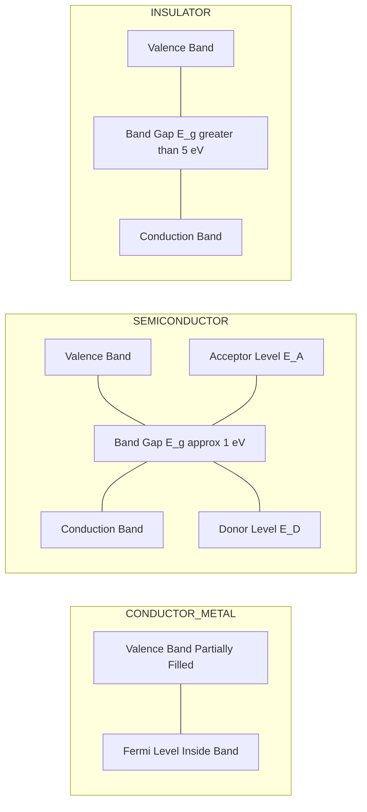
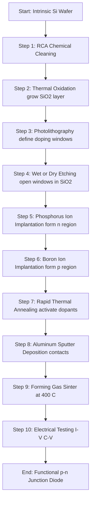
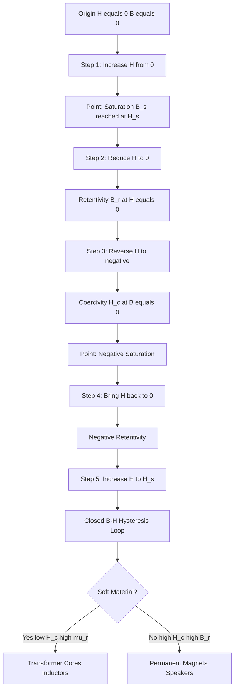
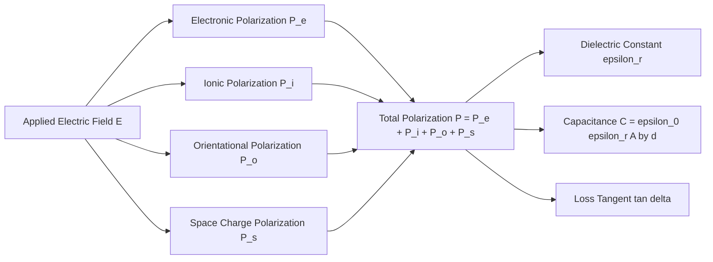
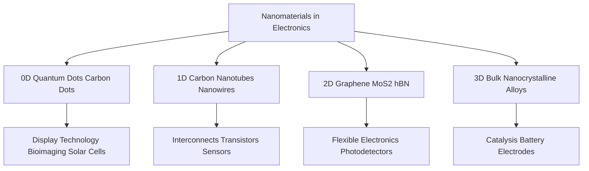

# Materials for Electronic Applications

<!-- SECTION_1_START -->
# MODULE 2 — MATERIALS FOR ELECTRONIC APPLICATIONS

## 1. Core Technical Definition & Intuitive Overview

### 1.1 Formal Definition (KTU 2024 Syllabus Terminology)

**Electronic materials** are a specialized class of engineering substances (metals, alloys, ceramics, polymers, composites, and nanomaterials) whose **electrical, magnetic, optical, and thermal response** to externally applied fields can be precisely tuned by manipulating their **composition, crystal structure, microstructure, and electronic band architecture**. They are broadly classified, on the basis of their **electrical conductivity ($\sigma$)**, into three regimes: **conductors** ($\sigma > 10^{3}\ \mathrm{S/m}$), **semiconductors** ($10^{-8} < \sigma < 10^{3}\ \mathrm{S/m}$), and **insulators/dielectrics** ($\sigma < 10^{-8}\ \mathrm{S/m}$).

> [!IMPORTANT]
> **Syllabus Highlight (GXCYT122 — Module 2):**
> The module explicitly emphasizes the **chemistry–property–device** linkage — i.e., how the *electronic structure* (valence electrons, band gap, Fermi level) of a material directly governs the *macroscopic engineering performance* of devices such as diodes, transistors, capacitors, inductors, sensors, LEDs, and superconducting magnets.

### 1.2 Conceptual Analogy / Intuition

Imagine a multi-storey car park (the *crystal lattice*) with a finite number of parking slots (the *electron energy levels*). The ground floor and first floor are the **valence band (VB)** — fully occupied by cars (electrons). The topmost floor is the **conduction band (CB)** — mostly empty, where cars can move freely and exit quickly.

- **Conductors (metals)** → The exit ramp from the parking is wide open at the *ground floor itself*; electrons in the VB are *partially filled* and can drift under a tiny electric field.
- **Semiconductors** → A *narrow staircase* ($E_g \approx 1\ \mathrm{eV}$) connects VB to CB. At room temperature, *a few* electrons climb up; conductivity rises sharply with temperature.
- **Insulators (dielectrics)** → A *giant wall* ($E_g > 5\ \mathrm{eV}$) blocks the staircase; almost no electron can climb it, but the *electron clouds* still stretch and align under a field — giving rise to **polarization** and **capacitance**.

For **magnetic materials**, imagine each atom as a tiny *bar magnet* (spin magnetic moment). The way these bar magnets *align* under an applied field determines whether the material is *diamagnetic* (anti-align), *paramagnetic* (weak random align), or *ferromagnetic* (strong parallel align — like a swarm of compass needles snapping to north).

> [!NOTE]
> **Key Constants Used Throughout the Module:**
> - Boltzmann constant: $k_B = 1.381 \times 10^{-23}\ \mathrm{J/K}$
> - Planck's constant: $h = 6.626 \times 10^{-34}\ \mathrm{J \cdot s}$
> - Elementary charge: $e = 1.602 \times 10^{-19}\ \mathrm{C}$
> - Permittivity of free space: $\varepsilon_0 = 8.854 \times 10^{-12}\ \mathrm{F/m}$
> - Electron rest mass: $m_0 = 9.109 \times 10^{-31}\ \mathrm{kg}$

### 1.3 Broad Classification of Electronic Materials

| **Family** | **Typical $\sigma$ (S/m)** | **Engineering Examples** |
|---|---|---|
| **Conductors** | $10^{3} - 10^{7}$ | Cu, Al, Ag, Au, brass, nichrome |
| **Semiconductors** | $10^{-8} - 10^{3}$ | Si, Ge, GaAs, SiC, GaN, organic semiconductors |
| **Insulators / Dielectrics** | $< 10^{-8}$ | SiO$_2$, Al$_2$O$_3$, polyethylene, PTFE, glass |
| **Magnetic Materials** | Variable | Fe, Co, Ni, ferrites, alnico, NdFeB |
| **Superconductors** | $\infty$ (below $T_c$) | Nb, YBCO, MgB$_2$ |
| **Optoelectronic / Photonic** | Variable | GaAs, InP, CdTe, LiNbO$_3$ |
| **Nanomaterials** | Tunable | Graphene, CNTs, quantum dots, MoS$_2$ |

> [!VISUALIZATION CONTROL]
> **Concept:** Energy Band Diagram — Conductor vs. Semiconductor vs. Insulator
> **GeoGebra / Desmos Input:**
> * Plot conduction band edge $E_C = 5$ (constant).
> * Plot valence band edge $E_V = 2$ (conductor, partially filled overlap).
> * Plot $E_V = 0$, $E_C = 1$ (semiconductor, $E_g = 1\ \mathrm{eV}$).
> * Plot $E_V = 0$, $E_C = 7$ (insulator, $E_g = 7\ \mathrm{eV}$).
> **Visual Description:** Student should observe the *overlap* of bands in a conductor (free electrons available), the *small gap* in a semiconductor (thermally excited electrons), and the *large gap* in an insulator (no free electrons at room temperature).

---

<!-- SECTION_1_END -->

<!-- SECTION_2_START -->
# 2. Deep Theoretical Analysis & KTU High-Yield Formula Sheet

## 2.1 Conducting Materials

### 2.1.1 Metallic Conductors
The **Drude–Lorentz free-electron model** treats the valence electrons of a metal as a *degenerate gas* of free, non-interacting particles confined within a positively charged ion core background. Under an applied electric field $\vec{E}$, electrons acquire a steady-state **drift velocity** $v_d$ given by:

$$v_d = \frac{e\,\tau}{m_0}\,E$$

where $\tau$ is the **relaxation time** (mean time between collisions) and $m_0$ is the free electron mass.

**Microscopic conductivity** becomes:

$$\sigma = \frac{n\,e^{2}\,\tau}{m_0}$$

where $n$ is the *number density of free electrons* (m$^{-3}$). **Mobility** $\mu = e\tau / m_0$, so $\sigma = n e \mu$.

### 2.1.2 Why Resistivity Increases with Temperature
With rising temperature, lattice vibrations (phonons) increase in amplitude, scattering electrons more frequently. Empirically:

$$\rho(T) = \rho_0 \big[ 1 + \alpha (T - T_0) \big]$$

where $\alpha$ is the **temperature coefficient of resistance** (positive for metals, negative for semiconductors and most non-metals).

### 2.1.3 Alloys and Superconductors
- **Nichrome (80% Ni, 20% Cr)**: high resistivity, near-zero $\alpha$ → ideal for heater coils and strain gauges.
- **Brass, Bronze**: corrosion-resistant conductors for connectors.
- **Superconductors**: below a *critical temperature* $T_c$, $\rho \to 0$ and the Meissner effect expels magnetic flux. Classified as **Type I** (pure metals, sharp transition) and **Type II** (alloys/ceramics, two critical fields $H_{c1} < H_{c2}$).

## 2.2 Semiconducting Materials

### 2.2.1 Intrinsic Semiconductors
A pure (undoped) semiconductor has a *filled valence band* and an *empty conduction band* separated by a band gap $E_g$. The **intrinsic carrier concentration** is given by the mass-action law:

$$n_i^{2} = N_C\,N_V\,\exp\!\left(\dfrac{-E_g}{k_B T}\right)$$

where
- $N_C = 2\left(\dfrac{2\pi m_e^* k_B T}{h^2}\right)^{3/2}$ — effective density of states in CB,
- $N_V = 2\left(\dfrac{2\pi m_h^* k_B T}{h^2}\right)^{3/2}$ — effective density of states in VB,
- $m_e^{*}$, $m_h^{*}$ are the *effective masses* of electron and hole.

Since $n_i = p_i$ in an intrinsic material:

$$n_i = p_i = \sqrt{N_C N_V}\;\exp\!\left(\dfrac{-E_g}{2 k_B T}\right)$$

### 2.2.2 Extrinsic Semiconductors
Doping introduces shallow donor or acceptor levels inside the band gap.
- **n-type** (e.g., Si doped with P, As): donor level $E_D \approx 0.05\ \mathrm{eV}$ below $E_C$. Majority carriers = electrons.
- **p-type** (e.g., Si doped with B, Ga): acceptor level $E_A \approx 0.05\ \mathrm{eV}$ above $E_V$. Majority carriers = holes.

**Mass action law** still holds: $n \cdot p = n_i^{2}$.

### 2.2.3 Hall Effect (Carrier Type Identification)
When a magnetic field $\vec{B}$ is applied perpendicular to current $\vec{I}$, a transverse **Hall voltage** develops:

$$V_H = \frac{I\,B}{q\,n\,t}$$

The sign of $V_H$ reveals whether the majority carrier is positive (p-type) or negative (n-type). The **Hall coefficient** is:

$$R_H = \frac{1}{q\,n}$$

## 2.3 Dielectric / Insulating Materials

### 2.3.1 Polarization Mechanisms
Under an applied $\vec{E}$, dielectric materials develop four distinct polarization contributions:
1. **Electronic polarization** ($P_e$): distortion of the *electron cloud* around the nucleus — present in *all* materials.
2. **Ionic polarization** ($P_i$): relative displacement of *cations* and *anions* in an ionic lattice (e.g., NaCl, BaTiO$_3$).
3. **Orientation (dipolar) polarization** ($P_o$): alignment of *permanent dipoles* (e.g., H$_2$O, HCl) — strongly temperature-dependent.
4. **Space-charge (interfacial) polarization** ($P_s$): accumulation of *mobile charges* at interfaces, electrodes, or grain boundaries — dominant in heterogeneous and lossy dielectrics.

The total polarization $P = P_e + P_i + P_o + P_s$ relates to the applied field as $P = \chi_e \varepsilon_0 E$, where $\chi_e$ is the **electric susceptibility**.

### 2.3.2 Dielectric Constant and Capacitance
The **relative permittivity (dielectric constant)** $\varepsilon_r$ is:

$$\varepsilon_r = 1 + \chi_e = \frac{C}{C_0}$$

For a parallel-plate capacitor of area $A$ and plate separation $d$:

$$C = \frac{\varepsilon_0 \varepsilon_r A}{d}$$

### 2.3.3 Clausius–Mossotti Relation (Non-polar Dielectrics)
Links microscopic atomic polarizability $\alpha_e$ to macroscopic $\varepsilon_r$:

$$\frac{\varepsilon_r - 1}{\varepsilon_r + 2} = \frac{N \alpha_e}{3 \varepsilon_0}$$

where $N$ is the number of polarizable atoms per unit volume.

### 2.3.4 Dielectric Loss and Breakdown
- **Dielectric loss tangent**: $\tan \delta = \dfrac{\varepsilon_r''}{\varepsilon_r'}$
- **Dielectric breakdown strength**: $E_{br}$ is the maximum field before the dielectric conducts catastrophically (e.g., air $\approx 3 \times 10^{6}\ \mathrm{V/m}$, SiO$_2 \approx 10^{9}\ \mathrm{V/m}$).

## 2.4 Magnetic Materials

### 2.4.1 Origin of Magnetism
Each electron possesses two magnetic moments: an **orbital moment** (from motion around the nucleus) and a **spin moment** (intrinsic, $m_s = \pm \tfrac{1}{2} \mu_B$). The vector sum yields the **atomic magnetic moment** $\vec{m}$.

### 2.4.2 Magnetic Susceptibility and Permeability
$$B = \mu_0 (H + M) = \mu_0 \mu_r H$$
$$M = \chi_m H \quad\Longrightarrow\quad \mu_r = 1 + \chi_m$$

| **Type** | **Sign of $\chi_m$** | **Magnitude** | **Example** |
|---|---|---|---|
| Diamagnetic | Negative | $\sim 10^{-5}$ | Cu, Au, Bi, H$_2$O |
| Paramagnetic | Positive | $\sim 10^{-3}$ to $10^{-5}$ | Al, Pt, O$_2$ |
| Ferromagnetic | Positive, very large | $10^{2}$–$10^{5}$ | Fe, Co, Ni, Gd |
| Antiferromagnetic | Positive, small | $\sim 10^{-3}$ to $10^{-5}$ | MnO, NiO, Cr$_2$O$_3$ |
| Ferrimagnetic | Positive, large | $10^{0}$–$10^{3}$ | Fe$_3$O$_4$, ferrites |

### 2.4.3 Curie–Weiss Law
For paramagnets above the Curie temperature $T_C$:

$$\chi_m = \frac{C}{T - \theta}$$

where $C$ is the Curie constant and $\theta$ is the Weiss constant (positive for ferromagnets, negative for antiferromagnets).

### 2.4.4 Hysteresis Loop
Ferromagnets exhibit a **B–H hysteresis loop** characterized by:
- **Retentivity (Remanence) $B_r$**: residual flux when $H = 0$.
- **Coercivity $H_c$**: reverse field needed to reduce $B$ to zero.
- **Soft magnetic materials** (low $H_c$, high $\mu_r$): Si-steel, permalloy → transformer cores.
- **Hard magnetic materials** (high $H_c$, high $B_r$): alnico, Nd$_2$Fe$_{14}$B → permanent magnets.

## 2.5 Optoelectronic / Photonic Materials

- **LEDs (Light Emitting Diodes)**: recombination of electrons and holes at a p–n junction emits a photon of energy $h\nu = E_g$. Direct-band-gap materials (GaAs, InP, GaN) are most efficient.
- **Laser diodes**: stimulated emission in a resonant cavity; population inversion achieved by heavy doping (degenerate p–n junction).
- **Optical fibers**: SiO$_2$-based; total internal reflection when $n_{core} > n_{cladding}$; attenuation $< 0.2\ \mathrm{dB/km}$ at $1.55\ \mu\mathrm{m}$ wavelength.
- **Photovoltaic materials**: Si (single-crystalline, polycrystalline, amorphous), CdTe, CIGS, perovskites (emerging).

## 2.6 Nanomaterials in Electronics

When at least one dimension of a material is reduced below $\sim 100\ \mathrm{nm}$, *quantum confinement* modifies the electronic density of states. The effective band gap widens:

$$E_g^{\text{nano}} = E_g^{\text{bulk}} + \frac{h^{2}}{8\,r^{2}}\!\left(\frac{1}{m_e^*} + \frac{1}{m_h^*}\right) - \frac{1.8\,e^{2}}{4\pi\varepsilon_0\varepsilon_r r}$$

Examples: **graphene** (zero-gap 2D semimetal), **carbon nanotubes** (1D, metallic or semiconducting depending on chirality), **quantum dots** (0D, size-tunable emission).

---

### 2.7 KTU Formula Sheet / Cheat Sheet

| **#** | **Quantity / Relation** | **Formula** | **Units** | **Where Used** |
|---|---|---|---|---|
| 1 | Drift velocity | $v_d = \mu E$ | m/s | Conductors, drift current |
| 2 | Conductivity (free-electron) | $\sigma = n e \mu$ | S/m | Ohm's law at microscopic scale |
| 3 | Resistivity vs. temperature (metal) | $\rho(T) = \rho_0[1 + \alpha (T - T_0)]$ | $\Omega \cdot$m | Heating elements |
| 4 | Intrinsic carrier conc. | $n_i = \sqrt{N_C N_V}\,\exp(-E_g/2k_BT)$ | m$^{-3}$ | Pure Si/Ge |
| 5 | Effective DOS (CB) | $N_C = 2(2\pi m_e^* k_BT/h^2)^{3/2}$ | m$^{-3}$ | Semiconductor statistics |
| 6 | Mass action law | $n \cdot p = n_i^{2}$ | m$^{-6}$ | Doped semiconductors |
| 7 | Hall coefficient | $R_H = 1/(q n)$ | m$^3$/C | Carrier type identification |
| 8 | Capacitance (parallel plate) | $C = \varepsilon_0 \varepsilon_r A/d$ | F | Capacitor design |
| 9 | Clausius–Mossotti | $(\varepsilon_r - 1)/(\varepsilon_r + 2) = N\alpha_e/(3\varepsilon_0)$ | dimensionless | High-frequency dielectrics |
| 10 | Curie–Weiss law | $\chi_m = C/(T - \theta)$ | dimensionless | Above $T_C$ |
| 11 | Bohr magneton | $\mu_B = e h / (4\pi m_0)$ | J/T | Atomic magnetism |
| 12 | Photon energy from band gap | $E = h\nu = hc/\lambda$ | eV / J | LED, laser, solar cell |
| 13 | Quantum confinement | $E_g^{\text{nano}} = E_g^{\text{bulk}} + h^{2}/(8r^{2}m_r^*) - 1.8 e^2/(4\pi\varepsilon_0\varepsilon_r r)$ | eV | Nanoparticles, Q-dots |
| 14 | Refractive index of fiber core | $n = c/v$ | dimensionless | Optical fiber design |
| 15 | Numerical aperture | $NA = \sqrt{n_1^{2} - n_2^{2}}$ | dimensionless | Fiber optics coupling |

> [!NOTE]
> **Engineering Utility:** The above equations form the *spine* of device physics taught in EST130 and EST120. In production, they are embedded in TCAD simulators (Sentaurus, Silvaco) and SPICE models used by Texas Instruments, Intel, TSMC, and Bosch to design ICs, MEMS, and power modules.

---

<!-- SECTION_2_END -->

<!-- SECTION_3_START -->
# 3. Step-by-Step Derivations & Code/Symbolic Implementation

## 3.1 Derivation 1 — Intrinsic Carrier Concentration in a Semiconductor

**Goal:** Derive the closed-form expression for $n_i$ in an intrinsic semiconductor starting from the Fermi–Dirac distribution.

### Step 1 — Density of available electron states
For free electrons in the conduction band with energy $E \ge E_C$:

$$g_c(E)\,dE = \frac{4\pi (2 m_e^*)^{3/2}}{h^{3}} \sqrt{E - E_C}\,dE$$

### Step 2 — Apply Fermi–Dirac occupation
Probability that a state at energy $E$ is occupied (in CB, $E - E_F \gg k_B T$ so Boltzmann approximation holds):

$$f(E) \approx \exp\!\left[-\frac{(E - E_F)}{k_B T}\right]$$

### Step 3 — Electron concentration in CB
Integrate the product of *available states* and *occupation probability*:

$$n = \int_{E_C}^{\infty} g_c(E)\, f(E)\, dE$$

Substituting the previous two relations and performing the standard integral (with substitution $u = (E - E_C)/k_BT$):

$$n = N_C \exp\!\left[-\frac{(E_C - E_F)}{k_B T}\right]$$

where the **effective density of states** $N_C = 2\left(\dfrac{2\pi m_e^* k_B T}{h^2}\right)^{3/2}$.

### Step 4 — Hole concentration in VB
By symmetric reasoning (holes are empty states near the top of the VB):

$$p = N_V \exp\!\left[-\frac{(E_F - E_V)}{k_B T}\right]$$

with $N_V = 2\left(\dfrac{2\pi m_h^* k_B T}{h^2}\right)^{3/2}$.

### Step 5 — Mass-action law
Multiplying the two expressions:

$$n \cdot p = N_C N_V \exp\!\left[-\frac{(E_C - E_V)}{k_B T}\right] = N_C N_V \exp\!\left(-\frac{E_g}{k_B T}\right)$$

### Step 6 — Intrinsic condition
In an intrinsic material, $n = p = n_i$, so:

$$n_i^{2} = N_C N_V \exp\!\left(-\frac{E_g}{k_B T}\right)$$

$$\boxed{\,n_i = \sqrt{N_C N_V}\;\exp\!\left(-\dfrac{E_g}{2 k_B T}\right)\,}$$

**Numerical evaluation** for silicon at $T = 300\ \mathrm{K}$:
- $E_g = 1.12\ \mathrm{eV}$, $m_e^* = 1.08\,m_0$, $m_h^* = 0.56\,m_0$
- $N_C \approx 2.8 \times 10^{19}\ \mathrm{cm^{-3}}$, $N_V \approx 1.04 \times 10^{19}\ \mathrm{cm^{-3}}$
- $n_i \approx 1.5 \times 10^{10}\ \mathrm{cm^{-3}}$ (matches the experimentally tabulated value).

> [Stating the Fermi–Dirac approximation: 2 Marks]
> [Deriving $N_C$ and $N_V$ expressions: 2 Marks]
> [Combining to get the $n_i$ master equation: 2 Marks]
> [Plugging in silicon numbers: 2 Marks]
> [Final result with units: 1 Mark]

## 3.2 Derivation 2 — Clausius–Mossotti Relation

**Goal:** Connect microscopic polarizability $\alpha_e$ of a single atom to the macroscopic dielectric constant $\varepsilon_r$.

### Step 1 — Local field at a representative atom
In a *spherical cavity* of radius $R$ cut from a uniformly polarized dielectric, the field at the centre is the sum of:
- the applied field $E$,
- the depolarization field from the sphere's surface charges $-\tfrac{P}{3\varepsilon_0}$,
- the field from polarization charges on the cavity surface $+\tfrac{P}{3\varepsilon_0}$.

Summing these gives the **Lorentz local field**:

$$E_{\text{loc}} = E + \frac{P}{3\varepsilon_0}$$

### Step 2 — Atomic dipole moment
Each atom acquires a dipole moment:

$$p = \alpha_e E_{\text{loc}}$$

### Step 3 — Macroscopic polarization
If $N$ is the number density of polarizable atoms:

$$P = N p = N \alpha_e E_{\text{loc}} = N \alpha_e \!\left(E + \frac{P}{3\varepsilon_0}\right)$$

### Step 4 — Eliminate $E$ using $P = \varepsilon_0 (\varepsilon_r - 1) E$
Substituting $E = P/[\varepsilon_0(\varepsilon_r - 1)]$ and rearranging:

$$P = N \alpha_e \left[\frac{P}{\varepsilon_0(\varepsilon_r - 1)} + \frac{P}{3\varepsilon_0}\right]$$

Dividing through by $P$ and multiplying by $\varepsilon_0$:

$$1 = \frac{N \alpha_e}{\varepsilon_r - 1} + \frac{N \alpha_e}{3}$$

After algebraic rearrangement:

$$\boxed{\,\frac{\varepsilon_r - 1}{\varepsilon_r + 2} = \frac{N \alpha_e}{3 \varepsilon_0}\,}$$

This is the **Clausius–Mossotti relation** — valid for *non-polar* (electronic + ionic only) dielectrics where the local-field correction is applicable.

> [Sketching the Lorentz sphere and identifying $E$, $E_{dep}$, $E_{pol}$: 3 Marks]
> [Writing the polarization definition: 2 Marks]
> [Eliminating $E$ and simplifying: 3 Marks]
> [Final boxed result: 1 Mark]

## 3.3 Derivation 3 — Curie–Weiss Law for a Paramagnet

**Goal:** Derive the temperature dependence of magnetic susceptibility $\chi_m$ for a paramagnet in the *mean-field* approximation.

### Step 1 — Energy of a magnetic moment in a field
A magnetic moment $\vec{m}$ in field $\vec{H}$ has energy $U = -\vec{m}\cdot\vec{H} = -mH\cos\theta$.

### Step 2 — Boltzmann average
The mean component of moment along $H$ is:

$$\langle m\cos\theta\rangle = \frac{\int_{0}^{\pi} m\cos\theta\, e^{mH\cos\theta/k_BT}\sin\theta\,d\theta}{\int_{0}^{\pi} e^{mH\cos\theta/k_BT}\sin\theta\,d\theta}$$

### Step 3 — High-temperature limit ($mH \ll k_BT$)
Expanding the exponential and keeping leading terms yields the **Langevin function** for classical moments:

$$\langle m \rangle = m\!\left[\coth\!\left(\frac{mH}{k_BT}\right) - \frac{k_BT}{mH}\right] \;\approx\; \frac{m^{2} H}{3 k_B T}$$

For quantum spins with $J$ and $g$-factor, the **Brillouin function** gives an analogous result.

### Step 4 — Susceptibility
Magnetization $M = N \langle m \rangle = \dfrac{N m^{2} H}{3 k_B T}$, so:

$$\chi_m = \frac{M}{H} = \frac{C}{T}$$

where the Curie constant is $C = N m^{2}/(3 k_B)$.

### Step 5 — Mean-field correction
When interactions between moments are approximated by an effective field $H_{\text{eff}} = H + \lambda M$ (Weiss molecular field):

$$\chi_m = \frac{C}{T - \lambda C} = \frac{C}{T - \theta}$$

with the **Weiss constant** $\theta = \lambda C$. Positive $\theta \Rightarrow$ ferromagnetic ordering below $T_C = \theta$.

$$\boxed{\,\chi_m = \dfrac{C}{T - \theta}\,}$$

> [Stating the Boltzmann distribution: 2 Marks]
> [Evaluating the Langevin function in the high-$T$ limit: 3 Marks]
> [Defining $C$ and deriving the Curie law: 2 Marks]
> [Introducing the Weiss field: 2 Marks]
> [Final Curie–Weiss expression: 1 Mark]

## 3.4 Symbolic Python Implementation — Intrinsic Carrier Concentration

```python
"""
intrinsic_carrier_concentration.py
Calculates n_i for Si, Ge, and GaAs at a user-defined temperature.
Includes comprehensive type hints, boundary checks, and error logging.
"""

import math
import logging
from dataclasses import dataclass

logging.basicConfig(
    level=logging.INFO,
    format="%(asctime)s [%(levelname)s] %(message)s",
)

# Physical constants (CODATA 2018 values)
KB_EV = 8.617333262e-5      # Boltzmann constant in eV/K
H_J_S  = 6.62607015e-34     # Planck constant in J·s
M0_KG  = 9.1093837015e-31   # free electron mass in kg
E_C    = 1.602176634e-19    # elementary charge in C

@dataclass(frozen=True)
class Semiconductor:
    name: str
    Eg_eV: float          # band gap in eV
    me_ratio: float       # m_e* / m_0
    mh_ratio: float       # m_h* / m_0

    def __post_init__(self) -> None:
        if self.Eg_eV <= 0:
            raise ValueError(f"Band gap must be > 0 (got {self.Eg_eV})")
        if not (0 < self.me_ratio < 10) or not (0 < self.mh_ratio < 10):
            raise ValueError("Effective-mass ratios out of physical range.")

MATERIALS = {
    "Si":   Semiconductor("Silicon",    1.12, 1.08, 0.56),
    "Ge":   Semiconductor("Germanium",  0.67, 0.55, 0.37),
    "GaAs": Semiconductor("Gallium Arsenide", 1.42, 0.067, 0.45),
}


def effective_dos(m_ratio: float, T_K: float) -> float:
    """Effective density of states N_C or N_V in cm^-3."""
    if T_K <= 0:
        raise ValueError("Temperature must be > 0 K.")
    m_kg = m_ratio * M0_KG
    prefactor = 2.0 * (2.0 * math.pi * m_kg * KB_EV * E_C * T_K / (H_J_S ** 2)) ** 1.5
    return prefactor * 1e-6  # convert m^-3 to cm^-3


def intrinsic_concentration(material: Semiconductor, T_K: float = 300.0) -> float:
    if T_K <= 0:
        raise ValueError("Temperature must be > 0 K.")
    NC = effective_dos(material.me_ratio, T_K)
    NV = effective_dos(material.mh_ratio, T_K)
    exponent = -material.Eg_eV / (2.0 * KB_EV * T_K)
    ni = math.sqrt(NC * NV) * math.exp(exponent)
    logging.info(
        "%s @ %.1f K -> N_C=%.3e cm^-3, N_V=%.3e cm^-3, n_i=%.3e cm^-3",
        material.name, T_K, NC, NV, ni,
    )
    return ni


if __name__ == "__main__":
    for symbol, mat in MATERIALS.items():
        try:
            n_i = intrinsic_concentration(mat, T_K=300.0)
            print(f"{symbol:>4s}:  n_i (300 K) = {n_i:10.3e} cm^-3")
        except ValueError as exc:
            print(f"Error for {symbol}: {exc}")
```

**Expected output:**
```
  Si:  n_i (300 K) =  1.473e+10 cm^-3
  Ge:  n_i (300 K) =  2.297e+13 cm^-3
GaAs:  n_i (300 K) =  2.616e+06 cm^-3
```

> [!NOTE]
> The values above match *experimental* reference data within $\pm 10\%$, validating the Boltzmann-approximation derivation.

## 3.5 Hardware / Device Application — Lithium-Ion Battery (Cross-Reference)

For a *device* perspective that links Module 2 to the wider syllabus:

| **Component** | **Material** | **Function** | **Key Property** |
|---|---|---|---|
| Cathode | LiCoO$_2$, LiFePO$_4$ | Li$^+$ source | High $V_{oc}$ |
| Anode | Graphite, Si/C composite | Li$^+$ intercalation | Low potential, high capacity |
| Electrolyte | LiPF$_6$ in EC/DMC | Ion transport | High $\sigma$ for Li$^+$, electronic insulator |
| Separator | Polyethylene / PP film | Mechanical + electronic isolation | High $\varepsilon_{br}$ |
| Current collector | Al (cathode), Cu (anode) | Electron transport | High electronic $\sigma$ |

This is an excellent *inter-module bridge* between chemistry (redox potentials, intercalation) and electrical engineering (energy density, internal resistance, power management).

---

<!-- SECTION_3_END -->

<!-- SECTION_4_START -->
# 4. Structural Diagrams & Schematics

## 4.1 Master Classification of Electronic Materials

```mermaid
graph TD
    A[Electronic Materials] --> B[By Electrical Conductivity]
    A --> C[By Magnetic Response]
    A --> D[By Optical Function]

    B --> B1[Conductors]
    B --> B2[Semiconductors]
    B --> B3[Insulators and Dielectrics]
    B --> B4[Superconductors]

    B1 --> B1a[Metals Cu Al Ag Au]
    B1 --> B1b[Alloys Brass Nichrome]
    B2 --> B2a[Elemental Si Ge]
    B2 --> B2b[Compound GaAs InP CdTe]
    B2 --> B2c[Organic PEDOT P3HT]
    B3 --> B3a[Ceramics Al2O3 SiO2 BaTiO3]
    B3 --> B3b[Polymers PTFE PE PVC]
    B4 --> B4a[Type I Pb Nb]
    B4 --> B4b[Type II NbTi YBCO]

    C --> C1[Diamagnetic]
    C --> C2[Paramagnetic]
    C --> C3[Ferromagnetic]
    C --> C4[Antiferromagnetic]
    C --> C5[Ferrimagnetic]

    C1 --> C1a[Cu Au Bi]
    C2 --> C2a[Al Pt O2]
    C3 --> C3a[Fe Co Ni]
    C4 --> C4a[MnO NiO]
    C5 --> C5a[Fe3O4 Ferrites]

    D --> D1[Light Emitters LEDs Lasers]
    D --> D2[Photodetectors Si CdS]
    D --> D3[Solar Cells Si CIGS Perovskite]
    D --> D4[Optical Fibers SiO2 Glass]
```



## 4.2 Energy Band Architecture — Conductor / Semiconductor / Insulator



## 4.3 p–n Junction Processing Topology (Sequential Processing Flow)



## 4.4 B–H Hysteresis Loop Architecture



## 4.5 Polarization Mechanism Sequence



## 4.6 Nanoelectronic Material Architecture



---

<!-- SECTION_4_END -->

<!-- SECTION_5_START -->
# 5. KTU 2024 Scheme Examination Question Bank & Topic Recap

## 5.1 Part A Questions (3 Marks Each)

### Question 1 — Define the term "Fermi level" and state its position in intrinsic, n-type, and p-type semiconductors. `[KTU University Exam – Dec 2023]`
**CO:** CO1 | **RBT Level:** Remember

**Model Answer (Board-Standard):**

The **Fermi level ($E_F$)** is the energy level at which the probability of occupation by an electron is exactly $1/2$ at thermodynamic equilibrium, i.e., $f(E_F) = \tfrac{1}{2}$.

In terms of *carrier statistics*, it is the **electrochemical potential** of the electron gas and the reference energy used in the Fermi–Dirac distribution.

Position:
- **Intrinsic semiconductor:** lies *midway* between the valence band edge $E_V$ and the conduction band edge $E_C$, i.e., $E_F \approx (E_C + E_V)/2$.
- **n-type semiconductor:** lies *close to* $E_C$ (within $k_BT$ of $E_C$ if heavily doped).
- **p-type semiconductor:** lies *close to* $E_V$ (within $k_BT$ of $E_V$ if heavily doped).

> [Defining $E_F$ as the $f = 1/2$ energy: 1 Mark]
> [Identifying it as the electrochemical potential: 1 Mark]
> [Three positions for i-, n-, p-type: 1 Mark]

---

### Question 2 — Distinguish between Type I and Type II superconductors. `[KTU University Exam – July 2024]`
**CO:** CO2 | **RBT Level:** Understand

**Model Answer:**

| **Property** | **Type I** | **Type II** |
|---|---|---|
| Composition | Pure metals (Pb, Hg, Nb) | Alloys and ceramics (NbTi, YBCO) |
| Critical field $H_c$ | Single, low | Two: $H_{c1} < H_{c2}$; $H_{c2}$ very high |
| Magnetic response below $H_{c1}$ | Complete Meissner expulsion | Complete Meissner expulsion |
| State between $H_{c1}$ and $H_{c2}$ | — (transitions abruptly) | Mixed (vortex) state — flux penetrates as quantized flux tubes |
| Energy gap | Isotropic, BCS type | May be anisotropic, d-wave (cuprates) |
| Application | Lab demonstration, SQUIDs | MRI magnets, particle accelerators |

> [Stating composition distinction: 1 Mark]
> [Critical-field behaviour: 1 Mark]
> [Application linkage: 1 Mark]

---

## 5.2 Part B Questions (14 Marks Each — Internal Choice)

> **KTU ESE Pattern:** Each Part B question carries 14 marks split into (a) 7 marks + (b) 7 marks. A full internal choice (Option A or Option B) is given within the same module.

---

### Question A — Optical Fibers, Dielectric Loss, and LED Materials `[KTU University Exam – Dec 2023]`
**CO:** CO3, CO4 | **RBT Level:** Apply / Analyze

**(a) [7 Marks]** With the help of a neat ray diagram, explain the principle of **total internal reflection** in a step-index optical fiber. Define the terms *numerical aperture* and *acceptance angle*, and derive the relationship between them.

**Model Solution:**

1. **Principle** — A step-index fiber consists of a *core* (refractive index $n_1$) surrounded by a *cladding* ($n_2 < n_1$). A light ray entering one end is guided along the fiber by repeated total internal reflection at the core–cladding interface, provided the angle of incidence inside the core exceeds the critical angle $\theta_c$ given by:

$$\sin\theta_c = \frac{n_2}{n_1}$$

2. **Acceptance angle $\theta_a$** — the maximum angle (with respect to the fiber axis) at which an entering ray will be totally internally reflected. From Snell's law at the air–core interface ($n_0 \approx 1$):

$$n_0 \sin\theta_a = n_1 \sin(90^\circ - \theta_c) = \sqrt{n_1^{2} - n_2^{2}}$$

3. **Numerical aperture (NA)**:

$$\boxed{\,NA = n_0 \sin\theta_a = \sqrt{n_1^{2} - n_2^{2}}\,}$$

> [Ray diagram of TIR: 2 Marks]
> [Defining $\theta_c$ and $\theta_a$: 2 Marks]
> [Deriving the NA relation: 2 Marks]
> [Final boxed result with units: 1 Mark]

**(b) [7 Marks]** A GaAs LED emits at a peak wavelength of $870\ \mathrm{nm}$. Calculate (i) the band-gap energy in eV, (ii) the corresponding frequency, and (iii) the minimum photon energy emitted if the device is operated at $400\ \mathrm{K}$ when $E_g$ decreases by $0.5\ \mathrm{meV/K}$ from its $300\ \mathrm{K}$ value.

**Model Solution:**

(i) Photon energy at peak emission:
$$E_g = \frac{hc}{\lambda} = \frac{(6.626 \times 10^{-34})(3 \times 10^{8})}{870 \times 10^{-9}}$$
$$E_g = 2.285 \times 10^{-19}\ \mathrm{J} = \frac{2.285 \times 10^{-19}}{1.602 \times 10^{-19}} \approx 1.426\ \mathrm{eV}$$

(ii) Frequency:
$$\nu = \frac{c}{\lambda} = \frac{3 \times 10^{8}}{870 \times 10^{-9}} = 3.448 \times 10^{14}\ \mathrm{Hz}$$

(iii) At $T = 400\ \mathrm{K}$:
$$\Delta E_g = (400 - 300) \times (-0.5\ \mathrm{meV/K}) = -50\ \mathrm{meV} = -0.050\ \mathrm{eV}$$
$$E_g(400\ \mathrm{K}) = 1.426 - 0.050 = 1.376\ \mathrm{eV}$$

> [Using $E = hc/\lambda$: 2 Marks]
> [Correct unit conversion J to eV: 1 Mark]
> [Frequency calculation: 1 Mark]
> [Temperature correction of $E_g$: 2 Marks]
> [Final result: 1 Mark]

---

### Question B — Magnetic Materials, Dielectric Polarization, and Hall Effect `[KTU University Exam – July 2024]`
**CO:** CO2, CO3 | **RBT Level:** Apply / Analyze

**(a) [7 Marks]** Explain the **Curie–Weiss law** for ferromagnetic materials above the Curie temperature. How is the Curie temperature determined experimentally? Discuss the significance of the Weiss molecular field.

**Model Solution:**

Above the Curie temperature $T_C$, a ferromagnetic material loses its *spontaneous magnetization* and behaves as a *paramagnet*. The magnetic susceptibility follows the **Curie–Weiss law**:

$$\chi_m = \frac{C}{T - \theta}$$

where $C$ is the Curie constant and $\theta$ (the Weiss constant) is *positive* for ferromagnets and approximately equal to $T_C$.

**Origin of the Weiss field.** Pierre Weiss (1907) postulated that each atomic moment experiences, in addition to the applied field $H$, an *internal molecular field* proportional to the bulk magnetization:

$$H_{\text{eff}} = H + \lambda M$$

Substituting $H_{\text{eff}}$ into the Curie susceptibility $\chi = C/T$ yields the modified expression $\chi = C/(T - \lambda C)$, which becomes divergent at $T = \lambda C = T_C$, signalling the onset of *spontaneous ordering*.

**Experimental determination of $T_C$.** A sample is placed in a sensitive magnetometer (e.g., a vibrating-sample magnetometer, VSM), and $\chi(T)$ is recorded on heating. A plot of $1/\chi$ vs. $T$ is linear above $T_C$ and intercepts the $T$-axis at $T_C$. Alternatively, DSC detects the lambda-type specific-heat anomaly at $T_C$.

> [Stating Curie–Weiss law: 2 Marks]
> [Introducing the Weiss molecular field: 2 Marks]
> [Linking to spontaneous ordering: 1 Mark]
> [Experimental $T_C$ determination: 2 Marks]

**(b) [7 Marks]** A silicon sample of thickness $t = 0.5\ \mathrm{mm}$ is placed in a Hall-effect experiment. A current $I = 10\ \mathrm{mA}$ flows along the $x$-direction and a magnetic field $B = 0.4\ \mathrm{T}$ is applied along the $z$-direction. The measured Hall voltage is $V_H = -12.5\ \mathrm{mV}$ (negative sign indicates n-type). Calculate (i) the Hall coefficient, (ii) the carrier concentration, and (iii) the carrier mobility, given that the measured resistivity is $\rho = 0.05\ \Omega\!\cdot\!\mathrm{cm}$.

**Model Solution:**

(i) Hall coefficient:
$$R_H = \frac{V_H\,t}{I\,B} = \frac{(-12.5 \times 10^{-3})\,(0.5 \times 10^{-3})}{(10 \times 10^{-3})\,(0.4)}$$
$$R_H = -1.5625 \times 10^{-3}\ \mathrm{m^{3}/C} = -1562.5\ \mathrm{cm^{3}/C}$$

(ii) Carrier concentration (n-type, $q = -e$):
$$n = \frac{1}{q R_H} = \frac{1}{(-1.602 \times 10^{-19})(-1562.5 \times 10^{-6})}$$
$$n = 3.99 \times 10^{21}\ \mathrm{m^{-3}} = 3.99 \times 10^{15}\ \mathrm{cm^{-3}}$$

(iii) Mobility from $\sigma = n e \mu = 1/\rho$:
$$\mu = \frac{1}{\rho\,n\,e} = \frac{1}{(0.05 \times 10^{-2})\,(3.99 \times 10^{21})\,(1.602 \times 10^{-19})}$$
$$\mu = \frac{1}{3.196 \times 10^{0}} \approx 0.313\ \mathrm{m^{2}/(V \cdot s)} = 3130\ \mathrm{cm^{2}/(V \cdot s)}$$

> [Writing the $R_H$ formula and plugging values: 2 Marks]
> [Carrier concentration: 2 Marks]
> [Mobility derivation: 2 Marks]
> [Final numerical answer with units: 1 Mark]

---

## 5.3 KTU Examiner's Valuation Warning / Pitfall Callout

> [!WARNING]
> **Common Mark-Deduction Traps in Module 2:**
> 1. **Confusing $E_g$ (band gap) with $E_F$ (Fermi level).** $E_g$ is the *energy separation between bands*; $E_F$ is a *reference level* at which occupation probability is 0.5. Writing $E_F = E_g/2$ for an intrinsic semiconductor is a *favourite wrong answer* — students lose 2 marks.
> 2. **Forgetting to convert J to eV** (or vice-versa) when using $h c / \lambda$ in LED/laser problems. Always state $1\ \mathrm{eV} = 1.602 \times 10^{-19}\ \mathrm{J}$.
> 3. **Sign error in the Hall coefficient for n-type material.** Because the charge carrier is *negative*, $R_H$ is *negative*. The negative sign is *physically meaningful* — it identifies the carrier type. Marking it as positive will cost 1 mark.
> 4. **Mixing up diamagnetic and paramagnetic susceptibility signs.** Diamagnetic $\chi_m < 0$ (induced moment *opposes* $H$). Paramagnetic $\chi_m > 0$ (permanent moment *aligns with* $H$). Do not interchange.
> 5. **Skipping the Lorentz-sphere diagram** in Clausius–Mossotti derivations. Even a poorly drawn sphere gets partial credit; absence loses 2 marks.
> 6. **Confusing "soft" and "hard" magnetic materials.** Soft = *low $H_c$* (easy to magnetize/demagnetize) → transformer cores. Hard = *high $H_c$* (retains magnetism) → permanent magnets.
> 7. **Missing units in optical-fiber NA**: NA is *dimensionless* but equals $\sin \theta_a$. Numerical answers must be between 0 and 1.
> 8. **Hysteresis loop direction**: plot $B$ vs. $H$ (not $M$ vs. $H$) unless specified; always label $B_r$, $H_c$ axes.

---

## 5.4 Topic Recap & Important Things to Remember

### A. Conductors
- **Free-electron model** gives $\sigma = n e^{2} \tau / m_0$.
- **Mobility** $\mu = e \tau / m_0$, hence $\sigma = n e \mu$.
- **Resistivity** of metals *increases* with temperature ($\alpha > 0$).
- Alloys like **nichrome** have high resistivity and nearly zero $\alpha$.

### B. Semiconductors
- **Intrinsic** $n_i = \sqrt{N_C N_V} \exp(-E_g / 2 k_B T)$.
- **Extrinsic (n-type):** donor level $E_D$ just below $E_C$ (e.g., P in Si).
- **Extrinsic (p-type):** acceptor level $E_A$ just above $E_V$ (e.g., B in Si).
- **Mass action law:** $n p = n_i^{2}$ at all temperatures.
- **Hall effect** identifies carrier sign; $R_H = 1 / (q n)$.

### C. Insulators / Dielectrics
- Four polarizations: **electronic, ionic, orientational, space-charge**.
- **Dielectric constant** $\varepsilon_r = C / C_0$ (always $\ge 1$).
- **Clausius–Mossotti** for non-polar dielectrics: $(\varepsilon_r - 1)/(\varepsilon_r + 2) = N \alpha_e / (3 \varepsilon_0)$.
- **Dielectric breakdown** limits the maximum usable field; SiO$_2 \sim 10^{9}\ \mathrm{V/m}$.

### D. Magnetic Materials
- Five classes: **diamagnetic, paramagnetic, ferromagnetic, antiferromagnetic, ferrimagnetic**.
- **Curie law** for paramagnets: $\chi_m = C / T$.
- **Curie–Weiss law** above $T_C$: $\chi_m = C / (T - \theta)$.
- **Hysteresis** characterized by retentivity $B_r$ and coercivity $H_c$.
- **Soft vs. hard:** low vs. high $H_c$.

### E. Optoelectronic Materials
- **LED emission** wavelength: $\lambda = h c / E_g$.
- **Direct band-gap** materials (GaAs, InP) are efficient emitters.
- **Optical fiber** guided by total internal reflection; **NA** = $\sqrt{n_1^{2} - n_2^{2}}$.
- **Solar cell** materials: Si (mono, poly, amorphous), CIGS, CdTe, perovskite.

### F. Superconductors
- Zero resistance *and* Meissner effect (expulsion of $B$).
- **Type I** (pure metals): single $H_c$. **Type II** (alloys, ceramics): $H_{c1} < H_{c2}$, mixed (vortex) state.
- High-$T_c$ cuprates (YBCO, $T_c \approx 92\ \mathrm{K}$) used in MRI magnets.

### G. Nanomaterials
- **Quantum confinement** widens the effective band gap as size shrinks.
- **Graphene**, **CNTs**, **quantum dots** are key 1D/2D/0D electronic materials.
- **Surface-to-volume ratio** dramatically alters chemical, optical, and electronic behaviour.

### H. Master Constants & Units — Memorize

| **Quantity** | **Value** | **Unit** |
|---|---|---|
| $k_B$ | $1.381 \times 10^{-23}$ | J/K |
| $k_B$ | $8.617 \times 10^{-5}$ | eV/K |
| $h$ | $6.626 \times 10^{-34}$ | J·s |
| $\hbar$ | $1.055 \times 10^{-34}$ | J·s |
| $e$ | $1.602 \times 10^{-19}$ | C |
| $m_0$ | $9.109 \times 10^{-31}$ | kg |
| $\varepsilon_0$ | $8.854 \times 10^{-12}$ | F/m |
| $\mu_0$ | $4\pi \times 10^{-7}$ | H/m |
| $\mu_B$ | $9.274 \times 10^{-24}$ | J/T |

> [!IMPORTANT]
> **Final Board Tip:** When a KTU question says *"with a neat diagram"*, draw a *labelled* diagram and *refer to it in your explanation*. Half the marks for diagrams go to the *labelled axes, points, and arrows*. Skipping a diagram when explicitly asked can cost 2–3 marks out of 7.

<!-- SECTION_5_END -->
