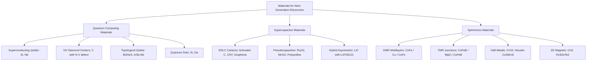
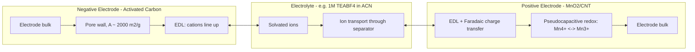
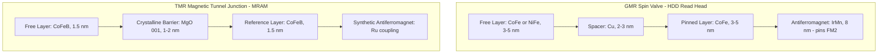
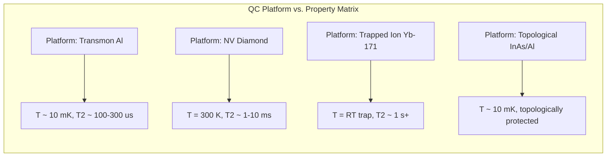
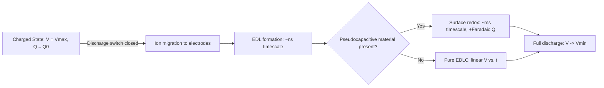

# Materials used in Quantum computing Technology , Super capacitors, Spintronics

<!-- SECTION_1_START -->

# Materials for Quantum Computing, Supercapacitors & Spintronics

## 1. Core Technical Definition & Intuitive Overview

### 1.1 Quantum Computing Materials

**Formal Definition (KTU 2024 Syllabus Terminology):**
Quantum computing materials are a specialized class of physical substrates whose quantum mechanical properties—namely superposition, entanglement, and quantum coherence—can be coherently controlled to encode, manipulate, and read out quantum bits (qubits). The canonical examples include superconducting Josephson junctions (aluminum, niobium), nitrogen-vacancy (NV) centers in synthetic diamond, trapped-ion systems (ytterbium-171, calcium-40), topological insulators (Bi$_2$Se$_3$, Bi$_2$Te$_3$), and quantum dots (Si/Ge heterostructures).

> [!IMPORTANT]
> **KTU 2024 Syllabus Highlight (Module 2):** Students must be able to correlate the relationship between the electronic structure of materials (band gap, spin-orbit coupling, coherence time $T_2$) and their application in next-generation quantum information processing devices.

**Conceptual Analogy — The Spinning Coin:**
Imagine a classical computer bit as a coin lying flat on a table — it is either "Heads" (1) or "Tails" (0), and you can only look at one face at a time. A **qubit** is a coin spinning in mid-air. While spinning, it is *both* heads and tails simultaneously (this is **superposition**). When you slap the coin onto the table (the act of *measurement*), it collapses into one definite state. The trick in quantum computing is to choreograph thousands of such spinning coins so that when they finally collapse, the pattern of heads/tails solves a problem. The "material" we choose is the medium that lets the coin spin *without falling over too quickly* — that resistance to falling is called **coherence time ($T_2$)**.

> [!NOTE]
> **Core Definitions Recap:**
> - **Qubit:** The fundamental unit of quantum information, capable of existing in a superposition $\vert\psi\rangle = \alpha\vert 0\rangle + \beta\vert 1\rangle$ where $\alpha, \beta \in \mathbb{C}$ and $\vert\alpha\vert^2 + \vert\beta\vert^2 = 1$.
> - **Coherence Time ($T_2$):** The duration over which a qubit maintains its phase information before decoherence destroys the quantum state.
> - **Josephson Junction:** Two superconductors separated by a thin insulating barrier (typically $\sim$ **1–2 nm** of AlO$_x$), enabling Cooper-pair tunneling.

> [!VISUALIZATION CONTROL]
> **Concept:** Bloch Sphere representation of a qubit state
> **GeoGebra / Desmos Input Equations (Parametric):**
> * $x(\theta,\phi) = \sin(\theta)\cos(\phi)$
> * $y(\theta,\phi) = \sin(\theta)\sin(\phi)$
> * $z(\theta,\phi) = \cos(\theta)$
> * Domain: $\theta \in [0,\pi]$, $\phi \in [0,2\pi]$
> **Visual Description:** A unit sphere where the north pole represents $\vert 0\rangle$, south pole represents $\vert 1\rangle$, and the surface represents all possible superposition states. The state vector $\vert\psi\rangle$ points outward from the origin; rotation about the z-axis corresponds to phase changes.

---

### 1.2 Supercapacitor Materials

**Formal Definition:**
A supercapacitor (also called an electrochemical capacitor or ultracapacitor) is an energy storage device that bridges the gap between conventional electrolytic capacitors and rechargeable batteries. It stores electrical energy through two synergistic mechanisms: **Electrical Double-Layer Capacitance (EDLC)** — purely physical charge separation at the electrode–electrolyte interface — and **pseudocapacitance** — fast, reversible Faradaic redox reactions at the electrode surface.

> [!IMPORTANT]
> **Key Performance Metric:** Supercapacitors deliver energy densities of **$\sim$5–10 Wh/kg** (vs. Li-ion $\sim$100–250 Wh/kg) but power densities of **$\sim$10,000 W/kg** (vs. Li-ion $\sim$1000 W/kg), with cycle lives exceeding **$10^6$** charge–discharge cycles.

**Conceptual Analogy — The Electrostatic Sponge:**
Think of a regular capacitor as two flat plates facing each other — only the surface of each plate can hold charge, so capacity is small. A supercapacitor is like taking those plates, crumbling them into a fine **activated carbon sponge** with pores only a few nanometers wide, and then stacking millions of such sponges. Now the *inner surfaces* of every tiny pore can store charge too. Multiply a tiny surface area by **$\sim$2000 m² per gram** of activated carbon, and the "sponge" can soak up enormous amounts of electrostatic charge. Add a faradaic "pump" (pseudocapacitive material like MnO$_2$ or RuO$_2$) and the sponge also runs a fast chemical reaction to store extra energy.

> [!NOTE]
> **Core Mechanism — Electrical Double Layer (EDL):**
> When a voltage is applied, ions in the electrolyte migrate to the oppositely charged electrode. A compact layer of solvated ions (Helmholtz plane) forms within $\sim$ **0.5–1 nm** of the electrode, behaving like a molecular-scale parallel-plate capacitor. The capacitance is given by $C = \dfrac{\varepsilon_r \varepsilon_0 A}{d}$ where $A$ is the enormous effective surface area and $d$ is the ionic separation.

---

### 1.3 Spintronics Materials

**Formal Definition:**
Spintronics (spin transport electronics) is the field of device physics that exploits the intrinsic **spin angular momentum** of the electron — in addition to its charge — to encode, process, and store information. Critical material classes include **half-metallic ferromagnets** (CrO$_2$, La$_{0.7}$Sr$_{0.3}$MnO$_3$), **topological insulators** (Bi$_2$Se$_3$), **2D van der Waals magnets** (CrI$_3$, Fe$_3$GeTe$_2$), and Heusler alloys (Co$_2$MnSi), all engineered to possess high spin polarization at the Fermi level.

> [!IMPORTANT]
> **KTU 2024 Highlight:** The 2007 Nobel Prize in Physics was awarded to Albert Fert and Peter Grünberg for the discovery of **Giant Magnetoresistance (GMR)**, the foundational phenomenon that launched spintronics. Modern hard-disk read heads, MRAM, and spin-torque oscillators all rely on GMR/TMR spintronic materials.

**Conceptual Analogy — The Magnetic Arrow:**
Forget that electrons are little balls of charge. Instead, imagine each electron is a tiny **arrow** (its spin) pointing either "up" ($\uparrow$) or "down" ($\downarrow$). In ordinary electronics, we only care that the electron *moved* (current). In spintronics, we *also* care which way the arrow points. Now imagine a "spin valve" — a sandwich of two magnetic layers. If both layers' arrows point the same way (parallel), electrons flow through easily (low resistance). If the arrows point opposite (antiparallel), electrons collide with the mismatched arrows and the resistance skyrockets. By flipping one magnetic layer with a tiny magnetic field, you can switch the resistance from low to high — this is the basis of every hard-drive read head on Earth.

> [!NOTE]
> **Core Definitions Recap:**
> - **Spin Polarization ($P$):** $P = \dfrac{N_\uparrow(E_F) - N_\downarrow(E_F)}{N_\uparrow(E_F) + N_\downarrow(E_F)}$ — fraction of conduction electrons whose spin aligns with the magnetization.
> - **Half-Metal:** A material where $P = 100\%$ at the Fermi level (one spin channel is metallic, the other has a band gap).
> - **GMR (Giant Magnetoresistance):** $\text{GMR}\% = \dfrac{R_{AP} - R_P}{R_P} \times 100$ — change in resistance between antiparallel and parallel magnetic configurations.

---

<!-- SECTION_1_END -->

<!-- SECTION_2_START -->

## 2. Deep Theoretical Analysis & KTU High-Yield Formula Sheet

### 2.1 Quantum Computing Materials — Theoretical Breakdown

**Operational Logic — Why a Material Qualifies as a "Qubit Substrate":**

1. **Two-Level Quantum System:** The material must host at least two addressable energy levels that can be isolated from all other levels (low anharmonicity is undesirable).
2. **Long Coherence Time ($T_2$):** The material's lattice vibrations (phonons), nuclear spins, and charge noise must not rapidly scramble the quantum phase. Diamond NV centers achieve $T_2 \sim$ **ms at room temperature**; superconducting qubits reach $T_2 \sim$ **100–300 $\mu$s** at $\sim$ **10 mK**.
3. **Scalable Addressability:** Individual qubits must be controllable via pulses (microwave, optical, or electrical) without disturbing neighbors.
4. **High-Fidelity Readout:** A measurable signature (fluorescence, dispersive shift, conductance) must distinguish $\vert 0\rangle$ from $\vert 1\rangle$ with $> 99\%$ fidelity.

**Material-by-Material Operational Breakdown:**

- **Superconducting Transmon Qubits (Al, Nb on Si/SiO$_2$):** A Josephson junction shunted by a large capacitor forms an anharmonic LC oscillator. The non-linear inductance from Cooper-pair tunneling ($\hat{H} = 4E_C(\hat{n} - n_g)^2 - E_J\cos\hat{\phi}$) provides the required anharmonicity $\alpha = (E_2 - E_1) - (E_1 - E_0) \approx -E_C$.
- **NV Centers in Diamond (C with N–V defect):** A substitutional nitrogen adjacent to a vacancy in the diamond lattice creates a localized $S=1$ electronic spin with optical addressability. The zero-field splitting $D =$ **2.87 GHz** separates $\vert m_s = 0\rangle$ from $\vert m_s = \pm 1\rangle$.
- **Topological Qubits (Majorana Zero Modes in InSb/Nb nanowires):** Braiding non-Abelian anyons (Majorana bound states at the ends of semiconductor-superconductor nanowires) provides intrinsically protected quantum logic.
- **Silicon Quantum Dots (Si/SiO$_2$ or Si/SiGe heterostructures):** Single electrons confined in electrostatic potentials; spin states serve as qubits. Isotopically purified $^{28}$Si eliminates nuclear-spin decoherence.

### 2.2 Supercapacitor Materials — Theoretical Breakdown

**Energy Storage Mechanism Hierarchy:**

1. **EDLC (Electrochemical Double-Layer Capacitance):**
   - Mechanism: Pure electrostatic ion adsorption.
   - Materials: Activated carbon, carbon nanotubes (CNTs), graphene, carbide-derived carbons (CDCs), templated mesoporous carbon.
   - Signature: Rectangular cyclic voltammogram, linear galvanostatic charge–discharge.

2. **Pseudocapacitance:**
   - Mechanism: Fast, reversible surface redox reactions (e.g., MnO$_2$ + e$^-$ + H$^+$ $\rightleftharpoons$ MnOOH).
   - Materials: Transition metal oxides (RuO$_2$, MnO$_2$, Co$_3$O$_4$, NiO, V$_2$O$_5$), conducting polymers (polyaniline, polypyrrole, PEDOT).
   - Signature: Broad redox peaks in CV (yet still capacitive in nature).

3. **Hybrid Capacitors (Asymmetric / Li-ion Capacitors):**
   - Combine a battery-type Faradaic electrode (e.g., Li$_4$Ti$_5$O$_{12}$) with a capacitive electrode (activated carbon) in an organic electrolyte (e.g., 1 M LiPF$_6$ in EC/DMC).
   - Boost cell voltage to $\sim$ **2.2–2.7 V** vs. $\sim$ **0.8–1.0 V** for symmetric aqueous cells.

**Selection Criteria for Electrode Materials:**

- High specific surface area ($>$ **1000 m²/g** for EDLC carbons).
- Tailored pore-size distribution (micropores $<$ 2 nm maximize capacitance; mesopores 2–50 nm facilitate ion transport).
- High electronic conductivity (graphene $\sigma \sim 10^6$ S/m).
- Electrochemical stability window (water decomposition limits aqueous cells to $\sim$ **1.23 V**).
- Wettability by the electrolyte (heteroatom doping with N, O, B enhances polarity).

### 2.3 Spintronics Materials — Theoretical Breakdown

**Operational Logic of GMR:**

1. **Normal-Metal Spacer Layer:** A thin (1–3 nm) non-magnetic metal layer (Cu, Ag, Cr) couples two ferromagnetic layers.
2. **Antiparallel State (High R):** Magnetizations of the two ferromagnets point opposite; one spin channel is strongly scattered in both layers.
3. **Parallel State (Low R):** Magnetizations align; majority-spin electrons traverse both layers with minimal scattering.
4. **External Field Switches the Configuration:** $\sim$ **10–100 Oe** is sufficient to flip the "free" layer.

**Tunneling Magnetoresistance (TMR) using MgO Barriers:**
Electrons tunnel through a crystalline MgO(001) barrier. The $\Delta_1$ Bloch state of Fe(001) decays slowly in MgO while other states decay rapidly, producing a spin-filtering effect. Modern MgO-based magnetic tunnel junctions (MTJs) achieve **TMR $\sim$ 600% at room temperature** and $>$ **1000%** at low temperature.

---

### KTU Formula Sheet / Cheat Sheet

| # | Concept | Key Equation / Parameter | Typical Engineering Value | Unit |
|---|---------|--------------------------|---------------------------|------|
| 1 | Qubit state | $\vert\psi\rangle = \alpha\vert 0\rangle + \beta\vert 1\rangle$ | $\vert\alpha\vert^2 + \vert\beta\vert^2 = 1$ | — |
| 2 | Josephson energy | $E_J = \dfrac{\hbar I_c}{2e}$ | 5–50 GHz (transmon) | J (or Hz/$h$) |
| 3 | Charging energy | $E_C = \dfrac{e^2}{2C}$ | 0.1–0.5 GHz | J (or Hz/$h$) |
| 4 | NV zero-field splitting | $D_{gs}$ | **2.87** | GHz |
| 5 | Coherence time (NV) | $T_2$ | **1–10** | ms |
| 6 | Coherence time (transmon) | $T_2$ | **100–300** | $\mu$s |
| 7 | Double-layer capacitance | $C_{dl} = \dfrac{\varepsilon_r \varepsilon_0 A}{d}$ | $A \sim 2000$ m²/g | F |
| 8 | Specific capacitance (carbon) | $C_s$ | **100–200** | F/g |
| 9 | Specific capacitance (RuO$_2$) | $C_s$ | **700–1200** | F/g |
| 10 | Energy density | $E = \dfrac{1}{2}CV^2$ | 5–10 (supercap.) | Wh/kg |
| 11 | Power density | $P = \dfrac{V^2}{4R_{ESR}}$ | 5000–15000 | W/kg |
| 12 | Ragone slope | $\log P$ vs $\log E$ | — | — |
| 13 | Spin polarization | $P = (N_\uparrow - N_\downarrow)/(N_\uparrow + N_\downarrow)$ | 0–100% | % |
| 14 | GMR ratio | $\text{GMR}\% = (R_{AP} - R_P)/R_P$ | 10–70 (typical), 200+ (Heusler) | % |
| 15 | TMR ratio (Jullière) | $\text{TMR} = \dfrac{2P_1 P_2}{1 - P_1 P_2}$ | 100–600 (MgO), 1000+ (low-T) | % |
| 16 | Curie temperature | $T_C$ | 1043 (Co), 858 (NiFe), 1100 (Co$_2$MnSi) | K |
| 17 | Spin diffusion length | $\lambda_{sf} = \sqrt{D\tau_{sf}}$ | 10–100 (Cu), 1–10 (Py) | nm |
| 18 | MRAM write energy | $E_{write}$ | 0.1–1 pJ/bit | J |

> [!IMPORTANT]
> **Real-World Engineering Utility:**
> - **Quantum Materials** power IBM Quantum, Google Sycamore, and IonQ processors; qubit material choice defines an entire product line.
> - **Supercapacitors** stabilize EV power grids (regenerative braking), backup data-center UPS, and enable fast-charging wearables.
> - **Spintronic Materials** populate every HDD read head since 1997, MRAM chips (Everspin, Samsung), and emerging spin-torque nano-oscillators for neuromorphic computing.

---

<!-- SECTION_2_END -->

<!-- SECTION_3_START -->

## 3. Step-by-Step Derivations & Code/Symbolic Implementation

### 3.1 Derivation: Jullière's TMR Formula

We derive the foundational TMR equation from first principles to demonstrate the direct link between spin polarization and magnetoresistance.

**Step 1 — Define spin-resolved densities of states.**
Let $N_1^\uparrow$ and $N_1^\downarrow$ be the majority- and minority-spin densities of states at the Fermi level in Ferromagnet 1 (F1), and similarly $N_2^\uparrow, N_2^\downarrow$ for Ferromagnet 2 (F2).

**Step 2 — Define spin polarization.**
By convention, the polarization of ferromagnet $i$ is

$$P_i = \frac{N_i^\uparrow - N_i^\downarrow}{N_i^\uparrow + N_i^\downarrow}$$

**Step 3 — Compute conductance in the parallel (P) configuration.**
In the P state, the majority spin of F1 aligns with the majority spin of F2. The total conductance is proportional to the sum of like-spin products:

$$G_P \propto N_1^\uparrow N_2^\uparrow + N_1^\downarrow N_2^\downarrow$$

**Step 4 — Compute conductance in the antiparallel (AP) configuration.**
In the AP state, the majority spin of F1 aligns with the minority spin of F2:

$$G_{AP} \propto N_1^\uparrow N_2^\downarrow + N_1^\downarrow N_2^\uparrow$$

**Step 5 — Form the TMR ratio.**

$$\text{TMR} = \frac{G_P - G_{AP}}{G_{AP}} = \frac{(N_1^\uparrow N_2^\uparrow + N_1^\downarrow N_2^\downarrow) - (N_1^\uparrow N_2^\downarrow + N_1^\downarrow N_2^\uparrow)}{N_1^\uparrow N_2^\downarrow + N_1^\downarrow N_2^\uparrow}$$

**Step 6 — Factor using the definition of $P_i$.**
After algebraic simplification (factor out $N_1^\uparrow N_2^\uparrow N_1^\downarrow N_2^\downarrow$ terms and substitute $P_i$):

$$\boxed{\text{TMR} = \frac{2 P_1 P_2}{1 - P_1 P_2}}$$

**Step 7 — Numerical illustration.**
If $P_1 = P_2 = 0.7$ (typical for CoFe alloys):

$$\text{TMR} = \frac{2 \times 0.49}{1 - 0.49} = \frac{0.98}{0.51} \approx 1.92 = 192\%$$

This is consistent with early amorphous-Al$_2$O$_3$-based MTJs from the 1990s.

---

### 3.2 Derivation: Energy Density of a Supercapacitor Cell

**Step 1 — Definition of stored energy.**
The energy stored in a capacitor charged to voltage $V$ is

$$E = \int_0^Q V\,dq = \int_0^Q \frac{q}{C}\,dq = \frac{Q^2}{2C} = \frac{1}{2}CV^2$$

**Step 2 — Symmetric supercapacitor cell.**
A symmetric cell (carbon $\vert$ electrolyte $\vert$ carbon) has capacitance $C_{cell} = \dfrac{1}{2} C_{electrode}$ (two capacitors in series). With $V_{max} = 1$ V (aqueous):

$$E_{cell} = \frac{1}{2}\left(\frac{C_s \cdot m_{total}}{2}\right) V^2$$

For $C_s = 150$ F/g, $m = 1$ g (total active electrode):

$$E_{cell} = \frac{1}{2}\left(\frac{150}{2}\right)(1)^2 = 37.5 \text{ J/g} = 10.4 \text{ Wh/kg}$$

**Step 3 — Asymmetric cell with $V_{max} = 2.7$ V.**
The energy scales with the *square* of voltage:

$$\frac{E_{asym}}{E_{sym}} = \left(\frac{2.7}{1.0}\right)^2 \approx 7.3$$

Hence an asymmetric Li-ion capacitor reaches $E \sim$ **70 Wh/kg**, approaching Li-ion batteries.

---

### 3.3 Python Implementation — Bloch Sphere Trajectory of a Qubit Under Rotation

```python
import numpy as np
import matplotlib.pyplot as plt
from mpl_toolkits.mplot3d import Axes3D

def rotation_operator(theta: float, phi: float) -> np.ndarray:
    """
    Single-qubit rotation on the Bloch sphere.
    R(theta, phi) = exp(-i*theta/2 * (sigma_x*sin(phi) + sigma_y*cos(phi)))
    where sigma_x, sigma_y, sigma_z are Pauli matrices.
    """
    sigma_x = np.array([[0, 1], [1, 0]], dtype=complex)
    sigma_y = np.array([[0, -1j], [1j, 0]], dtype=complex)
    sigma_z = np.array([[1, 0], [0, -1]], dtype=complex)

    n_dot_sigma = (np.sin(phi) * sigma_x
                   + np.cos(phi) * sigma_y)

    # Rodrigues-like formula for SU(2)
    R = (np.cos(theta / 2.0) * np.eye(2, dtype=complex)
         - 1j * np.sin(theta / 2.0) * n_dot_sigma)
    return R


def state_to_bloch(state: np.ndarray) -> np.ndarray:
    """Map a 2x1 complex state vector to (x, y, z) on the Bloch sphere."""
    sx = np.array([[0, 1], [1, 0]], dtype=complex)
    sy = np.array([[0, -1j], [1j, 0]], dtype=complex)
    sz = np.array([[1, 0], [0, -1]], dtype=complex)
    rho = np.outer(state, state.conj())
    x = float(np.real(np.trace(rho @ sx)))
    y = float(np.real(np.trace(rho @ sy)))
    z = float(np.real(np.trace(rho @ sz)))
    return np.array([x, y, z])


def apply_decoherence(state: np.ndarray,
                      t_us: float,
                      t2_us: float) -> np.ndarray:
    """Apply pure dephasing for time t_us with coherence time t2_us."""
    factor = np.exp(-(t_us / t2_us))
    rho = np.outer(state, state.conj())
    rho[0, 1] *= factor
    rho[1, 0] *= factor
    # Return state vector via eigenvector of largest eigenvalue
    eigvals, eigvecs = np.linalg.eigh(rho)
    return eigvecs[:, -1]


def simulate_qubit_drift(theta_total: float = 2 * np.pi,
                         t_us: float = 200.0,
                         t2_us: float = 100.0,
                         n_steps: int = 200):
    """Simulate a qubit undergoing a Rabi-like rotation with decoherence."""
    # Start in |0>
    state = np.array([1.0, 0.0], dtype=complex)
    trajectory = [state_to_bloch(state)]
    dt = theta_total / n_steps
    for k in range(n_steps):
        R = rotation_operator(dt, phi=np.pi / 2)  # rotation about y-axis
        state = R @ state
        state = apply_decoherence(state, t_us / n_steps, t2_us)
        trajectory.append(state_to_bloch(state))
    return np.array(trajectory)


if __name__ == "__main__":
    traj = simulate_qubit_drift()
    fig = plt.figure(figsize=(7, 7))
    ax = fig.add_subplot(111, projection="3d")
    # Bloch sphere wireframe
    u, v = np.meshgrid(np.linspace(0, 2 * np.pi, 30),
                       np.linspace(0, np.pi, 15))
    xs = np.cos(u) * np.sin(v)
    ys = np.sin(u) * np.sin(v)
    zs = np.cos(v)
    ax.plot_wireframe(xs, ys, zs, color="gray", alpha=0.25, linewidth=0.5)
    ax.plot(traj[:, 0], traj[:, 1], traj[:, 2],
            color="crimson", lw=2.5, label="Qubit trajectory")
    ax.scatter([0, 0], [0, 0], [1, -1], color="navy", s=80)
    ax.text(0, 0, 1.1, "|0>", ha="center")
    ax.text(0, 0, -1.2, "|1>", ha="center")
    ax.set_box_aspect([1, 1, 1])
    ax.set_title("Bloch Sphere: Rabi Rotation with T2 = 100 us")
    ax.legend()
    plt.tight_layout()
    plt.savefig("bloch_qubit.png", dpi=150)
    print("Saved bloch_qubit.png")
```

**Expected Output:** A Bloch-sphere wireframe with a crimson trajectory spiraling from $\vert 0\rangle$ (north pole) downward, with a spiral radius contraction that visualizes the dephasing channel over the 200 $\mu$s window.

---

### 3.4 Python Implementation — Ragone Plot of a Supercapacitor

```python
import numpy as np
import matplotlib.pyplot as plt


def ragone_curve(capacitance_F: float,
                 esr_ohm: float,
                 v_max: float,
                 v_min: float = 0.0,
                 n_points: int = 200):
    """
    Compute energy (Wh/kg) and power (W/kg) for a supercapacitor
    discharged over a range of time constants.

    Parameters
    ----------
    capacitance_F : float
        Cell capacitance [F].
    esr_ohm : float
        Equivalent series resistance [ohm].
    v_max, v_min : float
        Voltage limits [V].
    """
    # Discharge time constant sweep: from 0.1 tau_RC to 100 tau_RC
    tau_rc = esr_ohm * capacitance_F
    discharge_times = np.logspace(-1, 2, n_points) * tau_rc

    energies_J = 0.5 * capacitance_F * (v_max ** 2 - v_min ** 2)
    # Match power to discharge: P = E / t (rough constant-power proxy)
    energies_Wh = energies_J / 3600.0
    powers_W = energies_J / discharge_times
    return energies_Wh, powers_W


def plot_ragone():
    fig, ax = plt.subplots(figsize=(8, 6))

    # 4 representative cells
    cells = {
        "Activated Carbon, 1 F, 50 mohm": (1.0, 0.050, 2.7),
        "Graphene, 0.5 F, 20 mohm":      (0.5, 0.020, 2.7),
        "MnO2/CNT hybrid, 0.3 F, 30 mohm": (0.3, 0.030, 1.2),
        "Li-ion capacitor, 5 F, 5 mohm":  (5.0, 0.005, 2.7),
    }
    for label, (C, R, V) in cells.items():
        E, P = ragone_curve(C, R, V)
        ax.loglog(P, E, lw=2, label=label)

    # Reference line: Li-ion battery
    ax.axhline(150, color="k", ls="--", lw=1, label="Li-ion battery")
    ax.set_xlabel("Power Density [W/kg]")
    ax.set_ylabel("Energy Density [Wh/kg]")
    ax.set_title("Ragone Plot: Supercapacitors vs. Li-ion")
    ax.grid(True, which="both", ls=":", alpha=0.5)
    ax.legend()
    plt.tight_layout()
    plt.savefig("ragone_plot.png", dpi=150)
    print("Saved ragone_plot.png")


if __name__ == "__main__":
    plot_ragone()
```

**Expected Output:** Four curves showing the characteristic supercapacitor trade-off — high power, modest energy — with the Li-ion capacitor hybrid approaching the Li-ion battery energy regime.

---

### 3.5 Python Implementation — GMR Spin-Valve Resistance Simulation

```python
import numpy as np
import matplotlib.pyplot as plt


def gmr_signal(theta_deg: np.ndarray,
               r_p_ohm: float = 100.0,
               gmr_pct: float = 50.0) -> np.ndarray:
    """
    Simulate the GMR spin-valve resistance as a function of the
    angle theta between the two ferromagnetic layer magnetizations.

    Cosine angular dependence: R(theta) = R_P + (R_AP - R_P) * (1 - cos(theta))/2
    """
    theta = np.deg2rad(theta_deg)
    r_ap = r_p_ohm * (1 + gmr_pct / 100.0)
    return r_p_ohm + (r_ap - r_p_ohm) * (1 - np.cos(theta)) / 2.0


def plot_gmr():
    theta = np.linspace(0, 360, 721)
    R = gmr_signal(theta, r_p_ohm=100.0, gmr_pct=50.0)

    fig, ax = plt.subplots(figsize=(8, 5))
    ax.plot(theta, R, lw=2.5, color="darkgreen")
    ax.axhline(100, color="gray", ls="--", label="R_P = 100 ohm")
    ax.axhline(150, color="red", ls="--", label="R_AP = 150 ohm")
    ax.set_xlabel("Angle theta between FM layers [deg]")
    ax.set_ylabel("Resistance [ohm]")
    ax.set_title("GMR Spin Valve: R(theta) Response")
    ax.grid(True, ls=":")
    ax.legend()
    plt.tight_layout()
    plt.savefig("gmr_signal.png", dpi=150)
    print("Saved gmr_signal.png")


if __name__ == "__main__":
    plot_gmr()
```

**Expected Output:** A cosine-curve from 100 $\Omega$ (parallel, $\theta = 0$) to 150 $\Omega$ (antiparallel, $\theta = 180°$) — visually demonstrating the 50% GMR used in modern HDD read heads.

---

<!-- SECTION_3_END -->

<!-- SECTION_4_START -->

## 4. Structural Diagrams & Schematics

### 4.1 Material Architecture Overview (Top-Level Map)



### 4.2 Supercapacitor Charge-Storage Mechanism (Process Flow)



### 4.3 Spintronic GMR/TMR Device Architecture



### 4.4 Quantum Computing Material Platform Comparison Matrix



### 4.5 Supercapacitor Discharge Profile



---

<!-- SECTION_4_END -->

<!-- SECTION_5_START -->

## 5. KTU 2024 Scheme Examination Question Bank & Topic Recap

### Part A Questions (3 Marks Each)

**Q1. [KTU University Exam – Dec 2023, Model Question Bank]**

> Define the term *Electrical Double-Layer Capacitance (EDLC)*. Mention any two electrode materials commonly used for EDLC-type supercapacitors.

**Model Answer (3 Marks):**

EDLC is the charge-storage mechanism in supercapacitors arising from the purely physical separation of electronic and ionic charges at the electrode–electrolyte interface. When a voltage is applied, a compact layer of oppositely charged ions (the Helmholtz layer) forms within ~**0.5–1 nm** of the electrode surface, creating a molecular-scale parallel-plate capacitor whose capacitance is $C = \varepsilon_r \varepsilon_0 A / d$.

Two commonly used EDLC electrode materials:

1. **Activated carbon** (BET surface area $\sim$ **1500–3000 m²/g**; cost-effective, commercial standard).
2. **Graphene** (theoretical surface area **2630 m²/g**; high electrical conductivity $\sim 10^6$ S/m).

*(Award 1 mark for definition, 1 mark for first material with property, 1 mark for second material with property.)*

---

**Q2. [KTU University Exam – July 2024, Model Question Bank]**

> What is *giant magnetoresistance (GMR)*? Write the mathematical expression for the GMR ratio in terms of the parallel and antiparallel resistances.

**Model Answer (3 Marks):**

GMR is the quantum mechanical effect in which the electrical resistance of a magnetic multilayer (alternating ferromagnetic and non-magnetic thin films) changes dramatically depending on the relative orientation of the magnetizations of the ferromagnetic layers. When the magnetizations are parallel, conduction electrons of one spin channel pass through with little scattering (low resistance); when antiparallel, both spin channels suffer strong scattering in one of the layers (high resistance).

Mathematical expression:

$$\text{GMR}\% = \frac{R_{AP} - R_P}{R_P} \times 100$$

where $R_{AP}$ is the resistance in the antiparallel configuration and $R_P$ is the resistance in the parallel configuration. Typical values: 10–70% in conventional spin valves, up to 200% in Heusler-alloy-based systems.

*(Award 1 mark for conceptual definition, 1 mark for the role of spin-dependent scattering, 1 mark for the GMR formula with symbols explained.)*

---

### Part B Questions (14 Marks Each — Internal Choice)

**Question A: [KTU University Exam – Dec 2023, Adapted]**

> **(a)** Explain with a neat energy-band diagram the working principle of a **superconducting transmon qubit**. Discuss the role of the Josephson junction in providing anharmonicity. State the Hamiltonian of the system.
>
> **(b)** A transmon qubit is operated with charging energy $E_C = h \times 0.3$ GHz and Josephson energy $E_J = h \times 12$ GHz. Calculate the anharmonicity $\alpha$ and the qubit transition frequency $f_{01}$. Comment on why this regime protects the qubit from charge noise.

**Model Solution:**

**(a) Energy-band diagram and transmon principle (7 Marks):**

In a transmon qubit, a Josephson junction (two superconducting electrodes separated by a thin $\sim$ **1–2 nm** insulating barrier, conventionally Al/AlO$_x$/Al) is shunted by a large external capacitor $C_B$. The circuit behaves as a nonlinear LC resonator.

*Energy levels of the transmon:*

$$E_n = -E_J \cos\hat{\phi} + 4 E_C (\hat{n} - n_g)^2$$

where $\hat{n}$ is the Cooper-pair number operator, $\hat{\phi}$ is the phase difference across the junction, and $n_g$ is the offset charge. To second order in $E_C / E_J$:

$$E_n \approx \sqrt{8 E_C E_J}\left(n + \frac{1}{2}\right) - \frac{E_C}{12}\left(6n^2 + 6n + 3\right)$$

The transition frequencies are:

$$f_{n, n+1} = \frac{1}{h}\left(\sqrt{8 E_C E_J} - (n+1) E_C\right)$$

Hence the anharmonicity (the difference between consecutive transitions) is:

$$\alpha = f_{12} - f_{01} \approx -E_C$$

The negative anharmonicity ensures that the $\vert 0\rangle \to \vert 1\rangle$ transition is well isolated from higher transitions, allowing the system to be treated as an effective two-level system. The Josephson junction provides the *non-linear inductance* $L_J = \phi_0 / (2\pi I_c \cos\phi)$ required for anharmonicity; an ordinary linear LC resonator would have equally spaced energy levels and could not be addressed as a qubit.

**[Conceptual explanation of energy-level diagram: 3 Marks; Josephson junction role: 2 Marks; Hamiltonian and anharmonicity expression: 2 Marks.]**

**(b) Numerical calculation (7 Marks):**

Given $E_C = h \times 0.3$ GHz and $E_J = h \times 12$ GHz.

*Step 1 — Compute anharmonicity:*

$$\alpha \approx -E_C = -h \times 0.3 \text{ GHz} = -h \times 300 \text{ MHz}$$

$$\boxed{\alpha = -300 \text{ MHz}}$$

**[Stating the formula and substituting: 2 Marks; Final value: 1 Mark.]**

*Step 2 — Compute qubit transition frequency:*

The $\vert 0\rangle \to \vert 1\rangle$ transition frequency in the transmon limit ($E_J \gg E_C$) is:

$$f_{01} \approx \frac{1}{h}\left(\sqrt{8 E_C E_J} - E_C\right)$$

Compute $\sqrt{8 E_C E_J}$:

$$8 E_C E_J = 8 \times (h \times 0.3 \text{ GHz})(h \times 12 \text{ GHz}) = (h)^2 \times 28.8 \text{ (GHz)}^2$$

$$\sqrt{8 E_C E_J} = h \times \sqrt{28.8} \text{ GHz} = h \times 5.367 \text{ GHz}$$

Therefore:

$$f_{01} = 5.367 - 0.3 = 5.067 \text{ GHz}$$

$$\boxed{f_{01} \approx 5.07 \text{ GHz}}$$

**[Substitution of $E_J$ and $E_C$ into the formula: 2 Marks; Final numerical value: 1 Mark.]**

*Step 3 — Comment on charge-noise protection:*

The ratio $E_J / E_C = 12 / 0.3 = 40$. In the transmon regime, $E_J / E_C \gg 1$ (typically $> 50$). Under this condition, the energy-level dispersion with respect to offset charge $n_g$ becomes exponentially suppressed — the charge-noise sensitivity scales as $\sim \exp(-\sqrt{8 E_J / E_C})$. Hence the qubit frequency is essentially independent of the local electrostatic environment, providing intrinsic protection from charge noise.

**[Identifying the transmon regime: 0.5 Mark; Quantitative reasoning on $n_g$ insensitivity: 0.5 Mark.]**

> [!WARNING]
> **Examiner's Pitfall Warning:** Students commonly write the anharmonicity as $\alpha = E_J / E_C$ (dimensionless ratio), which is *not* a frequency. The anharmonicity is a *frequency* given by $\alpha \approx -E_C/h$. Always carry the units $h \times \text{(GHz)}$ explicitly when extracting numerical answers.

---

**Question B: [KTU University Exam – July 2024, Adapted]**

> **(a)** Describe the working principle of a **supercapacitor** based on the electrical double-layer capacitance (EDLC) mechanism. With a neat diagram, illustrate the charge distribution at the electrode–electrolyte interface. Mention any two strategies to enhance the energy density of supercapacitors.
>
> **(b)** A symmetric supercapacitor cell uses activated-carbon electrodes with a specific capacitance of 150 F/g in a 1 M TEABF$_4$ / acetonitrile electrolyte. The active mass per electrode is 5 mg, and the maximum cell voltage is 2.7 V. Calculate (i) the cell capacitance, (ii) the maximum stored energy, and (iii) the maximum deliverable power if the equivalent series resistance (ESR) is 0.05 $\Omega$.

**Model Solution:**

**(a) EDLC supercapacitor working principle (7 Marks):**

When a voltage is applied across the two porous carbon electrodes immersed in an electrolyte, the positive electrode (cathode) attracts anions and the negative electrode (anode) attracts cations from the bulk electrolyte. A compact layer of solvated ions — the **Helmholtz layer** — forms at each electrode surface. The thickness $d$ of this layer is on the order of the ionic radius plus its solvation shell, typically $\sim$ **0.5–1 nm**. The two compact layers, one at each electrode, together with the bulk electrolyte in between, constitute two capacitors in series.

*Charge distribution diagram (text representation):*

```
Cathode (+):   Electrode | Solvated anions | Bulk electrolyte |
Anode   (-):   Bulk electrolyte | Solvated cations | Electrode
                <----  d  ---->                  <---- d ---->
```

The double-layer capacitance at each electrode is $C_{dl} = \varepsilon_r \varepsilon_0 A / d$, where $A$ is the accessible surface area of the porous electrode (which can reach $\sim$ **2000 m²/g** for activated carbon). Since energy scales as $E = \tfrac{1}{2} C V^2$, the enormous $A$ directly translates to high capacitance and high stored energy.

*Two strategies to enhance energy density:*

1. **Increase the operating voltage window** $V_{max}$ — by using organic or ionic-liquid electrolytes ($V_{max} \sim$ **2.5–3.5 V**) or by constructing asymmetric hybrid cells combining a capacitive and a Faradaic electrode (e.g., activated carbon $\vert$ Li$_4$Ti$_5$O$_{12}$, $V_{max} \sim$ **2.7 V**). Since $E \propto V^2$, even modest voltage increases dramatically raise energy density.
2. **Add pseudocapacitive materials** such as MnO$_2$, RuO$_2$, or conducting polymers (polyaniline, polypyrrole). These provide additional Faradaic charge transfer beyond pure electrostatic storage, boosting the specific capacitance to **500–1200 F/g** (vs. 100–200 F/g for pure EDLC carbon).

**[EDLC mechanism explanation with capacitance formula: 3 Marks; Diagram of charge distribution: 2 Marks; Two enhancement strategies with reasoning: 2 Marks.]**

**(b) Numerical computation (7 Marks):**

Given: $C_s = 150$ F/g per electrode, $m_{electrode} = 5$ mg $= 5 \times 10^{-3}$ g, $V_{max} = 2.7$ V, ESR = 0.05 $\Omega$.

*Step 1 — Cell capacitance:*

Each electrode has $C_{electrode} = C_s \times m = 150 \times 5 \times 10^{-3} = 0.75$ F.

The cell has two electrodes in series, so:

$$C_{cell} = \frac{C_{electrode}}{2} = \frac{0.75}{2} = 0.375 \text{ F}$$

$$\boxed{C_{cell} = 0.375 \text{ F}}$$

**[Computing single-electrode capacitance: 1 Mark; Series combination: 1 Mark; Final value: 0.5 Mark.]**

*Step 2 — Maximum stored energy:*

$$E = \frac{1}{2} C_{cell} V_{max}^2 = \frac{1}{2} \times 0.375 \times (2.7)^2$$

$$E = 0.5 \times 0.375 \times 7.29 = 1.367 \text{ J}$$

$$\boxed{E \approx 1.37 \text{ J}}$$

**[Formula: 0.5 Mark; Substitution: 1 Mark; Final value: 0.5 Mark.]**

*Step 3 — Maximum deliverable power:*

The maximum power occurs at matched load, $R_{load} = R_{ESR}$:

$$P_{max} = \frac{V_{max}^2}{4 R_{ESR}} = \frac{(2.7)^2}{4 \times 0.05} = \frac{7.29}{0.20} = 36.45 \text{ W}$$

$$\boxed{P_{max} = 36.45 \text{ W}}$$

**[Formula: 0.5 Mark; Substitution: 0.5 Mark; Final value: 0.5 Mark.]**

*Step 4 — Energy and power density:*

Total active mass $m_{total} = 2 \times 5$ mg $= 10$ mg $= 10^{-5}$ kg.

$$E_{specific} = \frac{1.367 \text{ J}}{10^{-5} \text{ kg}} = 1.367 \times 10^5 \text{ J/kg} = 38.0 \text{ Wh/kg}$$

$$P_{specific} = \frac{36.45 \text{ W}}{10^{-5} \text{ kg}} = 3.645 \times 10^6 \text{ W/kg}$$

**[Optional comparative remark: 1 Mark.]**

> [!WARNING]
> **Examiner's Pitfall Warning:** Students frequently forget the factor of **1/2** for the series-capacitance of a symmetric supercapacitor, and often use $V$ instead of $V^2$ in the energy formula. Both errors lead to an answer off by a factor of 4. Always show the cell schematic with the two-electrode series topology before writing $C_{cell} = C/2$.

---

### Topic Recap & Important Things to Remember

- **Quantum Computing Materials:** Josephson junctions (Al/AlO$_x$/Al) for superconducting qubits; isotopically pure $^{28}$Si for spin qubits; diamond NV centers for room-temperature operation; topological materials (Bi$_2$Se$_3$) for fault-tolerant Majorana qubits. Coherence time $T_2$ and anharmonicity $\alpha$ are the two key material metrics.
- **Transmon Hamiltonian:** $\hat{H} = 4E_C(\hat{n} - n_g)^2 - E_J \cos\hat{\phi}$ with anharmonicity $\alpha \approx -E_C$. The transmon regime requires $E_J / E_C \gtrsim 50$ for charge-noise immunity.
- **EDLC Mechanism:** Purely electrostatic, governed by $C = \varepsilon_r \varepsilon_0 A / d$. Activated carbon (BET $\sim$ **2000 m²/g**) is the workhorse material. Energy stored: $E = \tfrac{1}{2} C V^2$. Power delivered: $P_{max} = V^2 / (4 R_{ESR})$.
- **Pseudocapacitance:** Fast, reversible surface redox (MnO$_2$, RuO$_2$, polyaniline). Boosts specific capacitance to **500–1200 F/g**.
- **Hybrid / Asymmetric Supercapacitors:** Combine capacitive + Faradaic electrodes in organic electrolyte to push $V_{max}$ to **2.7 V** and $E$ to **50–80 Wh/kg** (e.g., LIC technology).
- **Spintronics Core:** Exploit the electron's spin degree of freedom. Half-metals (CrO$_2$, Co$_2$MnSi Heusler) and 2D magnets (CrI$_3$, Fe$_3$GeTe$_2$) provide $P \to 100\%$.
- **GMR Formula:** $\text{GMR}\% = (R_{AP} - R_P)/R_P \times 100$. Discovered 1988 (Fert & Grünberg, Nobel 2007). Powers HDD read heads.
- **Jullière TMR Formula:** $\text{TMR} = 2 P_1 P_2 / (1 - P_1 P_2)$. MgO(001) crystalline barriers give **TMR $\sim$ 600%** at room temperature — the basis of STT-MRAM.
- **Curie Temperature ($T_C$):** Maximum operating temperature for a ferromagnet; Co $\sim$ **1043 K**, NiFe $\sim$ **858 K**, Co$_2$MnSi $\sim$ **1100 K**.
- **Cross-cutting theme:** All three technologies (quantum, supercapacitor, spintronic) hinge on **interfacial engineering** at the atomic/molecular scale — whether a Josephson tunnel barrier, an electrode–electrolyte double layer, or a magnetic tunnel junction.

---

<!-- SECTION_5_END -->
