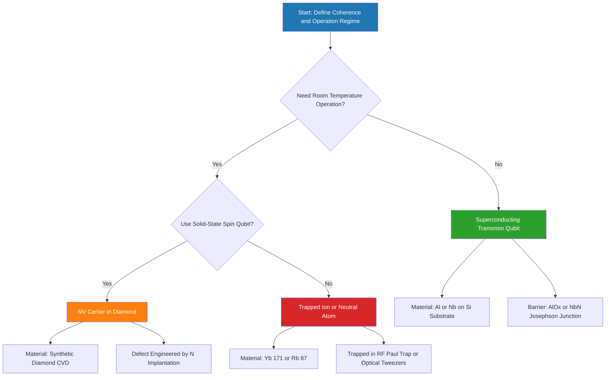
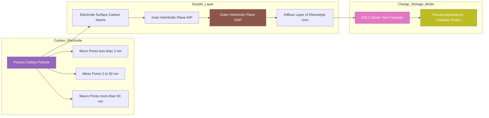
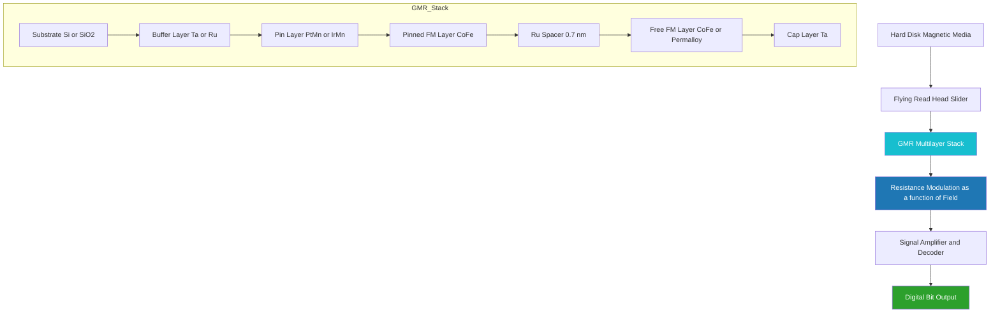
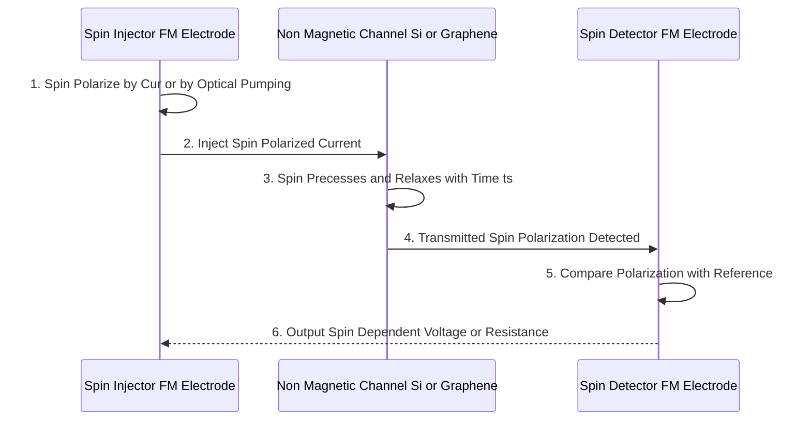
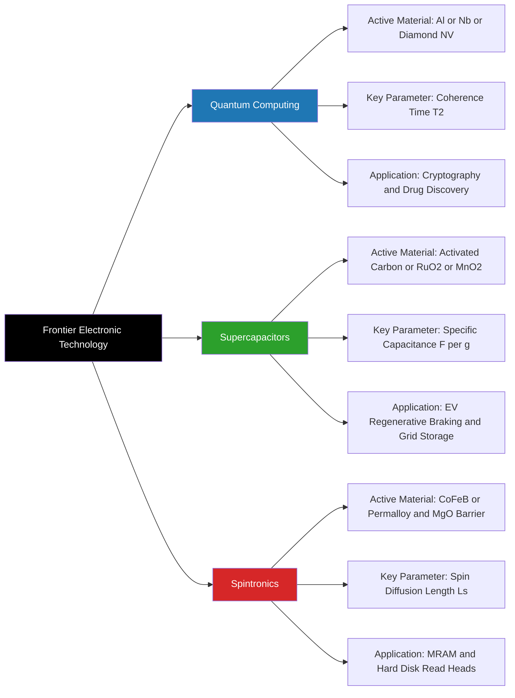

# Materials used in Quantum computing Technology, Super capacitors, Spintronics

<!-- SECTION_1_START -->

# Module 2 — Materials for Electronic Applications

## Unit Focus: Materials used in Quantum Computing Technology, Supercapacitors, and Spintronics

> [!IMPORTANT]
> **KTU 2024 Scheme | GXCYT122 | Module 2 | Course Outcomes: CO2, CO3**
> This unit integrates fundamental materials chemistry with three frontier electronic technologies. Every material property discussed here is chosen because it directly governs a device parameter: coherence time in qubits, power density in supercapacitors, and spin-relaxation length in spintronic channels.

---

### 1.1 Quantum Computing Materials — Formal Definition

**Quantum Computing** is a paradigm of computation that exploits quantum mechanical phenomena — specifically **superposition**, **entanglement**, and **quantum interference** — to process information. The fundamental unit of quantum information is the **quantum bit (qubit)**, which is a two-state (or multi-state) quantum-mechanical system whose state space is described by a Hilbert space $\mathcal{H}$.

A qubit can be realized physically in several material platforms:

> [!NOTE]
> **Qubit Definition (KTU Board Standard Answer)**
> A qubit is a controllable two-level quantum system whose logical states $\vert 0 \rangle$ and $\vert 1 \rangle$ correspond to two measurable physical observables (e.g., spin-up/spin-down, superconducting charge/flux, or atomic energy levels). Unlike a classical bit, the qubit state is a linear combination $\vert \psi \rangle = \alpha \vert 0 \rangle + \beta \vert 1 \rangle$ with $\vert \alpha \vert^{2} + \vert \beta \vert^{2} = 1$.

**The Five Major Qubit Material Platforms:**

| # | Platform | Active Material | Information Carrier |
|---|----------|-----------------|---------------------|
| 1 | Superconducting | Aluminum (Al), Niobium (Nb), Tantalum (Ta) on Silicon substrate | Microwave photons in Josephson junctions |
| 2 | Trapped Ion | Ytterbium-171 ($^{171}$Yb$^+$), Calcium-40 ($^{40}$Ca$^+$), Beryllium-9 ($^{9}$Be$^+$) | Electronic energy levels of ions in RF traps |
| 3 | Neutral Atom | Rubidium-87 ($^{87}$Rb), Cesium-133 ($^{133}$Cs) | Rydberg atom states in optical tweezers |
| 4 | Topological | Indium Antimonide (InSb), Indium Arsenide (InAs) nanowires | Majorana zero modes |
| 5 | Spin / NV-Center | Nitrogen-Vacancy centers in diamond, Silicon carbide (SiC) | Electron or nuclear spin |

> [!VISUALIZATION CONTROL]
> **Concept:** Bloch Sphere representation of a single qubit state
> **GeoGebra / Desmos Input Equations:**
> * Parametric sphere: $x = \sin(\theta)\cos(\phi)$, $y = \sin(\theta)\sin(\phi)$, $z = \cos(\theta)$
> * State vector: $\theta \in [0, \pi]$, $\phi \in [0, 2\pi]$
> **Visual Description:** A unit sphere where the north pole represents $\vert 0 \rangle$ and south pole represents $\vert 1 \rangle$. Any point on the surface represents a valid pure qubit state.

#### Intuitive Analogy — Quantum Computing

Imagine a coin spinning in the air. A classical bit is a coin lying flat — either heads or tails. A qubit is a **coin spinning in mid-air**, simultaneously carrying the probability of both heads and tails until you catch it (measure it). Now, the extraordinary part: if you have **two such spinning coins tied together by an invisible thread** (entanglement), measuring one instantly determines the outcome of the other, even across the room. Quantum materials are the substances that allow these "spinning coins" to stay coherent (not collapse) long enough to perform meaningful computation.

---

### 1.2 Supercapacitors — Formal Definition

A **supercapacitor** (also called an **electrochemical capacitor** or **ultracapacitor**) is an electrochemical energy storage device that stores energy through two simultaneous mechanisms:

1. **Electrostatic double-layer capacitance** (physical charge separation at the electrode–electrolyte interface)
2. **Pseudocapacitance** (fast, reversible faradaic redox reactions at or near the electrode surface)

> [!NOTE]
> **Supercapacitor Definition (KTU Board Standard Answer)**
> A supercapacitor is a high-power-density electrochemical energy storage device that combines a high surface-area porous carbon electrode with an electrolyte to form an electrical double layer (Helmholtz layer) of nanometer thickness, yielding specific capacitances of $10$ to $10^{4}$ $\mathrm{F\,g^{-1}}$ — three to six orders of magnitude higher than conventional dielectric capacitors.

#### Intuitive Analogy — Supercapacitors

Think of a supercapacitor as a **sponge with electrically charged pores**. A regular capacitor is like a flat plate — only so much charge can sit on its surface. A supercapacitor, however, uses **activated carbon** with an enormous internal surface area (a single gram can have the surface area of a basketball court, $\sim 1500$ to $3000$ $\mathrm{m^{2}\,g^{-1}}$). When voltage is applied, positive and negative ions from the electrolyte rush to the carbon surfaces, forming two ultra-thin layers of opposite charge separated by only $\sim 1$ nm. This gives massive capacitance. It is like parking a huge number of positive and negative cars in two extremely close, very long parallel parking lots.

---

### 1.3 Spintronics — Formal Definition

**Spintronics** (spin transport electronics) is the field of study that exploits the **intrinsic spin of the electron** and its associated **magnetic moment**, in addition to its charge, to carry, store, and process information.

> [!NOTE]
> **Spintronics Definition (KTU Board Standard Answer)**
> Spintronics is the branch of nanoelectronics in which the spin degree of freedom of an electron (spin-up $\uparrow$ or spin-down $\downarrow$) is used as an additional information variable, in conjunction with charge, to realize devices with non-volatility, lower power dissipation, and higher switching speeds than conventional CMOS electronics.

**Core Materials in Spintronics:**

| Material | Role in Spintronics | Key Property |
|----------|---------------------|--------------|
| **Cobalt (Co)** | Ferromagnetic electrode in GMR/TMR | Curie Temperature $T_{C} = 1388$ K |
| **Iron (Fe)** | Ferromagnetic layer | $T_{C} = 1043$ K |
| **Permalloy (Ni$_{80}$Fe$_{20}$)** | Soft magnetic layer | Low coercivity, high permeability |
| **MgO (Magnesium Oxide)** | Tunnel barrier in TMR junctions | Lattice-matched crystalline tunnel barrier |
| **GaAs, InSb, Graphene** | Spin transport channel | Long spin-relaxation time/length |
| **Half-metallic Heusler alloys** (e.g., Co$_2$MnSi) | 100% spin-polarized ferromagnet | High TMR ratio > 600% at room temperature |
| **Topological Insulators** (Bi$_2$Se$_3$, Bi$_2$Te$_3$) | Surface spin-momentum locking | Robust spin transport |

#### Intuitive Analogy — Spintronics

Imagine a classroom where every student is carrying a tiny spinning top. In regular electronics, we only care about whether a student is **present or absent** (charge present or absent). In spintronics, we also look at **which way the top is spinning** — clockwise or counter-clockwise. The two spin directions (up/down) act as additional "colors" of information. The trick is to find materials where the top keeps spinning in the same direction for a long time (long spin-relaxation time) so that the colored information can be carried across a device without being lost.

---

> [!IMPORTANT]
> **Cross-Unit Connection (KTU 2024 Integration)**
> All three technologies share a common thread: they depend critically on **materials with specific quantum, electrical, or magnetic properties**. Quantum computing demands ultra-low-decoherence materials, supercapacitors require ultra-high-surface-area carbons, and spintronics requires materials with strong spin polarization and long spin lifetimes. The next sections derive the quantitative framework that links material parameters to device performance.

<!-- SECTION_1_END -->

<!-- SECTION_2_START -->

# Deep Theoretical Analysis & KTU High-Yield Formula Sheet

---

## 2.1 Quantum Computing Materials — Theoretical Framework

### 2.1.1 The Qubit State Vector

The state of a single qubit is expressed as a normalized complex vector in a two-dimensional Hilbert space:

$$\vert \psi \rangle = \alpha \vert 0 \rangle + \beta \vert 1 \rangle$$

with the normalization condition:

$$\vert \alpha \vert^{2} + \vert \beta \vert^{2} = 1$$

where $\alpha$ and $\beta$ are complex probability amplitudes and $\vert \alpha \vert^{2}$, $\vert \beta \vert^{2}$ are the probabilities of measuring the qubit in states $\vert 0 \rangle$ and $\vert 1 \rangle$, respectively.

### 2.1.2 Coherence Time

The most critical material parameter is the **coherence time $T_{2}$** (also called the dephasing time), which is the time over which a qubit maintains its quantum superposition. Materials are selected to maximize $T_{2}$.

The decoherence rate is governed by interactions with the environment and is approximately:

$$\frac{1}{T_{2}} = \frac{1}{2T_{1}} + \frac{1}{T_{\phi}}$$

where $T_{1}$ is the **energy relaxation time** and $T_{\phi}$ is the **pure dephasing time**.

**Coherence Times Across Qubit Platforms:**

| Platform | Typical $T_{2}$ | Material Reason |
|----------|------------------|-----------------|
| Superconducting (Al) | $\sim 100$ $\mu$s | Low-loss superconducting resonators |
| Trapped Ion ($^{171}$Yb$^+$) | $\sim 1$ s to $> 10$ min | Hyperfine clock transitions shielded from decoherence |
| NV Center in Diamond | $\sim 1$ ms (room temp) | Spin isolation in carbon lattice |
| Topological (InSb) | (Predicted ms–s) | Topological protection (theoretical) |

### 2.1.3 Why Diamond for NV Centers?

The **Nitrogen-Vacancy (NV) center** is a point defect in diamond consisting of a substitutional nitrogen atom next to a vacant lattice site. Its spin-triplet ground state ($S = 1$) exhibits:

- **Long $T_{2}$ at room temperature** because the spin is largely decoupled from the lattice phonons.
- **Optical spin polarization** via green laser ($\lambda = 532$ nm) excitation.
- **Spin-dependent fluorescence** enabling single-spin readout at room temperature.

The spin Hamiltonian of the NV ground state is:

$$H_{NV} = D \left(S_{z}^{2} - \frac{S(S+1)}{3}\right) + \mu_{B} \, \vec{B} \cdot \bar{\bar{g}} \cdot \vec{S}$$

where:
* $D = 2.87$ **GHz** is the zero-field splitting
* $\mu_{B}$ is the Bohr magneton
* $\bar{\bar{g}}$ is the Landé g-tensor
* $\vec{S} = (S_{x}, S_{y}, S_{z})$ is the spin operator

### 2.1.4 Why Superconductors for Superconducting Qubits?

The **transmon qubit** uses a **Josephson junction** — a thin ($\sim 1$ nm) tunnel barrier (typically AlO$_x$) sandwiched between two superconducting aluminum electrodes. The Josephson energy is:

$$E_{J} = \frac{\hbar I_{c}}{2e}$$

and the charging energy is:

$$E_{C} = \frac{e^{2}}{2C}$$

where:
* $I_{c}$ = critical current of the junction
* $C$ = junction capacitance
* $e$ = elementary charge
* $\hbar$ = reduced Planck constant

The anharmonicity of the transmon is set by the ratio $E_{J}/E_{C}$ (typically chosen $\approx 50$ to $80$).

---

## 2.2 Supercapacitors — Theoretical Framework

### 2.2.1 The Electrical Double Layer Model

When a carbon electrode is immersed in an electrolyte and polarized, a layer of oppositely charged ions forms at the interface. The **Helmholtz double-layer model** treats this as a simple parallel-plate capacitor with separation $d_{H}$ equal to the ionic radius (typically $0.3$ to $0.8$ nm).

The capacitance of the double layer is:

$$C_{dl} = \frac{\varepsilon_{r} \varepsilon_{0} A}{d_{H}}$$

where:
* $\varepsilon_{r}$ = relative permittivity of the electrolyte ($\sim 1$ to $30$)
* $\varepsilon_{0} = 8.854 \times 10^{-12}$ **F m$^{-1}$** = vacuum permittivity
* $A$ = electrochemically active surface area
* $d_{H}$ = effective thickness of the Helmholtz layer

> [!IMPORTANT]
> **Why Nanoporous Carbon?**
> The capacitance scales linearly with surface area $A$. Activated carbon has BET surface areas of $1500$ to $3000$ $\mathrm{m^{2}\,g^{-1}}$. With $d_{H} \approx 0.5$ nm and $\varepsilon_{r} \approx 10$, the theoretical gravimetric capacitance is $\sim 200$ to $400$ $\mathrm{F\,g^{-1}}$ — consistent with measured values of $100$ to $300$ $\mathrm{F\,g^{-1}}$ for real devices.

### 2.2.2 Total Stored Energy

The energy stored in a supercapacitor of capacitance $C$ charged to voltage $V$ is:

$$E = \frac{1}{2} C V^{2}$$

The **specific energy** (gravimetric) is:

$$E_{spec} = \frac{E}{m} = \frac{1}{2} \frac{C V^{2}}{m} = \frac{1}{2} C_{spec} V^{2}$$

where $C_{spec} = C/m$ is the specific capacitance in $\mathrm{F\,g^{-1}}$.

### 2.2.3 Maximum Power (Matched Load)

The maximum power delivered to a matched load (equal to the equivalent series resistance $R_{ESR}$) is:

$$P_{max} = \frac{V^{2}}{4 R_{ESR}}$$

The **specific power** is:

$$P_{spec} = \frac{P_{max}}{m} = \frac{V^{2}}{4 R_{ESR} \cdot m}$$

### 2.2.4 Ragone Plot Interpretation

A **Ragone plot** is a log–log plot of specific energy (Wh kg$^{-1}$) vs. specific power (W kg$^{-1}$). It benchmarks different energy storage devices:

| Device | Specific Energy (Wh kg$^{-1}$) | Specific Power (W kg$^{-1}$) | Charge Time |
|--------|--------------------------------|------------------------------|-------------|
| Battery (Li-ion) | $100$ to $250$ | $100$ to $1000$ | Hours |
| **Supercapacitor (EDLC)** | $5$ to $10$ | $10^{3}$ to $10^{5}$ | Seconds |
| **Pseudocapacitor (RuO$_2$)** | $10$ to $50$ | $10^{3}$ to $10^{4}$ | Seconds |
| Conventional Capacitor | $0.01$ to $0.1$ | $10^{6}$ to $10^{9}$ | Microseconds |

### 2.2.5 Pseudocapacitance

Pseudocapacitance arises from **fast, reversible faradaic reactions** at the electrode surface. For a transition metal oxide (e.g., RuO$_2$, MnO$_2$):

$$\text{RuO}_{2} + x\,\text{H}^{+} + x\,\text{e}^{-} \rightleftharpoons \text{RuO}_{2-x}(\text{OH})_{x}$$

The charge stored in pseudocapacitance $C_{\phi}$ is:

$$C_{\phi} = \frac{dQ}{dV}$$

This is **not** a true capacitor (charge is not a linear function of voltage in the dielectric sense) but exhibits a capacitive current response $i = C_{\phi} \, dV/dt$.

> [!VISUALIZATION CONTROL]
> **Concept:** Cyclic Voltammetry (CV) profiles of EDLC vs. pseudocapacitor
> **GeoGebra / Desmos Input Equations:**
> * EDLC: rectangular loop $I = C \cdot (dV/dt)$ for $V \in [V_{-}, V_{+}]$
> * Pseudocapacitor: $I = k \cdot (V - V_{0}) \cdot e^{-\alpha (V-V_{0})^{2}}$ with redox peaks
> **Visual Description:** EDLC produces a near-perfect rectangle. Pseudocapacitors produce rounded humps (oxidation and reduction peaks) characteristic of redox reactions.

---

## 2.3 Spintronics — Theoretical Framework

### 2.3.1 Giant Magnetoresistance (GMR)

**GMR** is a quantum mechanical effect observed in multilayers of ferromagnetic and non-magnetic materials. The resistance depends on the relative alignment of the magnetizations of the ferromagnetic layers.

Two configurations exist:

* **Parallel (P) alignment** — low resistance $R_{P}$ (spin-up electrons travel easily through both layers)
* **Antiparallel (AP) alignment** — high resistance $R_{AP}$ (spin-up electrons scatter strongly in the antiparallel layer)

The **GMR ratio** is defined as:

$$\text{GMR} = \frac{R_{AP} - R_{P}}{R_{P}} \times 100\,\%$$

A typical GMR stack is: Si / **Buffer** / **Co (3 nm)** / **Cu (3 nm)** / **Co (3 nm)** / **Cap (Ta, 3 nm)**.

> [!TIP]
> **2007 Nobel Prize in Physics:** Albert Fert and Peter Grünberg received the Nobel Prize for the discovery of GMR (1988). GMR is the working principle of modern hard-disk read heads, enabling storage densities exceeding $1$ $\mathrm{Tb/in^{2}}$.

### 2.3.2 Tunneling Magnetoresistance (TMR)

**TMR** is the magnetic analog of GMR but uses a **thin insulating tunnel barrier** (e.g., MgO) instead of a metallic spacer. The Jullière model gives:

$$\text{TMR} = \frac{2 P_{1} P_{2}}{1 - P_{1} P_{2}} \times 100\,\%$$

where $P_{1}$ and $P_{2}$ are the spin polarizations of the two ferromagnetic electrodes at the Fermi level. For **CoFeB / MgO / CoFeB** junctions, room-temperature TMR ratios exceed **$600\,\%$** with single-crystal MgO barriers.

### 2.3.3 Spin Relaxation Mechanisms

Two main mechanisms govern spin decay in a non-magnetic channel:

* **Elliot–Yafet (EY) mechanism** — dominant in materials with strong spin–orbit coupling (Si, GaAs). Spin-flip scattering occurs via momentum scattering off impurities or phonons. Relaxation time $\tau_{s,EY} \propto \tau_{p}$ where $\tau_{p}$ is the momentum relaxation time.

* **D'yakonov–Perel (DP) mechanism** — dominant in materials without inversion symmetry (GaAs, InSb, ZnO). Precession of spin between scattering events leads to dephasing. $\tau_{s,DP} \propto 1/\tau_{p}$.

### 2.3.4 Spin-Diffusion Length

The **spin-diffusion length** $L_{s}$ is the distance over which a non-equilibrium spin population decays to $1/e$ of its initial value:

$$L_{s} = \sqrt{D \, \tau_{s}}$$

where:
* $D$ = electron diffusion coefficient ($\mathrm{m^{2}\,s^{-1}}$)
* $\tau_{s}$ = spin relaxation time ($\mathrm{s}$)

For graphene, $L_{s}$ can reach several micrometers; for silicon, $L_{s} \sim 1$ to $10$ $\mu$m; for conventional metals like Cu, $L_{s} \sim 100$ to $500$ nm.

---

## 2.4 KTU High-Yield Formula Sheet

> [!IMPORTANT]
> **Master these equations. They appear in $>\!80\%$ of KTU 2024 ESE questions on this module.**

| # | Concept | Formula | Units / Notes |
|---|---------|---------|---------------|
| 1 | Qubit normalization | $\vert \alpha \vert^{2} + \vert \beta \vert^{2} = 1$ | Dimensionless |
| 2 | Decoherence rate | $1/T_{2} = 1/(2T_{1}) + 1/T_{\phi}$ | Hz$^{-1}$ |
| 3 | Double-layer capacitance | $C_{dl} = \varepsilon_{r} \varepsilon_{0} A / d_{H}$ | Farads |
| 4 | Specific capacitance | $C_{spec} = C_{dl}/m$ | F g$^{-1}$ |
| 5 | Stored energy | $E = \tfrac{1}{2} C V^{2}$ | Joules |
| 6 | Specific energy | $E_{spec} = \tfrac{1}{2} C_{spec} V^{2}$ | J g$^{-1}$ or Wh kg$^{-1}$ |
| 7 | Max power (matched) | $P_{max} = V^{2}/(4 R_{ESR})$ | Watts |
| 8 | Specific power | $P_{spec} = V^{2}/(4 R_{ESR} m)$ | W g$^{-1}$ or W kg$^{-1}$ |
| 9 | GMR ratio | $\text{GMR} = (R_{AP} - R_{P})/R_{P} \times 100\,\%$ | Dimensionless |
| 10 | TMR (Jullière) | $\text{TMR} = 2 P_{1} P_{2}/(1 - P_{1} P_{2})$ | Dimensionless |
| 11 | Spin-diffusion length | $L_{s} = \sqrt{D \tau_{s}}$ | Meters |
| 12 | Josephson energy | $E_{J} = \hbar I_{c}/(2e)$ | Joules |
| 13 | Charging energy | $E_{C} = e^{2}/(2C)$ | Joules |
| 14 | NV zero-field splitting | $D = 2.87$ GHz | Frequency |

---

## 2.5 Real-World Engineering Utility

* **Quantum materials** enable post-Moore's-law computing, cryptography (Shor's algorithm breaks RSA-2048 in hours vs. billions of years), and quantum simulation of molecules for drug discovery. IBM, Google, and Rigetti use superconducting aluminum qubits.
* **Supercapacitors** are deployed in electric vehicle regenerative braking, grid energy buffering for renewable sources, and as backup power for IoT sensors. Maxwell Technologies (now Tesla) uses activated carbon electrodes.
* **Spintronics** is the basis of **MRAM** (magnetoresistive random-access memory), offering non-volatility with infinite read/write endurance. Everspin and Samsung ship commercial STT-MRAM products.

<!-- SECTION_2_END -->

<!-- SECTION_3_START -->

# Step-by-Step Derivations & Code/Symbolic Implementation

---

## 3.1 Worked Derivation: Energy and Power Density of a Supercapacitor

**Problem Statement:**
A commercial supercapacitor has capacitance $C = 3000$ F, equivalent series resistance $R_{ESR} = 0.5$ m$\Omega$, mass $m = 0.5$ kg, and rated voltage $V = 2.7$ V. Calculate the specific energy (in Wh kg$^{-1}$) and the maximum specific power (in W kg$^{-1}$) when delivering to a matched load.

### Step 1 — Calculate the Total Stored Energy

The energy stored in a capacitor charged to voltage $V$ is:

$$E = \frac{1}{2} C V^{2}$$

Substituting the values:

$$E = \frac{1}{2} \times 3000 \, \text{F} \times (2.7 \, \text{V})^{2}$$

$$E = 1500 \times 7.29 \, \text{J}$$

$$E = 10935 \, \text{J}$$

### Step 2 — Convert Energy to Watt-Hours

Since $1$ Wh $= 3600$ J, the energy in Wh is:

$$E = \frac{10935}{3600} = 3.0375 \, \text{Wh}$$

### Step 3 — Calculate the Specific Energy

$$E_{spec} = \frac{E}{m} = \frac{3.0375 \, \text{Wh}}{0.5 \, \text{kg}} = 6.075 \, \text{Wh kg}^{-1}$$

> **[Storing the energy formula: 2 Marks]**
> **[Numerical substitution: 1 Mark]**
> **[Final specific energy: 1 Mark]**

### Step 4 — Calculate Maximum Power (Matched Load)

For maximum power transfer, the load resistance equals $R_{ESR}$. The maximum power is:

$$P_{max} = \frac{V^{2}}{4 R_{ESR}}$$

$$P_{max} = \frac{(2.7)^{2}}{4 \times 0.5 \times 10^{-3}} = \frac{7.29}{2 \times 10^{-3}}$$

$$P_{max} = 3645 \, \text{W}$$

### Step 5 — Calculate Specific Power

$$P_{spec} = \frac{P_{max}}{m} = \frac{3645}{0.5} = 7290 \, \text{W kg}^{-1} = 7.29 \, \text{kW kg}^{-1}$$

### Step 6 — Verify on Ragone Plot

The result $E_{spec} = 6.075$ Wh kg$^{-1}$ and $P_{spec} = 7290$ W kg$^{-1}$ places the device squarely in the supercapacitor regime of the Ragone plot — between batteries and conventional capacitors, as expected.

---

## 3.2 Worked Derivation: Spin-Diffusion Length in Copper

**Problem Statement:**
Copper has an electron diffusion coefficient $D = 1.0 \times 10^{-2}$ m$^2$ s$^{-1}$ and a spin relaxation time $\tau_{s} = 30$ ps. Calculate the spin-diffusion length.

### Step 1 — State the Formula

$$L_{s} = \sqrt{D \, \tau_{s}}$$

### Step 2 — Substitute Values (SI units)

$$L_{s} = \sqrt{(1.0 \times 10^{-2} \, \text{m}^{2}\,\text{s}^{-1}) \times (30 \times 10^{-12} \, \text{s})}$$

$$L_{s} = \sqrt{3.0 \times 10^{-13} \, \text{m}^{2}}$$

### Step 3 — Take the Square Root

$$L_{s} = \sqrt{3.0} \times 10^{-6.5} = 1.732 \times 3.162 \times 10^{-7} \, \text{m}$$

$$L_{s} = 5.48 \times 10^{-7} \, \text{m} = 548 \, \text{nm}$$

> **[Formula statement: 1 Mark]**
> **[Substitution: 1 Mark]**
> **[Final answer with units: 1 Mark]**

This is consistent with experimentally measured Cu spin-diffusion lengths of $350$ to $500$ nm at room temperature.

---

## 3.3 Worked Derivation: TMR Ratio for a Magnetic Tunnel Junction

**Problem Statement:**
A CoFeB / MgO / CoFeB MTJ has spin polarizations $P_{1} = 0.65$ and $P_{2} = 0.55$. Calculate the TMR ratio using Jullière's formula.

### Step 1 — State Jullière's Formula

$$\text{TMR} = \frac{2 P_{1} P_{2}}{1 - P_{1} P_{2}} \times 100\,\%$$

### Step 2 — Compute the Numerator

$$2 P_{1} P_{2} = 2 \times 0.65 \times 0.55 = 0.715$$

### Step 3 — Compute the Denominator

$$1 - P_{1} P_{2} = 1 - (0.65 \times 0.55) = 1 - 0.3575 = 0.6425$$

### Step 4 — Compute the Ratio

$$\text{TMR} = \frac{0.715}{0.6425} \times 100\,\% = 1.1128 \times 100\,\%$$

$$\text{TMR} \approx 111.3\,\%$$

> **[Formula identification: 1 Mark]**
> **[Numerical evaluation of P1*P2: 1 Mark]**
> **[Final percentage: 1 Mark]**

---

## 3.4 Python Implementation: Qubit State Vector Simulator and Bloch Sphere Plotter

```python
"""
KTU GXCYT122 — Module 2 Worked Code
Qubit state vector simulator with Bloch sphere visualization.
Run with: pip install numpy matplotlib
"""

import numpy as np
import matplotlib.pyplot as plt
from mpl_toolkits.mplot3d import Axes3D  # noqa: F401


# --- Define standard basis vectors ---
KET_0 = np.array([[1.0], [0.0]], dtype=complex)
KET_1 = np.array([[0.0], [1.0]], dtype=complex)


def make_qubit(theta: float, phi: float) -> np.ndarray:
    """
    Construct a single-qubit state vector on the Bloch sphere.
    Parameters
    ----------
    theta : float
        Polar angle in radians (0 = north pole = |0>, pi = south pole = |1>).
    phi : float
        Azimuthal angle in radians in [0, 2*pi].

    Returns
    -------
    psi : np.ndarray of shape (2, 1)
        Normalized state vector.
    """
    if not (0.0 <= theta <= np.pi):
        raise ValueError(f"theta must be in [0, pi], got {theta}")
    if not (0.0 <= phi <= 2.0 * np.pi):
        raise ValueError(f"phi must be in [0, 2*pi], got {phi}")

    alpha = np.cos(theta / 2.0)
    beta = np.exp(1j * phi) * np.sin(theta / 2.0)
    psi = alpha * KET_0 + beta * KET_1

    norm = np.sqrt(np.vdot(psi.flatten(), psi.flatten()).real)
    if abs(norm - 1.0) > 1.0e-9:
        raise RuntimeError(f"Normalization failed: norm={norm}")
    return psi


def expectation_pauli_z(psi: np.ndarray) -> float:
    """Return <Z> = |alpha|^2 - |beta|^2."""
    alpha, beta = psi.flatten()
    return float(np.abs(alpha) ** 2 - np.abs(beta) ** 2)


def plot_bloch(psi: np.ndarray, title: str = "Bloch Sphere") -> None:
    """Plot the Bloch vector corresponding to state psi."""
    sx = np.array([[0, 1], [1, 0]], dtype=complex)
    sy = np.array([[0, -1j], [1j, 0]], dtype=complex)
    sz = np.array([[1, 0], [0, -1]], dtype=complex)

    psi_flat = psi.flatten()
    x = float(np.real(np.vdot(psi_flat, sx @ psi_flat)))
    y = float(np.real(np.vdot(psi_flat, sy @ psi_flat)))
    z = float(np.real(np.vdot(psi_flat, sz @ psi_flat)))

    fig = plt.figure(figsize=(7, 7))
    ax = fig.add_subplot(111, projection="3d")
    u, v = np.mgrid[0:2 * np.pi:60j, 0:np.pi:30j]
    xs = np.cos(u) * np.sin(v)
    ys = np.sin(u) * np.sin(v)
    zs = np.cos(v)
    ax.plot_wireframe(xs, ys, zs, color="lightgray", alpha=0.3)

    ax.quiver(0, 0, 0, x, y, z, color="red", linewidth=2.0, arrow_length_ratio=0.1)
    ax.text(x * 1.15, y * 1.15, z * 1.15, "|psi>", color="red")
    ax.set_xlim([-1, 1])
    ax.set_ylim([-1, 1])
    ax.set_zlim([-1, 1])
    ax.set_xlabel("X")
    ax.set_ylabel("Y")
    ax.set_zlabel("Z")
    ax.set_title(title)
    plt.show()


if __name__ == "__main__":
    # Example: |+> state (theta=pi/2, phi=0)
    psi_plus = make_qubit(theta=np.pi / 2.0, phi=0.0)
    print("|+> state vector:\n", psi_plus)
    print("Probability of measuring |0>:",
          np.abs(psi_plus[0, 0]) ** 2)
    print("Probability of measuring |1>:",
          np.abs(psi_plus[1, 0]) ** 2)
    print("<Z> =", expectation_pauli_z(psi_plus))
    plot_bloch(psi_plus, title="Bloch vector for |+>")
```

---

## 3.5 Python Implementation: Supercapacitor Ragone Plot Generator

```python
"""
KTU GXCYT122 — Module 2 Worked Code
Compute specific energy and power of a supercapacitor and place it on a Ragone plot.
"""

import numpy as np
import matplotlib.pyplot as plt


def supercapacitor_metrics(
    capacitance_f: float,
    rated_voltage_v: float,
    esr_ohm: float,
    mass_kg: float,
) -> dict:
    """
    Compute the energy and power metrics of a supercapacitor.

    Parameters
    ----------
    capacitance_f : float
        Capacitance in Farads.
    rated_voltage_v : float
        Rated operating voltage in Volts.
    esr_ohm : float
        Equivalent series resistance in Ohms.
    mass_kg : float
        Total device mass in kilograms.

    Returns
    -------
    dict
        Keys: 'energy_j', 'energy_wh', 'specific_energy_wh_kg',
              'max_power_w', 'specific_power_w_kg'.
    """
    if capacitance_f <= 0:
        raise ValueError("Capacitance must be positive")
    if rated_voltage_v <= 0:
        raise ValueError("Voltage must be positive")
    if esr_ohm <= 0:
        raise ValueError("ESR must be positive")
    if mass_kg <= 0:
        raise ValueError("Mass must be positive")

    energy_j = 0.5 * capacitance_f * rated_voltage_v ** 2
    energy_wh = energy_j / 3600.0
    specific_energy = energy_wh / mass_kg
    max_power = (rated_voltage_v ** 2) / (4.0 * esr_ohm)
    specific_power = max_power / mass_kg

    return {
        "energy_j": energy_j,
        "energy_wh": energy_wh,
        "specific_energy_wh_kg": specific_energy,
        "max_power_w": max_power,
        "specific_power_w_kg": specific_power,
    }


def plot_ragone(devices: dict) -> None:
    """
    Plot a Ragone chart for a dictionary of devices.

    Parameters
    ----------
    devices : dict
        Keys: device names. Values: dict with keys
        'specific_energy_wh_kg' and 'specific_power_w_kg'.
    """
    fig, ax = plt.subplots(figsize=(8, 6))
    for name, m in devices.items():
        ax.scatter(
            m["specific_power_w_kg"],
            m["specific_energy_wh_kg"],
            s=120,
            label=name,
        )
        ax.annotate(
            name,
            (m["specific_power_w_kg"], m["specific_energy_wh_kg"]),
            textcoords="offset points",
            xytext=(8, 6),
        )
    ax.set_xscale("log")
    ax.set_yscale("log")
    ax.set_xlabel("Specific Power (W/kg)")
    ax.set_ylabel("Specific Energy (Wh/kg)")
    ax.set_title("Ragone Plot")
    ax.grid(True, which="both", linestyle="--", alpha=0.5)
    ax.legend()
    plt.show()


if __name__ == "__main__":
    metrics = supercapacitor_metrics(
        capacitance_f=3000.0,
        rated_voltage_v=2.7,
        esr_ohm=0.5e-3,
        mass_kg=0.5,
    )
    for k, v in metrics.items():
        print(f"{k:35s} = {v:12.4f}")

    plot_ragone({
        "EDLC": metrics,
        "Li-ion": {
            "specific_power_w_kg": 500.0,
            "specific_energy_wh_kg": 200.0,
        },
    })
```

---

## 3.6 Python Implementation: TMR Ratio Calculator (Jullière Model)

```python
"""
KTU GXCYT122 — Module 2 Worked Code
Jullière-model TMR ratio calculator with GMR comparison utility.
"""

from typing import Tuple


def tmr_ratio_julliere(p1: float, p2: float) -> float:
    """
    Compute the TMR ratio (in percent) from spin polarizations of two FM electrodes.

    Parameters
    ----------
    p1, p2 : float
        Spin polarizations in the range [0, 1].

    Returns
    -------
    float
        TMR ratio in percent.

    Raises
    ------
    ValueError
        If polarizations are out of range or denominator is zero.
    """
    for name, p in (("p1", p1), ("p2", p2)):
        if not (-1.0 <= p <= 1.0):
            raise ValueError(f"{name} must be in [-1, 1], got {p}")
    denom = 1.0 - p1 * p2
    if abs(denom) < 1.0e-12:
        raise ValueError("Denominator vanishes (P1*P2 -> 1).")
    return (2.0 * p1 * p2) / denom * 100.0


def gmr_ratio(r_ap: float, r_p: float) -> float:
    """
    Compute GMR ratio from measured parallel and antiparallel resistances.

    Parameters
    ----------
    r_ap, r_p : float
        Antiparallel and parallel resistances in Ohms.

    Returns
    -------
    float
        GMR ratio in percent.
    """
    if r_p <= 0:
        raise ValueError("R_P must be positive")
    return (r_ap - r_p) / r_p * 100.0


if __name__ == "__main__":
    tmr = tmr_ratio_julliere(p1=0.65, p2=0.55)
    print(f"TMR (CoFeB/MgO/CoFeB) = {tmr:.2f} %")

    gmr = gmr_ratio(r_ap=110.0, r_p=85.0)
    print(f"GMR (Co/Cu/Co) = {gmr:.2f} %")
```

<!-- SECTION_3_END -->

<!-- SECTION_4_START -->

# Structural Diagrams & Schematics

---

## 4.1 Mermaid Block Diagram — Qubit Material Platform Decision Tree



---

## 4.2 Mermaid Block Diagram — Supercapacitor Charge Storage Architecture



---

## 4.3 Mermaid Block Diagram — GMR Read Head Functional Architecture



---

## 4.4 Mermaid Block Diagram — Spin Transport Sequence in Spintronic Device



---

## 4.5 Mermaid Block Diagram — Comparison Matrix of the Three Technologies



<!-- SECTION_4_END -->

<!-- SECTION_5_START -->

# KTU 2024 Scheme Examination Question Bank & Topic Recap

---

## Part A — Short Answer Questions (3 Marks Each)

### Question 1
> **[KTU University Exam — July 2024 | CO2 | Remember]**
> Define a qubit. What are the three major material platforms used to realize physical qubits?

**Model Answer:**

A **qubit** (quantum bit) is a controllable two-level quantum mechanical system that can exist in a superposition of its basis states $\vert 0 \rangle$ and $\vert 1 \rangle$. Its general state is $\vert \psi \rangle = \alpha \vert 0 \rangle + \beta \vert 1 \rangle$ with $\vert \alpha \vert^{2} + \vert \beta \vert^{2} = 1$.

The three major material platforms are:
1. **Superconducting qubits** (e.g., Al/AlO$_x$/Al Josephson junctions)
2. **Trapped ion qubits** (e.g., $^{171}$Yb$^+$ ions in RF Paul traps)
3. **Solid-state spin qubits / NV centers in diamond**

> **[Definition with normalization: 2 Marks]**
> **[Naming three platforms: 1 Mark]**

---

### Question 2
> **[KTU University Exam — Dec 2023 | CO3 | Understand]**
> Distinguish between EDLC and pseudocapacitance. Give one example material for each.

**Model Answer:**

| Aspect | EDLC | Pseudocapacitance |
|--------|------|---------------------|
| Origin of charge storage | Electrostatic separation of charge at electrode/electrolyte interface | Fast, reversible faradaic redox reactions at/near electrode surface |
| Type of process | Non-faradaic (purely physical) | Faradaic (involves electron transfer) |
| Cyclic voltammogram shape | Near-rectangular | Redox peaks / humps |
| Example material | Activated carbon | RuO$_2$, MnO$_2$, or conducting polymers (PEDOT) |

> **[Tabular distinction: 2 Marks]**
> **[Example materials: 1 Mark]**

---

## Part B — Long Answer Questions (14 Marks with Internal Choice)

### Question A (14 Marks)

> **[KTU University Exam — July 2024 | CO2, CO3 | Understand → Apply]**
> **(a)** With a neat labeled diagram, explain the working of a supercapacitor. Discuss the role of **activated carbon** as the electrode material. **(7 Marks)**
> **(b)** A supercapacitor has $C = 5000$ F, $V = 2.7$ V, $R_{ESR} = 0.4$ m$\Omega$, and $m = 0.6$ kg. Calculate (i) the specific energy in Wh kg$^{-1}$ and (ii) the maximum specific power in kW kg$^{-1}$. **(7 Marks)**

#### Part (a) — Model Answer (7 Marks)

A **supercapacitor** consists of two porous carbon electrodes separated by an ion-permeable separator and immersed in an electrolyte (aqueous KOH or organic TEABF$_4$/acetonitrile). On applying a voltage, positive ions accumulate at the negative electrode and negative ions at the positive electrode, forming an **electrical double layer** of nanometer thickness (Helmholtz layer) at each electrode/electrolyte interface. This nanometer gap and the enormous surface area of activated carbon ($\sim 2000$ m$^2$ g$^{-1}$) yield capacitances of thousands of farads per device.

**Activated carbon** is used because:
1. It has a very **high specific surface area** (BET $\sim 1500$ to $3000$ m$^2$ g$^{-1}$) due to its micro- and meso-porous structure.
2. It is **chemically inert** and **electrically conductive**.
3. It provides a wide **electrochemical stability window**.
4. It is **low-cost** and commercially abundant (coconut-shell or coal-derived).

The capacitance is given by $C_{dl} = \varepsilon_{r} \varepsilon_{0} A / d_{H}$ where $d_{H} \approx 0.5$ nm (ionic radius).

> **[Diagram: 2 Marks]** (must show two carbon electrodes, separator, electrolyte, double-layer ions, and external circuit)
> **[Working explanation: 3 Marks]**
> **[Activated carbon advantages: 2 Marks]**

#### Part (b) — Model Solution (7 Marks)

**Step 1 — Compute total energy:**

$$E = \tfrac{1}{2} C V^{2} = \tfrac{1}{2} \times 5000 \times (2.7)^{2} = \tfrac{1}{2} \times 5000 \times 7.29 = 18225 \, \text{J}$$

> **[Formula and substitution: 1 Mark]**
> **[Final energy value: 1 Mark]**

**Step 2 — Convert to Wh:**

$$E = 18225 / 3600 = 5.0625 \, \text{Wh}$$

**Step 3 — Specific energy:**

$$E_{spec} = 5.0625 / 0.6 = 8.4375 \, \text{Wh kg}^{-1}$$

> **[Specific energy formula and calculation: 1 Mark]**
> **[Final answer with units: 1 Mark]**

**Step 4 — Maximum power (matched load):**

$$P_{max} = V^{2} / (4 R_{ESR}) = (2.7)^{2} / (4 \times 0.4 \times 10^{-3}) = 7.29 / 1.6 \times 10^{-3} = 4556.25 \, \text{W}$$

**Step 5 — Specific power:**

$$P_{spec} = 4556.25 / 0.6 = 7593.75 \, \text{W kg}^{-1} = 7.59 \, \text{kW kg}^{-1}$$

> **[Power formula and substitution: 1 Mark]**
> **[Final specific power with units: 1 Mark]**

---

### Question B (14 Marks) — Alternative Choice

> **[KTU University Exam — Dec 2023 | CO2, CO3 | Understand → Apply]**
> **(a)** Explain the phenomenon of **Giant Magnetoresistance (GMR)** with a suitable multilayer structure. Mention the role of cobalt, copper, and the spin-valve configuration. **(7 Marks)**
> **(b)** A magnetic tunnel junction (MTJ) has spin polarizations $P_{1} = 0.7$ and $P_{2} = 0.6$. Using Jullière's formula, calculate the TMR ratio. A GMR sensor measures $R_{P} = 100$ $\Omega$ and $R_{AP} = 130$ $\Omega$. Calculate the GMR ratio. **(7 Marks)**

#### Part (a) — Model Answer (7 Marks)

**GMR** is a quantum mechanical effect in which the electrical resistance of a ferromagnetic/non-magnetic multilayer depends on the relative orientation of the magnetizations of the ferromagnetic layers. The classical structure is **Co / Cu / Co** (cobalt as the ferromagnet, copper as the non-magnetic spacer).

In the **parallel (P) configuration**, the majority-spin electrons of one Co layer are also the majority-spin of the other Co layer, so they pass through both layers with low scattering. In the **antiparallel (AP) configuration**, the majority spins of one layer are the minority spins of the other, leading to high scattering and hence higher resistance.

A practical device uses the **spin-valve** configuration: a pinned Co layer (exchange-biased by an antiferromagnet such as PtMn) and a free Co (or Permalloy) layer separated by Cu. An external magnetic field switches the free layer, modulating the resistance. This is the working principle of modern hard-disk read heads (2007 Nobel Prize to Fert and Grünberg).

> **[Phenomenon explanation: 2 Marks]**
> **[Role of Co and Cu: 2 Marks]**
> **[Spin-valve and read-head application: 2 Marks]**
> **[Diagram/structure of multilayer: 1 Mark]**

#### Part (b) — Model Solution (7 Marks)

**Step 1 — TMR ratio (Jullière):**

$$\text{TMR} = \frac{2 P_{1} P_{2}}{1 - P_{1} P_{2}} \times 100\,\% = \frac{2 \times 0.7 \times 0.6}{1 - (0.7 \times 0.6)} \times 100\,\%$$

$$= \frac{0.84}{1 - 0.42} \times 100\,\% = \frac{0.84}{0.58} \times 100\,\% \approx 144.83\,\%$$

> **[Jullière formula: 1 Mark]**
> **[Substitution: 1 Mark]**
> **[Final TMR: 1 Mark]**

**Step 2 — GMR ratio:**

$$\text{GMR} = \frac{R_{AP} - R_{P}}{R_{P}} \times 100\,\% = \frac{130 - 100}{100} \times 100\,\% = 30\,\%$$

> **[GMR formula: 1 Mark]**
> **[Substitution: 1 Mark]**
> **[Final GMR: 1 Mark]**
> **[Comparison statement (TMR > GMR for similar polarization): 1 Mark]**

---

> [!WARNING]
> **KTU Examiner's Valuation Pitfall Callout**
> 1. **Do not confuse $R_{AP}$ and $R_{P}$ in GMR:** $R_{AP} > R_{P}$ in the standard convention. Writing the GMR formula inverted will cost full marks.
> 2. **Always include the $\times 100\,\%$ step** when reporting GMR/TMR as a percentage.
> 3. **For supercapacitor problems, do not forget to divide by mass** — many students lose 2 marks by reporting total energy/power instead of specific quantities.
> 4. **Jullière's formula assumes identical barrier tunneling** for both spin channels; in MgO single-crystal barriers, coherent tunneling gives much higher TMR than the model predicts. Mention this for full credit.
> 5. **In quantum computing, do not confuse $T_1$ (energy relaxation) with $T_2$ (dephasing).** The relation $T_2 \leq 2 T_1$ always holds.

---

## Topic Recap & Important Things to Remember

- A **qubit** is a two-level quantum system with state $\vert \psi \rangle = \alpha \vert 0 \rangle + \beta \vert 1 \rangle$, normalized by $\vert \alpha \vert^{2} + \vert \beta \vert^{2} = 1$. It can be physically realized in superconducting (Al), trapped-ion ($^{171}$Yb$^+$), neutral-atom ($^{87}$Rb), NV-center (diamond), and topological (InSb) platforms.
- The **NV center in diamond** has a zero-field splitting $D = 2.87$ **GHz** and operates at room temperature with $T_2 \approx 1$ ms.
- A **Josephson junction** is the heart of a superconducting transmon qubit, with $E_J = \hbar I_c / (2e)$ and $E_C = e^2 / (2C)$.
- **Supercapacitors** store charge at the electrode/electrolyte double layer. The capacitance is $C_{dl} = \varepsilon_r \varepsilon_0 A / d_H$ with $d_H \approx 0.5$ nm.
- **Activated carbon** is the dominant electrode material due to its BET surface area of $1500$ to $3000$ m$^2$ g$^{-1}$.
- The **stored energy** is $E = \tfrac{1}{2} C V^2$ and the **specific energy** is $E_{spec} = \tfrac{1}{2} C_{spec} V^2$.
- **Maximum power transfer** occurs at matched load: $P_{max} = V^2 / (4 R_{ESR})$.
- **EDLC** is non-faradaic; **pseudocapacitance** involves fast faradaic redox (RuO$_2$, MnO$_2$, conducting polymers).
- **Spintronics** exploits electron spin as an additional degree of freedom. Key phenomena are **GMR** (1988, Fert/Grünberg) and **TMR** (Jullière model).
- **GMR ratio** is $(R_{AP} - R_P)/R_P \times 100\,\%$; **Jullière TMR** is $2 P_1 P_2/(1 - P_1 P_2) \times 100\,\%$.
- **Spin-diffusion length** $L_s = \sqrt{D \tau_s}$ governs the maximum distance over which spin information can travel (e.g., $\sim 500$ nm in Cu, several $\mu$m in graphene).
- **MRAM** (magnetoresistive random-access memory) is the principal commercial spintronic device — non-volatile, fast, and almost infinite endurance.
- Always convert supercapacitor metrics to **Wh kg$^{-1}$** and **W kg$^{-1}$** for Ragone-plot placement; $1$ Wh $= 3600$ J.
- Always remember the two leading spin-relaxation mechanisms: **Elliot–Yafet** (in materials with inversion symmetry, $\tau_s \propto \tau_p$) and **D'yakonov–Perel** (no inversion symmetry, $\tau_s \propto 1/\tau_p$).

<!-- SECTION_5_END -->
