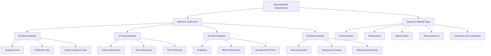
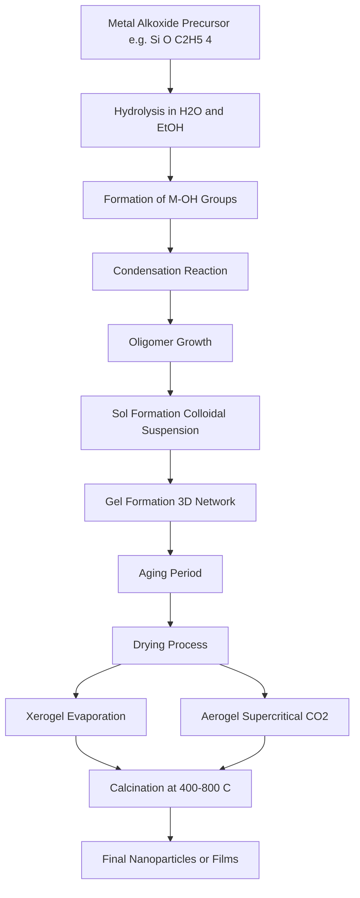
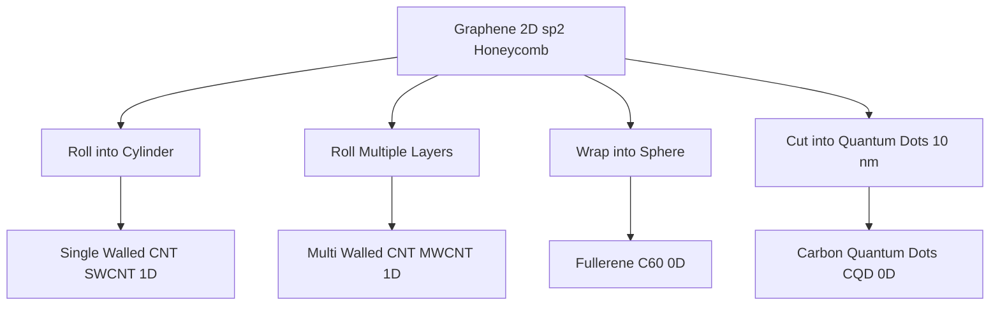
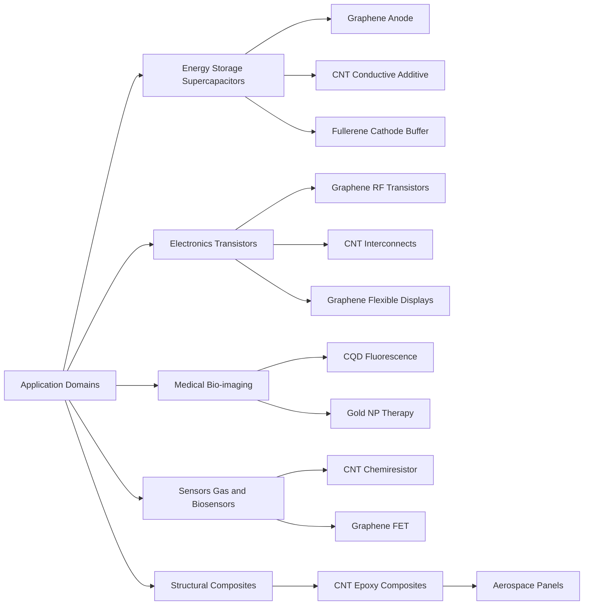

# Nanomaterials - Classification based on Dimension & Materials- Synthesis – Sol gel & Chemical Reduction - Applications of nanomaterials – Carbon Nanotubes, Fullerenes, Graphene & Carbon Quantum Dots – structure, properties & application.

<!-- SECTION_1_START -->
# 🧪 Nanomaterials: Core Definition & Intuitive Overview

## 📘 Formal Academic Definition (KTU 2024 Scheme Aligned)

A **nanomaterial** is defined as a material possessing at least one external dimension in the nanoscale range, typically between **1 nm to 100 nm**, or having internal or surface structures at this scale. According to IUPAC and the **KTU 2024 Scheme** (GXCYT122 – Module 2), nanomaterials are substances engineered or naturally occurring whose physical, chemical, optical, and electronic properties differ significantly from their bulk counterparts due to **size quantization**, **surface area dominance**, and **quantum confinement effects**.

> [!IMPORTANT]
> **KTU Syllabus Highlight – GXCYT122 (Module 2):**
> Nanomaterials are classified based on **dimension** and **material type**. The principal synthetic routes for KTU examinations are the **Sol–Gel process** and **Chemical Reduction** methods. The four carbon allotropes (CNT, Fullerene, Graphene, Carbon Quantum Dots) form the application-focused segment of this module.

## 🌟 Intuitive Analogy — Why Size Matters

Imagine a **sugar cube** sitting in your tea. It dissolves slowly because only the outer surface touches the liquid. Now grind that same cube into a fine **powder** — the surface area increases thousands of times, and the powder dissolves almost instantly. This is the essence of nanomaterials. The atoms that were once "buried" inside the bulk material are now exposed, and **surface atoms behave differently from interior atoms**.

> [!NOTE]
> **Surface-to-Volume Ratio Principle**
> For a spherical particle of radius $r$, the surface-to-volume ratio is $\frac{3}{r}$. As $r$ shrinks from microns to nanometers, this ratio explodes, giving rise to:
> 1. **Enhanced catalytic activity** (more reaction sites).
> 2. **Lower melting points** (surface atoms vibrate more freely).
> 3. **Altered electrical conductivity** (quantum confinement).
> 4. **Visible-light emission** from materials normally invisible at bulk scale (e.g., gold nanoparticles appear ruby red).

## 🧬 Geometric Visualization of the Nanoscale

To grasp the scale, consider:

| Scale | Reference Object | Size |
|---|---|---|
| 1 m | Human height | $10^{0}$ m |
| 1 mm | Grain of sand | $10^{-3}$ m |
| 1 μm | Bacterium | $10^{-6}$ m |
| 100 nm | Virus (small) | $10^{-7}$ m |
| 1 nm | DNA helix width | $10^{-9}$ m |
| 0.1 nm | Hydrogen atom | $10^{-10}$ m |

> [!TIP]
> **Mnemonic for KTU Exam — "0–1–2–3 DIMENSION":**
> - **0D** – All dimensions ≤ 100 nm (quantum dots, nanoparticles).
> - **1D** – Two dimensions ≤ 100 nm (nanotubes, nanowires, nanorods).
> - **2D** – One dimension ≤ 100 nm (graphene, nanofilms, nanosheets).
> - **3D** – Bulk materials with nanoscale features (nanocomposites, foams).

> [!VISUALIZATION CONTROL]
> **Concept:** Surface-to-Volume Ratio vs. Particle Radius
> **Desmos Input Equations:**
> - Sphere Volume: $V(r) = \frac{4}{3}\pi r^{3}$
> - Sphere Surface: $S(r) = 4\pi r^{2}$
> - Ratio Function: $R(r) = \frac{S(r)}{V(r)} = \frac{3}{r}$
> **Visual Description:** Plot $R(r)$ against $r$ (in nm) from $r = 1$ to $r = 1000$. The student should observe a sharp hyperbolic decay — proving that as particle size shrinks, the surface-to-volume ratio skyrockets, the very basis of nanomaterial reactivity.
<!-- SECTION_1_END -->

<!-- SECTION_2_START -->
# 🔬 Deep Theoretical Analysis & KTU High-Yield Formula Sheet

## I. Classification of Nanomaterials

### A. 📏 Classification Based on Dimension (KTU 2024 – High-Weightage Topic)

Nanomaterials are stratified into four primary dimensional classes. This is a **favourite KTU question topic** and frequently appears for 7-mark sub-parts.

| Dimension Class | Nanomaterial Type | Description | Examples |
|---|---|---|---|
| **0D** (Zero-Dimensional) | All axes ≤ 100 nm | Electrons confined in 3 directions; acts as a "particle in a box" | Quantum dots (CdS, ZnS), Gold nanoparticles, Fullerenes (C60), Carbon Quantum Dots |
| **1D** (One-Dimensional) | Two axes ≤ 100 nm | Electrons confined in 2 directions; 1-D transport | Carbon Nanotubes (CNT), Ag nanowires, TiO2 nanorods |
| **2D** (Two-Dimensional) | One axis ≤ 100 nm | Electrons confined in 1 direction; planar sheet transport | Graphene, MoS2 nanosheets, hexagonal BN |
| **3D** (Three-Dimensional) | Bulk with nanoscale units | No confinement; 3-D bulk with nanofeatures | Nanocomposites, nanofoams, nanostructured metals |

> [!IMPORTANT]
> **Quantum Confinement Effect**
> The reduction in particle size to a regime comparable to the de Broglie wavelength of an electron causes discrete energy levels (replacing continuous bands). This is responsible for **size-dependent photoluminescence** in quantum dots.

### B. 🧪 Classification Based on Material Composition

| Category | Examples | KTU Application Context |
|---|---|---|
| **Carbon-based** | Graphene, CNT, Fullerene, CQDs | Electronics, sensors, energy storage (Module 2 focus) |
| **Metal-based** | Au, Ag, Pt nanoparticles | Catalysis, medical therapeutics |
| **Metal oxide** | ZnO, TiO2, Fe2O3, CuO | Photocatalysis, sunscreens, gas sensors |
| **Semiconductor** | CdS, CdSe, ZnS, Si | LEDs, solar cells, bio-imaging |
| **Polymeric** | Dendrimers, nanoshells | Drug delivery, coatings |
| **Composite** | Polymer-metal oxide hybrids | Aerospace, structural strength |

## II. Synthesis Methods — Detailed Mechanism

### A. ⚗️ Sol–Gel Process (Wet Chemical Synthesis)

The **Sol–Gel process** is a low-temperature, wet-chemical route to produce metal oxide nanoparticles, glasses, and ceramics. It proceeds through the formation of a colloidal suspension (**sol**) that polymerizes into an interconnected network (**gel**).

**Key Precursors:**
- Metal alkoxides: $\text{M(OR)}_n$ (e.g., tetraethyl orthosilicate — TEOS).
- Metal chlorides, nitrates, acetates.

**Two Critical Reactions:**

1. **Hydrolysis:**
$$\text{M(OR)}_n + \text{H}_2\text{O} \rightarrow \text{M(OH)(OR)}_{n-1} + \text{ROH}$$

2. **Condensation (Polymerization):**
$$\text{M–OH} + \text{HO–M} \rightarrow \text{M–O–M} + \text{H}_2\text{O}$$

The product **M–O–M** linkage forms the bridging backbone of the gel network.

> [!NOTE]
> **Drying Methods in Sol–Gel:**
> - **Xerogel** — Drying by evaporation → cracks due to capillary pressure.
> - **Aerogel** — Drying by supercritical CO2 → retains ~99% porosity, used in insulation.

### B. ⚛️ Chemical Reduction Method

Primarily used to synthesize **metallic nanoparticles** (Au, Ag, Cu) and **graphene oxide → graphene** reduction.

**General Scheme:**
$$\text{Metal Salt} + \text{Reducing Agent} \rightarrow \text{Metal}^{0}\text{ (nanoparticles)} + \text{Oxidized Byproduct}$$

**Stabilizing Agent (Capping Agent)** prevents agglomeration via steric or electrostatic repulsion.

**Canonical Example — Silver Nanoparticle (AgNP) Synthesis:**
$$\text{AgNO}_3 \text{(aq)} + \text{Citrate (reducing agent)} \rightarrow \text{Ag}^{0} \text{ (colloid)} + \text{Citrate-Oxidized}$$

For graphene: Hydrazine hydrate reduces graphene oxide (GO) to reduced graphene oxide (rGO):
$$\text{GO} + \text{N}_2\text{H}_4 \rightarrow \text{rGO} + \text{N}_2 \uparrow + \text{H}_2\text{O}$$

## III. Carbon-Based Nanomaterials — The KTU Module 2 Core

### 🟠 1. Fullerenes (C60, C70) — 0D Carbon
- Spherical cage-like closed structures of pure carbon.
- **C60 (Buckminsterfullerene)** — truncated icosahedron, 12 pentagons + 20 hexagons.
- Diameter ≈ 0.7 nm.
- Properties: high electron affinity, superconductivity on doping with alkali metals (e.g., K3C60).

### ⬛ 2. Carbon Nanotubes (CNTs) — 1D Carbon
- Cylindrical tubes of rolled-up graphene sheets.
- **Single-Walled CNT (SWCNT)** — one graphene layer.
- **Multi-Walled CNT (MWCNT)** — concentric graphene tubes.
- Diameter: 1–100 nm; Length: μm to cm.
- Properties: tensile strength 100× steel at 1/6 the weight, current density 1000× copper.

### 🟩 3. Graphene — 2D Carbon
- Single atomic layer of $sp^{2}$-hybridized carbon in a **honeycomb lattice**.
- 0.345 nm thickness, C–C bond length 0.142 nm.
- Properties: electron mobility 200,000 cm² V⁻¹ s⁻¹, thermal conductivity 5000 W m⁻¹ K⁻¹, 130 GPa tensile strength, 97.7% optical transparency.

### 💎 4. Carbon Quantum Dots (CQDs) — 0D Carbon
- Carbon nanoparticles ≤ 10 nm, with **tunable photoluminescence** based on size.
- Composition: amorphous/nanocrystalline $sp^{2}$/$sp^{3}$ carbon core with surface functional groups.
- Properties: biocompatible, water-soluble, excitation-dependent emission.

## IV. 🗂️ KTU High-Yield Formula Sheet & Properties Table

| Parameter | Formula / Expression | Significance | Unit |
|---|---|---|---|
| Surface-to-Volume Ratio (sphere) | $\frac{S}{V} = \frac{3}{r}$ | Explains enhanced reactivity | nm⁻¹ |
| Specific Surface Area | $SSA = \frac{6}{\rho \cdot d}$ | Where $\rho$ is density, $d$ is diameter | m²/g |
| Quantum Confinement Bandgap | $E_{g}^{\text{nano}} = E_{g}^{\text{bulk}} + \frac{\hbar^{2}\pi^{2}}{2\mu R^{2}}$ | Bandgap widens as size shrinks | eV |
| Hexagonal Lattice Vector | $\vec{a}_{1,2} = \frac{a}{2}(3,\pm\sqrt{3})$ | Describes graphene unit cell | nm |
| Bragg's Law (XRD analysis) | $n\lambda = 2d\sin\theta$ | Determines nanoparticle crystallite size | nm |
| Scherrer Equation (crystallite size) | $D = \frac{K\lambda}{\beta\cos\theta}$ | $K$ ≈ 0.9, $\beta$ = FWHM | nm |

| Carbon Nanomaterial | Dimensionality | Hybridization | Key Property | KTU Application |
|---|---|---|---|---|
| Fullerene C60 | 0D | $sp^{2}$ | High electron affinity | Organic solar cells |
| SWCNT | 1D | $sp^{2}$ | Semiconducting/Metallic | Transistors, sensors |
| MWCNT | 1D | $sp^{2}$ | Exceptional mechanical strength | Composites, EMI shielding |
| Graphene | 2D | $sp^{2}$ | Highest known conductivity | Flexible electronics |
| CQDs | 0D | $sp^{2}$/$sp^{3}$ | Tunable fluorescence | Bio-imaging, LEDs |

## V. 🌍 Real-World Engineering Utility

| Domain | Nanomaterial | Use Case |
|---|---|---|
| **Electronics** | Graphene, CNT | Flexible displays (Samsung), RF transistors, wearable sensors |
| **Energy** | TiO2, Graphene, CQDs | Dye-sensitized solar cells, supercapacitors, lithium-ion anodes |
| **Medical** | Au NPs, CQDs | Photothermal therapy, drug delivery, bio-imaging |
| **Environment** | TiO2, ZnO | Photocatalytic degradation of pollutants, water purification |
| **Information Science** | CNT, Graphene | MEMS/NEMS, next-gen DRAM, neuromorphic chips |
| **Electrical** | Cu NPs, Ag NPs | Conductive inks for PCBs, dielectric coatings |
<!-- SECTION_2_END -->

<!-- SECTION_3_START -->
# 📝 Step-by-Step Derivations & Process Implementation

## I. Sol–Gel Process — Exhaustive Mechanistic Walkthrough

The Sol–Gel synthesis of **SiO2 nanoparticles from tetraethyl orthosilicate (TEOS)** is the KTU benchmark reaction. Each step is described without abbreviation.

### Step 1: Precursor Selection
Choose TEOS, $\text{Si(OC}_2\text{H}_5)_4$, as the silicon source and a mixture of water with ethanol (EtOH) as the solvent. Acid (HCl) or base (NH4OH) acts as the catalyst.

### Step 2: Hydrolysis
Water attacks the silicon centre, displacing one ethoxy group as ethanol:

$$\text{Si(OC}_2\text{H}_5)_4 + \text{H}_2\text{O} \rightarrow \text{Si(OH)(OC}_2\text{H}_5)_3 + \text{C}_2\text{H}_5\text{OH}$$

For complete hydrolysis, the reaction proceeds four times, ultimately producing $\text{Si(OH)}_4$ (silicic acid). The bridging M–OH species formed is critical for the next stage.

### Step 3: Condensation (Polymerization)
Two partially hydrolysed species combine by releasing either water (oxolation) or alcohol (alcoxolation):

$$\text{≡Si–OH} + \text{HO–Si≡} \rightarrow \text{≡Si–O–Si≡} + \text{H}_2\text{O}$$

This forms **siloxane (Si–O–Si) bridges**, the structural backbone of the gel network.

### Step 4: Gelation
As condensation continues, oligomers grow into colloidal particles (**sol**), which aggregate into a continuous 3D network (**gel**). Viscosity rises dramatically; the system transitions from a free-flowing liquid to a semi-rigid matrix.

### Step 5: Aging
The gel is held at room temperature, allowing further condensation and Ostwald ripening. Strength and rigidity increase, and residual stresses relax.

### Step 6: Drying
- **Evaporation Drying** → **Xerogel** (high capillary stress, often cracks).
- **Supercritical Drying** (with CO2) → **Aerogel** (preserves porous network, 99% porosity).

### Step 7: Calcination (Optional Thermal Treatment)
The dried gel is heated at 400–800 °C in air to remove organic residues and densify the material into crystalline **SiO2 nanoparticles** or films.

> [!NOTE]
> **Catalyst Effect on Morphology (Frequently Asked in KTU):**
> - **Acid catalyst (HCl)** → linear polymer chains → fibrous gel.
> - **Base catalyst (NH4OH)** → branched clusters → particulate gel.

## II. Chemical Reduction — Exhaustive Mechanistic Walkthrough

### Standard Synthesis of Gold Nanoparticles (AuNPs) by Turkevich–Frens Method

This is the KTU standard reduction synthesis for **monodisperse gold nanoparticles**.

**Reagents:** Tetrachloroauric acid ($\text{HAuCl}_4$), trisodium citrate ($\text{Na}_3\text{C}_6\text{H}_5\text{O}_7$), deionized water.

#### Step 1: Preparation of Precursor
Dissolve $\text{HAuCl}_4$ in deionized water at 95–100 °C. The gold exists as $\text{Au}^{3+}$ ions, $\text{AuCl}_4^{-}$ complex in solution.

#### Step 2: Addition of Reducing Agent
Rapidly inject a hot aqueous solution of trisodium citrate. Citrate serves a **dual role**:
- Acts as the reducing agent ($\text{Citrate}^{3-} \rightarrow \text{CO}_2$ + acetone-1,3-dicarboxylate).
- Caps the formed nanoparticles, preventing aggregation.

#### Step 3: Reduction Reaction (Balanced Half-Reactions)

**Reduction of Au³⁺ to Au⁰:**

$$\text{AuCl}_4^{-} + 3e^{-} \rightarrow \text{Au}^{0} + 4\text{Cl}^{-}$$

**Oxidation of citrate to acetone dicarboxylate:**

$$\text{Citrate}^{3-} \rightarrow \text{Acetone dicarboxylate} + \text{CO}_2 + 3e^{-} + 3H^{+}$$

#### Step 4: Nucleation
Once the solution reaches **supersaturation**, Au⁰ atoms coalesce into small clusters (1–2 nm), forming **nuclei**. The solution turns colourless → faint blue → **ruby red** as particles grow.

#### Step 5: Growth Phase
Atoms add to existing nuclei rather than forming new ones (assuming LaMer conditions are met), producing particles in the 10–20 nm range.

#### Step 6: Stabilization and Surface Passivation
Citrate anions adsorb onto the Au⁰ surface, creating a **negative zeta potential** that electrostatically repels other particles, preventing agglomeration.

#### Step 7: Characterization
- **UV–Vis Spectroscopy** — Surface Plasmon Resonance (SPR) peak at ~520 nm confirms AuNP formation.
- **TEM** — Verifies size and morphology.
- **DLS** — Measures hydrodynamic radius.

> [!TIP]
> **KTU Memory Hook — "NaCl-FREE-Citrate":**
> The Turkevich method is a *reduction*, not a precipitation. Never confuse with NaOH-induced precipitation of metal hydroxides. Look for the keyword "citrate" or "tannic acid" in KTU questions.

### Synthesis of Reduced Graphene Oxide (rGO) via Chemical Reduction

#### Step 1: Graphite Oxidation
Treat natural graphite with Hummers' method (H2SO4, KMnO4, NaNO3) to introduce oxygen functionalities (–OH, –COOH, epoxide), producing **graphene oxide (GO)**.

#### Step 2: Exfoliation
Sonicate GO in water to produce single-layer GO sheets (~1 nm thick by AFM).

#### Step 3: Chemical Reduction
Add hydrazine hydrate (N2H4·H2O) at 95–100 °C:

$$\text{GO} + \text{N}_2\text{H}_4 \rightarrow \text{rGO} + \text{N}_2 \uparrow + \text{H}_2\text{O}$$

#### Step 4: Restoration of $sp^{2}$ Network
Most oxygen groups are removed; the conjugated $sp^{2}$ carbon lattice is partially restored, recovering electrical conductivity (though slightly lower than pristine graphene due to residual defects).

## III. Properties of Carbon Nanomaterials — Numerical Strengths for KTU Answers

| Property | Graphene | SWCNT (armchair) | MWCNT | C60 Fullerene | CQDs |
|---|---|---|---|---|---|
| Structure | Honeycomb 2-D sheet | Rolled graphene | Concentric tubes | Truncated icosahedron | Amorphous $sp^{2}$/$sp^{3}$ |
| Dimensions (nm) | 0.345 thick | 0.4–2 dia. | 5–50 dia. | 0.7 dia. | 2–10 |
| Tensile Strength (GPa) | 130 | 100–150 | 10–60 | N/A | N/A |
| Young's Modulus (TPa) | 1.0 | 1.0–5.0 | 0.3–1.0 | N/A | N/A |
| Electron Mobility (cm² V⁻¹ s⁻¹) | 200,000 | 100,000 | 10,000 | N/A (insulator/doped superconductor) | N/A |
| Thermal Conductivity (W m⁻¹ K⁻¹) | 5000 | 3000 | 2000 | 0.4 | Low |
| Optical Transparency | 97.7% | Tunable | Tunable | Absorbs UV-Vis | Photoluminescent |

> [!IMPORTANT]
> **KTU Definition Card — Carbon Nanotube (CNT):**
> "A carbon nanotube is a one-dimensional hollow cylindrical nanostructure formed by rolling a single layer of graphene into a seamless tube, characterized by chirality $(n,m)$, where the chiral vector $\vec{C}_h = n\vec{a}_1 + m\vec{a}_2$ determines whether the CNT is metallic or semiconducting."
<!-- SECTION_3_END -->

<!-- SECTION_4_START -->
# 🏗️ Structural Diagrams & Schematics

## Diagram 1: Top-Level Classification of Nanomaterials (Block Architecture)

## Diagram 2: Sol–Gel Process Flow Topology

## Diagram 3: Chemical Reduction Sequence (Turkevich Method)

## Diagram 4: Carbon Nanomaterial Structure Mapping (0D / 1D / 2D Topology)

## Diagram 5: Sequential Process Topology — Applications of Carbon Nanomaterials

> [!NOTE]
> **Why Mermaid Architecture Instead of Hand-Drawn Diagrams?**
> Since the topic spans process flows, dimensional classification trees, and application mapping, Mermaid block-level functional architecture provides clearer conceptual linkage than sketched molecular structures, which are better described through textual properties tables above.
<!-- SECTION_4_END -->

<!-- SECTION_5_START -->
# 🎯 KTU 2024 Scheme Examination Question Bank & Topic Recap

## Part A — Short Answer Questions (3 Marks Each)

### Question 1. Define nanomaterials. Mention any two of their distinctive properties.
**[KTU University Exam – July 2023] | CO1 | Remember**

**Model Answer (2 + 1 = 3 Marks):**

**Definition (2 Marks):**
Nanomaterials are materials whose structural components have at least one dimension in the size range of **1–100 nm**. They exhibit significantly different physical, chemical, optical, and electronic properties compared to their bulk counterparts due to **quantum size effects** and a **high surface-area-to-volume ratio**.

**Two Distinctive Properties (1 Mark):**
1. **High surface-area-to-volume ratio:** For a sphere, $S/V = 3/r$, so smaller size → dramatically larger surface for catalytic and chemical reactions.
2. **Quantum confinement:** Electrons confined to nanoscale dimensions exhibit discrete energy levels, leading to size-tunable optical and electronic properties (e.g., colour change of gold nanoparticles).

---

### Question 2. Differentiate between SWCNT and MWCNT.
**[KTU University Exam – Dec 2022] | CO2 | Understand**

**Model Answer (3 Marks):**

| Feature | SWCNT | MWCNT |
|---|---|---|
| **Structure** | Single graphene layer rolled into a cylinder | Multiple concentric graphene cylinders |
| **Diameter** | 0.4–2 nm | 5–50 nm |
| **Synthesis** | Laser ablation, HiPCO | CVD, arc discharge |
| **Defects** | Fewer defects, more uniform | More defects at interlayer junctions |
| **Cost** | Higher | Lower |
| **Application** | High-precision FET, sensors | Composites, EMI shielding |

---

## Part B — Module Internal Choice (14 Marks Each)

### Question 3(A). Discuss the classification of nanomaterials based on dimension with suitable examples. Explain the quantum confinement effect.
**[KTU University Exam – July 2024] | CO1, CO2 | Understand + Apply**

#### (a) Classification Based on Dimension (7 Marks)

| Dimensionality | Definition | Confinement Direction | Examples |
|---|---|---|---|
| **0D** | All axes ≤ 100 nm | 3 directions (xyz) | Quantum dots, Fullerenes, CQDs, Au nanoparticles |
| **1D** | Two axes ≤ 100 nm | 2 directions (xy) | CNTs, Ag nanowires, TiO2 nanorods |
| **2D** | One axis ≤ 100 nm | 1 direction (z) | Graphene, MoS2, h-BN nanosheets |
| **3D** | Bulk with nanoscale features | None | Nanocomposites, nanoporous materials |

*[Listing 0D/1D/2D/3D with examples: 4 Marks]*
*[Brief explanation of each class with confinement: 3 Marks]*

#### (b) Quantum Confinement Effect (7 Marks)

When the particle size becomes comparable to the **de Broglie wavelength of the electron**, the electron's energy levels become quantized rather than continuous, and the energy bandgap widens as the particle shrinks.

**Mathematical Expression:**

$$E_{g}^{\text{nano}} = E_{g}^{\text{bulk}} + \frac{\hbar^{2}\pi^{2}}{2\mu R^{2}}$$

where:
- $E_{g}^{\text{nano}}$ = bandgap of nanoparticle
- $E_{g}^{\text{bulk}}$ = bandgap of bulk material
- $\mu$ = reduced effective mass of electron–hole pair
- $R$ = radius of nanoparticle
- $\hbar$ = reduced Planck's constant

*[Equation: 2 Marks; Explanation of each term: 3 Marks; Significance in KTU context (size-tunable photoluminescence in QDs): 2 Marks]*

**Practical Example:** Cadmium selenide (CdSe) QDs of 2 nm emit blue light, while 8 nm QDs emit red light — the same chemistry, different size, different colour.

---

### Question 3(B). Describe the Sol–Gel method for the synthesis of nanomaterials. State the merits of the Sol–Gel process over conventional ceramic methods.
**[KTU University Exam – Dec 2023] | CO3 | Apply + Analyse**

#### (a) Sol–Gel Synthesis of SiO2 from TEOS (7 Marks)

**Step 1: Hydrolysis (3 Marks)**

$$\text{Si(OC}_2\text{H}_5)_4 + \text{H}_2\text{O} \xrightarrow{\text{H}^{+}/\text{OH}^{-}} \text{Si(OH)(OC}_2\text{H}_5)_3 + \text{C}_2\text{H}_5\text{OH}$$

Repeating four times yields $\text{Si(OH)}_4$.

**Step 2: Condensation (2 Marks)**

$$\text{≡Si–OH} + \text{HO–Si≡} \rightarrow \text{≡Si–O–Si≡} + \text{H}_2\text{O}$$

The siloxane (Si–O–Si) bridge forms the gel backbone.

**Step 3: Gelation → Aging → Drying → Calcination (2 Marks)**
The colloidal sol polymerizes into a 3-D gel network, which is aged, dried (xerogel or aerogel), and calcined at 400–800 °C to obtain crystalline SiO2 nanoparticles.

#### (b) Merits of Sol–Gel over Conventional Methods (7 Marks)

| Merit (1 Mark Each) | Explanation |
|---|---|
| 1. **Low processing temperature** | 400–800 °C vs. 1500 °C+ for ceramic routes; energy efficient. |
| 2. **High purity products** | Liquid precursors are easily purified via distillation. |
| 3. **Excellent stoichiometric control** | Molecular-level mixing ensures homogeneous composition. |
| 4. **Versatile product forms** | Can yield powders, films, fibers, monoliths, aerogels. |
| 5. **Nanoscale particle size** | Yields particles 1–100 nm with narrow size distribution. |
| 6. **Porosity control** | Pore size tunable via drying technique and aging. |
| 7. **Energy efficiency & lower carbon footprint** | No high-temperature furnaces; suitable for sensitive substrates. |

> [!WARNING]
> **KTU Examiner's Valuation Pitfalls — Sol–Gel Questions:**
> 1. **Never write "SiO2 forms directly from TEOS."** It forms via *hydrolysis* then *condensation* — two distinct steps. Skipping either step → **–2 marks**.
> 2. **Always mention the catalyst** (acid or base) in the hydrolysis arrow. Omission → **–1 mark**.
> 3. **Distinguish xerogel vs. aerogel explicitly.** If the question says "porous material," mention supercritical CO2 drying for aerogel — **1 bonus mark** in valuation.
> 4. **Do not confuse the "sol" with a "solution."** A sol is a **colloidal suspension of solid particles in a liquid**, not a true solution. Examiner will deduct **½–1 mark** for this confusion.

---

### Question 4(A). Explain the chemical reduction method for the synthesis of gold nanoparticles with a neat reaction scheme. Discuss the role of citrate.
**[KTU University Exam – July 2024] | CO3 | Apply**

#### (a) Chemical Reduction of HAuCl4 with Trisodium Citrate (7 Marks)

**Reaction Scheme (4 Marks):**

$$\text{HAuCl}_4 \text{ (aq)} + \text{Citrate}^{3-} \xrightarrow{95\text{–}100\,^{\circ}\text{C}} \text{Au}^{0}\text{ (NPs, ruby red)} + \text{Citrate-Ox} + \text{Cl}^{-} + \text{H}^{+}$$

**Stepwise Description (3 Marks):**
1. **Reduction of Au³⁺ to Au⁰:** The citrate ion donates electrons, reducing Au³⁺ to metallic gold atoms.
2. **Nucleation:** Au⁰ atoms cluster into nuclei (~1–2 nm).
3. **Growth and capping:** Au⁰ atoms deposit on existing nuclei, growing particles to 10–20 nm.

#### (b) Role of Citrate (Dual Function) (7 Marks)

| Role | Mechanism (3.5 Marks each) |
|---|---|
| **Reducing agent** | Citrate is oxidized to acetonedicarboxylate, releasing 3 electrons and 3 H⁺; these electrons reduce Au³⁺ → Au⁰. |
| **Capping/stabilizing agent** | Citrate anions adsorb on the AuNP surface, generating a **negative zeta potential (~−30 mV)** that electrostatically repels neighbouring particles, preventing aggregation. |

**Confirmation by UV–Vis:** Surface Plasmon Resonance (SPR) peak at **~520 nm** confirms AuNP formation (ruby red colour).

---

### Question 4(B). Discuss the structure, properties and applications of graphene and carbon quantum dots (CQDs).
**[KTU University Exam – Dec 2023] | CO2, CO4 | Understand + Apply**

#### (a) Graphene — Structure & Properties (7 Marks)

**Structure (3 Marks):**
- A single atomic layer of $sp^{2}$-bonded carbon atoms arranged in a **2-D honeycomb lattice**.
- Lattice constant $a = 0.246$ nm, C–C bond length 0.142 nm, sheet thickness 0.345 nm.
- Two carbon atoms per unit cell.

**Properties (4 Marks):**
- **Mechanical:** Young's modulus ~1 TPa, tensile strength 130 GPa, intrinsic strength 42 N m⁻¹.
- **Electronic:** Zero bandgap semiconductor (Dirac cone), ambipolar field effect, electron mobility $200{,}000 \text{ cm}^{2}\,\text{V}^{-1}\,\text{s}^{-1}$.
- **Thermal:** Thermal conductivity ~5000 W m⁻¹ K⁻¹.
- **Optical:** Absorbs only 2.3% of white light → 97.7% transparency.

**Applications:** Flexible touchscreens, RF transistors, supercapacitors, biosensors, composite reinforcement.

#### (b) Carbon Quantum Dots (CQDs) — Structure & Properties (7 Marks)

**Structure (3 Marks):**
- Quasi-spherical carbon nanoparticles, 2–10 nm in size.
- Composed of an **$sp^{2}$/$sp^{3}$ carbon core** with surface functional groups (–OH, –COOH, –NH2).
- Amorphous to nanocrystalline morphology.

**Properties (4 Marks):**
- **Photoluminescence:** Tunable, excitation-dependent emission (blue → red) based on size and surface chemistry.
- **Biocompatibility:** Low toxicity; suitable for in-vivo applications.
- **Water solubility:** Due to surface functional groups.
- **Chemical stability:** Photobleaching resistance higher than organic dyes.

**Applications:** Bio-imaging, fluorescent ink, LEDs, photocatalysis, drug delivery, sensors.

> [!WARNING]
> **KTU Examiner's Valuation Pitfalls — Carbon Nanomaterial Questions:**
> 1. **Do not write "graphene is a 3-D material"** — it is strictly **2-D**. Examiners deduct 1 mark for this error.
> 2. **Avoid confusing "Carbon Quantum Dots" with "Quantum Dots"** — CQDs are purely carbon-based; quantum dots (e.g., CdSe) are semiconductor-based. Examiner expects the distinction explicitly.
> 3. **For CNTs, always state the chirality vector $(n, m)$** when describing electronic behaviour. Omission → **−1 mark** in 14-mark answers.
> 4. **Use exact values** (e.g., graphene electron mobility = 200,000 cm² V⁻¹ s⁻¹) rather than vague phrases like "very high conductivity." Examiners allocate marks for numerical accuracy.

---

## 📌 Topic Recap & Important Things to Remember

- **Definition (1 mark keyword):** Nanomaterial = at least one external dimension in 1–100 nm range.
- **Dimensional classification (0D/1D/2D/3D):** Match the dimension to confinement direction (0D → 3 axes, 1D → 2 axes, 2D → 1 axis, 3D → 0 axes).
- **Quantum confinement formula:** $E_{g}^{\text{nano}} = E_{g}^{\text{bulk}} + \frac{\hbar^{2}\pi^{2}}{2\mu R^{2}}$ — bandgap increases as size decreases.
- **Sol–Gel two-step essence:** Hydrolysis (M–OR + H2O → M–OH + ROH) and Condensation (M–OH + HO–M → M–O–M + H2O).
- **Sol–Gel catalysts:** Acid → linear polymer chains (fibres); Base → branched clusters (particles).
- **Drying distinguishes xerogel vs. aerogel** — examiners love this contrast question.
- **Chemical reduction — Turkevich method:** HAuCl4 + citrate → ruby red AuNPs (SPR at 520 nm).
- **Citrate dual role:** Reducing agent + electrostatic capping agent (zeta potential).
- **Graphene structure:** $sp^{2}$ carbon, honeycomb 2-D lattice, 0.345 nm thick, 97.7% transparent.
- **CNT chirality:** Vector $(n, m)$ decides metallic vs. semiconducting behaviour — must be written explicitly.
- **C60 Fullerene:** 12 pentagons + 20 hexagons, truncated icosahedron, 0.7 nm diameter.
- **CQD property to remember:** Tunable photoluminescence (size-dependent) + biocompatible + water soluble.
- **Surface-to-volume ratio:** $S/V = 3/r$ for spheres — central to all "why nanomaterials are reactive" answers.
- **Top KTU applications to memorize:** Graphene → flexible electronics & supercapacitors; CNT → composites & interconnects; CQD → bio-imaging; Fullerene → organic solar cells.
- **Use precise numerical values** (mobility, strength, transparency) — never use "very high" or "extremely strong" alone.
- **Distinguish GO from rGO:** GO is insulating (oxygen-rich); rGO is conductive (hydrazine reduces oxygen groups).
- **Scherrer equation** $D = \frac{K\lambda}{\beta\cos\theta}$ is the standard formula for crystallite size from XRD.
<!-- SECTION_5_END -->
