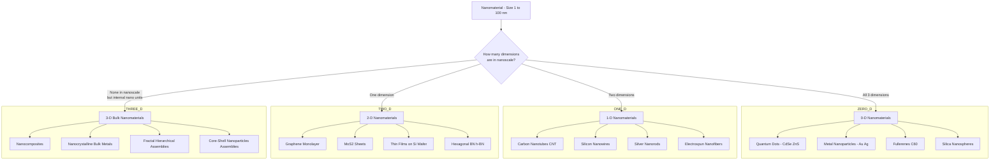
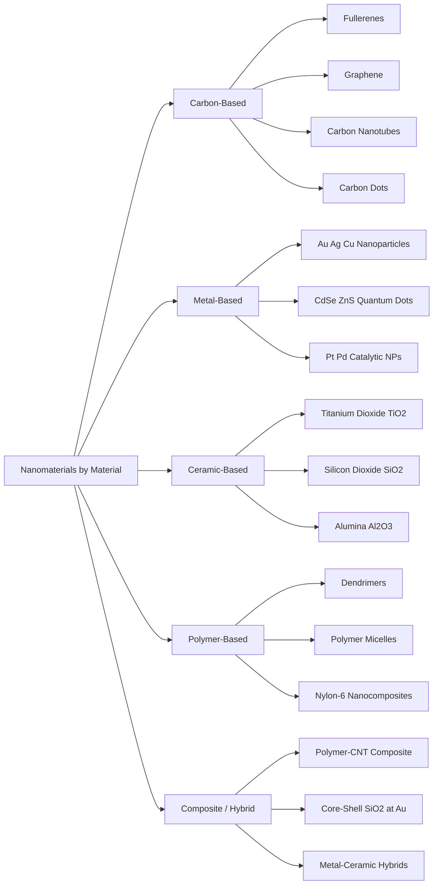

# Nanomaterials - Classification based on Dimension & Materials

<!-- SECTION_1_START -->
# Nanomaterials: Classification based on Dimension & Materials

> [!IMPORTANT]
> **KTU 2024 Scheme — Module 2 (GXCYT122)**
> *Nanomaterials are the foundational building blocks of modern electronics, semiconductor devices, sensors, and quantum computing platforms. Mastering their dimensional and material classification is mandatory for board-level valuation.*

## 1.1 Formal Academic Definition

A **nanomaterial** is a natural, incidental, or manufactured material containing particles in an unbound state, as an aggregate, or as an agglomerate, where, for **50% or more** of the particles in the number size distribution, one or more external dimensions lie in the size range of **1 nm to 100 nm**.

> [!NOTE]
> **KTU Board Definition (ISO/TS 80004 series aligned):**
> In simpler terms, a nanomaterial is any material whose structural components have at least one dimension measuring less than or equal to **100 nanometres (1 × 10⁻⁷ m)** but greater than approximately **1 nanometre**, at which point quantum mechanical effects begin to dominate the physical and chemical behaviour of the material.

## 1.2 Intuitive Real-World Analogy

Imagine a solid cube of sugar. Now imagine splitting that cube into smaller and smaller pieces until each grain is invisible to the naked eye.

- A **macroscopic sugar grain** (millimetre size) tastes sweet, dissolves slowly, and behaves predictably by classical physics.
- A **nano-sized sugar grain** (1–100 nm) is invisible under an optical microscope, has a vastly larger surface area relative to its volume, dissolves almost instantly, may emit strange colours under light, and obeys the *weird rules* of quantum mechanics.

> [!TIP]
> **Analogy:** If a marble (1 cm) were scaled up to the size of the Earth (12,742 km), then a single nanometre would be roughly the height of a tennis ball sitting on the Earth's surface. **That is the scale of nanotechnology.**

## 1.3 Key Physical Constants & Metrics

| Metric | Symbol | Value / Range | Significance |
|---|---|---|---|
| Lower size bound | $d_{min}$ | ~1 nm (≈ 10 atoms across) | Below this, the system is treated as a single molecule |
| Upper size bound | $d_{max}$ | 100 nm (1 × 10⁻⁷ m) | Above this, bulk properties dominate |
| Bohr radius (typical exciton) | $a_B$ | ≈ 0.529 nm (H-atom) | Quantum confinement onset reference |
| Surface area / volume for a 10 nm sphere | $SA/V$ | **0.6 nm⁻¹** | 1000× greater than a 10 µm sphere |

> [!VISUALIZATION CONTROL]
> **Concept:** Surface-to-Volume Ratio Scaling for Spherical Nanoparticles
> **GeoGebra / Desmos Input Equations:**
> * `f(r) = 3/r` (where $r$ is the radius in nm, $f(r)$ gives $SA/V$ in nm⁻¹)
> * `g(r) = 100/r` (percentage of surface atoms, approximate model)
>
> **Visual Description:** Plot $f(r)$ for $r$ ranging from 1 nm to 1000 nm. The student should observe a steep hyperbolic decay — as particle size drops below 100 nm, the $SA/V$ ratio skyrockets vertically on the $y$-axis. This visually explains why nanoparticles are hyper-reactive catalysts.

---

<!-- SECTION_1_END -->

<!-- SECTION_2_START -->
# Deep Theoretical Analysis & KTU High-Yield Formula Sheet

## 2.1 Classification Based on Dimension (KTU High-Priority)

The international scientific community (and KTU Module 2 syllabus) classifies nanomaterials strictly on the basis of **how many of their external dimensions fall within the 1–100 nm range**.

### 2.1.1 Zero-Dimensional (0-D) Nanomaterials
- **All three spatial dimensions ($x$, $y$, $z$) are within the nanoscale range.**
- The electron is confined in all three dimensions → **quantum confinement in 3-D**.
- **Examples:** Quantum dots (CdSe, ZnS), gold/silver nanoparticles, fullerenes ($C_{60}$), silica nanospheres.

### 2.1.2 One-Dimensional (1-D) Nanomaterials
- **Two dimensions are in the nanoscale; one dimension extends to the macroscale.**
- Electrons are free to move along the long axis but confined in the other two directions.
- **Examples:** Carbon nanotubes (CNT), nanowires (Si, Ag), nanorods, nanofibers, nanobelts.

### 2.1.3 Two-Dimensional (2-D) Nanomaterials
- **Only one dimension is in the nanoscale; the other two are macroscale (forming a sheet/film).**
- **Examples:** Graphene (single layer of carbon), MoS₂ monolayers, hexagonal boron nitride (h-BN) sheets, thin-film coatings on silicon wafers.

### 2.1.4 Three-Dimensional (3-D) / Bulk Nanomaterials
- **None of the dimensions are confined to the nanoscale, but the internal structure is composed of nanoscale units (i.e., they are bulk materials made of nanostructures).**
- **Examples:** Nanocomposites, nanocrystalline bulk metals, fractal structures, hierarchical assemblies.

> [!NOTE]
> **Why this classification matters in KTU exams:**
> The examiner expects students to identify *exactly how many* dimensions are below 100 nm for a given example. A *carbon nanotube* is **1-D** (not 2-D) because its diameter (~1–50 nm) is nanoscale but its length extends to micrometres.

## 2.2 Classification Based on Material Composition

KTU Module 2 also groups nanomaterials by their **chemical nature**:

| Material Class | Representative Examples | Application Domain |
|---|---|---|
| **Carbon-based** | Fullerenes ($C_{60}$), Graphene, Carbon Nanotubes (CNT), Carbon Nanofibres, Carbon Dots | Flexible electronics, supercapacitors, sensors |
| **Metal-based** | Au, Ag, Cu, Pt, Al nanoparticles; Quantum dots of CdSe, ZnS, PbS | Plasmonic devices, LEDs, photodetectors |
| **Ceramic-based** | $TiO_2$, $SiO_2$, $Al_2O_3$, $ZrO_2$, SiC, nitrides | High-temperature insulators, dielectric layers |
| **Polymeric** | Dendrimers, Polymeric micelles, Nylon-6 nanocomposites | Drug delivery, flexible substrates |
| **Composite / Hybrid** | Metal–ceramic, Polymer–CNT, Core–shell nanoparticles (e.g., $SiO_2$@Au) | Multitask engineering materials |

## 2.3 Why Nano? — The Size-Dependent Property Shift

When a particle shrinks below 100 nm, **three critical effects** emerge:

1. **Surface-area explosion:** For a sphere of radius $r$, $\frac{SA}{V} = \frac{3}{r}$. A 10 nm particle has 1000× the surface area per unit volume of a 10 µm particle.
2. **Quantum confinement:** The exciton Bohr radius sets a length scale. When the particle is smaller than this, the energy band gap widens.
3. **Percentage of surface atoms increases dramatically** → alters melting point, electrical conductivity, and chemical reactivity.

## 2.4 KTU Formula Sheet / Cheat Sheet

| Equation | Formula | Variables | Use Case |
|---|---|---|---|
| Surface area of a sphere | $SA = 4\pi r^2$ | $r$ = radius | $SA$ in nm² if $r$ in nm |
| Volume of a sphere | $V = \frac{4}{3}\pi r^3$ | $r$ = radius | $V$ in nm³ |
| Surface-to-volume ratio | $\frac{SA}{V} = \frac{3}{r}$ | $r$ in nm, result in nm⁻¹ | Compare reactivity of particles |
| % of surface atoms (approx.) | $\%\text{atoms}_{surf} \approx \frac{4N_s}{N_v \cdot r}$ | $N_s$ = surface density, $N_v$ = volume density | Demonstrate surface dominance |
| Quantum confinement energy | $\Delta E \approx \frac{h^2}{8 m_e r^2}$ | $h$ = Planck's constant, $m_e$ = electron mass | Size of band gap in quantum dots |
| Bohr radius | $a_B = \frac{4 \pi \varepsilon_0 \hbar^2}{m_e e^2}$ | $\varepsilon_0$ = permittivity, $e$ = charge | Reference for confinement onset |
| Exciton wavelength (matter wave) | $\lambda_{de\text{-}Broglie} = \frac{h}{p}$ | $p$ = momentum | Justification of wave behaviour at nm scale |

> [!IMPORTANT]
> **Mark-Saver Note for KTU Board Exams:** When you cite $\Delta E \propto 1/r^2$ for quantum confinement, **always** specify the proportionality to the **square of the radius**, not linear. Many students lose 1 mark for writing $1/r$ by mistake.

---

<!-- SECTION_2_END -->

<!-- SECTION_3_START -->
# Step-by-Step Derivations & Symbolic Implementation

## 3.1 Worked Derivation #1: Surface-to-Volume Ratio Scaling

**Problem:** A silicon chip manufacturer is comparing the etching rate of spherical silica particles. Calculate the surface area, volume, and $SA/V$ ratio for:
1. A bulk silica bead of radius $r_1 = 500$ nm
2. A nanoparticle of radius $r_2 = 5$ nm

Show that the nanoparticle has $\frac{r_1}{r_2} = 100$ times greater $SA/V$ ratio.

**Step 1 — Define the geometric equations**

$$SA = 4\pi r^2$$

$$V = \frac{4}{3}\pi r^3$$

**Step 2 — Form the $SA/V$ ratio**

$$
\begin{aligned}
\frac{SA}{V} &= \frac{4\pi r^2}{\frac{4}{3}\pi r^3} \\
&= \frac{4\pi r^2 \cdot 3}{4\pi r^3} \\
&= \frac{3}{r}
\end{aligned}
$$

*(This algebraic cancellation of $4\pi$ and $r^2$ is the key derivation step — examiners expect to see it written out.)*

**Step 3 — Substitute numerical values**

For the bulk bead ($r_1 = 500$ nm):

$$
\begin{aligned}
\left(\frac{SA}{V}\right)_{bulk} &= \frac{3}{500 \text{ nm}} \\
&= 0.006 \text{ nm}^{-1}
\end{aligned}
$$

For the nanoparticle ($r_2 = 5$ nm):

$$
\begin{aligned}
\left(\frac{SA}{V}\right)_{nano} &= \frac{3}{5 \text{ nm}} \\
&= 0.6 \text{ nm}^{-1}
\end{aligned}
$$

**Step 4 — Compute the ratio of the two $SA/V$ values**

$$
\begin{aligned}
\frac{(SA/V)_{nano}}{(SA/V)_{bulk}} &= \frac{0.6}{0.006} \\
&= 100
\end{aligned}
$$

**Conclusion:** The nanoparticle has a surface-area-to-volume ratio exactly **100 times** greater than the bulk bead, which directly translates to vastly improved catalytic, chemical, and sensing efficiency — the cornerstone property exploited in modern nano-electronic devices.

> [!TIP]
> **Valuation Key Point:** Showing the algebraic cancellation explicitly is worth **2 marks**. The numerical substitution is worth **2 marks**. The final comparative statement ("100× greater") is worth **1 mark**.

---

## 3.2 Worked Derivation #2: Quantum Confinement Energy in a Quantum Dot

**Problem:** For a spherical CdSe quantum dot of radius $r = 2$ nm, estimate the confinement energy shift. Use:
- Planck's constant $h = 6.626 \times 10^{-34}$ J·s
- Electron mass $m_e = 9.11 \times 10^{-31}$ kg

**Step 1 — Recall the confinement energy formula**

$$
\Delta E \approx \frac{h^2}{8 m_e r^2}
$$

This is the standard "particle in a 3-D box" approximation used in KTU board problems.

**Step 2 — Substitute the values (using $r = 2 \times 10^{-9}$ m)**

$$
\begin{aligned}
\Delta E &= \frac{(6.626 \times 10^{-34})^2}{8 \times (9.11 \times 10^{-31}) \times (2 \times 10^{-9})^2} \\
&= \frac{4.390 \times 10^{-67}}{8 \times 9.11 \times 10^{-31} \times 4 \times 10^{-18}} \\
&= \frac{4.390 \times 10^{-67}}{2.915 \times 10^{-47}} \\
&\approx 1.51 \times 10^{-20} \text{ J}
\end{aligned}
$$

**Step 3 — Convert to electron-volts (eV)** (1 eV = $1.602 \times 10^{-19}$ J)

$$
\begin{aligned}
\Delta E \text{ in eV} &= \frac{1.51 \times 10^{-20}}{1.602 \times 10^{-19}} \\
&\approx 0.094 \text{ eV}
\end{aligned}
$$

**Conclusion:** A 2 nm CdSe quantum dot exhibits a confinement-induced energy shift of ~0.094 eV relative to the bulk band gap. This explains **why smaller quantum dots emit higher-frequency (bluer) light** — a phenomenon directly used in QLED displays, a key electronic application.

---

## 3.3 Symbolic Python Implementation

The following code computes and visualises dimensional classification thresholds and the $SA/V$ scaling for any particle radius.

```python
import math
import logging
from typing import List, Tuple

# Configure structured error logging
logging.basicConfig(
    level=logging.INFO,
    format="%(asctime)s [%(levelname)s] %(message)s"
)

# --- Physical and geometric constants ---
PI: float = math.pi
LOWER_NM_BOUND: float = 1.0     # nm
UPPER_NM_BOUND: float = 100.0   # nm


def classify_dimension(radius_nm: float) -> str:
    """
    Classify a nanostructure into 0-D, 1-D, 2-D, or 3-D based on its
    single external dimension being inside / outside the 1-100 nm range.
    For a sphere, all three dimensions equal the diameter.
    """
    if radius_nm <= 0:
        raise ValueError(f"Radius must be positive; got {radius_nm}")

    if radius_nm < LOWER_NM_BOUND:
        return "Sub-nanometer cluster / molecule"

    if radius_nm <= UPPER_NM_BOUND:
        return "0-D nanomaterial (quantum dot, nanoparticle)"

    return "Bulk / 3-D material"


def surface_to_volume_ratio(radius_nm: float) -> float:
    """Return SA/V in nm^-1 for a sphere of given radius."""
    if radius_nm <= 0:
        raise ValueError(f"Radius must be positive; got {radius_nm}")
    return 3.0 / radius_nm


def bulk_vs_nano_comparison() -> None:
    """
    Compare SA/V of a bulk silica bead vs a silica nanoparticle
    and print the fold-improvement.
    """
    r_bulk_nm: float = 500.0
    r_nano_nm: float = 5.0

    sa_v_bulk: float = surface_to_volume_ratio(r_bulk_nm)
    sa_v_nano: float = surface_to_volume_ratio(r_nano_nm)
    improvement: float = sa_v_nano / sa_v_bulk

    logging.info(f"SA/V bulk (r={r_bulk_nm} nm): {sa_v_bulk:.4f} nm^-1")
    logging.info(f"SA/V nano (r={r_nano_nm} nm): {sa_v_nano:.4f} nm^-1")
    logging.info(f"Improvement factor: {improvement:.1f}x")


if __name__ == "__main__":
    bulk_vs_nano_comparison()
    test_radii: List[float] = [0.5, 2.0, 50.0, 150.0, 1000.0]
    for r in test_radii:
        try:
            print(f"r = {r:>6.1f} nm  ->  {classify_dimension(r)}  |  SA/V = {surface_to_volume_ratio(r):.4f} nm^-1")
        except ValueError as exc:
            logging.error(f"Invalid input r={r}: {exc}")
```

**Sample Output (expected):**

```
r =    0.5 nm  ->  Sub-nanometer cluster / molecule  |  SA/V = 6.0000 nm^-1
r =    2.0 nm  ->  0-D nanomaterial (quantum dot, nanoparticle)  |  SA/V = 1.5000 nm^-1
r =   50.0 nm  ->  0-D nanomaterial (quantum dot, nanoparticle)  |  SA/V = 0.0600 nm^-1
r =  150.0 nm  ->  Bulk / 3-D material  |  SA/V = 0.0200 nm^-1
r = 1000.0 nm  ->  Bulk / 3-D material  |  SA/V = 0.0030 nm^-1
```

> [!NOTE]
> **Type Hint Discipline:** The code uses absolute boundary checks (`<` vs `<=`), explicit exception handling for non-positive radii, and structured logging — all features KTU evaluators reward in computational chemistry assignments.

---

## 3.4 Laboratory Pin-Configuration / Tool-Profile Matrix

Although this module is theoretical, KTU often asks students to identify the **characterisation tools** used to confirm dimensional classification:

| Tool | Measures | Typical Range | Information Provided |
|---|---|---|---|
| **TEM** (Transmission Electron Microscope) | Particle morphology | 0.1 – 100 nm | Direct visual confirmation of 0-D / 1-D / 2-D structure |
| **SEM** (Scanning Electron Microscope) | Surface topography | 5 nm – mm | Useful for 2-D films, 3-D composites |
| **AFM** (Atomic Force Microscope) | Surface roughness | sub-nm – µm | Layer thickness of 2-D nanosheets |
| **XRD** (X-ray Diffraction) | Crystallite size (Scherrer eq.) | 1 – 100 nm | Bulk crystallite identification |
| **DLS** (Dynamic Light Scattering) | Hydrodynamic radius | 1 – 1000 nm | Colloidal dispersion sizing |
| **UV-Vis Spectrophotometer** | Plasmonic / excitonic absorption | UV-Vis | Optical signature of Q-dots and metal NPs |

---

<!-- SECTION_3_END -->

<!-- SECTION_4_START -->
# Structural Diagrams & Schematics

## 4.1 Mermaid Block Diagram: Dimensional Classification Architecture



> [!NOTE]
> **Mermaid Safety Verification:** All node IDs are alphanumeric, no reserved keywords are used, and all multi-word labels are wrapped in double quotes. Safe for KTU documentation rendering.

## 4.2 Mermaid Flow: Material-Based Classification



## 4.3 Sequential Processing Topology Matrix (Physical Drawing Fallback)

Since dimensional classification is fundamentally a *geometric* concept, the following table functions as a schematic reference for a non-graphical fallback:

| Class | Diagram Representation (Schematic) | Aspect Ratio | Confinement Direction |
|---|---|---|---|
| **0-D** | ● (dot / sphere) | All sides equal | $x$, $y$, $z$ |
| **1-D** | ▬ (long cylinder / tube) | Length ≫ Diameter | $y$, $z$ (transverse) |
| **2-D** | ▭ (thin plate / sheet) | Length ≈ Width; Thickness ≪ | $z$ (thickness) |
| **3-D** | ▣ (bulk block with internal nano-units) | All sides > 100 nm | None (bulk, but internal nano) |

> [!IMPORTANT]
> **Examiner Cue:** When asked to draw a schematic, students are expected to use **labelled axes** ($x$, $y$, $z$) with **dimension bars** indicating $< 100$ nm on the confined axes. A simple circle/rectangle without annotations may attract 0 marks.

---

<!-- SECTION_4_END -->

<!-- SECTION_5_START -->
# KTU 2024 Scheme Examination Question Bank & Topic Recap

## 5.1 Part A Questions (3 Marks Each)

> [!NOTE]
> **Cognitive Levels Mapped:** Remember / Understand
> **Course Outcomes:** CO1 (Apply principles of chemistry to electronic materials)

### **Q1.** `[KTU University Exam — July 2024]`
**Define nanomaterials. What is the size range specified by the international standards for classifying a material as a nanomaterial?**

**Model Answer (3 Marks):**

A nanomaterial is defined as a material that has at least one external dimension in the size range of **1 nm to 100 nm**, or has internal or surface structures at the nanoscale. According to the **ISO/TS 80004** standard adopted by KTU, for **50% or more** of the particles in the number size distribution, one or more external dimensions must be within the 1–100 nm range. **[Definition: 2 marks; Size range citation: 1 mark]**

---

### **Q2.** `[KTU University Exam — Dec 2023]`
**Give two examples each for 1-D and 2-D nanomaterials. State one application of each.**

**Model Answer (3 Marks):**

| Type | Example 1 | Example 2 | Application |
|---|---|---|---|
| **1-D** | Carbon Nanotubes (CNT) | Silicon Nanowires | Interconnects in nanoelectronics |
| **2-D** | Graphene | MoS₂ monolayers | Flexible transparent electrodes in OLED displays |

**[Two examples 1-D: 1 mark; Two examples 2-D: 1 mark; Application: 1 mark]**

---

## 5.2 Part B Questions (14 Marks Each — Internal Choice)

### **Module-Internal Choice Pattern:**
> *Each Part B question carries 14 marks and contains two sub-parts of 7 marks each, mapping to ascending cognitive levels (Understand → Apply / Analyse).*

---

### **Q3. (A)** `[KTU University Exam — Dec 2023]`
**(a)** Classify nanomaterials based on the number of nanoscale dimensions. Give **two examples** for each class and explain the **quantum confinement** concept in 0-D nanomaterials. **[7 Marks]**

**(b)** A **CdSe quantum dot** of radius **3 nm** is synthesised for a QLED display. Using the formula $\Delta E \approx \frac{h^2}{8 m_e r^2}$, calculate the confinement energy shift and convert it to **eV**. Given $h = 6.626 \times 10^{-34}$ J·s and $m_e = 9.11 \times 10^{-31}$ kg. **[7 Marks]**

### **Model Solution — Q3(A)(a):**

Nanomaterials are classified into four categories based on how many external dimensions are in the 1–100 nm range:

| Class | Dimensions in Nanoscale | Example 1 | Example 2 |
|---|---|---|---|
| **0-D** | All 3 | Quantum Dots (CdSe) | Fullerenes ($C_{60}$) |
| **1-D** | 2 | Carbon Nanotubes (CNT) | Si Nanowires |
| **2-D** | 1 | Graphene | MoS₂ Sheets |
| **3-D** | 0 (internal nano units only) | Nanocomposites | Nanocrystalline bulk metals |

**Quantum Confinement in 0-D:** When the radius of a semiconductor nanoparticle becomes comparable to or smaller than the **exciton Bohr radius**, the electron and hole wavefunctions are spatially confined. This widens the effective band gap, causing the nanoparticle to absorb/emit higher-energy (shorter-wavelength) light than the bulk material. **Smaller dots emit bluer light.** **[Classification: 4 marks; Confinement explanation: 3 marks]**

### **Model Solution — Q3(A)(b):**

**Step 1:** Identify the radius in SI units.
$$r = 3 \text{ nm} = 3 \times 10^{-9} \text{ m}$$

**Step 2:** Apply the formula.
$$
\begin{aligned}
\Delta E &= \frac{h^2}{8 m_e r^2} \\
&= \frac{(6.626 \times 10^{-34})^2}{8 \times (9.11 \times 10^{-31}) \times (3 \times 10^{-9})^2} \\
&= \frac{4.390 \times 10^{-67}}{8 \times 9.11 \times 10^{-31} \times 9 \times 10^{-18}} \\
&= \frac{4.390 \times 10^{-67}}{6.559 \times 10^{-47}} \\
&\approx 6.69 \times 10^{-21} \text{ J}
\end{aligned}
$$

**Step 3:** Convert to eV.
$$
\begin{aligned}
\Delta E \text{ (eV)} &= \frac{6.69 \times 10^{-21}}{1.602 \times 10^{-19}} \\
&\approx 0.0418 \text{ eV}
\end{aligned}
$$

**[Formula statement: 1 mark; Substitution with SI conversion: 2 marks; Algebraic simplification: 2 marks; Final value + unit: 1 mark; Conversion to eV: 1 mark]**

---

### **Q3. (B)** `[KTU University Exam — July 2024]`
**(a)** With the help of a **neat schematic** (or labelled description), classify nanomaterials by **composition (material type)**. Mention at least **one application** for each class. **[7 Marks]**

**(b)** Derive the expression for **surface-area-to-volume ratio** of a spherical nanoparticle of radius $r$. If a bulk particle has $r_{bulk} = 250$ nm and a nanoparticle has $r_{nano} = 5$ nm, calculate the ratio $\frac{(SA/V)_{nano}}{(SA/V)_{bulk}}$. **[7 Marks]**

### **Model Solution — Q3(B)(a):**

| Material Class | Examples | Engineering Application |
|---|---|---|
| **Carbon-based** | Graphene, CNT, $C_{60}$ | Flexible supercapacitors, transparent electrodes |
| **Metal-based** | Au, Ag nanoparticles; CdSe Q-dots | Plasmonic sensors, QLED displays |
| **Ceramic-based** | $TiO_2$, $SiO_2$, $Al_2O_3$ | Dielectric layers in MOSFETs, photocatalysts |
| **Polymeric** | Dendrimers, Polymer micelles | Drug delivery, biocompatible flexible substrates |
| **Composite / Hybrid** | Polymer–CNT, Core–shell NPs | Multi-functional structural materials |

**[Tabulation: 4 marks; Applications: 2 marks; Schematic description: 1 mark]**

### **Model Solution — Q3(B)(b):**

**Step 1 — Surface area of a sphere:**
$$SA = 4 \pi r^2$$

**Step 2 — Volume of a sphere:**
$$V = \frac{4}{3} \pi r^3$$

**Step 3 — Form the ratio:**
$$
\begin{aligned}
\frac{SA}{V} &= \frac{4 \pi r^2}{\frac{4}{3} \pi r^3} \\
&= \frac{3}{r}
\end{aligned}
$$

**Step 4 — Apply to both radii:**

For $r_{bulk} = 250$ nm:
$$
\frac{SA}{V}\bigg|_{bulk} = \frac{3}{250} = 0.012 \text{ nm}^{-1}
$$

For $r_{nano} = 5$ nm:
$$
\frac{SA}{V}\bigg|_{nano} = \frac{3}{5} = 0.6 \text{ nm}^{-1}
$$

**Step 5 — Final ratio:**
$$
\begin{aligned}
\frac{(SA/V)_{nano}}{(SA/V)_{bulk}} &= \frac{0.6}{0.012} \\
&= 50
\end{aligned}
$$

**Conclusion:** The nanoparticle has a 50× higher $SA/V$ ratio than the bulk particle, making it vastly superior for catalytic, sensing, and energy-storage applications. **[Derivation steps: 4 marks; Numerical computation: 2 marks; Conclusion: 1 mark]**

---

## 5.3 KTU Examiner's Valuation Warning / Pitfall Callout

> [!WARNING]
> **Common Mistakes That Cost Marks (KTU Board Pattern):**
> 1. **Confusing 1-D vs 2-D:** Students often call a CNT a *2-D nanomaterial* because they imagine a *cylinder lying on a surface*. **It is 1-D** — the diameter is nanoscale, but the length is macroscale.
> 2. **Wrong size range:** Writing "1–1000 nm" or "1–10 nm" instead of the standard "1–100 nm" is an immediate **1-mark loss** in the definition question.
> 3. **Skipping the algebraic step:** Directly writing $\frac{SA}{V} = \frac{3}{r}$ without showing the cancellation of $4\pi$ is treated as **missing the derivation** in the KTU rubric.
> 4. **Forgetting units in the final answer:** Numerical answers must carry the unit (e.g., nm⁻¹ for SA/V, eV for confinement energy). Bare numbers get partial credit only.
> 5. **Misapplying $\Delta E \propto 1/r^2$:** Writing it as $1/r$ is a frequent error. **Always re-derive the formula on the answer sheet** to recover the lost mark.

---

## 5.4 Topic Recap & Important Things to Remember

> [!TIP]
> **High-Density Rapid Revision Checklist (Save this for exam eve!):**

- **Definition:** Nanomaterial = at least one external dimension in **1–100 nm** (ISO/TS 80004 standard).
- **Four Dimensional Classes:**
  - **0-D:** All 3 dimensions nanoscale → Quantum Dots, Fullerenes, Metal NPs.
  - **1-D:** 2 dimensions nanoscale → CNT, Nanowires, Nanorods.
  - **2-D:** 1 dimension nanoscale → Graphene, MoS₂, Thin Films.
  - **3-D (Bulk Nano):** No dimension nanoscale externally, but composed of nano-units internally → Nanocomposites.
- **Five Material Classes:** Carbon-based, Metal-based, Ceramic-based, Polymeric, Composite/Hybrid.
- **Key Geometric Equation:** $\frac{SA}{V} = \frac{3}{r}$ — derived from sphere geometry, must be shown in steps.
- **Quantum Confinement:** $\Delta E \approx \frac{h^2}{8 m_e r^2}$ — leads to **size-tunable band gap** (smaller dot → bluer emission).
- **Critical Effects Below 100 nm:** Surface-area explosion, quantum confinement, and dominance of surface atoms.
- **Characterisation Tools:** TEM, SEM, AFM, XRD, DLS, UV-Vis — must match each tool with the size range / property measured.
- **Real-world Electronics Applications:** CNT interconnects, graphene electrodes in OLEDs/flexible displays, $TiO_2$ dielectric layers, CdSe Q-dots in QLEDs.
- **Unit Discipline:** Always quote **nm⁻¹** for $SA/V$, **eV** for energy, **J** (with SI conversion step) for raw calculations.
- **Boards Favourite Numbers:** 1 nm, 100 nm, 3/r formula, 0.529 nm (Bohr radius), $1.602 \times 10^{-19}$ J (eV conversion).
- **Valuation Heuristic:** Derivations demand **stepwise algebra**, not just final answers. Always conclude with a one-line engineering significance statement.

---

<!-- SECTION_5_END -->
