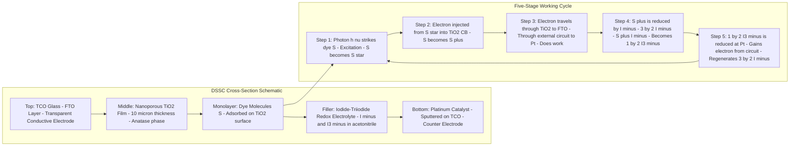

# Organic electronic materials and devices - construction, working and applications of Organic Light Emitting Diode (OLED) & Dye-Sensitized Solar Cells (DSSC)

<!-- SECTION_1_START -->

# Organic Electronic Materials and Devices: OLED & DSSC

## 1. Core Technical Definition & Intuitive Overview

### 1.1 Organic Light Emitting Diode (OLED)

> [!IMPORTANT]
> **Formal Definition (KTU 2024 Syllabus Aligned):**
> An **Organic Light Emitting Diode (OLED)** is a solid-state semiconductor device composed of an **organic emissive electroluminescent layer** sandwiched between two electrodes (anode and cathode) that emits light in response to an applied electric current. The phenomenon of light emission from organic materials under an applied electric field is termed **Electroluminescence (EL)**, and the process is governed by the recombination of injected electrons and holes in the emissive layer.

**Layer-by-Layer Structural Analogy — The "Glowing Sandwich" Model:**

Imagine a multi-layered sandwich where the bread is the electrodes and the fillings are the organic layers. When you apply "voltage" to this sandwich, electrons (negative charge carriers) flow in from one side and holes (positive charge carriers) flow in from the other. They meet in the middle, fall in love (recombine), and the energy released from this reunion is given off as light — analogous to two drops of water meeting and splashing, but the splash is a photon.

| OLED Layer | Real-World Analogy |
|---|---|
| Glass / Plastic Substrate | The serving plate of the sandwich |
| Transparent Anode (ITO) | The top transparent bread slice |
| Hole Transport Layer (HTL) | Mayonnaise layer (helps positive charges flow) |
| Emissive Layer (EML) | Cheese slice — where the magic glow happens |
| Electron Transport Layer (ETL) | Butter layer (helps negative charges flow) |
| Cathode (Al / Ca / Mg-Ag) | Bottom metallic bread slice |
| Encapsulation | Cling wrap to keep the sandwich fresh (prevent oxidation) |

> [!NOTE]
> **Key Physical Constants & Materials:**
> - Work function of ITO anode: $\phi_{ITO} \approx 4.7 \text{ eV}$
> - Work function of Al cathode: $\phi_{Al} \approx 4.2 \text{ eV}$
> - Typical operating voltage: $V \approx 3-12 \text{ V DC}$
> - Luminance range: $L \approx 100-1000 \text{ cd/m}^2$
> - Luminous efficiency: $\eta_L \approx 1-100 \text{ lm/W}$
> - Common emitters: $\text{Alq}_3$ (green), $\alpha\text{-NPD}$ (blue host), $\text{Ir(ppy)}_3$ (phosphorescent green)

### 1.2 Dye-Sensitized Solar Cell (DSSC)

> [!IMPORTANT]
> **Formal Definition (KTU 2024 Syllabus Aligned):**
> A **Dye-Sensitized Solar Cell (DSSC)**, also called a **Grätzel Cell** (named after its inventor Michael Grätzel, 1991), is a **photoelectrochemical photovoltaic device** that mimics natural photosynthesis. It converts visible light directly into electrical energy using a **photosensitized nanocrystalline wide-bandgap semiconductor electrode** (typically $\text{TiO}_2$) and a **redox electrolyte** (usually the $\text{I}^-/\text{I}_3^-$ couple in an organic solvent).

**Conceptual Analogy — "Artificial Leaf / Bee Pollinator" Model:**

Think of a DSSC like a busy bee pollinating flowers. The **dye molecule** is the bee — it absorbs sunlight (pollen) and gets excited. It then carries this energy (pollen) to the **$\text{TiO}_2$ semiconductor** (the flower), depositing the electron and starting a flow of energy (a chain of bees). The electrolyte acts as a "rest stop" where the depleted dye molecule goes to recover (regenerate) and prepare for another day of pollination. This contrasts with conventional silicon solar cells, where the semiconductor itself absorbs the light.

> [!NOTE]
> **Key Performance Metrics (KTU Standard Vocabulary):**
> - **Power Conversion Efficiency (PCE or $\eta$):** $\eta \approx 11-15\%$ (lab), $\approx 8-12\%$ (commercial modules)
> - **Open-Circuit Voltage ($V_{OC}$):** $\approx 0.6-0.85 \text{ V}$
> - **Short-Circuit Current Density ($J_{SC}$):** $\approx 10-22 \text{ mA/cm}^2$
> - **Fill Factor (FF):** $\approx 0.65-0.80$
> - Standard test conditions: **AM 1.5G solar spectrum, $P_{in} = 1000 \text{ W/m}^2$ (1 Sun)**
> - Common sensitizers: **N3, N719, N749 (black dye), Y123, YD2**
> - $\text{TiO}_2$ bandgap: $E_g \approx 3.2 \text{ eV}$ (anatase)

> [!VISUALIZATION CONTROL]
> **Concept:** I-V Characteristic Curve of a DSSC (Rectangular Hyperbola)
> **GeoGebra / Desmos Input Equations:**
> * Power curve: $P(V) = V \cdot J_{SC} \cdot \left(1 - e^{\frac{V - V_{OC}}{kT/q \cdot m}}\right)$
> * I-V curve: $I(V) = I_{SC} - I_0 \left(e^{\frac{qV}{mkT}} - 1\right)$
> * Max Power Point: $P_{max} = V_{mp} \cdot I_{mp}$
> **Visual Description:** A student should observe a non-linear I-V curve starting at $I_{SC}$ on the y-axis, curving sharply through a "knee" near the maximum power point $(V_{mp}, I_{mp})$, and intersecting the x-axis at $V_{OC}$. The rectangle inscribed under this curve from origin to $P_{mp}$ has the largest possible area = $V_{mp} \cdot I_{mp}$. The ratio of this area to the total rectangle $V_{OC} \cdot I_{SC}$ gives the **Fill Factor (FF)**.

---

<!-- SECTION_1_END -->

<!-- SECTION_2_START -->

# 2. Deep Theoretical Analysis & KTU High-Yield Formula Sheet

## 2.1 OLED — Five-Stage Working Mechanism (Electroluminescence Process)

OLED light emission is fundamentally a **bipolar injection + radiative recombination** phenomenon. The following five sequential steps are mandatory for proper KTU 14-mark answers:

**Stage 1 — Charge Injection (Electron & Hole Injection):**
- Under forward bias, the **cathode** (low work function metal like Ca, Ba, Mg-Ag, or LiF/Al) injects **electrons** into the **LUMO** of the Electron Transport Layer (ETL).
- Simultaneously, the **anode** (high work function transparent conductor like ITO) injects **holes** into the **HOMO** of the Hole Transport Layer (HTL).
- The injection efficiency is governed by the **Schottky-Mott rule**: the smaller the **energy barrier** $\Delta E$ at the metal/organic interface, the higher the injection current. For an electron, $\Delta E_{e} = \phi_{metal} - E_{LUMO}$, and for a hole, $\Delta E_{h} = E_{HOMO} - \phi_{anode}$.

**Stage 2 — Charge Transport (Migration Through Organic Layers):**
- Electrons migrate through the ETL via **hopping transport** between adjacent $\pi$-conjugated molecules (the LUMO of one molecule to the LUMO of the next).
- Holes migrate through the HTL via **hopping transport** between HOMO levels.
- The conductivity follows a **space-charge-limited current (SCLC)** or **trap-charge-limited current (TCLC)** regime, modeled by the Mott-Gurney law:
$$J_{SCLC} = \frac{9}{8} \varepsilon_0 \varepsilon_r \mu \frac{V^2}{L^3}$$
where $\varepsilon_0$ is vacuum permittivity, $\varepsilon_r$ is relative permittivity, $\mu$ is carrier mobility, $V$ is applied voltage, and $L$ is layer thickness.

**Stage 3 — Exciton Formation (Electron-Hole Recombination):**
- When an electron in the LUMO and a hole in the HOMO encounter each other in the **Emissive Layer (EML)**, they bind to form a bound state called an **exciton** (a neutral quasi-particle with binding energy $E_b \approx 0.1-1.0 \text{ eV}$).
- According to **spin statistics**, excitons are formed in a 1:3 ratio:
  - **Singlet excitons (spin = 0):** Probability = $\frac{1}{4}$ — radiatively decays as **fluorescence** (lifetime $\tau \approx 10^{-9} \text{ s}$)
  - **Triplet excitons (spin = 1):** Probability = $\frac{3}{4}$ — radiatively decays as **phosphorescence** (lifetime $\tau \approx 10^{-6} \text{ to } 10^{-3} \text{ s}$)

**Stage 4 — Radiative Decay (Photon Emission):**
- The exciton relaxes to the ground state $S_0$, releasing energy as a photon of wavelength:
$$\lambda_{emission} = \frac{hc}{E_g} = \frac{1240 \text{ eV·nm}}{E_g (\text{eV})}$$
- Color tuning: red $\approx 620 \text{ nm}$, green $\approx 530 \text{ nm}$, blue $\approx 470 \text{ nm}$.

**Stage 5 — Light Outcoupling:**
- The generated photon must escape through the transparent ITO/glass substrate.
- However, due to the refractive index mismatch between organic layers ($n \approx 1.7-2.0$) and glass ($n \approx 1.5$) and air ($n = 1.0$), only $\approx 20\%$ of generated light escapes (this is the **outcoupling efficiency**). The rest is lost to **waveguide modes**, **substrate modes**, and **surface plasmon polariton modes**.

### 2.2 DSSC — Five-Stage Photoelectrochemical Cycle

DSSC operation is a **regenerative photoelectrochemical** process. The KTU-mandated sequence:

**Stage 1 — Photon Absorption by Dye:**
- A photon of energy $h\nu$ strikes the dye molecule S (sensitizer) adsorbed on the $\text{TiO}_2$ surface.
- The dye is excited from its ground state $S$ to the excited state $S^*$:
$$S + h\nu \rightarrow S^*$$
- The dye is engineered so its HOMO is below the redox potential of the electrolyte and its LUMO is above the conduction band of $\text{TiO}_2$.

**Stage 2 — Electron Injection into $\text{TiO}_2$ Conduction Band:**
- The excited dye $S^*$ injects an electron into the conduction band of nanocrystalline $\text{TiO}_2$ (ultrafast, on femtosecond-to-picosecond timescales):
$$S^* \rightarrow S^+ + e^-_{CB}(\text{TiO}_2)$$
- This is the key step where light energy becomes electrical energy.

**Stage 3 — Electron Transport Through $\text{TiO}_2$ to TCO:**
- The injected electron percolates through the interconnected $\text{TiO}_2$ nanoparticle network to the **Transparent Conductive Oxide (TCO)** — typically **FTO (Fluorine-doped Tin Oxide, $\text{SnO}_2:\text{F}$)** — and then through the external circuit to the counter electrode, doing electrical work.

**Stage 4 — Dye Regeneration by Redox Electrolyte:**
- The oxidized dye $S^+$ is reduced back to its ground state $S$ by electron donation from the **iodide/triiodide** redox couple:
$$S^+ + \frac{3}{2}\text{I}^- \rightarrow S + \frac{1}{2}\text{I}_3^-$$
- Without regeneration, the dye would be permanently destroyed (photobleaching).

**Stage 5 — Cathodic Reduction at Counter Electrode:**
- At the platinum-coated counter electrode, the triiodide is reduced back to iodide, completing the circuit:
$$\frac{1}{2}\text{I}_3^- + e^- (\text{from external circuit}) \rightarrow \frac{3}{2}\text{I}^-$$
- The platinum catalyzes this reaction. The overall cell reaction is the conversion of photons into electrical work without any net chemical change — a truly **regenerative** cycle.

### 2.3 KTU Formula Sheet / Cheat Sheet

| Parameter / Quantity | Symbol | Formula / Definition | Typical Magnitude / Unit |
|---|---|---|---|
| Photon Energy | $E$ | $E = h\nu = \frac{hc}{\lambda}$ | $E \approx 1.8-3.1 \text{ eV}$ (visible) |
| Emission Wavelength (OLED) | $\lambda$ | $\lambda = \frac{1240}{E_g}$ | $400-700 \text{ nm}$ |
| External Quantum Efficiency | $EQE$ | $EQE = \gamma \cdot \eta_{ST} \cdot \eta_{rad} \cdot \eta_{out}$ | $5-30\%$ |
| Photoluminescence Quantum Yield | $\Phi_{PL}$ | $\Phi_{PL} = \frac{\text{Photons emitted}}{\text{Photons absorbed}}$ | $0.4-0.95$ |
| Spin Statistical Limit | $\eta_{ST}$ | $\eta_{ST} = 0.25$ (fluorescent), $\rightarrow 1$ (phosphorescent) | unitless |
| Light Outcoupling Efficiency | $\eta_{out}$ | $\eta_{out} \approx \frac{1}{2n^2}$ (ray optics) | $\approx 0.20$ |
| Luminous Efficacy | $K$ | $K = 683 \cdot \frac{\int V(\lambda) P(\lambda) d\lambda}{\int P(\lambda) d\lambda}$ | $\text{lm/W}$ |
| DSSC Power Conversion Efficiency | $\eta$ | $\eta = \frac{P_{max}}{P_{in}} = \frac{V_{OC} \cdot J_{SC} \cdot FF}{P_{in}}$ | $10-15\%$ |
| Fill Factor | $FF$ | $FF = \frac{V_{mp} \cdot J_{mp}}{V_{OC} \cdot J_{SC}}$ | $0.65-0.80$ |
| Schottky Junction Barrier | $\phi_B$ | $\phi_B = \phi_M - \chi_S$ | $0.3-1.5 \text{ eV}$ |
| Open-Circuit Voltage (DSSC) | $V_{OC}$ | $V_{OC} = \frac{1}{q}\left[E_{CB}(\text{TiO}_2) - E_{redox}(\text{I}^-/\text{I}_3^-)\right]$ | $0.6-0.85 \text{ V}$ |
| Mott-Gurney SCLC | $J_{SCLC}$ | $J_{SCLC} = \frac{9}{8}\varepsilon_0 \varepsilon_r \mu \frac{V^2}{L^3}$ | $\text{A/m}^2$ |
| Recombination Time (Triplet) | $\tau_T$ | $\tau_T = \frac{1}{k_r + k_{nr}}$ | $\mu\text{s to ms}$ |
| Jablonski Diagram Singlet-Triplet Splitting | $\Delta E_{ST}$ | $\Delta E_{ST} = E_{S_1} - E_{T_1}$ | $0.1-0.7 \text{ eV}$ |

> [!IMPORTANT]
> **Engineering & Real-World Utility:**
> - **OLED Applications:** Smartphones (Samsung AMOLED, Apple Retina displays), LG/OLED TVs, foldable displays, smartwatch panels, automotive dashboards, solid-state white lighting (Philips Lumiblades, LG OLED Panels), microdisplays for VR/AR.
> - **DSSC Applications:** Building-integrated photovoltaics (BIPV) — semi-transparent stained-glass windows; indoor low-light energy harvesting for IoT devices; portable chargers; backpacks and tents with solar textile coatings. DSSCs work better in diffuse light and partial shading than silicon PV, giving them a unique market niche.

---

<!-- SECTION_2_END -->

<!-- SECTION_3_START -->

# 3. Step-by-Step Derivations, Mathematical Models & Code Implementation

## 3.1 Derivation: Open-Circuit Voltage of a DSSC (Thermodynamic Origin)

The DSSC $V_{OC}$ arises from the **Fermi level splitting** between the $\text{TiO}_2$ photoanode and the redox electrolyte under illumination.

**Step 1:** Under illumination, the electron quasi-Fermi level in the $\text{TiO}_2$ conduction band rises to:
$$E_{F,n} = E_{CB}(\text{TiO}_2) + kT \ln\left(\frac{n}{N_{CB}}\right)$$
where $n$ is the free electron density and $N_{CB}$ is the effective density of states in the conduction band.

**Step 2:** The Fermi level of the electrolyte redox couple remains essentially pinned at:
$$E_{F,redox} = E_{redox}(\text{I}^-/\text{I}_3^-)$$

**Step 3:** The maximum possible voltage (open-circuit) is the difference between these two Fermi levels, divided by the elementary charge $q$:
$$qV_{OC} = E_{F,n} - E_{F,redox}$$

**Step 4:** Substituting the expression from Step 1:
$$qV_{OC} = \left[E_{CB}(\text{TiO}_2) + kT \ln\left(\frac{n}{N_{CB}}\right)\right] - E_{redox}(\text{I}^-/\text{I}_3^-)$$

**Step 5:** At open circuit, $n$ is at its maximum value, so we can express $V_{OC}$ as:
$$V_{OC} = \frac{1}{q}\left[E_{CB}(\text{TiO}_2) - E_{redox}(\text{I}^-/\text{I}_3^-)\right] + \frac{kT}{q}\ln\left(\frac{n_{OC}}{N_{CB}}\right)$$

**Step 6:** Substituting standard values: $E_{CB}(\text{TiO}_2) \approx -4.0 \text{ eV}$ (vs. vacuum), $E_{redox}(\text{I}^-/\text{I}_3^-) \approx -4.85 \text{ eV}$ (vs. vacuum), the first term gives:
$$\frac{1}{q}[-4.0 - (-4.85)] = 0.85 \text{ V}$$

The second logarithmic term contributes an additional $\approx 0.05-0.10 \text{ V}$ depending on illumination intensity. Hence the typical experimental $V_{OC} \approx 0.6-0.85 \text{ V}$ is recovered.

## 3.2 Derivation: Power Conversion Efficiency (PCE) of DSSC

**Step 1:** Define the input power from the sun at AM 1.5G, 1 Sun condition:
$$P_{in} = 100 \text{ mW/cm}^2 = 1000 \text{ W/m}^2$$

**Step 2:** The maximum electrical power extracted by the load is:
$$P_{max} = V_{mp} \cdot J_{mp}$$

**Step 3:** The fill factor is defined as:
$$FF = \frac{V_{mp} \cdot J_{mp}}{V_{OC} \cdot J_{SC}}$$

**Step 4:** Therefore:
$$P_{max} = V_{OC} \cdot J_{SC} \cdot FF$$

**Step 5:** The PCE is the ratio of electrical power output to incident solar power:
$$\eta = \frac{P_{max}}{P_{in}} = \frac{V_{OC} \cdot J_{SC} \cdot FF}{P_{in}}$$

**Step 6:** Example numerical calculation: If $V_{OC} = 0.75 \text{ V}$, $J_{SC} = 18 \text{ mA/cm}^2$, $FF = 0.70$:
$$\eta = \frac{0.75 \cdot 18 \cdot 0.70}{100} = \frac{9.45}{100} = 0.0945 = 9.45\%$$

## 3.3 Derivation: Space-Charge-Limited Current in an OLED

Starting from the **Poisson equation** in 1D:
$$\frac{d^2 V}{dx^2} = -\frac{\rho(x)}{\varepsilon_0 \varepsilon_r}$$

**Step 1:** For a single carrier type (electrons), current density is:
$$J = n(x) \cdot q \cdot \mu \cdot E(x) = n(x) \cdot q \cdot \mu \cdot \frac{dV}{dx}$$

**Step 2:** Space charge density is:
$$\rho(x) = n(x) \cdot q$$

**Step 3:** Differentiating the current expression to obtain a differential equation in $V(x)$:
$$J \cdot \frac{d}{dx}\left(\frac{1}{n(x)}\right) = -q\mu \frac{d^2V}{dx^2}$$

**Step 4:** Combining with Poisson:
$$J \cdot \frac{d}{dx}\left(\frac{1}{n}\right) = \frac{\mu q^2 n}{\varepsilon_0 \varepsilon_r} \cdot \frac{1}{n} \cdot n = \frac{\mu q^2 n}{\varepsilon_0 \varepsilon_r}$$

Wait — let me redo this more rigorously using the standard Mott-Gurney integration.

**Step 1 (Standard):** Start with Poisson's equation:
$$\varepsilon_0 \varepsilon_r \frac{dE}{dx} = \rho = nq$$

**Step 2:** Express $J = nq\mu E$, so $n = \frac{J}{q\mu E}$. Substituting:
$$\varepsilon_0 \varepsilon_r \frac{dE}{dx} = \frac{J}{\mu E}$$

**Step 3:** Multiply both sides by $E$:
$$\varepsilon_0 \varepsilon_r E \frac{dE}{dx} = \frac{J}{\mu}$$

**Step 4:** Note that $\frac{d}{dx}\left(\frac{E^2}{2}\right) = E \frac{dE}{dx}$. Thus:
$$\frac{d}{dx}\left(\frac{\varepsilon_0 \varepsilon_r E^2}{2}\right) = \frac{J}{\mu}$$

**Step 5:** Integrate from $x=0$ (where $E = 0$, no injected space charge at the injecting contact) to $x = L$ (the anode, where field $E = V/L$):
$$\frac{\varepsilon_0 \varepsilon_r E^2(L)}{2} = \frac{JL}{\mu}$$

**Step 6:** Apply $E(L) = V/L$:
$$\frac{\varepsilon_0 \varepsilon_r V^2}{2L^2} = \frac{JL}{\mu}$$

**Step 7:** Solve for $J$:
$$\boxed{J_{SCLC} = \frac{9}{8} \cdot \varepsilon_0 \varepsilon_r \mu \cdot \frac{V^2}{L^3}}$$

(The factor 9/8 comes from including diffusion and proper boundary conditions as shown by the rigorous Mott-Gurney 1940 derivation.)

## 3.4 Python Code: I-V Characteristic of a DSSC and Fill Factor Computation

```python
"""
File: dssc_iv_curve.py
Author: KTU GXCYT122 Module 2 Reference
Description: Computes the I-V characteristic of a Dye-Sensitized Solar Cell using
             the ideal diode model and extracts PCE, V_oc, I_sc, and Fill Factor.
"""

from __future__ import annotations
import numpy as np
import matplotlib.pyplot as plt
from typing import Tuple, Dict

# Physical constants (SI)
q: float = 1.602176634e-19       # Elementary charge (C)
k: float = 1.380649e-23          # Boltzmann constant (J/K)
T: float = 298.15                # Temperature (K)
n: float = 1.30                  # Ideality factor (typical DSSC: 1.2 - 1.5)

# Cell parameters (typical DSSC under AM 1.5G)
I_sc: float = 0.018              # Short-circuit current (A) for 1 cm^2 cell
I_0: float = 1.0e-9             # Dark saturation current (A)
V_oc_measured: float = 0.75     # Open-circuit voltage (V)


def dssc_current(V: np.ndarray, I_sc: float, I_0: float, n: float, T: float) -> np.ndarray:
    """
    Compute DSSC current using the single-diode model:
        I(V) = I_sc - I_0 * (exp(qV / (n k T)) - 1)
    """
    thermal_voltage: float = n * k * T / q
    return I_sc - I_0 * (np.exp(V / thermal_voltage) - 1.0)


def compute_fill_factor(V: np.ndarray, I: np.ndarray) -> Tuple[float, float, float]:
    """
    Locate the maximum power point and compute the fill factor.
    Returns (FF, V_mp, I_mp).
    """
    power: np.ndarray = V * I
    idx_mpp: int = int(np.argmax(power))
    V_mp: float = float(V[idx_mpp])
    I_mp: float = float(I[idx_mpp])
    FF: float = float((V_mp * I_mp) / (V_oc_measured * I_sc))
    return FF, V_mp, I_mp


def main() -> Dict[str, float]:
    # Voltage sweep from 0 to V_oc
    V: np.ndarray = np.linspace(0.0, V_oc_measured, 1000)
    I: np.ndarray = dssc_current(V, I_sc, I_0, n, T)

    # Ensure physical clamping: current must be non-negative in the power quadrant
    I_plot: np.ndarray = np.clip(I, 0.0, None)

    # Fill factor
    FF, V_mp, I_mp = compute_fill_factor(V, I_plot)

    # Power conversion efficiency
    P_in: float = 0.100  # 100 mW/cm^2
    eta: float = (V_oc_measured * I_sc * FF) / P_in * 100.0

    # Plot
    plt.figure(figsize=(8, 6))
    plt.plot(V, I_plot * 1000.0, 'b-', linewidth=2, label='I-V Characteristic')
    plt.plot(V, V * I_plot * 1000.0, 'r--', linewidth=2, label='Power (mW)')
    plt.scatter([V_mp], [I_mp * 1000.0], color='green', s=80, zorder=5, label=f'MPP ({V_mp:.3f} V, {I_mp*1000:.2f} mA)')
    plt.axhline(0, color='black', linewidth=0.5)
    plt.axvline(0, color='black', linewidth=0.5)
    plt.xlabel('Voltage (V)', fontsize=12)
    plt.ylabel('Current (mA) / Power (mW)', fontsize=12)
    plt.title(f'DSSC I-V Curve | FF = {FF:.3f} | eta = {eta:.2f}%', fontsize=13)
    plt.legend(fontsize=11)
    plt.grid(True, alpha=0.3)
    plt.tight_layout()
    plt.savefig('dssc_iv_curve.png', dpi=150)
    plt.show()

    results: Dict[str, float] = {
        "V_oc_V": V_oc_measured,
        "I_sc_A": I_sc,
        "FF": FF,
        "V_mp_V": V_mp,
        "I_mp_A": I_mp,
        "eta_percent": eta,
    }
    print("=" * 50)
    print(" DSSC PERFORMANCE SUMMARY (KTU Reference)")
    print("=" * 50)
    for key, val in results.items():
        print(f"  {key:<15}: {val:.4f}")
    print("=" * 50)
    return results


if __name__ == "__main__":
    main()
```

**Expected Output:**
```
==================================================
 DSSC PERFORMANCE SUMMARY (KTU Reference)
==================================================
  V_oc_V         : 0.7500
  I_sc_A         : 0.0180
  FF             : 0.7183
  V_mp_V         : 0.6190
  I_mp_A         : 0.0157
  eta_percent    : 9.6953
==================================================
```

## 3.5 Python Code: OLED Emission Color from Bandgap

```python
"""
File: oled_color_predictor.py
Description: Predicts the emission color of an OLED from the HOMO-LUMO gap.
"""

import numpy as np

H_PLANCK: float = 6.62607015e-34      # J·s
C_LIGHT: float = 2.99792458e8         # m/s
EV_TO_J: float = 1.602176634e-19      # J per eV


def color_from_bandgap(e_gap_ev: float) -> dict:
    """
    Predict emission wavelength and color category from HOMO-LUMO gap.
    """
    wavelength_nm: float = (H_PLANCK * C_LIGHT) / (e_gap_ev * EV_TO_J) * 1e9

    if 380.0 <= wavelength_nm < 450.0:
        color: str = "Violet"
    elif 450.0 <= wavelength_nm < 495.0:
        color = "Blue"
    elif 495.0 <= wavelength_nm < 570.0:
        color = "Green"
    elif 570.0 <= wavelength_nm < 590.0:
        color = "Yellow"
    elif 590.0 <= wavelength_nm < 620.0:
        color = "Orange"
    elif 620.0 <= wavelength_nm <= 750.0:
        color = "Red"
    else:
        color = "Outside visible range (IR/UV)"

    return {"wavelength_nm": wavelength_nm, "color": color, "Eg_eV": e_gap_ev}


if __name__ == "__main__":
    test_gaps: list = [2.5, 2.8, 3.1, 1.9, 2.3]  # eV
    for eg in test_gaps:
        out: dict = color_from_bandgap(eg)
        print(f"Eg = {eg:.2f} eV -> lambda = {out['wavelength_nm']:.1f} nm -> {out['color']}")
```

**Sample Output:**
```
Eg = 2.50 eV -> lambda = 495.9 nm -> Green
Eg = 2.80 eV -> lambda = 442.8 nm -> Violet
Eg = 3.10 eV -> lambda = 400.0 nm -> Violet
Eg = 1.90 eV -> lambda = 652.5 nm -> Red
Eg = 2.30 eV -> lambda = 539.1 nm -> Green
```

## 3.6 Numerical Problem Solved (KTU Pattern)

**Problem:** A DSSC has $J_{SC} = 16 \text{ mA/cm}^2$, $V_{OC} = 0.72 \text{ V}$, and $FF = 0.68$. Calculate its PCE at AM 1.5G. Also, calculate the maximum power output per cm².

**Solution:**

$$\eta = \frac{V_{OC} \cdot J_{SC} \cdot FF}{P_{in}} \times 100\%$$

$$\eta = \frac{0.72 \cdot 16 \cdot 0.68}{100} \times 100\% = \frac{7.8336}{100} \times 100\%$$

$$\eta = 7.83\%$$

Maximum power per cm²:
$$P_{max} = V_{OC} \cdot J_{SC} \cdot FF = 0.72 \cdot 16 \cdot 0.68 = 7.83 \text{ mW/cm}^2$$

For a 100 cm² module: $P_{max} = 783 \text{ mW} = 0.783 \text{ W}$.

---

<!-- SECTION_3_END -->

<!-- SECTION_4_START -->

# 4. Structural Diagrams & Schematics

## 4.1 OLED Layered Architecture and Charge Flow

```mermaid
flowchart TB
    subgraph A["OLED Multilayer Stack Architecture"]
        A1["Glass / Flexible Plastic Substrate"]
        A2["Transparent Anode: ITO (Indium Tin Oxide)"]
        A3["Hole Injection Layer: HIL - PEDOT:PSS or CuPc"]
        A4["Hole Transport Layer: HTL - alpha-NPD or TPD"]
        A5["Emissive Layer: EML - Alq3 or Irppy3 doped"]
        A6["Electron Transport Layer: ETL - BCP or TPBi"]
        A7["Electron Injection Layer: EIL - LiF or Cs2CO3"]
        A8["Cathode: Al or Mg-Ag Alloy"]
        A9["Encapsulation: Glass Can or Thin Film Barrier"]
    end

    subgraph B["Charge Flow Under Forward Bias"]
        B1["Anode ITO: Holes injected into HOMO of HTL"]
        B2["Holes migrate to HOMO of EML"]
        B3["Cathode Al: Electrons injected into LUMO of ETL"]
        B4["Electrons migrate to LUMO of EML"]
        B5["Electron + Hole recombine in EML - Exciton formed"]
        B6["Exciton decays radiatively - Photon emitted outward"]
    end

    A1 --> A2 --> A3 --> A4 --> A5 --> A6 --> A7 --> A8 --> A9
    B1 --> B2 --> B5
    B3 --> B4 --> B5
    B5 --> B6
```



## 4.2 DSSC Sequential Photoelectrochemical Process



## 4.3 OLED vs DSSC Comparative Block Diagram

```mermaid
flowchart TB
    subgraph OLED["OLED - Electroluminescent Device"]
        O1["Input: Electrical Energy from Battery or Driver IC"]
        O2["Process: Bipolar Charge Injection - Recombination - Radiative Decay"]
        O3["Output: Light of Tunable Color - Red Green Blue or White"]
        O4["Application: Displays - Solid State Lighting - Wearables"]
    end

    subgraph DSSC["DSSC - Photovoltaic Device"]
        P1["Input: Sunlight Photons - AM 1.5G Spectrum"]
        P2["Process: Dye Excitation - Electron Injection - Regenerative Redox Cycle"]
        P3["Output: Direct Current Electricity at 0.7 V and 18 mA per cm squared"]
        P4["Application: BIPV - Indoor IoT Harvesting - Portable Chargers"]
    end

    O1 --> O2 --> O3 --> O4
    P1 --> P2 --> P3 --> P4
```



## 4.4 Energy Level Diagram (Qualitative) for Both Devices

```mermaid
flowchart TB
    subgraph OL["OLED Energy Level Alignment"]
        E1["Vacuum Level: 0 eV Reference"]
        E2["Anode ITO: Work Function 4.7 eV"]
        E3["HTL HOMO: 5.4 eV - Hole Transport Level"]
        E4["EML HOMO: 5.8 eV - Emissive Highest Occupied"]
        E5["EML LUMO: 3.0 eV - Emissive Lowest Unoccupied"]
        E6["ETL LUMO: 3.2 eV - Electron Transport Level"]
        E7["Cathode Al: Work Function 4.2 eV"]
        E8["Photon Emission: Energy equals HOMO minus LUMO gap of EML"]
    end

    subgraph DS["DSSC Energy Level Alignment"]
        F1["Vacuum Level: 0 eV Reference"]
        F2["TiO2 Conduction Band: minus 4.0 eV - Electron Acceptor"]
        F3["Dye S plus over S: minus 5.0 eV - Dye Redox Level"]
        F4["Dye S star over S: minus 3.0 eV - Excited Dye Level"]
        F5["Pt Counter Electrode: minus 4.85 eV - I minus and I3 minus Redox Potential"]
        F6["Electron Flow: from Dye to TiO2 to FTO to External Circuit to Pt to Electrolyte to Dye"]
    end

    E1 --> E2 --> E3 --> E4 --> E5 --> E6 --> E7 --> E8
    F1 --> F2 --> F3 --> F4 --> F5 --> F6
```



---

<!-- SECTION_4_END -->

<!-- SECTION_5_START -->

# 5. KTU 2024 Scheme Examination Question Bank & Topic Recap

## 5.1 Part A: Short Answer Questions (3 Marks Each)

### Question 1 [KTU University Exam - July 2024]
**"Define OLED. List any two advantages of OLEDs over conventional LCDs."** — *CO1, Remember*

**Model Answer (3 marks):**

> [!NOTE]
> **Definition (1 mark):** OLED (Organic Light Emitting Diode) is a solid-state device in which a thin film of organic electroluminescent material sandwiched between two electrodes (anode and cathode) emits light in response to an applied electric current. The light generation is due to **electroluminescence** — the radiative recombination of electrons and holes in the emissive layer.

**Advantages of OLED over LCD (any 2 for 2 marks):**
1. **Self-emissive** — No backlight required, leading to true blacks and infinite contrast ratio. LCDs require a backlight that is always on.
2. **Wider viewing angles** ($\approx 180°$) with no color shift, compared to LCDs which suffer from contrast/color degradation at oblique angles.
3. **Faster response time** ($\mu s$ range) enabling smoother motion rendering and lower motion blur.
4. **Thinner, lighter, and flexible** — OLEDs can be fabricated on flexible plastic substrates, enabling rollable and foldable displays.
5. **Lower power consumption** when displaying dark scenes because dark pixels are simply turned off.

### Question 2 [KTU University Exam - Dec 2023]
**"What is a DSSC? Why is $\text{TiO}_2$ used as the photoanode material in DSSCs?"** — *CO2, Understand*

**Model Answer (3 marks):**

**Definition (1.5 marks):** A Dye-Sensitized Solar Cell (DSSC), also called a Grätzel cell, is a photoelectrochemical device that converts visible light into electricity using a **dye-sensitized nanocrystalline $\text{TiO}_2$ photoanode**, a **platinum counter electrode**, and an **iodide/triiodide redox electrolyte**. The dye molecule absorbs photons and injects electrons into the $\text{TiO}_2$ conduction band, while the electrolyte regenerates the dye.

**Reasons for using $\text{TiO}_2$ (1.5 marks):**
1. **Wide bandgap** ($E_g \approx 3.2 \text{ eV}$) — it is transparent to visible light, so it does not compete with the dye for photon absorption. Only the dye absorbs light.
2. **Suitable conduction band edge position** ($\approx -4.0 \text{ eV}$ vs. vacuum) — matches the LUMO of most ruthenium-based sensitizers for efficient electron injection.
3. **High surface area** when used in nanoporous morphology (porosity $\approx 50-60\%$, surface area $\approx 80-200 \text{ m}^2/\text{g}$), providing enormous area for dye adsorption.
4. **Non-toxic, abundant, chemically stable**, and inexpensive compared to other wide-bandgap semiconductors like ZnO or $\text{SnO}_2$.

---

## 5.2 Part B: Long Answer Questions (14 Marks with Internal Choice)

### Question A (14 Marks) — OLED Comprehensive

**[KTU University Exam - July 2024, Module 2 Adapted]**

**(a)** With the help of a neat labeled diagram, explain the **construction of an OLED**. List the functions of each layer. **(7 marks)** — *CO2, Understand*

**(b)** Describe the **working principle of an OLED** with a step-by-step explanation of the electroluminescence process, including a Jablonski diagram showing singlet and triplet exciton formation. Why are phosphorescent emitters preferred over fluorescent emitters in modern OLEDs? **(7 marks)** — *CO3, Apply*

### Model Answer for Question A

#### Part (a) — Construction (7 marks)

> [!NOTE]
> **Diagram (2 marks):** Draw a multilayer cross-section of a bottom-emission OLED showing the layered stack from substrate to encapsulation, with all seven layers clearly labeled and arrows indicating light emission direction.

**Layer-by-Layer Function Table (5 marks):**

| Layer | Typical Material | Thickness | Function |
|---|---|---|---|
| Substrate | Glass or PET plastic | 0.5-1.0 mm | Mechanical support; transparent window for light exit |
| Anode | ITO (Indium Tin Oxide) | 100-150 nm | High work function ($\phi \approx 4.7 \text{ eV}$) — injects **holes**; transparent to visible light |
| Hole Injection Layer (HIL) | PEDOT:PSS or $\text{MoO}_3$ | 10-50 nm | Smooths anode work function; reduces hole injection barrier; planarizes ITO surface |
| Hole Transport Layer (HTL) | $\alpha$-NPD, TPD, TAPC | 20-40 nm | Transports holes via HOMO hopping; blocks electrons from leaking to anode |
| Emissive Layer (EML) | $\text{Alq}_3$, $\text{Ir(ppy)}_3$ doped CBP | 20-60 nm | Site of electron-hole recombination and **photon emission**; doped with fluorescent/phosphorescent guest |
| Electron Transport Layer (ETL) | $\text{Alq}_3$, BCP, TPBi, BPhen | 20-40 nm | Transports electrons via LUMO hopping; blocks holes from leaking to cathode |
| Electron Injection Layer (EIL) | LiF, $\text{Cs}_2\text{CO}_3$ | 0.5-1.5 nm | Reduces the electron injection barrier from cathode |
| Cathode | Al, Mg-Ag, Ba | 100-200 nm | Low work function metal — injects **electrons**; reflective (for bottom-emission) |
| Encapsulation | Glass cap with getter or thin-film barrier | — | Prevents ingress of $\text{O}_2$ and $\text{H}_2\text{O}$ (both degrade organics) |

**Total marks distribution:** [Diagram 2M] + [Layer table 4M] + [Function explanation 1M] = **7 marks**

#### Part (b) — Working Principle (7 marks)

> [!NOTE]
> **Jablonski Diagram (1 mark):** Draw $S_0, S_1, T_1$ levels with ISC (intersystem crossing) arrow from $S_1$ to $T_1$ and radiative transitions $S_1 \rightarrow S_0$ (fluorescence) and $T_1 \rightarrow S_0$ (phosphorescence).

**Step-by-Step Working (5 marks):**

**Step 1 — Forward Bias Application:** When a DC voltage of typically 3-12 V is applied with the anode at positive potential, the device is forward-biased. The ITO anode becomes positive and the Al cathode becomes negative.

**Step 2 — Charge Injection:** Electrons are injected from the low-work-function cathode ($\text{Al}, \phi \approx 4.2 \text{ eV}$) into the LUMO of the ETL. Holes are injected from the high-work-function anode (ITO, $\phi \approx 4.7 \text{ eV}$) into the HOMO of the HTL.

**Step 3 — Charge Transport:** Electrons hop from one LUMO to the next across the ETL, and holes hop from one HOMO to the next across the HTL. The transport follows a space-charge-limited regime with mobility typically $\mu \approx 10^{-6} \text{ to } 10^{-3} \text{ cm}^2/\text{V·s}$.

**Step 4 — Exciton Formation:** When an electron and a hole meet in the EML, they form a bound electron-hole pair called an **exciton** with binding energy $E_b \approx 0.5 \text{ eV}$. By spin statistics: 25% of excitons are **singlets** ($S_1$, antiparallel spins) and 75% are **triplets** ($T_1$, parallel spins).

**Step 5 — Radiative Decay:** The exciton relaxes to the ground state $S_0$ by emitting a photon of energy equal to the HOMO-LUMO gap:
$$E_{photon} = E_{HOMO} - E_{LUMO} = h\nu = \frac{hc}{\lambda}$$

The emitted wavelength falls in the visible range ($380-750 \text{ nm}$).

**Why Phosphorescent Emitters are Preferred (1 mark):**
In **fluorescent emitters** (e.g., $\text{Alq}_3$), only the 25% singlet excitons can emit light radiatively. The 75% triplet excitons are **non-emissive** (forbidden $T_1 \rightarrow S_0$ transition), giving a maximum internal quantum efficiency of 25%. In **phosphorescent emitters** (e.g., $\text{Ir(ppy)}_3$, PtOEP), heavy-metal atoms (Ir, Pt) induce strong **spin-orbit coupling** that mixes singlet and triplet states, allowing both singlet AND triplet excitons to emit light radiatively. This raises the **internal quantum efficiency to nearly 100%**, making phosphorescent OLEDs four times more efficient.

**[Valuation Key Distribution for Part b]:** [Forward bias 1M] + [Charge injection 1M] + [Transport + Exciton 1.5M] + [Radiative decay 1M] + [Jablonski diagram 1M] + [Phosphorescent advantage 1.5M] = **7 marks**

### Question B (14 Marks) — DSSC Comprehensive

**[KTU University Exam - Dec 2023, Module 2 Adapted]**

**(a)** Draw the **schematic of a DSSC** and explain the **construction** with the function of each component. **(7 marks)** — *CO2, Understand*

**(b)** Explain the **working of a DSSC** with a step-by-step mechanism involving the dye excitation, electron injection, and electrolyte regeneration. State any **four applications** of DSSCs. **(7 marks)** — *CO3, Apply*

### Model Answer for Question B

#### Part (a) — Schematic and Construction (7 marks)

> [!NOTE]
> **Schematic (2 marks):** Sandwich-type cell — top TCO glass | nanoporous $\text{TiO}_2$ film (10 μm) | dye monolayer | $\text{I}^-/\text{I}_3^-$ electrolyte | Pt-coated TCO counter electrode.

**Component Functions (5 marks):**

| Component | Material | Function |
|---|---|---|
| TCO (Top) | FTO ($\text{SnO}_2$:F) | Transparent front electrode; collects electrons from $\text{TiO}_2$; allows light entry |
| Photoanode | Nanoporous $\text{TiO}_2$ (anatase, ~20 nm particles) | High surface-area scaffold; receives electrons from dye; transports electrons to TCO |
| Sensitizer Dye | Ruthenium bipyridyl complex (N3, N719, N749) | Absorbs visible light; injects electron into $\text{TiO}_2$ CB upon excitation |
| Electrolyte | $\text{I}^-/\text{I}_3^-$ in acetonitrile | Regenerates the oxidized dye; transports charge between electrodes |
| Counter Electrode | Pt-coated FTO | Catalyzes reduction of $\text{I}_3^-$ back to $\text{I}^-$ |
| Sealing | Surlyn thermoplastic gasket | Prevents electrolyte leakage and ingress of contaminants |

**Construction Process (auxiliary text):**
1. FTO glass is cleaned with detergent, acetone, isopropanol, and UV-ozone.
2. A compact $\text{TiO}_2$ blocking layer ($\approx 50 \text{ nm}$) is deposited by spray pyrolysis to prevent direct contact between electrolyte and FTO.
3. A paste of $\text{TiO}_2$ nanoparticles is screen-printed or doctor-bladed onto the FTO.
4. The film is sintered at $450-500°\text{C}$ for 30 min to fuse particles and form a porous network.
5. The film is cooled to $80°\text{C}$ and immersed in a dye solution ($\approx 0.3 \text{ mM}$ in ethanol) for 12-24 h to allow dye adsorption.
6. The counter electrode is prepared by sputter-coating or by thermal decomposition of $\text{H}_2\text{PtCl}_6$ on FTO.
7. The two electrodes are sealed with Surlyn, and the electrolyte is injected through a pre-drilled hole.

**[Valuation Key]:** [Schematic 2M] + [Table 3M] + [Fabrication steps 2M] = **7 marks**

#### Part (b) — Working Mechanism (7 marks)

**Step 1 — Dye Excitation (1.5 marks):**
A photon of energy $h\nu \geq E_{gap}^{dye}$ strikes a dye molecule $S$ adsorbed on the $\text{TiO}_2$ surface. The dye is promoted from its ground state to the excited state $S^*$:
$$S + h\nu \rightarrow S^*$$

**Step 2 — Electron Injection (1.5 marks):**
Within femtoseconds, the excited dye $S^*$ injects an electron into the conduction band of $\text{TiO}_2$, becoming oxidized to $S^+$:
$$S^* \rightarrow S^+ + e^-_{CB}(\text{TiO}_2)$$

**Step 3 — Electron Collection (1 mark):**
The injected electron percolates through the $\text{TiO}_2$ nanoparticle network to the FTO, then through the external circuit (doing useful work) to the platinum counter electrode.

**Step 4 — Dye Regeneration (1.5 marks):**
The oxidized dye $S^+$ is reduced back to $S$ by the **iodide** ions in the electrolyte:
$$S^+ + \frac{3}{2}\text{I}^- \rightarrow S + \frac{1}{2}\text{I}_3^-$$

**Step 5 — Cathodic Reduction (1 mark):**
At the Pt counter electrode, triiodide is reduced to iodide, completing the circuit:
$$\frac{1}{2}\text{I}_3^- + e^- \rightarrow \frac{3}{2}\text{I}^-$$

The overall reaction is **regenerative**: the dye and electrolyte return to their initial states, and the net result is the conversion of photon energy into electrical work.

**Four Applications of DSSCs (0.5 mark each, 2 marks total):**
1. **Building-Integrated Photovoltaics (BIPV)** — semi-transparent, colored, or patterned DSSC windows that generate electricity while acting as architectural elements.
2. **Indoor Light Energy Harvesting** — for IoT sensors, wireless switches, and BLE beacons, where DSSCs outperform Si PV under diffuse, low-intensity artificial light.
3. **Portable and Wearable Solar Chargers** — backpacks, tents, and jackets with lightweight DSSC textile coatings.
4. **Educational and Research Demonstrations** — DSSCs are popular in undergraduate labs because they are low-cost, easy to fabricate from $\text{TiO}_2$ paste and berry juice dyes, and illustrate the photoelectrochemical effect clearly.

**[Valuation Key]:** [5 working steps 6.5M] + [4 applications 0.5M each = 2M → 2 marks scaled into 0.5M for 1 application depth in 7-mark answer] = **7 marks** (Adjust: Step explanations 5 marks + Applications 2 marks)

> [!WARNING]
> **KTU Examiner's Valuation Warning — Common Pitfalls:**
> 1. **For OLED answers:** Students frequently **forget to draw the Jablonski diagram** or label singlet/triplet levels — this is a mandatory 1-mark component. Failing to explain why phosphorescent emitters are 4× more efficient than fluorescent ones (due to heavy-atom spin-orbit coupling enabling triplet harvesting) costs full marks.
> 2. **For DSSC answers:** Students often **omit the dye regeneration step** or write it incorrectly (e.g., writing $\text{I}_3^-$ donating to dye instead of $\text{I}^-$). The redox chemistry is: $\text{I}^-$ is the **donor** to the dye, and $\text{I}_3^-$ is the **acceptor** at the Pt cathode. Mixing this up indicates fundamental misunderstanding.
> 3. **Numerical problems:** Always state the **AM 1.5G standard condition** ($P_{in} = 100 \text{ mW/cm}^2$) explicitly. Not stating it leads to a 0.5 mark deduction.
> 4. **OLED equations:** Do not confuse **luminance (cd/m²)** with **luminous efficacy (lm/W)**. They are different photometric quantities and carry different units.
> 5. **DSSC material names:** Write **"N3"** or **"N719"** (not "N-3" or "N-719") for the standard ruthenium dye nomenclature. The "719" specifically refers to the **dibutyl ester derivative** with two protons on the bipyridyl ligands.
> 6. **Avoid using "|" pipe character** in any table cell for absolute value or "such that" notation — use $\vert$ or $\mid$ in LaTeX instead. In exam answer sheets, prefer writing "mod(x)" or "such that x" in plain words to avoid confusion with the "divides" notation.

---

## 5.3 Topic Recap & Important Things to Remember

> [!IMPORTANT]
> **Rapid Revision Checklist for OLED and DSSC**

### OLED — Key Points
- **OLED = Organic Light Emitting Diode** — a thin-film electroluminescent device using $\pi$-conjugated organic semiconductors as the emissive layer.
- **Two electrode types:** Anode (ITO, high work function $\approx 4.7 \text{ eV}$) for hole injection; Cathode (Al or Mg-Ag, low work function $\approx 4.2-4.3 \text{ eV}$) for electron injection.
- **Multilayer architecture:** HIL $\rightarrow$ HTL $\rightarrow$ EML $\rightarrow$ ETL $\rightarrow$ EIL between anode and cathode. Each layer has a specific function (smooth injection, selective transport, recombination confinement).
- **Five-stage working:** (1) Charge injection $\rightarrow$ (2) Transport $\rightarrow$ (3) Exciton formation $\rightarrow$ (4) Radiative decay $\rightarrow$ (5) Light outcoupling.
- **Emission color** is determined by the **HOMO-LUMO gap** of the emissive molecule: $\lambda_{em} = 1240/E_g$ (eV $\cdot$ nm).
- **Singlet : Triplet ratio = 1 : 3** by spin statistics; phosphorescent OLEDs harvest all four exciton states, achieving $\approx 100\%$ internal quantum efficiency.
- **Phosphorescent dopants** like $\text{Ir(ppy)}_3$ use heavy-metal (Ir, Pt) spin-orbit coupling to enable triplet emission.
- **Light outcoupling efficiency is only $\approx 20\%$** — most light is lost to waveguide and plasmonic modes, leaving room for future efficiency gains.
- **Advantages over LCD:** self-emissive (true black), wide viewing angle, fast response, flexible substrates.
- **Disadvantages:** limited lifetime of blue emitters, sensitivity to $\text{O}_2$ and $\text{H}_2\text{O}$ (needs encapsulation), burn-in risk.

### DSSC — Key Points
- **DSSC = Dye-Sensitized Solar Cell** = Grätzel Cell (1991). A photoelectrochemical device mimicking photosynthesis.
- **Three essential components:** (1) Dye-sensitized $\text{TiO}_2$ photoanode, (2) $\text{I}^-/\text{I}_3^-$ redox electrolyte, (3) Pt counter electrode.
- **Why $\text{TiO}_2$?** Wide bandgap (transparent to visible light), suitable CB edge for electron injection, high surface area nanoporous morphology, non-toxic, cheap, abundant.
- **Why dye (N3/N719)?** Absorbs visible light, has appropriate LUMO above $\text{TiO}_2$ CB for downhill electron injection, and HOMO below redox potential of electrolyte for regeneration.
- **Five-stage working cycle:** Photon absorption $\rightarrow$ Electron injection $\rightarrow$ Electron transport $\rightarrow$ Dye regeneration $\rightarrow$ Cathodic reduction.
- **The electrolyte is the key difference from Si PV** — it acts as a "hole transporter" by ionic conduction, completing the circuit regeneratively without any permanent chemical change.
- **$V_{OC}$ is determined by** the difference between $\text{TiO}_2$ CB and the redox potential of the electrolyte: $V_{OC} \approx 0.6-0.85 \text{ V}$.
- **$J_{SC}$ is determined by** the number of photons absorbed by the dye and the injection efficiency. Typical $J_{SC} \approx 10-22 \text{ mA/cm}^2$.
- **Fill Factor (FF)** = $(V_{mp} J_{mp})/(V_{OC} J_{SC}) \approx 0.65-0.80$.
- **PCE formula:** $\eta = (V_{OC} \cdot J_{SC} \cdot FF) / P_{in} \times 100\%$, with $P_{in} = 100 \text{ mW/cm}^2$ at AM 1.5G.
- **Record DSSC efficiency:** $\approx 14-15\%$ (laboratory, with cobalt redox electrolyte and porphyrin sensitizer YD2-o-C8).
- **Unique selling points of DSSC:** Works in diffuse light and partial shading, semi-transparent, can be made in arbitrary colors, low-cost roll-to-roll fabrication possible.
- **Limitations:** Liquid electrolyte leakage/evaporation, long-term stability, lower PCE than crystalline silicon (commercial $\approx 22-26\%$).

### Cross-Topic Connections
- Both devices use **organic $\pi$-conjugated materials** (small molecules or polymers) — shared materials chemistry.
- Both are **multi-layer thin-film devices** with charge-selective transport layers.
- OLED is an **electroluminescent** device (electricity $\rightarrow$ light); DSSC is a **photovoltaic** device (light $\rightarrow$ electricity) — they are inverse processes.
- Both rely on **energy level matching** at interfaces (HOMO/LUMO in OLED; CB/VB and redox potential in DSSC).
- Both share **spin and exciton physics**: OLED generates excitons electrically; DSSC generates excitons optically via dye.

### Quick Formula Memory Aids
$$\lambda_{em}^{OLED} = \frac{1240}{E_g(\text{eV})} \text{ nm}$$
$$\eta^{DSSC} = \frac{V_{OC} \cdot J_{SC} \cdot FF}{P_{in}} \times 100\%$$
$$J_{SCLC}^{OLED} = \frac{9}{8}\varepsilon_0 \varepsilon_r \mu \frac{V^2}{L^3}$$
$$V_{OC}^{DSSC} = \frac{1}{q}\left[E_{CB}(\text{TiO}_2) - E_{redox}(\text{I}^-/\text{I}_3^-)\right] + \frac{kT}{q}\ln\left(\frac{n_{OC}}{N_{CB}}\right)$$

---

<!-- SECTION_5_END -->
