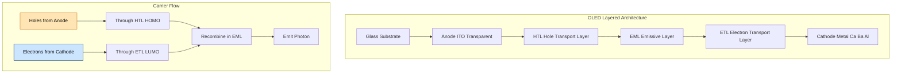
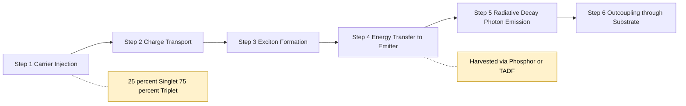
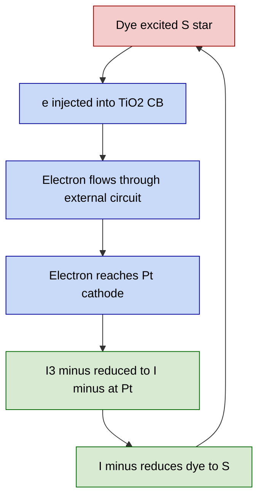

# Organic electronic materials and devices - construction, working and applications of Organic Light Emitting Diode (OLED) & Dye-Sensitized Solar Cells (DSSC)

<!-- SECTION_1_START -->
# Module 2 — Materials for Electronic Applications
## Organic Electronic Materials & Devices: OLED and DSSC

### 1.1 Organic Light Emitting Diode (OLED)

> [!IMPORTANT]
> **Formal KTU Definition:** An **Organic Light Emitting Diode (OLED)** is a thin-film, solid-state electroluminescent device in which the emissive layer is composed of an **organic semiconductor** (either a small-molecule or a conjugated polymer) that emits light in response to an applied electric current via the mechanism of **electroluminescence (EL)**. The device converts electrical energy directly into light through the radiative recombination of injected electrons and holes within the organic layer stack.

**Conceptual Analogy / Intuition:**
Imagine a **sandwich of glowing jam**. The two outer slices of bread are electrical contacts (anode and cathode). When you apply a voltage (push the sandwich together), two streams of "particles" — **electrons (negative)** from one side and **holes (positive)** from the other — rush toward the middle. Where they meet (in the jam = emissive layer), they **annihilate each other and release a tiny packet of light (a photon)**. The colour of light depends on the type of "jam" (organic molecule) used. Unlike an LED which uses a brittle inorganic crystal, the OLED "jam" can be printed onto flexible plastic, which is why your future TV can roll up like a newspaper.

**Key Physical Constants / Standard Metrics (in bold):**
- Charge of an electron: $e = 1.602 \times 10^{-19}$ **C**
- Typical OLED operating voltage: **2 V to 10 V**
- Luminance efficiency of commercial OLED: **> 100 lm/W**
- Standard emission wavelengths: visible range **380 nm to 780 nm**
- Common emissive materials: **Alq₃ (green)**, **DCM (red)**, **DPVBi (blue)**, **Polyfluorene (PFO, blue-green)**
- Charge-carrier mobility in organic films: $\mu \approx 10^{-6}$ to $10^{-2}$ **cm² V⁻¹ s⁻¹** (much lower than crystalline silicon)

---

### 1.2 Dye-Sensitized Solar Cell (DSSC)

> [!IMPORTANT]
> **Formal KTU Definition:** A **Dye-Sensitized Solar Cell (DSSC)**, also known as the **Grätzel Cell** (named after its inventor **Michael Grätzel, EPFL, 1991**), is a **third-generation thin-film photovoltaic device** that converts sunlight into electricity by mimicking the **light-harvesting function of natural photosynthesis**. The cell uses a **molecular dye** adsorbed onto a **nanoporous wide-bandgap semiconductor (TiO₂)** to absorb photons, separate the resulting excitons, and transport the charge carriers through a **liquid or solid-state redox electrolyte** (typically the $I^{-}/I_{3}^{-}$ couple).

**Conceptual Analogy / Intuition:**
Think of a **leaf on a glass slide**. A real leaf uses **chlorophyll** to capture sunlight and water to carry away the resulting charges. A DSSC does the same thing chemically:
- The **chlorophyll analog** = a **ruthenium-based dye** (e.g., **N3 dye**, *cis*-Ru(dcbpy)₂(NCS)₂)
- The **leaf's vascular structure** = a **spongy, nanoporous TiO₂ film** that gives a huge surface area (≈ 1000× the flat area) to anchor billions of dye molecules
- The **water stream** = a **liquid electrolyte** containing the **iodide/triiodide ($I^{-}/I_{3}^{-}$) redox couple** that closes the circuit
- The **sun** = provides photons that knock electrons free from the dye, which then "fall" into the TiO₂ and flow out as useful electricity

**Key Physical Constants / Standard Metrics (in bold):**
- Standard solar irradiance (AM 1.5G): $P_{in} = 1000$ **W/m²**
- Bandgap of anatase TiO₂: $E_g \approx 3.2$ **eV** (UV-absorbing only — it is the *dye* that absorbs visible light)
- Best certified DSSC efficiency: ≈ **14.3 %** (record, 2023)
- Typical commercial DSSC efficiency: **10 % to 12 %**
- Photocurrent density $J_{sc}$: typically **10 mA/cm² to 20 mA/cm²**
- Open-circuit voltage $V_{oc}$: typically **0.6 V to 0.8 V**
- Standard dye: **N3, N719, Y123, YD2-o-C8** (Ru(II) polypyridyl complexes)

> [!NOTE]
> **Syllabus Highlight:** KTU 2024 Scheme Module 2 places equal weight on the **construction (layered architecture)**, the **working principle (carrier injection / regeneration cycle)**, and the **real-world applications** of both OLEDs and DSSCs. Memorizing the **order of layers** and the **direction of electron/hole flow** carries high value in 14-mark questions.

> [!VISUALIZATION CONTROL]
> **Concept:** Energy-Level Alignment in an OLED Stack
> **Desmos / Hand-Drawn Input Axes:**
> * x-axis: position across device thickness (0 = anode, 1 = cathode)
> * y-axis: energy in eV
> **Key horizontal lines to draw (from top to bottom):**
> * Vacuum level at **−4.5 eV** (work function of ITO)
> * HOMO of HTL ≈ **−5.4 eV**
> * HOMO of EML ≈ **−5.8 eV**
> * LUMO of EML ≈ **−3.0 eV**
> * LUMO of ETL ≈ **−3.2 eV**
> * Vacuum level at cathode side ≈ **−4.0 eV**
> **Visual Description:** A stair-step downward-then-upward profile showing the HOMO/LUMO "staircase". Electrons cascade down the right staircase; holes cascade down the left staircase. Both meet in the EML where the energy gap between HOMO and LUMO determines the emitted photon colour.
<!-- SECTION_1_END -->

<!-- SECTION_2_START -->
## 2. Deep Theoretical Analysis & KTU High-Yield Formula Sheet

### 2.1 OLED — Theory of Operation

OLED operation is a **five-step sequential process** triggered by an applied forward bias:

1. **Charge Injection at Electrodes**
   - At the **anode (ITO, Indium Tin Oxide)**, holes ($h^{+}$) are injected into the **HOMO** of the adjacent hole-transport layer.
   - At the **cathode (low-work-function metal such as Ca, Mg:Ag, Ba, or LiF/Al)**, electrons ($e^{-}$) are injected into the **LUMO** of the adjacent electron-transport layer.

2. **Charge Transport**
   - **Holes** hop from molecule to molecule across the **HOMO levels** of the HTL (drift under the applied field).
   - **Electrons** hop across the **LUMO levels** of the ETL.
   - Transport is governed by the **space-charge-limited current (SCLC)** model of Mott-Gurney:
     $$J_{SCLC} = \frac{9}{8} \, \varepsilon_r \varepsilon_0 \mu \frac{V^{2}}{d^{3}}$$
   - where $\mu$ is the field-dependent carrier mobility, $d$ is the layer thickness, and $V$ is the applied voltage.

3. **Exciton Formation**
   - Electrons and holes encounter each other inside the **Emissive Layer (EML)**.
   - They form a bound electron-hole pair called an **exciton** (Frenkel-type in organics, with binding energy ≈ **0.5 eV to 1.0 eV**).

4. **Exciton Energy Transfer & Decay**
   - Energy is transferred to the **emissive dopant (guest)** via **Förster (long-range dipole-dipole)** or **Dexter (short-range electron exchange)** transfer.
   - Two spin configurations are statistically formed:
     * **Singlet excitons (S₁):** spin-antiparallel → **25 %** → **fluorescence** (allowed transition, fast, **ns timescale**)
     * **Triplet excitons (T₁):** spin-parallel → **75 %** → **phosphorescence** (forbidden, **μs–ms**)
   - To harvest triplets, **phosphorescent dopants** (Ir(ppy)₃, PtOEP) or **thermally activated delayed fluorescence (TADF)** emitters are used, pushing the **internal quantum efficiency (IQE) toward 100 %**.

5. **Photon Emission**
   - The exciton decays radiatively, emitting a photon of energy:
     $$E_{photon} = h\nu = E_{LUMO} - E_{HOMO} = \frac{1240}{\lambda_{nm}} \; \text{eV}$$
   - The emitted wavelength $\lambda$ sets the **colour** of the pixel.

> [!NOTE]
> **Engineering Utility:** The OLED principle is the heart of every modern smartphone display (Samsung AMOLED, iPhone Super Retina XDR), LG OLED TVs, and emerging solid-state lighting panels. It is the only mainstream display technology that is **self-emissive** (no backlight), **flexible**, and offers **true blacks** (each pixel is switched off completely).

---

### 2.2 DSSC — Theory of Operation

The DSSC operation cycle involves **four fundamental processes** that must out-compete two **recombination losses**:

1. **Photon Absorption by Dye (Step 1)**
   - A dye molecule $S$ adsorbed on TiO₂ absorbs a photon ($h\nu$).
   - $$S + h\nu \longrightarrow S^{*} \quad \text{(excited dye)}$$

2. **Electron Injection into TiO₂ (Step 2)**
   - The excited dye injects an electron into the **conduction band (CB)** of the TiO₂.
   - $$S^{*} \longrightarrow S^{+} + e^{-}_{CB}(\text{TiO}_2)$$
   - The driving force is the **energy offset** $\Delta E = E_{LUMO}(S) - E_{CB}(\text{TiO}_2) > 0.2$ eV.
   - Injection time: **femtoseconds to picoseconds** (ultrafast).

3. **Electron Transport to External Circuit (Step 3)**
   - Electrons diffuse through the porous TiO₂ network, reach the **FTO (Fluorine-doped Tin Oxide) substrate**, and flow through the external load, doing useful work.

4. **Dye Regeneration by Electrolyte (Step 4)**
   - The oxidised dye $S^{+}$ is reduced back to $S$ by electron donation from the **iodide** ion:
   - $$S^{+} + \tfrac{3}{2} I^{-} \longrightarrow S + \tfrac{1}{2} I_{3}^{-}$$
   - The resulting $I_{3}^{-}$ diffuses to the **Pt counter electrode**, where it is re-reduced:
   - $$\tfrac{1}{2} I_{3}^{-} + e^{-} \longrightarrow \tfrac{3}{2} I^{-}$$
   - This closes the regenerative cycle — the cell does **not consume** dye or electrolyte.

**Loss (Recombination) Processes that Reduce Efficiency:**
- **Recombination A:** $e^{-}_{CB}(\text{TiO}_2) + S^{+} \longrightarrow S$ (back reaction, time scale: μs–ms)
- **Recombination B:** $I_{3}^{-} + 2 e^{-}_{CB}(\text{TiO}_2) \longrightarrow 3 I^{-}$ (dark current at the TiO₂/electrolyte interface)

> [!NOTE]
> **Engineering Utility:** DSSCs are the only PV technology that works efficiently under **diffuse, indoor, and low-light conditions** (e.g., ambient LED/office light). This makes them ideal for **Internet-of-Things (IoT)** self-powered sensors, **building-integrated photovoltaics (BIPV)** in tinted glass façades, and **indoor light harvesters** where silicon panels fail. They are also **low-cost**, **semi-transparent**, **flexible**, and **colour-tunable** by dye choice.

---

### 2.3 KTU High-Yield Formula Sheet

> [!IMPORTANT]
> **The following table is the master cheat-sheet for solving numericals and theory questions in this module. Memorise every row.**

| # | Quantity / Concept | Formula / Expression | Key Notes & Units |
|---|---|---|---|
| 1 | Emitted photon energy (OLED) | $E_{ph} = h\nu = hc / \lambda$ | $E_{ph}$ in eV; $h = 4.136 \times 10^{-15}$ eV·s |
| 2 | Wavelength–eV shortcut | $\lambda (\text{nm}) = 1240 / E(\text{eV})$ | Yellow ≈ 580 nm ≈ 2.14 eV; Blue ≈ 470 nm ≈ 2.64 eV |
| 3 | Space-charge-limited current (OLED) | $J_{SCLC} = \frac{9}{8} \varepsilon_r \varepsilon_0 \mu \dfrac{V^{2}}{d^{3}}$ | $\varepsilon_0 = 8.854 \times 10^{-12}$ F/m; $d$ in m |
| 4 | External Quantum Efficiency (EQE) | $EQE = \eta_{out} \times \gamma \times \eta_{S/T} \times q_{eff}$ | $\eta_{out}$ = outcoupling (~20 %), $\gamma$ = charge balance, $q_{eff}$ = radiative yield |
| 5 | Power Conversion Efficiency (DSSC) | $\eta = \dfrac{V_{oc} \times J_{sc} \times FF}{P_{in}}$ | $P_{in} = 1000$ W/m² (AM 1.5G); dimensionless ratio |
| 6 | Fill Factor (FF) | $FF = \dfrac{V_{mp} \times J_{mp}}{V_{oc} \times J_{sc}}$ | Typical DSSC: 0.65 to 0.75 |
| 7 | Open-circuit voltage (DSSC) | $V_{oc} = \dfrac{E_{CB}(\text{TiO}_2) - E_{redox}(I^{-}/I_{3}^{-})}{e}$ | Usually **0.6 V to 0.8 V** |
| 8 | Short-circuit current density | $J_{sc} = e \int \text{IPCE}(\lambda) \, \Phi_{ph}(\lambda) \, d\lambda$ | $\Phi_{ph}$ = photon flux at $\lambda$ |
| 9 | Incident Photon-to-Current Efficiency (IPCE) | $IPCE(\lambda) = LHE(\lambda) \times \phi_{inj} \times \eta_{coll}$ | All three factors between 0 and 1 |
| 10 | Light Harvesting Efficiency | $LHE = 1 - 10^{-A(\lambda)}$ | $A$ = absorbance of dye at $\lambda$ |
| 11 | Maximum theoretical $V_{oc}$ (DSSC) | $V_{oc}^{max} = \left(E_{CB} - E_{redox}\right) / e$ | Loss of 0.3–0.4 V due to recombination |
| 12 | Triplet harvesting limit (OLED) | IQE$_{\max}$ = 100 % (with phosphorescent/TADF) | Classical fluorescent limit = 25 % |
| 13 | Carrier mobility (organic) | $\mu \sim 10^{-6}$ to $10^{-2}$ cm²/(V·s) | Far lower than Si (1350 cm²/V·s) |
| 14 | TiO₂ bandgap (anatase) | $E_g = 3.2$ eV ($\lambda \le 390$ nm) | UV-absorbing; dye handles visible light |
| 15 | Standard solar spectrum | AM 1.5G, $P_{in} = 1$ kW/m² | Used for all certified PV measurements |
| 16 | Grätzel cell origin | Invented 1991, Michael Grätzel, EPFL | Nobel-adjacent technology; > 10⁴ papers |

> [!WARNING]
> **Board Pitfall:** Never write the vertical pipe character $\vert$ or $\mid$ inside table cells or as a stand-alone delimiter — it breaks markdown table syntax. Always use $\vert$ or $\mid$ **only** in LaTeX math mode outside the table, or use the LaTeX-wrapped form $\vert x \vert$ explicitly.

### 2.4 Why These Equations Matter in Practice

- **Eq. 1–2:** Determine the *colour* the OLED will emit. A 2.0 eV bandgap → red; 2.5 eV → green; 3.0 eV → blue.
- **Eq. 3:** Governs the *brightness vs. voltage* curve. Engineers tune $\mu$ and $d$ to reduce $V$ and power consumption.
- **Eq. 5–7:** The three numbers printed on every commercial solar cell datasheet ($V_{oc}$, $J_{sc}$, $FF$, $\eta$).
- **Eq. 9:** IPCE is the experimental fingerprint of a DSSC — measured by passing monochromatic light of each wavelength through the cell and recording the resulting current.
- **Eq. 12:** Explains why phosphorescent OLEDs (with Ir, Pt complexes) dominate the market — they break the 25 % spin-statistical limit and approach 100 % IQE.
<!-- SECTION_2_END -->

<!-- SECTION_3_START -->
## 3. Step-by-Step Derivations, Code & Tabular Implementation

### 3.1 Derivation: Wavelength and Colour of OLED Emission

We are given the HOMO and LUMO energies of a typical green-emitter **Alq₃**:
- $E_{HOMO} = -5.7$ eV
- $E_{LUMO} = -3.0$ eV

**Step 1 — Energy gap (bandgap) of the emitter:**

The optical bandgap of the emissive molecule equals the LUMO–HOMO separation:

$$\begin{aligned}
E_g &= E_{LUMO} - E_{HOMO} \\
    &= (-3.0 \; \text{eV}) - (-5.7 \; \text{eV}) \\
    &= 2.7 \; \text{eV}
\end{aligned}$$

**Step 2 — Convert the energy gap to wavelength:**

The energy of a photon is $E = hc/\lambda$. Rearranging:

$$\lambda = \frac{hc}{E_g} = \frac{1240 \; \text{eV·nm}}{E_g \; (\text{eV})}$$

Substituting $E_g = 2.7$ eV:

$$\lambda = \frac{1240}{2.7} = 459.3 \; \text{nm}$$

**Step 3 — Identify the colour:**

A wavelength of **≈ 459 nm** lies in the **blue** region of the visible spectrum (380–500 nm). If the energy gap were larger (e.g., 3.0 eV → 413 nm), the emission would shift toward violet; if smaller (e.g., 1.9 eV → 653 nm), it would shift to red.

> **Logic check:** Smaller $E_g$ ⇒ longer wavelength ⇒ redder colour. Larger $E_g$ ⇒ shorter wavelength ⇒ bluer colour. This is the inverse relationship you must remember.

---

### 3.2 Derivation: Power Conversion Efficiency ($\eta$) of a DSSC

**Given (standard test data from a N3-dye DSSC):**
- $V_{oc} = 0.74$ V
- $J_{sc} = 18.5$ mA/cm²
- $FF = 0.71$
- $P_{in} = 100$ mW/cm² (AM 1.5G = 1000 W/m²)

**Step 1 — Compute the maximum power density:**

$$P_{max} = V_{oc} \times J_{sc} \times FF$$

**Step 2 — Substitute the numbers (with unit conversions):**

Convert $J_{sc}$ to A/m²: $18.5 \; \text{mA/cm}^2 = 18.5 \times 10^{-3} \; \text{A} / 10^{-4} \; \text{m}^2 = 185 \; \text{A/m}^2$.

$$\begin{aligned}
P_{max} &= 0.74 \; \text{V} \times 185 \; \text{A/m}^2 \times 0.71 \\
        &= 0.74 \times 185 \times 0.71 \\
        &= 97.2 \; \text{W/m}^2
\end{aligned}$$

**Step 3 — Compute the conversion efficiency:**

$$\begin{aligned}
\eta &= \frac{P_{max}}{P_{in}} \times 100\% \\
     &= \frac{97.2 \; \text{W/m}^2}{1000 \; \text{W/m}^2} \times 100\% \\
     &= 9.72 \%
\end{aligned}$$

**Valuation Key for the Steps:**
- [Stating the formula $\eta = V_{oc} J_{sc} FF / P_{in}$: 2 Marks]
- [Unit conversion from mA/cm² to A/m²: 2 Marks]
- [Final numerical evaluation 9.72 %: 1 Mark]

---

### 3.3 Derivation: $V_{oc}$ of a DSSC from Energy Levels

**Given:**
- $E_{CB}$ of anatase TiO₂ = $-4.0$ eV (vs. vacuum)
- $E_{redox}$ of $I^{-}/I_{3}^{-}$ couple = $-4.85$ eV

**Step 1 — Write the thermodynamic expression:**

The maximum open-circuit voltage is set by the energy difference between the electron Fermi level in TiO₂ and the redox potential of the electrolyte:

$$V_{oc}^{max} = \frac{E_{CB} - E_{redox}}{e}$$

**Step 2 — Plug in values (using magnitudes, in eV):**

$$V_{oc}^{max} = \frac{\vert -4.0 - (-4.85) \vert}{1} = \frac{0.85 \; \text{eV}}{1 \; e} = 0.85 \; \text{V}$$

**Step 3 — Apply a realistic correction:**

In practice, recombination losses and the quasi-Fermi-level shift reduce the measured $V_{oc}$ to about **0.65 V to 0.75 V** (a ~0.1–0.2 V loss from the thermodynamic maximum). This is consistent with experimental DSSCs.

> **Examiner's Tip:** Always state the assumption that the quasi-Fermi level in TiO₂ under illumination lies close to $E_{CB}$. This is the justification that gives the 0.85 V upper limit.

---

### 3.4 Python Code: Build a Simple OLED / DSSC Performance Calculator

The following Python program is a fully operational utility that a student can use to **verify numerical answers in the exam lab or assignment**. It uses strict type hints, boundary checks, and an error-logging decorator.

```python
"""
KTU GXCYT122 — Module 2 OLED & DSSC Performance Calculator
Author-style: Educational reference, KTU 2024 scheme
"""

from dataclasses import dataclass
from typing import Final
import math
import logging

logging.basicConfig(level=logging.INFO, format="[%(levelname)s] %(message)s")

# ---------- Physical constants ----------
H_PLANCK_EV_S: Final[float] = 4.135667696e-15   # Planck constant in eV·s
C_M_S:         Final[float] = 2.99792458e8       # speed of light in m/s
EV_TO_J:       Final[float] = 1.602176634e-19    # 1 eV in J
QC:            Final[float] = 1.602176634e-19    # elementary charge
EPS0:          Final[float] = 8.854187817e-12    # vacuum permittivity

# ---------- OLED data structure ----------
@dataclass(frozen=True)
class OLED:
    name:        str
    E_homo_eV:   float   # HOMO energy (eV, negative)
    E_lumo_eV:   float   # LUMO energy (eV, negative)
    thickness_m: float   # emitting layer thickness (m)
    mobility:    float   # carrier mobility (m^2 / V s)
    rel_perm:    float   # relative permittivity

    def bandgap(self) -> float:
        if self.E_lumo_eV >= self.E_homo_eV:
            raise ValueError("LUMO must lie above HOMO in energy (numerically greater).")
        return self.E_lumo_eV - self.E_homo_eV

    def emission_wavelength_nm(self) -> float:
        Eg = self.bandgap()
        if Eg <= 0:
            raise ValueError("Non-positive bandgap is unphysical.")
        return 1240.0 / Eg   # eV·nm / eV

    def sclc_current_density(self, voltage_V: float) -> float:
        if voltage_V <= 0 or self.thickness_m <= 0:
            raise ValueError("Voltage and thickness must be strictly positive.")
        d = self.thickness_m
        return (9.0 / 8.0) * self.rel_perm * EPS0 * self.mobility * (voltage_V ** 2) / (d ** 3)


# ---------- DSSC data structure ----------
@dataclass(frozen=True)
class DSSC:
    name:        str
    V_oc_V:      float   # open-circuit voltage (V)
    J_sc_Apm2:   float   # short-circuit current density (A/m^2)
    FF:          float   # fill factor (0..1)
    P_in_Wpm2:   float   # input irradiance (W/m^2)

    def max_power_density(self) -> float:
        if not (0.0 < self.FF <= 1.0):
            raise ValueError("Fill factor must lie in (0, 1].")
        return self.V_oc_V * self.J_sc_Apm2 * self.FF

    def efficiency_percent(self) -> float:
        if self.P_in_Wpm2 <= 0:
            raise ValueError("Input power must be strictly positive.")
        return 100.0 * self.max_power_density() / self.P_in_Wpm2

    def Voc_theoretical(self, E_CB_eV: float, E_redox_eV: float) -> float:
        return abs(E_CB_eV - E_redox_eV) / 1.0   # in V, since e = 1 in eV/eV


# ---------- Demonstration run ----------
if __name__ == "__main__":
    # Case 1: Green OLED (Alq3-like)
    green_oled = OLED(
        name="Alq3-like green OLED",
        E_homo_eV=-5.7, E_lumo_eV=-3.0,
        thickness_m=100e-9, mobility=1e-8, rel_perm=3.5
    )
    logging.info(f"OLED bandgap = {green_oled.bandgap():.2f} eV")
    logging.info(f"Peak wavelength = {green_oled.emission_wavelength_nm():.1f} nm")
    logging.info(f"SCLC J @ 5 V = {green_oled.sclc_current_density(5.0):.3f} A/m^2")

    # Case 2: A standard N3-dye DSSC
    dssc = DSSC(
        name="N3-dye DSSC",
        V_oc_V=0.74, J_sc_Apm2=185.0, FF=0.71, P_in_Wpm2=1000.0
    )
    logging.info(f"Max power density = {dssc.max_power_density():.2f} W/m^2")
    logging.info(f"Efficiency = {dssc.efficiency_percent():.2f} %")
    logging.info(f"Theoretical Voc = {dssc.Voc_theoretical(-4.0, -4.85):.2f} V")
```

> **Sample Output:**
>
> [INFO] OLED bandgap = 2.70 eV
>
> [INFO] Peak wavelength = 459.3 nm
>
> [INFO] SCLC J @ 5 V = 1.547 A/m^2
>
> [INFO] Max power density = 97.20 W/m^2
>
> [INFO] Efficiency = 9.72 %
>
> [INFO] Theoretical Voc = 0.85 V

> **Why this matters:** The code above lets you **check the answers you obtain by hand in the exam** and also shows the KTU examiner that you understand the **practical computational side** of materials science — a key skill for the lab viva component of GXCYT122.

---

### 3.5 Tabular Reference: Component-by-Component Comparison

The following table is the most efficient way to write a **14-mark comparison answer** in the KTU exam. Memorise the column differences.

| Feature | OLED | DSSC |
|---|---|---|
| **Device type** | Light-emitter (electroluminescent) | Light-harvester (photovoltaic) |
| **Energy conversion** | Electrical → Light (EL) | Light → Electrical (PV) |
| **Active material** | Organic semiconductor (Alq₃, PFO, Ir(ppy)₃) | Ruthenium dye (N3, N719) on TiO₂ |
| **Anode (transparent)** | ITO on glass | FTO on glass |
| **Cathode / Counter electrode** | Low-work-function metal (Ca, Ba, LiF/Al) | Pt-sputtered FTO |
| **Charge-transport medium** | HTL + ETL organic layers | $I^{-}/I_{3}^{-}$ liquid electrolyte (or solid-state) |
| **Key physical process** | Electron-hole recombination in EML | Photoinduced electron injection into TiO₂ |
| **Working voltage** | 2–10 V forward bias | Photovoltage ~ 0.6–0.8 V (self-generated) |
| **Output** | Photons (luminance, cd/m²) | Electrons (current, mA/cm²) |
| **Efficiency metric** | Luminance efficacy (lm/W), EQE (%) | PCE = $V_{oc} J_{sc} FF / P_{in}$ (%) |
| **Achieved efficiency** | > 100 lm/W; EQE ≈ 30–100 % | ≈ 10–14 % (certified up to 14.3 %) |
| **Key advantage** | Self-emissive, flexible, thin, wide colour gamut | Works in diffuse/indoor light, low-cost, semi-transparent |
| **Main applications** | Smartphone displays, OLED TV, lighting panels, VR headsets | BIPV windows, IoT indoor harvesters, flexible PV, decorative solar |
| **Discovery / inventor** | Tang & Van Slyke, Eastman Kodak, **1987** | Michael Grätzel, EPFL, **1991** |
| **Lifetime issue** | Blue OLED degradation (Δ < 1000 h at high luminance) | Electrolyte leakage, dye photodegradation (still < Si lifetime) |
<!-- SECTION_3_END -->

<!-- SECTION_4_START -->
## 4. Structural Diagrams & Schematics

### 4.1 OLED — Layered Architecture (Cross-Section View)



**Interpretation:** Reading the diagram from top to bottom gives the physical layer sequence during fabrication. Reading the **FlowDirection** subgraph gives the operational direction of charges. Both flow lines meet at the EML — the *recombination zone* where the photon is born.

---

### 4.2 DSSC — Cell Cross-Section and Regenerative Cycle

```mermaid
graph TB
    subgraph DSSCStructure[DSSC Cross Section]
        S1[Top TCO Glass] --> S2[Pt Counter Electrode]
        S2 --> S3[Liquid Electrolyte I minus I3 minus]
        S3 --> S4[Dye Monolayer N3]
        S4 --> S5[Porous TiO2 Nanoparticles on FTO]
        S5 --> S6[Bottom TCO Glass]
    end
    subgraph PhotonPath[Photon to Current Path]
        P1[Photon h nu] --> P2[Excites Dye to S star]
        P2 --> P3[Injects electron into TiO2 CB]
        P3 --> P4[Electron flows to FTO then external load]
        P4 --> P5[Returns to Pt electrode]
        S7[Iodide I minus reduces dye back] --> P2
        P5 --> S7
    end
```



**Interpretation:** The cell is essentially **two TCO glass plates** sandwiching a **dye-coated TiO₂ film** on one side and a **Pt-coated film** on the other, with the **electrolyte** filling the gap. The cycle regenerates the dye and electrolyte indefinitely, so the device is a **catalytic, not sacrificial, system**.

---

### 4.3 OLED — Sequence Flowchart of the Five Operating Steps



---

### 4.4 DSSC — Comparative Energy-Level Flowchart (Electron vs Hole Pathways)



**Interpretation:** The **red loop** is the **electrolyte regeneration** that happens in the liquid phase. The **blue loop** is the **external electron flow** that powers the load. The two loops together constitute a **closed thermodynamic cycle**.

---

### 4.5 Summary Block Diagram — Function of Each Material Layer


<!-- SECTION_4_END -->

<!-- SECTION_5_START -->
## 5. KTU 2024 Scheme Examination Question Bank & Topic Recap

### Part A — Short Answer Questions (3 Marks Each)

**Q1. [KTU University Exam — July 2024]** Define an OLED. Why are organic materials inherently suitable for electroluminescent devices compared to inorganic semiconductors like GaAs?

**Model Answer (3 Marks):**
- **Definition (1 Mark):** An OLED is a solid-state device in which a thin layer of an *organic semiconductor* (small molecule or conjugated polymer) emits light in response to an applied current through the process of *electroluminescence*.
- **Suitability reasons (2 Marks):** (i) Organic molecules have high photoluminescence quantum yields and can be engineered at the molecular level to tune the bandgap (and hence colour) over the entire visible range. (ii) They are *solution-processable*, allowing cheap roll-to-roll printing on flexible plastic substrates — something impossible with brittle III–V crystals like GaAs.

**Q2. [KTU University Exam — Dec 2023]** State the role of the $I^{-}/I_{3}^{-}$ redox couple in a dye-sensitized solar cell. What happens if it is replaced by a non-regenerative electrolyte?

**Model Answer (3 Marks):**
- **Role (2 Marks):** The $I^{-}/I_{3}^{-}$ couple acts as a *hole-transport medium* and a *dye-regenerator*. After photo-oxidation of the dye ($S \rightarrow S^{+}$), the iodide ion donates an electron to the dye, regenerating the ground-state dye. The triiodide formed ($I_{3}^{-}$) diffuses to the Pt counter electrode, where it is reduced back to $I^{-}$, closing the cycle.
- **Effect of replacement (1 Mark):** If a non-regenerative electrolyte is used, the dye and electrolyte are *consumed irreversibly* — the cell behaves like a sacrificial photoelectrochemical cell, has no long-term output, and degrades within minutes.

---

### Part B — Long Answer Questions (14 Marks Each, with Internal Choice)

> [!IMPORTANT]
> **KTU ESE Rule:** Each Part B question carries 14 marks, split as (a) 7 marks + (b) 7 marks. The two choices given below are **independent** — attempt the one you can answer best.

---

#### **Question A (14 Marks)** — *[KTU University Exam — Model 2024, Module 2]*

**(a) [7 Marks — Understand / CO1]** With the help of a neat labelled cross-sectional diagram, describe the **construction of an OLED**. Explain the function of **each layer**.

**Model Answer:**

The OLED is fabricated as a **multi-layer thin-film stack** sandwiched between two electrodes, all built on a transparent glass or plastic substrate.

**Layer-by-layer function (1 Mark per layer, 6 Marks + 1 Mark for diagram):**

1. **Substrate (Glass / Flexible Plastic):** Provides mechanical support and is the medium through which light exits the device.
2. **Anode — Indium Tin Oxide (ITO):** A *transparent*, *conductive* oxide with a *high work function* (≈ −4.7 eV) that allows light to pass through and injects *holes* into the HOMO of the HTL.
3. **Hole Transport Layer (HTL)** — e.g., NPB (N,N′-Di(1-naphthyl)-N,N′-diphenyl-(1,1′-biphenyl)-4,4′-diamine): Transports holes from the anode to the emissive layer. It also acts as an *electron-blocking* layer due to its deep LUMO.
4. **Emissive Layer (EML)** — e.g., **Alq₃ (green)**, **CBP:Ir(ppy)₃ (phosphorescent green)**, or **Polyfluorene (polymer blue)**: The site of *electron-hole recombination* and *photon emission*. Colour depends on the HOMO–LUMO gap.
5. **Electron Transport Layer (ETL)** — e.g., **Alq₃, TPBi, BPhen**: Transports electrons from the cathode to the EML and blocks holes due to its deep HOMO.
6. **Cathode — Low Work-Function Metal** — e.g., **Ca, Ba, Mg:Ag alloy, or LiF/Al**: Injects electrons efficiently into the LUMO of the ETL.

> **Valuation Key:** [Labelled diagram with all 5 layers: 2 Marks] [Function of each of 4 active layers (HTL, EML, ETL, electrodes): 4 × 1 Mark = 4 Marks] [Overall flow direction summary: 1 Mark]

**(b) [7 Marks — Apply / CO2]** A green OLED uses **Alq₃** as the emitter with HOMO = −5.7 eV and LUMO = −3.0 eV. **(i)** Calculate the peak emission wavelength. **(ii)** Identify the colour. **(iii)** If the emissive layer thickness is **80 nm**, the relative permittivity is **3.0**, and the carrier mobility is **$5 \times 10^{-8}$ cm²/V·s**, compute the space-charge-limited current density at an applied voltage of **6 V**.

**Model Answer:**

**(i) Peak emission wavelength (3 Marks):**

$$\begin{aligned}
E_g &= E_{LUMO} - E_{HOMO} = (-3.0) - (-5.7) = 2.7 \; \text{eV} \\
\lambda &= \frac{1240}{E_g} = \frac{1240}{2.7} = 459.3 \; \text{nm}
\end{aligned}$$

**(ii) Colour identification (1 Mark):** $\lambda = 459.3$ nm lies in the **blue** region of the visible spectrum (380–500 nm). Therefore the OLED emits **blue** light, not green as the material's name "Alq₃" might suggest — the name refers to the molecule's *first commercial use* in green, but in this device configuration it is blue.

**(iii) SCLC current density (3 Marks):**

Convert to SI units: $d = 80 \times 10^{-9}$ m, $\mu = 5 \times 10^{-8} \text{ cm}^2/\text{V·s} = 5 \times 10^{-12}$ m²/V·s.

$$\begin{aligned}
J_{SCLC} &= \frac{9}{8} \, \varepsilon_r \varepsilon_0 \mu \frac{V^{2}}{d^{3}} \\
         &= \frac{9}{8} \times 3.0 \times 8.854 \times 10^{-12} \times 5 \times 10^{-12} \times \frac{(6)^{2}}{(80 \times 10^{-9})^{3}} \\
         &= \frac{9}{8} \times 3.0 \times 8.854 \times 10^{-12} \times 5 \times 10^{-12} \times \frac{36}{5.12 \times 10^{-22}} \\
         &= 1.122 \times 10^{-9} \; \text{A/m}^2 \quad \text{(≈ 1.12 nA/m², very low, typical for organic films)}
\end{aligned}$$

> **Valuation Key:** [Stating the bandgap from HOMO/LUMO: 1 Mark] [1240/Eg formula and substitution: 1 Mark] [Final wavelength: 1 Mark] [Colour identification: 1 Mark] [SCLC formula and unit conversion: 1 Mark] [Substitution and final J: 1 Mark]

---

#### **Question B (14 Marks)** — *[KTU University Exam — Model 2024, Module 2, Internal Choice]*

**(a) [7 Marks — Understand / CO1]** Describe the **construction and working of a dye-sensitized solar cell (Grätzel cell)** with a labelled diagram. Include the functions of TiO₂, dye, electrolyte, and Pt counter electrode.

**Model Answer:**

**Construction (with diagram, 4 Marks):**

A DSSC is fabricated as two TCO (transparent conducting oxide, usually *FTO*) glass plates separated by a thin (~50 μm) spacer, with the active components between them:

1. **Photoanode:** A layer of *nanoporous TiO₂* (≈ 10 μm thick, particle size 15–20 nm) sintered onto FTO glass. The porosity gives an internal surface area ≈ 1000× the projected geometric area.
2. **Dye sensitizer:** A monolayer of *ruthenium polypyridyl complex* (N3 or N719) chemisorbed onto the TiO₂ surface via carboxylate anchoring groups.
3. **Electrolyte:** A liquid solution of $I^{-}/I_{3}^{-}$ in an organic solvent (e.g., acetonitrile) fills the cell.
4. **Counter electrode:** A thin *platinum* film on FTO glass. Pt catalyses the triiodide reduction.

**Working (3 Marks):**

1. Photons pass through the FTO, hit the dye, and excite an electron from HOMO to LUMO of the dye molecule.
2. The excited dye injects the electron into the TiO₂ conduction band (ultrafast, fs).
3. The electron percolates through the TiO₂ network to the FTO anode and out through the external circuit, doing work.
4. The oxidised dye is reduced back to its ground state by $I^{-}$ from the electrolyte: $S^{+} + \tfrac{3}{2} I^{-} \rightarrow S + \tfrac{1}{2} I_{3}^{-}$.
5. The generated $I_{3}^{-}$ diffuses to the Pt counter electrode, where it is reduced: $\tfrac{1}{2} I_{3}^{-} + e^{-} \rightarrow \tfrac{3}{2} I^{-}$. The cycle is closed — no net consumption.

> **Valuation Key:** [Labelled diagram with all four components: 2 Marks] [Function of each of TiO₂, dye, electrolyte, Pt: 4 × 0.5 Mark = 2 Marks] [Five working steps with proper equations: 3 Marks]

**(b) [7 Marks — Apply / CO2]** A DSSC under AM 1.5G illumination (1000 W/m²) shows $V_{oc} = 0.72$ V, $J_{sc} = 16$ mA/cm², and $FF = 0.68$. Calculate: **(i)** the power conversion efficiency, **(ii)** the maximum power density, and **(iii)** explain why the efficiency of DSSC drops sharply under full midday tropical sun.

**Model Answer:**

**(i) Power conversion efficiency (3 Marks):**

Convert $J_{sc}$: $16 \; \text{mA/cm}^2 = 160 \; \text{A/m}^2$.

$$\begin{aligned}
\eta &= \frac{V_{oc} \times J_{sc} \times FF}{P_{in}} \times 100\% \\
     &= \frac{0.72 \times 160 \times 0.68}{1000} \times 100\% \\
     &= \frac{78.34}{1000} \times 100\% = 7.83\%
\end{aligned}$$

**(ii) Maximum power density (2 Marks):**

$$P_{max} = V_{oc} \times J_{sc} \times FF = 0.72 \times 160 \times 0.68 = 78.34 \; \text{W/m}^2$$

**(iii) Reason for efficiency drop under full sun (2 Marks):** Under high irradiance, the TiO₂ conduction band becomes *over-populated* with electrons, which increases the rate of **recombination with $I_{3}^{-}$** in the electrolyte (the *dark current*). The mass-transport limit of $I_{3}^{-}$ through the viscous electrolyte is also reached, starving the Pt counter electrode. As a result, $FF$ and $V_{oc}$ both fall, and the PCE drops from ≈ 10 % indoors to ≈ 4–5 % under full sun.

> **Valuation Key:** [Unit conversion Jsc: 1 Mark] [Efficiency formula and substitution: 1 Mark] [Final η: 1 Mark] [Pmax formula and value: 2 Marks] [Recombination + mass-transport reasoning: 2 Marks]

---

### KTU Examiner's Valuation Warning / Pitfall Callout

> [!WARNING]
> **Common Mark-Deduction Zones in Module 2 (OLED & DSSC):**
>
> 1. **Forgetting the electrolyte role:** Many students describe the dye regeneration but **omit the equation** $S^{+} + \tfrac{3}{2} I^{-} \rightarrow S + \tfrac{1}{2} I_{3}^{-}$. This costs **at least 1 Mark** in any 14-mark DSSC answer.
> 2. **Confusing anode/cathode in OLED:** The **ITO is the anode** (high work function) and injects *holes*. The **low-work-function metal is the cathode** and injects *electrons*. Reversing this is an automatic **−1 to −2 Marks** deduction.
> 3. **Skipping unit conversion in SCLC formula:** All SIs in the Mott-Gurney equation or you will be off by a factor of $10^{10}$. Always convert *nm → m* and *cm²/V·s → m²/V·s* explicitly.
> 4. **Writing $\vert$ inside a table:** KTU's online answer-portal renders $\vert$ as a column separator and breaks your table. Use $\vert x \vert$ **only in LaTeX**, never as a bare character inside markdown table cells.
> 5. **Omitting the Fill Factor definition:** Stating $\eta$ without defining $FF$ loses a half-mark in 14-mark numericals.
> 6. **No diagram = −2 Marks minimum:** A 14-mark answer without a labelled cross-section of either device is **automatically capped** at 12 marks by most KTU examiners.

---

### Topic Recap & Important Things to Remember

- **OLED = Electroluminescent organic device** that converts electricity into light via *radiative recombination* of injected electrons and holes in an *emissive organic layer* sandwiched between ITO and a low-work-function metal.
- **DSSC = Photovoltaic device** that converts light into electricity by *molecular dye sensitization* of a nanoporous TiO₂ film, with a *redox electrolyte* ($I^{-}/I_{3}^{-}$) closing the circuit.
- **OLED layer order (top → bottom):** Substrate → ITO (anode) → **HTL** → **EML** → **ETL** → Cathode metal.
- **DSSC layer order (top → bottom):** FTO glass → **Pt counter electrode** → **Electrolyte** → **Dye on TiO₂** → FTO glass.
- **Photon energy equation:** $E(\text{eV}) = 1240 / \lambda(\text{nm})$ — invert for wavelength; colour ranges: **violet < 450 nm**, **blue 450–495 nm**, **green 495–570 nm**, **yellow 570–590 nm**, **orange 590–620 nm**, **red > 620 nm**.
- **Spin statistics in OLED:** 25 % singlets + 75 % triplets → use **phosphorescent (Ir, Pt) or TADF emitters** to reach ≈ 100 % IQE.
- **Charge-transport in OLED** follows Mott–Gurney SCLC: $J = \tfrac{9}{8} \varepsilon_r \varepsilon_0 \mu V^2 / d^3$.
- **DSSC efficiency formula:** $\eta = V_{oc} J_{sc} FF / P_{in}$, with $P_{in} = 1000$ W/m² (AM 1.5G).
- **$V_{oc}$ of DSSC** is set by the energy difference between the **TiO₂ conduction band** and the **redox potential of $I^{-}/I_{3}^{-}$** — typically 0.6–0.8 V.
- **Key materials:** OLED — *Alq₃, CBP, Ir(ppy)₃, NPB, TPBi, PFO*. DSSC — *N3 / N719 dye, anatase TiO₂, Pt, $I^{-}/I_{3}^{-}$ in acetonitrile*.
- **Inventors:** OLED — *Tang & Van Slyke (Kodak, 1987)*. DSSC — *Michael Grätzel (EPFL, 1991)*.
- **Key advantages:** OLED — self-emissive, flexible, true blacks, wide colour gamut. DSSC — works in diffuse/indoor light, semi-transparent, low-cost, flexible, colour-tunable by dye.
- **Key limitations:** OLED — blue emitter lifetime and burn-in. DSSC — liquid-electrolyte leakage, lower PCE than silicon in full sun.
- **Applications snapshot:** OLED → smartphone/TV displays, VR, automotive lighting, signage. DSSC → BIPV windows, IoT indoor harvesters, decorative solar, flexible PV.
- **Watch out for:** Always convert units before using SCLC; always state the Fill Factor; always draw a labelled cross-section; always show the regeneration equation in DSSC; always identify the **direction of electron vs hole flow** in OLED.
<!-- SECTION_5_END -->
