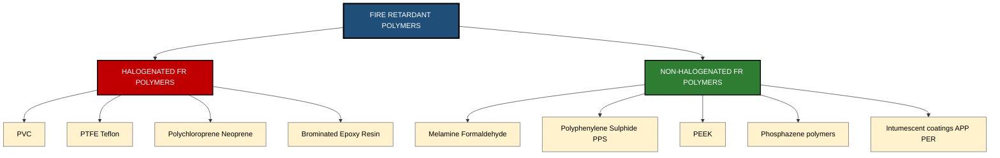
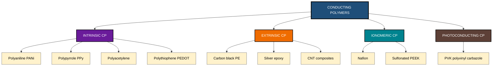
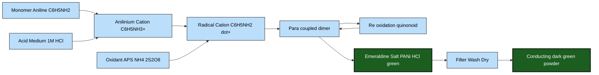
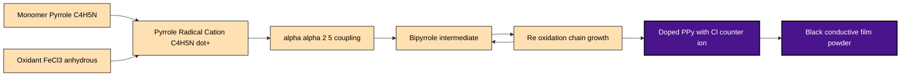
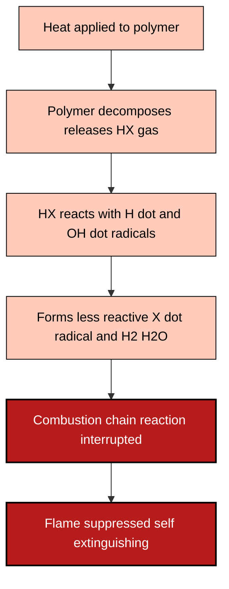

# Polymers - Fire Retardant Polymers- Halogenated & Non-halogenated polymers (Examples only)- Conducting Polymers-Classification- Polyaniline & Polypyrrole-synthesis, properties and applications.

<!-- SECTION_1_START -->
# Module 2: Materials for Electronic Applications
## Polymers — Fire Retardant Polymers & Conducting Polymers

---

### 1.1 Fire Retardant Polymers — Formal Definition

> [!IMPORTANT]
> **Fire Retardant Polymers (FR Polymers)** are polymeric materials that have been chemically modified (either through incorporation of flame-retardant additives into the polymer matrix or by structural modification of the polymer backbone itself) to **suppress, inhibit, or delay the propagation of fire**. They reduce **flammability**, lower the **rate of combustion**, and minimize the emission of toxic/dense smoke during thermal degradation.

The standard quantitative measure used by KTU-board examiners is the **Limiting Oxygen Index (LOI)**, defined as:

$$\text{LOI} (\%) = \frac{\text{Volume of } O_2}{\text{Volume of } (O_2 + N_2)} \times 100$$

A polymer with **LOI > 27 %** is classified as a *self-extinguishing fire-retardant material*; polymers with **LOI < 21 %** burn easily in air (since atmospheric $O_2 \approx 21\%$).

> [!NOTE]
> **Syllabus Highlight:** The KTU 2024 GXCYT122 syllabus specifically requires *examples only* of halogenated and non-halogenated FR polymers — students should be able to **name, classify, and cite at least one example** of each class.

#### 1.1.1 Halogenated Fire Retardant Polymers

**Formal Definition:** Polymers in which **halogen atoms (F, Cl, Br, I)** are covalently bonded either in the polymer backbone or as substituent groups. Halogens act via a **radical chain-scavenging mechanism** in the **vapour phase**, interrupting the combustion free-radical chain reaction.

> [!TIP]
> **Conceptual Analogy — The "Bouncer at the Club Door":**
> Think of combustion as a chain of aggressive party-goers (free radicals $\text{H}^\bullet$, $\text{OH}^\bullet$, $\text{O}^\bullet$) rushing to keep the fire alive. Halogenated polymers release halogen radicals ($\text{Cl}^\bullet$, $\text{Br}^\bullet$) that act like bouncers — they intercept these reactive radicals and form inert products (e.g., $\text{HCl}$, $\text{HBr}$), effectively breaking the chain reaction and "kicking out" the combustion.

**Key Examples (KTU Board-Favourite):**
- **Polyvinyl Chloride (PVC)** — contains ~57 % chlorine by mass; LOI ≈ 45–50 %.
- **Polytetrafluoroethylene (PTFE / Teflon)** — fully fluorinated; LOI ≈ 95 %.
- **Polychloroprene (Neoprene)** — chlorine-substituted diene polymer.
- **Brominated Epoxy Resins** — used in **PCB laminates** for electronics.
- **Decabromodiphenyl ether (Deca-BDE)** — additive FR for **HIPS, ABS** housings.

#### 1.1.2 Non-Halogenated Fire Retardant Polymers

**Formal Definition:** Polymers that achieve fire retardancy through **halogen-free** mechanisms such as **char formation (carbonaceous barrier)**, **intumescence**, **endothermic dehydration**, or **release of non-flammable gases** ($\text{H}_2\text{O}$, $\text{CO}_2$, $\text{N}_2$).

> [!TIP]
> **Conceptual Analogy — The "Firefighter's Blanket":**
> Imagine dropping a thick, charred blanket (carbon layer) over a flame. The blanket blocks oxygen and radiant heat. Non-halogenated FRs work exactly this way — they form a **protective char layer** that physically shields the underlying polymer from further combustion. No toxic halogen gases are released — making them **environmentally preferred**.

**Key Examples (KTU Board-Favourite):**
- **Melamine-Formaldehyde Resin** — releases inert $\text{N}_2$ gas on heating.
- **Polyamide-6,6 (Nylon 6,6)** with red phosphorus additive.
- **Polyphenylene Sulphide (PPS)** — inherent char former, LOI ≈ 44 %.
- **Polyetheretherketone (PEEK)** — high-performance thermoplastic, LOI ≈ 35 %.
- **Phosphazene-based polymers** — P–N synergistic FR action.
- **Intumescent coatings on polyolefins** (APP + pentaerythritol system).

> [!WARNING]
> **Environmental Note:** Halogenated FRs (especially brominated) release **dioxins and furans** upon incineration — the EU **RoHS Directive** restricts several brominated FRs. Non-halogenated FRs are preferred in **green electronics**.

---

### 1.2 Conducting Polymers — Formal Definition

> [!IMPORTANT]
> **Conducting Polymers (CPs)** are a unique class of **organic polymers** that possess an extended **π-conjugated backbone** of alternating single and double bonds, enabling **delocalization of electrons** along the polymer chain. In their **doped state**, they exhibit electrical conductivities ranging from $\mathbf{10^{-5}\ S/cm}$ (semiconducting) to $\mathbf{10^{3}\ S/cm}$ (metallic regime) — bridging the gap between classical insulators and metals.

**The "Big Four" Intrinsic Conducting Polymers** (must be memorised):
1. **Polyacetylene (PA)** — the first CP discovered (Nobel Prize 2000, Heeger, MacDiarmid, Shirakawa).
2. **Polypyrrole (PPy)** — focus of this module.
3. **Polyaniline (PANi)** — focus of this module.
4. **Polythiophene (PTh)** and its derivative **PEDOT:PSS** (used in OLED touchscreens).

> [!TIP]
> **Conceptual Analogy — The "Electron Highway":**
> Imagine a regular polymer as a road full of parked cars (localized electrons stuck in covalent bonds). A conducting polymer is a **highway with moving cars** (delocalized π-electrons free to travel along the chain). But the highway is toll-free only when **dopants** (iodine, $\text{ClO}_4^-$, etc.) are added — they create "toll booths" that **remove or add electrons**, leaving behind positive or negative charge carriers (polarons/bipolarons) that zip along the chain carrying current.

#### 1.2.1 Classification of Conducting Polymers

| Class | Mechanism | Conductivity Range | Examples |
|-------|-----------|--------------------|----------|
| **Intrinsically Conducting Polymers (ICPs)** | Conjugated π-backbone + doping | $10^{-5}$ to $10^{3}$ S/cm | Polyaniline, Polypyrrole, Polyacetylene |
| **Extrinsically Conducting Polymers** | Conductive filler in insulating matrix | $10^{-4}$ to $10^{2}$ S/cm | Carbon-black loaded polyethylene, silver-filled epoxy |
| **Doping-Induced CPs** | Insulating precursor → conducting | Variable | Precursor-route polyacetylene, emeraldine base → emeraldine salt |
| **Ionomeric / Blend CPs** | Ionic conduction | $10^{-6}$ to $10^{-2}$ S/cm | Nafion, sulfonated PEEK |
| **Photo-conducting Polymers** | Light-induced charge generation | Field-dependent | PVK (polyvinyl carbazole) |

> [!NOTE]
> **Syllabus Mandate (KTU 2024):** Students must explicitly know the **synthesis, properties, and applications of polyaniline (PANi) and polypyrrole (PPy)** — these are the two high-weightage examples.

> [!VISUALIZATION CONTROL]
> **Concept:** Band-gap illustration of insulating, semiconducting, and conducting polymer states.
> **Reference Plot Parameters (for energy vs. DOS):**
> * *Insulating polymer (e.g., polyethylene)*: Band gap $E_g \approx 8 \text{ eV}$ — large forbidden region between HOMO and LUMO.
> * *Conducting polymer (e.g., doped PANi)*: Mid-gap polaron/bipolaron states — band gap narrows to $1\text{–}3 \text{ eV}$.
> **Visual Description:** Sketch two horizontal energy bands separated by a forbidden zone. For an undoped CP, draw a few localized polaron levels inside the gap. For a doped CP, show continuous bipolaron bands crossing the Fermi level — the "highway" of mobile charge carriers.

---

<!-- SECTION_1_END -->

<!-- SECTION_2_START -->
# 2. Deep Theoretical Analysis & KTU High-Yield Formula Sheet

---

### 2.1 Mechanism of Fire Retardancy

#### 2.1.1 Halogenated FR Mechanism (Vapour-Phase Action)

The combustion of a hydrocarbon polymer proceeds via the **free-radical chain mechanism**:

$$\text{RH} \xrightarrow{\Delta} \text{R}^\bullet + \text{H}^\bullet$$

$$\text{H}^\bullet + \text{O}_2 \rightarrow \text{OH}^\bullet + \text{O}^\bullet \quad \text{(chain-branching)}$$

$$\text{OH}^\bullet + \text{CO} \rightarrow \text{CO}_2 + \text{H}^\bullet$$

When a halogenated polymer (e.g., PVC) decomposes, it releases **HX** ($\text{HCl}$ or $\text{HBr}$):

$$\text{(–CH}_2\text{–CHCl–)}_n \xrightarrow{\Delta} \text{char residue} + \text{HCl}_{(g)}$$

The HX gas then **scavenges the active radicals**:

$$\text{H}^\bullet + \text{HCl} \rightarrow \text{H}_2 + \text{Cl}^\bullet$$

$$\text{OH}^\bullet + \text{HCl} \rightarrow \text{H}_2\text{O} + \text{Cl}^\bullet$$

The newly formed $\text{Cl}^\bullet$ radicals are **far less reactive** than $\text{H}^\bullet$ and $\text{OH}^\bullet$ — they terminate the chain instead of propagating it. Antimony trioxide ($\text{Sb}_2\text{O}_3$) is often used as a **synergist** because it forms volatile $\text{SbCl}_3$ that prolongs the radical-trapping action.

#### 2.1.2 Non-Halogenated FR Mechanism (Condensed-Phase + Gas-Phase)

* **Phosphorus-based FRs** (e.g., red phosphorus, phosphonates): Form **polyphosphoric acid** on heating, which catalyses **char formation** and produces a glassy protective coating on the polymer surface.
* **Nitrogen-based FRs** (e.g., melamine): Release inert gases ($\text{N}_2$, $\text{NH}_3$, $\text{NO}_x$) that **dilute flammable gases** in the flame zone.
* **Intumescent systems** (APP + pentaerythritol + melamine): Form a **swollen, multicellular char** that acts as a thermal insulator (heat transfer reduced by 10×–100×).
* **Metal hydroxides** (ATH, MDH): $\text{Al(OH)}_3 \xrightarrow{\Delta} \text{Al}_2\text{O}_3 + \text{H}_2\text{O}_{(g)}$ — **endothermic dehydration** (ΔH ≈ +298 kJ/mol) cools the polymer and releases water vapour.

### 2.2 KTU Formula Sheet — Fire Retardant Polymers

| Parameter / Concept | Formula / Expression | Significance |
|---------------------|----------------------|--------------|
| Limiting Oxygen Index | $\text{LOI} = \dfrac{V_{O_2}}{V_{O_2} + V_{N_2}} \times 100$ | Threshold O₂ to sustain combustion |
| HRR (Heat Release Rate) | $\text{HRR} = \dot{Q} = \dfrac{dQ}{dt}$ (kW/m²) | Rate of heat evolution in cone calorimetry |
| THR (Total Heat Released) | $\text{THR} = \int_0^{t_f} \text{HRR}\,dt$ (MJ/m²) | Cumulative heat output |
| Char Yield | $\text{Char Yield} (\%) = \dfrac{W_{\text{char}}}{W_{\text{initial}}} \times 100$ | Mass of carbonaceous residue |
| Heat of Combustion | $\Delta H_c$ (kJ/g) | Energy released per gram burnt |
| Cone Calorimeter | ISO 5660 standard | Bench-scale fire testing |
| UL-94 Rating | V-0 > V-1 > V-2 > HB | Vertical/horizontal burn test |
| Antimony synergism | $\text{Sb}_2\text{O}_3 + 6\text{HCl} \rightarrow 2\text{SbCl}_3 + 3\text{H}_2\text{O}$ | Volatile SbCl₃ prolongs flame inhibition |

> [!IMPORTANT]
> **Engineering Utility:** FR polymers are indispensable in **PCB substrates** (FR-4 epoxy), **wire & cable insulation** (PVC, XLPE), **aerospace composites** (phenolic + carbon fibre), and **consumer electronics enclosures**. The **Underwriters Laboratories (UL-94) V-0 rating** is the global benchmark — most smartphone and laptop housings must achieve it.

---

### 2.3 Conducting Polymers — Deep Theory

#### 2.3.1 Why Are They Conducting? The π-Conjugation Principle

In a **conjugated polymer**, the polymer backbone alternates between **single bonds** ($\sigma$) and **double bonds** ($\sigma + \pi$). The **p-orbitals** of successive carbon atoms overlap sideways to form a **delocalized π-molecular orbital** extending over many repeat units. This delocalization creates a **partially filled π-band** analogous to the conduction band of a metal.

For conduction, however, the π-electrons must be **mobile**. In the **pristine (undoped) state**, the polymer is either:
* An insulator (band gap $E_g > 3$ eV), or
* A semiconductor ($E_g \approx 1.5$–3 eV).

**Doping** introduces new electronic states (polarons, bipolarons) within the band gap, dramatically reducing the effective $E_g$ and enabling facile charge transport.

#### 2.3.2 Doping Mechanism

**p-Type Doping (Oxidative Doping):** Electron *removed* from the π-system.

$$\text{CP} + \tfrac{3}{2}\text{I}_2 \rightarrow \text{CP}^{+} + \text{I}_3^{-}$$

**n-Type Doping (Reductive Doping):** Electron *added* to the π-system.

$$\text{CP} + \text{NaNap} \rightarrow \text{CP}^{-} + \text{Na}^{+} + \text{Nap}$$

Where **NaNap** = sodium naphthalenide.

> [!NOTE]
> **Crucial Point:** "Doping" in conducting polymers is **NOT** the same as atomic doping in silicon. It involves **charge-transfer redox reactions** that generate **polarons** (radical cations) and **bipolarons** (dications) as the actual mobile charge carriers. This distinction is a **favourite KTU follow-up question**.

#### 2.3.3 Charge Carriers in Conducting Polymers

* **Polaron** — a radical cation (one unpaired electron + positive charge) localized over ~3–5 monomer units; carries both charge and spin.
* **Bipolaron** — a dication (no unpaired electron, two positive charges) — spinless, more stable at high doping levels.
* **Soliton** — observed in *trans*-polyacetylene only; a domain wall separating two degenerate ground states; can be neutral, positive, or negative.

### 2.4 KTU Formula Sheet — Conducting Polymers

| Parameter | Expression / Definition | Typical Value |
|-----------|--------------------------|----------------|
| Electrical Conductivity | $\sigma = n q \mu$ (S/cm) | $10^{-5}$ to $10^{3}$ S/cm |
| Band Gap (π–π*) | $E_g = h\nu_{\text{onset}}$ (eV) | 1.0 – 3.5 eV |
| Doping Level | $y$ in $[\text{CP}^{+y}(\text{A}^-)_y]_n$ | 0.01 – 0.5 |
| Polaron Binding Energy | $E_p$ (eV) | 0.1 – 0.5 eV |
| Seebeck Coefficient | $S = \dfrac{\Delta V}{\Delta T}$ (μV/K) | +5 to +50 μV/K (p-type PANi) |
| Charge Mobility | $\mu$ (cm²/V·s) | $10^{-4}$ – $10^{0}$ |

---

### 2.5 Polyaniline (PANi) — The "Versatile CP"

> [!IMPORTANT]
> **Polyaniline (PANi)** is one of the most studied conducting polymers because of its **ease of synthesis**, **environmental stability**, **tunable conductivity** (by varying oxidation state and protonation), and **low cost** (aniline is a bulk industrial chemical).

**Monomer:** Aniline ($\text{C}_6\text{H}_5\text{NH}_2$) — an aromatic amine.
**Repeat Unit:** A para-coupled aniline unit.

**Oxidation States of PANi** (Leucoemeraldine → Pernigraniline):

| Form | Oxidation State | Color | Conductivity |
|------|----------------|-------|--------------|
| **Leucoemeraldine Base (LEB)** | Fully reduced (y = 0) | Colourless / pale yellow | Insulating ($< 10^{-10}$ S/cm) |
| **Emeraldine Base (EB)** | Half-oxidized (y = 0.5) | Deep blue | Insulating ($< 10^{-10}$ S/cm) |
| **Pernigraniline Base (PNB)** | Fully oxidized (y = 1) | Purple / violet | Insulating |
| **Emeraldine Salt (ES)** | EB + protonic acid dopant | Dark green | **Conducting** ($1$ to $10^{2}$ S/cm) |

> [!TIP]
> **Conceptual Analogy — PANi's "Three Faces":**
> Think of polyaniline as a chameleon that can wear **three different "outfits"** (oxidation states): pale (LEB), blue (EB), and purple (PNB). Only when the blue EB is **"bathed in acid"** (protonated by HCl, $\text{H}_2\text{SO}_4$, CSA, etc.) does it turn **emerald-green** (Emeraldine Salt) and suddenly become electrically conducting. This acid-induced conductivity is unique among conducting polymers — it does **not** require electron-transfer (redox) doping!

### 2.6 Polypyrrole (PPy) — The "Biocompatible CP"

> [!IMPORTANT]
> **Polypyrrole (PPy)** is a five-membered N-heterocyclic conducting polymer with the repeat unit $\text{–(C}_4\text{H}_2\text{NH)–}_n$. It is one of the **easiest CPs to synthesize** (polymerizes readily in aqueous solution at room temperature) and is renowned for its **excellent biocompatibility**, making it a leading material for **biosensors, neural electrodes, and drug-delivery systems**.

**Monomer:** Pyrrole ($\text{C}_4\text{H}_5\text{N}$) — a heterocyclic aromatic compound.

**Repeat Unit:** 2,5-coupled pyrrole ring.

---

<!-- SECTION_2_END -->

<!-- SECTION_3_START -->
# 3. Step-by-Step Derivations, Synthesis, Properties & Applications

---

### 3.1 Synthesis of Polyaniline (Chemical Oxidative Polymerization)

The **standard laboratory and industrial route** is the **chemical oxidative polymerization** of aniline in **aqueous acidic medium** using an oxidant, most commonly **ammonium persulphate (APS), $(\text{NH}_4)_2\text{S}_2\text{O}_8$**.

#### 3.1.1 Overall Reaction

$$
\begin{aligned}
n\,\text{C}_6\text{H}_5\text{NH}_2 \;+\; (n+1)\,\text{(NH}_4)_2\text{S}_2\text{O}_8 \;+\; 2n\,\text{HCl} \longrightarrow \\
\bigl[\text{(–C}_6\text{H}_4\text{–NH–)}_n\text{·HCl}\bigr] \;+\; 2n\,\text{(NH}_4)_2\text{SO}_4 \;+\; 2n\,\text{H}_2\text{SO}_4 \;+\; 2n\,\text{NH}_4\text{Cl}
\end{aligned}
$$

*Simplified for the emeraldine salt form*:

$$
\boxed{
\begin{aligned}
n\,\text{C}_6\text{H}_5\text{NH}_2 \;+\; \tfrac{5n}{2}\,\text{(NH}_4)_2\text{S}_2\text{O}_8 \;+\; n\,\text{HCl} \\
\xrightarrow{\,0\text{–}5\,^\circ\text{C}\,} \bigl[\text{PANi·HCl}\bigr] \;+\; n\,\text{(NH}_4)_2\text{SO}_4 \;+\; 2n\,\text{H}_2\text{SO}_4
\end{aligned}
}
$$

#### 3.1.2 Detailed Step-by-Step Mechanism (Head-to-Tail Coupling)

**Step 1 — Acid protonation of aniline**

In HCl medium, aniline is protonated to form the anilinium cation, which is the **true electroactive monomer**:

$$
\text{C}_6\text{H}_5\text{NH}_2 \;+\; \text{HCl} \;\longrightarrow\; \text{C}_6\text{H}_5\text{NH}_3^{+}\,\text{Cl}^{-}
$$

**Step 2 — Generation of aniline radical cation by APS**

APS dissociates into sulphate radicals, which **abstract one electron** from the anilinium nitrogen:

$$
(\text{NH}_4)_2\text{S}_2\text{O}_8 \;\longrightarrow\; 2\,\text{SO}_4^{\bullet -} \;+\; 2\,\text{NH}_4^{+}
$$

$$
\text{C}_6\text{H}_5\text{NH}_2 \;\longrightarrow\; \text{C}_6\text{H}_5\text{NH}_2^{\bullet +} \;+\; e^{-} \quad (\text{oxidation by SO}_4^{\bullet -})
$$

**Step 3 — Radical coupling (head-to-tail, para-position)**

Two aniline radical cations couple at the **para position** (1,4-coupling) to form a **dimer** (4-aminodiphenylamine, also called *p*-aminodiphenylamine):

$$
\text{C}_6\text{H}_5\text{NH}_2^{\bullet +} \;+\; \text{C}_6\text{H}_5\text{NH}_2^{\bullet +} \;\longrightarrow\; \text{H}_2\text{N–C}_6\text{H}_4\text{–NH–C}_6\text{H}_5} \;+\; 2\text{H}^{+}
$$

**Step 4 — Re-oxidation and propagation**

The dimer is **more easily oxidized** than aniline. It loses another electron to form a **quinonoid imine**:

$$
\text{H}_2\text{N–C}_6\text{H}_4\text{–NH–C}_6\text{H}_5 \;\xrightarrow{-\,e^-}\; \text{HN=C}_6\text{H}_4\text{=NH–C}_6\text{H}_5} \;+\; \text{H}^{+}
$$

**Step 5 — Chain propagation**

The radical cation of the dimer attacks another aniline radical cation, building the **head-to-tail** polymer chain. The final structure is the **emeraldine salt** with alternating benzenoid and quinonoid rings:

$$
\bigl[\text{–(C}_6\text{H}_4\text{–NH–C}_6\text{H}_4\text{–NH)}_y\text{–(C}_6\text{H}_4\text{–N=C}_6\text{H}_4\text{=N)}_x\text{–}\bigr]_n \cdot n\,\text{Cl}^{-}
$$

where the **benzenoid (–NH–)** and **quinonoid (=N–)** units alternate; protonation occurs on the imine nitrogens, creating **bipolarons** that are the mobile charge carriers.

#### 3.1.3 Reaction Conditions (KTU Exam-Ready Parameters)

| Parameter | Standard Value | Purpose |
|-----------|----------------|---------|
| Oxidant | $(\text{NH}_4)_2\text{S}_2\text{O}_8$ (APS) | Molar ratio Aniline : APS = 1 : 1.25 |
| Acid medium | 1 M HCl (or $\text{H}_2\text{SO}_4$, CSA) | Protonation → ES form |
| Temperature | 0 – 5 °C (ice bath) | Suppresses side reactions (over-oxidation) |
| Time | 4 – 6 hours | Complete monomer conversion |
| Atmosphere | $\text{N}_2}$ inert blanket | Prevents aerial oxidation |
| Yield | 70 – 85 % | Filter, wash, dry in vacuum oven at 60 °C |

### 3.2 Properties of Polyaniline

| Property | Observation | Engineering Significance |
|----------|-------------|--------------------------|
| **Appearance** | Dark green powder (ES form) | Easy visual quality check |
| **Conductivity** | 1 – 100 S/cm (ES form) | Comparable to doped silicon |
| **Density** | 1.2 – 1.35 g/cm³ | Lightweight |
| **Thermal stability** | Stable up to 250 °C (TGA) | Suitable for moderate-T devices |
| **Solubility** | ES in DMF, NMP; EB in NMP only | Processability limitation |
| **Electrochromism** | EB (blue) ↔ ES (green) ↔ LEB (yellow) | Smart windows, displays |
| **Environmental stability** | Excellent in air, moisture | Outperforms polyacetylene |
| **Dopability** | Protonic acid (HCl, CSA) | Unique acid-doping, no redox needed |

### 3.3 Applications of Polyaniline

1. **Corrosion-resistant coatings** — PANi primer on steel replaces chromate treatments (military aircraft, bridges).
2. **EMI shielding** — enclosures for electronic equipment ($\sigma > 1$ S/cm gives > 40 dB attenuation).
3. **Antistatic coatings** — carpets, clean-room floors, photographic films.
4. **Electrochromic devices** — smart windows, rear-view mirrors (Gentex).
5. **Rechargeable batteries** — PANi/zinc, PANi/Li cells (cathode-active material).
6. **Chemical sensors** — $\text{NH}_3$, $\text{HCl}$, $\text{NO}_x$ detection via conductivity change.
7. **Solar cells** — counter-electrode in dye-sensitized solar cells (DSSCs).
8. **Printed circuit boards** — etch-resist and plating applications.
9. **Supercapacitors** — PANi/carbon composite electrodes.

### 3.4 Synthesis of Polypyrrole (Chemical Oxidative Polymerization)

Pyrrole is polymerized using a **chemical oxidant** (FeCl₃ is the most common) in aqueous or non-aqueous medium.

#### 3.4.1 Overall Reaction

$$
\boxed{
\begin{aligned}
n\,\text{C}_4\text{H}_5\text{N} \;+\; (2n+1)\,\text{FeCl}_3 \;\longrightarrow\; \bigl[\text{(C}_4\text{H}_2\text{N)}^{\,y+}\cdot y\,\text{Cl}^{-}\bigr]_n \;+\; (2n+1)\,\text{FeCl}_2 \;+\; 2n\,\text{HCl}
\end{aligned}
}
$$

The product is **polypyrrole chloride** — the chlorine counter-ion (Cl⁻) is incorporated as the dopant.

#### 3.4.2 Mechanism (Step-by-Step)

**Step 1 — Oxidation of pyrrole to radical cation**

$$
\text{C}_4\text{H}_5\text{N} \;\xrightarrow{\,\text{FeCl}_3\,}\; \text{C}_4\text{H}_5\text{N}^{\bullet +} \;+\; e^{-} \quad (\text{Fe}^{3+} \rightarrow \text{Fe}^{2+})
$$

**Step 2 — Coupling at α,α' (2,5)-positions**

Two radical cations couple at the 2- and 5-positions of the pyrrole ring (α-positions), losing two protons:

$$
2\,\text{C}_4\text{H}_5\text{N}^{\bullet +} \;\longrightarrow\; \text{bipyrrole} \;+\; 2\text{H}^{+}
$$

**Step 3 — Re-oxidation of bipyrrole → trimer → oligomer → polymer**

$$
\text{bipyrrole} \;\xrightarrow{\,\text{FeCl}_3,\,-2e^{-},\, -2\text{H}^{+}\,}\; \text{terpyrrole} \;\to\; \dots \;\to\; \text{PPy}
$$

**Step 4 — Doping (counter-ion incorporation)**

FeCl₃ simultaneously acts as oxidant and dopant. The Cl⁻ counter-ions balance the positive charges (polarons/bipolarons) along the polymer chain:

$$
\bigl[\text{PPy}^{\,y+}\bigr]_n \;+\; y\,n\,\text{Cl}^{-} \;\longrightarrow\; \bigl[\text{PPy}^{\,y+} \cdot y\,\text{Cl}^{-}\bigr]_n
$$

#### 3.4.3 Reaction Conditions

| Parameter | Standard Value |
|-----------|----------------|
| Oxidant | Anhydrous FeCl₃ (4–6 mol per mol pyrrole) |
| Solvent | Anhydrous $\text{CH}_3\text{CN}$ or $\text{CHCl}_3$ or aqueous $\text{HClO}_4$ |
| Temperature | 0 – 25 °C |
| Time | 2 – 4 hours |
| Product | Insoluble black powder / film (if deposited on electrode) |
| Yield | 60 – 80 % |

> [!NOTE]
> **Electrodeposition variant:** When pyrrole is oxidized in the presence of a Pt, ITO, or stainless-steel electrode at +0.7 V vs. SCE, PPy deposits as a **uniform, adherent, electrically conducting thin film** directly on the electrode — this is the **preferred route for biosensor fabrication**.

### 3.5 Properties of Polypyrrole

| Property | Observation |
|----------|-------------|
| **Appearance** | Black, lustrous powder or film |
| **Conductivity** | 1 – 100 S/cm (doped) |
| **Density** | ~1.4 g/cm³ |
| **Biocompatibility** | Excellent (cell-adhesion, no acute toxicity) |
| **Stability** | Good in air; loses conductivity in strongly basic media |
| **Redox activity** | Reversible doping/dedoping by electrochemical cycling |
| **Optical** | Strong absorption across visible → NIR |

### 3.6 Applications of Polypyrrole

1. **Biosensors** — glucose oxidase-entrapped PPy film for blood-glucose monitoring.
2. **Neural probes / tissue engineering scaffolds** — biocompatible, electrically active.
3. **Drug delivery** — electrically controlled release of anionic drugs (e.g., salicylate, ATP).
4. **Antistatic and EMI shielding coatings** — used on commercial packaging.
5. **Supercapacitors** — PPy/carbon nanotube composite electrodes.
6. **Solar cells** — hole-transport layer in organic photovoltaics.
7. **Microactuators** — bending response in electrolytes (artificial muscle prototypes).
8. **Corrosion protection** — PPy-coated mild steel in $\text{NaCl}$ media.

> [!WARNING]
> **Common Synthesis Pitfall:** Using *hydrated* $\text{FeCl}_3 \cdot 6\text{H}_2\text{O}$ instead of anhydrous $\text{FeCl}_3$ yields **water-soluble short oligomers** instead of the desired insoluble, high-molecular-weight PPy. Always use **anhydrous oxidant** in **anhydrous solvent** for chemical synthesis of high-quality PPy.

---

<!-- SECTION_3_END -->

<!-- SECTION_4_START -->
# 4. Structural Diagrams & Schematics (Mermaid)

---

### 4.1 Classification of Fire Retardant Polymers — Block Topology

### 4.2 Classification of Conducting Polymers — Modular Flow

### 4.3 PANi Synthesis — Sequential Processing Topology

### 4.4 PPy Synthesis — Sequential Processing Topology

### 4.5 Mechanism of Halogenated FR — Sequential Processing Topology

---

<!-- SECTION_4_END -->

<!-- SECTION_5_START -->
# 5. KTU 2024 Scheme Examination Question Bank & Topic Recap

---

### 5.1 PART A — Short-Answer Questions (3 Marks Each)

> **[Q1.1] [KTU University Exam — July 2024]**
> **CO1, Remember:** *Define Limiting Oxygen Index (LOI). What is the LOI threshold for a polymer to be classified as self-extinguishing?*

**Model Answer (3 Marks):**
The Limiting Oxygen Index is the **minimum concentration of oxygen (in a mixture of $O_2$ and $N_2$)** required to just support combustion of a polymer under specified test conditions (ASTM D2863).

$$
\text{LOI} (\%) = \frac{V_{O_2}}{V_{O_2} + V_{N_2}} \times 100
$$

A polymer with **LOI > 27 %** is classified as **self-extinguishing** because atmospheric air contains only ~21 % $O_2$, insufficient to sustain burning.

*Valuation Key:*
* [Definition: 1 Mark]
* [Formula: 1 Mark]
* [Threshold value 27 %: 1 Mark]

---

> **[Q1.2] [KTU University Exam — Dec 2023]**
> **CO1, Understand:** *Distinguish between intrinsically and extrinsically conducting polymers with one example each.*

**Model Answer (3 Marks):**

| Criterion | Intrinsic CP | Extrinsic CP |
|-----------|-------------|--------------|
| Conduction mechanism | π-conjugated backbone + doping | Conductive filler dispersed in insulating polymer matrix |
| Conductivity range | $10^{-5}$ – $10^{3}$ S/cm | $10^{-4}$ – $10^{2}$ S/cm |
| Example | Polyaniline, Polypyrrole | Carbon-black filled polyethylene |

*Valuation Key:*
* [Mechanism difference: 1 Mark]
* [Conductivity range: 1 Mark]
* [One example each: 1 Mark]

---

### 5.2 PART B — Module-Internal Choice (14 Marks Each)

> **[Q2 — OPTION A] [KTU University Exam — July 2024, Module 2, 14 Marks]**
> **CO2, Apply / Analyze**

**(a)** *Explain the mechanism of flame retardancy in **halogenated polymers** with a suitable example. Why is $\text{Sb}_2\text{O}_3$ often added as a synergist?* **[7 Marks, Understand]**

**(b)** *Write a short note on **non-halogenated fire retardant polymers** with at least three examples. State one engineering application of each.* **[7 Marks, Apply]**

#### MODEL ANSWER (Option A)

**(a) Mechanism of Halogenated FR Action — 7 Marks**

*Step 1 — Thermal decomposition:* When a halogenated polymer such as **PVC** is heated, the labile C–Cl bond cleaves and releases **HCl gas**:

$$(\text{–CH}_2\text{–CHCl–})_n \xrightarrow{\Delta} \text{Polyene residue} + n\,\text{HCl}_{(g)}$$

*Step 2 — Radical scavenging in vapour phase:* Combustion of a hydrocarbon involves chain-branching radicals $\text{H}^\bullet$ and $\text{OH}^\bullet$. HCl intercepts them:

$$\text{H}^\bullet + \text{HCl} \rightarrow \text{H}_2 + \text{Cl}^\bullet$$

$$\text{OH}^\bullet + \text{HCl} \rightarrow \text{H}_2\text{O} + \text{Cl}^\bullet$$

*Step 3 — Chain termination:* The new $\text{Cl}^\bullet$ radical is **far less reactive** and reacts with the fuel to form relatively stable species, breaking the combustion chain.

*Step 4 — Role of $\text{Sb}_2\text{O}_3$ synergist:* $\text{Sb}_2\text{O}_3$ reacts with the released HCl to form **volatile $\text{SbCl}_3$**, which extends the radical-trapping action into the flame zone:

$$\text{Sb}_2\text{O}_3 + 6\,\text{HCl} \rightarrow 2\,\text{SbCl}_3 + 3\,\text{H}_2\text{O}$$

*Valuation Key (a):*
* [Thermal decomposition equation: 1 Mark]
* [Radical-scavenging reactions: 2 Marks]
* [Explanation of chain termination: 2 Marks]
* [Synergist mechanism: 2 Marks]

**(b) Non-Halogenated Fire Retardant Polymers — 7 Marks**

*Definition (1 Mark):* Non-halogenated FR polymers achieve fire retardancy **without** halogenated additives — typically via **char formation**, **intumescence**, **endothermic dehydration**, or release of inert gases.

*Example 1 — Melamine-Formaldehyde Resin (1.5 Marks):*
Releases inert $\text{N}_2}$ gas on heating; dilutes flammable gases. **Application:** Flame-retardant laminates in construction, electrical switchboards.

*Example 2 — Polyphenylene Sulphide (PPS) (1.5 Marks):*
Intrinsically char-forming; LOI ≈ 44 %. **Application:** High-performance electrical connectors, under-the-hood automotive components.

*Example 3 — PEEK (1.5 Marks):*
High thermal stability + char formation; LOI ≈ 35 %. **Application:** Aerospace wire insulation, semiconductor wafer-carrier handles.

*Example 4 (bonus) — Intumescent coatings on polyolefins (1 Mark):*
APP + pentaerythritol system; **Application:** Fire-protective coatings on structural steel in buildings.

*Valuation Key (b):*
* [Definition: 1 Mark]
* [Three examples with mechanism + application: 6 Marks; 2 Marks each]

---

> **[Q2 — OPTION B] [KTU University Exam — Dec 2023, Module 2, 14 Marks]**
> **CO2, Apply / Analyze**

**(a)** *Describe the **chemical oxidative synthesis of polyaniline** using ammonium persulphate. Discuss the role of **protonic acid doping** in converting emeraldine base to emeraldine salt.* **[7 Marks, Apply]**

**(b)** *Explain the **synthesis, properties, and applications of polypyrrole**. Why is it preferred for **biosensor** fabrication?* **[7 Marks, Apply / Analyze]**

#### MODEL ANSWER (Option B)

**(a) Chemical Oxidative Synthesis of Polyaniline — 7 Marks**

*Reagents (1 Mark):* Aniline (monomer), ammonium persulphate $(\text{NH}_4)_2\text{S}_2\text{O}_8$ (oxidant), 1 M HCl (acid + dopant), ice-bath temperature (0 – 5 °C), $\text{N}_2$ atmosphere.

*Overall Reaction (1 Mark):*

$$n\,\text{C}_6\text{H}_5\text{NH}_2 + (n+1)\,(\text{NH}_4)_2\text{S}_2\text{O}_8 + 2n\,\text{HCl} \rightarrow [\text{PANi·HCl}] + 2n\,(\text{NH}_4)_2\text{SO}_4 + 2n\,\text{H}_2\text{SO}_4 + 2n\,\text{NH}_4\text{Cl}$$

*Mechanism in brief (3 Marks):*
1. Aniline protonated by HCl → anilinium cation $\text{C}_6\text{H}_5\text{NH}_3^+$.
2. APS generates $\text{SO}_4^{\bullet -}$ radicals → one-electron oxidation → aniline radical cation.
3. Two radical cations couple at **para positions** → 4-aminodiphenylamine dimer.
4. Re-oxidation of dimer by APS → quinonoid imine structure.
5. Repetition of coupling/oxidation → head-to-tail polymer (emeraldine salt form).

*Protonic Acid Doping (2 Marks):* Emeraldine base (EB) is the **half-oxidized insulating form** (blue, $\sigma < 10^{-10}$ S/cm). Treatment with aqueous HCl **protonates the imine (=N–) nitrogens** without changing the oxidation state. The positive charges are compensated by $\text{Cl}^-}$ counter-ions, producing the **emeraldine salt (ES)**:

$$\text{EB} + \text{HCl} \rightarrow \text{ES (emeraldine salt, green, } \sigma = 1\text{–}100 \text{ S/cm)}$$

The protonation creates **bipolarons** that act as mobile charge carriers. This **acid-doping** is unique to PANi — no other common CP can be doped simply by protonation.

*Valuation Key (a):*
* [Reagents + conditions: 1 Mark]
* [Overall reaction: 1 Mark]
* [Mechanism outline: 3 Marks]
* [Protonic acid doping explanation: 2 Marks]

**(b) Polypyrrole — Synthesis, Properties & Biosensor Suitability — 7 Marks**

*Synthesis (2 Marks):* Chemical oxidative polymerization using anhydrous $\text{FeCl}_3$ in anhydrous solvent (acetonitrile or chloroform), 0 – 25 °C, 2 – 4 h. Pyrrole radical cation formed by Fe³⁺ → couples at α,α'-positions (2,5-coupling) → head-to-tail polymer. **Cl⁻** counter-ion incorporated as dopant.

For biosensor fabrication, **electrochemical polymerization** is preferred: pyrrole is oxidized at +0.7 V vs. SCE on a Pt or ITO electrode in aqueous solution, depositing a uniform adherent film of doped PPy directly on the electrode surface.

*Properties (2 Marks):*
* Conductivity 1 – 100 S/cm (doped)
* Black, insoluble powder/film
* Excellent **biocompatibility** (supports cell adhesion, low toxicity)
* Reversible electrochemical redox activity
* Stable in air and physiological pH

*Applications (2 Marks):*
* Glucose biosensors (entrap glucose oxidase in PPy matrix)
* Neural electrodes and tissue-engineering scaffolds
* Drug-delivery systems, supercapacitors, EMI shielding

*Why PPy is preferred for biosensors (1 Mark):*
The combination of (i) **ease of electrodeposition** as a uniform thin film, (ii) **direct entrapment of biomolecules** (enzymes, antibodies) during polymerization, (iii) **biocompatibility**, and (iv) **stable electrical transduction** of biochemical events makes PPy the gold-standard matrix for enzyme-based electrochemical biosensors.

*Valuation Key (b):*
* [Synthesis with FeCl₃: 2 Marks]
* [Properties listing: 2 Marks]
* [Applications listing: 2 Marks]
* [Biosensor rationale: 1 Mark]

---

> [!WARNING]
> **KTU Examiner's Valuation Pitfall Callouts:**
> * Do **not** confuse "**protonic acid doping**" of polyaniline with "**redox doping**" of polypyrrole — they are **fundamentally different mechanisms**. PANi is doped by **proton-transfer only** (no electron transfer); PPy is doped by **electron-transfer (oxidation)** with simultaneous counter-ion incorporation. Examiners explicitly test this distinction.
> * When asked for **examples only** of halogenated/non-halogenated FR polymers, do **NOT** write paragraphs on their synthesis — just **name 2–3 examples** with a one-line mechanism and an application.
> * Always state the **molar ratio of aniline : APS = 1 : 1.25** and the **ice-bath temperature (0–5 °C)** — these are the "trade marks" of the standard PANi synthesis and examiners award 1 mark each.
> * Never write "polypyrrole is a thermoset" — PPy is a **highly cross-linked / insoluble conjugated polymer**; describe it as a "**conjugated, intractable, black powder/film**" instead.

---

### 5.3 Topic Recap & Important Things to Remember (Rapid Revision Checklist)

> [!IMPORTANT]
> **Module 2 — Polymers for Electronic Applications: One-Glance Summary**

**A. Fire Retardant Polymers**
* **Definition:** Polymers that **suppress or delay combustion** (LOI > 27 % = self-extinguishing).
* **Halogenated examples:** **PVC** (LOI 45 %), **PTFE** (LOI 95 %), **Polychloroprene**, **Brominated epoxy**.
* **Halogenated mechanism:** Vapour-phase **radical scavenging** — releases HX that traps $\text{H}^\bullet$ and $\text{OH}^\bullet$.
* **Synergist:** **$\text{Sb}_2\text{O}_3$** forms volatile $\text{SbCl}_3$ — prolongs flame inhibition.
* **Non-halogenated examples:** **Melamine-formaldehyde**, **PPS**, **PEEK**, **Phosphazenes**, **Intumescent coatings (APP/PER)**.
* **Non-halogenated mechanisms:** **Char formation**, **intumescence**, **endothermic dehydration** (ATH), inert-gas release ($\text{N}_2$).
* **Key tests:** **LOI** (ASTM D2863), **UL-94** (V-0, V-1, V-2, HB), **Cone Calorimeter** (HRR, THR).

**B. Conducting Polymers**
* **Definition:** Organic polymers with **π-conjugated backbones** that become electrically conducting upon **doping**.
* **Conductivity range:** $\mathbf{10^{-5}}$ to $\mathbf{10^{3}}$ S/cm (spanning semiconductor to metallic regime).
* **Classification (5 types):** **Intrinsic**, **Extrinsic** (filled), **Doping-induced**, **Ionomeric**, **Photo-conducting**.
* **Charge carriers:** **Polarons** (radical cation, 1 charge + 1 spin), **Bipolarons** (dication, 2 charges, no spin), **Solitons** (trans-PA only).
* **Doping types:** **p-type** (oxidation, electron removed) and **n-type** (reduction, electron added). PANi has a **third unique mode — protonic-acid doping** (no redox).

**C. Polyaniline (PANi) — Must-Know Facts**
* **Monomer:** Aniline. **Oxidant:** $(\text{NH}_4)_2\text{S}_2\text{O}_8$ in 1 M HCl, 0 – 5 °C.
* **Three oxidation states:** **Leucoemeraldine (LEB, pale, reduced)** ⟷ **Emeraldine (EB, blue, half-oxidized)** ⟷ **Pernigraniline (PNB, violet, fully oxidized)**.
* **Conducting form:** **Emeraldine Salt (ES, green, $\sigma$ = 1 – 100 S/cm)** — obtained by protonating EB with HCl.
* **Applications:** Anti-corrosion primer, **EMI shielding**, electrochromic windows, batteries, sensors, DSSCs.
* **Aniline : APS molar ratio = 1 : 1.25** — examiners' favourite fact.

**D. Polypyrrole (PPy) — Must-Know Facts**
* **Monomer:** Pyrrole (5-membered N-heterocycle). **Oxidant:** Anhydrous $\text{FeCl}_3$ (4–6 eq) in anhydrous solvent.
* **Coupling mode:** α,α' (**2,5-coupling**).
* **Forms:** Insoluble **black powder** (chemical synthesis) or adherent **thin film on electrode** (electrochemical synthesis, +0.7 V vs. SCE).
* **Counter-ion dopant:** $\text{Cl}^-$ from FeCl₃ (or $\text{ClO}_4^-$, $\text{NO}_3^-$ from electrolyte).
* **Conductivity:** 1 – 100 S/cm.
* **Applications:** **Glucose biosensors**, neural electrodes, drug delivery, supercapacitors, antistatic coatings, EMI shielding, solar cells.
* **Use anhydrous FeCl₃** — hydrated salt gives only oligomers.

**E. Key Comparative Tricks for KTU Viva / Exam**
* PANi is doped by **protonation alone** (no electron transfer). PPy is doped by **oxidation with counter-ion insertion**.
* PANi is **environmentally stable in air**; **polyacetylene** is the most unstable (degrades rapidly in air).
* **PPy + biocompatibility → biosensors**; **PANi + tunable colour → electrochromic devices**.
* **PVC = halogenated FR (Cl-based)**, **PPS = non-halogenated FR (char-based)**.
* **LOI > 27 %** = self-extinguishing; **LOI > 21 %** = not self-extinguishing but harder to burn than air-supported.

<!-- SECTION_5_END -->
